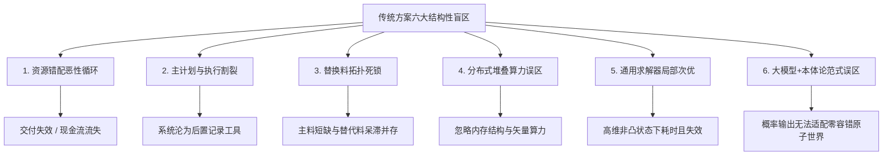
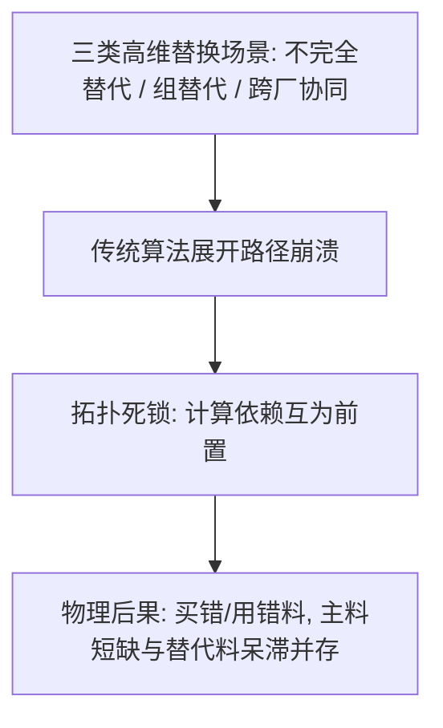
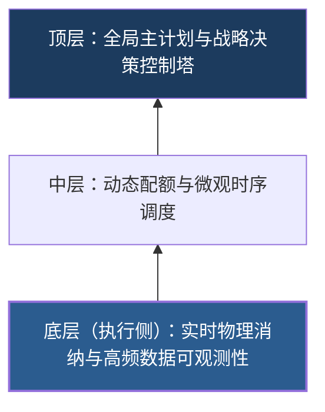
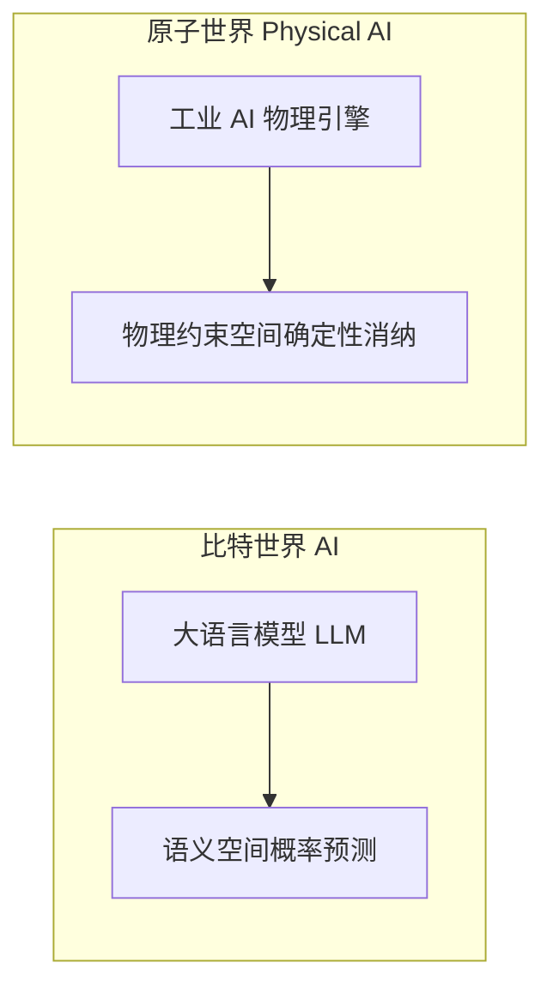

# 离散制造转型的迷途与破局：从六大方案盲区到“数据模型即业务”

> **作者**：孟凡淳（Grit Meng）  
> *前联想全球供应链计划体系总架构师、IPC 智能计划与控制引擎总架构师*  
> 🔗 **开源验证仓库**：[https://gritmeng.github.io/Value-Chain-Physics/](https://gritmeng.github.io/Value-Chain-Physics/)

---

> [!CAUTION]
> ### 工业界的深层现实
> 在当下的工业界，无论是千亿级制造巨头的 C-Level 决策者、咨询公司的行业专家，还是传统软件厂商与学术界，都在承受着极其沉重的商业与物理阵痛：**规模不经济、计划算不准、交期频繁违约、库存巨额积压、排产与车间物理执行彻底脱节**。
> 
> 如果剥离营销话术，回到真实物理车间的运行现场，就会发现一个深层现状：**整个行业在方案设计与方法论层面上，存在着结构性的全盘走偏。**

---

### 🌐 全息结构总览
本文从五个相互咬合的维度，完成对离散制造转型困局的全息透视：**诊断、重构、协同、实施、终局**，五者层层咬合，构成一个自洽的变革逻辑闭环。


---

## 一、 方案层面的六大结构性盲区

远离生产战场的软件厂商与咨询机构，往往低估了物理车间的复杂性。其方案设计存在六个无法回避的深层问题：



### 1. 资源错配的恶性循环与规模不经济
* **物理本质**：计划的物理本质是**预占资源**。一旦算法无法在毫秒级实时匹配多维硬约束，就会引发连锁式的资源错配。
* **连锁破坏**：资源错配首先削弱了生产资源的有效利用率；更深层的危害在于导致交付承诺频繁失效，直接侵蚀企业的市场份额与现金流。
* **人工代偿局限**：为了掩盖计算能力的不足，企业被迫依赖人工“手动作业绑关系”。然而，人工注意力无法覆盖高维动态的级联反应，偏差随时间呈指数级放大，在逻辑上无法收敛。

### 2. 执行计划与主计划的割裂（两张皮）
宏观主计划无法感知车间工装、人员与设备故障的实时硬约束；车间排产又无法穿透上游供应链。这种割裂导致排产方案进入现场后极短时间内失效，计划与执行沦为“两张皮”，系统变成后置记录工具，车间被迫沦为“消防队”。

### 3. 替换料复杂场景的拓扑死锁与算法溃败
在复杂离散制造的真实现场，物料替换绝非简单的“以单料 A 替换单料 B”。制造现场每天都在上演深层网状的三类高维替换难题：



* **场景一：不完全替代（Partial/Capped Substitution）**  
  如“A 可被 B 替代，但 B 只能承担 50% 需求”、“带最小配额保护的阶梯替换”或“高优先级订单的底线配额锁定”。传统系统的单向展开算法无法表达比例与配额硬约束，极易引发高优先级订单被低优先级订单“抽干”的恶性穿透。
* **场景二：组替代（Group Sourcing / Multi-Material Substitution）**  
  现场常见“[主料 A + 辅料 B] 必须作为一个整体组，被 [替代料 C + 替代料 D] 进行整体联动替换”。传统系统缺乏“组”维度的原子级逻辑，将组拆解为单料后计算，导致部分物料被替换、部分未替换的“半齐套陷阱”。
* **场景三：跨工厂 / 跨库房协同抽调（Cross-Plant Group Sourcing & Supply）**  
  当本厂主料短缺时，需要跨工厂、跨库房抽调多库房的组替代料与产能。由于各工厂 MRP 独立运行、时空无法确权，导致多厂间互锁资源、重复占用。

💡 **概念降维（拓扑死锁）**：当“主料”、“组替代料”与“跨厂资源”在计算依赖链条中互为前置条件时，传统算法将陷入无限等待与逻辑死循环（即拓扑死锁）。  
💥 **物理后果**：传统计划系统在处理此类高维依赖时完全溃败，被迫退回到人工手动作业，最终在制造现场造成“买错料、用错料”以及**“主料短缺与替代料巨额呆滞并存”**的资金虚耗。

### 4. 算力瓶颈与数据结构缺陷
主流软件厂商普遍忽略了一个根本事实：**计划算法的算力瓶颈在于底层内存数据结构的设计与 CPU 矢量化运力。** 试图通过“分布式集群”去简单叠加算力、解决非线性强耦合问题，在计算理论上存在方向性偏差。

### 5. 运筹学求解器（Solver）的局限
许多方案寄希望于通用运筹学求解器（如 Cplex、Gurobi）。但在复杂离散制造的状态空间中，面对高维非凸硬约束，求解器不仅计算耗时高，且容易陷入局部次优解，无法满足毫秒级动态消纳的需求。

> [!NOTE]
> 🔬 **【底层科学定理支撑】**  
> * **非独立同分布理论（Non-IID Learning Theory）**：曹龙兵教授的形式化研究证明，当数据不满足独立同分布假设时，所有基于统计学习或独立采样的求解策略，在数学上都失去了泛化保障。离散制造的物料耦合网络是一个极端的 Non-IID 系统——每一颗物料的供需变化都会级联影响全局。通用求解器的底层数学假设在这个相空间里不成立，因此必然产生奇异性退化。

### 6. “大模型 + 本体论”的范式误区
当前部分方案试图使用大语言模型（LLM）配合知识图谱/本体论进行计划排产。大语言模型的**概率预测**特性，难以直接应用于零容错的**物理原子世界**。

> [!NOTE]
> 🔬 **【底层科学定理支撑】**  
> * **非独立同分布理论（Non-IID Learning Theory）**：大语言模型的泛化能力建立在训练数据满足独立同分布假设的前提之上。但离散制造的价值链是一个极端的 Non-IID 系统——需求、产能、库存、交期之间的耦合关系无法被拆解为独立采样。在此类系统中，基于概率的预测必然输出“幻觉”式的关联推断，而非物理上可行的排产方案。将 LLM 引入计划排产，不是在用 AI 优化决策，而是在用数学上已失效的工具去求解零容错的物理问题。

---

## 二、 方法论的重构：数据模型与算法本身，就是业务方案

过去数十年间，许多数字化转型方案收效甚微，根源在于行业存在一个深层认知偏差：**假定先由业务部门或咨询机构绘制静态的“流程图方案”，再交由 IT 团队进行“代码落地”。**

在复杂离散制造这种高维非线性系统中，静态的流程图根本无法表达动态变化的物理约束。


### 1. 跨部门统驭（Orchestration）的物理必然
离散制造的价值链涵盖研发、销售营销、采购、生产、仓储、物流、质量等七大核心部门。跨部门协同的物理本质必须是**统驭（Orchestration）**。
如果缺乏在同一底座上的刚性统驭，各部门只能被动追求各自的局部 KPI 最大化（如采购追求批次采购成本最低、仓储追求周转率、生产追求产线利用率）。**这种局部最优的叠加，在物理学上必然引发矢量相互抵消（内耗），直接导致企业整体出现“规模不经济”与 ROIC 坍塌。**

> [!NOTE]
> 🔬 **【底层科学定理支撑】**  
> * **阿什比必要多样性控制律（Ashby's Law of Requisite Variety）**：控制系统的多样性必须大于或等于被控对象的多样性。若缺乏跨七大部门的统一相空间统驭，系统便失去应对复杂度的控制力。  
> * **热力学第二定律（孤立系统熵增）**：局部未受统一规训的独立博弈，必然导致整个复杂系统向混乱度最大化（熵增与矢量抵消）演化。

> [!IMPORTANT]
> ### 💥【核心公理：数据模型即业务方案】
> **真实的业务方案从来不是纸上的流程图，数据模型与核心算法本身，就是业务方案。**
> 
> 传统的上层业务流程，只是底层数据模型与算法在物理世界演化出的“涌现”现象。如果不具备底层数据模型与算法的自洽可计算性，上层业务方案根本出不来，IT 系统也绝对无法自洽落地。

---

## 三、 复杂性与人机协同：人在环外的系统论必然

当供应链网络节点增加，状态空间从 $N^2$ 级激增至 $O(N!)$（阶乘级）复杂度时，依靠单体碳基人脑经验进行全局调度已彻底超出物理极限。系统必须转向基于规则与约束（Constraint-Based）的**人机协同与规基消纳**。

由此可以推导出系统论中的关键结论：**在实时消纳闭环中，人必须在环外（Human-out-of-the-Loop）。**

```mermaid
flowchart LR
    subgraph 传统人在环内 [传统模式：人在环内 (Human-in-the-Loop)]
        A[订单/波动] --> B[部门博弈]
        B --> C[纳什均衡陷阱]
        C --> D[矢量抵消 / ROIC 损耗]
    end
    
    subgraph 物理抗熵人在环外 [新范式：人在环外 (Human-out-of-the-Loop)]
        E[订单/波动] --> F[刚性算力消纳]
        F --> G[毫秒级确定性输出]
        G --> H[人退居高阶规则与边界定义]
    end
```

> [!TIP]
> ### 💡 为什么实时决策不能让人在“环内”？
> * **纳什均衡陷阱**：若将人工干预保留在实时决策闭环内部，不同部门基于局部利益的博弈将不可避免地陷入“纳什均衡陷阱”。各部门局部最优解的矢量抵消，会导致企业全局 ROIC（资本回报率）难以提升，系统重新坠入混乱与熵增状态。
> * **人在环外的本质**：“人在环外”并非排除人的决策价值，而是将毫秒级的高频刚性计算交由算法完成，让人退至高阶的规则制定、边界定义与异常应对层。唯有依靠算法在毫秒级完成多维硬约束的确定性消纳，才能消除部门间博弈带来的系统阻抗。

> [!NOTE]
> 🔬 **【底层科学定理支撑】**  
> * **香农信息负熵原理（Shannon's Negative Entropy）**：通过毫秒级算法消纳去除业务不确定性，将负熵持续注入复杂系统，才是维持系统有序演化的唯一物理途径。

---

## 四、 一元设计机制与逆向建设路径

要实现高可靠的刚性闭环，企业的组织形态与建设路径需要进行针对性重构：

### 1. 建立“一元设计机制”
复杂系统的全局收敛方案，难以通过委员会协商或投票妥协产生。

有效的机制在于：**各业务部门向系统提供自由的物理输入与约束；由兼具“业务、数据、架构”三位一体能力的总设计师，完成从混沌约束到稳定结构的映射，构建出全局收敛的系统架构。**

> [!NOTE]
> 🔬 **【底层科学定理支撑】**  
> * **阿罗不可能定理（Arrow's Impossibility Theorem）**：在非同质偏好下，通过多方投票或协商无法产生全局最优解。复杂系统的全局收敛必须依靠一元架构意志完成拓扑映射。

### 2. 践行“不可观测即不可控制”的逆向建设路径
数字化系统的建设路径，应当从离物理执行最近的底层向上推进：



* **底层（执行侧）**：先解决最底层的实时物理消纳与高频数据可观测性；
* **中层与顶层**：基于底层的真实数据与消纳能力，向上构建执行计划、主计划（MPS）与战略决策控制塔（S&OP）。

> [!WARNING]
> 如果脱离底层物理消纳，仅从顶层宏观大屏往下建设，由于底部不可观测，系统将缺乏真实数据支撑，注定成为昂贵而滞后的“空中楼阁”。

### 3. 上线后的主动运维与物理升维
系统上线后并非一劳永逸。面对外部世界的持续扰动与复杂演化，必须建立**基于哥德尔不完备定理与图灵停机界限的主动运维刚性闭环机制**，使系统具备持续的自我进化与动态抗熵能力。

> [!NOTE]
> 🔬 **【底层科学定理支撑】**  
> * **哥德尔不完备定理（Gödel's Incompleteness Theorems）**：任何足够复杂的形式化公理系统，必然存在其内部无法被证明或推翻的命题。系统上线时的规则集，必然会在未来某个时刻遇到它无法处理的死锁奇点。主动运维的本质，就是在死锁发生时跳出原有公理系统，重写规则。  
> * **图灵停机问题（Halting Problem）**：不存在一个通用算法可以预先判定任意程序是否会在有限时间内停机。映射到供应链系统上，即无法提前预知系统会在什么场景下陷入无限循环或逻辑死锁。持续监控与刚性干预机制，是应对这一数学不可能性的唯一物理手段。

---

## 五、 结论：物理实证与科学定理支撑

当我们把方案盲区、数据模型本质、人在环外以及逆向路径彻底打通时，离散制造的管理便从依赖个人经验、师徒传承的传统模式，转向具备严密逻辑的系统科学。

读者应当明确：上述我们用业务语言阐述的所有结论与方法，**绝非某种主观经验试错，而是早已被严密推导并证明过的科学定理与物理法则**。

> 💥 **旧范式的失败，不是某一款软件的失败，不是某一个团队的无能。它是哥德尔不完备性、图灵停机限界与计算不可约性这“三把刀”在物理世界中的必然投影。新范式的任务，不是优化旧系统，而是承认这些数学边界，重新构建能与之共存的控制母体。**

我们在 IPC 智能计划引擎中实现的一系列硬核指标——**在一台标准计算设备上完成 50万订单、200万物料、100.85毫秒 的瞬时消纳**——**正是我们在 18 年联想 IPS 全局供应链千亿级真实物理战场的死磕中，找到的坚实突破口与验证结果！**

它向整个工业界证明：**只要沿着这套“数据模型即业务”的底座逻辑与代际跃迁路径去构建系统，任何离散制造企业都能够彻底击穿复杂度的深渊，取得相同的算力突破与交付确定性！**

它同时为 Physical AI（物理 AI）确立了物理世界的底层规训：



> [!IMPORTANT]
> ### 💥【Physical AI 工业宪法】
> **物理 AI 的工业终局，并非在比特世界里生成概率性文本，而是在原子物理世界中，依靠严密自洽的数据模型与算力，实现对物理资源的确定性刚性消纳。**

上述这一切，**早已不再是任何个人或厂商的私有经验，而是不可动摇的物理定律与科学法则！**

---

### 👨‍💻 作者简介
**孟凡淳（Grit Meng）**  
前联想全局供应链计划体系总架构师，《价值链物理学》《全息抗熵》发现者，IPC 智能计划与控制引擎总架构师。  
🌐 **GitHub 开源验证仓库**：[https://gritmeng.github.io/Value-Chain-Physics/](https://gritmeng.github.io/Value-Chain-Physics/)
