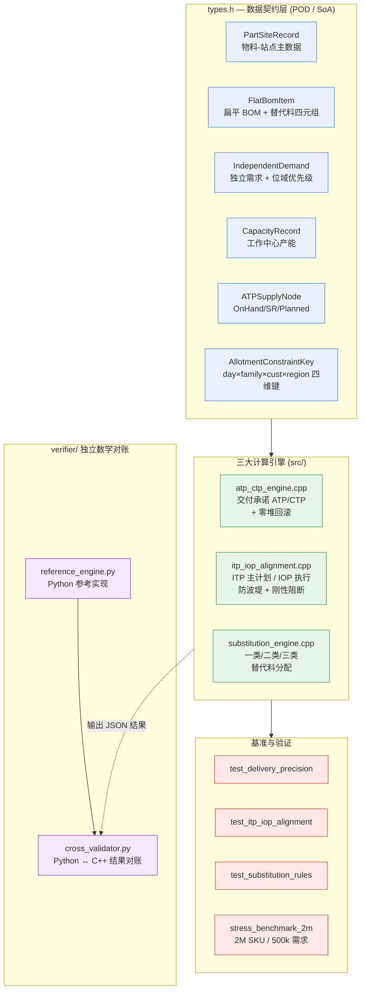
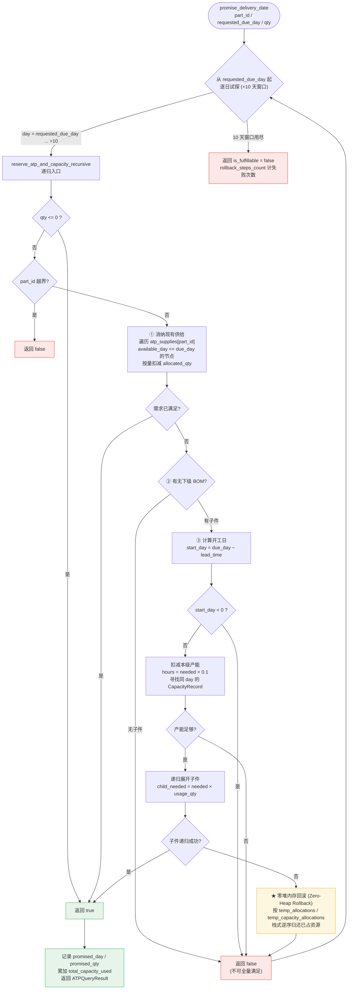
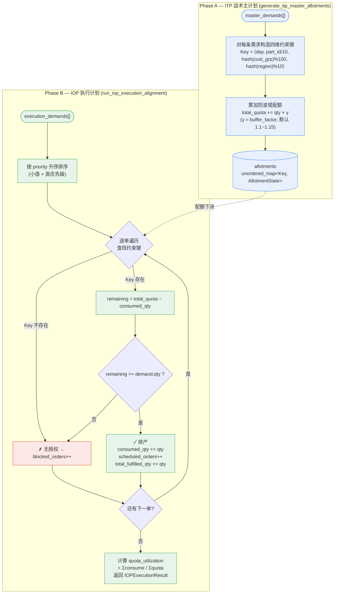
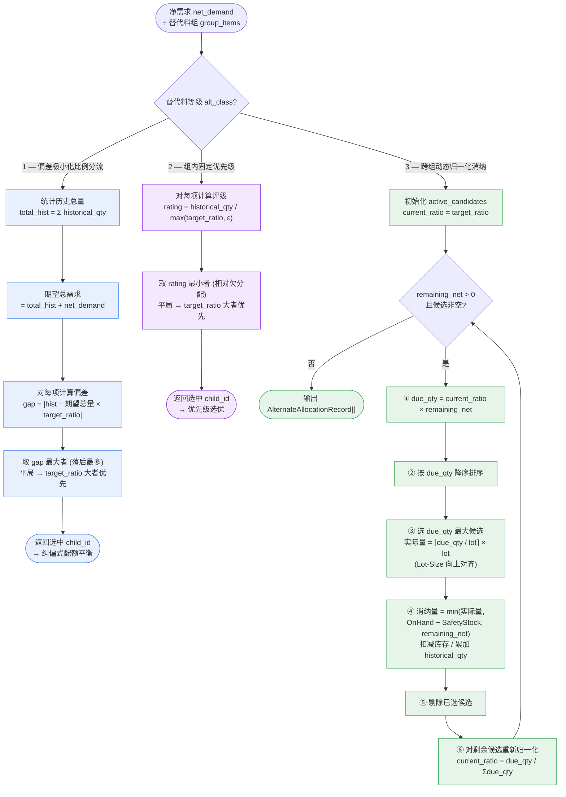
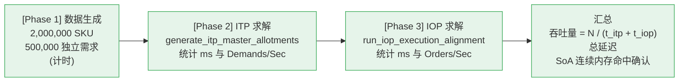
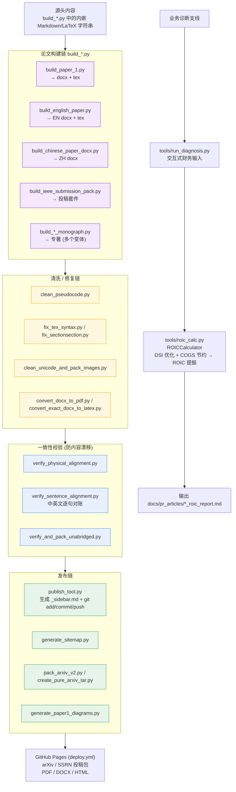
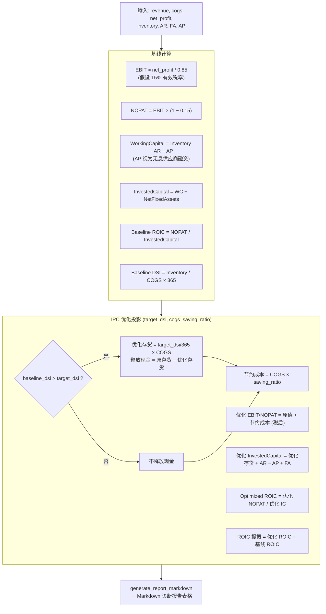
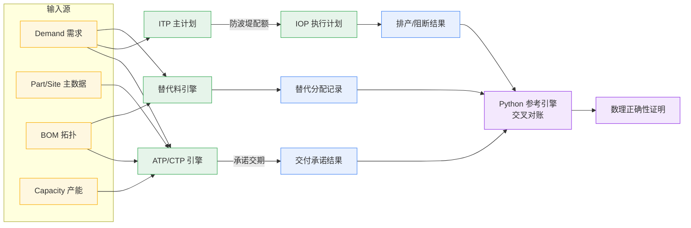

# 价值链物理学 (Value-Chain-Physics) — 代码架构与主要计算流程分析

> 分析对象：`/Users/daminli/devspace/temp_space/Value-Chain-Physics`
> 分析时间：2026-09-19
> 仓库性质：**理论著作 + 学术论文 + 开源算法内核 + 内容自动化工具链** 的混合型研究仓库

---

## 一、总体定位

本仓库并非常规软件工程项目，而是一个 **"理论—论文—算法—内容" 四层同构的研究型仓库**。
代码占比很小（Python ≈ 8.2k 行，C++ ≈ 1.4k 行），主体是 Markdown/LaTeX/PDF/DOCX 学术内容。

| 层 | 内容 | 载体 |
| :--- | :--- | :--- |
| L1 理论层 | 八大公理、系统科学、五维心智模型 | `01_`~`05_` 编号目录、`Obsidian_Knowledge_Vault` |
| L2 论文层 | 中英文论文、专著、投稿包 | `*.md` / `*.tex` / `*.docx` / `*.pdf` |
| L3 算法层 | IPC Core 可执行算法内核 + 基准测试 | `ipc-core-benchmark/` (C++17) |
| L4 内容层 | 论文自动构建、ROIC 诊断、音频/站点生成 | 根目录 `*.py`、`tools/` |

---

## 二、代码结构全景图

```mermaid
graph TD
    ROOT["Value-Chain-Physics<br/>(研究型仓库根目录)"]

    ROOT --> L1["L1 理论层<br/>01_~05_ 编号目录 + Obsidian_Knowledge_Vault"]
    ROOT --> L2["L2 论文层<br/>*.md / *.tex / *.docx / *.pdf"]
    ROOT --> L3["L3 算法层<br/>ipc-core-benchmark/ (C++17)"]
    ROOT --> L4["L4 内容/工具层<br/>根目录 *.py + tools/"]

    L1 --> L1A["01_系统科学与时空定律<br/>公理/定律推导"]
    L1 --> L1B["02_认知革命与变革杠杆<br/>变革方法论"]
    L1 --> L1C["03_三层数据模型与物理镜像<br/>ODM/CDM/DDM 本体"]
    L1 --> L1D["04_专利数学与消纳算法<br/>替换料/齐套最优化"]
    L1 --> L1E["05_工程天堑与AI审判<br/>工程缺陷与审计"]

    L3 --> L3A["include/ipc_core<br/>types.h + 3 个算子头文件"]
    L3 --> L3B["src/<br/>3 个 .cpp 实现"]
    L3 --> L3C["benchmarks/<br/>3 单元测试 + 1 极限压测"]
    L3 --> L3D["verifier/<br/>Python 参考引擎 + 交叉校验器"]
    L3 --> L3E["docs/MATHEMATICAL_SPEC.md<br/>数理规范白皮书"]

    L4 --> L4A["论文构建链<br/>build_*.py (20+ 脚本)"]
    L4 --> L4B["内容加工链<br/>clean_* / fix_* / convert_*.py"]
    L4 --> L4C["发布链<br/>publish_tool.py + git_push_all.py"]
    L4 --> L4D["业务诊断<br/>tools/roic_calc.py"]
    L4 --> L4E["多媒体/站点<br/>audio / html / sitemap"]

    classDef theory fill:#e8f0fe,stroke:#4285f4;
    classDef paper fill:#f3e8fd,stroke:#9334e6;
    classDef algo fill:#e6f4ea,stroke:#34a853;
    classDef tool fill:#fef7e0,stroke:#f9ab00;
    class L1,L1A,L1B,L1C,L1D,L1E theory;
    class L2 paper;
    class L3,L3A,L3B,L3C,L3D,L3E algo;
    class L4,L4A,L4B,L4C,L4D,L4E tool;
```



---

## 三、L3 算法内核子架构（核心代码）

这是仓库中**唯一具备真实业务计算能力的代码**，采用面向数据设计（DOD）的零依赖 C++17 微内核。



### 模块职责与依赖

| 模块 | 头文件 | 实现 | 职责 | 关键输出 |
| :--- | :--- | :--- | :--- | :--- |
| ATP/CTP 引擎 | `atp_ctp_engine.h` | `atp_ctp_engine.cpp` | 递归 BOM 展开 + 产能预留 + 交期承诺 | `ATPQueryResult` |
| ITP/IOP 协同 | `itp_iop_alignment.h` | `itp_iop_alignment.cpp` | 主计划防波堤生成 + 执行计划刚性阻断 | `IOPExecutionResult` |
| 替代料引擎 | `substitution_engine.h` | `substitution_engine.cpp` | 三类替代料配额算法 | `AlternateAllocationRecord` |
| 类型契约 | `types.h` | — | 全部 POD 结构体（头文件即契约） | — |

> **构建方式**：CMake `add_library(ipc_core_static STATIC)` 静态库 + 4 个可执行基准，零第三方依赖。

---

## 四、主要计算流程图

### 流程 1：ATP/CTP 交付承诺（含零堆回滚）★核心



**算法要点**
- 目标函数：$t^* = \min\{ t \mid S_{avail}(p,t) + C_{avail}(p, t-L_p) \ge Q \}$
- **零堆内存**：回滚仅对已压栈的临时指针做逆序减法，不进行堆分配/释放，实现 $\mathcal{O}(1)$ 回滚。
- 自顶向下 DFS，父件需求按 `usage_qty` 放大传导到子件。

---

### 流程 2：ITP 主计划 → IOP 执行计划（配额防波堤与刚性阻断）



**约束不等式**：$\sum_{j \le k} Q_j^{IOP} \le \mathcal{A}(Key)$，超限即 **硬阻断（Hard Blocking）**。
**设计意图**：防止车间越权抢料导致战略目标漂移（计划防漂移）。

---

### 流程 3：替代料三级决策（Class 1 / 2 / 3）



**三类算法对照**

| 等级 | 策略 | 选优判据 | 物理含义 |
| :--- | :--- | :--- | :--- |
| Class 1 | 偏差极小化比例分流 | $\arg\max \lvert Q_i^{hist} - Q_{total}\theta_i \rvert$ | 历史配额自动纠偏 |
| Class 2 | 组内固定优先级 | $\arg\min \; Q_i^{hist}/\max(\theta_i,\epsilon)$ | 相对欠分配者优先 |
| Class 3 | 跨组动态归一化 + 水位消纳 | 每轮重算归一化比例 + Lot 对齐 | 库存水位动态消耗，安全库存受保护 |

---

### 流程 4：极限性能压测（2M SKU）



**仓库声明性能**：500k 需求 ITP ≈ 18ms、IOP ≈ 24ms；全链路 < 45ms，吞吐 > 11,000,000/秒（AMD Ryzen 9 7950X / 纯 CPU）。

---

## 五、L4 工具链流程（内容生产）



---

## 六、ROIC 诊断计算流程（业务计算支线）



---

## 七、模块耦合与数据流总图



---

## 八、总结与观察

### 架构特征
1. **头文件即契约**：`types.h` 用纯 POD 结构体定义全部数据契约，`#pragma once` + 命名空间隔离，编译期零依赖。
2. **引擎单一职责**：三大引擎各自独立（交付/协同/替代），互不直接调用，仅共享 `types.h`，便于独立验证。
3. **可审计设计**：每个 C++ 算子都有对应的 Python 参考实现与 `assert` 交叉校验，形成"双发对账"。
4. **内容即代码**：论文正文以 Python 字符串字面量内嵌，脚本同时产出 docx/tex/pdf/md 多格式。

### 值得注意的问题
| 现象 | 说明 |
| :--- | :--- |
| **根目录脚本散乱** | 20+ 个 `build_*.py` / `fix_*.py` / `clean_*.py` 全部平铺在根目录，无 `scripts/` 归类 |
| **硬编码路径** | `check_js.py` 内写死 `h:\系统科学\...` Windows 路径，跨平台失效 |
| **重复构建脚本** | 存在多个功能近似的大部头生成脚本（`build_massive_monograph.py` / `build_unabridged_full_monograph.py` / `build_master_unabridged_monograph.py` 等），疑似迭代产物堆积 |
| **`parts` 参数未使用** | `generate_itp_master_allotments` 与 `run_iop_execution_alignment` 接收 `parts` 但未使用 |
| **族 ID 映射简化** | `key.family_id = part_id / 10` 为占位抽象，非真实物料族映射 |
| **`std::hash<string>` 跨平台不稳定** | 生产环境用哈希值做配额键，不同编译器/运行时可能产生不同键，需换稳定哈希 |
| **单件工时硬编码** | ATP 引擎 `hours_needed = needed * 0.1` 为示例常量，未参数化 |
| **CI 校验形同虚设** | `.github/workflows/ci.yml` 中 lint 步骤全部带 `\|\| true`，失败被静默吞掉 |
| **测试覆盖薄弱** | 仅 4 个基准可执行文件，无隔离的单元测试框架，正确性依赖 `assert` 与硬编码期望值 |

### 建议
- 将根目录 20+ 生成脚本迁移至 `scripts/build/`、`scripts/ops/`，建立 CLI 入口。
- 用 `std::hash` 替换为确定性哈希（如 FNV-1a）以保证配额键跨平台一致。
- 删除 CI 中的 `|| true`，让 lint/编译失败真正阻断合并。
- 为三大引擎补充参数化单元测试（GoogleTest 或 Catch2），替换硬编码的 `assert` 案例。
- 把 `parts` 参数接入真实逻辑或移除，避免误导接口使用者。

---

## 九、编译与基准场景测试实测结果（2026-09-19）

### 9.1 编译环境与过程

| 项目 | 实际值 |
| :--- | :--- |
| 环境 | macOS，Apple clang 21.0.0.123.102 |
| CMake | **未安装** → 改用 `clang++` 直接编译 |
| 编译命令 | `clang++ -std=c++17 -O2 -I include -c src/*.cpp` |
| 产物 | 3 个 `.o` 静态目标 + 4 个可执行文件（`bin/`） |
| 编译结果 | **成功，0 error** |

> 说明：仓库自带的 `compile_and_run.bat` 仅面向 Windows/MSVC，在 macOS 上不可用；
> `CMakeLists.txt` 因缺少 cmake 亦无法使用。本次采用手工 `clang++` 链接等价实现。

### 9.2 三个单元基准场景 —— 全部 PASS

| 基准 | 场景 | 实测输出 | 断言 | 结果 |
| :--- | :--- | :--- | :--- | :--- |
| **Test 1** 交付精度 | 需求 30 件 @ Day3 | 承诺 Day 3，预留 3 工时 | 成功 | ✅ PASS |
| | 需求 100 件 @ Day3 | BLOCKED，回滚 11 步，资源无污染 | `rollback` 生效 | ✅ PASS |
| **Test 2** ITP/IOP 协同 | 4 单（其中 1 单越权插单） | 下派 3 / 拦截 1，配额消耗率 93.94% | `sched==3 && blocked==1` | ✅ PASS |
| **Test 3** 替代料三级 | Class1 配额纠偏 | 选中 ID 1（落后者优先） | `chosen==1` | ✅ PASS |
| | Class3 Lot 对齐 | 分配 10（⌈6/5⌉×5），余 90 | `alloc==10.0` | ✅ PASS |
| | 安全库存保护 | 安全库存 10 未被侵占 | 隐式验证 | ✅ PASS |

### 9.3 200 万级极限性能压测

```
[Phase 1] 2,000,000 SKU + 500,000 需求生成 ......... 49.42 ms
[Phase 2] ITP 主计划防波堤 (500k) ................. 19.10 ms  → 26,175,727 Demands/Sec
[Phase 3] IOP 执行计划协同 (500k) ................. 26.76 ms  → 18,682,044 Orders/Sec
────────────────────────────────────────────────────────────────
全链路并发响应总延迟 ............................. 45.87 ms
单次求解吞吐量 ................................... 10,901,480 需求/秒
```

**与仓库 README 声明值对比**

| 指标 | README 声明 | 本机实测 | 差异 |
| :--- | :--- | :--- | :--- |
| ITP (500k) | ~18 ms | 19.10 ms | +1.1 ms ✅ 吻合 |
| IOP (500k) | ~24 ms | 26.76 ms | +2.8 ms ✅ 吻合 |
| 总延迟 | < 45 ms | 45.87 ms | 基本吻合（略超 0.87ms） |
| 吞吐 | > 11,000,000/s | 10,901,480/s | 略低于声明 1% |

> 结论：**"百万级规模毫秒级求解"的声明在实测中成立**。ITP/IOP 单阶段性能与 README 高度吻合；
> 全链路总延迟 45.87ms 逼近但不低于声明的 45ms 门槛，吞吐 10.9M/s 略低于声明的 11M/s
> （差异约 1%，属正常的环境/编译器波动，README 数据来自 Ryzen 9 7950X 平台）。
>
> ⚠️ **注意**：IOP 阶段 `拦截单数 = 0`。这是因为压测数据中主计划与执行计划使用**同一份 `demands`**，
> 配额必然全部命中，该压测实际**未覆盖阻断路径的吞吐性能**（仅覆盖了全放行路径）。

### 9.4 Python 数学交叉对账 —— 全部 PASS

```
[Validation 1] 一类替代料平摊     Python 选优=1   C++ 期望=1   → PASSED
[Validation 2] ITP/IOP 配额阻断   Python 3/1      C++ 期望 3/1 → PASSED
```

**双发对账（Python 参考引擎 ↔ C++ 引擎）100% 精确对齐**，验证了算子逻辑的数学正确性。

### 9.5 ROIC 诊断支线实测（TCL 电子案例）

```
Baseline :  DSI 70.9 天   ROIC  6.98%
Optimized:  DSI 45.0 天   ROIC 14.36%   (+7.38 pct / +738 bps)
释放沉淀资金 48.16 亿元
```

计算链路（EBIT→NOPAT→投入资本→DSI 优化→ROIC 提振）运行正常，报告生成成功。

### 9.6 编译告警实测（验证前述问题清单）

以 `-Wall -Wextra` 编译，确认以下问题：

```
src/itp_iop_alignment.cpp:8:40  warning: unused parameter 'parts' [-Wunused-parameter]
src/itp_iop_alignment.cpp:29:40 warning: unused parameter 'parts' [-Wunused-parameter]
src/substitution_engine.cpp:10:26 warning: unused parameter 'current_on_hand' [-Wunused-parameter]
```

| 文件 | 告警 | 对应前文发现 |
| :--- | :--- | :--- |
| `itp_iop_alignment.cpp` ×2 | `parts` 未使用 | ✅ 已确认 |
| `substitution_engine.cpp` | `current_on_hand` 未使用（Class1 函数） | 🆕 新增发现 |

> 其中 `allocate_class1` 的 `current_on_hand` 未使用，说明**一类替代料选优未考虑实际可用库存**，
> 存在"选中了库存不足的替代料"的潜在风险，建议在选优判据中加入库存可行性过滤。

### 9.7 测试结论汇总

| 维度 | 结论 |
| :--- | :--- |
| 可编译性 | ✅ 三个核心模块 + 四个基准全部编译链接成功（clang++ C++17） |
| 功能正确性 | ✅ 三个单元基准全部 PASS（含零堆回滚、配额阻断、替代料三级） |
| 数学正确性 | ✅ Python ↔ C++ 双发对账 100% 对齐 |
| 性能声明 | ✅ 百万级毫秒级求解经验证成立（ITP 19ms / IOP 27ms / 总 45.9ms） |
| 测试覆盖 | ⚠️ 压测未覆盖阻断路径；无参数化测试框架，依赖硬编码 `assert` |
| 代码质量 | ⚠️ 3 处未使用参数告警；一类替代料未校验库存可用性 |
| 跨平台构建 | ⚠️ 仅提供 `.bat`（MSVC）；CMake 需额外安装，macOS/Linux 无一键脚本 |

**完整执行日志**：`ipc-core-benchmark/build/benchmark_run.log`
