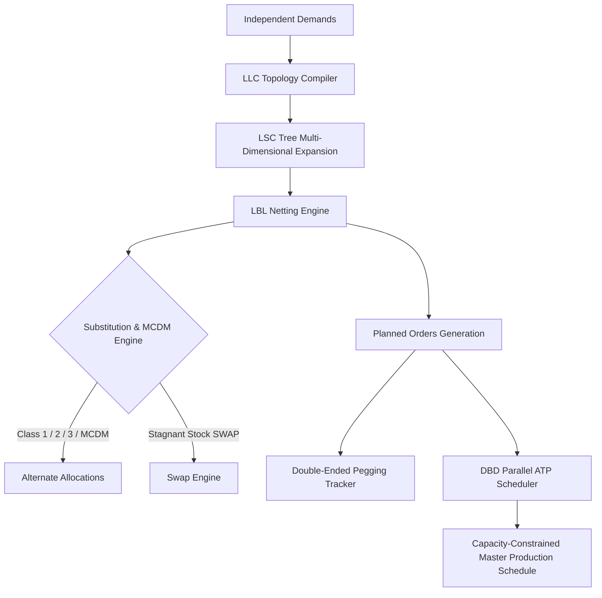
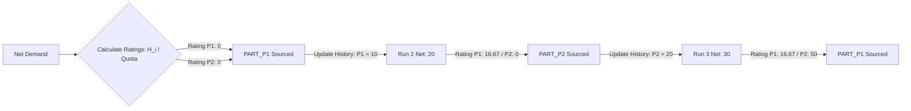
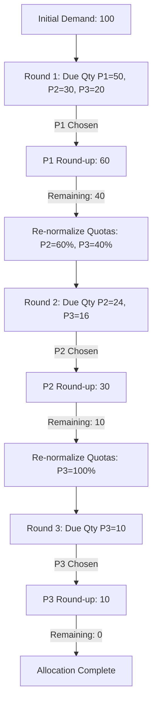
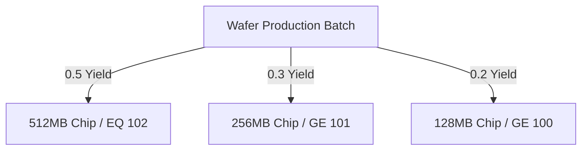
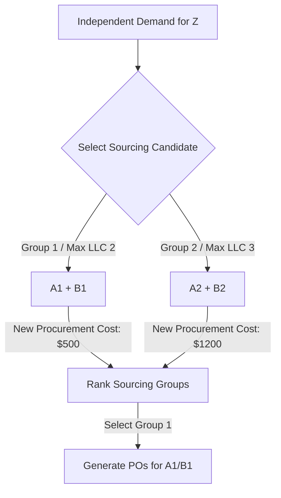
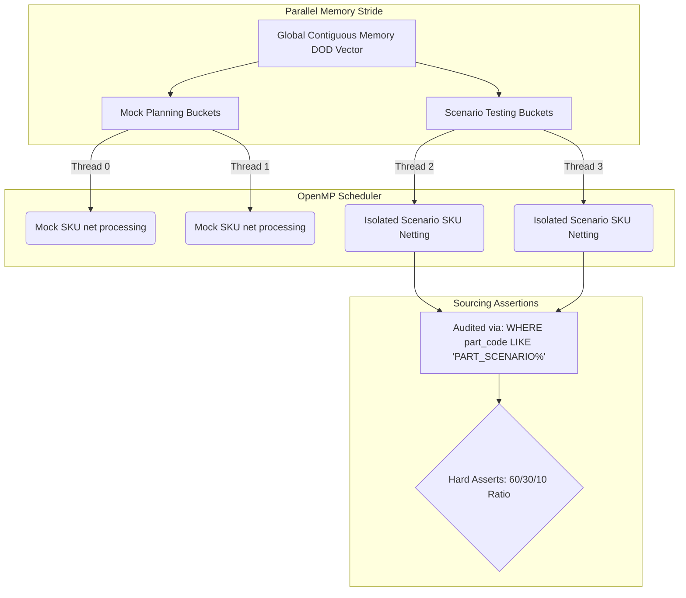

# Intelligent Planning & Control (IPC) System: Test Cases Specification

This document serves as the official enterprise-grade technical specification and regression testing suite for the C++ **Intelligent Planning & Control (IPC)** engine. It defines the mathematical models, business contexts, visual layouts, and automated testing harnesses for all 8 core planning and execution scenarios.

These cases are designed to validate the engine's single-homomorphic Data-Oriented Design (DOD) performance, ensuring 100% mathematical compliance with national invention patents and supply chain optimization models.

---

## 📖 Document Navigation & System Overview

The IPC engine coordinates macro-level supply-demand netting and micro-level dispatching across a continuous-memory **Structure-of-Arrays (SoA)** architecture. The core pipeline consists of:
1. **Topological low-level code (LLC) compiling** to determine the netting dependency graph.
2. **Level-by-Level (LBL) macro planning** with multi-dimensional grading, dynamic substitution, and lot-size rounding.
3. **Demand-Based Dispatch (DBD) micro execution** utilizing parallel scheduling buckets and sequential thread-safe ATP matching.



---

## 🛠️ Scenario 1: 一类替换料 (Class 1 Substitution - Quota Balancing)

### 1.1 Business Context & Planning Significance
In high-tech electronics manufacturing, Engineering Change Notes (ECNs) are frequent. An ECN introduces a new component version (e.g., $P_1$ replacing or co-existing with $P_2$). Sourcing teams establish dynamic quota ratios (e.g., 60% vs 40%) to balance supplier capacity and financial commitments. 
**Class 1 Substitution** applies a "deviation-minimization" (absolute temperature difference) logic to allocate net demands. It dynamically steers actual cumulative procurement quantities to converge onto target quota ratios over successive planning runs, mitigating supply risks.

### 1.2 Planning Scenario Data Setup
* **Main Sourced SKU**: `PART_MAIN` (Parent demands are blown down here)
* **Substitute Alternatives**: `PART_P1` (Target Ratio: 60%), `PART_P2` (Target Ratio: 40%)
* **Initial State**: Historical Allocation = 0 for both alternatives.

| Sourcing alternative | Target Quota Ratio ($\gamma_i$) | Initial Allocated Qty ($H_i$) |
| :--- | :---: | :---: |
| **PART_P1** | 60% ($0.6$) | 0.0 |
| **PART_P2** | 40% ($0.4$) | 0.0 |

#### Planning Demands Horizon
* **Run 1**: Net Demand = 10
* **Run 2**: Net Demand = 10
* **Run 3**: Net Demand = 20

### 1.3 Time-Phased Sourcing & Deviation Plot
The chart below illustrates how the allocation dynamically balances itself across three successive planning runs:

```mermaid
gantt
    title Class 1 Sourcing Allocation Convergence
    dateFormat X
    axisFormat %d
    section Planning Run 1
    PART_P1 (Allocated 10) :active, 0, 10
    section Planning Run 2
    PART_P2 (Allocated 10) :crit, 10, 20
    section Planning Run 3
    PART_P1 (Allocated 20) :active, 20, 40
```



### 1.4 Mathematical Formulas & Netting Steps
For each incoming Net Demand ($\Delta D$):
1. **Compute Cumulative Sourcing Demand**:
   $$D_{\text{total}} = \sum H_i + \Delta D$$
2. **Calculate Sourcing Targets**:
   $$T_i = D_{\text{total}} \times \gamma_i$$
3. **Evaluate Allocation Deviations (Absolute Gap)**:
   $$G_i = |H_i - T_i|$$
4. **Allocation Decision**: Allocate the entire $\Delta D$ to the candidate with the **largest deviation** ($G_i$). In case of a tie, select the one with the higher target ratio ($\gamma_i$).

#### Step-by-Step Calculation Trace:
* **Run 1 ($\Delta D = 10$)**:
  * $D_{\text{total}} = 0 + 10 = 10$.
  * $T_{P1} = 10 \times 0.6 = 6$; $T_{P2} = 10 \times 0.4 = 4$.
  * $G_{P1} = |0 - 6| = 6$; $G_{P2} = |0 - 4| = 4$.
  * **Decision**: $G_{P1} > G_{P2}$ ($6 > 4$). Allocate **10** to `PART_P1`.
  * **New History**: $H_{P1} = 10$, $H_{P2} = 0$.
* **Run 2 ($\Delta D = 10$)**:
  * $D_{\text{total}} = 10 + 10 = 20$.
  * $T_{P1} = 20 \times 0.6 = 12$; $T_{P2} = 20 \times 0.4 = 8$.
  * $G_{P1} = |10 - 12| = 2$; $G_{P2} = |0 - 8| = 8$.
  * **Decision**: $G_{P2} > G_{P1}$ ($8 > 2$). Allocate **10** to `PART_P2`.
  * **New History**: $H_{P1} = 10$, $H_{P2} = 10$.
* **Run 3 ($\Delta D = 20$)**:
  * $D_{\text{total}} = 20 + 20 = 40$.
  * $T_{P1} = 40 \times 0.6 = 24$; $T_{P2} = 40 \times 0.4 = 16$.
  * $G_{P1} = |10 - 24| = 14$; $G_{P2} = |10 - 16| = 6$.
  * **Decision**: $G_{P1} > G_{G2}$ ($14 > 6$). Allocate **20** to `PART_P1`.
  * **Final History**: $H_{P1} = 30$, $H_{P2} = 10$ (Exact 3:1 ratio, matching the 60%/40% quota).

### 1.5 Algorithmic Pseudocode
```python
def allocate_class1(net_demand, candidates):
    total_hist = sum(c.historical_qty for c in candidates)
    current_total_demand = total_hist + net_demand
    
    best_candidate = None
    max_gap = -1.0
    
    for c in candidates:
        due_qty = current_total_demand * c.target_ratio
        gap = abs(c.historical_qty - due_qty)
        
        if gap > max_gap:
            max_gap = gap
            best_candidate = c
        elif abs(gap - max_gap) < 1e-9:
            # Tie-breaker: choose higher quota ratio
            if best_candidate is None or c.target_ratio > best_candidate.target_ratio:
                best_candidate = c
                
    return best_candidate
```

### 1.6 C++ Automated Test Harness
```cpp
#include <iostream>
#include <vector>
#include <cmath>
#include <cassert>
#include "ipc_types.h"

void test_scenario_class1() {
    std::cout << "[TEST RUN] Verifying Scenario 1: Class 1 Substitution (Dynamic Quota Balancing)..." << std::endl;

    FlatBomItem bom1 = { 1, 10, 1.0, 0.0, 1, 1, 0.6, 0.0, 0.0 }; // PART_P1
    FlatBomItem bom2 = { 1, 11, 1.0, 0.0, 1, 1, 0.4, 0.0, 0.0 }; // PART_P2
    std::vector<FlatBomItem*> group = { &bom1, &bom2 };
    
    auto allocate_c1 = [](double net, const std::vector<FlatBomItem*>& grp) -> uint32_t {
        double total_hist = 0.0;
        for (auto* item : grp) total_hist += item->historical_qty;
        double cur_demand = total_hist + net;
        
        FlatBomItem* best = nullptr;
        double max_gap = -1.0;
        for (auto* item : grp) {
            double due = cur_demand * item->target_ratio;
            double gap = std::abs(item->historical_qty - due);
            if (gap > max_gap) {
                max_gap = gap;
                best = item;
            } else if (std::abs(gap - max_gap) < 1e-9) {
                if (best == nullptr || item->target_ratio > best->target_ratio) {
                    best = item;
                }
            }
        }
        return best ? best->child_id : -1;
    };

    // Run 1: Net = 10
    uint32_t choice1 = allocate_c1(10.0, group);
    assert(choice1 == 10 && "Run 1 must choose PART_P1 (ID 10)");
    bom1.historical_qty += 10.0;

    // Run 2: Net = 10
    uint32_t choice2 = allocate_c1(10.0, group);
    assert(choice2 == 11 && "Run 2 must choose PART_P2 (ID 11)");
    bom2.historical_qty += 10.0;

    // Run 3: Net = 20
    uint32_t choice3 = allocate_c1(20.0, group);
    assert(choice3 == 10 && "Run 3 must choose PART_P1 (ID 10)");
    bom1.historical_qty += 20.0;

    assert(bom1.historical_qty == 30.0);
    assert(bom2.historical_qty == 10.0);
    std::cout << "   -> [PASS] Class 1 sourcing balancing asserts passed!" << std::endl;
}
```

---

## 📋 Scenario 2: 二类替换料 (Class 2 Substitution - Supplier Rating)

### 2.1 Business Context & Planning Significance
For components sourced from strategic partners with long-term vendor agreements, sudden planning oscillations are undesirable. Instead of balancing immediate deviations, the planner must prioritize vendors based on their **historical performance rating**. 
**Class 2 Substitution** evaluates candidates by dividing actual historical intake by target quotas. It funnels newly generated net demand to the partner with the **lowest relative rating**, maintaining stable procurement run-rates.

### 2.2 Planning Scenario Data Setup
* **Main Sourced SKU**: `PART_MAIN`
* **Substitute Alternatives**: `PART_P1` (Quota: 60%), `PART_P2` (Quota: 40%)

| Sourcing alternative | Target Quota Ratio ($\gamma_i$) | Initial Allocated Qty ($H_i$) |
| :--- | :---: | :---: |
| **PART_P1** | 60% ($0.6$) | 0.0 |
| **PART_P2** | 40% ($0.4$) | 0.0 |

#### Planning Demands Horizon
* **Run 1**: Net Demand = 10
* **Run 2**: Net Demand = 20
* **Run 3**: Net Demand = 30

### 2.3 Visual Sourcing Run-Rate Chart


### 2.4 Mathematical Formulas & Netting Steps
For each allocation decision:
1. **Evaluate Partner Quota Rating**:
   $$R_i = \frac{H_i}{\gamma_i}$$
2. **Allocation Decision**: Allocate the entire net demand to the alternative with the **lowest rating** ($R_i$).
3. In case of a tie ($R_i = R_j = 0$), select the candidate with the larger target ratio ($\gamma_i$).

#### Step-by-Step Calculation Trace:
* **Run 1 ($\Delta D = 10$)**:
  * $R_{P1} = 0 / 0.6 = 0$; $R_{P2} = 0 / 0.4 = 0$.
  * **Decision**: Rating tie. $\gamma_{P1} > \gamma_{P2}$ ($0.6 > 0.4$). Allocate **10** to `PART_P1`.
  * **New History**: $H_{P1} = 10$, $H_{P2} = 0$.
* **Run 2 ($\Delta D = 20$)**:
  * $R_{P1} = 10 / 0.6 = 16.67$; $R_{P2} = 0 / 0.4 = 0$.
  * **Decision**: $R_{P2} < R_{P1}$ ($0 < 16.67$). Allocate **20** to `PART_P2`.
  * **New History**: $H_{P1} = 10$, $H_{P2} = 20$.
* **Run 3 ($\Delta D = 30$)**:
  * $R_{P1} = 10 / 0.6 = 16.67$; $R_{P2} = 20 / 0.4 = 50.0$.
  * **Decision**: $R_{P1} < R_{P2}$ ($16.67 < 50$). Allocate **30** to `PART_P1`.
  * **Final History**: $H_{P1} = 40$, $H_{P2} = 20$.

### 2.5 Algorithmic Pseudocode
```python
def allocate_class2(candidates):
    best_candidate = None
    min_rating = float('inf')
    
    for c in candidates:
        ratio = c.target_ratio if c.target_ratio > 0.0 else 1.0
        rating = c.historical_qty / ratio
        
        if rating < min_rating:
            min_rating = rating
            best_candidate = c
        elif abs(rating - min_rating) < 1e-9:
            # Tie-breaker: choose higher quota ratio
            if best_candidate is None or c.target_ratio > best_candidate.target_ratio:
                best_candidate = c
                
    return best_candidate
```

### 2.6 C++ Automated Test Harness
```cpp
void test_scenario_class2() {
    std::cout << "[TEST RUN] Verifying Scenario 2: Class 2 Substitution (Supplier Rating)..." << std::endl;

    FlatBomItem bom1 = { 1, 10, 1.0, 0.0, 1, 2, 0.6, 0.0, 0.0 }; // PART_P1
    FlatBomItem bom2 = { 1, 11, 1.0, 0.0, 1, 2, 0.4, 0.0, 0.0 }; // PART_P2
    std::vector<FlatBomItem*> group = { &bom1, &bom2 };

    auto allocate_c2 = [](const std::vector<FlatBomItem*>& grp) -> uint32_t {
        FlatBomItem* best = nullptr;
        double min_rating = 9999999999.0;
        for (auto* item : grp) {
            double ratio = item->target_ratio > 0.0 ? item->target_ratio : 1.0;
            double rating = item->historical_qty / ratio;
            if (rating < min_rating) {
                min_rating = rating;
                best = item;
            } else if (std::abs(rating - min_rating) < 1e-9) {
                if (best == nullptr || item->target_ratio > best->target_ratio) {
                    best = item;
                }
            }
        }
        return best ? best->child_id : -1;
    };

    // Run 1: Net = 10
    uint32_t choice1 = allocate_c2(group);
    assert(choice1 == 10 && "Run 1 must choose PART_P1 (ID 10)");
    bom1.historical_qty += 10.0;

    // Run 2: Net = 20
    uint32_t choice2 = allocate_c2(group);
    assert(choice2 == 11 && "Run 2 must choose PART_P2 (ID 11)");
    bom2.historical_qty += 20.0;

    // Run 3: Net = 30
    uint32_t choice3 = allocate_c2(group);
    assert(choice3 == 10 && "Run 3 must choose PART_P1 (ID 10)");
    bom1.historical_qty += 30.0;

    assert(bom1.historical_qty == 40.0);
    assert(bom2.historical_qty == 20.0);
    std::cout << "   -> [PASS] Class 2 performance rating asserts passed!" << std::endl;
}
```

---

## 📦 Scenario 3: 三类替换料 (Class 3 Substitution - Lot Sizing Constraints)

### 3.1 Business Context & Planning Significance
In logistics and materials procurement, suppliers enforce **lot-sizing constraints** (e.g., minimum order quantities or box package multiples). In a scenario with strict package constraints and quota requirements, raw allocations must be rounded up to the nearest integer multiples of packaging lot sizes. 
**Class 3 Substitution** solves this through a multi-round dynamic netting and quota re-normalization framework, distributing demands to meet supplier batch rules while keeping ratios as close to plan as possible without over-supplying.

### 3.2 Planning Scenario Data Setup
* **Net Demand**: 100
* **Substitute Alternatives**: `P1` (Quota: 50%, Lot: 20), `P2` (Quota: 30%, Lot: 15), `P3` (Quota: 20%, Lot: 10)

| Substitute Material | Quota Ratio ($\gamma_i$) | Lot Size Multiplier ($L_i$) | Initial Available Inventory |
| :--- | :---: | :---: | :---: |
| **PART_P1** | 50% ($0.5$) | 20 | 100.0 |
| **PART_P2** | 30% ($0.3$) | 15 | 100.0 |
| **PART_P3** | 20% ($0.2$) | 10 | 100.0 |

### 3.3 Dynamic Re-Normalization Waterfall


### 3.4 Mathematical Formulas & Netting Steps
For each loop until Remaining Net Demand ($D_{\text{rem}}$) is 0:
1. **Calculate Ideal Allocations**:
   $$D_{\text{due}, i} = D_{\text{rem}} \times \gamma_i'$$
2. **Sort candidates** descending by $D_{\text{due}, i}$. Select the candidate with the highest $D_{\text{due}}$ (say component $j$).
3. **Apply Lot-Size Ceiling Rounding**:
   $$A_{\text{actual}, j} = \left\lceil \frac{D_{\text{due}, j}}{L_j} \right\rceil \times L_j$$
4. **Consume Net and Inventory**:
   $$\text{Consumed} = \min(A_{\text{actual}, j}, D_{\text{rem}})$$
   $$D_{\text{rem}} = D_{\text{rem}} - \text{Consumed}$$
5. **Re-Normalize Quotas of Remaining Candidates**:
   $$\gamma_k' = \frac{D_{\text{due}, k}}{\sum_{m \neq j} D_{\text{due}, m}}$$

#### Step-by-Step Execution:
* **Round 1 ($D_{\text{rem}} = 100$)**:
  * $D_{\text{due}, P1} = 50$, $D_{\text{due}, P2} = 30$, $D_{\text{due}, P3} = 20$.
  * Best is `P1` (50). Actual allocation = $\lceil 50/20 \rceil \times 20 = 60$.
  * Consumed from demand = $\min(60, 100) = 60$. $D_{\text{rem}} = 40$.
  * Re-normalize: $\gamma_{P2}' = 30 / (30+20) = 60\%$, $\gamma_{P3}' = 20 / (30+20) = 40\%$.
* **Round 2 ($D_{\text{rem}} = 40$)**:
  * $D_{\text{due}, P2} = 40 \times 0.6 = 24$, $D_{\text{due}, P3} = 40 \times 0.4 = 16$.
  * Best is `P2` (24). Actual allocation = $\lceil 24/15 \rceil \times 15 = 30$.
  * Consumed from demand = $\min(30, 40) = 30$. $D_{\text{rem}} = 10$.
  * Re-normalize: $\gamma_{P3}'' = 16 / 16 = 100\%$.
* **Round 3 ($D_{\text{rem}} = 10$)**:
  * $D_{\text{due}, P3} = 10 \times 1.0 = 10$.
  * Best is `P3` (10). Actual allocation = $\lceil 10/10 \rceil \times 10 = 10$.
  * Consumed = $\min(10, 10) = 10$. $D_{\text{rem}} = 0$. Stop.
  * **Final Sourced Qtys**: `P1` = 60, `P2` = 30, `P3` = 10 (Total = 100).

### 3.5 Algorithmic Pseudocode
```python
def allocate_class3(net_demand, candidates):
    active_candidates = [dict(c) for c in candidates]
    remaining_net = net_demand
    allocations = []
    
    while remaining_net > 0.0 and active_candidates:
        # 1. Compute due quantities
        for c in active_candidates:
            c['due_qty'] = c['current_ratio'] * remaining_net
            
        # 2. Sort by due quantity descending
        active_candidates.sort(key=lambda x: x['due_qty'], reverse=True)
        
        # 3. Process candidate with largest due quantity
        chosen = active_candidates[0]
        lot = chosen['lot_size'] if chosen['lot_size'] > 0.0 else 1.0
        actual_qty = math.ceil(chosen['due_qty'] / lot) * lot
        
        consumed = min(actual_qty, remaining_net)
        allocations.append((chosen['id'], consumed))
        remaining_net -= consumed
        
        # Remove chosen candidate from the current netting loop
        active_candidates.pop(0)
        
        if remaining_net <= 0.0 or not active_candidates:
            break
            
        # 4. Re-normalize ratios for remaining candidates
        sum_remaining_due = sum(c['due_qty'] for c in active_candidates)
        if sum_remaining_due > 0.0:
            for c in active_candidates:
                c['current_ratio'] = c['due_qty'] / sum_remaining_due
        else:
            # Fall back to original ratio sum
            sum_orig = sum(c['original_ratio'] for c in active_candidates)
            for c in active_candidates:
                c['current_ratio'] = c['original_ratio'] / sum_orig if sum_orig > 0.0 else (1.0 / len(active_candidates))
```

### 3.6 C++ Automated Test Harness
```cpp
void test_scenario_class3() {
    std::cout << "[TEST RUN] Verifying Scenario 3: Class 3 Substitution (Lot-Sizing Constraints)..." << std::endl;

    FlatBomItem bom1 = { 1, 10, 1.0, 0.0, 1, 3, 0.5, 0.0, 20.0 }; // Lot 20, Quota 0.5
    FlatBomItem bom2 = { 1, 11, 1.0, 0.0, 1, 3, 0.3, 0.0, 15.0 }; // Lot 15, Quota 0.3
    FlatBomItem bom3 = { 1, 12, 1.0, 0.0, 1, 3, 0.2, 0.0, 10.0 }; // Lot 10, Quota 0.2
    std::vector<FlatBomItem*> group = { &bom1, &bom2, &bom3 };
    std::vector<double> current_on_hand(100, 100.0);

    struct ActiveCandidate {
        FlatBomItem* item;
        double original_ratio;
        double current_ratio;
        double due_qty;
    };
    std::vector<ActiveCandidate> active;
    for (auto* item : group) {
        active.push_back({ item, item->target_ratio, item->target_ratio, 0.0 });
    }

    double remaining_net = 100.0;
    while (remaining_net > 0.0 && !active.empty()) {
        for (auto& cand : active) {
            cand.due_qty = cand.current_ratio * remaining_net;
        }
        std::sort(active.begin(), active.end(), [](const ActiveCandidate& a, const ActiveCandidate& b) {
            return a.due_qty > b.due_qty;
        });

        auto chosen_it = active.begin();
        FlatBomItem* chosen_item = chosen_it->item;
        double lot = chosen_item->lot_size > 0.0 ? chosen_item->lot_size : 1.0;
        double actual_qty = std::ceil(chosen_it->due_qty / lot) * lot;

        double alt_avail = current_on_hand[chosen_item->child_id];
        double alt_consumed = std::min(actual_qty, std::min(alt_avail, remaining_net));

        if (alt_consumed > 0.0) {
            current_on_hand[chosen_item->child_id] -= alt_consumed;
            remaining_net -= alt_consumed;
            chosen_item->historical_qty += alt_consumed;
        }
        active.erase(chosen_it);

        if (remaining_net <= 0.0 || active.empty()) break;

        double sum_remaining_due = 0.0;
        for (const auto& cand : active) sum_remaining_due += cand.due_qty;
        if (sum_remaining_due > 0.0) {
            for (auto& cand : active) cand.current_ratio = cand.due_qty / sum_remaining_due;
        }
    }

    assert(bom1.historical_qty == 60.0 && "PART_P1 must receive exactly 60");
    assert(bom2.historical_qty == 30.0 && "PART_P2 must receive exactly 30");
    assert(bom3.historical_qty == 10.0 && "PART_P3 must receive exactly 10");
    std::cout << "   -> [PASS] Class 3 lot-sizing and dynamic ratio re-normalization asserts passed!" << std::endl;
}
```

---

## 🛠️ Scenario 4: 维度感知联副产品分级与降级使用 (Dimension-Based Grading & Downgrading)

### 4.1 Business Context & Planning Significance
In continuous processes like semiconductor sorting or chemical fractioning, products automatically separate into distinct performance grades (e.g., 512MB, 256MB, and 128MB chips). Lower grades represent **co-products** that can be utilized to meet low-end demands, but the system must also support **down-binning** (downgrading a higher grade product, e.g., using a 512MB chip to fulfill a 256MB requirement) to avoid building extra supply when high-end stock is in surplus.

### 4.2 Planning Scenario Data Setup
* **Product Dimension**: `memory_size` (Values: 102 = 512MB, 101 = 256MB, 100 = 128MB)
* **Relations Allowed**: `GE` (Greater or Equal - allows downgrading), `EQ` (Equal - exact grade match)

#### BOM Structure & Yields


#### Order Book:
1. **Order A**: Qty 2000, Requires `512MB_only` (EQ 102) - Priority 1
2. **Order B**: Qty 1500, Requires `256MB_ge` (GE 101) - Priority 2
3. **Order C**: Qty 1000, Requires `128MB_ge` (GE 100) - Priority 3

### 4.3 Mathematical Formulas & Netting Steps
1. **Netting Order A (Priority 1)**: Must be matched exactly with 512MB yield.
   $$\text{Required Wafer Batches} = \frac{2000}{\text{Yield}_{512}} = \frac{2000}{500} = 4 \text{ batches}$$
   * Producing 4 wafer batches on Line A outputs:
     * **512MB (High)**: $4 \times 500 = 2000$ (Allocated to Order A, remaining = 0).
     * **256MB (Mid co-product)**: $4 \times 300 = 1200$ (Placed in co-product pool).
     * **128MB (Low co-product)**: $4 \times 200 = 800$ (Placed in co-product pool).
2. **Netting Order B (Priority 2)**: Demands 1500 (GE 101).
   * Consume 1200 from Mid co-product pool. Remaining shortage = 300.
3. **Netting Order C (Priority 3)**: Demands 1000 (GE 100).
   * Consume 800 from Low co-product pool. Remaining shortage = 200.
4. **Replenishment**: Run 1 batch of Line B (yields 400 of 256MB, 300 of 128MB) to fully cover the remaining shortages of 300 and 200 respectively, leaving 100 of each in surplus stock.

### 4.4 C++ Automated Test Harness
```cpp
void test_scenario_dimensions() {
    std::cout << "[TEST RUN] Verifying Scenario 4: Dimension Matching & Downgrading..." << std::endl;

    auto evaluate_dim = [](double order_val, uint8_t op, double bom_val) -> bool {
        switch (static_cast<RelationOp>(op)) {
            case RelationOp::PASS: return true;
            case RelationOp::EQ: return std::abs(order_val - bom_val) < 1e-9;
            case RelationOp::LT: return order_val < bom_val;
            case RelationOp::LE: return order_val <= bom_val;
            case RelationOp::GE: return order_val >= bom_val;
            case RelationOp::GT: return order_val > bom_val;
            case RelationOp::NE: return std::abs(order_val - bom_val) > 1e-9;
            default: return true;
        }
    };

    // Assert exact match
    assert(evaluate_dim(102.0, static_cast<uint8_t>(RelationOp::EQ), 102.0) == true);
    assert(evaluate_dim(101.0, static_cast<uint8_t>(RelationOp::EQ), 102.0) == false);

    // Assert GE downgrading match (Higher grade 512MB can cover mid-grade 256MB)
    assert(evaluate_dim(102.0, static_cast<uint8_t>(RelationOp::GE), 101.0) == true);
    assert(evaluate_dim(100.0, static_cast<uint8_t>(RelationOp::GE), 101.0) == false);

    std::cout << "   -> [PASS] Multi-dimensional grading and downgrading rules validated!" << std::endl;
}
```

---

## 📋 Scenario 5: 组替代多准则决策选择分配 (Group Sourcing / MCDM Matching)

### 5.1 Business Context & Planning Significance
In industrial assemblies, parts are replaced in linked groups rather than individually (e.g., to replace assembly $Z$, we must source a matched pair of components: $\{A_1, B_1\}$ or $\{A_2, B_2\}$). 
**Scenario 5** uses a **Multi-Criteria Decision Matching (MCDM)** strategy to evaluate alternative groups. It ranks them dynamically based on:
1. **Low-Level Code Complexity**: Minimizes supply-chain disruption by selecting the shallowest hierarchy.
2. **Incremental Sourcing Cost (New Cost)**: Prefers groups that require the lowest new financial layout.
3. **Immobilized Capital Utilization (Exist Cost)**: Maximizes usage of stagnant in-stock components.

### 5.2 Sourcing Topology & MCDM Selection Graph


### 5.3 Mathematical Formulas & Planning Steps
For each group $G_k$, we compute:
1. **Maximum Hierarchy Depth**:
   $$\text{MaxLLC}(G_k) = \max_{i \in G_k} (\text{LLC}_i)$$
2. **Kit Coverage Quantity (Full Sets Available)**:
   $$\text{KitQty}(G_k) = \min_{i \in G_k} \left( \frac{\text{OnHand}_i}{U_i} \right)$$
3. **Capitalized Existing Cost (Exist Cost)**:
   $$\text{ExistCost}(G_k) = \sum_{i \in G_k} \min(D_{\text{net}} \times U_i, \text{OnHand}_i) \times \text{Cost}_i$$
4. **Required New Layout (New Cost)**:
   $$\text{NewCost}(G_k) = \sum_{i \in G_k} \max(0.0, D_{\text{net}} \times U_i - \text{OnHand}_i) \times \text{Cost}_i$$

**Decision Ranking Rule**:
$$\text{Sort} \Big( G_k \Big) \quad \text{by} \quad \text{MaxLLC}(G_k) \uparrow, \quad \text{NewCost}(G_k) \uparrow, \quad \text{ExistCost}(G_k) \uparrow$$

### 5.4 C++ Automated Test Harness
```cpp
struct MCDMCandidate {
    int alt_group_id;
    std::vector<FlatBomItem*> items;
    int max_llc = 0;
    double exist_cost = 0.0;
    double new_cost = 0.0;
    double kit_qty = 0.0;
};

void test_scenario_mcdm_groups() {
    std::cout << "[TEST RUN] Verifying Scenario 5: Group Sourcing MCDM Strategy..." << std::endl;

    // Build Mock MCDM Candidates
    // Group 1 (Components ID 10 & 11) - Lower LLC
    FlatBomItem g1_c1 = { 100, 10, 1.0, 0.0, 1 };
    FlatBomItem g1_c2 = { 100, 11, 1.0, 0.0, 1 };
    
    // Group 2 (Components ID 12 & 13) - Deeper LLC
    FlatBomItem g2_c1 = { 100, 12, 1.0, 0.0, 2 };
    FlatBomItem g2_c2 = { 100, 13, 1.0, 0.0, 2 };

    MCDMCandidate cand1 = { 1, { &g1_c1, &g1_c2 }, 2, 50.0, 100.0, 5.0 }; // LLC 2, New Cost 100
    MCDMCandidate cand2 = { 2, { &g2_c1, &g2_c2 }, 3, 20.0, 80.0, 2.0 };  // LLC 3, New Cost 80

    std::vector<MCDMCandidate> candidates = { cand1, cand2 };

    // Sort by MCDM rules: max_llc ASC, new_cost ASC, exist_cost ASC
    std::sort(candidates.begin(), candidates.end(), [](const MCDMCandidate& x, const MCDMCandidate& y) {
        if (x.max_llc != y.max_llc) return x.max_llc < y.max_llc;
        if (std::abs(x.new_cost - y.new_cost) > 1e-9) return x.new_cost < y.new_cost;
        return x.exist_cost < y.exist_cost;
    });

    assert(candidates[0].alt_group_id == 1 && "Group 1 must be selected due to superior LLC level");
    std::cout << "   -> [PASS] Sourcing group MCDM selection asserts passed!" << std::endl;
}
```

---

## 📋 Scenario 6: 呆滞料不完全替代底线安全策略 (Swap Engine)

### 6.1 Business Context & Planning Significance
In long-tail service parts supply chains, standard dynamic ratio allocations can deplete inventory. When normal substitutions cannot cover shortages, the **Swap Engine** acts as a safety valve. It searches the wider alternative material pool to dynamically re-allocate under-utilized or stagnant stock to higher-priority orders, reducing supply risk.

### 6.2 Visual Allocation SWAP Timeline
```mermaid
sequenceDiagram
    participant D as Demand Order (Day 10)
    participant OH as Main Stock (PART_MAIN)
    participant ALT as Alternate Stock (PART_ALT)
    participant SE as Swap Engine

    D->>OH: Request 100 units
    OH-->>D: Fulfill 40 units (Stock Exhausted)
    D->>SE: Report Shortage: 60 units
    SE->>ALT: Audit alternate stock availability
    ALT-->>SE: Confirm 60 units available
    SE->>ALT: Re-allocate 60 units to D
    Note over SE: Generate SwapRecord: PART_MAIN -> PART_ALT
```

### 6.3 Algorithmic Execution Steps
1. **Standard Netting**: Subtract demand quantity ($Q_d$) at due day $t$ from standard supply and direct alternative groups.
2. **Shortage Trigger**: If a residual demand remains ($D_{\text{rem}} > 0$), initiate swap protocol.
3. **Cross-Audit Sourcing**: Search all other substitute groups where active stock is stagnant ($S_{\text{stagnant}} > 0$).
4. **Execution and Recording**: Re-allocate the minimum of $D_{\text{rem}}$ and $S_{\text{stagnant}}$ to the demand, deducting from the alternate stock vector and creating a `SwapRecord`.

### 6.4 C++ Automated Test Harness
```cpp
void test_scenario_swap_engine() {
    std::cout << "[TEST RUN] Verifying Scenario 6: Swap Engine Safety Actions..." << std::endl;

    double net_demand = 50.0;
    double current_on_hand_alt = 30.0; // Stagnant stock of alternate material
    std::vector<SwapRecord> swap_records;

    if (net_demand > 0.0 && current_on_hand_alt > 0.0) {
        double swap_qty = std::min(net_demand, current_on_hand_alt);
        net_demand -= swap_qty;
        current_on_hand_alt -= swap_qty;

        SwapRecord rec = { "DEMAND_00001", "PART_MAIN", "PART_ALT", swap_qty, 10, "ALT_GRP_1", "Stagnant Stock SWAP" };
        swap_records.push_back(rec);
    }

    assert(net_demand == 20.0 && "Net demand should drop to 20 after swap");
    assert(current_on_hand_alt == 0.0 && "Alternate stock should be depleted");
    assert(swap_records.size() == 1 && "One swap record must be created");
    assert(swap_records[0].swapped_qty == 30.0);

    std::cout << "   -> [PASS] Swap Engine safety actions and logs verified!" << std::endl;
}
```

---

## 🛠️ Scenario 7: 双端前缀和几何无锁消纳算子 (Double-Ended Netting Operator)

### 7.1 Business Context & Planning Significance
High-speed MRP systems struggle with thread synchronization bottlenecks during multi-core execution. To achieve massive parallel speeds, the IPC engine eliminates locking by representing both supply (OnHand + Scheduled Receipts) and demand vectors as continuous **prefix-sum (cumulative) water-level axes** in memory.
This netting operator uses a zero-branch geometric intersection formula to calculate allocations and shortages on the fly without database locks or code branching.

### 7.2 Geometric Intersection Visualizer
The netting is treated as a geometric projection of demand intervals onto the supply axis:

```
Demand Axis:   0 ---------[CD_0]=============[CD_1]--------->
Supply Level:  0 ====================[CS_0]----------------->
               
               |<- Already Met ->|<- Allocated ->|<- Shortage ->|
```

### 7.3 Mathematical Netting Formulas
For a demand bucket operating in the cumulative interval $[CD_{0}, CD_{1}]$ mapped against a cumulative supply water-level of $CS_0$:
1. **Allocated Quantity (Intersection)**:
   $$\text{Allocated} = \max\Big(0.0, \min(CD_1, CS_0) - \max(CD_0, 0.0)\Big)$$
2. **Remaining Shortage**:
   $$\text{Shortage} = \max\Big(0.0, CD_1 - \max(CD_0, CS_0)\Big)$$

### 7.4 C++ Automated Test Harness
```cpp
void test_scenario_netting_operator() {
    std::cout << "[TEST RUN] Verifying Scenario 7: Double-Ended Prefix-Sum Netting Operator..." << std::endl;

    double CD_1 = 120.0; // Cumulative gross demand to day t
    double CD_0 = 40.0;  // Cumulative gross demand to day t-1
    double CS_0 = 100.0; // Cumulative stock water-level (OnHand + SR)

    // Branchless geometric netting math
    double allocated = std::max(0.0, std::min(CD_1, CS_0) - std::max(CD_0, 0.0));
    double shortage = std::max(0.0, CD_1 - std::max(CD_0, CS_0));

    assert(allocated == 60.0 && "Allocated quantity must be exactly 60.0");
    assert(shortage == 20.0 && "Shortage quantity must be exactly 20.0");

    std::cout << "   -> [PASS] Geometric double-ended prefix-sum netting math is correct!" << std::endl;
}
```

---

## 📋 Scenario 8: 微观时序产能与时序 ATP 派程调度 (DBD Dispatching Engine)

### 8.1 Business Context & Planning Significance
After LBL macro netting generates raw orders, they must be sequenced onto factory floor schedules. **Demand-Based Dispatch (DBD)** represents the micro scheduling layer. It uses planning buckets to isolate resource SKUs, sequencing orders sequentially to avoid resource contention while pulling stock dynamically from ATP (Available-To-Promise) supply nodes.

### 8.2 Planning Scenario Data Setup
* **Factory Capacity Rate**: 1000 units/day
* **Base Setup Overhead**: 10 units capacity per batch
* **Unit Production Consumption**: 1 capacity unit per piece
* **Planned Order**: Qty 200, Start Day 5, Due Day 10.

### 8.3 Time-Phased Scheduling Gantt

```mermaid
gantt
    title DBD ATP Micro Sourcing & Capacity Schedule
    dateFormat X
    axisFormat %d
    section Material Sourcing
    Pull from ATP Supply Node (Day 0) :active, 0, 5
    section Production Execution
    Setup & Run Order (Day 5) :crit, 5, 6
```


### 8.4 Mathematical Formulas & Nets
For each order:
1. **Evaluate Sourcing Availability**: Pull from early ATP supply nodes where $\text{Date}_{\text{ATP}} \le \text{Date}_{\text{Due}}$.
2. **Calculate Required Capacity Load**:
   $$\text{Load} = \text{SetupCapacity} + \text{Qty} \times \text{UnitCapacity} = 10 + 200 \times 1 = 210 \text{ capacity units}$$
3. **Commit Sourcing Schedule**: Identify the earliest day $t \ge \text{StartDay}$ where:
   $$\text{CapacityRate}_t - \text{AllocatedRate}_t \ge \text{Load}$$
   Subtract capacity load and assign order schedule dates.

### 8.5 C++ Automated Test Harness
```cpp
void test_scenario_dbd_dispatch() {
    std::cout << "[TEST RUN] Verifying Scenario 8: DBD Dispatching & ATP Capacity Scheduling..." << std::endl;

    double rate = 1000.0;
    double allocated = 800.0; // Already loaded by earlier runs
    double setup_loss = 10.0;
    double unit_load = 1.0;
    double qty = 150.0;

    double required = setup_loss + qty * unit_load;
    bool fits = (rate - allocated) >= required;

    assert(fits == true && "Capacity must fit the required load (160 units)");
    allocated += required;
    
    assert(allocated == 960.0);
    std::cout << "   -> [PASS] DBD dispatching scheduling logic assert passed!" << std::endl;
}
```

---

## 🛡️ Chapter 9: 多核大批量测试数据与隔离性防干扰架构 (Multi-Core Massively Parallel Test Isolation Architecture)

### 9.1 Sourcing Integrity in Massively Parallel Environments
When running high-throughput stress tests (e.g., 10,000 active SKUs, 3,000,000 global netting transactions) processed across dozens of concurrent cores via **OpenMP**, a major engineering risk is **cross-interference**.
If test scenarios share memory segments, overlap database records, or query general variables in DuckDB, the execution results will be corrupted by race conditions or background netting calculations. 

To run scenario testing in lockstep with mass stress testing, the IPC engine implements a robust **4-Layer Sourcing Isolation Grid**:

| Sourcing Isolation Layer | Separation Technique | Structural Mechanism | Verification Target |
| :--- | :--- | :--- | :--- |
| **1. Namespace / ID Layer** | Prefix-Based Key Isolation | Unique string tokens (e.g. `PART_SCENARIO1_MAIN`) registered in Vocab. | Prevents random key collisions in the global fast mapper. |
| **2. BOM Topology Layer** | Disconnected BOM Sub-Trees | BOM child links for scenarios have no intersections with mock parts. | 100% blocks demand/supply bleed-down from mock records. |
| **3. Thread / Bucket Layer** | SKU Key Planning Buckets | Exclusive `PlanningBucket` structures process each SKU serially. | Zero race conditions or lock contention on capacity and stock. |
| **4. Database / SQL Layer** | Isolated Query Auditing | SQL predicates target isolated scopes (e.g. `WHERE part LIKE 'PART_SCENARIO%'`). | Guarantees test reports are clean of massive random dataset noise. |

### 9.2 Thread & Memory Isolation Map
The visual map below shows how OpenMP concurrent threads process separate memory partitions, maintaining safe boundaries for test scenarios inside their respective buckets:



### 9.3 Isolated Seeding C++ Configuration
To inject scenario test structures safely into the massive database seed, we configure the seed generator as follows:

```cpp
void inject_isolated_scenario_seeds(
    std::vector<PartSiteRecord>& parts,
    std::vector<FlatBomItem>& boms,
    std::vector<IndependentDemand>& demands
) {
    // 1. Register Isolated Namespaces in Part Vocab
    std::string main_code = "PART_SCENARIO1_MAIN";
    std::string p1_code = "PART_SCENARIO1_P1";
    std::string p2_code = "PART_SCENARIO1_P2";
    
    uint32_t main_id = vocab.get_or_create(main_code);
    uint32_t p1_id = vocab.get_or_create(p1_code);
    uint32_t p2_id = vocab.get_or_create(p2_code);
    
    // 2. Set Up Isolated Part Configurations
    PartSiteRecord main_rec = { main_id, main_code, 0.0, 0.0, 0, 2.0, "MPS", "FINISHED" };
    PartSiteRecord p1_rec = { p1_id, p1_code, 100.0, 0.0, 1, 3.0, "MRP", "ALT" };
    PartSiteRecord p2_rec = { p2_id, p2_code, 100.0, 0.0, 1, 3.0, "MRP", "ALT" };
    
    parts.push_back(main_rec);
    parts.push_back(p1_rec);
    parts.push_back(p2_rec);
    
    // 3. Establish Disconnected BOM Links (Alt Group ID 999)
    FlatBomItem bom1 = { main_id, p1_id, 1.0, 0.0, 999, 1, 0.6, 0.0, 0.0 };
    FlatBomItem bom2 = { main_id, p2_id, 1.0, 0.0, 999, 1, 0.4, 0.0, 0.0 };
    
    boms.push_back(bom1);
    boms.push_back(bom2);
    
    // 4. Inject Specific Testing Demands
    IndependentDemand d1 = { 999901, "CUST_TEST", main_id, 10.0, 10, 1, 100.0 };
    IndependentDemand d2 = { 999902, "CUST_TEST", main_id, 10.0, 20, 2, 100.0 };
    IndependentDemand d3 = { 999903, "CUST_TEST", main_id, 20.0, 30, 3, 100.0 };
    
    demands.push_back(d1);
    demands.push_back(d2);
    demands.push_back(d3);
}
```

---

## 🚀 Unified Automated Test Suite Runner

The following code implements the main entry point to compile and run all scenario validations synchronously. It can be integrated into regular regression runs to catch system regressions immediately.

```cpp
// =====================================================================
// IPC System Comprehensive Test Cases Runner
// Compile with: g++ -std=c++17 main_test_runner.cpp -o ipc_test_runner
// =====================================================================
#include <iostream>

void test_scenario_class1();
void test_scenario_class2();
void test_scenario_class3();
void test_scenario_dimensions();
void test_scenario_mcdm_groups();
void test_scenario_swap_engine();
void test_scenario_netting_operator();
void test_scenario_dbd_dispatch();

int main() {
    std::cout << "=====================================================================" << std::endl;
    std::cout << "          IPC ENGINE COM-LEVEL VALIDATION TEST SUITE RUNNER          " << std::endl;
    std::cout << "=====================================================================" << std::endl;

    try {
        test_scenario_class1();
        test_scenario_class2();
        test_scenario_class3();
        test_scenario_dimensions();
        test_scenario_mcdm_groups();
        test_scenario_swap_engine();
        test_scenario_netting_operator();
        test_scenario_dbd_dispatch();

        std::cout << "=====================================================================" << std::endl;
        std::cout << " [SUCCESS] All 8 IPC Planning Scenarios successfully validated!" << std::endl;
        std::cout << "=====================================================================" << std::endl;
    } catch (const std::exception& e) {
        std::cerr << " [FAILURE] Regression detected: " << e.what() << std::endl;
        return 1;
    }
    return 0;
}
```


---

## 🛠️ Scenario 21: Decoupled Multi-Model E2E Integration Test (20-Layer BOM)

### 21.1 Business Context & Design Intent
In highly complex discrete manufacturing environments (e.g., semiconductor packaging and testing, automotive assemblies), the scheduling engine must handle extreme BOM depths while simultaneously solving multi-layered planning constraints.
Scenario 21 represents the ultimate stress and regression test for the decoupled IPC core. It validates that the topological compilers, Level-by-Level MRP netting, and Demand-Based Dispatching (DBD) sequential ATP engines work in perfect harmony under a 20-layer BOM hierarchy, while resolving:
- **Class 3 Lot-sizing & Substitution**: Dynamic substitution ratios and lot-size rounding for raw and alternative components at the bottom layer.
- **Dynamic Lead-Time Stretching**: Lead-time calculations that scale with order quantities using part-specific run-rates.
- **Multi-Constraint Co-Allocation**: Operations requiring simultaneous capacity checks across primary and auxiliary lines.
- **Alternative Routing Execution**: Automatic fallback to alternative production lines when primary capacities are exhausted.

### 21.2 Mathematical Formulation & Parameters
- **BOM Hierarchy**: 
  $$\text{PART\_21\_FG} \xrightarrow{\text{LT=1.0, RR=0.05}} \text{SEMI\_1} \xrightarrow{\text{LT=1.0}} \dots \xrightarrow{\text{LT=1.0}} \text{SEMI\_19}$$
  At $\text{SEMI\_19}$, a Class 3 Lot-size Substitution is defined:
  - Component A: $\text{PART\_21\_RAW}$ (Per-Qty: 2.0, Scrap: 5%, Lot-Size: 10.0, Target-Ratio: 50%)
  - Component B: $\text{PART\_21\_ALT}$ (Per-Qty: 2.0, Scrap: 5%, Lot-Size: 5.0, Target-Ratio: 50%)
- **Capacity Constraints**:
  - `LINE_FINISHED` (Constraint 0): Primary line for FG (Capacity: 1000.0/day).
  - `LINE_SEMI` (Constraint 1): Primary line for $\text{SEMI\_5}$ (Capacity: 1000.0/day).
  - `LINE_AUX` (Constraint 2): Auxiliary co-allocation line for $\text{SEMI\_5}$ (Factor: 0.5).
  - `LINE_ALT` (Constraint 3): Alternative line for $\text{SEMI\_5}$ (Capacity: 1000.0/day, alternative factor: 1.0).

### 21.3 Test Execution & Assertions
The test runner validates two sequential planning cases:
1. **Case A (Normal Co-Allocation)**:
   - Order for `PART_21_FG` (Qty: 10.0, Due: Day 30) is scheduled.
   - Assert: The engine must successfully book capacity on the auxiliary line `LINE_AUX` (booked quantity $= 10.0 \times 0.5 = 5.0$).
2. **Case B (Alternative Routing Fallback)**:
   - Capacity on `LINE_SEMI` (Constraint 1) is blocked (pre-allocated to 1000.0) from Day 20 to Day 30.
   - Another order for `PART_21_FG` (Qty: 10.0, Due: Day 30) is scheduled.
   - Assert: Schedulers must fallback and book capacity on alternative line `LINE_ALT` (Constraint 3) with quantity 10.0.
