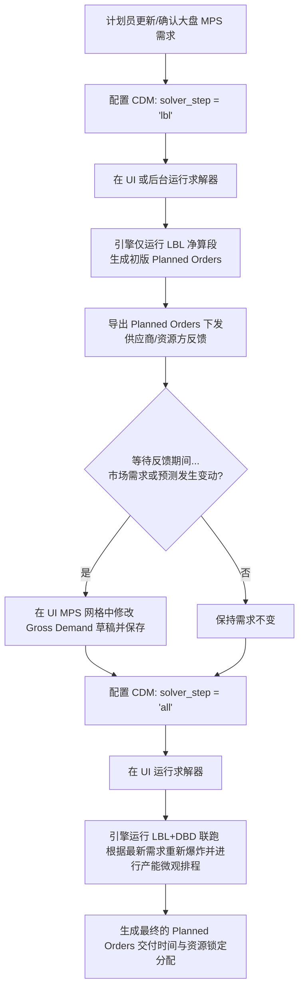

# 🛠️ IPC ITP/IOP 两阶段协同规划与求解（LBL与LBL+DBD）操作手册

本手册专门针对 **ITP（战术计划）** 和 **IOP（运营排程）** 中的**两阶段解耦与协同规划**需求进行编写。

在复杂的供应链协同场景下，为了应对供应商与资源提供方的反馈延迟以及在此期间的市场需求变动，系统支持将求解器拆分为 **LBL（物料爆炸净算段）** 与 **LBL+DBD（最终合体排产段）** 两段运行。该控制机制已完全沉淀到控制数据模型（CDM）的 `ipc_solver_config` 配置表中。

---

## 🗺️ 业务流转与双阶段工作流

在协同排产过程中，典型的业务流转如下图所示：



---

## 🏭 跨企业与多厂区边界的“中央规则治理与分布式协同执行（In-House & ODM）”架构

在品牌商（如联想）主导的外包制造和多厂区协同网络中，业务与IT团队常常走入“大一统”的误区：企图在中央跑一个庞大的单体求解器，把所有自建工厂（In-House）和外部代工厂（ODM）的微观排程计划（即具体到车间机台、工单派产的执行计划）全部统一运算并强行下发让工厂执行。

这种**“中央集中运行全网微观执行计划”的模式在供应链物理上是注定失败的**：
1. **违背阿什比必要多样性定理（Ashby's Law of Requisite Variety）**：微观生产车间面临无限的本地变异（机台临时故障、物料批次不良、工人请假等）。中央求解器根本无法实时收集并消纳这些微观扰动。
2. **权责不清导致激励博弈失效**：如果由品牌商在中央决定代工厂（ODM）的微观排产工单，一旦交期延误，代工厂将把责任推卸给品牌商（“是你们排的产，我们只是执行”），从而打破了 SLA 的契约约束。
3. **计算复杂度爆炸**：全网所有厂区的微观约束（机台日历、换型矩阵、替代料组合）全部塞入一个求解器，会导致运筹求解的计算复杂度呈指数级（$O(N^3)$）暴涨，What-If 秒级响应成为泡影。

### 💡 正确的架构原则：逻辑独裁，规则民主

为了实现复杂系统的统御与自组织进化，系统采用**“中央规则治理（配额防火墙）+ 厂区分布式独立IPS实例运行”**的解耦控制架构：

```
       【 品牌商中央规划(Allocation) ➔ 厂区自组织执行(IPS) 协同架构 】
      
    [ 品牌商中央控制中心 (规则民主) ]             [ 各分布式执行单元 (逻辑独裁) ]
                 │                                        │
      1. 统一制定采购比例与分配规则                        │
      2. 运行 LBL 净算段 (solver_step='lbl')              │
      3. 导出 Allocation 额度 ───────────────────────────> 4. 在解耦点自动转化为刚性 Allotment 屏障
                 │                                           (各厂区/ODM 拥有独立的配额防火墙)
      6. 接收各厂区 Allotment 确权反馈 <─────────────────── 5. 厂区/ODM 运行各自独立的 IPS 实例
      7. 冻结 Allotment 边界参数                             (基于 DOD 内存结构与 64位优先级倒排消纳)
      8. 发布中央战术大盘指导                              │
                 │                                        │
                 ▼                                        ▼
    【 结果：宏观配额不被抢占踩踏 】             【 结果：各厂区独立消纳本地扰动，OTIF与库存周转最优 】
```

### 关键协同机制与所有权划分：
1. **核心 IPS 系统（执行计划）的“集中管理”**：
   * **统一所有权**：In-House 工厂的所有 IPS 系统由品牌商核心团队统一管理、统一系统架构、统一算法内核。这确保了算法规则的标准化和物理消纳逻辑的一致性（“逻辑独裁”）。
   * **分布式运行**：在物理部署上，**每个工厂（包括自建的 LCFC 等）部署一套独立的 IPS 实例**，ODM 工厂则由品牌商将 IPS 系统输出并传授给他们独立运行。各工厂的 IPS 实例只负责本厂的微观排产、订单拉动并直接产生真实的执行单据（工单、发运单等）。
2. **Allotment 配额防火墙（隔离踩踏）**：
   * 品牌商只在中央层面运行战术层分配（ITP/Allocation），并将其投影为各厂区在解耦点处的 **Allotment 刚性屏障上限**。
   * 这一 Allotment 屏障作为刚性规则参数输入到各个分布式运行的 IPS 实例中。各个代工厂或自建厂在各自的 IPS 实例中排产时，只能消耗属于自己的 Allotment 配额，**物理隔离了跨厂区的资源劫掠与抢占**。
3. **订单驱动与真实执行单据的闭环**：
   * 联想属于 CTO（配置起产）、BTO（订单起产）、ATO（装配起产）模式，其交付准确性（OTIF）、交付速度（Lead Time）和库存周转率完全由**拉动式/订单驱动的执行计划（IPS/IOP）**决定。
   * 分布式 IPS 实例直接对接真实客户订单与配置，并**直接产生用于车间和供应商执行的物理单据**。
   * 主计划团队在过去之所以做很多项目都以失败告终，正是因为他们做的“主计划项目”与实际执行计划（IPS）完全脱节（“解耦失控”），主计划的优化结果无法约束和传递到真实的执行单据上，变成了自说自话的 PPT 汇报。


---

## ⚙️ 一、 控制数据模型 (CDM) 求解配置参数

求解器的运行行为通过 DuckDB 中的 `ipc_solver_config` 表进行控制。你可以通过 SQL 或后台管理界面配置以下两个核心参数：

| 参数名称 (`param_name`) | 可选值 (`param_value`) | 业务含义与引擎行为 |
| :--- | :--- | :--- |
| **`solver_mode`** | **`iop`** (默认)<br>**`itp`** | **`iop`**：运营排程模式，执行精细的时空产能与 CTP 交期。<br>**`itp`**：战术计划模式，用于中远期大盘滚动推演。 |
| **`solver_step`** | **`lbl`**<br>**`all`** (默认)<br>**`dbd`** | **`lbl`**：**仅运行 LBL 段**。只根据需求爆炸物料并产生 Planned Orders，跳过 DBD（微观排产），用于初步下发预测。<br>**`all`**：**LBL+DBD 联跑**。先运行 LBL（根据最新需求重新生成 Planned Orders），再运行 DBD 进行有限产能派程锁定。<br>**`dbd`**：**仅运行 DBD 段**。跳过 LBL 净算，直接对现有已存在的 Planned Orders 进行微观产能调度。 |

> [!NOTE]
> **参数优先级说明**
> 引擎启动时参数加载的优先级为：
> `命令行参数 (CLI Arguments) Override` **>** `CDM 数据库配置 (ipc_solver_config)` **>** `系统硬编码默认值`
>
> 默认情况下，控制塔 UI 触发的排产会遵循 CDM 数据库配置。

---

## 📝 二、 详细双阶段操作指南

### 阶段 1：生成初版 Planned Orders 并下发预测（LBL 净算段）

本阶段的目的是基于当前大盘需求，爆炸出对物料和产能的初步需求量，并不决定具体的排产时间和使用哪台设备。

1. **设置 CDM 参数为仅运行 LBL**
   在底层 DuckDB 或通过系统后台控制台，执行以下 SQL 命令：
   ```sql
   UPDATE ipc_solver_config SET param_value = 'lbl' WHERE param_name = 'solver_step';
   ```
   *（确认 `solver_mode` 根据您的业务场景设为 `iop` 或 `itp`）*

2. **触发求解器运行**
   * **方法 A（UI 触发）**：登录控制塔 Web 界面，在顶部导航栏点击 **MPS**，然后点击右上角的 **“保存并重排产 (Save & Reschedule)”**。
   * **方法 B（命令行触发）**：运行项目根目录下的求解器二进制：
     ```bash
     main_mem3.exe --db ipc.db
     ```
     *(由于未在命令行传入 `--step`，引擎将自动读取 CDM 中配置的 `solver_step = 'lbl'`)*

3. **验证 LBL 运行结果**
   在控制塔控制台日志中，您会看到如下提示，代表微观派程已被跳过：
   ```text
   [模式] 跳过微观时空派程 (solver_step == 'lbl' 或 模式非 iop/itp)...
   ```

4. **导出初版计划订单（Planned Orders）**
   * 切换到 **“控制塔 (Control Tower)”** 页面，在左侧表列表中选择 **`ipc_planned_order_ledger`**。
   * 点击右上角的 **“Export to CSV”** 按钮。
   * 将导出的 CSV 数据发给供应商和资源提供方，要求反馈材料配额（Commitment）和产能可用率。

---

### 协同等待期：市场需求变更修改

在等待外部反馈的期间，市场预测或销售订单发生了改变。计划员需要在控制塔中更新大盘需求。

1. **修改毛需求 (Gross Demand)**
   * 在 Web 界面切换到 **MPS** 页面。
   * 搜索并选择需要修改的成品（FG）SKU。
   * 在右侧网格中定位到 **“毛需求 (Gross Demand)”** 行。
   * **双击** 需要调整的日期单元格（如 D5, D10），输入最新数量并敲击回车。
   * 此时单元格左上角会出现**黄色三角草稿标记**。

2. **使用高级计划工具调整（可选）**
   * **批量分摊 (Spreader)**：若有大笔追加预测，可点击此工具，指定时间段（如 D3 到 D10）和分摊规则进行快速录入。
   * **平滑削峰 (Leveling)**：若在初期评估中发现某天负荷过高，可使用 Leveling 工具将需求沿时间轴前后平移。

3. **保存修改草稿**
   * 点击右上角的 **“保存并重排产 (Save & Reschedule)”**。
   * 后台会立即将最新的 Gross Demand 写入 DuckDB 的 `ipc_independent_demand` 物理表。

---

### 阶段 2：最新需求联跑与排程锁定（LBL+DBD 联跑段）

当供应商反馈回来，并且大盘需求修改完毕后，需要进行最终的闭环排产。

1. **将 CDM 参数更改为联跑模式**
   执行 SQL 将 `solver_step` 改回 `all`：
   ```sql
   UPDATE ipc_solver_config SET param_value = 'all' WHERE param_name = 'solver_step';
   ```

2. **触发最终排产重算**
   在 MPS 页面点击 **“保存并重排产 (Save & Reschedule)”**（或者在后台执行求解器二进制）。
   此时引擎将依次执行：
   * **第一步 (LBL)**：基于**最新修改后**的 Gross Demand，重新进行物料爆炸和级联净算，生成准确的最终 Planned Orders 数量。
   * **第二步 (DBD)**：对上述最新的 Planned Orders 进行微观时空派程调度，锁定所使用的物理资源（What）以及精确的生产/交付时间（When）。

3. **确认并发布最终排产账本**
   * 排产完成后，MPS 页面网格中的黄色草稿标识全部消失，大盘 KPIs 会发生实时刷新。
   * 切换到 **“控制塔”** 页面，查看最终排产表：
     * **`ipc_planned_order_ledger`**：Planned Orders 的最终 `start_day` 和 `finish_day`。
     * **`ipc_supply_assignment`** / **`ipc_planned_supply_assignment`**：物料与产能的精确分配记录。

---

## 🔍 三、 常见问题与排错提示

> [!IMPORTANT]
> **1. 为什么我的修改在重算后没有生效？**
> * 请确认您在网格中修改完数据后是否点击了 **Save & Reschedule**。如果直接刷新页面或点击 **Discard Changes**，草稿修改会被放弃。
> * 请检查 DuckDB 数据库文件是否被其他客户端（如 DBeaver）写锁锁死，导致后台 server 无法写入。

> [!WARNING]
> **2. 命令行启动时覆盖参数的风险**
> * 如果您在批处理或脚本中使用了 `--step lbl` 命令行显式传参，引擎将**忽略** CDM 数据库表中的配置。
> * 建议在协同排产生产流程中，统一不带 `--step` 命令行参数运行，完全由 CDM 数据库的 `ipc_solver_config` 表进行集中管控。

> [!TIP]
> **3. 如何快速确认当前的 CDM 配置？**
> 您可以在 DuckDB 终端中随时运行以下查询以确认当前两阶段状态：
> ```sql
> SELECT * FROM ipc_solver_config;
> ```
