# 🧠 IPC Intelligent Planning & Control Solver Schema Hub

欢迎使用 **IPC 计划决策引擎全景数据字典知识库**。本项目已迁移至 **Obsidian** 进行模块化管理。

## 📐 物理数据库核心 ER 关系架构图

```mermaid
erDiagram
    %% ==========================================
    %% 核心物料主数据与工厂站点 (Core Master Data)
    %% ==========================================
    ipc_part ||--o{ ipc_part_site : "localizes SKU"
    ipc_site ||--o{ ipc_part_site : "hosts SKU"
    ipc_part_site ||--o{ ipc_onhand : "stores stock"
    ipc_part_site ||--o{ ipc_location : "registers storage"
    ipc_inventory_type ||--o{ ipc_onhand : "classifies usable status"
    ipc_system_uom ||--o{ ipc_part : "measures base qty"
    ipc_system_uom_group ||--o{ ipc_system_uom : "standardizes types"
    ipc_abc_class ||--o{ ipc_part_site : "segmentizes SKU value"
    
    %% ==========================================
    %% BOM 工艺路线与产能资源 (BOM, Routing & Resource Capacity)
    %% ==========================================
    ipc_part_site ||--o{ ipc_bom_route : "defines product structure"
    ipc_bom_route ||--o{ ipc_bom_item : "explodes sub-components"
    ipc_alt_grp_type ||--o{ ipc_bom_item : "governs substitution rules"
    ipc_bom_route ||--o{ ipc_routing : "sequences processes"
    ipc_routing ||--o{ ipc_work_center : "allocates to WC"
    ipc_work_center ||--o{ ipc_work_center_capacity : "allocates machine hours"
    ipc_constraint ||--o{ ipc_constraint_assignment : "tracks bottleneck resources"
    ipc_constraint_assignment ||--o{ ipc_part_site : "binds part load"
    ipc_constraint ||--o{ ipc_constraint_available : "specifies daily capacity"
    
    %% ==========================================
    %% 需求预测、销售与共识计划 (ITP Forecasting & Sales)
    %% ==========================================
    ipc_part_site ||--o{ ipc_sales_order_line : "receives orders"
    ipc_customer ||--o{ ipc_sales_order_line : "commits purchase"
    ipc_customer ||--o{ ipc_hierarchy_customer : "groups hierarchy"
    ipc_sales_order_line ||--o{ ipc_demand_status : "manages state transitions"
    ipc_demand_type ||--o{ ipc_sales_order_line : "classifies priority rank"
    
    ipc_part_site ||--o{ ipc_forecast : "receives predictions"
    ipc_forecast ||--o{ ipc_forecast_detail : "disaggregates buckets"
    ipc_consensus_forecast ||--o{ ipc_consensus_forecast_detail : "unifies corporate plans"
    ipc_forecast_detail ||--o{ ipc_consensus_forecast_detail : "calculates weights rollup"
    ipc_forecast_causal_factor ||--o{ ipc_forecast_causal_factor_detail : "adjusts promotional lift"
    
    %% ==========================================
    %% 供需消纳与计划决策账本 (IOP MRP & CTP Pegging)
    %% ==========================================
    ipc_sales_order_line ||--o{ ipc_supply_assignment : "pegged for delivery"
    ipc_forecast ||--o{ ipc_supply_assignment : "pegged for replenishment"
    ipc_planned_order ||--o{ ipc_supply_assignment : "manufactures stock"
    ipc_scheduled_receipt ||--o{ ipc_supply_assignment : "supplies in-transit goods"
    ipc_onhand ||--o{ ipc_supply_assignment : "consumes physical stock"
    
    %% ==========================================
    %% MEIO 安全库存优化 (IO Safety Stock Policy)
    %% ==========================================
    ipc_part_site ||--o{ ipc_io_safety_stock_item : "optimizes safety stock levels"
    ipc_io_ss_rule ||--o{ ipc_io_safety_stock_item : "configures formula inputs"
    ipc_io_safety_stock_item ||--o{ ipc_io_safety_stock_time_phased_result : "outputs daily targets"
    ipc_io_safety_stock_time_phased_bounds ||--o{ ipc_io_safety_stock_time_phased_result : "clips bounds"
    
    %% ==========================================
    %% WBS 项目管理与跨站点物流 (ETO Projects & Logistics)
    %% ==========================================
    ipc_project ||--o{ ipc_project_wbs : "breaks down work tasks"
    ipc_project_wbs ||--o{ ipc_critical_path : "solves CPM schedule"
    ipc_project_wbs ||--o{ ipc_part_site : "pulls custom component"
    
    ipc_logistic_location ||--o{ ipc_logistics_delivery_route : "origin DC"
    ipc_logistics_delivery_route ||--o{ ipc_logistics_stock_transfer_order : "executes transshipment"
    ipc_logistics_transportation_mode ||--o{ ipc_logistics_delivery_route : "determines speed cost trade-off"
    
    %% ==========================================
    %% 日历、财务账本与场景控制 (Calendars, Ledgers & Collaboration)
    %% ==========================================
    ipc_sop_planning_calendar ||--o{ ipc_sop_calendar_date : "instantiates timeline"
    ipc_sop_planning_calendar ||--o{ ipc_site : "controls operational days"
    ipc_sop_planning_calendar ||--o{ ipc_work_center_capacity : "maps shift hours"
    
    ipc_supply_assignment ||--o{ ipc_financial_ledger : "posts revenue and penalty cost"
    ipc_collab_scenario ||--o{ ipc_collab_audit_log : "records sandboxed edits history"
```

## 📂 业务功能模块索引
以下为按系统执行时序排列的计划与控制核心模块。点击链接即可进入相应的子集：

* 🚀 **[[1_Core_Planning|1. 核心计划与排产 (Core Planning - MPS/MRP)]]**：核心拓扑爆炸、CTP有限能力匹配及物理库存消纳。
* ⛓️ **[[2_Co_product_Optimization|2. 联副产品分级优化 (Co-product Optimization)]]**：多级分选、降级消纳与联产品产出分配。
* 🏗️ **[[3_ETO_Project|3. ETO 协同项目管理 (ETO Project & WBS)]]**：关键路径法（CPM）时序偏移与项目型配给。
* 📊 **[[4_IBP_Consolidated|4. IBP 财务与预测共识 (IBP Consolidated Planning)]]**：共识预测加权平摊、S&OP滚动日历与预算合并。
* 🛡️ **[[5_IO_Safety_Stock|5. IO 安全库存水位优化 (IO Safety Stock Policy)]]**：MEIO 多级方差传播计算与库存策略参数。
* 🗄️ **[[6_Object_Data_Model_ODM|6. 主数据本体模型 (Object Data Model - ODM)]]**：全局 SKU 维表、站点拓扑、单位转换、地理大区及组织架构物理元数据。
* 🎛️ **[[7_Control_Data_Model_CDM|7. 求解自适应控制模型 (Control Data Model - CDM)]]**：规则（Rules）、策略（Policies）、覆盖（Overrides）、周期日历、优先级分配以及状态控制变量。

## 📊 引擎全案洞察看板
* **[[Table_Registry|📋 全表物理元数据注册表]]**：通过 `Dataview` 实时提取所有物理表的模块划分、C++ 物理内存结构名、以及丰富进度。
* **[[Enrichment_Progress|🎯 数据字典补全进度面板]]**：通过 `Kanban` 视图或 `Dataview` 汇总当前正在进行的自下而上丰富进度。

---
*提示：建议在 Obsidian 中开启 **关系图谱 (Graph View)**，即可可视化观察全表 198 张物理表的全局拓扑链接！*
