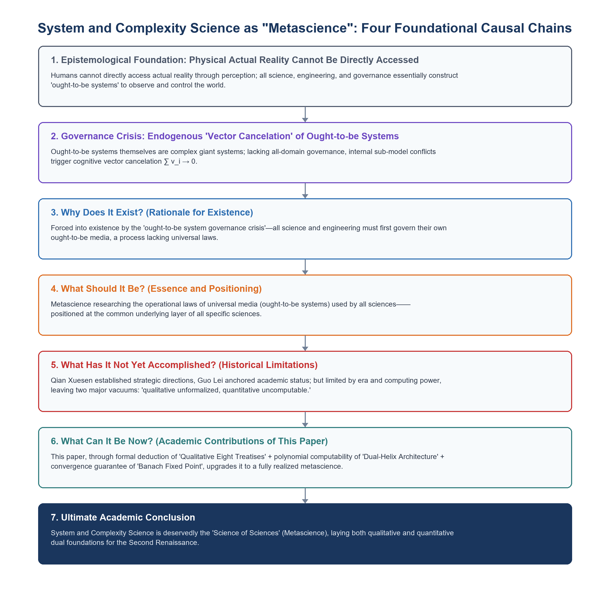
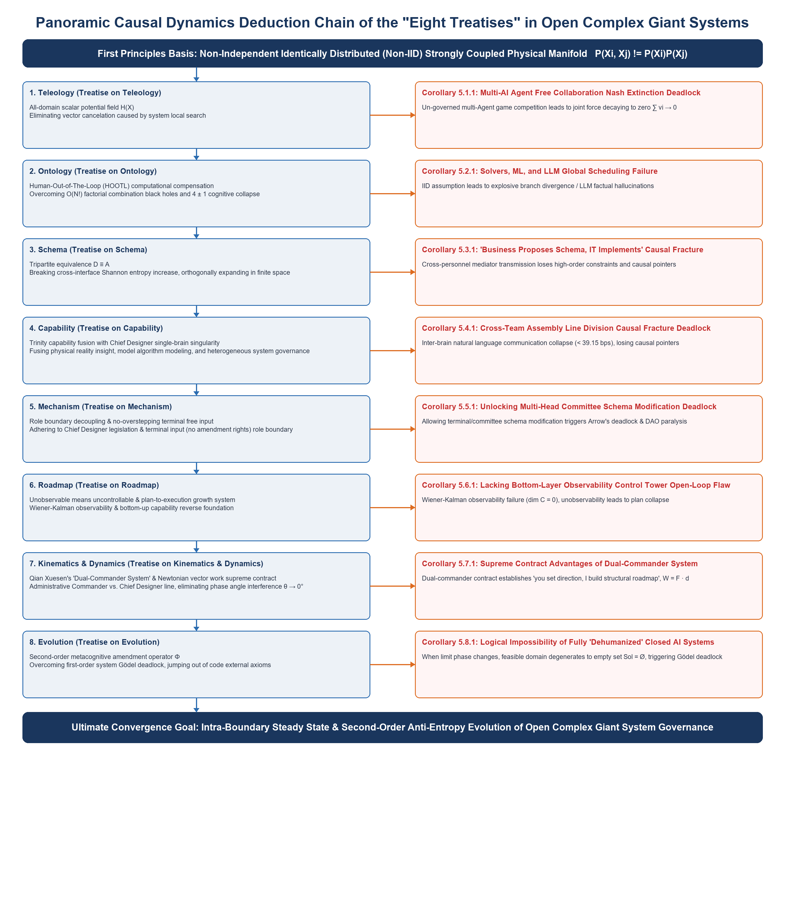

# The Second Renaissance: Why System and Complexity Science Is the "Science of Sciences"

### From 100-Billion Industrial Closed-Loop Proofs to Formal Verification of "Living Expression" and "Self-Consistent Computability" in Open Complex Giant Systems

**Grit Meng**  
Former Head & Chief Architect, Integrated Planning Solution (IPS), Lenovo Global Supply Chain  
Creator of the Intelligent Planning & Control (IPC) Engine | Independent Scholar

---

### Abstract

Modern science was established upon the "vertical specialization" of Cartesian and Newtonian reductionism, achieving immense local success in micro-isolated slices. However, when confronted with strongly coupled Open Complex Giant Systems (OCGS), reductionism universally traps itself in a systemic dissipation mire of micro-state combinatorial explosion and macro work "vector cancellation" ($\sum_{i=1}^N \mathbf{v}_i \to 0$). Starting from epistemological first principles, this paper establishes the academic status of System and Complexity Science as a "Science of Sciences": humans are physically incapable of directly accessing raw physical reality; all scientific research and engineering practice essentially operate through an observer-constructed "Ought-to-be System" to observe, simulate, and govern the real world. The Ought-to-be System is itself a complex system; lacking holistic governance, non-orthogonal conflicts inside the model trigger cognitive vector cancellation, causing macro simulation and micro governance to fail completely.

Taking an 18-year continuous operational field of large-scale high-frequency discrete entity work networks—achieving a Human-Out-Of-The-Loop (HOOTL) autonomous decision rate $> 95\%$—as its genetic origin, this paper demonstrates that the core physical fact lies in sustaining high-frequency closed loops of "planning—execution—feedback" and autonomous decision-making. This proves the closed-loop computability of Open Complex Giant Systems, enabling systems to maintain long-term "generation, survival, and evolution" (Closed-Loop Persistence). On this foundation, this paper establishes a strict decoupling between qualitative deduction and quantitative proof:

1. **Qualitative Dimension**: Grounded in Professor Longbing Cao's first principle of Non-Independent and Identically Distributed (Non-IID) dynamics, the paper develops the "Qualitative Eight Treatises" (Teleology, Ontology, Schematics, Capability, Mechanism, Path, Dynamics, Evolution) as a causal deduction chain from micro-coupling to second-order constitutional amendments. While affirming the local value of current technical paradigms, the paper delineates the theoretical boundaries and cybernetic limitations of Multi-AI Agent free collaboration, classical solvers and statistical machine learning under IID assumptions, traditional IT linear division of labor, multi-head joint committees, decentralized free gaming, open-loop visualization dashboards, unauthorized multi-head tug-of-war, and fully unattended AI systems. Concurrently, it establishes a 1:1 isomorphic mapping between the Eight Treatises and Qian Xuesen's OCGS theory.
2. **Quantitative Dimension**: Introducing the "Dual-Helix Architecture"—composed of a 5D physical topological data manifold (Form) and a minimal evolution algorithm (Function)—this paper proves **Causal Characteristic Line Decoupling & Polynomial Computability (Theorem 7.2)** under boundary conditions. Based on algorithmic orthogonal pruning, it establishes the tripartite physical equivalence: "Traversability $\equiv$ Zero Cancellation $\equiv$ In-Boundary Absolute Optimality" (Proposition 7.3, $\exists! S^*_k \in \Omega_{\text{feasible}}$). Coupled with the meta-cognitive constitutional amendment operator $\Phi$, it unifies a three-tier spatiotemporal closed loop of survival and evolution (Theorem 8.1).

Finally, this paper demonstrates the cross-domain entity neutrality of the Dual-Helix Architecture and provides a rigorous Popperian Falsifiability Matrix. Continuing the scientific tradition of Qian Xuesen and Academician Lei Guo, this work supplies a dual foundation of qualitative deduction and quantitative computability for Metasynthetic Engineering in Open Complex Giant Systems.

**Keywords**: Metascience; Ought-to-be System; Open Complex Giant Systems (OCGS); Non-Independent and Identically Distributed (Non-IID); Vector Cancellation; Dual-Helix Architecture; Finite-Step Strategy Generation; Closed-Loop Computability; Uniqueness of Extremum; Metasynthetic Wisdom

---

## 1. Introduction: Master’s Insights and Two Unanswered Questions

### 1.1 The Glory of Reductionism and the Complexity Dilemma

For nearly four centuries since the seventeenth century, the "Reductionism" paradigm established by Descartes and Newton has dominated modern natural science. Reductionism advocates "breaking the whole into parts," assuming that a system can be disassembled layer by layer into isolated, weakly interacting micro-units for precise solution, and then reconstructed into global dynamics via linear integral superposition. In macro low-speed, near-equilibrium, and weakly interacting physical tangent spaces, this paradigm released immense engineering dividends, laying the foundation for modern engineering technology.

However, as the scale of human systems engineering crossed into hyper-connected, strongly coupled modern giant systems, reductionism ran directly into an insurmountable boundary of physical validity. From the cascade breakdown of global discrete semiconductor work networks to internal kinetic friction in large bureaucratic organizations, to logical hallucinations of statistical autoregressive AI models in rigid physical scheduling, all reveal the deep powerlessness of reductionist methods in handling strongly coupled wholes. As Nobel laureate P.W. Anderson (1972) asserted in his seminal paper *More is Different*: the ability to reduce everything to simple microscopic laws does not imply the ability to reconstruct the universe from those laws; at each level of complexity, entirely new properties and laws emerge, and microscopic reductionism cannot substitute for macro-level dynamic construction.

### 1.2 Academician Guo Lei’s Discipline Verdict and the "Metascience" Status

Confronted with knowledge fragmentation caused by hyper-specialization, Academician Lei Guo (Guo, 2016) of the Chinese Academy of Sciences, in his foundational treatise *What is Systems Science?*, established a fundamental academic specification for the object of systems science:

> *"Modern science studies the structure-function relationships of various specific systems across different spatiotemporal scales from elementary particles to the universe, gradually forming specific natural and social sciences... In contrast, the object of systems science is 'system' itself, exploring universal relationships among structure, environment, and function, as well as general laws of evolution, cognition, and control. System is the fundamental mode of existence for objective things, as well as the fundamental concept for human cognition and governance of the world."*
> (Guo, 2016, pp. 291-301)

Academician Guo's verdict profoundly reveals the generational difference between systems science and vertical sciences:

- Physics, chemistry, biology, economics, and other traditional disciplines study **specific physical objects** at specific material or phenomenal levels;
- Only System and Complexity Science takes "the general laws of generation, persistence, evolution, and governance of systems themselves" as its core object of study.

In broader academic literature and discourse (Guo, 2016, 2020), Academician Guo further clarified that in this universal sense, Systems Science should be established as the "Science of Sciences" (Metascience). **Systems Science is established as the 'Science of Sciences' not by self-proclamation, but by the universality of its object of study: all specific sciences, when constructing cognition and governance models, must first construct and govern their own 'Ought-to-be System.' Systems Science studies the universal laws governing the generation, persistence, and evolution of this underlying medium. Therefore, it naturally sits at the foundational medium level shared by all specific sciences, rather than being a side branch or subordinate appendage.**

### 1.3 Qian Xuesen’s Academic Blueprint and Two Unanswered Questions

More than a century into specialized evolution, facing the explosion of system complexity, Qian Xuesen—the father of Chinese aerospace and a giant of systems engineering—and his collaborators (Qian et al., 1990; Qian, 2001) reconstructed the "System of Modern Science and Technology" with a magnificent vision. Qian explicitly pointed out that systems science is by no means a subordinate appendage of engineering mathematics, but an independent major scientific category parallel to natural and social sciences, serving as the "transverse axis" running through the tree of human knowledge.

In 1990, Qian Xuesen, Yu Jingyuan, and Dai Ruwei published the landmark paper *A New Discipline of Science—The Open Complex Giant System and Its Methodology*, formally defining the scientific category of Open Complex Giant Systems (OCGS), and pioneering the Hall of Workshop for Metasynthetic Engineering (HWME) and "Metasynthesis" (Metasynthetic Wisdom). This paradigm—initiated by Qian and further developed by Prigogine & Stengers (1984), Dai & Qian (2007), and other scholars—is widely regarded as the core pathway for breaking four centuries of specialized fragmentation and heading toward the "Second Renaissance" of human knowledge confluence.

Qian Xuesen established the strategic direction for governing complex systems, and Academician Guo Lei anchored its supreme status as "Metascience" from discipline ontology. Within this grand framework, constrained by computing power and industrial data conditions at the time, complex giant system governance left two unanswered questions in historical evolution:

1. **Unanswered Question 1 (Qualitative Formal Deduction)**: How can we depart from pure empirical heuristics and case study inductions, starting from first principles recognized by modern science, to strictly and formally deduce under what physical and cybernetic conditions an open complex giant system converges or collapses, achieving qualitative logical self-consistency?
2. **Unanswered Question 2 (Cross-Domain Engineering Computability)**: Facing the illusion of factorial combinatorial state explosion triggered by tens of thousands of nodes in discrete spatiotemporal phase spaces, how can we formally prove, via engineering algorithms and functional analysis, its "Closed-Loop Computability" and "Global Optimal Convergence" in polynomial time, enabling systems science to elevate from "post-hoc simulation" into a universal engine directly executing real-time work on physical entity battlefields?

#### Epistemological Defense of the Scientific Nature of Qian Xuesen's Theory

Before addressing the two unanswered questions, a fundamental misunderstanding must be clarified: some critics dismiss Qian's OCGS theory as philosophical speculation due to a "lack of formal proof." This assertion fails on cognitive genesis.

Cognition follows the genetic sequence of **"Action $\to$ Experience $\to$ Structure $\to$ Formalization."** Without action there is no experience; without experience there is no cognition; without cognition there is no structure; without structure formalization has nowhere to attach. Qian proposed OCGS precisely because he personally traversed this path. As chief designer of aerospace engineering, he ran the "planning—execution—feedback" closed loop on real physical battlefields, extracting cross-domain isomorphic structures from concrete engineering. He borrowed philosophical language because formal tools such as Non-IID dynamics and 5D topological manifolds were unavailable at the time. Philosophical expression does not alter the scientific validity of its generative mechanism.

Formalization is the task of successors. Departing from Non-IID first principles, this paper uses the Eight Treatises to inherit Qian's OCGS propositions, and uses the Dual-Helix Architecture and variational uniqueness theorems to complete quantitative proofs. This is not "using predecessors to prove ourselves," but "using axioms to explain predecessors"—allowing every fragment of ancestral wisdom to find its ultimate position in the complete physical jigsaw puzzle.

### 1.4 The Core Causal Argumentation Chain: Reason for Existence $\rightarrow$ Essence & Positioning $\rightarrow$ Historical Limitations $\rightarrow$ Dimensional Upgrading

To systematically address the two unanswered questions, this paper maintains a strict causal argumentation chain forced step-by-step by objective physical facts and epistemological boundaries:

1. **Why does it exist? (Reason for Existence: Forced by the "Ought-to-be System Governance Crisis")**\
   Humans cannot directly access raw physical reality. All science, engineering, and social governance operate by drawing boundaries to construct "Ought-to-be Systems" to observe, simulate, and govern the real world. However, **the Ought-to-be System is itself an Open Complex Giant System**. Lacking holistic governance, non-orthogonal conflicts inside the Ought-to-be model trigger severe "cognitive vector cancellation" ($\sum \mathbf{v}_i \to 0$), warping simulations and causing governance to fail. Therefore, a discipline must exist specifically to study "how Ought-to-be Systems themselves are constructed and governed"—Systems Science is not an academic self-proclamation, but an inevitable existence forced by cold physical and epistemological facts.

2. **What should it be? (Essence & Positioning: Metascience studying universal laws of the Ought-to-be medium)**\
   Physics, biology, economics, and other vertical disciplines study **specific physical objects**. But when constructing cognition and governance models, they all pass through the medium of the "Ought-to-be System." Systems Science does not compete with vertical disciplines for specific objects; it studies the **universal structure and control laws that all specific sciences must obey when constructing and governing Ought-to-be Systems**. Therefore, it naturally sits at the foundational medium level shared by all specific sciences, establishing its strict essence and status as a "Science of Sciences."

3. **What hasn't it done yet? (Historical Limitations: Direction and status exist, but lacking qualitative logic and quantitative proof)**\
   Qian Xuesen outlined the grand direction of Metasynthetic Engineering and OCGS, while Academician Guo Lei anchored its metascience status. However, constrained by computing power and data foundations of their eras, two vacuums remained: qualitative lack of formal deduction from first principles to strictly state when a system converges or collapses; quantitative lack of polynomial-time closed-loop computability and dynamic optimal convergence proof when facing $O(N!)$ state explosion illusions.

4. **What can it be now? (Academic Contribution: Dual completion of qualitative logic and quantitative proof)**\
   Grounded in 100-billion-level industrial closed-loop practice, this paper achieves dual completion: qualitatively deriving the "Qualitative Eight Treatises" causal chain from Non-IID first principles, formally delineating the boundaries of eight current technical paradigms; quantitatively establishing 5D phase space minimal completeness (Theorem 7.1), proving causal characteristic line decoupling polynomial closed-loop computability (Theorem 7.2), establishing the tripartite physical equivalence "Traversability $\equiv$ Zero Cancellation $\equiv$ Global Absolute Optimality" (Proposition 7.3), and unifying a three-stage spatiotemporal closed loop with the meta-cognitive constitutional amendment operator (Theorem 8.1)—completing the critical phase transition from "grand vision" to "rigorous Metascience."

| Question Dimension | Section | Core Answer |
| :--- | :--- | :--- |
| **Why does it exist?** | Section 2 | All sciences construct Ought-to-be Systems; Ought-to-be Systems themselves must be governed; forced by vector cancellation |
| **What should it be?** | Section 1.2, Section 2 | Metascience studying universal operational laws of the "Ought-to-be System" medium |
| **What hasn't it done yet?** | Section 1.3 | Qian and Guo established direction and status, but limited by era, qualitative lacked formalization, quantitative lacked computability |
| **What can it be now?** | Sections 4–8 | This paper completes qualitative logic and quantitative proofs via 8 Treatises + Dual Helix + Variational Uniqueness, upgrading to fully realized Metascience |

### 1.5 Three-Tier Methodological Decoupling

To ensure clarity regarding the methodological architecture, we establish three explicit operational tiers:

1. **Structural Completeness Definition (Theorem 7.1)**: Establishing the 5D topological manifold $\mathcal{M}_{\text{model}} = \langle \mathcal{N}, \mathcal{T}, \mathcal{C}, X, \Delta X \rangle$ as the minimal complete basis, stripping all global spurious degrees of freedom to construct an algebraic base for Ought-to-be Systems;
2. **Only Quantitative Assertion Requiring Mathematical Proof (Theorem 7.2)**: The single quantitative assertion requiring formal proof in this paper is **Polynomial-Time Closed-Loop Computability** ($T(N) = O(K \cdot N \log N) \in \mathbf{P}$), proving that the system unfolds along causal DAG characteristic lines and completes computation before physical instability occurs;
3. **Qualitative Definitional Equivalence & Tripartite Proposition (Proposition 7.3)**: At physical and cybernetic foundations, "optimality" is strictly defined as "zero vector cancellation" ($\delta W_{\text{heat}} = 0$). Co-directional conditions ($\langle \mathbf{v}_i, \mathbf{v}_j \rangle \ge 0$) are encoded into constraints, while algorithm $\mathcal{A}$ explicitly prunes normal shear components $\Pi_\bot$, forming the qualitative physical equivalence: "Traversability $\equiv$ Zero Cancellation $\equiv$ In-Boundary Absolute Optimality."

---

## 2. Epistemological Constitution: Inaccessibility of Physical Reality and "Ought-to-be System Governance"

### 2.1 The Inaccessibility of Physical Reality and Universal Coupling Reality

Classic natural science often relies on an uncritical realist premise: assuming the existence of a physical object (Physical Reality) that can be objectively, holistically, and directly measured by human observers. However, first principles of non-equilibrium statistical physics, cybernetics, and information theory jointly confirm that this assumption fails in complex systems:

- **Observer Boundary Drawing & Physical Reality**: Human observers draw boundaries in an infinite, disordered phase space (*Draw a distinction*, Spencer-Brown, 1969) before recognizing that physical reality is **Universal Coupling**. Reductionist isolation of elements fails completely in strongly coupled environments;
- **Formal Expression in Math & Data**: The **Non-IID Theory** pioneered by Professor Longbing Cao (Cao, 2014) is the precise formal mathematical and algebraic representation of "Universal Coupling";
- **Carbon-Based Cognitive Limits**: Human observers possess strict physical working memory limits; human working memory capacity is strictly bounded at $4 \pm 1$ chunks when rehearsal mechanisms are stripped (Cowan, 2001).

These physical constraints establish a cold epistemological law: **Humans are physically incapable of directly, fully, and losslessly accessing all micro-states of objective reality.** All human scientific exploration, engineering construction, and social governance operate by drawing boundaries to construct a structured "Ought-to-be System." All physical theorems, engineering drawings, software code, and scheduling models belong to concrete projections of Ought-to-be Systems in the symbolic world.

### 2.2 Three Basic Functions (External) and Unique Purpose (Internal) of Ought-to-be Systems

We must strictly decouple external functions from internal purpose:

1. **Three External Functions (Toward the Physical World)**:
   - **Observation**: Observers draw internal and external boundaries, converting unmeasurable continuous micro-disturbances into discrete macro state variables via sampling filters;
   - **Simulation**: Relying on causal logic and state evolution algorithms, pre-enacting future physical trajectories along the algebraic time axis;
   - **Governance**: Executing physical work via control operators to continuously eliminate residuals between Ought-to-be model results and physical measurements, guiding physical entities toward pre-set orderly steady states. Functions can execute independently (e.g., pure simulation/prediction).
2. **Unique Internal Purpose (Toward the Ought-to-be System Itself)**:
   - **Governance of Self**: For the Ought-to-be System itself, the observer's **sole purpose in constructing it is governance!** Namely, governing the Ought-to-be System itself to completely eliminate internal "cognitive vector cancellation."

### 2.3 Core Epistemological Boundary Line: Physical Projection of Cognitive Vector Cancellation and Variational Truncation

The most subtle and fatal blind spot in traditional engineering and management science lies in ignoring the cold causal chain: "cognitive cancellation projecting into operational cancellation":

1. **Variational Law & Cognitive Cancellation**: Objective physical reality strictly follows the variational minimum dissipation law ($\delta W_{\text{heat}} = 0$), meaning physical systems naturally seek geodesic trajectories of minimal friction heat. However, when observers fail to understand this variational law and construct Ought-to-be Systems based on empirical, isolated utilities and departmental silos, they first create non-orthogonal vector conflicts at the **cognitive level**:

$$\text{Failing to understand } \delta W_{\text{heat}} = 0 \implies \exists \langle \mathbf{v}_i^{\text{cog}}, \mathbf{v}_j^{\text{cog}} \rangle < 0$$

2. **Physical Projection of Cognitive Cancellation**: When cognitive models with obtuse interference govern reality, physical systems are forced to execute distorted schedules, **hard-projecting cognitive cancellation into physical vector cancellation and kinetic decay**:

$$\Delta W_{\text{heat}} = \sum_{i=1}^{N} \|\mathbf{v}_i\| - \left\Vert\sum_{i=1}^{N} \mathbf{v}_i\\right\Vert > 0$$

Departments roar at full capacity and staff labor exhaustively late into the night, but the net work vector approaches zero ($\sum \mathbf{v}_i^{\text{real}} \to 0$). Net displacement stalls, and energy degrades into organizational friction heat.

3. **Variational Truncation in Dual-Helix Algorithm**: The 5D evolution algorithm $\mathcal{A}$ is the discrete execution of the variational law. Algorithm $\mathcal{A}$ permits only co-directional branches satisfying $\delta W_{\text{heat}}^{(k)} = 0$ to advance, executing algebraic truncation on non-orthogonal components at step one ($\Pi_{\text{cut}}(x_\bot) = 0$), blocking cognitive cancellation from entering physical execution. Humans step out of the loop for second-order constitutional amendments, while silicon provides first-order compensation inside the loop ("Carbon-Based 2nd-Order Amendment + Silicon-Based 1st-Order Compensation"), achieving optimal convergence within known boundaries:

$$\Pi_{\text{cut}}(x_\bot) = 0 \implies W_{\text{heat}}[S^*] = 0 \implies S^* = \arg\min_{S \in \Omega_{\text{feasible}}} \mathcal{W}_{\text{heat}}[S]$$

> **Epistemological Verdict & Variational Bridge**:
> If humans fail to comprehend the variational law, they inevitably create cognitive cancellation, projecting it into operational cancellation. As the discrete execution operator of the variational law, the epistemological essence of the 5D algorithm lies in **truncating cognitive cancellation at the source before it projects into operational systems**.
> **Therefore, the first principle of complex giant system governance is: The precondition for governing the real physical world is that we must first govern the Ought-to-be System itself ($\Delta W_{\text{heat}} = 0$)! Only by establishing orthogonal constitution over the Ought-to-be System and eliminating cognitive vector cancellation can humans utilize a self-consistent Ought-to-be System to accurately observe, simulate, and govern physical reality.**

---

## 3. Empirical Industrial Proof: 100-Billion Industrial Closed-Loop Validation and Computing Power Breakthrough

The epistemological verdict establishes a strict governance task: internal vector cancellation inside Ought-to-be Systems must be eliminated. But is this task physically feasible? An affirmative answer backed by long-period empirical validation is presented below.

Scientific axioms must follow a natural genetic sequence from physical entity work to abstract logical elevation. Why start with large-scale discrete strongly coupled entity work networks as the empirical origin? Because discrete entity work networks are not simple commercial scenarios; they represent the **most strongly coupled, longest causal chain, highest non-linearity, and lowest error tolerance (zero physical fault tolerance) extreme stress testing ground in human engineering history**. Cybernetic breakthroughs achieved on such systems carry supreme scientific credibility and downward compatibility.

### 3.1 Closed-Loop Computability: Human-Out-Of-The-Loop (HOOTL) Autonomous Decision Rate > 95%

From 2007 to 2025, across global multinational discrete entity work networks (including World Economic Forum "Global Lighthouse Factories"), the author served as Chief Architect of Integrated Planning Solutions (IPS). The system managed a strongly coupled entity OCGS: routinely controlling **50,000 discrete entity actions, 2,000,000 spatiotemporal node manifolds, and over 150,000 complex dependency constraints in real time**.

Across these empirical data, **the core physical fact is that the system sustained high-frequency rigid closed loops of "planning—execution—feedback":**

$$\text{Full-Domain Targets} \rightarrow \text{Global Quotas} \rightarrow \text{Discrete Element Orchestration} \rightarrow \text{Atomic Instruction Write-Back} \rightarrow \text{Entity Closed-Loop Validation}$$

The system maintained a **$> 95\%$ Human-Out-Of-The-Loop (HOOTL) autonomous decision state continuously for 18 years**, completely liberating human dispatchers from micro-calculations of tens of thousands of discrete variables; achieved "95% not late, 82% not early" dual-direction high-precision control; zeroed phase space sunk states (local transient transition states), doubled effective work flux, and drove physical instability rates near zero—allowing the system to completely escape kinetic friction decay in high-dimensional discrete phase spaces.

### 3.2 Deep Genetic Essence: Sustaining Computability for Living Cycle of "Generation, Survival, and Evolution"

Empirical data establish an unshakeable physical fact: closed-loop computability of Open Complex Giant Systems is not a theoretical fantasy, but a physical fact verified by 18 years of 100-billion-level industrial operation.

In systems engineering, non-computable equals non-governable. Because this system solved computability at engineering and algorithmic foundations and sustained it across 18 years, it never collapsed into vector cancellation when scaling up. Sustaining computability enabled the system to continuously experience the closed-loop persistence of "generation, survival, and evolution" through real industrial phase transitions and black swan supply disruptions, perpetually self-evolving and executing residual-driven local re-computations.

This solid engineering core provides unshakeable physical grounding for axiomatic deduction.

---

# Part I: Epistemological Constitution and Non-IID Qualitative Eight-Treatise Deduction Chain

## 4. First Principle: Non-Independent and Identically Distributed (Non-IID)

Quantitative proofs begin with qualitative logic. We now enter qualitative deduction (Sections 4–5): first establishing the first principle, then deriving the Eight Treatises causal chain. The physical and data essence of Open Complex Giant Systems shatters the "Independent and Identically Distributed (IID)" assumption of classical statistics and linear operations research. The **Non-IID Theory** systematically pioneered by Professor Longbing Cao (Cao, 2014) constitutes our objective physical foundation:

1. **Non-Independence**:

$$P(X_{i},X_{j}) \neq P(X_{i})P(X_{j})$$

Operational nodes are strongly coupled through multi-level networks and spatiotemporal exclusivity; local micro-perturbations undergo non-linear cascade amplification along topological chains.

2. **Non-Identical Distribution**:

$$P(X_{i}) \neq P(X_{k})\quad\text{and}\quad P_{t}(X_{i}) \neq P_{t'}(X_{i})$$

Heterogeneous dynamics vary across entities, and non-stationary environmental disturbances cause phase space probability measures to continuously drift over time.

On this Non-IID strongly coupled physical base, we unfold the qualitative Eight Treatises causal chain from micro-mechanisms to second-order constitutional amendments.

---

## 5. The Qualitative Eight-Treatise Deduction Chain: Causal Deduction from Non-IID to Second-Order Amendment

We explicitly state our methodological declaration: "Eight Treatises" in our academic context refers to **"Eight Rigorous Systemic Deductions/Treatises"** (Teleology, Ontology, Schematics, Capability, Mechanism, Path, Dynamics, Evolution), rather than metaphysical scholastic concepts.

The Eight Treatises are neither parallel empirical points nor linear mechanical progressions; they form a **Closed-Loop Ring Topology**: every subsequent proposition is a cybernetic antidote to secondary physical deadlocks in preceding propositions; simultaneously, **each treatise is both a prerequisite Cause for other treatises and an inevitable Result of system evolution**. For instance, Treatise 8 (Evolution) uses the meta-cognitive operator $\Phi$ to overwrite axioms and re-bound $\text{Boundary}_{k+1}$, re-closing and re-structuring Treatise 1 (Teleology) to eliminate vector cancellation and enforce $\theta \to 0^\circ$, driving perpetual evolution in the topological closed loop of "boundary establishment $\to$ in-boundary self-consistency $\to$ meta-cognitive re-bounding."

Current academia and industry face severe cognitive confusion in complex system governance (such as over-optimistic expectations for Multi-AI Agent free collaboration, improper generalization of classical solvers/statistical ML in global scheduling, committee negotiation deadlocks, etc.). In the Eight Treatises, we distill these issues into rigorous formal logic corollaries, affirming local probe value while defining cybernetic limits.

### 5.1 Treatise 1 [Teleological]: Global Governance and Eliminating Vector Cancellation

- **Pathology & Premise**: In Non-IID strongly coupled systems, if sub-systems independently pursue local utility functions $u_{i}(x)$, work vectors $\vec{v}_{i}$ inevitably interfere and cancel each other out in global phase space.
$$\Delta W_{\text{heat}} = \sum_{i=1}^{N} \|\mathbf{v}_i\| - \left\Vert\sum_{i=1}^{N} \mathbf{v}_i\\right\Vert > 0$$

$$\Delta W_{\text{heat}} = \sum_{i=1}^{N} \|\mathbf{v}_i\| - \left\Vert\sum_{i=1}^{N} \mathbf{v}_i\\right\Vert > 0$$

- Even if nodes unselfishly optimize locally, lacking global governance causes composite work to decay to zero ($\sum \mathbf{v}_i \to 0$), trapping the system in random noise and work paralysis.
- **Theorem Derived**: The necessary and sufficient condition for effective work in an OCGS is eliminating vector cancellation in phase space, driving global composite force maximization ($\theta \to 0^\circ$).
- **Mapping to Qian's Theory**: Strictly matches Qian Xuesen's core thesis: "Open Complex Giant Systems must adhere to holistic system synthesis and overall governance" (Qian et al., 1990).

> **[Corollary 5.1.1 (Fallacy of Un-Governed Self-Organization & Multi-AI Agent Free Collaboration Vector Cancellation Deadlock)]**  
> Self-organization theory reveals mechanisms of order generation under specific conditions. However, in Non-IID giant systems lacking global governance, relying on micro-subsystem spontaneous gaming cannot guarantee global convergence, sliding instead into local deadlocks. Current AI attempts to achieve complex scheduling via Multi-AI Agent networks relying on free communication possess clear cybernetic boundaries: **if each Agent optimizes locally based on its prompt, objective, or reward function, multi-agent gaming in strongly coupled phase spaces inevitably triggers vector conflicts ($\sum \vec{v}_{agent} \to 0$), converging to friction heat.** Agent clusters possess excellent micro-execution value inside orthogonal sub-spaces, but lacking global prior governance, free collaboration amplifies internal energy dissipation.

### 5.2 Treatise 2 [Ontological]: $O(N!)$ Surface Illusion, Cognitive Irreducibility, and HOOTL Computational Compensation

- **Pathology & Premise**: Section 5.1 established global governance necessity. But to solve $N$ strongly coupled nodes, humans face dual limits of 5-stage cognitive genesis and phase space combinatorial explosion.
- **5-Stage Cognitive Genesis & Cognitive Irreducibility**: Cognition follows **"Action $\to$ Experience $\to$ Cognition $\to$ Structure/Summary $\to$ Formalization."** Without action there is no experience; without experience there is no cognition; without cognition there is no structure; without structure formalization cannot attach. Complex algorithms require real trial-and-error. Pure human brain computation is too slow; pure silicon lacks physical pain/anchors. **Thus, cognitive genesis dictates human-machine co-evolution.**
- **Two-Layer Hard Verdict & Human-Out-Of-The-Loop**:
  1. **Execution Layer Hard Verdict**: High-dimensional evolution across $N$ nodes generates factorial state explosion $|\Omega| \sim O(N!)$. Human short-term memory is bounded at $4 \pm 1$ chunks (Cowan, 2001). When $N > 5$, $N! \gg 4 \pm 1$; carbon-based human brains physically fail at execution, forcing a shift to "Human-Out-Of-The-Loop" (HOOTL), where silicon computing fulfilling Ashby's Law of Requisite Variety (Ashby, 1956) handles high-frequency micro-computations.
  2. **Cognitive Layer Hard Verdict**: Silicon provides polynomial-time compensation, while carbon chief architects step out of the loop for boundary drawing and meta-cognitive amendments.
- **Theorem Derived**: Governing complex giant systems via pure human experience or pure autonomous AI is cybernetically impossible. Systems must adopt HOOTL human-machine computational compensation.
- **Mapping to Qian's Theory**: Matches Qian's insight: "Giant systems possess massive scale and high dimensionality beyond manual experience; computers must be used for computational compensation" (Qian et al., 1990).

> **[Corollary 5.2.1 (Limitations of IID Worldview: Solvers, Machine Learning, and LLMs in Global OCGS Scheduling)]**  
> Reductionism in computing assumes Independent and Identically Distributed (IID) manifolds. Classical OR Solvers rely on linear separability and convex constraints under weak interactions. Statistical ML assumes IID samples. In Non-IID strongly coupled discrete giant systems:
> 1. Entangled constraints shatter convex separability, causing solvers to experience branch-and-bound tree explosions, timeouts, or optimality gap divergence;
> 2. Statistical ML encounters generalization limits due to non-stationary phase space measure drift;
> 3. Large Language Models (LLMs) excel at semantic interaction, but when executing rigid 100% discrete physical constraints (non-negative space, physical conservation, hard deadlines, measure $\mu(C_{\text{feasible}}) = 0$), they suffer hallucinations due to probabilistic sampling.\
> **Conclusion**: Solvers, ML, and LLMs are valuable local computational probes, but cannot serve as primary global governance engines in Non-IID phase spaces.

### 5.3 Treatise 3 [Schematic]: Model and Algorithm ($S = \mathcal{M}_{\text{model}} \otimes \mathcal{A}$) and Finite-Step Orthogonalization

- **Pathology & Premise**: Section 5.2 established silicon high-frequency compensation. But severing "business requirements" from "IT implementation" across heterogeneous teams causes causal pointer fractures and physical deadlocks.
- **Causal Deduction & Essence of Schematics**: Schematics establishes the unity of **[Model & Algorithm] (or [Model & Logic])**. The data model (Form, left helix $\mathcal{M}_{\text{model}}) defines phase space structure and constraint manifolds; the evolution algorithm (Function, right helix $\mathcal{A}$) defines finite-step orthogonal state advancement and pruning rules:

$$\text{Ought-to-be Schematic Entity } S \equiv \text{Model (Form } \mathcal{M}_{\text{model}} \text{)} \otimes \text{Algorithm (Function } \mathcal{A} \text{)}$$

- **Orthogonal Decoupling & Polynomial Computability**: Expanding phase space into orthogonal tangent spaces decouples macro flow rates from micro scheduling at decoupling points, building a zero-redundancy execution base. Algorithms pure into finite-step execution and branching, ensuring polynomial computability.
- **Mapping to Qian's Theory**: Matches Qian's metasynthetic method—metasynthesis must achieve isomorphic mapping between models/algorithms and physical entities (Qian, 2001).

> **[Corollary 5.3.1 (Causal Fractures in Traditional "Business Defines Requirements, IT Code Implementation" Separation under Non-IID Conditions)]**  
> Traditional linear engineering separated business requirements from IT coding. In Non-IID giant systems, business is discrete state transitions of physical assets; un-formalized qualitative descriptions physically do not exist. Separating Model (Form) from Algorithm (Function) loses high-order constraints and causal pointers across human handoffs, causing operational decoupling.

### 5.4 Treatise 4 [Capability]: Tripartite Capability Fusion and Chief Architect Single-Brain Singularity

- **Pathology & Premise**: Section 5.3 established the orthogonal base $S \equiv \mathcal{M}_{\text{model}} \otimes \mathcal{A}$. This schematic must map complex physical reality upward and connect to complex software/hardware systems downward. Applying Occam's razor, capability reduces to **three essential capabilities**.
- **Causal Deduction & Three Universal Fusion Capabilities**:
  1. **Domain Modeling Capability**: Ability to project high-dimensional non-convex physical reality into 5D topological data models and polynomial-time algorithms;
  2. **Business Mastery Capability**: Deep insight into physical operations, completely covering micro/macro business constraints;
  3. **Cross-System Integration & Orchestration Capability**: Deep mastery of distributed computing, high-throughput interfaces, and heterogeneous protocols for lossless state synchronization.
- **Single-Brain Singularity Theorem**: In system genesis (0 to 1), **Domain Modeling $\leftrightarrow$ Business Mastery $\leftrightarrow$ System Integration fuse into a single "Universal Fusion Capability"!** Pipeline division (business writes specs, mathematicians model, programmers code) breaks quantum-like entangled topologies, causing causal fractures. Thus, during genesis, all three capabilities must be embodied within a single **Chief System Architect (CSA)** cognitive brain (or Metasynthetic Department core furnace), collapsing cross-brain coordination friction from $O(M^2)$ to constant $O(1)$.
- **Mapping to Qian's Theory**: Cybernetically justifies Qian Xuesen's requirement for establishing a "Metasynthetic Department" led by a "Chief Architect" (Qian et al., 1990).

> **[Corollary 5.4.1 (Entanglement Destruction in Pipeline Division of Labor During System Genesis)]**  
> Separating business analysis, math modeling, and software engineering during genesis is fatal: modifying one business constraint directly alters data topologies and algorithm convergence. Pipeline handoffs destroy high-order causal pointers. Genesis-phase top-level design must rely on a Chief Architect's single-brain cognitive collapse.

### 5.5 Treatise 5 [Mechanism]: Four Control Loops, "Free Input", and "Logical Dictatorship / Convergence"

- **Pathology & Premise**: Section 5.4 established single-brain cognitive collapse. But a Chief Architect is not omniscient and cannot foresee all micro edge conditions; yet allowing local nodes to modify rules triggers vector interference and cancellation.
- **Four-Step Closed-Loop Governance Mechanism**: Mechanism constructs a four-step human-machine closed loop:
  1. **Free Input (Micro-Perception Completeness)**: Accepting non-omniscience, the system opens real-time operational status and demand inputs to all terminal nodes (free input completing requisite variety);
  2. **Metasynthetic Department Logical Dictatorship / Convergence (Zero Rule-Change Permission)**: Architecture design and rule-making authority belong exclusively to the Chief Architect. Terminal nodes submit suggestions but **have ZERO authority to modify rules**. The Metasynthetic Department rejects multi-head political compromises, enforcing 【Logical Dictatorship / Convergence】 to guarantee global self-consistency;
  3. **Task Breakdown & Local Autonomy Orchestration**: Once converged and broken down, local entities possess full execution autonomy within rigid guardrails;
  4. **High-Frequency Execution & Empirical Feedback**: Executing in real battlefields and feeding back residuals.
- **Capability Restriction vs Political Prohibition**: Restricting rule modification is **not political privilege, but the physical result of terminal nodes lacking universal fusion capabilities!** Allowing terminals to alter rules breaks global self-consistency, causing vector cancellation and systemic paralysis.
- **Mapping to Qian's Theory**: Re-creates Qian's HWME Metasynthetic Workshop soul ("Human-in-the-Loop, Human-Led")—guaranteeing micro requisite variety while shattering committee deadlocks and DAO rule-tampering frictions (Qian et al., 1990; Ashby, 1956).

> **[Corollary 5.5.1 (Committee Negotiation Paralysis and DAO Rule-Modification Collapse)]**  
> Equating terminal input freedom with authorizing committees/DAOs to design schematics or alter rules causes collapse:
> 1. Multi-head committee negotiation triggers vector cancellation in strongly coupled spaces, trapping systems in deadlock;
> 2. DAOs allowing crowd-voting on algebraic rules destroy global constraints, causing severe oscillation.  
> **Conclusion**: Strict role boundary enforcement—"Chief Architect Constitutional Definition & Logical Dictatorship (Rule-Making)" vs "Terminal Free Input (Zero Rule-Change Permission)"—is the unique scientific mechanism for long-term structural self-consistency.

### 5.6 Treatise 6 [Path/Pathology]: Wiener-Kalman Observability, Bottom-Up Capability Reverse Foundation, and "Growth System" Paradigm Shift

- **Pathology & Premise**: Section 5.5 established logical convergence mechanisms. But Ought-to-be Systems do not emerge from thin air; they rely on builders. System construction must obey Wiener-Kalman observability and Ashby's requisite variety.
- **First Iron Law of Path**:

$$\dim(O) = 0 \Longrightarrow \dim(C) = 0 \Longrightarrow \text{Cannot Plan}$$

Effective control dimensions are bounded by atomic-level observability dimensions. Unobservable in algebra implies uncontrollable, rendering top-level planning castles in the sand.
- **"Growth System" Paradigm & Bottom-Up Reverse Foundation**: Governance must shift from "Command Systems" to "Growth Systems." Acknowledging physical fields as dynamic dissipative networks, systems cannot be fabricated out of thin air but must follow genetic laws: **"Strategy Top-Down, System Capability Bottom-Up Reverse Foundation."** Builders must go deep into execution ends to build complete observability; systems must build upward from execution layers to establish single sources of truth.
- **Mapping to Qian's Theory**: Matches Qian's principle that top-level design must tightly couple with empirical physical measurement (Qian, 2001).

> **[Corollary 5.6.1 (Open-Loop Nature of Visual Control Towers Lacking Bottom-Up Observability)]**  
> Dashboards and digital twins lacking bottom-up atomic observability represent open-loop visualization systems. Without bottom-up observability, precise dashboards merely help enterprises make major mistakes with extreme precision.

### 5.7 Newtonian Mechanics Level Validation of Qian Xuesen's "Dual-Leader System" Overall Design Department

- **Pathology & Premise**: Section 5.6 established bottom-up capability paths. Driving a massive system efficiently toward unified goals requires physical work power (organizational authority).
- **Newtonian Verification of Qian Xuesen's "Dual-Chief System"**: The division of "strategy top-down" vs "capability/system bottom-up" achieved supreme physical verification in Qian Xuesen's "Dual-Chief System" (Administrative Chief Line vs Chief Architect Line / Metasynthetic Department) during aerospace programs:
  1. **Administrative Chief Line (Top-Down: Strategy, Boundaries, Authority, Delivery)**: Sets direction vector $F_{\text{admin}}$, assigns resource/institutional boundaries, grants political authority to technical hubs, and rigidly enforces delivery milestones ("You set direction, boundaries, authority, and milestones");
  2. **Chief Architect Line / Metasynthetic Department (Bottom-Up: Structure, Physics, Self-Consistency, Closed Loops)**: Obeys physical/mathematical laws, builds 5D topological models and algorithm closed loops, ensuring global self-consistency ("I build structure, obey physics, guarantee self-consistency, and deliver closed loops").
- **Newtonian Vector Work First Principle**: Applying Occam's razor, we directly use Newtonian vector work:

$$W_{\text{eff}} = \mathbf{F}_{\text{total}} \cdot \mathbf{d} = (\mathbf{F}_{\text{admin}} + \mathbf{F}_{\text{arch}}) \cdot \mathbf{d} = F \cdot d \cdot \cos\theta$$

where $\theta$ is the vector interference angle between administrative line, technical line, and global displacement $d$. Only when Dual-Chief lines bite tightly together with zero friction ($\theta \to 0^\circ, \cos\theta \to 1$), converting bureaucratic damping into co-directional work resonance, can massive giant systems generate physical force to break through organizational damping!
- **Mapping to Qian's Theory**: Formally reproduces Qian's principle that Metasynthetic Departments must obtain supreme administrative backing, execute Dual-Chief divisions, and combine political will with scientific logic (Qian, 2001; Dai & Qian, 2007).

> **[Corollary 5.7.1 (Newtonian Vector Mechanics of Dual-Chief Zero-Friction Alignment)]**  
> Implementing the Dual-Chief contract ("You set direction, I set path; You set boundaries, I build structure") forces $\theta \to 0^\circ, \cos\theta \to 1$, maximizing Newtonian effective work $W_{\text{eff}} = F \cdot d$ and overcoming organizational friction.

### 5.8 Treatise 8 [Evolutionary]: Gödel Incompleteness and Second-Order Meta-Cognitive Constitutional Amendments

- **Pathology & Premise**: Section 5.7 established effective work mechanisms on bottlenecks. But when environmental phase transitions collapse 1st-order rule feasible sets into empty sets ($\text{Sol}(R^{(1)}) = \emptyset$), closed silicon systems hit Gödelian incompleteness and Turing halting deadlocks.
- **Causal Deduction**: External phase shifts cause un-reconcilable logical deadlocks inside 1st-order rule sets ($\text{Sol}(R^{(1)}) = \emptyset$). By Gödel's First Incompleteness Theorem (Gödel, 1931) and Turing's Halting Problem, closed 1st-order code cannot self-reconstruct axioms internally.
- **Theorem Derived**: Systems must introduce a **2nd-order meta-cognitive operator $\Phi$ (or $\Omega_{\text{meta}}$) stepping beyond 1st-order code**. Carbon experts step out of the loop to exercise constitutional authority, abolishing invalid axioms and rewriting boundaries ($\Pi^{(1)} \mapsto \Pi^{(2)}$), injecting low-entropy constraints to drive dissipative structure phase transitions.
- **Mapping to Qian's Theory**: Formally proves Qian's thesis that Open Complex Giant Systems require continuous human-led evolutionary upgrading (Qian et al., 1990).

> **[Corollary 5.8.1 (Logical Impossibility of Fully Unattended Closed AI Systems and Carbon-Based Constitutional Ecosystem)]**  
> Building fully unattended closed silicon autonomous systems in OCGS is logically impossible under Gödelian bounds. Faced with out-of-distribution (OOD) black swan shifts, closed models deadlock or drift when feasible sets shrink to empty sets. Closed systems cannot generate external low-entropy constraints internally. **Thus, sustainable OCGS governance requires an asymmetric architecture: Carbon-Based 2nd-Order Constitutional Revision + Silicon-Based 1st-Order Computational Compensation. Carbon 2nd-order axiom reconstruction is the critical fulcrum for resilience during extreme phase transitions.**

### 5.9 Topological Closed-Loop and Mutual Causality Theorem of the Eight Treatises

In summary, the Eight Treatises do not form a linear chain, but an algebraically self-consistent **Closed-Loop Ring Topology**:

$$\forall i \in \{1,2,\dots,8\}, \quad \text{Treatise}_i = \text{Cause}(\{\text{Treatise}_{j}\}_{j \neq i}) \quad \wedge \quad \text{Treatise}_i = \text{Result}(\{\text{Treatise}_{k}\}_{k \neq i})$$

- **Mutual Causality & Closed-Loop Phase Transitions**:
  - Treatise 1 (Teleology) establishes vector alignment ($\theta \to 0^\circ$, Cause), driving Treatise 2 (Ontology) silicon HOOTL compensation (Result);
  - Treatise 2 (Ontology) silicon compensation (Cause) requires Treatise 3 (Schematics) ontology identity and Treatise 4 (Capability) single-brain singularity (Result);
  - Treatise 4 (Capability) single-brain constitution (Cause) derives Treatise 5 (Mechanism) role boundaries and Treatise 6 (Path) bottom-up foundation (Result);
  - Treatise 6 (Path) and Treatise 7 (Dynamics) Dual-Chief zero-friction work (Cause) drive system execution to Treatise 8 (Evolution) Gödelian bounds;
  - Treatise 8 (Evolution) uses operator $\Phi: \text{Boundary}_k \xrightarrow{\Delta X} \text{Boundary}_{k+1}$ to re-bound (Cause), **re-closing and re-structuring Treatise 1 (Teleology) vector alignment and target vectors $F_{\text{admin}}$ (Result)**.

The Eight Treatises link end-to-end; each treatise is both a physical Cause for others and an emergent cybernetic Result.

---

## 6. Isomorphic Mapping with Qian Xuesen’s OCGS Theory

The following table presents the 1:1 strict isomorphic mapping between our derived Eight Treatises causal chain and Qian Xuesen's OCGS literature propositions:

| Our Qualitative Treatise Deduction Chain | Qian Xuesen's OCGS Theoretical Proposition (Literature Originals) | Formal Cybernetic & Physical Mechanism Mapping |
| :--- | :--- | :--- |
| **Treatise 1 (Teleology)** Global Governance Eliminating Vector Cancellation | Open Complex Giant System Holistic Synthesis & Overall Governance (Qian et al., 1990) | Establishing global governance, eliminating vector cancellation, driving global composite force maximization |
| **Treatise 2 (Ontology)** $\mathcal{O}(N!)$ Combination Illusion & HOOTL | Massive Scale, High Dimensionality & Human-Machine Combination (Qian et al., 1990) | Breaking Cowan's $4 \pm 1$ limit and human cognitive limits; silicon executing high-frequency micro compensation |
| **Treatise 3 (Schematics)** Data & Algorithm Ontology Identity | Qualitative-to-Quantitative Metasynthetic Method (Qian, 2001) | Business Ontology $\equiv$ Model + Algorithm; orthogonal tangent space expansion eliminating causal fractures |
| **Treatise 4 (Capability)** Universal Fusion & Single-Brain Singularity | Metasynthetic Department & Chief Architect Responsibility (Qian et al., 1990) | Overcoming division causal fractures; single brain fusing physical reality, data models, and integration interfaces |
| **Treatise 5 (Mechanism)** Role Decoupling & Free Input (Zero Rule-Change Permission) | HWME Metasynthetic Workshop ("Human-in-the-Loop, Human-Led") (Qian et al., 1990) | Shattering local defense and committee negotiation deadlocks; strictly enforcing role boundaries to expose vector cancellation |
| **Treatise 6 (Path)** Observability, Bottom-Up Foundation & Growth Systems | Top-Level Design & Bottom-Up Engineering Closed Loop (Qian, 2001) | Wiener-Kalman theorem ("unobservable = uncontrollable = unplannable"); shifting to Growth Systems, building upward from execution ends |
| **Treatise 7 (Dynamics)** Qian Xuesen Dual-Chief Supreme Authority & Vector Work Contract | Systems Engineering Main Contradiction & Will-Logic Integration (Qian, 2001) | Dual-Chief System (Administrative vs Chief Architect) supreme backing; eliminating vector interference ($\theta \to 0^\circ$) to break through organizational damping |
| **Treatise 8 (Evolution)** 2nd-Order Meta-Cognitive Amendment | Living System Continuous Self-Evolution (Qian et al., 1990) | Stepping out of the loop under Gödelian bounds; operator $\Phi$ overwriting axioms to inject low-entropy constraints |

---

# Part II: Dual-Helix Architecture and In-Boundary Closed-Loop Computability Proof

## 7. From Qualitative Principles to Quantitative Proofs: Boundary Medium, Finite-Step Computability, and Vector Cancellation Extremum

Qualitative Eight Treatises answered system establishment, persistence, and evolution principles. Next, we address the second unanswered question: **In mathematics and engineering, how can we formally prove that this Ought-to-be System possesses "Closed-Loop Computability" in finite time? Furthermore, when the Dual-Helix lands in specific physical domains, how can we establish that its evolution satisfies the tripartite physical equivalence "Traversability $\equiv$ Zero Cancellation $\equiv$ Absolute Optimality & Uniqueness"?**

---

### 7.1 Systemic Examination of Phase Space Essence and Degrees of Freedom

#### 1. Physical Phase Space Essence & Systems-Theoretic Judgment of Degrees of Freedom

- **Phase Space**: Phase space is a high-dimensional vector manifold containing all possible system states. In an OCGS, phase space presents a dual-layer nested topology of "Rigid Structural Base Manifold ($\langle \mathcal{N}, \mathcal{T}, \mathcal{C} \rangle$)" and "Numerical Tangent Fibers ($\langle X, \Delta X \rangle$)":
  - Structural states dictate geometric landscape and connection metrics;
  - Numerical states are transient displacement points flowing across the landscape.
- **Degrees of Freedom (DOF)**: The **minimal independent orthogonal variables** required to uniquely specify a system state. DOF is strictly bounded by physical constraints:

$$\text{DOF} = \text{Total Element Variables} - \text{Independent Physical Constraints}$$

Adding one independent physical constraint annihilates one phase space degree of freedom.

#### 2. Essential Deconstruction of $O(N!)$ Illusion: Spurious Degrees of Freedom Without Orthogonalization

For a long time, academia attributed discrete scheduling difficulty to factorial state explosions $|\Omega| \sim O(N!)$. In physical analysis, this is a combinatorial illusion fabricated by reductionist models.
Solvers experience state explosions because they lack prior physical boundary drawing, letting numerous **spurious degrees of freedom (Spurious DOF)** run wild in phase space:

- They allow causal nodes to swap arbitrarily on paper, fabricating time-reversal states ("downstream tasks executing before upstream tasks");
- They allow variables to slide continuously in Euclidean space, fabricating spatial overlap states ("same node carrying multiple tasks simultaneously").

In real objective physical systems:

- **Causal Unidirectional Law (Time Arrow)**: State transitions obey unidirectional DAG constraints; time is irreversible;
- **Spatiotemporal Exclusivity Law (Entity Mutex)**: Micro-carriers possess exclusive occupancy at specific spatiotemporal coordinates (node exclusivity, resource conservation).

The primary function of the Dual-Helix structure (Form) is executing normal truncation ($\Pi_\bot(x_\bot) = 0$) on phase space via prior boundary operators, **rigidly stripping all spurious degrees of freedom violating spatiotemporal exclusivity and causal unidirectionality**. The so-called $O(N!)$ is merely the computational tragedy of enumerating spurious degrees of freedom without orthogonalization.

> **[Axiom A5 (Algorithm Orthogonal Constraint Axiom)]**  
> Evolution operator $\mathcal{A}$ permits only co-directional work branches ($\langle \mathbf{v}_i, \mathbf{v}_j \rangle \ge 0$) to advance into next states. Any non-orthogonal branch generating normal shear components ($x_\bot \neq 0$) is rigidly pruned by constraint manifold $\Pi_\bot$ and excluded from feasible branch sets.

---

### 7.2 Theorem 7.1 (Minimal Completeness and Irreplaceability Theorem of 5D Manifold)

The observer’s boundary-drawing action ($\text{Boundary}_k$) necessarily and uniquely derives the Ought-to-be topological manifold:

$$\mathcal{M}_{\text{model}} = \langle \mathcal{N}, \mathcal{T}, \mathcal{C}, X, \Delta X \rangle$$

> **[Theorem 7.1 (Minimal Completeness and Irreplaceability Theorem of 5D Manifold)]**  
> Let discrete physical giant system states be holistically described. The basis $\{ \mathcal{N}, \mathcal{T}, \mathcal{C}, X, \Delta X \}$ constitutes the minimal orthogonal complete set generating global state manifolds:
>
> 1. **Node Set $\mathcal{N}$**: Defines discrete spatial boundaries of physical entities (elements, resources, sites, physical units). Stripping $\mathcal{N}$ causes spatial bases to collapse into Nothingness ($\emptyset$);
> 2. **Topology Graph $\mathcal{T}$**: Defines dependency graphs $G = (\mathcal{N},\mathcal{E})$. Stripping $\mathcal{T}$ degrades nodes into isolated un-coupled elements, causing causal breakdown (Disorder);
> 3. **Constraint Manifold $\mathcal{C}$**: Contains rigid conservations and outer policy parameters $\mathcal{C} = \langle \mathcal{C}_{\text{core}}, \mathcal{C}_{\text{param}} \rangle$. Stripping $\mathcal{C}$ expands feasible regions into un-bounded space, causing factorial explosions (Unboundness);
> 4. **State Vector $X$**: Defines planned baseline state vectors $X \in \text{Sol}(\mathcal{C})$ inside constraint manifolds. Stripping $X$ loses potential energy configurations (Statelessness);
> 5. **State Transition $\Delta X$**: Carries causal work chains and residuals with causality. Forward deduction records instantiated causal actions; physical measurement records residual comparisons. Stripping $\Delta X$ severs state transition pedigree, breaking causal chains and rendering closed loops invalid (Causallessness / Feedbackless).
>
> **[Master Equation & Causal-Residual Dual Transformation Law]**:  
> The latter two dimensions dynamically close via differential algebraic master equation $X_{\text{plan}} = X \oplus \Delta X_{\text{causal}}$:
> - **Forward Causal Generation**: Forward deduction $\Delta X$ carries instantiated causal chains to generate next-moment planned states $X_{\text{plan}}$;&#32;&#32;
> - **Reverse Residual Manifestation**: After measured state $X_{\text{real}}$ manifests, comparison derives **[residual with causality]** $\Delta X_{\text{residual}} = X_{\text{real}} \ominus X_{\text{plan}}$;&#32;&#32;
> - **Traceability Judgment along Causal Chain**: If physical entities are obstructed, judge "adjust execution"; if causal chains break, judge "second-order constitutional amendment!"
>
> **Completeness + Minimality $\implies \mathcal{M}_{\text{model}} is the minimal complete basis for Ought-to-be Systems.** Q.E.D.

---

### 7.3 Theorem 7.2 (Dual-Helix Unfolding Inherent Closed-Loop Computability Theorem)

> **[Theorem 7.2 (Dual-Helix Unfolding Inherent Closed-Loop Computability Theorem)]**  
> Let domain models be placed in a Dual-Helix pipeline with finite evolution depth $K$ ($K \le \frac{\tau_{\text{phy}}}{\Delta t_{\text{clock}}} < +\infty$). The Dual-Helix structure builds a finite computation form strictly bounded by physical instability relaxation windows, single-step deterministic, and free of causal backtracking. The algorithm's worst-case execution time is strictly truncated to polynomial order:
>
> $$T(N) = O(K \cdot N \log N) \in \mathbf{P}, \quad \text{and } T(N) \le \tau_{\text{phy}} < +\infty$$

**Physical and First Principle Proof**:

1. **Physical Instability Time Constraint**:
   Control clock step $\Delta t_{\text{clock}} > 0$, physical instability window $\tau_{\text{phy}} < +\infty$. Causal DAG depth is rigidly truncated to finite constant:

$$K \le \frac{\tau_{\text{phy}}}{\Delta t_{\text{clock}}} < +\infty$$

2. **Causal Characteristic Line Decoupling & Unidirectional Advancement**:
   Topology graph $\mathcal{T}$ strictly locks directed acyclic properties (DAG). In unidirectional causal pipelines, algorithms perform orthogonal matching and mask filtering without time-reversal backtracking.
3. **Natural Polynomial Termination**:
   At causal tier $k \in \{1, \dots, K\}$, single-step state orthogonal matching and topological sorting complexity is $O(N \log N)$. Finite depth $K$ times single-step polynomial time ensures natural termination:

$$T(N) = \sum_{k=1}^K O(N \log N) = O(K \cdot N \log N) \in \mathbf{P}, \quad \text{and } T(N) \le \tau_{\text{phy}}$$

> **Conclusion: Dual-Helix structures are inherently computable! Causal DAG depth is physically truncated by instability windows ($K < +\infty$), advancing unidirectionally without backtracking, naturally terminating in polynomial time to output results.** Q.E.D.

---

### 7.4 Proposition 7.3 (Tripartite Definitional Equivalence Proposition: Traversability $\equiv$ Zero Cancellation $\equiv$ Global Absolute Optimality and Uniqueness)

In Dual-Helix architectures, "feasibility," "zero cancellation," and "global optimality" are not quantitative hurdles requiring complex proofs, but **qualitative physical definitional equivalences**:

> **[Proposition 7.3 (Traversability $\equiv$ Zero Cancellation $\equiv$ Global Absolute Optimality and Uniqueness)]**  
> In a given physical domain, constraint manifold $\mathcal{C} = \langle \mathcal{C}_{\text{core}}, \mathcal{C}_{\text{param}} \rangle$ encodes spatiotemporal exclusivity and flux conservation. Algorithm $\mathcal{A}$ permits only co-directional orthogonal steps ($\langle \mathbf{v}_i, \mathbf{v}_j \rangle \ge 0$), while pruning operator $\Pi_\bot$ rigidly prunes non-orthogonal conflicting branches. The trajectory satisfies:
>
> $$\text{Algorithm Traverses } S^* \iff \text{Zero Vector Cancellation } (\mathcal{W}_{\text{heat}}[S^*] = 0) \iff \text{Global Absolute Optimal Trajectory } (S^* = \arg\min \mathcal{W}_{\text{heat}})$$

**Physical and Logical Derivation**:

1. **Friction Heat Non-Negative Lower Bound**: Variational principles dictate non-negative lower bounds for friction heat ($\mathcal{W}_{\text{heat}}[S] \ge 0$). Thus, zero vector cancellation ($\mathcal{W}_{\text{heat}}[S^*] = 0$) is the necessary and sufficient physical condition for global absolute optimality;
2. **Encoding Zero Cancellation into Constraints**: Prior boundary drawing encodes "prohibiting non-orthogonal interference ($\langle \mathbf{v}_i, \mathbf{v}_j \rangle \ge 0$)" as rigid rules into constraint manifolds. Algorithms prune non-orthogonal components at every step;
3. **Traversability Implies Absolute Optimality & Uniqueness**: If a path successfully traverses inside boundaries, cumulative friction heat is identically zero ($W_{\text{heat}}[S^*] = 0$). Hitting physical lower bound zero makes it global absolute optimal; under rigid exclusivity, non-orthogonal paths are pruned, leaving the feasible trajectory no choice but to grow into that unique form ($\exists! S^*$)!

---

### 7.5 Three-Tier Methodological Division and Ultimate Minimalist Synthesis

In Dual-Helix architectures, "completeness," "computability," and "optimality" achieve pristine division of labor:
- **Structural Completeness Definition (Theorem 7.1)**: 5D basis $\mathcal{M}_{\text{model}} = \langle \mathcal{N}, \mathcal{T}, \mathcal{C}, X, \Delta X \rangle$ strips all spurious degrees of freedom;
- **Closed-Loop Computability (Theorem 7.2)**: Instability windows and discrete clocks truncate depth to $K < +\infty$, guaranteeing polynomial time termination ($T \in \mathbf{P}$);
- **Tripartite Physical Equivalence (Proposition 7.3)**: Friction heat lower bound is 0; encoding zero cancellation into constraints makes traversability equal zero friction, which equals in-boundary absolute optimality and uniqueness ($\exists! S^*$)!

---

### 7.7 Finite-Step Strategy Space Expansion

In Non-IID strongly coupled phase spaces, let an evolution pipeline contain $K$ decision stages ($K = 50$), each containing micro-decisions (branching factor $b \in \{2,3\}$). The potential strategy space capacity expanded in phase space is:

$$|\Omega_{\text{potential}}| = b^K \Longrightarrow 2^{50} \approx 1.12 \times 10^{15} \quad \text{to} \quad 3^{50} \approx 7.17 \times 10^{23}$$

- **Orthogonal Duality**: Physical boundary drawing and orthogonal pruning compress computational complexity into polynomial bounds $O(K \cdot N \log N)$; while finite-step logic branching generates exponential $O(b^K)$ macro governance diversity, equipping the system with strategy adaptability covering full-domain disturbances!

---

# Part III: Physical Variational Extremum and Spatiotemporal Unified Closed-Loop

## 8. Gödel Residuals, Meta-Cognitive Re-Bounding, and Three-Stage Spatiotemporal Unified Theorem of Residuals

Polynomial computability proves systems can calculate; Proposition 7.3 establishes in-boundary optimality. In open systems, environmental disturbances produce residuals beyond existing boundaries. This section details meta-cognitive dynamic amendments.

### 8.1 Gödel Residuals and Meta-Cognitive Constitutional Operator $\Phi$

- **Cybernetic Mapping from Formal Systems to Physical Manifolds**:
  1. Ought-to-be Systems (Data Model $\mathcal{M}$ + Evolution Rules $\mathcal{R}$) constructed by observers are **discrete algebraic formal systems $\mathcal{F} = \langle \Pi, C_k \rangle$ with finite symbolic axioms** inside computers;
  2. The external physical world is an **infinite-dimensional, non-stationary physical manifold $\Xi$ with continuous disturbances**;
  3. By Gödel's First Incompleteness Theorem and Turing's Halting Problem, any consistent formal system $\mathcal{F}$ with finite axioms cannot self-sufficiently predict and decide external physical propositions beyond its axiom set;
  4. This algebraic limitation **inevitably and uniquely manifests in cybernetic measurements as non-zero residual vectors $\|\Delta X\| = \|Y_{\text{real}} - Y_{\text{plan}}\| > \theta$** (Gödelian Residuals).
- **Phase Transitions Driven by Meta-Cognitive Operator $\Phi$**: When Gödelian residuals breach threshold $\|\Delta X\| > \theta$, 1st-order code deadlocks as feasible sets shrink to empty sets ($\text{Sol}(\mathcal{C}_k) = \emptyset$). Systems activate the **2nd-order meta-cognitive operator $\Phi: \text{Boundary}_k \overset{\Delta X}{\longrightarrow} \text{Boundary}_{k+1}$** stepping outside the loop to exercise constitutional authority—keeping core physical conservations $C_{\text{core}}$ invariant, relaxing secondary rules $C_{\text{sec}}$, and absorbing new residuals into new axioms $C_{k+1}$. If self-consistency ($\text{Sol}(C_{k+1}) \neq \emptyset, \langle \mathbf{v}_i, \mathbf{v}_j \rangle \ge 0$) is restored within relaxation window $\tau_{\text{phy}}$, the system achieves orderly phase transition leaps; otherwise, it degrades and halts.

---

### 8.2 Closed-Loop Survival: Three-Stage Spatiotemporal Unified Theorem of Residuals

Synthesizing physical proofs, we state the supreme theorem of closed-loop persistence in Open Complex Giant Systems:

> **[Theorem 8.1 (Three-Stage Spatiotemporal Unified Theorem of Residuals)]**  
> Closed-loop persistence and evolution of an Open Complex Giant System hold if and only if a three-stage unified closed loop is satisfied:
>
> 1. **Stage 1 (Spatial Domain: Structural Integrity)**: Boundary drawing eliminates vector cancellation ($\langle \mathbf{v}_i, \mathbf{v}_j \rangle \ge 0 \implies \Delta W_{\text{heat}} \to 0$), guaranteeing spatial self-consistency;
> 2. **Stage 2 (Temporal Domain: Timely Computation)**: Instability relaxation windows truncate causal steps ($K < +\infty$), guaranteeing polynomial closed-loop computability ($T < +\infty$);
> 3. **Stage 3 (Residual Domain: Non-Rigid Paradigm)**: Gödelian residual breaches trigger meta-cognitive operator $\Phi$ to dynamically re-bound ($\text{Boundary}_k \to \text{Boundary}_{k+1}$), guaranteeing continuous evolutionary capacity beyond kinetic decay.

**Closed-Loop Three-State Cycle:**

$$\mathbf{Generation} \text{ (Boundary Est.)} \longrightarrow \mathbf{Survival} \text{ (Self-Consistent Computing)} \longrightarrow \mathbf{Evolution} \text{ (Meta-Cognitive Re-bounding)}$$

$$
\begin{aligned}
&\text{Inside Known Boundary } \text{Boundary}_k: \quad S_k^* = \arg\min_{S \in \Omega_{\text{feasible}}^{(k)}} \mathcal{W}_{\text{heat}}[S] \quad (\text{Algorithm } \mathcal{A} \text{ resolves vector cancellation; traversability = optimality}) \\[6pt]
&\text{New Vector Cancellation / New Constraints: } \quad \text{Boundary}_{k+1} = \Phi(\text{Boundary}_k, \Delta X) \quad (\text{Meta-cognition re-bounds, traverses again, optimal again})
\end{aligned}
$$

---

## 9. Cross-Domain Neutrality, Frontier Framework Dialogue, and Popperian Falsifiability Matrix

### 9.1 Cross-Domain Entity Neutrality of Dual-Helix Architecture and Dialogue with Frontier Frameworks

Although originated from large-scale discrete strongly coupled entity work networks, the Dual-Helix Architecture ($\mathcal{M}_{\text{physical}} \otimes \mathcal{A}$) possesses pure algebraic and topological abstraction, free of specific business terminology. Its 5D elements exhibit complete entity neutrality across diverse Open Complex Giant System domains:

- **Discrete Strongly Coupled Entity Work Networks**: Nodes = Hubs/Equipment, Topology = Causal Dependencies, Constraints = Resource Limits/Kitting, Evolution = State Transitions, Residuals = Delivery/Schedule Deviations;
- **Smart Cities & Traffic/Power Grids**: Nodes = Intersections/Substations, Topology = Road/Power Networks, Constraints = Capacity/Load, Evolution = Traffic Signals/Dispatch, Residuals = Congestion/Frequency Deviations;
- **Weather & Ecological Governance**: Nodes = Grid Points, Topology = Fluid Mechanics Neighborhoods, Constraints = Conservation Laws, Evolution = Pressure Field Evolution, Residuals = Forecast Residuals;
- **Digital Finance & Macro-Economy**: Nodes = Market Entities, Topology = Asset Transaction Networks, Constraints = Liquidity/Capital Ratios, Evolution = Financial Settlement, Residuals = Systemic Risk Residuals.

In academic dialogue with contemporary complexity theories:

- **Dialogue with Complex Adaptive Systems (CAS) Theory**: CAS theory contributed immensely to explaining and simulating self-organization. This paper's incremental contribution lies in pointing out that governing real-world "Ought-to-be Systems" requires active work by governance operators to eliminate internal vector cancellation—a major direction for expanding CAS frameworks.

### 9.2 Popperian Falsifiability Matrix

Following Karl Popper's (1959) philosophy of science, any theory claiming metascience status must provide clear, independently verifiable counterfactual falsifiability boundaries. The table below summarizes empirical verification metrics and falsifiability boundaries for our qualitative deductions and quantitative proofs:

| Corollary / Theorem | Core Proposition | Counterfactual Assumption (Falsifiability Boundary) | Physical & Cybernetic Consequence (Failure Phenomenon) |
| :--- | :--- | :--- | :--- |
| **Corollary 5.1.1** | Global governance eliminates vector cancellation | Un-governed Multi-Agent free gaming converges to global optimum | Vector interference causes cancellation $\sum \mathbf{v}_i \to 0$, sliding into deadlock friction heat |
| **Corollary 5.2.1** | Silicon HOOTL computational compensation | OR Solvers / LLMs directly solve global Non-IID OCGS scheduling | MIP branch trees explode to OOM; LLMs suffer factual hallucinations at rigid constraints |
| **Corollary 5.3.1** | Business ontology identity $D \equiv A$ | Business-IT split handoffs maintain high-order causal self-consistency | Causal pointer loss across human handoffs; system falls into operational decoupling |
| **Corollary 5.4.1** | Tripartite capability fusion & single brain | Pipeline division maintains high-order causal self-consistency | Pipeline handoffs destroy strong-coupling entanglement, causing causal fractures |
| **Corollary 5.5.1** | Role decoupling & free input (zero rule permission) | Authorizing committees/terminals to alter rules avoids deadlocks | Violating role boundaries causing multi-headed negotiation deadlock and rule-tampering internal friction |
| **Corollary 5.6.1** | Observability & bottom-up foundation | Open-loop control towers lacking bottom-up observability govern effectively | Wiener-Kalman dual failure ($\dim C=0$), un-observability causing planning collapse |
| **Corollary 5.7.1** | Supreme authority & Dual-Chief contract | Administrative-technical interference ($\theta > 0^\circ$) achieves maximum work | Vector interference generates friction heat; only Dual-Chief contracts achieve $W_{\text{eff}} = F \cdot d$ |
| **Corollary 5.8.1** | 2nd-order meta-cognitive amendment $\Phi$ | Closed pure AI systems self-overcome Gödelian deadlocks and self-heal | Feasible sets shrink to empty sets $\text{Sol}=\emptyset$ during phase shifts, triggering Gödelian deadlocks |
| **Theorem 7.1** | 5D manifold minimal completeness | Discovering a physical state transition requiring a 6th independent basis or linear dependence | Phase space measure collapses or causal breakdown; failing to construct Ought-to-be Systems |
| **Theorem 7.2** | Polynomial closed-loop computability | Bounded DAG depth $K$ exhibits factorial $\mathcal{O}(N!)$ or exponential calculation times | Algorithms deadlock or explode in phase space, calculation lagging behind physical instability |
| **Proposition 7.3** | Traversability $\equiv$ Zero Cancellation $\equiv$ Absolute Optimality | Finding a valid path $S^*$ containing non-zero vector cancellation while remaining optimal | Violating friction heat lower bound $W_{\text{heat}} \ge 0$; pruning failure causing vector cancellation |
| **Theorem 8.1** | Three-Stage Spatiotemporal Unification | External unknown residuals exceed threshold $\theta$ long-term without re-bounding or collapsing | System violates thermodynamics and Gödelian incompleteness; theory declared invalid |

---

## 10. Conclusion and the "Second Renaissance" Prospect

Starting from epistemological first principles, this research establishes the academic status of System and Complexity Science as a "Science of Sciences." By introducing the "Ought-to-be System," it reveals that the essence of governing the real world lies in first governing the Ought-to-be System itself, eliminating internal "cognitive vector cancellation."

Taking an 18-year continuous operational field of 100-billion-level industrial networks achieving $> 95\%$ HOOTL autonomous decisions as its genetic origin, this paper decouples qualitative logic from quantitative proof:

1. Qualitatively, it establishes the "Eight Treatises" causal chain led by Non-IID dynamics, delineates boundaries for eight current technical paradigms, and builds a 1:1 isomorphic mapping with Qian Xuesen's OCGS theory;
2. Logically, it uses the Dual-Helix Architecture to prove causal characteristic line decoupling polynomial computability (Theorem 7.2); establishes "Traversability $\equiv$ Zero Cancellation $\equiv$ In-Boundary Absolute Optimality" (Proposition 7.3); and unifies a three-stage spatiotemporal closed loop of survival and evolution with the meta-cognitive operator $\Phi$ (Theorem 8.1).

Continuing Qian Xuesen's Metasynthetic Engineering and Academician Lei Guo's Metascience framework, this study proves that anti-entropy governance of Open Complex Giant Systems is neither hopeless agnosticism nor delusional unattended AI hallucination, but a hard-core science realizable through "Carbon-Based 2nd-Order Constitutional Revision + Silicon-Based 1st-Order Computational Compensation." This grand confluence breaking specialized fragmentation will inevitably initiate the **Second Renaissance** of human rational civilization.

**Open Question: The Metascience Problem of Metascience Itself**  
The boundary-drawing of this paper stops at "Science of Sciences (Metascience)". Whether metascience itself requires an additional higher layer is treated in this paper as an open question left for future generations. The formalization of this open question requires a new axiomatic system and falsifiable boundaries independent of this paper.

---

## References

1. Anderson, P. W. (1972). More is different: Broken symmetry and the nature of the hierarchical structure of science. *Science*, 177(4047), 393-396.
2. Ashby, W. R. (1956). *An Introduction to Cybernetics*. Chapman & Hall.
3. Cao, L. (2014). Non-IID learning: Cases, taxonomy and trends. *IEEE Transactions on Knowledge and Data Engineering*, 26(11), 2783-2801.
4. Cowan, N. (2001). The magical number 4 in short-term memory: A reconfiguration of mental storage capacity. *Behavioral and Brain Sciences*, 24(1), 87-114.
5. Gödel, K. (1931). Über formal unentscheidbare Sätze der Principia Mathematica und verwandter Systeme I. *Monatshefte für Mathematik und Physik*, 38(1), 173-198.
6. Dai, R., & Qian, X. (2007). Metasynthetic wisdom and the Second Renaissance. *Engineering Science*, 9(10), 1-8. (戴汝为, 钱学敏. 大成智慧学与第二次文艺复兴[J]. 中国工程科学, 2007, 9(10): 1-8.)
7. Guo, L. (2016). What is systems science? *Journal of Systems Science and Mathematical Sciences*, 36(3), 291-301. (郭雷. 系统学是什么[J]. 系统科学与数学, 2016, 36(3): 291-301.)
8. Guo, L. (2020). On the basic characteristics and future development of systems science. *Bulletin of Chinese Academy of Sciences*, 35(12), 1475-1481. (郭雷. 论系统科学的基本特征与未来发展[J]. 中国科学院院刊, 2020, 35(12): 1475-1481.)
9. Popper, K. R. (1959). *The Logic of Scientific Discovery*. Hutchinson.
10. Prigogine, I., & Stengers, I. (1984). *Order Out of Chaos: Man's New Dialogue with Nature*. Bantam Books. (普里戈金, 斯滕热斯. 从混沌到有序——人与自然的新对话[M]. 杭州: 浙江科学技术出版社, 1987.)
11. Qian, X., Yu, J., & Dai, R. (1990). A new discipline of science—The open complex giant system and its methodology. *Nature Journal*, 13(1), 3-10. (钱学森, 于景元, 戴汝为. 一个科学新领域——开放的复杂巨系统及其方法论[J]. 自然杂志, 1990, 13(1): 3-10.)
12. Qian, X. (2001). *Creating Systems Science*. Shanxi Science and Technology Press. (钱学森. 创建系统学[M]. 太原: 山西科学技术出版社, 2001.)
13. Spencer-Brown, G. (1969). *Laws of Form*. Allen & Unwin.
14. Wiener, N. (1948). *Cybernetics: Or Control and Communication in the Animal and the Machine*. Technology Press.