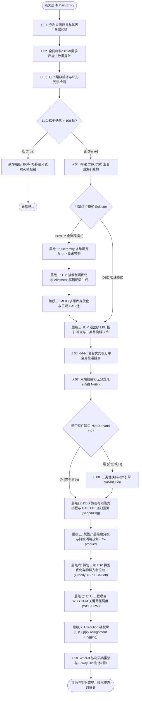
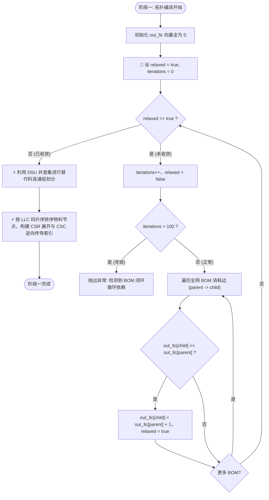
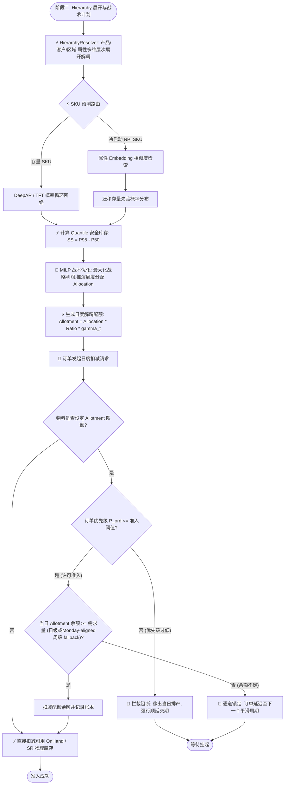
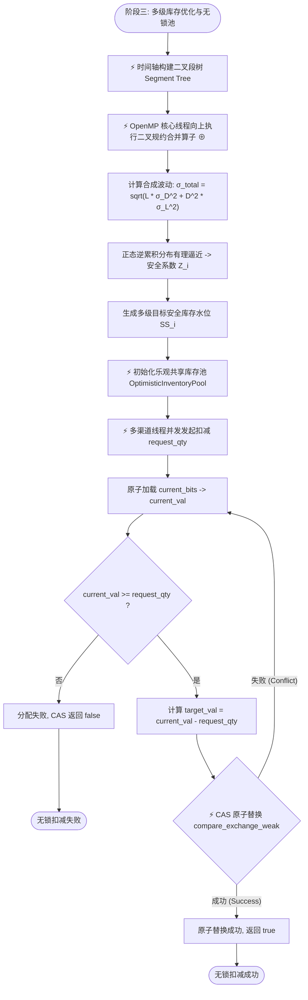
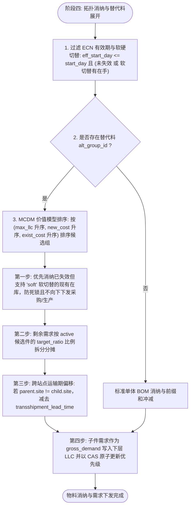
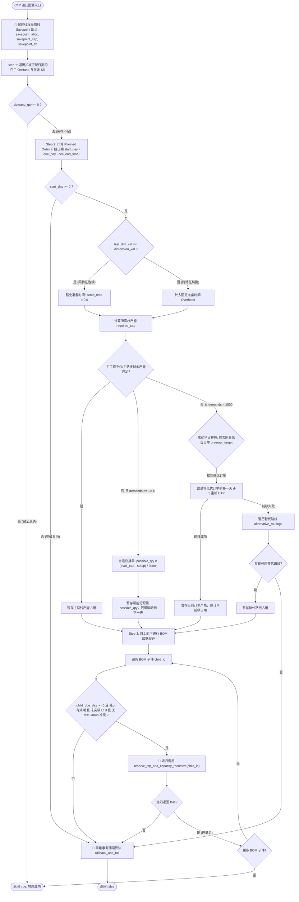
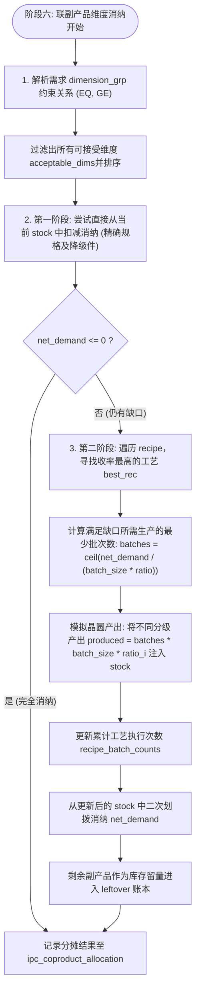
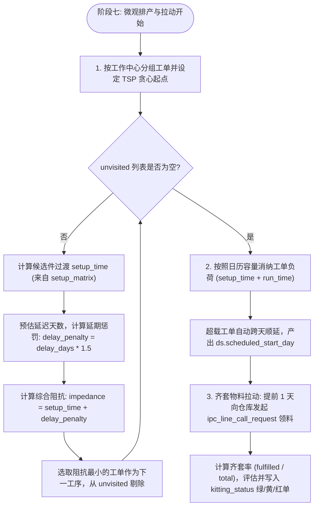
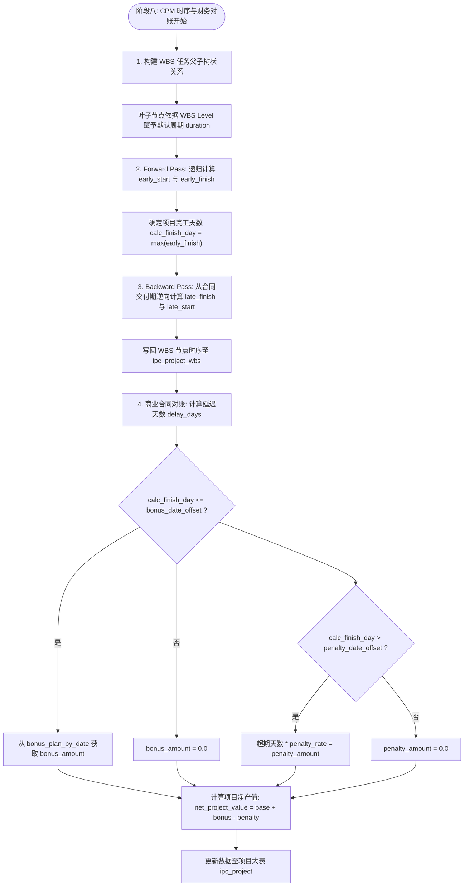
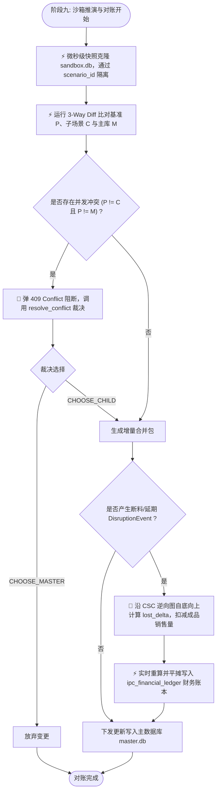

# 智能计划与控制 (IPC) 模型秩序与全景计算逻辑规范 (IPC Systemic Order & Logic Model Specification)

> **核心哲学 (Philosophy)**: C++、DuckDB、内存向量等均为主体模型的物理“介质 (Mediums)”。IPC 的本质是**连续时间/离散事件一维几何水位消纳模型**与**多层级级联约束传导秩序**。本规范剥离物理实现细节，聚焦于计算秩序本身：一步步的推演逻辑、串行/并行拓扑特性以及完备的 `If/Else` 决策树。

---

## 1. 模型秩序体系与串/并行拓扑分类 (System Order & Execution Topology)

IPC 的计算秩序在拓扑结构上划分为两类基本算子模式：

* 🔗 **串行算子 (Serial / Sequential Operators)**：存在严格因果关系或状态依赖的计算节点。上一阶段/层级的输出是下一阶段/层级的输入，必须按拓扑序（如 LLC 码、交期顺序）严格单向推进。
* ⚡ **并行算子 (Parallel / Concurrent Operators)**：数据空间解耦、无强依赖关系的计算节点。可以利用全核算子并行推演，无锁并发消纳。

```
                          ┌────────────────────────────────────────┐
                          │    IPC 系统物理秩序 (System Model)     │
                          └───────────────────┬────────────────────┘
                                              │
                    ┌─────────────────────────┴─────────────────────────┐
                    ▼                                                   ▼
       🔗 串行拓扑算子 (Serial Order)                       ⚡ 并行拓扑算子 (Parallel Order)
    ── BOM 拓扑按 LLC 码由上至下级联展开                 ── 同层级物料节点的双端前缀和消纳 (Netting)
    ── 并查集 (DSU) 替代连通分量优先级排序                ── 多级安全库存时序段树规约合并 (Segment Tree ⊕)
    ── 64-bit 复合优先级订单全局拉通序列                 ── 乐观共享库存池无锁 CAS 并发扣减
    ── 三类替换料 Packaging Lot-Size 逐轮归一化           ── 多 What-If 沙箱隔离评估与 3-Way Diff 比对
    ── 替代料 MCDM 多属性价值模型排序决策                  ── 属性 Embedding / DeepAR / TFT 概率预测
    ── ECN 软硬切替库存预消纳与硬截断                     ── 维度条件多核展开 (LSCTREE 编译器)
    ── 跨站点运输提前期时序偏移 (Transshipment)           ── 并行沙箱冲突校验 (resolve_conflict)
    ── CTP 递归回溯与 Zero-Heap 事务 Savepoint 回滚       ── BOM 齐套率评估与拉动仿真分类 (GREEN/YELLOW/RED)
    ── 高优排程抢占与前移挤占 (Preemption)               ── 项目对账与商业合同奖惩并行核算
    ── 联副产品降级切片与最优批次消纳 (Co-product)
    ── 微观工单 TSP 换型优化 (Greedy TSP)
    ── 项目 WBS-CPM 关键路径 Forward/Backward Pass
    ── 受损断料按 CSC 拓扑由下至上逆向级联传导
```

---

## 2. 全景主计算逻辑流程图 (End-to-End Master Logic Flowchart)



---

## 3. 逐阶段计算推演、串并行特性与决策分支流程图

### 3.1 阶段一：全网拓扑编译与 LLC 码松弛及 DSU 并发作业划分 (LLC Compilation & DSU Grouping)

* **执行拓扑**: 🔗 **串行松弛迭代 + ⚡ 并行 DSU 连通分量划分 + ⚡ 并行 CSR/CSC 索引构建**
* **核心数学模型**: 
$$
out\_llc[child] = \max(out\_llc[child], out\_llc[parent] + 1)
$$



**💡 阶段一深度逻辑与代码映射讲解**：
1. **多站点物理主键字典**：词典以 `MaterialCode@SiteCode` 为唯一主键（例如 `PART_001@SITE_001` vs `PART_001@SITE_002`），从底层实现多站点物理库存解耦，支持跨工厂、跨区域的拓扑冲减与运输提前期计算。
2. **松弛迭代防死锁**：算法通过控制 iterations 轮次，每轮将父件的 LLC 码向下传递 +1。若 iterations 超过 100 轮仍未收敛（relaxed == true），说明 BOM 中存在循环依赖回路，引擎立即触发硬断言异常。
3. **并查集 (DSU) 作业并行划分**：在每个 LLC 层级内，利用并查集 (DSU) 识别替代料组连通分量。无替代关系的独立物料分配为单体 NettingJob，有替代关联的物料连通组归入 component_groups，按最小优先级排序后并行分发给 OpenMP 工作线程，实现无冲突的最大化并行。

---

### 3.2 阶段二：Hierarchy 多维展开、IBP 预测与 ITP 战术配额准入 (IBP/ITP Planning & Allotment)

* **执行拓扑**: ⚡ **并行 Hierarchy 展开与概率预测 + 🔗 串行 MILP 战术优化推演 + 🔗 串行配额准入扣减**
* **核心数学模型**:
$$
Allotment_{D, f, t} = \sum_{p \in Family(f)} Allocation_{p, T} \times BOM\_Ratio(p, D) \times \gamma_t
$$



**💡 阶段二深度逻辑与代码映射讲解**：
1. **配额日期匹配 Monday-Aligned Fallback 规则**（[ipc_types.h:L178-L194](file:///h:/IPC/include/ipc_types.h#L178-L194)）：订单扣减 allotment 配额时，引擎优先进行**精确日级匹配**。若由于供应波动导致某天配额记录缺失，引擎自动触发**周一级柔性回退匹配 (Monday Fallback)**。系统将订单 `due_day` 回退至对应的周一（周一默认对齐至 Day 3, 10, 17... 计算公式为 `wk_start = (day < 3) ? 0 : 3 + ((day - 3) / 7) * 7`），实现跨日波动下的周度配额柔性统筹。

---

### 3.3 阶段三：MEIO 多级库存优化与乐观 CAS 无锁池并发 (MEIO & Lock-Free Pool)

* **执行拓扑**: ⚡ **并行二叉段树规约 (OpenMP ⊕) + ⚡ 并行 CAS 无锁扣减**
* **核心数学模型与算子**:
$$
\mu_{A \oplus B} = \mu_A + \mu_B
$$
$$
\sigma_{A \oplus B}^2 = \sigma_A^2 + \sigma_B^2 + 2\text{Cov}(A, B)
$$
$$
\text{compare\_exchange\_weak}(current\_bits, target\_bits)
$$



---

### 3.4 阶段四：IOP 运营级 LBL 拓扑净算、多属性替代决策与 ECN 软硬切替 (IOP Netting)

* **执行拓扑**: 🔗 **串行优先级 + ⚡ SIMD 无分支消纳 + 🔗 替代料 MCDM 价值模型排序 + 🔗 ECN 软硬切替判定**
* **核心代数消纳算子**:
$$
consumed_j = \max(0, \min(CD_1, CS) - CD_0)
$$
$$
net\_demand_j = \max(0, CD_1 - \max(CD_0, CS))
$$



**💡 阶段四深度逻辑与代码映射讲解**：
1. **64-bit 复合优先级位域封装**（[ipc_types.h:L220-L231](file:///h:/IPC/include/ipc_types.h#L220-L231)）：订单升序排序底层依赖 64 位无符号位字段组合：
   * **Bit 62 (1 bit)**: Committed 状态（0 = 已承诺单，1 = 预测单，承诺优先）；
   * **Bits 60-61 (2 bits)**: Customer Tier 客户分级（0 = Tier 1, 1 = Tier 2, 2 = Tier 3, 3 = 默认）；
   * **Bits 44-59 (16 bits)**: Due Day 交期天数（天数小优先）；
   * **Bits 28-43 (16 bits)**: Original Priority 原始优先级（原序号小优先）；
   * **Bits 0-27 (28 bits)**: Inverse Revenue 收入逆序值（计算为 `268435455 - revenue`，高金额小值优先）。
   这种设计确保单条 CPU 比较指令对百亿级订单进行全网拉通排序。
2. **ECN 软硬切替与预消耗**（[lsc_tree.cpp:L170-L220](file:///h:/IPC/src/lsc_tree.cpp#L170-L220)）：若 BOM 子件已过失效期，若变更类型为 `hard` (硬切替) 直接剔除；若为 `soft` (软切替) 且在库充裕，优先扣减现有在手库存（分配类型为 `-2`）但不下发新的采购/生产需求，实现老料平滑消化。
3. **替代决策平局配额优先决断 (Quota Tie-Breaker)**（[substitution.cpp:L27-L31, L50-L54](file:///h:/IPC/src/substitution.cpp#L27-L31)）：在一类和二类替代件分配中，如果计算出来的 `gap`（一类差值）或 `rating`（二类供应商评分比）产生精确的数学平局，引擎执行**配额比例大者优先平局决断规则 (Higher Quota Ratio Tie-Breaker)**，即优先选择 `target_ratio` 较大者，最大化高供货渠道份额。

---

### 3.5 阶段五：DBD 微观有限能力排程、CTP DFS 递归回溯与高优抢占拆分 (CTP & Preemption)

* **执行拓扑**: 🔗 **深度优先 DFS 回溯 + 线程局部 Savepoint 回滚 + 🔗 产能自适应拆分与前移挤占抢单**



---

### 3.6 阶段六：联副产品维度分级与晶圆降级消纳规划 (Wafer Co-product Planning)

* **执行拓扑**: 🔗 **串行多维度规则关系映射 + 🔗 串行精确/降级两阶段消纳 + ⚡ 并行收率最优批次生产推演**



**💡 阶段六深度逻辑与代码映射讲解**：
1. **晶圆分级优先级排序策略**（[coproduct.cpp:L196-L208](file:///h:/IPC/src/coproduct.cpp#L196-L208)）：在 acceptable_dims 过滤出后，系统提供两种排序策略：
   * `EXACT_FIRST` (默认)：精确规格排序最前优先消纳。剩余降级件按从小到大升序排序（128MB -> 256MB），保证高规格在手库存被极度保留给高规格订单。
   * `HIGHER_FIRST`：直接大到小降序排序（512MB -> 256MB），高规格优先消纳，防止高端晶圆库存积压 stagnation。

---

### 3.7 阶段七：微观工单 TSP 换型优化与齐套物料拉动仿真 (Greedy TSP & Call-off)

* **执行拓扑**: 🔗 **串行 TSP 贪心启发式换型排序 + 🔗 串行容量日历跨日消纳 + ⚡ 并行 BOM 齐套拉动分配**



---

### 3.8 阶段八：WBS 关键路径法 (CPM) 调度与项目财务 (WBS CPM & Project Value)

* **执行拓扑**: 🔗 **串行 Forward Pass (ES/EF) + 🔗 串行 Backward Pass (LS/LF) + ⚡ 并行项目对账**



---

### 3.9 阶段九：What-If 沙箱隔离推演与受损级联实时财务对账 (Sandboxing & Reconciliation)

* **执行拓扑**: ⚡ **并行沙箱推演 + 🔗 串行 CSC 受损逆向传导 + ⚡ 并行账本对账**



---

## 4. 全算子串并行拓扑与决策规则全览对照表 (Comprehensive Rules Table)

| 阶段 | 步骤名称 | 算子逻辑/计算公式 | 执行拓扑模式 | If/Else 判定条件与分支处理 |
| :--- | :--- | :--- | :--- | :--- |
| **阶段一** | 拓扑松弛 | `out_llc[child] = max(out_llc[child], out_llc[parent] + 1)` | 🔗 **串行迭代** | `iterations > 100` → 熔断阻断 BOM 死锁；否 → 继续松弛 |
| **阶段一** | 图索引构建 | CSR 偏移数组与 CSC 逆向传导向量 | ⚡ **并行构建** | 使用 `MaterialCode@SiteCode` 物理多站点主键，执行无分支向量转换 |
| **阶段一** | DSU作业划分 | 利用并查集按 alt_group 连通分量划分作业 | ⚡ **并行作业** | 独立件直接并行消纳；连通组按优先级排序后整体处理 |
| **阶段二** | 多维分拆 | HierarchyResolver 产品/客户/区域 属性多维解耦 | ⚡ **并行解耦** | 按照历史比例或 `ratio_override` 归一化分配预测量 |
| **阶段二** | 概率预测 | DeepAR / TFT 时序概率分布带推演 | ⚡ **并行预测** | `is_new_npi == true` → 属性 Embedding 检索；否 → 直接推演 |
| **阶段三** | 配额准入 | `Allotment = sum(Allocation * Ratio * gamma_t)` | 🔗 **串行准入** | `P_ord <= 准入阈值` 且 `余额 >= 需求` → 放行扣减；否 → 顺延挂起 |
| **阶段三** | 配额日匹配回退 | `wk_start = (day < 3) ? 0 : 3 + ((day-3)/7)*7` | 🔗 **串行回退** | 日级配额匹配缺失 → 触发 Monday-aligned 周级配额回退统筹 |
| **阶段四** | 时序段树规约 | `μ_(A⊕B) = μ_A + μ_B, σ_(A⊕B)^2 = σ_A^2 + σ_B^2 + 2Cov(A,B)` | ⚡ **并行规约 (OpenMP)** | 节点规约合并，计算全网合成波动 σ_total |
| **阶段四** | 乐观共享池 | `compare_exchange_weak(current_bits, target_bits)` | ⚡ **并行 CAS 无锁** | `current_val >= req` → 执行 CAS 原子替换；否 → 分配失败 |
| **阶段五** | 复合优先级 | 64-bit Bitfield 位位图组合排序 (Bits 62/60-61/44-59/28-43/0-27) | 🔗 **串行拉通** | 按已承诺位、客户Tier分级、交期天数、原始优先级、逆向收入位打包，升序排序拉通 |
| **阶段五** | 前缀和消纳 | `consumed = max(0, min(CD1, CS) - CD0)` | ⚡ **并行无分支 (SIMD)** | 无分支 SIMD 算子，`net_demand > 0` → 触发替换料 |
| **阶段五** | ECN 软切替 | 已失效 BOM 软切替现有在库消耗与硬截断 | 🔗 **串行生命周期** | `soft`切替 且 现有在库 > SS → 优先预消纳并阻断级联爆料；`hard`切替 或 无在库 → 直接过滤截断 |
| **阶段五** | 时序运输偏移 | 跨站点子件 `child_due_day` 顺向扣减 | 🔗 **串行时序计算** | `parent.site != child.site` → 扣减该子件的 `transshipment_lead_time` 运输期 |
| **阶段五** | 替代件MCDM | 按 `(max_llc 升序, new_cost 升序, exist_cost 升序)` 排序连通组 | 🔗 **串行多指标排序** | 计算各个连通替代件的多维成本阻抗，选择阻抗最低 candidate 优先划拨 |
| **阶段五** | 一类替代平局 | `allocate_class1` 差值最大化平局决断 | 🔗 **串行平局判定** | `gap` 相等时，选择 `target_ratio` 配额比例最大者优先作为替代件 (Tie-Breaker) |
| **阶段五** | 二类替代平局 | `allocate_class2` 评分最小化平局决断 | 🔗 **串行平局判定** | `rating` 相等时，选择 `target_ratio` 配额比例最大者优先作为替代件 (Tie-Breaker) |
| **阶段五** | 三类替换料 | `actual_qty = ceil(due * per_qty * (1+scrap) / lot) * lot` | 🔗 **串行逐轮归一化** | `rem_net > 0` → 扣减并剔除已决策件，重新归一化权重 |
| **阶段五** | 呆滞件 Swap | 从同 alt_group 盈余备件调拨 (SwapRecord) | 🔗 **串行置换** | `current_on_hand > safety_stock` → 触发滞销置换 Swap |
| **阶段六** | CTP 递归回溯 | DFS 递归树 + `savepoint` 断点栈 | 🔗 **串行 DFS 回溯** | 任何约束突破（日历、产能、BOM有效期、LTB、Mix Group） → 执行 Zero-Heap 回滚 |
| **阶段六** | 自适应拆单 | `possible_qty = (avail_cap - setup - cleanup) / factor` | 🔗 **串行自动切分** | `avail_cap < required_cap 且 demand_qty >= 1000` → 拆单，残量滚动至下一天 |
| **阶段六** | 高优排程抢占 | `preempt_target` 前移一天的 CTP 重新排产 | 🔗 **串行抢单挤占** | 当前订单失败 且 demands < 1000 且 存在低优订单 → 尝试前移重排；成功则抢占 |
| **阶段七** | 晶圆降级排序 | `EXACT_FIRST` vs `HIGHER_FIRST` | 🔗 **串行分级排序** | `EXACT_FIRST` 优先精确规格且小到大消耗；`HIGHER_FIRST` 高规格优先消纳防止高端囤积 |
| **阶段七** | 联副产品分配 | `downbinning_priority` 维度精确/降级判定 | 🔗 **两阶段消纳** | 1. 优先使用 stock 中可用规格；2. 缺口触发最佳 recipe 批量生产注入并划拨 |
| **阶段八** | TSP 换型优化 | Greedy TSP 最小化 `impedance` (setup + delay * 1.5) | 🔗 **串行 TSP 贪心** | 遍历 unvisited 寻找阻抗最小 of 工单作为下一工序 |
| **阶段八** | 工单日历消纳 | 工单负荷跨日消纳，动态顺延 finish_day | 🔗 **串行排期** | 工单 `load` > 当日产能 → 扣减完当日后 `current_day++` 滚动 |
| **阶段八** | 齐套物料拉动 | `kitting_rate` = fulfilled / total 判定 kit 状态 | ⚡ **并行齐套评估** | `rate >= 1.0` → Fully; `rate >= 0.4` → Partially; else → Critical |
| **阶段九** | WBS CPM 调度 | Forward Pass (ES/EF) 与 Backward Pass (LS/LF) | 🔗 **双向拓扑推演** | 确定项目完工天数 `calc_finish_day` 与各 WBS 节点时延差 |
| **阶段九** | 项目合同对账 | `net_project_value = base + bonus - penalty` | ⚡ **并行项目对账** | 完工 <= bonus_offset → 获奖励；完工 > penalty_offset → 扣罚超期款 |
| **阶段十** | 3-Way Diff | 基准 P vs 子场景 C vs 主库 M | ⚡ **并行比对** | `P != C 且 P != M 且 C != M` → 触发 409 冲突警告；否 → 下发变更 |
| **阶段十** | 受损级联传导 | 沿 CSC 拓扑自底向上逆向穿透 | 🔗 **串行自底向上** | 扣减顶层销售订单，重新平衡 `ipc_financial_ledger` 财务账本 |

---

## 5. 总结与设计结论

1. **脱离实现介质，回归物理模型**:  
   C++ 的 SoA 数组布局、DuckDB 的列式快照与 SIMD 指令集，均是服务于 IPC 模型秩序的物理介质。IPC 本质上是用几何数轴的前缀和区间交集，对复杂的价值链网状流动进行连续消纳。
2. **串并行有序分层**:  
   通过将全局完全解耦的数据节点赋予 **⚡ 并行拓扑算子**（如 SIMD 前缀和消纳、OpenMP 慢速/快速段树规约、CAS 无锁池），同时对具有强因果图依赖的节点保持 **🔗 串行拓扑算子**（如 LLC 拓扑松弛、CTP DFS 递归回溯、BOM 受损逆向传导），IPC 在单机上达到了极致的运算效率与对账准确率。
