# IPC 计划决策引擎全景数据字典 (Advanced ER Data Dictionary)

本数据字典详细记录了基于 Kinaxis 命名重构后、运行在 DuckDB 分析层之上的全量 **190+** 张自主物理表与关联视图的结构、业务释义及主外键约束，融入了包括配额防波堤、时空置换、半导体分级降级消纳在内的全部核心算法设计。

## 📐 一、 物理数据库核心 ER 关系架构图

```mermaid
erDiagram
    %% ==========================================
    %% 核心物料主数据与工厂站点 (Core Master Data)
    %% ==========================================
    ipc_part ||--o{ ipc_part_site : "localizes SKU"
    ipc_site ||--o{ ipc_part_site : "hosts SKU"
    ipc_part_site ||--o{ ipc_onhand : "stores stock"
    ipc_part_site ||--o{ ipc_location : "registers storage"
    ipc_inventory_type ||--o{ ipc_onhand : "classifies usable status"
    ipc_system_uom ||--o{ ipc_part : "measures base qty"
    ipc_system_uom_group ||--o{ ipc_system_uom : "standardizes types"
    ipc_abc_class ||--o{ ipc_part_site : "segmentizes SKU value"
    
    %% ==========================================
    %% BOM 工艺路线与产能资源 (BOM, Routing & Resource Capacity)
    %% ==========================================
    ipc_part_site ||--o{ ipc_bom_route : "defines product structure"
    ipc_bom_route ||--o{ ipc_bom_item : "explodes sub-components"
    ipc_alt_grp_type ||--o{ ipc_bom_item : "governs substitution rules"
    ipc_bom_route ||--o{ ipc_routing : "sequences processes"
    ipc_routing ||--o{ ipc_work_center : "allocates to WC"
    ipc_work_center ||--o{ ipc_work_center_capacity : "allocates machine hours"
    ipc_constraint ||--o{ ipc_constraint_assignment : "tracks bottleneck resources"
    ipc_constraint_assignment ||--o{ ipc_part_site : "binds part load"
    ipc_constraint ||--o{ ipc_constraint_available : "specifies daily capacity"
    
    %% ==========================================
    %% 需求预测、销售与共识计划 (ITP Forecasting & Sales)
    %% ==========================================
    ipc_part_site ||--o{ ipc_sales_order_line : "receives orders"
    ipc_customer ||--o{ ipc_sales_order_line : "commits purchase"
    ipc_customer ||--o{ ipc_hierarchy_customer : "groups hierarchy"
    ipc_sales_order_line ||--o{ ipc_demand_status : "manages state transitions"
    ipc_demand_type ||--o{ ipc_sales_order_line : "classifies priority rank"
    
    ipc_part_site ||--o{ ipc_forecast : "receives predictions"
    ipc_forecast ||--o{ ipc_forecast_detail : "disaggregates buckets"
    ipc_consensus_forecast ||--o{ ipc_consensus_forecast_detail : "unifies corporate plans"
    ipc_forecast_detail ||--o{ ipc_consensus_forecast_detail : "calculates weights rollup"
    ipc_forecast_causal_factor ||--o{ ipc_forecast_causal_factor_detail : "adjusts promotional lift"
    
    %% ==========================================
    %% 供需消纳与计划决策账本 (IOP MRP & CTP Pegging)
    %% ==========================================
    ipc_sales_order_line ||--o{ ipc_supply_assignment : "pegged for delivery"
    ipc_forecast ||--o{ ipc_supply_assignment : "pegged for replenishment"
    ipc_planned_order ||--o{ ipc_supply_assignment : "manufactures stock"
    ipc_scheduled_receipt ||--o{ ipc_supply_assignment : "supplies in-transit goods"
    ipc_onhand ||--o{ ipc_supply_assignment : "consumes physical stock"
    
    %% ==========================================
    %% MEIO 安全库存优化 (IO Safety Stock Policy)
    %% ==========================================
    ipc_part_site ||--o{ ipc_io_safety_stock_item : "optimizes safety stock levels"
    ipc_io_ss_rule ||--o{ ipc_io_safety_stock_item : "configures formula inputs"
    ipc_io_safety_stock_item ||--o{ ipc_io_safety_stock_time_phased_result : "outputs daily targets"
    ipc_io_safety_stock_time_phased_bounds ||--o{ ipc_io_safety_stock_time_phased_result : "clips bounds"
    
    %% ==========================================
    %% WBS 项目管理与跨站点物流 (ETO Projects & Logistics)
    %% ==========================================
    ipc_project ||--o{ ipc_project_wbs : "breaks down work tasks"
    ipc_project_wbs ||--o{ ipc_critical_path : "solves CPM schedule"
    ipc_project_wbs ||--o{ ipc_part_site : "pulls custom component"
    
    ipc_logistic_location ||--o{ ipc_logistics_delivery_route : "origin DC"
    ipc_logistics_delivery_route ||--o{ ipc_logistics_stock_transfer_order : "executes transshipment"
    ipc_logistics_transportation_mode ||--o{ ipc_logistics_delivery_route : "determines speed cost trade-off"
    
    %% ==========================================
    %% 日历、财务账本与场景控制 (Calendars, Ledgers & Collaboration)
    %% ==========================================
    ipc_sop_planning_calendar ||--o{ ipc_sop_calendar_date : "instantiates timeline"
    ipc_sop_planning_calendar ||--o{ ipc_site : "controls operational days"
    ipc_sop_planning_calendar ||--o{ ipc_work_center_capacity : "maps shift hours"
    
    ipc_supply_assignment ||--o{ ipc_financial_ledger : "posts revenue and penalty cost"
    ipc_collab_scenario ||--o{ ipc_collab_audit_log : "records sandboxed edits history"
```



## 📂 二、 业务功能模块归档

- **1. 核心计划与排产 (Core Planning - MPS/MRP)**: 包含 10 张表
- **2. 联副产品分级优化 (Co-product Optimization)**: 包含 0 张表
- **3. ETO 协同项目管理 (ETO Project & WBS)**: 包含 6 张表
- **4. IBP 财务与预测共识 (IBP Consolidated Planning)**: 包含 30 张表
- **5. IO 安全库存水位优化 (IO Safety Stock Policy)**: 包含 12 张表
- **6. 基础支撑与主数据 (Master Data & Metadata)**: 包含 140 张表

---

## 📝 三、 数据表与字段明细说明

### 1. 核心计划与排产 (Core Planning - MPS/MRP)

#### 🏷️ `ipc_bom_item` (bom_item)
> **业务说明**: BOM行项目明细表。定义组装件与子组件的父子拓扑关系，包含替代组（alt_grp）、分配优先级（priority）、替代迄今累计消耗量、目标占比（target）等核心替代控制字段。

| 字段编码 (Field Code) | 字段物理名 (Field Name) | 物理类型 (Data Type) | 必填/键 (Key) | 详细业务备注 (Comment) |
| :--- | :--- | :--- | :--- | :--- |
| `bomid` | bomid | `VARCHAR(10)` | Nullable | BOM编号 |
| `site` | site | `VARCHAR(8)` | 🔑 **PK / Required** | 工厂或仓库站点编码 (Site Code，对应 SAP 的 Plant) |
| `component` | component | `VARCHAR(40)` | Nullable | 组件
Reference Table: Material |
| `eff_start_date` | eff_start_date | `DATE` | Nullable | 生效日期 |
| `eff_end_date` | eff_end_date | `DATE` | Nullable | 失效日期 |
| `ratio` | ratio | `DECIMAL(18,2)` | Nullable | 采购比例，0-1表示还是0-100表示取决于MaterialBOMRouting.RatioRule |
| `perqty` | perqty | `DECIMAL(18,2)` | Nullable | 每单位assemble所用component的数量 |
| `scrap` | scrap | `DECIMAL(18,2)` | Nullable | 指定在组装的生产过程中丢失的组件的比例。例如，由于破损。 |
| `alt_grp` | alt_grp | `VARCHAR(10)` | Nullable | 替代组编码，相同替代组内的组件物料属于可替换物料 |
| `priority` | priority | `INTEGER` | Nullable | 优先级，数值越小越优先 |
| `alt_todate_qty` | alt_todate_qty | `DECIMAL(18,2)` | Nullable | 指示迄今为止已分配给此替代BOM的数量（例如，它可能代表已知的输入供应分配）。此值应以组件库存单位表示，并用于初始替代BOM级别的决策。此字段适用于替代BOM记录，其中altgrp.type.source_rule设置为“on_going”，并在确定一组中哪些可替代组件应生成计划订单以满足装配的依赖需求的逻辑中使用。 |
| `target` | target | `DECIMAL(18,2)` | Nullable | 确定在创建计划订单时，来自组装的依赖需求分解到替代组中的组件的比例或百分比。这个值应以组装件的供应单位来表示。然后，应该分解到组件的需求百分比被计算为组件的目标值除以组中所有组件的目标值之和。请注意，根据AlternateGroupType表上ComponentSourceRule字段中的设置，来自组装物料的每个依赖需求要么按比例在可替换组件之间分割，要么完全分配给可替换组件，否则该组件将远离其当前目标。如果计划的订单只应该在组中的主要组件上创建，那么可以在该字段中为其分配一个正值，并且应该为所有其他组件分配一个值0(零)。如果计划的订单应该均匀地分布在组中的所有组件上，那么可以在这个字段中为每个组件分配相同的正值(例如，可以指定值1)。 |
| `item` | item | `INTEGER` | Nullable | BOM行项目编号 |
| `operation` | operation | `VARCHAR(10)` | Nullable | 工序ID |
| `alt_bom` | alt_bom | `VARCHAR(10)` | Nullable | 替换的BOM版本号 |
| `alt_group` | alt_group | `VARCHAR(10)` | Nullable | 唯一标识，自动加1 |

##### 🔄 算法编排与数据结构设计 (Algorithm & Data Structure Specification)

###### 1. 业务算法编排：多级替代料 Lot-size 重归一化分摊
* **因果流向**：当 `ipc_planned_order` 生成组件净需求时，若发现主要组件缺料，系统触发替代判定。查询 `alt_grp` 不为空的 BOM 记录，锁定备选物料集合。
* **分摊算法编排**：
  1. 计算组内理论需求：根据各替代件的 `target`（占组内比例）与 `priority`（优先级）分摊净需求。
  2. 包装规格向上舍入：依据 `ipc_part_site` 的 `lot_size` 与当前 BOM 的 `scrap`（损耗率）对分配量向上取整：
     $$ Actual\_Qty = \lceil \frac{Due\_Qty \times perqty \times (1 + scrap)}{lot\_size} \rceil \times lot\_size $$
  3. 溢出残差抵消：因舍入导致的多余供应量，按 `perqty` 反向换算为父件等价值，抵消上层剩余净需求。
  4. 动态重归一化：将已决策件移出活跃集，对其余备选件的分配比例按剩余 `target` 重新计算分摊系数（Re-normalization）：
     $$ Ratio_i^{new} = \frac{target_i}{\sum_{k \in \text{Remaining}} target_k} $$
  5. 结果落库：写入 `ipc_planned_supply_assignment` 的 Pegging 分配明细，并在 `ipc_planned_order` 中记录具体被采购/制造的替代件供应。

###### 2. 物理内存结构设计 (C++ DOD Layout)
在 C++ 引擎中，为了避免在 BOM 树上反复跳转指针（Pointer Chasing）造成 L1/L2 Cache 失效，所有的 `ipc_bom_item` 表数据在初始化时，被一次性编译进一个**一维扁平、连续分布的 `flat_boms` 数组**中，其单条记录 `FlatBomItem` 在内存中严格对齐。

```cpp
// 对应 ipc_bom_item 表的 C++ DOD 物理对齐结构体 (255 bytes / 64 bytes cache-line aligned)
struct FlatBomItem {
    uint32_t parent_id;          // 父物料ID (由字符串哈希化或全局唯一的逻辑索引)
    uint32_t child_id;           // 子组件ID
    double per_qty;              // 每单位 assemble 消耗的子组件数量 (对应 perqty)
    double scrap;                // 制造损耗率 (对应 scrap)
    int alt_group_id = -1;       // 替代组逻辑编号 (对应 alt_group)
    int alt_priority = 0;        // 替代优先级 (对应 priority，值越小越优先)
    double target_ratio = 1.0;   // 目标分配比例 (对应 target)
    double historical_qty = 0.0; // 迄今为止累计消耗量 (对应 alt_todate_qty)
    double lot_size = 0.0;       // 包装规格批值 (对应 lot_size)
    uint8_t relation_op = 0;     // 关系操作符 (PASS=0, EQ=1...) 用于半导体分级
    double target_dim_val = 0.0; // 目标特征维度值 (用于 Dimension 映射)
    int eff_start_day = -1;      // 生效起始天数 (以 RunDate 为 0 的相对偏移天数)
    int eff_end_day = -1;        // 生效失效天数
    double ltb_limit = -1.0;     // 生命周期终期买入总量上限 (LTB Limit)
    int mix_group_id = -1;       // 排他性混合组ID (Mix Group ID)
    std::string relationship_type = "alt"; // 替代关系类型
};

// CSR (Compressed Sparse Row) 全网拓扑压缩结构
struct FlatTopology {
    // 偏移索引：Part_i 的子 BOM 行项目，在 flat_bom_items 数组中的偏移量为:
    // [ parent_to_bom_offsets[Part_i], parent_to_bom_offsets[Part_i + 1] )
    std::vector<size_t> parent_to_bom_offsets;
    std::vector<FlatBomItem> flat_bom_items;
};
```

###### 3. 边界与异常处理
* **BOM 环路判定（Loop detection）**：引擎在加载 `ipc_bom_item` 编译拓扑时，采用松弛算法更新各物料的 `low_level_code`。若出现 A -> B -> A 循环引用，且检测深度迭代超过 100 层，系统触发刚性报错熔断，防止 DFS 栈溢出。
* **BOM 有效期过滤**：在 CTP 递归预占时，系统会检查子件的 `eff_start_day` 与 `eff_end_day`。若排产日期超出有效期，系统自动跳过该 BOM 项，并触发替代料或报错流程。

---


#### 🏷️ `ipc_bom_route` (part_routing_bom)
> **业务说明**: 物料工艺BOM关系表（BOM Route）。将物料、工艺路线和BOM ID进行绑定，支持基于生效日期和优先级进行路由选择，特别包含维度组（dim_grp）以过滤匹配特定的多维分配路径。

| 字段编码 (Field Code) | 字段物理名 (Field Name) | 物理类型 (Data Type) | 必填/键 (Key) | 详细业务备注 (Comment) |
| :--- | :--- | :--- | :--- | :--- |
| `site` | site | `VARCHAR(8)` | 🔑 **PK / Required** | 工厂或仓库站点编码 (Site Code，对应 SAP 的 Plant) |
| `part` | part | `VARCHAR(40)` | 🔑 **PK / Required** | 物料唯一编码 (Part Code) |
| `bomid` | bomid | `VARCHAR(40)` | PK / NOT NULL | BOM编号
Reference Table: BOM |
| `routing` | routing | `VARCHAR(10)` | Nullable | Routing编号
Reference Table:Routing |
| `dim_grp` | dim_grp | `VARCHAR(10)` | Nullable | ReferenceTable:Dimension |
| `eff_start_date` | eff_start_date | `DATE` | Nullable | 有效开始日期
默认值：2020.8.31 |
| `eff_end_date` | eff_end_date | `DATE` | Nullable | 生效结束日期 2030.8.31 |
| `yield` | yield | `DECIMAL(18,2)` | Nullable | - |
| `max_qty` | max_qty | `DECIMAL(18,2)` | Nullable | - |
| `priority` | priority | `INTEGER` | Nullable | 优先级，数值越小越优先 |
| `bom_type` | bom_type | `VARCHAR(10)` | Nullable | Reference Table: MaterialBOMRoutingType |

##### 🔄 算法编排与数据结构设计 (Algorithm & Data Structure Specification)

###### 1. 业务算法编排：多路径 CTP 选择与工艺分配
* **因果流向**：当 `ipc_planned_order` 生成制造补货需求时，求解器需要决定该工单运行在哪个设备/工艺路线（Routing）上。系统查询 `ipc_bom_route` 表，锁定该站点下该物料对应的可用工艺版本 `bomid` 与 `routing`。
* **工艺选择编排**：
  1. 优先级遍历：按 `priority` 从小到大依次尝试各路线。
  2. 有效期过滤：校验排产日期是否落在 `eff_start_date` 与 `eff_end_date` 区间内。
  3. 产能可用性校验：调用 CTP 引擎检测对应的 `ipc_resource_capacity` 天级负荷。若主路线产能超载，则递归选择优先级较低的替代工艺路线（Alternative Routing）。
  4. 特征维度匹配：读取 `dim_grp`，过滤仅匹配当前订单特征维度（如半导体分级）的特定分配路线。

###### 2. 物理内存结构设计 (C++ DOD Layout)
在 C++ 引擎中，每个物料站点的工艺和替代路线被编译为 SoA 对齐的备选路由数组，用于 DFS 递归时进行高速检索：

```cpp
// 关联 ipc_bom_route 的 C++ DOD 物理数据结构
struct ConstraintConsumption {
    uint32_t constraint_id;  // 资源约束ID (对应 ipc_constraint 表的主键)
    double factor;           // 产能消耗系数 (单位工时比率，对应 constraint_factor)
};

struct AlternativeRouting {
    uint32_t routing_id;                            // 替代路线逻辑ID
    std::vector<ConstraintConsumption> constraints; // 绑定的资源及产能消耗系数
    double routing_cost = 0.0;                      // 路线选择的惩罚/转产成本
    int priority = 0;                               // 优先级 (对应 priority)
};

// 对应 ipc_bom_route 的主约束记录体
struct SourceConstraintRecord {
    uint32_t part_id;
    uint32_t constraint_id;
    double constraint_factor;
    double before_fixed_factor; // 洗枪换型固定时间 (Setup Overhead)
    double after_fixed_factor;  // 清理固定工时 (Clean-up Overhead)
    
    std::vector<ConstraintConsumption> extra_constraints; // 伴生多约束
    std::vector<AlternativeRouting> alternative_routings;  // 备选替代工艺路线数组
};
```

---


#### 🏷️ `ipc_onhand` (oh_inventory)
> **业务说明**: 物理在库库存表。记录每个库位、物料在不同站点和可用日期下的实际物理在库数量，是 LBL-MRP 供需消纳计算的库存初始水位。

| 字段编码 (Field Code) | 字段物理名 (Field Name) | 物理类型 (Data Type) | 必填/键 (Key) | 详细业务备注 (Comment) |
| :--- | :--- | :--- | :--- | :--- |
| `location` | location | `VARCHAR(10)` | PK / NOT NULL | 具体的物理库位编码 |
| `part` | part | `VARCHAR(40)` | 🔑 **PK / Required** | 物料唯一编码 (Part Code) |
| `site` | site | `VARCHAR(8)` | 🔑 **PK / Required** | 工厂或仓库站点编码 (Site Code，对应 SAP 的 Plant) |
| `available_date` | available_date | `DATE` | PK / NOT NULL | 实际供应可用或可承诺交付日期 (ATP Date) |
| `qty` | qty | `DECIMAL(18,2)` | Nullable | 数量 (Quantity) |
| `inventory_type` | inventory_type | `VARCHAR(10)` | Nullable | 库存类型 |

##### 🔄 算法编排与数据结构设计 (Algorithm & Data Structure Specification)

###### 1. 业务算法编排：物理在库初始水位消纳
* **因果流向**：`ipc_onhand` 是 IOP 运行时，在 RunDate（T=0）时刻的库存物理快照。
* **冲抵算法编排**：
  1. 计算初始可用水位：在 MRP 消纳循环开始时，引擎抓取 `available_date` 小于等于计划期起始日的全部 `qty`，累加作为该 SKU 站点的初始在手水位 $CS_0$。
  2. 订单扣减：实际订单或预测通过 CTP 预占时，首先扣减 $CS_0$ 的在库现有量。
  3. 状态跃迁：扣减成功后，并不直接修改数据库，而是临时记录于事务栈中；待全部齐套并确认成交后，将扣减结果以 Planned Pegging 写入 `ipc_planned_supply_assignment` 并扣减 `ipc_onhand` 中的物理在库量。

###### 2. 物理内存结构设计 (C++ DOD Layout)
在内存中，库存现有量并不是以离散的表行记录存储，而是深度融合在 `Axis`（水位数轴）中，并且通过**乐观无锁 SS 池化（Optimistic SS Pooling）**解决多渠道高并发扣减的锁竞争：

```cpp
// 对应 ipc_onhand 数据的内存数轴
struct Axis {
    std::vector<double> qtys;       // 离散事件发生数量 (D_i / S_j)
    std::vector<double> cum_qtys;   // 累加前缀和，表达水位高度 (C_i / A_j)
    std::vector<uint64_t> dates;    // 严格递增的事件日期轴 (以分钟/天表示)
};

// 乐观无锁库存分配共享池 (用以消除多渠道扣减时的物理表锁)
struct alignas(64) OptimisticInventoryPool {
    std::atomic<uint64_t> raw_bits; // 将 double 重新转译为 uint64_t 以实施原子操作
    
    // 采用 CAS (Compare-And-Swap) 乐观无锁扣减，达到单核数百万次/秒的并发分配吞吐
    bool allocate_stock_cas(double request_qty) {
        uint64_t current_bits = raw_bits.load(std::memory_order_relaxed);
        double current_val;
        uint64_t target_bits;
        double target_val;
        do {
            std::memcpy(&current_val, &current_bits, sizeof(double));
            if (current_val < request_qty) return false; // 库存不足，直接失败
            target_val = current_val - request_qty;
            std::memcpy(&target_bits, &target_val, sizeof(double));
        } while (!raw_bits.compare_exchange_weak(
            current_bits, target_bits,
            std::memory_order_release, std::memory_order_acquire
        ));
        return true;
    }
};
```

---


#### 🏷️ `ipc_part` (核心物料主数据表 (Decoupled Part))
> **业务说明**: 核心物料主数据表（解耦后的主物料）。定义全局物料的物料编码、类型（成品/半成品/原料/替代料）和销售单价，是整个供应链网络节点拓扑的根基。

| 字段编码 (Field Code) | 字段物理名 (Field Name) | 物理类型 (Data Type) | 必填/键 (Key) | 详细业务备注 (Comment) |
| :--- | :--- | :--- | :--- | :--- |
| `part` | 物料编码 | `VARCHAR(100)` | 🔑 **PK / Required** | 物料唯一编码 (Part Code) |
| `part_type` | 物料类型 | `VARCHAR(50)` | Nullable | 物料分类：FINISHED (产成品), SEMI (半成品), RAW (原材料), ALT (替代料) |
| `uom` | 基本计量单位 | `VARCHAR(20)` | Nullable | 计量单位，如 PCS, KG |
| `selling_ave_price` | 平均销售单价 | `DOUBLE` | Nullable | 财务结算及营业收入折算的基准平均售价 |

##### 🔄 算法编排与数据结构设计 (Algorithm & Data Structure Specification)

###### 1. 业务算法编排：全局物料索引映射
* **因果流向**：`ipc_part` 是全局物料的主索引，用来区分 FINISHED（成品）、SEMI（半成品）、RAW（原材料）和 ALT（替代料）。
* **算法编排**：所有的 BOM 拓扑编译、MRP 展开、替代组分类都基于此主表的物料主键进行级联。在财务对账时，引擎根据 `selling_ave_price`（平均售价）对订单满足率折算为实时营业收入（Consensus Revenue），写入财务总账。

###### 2. 物理内存结构设计 (C++ DOD Layout)
* **无指针索引**：在内存中，为了消除海量字符串物料号（如 `VARCHAR(100)`）带来的哈希检索和指针寻址开销，IPC 在数据加载期进行 **全局 Index 化转换**。
* **物理映射**：将所有的 `part` 编码映射为一个连续的 `uint32_t part_id`，作为内存一维数组的 Offset。例如，`parts_vector[part_id]` 即为对应的物料配置，实现 $O(1)$ 的裸金属级硬件寻址效率，彻底根治 Cache Line 的高频换入换出。

---


#### 🏷️ `ipc_part_site` (物料站点关系配置表 (Decoupled PartSite))
> **业务说明**: 物料站点关系配置表（解耦后的 PartSite）。指定特定物料在特定生产厂区或仓库站点下的配货策略、MRP规则、安全库存规则（ss_rule）、虚拟物料标识（is_phantom）、以及我们特有的跨站点调拨成本与提前期参数。

| 字段编码 (Field Code) | 字段物理名 (Field Name) | 物理类型 (Data Type) | 必填/键 (Key) | 详细业务备注 (Comment) |
| :--- | :--- | :--- | :--- | :--- |
| `part` | part | `VARCHAR(40)` | 🔑 **PK / Required** | 物料唯一编码 (Part Code) |
| `description` | description | `VARCHAR` | Nullable | 物料描述 |
| `site` | site | `VARCHAR(8)` | 🔑 **PK / Required** | 工厂或仓库站点编码 (Site Code，对应 SAP 的 Plant) |
| `before_forecast` | before_forecast | `INTEGER` | Nullable | Forecast DueDate之前的Buckets数量 |
| `after_forecast` | after_forecast | `INTEGER` | Nullable | Forecast DueDate之后的Buckets数量 |
| `dos_policy` | dos_policy | `VARCHAR(10)` | Nullable | Reference Table : dos_policy |
| `demand_tf_intervals` | demand_tf_intervals | `INTEGER` | Nullable | 在Rundate之后多少Buckets之内的没有消耗的Forecast不再参与Consumption和Netting。
Rundate取自Material.PlanningCalendar.RunDate.FirstDate.Bucket时间单位取自FreezeCalendar |
| `dos_intervals` | dos_intervals | `DECIMAL(18,2)` | Nullable | Buckets数量 |
| `percent_safety_intervals` | percent_safety_intervals | `INTEGER` | Nullable | Buckets数量 |
| `ss_percent` | ss_percent | `DECIMAL(18,2)` | Nullable | 当SafetyStock按照需求百分比算的时候，百分比是多少。80%，填写80 |
| `planning_calendar` | planning_calendar | `VARCHAR(10)` | Nullable | 计划日历 |
| `product_family` | product_family | `VARCHAR(40)` | Nullable | 产品系列，Reference Table: Product Family |
| `product_grp1` | product_grp1 | `VARCHAR(40)` | Nullable | - |
| `product_grp2` | product_grp2 | `VARCHAR(40)` | Nullable | - |
| `referencematerial` | reference_part | `VARCHAR(40)` | Nullable | Reference Table: Reference Part |
| `ss_rule` | ss_rule | `VARCHAR(10)` | Nullable | Reference Table: ss_rule |
| `ss_fixed_qty` | ss_fixed_qty | `DECIMAL(18,2)` | Nullable | 用来应对需求波动 |
| `sourcerule` | SourceRule | `VARCHAR(10)` | Nullable | 多个Source遵循什么规则选择
Reference Table : Source Rule |
| `spread_forecast_buckets` | spread_forecast_buckets | `INTEGER` | Nullable | 预测平铺的Buckets数, 例如Forecast按季度上传，第一个季度需要平铺 |
| `unit` | uom | `VARCHAR(10)` | Nullable | 计量单位
Reference Table： UnitOfMeasure |
| `ctp_rule` | ctp_rule | `VARCHAR(10)` | Nullable | 是否使用CTP。如果此处设置那么以MaterialType的规则为准 |
| `ave_sales_price` | ave_sales_price | `VARCHAR(18)` | Nullable | 平均售价 |
| `buyer` | buyer | `VARCHAR(10)` | Nullable | 采购员ID |
| `assignment_mutiple` | assignment_mutiple | `DECIMAL(18,2)` | Nullable | 物料分配的时候整数倍 |
| `inv_carry_cost` | inv_carry_cost | `DECIMAL(18,2)` | Nullable | 库存持有成本 |
| `mrp_rule` | mrp_rule | `VARCHAR(10)` | Nullable | MRP规则，关联MRPRule Table. |
| `abc` | abc | `BOOLEAN` | Nullable | - |
| `par_site` | par_site | `VARCHAR(8)` | Nullable | 场所相当于SAP的Plant. |
| `par_part` | par_part | `VARCHAR(40)` | Nullable | Assemble物料号
Reference Table: Material |
| `bomid` | bomid | `VARCHAR(40)` | Nullable | BOM编号
Reference Table: BOM |
| `excess` | excess | `VARCHAR` | Nullable | 计划日历的数量。TimeUnit从RunDate中间隔出来，该RunDate定义了在确定过剩时包含替代部件需求和供应的窗口。这适用于作为全局替代品使用的部件(如果它们的Type.ExcessRule是
‘ GlobalFence ’)，以及用作bom级替代品的部件(如果它们的类型为。ExcessRule是‘ Fence ’)。 |
| `abc_code` | abc_code | `VARCHAR` | Nullable | 此表格列出了有效的 ABC 代码，这些代码根据年度销售额或其他标准将零部件进行分类。这些代码用于识别那些影响最大的零部件，并应予以重点关注。“受控制的”
此表的“site”字段是可选的，系统或数据管理员可以决定该字段是用于唯一标识表中的记录，还是在查询中被忽略、不在插入定义、对话框或“数据源和映射”窗口中显示。 |
| `source_rule` | source_rule | `VARCHAR(10)` | Nullable | - |
| `ave_qty` | ave_qty | `DECIMAL(18,2)` | Nullable | 此字段表示当 安全库存策略.安全库存规则（ss_policy.ss_rule） 设置为以下值时使用的 平均订单量：

op_ave平均订购点）
op_over（超订购点）
op_under（次订购点）
具体作用：

若规则为 op_ave，此值为补货时的固定订单量，用于将库存水平恢复至安全阈值 |
| `carry_cost` | carry_cost | `DOUBLE` | Nullable | 库存持有成本 |
| `con_share_window` | con_share_window | `DECIMAL(18,2)` | Nullable | 约束share的窗口 |
| `is_phantom` | is_phantom | `BOOLEAN` | Nullable | 是否为虚拟物料。Y - 虚拟件 (展开子BOM)，N - 实体件 |
| `transshipment_cost` | 跨站点调拨成本 | `DOUBLE` | Nullable | 多站点内协物流调拨的单件调拨成本 |
| `transshipment_lead_time` | 跨站点调拨提前期 | `INTEGER` | Nullable | 物流调拨所需的物理周期 (天数) |

##### 🔄 算法编排与数据结构设计 (Algorithm & Data Structure Specification)

###### 1. 业务算法编排：物料-站点级策略匹配与时间偏置
* **因果流向**：`ipc_part_site` 表定义了特定物料在特定站点下的制造和补货控制参数。
* **控制链编排**：
  1. 提前期计算：引擎读取 `lead_time` 作为生产工单的固定周期。若 `run_rate` 不为零，则工单实际周期根据生产数量动态拉伸：
     $$ Lead\_Time_{actual} = lead\_time + Qty \times run\_rate $$
  2. 跨厂区调拨时空偏置：当 BOM 爆炸涉及跨站点采购（如 Site A 向 Site B 调拨）时，系统读取 `transshipment_lead_time`（调拨提前期），在时间轴上进行**时空平移偏置**，将子件的需求日期前推：
     $$ Due\_Day_{child} = start\_day_{parent} - transshipment\_lead\_time $$
     若前推后小于 0，说明在排产起点日历前必须发运，CTP 引擎判定当前履约路径不成立，进入回退流程。
  3. 虚拟件（Phantom）穿透：如果 `is_phantom = true`，MRP 展开时直接穿透当前物料，不生成 `ipc_planned_order`，而是直接将上层需求拆解为其子件需求。
  4. 安全库存保护：根据 `ss_rule` 计算天级安全水位，形成 IOP MRP 消纳的底线，确保普通订单不能抢占安全库存，仅高级优先级订单在 Allotment 屏障允许下可临时扣减。

###### 2. 物理内存结构设计 (C++ DOD Layout)
表 `ipc_part_site` 中的核心参数在内存中编译为严格在 64 字节高速缓存行上对齐的 `PartSiteRecord` 结构体数组：

```cpp
// 关联 ipc_part_site 数据的 C++ DOD 物理对齐结构体 (Cache-line 对齐)
struct alignas(64) PartSiteRecord {
    uint32_t part_id;               // 物料 ID (对应 part)
    std::string part_code;          // 物料物理编码 (用于前端/对账交互)
    double on_hand;                 // 在库物理现有量 (对应 oh_inventory)
    double ipc_scheduled_receipt;   // 确认的在途供应量 (对应 scheduled_receipt)
    uint32_t low_level_code;        // 拓扑编译低阶码 (LLC)
    double lead_time;               // 制造固定提前期
    std::string mrp_rule;           // MRP 消纳控制规则 (对应 mrp_rule)
    std::string part_type;          // 物料类型 (FINISHED, SEMI, RAW, ALT)
    bool round_to_integer = false;  // 补货数量是否取整
    bool is_phantom = false;        // 是否为虚拟件 (对应 is_phantom)
    double cost = 1.0;              // 评估持有成本/转产成本
    std::string site = "SITE_001";  // 站点编码 (对应 site)
    double transshipment_cost = 0.0; // 调拨物流成本 (对应 transshipment_cost)
    int transshipment_lead_time = 0; // 调拨物流提前期天数 (对应 transshipment_lead_time)
    double run_rate = 0.0;          // 工时变动率 (对应 run_rate)
    
    // 扩展控制配置
    std::string on_hand_type = "Standard";
    int time_fence_days = 0;
    std::string sourcing_policy = "Standard";
    std::string planning_calendar = "DEFAULT";
    std::string ss_rule = "None";
    std::string dos_policy = "None";
    double dos_intervals = 0.0;
    double safety_stock = 0.0;
};
```

---


#### 🏷️ `ipc_planned_order` (planned_order)
> **业务说明**: 计划订单表。LBL-MRP 计算后生成的建议补货订单，包含计划开工/完工期、计划数量、物料/站点以及关联的维度组信息。

| 字段编码 (Field Code) | 字段物理名 (Field Name) | 物理类型 (Data Type) | 必填/键 (Key) | 详细业务备注 (Comment) |
| :--- | :--- | :--- | :--- | :--- |
| `planned_order` | planned_order | `VARCHAR(18)` | PK / NOT NULL | 计划订单号 |
| `request_start_date` | request_start_date | `DATE` | Nullable | 考虑了LT或者Constrain的最晚开始日期（采购和生产为单据开始日期，转储单为Built开始日期） |
| `due_date` | due_date | `DATE` | Nullable | 期望交付或就绪日期 |
| `eff_qty` | eff_qty | `DECIMAL(18,2)` | Nullable | 考虑过Yield,scrap,UNIT的之后的数量 |
| `dimension_grp` | dimension_grp | `VARCHAR(10)` | Nullable | 消纳维度组，用于 semiconductor binning 分级降级消纳规则匹配 |
| `is_planned` | is_planned | `VARCHAR(10)` | Nullable | 系统自动创建或是manual input |
| `part` | part | `VARCHAR(40)` | 🔑 **PK / Required** | 物料唯一编码 (Part Code) |
| `source` | source | `VARCHAR(10)` | Nullable | 关联MaterialSource |
| `qty` | qty | `DECIMAL(18,2)` | Nullable | 数量 (Quantity) |
| `ship_date` | ship_date | `DATE` | Nullable | 采购和转储订单 |
| `build_date` | build_date | `DATE` | Nullable | 采购和转储订单 |
| `base_unit` | base_unit | `VARCHAR(10)` | Nullable | 基准单位 |
| `planned_unit` | planned_unit | `VARCHAR(10)` | Nullable | 应用单位 |
| `site` | site | `VARCHAR(8)` | 🔑 **PK / Required** | 工厂或仓库站点编码 (Site Code，对应 SAP 的 Plant) |

##### 🔄 算法编排与数据结构设计 (Algorithm & Data Structure Specification)

###### 1. 业务算法编排：有限能力补货指令生成与拆单
* **因果流向**：当 IOP 引擎的 CTP 递归探路成功（即资源与子件均齐套）后，求解器生成新的 `ipc_planned_order` 记录，以表示计划中的生产工单（Make）、采购计划（Buy）或调拨单（Transfer）。
* **工单生成与拆分编排**：
  1. 交期回推：若订单交期为 $D$，根据提前期 $LT$ 偏置推算开工期 $S = D - LT$。
  2. 产能扣减：在 $S$ 处的 `ipc_resource_capacity` 中锁定对应工时。若 $S$ 处产能不足，触发“产能拉平（Cap Leveling）”或“工单拆分（Order Split）”：
     - 系统自动将大工单拆分为多个子工单，分别落到相邻的可用产能天数上，生成多条 `PlannedOrder` 记录。
  3. 特征标记：在 `dimension_grp` 写入该订单的特征维度值，为下层子件分级消纳提供维度锁参数。

###### 2. 物理内存结构设计 (C++ DOD Layout)
在 C++ 求解器内，计划订单以紧凑的 `PlannedOrder` 结构体进行一维连续存储。对于 DFS 回溯中临时产生的拆单行为，采用线程局部的 `PlannedOrderSplit` 向量栈进行零堆分配缓存：

```cpp
// 关联 ipc_planned_order 表的 C++ DOD 物理数据结构
struct PlannedOrder {
    uint32_t part_id;             // 物料 ID (对应 part)
    double qty;                   // 计划数量 (对应 qty)
    int start_day;                // 计划开工日期 (对应 request_start_date)
    int finish_day;               // 计划就绪交付日期 (对应 due_date)
    double dimension_val;         // 物料维度特征值 (对应 dimension_grp)
    int original_lbl_start = -1;  // 无约束条件下的理论开工期
    int original_lbl_finish = -1; // 无约束条件下的理论完工期
};

// DFS 有限能力排产事务中用于记录工单拆分 (Split) 的轻量栈结构
struct PlannedOrderSplit {
    size_t original_order_idx;    // 关联的原始计划订单索引
    double qty;                   // 拆分后的工单数量
    int finish_day;               // 拆分工单的完工期
    int start_day;                // 拆分工单的开工期
    double capacity;              // 占用的产能工时
    double routing_cost;          // 路线选择转产惩罚成本
};
```

---


#### 🏷️ `ipc_planned_supply_assignment` (planned_supply_assignment)
> **业务说明**: 计划供应钉结分配表（Planned Pegging）。记录未锁定的计划订单（Planned Order）与独立需求之间的多对多钉结溯源关系，包含最早开工时间（ECS）与齐套时间。

| 字段编码 (Field Code) | 字段物理名 (Field Name) | 物理类型 (Data Type) | 必填/键 (Key) | 详细业务备注 (Comment) |
| :--- | :--- | :--- | :--- | :--- |
| `assigned_qty` | assigned_qty | `DECIMAL(18,2)` | PK / NOT NULL | 本次配额锁定的实际分配数量 |
| `assigned_parent_qty` | assigned_parent_qty | `DECIMAL(18,2)` | Nullable | 此supply分配的直接上层的数量 |
| `request_qty` | request_qty | `DECIMAL(18,2)` | Nullable | 原始请求的订货/预测数量 |
| `required_parent_qty` | required_parent_qty | `DECIMAL(18,2)` | Nullable | 此supply上层需求的数量 |
| `demand` | demand | `VARCHAR(18)` | 🔑 **PK / Required** | 需求编号 |
| `item` | item | `DOUBLE` | PK / NOT NULL | 需求行项目号 |
| `location` | location | `VARCHAR(10)` | Nullable | 具体的物理库位编码 |
| `part` | part | `VARCHAR(40)` | 🔑 **PK / Required** | 物料唯一编码 (Part Code) |
| `site` | site | `VARCHAR(8)` | 🔑 **PK / Required** | 工厂或仓库站点编码 (Site Code，对应 SAP 的 Plant) |
| `due_date` | due_date | `DATE` | Nullable | 期望交付或就绪日期 |
| `supply` | supply | `VARCHAR(18)` | Nullable | 供给编号 |
| `supply_item` | supply_item | `DOUBLE` | Nullable | 供给行项目 |
| `supply_schedule_line` | supply_schedule_line | `DOUBLE` | Nullable | 供给计划行 |
| `request_constraint_start_date` | request_constraint_start_date | `DATE` | Nullable | 需求日期,如果是Make=LCS(Last ConstrainStartDate) |
| `available_date` | available_date | `DATE` | Nullable | 实际供应可用或可承诺交付日期 (ATP Date) |
| `planned_order` | planned_order | `VARCHAR(18)` | Nullable | 计划订单号 |
| `Reservation` | document | `VARCHAR(18)` | Nullable | 预留单号 |
| `pla_site` | pla_site | `VARCHAR(8)` | Nullable | 需求site |
| `request_part` | request_part | `VARCHAR(40)` | Nullable | 需求物料号 |
| `assigned_part` | assigned_part | `VARCHAR(40)` | Nullable | 供给物料号 |
| `dimension_grp` | dimension_grp | `VARCHAR(10)` | Nullable | 消纳维度组，用于 semiconductor binning 分级降级消纳规则匹配 |
| `supply_type` | supply_type | `VARCHAR(10)` | Nullable | 供给来源 |
| `request_parent` | request_parent | `VARCHAR(40)` | Nullable | 父节点物料 |
| `ECS` | available_constraint_start_date | `DATE` | Nullable | 最早开工日期 |
| `part_ready_date` | part_ready_date | `DATE` | Nullable | 最早物料齐套日期 |

##### 🔄 算法编排与数据结构设计 (Algorithm & Data Structure Specification)

###### 1. 业务算法编排：多对多供需双向 Pegging 钉结溯源
* **因果流向**：`ipc_planned_supply_assignment` 记录了需求（独立需求/预测）与供应（现存库存/在途订单/新计划订单）之间的动态 Pegging 链路，是控制塔展示“为什么订单延期”的底层数据依据。
* **Pegging 溯源编排**：
  1. MRP 展开时，引擎在消纳或生成供应后，同步将 Pegging 绑定记录追加至 `ipc_planned_supply_assignment` 表。
  2. 计算最早开工期（ECS）和物料齐套期（`part_ready_date`）：
     - 当子件缺料时，ECS 顺延，齐套期取所有子件中最晚到料时间。
     - 若发生替代，在 `assigned_part` 写入实际被分摊的替代料号，而 `request_part` 保持为原始需求物料。
  3. 异常归因：若发生产能瓶颈或断料，该表记录最底层的约束 ID，支撑控制塔前端直接从成品订单穿透定位到哪一个库区、哪台设备或哪家供应商发生了供应中断。

###### 2. 物理内存结构设计 (C++ DOD Layout)
在内存计算期间，为了避免高并发写入的锁竞争，Pegging 记录在 DFS 回溯中临时存放在线程局部的事务栈中，直到整个履约树齐套成功后，一次性提交落库至 DuckDB 物理表中：

```cpp
// 关联 ipc_planned_supply_assignment 的 C++ 内存结构
struct PeggingRecord {
    uint32_t demand_id;  // 独立需求主键 (对应 demand)
    uint32_t part_id;    // 实际分配供给的物料 ID (对应 assigned_part)
    double qty;          // 分配绑定的物理数量 (对应 assigned_qty)
    int day;             // 分配可承诺就绪日期 (对应 available_date)
};

// 替代分配专属的 CTP 分配历史结构 (用于替代分摊审计)
struct AlternateAllocationRecord {
    uint32_t demand_id;    // 关联的需求订单 ID
    uint32_t main_part_id;  // 原始请求的主物料 ID
    uint32_t alt_part_id;   // 实际分摊替代件的物料 ID
    double allocated_qty;   // 实际分摊量
    int day;                // 交期天数
    int alt_class;          // 替代类别 (一类/二类/三类)
};
```

---


#### 🏷️ `ipc_routing` (routing)
> **业务说明**: 工艺路线表。定义不同产品在各厂区站点下的加工路线，是有限产能派程和测试设备分配的输入基础。

| 字段编码 (Field Code) | 字段物理名 (Field Name) | 物理类型 (Data Type) | 必填/键 (Key) | 详细业务备注 (Comment) |
| :--- | :--- | :--- | :--- | :--- |
| `routing` | routing | `VARCHAR(10)` | PK / NOT NULL | Routing编号 |
| `description` | description | `VARCHAR` | Nullable | 描述 |
| `site` | site | `VARCHAR(8)` | 🔑 **PK / Required** | 工厂或仓库站点编码 (Site Code，对应 SAP 的 Plant) |

##### 🔄 算法编排与数据结构设计 (Algorithm & Data Structure Specification)

###### 1. 业务算法编排：制造工步顺序编译
* **因果流向**：`ipc_routing` 定义了物料制造的工艺路线名称，在物理内存中它与工序明细级联，作为有限能力计算时资源负荷扣减的基础。
* **工步流程编排**：
  1. 工单生成时，根据 `routing` 展开其对应的全部操作工序（Operations）。
  2. 严格按 `sequence` 升序依次排定各工序的开工和完工期。
  3. 各工序占用的工作中心能力负荷，实时扣减 `ipc_resource_capacity`。

###### 2. 物理内存结构设计 (C++ DOD Layout)
在 C++ 求解器内，工艺路线对应的具体工序明细被编译为连续物理内存空间内的 `OperationRecord` 数组，杜绝了树状链表遍历：

```cpp
// 关联工艺路线工序的 C++ DOD 物理数据结构
struct OperationRecord {
    std::string operation;    // 工序编码 (对应 operation)
    uint32_t sequence;        // 工序顺序号 (对应 sequence，如 10, 20, 30)
    std::string work_center;  // 加工该工序的工作中心 ID (对应 work_center)
    double setup_time = 0.0;  // 基础换型准备时间
    double run_time = 0.0;    // 单件加工工时 (对应 run_time)
    std::string routing;      // 工艺路线唯一编码 (对应 routing)
};
```

---


#### 🏷️ `ipc_scheduled_receipt` (scheduled_reciept)
> **业务说明**: 在途供应订单表（未来到料）。记录采购订单和工单的在途未交付明细，是 LBL-MRP 计算时已存在且有确定交付期的可供消纳供应资源。

| 字段编码 (Field Code) | 字段物理名 (Field Name) | 物理类型 (Data Type) | 必填/键 (Key) | 详细业务备注 (Comment) |
| :--- | :--- | :--- | :--- | :--- |
| `sr_id` | sr_id | `VARCHAR(18)` | Nullable | 供应订单编号，如采购订单和工单。
Reference Table: SupplyOrder |
| `item` | item | `DOUBLE` | Nullable | LineNum,供应订单的schedulelineItem编号
Reference Table: SupplyOrder |
| `sup_sr_id` | sup_sr_id | `VARCHAR(18)` | Nullable | 供应订单编号，如采购订单和工单。
Reference Table: SupplyOrder |
| `to_part` | to_part | `VARCHAR(40)` | Nullable | 物料编号 |
| `from_part` | from_part | `VARCHAR(40)` | Nullable | 发货物料号 |
| `from_site` | from_site | `VARCHAR(8)` | Nullable | 从哪个Site发出 |
| `to_site` | to_site | `VARCHAR(8)` | Nullable | 接收Site |
| `transfer_order` | transfer_order | `VARCHAR(18)` | Nullable | 转储单编号 |
| `pur_to_part` | pur_to_part | `VARCHAR(40)` | Nullable | 物料编号 |
| `pur_from_part` | pur_from_part | `VARCHAR(40)` | Nullable | 发货物料号 |
| `pur_from_site` | pur_from_site | `VARCHAR(8)` | Nullable | 从哪个Site发出 |
| `pur_to_site` | pur_to_site | `VARCHAR(8)` | Nullable | 接收Site |
| `pur_Item` | pur_item | `DOUBLE` | Nullable | 转储行项目 |
| `qty` | qty | `DECIMAL(18,2)` | Nullable | 数量 (Quantity) |
| `shipped_qty` | shipped_qty | `DECIMAL(18,2)` | Nullable | 已发货数量 |
| `request_qty` | request_qty | `DECIMAL(18,2)` | Nullable | 原始请求的订货/预测数量 |
| `recieved_qty` | recieved_qty | `DECIMAL(18,2)` | Nullable | 已收货数量 |
| `request_stock_date` | request_stock_date | `DATE` | Nullable | 根据客户需求由MRP推导出来的StockDate. Or RequestDockDate+MaterialSource.DockToStockLT。 |
| `request_dock_date` | request_dock_date | `DATE` | Nullable | 根据客户需求由MRP推导出来的DockDate,RequestStockDate-DockToStockLT-Canlendar. 这里的LT如果启用了ConstrainPlanning,用Constrain来计算。Or RequestShipDate+Source.TransitCalendar+Source.TransitLT+Destination.Site.Calendar. 如果是工单，DockDate为完工日期。 |
| `request_ship_date` | request_ship_date | `DATE` | Nullable | 根据客户需求推导由MRP出来的ShipDate,RequesStockDate-MaterialSource.TransitLT-Canlendar. 这里的LT如果启用了ConstrainPlanning,用Constrain来计算。Or RequesDueDate+Source.ShipCalendar+MaterialSource.PreShipLT。
注意：ShipDate如果已经超过RunDate，意味着供应商几乎不能完成交付。应该在MRP中考虑以何种策略应对这种情况。 |
| `request_due_date` | request_due_date | `DATE` | Nullable | 根据客户需求由MRP推导出来的DueDate,RequestShipDate-MaterialSource.PreShipLT-Source.ShipCalendar-TransitCalendar.这里的LT如果启用了ConstrainPlanning,用Constrain来计算。Or RequestBultStartDate+MaterialSource.BuiltLT(Fixed,Ad,Va).
 |
| `request_built_date` | request_built_date | `DATE` | Nullable | 根据客户需求由MRP推导出来的BuiltDate,由RequestDueDate- MaterialSource.Built(AD,Va,Fixed)LT-Calendar.Or OrderStartDate+MaterialSource.PreBuiltLT |
| `request_order_start_date` | request_order_start_date | `DATE` | Nullable | 根据客户需求由MRP推导出出来的SupplyOrder开始处理的准备执行的日期。RequestBuiltDate-MaterialSource.PreBuiltLT-Calendar-FreezeDate. Or RunDate+Calendar+FreezeDate |
| `ship_to` | ship_to | `VARCHAR(8)` | Nullable | 接收货物的Site
Reference Table: Site |
| `to_location` | to_location | `VARCHAR(10)` | Nullable | 接收货物的Location
Reference Table: Location |
| `unit` | unit | `VARCHAR(10)` | Nullable | 采购单位，Reference Table: MaterialSource.SupplierUOM |
| `confirmed_date_by_supplier` | confirmed_date_by_supplier | `DATE` | Nullable | 供应商确认的日期,这里是第一次确认的日期 |
| `confirmed_date_by_buyer` | confirmed_date_by_buyer | `DATE` | Nullable | Buyer已经确认此订单的日期确认的日期 |
| `confirmed_by_supplier` | confirmed_by_supplier | `BOOLEAN` | Nullable | 供应商是否确认
Y - 已经确认
N - 没有全部确认 |
| `supply_status` | supply_status | `VARCHAR(10)` | Nullable | 处理规则。 Reference Table: SupplyStatus |
| `sche_stock_date` | sche_stock_date | `DATE` | Nullable | 反馈的日期 |
| `sche_dock_date` | sche_dock_date | `DATE` | Nullable | 反馈的日期 |
| `state` | state | `VARCHAR(10)` | Nullable | 供给所处的状态：
Shipped - 已发货
Built - 已经开始生产
CTB - 物料和资源已经准备好（这里才是订单真正可以开始的日期）
 |

##### 🔄 算法编排与数据结构设计 (Algorithm & Data Structure Specification)

###### 1. 业务算法编排：在途供应消纳与 CTB 可承诺交期确权
* **因果流向**：`ipc_scheduled_receipt` 是在计划期 RunDate 之后、在未来不同日期 $t$ 到货的在途采购订单（PO）或车间工单（WO）。
* **计算逻辑编排**：
  1. 未来到货流：不同于在手库存，在途供应具有时间属性，只能消纳由于其到货日期（`request_dock_date` / `due_day`）之后的需求。
  2. 可靠性概率缩放：结合 `certainty_level`（供应可信度），对数量进行概率折算：
     $$ Supply_{effective} = qty \times certainty\_level $$
     用以防范供应商延期风险，计算出概率分位数的安全水平。
  3. CTB 确权：只有当在途的 `state = 'CTB'`（物料与产能均已就绪）时，该供应才能被视为刚性可用现有量。

###### 2. 物理内存结构设计 (C++ DOD Layout)
在内存中，在途到货流被编译为 `ScheduledReceiptRecord` 数组，严格按到货天数 `due_day` 进行升序排序。当 MRP 引擎消纳时，直接使用 **二分查找 (Binary Search)** 在一维数组中进行 $O(\log N)$ 定位，找到符合交期偏置的最早可用在途供应，避免了逐日循环遍历：

```cpp
// 关联 ipc_scheduled_receipt 数据的 C++ DOD 物理对齐结构体
struct ScheduledReceiptRecord {
    std::string sr_id;             // 供应订单行唯一主键 (对应 sr_id)
    uint32_t part_id;              // 物料逻辑 ID
    double qty;                    // 供应数量 (对应 qty)
    int due_day;                   // 预计到货天数 (以 RunDate 为基准的相对天数，对应 request_dock_date)
    std::string sr_type = "In-process"; // 供应状态控制
    double certainty_level = 0.70; // 供应可信度系数 (对应 certainty_level)
};
```

---


#### 🏷️ `ipc_supply_assignment` (supply_assignment)
> **业务说明**: 锁定/确权供应钉结分配表（Firm Pegging）。记录在途、在库供应与需求之间的锁定配额钉结关系，包含我们的 ITP/IOP Allotment 配额防波堤划转明细，防止普通订单抢占战略配额。

| 字段编码 (Field Code) | 字段物理名 (Field Name) | 物理类型 (Data Type) | 必填/键 (Key) | 详细业务备注 (Comment) |
| :--- | :--- | :--- | :--- | :--- |
| `assigned_qty` | assigned_qty | `DECIMAL(18,2)` | PK / NOT NULL | 本次配额锁定的实际分配数量 |
| `assigned_parent_qty` | assigned_parent_qty | `DECIMAL(18,2)` | Nullable | 此supply分配的直接上层的数量 |
| `request_qty` | request_qty | `DECIMAL(18,2)` | Nullable | 原始请求的订货/预测数量 |
| `required_parent_qty` | required_parent_qty | `DECIMAL(18,2)` | Nullable | 此supply上层需求的数量 |
| `demand` | demand | `VARCHAR(18)` | 🔑 **PK / Required** | 需求编号 |
| `item` | item | `DOUBLE` | PK / NOT NULL | 需求行项目号 |
| `ind_part` | ind_part | `VARCHAR(40)` | Nullable | 物料编号
Reference Table:Material |
| `location` | location | `VARCHAR(10)` | Nullable | 具体的物理库位编码 |
| `part` | part | `VARCHAR(40)` | 🔑 **PK / Required** | 物料唯一编码 (Part Code) |
| `site` | site | `VARCHAR(8)` | 🔑 **PK / Required** | 工厂或仓库站点编码 (Site Code，对应 SAP 的 Plant) |
| `due_date` | due_date | `DATE` | Nullable | 期望交付或就绪日期 |
| `supply` | supply | `VARCHAR(18)` | Nullable | 供给编号 |
| `supply_item` | supply_item | `DOUBLE` | Nullable | 供给行项目 |
| `supply_schedule_line` | supply_schedule_line | `DOUBLE` | Nullable | 供给计划行 |
| `request_constraint_start_date` | request_constraint_start_date | `DATE` | Nullable | 需求日期,如果是Make=LCS(Last ConstrainStartDate) |
| `available_date` | available_date | `DATE` | Nullable | 实际供应可用或可承诺交付日期 (ATP Date) |
| `request_part` | request_part | `VARCHAR(40)` | Nullable | 需求物料号 |
| `assigned_part` | assigned_part | `VARCHAR(40)` | Nullable | 供给物料号 |
| `dimension_grp` | dimension_grp | `VARCHAR(10)` | Nullable | 消纳维度组，用于 semiconductor binning 分级降级消纳规则匹配 |
| `supply_type` | supply_type | `VARCHAR(10)` | Nullable | 供给来源 |
| `request_parent` | request_parent | `VARCHAR(40)` | Nullable | 父节点物料 |
| `ECS` | available_constraint_start_date | `DATE` | Nullable | 最早开工日期 |
| `part_ready_date` | part_ready_date | `DATE` | Nullable | 最早物料齐套日期 |
| `demand_source` | demand_source | `VARCHAR` | Nullable | reservation
forecast
sto
sales_order
allotment |


##### 🔄 算法编排与数据结构设计 (Algorithm & Data Structure Specification)

###### 1. 业务算法编排：多对多供需 Pegging 双向钉结与优先级分配
* **因果流向**：`ipc_supply_assignment` 记录了实际独立/依赖需求与底层供应（OnHand 在手库存、SR 在途采购、PO 制造工单）之间的物理 Pegging 钉结关系。该表反映了最底层“供需对账”的流向，直接决定了 CTP 延迟原因归因分析（Late-delivery Gating Analysis）的准确性。
* **Pegging 算法编排**：
  1. 需求与供应排序：需求端按 Composite Priority 位权降序排列，供应端按可用日期（ATP Date）升序排列。
  2. 双滑动指针对撞分配：使用 FIFO 逻辑，将指针所指的需求与供应进行数量抵扣：
     $$ Pegged\_Qty = \min(Unmet\_Demand\_Qty, Available\_Supply\_Qty) $$
  3. 创建 Pegging 链路：如果供应早于需求交付，生成正常 Pegging；若供应落后于需求，生成延迟 Pegging 并计算延期天数。
  4. 二次调整：在 CTP 预占失败回滚时，引擎顺着该表定义的拓扑路径释放被锁定的供应量。

###### 2. 物理内存结构设计 (C++ DOD Layout)
在 C++ 引擎中，供需 Pegging 关系是基于扁平的双向无权有向图（Bipartite Graph）表示，在内存中连续存放以避免指针跳转：
```cpp
// 对应 ipc_supply_assignment 的 C++ 内存物理对齐结构体
struct SupplyAssignmentRecord {
    uint32_t demand_id;          // 需求 ID
    uint8_t demand_type;         // 需求类型 (1=SalesOrder, 2=Forecast, 3=Dependent)
    uint32_t supply_id;          // 供应 ID
    uint8_t supply_type;         // 供应类型 (1=OnHand, 2=SR, 3=PlannedOrder)
    uint32_t part_id;            // 物料 ID
    double pegged_qty;           // 钉结分配数量 (对应 qty)
    int pegging_day;             // 交付相对天数
};
```

###### 3. 边界与异常处理
* **在途供应取消级联处理**：若某张在途采购单（SR）被外部 ERP 系统标记为取消（Deleted），引擎会顺着该表中的 Pegging 链条回溯，直接将受影响的下游需求标记为“缺料延迟”，并触发 CTP 重排产以补充新计划订单（Planned Order）。

---

### 2. 联副产品分级优化 (Co-product Optimization)

### 3. ETO 协同项目管理 (ETO Project & WBS)

#### 🏷️ `ipc_project` (project)
> **业务说明**: ETO 项目主数据定义表。支持多代基线（baseline）、奖惩计划（bonus_plan/penalty_plan）以及客户绑定的项目管理根表。

| 字段编码 (Field Code) | 字段物理名 (Field Name) | 物理类型 (Data Type) | 必填/键 (Key) | 详细业务备注 (Comment) |
| :--- | :--- | :--- | :--- | :--- |
| `baseline` | baseline | `VARCHAR` | Nullable | 指示此项目是否为基线。将项目设置为基线之后，这个表中的某些计算字段以及Task表总是返回它们在项目建立基线时所保存的值：
Y
N |
| `bonus_date` | bonus_date | `VARCHAR` | Nullable | 奖金可能适用于此项目的日期或之前。
奖励是根据参考值计算的
BonusSchedule和ProjectType值，并且可以应用于在此日期或之前完成的项目 |
| `bonus_plan` | bonus_plan | `VARCHAR` | Nullable | Reference:BonusPlan |
| `customer` | customer | `VARCHAR` | Nullable | Reference:Customer |
| `project` | project | `VARCHAR` | 🔑 **PK / Required** | - |
| `descriotion` | descriotion | `VARCHAR` | Nullable | - |
| `finish_date` | finish_date | `VARCHAR` | Nullable | - |
| `grp` | grp | `VARCHAR` | Nullable | Reference:ProjectGroup |
| `hours_per_day` | hours_per_day | `VARCHAR` | Nullable | 每天的工作小时数 |
| `manager` | manager | `VARCHAR` | Nullable | Reference:ProjectManager |
| `penalty_date` | penalty_date | `VARCHAR` | Nullable | 处罚可能累积到该项目的日期。罚款费用是根据参考PenaltySchedule和ProjectType值计算的
，并且可以在此日期和CalcFinishDate之间应用。 |
| `penalty_plan` | penalty_plan | `VARCHAR` | Nullable | Reference:PenaltyPlan |
| `rate_adjustment` | rate_adjustment | `VARCHAR` | Nullable | 可选的百分比调整将应用于为分配给本项目任务的任何资源收取的标准和加班费。例如，分配给特定客户项目的所有资源都可以打折。如果调整表示对资源费率收取额外费用，则应指定正值。如果调整表示应用于资源价格的折扣，则应指定负值。例如，0.05表示5%的溢价，而-0.1表示打九折。 |

##### 🔄 算法编排与数据结构设计 (Algorithm & Data Structure Specification)

###### 1. 业务算法编排：ETO 项目财务奖惩拉拉平
* **因果流向**：`ipc_project` 表定义了工程项目的基准（Baseline）和奖惩计划。在 ETO 排程时，系统不仅拉通物料和产能，还要优化项目的总生存周期以获得最大的净收益（奖励减去罚金）。
* **财务编排逻辑**：
  1. 计算预计完工期（CalcFinishDate）：依据下层 WBS 任务网络拓扑推演得出。
  2. 奖惩判定：若完工期早于 `bonus_date`，触发 `bonus_plan` 奖励流入；若完工期迟于 `penalty_date`，按天级累加 `penalty_plan` 中的罚金成本，计入项目财务大盘。

---


#### 🏷️ `ipc_project_group` (project_group)
> **业务说明**: 项目组

| 字段编码 (Field Code) | 字段物理名 (Field Name) | 物理类型 (Data Type) | 必填/键 (Key) | 详细业务备注 (Comment) |
| :--- | :--- | :--- | :--- | :--- |
| `grp` | grp | `VARCHAR` | PK / NOT NULL | - |
| `descriotion` | descriotion | `VARCHAR` | Nullable | - |


##### 🔄 算法编排与数据结构设计 (Algorithm & Data Structure Specification)

###### 1. 业务算法编排：ETO 项目群多组织资源统筹与预算控制
* **因果流向**：`ipc_project_group` 实现了对多个关联工程项目（如大型设备交钥匙工程的不同子模块）的聚合管理。项目群经理可以通过该配置对下属子项目的 WBS 任务进行统一的能力拉平（Capacity Leveling）与合并采购，并在项目群层面设定整体迟交惩罚上限。
* **计算逻辑编排**：
  1. 产能统筹：引擎在进行关键路径法（CPM）迭代时，计算项目群内共享瓶颈资源（如调试车间、资深工程师工时）的累计负荷，若超载则在群内部执行优先级排序并平移任务。
  2. 惩罚上限约束（Cap Control）：
     $$ Group\_Penalty_{actual} = \min\left( Total\_Penalty\_Cap, \sum_{p \in Group} Project\_Penalty_p \right) $$

###### 2. 物理内存结构设计 (C++ DOD Layout)
项目群在内存中由紧凑的配置结构表示，供 CPM 分析引擎在图遍历时进行快速汇总：
```cpp
// 对应 ipc_project_group 的 C++ DOD 结构体
struct ProjectGroupRecord {
    uint32_t project_group_id;  // 项目群逻辑ID (对应 project_group)
    double group_budget;        // 项目群总预算
    double total_penalty_cap;   // 累计惩罚金额上限 (对应罚金上限)
    bool is_priority_group;     // 是否具有优先调度权
};
```

###### 3. 边界与异常处理
* **群成员循环依赖拦截**：如果项目群内子项目 A 的任务依赖子项目 B，而 B 又反向依赖 A，会造成 CPM 求解死锁。引擎在编译 WBS 有向无环图（DAG）时，会自动扫描跨项目的外部依赖链条，一旦检测到有向环，强制阻断并抛出拓扑死锁报警。

---

#### 🏷️ `ipc_project_manager` (project_manager)
> **业务说明**: 项目经理

| 字段编码 (Field Code) | 字段物理名 (Field Name) | 物理类型 (Data Type) | 必填/键 (Key) | 详细业务备注 (Comment) |
| :--- | :--- | :--- | :--- | :--- |
| `manager` | manager | `VARCHAR` | PK / NOT NULL | - |


##### 🔄 算法编排与数据结构设计 (Algorithm & Data Structure Specification)

###### 1. 业务算法编排：ETO 项目经理工时负荷与效能核算
* **因果流向**：`ipc_project_manager` 记录了 ETO 模式下各工程项目经理（Project Manager）的主数据和当前项目负荷。计划引擎在平拉 WBS 任务网络时，读取该配置以评估项目经理在复杂工艺路线设计和首样确认阶段的瓶颈约束。
* **负荷分配逻辑**：
  1. 负荷累加：统计当前经理名下所有 Active 状态项目的 WBS 任务分配总工时。
  2. 预警提示：若经理的 `active_projects_load` 超过额定极限（例如同时带 5 个大项目），系统会向协同看板（App Cockpit）抛出超载警告，提示在计划订单指派时重新分配协调人。

###### 2. 物理内存结构设计 (C++ DOD Layout)
在 C++ 中，项目经理负荷以简单的扁平记录数组存放，用于多项目动态平衡调度：
```cpp
// 对应 ipc_project_manager 的 C++ DOD 结构体
struct ProjectManagerRecord {
    uint32_t manager_id;         // 项目经理 ID (对应 manager)
    uint32_t department_id;      // 所属工程部门 ID
    double active_projects_load; // 当前活跃项目总负荷百分比
};
```

###### 3. 边界与异常处理
* **离职或休假代理机制**：若项目经理被设为不可用状态，引擎在重新计算项目关键路径（CPM）时，会自动将未开工项目的指派路由至其指定的代理人，防止技术签批环节卡死计划流。

---

#### 🏷️ `ipc_project_status` (project_status)
> **业务说明**: ProjectStatus表定义了可以分配给项目的状态值。这些值表示项目的完成程度，并可用于筛选到感兴趣的特定项目。
例如，项目可能被标识为计划的、开放的、延迟的或完成的

| 字段编码 (Field Code) | 字段物理名 (Field Name) | 物理类型 (Data Type) | 必填/键 (Key) | 详细业务备注 (Comment) |
| :--- | :--- | :--- | :--- | :--- |
| `status` | status | `VARCHAR` | PK / NOT NULL | - |
| `descriotion` | descriotion | `VARCHAR` | Nullable | - |


##### 🔄 算法编排与数据结构设计 (Algorithm & Data Structure Specification)

###### 1. 业务算法编排：ETO 项目生命周期状态机控制与动态产能释放
* **因果流向**：`ipc_project_status` 驱动了 ETO 项目状态转换的业务流。当项目状态由 `Planned` 切换为 `Active` 时，系统将预留的虚拟产能（Soft Allocation）转化为物理工单占用（Hard Allocation）；若状态被置为 `On-Hold`（挂起），计划引擎会在下一次 LBL-MRP 循环中自动释放该项目所有未开工 WBS 任务占用的机器与人工负荷，为其他活跃项目腾出空间。
* **状态机转换编排**：
  - `Initiated` -> `Planned`：只计算关键路径与粗估 BOM 需求，不产生具体 MRP 生产订单。
  - `Active`：产生正式 CTP 承诺，下达工单。
  - `On-Hold`：冻结已开工任务，取消未开工任务的资源占用。

###### 2. 物理内存结构设计 (C++ DOD Layout)
项目状态作为核心控制标量，在内存中直接存放在 `ProjectTaskRecord` 头部，优化了状态机跃迁判定时的内存读取：
```cpp
// 项目生命周期状态枚举
enum class ProjectState : uint8_t {
    INITIATED = 0,
    PLANNED = 1,
    ACTIVE = 2,
    ON_HOLD = 3,
    COMPLETED = 4
};

// 对应 ipc_project_status 的内存物理结构
struct ProjectStatusRecord {
    uint32_t project_id;         // 项目ID (对应 project)
    ProjectState current_state;  // 当前状态 (对应 project_status)
    int state_change_day;        // 状态变更相对计划天数
};
```

###### 3. 边界与异常处理
* **已发料任务挂起保护**：若项目被置为 `On-Hold`，但其下属 WBS 任务对应的生产工单已在车间发料并开工（WIP 状态），引擎将强制保留该工单的产能与库存占用，只挂起尚未发料的未来任务，防止车间产生在制半成品积压呆滞。

---

#### 🏷️ `ipc_project_type` (project_type)
> **业务说明**: ProjectType表包含在项目级别定义处理和计算的可配置设置。例如，此表设置项目的工作日历，并指定项目日期是从给定的开始日期还是完成日期计算的。

| 字段编码 (Field Code) | 字段物理名 (Field Name) | 物理类型 (Data Type) | 必填/键 (Key) | 详细业务备注 (Comment) |
| :--- | :--- | :--- | :--- | :--- |
| `add_duration` | add_duration | `VARCHAR` | Nullable | 当从完成开始调度项目时，此设置指示正在进行的任务是StartDate还是StartDate +
ActualDuration，在约束具有“StartToStart”或“FinishToStart”关系的前身时使用.
Y-
N |
| `allow_non_working_days` | allow_non_working_days | `VARCHAR` | Nullable | 非工作日是否考虑安排工作 |


##### 🔄 算法编排与数据结构设计 (Algorithm & Data Structure Specification)

###### 1. 业务算法编排：ETO 项目类别模板与关键工序提前期拉伸
* **因果流向**：`ipc_project_type` 定义了 ETO 项目的分类策略（如新研发定制类、标准改型类、常规定制类）。不同类别的项目具有截然不同的技术调试提前期和缓冲天数。
* **计划平移算法**：
  1. 模版应用：根据项目类型自动套用 WBS 任务网络模版。
  2. 提前期拉伸：针对新研发定制类（High-Risk Customization），自动应用 `default_lead_time_buffer_days` 对总工期向右延展平移，预留研发变更容错空间：
     $$ Task\_EF = Task\_ES + Duration + Buffer_{type} $$

###### 2. 物理内存结构设计 (C++ DOD Layout)
项目类型配置在内存中作为静态常数存储：
```cpp
// 对应 ipc_project_type 的 C++ 内存物理对齐结构体
struct ProjectTypeRecord {
    uint32_t project_type_id;            // 项目类型 ID (对应 project_type)
    double default_lead_time_buffer_days;// 默认提前期安全缓冲天数
    double resource_priority_weight;     // 项目群内资源抢占权重
};
```

###### 3. 边界与异常处理
* **未知类型兜底模板**：若新建项目录入了未定义的类型，引擎会自动降级应用“标准改型类”模板进行 WBS 爆破，以最小提前期余量进行倒排计算，并发出通知。

---

#### 🏷️ `ipc_project_wbs` (ETO项目WBS元素任务表)
> **业务说明**: ETO WBS 任务分解表。层级化管理工程项目任务网络拓扑（SMT、组装、测试等），支持状态 override 状态切换并与 C++ 引擎联动重新排程。

| 字段编码 (Field Code) | 字段物理名 (Field Name) | 物理类型 (Data Type) | 必填/键 (Key) | 详细业务备注 (Comment) |
| :--- | :--- | :--- | :--- | :--- |
| `wbs_code` | WBS编码 | `VARCHAR(100)` | 🔑 **PK / Required** | WBS任务节点的唯一层级编码 (如 WBS_001_SMT) |
| `project_code` | 项目编码 | `VARCHAR(100)` | PK / NOT NULL | 项目编码，关联的 ETO 项目ID |
| `parent_wbs_code` | 父WBS编码 | `VARCHAR(100)` | Nullable | 父 WBS 任务编码，用于建立层级任务树 |
| `wbs_level` | WBS层级 | `INTEGER` | Nullable | 任务在树中的层级深度 |
| `wbs_status` | 任务状态 | `VARCHAR(50)` | Nullable | WBS任务完成状态: ACTIVE (执行中), COMPLETED (已完工), PENDING (已挂起) |
| `description` | 描述 | `VARCHAR(200)` | Nullable | 任务节点详情说明 |

##### 🔄 算法编排与数据结构设计 (Algorithm & Data Structure Specification)

###### 1. 业务算法编排：WBS 任务网络拓扑与关键路径法（CPM）
* **因果流向**：`ipc_project_wbs` 定义了项目内部复杂的任务依赖网络（SMT ➔ 组装 ➔ 测试 ➔ 发运），并且这些任务与具体的物料供应（Part）与设备产能（Work Center）强耦合。
* **CPM 排程算法编排**：
  1. 前向计算（Forward Pass）：从起点任务开始，根据工序周期 `duration` 和前置任务，计算出每个任务的最早开工时间（Early Start, ES）和最早完工时间（Early Finish, EF）：
     $$ EF = ES + duration $$
  2. 后向计算（Backward Pass）：从截止日期开始，反向推导最晚开工时间（Late Start, LS）和最晚完工时间（Late Finish, LF）：
     $$ LS = LF - duration $$
  3. 计算时浮时（Total Float）：对每个任务，计算总时差 $TF = LS - ES$。若 $TF = 0$，则该任务位于**“项目关键路径”**上，任何延迟都会导致项目完工期整体漂移。
  4. 物料齐套驱动：若任务的 `output_part_id` 对应的原材料缺料，其 `duration` 会因等待物料齐套（`part_ready_date`）而动态拉伸，直接推动关键路径变动。

###### 2. 物理内存结构设计 (C++ DOD Layout)
在 C++ 引擎内，任务依赖网络被拉平为连续的 `ProjectTaskRecord` 数组，任务间的 Finish-to-Start (FS) 等关系被记录在紧凑的 `TaskDependency` 向量中，消除树状多叉引用的高昂指针开销：

```cpp
// 依赖关系枚举 (FS - 结束到开始, FF - 结束到结束, SS - 开始到开始, SF - 开始到结束)
enum class DependencyType : uint8_t { FS = 0, FF = 1, SS = 2, SF = 3 };

struct TaskDependency {
    uint32_t predecessor_task_id; // 前置任务的连续数组索引
    DependencyType dep_type;      // 依赖关系类型
    int lag_days = 0;             // 时间偏置/时延 (Lag Days)
};

// 关联 ipc_project_wbs 表的 C++ DOD 物理对齐结构体
struct ProjectTaskRecord {
    uint32_t task_id;                         // 任务 ID (全局逻辑 Offset)
    uint32_t project_id;                      // 所属项目 ID
    std::string task_name;                    // 任务描述
    double duration = 0.0;                    // 工期 (对应 duration)
    
    // CPM 关键路径法临时计算变量 (天数)
    int early_start = 0;
    int early_finish = 0;
    int late_start = 0;
    int late_finish = 0;
    bool is_critical_path = false;            // 是否处于关键路径上
    
    uint32_t output_part_id = uint32_t(-1);   // 本任务产出的物料 ID (关联到 Part 数组)
    std::vector<TaskDependency> dependencies; // 紧凑存储的前置任务列表
};
```

---


### 4. IBP 财务与预测共识 (IBP Consolidated Planning)

#### 🏷️ `ipc_commercial_bonus_plan` (bonus_plan)
> **业务说明**: BonusSchedule表包含可以使用的不同奖金计划的字符串值。Project表和Task表都引用此表来指定与给定项目或任务相关的奖金时间表(如果有的话)。奖金时间表用于确定在指定奖金日期之前完成的任务或项目的奖金收入。也就是说，奖励可以通过项目获得，其中Project.CalcFinishDate在Project.BonusDate之前按或者Task.CalcFinishDateTask.BonusDate之前。

| 字段编码 (Field Code) | 字段物理名 (Field Name) | 物理类型 (Data Type) | 必填/键 (Key) | 详细业务备注 (Comment) |
| :--- | :--- | :--- | :--- | :--- |
| `bonus_plan` | bonus_plan | `VARCHAR` | PK / NOT NULL | 唯一标识 |
| `descriotion` | descriotion | `VARCHAR` | Nullable | - |
| `site` | site | `VARCHAR` | 🔑 **PK / Required** | 工厂或仓库站点编码 (Site Code，对应 SAP 的 Plant) |


##### 🔄 算法编排与数据结构设计 (Algorithm & Data Structure Specification)

###### 1. 业务算法编排：S&OP 销售提成核算与渠道激励匹配
* **因果流向**：`ipc_commercial_bonus_plan` 将前端销售代表的激励机制与后端 S&OP 共识需求计划进行对账挂钩。引擎读取此表以预测未来周期内需要计提的佣金成本，并在 IBP 财务总分类账中进行列支。
* **核算编排逻辑**：
  1. 业绩完成率计算：对比销售代表名下的实际出货量（Actual Qty）与目标配额量（Quota Target）：
     $$ Compliance\_Rate = \frac{Actual\_Qty}{Quota\_Target\_Qty} $$
  2. 佣金分摊核算：若完成率落在 $[0.0, 1.0]$，按 base 提成率计提；若完成率 $> 1.0$，超出部分按超级乘数倍率计提奖金。

###### 2. 物理内存结构设计 (C++ DOD Layout)
销售佣金策略在内存中采用面向业绩核算的紧凑结构，供 IBP 财务模块在期末对账时调用：
```cpp
// 对应 ipc_commercial_bonus_plan 的 C++ DOD 结构体
struct CommercialBonusPlanRecord {
    uint32_t plan_id;                 // 提成计划 ID (对应 commercial_bonus_plan)
    uint32_t sales_rep_id;            // 销售代表 ID
    double quota_target_qty;          // 目标配额销售量 (对应 quota_target)
    double base_commission_rate;      // 基准佣金比例
    double super_bonus_multiplier;    // 超额奖金乘数
};
```

###### 3. 边界与异常处理
* **目标配额为零防护**：若大客户经理的配额目标被误设为 0，为防分母为零异常，引擎会自动将完成率重设为 1.0，仅核算基础提成，并发出警告提示。

---

#### 🏷️ `ipc_commercial_bonus_plan_by_date` (bonus_plan_by_date)
> **业务说明**: 暂无描述

| 字段编码 (Field Code) | 字段物理名 (Field Name) | 物理类型 (Data Type) | 必填/键 (Key) | 详细业务备注 (Comment) |
| :--- | :--- | :--- | :--- | :--- |
| `plan` | plan | `VARCHAR` | PK / NOT NULL | Reference:BonusPlan |
| `eff_start_date` | eff_start_date | `VARCHAR` | Nullable | - |
| `id` | id | `VARCHAR` | PK / NOT NULL | - |
| `on_time_bonus` | on_time_bonus | `DOUBLE` | Nullable | 应用于CalcFinishDate早于其CalcFinishDate的项目或任务的一次性奖金
PenaltyDate。 |
| `interval_bonus` | interval_bonus | `VARCHAR(40)` | Nullable | 经常性的奖金。应用于项目或任务的PenaltyDate和CalcFinishDate之间的每个有效日期，该日期属于与项目类型或任务类型关联的惩罚日历。例如，罚金费用可能适用于每个工作日或每个星期的间隔。 |


##### 🔄 算法编排与数据结构设计 (Algorithm & Data Structure Specification)

###### 1. 业务算法编排：特殊销售档期提成变动核算
* **因果流向**：`ipc_commercial_bonus_plan_by_date` 用于记录在特定促销期或新品首发活动中，佣金比例的动态变动。引擎在核算未来现金流预算时，根据发货日期落入的时段自动乘以权重。
* **计算逻辑**：
  - 时段检索：若发货日期落入指定起止区间内，自动调用变动比例。
  - 动态计提：最终计提金额计入 `ipc_financial_ledger` 的变动销售费用。

###### 2. 物理内存结构设计 (C++ DOD Layout)
时间区间变动提成在内存中以时序有序向量形式存放，支持二分法检索：
```cpp
// 单个提成变动周期
struct CommissionWindow {
    int start_day;
    int end_day;
    double special_multiplier;
};

// 对应 ipc_commercial_bonus_plan_by_date 的内存结构
struct CommercialBonusPlanByDateRecord {
    uint32_t plan_id;
    std::vector<CommissionWindow> windows; // 时间有序的佣金膨胀窗口
};
```

###### 3. 边界与异常处理
* **重叠区间覆盖逻辑**：若同一计划配置了重叠区间，引擎默认采用乘数高者，优先保证前线销售人员的激励达成。

---

#### 🏷️ `ipc_commercial_bonus_plan_by_interval` (bonus_plan_by_interval)
> **业务说明**: 暂无描述

| 字段编码 (Field Code) | 字段物理名 (Field Name) | 物理类型 (Data Type) | 必填/键 (Key) | 详细业务备注 (Comment) |
| :--- | :--- | :--- | :--- | :--- |
| `plan` | plan | `VARCHAR` | PK / NOT NULL | Reference:BonusPlan |
| `interval` | interval | `VARCHAR` | Nullable | 要从项目或任务的BonusDate中减去的奖金日历间隔数，以确定在此记录上定义的奖金值的最后生效日期。奖金在该日期和前一记录的最后生效日期之间有效(按间隔)。
如果时间间隔在项目或任务的完成日期和奖励日期之间定义了多个有效记录，那么它们的有效奖励值将按照ProjectType或TaskType表。 |
| `id` | id | `VARCHAR` | PK / NOT NULL | - |
| `on_time_bonus` | on_time_bonus | `DOUBLE` | Nullable | 应用于CalcFinishDate早于其CalcFinishDate的项目或任务的一次性奖金
PenaltyDate。 |
| `interval_bonus` | interval_bonus | `VARCHAR(40)` | Nullable | 经常性的奖金。应用于项目或任务的PenaltyDate和CalcFinishDate之间的每个有效日期，该日期属于与项目类型或任务类型关联的惩罚日历。例如，罚金费用可能适用于每个工作日或每个星期的间隔。 |


##### 🔄 算法编排与数据结构设计 (Algorithm & Data Structure Specification)

###### 1. 业务算法编排：阶梯区间提成核算与渠道达标率分析
* **因果流向**：`ipc_commercial_bonus_plan_by_interval` 定义了按业绩区间波动的提成结算规则。当销售代表大促实际完成率（Compliance Rate）落入不同区间（如 80%-100% 或 100%-120%）时，引擎读取此表以匹配相应的阶梯奖金系数，更新财务损益账目。
* **分摊算法编排**：
  - 检索变动区间列表。对完成率 $CR$ 匹配满足条件的区间段：
     $$ CR \in [min\_achievement, max\_achievement) $$
  - 取出对应的 `payout_multiplier` 乘数，折算最终可支配销售费用。

###### 2. 物理内存结构设计 (C++ DOD Layout)
阶梯区间在内存中以密集数组形式存放，作为 plan 的下属明细：
```cpp
// 单个阶梯区间
struct BonusInterval {
    double min_achievement_ratio;     // 业绩完成率下限
    double max_achievement_ratio;     // 业绩完成率上限
    double payout_multiplier;         // 提成乘数比例
};

// 对应 ipc_commercial_bonus_plan_by_interval 的内存结构
struct CommercialBonusPlanByIntervalRecord {
    uint32_t plan_id;
    std::vector<BonusInterval> intervals; // 阶梯变动区间向量
};
```

###### 3. 边界与异常处理
* **区间重叠与真空自动插值**：若配置人员漏配了部分区间（如 90%~95% 缺失），引擎会自动以最近的低级区间进行插值平填，防止达标率落入真空期时佣金核算为零。

---

#### 🏷️ `ipc_consensus_forecast` (consensus_forecast)
> **业务说明**: IBP 共识需求预测表。多部门（销售、财务、运营）共识后的滚动预测需求，支持单价及 override 数量修改，动态联动重新计算营业收入。

| 字段编码 (Field Code) | 字段物理名 (Field Name) | 物理类型 (Data Type) | 必填/键 (Key) | 详细业务备注 (Comment) |
| :--- | :--- | :--- | :--- | :--- |
| `cal_qty` | cal_qty | `DECIMAL(18,2)` | Nullable | 基于weight的数量 |
| `date` | date | `DECIMAL(18,2)` | Nullable | 一致性预测对应的日期 |
| `unit_price` | unit_price | `DECIMAL(18,2)` | Nullable | 单价，用来计算revenue  |
| `override_qty` | override_qty | `DECIMAL(18,2)` | Nullable | - |
| `customer` | customer | `VARCHAR(10)` | Nullable | - |
| `reba_adjustment_qty` | reba_adjustment_qty | `DECIMAL(18,2)` | Nullable | 在重新平衡需求计划到供应计划时，对计算出的一致预测或预测覆盖数量(如果指定)所做的调整。 |
| `reba_override_qty` | reba_override_qty | `DECIMAL(18,2)` | Nullable | - |
| `part` | part | `VARCHAR(40)` | 🔑 **PK / Required** | 物料唯一编码 (Part Code) |
| `region` | region | `VARCHAR(10)` | Nullable | - |
| `qty` | qty | `DECIMAL(18,2)` | Nullable | 数量 (Quantity) |
| `allocation_level` | allocation_level | `VARCHAR(10)` | Nullable | - |
| `order_priority` | order_priority | `VARCHAR` | Nullable | - |
| `consensus_forecast` | consensus_forecast | `VARCHAR` | PK / NOT NULL | 共识预测销售收入 (Qty * UnitPrice) |


##### 🔄 算法编排与数据结构设计 (Algorithm & Data Structure Specification)

###### 1. 业务算法编排：S&OP 跨职能共识预测汇总与财务折算
* **因果流向**：`ipc_consensus_forecast` 是 S&OP 的核心控制层，汇总了经过各职能部门（销售、市场、供应链、财务）对账共识后的多维主需求计划。该表中的预测数量直接决定了 MPS (主生产计划) 的主拉动负荷，并用于评估未来营收达成率。
* **计算逻辑编排**：
  1. 多维汇总：根据产品系列、区域或客户层级汇总详细预测明细：
     $$ Consensus\_Val(t) = \sum_{sku \in Hierarchy} Qty_{sku}(t) \times Price_{sku}(t) $$
  2. 预算对账：对比财务年度预算（Financial Budget）线，计算偏差比率。若偏差超出准入阈值，触发需求整形（Demand Shaping）或促销拉动策略调整。

###### 2. 物理内存结构设计 (C++ DOD Layout)
在内存计算中，共识预测表头部字段被扁平化存储在连续的 `ConsensusForecastHeader` 数组中，便于在时序汇总循环中快速检索并减少缓存未命中：
```cpp
// 对应 ipc_consensus_forecast 的 C++ DOD 结构体
struct ConsensusForecastHeader {
    uint32_t consensus_id;      // 共识计划ID (对应 consensus_forecast)
    uint32_t hierarchy_node_id;  // 聚合节点逻辑编码 (如产品族)
    int start_day;              // 计划期起始相对天数
    int end_day;                // 计划期结束相对天数
    double target_revenue;      // 目标营业额
    double approved_qty;        // 审核通过的计划总量
};
```

###### 3. 边界与异常处理
* **跨时区日历转换偏差**：各销售大区的日历时区若有不一致，引擎在加载时会将日期统一转换为 UTC 的绝对天数偏移，避免由于跨时区引起的需求在桶边界处重复计算或遗漏。

---

#### 🏷️ `ipc_consensus_forecast_detail` (consensus_forecast_detail)
> **业务说明**: ConsensusForecastDetail表识别并报告ForecastDetail记录的详细信息，这些记录用于在销售和运营计划过程中为特定部件和客户生成一致预测值，并在ConsensusForecast表中报告。例如，它可能会报告多个加权预测类别的细节，这些类别对给定日期的共识预测有贡献，同时还会报告每个类别对共识预测值的贡献量

| 字段编码 (Field Code) | 字段物理名 (Field Name) | 物理类型 (Data Type) | 必填/键 (Key) | 详细业务备注 (Comment) |
| :--- | :--- | :--- | :--- | :--- |
| `consensus_forecast` | consensus_forecast | `VARCHAR` | Nullable | 共识预测销售收入 (Qty * UnitPrice) |
| `eff_qty` | eff_qty | `VARCHAR` | Nullable | ConsensusForecastDetail表识别并报告ForecastDetail记录的详细信息，这些记录用于在销售和运营计划过程中为特定部件和客户生成一致预测值，并在ConsensusForecast表中报告。例如，它可能会报告多个加权预测类别的细节，这些类别对给定日期的共识预测有贡献，同时还会报告每个类别对共识预测值的贡献量.在某些情况下，该字段可能返回零。例如，如果引用的ForecastDetail记录表示一个负面的预报调整，或者一个预报流，其数量通过调整减少为零。 |
| `forecast_detail` | forecast_detail | `VARCHAR` | Nullable | Reference
对ForecastDetail记录的引用。这将返回形成一致预测数量的特定部件、客户和预测类别组合的预测数量和日期.在使用预测覆盖或预测再平衡覆盖的情况下，只有与该覆盖相关的ForecastDetail记录在此表中被引用(即，任何其他有助于在
ConsensusForecast。CalculatedQuantity在本表中被忽略)。 |
| `part` | part | `VARCHAR` | 🔑 **PK / Required** | 物料唯一编码 (Part Code) |


##### 🔄 算法编排与数据结构设计 (Algorithm & Data Structure Specification)

###### 1. 业务算法编排：多渠道加权共识预测与多维分解
* **因果流向**：`ipc_consensus_forecast_detail` 记录了 S&OP (销售与运营计划) 决策中，由销售预测 (Sales Forecast)、市场预测 (Marketing Forecast)、财务目标 (Financial Budget) 以及系统统计预测 (Statistical Forecast) 经过加权平均或人工覆盖调整后的最终共识预测 (Consensus Forecast) 的分解明细。
* **算法编排逻辑**：
  1. 加权合并：根据各渠道的权重矩阵，计算初始时间桶共识数量：
     $$ Q_{consensus}(t) = \sum_{c \in Channels} Weight_c \times Q_{forecast\_detail}(c, t) $$
  2. 差异对账：对比销售数量与财务营收目标，生成差异 (Gap) 报警，支持决策者输入 override（覆盖量）。
  3. 比例分解 (Disaggregation)：若共识预测在产品系列/客户组层面输入，引擎调用分解速率（Disaggregation Rate），按历史销售比例或物料-客户分配比例，自顶向下（Top-Down）将需求拆分至具体 SKU-Site 级别的天级明细，并记录此表。

###### 2. 物理内存结构设计 (C++ DOD Layout)
在内存计算中，共识预测细节被表示为一维连续的 SoA (Structure of Arrays) 数组，以提高 CPU 对时序预测指标进行加权累加计算时的向量化 (AVX-512) 效率：
```cpp
// 对应 ipc_consensus_forecast_detail 的内存对齐物理结构体
struct ConsensusForecastDetailRecord {
    uint32_t part_id;            // 物料 SKU ID (对应 part)
    uint32_t customer_id;        // 客户 ID
    int day_bucket;              // 计划相对天数 (基于 RunDate)
    double stat_qty;             // 统计预测贡献量
    double sales_qty;            // 销售预测贡献量
    double marketing_qty;        // 市场预测贡献量
    double final_qty;            // 最终共识预测量 (对应 eff_qty)
    double unit_price;           // 预测对应的有效单价
    uint32_t scenario_id;        // 多沙箱隔离场景 ID
};
```

###### 3. 边界与异常处理
* **权重不归一化处理**：若录入的渠道权重之和 $\sum Weight \neq 1.0$，引擎执行重归一化：
  $$ Normalized\_Weight_i = \frac{Weight_i}{\sum Weight} $$
* **无效或超限 Override 拦截**：如果录入的手工覆盖量为负数，系统自动将其截断为零，并产生警告日志。

---

#### 🏷️ `ipc_consensus_forecast_rolling_horizon` (consensus_forecast_rolling_horizon)
> **业务说明**: ConsensusForecastRollingHorizon表存储了用于定义在创建共识需求计划时将滚动预测权重应用到单个预测类别的顺序和持续时间的记录

| 字段编码 (Field Code) | 字段物理名 (Field Name) | 物理类型 (Data Type) | 必填/键 (Key) | 详细业务备注 (Comment) |
| :--- | :--- | :--- | :--- | :--- |
| `sequence` | sequence | `INTEGER` | PK / NOT NULL | 一个在确定生成共识预测时的持续时间的值，将weight应用于Category或者Header |
| `duration` | duration | `INTEGER` | PK / NOT NULL | 时间跨度 |


##### 🔄 算法编排与数据结构设计 (Algorithm & Data Structure Specification)

###### 1. 业务算法编排：滚动时效预测周期与决策截断
* **因果流向**：`ipc_consensus_forecast_rolling_horizon` 规定了滚动需求计划的时效周期（Horizon）。它定义了随着时间滚动，共识预测引入各渠道预测的先后次序和总跨度，防范远期数据不确定性污染近期排产。
* **计划期滑动编排**：
  - 每天运行引擎时，根据 RunDate 重新计算 Horizon 窗口，将处于 `duration` 之外的远期预测自动裁剪，不进入 MRP 计算主干。

###### 2. 物理内存结构设计 (C++ DOD Layout)
滚动周期参数作为只读元数据，在内存中扁平化存储：
```cpp
// 对应 ipc_consensus_forecast_rolling_horizon 的内存对齐物理结构
struct ConsensusForecastRollingHorizonRecord {
    uint32_t horizon_id;         // 滚动时效ID (对应 consensus_forecast_rolling_horizon)
    int sequence;                // 阶段顺序号
    int duration_days;           // 持续天数
};
```

###### 3. 边界与异常处理
* **跨周期时段截断**：若计划展期小于滚动周期总和，引擎会自动在展期末端进行强行切断，忽略溢出段，确保内存不越界。

---

#### 🏷️ `ipc_consensus_forecast_rolling_horizon_weight` (consensus_forecast_rolling_horizon_weight)
> **业务说明**: 当使用滚动预测权重来创建共识需求计划时，ConsensusForecastRollingHorizonWeight表报告了在给定范围内应用于预测类别的权重。结果基于HistoricalDemandCategoryRollingWeight和HistoricalDemandHeaderRollingWeight表。它还报告了预测权重值的来源

| 字段编码 (Field Code) | 字段物理名 (Field Name) | 物理类型 (Data Type) | 必填/键 (Key) | 详细业务备注 (Comment) |
| :--- | :--- | :--- | :--- | :--- |
| `source` | source | `VARCHAR` | PK / NOT NULL | 表示用于计算共识预测的权重值的来源。
有效值为:
HisDemandHeaderRollingWeight
HisDemandHeader
HistoricalDemandCategory
HistoricalDemandCategoryRollingWeight |
| `header` | header | `VARCHAR` | PK / NOT NULL | - |
| `weight` | weight | `VARCHAR` | Nullable | - |
| `horization` | horization | `VARCHAR` | Nullable | - |


##### 🔄 算法编排与数据结构设计 (Algorithm & Data Structure Specification)

###### 1. 业务算法编排：多时限延迟加权共识算法
* **因果流向**：随着预测时间向远期推移，不同需求源的准确率会发生置换（例如：下月交期的预测以销售实际为准，6个月后的预测以统计趋势为准）。`ipc_consensus_forecast_rolling_horizon_weight` 规定了这些不同前置时间（Lag）下的渠道加权矩阵。
* **加权计算编排**：
  1. 计算当前需求日期与 RunDate 的天数差（Lag）。
  2. 根据 Lag 匹配对应的权重行：
     $$ Weight_{combined} = w_{sales}(Lag) \times Q_{sales} + w_{stat}(Lag) \times Q_{stat} $$

###### 2. 物理内存结构设计 (C++ DOD Layout)
加权矩阵在内存中以密集二维表形式存储，支持 $O(1)$ 的前置时间索引定位：
```cpp
// 单个延迟时段的权重配置
struct RollingHorizonWeight {
    int horizon_lag_buckets;          // 前置 Lag 周期数
    double sales_weight;              // 销售渠道权重
    double marketing_weight;          // 市场渠道权重
    double statistical_weight;        // 统计渠道权重
};

// 对应 ipc_consensus_forecast_rolling_horizon_weight 的内存结构
struct ConsensusForecastRollingHorizonWeightRecord {
    uint32_t horizon_id;
    std::vector<RollingHorizonWeight> lags; // 各 Lag 时段的权重数组
};
```

###### 3. 边界与异常处理
* **权重不平衡自校准**：若某时段各渠道权重之和不等于 1.0，引擎会自动除以其和进行自归一化，避免计算出的需求总量非理性萎缩或膨胀。

---

#### 🏷️ `ipc_consensus_forecast_weight_by_header` (consensus_forecast_weight_by_header)
> **业务说明**: ConsensusForecastWeightByHeader表按报头报告结果的一致预测权重。报告的值将用于ConsensusForecast的计算。结果基于使用以下输入表之一设置的ConsensusForecastWeight:
HistoricalDemandCategory
HistoricalDemandCategoryRollingWeight
HistoricalDemandHeader
HistoricalDemandHeaderRollingWeight
HistoricalDemandHeaderTimePhasedAttributes

| 字段编码 (Field Code) | 字段物理名 (Field Name) | 物理类型 (Data Type) | 必填/键 (Key) | 详细业务备注 (Comment) |
| :--- | :--- | :--- | :--- | :--- |
| `date` | date | `VARCHAR` | PK / NOT NULL | - |
| `header` | header | `VARCHAR` | PK / NOT NULL | - |
| `weight` | weight | `VARCHAR` | Nullable | - |


##### 🔄 算法编排与数据结构设计 (Algorithm & Data Structure Specification)

###### 1. 业务算法编排：大客户专用需求源加权覆盖
* **因果流向**：`ipc_consensus_forecast_weight_by_header` 允许针对特定产品系列或特定大客户（Header）设置专属的权重合并逻辑，覆盖通用的滚动权重矩阵。
* **分配逻辑**：
  - 优先级检测：当对 SKU-Customer 进行共识计算时，若此表中存在客户专属记录，则忽略 `rolling_horizon_weight` 的通用配置，强制套用此表的权重行进行计算。

###### 2. 物理内存结构设计 (C++ DOD Layout)
大客户专属权重在内存中以只读扁平哈希表存储，支持高速的专属分支过滤：
```cpp
// 对应 ipc_consensus_forecast_weight_by_header 的内存物理结构
struct ConsensusForecastWeightByHeaderRecord {
    uint32_t consensus_header_id;     // 共识需求头 ID
    uint32_t source_forecast_header_id;// 来源预测流头 ID
    double specific_weight;           // 覆盖采用的专属权重值 (对应 weight)
};
```

###### 3. 边界与异常处理
* **空引用的安全回退**：若关联的预测源已被删除，引擎会自动回退到通用滚动权重配置，避免产生空值异常。

---

#### 🏷️ `ipc_customer_price` (customer_price)
> **业务说明**: 售卖价格

| 字段编码 (Field Code) | 字段物理名 (Field Name) | 物理类型 (Data Type) | 必填/键 (Key) | 详细业务备注 (Comment) |
| :--- | :--- | :--- | :--- | :--- |
| `material_num` | material_num | `VARCHAR(40)` | PK / NOT NULL | 物料号 |
| `Customer` | customer | `VARCHAR(10)` | PK / NOT NULL | 客户编号 |
| `eff_start_date` | eff_start_date | `DATE` | Nullable | 开始日期 |
| `unit_price` | unit_price | `DECIMAL(18,2)` | Nullable | 单价 |
| `unit` | unit | `VARCHAR(10)` | Nullable | 单位 |


##### 🔄 算法编排与数据结构设计 (Algorithm & Data Structure Specification)

###### 1. 业务算法编排：多维阶梯式客户定价检索
* **因果流向**：在预测消纳与销售收入计算中，系统需要确定特定物料销售给特定客户的价格。系统查询 `ipc_customer_price`，根据物料、客户及交期匹配出最优的单价 `unit_price`，为 IBP 模块提供最终 Consensus Revenue 的计算依据。
* **匹配算法编排**：
  1. 客户定制价优先：优先检索物料与具体客户匹配且生效的记录。
  2. 通用价兜底：若无客户专属定价，则检索 `customer` 为空（即通配符）的记录作为渠道指导价。
  3. 平均售价（ASP）兜底：若前两步均未匹配，系统读取 `ipc_part` 中的 `average_selling_price` 字段。
  4. 阶梯数量优惠：根据订单的 `qty` 匹配对应的阶梯区间，获取优惠折扣后的最终单价。

###### 2. 物理内存结构设计 (C++ DOD Layout)
在 C++ 引擎中，每个物料站点的客户价格表被扁平化并按物料 ID 进行排序，形成时序价格区间段向量（Interval Vector），支持 $O(\log N)$ 的二分查找定位：
```cpp
// 单个价格生效周期
struct PriceInterval {
    int start_day;       // 生效开始天数 (对应 eff_start_date)
    int end_day;         // 生效失效天数
    double unit_price;   // 生效单价 (对应 unit_price)
};

// 对应 ipc_customer_price 的 C++ 内存表结构
struct CustomerPriceRecord {
    uint32_t part_id;                  // 物料ID (对应 material_num)
    uint32_t customer_id;              // 客户ID (对应 customer)
    std::vector<PriceInterval> prices;  // 按 start_day 排序的价格区间段
};
```

###### 3. 边界与异常处理
* **区间重叠冲突**：如果同一物料和客户在相同的时间区间录入了多条价格记录，引擎在编译阶段会报错并阻断，默认采用单价较高的一条作为保守财务估计。
* **历史回溯价格缺失**：当订单实际到期日（due_date）超出所有价格区间的上限或下限时，引擎会自动沿用最近的价格区间单价，避免计算收入为零。

---

#### 🏷️ `ipc_event_consensus_forecast_detail` (event_consensus_forecast_detail)
> **业务说明**: EventConsensusForecastDetail表用于事件管理。它保存有关应用了基于事件的预测调整的预测项目的信息，这些项目也属于用于生成一致预测的预测类别。的记录EventForecastDetailAdjustment表用作本表中记录的来源。

| 字段编码 (Field Code) | 字段物理名 (Field Name) | 物理类型 (Data Type) | 必填/键 (Key) | 详细业务备注 (Comment) |
| :--- | :--- | :--- | :--- | :--- |
| `average_unit_price` | average_unit_price | `DOUBLE` | Nullable | 有效单价的加权平均值
ForecastDetail记录指定日期桶的给定Header。
属性中的对应字段
EventForecastDetailAdjustment表 |
| `average_unit_price_adjustment` | average_unit_price_adjustment | `DOUBLE` | Nullable | 在应用影响该预测项目的所有事件阶段之后，计算出的基于事件的单位价格调整。 |
| `consensus_forecast` | consensus_forecast | `VARCHAR` | Nullable | 共识预测销售收入 (Qty * UnitPrice) |
| `D` | date | `DATE` | Nullable | - |
| `eff_qty` | eff_qty | `VARCHAR` | Nullable | 时间调整之前的数量 |
| `eff_ad_qty` | eff_ad_qty | `VARCHAR` | Nullable | 在应用影响该预测项目的所有事件阶段之后，计算出的基于事件的数量调整 |
| `event_forecast_detail_ad` | event_forecast_detail_ad | `VARCHAR` | Nullable | Reference |
| `header` | header | `VARCHAR` | Nullable | Reference |
| `material` | material | `VARCHAR` | PK / NOT NULL | Reference |


##### 🔄 算法编排与数据结构设计 (Algorithm & Data Structure Specification)

###### 1. 业务算法编排：促销事件共识预测合并与财务结账
* **因果流向**：`ipc_event_consensus_forecast_detail` 用于在 S&OP 活动管理中，将前端大促（Event）产生的临时增量或定价变动，合并并对账至最终的共识预测中。这决定了活动期间预估营业额（Revenue）的计算。
* **对账算法编排**：
  1. 基准共识获取：读取常规共识预测量 $Qty_{consensus}$。
  2. 事件增量叠加：累加所有在该日期生效的活动调整量 $Qty_{adjust}$ 和单价变动 $Price_{adjust}$：
     $$ Qty_{final}(t) = Qty_{consensus}(t) + \sum_{e \in Events} Qty\_Adjustment_e(t) $$
  3. 财务核算：折算最终的共识销售收入，写入 `ipc_financial_ledger`，供决策者评估促销 ROI。

###### 2. 物理内存结构设计 (C++ DOD Layout)
大促共识明细在内存中以时序扁平 SoA 数组分布，以便进行向量化累加：
```cpp
// 对应 ipc_event_consensus_forecast_detail 的 C++ DOD 结构体
struct EventConsensusForecastDetailRecord {
    uint32_t event_id;           // 促销事件 ID (对应 event_forecast_detail_ad)
    uint32_t part_id;            // 物料 ID (对应 material)
    int day_bucket;              // 计划相对天数 (对应 date)
    double baseline_qty;         // 基础共识量 (对应 eff_qty)
    double adjust_qty;           // 事件调整量 (对应 eff_ad_qty)
    double adjusted_unit_price;  // 调整后单价 (对应 average_unit_price_adjustment)
};
```

###### 3. 边界与异常处理
* **极端价格折扣拦截**：如果促销大促折扣导致折后有效单价低于标准成本的 50%，引擎会自动拦截并发出“毛利过低爆红”报警，但不会中断计算，仍以该折扣价折算营收。

---

#### 🏷️ `ipc_event_forecast_detail_adjustment` (event_forecast_detail_adjustment)
> **业务说明**: 该表用于“事件管理”。它报告调整细节，包括受基于事件的调整影响的每个预测项目的任何数量或单价调整.
对于每个受影响的预测项目，此表中包含一个单独的记录
EventPhase.Calendar，并计算应用于该时间的所有基于事件的预测调整的结果。例如，如果给定日期桶中的预测项目受到使单价增加$10的事件阶段、使数量减少100的事件阶段和使数量增加50的事件阶段的影响，则AverageUnitPriceAdjustment字段中的值将为$10，而QuantityAdjustment字段中的值将为-50。

| 字段编码 (Field Code) | 字段物理名 (Field Name) | 物理类型 (Data Type) | 必填/键 (Key) | 详细业务备注 (Comment) |
| :--- | :--- | :--- | :--- | :--- |
| `average_unit_price` | average_unit_price | `DOUBLE` | Nullable | 有效单价的加权平均值ForecastDetail记录给定的Header和由Date指定的bucket。
如果在相应的时间段内没有ForecastDetail记录，则计算该值的方法与的ForecastDetail表上的有效单价
日期。 |
| `average_unit_price_adjustment` | average_unit_price_adjustment | `DOUBLE` | Nullable | 在应用影响该预测项目的所有事件阶段之后，计算出的基于事件的单位价格调整。 |
| `consensus_forecast` | consensus_forecast | `VARCHAR` | Nullable | 共识预测销售收入 (Qty * UnitPrice) |
| `D` | date | `DATE` | Nullable | - |
| `eff_qty` | eff_qty | `VARCHAR` | Nullable | 时间调整之前的数量 |
| `eff_ad_qty` | eff_ad_qty | `VARCHAR` | Nullable | 在应用影响该预测项目的所有事件阶段之后，计算出的基于事件的数量调整 |
| `original_qty` | original_qty | `VARCHAR` | Nullable | ForecastDetail的总和。数量以给定记录
头和由Date指定的桶。
如果在相应时间段内没有ForecastDetail记录，则该值为0 |
| `header` | header | `VARCHAR` | Nullable | Reference |
| `material` | material | `VARCHAR` | PK / NOT NULL | Reference |
| `qty_adjustment` | qty_adjustment | `VARCHAR` | Nullable | - |


##### 🔄 算法编排与数据结构设计 (Algorithm & Data Structure Specification)

###### 1. 业务算法编排：多重营销事件需求增量级联叠加算法
* **因果流向**：`ipc_event_forecast_detail_adjustment` 记录了各个具体营销事件对预测细节的微调值。它是促销增量在分解到最底层物料客户层级后的物理表达，直接参与净需求拉动。
* **叠加算法编排**：
  - 时窗匹配：检索未来营销活动的生效区间。
  - 级联叠加：当多个事件发生时间重叠时，引擎依据事件的叠加优先级，以加法或乘法系数级联作用于基本预测，生成该表的调整量记录。

###### 2. 物理内存结构设计 (C++ DOD Layout)
促销调整明细在内存中以密集排序向量存储，优化了双指针合并的时间复杂度：
```cpp
// 对应 ipc_event_forecast_detail_adjustment 的内存物理结构
struct EventForecastDetailAdjustmentRecord {
    uint32_t event_id;           // 事件 ID
    uint32_t part_id;            // 物料 ID
    uint32_t customer_id;        // 客户 ID
    int day_bucket;              // 相对计划天数 (对应 date)
    double qty_adjustment;       // 数量调整绝对值 (对应 qty_adjustment)
    double price_adjustment_pct;  // 价格调整百分比
};
```

###### 3. 边界与异常处理
* **负数需求异常截断**：当营销退货活动（Negative Event）调整量大于基准预测，导致叠加后需求变为负数时，系统强行将其截断为 0，防止 MRP 阶段算出负数采购单。

---

#### 🏷️ `ipc_event_statistical_forecast_detail` (event_statistical_forecast_detail)
> **业务说明**: 该表用于“事件管理”。它包含有关统计预测项的信息
受事件阶段的影响。它的结果与其他表中的数据一起用于计算
中列出的基于事件的统计预测调整
EventStatisticalForecastDetailAdjustmenttable

| 字段编码 (Field Code) | 字段物理名 (Field Name) | 物理类型 (Data Type) | 必填/键 (Key) | 详细业务备注 (Comment) |
| :--- | :--- | :--- | :--- | :--- |
| `D` | date | `DATE` | Nullable | - |
| `header` | header | `VARCHAR` | Nullable | Reference |
| `item_parameters` | item_parameters | `VARCHAR` | PK / NOT NULL | Reference |
| `quantity` | quantity | `VARCHAR` | Nullable | - |


##### 🔄 算法编排与数据结构设计 (Algorithm & Data Structure Specification)

###### 1. 业务算法编排：基于历史大促系数的统计预测增量前置分配
* **因果流向**：`ipc_event_statistical_forecast_detail` 存储了根据历史同类型事件（如去年的国庆大促准时系数）拟合出的统计增量。系统利用该表将历史大促的“销量峰值”在前置期内进行平滑分配，防止预测模型误判为随机噪音。
* **分配算法**：
  1. 拟合历史大促提升因子 $Lift\_Multiplier$。
  2. 在新事件发生时，提取统计基准 $Baseline$，乘以上述提升因子，得出前置分配增量。

###### 2. 物理内存结构设计 (C++ DOD Layout)
```cpp
// 对应 ipc_event_statistical_forecast_detail 的 C++ 内存物理对齐结构
struct EventStatisticalForecastDetailRecord {
    uint32_t event_id;               // 关联事件 ID
    uint32_t part_id;                // 物料 ID
    int day_bucket;                  // 计划相对天数
    double baseline_forecast_qty;    // 常规统计预测基准量
    double event_lift_multiplier;    // 历史大促提升系数
    double final_adjusted_qty;       // 最终叠加后的调整量
};
```

###### 3. 边界与异常处理
* **历史样本不足平滑降级**：若该事件类型在历史数据中发生少于 2 次，引擎自动将 $Lift\_Multiplier$ 降级设为 1.0，仅保留手工录入值，以防过度预测。

---

#### 🏷️ `ipc_event_statistical_forecast_detail_adjustment` (event_statistical_forecast_detail_adjustment)
> **业务说明**: 该表用于“事件管理”。它报告调整细节，包括受基于事件的调整影响的每个统计预测项目的数量调整。它类似于EventForecastDetailAdjustment表，它还包括关于对其他预测流的基于事件的调整的信息。
本表信息不用于计算共识预测。根据ForecastDetail表中统计预测流中的数据，对影响共识预测的统计预测项的调整将与EventForecastDetailAdjustment表和EventConsensusForecastDetail表中其他基于事件的调整一起报告。在某些情况下，这里报告的基于事件的调整细节之间可能存在差异

| 字段编码 (Field Code) | 字段物理名 (Field Name) | 物理类型 (Data Type) | 必填/键 (Key) | 详细业务备注 (Comment) |
| :--- | :--- | :--- | :--- | :--- |
| `D` | date | `DATE` | Nullable | - |
| `eff_ad_qty` | eff_ad_qty | `VARCHAR` | Nullable | 在应用影响该预测项目的所有事件阶段之后，计算出的基于事件的数量调整 |
| `header` | header | `VARCHAR` | Nullable | Reference |
| `qty_adjustment` | qty_adjustment | `VARCHAR` | Nullable | - |


##### 🔄 算法编排与数据结构设计 (Algorithm & Data Structure Specification)

###### 1. 业务算法编排：历史大促离群值平滑调整系数校验
* **因果流向**：`ipc_event_statistical_forecast_detail_adjustment` 记录了针对历史大促产生的偏差调整系数。用于在模型计算拟合优度（MAPE）时，修正历史销量，防止大促引起的销量暴涨拉低了常规阶段的拟合得分。
* **物理内存结构**：
```cpp
// 对应较小颗粒度的调整系数
struct EventStatAdjustmentRecord {
    uint32_t part_id;
    int day_bucket;
    double historical_adjustment_multiplier;
};
```

---

#### 🏷️ `ipc_financial_ledger` (IBP集成财务分类账表)
> **业务说明**: IBP 集成财务总账表。汇集总收入、库存持有成本、采购总成本等宏观财务指标，支持沙盘对比与财务联动对账。

| 字段编码 (Field Code) | 字段物理名 (Field Name) | 物理类型 (Data Type) | 必填/键 (Key) | 详细业务备注 (Comment) |
| :--- | :--- | :--- | :--- | :--- |
| `scenario_code` | 沙盘场景编码 | `VARCHAR(100)` | 🔑 **PK / Required** | 联合主键，沙盘场景唯一编码，如 baseline 或沙盘 ID |
| `period_code` | 会计期间编码 | `VARCHAR(50)` | 🔑 **PK / Required** | 联合主键，如 M1, M2 滚动视界 |
| `total_revenue` | 共识总营业收入 | `DOUBLE` | Nullable | 场景总共识营业收入额 |
| `inventory_carrying_cost` | 库存持有成本 | `DOUBLE` | Nullable | 计划重算后的库存资金占用与持有成本汇总值 |
| `purchasing_cost` | 采购总成本 | `DOUBLE` | Nullable | 物料采购总支出额 |

##### 🔄 算法编排与数据结构设计 (Algorithm & Data Structure Specification)

###### 1. 业务算法编排：级联受损自底向上财务实时对账
* **因果流向**：`ipc_financial_ledger` 汇总了全网重算后的宏观财务健康指标。当供应链底层（如供应商或加工中心）发生延迟中断时，系统进行微秒级财务穿透。
* **级联受损重算与财务同步编排**：
  1. 影响传播：当底层零部件 $C$ 损失数量 $Qty_{lost}$，引擎通过 CSC 有向拓扑索引（`FlatTopology.flat_child_bom_indices`）以 LLC 升序自底向上逐层松弛，计算传导至最顶层成品 $P$ 的受损量：
     $$ Qty_{lost}^{parent} = \frac{Qty_{lost}^{child}}{per\_qty \times (1 + scrap)} $$
  2. 订单扣减与惩罚：扣减对应 `ipc_sales_order_line` 的有效交货量，计算延期交付罚金与营收流失（Lost Revenue）。
  3. 物理账本更新：引擎自动组合增量财务数据，利用 DuckDB 写事务（Write Transaction）实时执行列式更新，重算该沙箱场景下的 `total_revenue` 与 `inventory_carrying_cost`（包含新生成的计划订单库存资金占用）。

###### 2. 物理内存结构设计 (C++ DOD Layout)
在 C++ 求解器向 DuckDB 物理表同步时，为了避免高频的 SQL 拼接与解析，IPC 采用**DuckDB 物理二进制追加器（`duckdb::Appender`）**。求解器线程在内存中完成级联计算后，以连续数组的形式，通过零拷贝内存映射直接写盘：

```cpp
// 财务账本同步暂存结构 (C++ DOD Layout)
struct FinancialLedgerRecord {
    char scenario_code[100];
    char period_code[50];
    double total_revenue;
    double inventory_carrying_cost;
    double purchasing_cost;
};
```

---


#### 🏷️ `ipc_forecast` (forecast)
> **业务说明**: 该表中的记录显示了类型为SalesForecast的所有需求记录的摘要。原始预测数量与销售实际消耗的总消费数量一起报告。在零件需求时间范围之外的任何剩余未消耗的预测量都是应该计划的有效需求量。
预测可从独立需求看，依赖需求可从计划订单看
(PlannedAllocation和PlannedTransferAllocation)和共识预测需求。如果SupplyType，也可以从预定的收据中生成预测。AllocationForecastRule设置为“Use”。

| 字段编码 (Field Code) | 字段物理名 (Field Name) | 物理类型 (Data Type) | 必填/键 (Key) | 详细业务备注 (Comment) |
| :--- | :--- | :--- | :--- | :--- |
| `consensus_forecast` | consensus_forecast | `VARCHAR` | Nullable | 共识预测销售收入 (Qty * UnitPrice) |
| `consumed_qty` | consumed_qty | `VARCHAR` | Nullable | 实际需求所消耗的预测量的数量(实际用
独立需求记录与一个
“SalesActual”的Order.Type.OperationRule设置)
 |
| `date` | date | `VARCHAR` | Nullable | - |
| `eff_demand_qty` | eff_demand_qty | `VARCHAR` | Nullable | 冻结期之外的还未被冲销的数量 |
| `eff_unit_price` | eff_unit_price | `VARCHAR` | Nullable | 单价对预测的部分和客户有效。此值在确定收入时很有用，并且仅在ForecastSource设置为时计算
“独立”或“共识预测”。对于这些预报源，该字段的计算如下:
Material.AverageSellingPrice<CustomerPrice.UnitPrice<MaterialCustomer.UnitPrice |
| `forecast_source` | forecast_source | `VARCHAR` | Nullable | ConsensusForecast
Independent |
| `independent_demand` | independent_demand | `VARCHAR` | Nullable | - |
| `material` | material | `VARCHAR` | Nullable | - |

| `material_customer` | material_customer | `VARCHAR` | Nullable | - |
| `qty` | qty | `VARCHAR` | Nullable | 数量 (Quantity) |

##### 🔄 算法编排与数据结构设计 (Algorithm & Data Structure Specification)

###### 1. 业务算法编排：共识预测消纳与冲销
* **因果流向**：`ipc_forecast` 是 ITP 战术计划的主需求流。在滚动计划周期内，当实际客户订单（Sales Order）录入时，引擎依据消纳规则对预测进行冲销。
* **冲销编排逻辑**：
  - 动态冲销区间：读取 `ipc_part_site` 中的 `before_forecast` 和 `after_forecast` 区间窗口，沿时间轴双向检索可用预测量。
  - 预测冲减：当实际订单发生时，扣减对应时段的预测值，增加 `consumed_qty`。
  - 净需求下传：冲销后剩余的未消费预测量 `eff_demand_qty` 作为净需求，与实际未交货订单一起作为拉动补货（MRP/CTP）的输入源，防止重复备料。

###### 2. 物理内存结构设计 (C++ DOD Layout)
在内存中，预测量在时间轴上表示为区间段的离散需求事件。冲销过程通过一维数轴上的前缀和滑动窗口进行代数消纳：
```cpp
// 预测消纳事件结构
struct ForecastEvent {
    uint32_t part_id;
    int due_day;
    double original_qty;    // 原始预测量 (对应 qty)
    double consumed_qty;    // 已冲销数量 (对应 consumed_qty)
    double effective_qty;   // 剩余净预测量 (对应 eff_demand_qty)
};
```

---


#### 🏷️ `ipc_forecast_actual_parameters` (actual_parameters)
> **业务说明**: 跟Actual相关的原始数据和调整数据.
包含预测项目的桶式调整历史记录，以及使用PredictParametersMap表指定的任何其他预测项目。调整后的预测项目的历史记录是预测项目的历史实际需求和因果因素的总和，由中定义的日历存储ForecastItemParameters.Type.IntervalsCalendar。此表反映了
ForecastItemParametersOutlier表.

| 字段编码 (Field Code) | 字段物理名 (Field Name) | 物理类型 (Data Type) | 必填/键 (Key) | 详细业务备注 (Comment) |
| :--- | :--- | :--- | :--- | :--- |
| `date` | date | `DATE` | Nullable | Calendar Interval |
| `prediction_parameters` | prediction_parameters | `VARCHAR` | PK / NOT NULL | - |
| `outlier_qty` | outlier_qty | `VARCHAR` | Nullable | 包括了FromItem的数量汇总 |
| `qty` | qty | `VARCHAR` | Nullable | 数量 (Quantity) |
| `self_outlier_qty` | self_outlier_qty | `VARCHAR` | Nullable | 不包括FromItem的Causal数量 |
| `self_qty` | self_qty | `VARCHAR` | Nullable | 考虑Causal,不包括FromItem |


##### 🔄 算法编排与数据结构设计 (Algorithm & Data Structure Specification)

###### 1. 业务算法编排：历史实际销量参量化配置与预测冷启动窗口
* **因果流向**：`ipc_forecast_actual_parameters` 存储了配置历史销量如何参与预测模型的参数。它规定了在多大历史滑动区间内计算销量的均值和变异度，直接影响异常离群值判定的边界值。
* **参数应用编排**：
  - 提取 `historical_averaging_buckets` 作为时间周期滑动天数，动态计算滑动均值 $\mu$ 与方差 $\sigma^2$。

###### 2. 物理内存结构设计 (C++ DOD Layout)
```cpp
// 对应 ipc_forecast_actual_parameters 的 C++ DOD 物理数据结构
struct ForecastActualParametersRecord {
    uint32_t actual_parameters_id;      // 参数集主键 ID
    int historical_averaging_buckets;   // 历史销量统计滑动天数
    bool treat_outliers_as_zero;        // 是否将识别出的异常值设为 0 (否则设为中位数)
};
```

###### 3. 边界与异常处理
* **历史天数超限自收缩**：若设置的 `historical_averaging_buckets` 超过了数据库中实际存在的历史最长记录，系统会自动收缩时窗至最大可用记录长度，不予报错。

---

#### 🏷️ `ipc_forecast_causal_factor` (causal_factor)
> **业务说明**: 此表存储了在生成统计预测之前用于调整历史数据的数据错误或异常需求事件的因果因素。它引用部分客户和因果因素所应用的历史实际(通过HistoricalDemandHeader引用)，以及因果因素所关联的类别(通过CausalFactorCategory引用)。因果因素的其他详细信息，如调整数量和日期，存储在引用此表的CausalFactorDetail表中. 这个是业务统计输入的.

| 字段编码 (Field Code) | 字段物理名 (Field Name) | 物理类型 (Data Type) | 必填/键 (Key) | 详细业务备注 (Comment) |
| :--- | :--- | :--- | :--- | :--- |
| `category` | category | `VARCHAR` | PK / NOT NULL | Causal类别 |
| `descriotion` | descriotion | `VARCHAR` | Nullable | 描述 |


##### 🔄 算法编排与数据结构设计 (Algorithm & Data Structure Specification)

###### 1. 业务算法编排：因果因素剔除与基准需求重构
* **因果流向**：`ipc_forecast_causal_factor` 存储了对历史实际销量产生非随机波动的外部事件（如促销、价格调整、突发天气）。统计预测引擎在进行模型训练前，必须根据该表将历史实际出货量中的因果波动剔除，还原出纯净的基准需求（Baseline Demand），否则会造成未来常规预测值严重失真。
* **因果剥离算法**：
  - 数据加载：读取 `ipc_his_demand_actual` 历史需求序列。
  - 剥离计算：在对应事件日期，扣除对应的因果因子调整量：
     $$ History_{cleaned}(t) = History_{raw}(t) - Causal\_Impact(t) $$
  - 将干净的 $History_{cleaned}$ 作为 Holt-Winters 或 ARIMA 的输入序列进行模型训练，生成常规预测。

###### 2. 物理内存结构设计 (C++ DOD Layout)
因果因素元数据在内存中采用关联结构表示，支持预测引擎在历史序列清洗循环中进行 O(1) 的事件查询：
```cpp
// 对应 ipc_forecast_causal_factor 的 C++ DOD 物理数据结构
struct CausalFactorRecord {
    uint32_t causal_id;          // 因果因素 ID (对应 causal_factor)
    uint32_t category_id;        // 类别 ID (对应 category)
    uint32_t history_header_id;  // 关联的历史实际需求头 ID
};
```

###### 3. 边界与异常处理
* **因果过度清洗防护**：若配置的因果调整量过大，导致剥离计算后历史实际销量出现负数，引擎会自动将该天的 $History_{cleaned}$ 设为 0，防止负值销量输入预测模型导致平滑系数发散。

---

#### 🏷️ `ipc_forecast_causal_factor_category` (causal_factor_category)
> **业务说明**: 此表存储在您的公司中定义的用于分组因果因素的类别。例如，因果因素类别可能包括促销和天气事件等内容。

| 字段编码 (Field Code) | 字段物理名 (Field Name) | 物理类型 (Data Type) | 必填/键 (Key) | 详细业务备注 (Comment) |
| :--- | :--- | :--- | :--- | :--- |
| `category` | category | `VARCHAR(10)` | PK / NOT NULL | 唯一标识 |
| `descriotion` | descriotion | `VARCHAR` | Nullable | 描述 |
| `operation_rule` | operation_rule | `VARCHAR` | Nullable | 表示与因果因素类别相关的因果因素细节是否应包括在S&OP算法计算、库存计划和优化(安全库存)计算中，或两者兼而有之。有效值为:
SOP - 表明因果因素的细节只应包括在S&OP计算中。例如，在计算统计预测或分解预测时将使用它们.
SafetyStock - 指示因果因素的详细信息应仅包括在安全库存计算中。
当在部件级别创建离群值调整时使用此值。
All - 都用. |


##### 🔄 算法编排与数据结构设计 (Algorithm & Data Structure Specification)

###### 1. 业务算法编排：因果因素类别归类与双计算引擎应用域分流
* **因果流向**：`ipc_forecast_causal_factor_category` 用于定义促销、价格变动等因果因素（Causal Factors）的生效边界。此表的核心是 `operation_rule`，它决定了因果细节是只应用在 S&OP（销售预测调整）上，还是只应用在安全库存（方差计算）上，亦或是两者兼具。
* **双引擎分流编排**：
  - 若设置为 `SOP`：促销增量只叠加在 `ipc_forecast_detail`，供 MRP/MPS 排程拉动；不改变日期的方差，避免安全库存虚高。
  - 若设置为 `SafetyStock`：促销导致的异常剧烈销量被视为历史方差的一部分，增加安全库存防波堤；但在 S&OP 中不生成常规预测。
  - 若为 `All`：双引擎均加载。

###### 2. 物理内存结构设计 (C++ DOD Layout)
因果类别分流规则被编译为掩码，直接对齐存储在内存中：
```cpp
// 对应 ipc_forecast_causal_factor_category 的 C++ DOD 物理数据结构
struct CausalFactorCategoryRecord {
    uint32_t category_id;        // 类别 ID
    uint8_t scope_mask;          // 掩码: Bit 0 (SOP 生效), Bit 1 (SafetyStock 生效)
};
```

###### 3. 边界与异常处理
* **非法规则兜底**：若操作规则填写了非标字符，系统默认将其视同为 `All` 双引擎分流，以最安全、最保守的策略拉动供应。

---

#### 🏷️ `ipc_forecast_causal_factor_detail` (causal_factor_details)
> **业务说明**: 该表通过对CausalFactor表的引用包括属于给定因果因素的日期和数量详细信息。此外，本表中报告的数量反映在分类的预测细节和分类率中。如果报告了因果关系的细节，则会在以下表格中考虑这些细节:
ForecastDetail
StatisticalForecastDetail
DisaggregationRateByPartCustomer
StatisticalForecastDisaggregationRate

| 字段编码 (Field Code) | 字段物理名 (Field Name) | 物理类型 (Data Type) | 必填/键 (Key) | 详细业务备注 (Comment) |
| :--- | :--- | :--- | :--- | :--- |
| `operation_rule` | operation_rule | `VARCHAR` | Nullable | 
SOP - 表明因果因素的细节只应包括在S&OP计算中。例如，在计算统计预测或分解预测时将使用它们.
SafetyStock - 指示因果因素的详细信息应仅包括在安全库存计算中。
当在部件级别创建离群值调整时使用此值。
All - 都用. |
| `date` | date | `DATE` | Nullable | 应用日期 |
| `id` | id | `VARCHAR` | PK / NOT NULL | 唯一标识符 |
| `qty` | qty | `VARCHAR` | Nullable | 数量 (Quantity) |
| `unit_price` | unit_price | `VARCHAR` | Nullable | 一个可选字段，允许将单价应用于因果因素。如果在此字段中没有提供正值，则计算因果因素的单价，并在effecveunitprice字段中报告。缺省情况下，该字段的值为-1 |


##### 🔄 算法编排与数据结构设计 (Algorithm & Data Structure Specification)

###### 1. 业务算法编排：因果事件时序影响量分配与单价调整
* **因果流向**：`ipc_forecast_causal_factor_detail` 记录了因果事件在具体日期上的波动数量和单价微调值。除了在预测前清洗历史数据，在生成未来预测时，引擎还会将这些计划中的因果事件数量叠加回基准预测上，形成最终包含促销拉动的实际预测。
* **叠加算法编排**：
  - 运行常规统计预测，得到基准时序 $Baseline(t)$。
  - 检索未来计划发生的因果明细，获取对应的调整数量 $Qty_{adjust}$ 和单价 $Price_{adjust}$。
  - 叠加计算最终预测数量与有效单价：
     $$ Forecast_{final}(t) = Baseline(t) + Qty_{adjust}(t) $$

###### 2. 物理内存结构设计 (C++ DOD Layout)
因果明细在内存中以时序有序向量形式存放，以便与常规预测的时间轴进行双指针顺序合并：
```cpp
// 对应 ipc_forecast_causal_factor_detail 的 C++ DOD 结构体
struct CausalFactorDetailRecord {
    uint32_t causal_factor_id;    // 因果因素主键 ID
    int day_bucket;               // 事件相对计划天数 (对应 date)
    double adjust_qty;            // 波动数量 (对应 qty)
    double adjust_unit_price;     // 调整单价 (对应 unit_price)
    uint8_t operation_rule;       // 应用策略枚举 (0=SOP, 1=SafetyStock, 2=All)
};
```

###### 3. 边界与异常处理
* **大促价格促销毛利倒挂拦截**：如果录入的 `unit_price` 促销价低于物料在 `ipc_part` 中的标准制造成本，系统会在保存时触发低毛利（Low Margin）预警，提示业务人员检查促销定价策略是否合规。

---

#### 🏷️ `ipc_forecast_consumption` (forecast_consumption)
> **业务说明**: 暂无描述

| 字段编码 (Field Code) | 字段物理名 (Field Name) | 物理类型 (Data Type) | 必填/键 (Key) | 详细业务备注 (Comment) |
| :--- | :--- | :--- | :--- | :--- |
| `consensus_forecast` | consensus_forecast | `VARCHAR` | Nullable | 共识预测销售收入 (Qty * UnitPrice) |
| `consumed_qty` | consumed_qty | `VARCHAR` | Nullable | 实际需求所消耗的预测量的数量(实际用
独立需求记录与一个
“SalesActual”的Order.Type.OperationRule设置)
 |
| `material` | material | `VARCHAR` | PK / NOT NULL | - |
| `qty` | qty | `VARCHAR` | Nullable | 数量 (Quantity) |
| `actual_due_date` | actual_due_date | `VARCHAR` | Nullable | - |
| `actual_qty` | actual_qty | `VARCHAR` | Nullable | 总的实际数量 |
| `source` | source | `VARCHAR` | Nullable | - |
| `forecast` | forecast | `VARCHAR` | Nullable | - |

##### 🔄 算法编排与数据结构设计 (Algorithm & Data Structure Specification)

###### 1. 业务算法编排：时序预测消纳与冲销关系度量
* **因果流向**：当实际的 `ipc_sales_order_line` (销售实际) 流入系统时，冲销引擎 (Consumption Engine) 将对 consensus forecast 进行冲减。该冲减过程生成一条 `ipc_forecast_consumption` 记录，用于精确追踪哪笔销售订单消减了哪部分预测数量，为计划员提供供需不匹配的追溯视图 (Traceability View)。
* **算法实现要点**：
  1. 冲销区间判定：提取 `ipc_part_site` 中的冲销向前/向后天数限制，形成时间轴上的滑动区间。
  2. 匹配与分摊：按照 FIFO (先进先出) 结合客户优先级，将实际销售订单数量分摊到区间内的预测事件上，计算：
     $$ Consumed\_Qty = \min(Remaining\_Forecast, Open\_Order\_Qty) $$
  3. 消耗映射：生成对冲后的剩余预测量，并在此表中产生一对一或一对多的 Pegging 记录。

###### 2. 物理内存结构设计 (C++ DOD Layout)
预测冲销关系在内存中由专门的 `ForecastConsumptionRecord` 扁平数组表示，支持高速的前向和后向关联查询：
```cpp
// 对应 ipc_forecast_consumption 的内存 DOD 结构体
struct ForecastConsumptionRecord {
    uint32_t forecast_id;          // 被消纳的预测记录逻辑ID
    uint32_t sales_order_line_id; // 触发消纳的实际销售订单行ID
    double consumed_qty;          // 被冲减消纳的数量 (对应 consumed_qty)
    int consumption_day;          // 消纳发生的计划天数
    uint32_t part_id;             // 物料ID
};
```

###### 3. 边界与异常处理
* **超期冲减豁免**：若销售订单的交期已超出预测冲销窗口的上限 (After Forecast Window) 或下限 (Before Forecast Window)，则该订单不执行冲销逻辑，直接作为额外独立需求拉动 MPS/MRP，防止在手库存水位被过度低估。

---

#### 🏷️ `ipc_forecast_detail` (forecast_detail)
> **业务说明**: 此表保存详细级别的当前预测数据(在执行Disaggreation计算之后)。每条记录都属于给定的零件、客户和类别组合，并显示诸如预测数量和日期之类的详细信息。不同类型的预测可以存储在这个表中，比如统计预测、销售预测、市场预测等等。
ForecastDetail表支持销售和运营计划。表中显示的值是基于通过各种资源输入或维护的汇总值.例如，统计预测的详细信息是基于由
在S&OP统计预测工作簿中保存预测命令。其他类型预测的详细信息基于在属于相关组成组的工作簿中输入的值(例如，值可能通过S&OP市场预测工作簿、S&OP销售预测工作簿.该表中的值还反映了CausalFactorDetail表中报告的任何因果数量。


| 字段编码 (Field Code) | 字段物理名 (Field Name) | 物理类型 (Data Type) | 必填/键 (Key) | 详细业务备注 (Comment) |
| :--- | :--- | :--- | :--- | :--- |
| `forecast` | forecast | `VARCHAR(10)` | PK / NOT NULL | Forecast唯一标识 |
| `category` | category | `VARCHAR(1)` | PK / NOT NULL | - |
| `qty` | qty | `DECIMAL(18,2)` | Nullable | 数量 (Quantity) |
| `value` | value | `DOUBLE` | Nullable | 当CategoryType.UnitType = 'Money'时 |
| `unit_price` | unit_price | `DOUBLE` | Nullable | 允许为此预测订单指定唯一的单价。例如，这可能用于反映促销期间的有效价格。
如果这里提供了一个非负值，它总是在effecveunitprice字段中报告(通常用于收入计算)。如果这里提供了负值，则根据CustomerPrice或Part表中的匹配记录计算单价 |
| `eff_unit_price` | eff_unit_price | `DOUBLE` | Nullable | 此预测订单的有效单价。此值基于此记录中提供的输入单价，或者基于此记录日期预测部分和客户(通过Header字段引用定义)的有效单价.
该值在计算收入时很有用，计算方法如下:
 1. 如果在UnitPrice字段中提供了一个非负值，则总是使用它.
 2. 否则，IPC将检查CustomerPrice表中具有匹配的Part和Customer值的记录，这些值的有效日期小于或等于该记录的日期。如果找到任何匹配的记录，那么此处将报告具有最新生效日期的记录中的单价。注意，如果具有相同生效日期的给定部件和客户组合存在多个记录，则在CustomerPrice中使用较大的值进行记录。
3. 但是，如果没有找到匹配的Part和Customer值，RapidResponse接下来将检查CustomerPrice表，查找具有匹配的Part和空白的记录
有效日期小于或等于记录日期的客户值(即“”)。如果找到任何匹配的记录，那么此处将报告具有最新生效日期的记录中的单价.
4. 最后，如果在上述任何条件下都找不到单价，或者在
CustomerPrice。单价为负，则值为
部分。平均售价报告在这里。但是，如果Part。AverageSellingPrice也是负的，然后是ForecastDetail。EffectiveUnit
价格设为零 |
| `date` | date | `VARCHAR` | Nullable | - |


##### 🔄 算法编排与数据结构设计 (Algorithm & Data Structure Specification)

###### 1. 业务算法编排：分销网络底层时序预测分解明细生成
* **因果流向**：`ipc_forecast_detail` 存储了共识预测向底层具体物料 SKU-Site-Customer 级别进行 Top-Down 分解后的明细记录。该表的有效单价和数量是计算未来预期收入及物料齐套需求的最基础输入。
* **分解编排算法**：
  1. 比例分解：将上一级产品族的共识数量 $Q_{parent}$ 按照历史出货比例（Disaggregation Rate）拆分至子 SKU $i$：
     $$ Q_i(t) = Q_{parent}(t) \times Rate_i(t) $$
  2. 有效价格检索：单价采用定制价（`CustomerPrice`）优先级链条检索，乘分解后的数量获取该明细的有效收入（Revenue），并用于后续财务分类账（Financial Ledger）的自动对账。

###### 2. 物理内存结构设计 (C++ DOD Layout)
预测细节表在内存中以密集数组分布，优化了时序物料需求爆炸（BOM Explosion）时的缓存局部性：
```cpp
// 对应 ipc_forecast_detail 的 C++ DOD 结构体
struct ForecastDetailRecord {
    uint32_t forecast_id;          // 预测明细 ID
    uint8_t category_type;         // 预测类别枚举 (0=Statistical, 1=Sales, 2=Override)
    double qty;                    // 分开分解后的数量 (对应 qty)
    double unit_price;             // 录入的单价
    double effective_unit_price;   // 检索后的有效价格 (对应 eff_unit_price)
    int day_bucket;                // 相对计划天数 (对应 date)
};
```

###### 3. 边界与异常处理
* **无销量冷启动分解分配**：若新物料历史销量为 0，导致分解速率计算出 $Rate_i = 0$，引擎会自动将默认分解速率降级为“等比例分摊”（Fair-Share），防止新产品无法分解出预测需求。

---

#### 🏷️ `ipc_forecast_header` (forecast_header)
> **业务说明**: 暂无描述

| 字段编码 (Field Code) | 字段物理名 (Field Name) | 物理类型 (Data Type) | 必填/键 (Key) | 详细业务备注 (Comment) |
| :--- | :--- | :--- | :--- | :--- |
| `id` | id | `VARCHAR(18)` | PK / NOT NULL | 订单编号 |
| `type` | type | `VARCHAR(10)` | PK / NOT NULL | 订单类型。
Reference Table: DemandType |


##### 🔄 算法编排与数据结构设计 (Algorithm & Data Structure Specification)

###### 1. 业务算法编排：预测需求源追踪与时序生命周期配置
* **因果流向**：`ipc_forecast_header` 是预测需求表的头部定义表，指定了某一预测版本的起始与结束日期、需求来源性质及币种。引擎根据此表的配置决定是否加载特定版本的预测数据，以进行预测消纳和净需求爆破。
* **生效期控制编排**：
  - 时序判定：在排产时，如果订单到期日超出本头定义的有效时间段 $[Start\_Day, End\_Day]$，该预测明细自动失效，不参与 MRP 缺口计算。

###### 2. 物理内存结构设计 (C++ DOD Layout)
预测头部在内存中连续存放，作为只读的过滤配置：
```cpp
// 对应 ipc_forecast_header 的 C++ DOD 物理数据结构
struct ForecastHeaderRecord {
    uint32_t forecast_id;           // 预测流 ID (对应 id)
    uint8_t forecast_source_type;   // 预测流源类型 (0=Statistical, 1=Sales, 2=Consensus)
    int active_start_day;           // 有效起始相对计划天
    int active_end_day;             // 失效结束计划天
    uint16_t currency_id;           // 结算所用本币货币 ID
};
```

###### 3. 边界与异常处理
* **真空期默认外推**：若预测需求的到期日超出 Header 定义的上限，引擎会产生只读警告日志，并默认采用最末一期的预测值进行横向外推（Flat Extrapolation），确保需求链条不会因配置缺失发生突断。

---

#### 🏷️ `ipc_forecast_predict_parameters` (predict_parameters)
> **业务说明**: 此表包含用于生成给定预测项目的统计预测或用于生成给定安全库存项目的安全库存建议的输入参数。
请注意，每个预测项目可以生成几个统计预测，但是每个统计预测必须与不同的预测类别相关联。

| 字段编码 (Field Code) | 字段物理名 (Field Name) | 物理类型 (Data Type) | 必填/键 (Key) | 详细业务备注 (Comment) |
| :--- | :--- | :--- | :--- | :--- |
| `actual_category` | actual_category | `VARCHAR(1)` | Nullable | 关联HisDemandCategory的Actual, 用来产生Outlier |
| `constant` | constant | `VARCHAR(1)` | Nullable | 指示是否包含一个常数值(也称为Y截距)在ARIMA或
ARIMAX预测计算。取值包括:
Use - 在计算中使用常数。
Ignore—对于ARIMA，该常数不用于计算。对于ARIMAX, Ignore强制常数项为零 |
| `confidence` | confidence | `DECIMAL(18,2)` | Nullable | 一种置信水平，用于计算使用下列统计预测模型之一生成的统计预测的预测区间:
ARIMA
ARIMAX
Double exponential smoothing
Exponential smoothing
Holt-Winters (multiplicative and additive)
Linear
Multiple Linear Regression
Rforecast
Step-wise ARIMA

应该提供0.5到0.9999之间的值。任何>= 1的值都被视为0.9999来确定
StatisticalForecast.PredictionIntervalLower和
StatisticalForecast.PredictionIntervalUpper。任何<= 0的值表示忽略该字段。

注意:对于指定了非空引用的项，此字段中的值总是被忽略
predicastprofile字段，或者在BaseQuantity或
ScalingFactor字段。 |
| `ar` | ar | `INTEGER` | Nullable | p, 多少个单位计算. |
| `forecast_category` | forecast_category | `VARCHAR` | PK / NOT NULL | 类别为预测 |
| `predict_interval_counts` | predict_interval_counts | `DECIMAL(18,2)` | Nullable | 未来多少期产生预测 |
| `his_interval_counts` | his_interval_counts | `DECIMAL(18,2)` | Nullable | 取多少期的历史预测用于产生预测 |
| `forecast_item` | forecast_item | `VARCHAR` | PK / NOT NULL | reference ForecastItem |
| `ma` | ma | `INTEGER` | Nullable | q,多少个时间单位 |
| `prediction_type` | prediction_type | `VARCHAR(10)` | Nullable | Reference PredictionType |
| `outlier_moving
average_window` | outlier_moving
average_window | `INTEGER` | Nullable | 用于计算离群值检测的移动平均线的历史间隔数。
仅适用于OutlierType.DataRule设置为“MovingAverageError”，
它使用历史数据点和计算的移动平均线之间的差异来确定何时确定哪些点是异常值。 |
| `outlier_smoothing
after_interval_count` | outlier_smoothing
after_interval_count | `INTEGER` | Nullable | 平滑需求异常值时的安全性
库存项目，这表示默认的数量
类型。日历周期向前跨越
用来传播价值观。这发生在任何
向后传播。 |
| `outlier_smoothing
before_interval_count` | outlier_smoothing
before_interval_count | `INTEGER` | Nullable | 平滑安全库存项目的需求异常值时，这表示的默认数量
类型。interval日历周期向后扩展值。这发生在任何远期价差之后。 |
| `outlier_threshold` | outlier_threshold | `INTEGER` | Nullable | 为在生成统计预测时使用的历史数据中检测异常值设置阈值。取值必须大于0。
此值用于确定高于该值的点被视为离群值
(上阈值)和低于该值的点被视为异常值(下阈值)。
此字段中值的实际解释受OutlierType的影响。DetectionRule设置如下:
1. IglewiczHoaglinMethod - 修改后的Zscore。的z得分值应基于正态分布表。z分数小于2.33表示该数据点不是离群值的概率为99%。下表列出了概率及其对应的z分数:
% Prob Z-score
90.0 1.28
95.0 1.64
96.0 1.75
97.0 1.88
98.0 2.05
99.0 2.33
99.5 2.58
99.6 2.65
99.7 2.75
99.8 2.88
99.9 3.09
2. StandardDeviation - 离均值的标准差数。例如，3表示距离平均值超过三个标准差的点被认为是离群值.
3. Winsorizing - 数据中的一个百分位数。应该指定0.01到0.49之间的值。例如，0.05表示低于第5个百分位数或高于95%的百分位数被认为是异常值
 |
| `outlier_type` | outlier_type | `VARCHAR(10)` | Nullable | 异常值类型 |
| `eff_start_date` | eff_start_date | `DATE` | Nullable | 计算该项目的预报的第一个日期。早于此日期的值被认为是零。
如果此值为Undefined，则使用Past |
| `eff_end_date` | eff_end_date | `DATE` | Nullable | 最后一次计算该项目的预报日期。迟于此日期的值被视为零。
如果该值为Undefined，则使用Future. |


##### 🔄 算法编排与数据结构设计 (Algorithm & Data Structure Specification)

###### 1. 业务算法编排：统计预测引擎参数管理与模型训练配置
* **因果流向**：`ipc_forecast_predict_parameters` 存储了驱动预测模型运行的超参数，包括三次指数平滑和 ARIMA 的各项平滑系数（$lpha, eta, \gamma$）、季节性周期窗口和历史训练跨度。它决定了统计预测引擎在生成未来基准销量时的响应灵敏度。
* **平滑系数计算编排**：
  1. 水平平滑常数 $lpha$：控制近期历史需求的反应权重，值越高，预测对最新市场变动越敏感。
  2. 趋势平滑常数 $eta$：控制趋势变化的惯性权重，用于避免由于突发促销导致趋势预测过度发散。
  3. 季节平滑常数 $\gamma$：用于调整历史季节因子在未来周期内的衰减。
  4. 拟合算法会在运行前执行网格搜索（Grid Search），最小化均方根误差（RMSE），自动更新并保存参数至该表。

###### 2. 物理内存结构设计 (C++ DOD Layout)
模型参数在物理内存中以紧凑的数据对齐格式存储，直接由多线程预测求解器调用：
```cpp
// 对应 ipc_forecast_predict_parameters 的内存物理结构
struct ForecastPredictParametersRecord {
    uint32_t parameters_id;            // 参数集ID (对应 prediction_parameters)
    double alpha_level_smoothing;      // 水平平滑系数 (对应 alpha)
    double beta_trend_smoothing;       // 趋势平滑系数 (对应 beta)
    double gamma_seasonal_smoothing;   // 季节平滑系数 (对应 gamma)
    int seasonal_intervals;            // 季节周期跨度 (对应 intervals)
    int history_window_days;           // 历史数据检索天数
    double outlier_sigma_threshold;    // 离群值异常检测 Z-score 阈值
};
```

###### 3. 边界与异常处理
* **非法系数越界拦截**：若网格搜索或人工误操作输入了不在 $[0.0, 1.0]$ 区间内的平滑系数值，引擎在初始化编译时会强制将其截断至边界，例如将 $1.2$ 截断为 $1.0$，并输出配置警告日志。

---

#### 🏷️ `ipc_forecast_predict_type` (predict_type)
> **业务说明**: 该表由PredictionParameters表引用。它包含用于计算给定预测项目的统计预测的参数。例如，在计算统计预测时使用的统计模型和存储间隔在此表中标识。

| 字段编码 (Field Code) | 字段物理名 (Field Name) | 物理类型 (Data Type) | 必填/键 (Key) | 详细业务备注 (Comment) |
| :--- | :--- | :--- | :--- | :--- |
| `prediction_type` | prediction_type | `VARCHAR(10)` | PK / NOT NULL | - |
| `prediction_model` | prediction_model | `VARCHAR(1)` | Nullable | 预测模型:
AdditiveHoltWintersMethod
ARIMA
DoubleExponentialSmoothing
ExponentialSmoothing
ForecastImport
MovingAverage |
| `descriotion` | descriotion | `VARCHAR` | Nullable | - |
| `interval_calendar` | interval_calendar | `VARCHAR` | Nullable | Reference Calendar |


##### 🔄 算法编排与数据结构设计 (Algorithm & Data Structure Specification)

###### 1. 业务算法编排：供应链计划引擎分配算法
* **因果流向**：统计预测模型分类配置表。指定在进行时序预测时，特定物料类别所采用的方法（ARIMA, Holt-Winters 等）。
* **计算逻辑编排**：
  1. 模型实例化：基于 prediction_model 实例化时序求解器（如 ARIMA(p,d,q)）；2. 季节性周期载入：读取 interval_calendar 确定季节长度；3. 平滑因子更新：输入历史数据，使用极大似然估计或网格搜索优化模型常数。

###### 2. 物理内存结构设计 (C++ DOD Layout)
在 C++ 求解器中，为了杜绝高频指针跳转引起的 CPU L1/L2 缓存失效（Cache Missing），所有该表数据在初始化时被连续编译入密集一维数组中进行 $O(1)$ 裸金属级寻址：

```cpp
// 对应 ipc_forecast_predict_type 的 C++ DOD 物理对齐结构体
struct IpcForecastPredictTypeRecord {
    std::string prediction_type; // prediction_type 字符串 (-)
    std::string descriotion; // descriotion 字符串 (-)
    std::string interval_calendar; // interval_calendar 字符串 (Reference Calendar)
};
```

###### 3. 边界与异常处理
* **主外键引用失效兜底**：若关联的主物料（Part）或站点（Site）在内存中找不到匹配 ID，引擎自动抛出异常信息，降级为默认备用主数据，防止整个 MRP 展开流程意外中断；
* **数量为负/分母为零防护**：在进行分摊比例或前置时间拉伸计算时，若分母为零，系统自动重置比例为等比例分摊（Fair-Share），若数量出现负数，则截断为零，防止算账结果非理性发散；
* **日期超限自动收缩**：当订单或变动事件的日期超出计划期（Horizon）的最大天数时，引擎自动在展期末端进行强行切断，忽略溢出段，确保内存不发生越界访问。

---
#### 🏷️ `ipc_forecast_prediction_actuals` (prediction_actuals)
> **业务说明**: PredictionActual表将一组历史实际需求与为统计预测计算的参数相匹配，从而允许您度量预测方法与它所基于的点的匹配程度。换句话说，PredictionActual表允许您度量模型与实际数据的拟合程度，而不必在预测中发现错误。
PredictionActual表中的计算基于StatisticalForecastFit表产生的统计模型参数和常数.

| 字段编码 (Field Code) | 字段物理名 (Field Name) | 物理类型 (Data Type) | 必填/键 (Key) | 详细业务备注 (Comment) |
| :--- | :--- | :--- | :--- | :--- |
| `actual_qty` | actual_qty | `VARCHAR` | Nullable | 实际发货数量 |
| `forecast_qty` | forecast_qty | `VARCHAR` | Nullable | 预测数量 |
| `date` | date | `VARCHAR` | Nullable | - |
| `prediction_patameters` | prediction_patameters | `VARCHAR` | Nullable | - |


##### 🔄 算法编排与数据结构设计 (Algorithm & Data Structure Specification)

###### 1. 业务算法编排：供应链计划引擎分配算法
* **因果流向**：预测拟合对比表。用于在训练阶段评估模型对历史实际销量的拟合质量，不引入远期误差误差判定。
* **计算逻辑编排**：
  1. 拟合度指标核算：对比 actual_qty 与 forecast_qty，计算均方根误差（RMSE）与平均绝对百分比误差（MAPE）；2. 离群值标记：识别残差超过三倍标准差的异常历史数据，标记为 Outlier，反馈至参数配置表。

###### 2. 物理内存结构设计 (C++ DOD Layout)
在 C++ 求解器中，为了杜绝高频指针跳转引起的 CPU L1/L2 缓存失效（Cache Missing），所有该表数据在初始化时被连续编译入密集一维数组中进行 $O(1)$ 裸金属级寻址：

```cpp
// 对应 ipc_forecast_prediction_actuals 的 C++ DOD 物理对齐结构体
struct IpcForecastPredictionActualsRecord {
    std::string actual_qty; // actual_qty 字符串 (实际发货数量)
    std::string forecast_qty; // forecast_qty 字符串 (预测数量)
    std::string date; // date 字符串 (-)
    std::string prediction_patameters; // prediction_patameters 字符串 (-)
};
```

###### 3. 边界与异常处理
* **主外键引用失效兜底**：若关联的主物料（Part）或站点（Site）在内存中找不到匹配 ID，引擎自动抛出异常信息，降级为默认备用主数据，防止整个 MRP 展开流程意外中断；
* **数量为负/分母为零防护**：在进行分摊比例或前置时间拉伸计算时，若分母为零，系统自动重置比例为等比例分摊（Fair-Share），若数量出现负数，则截断为零，防止算账结果非理性发散；
* **日期超限自动收缩**：当订单或变动事件的日期超出计划期（Horizon）的最大天数时，引擎自动在展期末端进行强行切断，忽略溢出段，确保内存不发生越界访问。

---
#### 🏷️ `ipc_forecast_statistical` (statistical_forecast)
> **业务说明**: statistical_forecast表将forecast统计函数计算的结果报告为未来日期的数量。这些计算基于statistical_forecastFit表中包含的统计模型参数和常量。如果在causal_factordetail和forecast_item_parameters_outlier表中报告了数量，则会在统计预测计算中考虑它们。

| 字段编码 (Field Code) | 字段物理名 (Field Name) | 物理类型 (Data Type) | 必填/键 (Key) | 详细业务备注 (Comment) |
| :--- | :--- | :--- | :--- | :--- |
| `prediction_parameters` | prediction_parameters | `VARCHAR` | PK / NOT NULL | - |
| `date` | date | `VARCHAR` | Nullable | - |
| `quantity` | quantity | `VARCHAR` | Nullable | - |


##### 🔄 算法编排与数据结构设计 (Algorithm & Data Structure Specification)

###### 1. 业务算法编排：基于平滑与 ARIMA 混合框架的统计预测
* **因果流向**：统计预测是整个 S&OP 需求流的输入底座。引擎读取 `ipc_his_demand_actual` 的历史发货与实际订单数据，自动剔除因果因素（Causal Factor）和异常离群值后，调用内置的统计算法生成 `ipc_forecast_statistical`。
* **算法模型编排**：
  1. 异常检测与清洗：使用 Z-score 法识别历史销量中的突发性离群值：
     $$ Z_t = \frac{Y_t - \mu}{\sigma} $$
     若 $|Z_t| > 3.0$，则使用中位数插值对该期数据进行置换清洗。
  2. 算法自动选型（Auto-Select）：计算历史需求的自相关系数（ACF）与偏自相关系数（PACF）。对具有明显周期性的 SKU 选择 Triple Exponential Smoothing (Holt-Winters 加法/乘法模型)，对非平稳趋势型 SKU 运行 ARIMA(p,d,q)。
  3. 平滑计算：以 Holt-Winters 加法模型为例，递推状态包括水平 $L_t$、趋势 $T_t$ 和季节因子 $I_t$：
     $$ L_t = \alpha(Y_t - I_{t-p}) + (1-\alpha)(L_{t-1} + T_{t-1}) $$
     $$ T_t = \beta(L_t - L_{t-1}) + (1-\beta)T_{t-1} $$
     $$ I_t = \gamma(Y_t - L_t) + (1-\gamma)I_{t-p} $$
  4. 拟合优度校验：计算 MAPE 与 R-squared，将拟合参数写入 `ipc_forecast_statistical_fit`，预测数量写入本表。

###### 2. 物理内存结构设计 (C++ DOD Layout)
统计预测模块直接跑在一维内存缓存的 `StatisticalForecastRecord` 数组中，便于在 SIMD 并行循环中进行快速累加和趋势平移：
```cpp
// 对应 ipc_forecast_statistical 表的内存物理结构体
struct StatisticalForecastRecord {
    uint32_t part_id;            // 物料 ID
    uint32_t customer_id;        // 客户 ID
    int day_bucket;              // 时序预测对应的计划天数 (对应 date)
    double qty;                  // 统计预测产生的值 (对应 quantity)
    double lower_bound_95;       // 95% 置信区间下限
    double upper_bound_95;       // 95% 置信区间上限
};
```

###### 3. 边界与异常处理
* **冷启动数据不足**：对于新建 SKU 或历史销量少于 2 个完整周期的物料，统计预测引擎会降级为简易的移动平均模型（Moving Average），避免参数拟合矩阵奇异报错。
* **异常趋势失控（Explosion）**：若预测趋势因子导致预测销量随时间无限发散，引擎将利用 `Part.max_sales_limit` 限制其绝对值，防止后续 MPS/MRP 生成非理性的巨量物料计划订单。

---

#### 🏷️ `ipc_forecast_statistical_fit` (statistical_forecast_fit)
> **业务说明**: 
StatisticalForecastFit表确定用于计算统计预测的统计模型参数，并计算统计模型的各种统计数据特征和误差度量。表中存储的数据将用于生成PredictActual表。

| 字段编码 (Field Code) | 字段物理名 (Field Name) | 物理类型 (Data Type) | 必填/键 (Key) | 详细业务备注 (Comment) |
| :--- | :--- | :--- | :--- | :--- |
| `prediction_mole` | prediction_mole | `VARCHAR` | Nullable | 预测模型:
AdditiveHoltWintersMethod
ARIMA
DoubleExponentialSmoothing
ExponentialSmoothing
ForecastImport
MovingAverage |
| `forecast_item` | forecast_item | `VARCHAR` | Nullable | - |
| `prediction_parameters` | prediction_parameters | `VARCHAR` | Nullable | - |


##### 🔄 算法编排与数据结构设计 (Algorithm & Data Structure Specification)

###### 1. 业务算法编排：预测模型拟合误差（MAPE/MAD）核算与最优模型自选择
* **因果流向**：`ipc_forecast_statistical_fit` 存储了统计预测模型的拟合参数和误差度量指标（MAPE、MAD、R-Square）。它是预测引擎执行“自动算法选型（Tournament Forecasting）”的评估指标库，指导系统自动选取误差最小的模型作为该 SKU 的主力预测算法。
* **拟合计算编排**：
  1. 误差计算：以 MAPE（平均绝对百分比误差）为例，对比历史预测值 $F_t$ 与历史实际发货值 $A_t$：
     $$ MAPE = \frac{100\%}{n} \sum_{t=1}^n \left| \frac{A_t - F_t}{A_t} \right| $$
  2. 选型淘汰赛（Tournament）：对同一物料并行运行移动平均、指数平滑、Holt-Winters 及 ARIMA 算法，计算拟合值，并将 MAPE 最小的算法类型更新至本表的 `prediction_mole` 中，作为最终的预测生成模型。

###### 2. 物理内存结构设计 (C++ DOD Layout)
在 C++ 内存中，拟合结果被紧凑地存放在 `StatisticalFitRecord` 结构中，用于支持前台预测看板的高速指标分析：
```cpp
// 对应 ipc_forecast_statistical_fit 的 C++ 内存物理对齐结构体
struct StatisticalFitRecord {
    uint32_t part_id;               // 物料 ID (对应 forecast_item)
    uint32_t customer_id;           // 客户 ID
    double mape_score;              // MAPE 拟合误差
    double mad_score;               // MAD 拟合误差
    double r_squared;               // R-squared 拟合优度 (0.0 - 1.0)
    uint8_t selected_model_type;    // 最终选用的预测算法模型枚举 (对应 prediction_mole)
};
```

###### 3. 边界与异常处理
* **实际发货量为零引起的除零异常（Zero Actuals）**：若某历史时段实际销量 $A_t = 0$，常规 MAPE 公式分母为零会产生 NaN 错误。引擎计算时会自动使用 MAD（平均绝对偏差）作为主要考核指标，或对分母加入微小的校正因子 $\epsilon = 0.001$，确保公式能够平稳运行。

---

#### 🏷️ `ipc_forecast_statistical_outlier` (statistical_forecast_outlier)
> **业务说明**: StatisticalForecastOutlier表报告与为统计预测配置的项目的历史数据中的异常值相关的详细信息。对于这些预测项目，在生成统计预测时使用的每一段历史数据都会生成一条记录(由
PredictionParameters.HistoricalIntervalCount设置).

StatisticalForecastOutlier表中的每条记录表明给定的历史数据点是否代表数据集中的异常值，并包含其他有用的细节，例如该期间的需求数量以及应根据异常值进行调整的金额(如果有的话)。
请注意，此表仅为具有有效的预测项填充.
PredictionParameters.OutlierType参考。如果项目是PredictionParameters.OutlierType引用为“Null”，则该表中不会生成该项的记录。


| 字段编码 (Field Code) | 字段物理名 (Field Name) | 物理类型 (Data Type) | 必填/键 (Key) | 详细业务备注 (Comment) |
| :--- | :--- | :--- | :--- | :--- |
| `date` | date | `DATE` | Nullable | 此记录中报告的异常数据所对应的历史日期。这里报告的每个日期都属于项目的Type.IntervalsCalendar。例如，日期可能标记每周或每月周期的开始. |
| `existing_outlier_qty` | existing_outlier_qty | `DECIMAL(18,2)` | Nullable | 在ForecastItemParametersOutlier表中已经为项目和周期指定的离群量(如果有的话)。只有那些OperationRule被设置为“All”的PredictionParametersOutlier记录才会被报告并在该表中使用。 |
| `forecast` | forecast | `DECIMAL(18,2)` | Nullable | 表示一个值，该值可用于替换引用OutlierType记录的项的检测到的离群值，该记录具有AboveThreshold和/或中的“Forecast”设置
BelowThreshold字段 |
| `outlier` | outlier | `VARCHAR` | Nullable | 是否为异常值
Y
N |
| `prediction_parameters` | prediction_parameters | `VARCHAR` | Nullable | - |
| `low_threshold` | low_threshold | `DECIMAL(18,2)` | Nullable | - |
| `upper_thresholdmn` | upper_thresholdmn | `DECIMAL(18,2)` | Nullable | - |
| `adjustment` | adjustment | `DECIMAL(18,2)` | Nullable | 应根据异常值调整记录上的原始数量。这个建议的调整会反映在SuggestedQuantity字段中。
如果记录不表示离群值，则值为0(0)返回 |
| `qty` | qty | `DECIMAL(18,2)` | Nullable | 数量 (Quantity) |
| `suggested_qty` | suggested_qty | `VARCHAR` | Nullable | 在对任何检测到的异常值进行调整后，该项目在此期间的需求数量。
如果记录不表示异常值，则返回与Quantity字段相同的值。 |


##### 🔄 算法编排与数据结构设计 (Algorithm & Data Structure Specification)

###### 1. 业务算法编排：基于滑动 Z-score 的历史销售突发异值拦截与清洗
* **因果流向**：`ipc_forecast_statistical_outlier` 记录了历史数据中被识别出来的销量异常值（Outliers）。这些异常通常由客户突发的超大型一次性采购或供应链极端短缺引起。清洗这些离群值可以防止历史销量剧烈波动导致指数平滑法等模型的预测结果剧烈波动。
* **清洗算法编排**：
  1. 计算滑动窗口均值 $\mu_W$ 和标准差 $\sigma_W$。
  2. 计算当前实际销量 $Y_t$ 的偏差分数：
     $$ Z_t = \frac{Y_t - \mu_W}{\sigma_W} $$
  3. 拦截判定：若 $|Z_t| > Outlier\_Sigma$（通常设为 3.0），则将其判定为异常值，将 `is_outlier` 设为 True。
  4. 数量清洗：采用均值插值或中位数对销量进行向下修剪，并将修剪后的干净销量计入 `adjusted_demand_qty`，用于预测模型迭代。

###### 2. 物理内存结构设计 (C++ DOD Layout)
异常值明细在内存中以时序密集扁平数组存储，便于清洗算法进行快速滑动窗口运算：
```cpp
// 对应 ipc_forecast_statistical_outlier 的 C++ DOD 结构体
struct StatisticalOutlierRecord {
    uint32_t part_id;            // 物料 ID (对应 forecast_item)
    uint32_t customer_id;        // 客户 ID
    int day_bucket;              // 历史数据相对计划天数 (对应 date)
    double raw_demand_qty;       // 原始历史实际销量 (对应 quantity)
    double adjusted_demand_qty;  // 清洗后的有效销量 (对应调整量)
    bool is_outlier;             // 是否为离群值 (对应 outlier 标记)
};
```

###### 3. 边界与异常处理
* **连续极低销量异常判定**：对于低频销量（Lumpy Demand）物料，大多数天数出货量为 0，突发的一单会导致标准差极小、Z-score 极高，误判为 Outlier。引擎内部会进行销量频率校验，若零销量比例 $\ge 70\%$，则自动禁用 Z-score 算法，转而采用绝对上限门槛（Threshold Clamping）判定离群值。

---

#### 🏷️ `ipc_forecastitem` (forecastitem)
> **业务说明**: 预测

| 字段编码 (Field Code) | 字段物理名 (Field Name) | 物理类型 (Data Type) | 必填/键 (Key) | 详细业务备注 (Comment) |
| :--- | :--- | :--- | :--- | :--- |
| `forecast_item` | forecast_item | `VARCHAR(10)` | PK / NOT NULL | 预测编号 |
| `usage` | usage | `VARCHAR(1)` | Nullable | - |
| `level` | level | `VARCHAR` | Nullable | - |


##### 🔄 算法编排与数据结构设计 (Algorithm & Data Structure Specification)

###### 1. 业务算法编排：需求预测实体归口管理与维表校验
* **因果流向**：`ipc_forecastitem` 是统计预测与需求管理的基本维表。定义了哪些物料-客户-渠道组合构成了一个独立的预测项目（Forecast Item）。预测引擎在运行时，以此表为维表驱动主循环，对每个有效的 Forecast Item 逐一运行平滑模型。
* **维表检验编排**：
  - 物料有效性比对：校验物料是否处于 `ipc_part` 中。
  - 初始化预测容器：为每个 Forecast Item 预分配内存空间，准备时序向量。

###### 2. 物理内存结构设计 (C++ DOD Layout)
在内存中，预测项目作为高频调用的核心实体，与对应的物料 ID 和客户 ID 直接绑定：
```cpp
// 对应 ipc_forecastitem 的 C++ 内存物理对齐结构体
struct ForecastItemRecord {
    uint32_t forecast_item_id;   // 预测项目 ID (对应 id)
    uint32_t part_id;            // 关联的物料 ID (对应 part)
    uint32_t customer_id;        // 关联的客户 ID (对应 customer)
    uint16_t channel_id;         // 渠道编码 ID
};
```

###### 3. 边界与异常处理
* **垃圾记录动态剪枝**：若某物料已在主物料表中被标记为 `DELETED`，引擎在加载 `ipc_forecastitem` 时会自动过滤清除已失效的预测组合，释放内存。

---

#### 🏷️ `ipc_forecastitem_map` (forecastitem_map)
> **业务说明**: 这个表定义了预测项目之间的映射，它允许在计算另一个项目的统计预测时使用一个项目的历史需求。例如，对于引入新产品，可以使用它所取代的产品的历史记录，通过定义从新产品到旧产品的映射来计算统计预测。

| 字段编码 (Field Code) | 字段物理名 (Field Name) | 物理类型 (Data Type) | 必填/键 (Key) | 详细业务备注 (Comment) |
| :--- | :--- | :--- | :--- | :--- |
| `item` | item | `VARCHAR(10)` | PK / NOT NULL | 引用的ForecastItem |
| `to_item` | to_item | `VARCHAR(10)` | PK / NOT NULL | 关联的ForecastItem |
| `mutiplier` | mutiplier | `DOUBLE` | Nullable | 缩放所引用的预测项目的历史数量 |


##### 🔄 算法编排与数据结构设计 (Algorithm & Data Structure Specification)

###### 1. 业务算法编排：新产品引进（NPI）历史销售关系置换与缩放（Product Lifecycle Linkage）
* **因果流向**：当企业发布新产品（New Product Introduction - NPI）时，由于没有历史销量，常规统计预测模型（ARIMA）无法运行。`ipc_forecastitem_map` 定义了新旧产品生命周期桥接关系：引擎通过此表，将已退市的旧产品（To Item）的历史销量乘以缩放乘数 `multiplier`，作为新产品（Item）的“虚拟销量历史”输入模型进行冷启动训练。
* **生命周期桥接计算**：
  1. 获取新物料映射配置。锁定对应旧物料 ID。
  2. 时序数据拷贝与缩放：将旧物料的历史销量乘以 `multiplier` 系数，导入新物料的训练数轴：
     $$ History_{new}(t) = History_{old}(t) \times multiplier $$
  3. 执行常规预测，并将结果输出在新物料的预测流中。

###### 2. 物理内存结构设计 (C++ DOD Layout)
新旧产品生命周期桥接通常在数据预处理阶段（Pre-processing）运行。在内存中，它被编译为映射关系块：
```cpp
// 对应 ipc_forecastitem_map 的 C++ 内存结构
struct ForecastItemMapRecord {
    uint32_t new_part_id;        // 新物料 ID (对应 item)
    uint32_t reference_part_id;  // 历史参照旧物料 ID (对应 to_item)
    double scale_multiplier;     // 历史销量缩放系数 (对应 mutiplier)
    int active_start_day;        // 映射生效相对天
    int active_end_day;          // 映射失效相对天
};
```

###### 3. 边界与异常处理
* **桥接循环链阻断（Circular Linkage）**：若配置人员误操作，将 A 桥接到 B，B 桥接到 C，C 又桥接回 A 形成循环链，引擎在静态拓扑编译时会自动追踪继承链条深度。一旦检测到深度超过 5 层或形成环路，立即强行切断，回退到无历史销量冷启动，防止 DFS 栈溢出崩溃。

---

### 5. IO 安全库存水位优化 (IO Safety Stock Policy)

#### 🏷️ `ipc_io_dos_policy` (dos_policy)
> **业务说明**: “供应天数策略表（dos_policyTable）” 用于定义如何为启用供应天数逻辑的物料累积需求并生成计划订单。该逻辑旨在通过合并指定天数或时间段内的需求，减少计划订单总数。例如：

将两周内的所有需求合并为一个计划订单。
核心功能：
分阶段设置：

短期策略：适用于计划周期内的近期时段（如前2个月）。
长期策略：适用于计划周期的远期时段（如2个月后）。
分界点：通过 Fence 和 FenceCalendar 字段定义短期与长期的分割点。
关联方式：

部件通过 Part.dos_policy字段引用此表的策略。
简化配置场景：
单一策略需求：
若部件仅需一种供应天数设置，可使用旧有字段（Part、PartType、PlanningCalendars 表中的字段）。
或 仍使用此表，但需满足以下任一条件：
将短期范围设为覆盖整个计划周期。
将短期范围设为“0”，仅用长期范围覆盖整个周期。

| 字段编码 (Field Code) | 字段物理名 (Field Name) | 物理类型 (Data Type) | 必填/键 (Key) | 详细业务备注 (Comment) |
| :--- | :--- | :--- | :--- | :--- |
| `control_class` | control_class | `VARCHAR(10)` | PK / NOT NULL | Reference Table: control_class |
| `dos_policy` | dos_policy | `VARCHAR(10)` | PK / NOT NULL | 唯一标识符 |
| `description` | description | `VARCHAR` | Nullable | DOS策略描述 |
| `short_term_dos_rule` | short_term_dos_rule | `VARCHAR(10)` | Nullable | by_period - 从period_time_unit和period_intervals取时间单位和单位数，从一个为满足的需求开始，落在PeriodCanlendar期间的需求。DueDate在这个期间的开始。
from_demand - 从period_time_unit和period_intervals取时间单位和单位数，从一个为满足的需求开始，落在PeriodCanlendar期间的需求。DueDate在第一未被满足的需求DueDate.
from_supply - 从period_time_unit和period_intervals取时间单位和单位数，从一个为满足的需求开始，落在PeriodCanlendar期间的需求。DueDate在第一个可被计划的Supply DueDate.即当Backward Request DueDate不能计划时，用StandardDueDate.
by_period_end - 从period_time_unit和period_intervals取时间单位和单位数，从一个为满足的需求开始，落在PeriodCanlendar期间的需求。DueDate在这个期间的结束。 |
| `long_term_dos_rule` | long_term_dos_rule | `VARCHAR(10)` | Nullable | 解释同ShortTerm一致。 |
| `st_intervals` | st_intervals | `DECIMAL(18,2)` | Nullable | Buckets数量, 多少个Bucket的计划订单合并。 |
| `lt_intervals` | lt_intervals | `DECIMAL(18,2)` | Nullable | Buckets数量，多少个Bucket的计划订单合并。 |
| `fence` | fence | `DECIMAL(18,2)` | Nullable | RunDate之后，多少个Bucket为Short和Long的分界线. |
| `fengce_time_unit` | fengce_time_unit | `VARCHAR(10)` | Nullable | Reference Table: Calendar |
| `st_time_unit` | st_time_unit | `DATE` | Nullable | - |
| `lt_time_unit` | lt_time_unit | `DATE` | Nullable | - |
| `lt_date_rule` | lt_date_rule | `VARCHAR(10)` | Nullable | dock_date
due_date |
| `st_date_rule` | st_date_rule | `VARCHAR(10)` | Nullable | dock_date
due_date |
| `st_dos` | st_dos | `DECIMAL(18,2)` | Nullable | time_unit = week, intervals = 2, st_dos = 4 意味着8 week的demand/supply需要合并 |
| `lt_dos` | lt_dos | `DECIMAL(18,2)` | Nullable | time_unit = week, intervals = 2, lt_dos = 4 意味着8 week的demand/supply需要合并 |


##### 🔄 算法编排与数据结构设计 (Algorithm & Data Structure Specification)

###### 1. 业务算法编排：时序双分界动态供应天数（DOS）合并算法
* **因果流向**：`ipc_io_dos_policy` 用于定义物料的“供应天数（Days of Supply）”计划生成规则。为了避免短期计划频繁震荡（Nervousness）并合并大批量生产的经济批量，引擎读取该表，将一段时间内的独立和依赖需求汇总，生成单个合并的计划订单（Planned Order）。
* **合并算法编排**：
  1. 时段分界划分：计算分界日期（Fence Date）：
     $$ Date_{fence} = RunDate + fence \times Unit_{fence} $$
     若排产需求时间 $t \le Date_{fence}$，启用短期 DOS 规则 `short_term_dos_rule` 及合并周期 $ST\_Dos = st\_intervals \times Unit_{st}$；若 $t > Date_{fence}$，则启用长期 DOS 规则。
  2. 需求归并消纳：从第一个未满足的需求日期 $T_{demand}$ 开始，引擎在数轴上向后滑动 $ST\_Dos$ 长度的窗口，将该窗口内所有缺口数量累加为单笔合并需求：
     $$ Q_{merged} = \sum_{\tau = T_{demand}}^{T_{demand} + ST\_Dos} Net\_Requirement(\tau) $$
  3. 交期决策（Due Date Rule）：依据 `st_date_rule`，工单交期可落于周期起点（`period_start`）、终点（`period_end`）或首笔需求发生日（`from_demand`）。

###### 2. 物理内存结构设计 (C++ DOD Layout)
在 C++ 引擎中，DOS 策略与物料记录在物理内存中紧密对齐，通过轻量级结构体直接嵌入或指针跳转，在 LBL-MRP 订单生成期间快速取值：
```cpp
// 对应 ipc_io_dos_policy 表的 C++ DOD 物理数据结构
struct DosPolicyRecord {
    uint32_t policy_id;            // 策略ID (对应 dos_policy 字段)
    uint8_t short_term_rule;       // 短期合并规则枚举 (0=by_period, 1=from_demand...)
    uint8_t long_term_rule;        // 长期合并规则枚举
    double short_term_days;        // 短期合并天数 (对应 st_dos 换算值)
    double long_term_days;         // 长期合并天数 (对应 lt_dos 换算值)
    int fence_offset_days;         // 分界相对天数 (对应 fence 换算值)
    uint32_t planning_calendar_id; // 关联的计划日历 ID
};
```

###### 3. 边界与异常处理
* **跨期订单交期冲突**：如果在短期向长期过渡的边界（Fence）处，合并窗口跨越了 `Date_{fence}`，引擎自动截断该窗口，在 Fence 处强制拆分订单，防止远期未明确的需求反向污染短期高精度的排产窗口。
* **合并量超出最大起订量**：若合并后的 $Q_{merged}$ 超出物料在 `ipc_part_site` 中定义的 `max_order_qty`，引擎将自动按最大值拆分成多笔订单，并为每笔拆分工单独立计算提前期置换。

---

#### 🏷️ `ipc_io_safety_stock_average_demand_profile` (safety_stock_average_demand_profile)
> **业务说明**: SafetyStockAverageDemandProfile包含可选的概要文件，可用于定义安全库存项目的历史和/或未来需求收集的范围，以用于计算平均需求。这些是平均需求计算，用作确定推荐的历史和未来再订购点的输入
此表中的每个配置文件由一个Offset值组成，该值定义了收集数据的起点或终点，一个Multiplier值定义了收集历史数据的项目前置时间的倍数，以及一个Extend值，该值向收集数据的期间添加了一个固定值。这三个字段的具体用法取决于概要文件是用于收集历史需求还是收集未来需求。
当使用配置文件确定收集历史需求的窗口时，此表中提供的值与安全库存项目上定义的历史收集间隔的最后日期以及项目的平均前置时间一起使用，以定义配置文件的开始和结束日期，
如下所示:
1. Historical Start :LastDate - Offset - CalcAverageLeadTime * Multiplier -Extend
2. Historical End :LastDate -Offset
相反，当使用概要文件确定收集未来需求的窗口时，则使用此表中提供的值与运行日期和安全库存项目的平均提前期一起定义概要文件的开始和结束日期，如下所示:
1. Future Start: RunDate + Offset
2. Future End: RunDate + Offset + CalcAverageLeadTime * Multiplier + Extend


| 字段编码 (Field Code) | 字段物理名 (Field Name) | 物理类型 (Data Type) | 必填/键 (Key) | 详细业务备注 (Comment) |
| :--- | :--- | :--- | :--- | :--- |
| `id` | id | `VARCHAR` | PK / NOT NULL | - |
| `descriotion` | descriotion | `VARCHAR` | Nullable | - |
| `extend` | extend | `VARCHAR` | Nullable | 用的表示的固定数量的间隔
SafetyStockItem.IntervalsCalendar，用于增加或扩展计算平均需求的范围(在考虑偏移值并应用前置时间乘数之后) |
| `multiplier` | multiplier | `VARCHAR` | Nullable | 应用于安全库存项目的平均交货时间的乘数，其乘积然后用于确定计算平均需求的窗口大小 |
| `offset` | offset | `VARCHAR` | Nullable | 用的表示的固定数量的间隔
SafetyStockItem.IntervalsCalendar，以抵消用于收集平均需求计算中使用的需求的Horizon的开始/结束。 |


##### 🔄 算法编排与数据结构设计 (Algorithm & Data Structure Specification)

###### 1. 业务算法编排：多时窗滑动平均需求与提前期变异度分析
* **因果流向**：安全库存计算极其依赖于对“平均日需求”的精确估计。`ipc_io_safety_stock_average_demand_profile` 定义了计算该平均需求的时窗长度（如：是取历史过去 90 天，还是取未来 30 天预测，或者按提前期的 N 倍长度进行动态伸缩）。
* **滑动时窗编排**：
  1. 窗口起点终点推算：根据配置的 Offset、Multiplier 和 Extend 天数，计算滑动窗口。例如未来需求窗口：
     $$ Start = RunDate + Offset $$
     $$ End = RunDate + Offset + LeadTime \times Multiplier + Extend $$
  2. 平均销量与变异度核算：在该滑动时窗内累加需求，除以总天数得到平均日需求 $\mu_D$，并计算样本标准差 $\sigma_D$，作为安全库存方差传导的底座输入。

###### 2. 物理内存结构设计 (C++ DOD Layout)
配置项在 C++ 引擎中表现为紧凑的参数块，由时序数轴处理器直接读取：
```cpp
// 对应 ipc_io_safety_stock_average_demand_profile 的内存物理结构
struct AverageDemandProfileRecord {
    uint32_t profile_id;            // 配置文件逻辑ID
    int offset_days;                // 相对起始日偏移天数 (对应 Offset)
    double lead_time_multiplier;    // 提前期倍数值 (对应 Multiplier)
    int extend_days;                // 额外固定延长天数 (对应 Extend)
};
```

###### 3. 边界与异常处理
* **超出计划期截断**：如果算出的未来窗口结束日期 $End$ 超出了主计划期（Planning Horizon）的终点，引擎会自动将窗口截断在主计划期末端，并根据实际覆盖天数对分母进行重归一化，防止产生指针越界或计算得出空值。

---

#### 🏷️ `ipc_io_safety_stock_item` (safety_stock_item)
> **业务说明**: SafetyStockItem表用于配置单级和多级安全库存项。该表中的每条记录都确定了应对其提出安全库存建议的特定项目(物料)，指定该项目是用于单级还是多级安全库存计算，并包含适用于单级、多级或两种计算的其他参数。
TimePhasedSafetyStock和SafetyStock函数都使用单级安全库存项，根据历史数据为单个部件生成安全库存和再订货点建议，以满足指定的服务级别(可选地，预测数据也可用于生成面向未来的再订货点建议)。多级安全库存项目由一种算法使用，该算法在零件网络中生成安全库存建议，以便既满足面向客户的终端项目定义的服务水平，同时，通过在网络中推荐安全库存的战略布局，试图将库存的总持有成本降至最低。

| 字段编码 (Field Code) | 字段物理名 (Field Name) | 物理类型 (Data Type) | 必填/键 (Key) | 详细业务备注 (Comment) |
| :--- | :--- | :--- | :--- | :--- |
| `average_demand` | average_demand | `DECIMAL(18,2)` | Nullable | 表示在安全库存计算中用于该部件的平均历史需求的值。
只适用于非时间阶段的项目
类型。StandardDeviationDemandRule设置为“Manual”。
当一个项目的可用历史数据有限时，可以手动提供平均需求，但是它的平均需求和其他参数是已知的或通过其他方式估计的。
注意，平均需求应该表示为
Type.IntervalsCalendar。 |
| `outlier_mawindow` | outlier_mawindow | `VARCHAR` | Nullable | 历史需求或预测误差的移动平均窗口的长度。
此字段仅适用于下列项目
OutlierType。datarrule设置为“MovingAverageError”。
方法指定的值来解释阈值
DemandOutlierThreshold设置。
Default:3 |
| `outlier_threshold` | outlier_threshold | `VARCHAR` | Nullable | 阈值。与需求数量或预测误差点的平均值的(最小)标准差数必须被视为离群值。然后根据RemoveDemandOutliers字段中的设置，删除、平滑或忽略检测到的任何异常值。
使用此设置时，根据指定的OutlierType.DetectionRule解释阈值。例如，如果DetectionRule = "Winsorizing"，那么检测到的离群值将被标识为在有序数据中指定百分位数之外的数量。
Defult : 3 |
| `outlier_type` | outlier_type | `VARCHAR` | Nullable | Reference |
| `safter_interval` | safter_interval | `VARCHAR` | Nullable | Forward的时间长度，在backward之后 |
| `sbefore_interval` | sbefore_interval | `VARCHAR` | Nullable | Backward的是简单长度 |
| `descriotion` | descriotion | `VARCHAR` | Nullable | - |
| `lag` | lag | `VARCHAR` | Nullable | 类型数量。AsOfDateCalendar间隔，以便在收集用于预测误差计算的历史预测数据时进行回顾。
例如，假设这个值被设置为“1”，并且
AsOfDateCalendar设置为“Month”。在这种情况下，
HisDemandSeries一个月的实际记录与参考a的详细预测记录进行比较
其中AsOfDate在前一个月。类似地，值“2”表示将一个月的实际情况与两个月前的预测进行比较。 |
| `future_average_demand_profile` | future_average_demand_profile | `VARCHAR` | Nullable | 一种基于交货期倍数和其他设置的配置文件的参考，它定义了在确定用于再订货点计算的平均未来需求值时使用的范围。如果所有未来的数据点都用来计算未来的平均需求，这个引用是可空的，可以留空。
请注意，此字段仅支持适用于单梯次安全库存项目的再订购点计算 |
| `future_interval_count` | future_interval_count | `VARCHAR` | Nullable | IntervalCalendar的数量，在运行日期之后，应该收集当前/预测需求数据以确定未来的平均需求.
一下作用：
1. 用于计算SafetyStockItemFutureDemand表的细节SafetyStockItemFutureDemand表用于计算单梯次安全库存项目的供应天数。该表还用于计算未来的平均需求，这将有助于确SafetyStockTimePhasedResult。多级安全库存项目的FutureReorderPoint。
2.反映在报告SafetyStockResult.AverageFutureDemand的数量上，它有助于确定单级安全库存项目的再订货点计算 |
| `his_average_demand_profile` | his_average_demand_profile | `VARCHAR` | Nullable | 对一个概要文件的引用，基于交货时间倍数和其他设置，它定义了在确定用于再订购点计算的平均历史需求值时使用的范围。如果应该使用所有历史数据点来计算平均历史需求，则此引用可为空，并且可以留空。 |
| `his_demand_category` | his_demand_category | `VARCHAR` | Nullable | 参考历史需求类别，从中收集实际数据以供使用在安全库存计算 |
| `his_end_date` | his_end_date | `VARCHAR` | Nullable | 收集历史的数据的截止日期 |
| `his_forecast_category` | his_forecast_category | `VARCHAR` | Nullable | 对历史预测类别的参考。在计算预测误差的标准差时，历史预测记录在
只有当通过它们的HistoricalDemandSeriesDetail系列类别参考。
此字段仅适用于下列项目类型。StandardDeviationDemandRule设置为
" ForecastError "并键入。TimePhasedProcessingRule是“Ignore”或“DaysOfSupplyBackward”或
“DaysOfSupplyForward”。 |
| `his_leading_zero` | his_leading_zero | `VARCHAR` | Nullable | 初始数量为零 |
| `his_start_date` | his_start_date | `DATE` | Nullable | 开始收集历史数据的日期 |
| `his_supply_category` | his_supply_category | `DECIMAL(18,2)` | Nullable | 参考历史供应类别，从中
应收集实际数据用于确定平均交货时间(仅在以下情况下使用)
类型。SupplyVariabilityRule被设置为“Use”)。此引用可为空，在安全库存计算不需要考虑交货时间可变性的情况下，可以将其保留为空。
请注意，此字段和历史供应计算仅适用于单梯队安全库存计算。 |
| `lead_time` | lead_time | `DECIMAL(18,2)` | Nullable | 用于单梯次安全库存计算的零件的标准平均提前期值。如果适用
类型。SupplyVariabilityRule被设置为“Ignore”或
“manual”，或者如果没有可用的历史供应数据
(否则，交货期根据历史供应数据计算)。
这个值应该主要用。来表示
类型。LeadTimeCalendar单位，只表示为
类型。未定义的intervalcalendar单位。 |
| `lead_time_outlier_moving_average_window` | lead_time_outlier_moving_average_window | `DECIMAL(18,2)` | Nullable | 历史提前期的移动平均窗口的长度。
此字段仅适用于下列项目
OutlierType.datarrule设置为“MovingAverageError”。
方法指定的值来解释阈值
LeadTimeOutlierThreshold设置 |
| `lead_time_outlier_threshold` | lead_time_outlier_threshold | `VARCHAR` | Nullable | LeadTime 的离异值/阈值 |
| `lead_time_outlier_type` | lead_time_outlier_type | `VARCHAR` | Nullable | Reference:OutlierType |
| `lead_time_safter_interval_count` | lead_time_safter_interval_count | `VARCHAR` | Nullable | Forward的时间间隔，在backward之后 |
| `lead_time_sbefore_interval_count` | lead_time_sbefore_interval_count | `VARCHAR` | Nullable | Backward的时间间隔 |
| `order_qty` | order_qty | `VARCHAR` | Nullable | 如果ServiceLevelRule设置为“FillRate”，指定了在确定安全库存计算中使用的服务系数时用作输入的最小订单数量值。 |
| `material` | material | `VARCHAR` | Nullable | Reference:Material |
| `operation_rule` | operation_rule | `VARCHAR` | Nullable | MultiEchelon
SingleEchelon |
| `remove_demand_outlier` | remove_demand_outlier | `VARCHAR` | Nullable | 确定是否应该从数据序列中删除历史数据中的异常值(减少序列的长度，而不是在不改变序列长度的情况下调整异常值)。
DemandOutlierThreshold设置定义了项目数量在被视为离群值之前与平均值之间的标准偏差数:
No - 不移除。 遵循OutlierType的设置调整
Yes - 移除
Low - 移除低值
High - 移除高值

 |
| `service_level` | service_level | `VARCHAR` | Nullable | 计算出的零件安全库存建议的服务水平百分比.对于多级项目，这总是指定订单完全满足的概率(而不是备货)，对于单级项目，该字段的解释是可配置的，具体取决于Type.ServiceLevelRule设置如下:
Cycle - 这指定了订单被完全满足的概率(没有缺货).
FillRate - 这指定了应该按时满足的需求的百分比. |
| `service_time` | service_time | `VARCHAR` | Nullable | 这个项目应该总是能够满足的服务或交货时间。
此字段仅适用于多级安全库存项目，并定义从客户订购项目到项目发货之间的允许时间。该字段中的值应该用每天。因此，计算出的安全库存水平将确保在这里指定的日历天数内满足该项目的订单。例如，对于在面向客户的位置保存的部件，通常可以将其设置为0 |
| `standard_deviation_demand` | standard_deviation_demand | `VARCHAR` | Nullable | 手动 |
| `standard_deviation_lead_time` | standard_deviation_lead_time | `VARCHAR` | Nullable | 手动 |
| `safetystock_item_type` | safetystock_item_type | `VARCHAR` | Nullable | 用于此安全库存项的处理规则。例如，此参考设置用于安全库存计算的日历，指定如何计算标准偏差，并定义如何处理需求异常值。 |

##### 🔄 算法编排与数据结构设计 (Algorithm & Data Structure Specification)

###### 1. 业务算法编排：多级安全库存优化（MEIO）与方差级联传导
* **因果流向**：`ipc_io_safety_stock_item` 存储安全库存优化的策略配置。系统利用多级库存优化（MEIO）算法在全网拓扑中进行库存战略排布。
* **方差传导与服务水平优化编排**：
  1. 需求方差自底向上聚合：引擎沿有向无环图逆向传播需求波动（方差 $\sigma_{D}^2$）和提前期波动（方差 $\sigma_{L}^2$），推演上游零部件的合成需求方差：
     $$\sigma_{Total, i, t} = \sqrt{ L_i \cdot \sigma_{D, i, t}^2 + D_{i, t}^2 \cdot \sigma_{L, i}^2 }$$
  2. 延迟服务时间优化（Service Time Optimization）：算法评估在不同梯队节点（原材料、半成品、成品）保留库存的持有成本（Holding Cost），自动拉伸或缩短各节点的承诺服务时间（Service Time），寻找系统总持有成本最低的库存储备方案。
  3. 安全库存下发：计算出的最终安全库存指标写入结果表，同步作用于 IOP 阶段，作为 MRP 水位冲抵的刚性安全门槛。

###### 2. 物理内存结构设计 (C++ DOD Layout)
在内存中，为了能在数百万个 SKU 节点上实现秒级的库存策略优化，IPC 采用**时序二叉段树（Segment Tree）**对计划时间轴进行剖分，利用 OpenMP 进行并发的 **规约合并算子 $\oplus$** 规约计算：

```cpp
// 用于并行规约时序波动的二叉段树节点结构 (64字节高速缓存行对齐)
struct alignas(64) SegmentNode {
    double mean_demand = 0.0;       // 区间平均需求均值
    double variance_demand = 0.0;   // 区间需求波动方差
    int start_day;                  // 时序区间起点
    int end_day;                    // 时序区间终点
};

// 段树节点规约合并算子 (由 OpenMP 核心线程并行调用，复杂度 O(log N))
inline SegmentNode reduce_segments(const SegmentNode& a, const SegmentNode& b) {
    SegmentNode merged;
    merged.mean_demand = a.mean_demand + b.mean_demand;
    merged.variance_demand = a.variance_demand + b.variance_demand; // 独立正态增量相加
    merged.start_day = a.start_day;
    merged.end_day = b.end_day;
    return merged;
}
```

---


#### 🏷️ `ipc_io_safety_stock_item_mapping` (safety_stock_item_mapping)
> **业务说明**: SafetyStockItemMapping表用于将安全库存项目映射到一个或多个其他“Source”部件，这些“源”部件的历史需求、历史供应和/或未来需求数据应包含在确定该项目的推荐安全库存水平和重新订购点的计算中Item的
该表上的项目引用标识了应该计算安全库存水平的SafetyStockItem，而SourceMaterial引用标识了其历史供应、历史需求和历史预测数据被收集并用于生成这些安全库存水平的部分.
例如，映射到安全库存项目的源部件可能是在SafetyStockItem记录上定义的部件的不同版本。基于映射细节，然后将来自Source部分的特定数据与SafetyStockHistoricalDemand中为安全库存项生成的记录结合起来。
SafetyStockHistoricalSupply和SafetyStockItemFutureDemand表。

| 字段编码 (Field Code) | 字段物理名 (Field Name) | 物理类型 (Data Type) | 必填/键 (Key) | 详细业务备注 (Comment) |
| :--- | :--- | :--- | :--- | :--- |
| `id` | id | `VARCHAR` | PK / NOT NULL | 唯一标识 |
| `safety_stock_item` | safety_stock_item | `VARCHAR` | PK / NOT NULL | Reference |
| `include_future_demand` | include_future_demand | `VARCHAR` | Nullable | N - 不包括
Y - 源部件的未来需求数据从需求表中收集，并包含在报告的项目的桶总数中
SafetyStockItemFutureDemand表。 |
| `multiplier` | multiplier | `VARCHAR` | Nullable | 对源部件的参考，其历史需求、历史供应或未来需求数据应被收集并用于确定安全库存和安全库存项目的再订购点。
如果一个给定的安全库存项目需要多个类别的历史需求或供应数据，那么这可以作为项目引用同一部分。部分(以及从SafetyStockItem记录中选择的不同历史需求或供应类别) |
| `source_material` | source_material | `VARCHAR` | Nullable | Reference
对源部件的参考，其历史需求、历史供应或未来需求数据应被收集并用于确定安全库存和安全库存项目的再订购点。
如果一个给定的安全库存项目需要多个类别的历史需求或供应数据，那么这可以作为项目引用同一部分。部分(以及从SafetyStockItem记录中选择的不同历史需求或供应类别) |


##### 🔄 算法编排与数据结构设计 (Algorithm & Data Structure Specification)

###### 1. 业务算法编排：安全库存组配置规则分层映射
* **因果流向**：`ipc_io_safety_stock_item_mapping` 提供了在大批量物料管理中，批量参数映射的核心桥梁。它将一个通用的产品安全库存策略组（Product Safety Stock Group）与具体的物料 SKU 站点绑定，使求解器无需针对每个物料单独配置安全库存计算公式。
* **分层映射编排**：
  - 继承路径：当求解器计算某 SKU 的安全库存时，优先检索此映射表。若存在，继承该组定义的公式；若不存在，则使用系统全局默认策略。

###### 2. 物理内存结构设计 (C++ DOD Layout)
在 C++ 内存中，映射表在系统编译阶段被加载为紧凑的只读扁平哈希表或一维索引映射，以在多线程 MRP 循环中进行 O(1) 的策略指针分配：
```cpp
// 对应 ipc_io_safety_stock_item_mapping 的 C++ 内存结构体
struct SafetyStockItemMappingRecord {
    uint32_t product_group_id;        // 产品组逻辑ID
    uint32_t part_id;                 // 物料 ID (对应 part)
    uint32_t site_id;                 // 站点 ID (对应 site)
    uint32_t safety_stock_rule_id;    // 映射得到的安全库存计算规则ID
};
```

###### 3. 边界与异常处理
* **循环继承回溯判定**：若物料组 A 映射到 B，B 又反向映射到 A 形成死循环，预编译器在加载阶段会自动阻断，并降级为无安全库存策略，保障计划主干逻辑能够顺利执行。

---

#### 🏷️ `ipc_io_safety_stock_item_outlier` (safety_stock_item_outlier)
> **业务说明**: 该表报告与SafetyStockItem相关的历史数据中的异常值相关的详细信息。
类似于ForecastItemParametersOutliers
1. 异常值是根据SafetyStockItem表计算的，结果存储在
SafetyStockItemOutlierResult和SafetyStockItemOutlierResultSummary表。
2. SafetyStockHistoricalSupply中的交货时间和SafetyStockHistoricalDemand中的数量将根据该表中的数据进行更正。

| 字段编码 (Field Code) | 字段物理名 (Field Name) | 物理类型 (Data Type) | 必填/键 (Key) | 详细业务备注 (Comment) |
| :--- | :--- | :--- | :--- | :--- |
| `adjustment` | adjustment | `DECIMAL(18,2)` | Nullable | 离群值调整的数量。它可以是负值 |
| `date` | date | `VARCHAR` | Nullable | 此记录中报告的离群数据所对应的历史日期。这里报告的每个日期都属于项目的Type.IntervalsCalendar。
例如，日期可能标记每周或每月周期的开始。 |
| `operation_rule` | operation_rule | `VARCHAR` | PK / NOT NULL | 指定离群值所属的历史数据系列。
Demand - 历史需求
LeadTime - 历史提前期 |
| `safety_stock_item` | safety_stock_item | `VARCHAR` | PK / NOT NULL | - |
| `usage` | usage | `VARCHAR` | Nullable | Y - 用。 N - 不用 |


##### 🔄 算法编排与数据结构设计 (Algorithm & Data Structure Specification)

###### 1. 业务算法编排：需求方差计算中的黑天鹅突发异值拦截与清洗
* **因果流向**：在 MEIO 安全库存计算中，日需求的标准差 $\sigma_D$ 是最敏感的因子。如果历史出货受到“缺货后突发补发”或“一次性大客户爆单”等黑天鹅异值污染，标准差会非理性发散，导致算出的安全库存极高。`ipc_io_safety_stock_item_outlier` 用于拦截这些异常点。
* **清洗算法编排**：
  1. 设定方差清洗时窗（如 90 天滑动窗口）。
  2. 计算销量偏差 Z-score。若 $Z > 3.0$ 判定为 Outlier。
  3. 将该离群点记录写入本表，并在方差计算逻辑中将其销量替换为时窗中位数，从而计算出健康的“常规变异度”，平抑安全库存虚高。

###### 2. 物理内存结构设计 (C++ DOD Layout)
异常明细在内存中连续存放，直接服务于方差并行计算：
```cpp
// 对应 ipc_io_safety_stock_item_outlier 的内存物理结构
struct SafetyStockItemOutlierRecord {
    uint32_t part_id;            // 物料 ID (对应 part)
    uint32_t site_id;            // 站点 ID (对应 site)
    int day_bucket;              // 历史相对天数 (对应 date)
    double outlier_demand_qty;   // 原始异常销量
    double clean_replaced_qty;   // 清洗替换后的销量
};
```

###### 3. 边界与异常处理
* **异常比重过高防护**：若在 90 天内被判定为 Outlier 的天数超过 10%，说明这不是黑天鹅事件，而是市场波动性发生常态化改变。引擎会自动限制清洗上限为前 5% 的最大值，防止过度清洗导致高估服务水平。

---

#### 🏷️ `ipc_io_safety_stock_range_of_coverage` (safety_stock_range_of_coverage)
> **业务说明**: 定义计算平均需求的范围使用“DaysOfSupplyForward”或“DaysOfSupplyBackward”处理规则计算零件推荐安全库存的目的


| 字段编码 (Field Code) | 字段物理名 (Field Name) | 物理类型 (Data Type) | 必填/键 (Key) | 详细业务备注 (Comment) |
| :--- | :--- | :--- | :--- | :--- |
| `count` | count | `INTEGER` | Nullable | 计算平均需求的间隔数。对于多级安全库存项目，间隔是每日日历上的天数。对于单级库存指定的日历上的天数为间隔SafetyStockItemType.IntervalsCalendar字段。 |
| `offset` | offset | `INTEGER` | Nullable | 相对于计算安全库存的日期，计算平均需求的日期范围的开始。
对于多级安全库存项目，此值是“Everyday”的天数。对于单级安全库存为SafetyStockItemType.IntervalsCalendar字段指定的日历上的日历间隔数
 |
| `material` | material | `VARCHAR` | PK / NOT NULL | Reference |


##### 🔄 算法编排与数据结构设计 (Algorithm & Data Structure Specification)

###### 1. 业务算法编排：时序覆盖天数（Range of Coverage）安全库存动态计算
* **因果流向**：`ipc_io_safety_stock_range_of_coverage` 定义了采用覆盖天数（ROC）策略的物料在不同计划阶段的库存防线。与 DOS 策略类似，ROC 安全库存会根据未来预测销量的变动进行动态涨落。
* **计算算法编排**：
  1. 获取目标覆盖天数 $Cover\_Days$。
  2. 动态向前积分累加：对每一天 $t$，根据未来预测需求 $Demand(\tau)$ 计算安全水位：
     $$ SS_{ROC}(t) = \sum_{\tau = t + 1}^{t + Cover\_Days} Demand(\tau) $$
  3. 下限拦截：若未来总需求为零，自动将安全库存拦截在 `min_units_limit` 上。

###### 2. 物理内存结构设计 (C++ DOD Layout)
ROC 参数在内存中连续存储，便于数轴消纳引擎在只读并行计算中高频访问：
```cpp
// 对应 ipc_io_safety_stock_range_of_coverage 的内存物理结构
struct RangeOfCoverageRecord {
    uint32_t part_id;                 // 物料 ID
    uint32_t site_id;                 // 站点 ID
    int target_cover_days;            // 目标覆盖天数 (对应 range_of_coverage 换算天数)
    double min_units_limit;           // 兜底最小库存套数
};
```

###### 3. 边界与异常处理
* **预测中断处的库存雪崩防护**：若计划展期末端由于预测数据未维护导致 $Demand$ 陡降为零，ROC 算出的安全库存会随之雪崩。引擎在计算时，若发现 $t + Cover\_Days$ 超出了预测数据的最大日期，自动采用最后一期的日平均需求作为常数外推补充，平抑库存波动。

---

#### 🏷️ `ipc_io_safety_stock_result` (safety_stock_result)
> **业务说明**: SafetyStockResult表根据单层和多层安全库存项目(以及进入多层家族的其他部分)的历史数据报告单个安全库存建议。此外，在此表中报告了用于确定安全库存的一些计算参数.
请注意，本表中报告的值是用
AnalyticConfiguration.MEIOReportCalendar。因此，可以应用日历转换来确保计算的参数和结果按照该日历表示(从SafetyStockItemType转换为单梯次结果)。将IntervalsCalendar转换为MEIOReportCalendar，并将每日日历的多级结果转换为MEIOReportCalendar。
如果安全库存项目被配置为报告时间阶段的安全库存值，或者如果需要推荐的历史和/或未来的重新排序点，则可以使用SafetyStockTimePhasedResult表

| 字段编码 (Field Code) | 字段物理名 (Field Name) | 物理类型 (Data Type) | 必填/键 (Key) | 详细业务备注 (Comment) |
| :--- | :--- | :--- | :--- | :--- |
| `average_demand` | average_demand | `DECIMAL(18,2)` | Nullable | 历史需求的平均值(或历史预测的平均值)SafetyStockItemType.StandardDeviationDemandRule设置为“ForecastError”)。对于时间阶段的单梯队项目，它报告的是季节值的平均值。 |
| `average_future_demand` | average_future_demand | `DECIMAL(18,2)` | Nullable | 未来(当前/预测)需求的平均值。
1. 对于单梯队项目，这是在项目的平均需求配置文件中收集的未来需求的平均值(如果没有指定配置文件，则为所有未来需求)。此外，该字段还考虑了来自的值
SafetyStockItem.FutureIntervalCount。
2. 对于多级项目，这是基于需求的
MEIOReportCalendar和MEIOFutureIntervalCount(两个字段都来自AnalyticConfiguration表) |
| `caculated_service_level` | caculated_service_level | `DECIMAL(18,2)` | Nullable | 预期的服务水平百分比，使用有界安全库存计算。
如果SafetyStock = UnboundedSafetyStock，该值与
ServiceLevel相同。
取值为-1表示无法按照当前设置计算服务等级。如果SafetyStockItemType.TimePhasedProcessingRule设置为
" DaysOfSupplyForward "或" DaysOfSupplyBackward "，该字段的值设为-1。如果在人工台阶上允许使用安全库存，并且在面向客户的人工台阶上存在安全库存，则该值也设置为-1。 |
| `calendar_conversion_rate` | calendar_conversion_rate | `DECIMAL(18,2)` | Nullable | 在此表中报告值时，部分使用的适用日历转换率。
对于多级项，这是Everyday日历和MEIOReportCalendar之间的比率。对于单梯队项目，这是SafetyStockItem之间的比率。intervalcalendar和meoreportcalendar. |
| `early_arrival_stock` | early_arrival_stock | `DECIMAL(18,2)` | Nullable | 这部分的提前到货量。提前到货库存是指在相关客户订单发货之前到达某个地点的补货订单。当一个阶段的出库服务时间超过其入库服务时间时，提前到货库存可能会发生在有提前期可变性的多级零件上。然后，多级优化计算试图最小化安全库存和提前到达库存的总持有成本。 |
| `incoming_service_time` | incoming_service_time | `DECIMAL(18,2)` | Nullable | 在多级系列中，计算所有级/部件的最大使用时间。
这是该阶段满足其直接需求(例如，从其组件供应)的最大天数。表示为
MEIOReportCalendar |
| `interval_counts_of_supply` | interval_counts_of_supply | `DECIMAL(18,2)` | Nullable | 该记录上报告的SafetyStock值可以满足的MEIOReportCalendar需求间隔的数量。 |
| `lead_time` | lead_time | `DECIMAL(18,2)` | Nullable | 零件的交货时间(基于输入值或根据历史供应计算)。注意，该值表示为
MEIOReportCalendar的时间间隔(从多级项的Everyday日历转换，或从
SafetyStockItem.Intervals 单梯队项目的间隔日历)。 |
| `maximum_days_of_supply` | maximum_days_of_supply | `DECIMAL(18,2)` | Nullable | 如果SafetyStockItemType.TimePhased
OperationRule被设置为“Ignore”和
SafetyStockItemType中指定的值BoundsRule被设置为" DaysOfSupply "
SafetyStockTimePhasedBounds.MaximumDaysOfSupply在这里报告.


 |
| `minimum_days_of_supply` | minimum_days_of_supply | `DECIMAL(18,2)` | Nullable | 安全库存的最低水平，以供应天数表示。
如果SafetyStockItemType。TimePhased
ProcessingRule被设置为“Ignore”和
SafetyStockItemType。中指定的值BoundsRule被设置为" DaysOfSupply "
SafetyStockTimePhasedBounds。MinimumDaysOfSupply在这里报告。 |
| `maximum_safety_stock` | maximum_safety_stock | `DECIMAL(18,2)` | Nullable | 安全库存的最高水平，以数量表示。
l如果SafetyStockItemType。TimePhased
OperationRule被设置为“Ignore”和
SafetyStockItemType.BoundsRule被设置为“Qty”
SafetyStockTimePhasedBounds.MaximumQty在这里报告。
如果SafetyStockItemType.TimePhasedProcessingRule设置为
“Ignore”并且SafetyStockItemType.BoundsRule设置为
“DaysOfSupply”，每天的平均需求量乘以SafetyStockTimePhasedBoundsRule.MaximumDaysOfSupply结果在这里报告。
否则，该字段的值为-1 |
| `meiofamily` | meiofamily | `DECIMAL(18,2)` | Nullable | Reference |
| `minimum_safety_stock` | minimum_safety_stock | `DECIMAL(18,2)` | Nullable | 安全库存的最低水平，以供应天数表示。
如果SafetyStockItemType。TimePhased
ProcessingRule被设置为“Ignore”和
SafetyStockItemType。中指定的值BoundsRule被设置为" DaysOfSupply "
SafetyStockTimePhasedBounds。MinimumDaysOfSupply在这里报告。
否则，该字段的值为-1。当这个字段中的值为负时，它被解释为负无穷大。

 |
| `outgoing_service_time` | outgoing_service_time | `DECIMAL(18,2)` | Nullable | 家庭中这一阶段的推荐服务时间。这是零件保证能满足要求的最大天数。
对于多级安全库存项目，将其设置为安全库存项目上指定的输入值(如果提供的输入服务时间大于部件的累积提前期，则使用累积提前期值)。对于多级家族中低于这些终端项目的所有部件，其计算目标是使总库存持有成本最小化。 |
| `material` | material | `VARCHAR` | Nullable | - |
| `material_source` | material_source | `VARCHAR` | Nullable | - |
| `report_calendar` | report_calendar | `DECIMAL(18,2)` | Nullable | 对日历的引用，此记录上的值以其间隔表示。这将返回与AnalyticsConfiguration中引用的相同的日历MEIOReportCalendar |
| `safety_stock` | safety_stock | `DECIMAL(18,2)` | Nullable | 根据历史数据计算的安全库存水平，并应用任何相关的界限规则。 |
| `service_level` | service_level | `DECIMAL(18,2)` | Nullable | 类中定义的服务级别
SafetyStockItem.ServiceLevel字段。
对于在一个或多个面向客户的项目下被带入多级家族的较低级别部件，该值是根据面向客户的项目的服务水平和标准偏差需求，以及每单位面向客户的项目所需的较低级别部件的数量来计算的。 |
| `standard_deviation_demand` | standard_deviation_demand | `VARCHAR` | Nullable | 计算历史需求的标准差(或历史预测误差的标准差)
SafetyStockItemType。StandardDeviation
DemandRule被设置为“ForecastError”)。 |
| `standard_deviation_lead_time` | standard_deviation_lead_time | `VARCHAR` | Nullable | 计算历史供应提前期的标准差 |
| `unbounded_ss` | unbounded_ss | `VARCHAR` | Nullable | 对于单梯队物品，这是没有任何限制的安全库存水平建议。
对于多级项，该字段的值与
如果找到满足服务水平和安全库存界限的解决方案，则返回SafetyStock。如果找不到这样的解决方案，则报告最低成本迭代的安全库存数量。这通常是在确保满足服务水平的同时，违反安全库存界限的次数最少的迭代。 |

##### 🔄 算法编排与数据结构设计 (Algorithm & Data Structure Specification)

###### 1. 业务算法编排：多级安全库存动态分摊与二次分配
* **因果流向**：`ipc_io_safety_stock_result` 存储库存优化的最终建议值。该结果被 IOP 级消纳引擎加载，映射为水位轴的保护性屏障。
* **二次分配优化编排**：
  在存在交叉替代料（如物料 $A_1$ 既能替代组 1，又能替代组 2 的短缺）时，系统执行二次安全库存动态平衡：
  1. 历史消耗锚定：计算 $T-1$ 期内替代料在各方向上的真实消纳比率，锁定基准占比。
  2. 方差补偿分摊：在 $T$ 时段，若组 1 的实际方差 $\sigma_1^2$ 下降，溢出安全库存盈余 $\Delta SS_1$。系统自动将该盈余向波动加剧的组 2 进行二次转移（Residual Reallocation），实现物理库存的动态自适应平抑。

---


#### 🏷️ `ipc_io_safety_stock_time_phased_bounds` (safety_stock_time_phased_bounds)
> **业务说明**: 此表支持库存计划工作簿。它包含零件的最小和最大安全库存界限以及这些界限开始适用的日期。当使用安全库存界限时，RapidResponse不建议超出指定界限的安全库存数量.
安全库存界限是根据供应天数或数量来规定的。该表可以在同一记录(四个字段)中保存供应天数和数量的最大值和最小值，但一次只能使用一组(供应天数或数量)。SafetyStockItemType设置控制是使用数量限制、供应天数限制，还是两者都不使用。

| 字段编码 (Field Code) | 字段物理名 (Field Name) | 物理类型 (Data Type) | 必填/键 (Key) | 详细业务备注 (Comment) |
| :--- | :--- | :--- | :--- | :--- |
| `date` | date | `VARCHAR` | PK / NOT NULL | 边界应用的日期 |
| `maximum_days_of_supply` | maximum_days_of_supply | `DECIMAL(18,2)` | Nullable | - |
| `minimum_days_of_supply` | minimum_days_of_supply | `DECIMAL(18,2)` | Nullable | - |
| `maximum_qty` | maximum_qty | `DECIMAL(18,2)` | Nullable | - |
| `minimum_qty` | minimum_qty | `DECIMAL(18,2)` | Nullable | - |
| `material` | material | `VARCHAR` | PK / NOT NULL | - |


##### 🔄 算法编排与数据结构设计 (Algorithm & Data Structure Specification)

###### 1. 业务算法编排：时序安全库存防爆仓红线控制
* **因果流向**：`ipc_io_safety_stock_time_phased_bounds` 定义了计划期内各天或各阶段的安全库存硬性防波堤红线（Bounds）。它用于拦截 MEIO 优化过程中产生过低（导致缺料风险）或过高（导致爆仓积压）的安全库存推荐值。
* **界限拦截算法编排**：
  1. 绝对数量拦截：在 MEIO 计算出推荐安全库存 $SS_{recom}$ 后，进行上限与下限校对：
     $$ SS_{final}(t) = \max\left( min\_units\_limit(t), \min\left( max\_units\_limit(t), SS_{recom}(t) \right) \right) $$
  2. 供应天数转换：若界限以天数定义，引擎读取未来预测值并动态换算为件数限制后，再执行拦截。

###### 2. 物理内存结构设计 (C++ DOD Layout)
界限控制数据通常在 MRP 生成补货工单前被高频读取。在内存中，它被编译为沿时间轴分布的边界向量，以提高判定效率：
```cpp
// 对应 ipc_io_safety_stock_time_phased_bounds 的 C++ 内存结构
struct SafetyStockTimePhasedBoundsRecord {
    uint32_t part_id;          // 物料ID
    uint32_t site_id;          // 站点ID
    int day_bucket;            // 相对计划相对天数
    double min_units_limit;    // 绝对数量下限
    double max_units_limit;    // 绝对数量上限
    double min_days_limit;     // 供应天数下限
    double max_days_limit;     // 供应天数上限
};
```

###### 3. 边界与异常处理
* **上下限倒置容错**：若配置人员误将 $min\_units\_limit$ 设为大于 $max\_units\_limit$，引擎在初始化时会自动将上限修改为与下限相等，确保逻辑通路不会产生负数可用区间导致 MPS 溢出。

---

#### 🏷️ `ipc_io_safety_stock_time_phased_result` (safety_stock_time_phased_result)
> **业务说明**: SafetyStockTimePhasedResult表报告了单级和多级安全库存项目的分时安全库存建议，这些安全库存项目被配置为生成分时结果(以及在安全库存项目下被带入多级家族的其他部分)。

| 字段编码 (Field Code) | 字段物理名 (Field Name) | 物理类型 (Data Type) | 必填/键 (Key) | 详细业务备注 (Comment) |
| :--- | :--- | :--- | :--- | :--- |
| `average_demand` | average_demand | `DECIMAL(18,2)` | Nullable | 历史需求的平均值(或历史预测的平均值)SafetyStockItemType.StandardDeviationDemandRule设置为“ForecastError”)。对于时间阶段的单梯队项目，它报告的是季节值的平均值。 |
| `future_demand` | future_demand | `DECIMAL(18,2)` | Nullable | 计算的未来需求值 |
| `caculated_service_level` | caculated_service_level | `DECIMAL(18,2)` | Nullable | 预期的服务水平百分比，使用有界安全库存计算。
如果SafetyStock = UnboundedSafetyStock，该值与
ServiceLevel相同。
取值为-1表示无法按照当前设置计算服务等级。如果SafetyStockItemType.TimePhasedProcessingRule设置为
" DaysOfSupplyForward "或" DaysOfSupplyBackward "，该字段的值设为-1。如果在人工台阶上允许使用安全库存，并且在面向客户的人工台阶上存在安全库存，则该值也设置为-1。 |
| `maximum_days_of_supply` | maximum_days_of_supply | `DECIMAL(18,2)` | Nullable | 如果SafetyStockItemType.TimePhased
OperationRule被设置为“Ignore”和
SafetyStockItemType中指定的值BoundsRule被设置为" DaysOfSupply "
SafetyStockTimePhasedBounds.MaximumDaysOfSupply在这里报告.


 |
| `minimum_days_of_supply` | minimum_days_of_supply | `DECIMAL(18,2)` | Nullable | 安全库存的最低水平，以供应天数表示。
如果SafetyStockItemType。TimePhased
ProcessingRule被设置为“Ignore”和
SafetyStockItemType。中指定的值BoundsRule被设置为" DaysOfSupply "
SafetyStockTimePhasedBounds。MinimumDaysOfSupply在这里报告。 |
| `maximum_safety_stock` | maximum_safety_stock | `DECIMAL(18,2)` | Nullable | 安全库存的最高水平，以数量表示。
l如果SafetyStockItemType。TimePhased
OperationRule被设置为“Ignore”和
SafetyStockItemType.BoundsRule被设置为“Qty”
SafetyStockTimePhasedBounds.MaximumQty在这里报告。
如果SafetyStockItemType.TimePhasedProcessingRule设置为
“Ignore”并且SafetyStockItemType.BoundsRule设置为
“DaysOfSupply”，每天的平均需求量乘以SafetyStockTimePhasedBoundsRule.MaximumDaysOfSupply结果在这里报告。
否则，该字段的值为-1 |
| `minimum_safety_stock` | minimum_safety_stock | `DECIMAL(18,2)` | Nullable | 安全库存的最低水平，以供应天数表示。
如果SafetyStockItemType。TimePhased
ProcessingRule被设置为“Ignore”和
SafetyStockItemType。中指定的值BoundsRule被设置为" DaysOfSupply "
SafetyStockTimePhasedBounds。MinimumDaysOfSupply在这里报告。
否则，该字段的值为-1。当这个字段中的值为负时，它被解释为负无穷大。

 |
| `material` | material | `VARCHAR` | PK / NOT NULL | - |
| `safety_stock` | safety_stock | `DECIMAL(18,2)` | Nullable | 根据历史数据计算的安全库存水平，并应用任何相关的界限规则。 |
| `service_level` | service_level | `DECIMAL(18,2)` | Nullable | 类中定义的服务级别
SafetyStockItem.ServiceLevel字段。
对于在一个或多个面向客户的项目下被带入多级家族的较低级别部件，该值是根据面向客户的项目的服务水平和标准偏差需求，以及每单位面向客户的项目所需的较低级别部件的数量来计算的。 |
| `standard_deviation_demand` | standard_deviation_demand | `VARCHAR` | Nullable | 计算历史需求的标准差(或历史预测误差的标准差)
SafetyStockItemType。StandardDeviation
DemandRule被设置为“ForecastError”)。 |
| `unbounded_ss` | unbounded_ss | `VARCHAR` | Nullable | 对于单梯队物品，这是没有任何限制的安全库存水平建议。
对于多级项，该字段的值与
如果找到满足服务水平和安全库存界限的解决方案，则返回SafetyStock。如果找不到这样的解决方案，则报告最低成本迭代的安全库存数量。这通常是在确保满足服务水平的同时，违反安全库存界限的次数最少的迭代。 |
| `current_ss` | current_ss | `VARCHAR` | Nullable | 零件的当前安全库存水平由Netting计算。
例如，这可能表示TimePhasedSafety表中提供的输入值，或者由覆盖范围逻辑计算的值。 |
| `date` | date | `VARCHAR` | Nullable | 此数据开始应用的日期 |
| `future_reorder_point` | future_reorder_point | `VARCHAR` | Nullable | 建议的再订货点，以维持建议的安全库存水平(基于平均未来需求)。对于多级安全库存项目，该数量受到中报告的详细信息的影响
SafetyStockItemFutureDemand表。 |
| `his_reorder_point` | his_reorder_point | `VARCHAR` | Nullable | 基于历史计算的Reorder Piont |
| `safety_stock_result` | safety_stock_result | `VARCHAR` | Nullable | Reference |


##### 🔄 算法编排与数据结构设计 (Algorithm & Data Structure Specification)

###### 1. 业务算法编排：MEIO 多级库存优化结果落库明细
* **因果流向**：该表记录了 MEIO 求解器运行后，在每一天推荐的优化安全库存水位。该结果直接输入至 MRP 模块，作为其时序逻辑的底层安全防线，用于触发计划订单（Planned Order）生成。
* **计算输出编排**：
  - 提取多级方差传导的最终成果，在此表写入每天对应的建议数量 `recommended_safety_stock`。
  - 记录当时的需求标准差 $\sigma_D$ 和最终求得的服务因子 $Z$，供计划员在前端看板对比分析，评估库存健康度。

###### 2. 物理内存结构设计 (C++ DOD Layout)
优化结果在内存中采用面向列的紧凑数组表示，便于后续 MRP 线程组进行只读无锁的并行水位消纳：
```cpp
// 对应 ipc_io_safety_stock_time_phased_result 的内存物理结构体
struct SafetyStockTimePhasedResultRecord {
    uint32_t part_id;                    // 物料ID
    uint32_t site_id;                    // 站点ID
    int day_bucket;                      // 计划相对天数
    double recommended_safety_stock;     // 推荐安全库存量 (对应 recommended_safety_stock)
    double demand_standard_deviation;    // 算出的时段需求标准差
    double calculated_service_factor_z;  // 算出的最终服务系数
};
```

###### 3. 边界与异常处理
* **极端波动保护**：若计算得到的建议安全库存为负数（由于反向分摊回溯产生浮点误差），引擎底座强制将其修正为 0，防止 MRP 时序出现异常可用量膨胀。

---

#### 🏷️ `ipc_io_safetystock_item_type` (safetystock_item_type)
> **业务说明**: SafetyStockItemType表包含控制设置，这些设置定义在生成安全库存建议时如何处理特定类型的安全库存项目。例如，此表中的字段控制项目详细信息，例如是否将项目配置为分时安全库存计算，以及如何计算历史需求的标准偏差。

| 字段编码 (Field Code) | 字段物理名 (Field Name) | 物理类型 (Data Type) | 必填/键 (Key) | 详细业务备注 (Comment) |
| :--- | :--- | :--- | :--- | :--- |
| `as_of_date_calendar` | as_of_date_calendar | `VARCHAR` | Nullable | Reference |
| `average_demand_rule` | average_demand_rule | `VARCHAR` | Nullable | 指示如何确定用于计算安全库存水平的平均需求值。
有效值为:
Mean - 这是默认值，通常适用于正态分布的需求，但是对于需求非正态分布的情况，也可以使用其他选项。
Median - 中位值
Mode - 取最小值. |
| `bounds_rule` | bounds_rule | `VARCHAR` | Nullable | - |
| `cycle_calendar` | cycle_calendar | `VARCHAR` | Nullable | 将项目配置为分阶段安全库存计算时使用的外部日历。参考日历通常应该为季节性/趋势数据定义一个完整的周期;例如，这可能是典型的年日历。
当使用Holt-Winters统计模型来估计需求的标准差时，此日历也适用 |
| `demand_outlier_rule` | demand_outlier_rule | `VARCHAR` | Nullable | Ignore - 不管
RemoveExcess - 移除超出部分
SmoothKeep - 移动后保留
SmoothRemove - 移动后移除超出部分 |
| `descriotion` | descriotion | `VARCHAR` | Nullable | - |
| `forecast_outlier_rule` | forecast_outlier_rule | `VARCHAR` | Nullable | 
Ignore	
Remove	
RemoveExcess	 |
| `interval_calendar` | interval_calendar | `VARCHAR` | Nullable | - |
| `interval_per_period` | interval_per_period | `DECIMAL(18,2)` | Nullable | - |
| `lead_time_calendar` | lead_time_calendar | `VARCHAR` | Nullable | - |
| `lead_time_per_period` | lead_time_per_period | `VARCHAR` | Nullable | 指定IntervalsCalendar中的LeadTimeCalendar间隔数。例如，如果LeadTimeCalendar是
“Everyday”和IntervalsCalendar是“Week”，这可能被设置为“7”。
该字段的值用于保证安全库存计算中使用的需求参数的标准差 |
| `non_stationary_demand_rule` | non_stationary_demand_rule | `VARCHAR` | Nullable | 指定如何计算这些项目的历史需求的标准差，其中
TimePhasedProcessingRule设置为“Use”(适用于单级和多级项)。根据此设置计算的值然后用作生成分时安全库存建议时的参数。
Decomposition
HoltWinters
Manual
Simple |
| `period_calendar` | period_calendar | `VARCHAR` | Nullable | - |
| `period_per_cycle` | period_per_cycle | `VARCHAR` | Nullable | 对象中的PeriodCalendar单元的数目
CycleCalendar。例如，四个季度可能构成一个年度周期。
该领域适用于分阶段的安全库存计算，以及使用Holt-Winters方法计算基于预测误差变异性的需求标准差。 |
| `service_level_rule` | service_level_rule | `VARCHAR` | Nullable | 确定建议的安全库存水平所要达到的顾客满意程度。
该设置控制如何解释SafetyStockItem记录上指定的ServiceLevel值。服务水平以百分比值输入，并与此字段中的设置一起确定相应的z值或服务系数(在计算安全库存水平时用作乘数)

Cycle - 一种基于事件的服务级别，用于设置在交货时间内满足需求时不缺货的概率。这指的是alpha或type1服务级别。
FillRate - 一种以数量为基础的服务水平，它设定了应按时满足的需求的总体百分比。这指的是beta或type2服务级别。如果使用这个选项，SafetyStockItem记录上的MinimumOrderQuantity字段也应该被设置，用于确定给定填充率服务级别的z值。 |
| `standard_deviation_demand_rule` | standard_deviation_demand_rule | `VARCHAR` | Nullable | Crostons
DoubleES
ES
ForecastError
HoltWinters
LR
Manual
SD |
| `supply_variability` | supply_variability | `VARCHAR` | Nullable | 表明在计算安全库存水平和再订货点建议时，是否应考虑历史供应前置时间的可变性。如果要考虑历史供应提前期的可变性，则可以手动提供或根据历史供应数据计算所需的参数。
请注意，供应的可变性仅适用于计算单梯队物品的平稳(非时间阶段)安全库存
Ignore
Manual
Use |
| `time_phased_operation_rule` | time_phased_operation_rule | `VARCHAR` | Nullable | 指定是否为分阶段安全库存计算配置该项。对于单个和多个梯级的项目，都可以计算时间阶段的安全库存。该字段的设置也决定了如何计算需求参数的标准差。当设置为
“Use”，根据NonStationaryDemandRule字段中的设置计算需求的标准差。
的设置，计算需求的标准差StandardDeviationDemandRule字段
DOSBackward
DOSForward
Ignore
Use |
| `rolling_lead_time_demand` | rolling_lead_time_demand | `VARCHAR` | Nullable | Y - 用   N - 不用 |
| `safety_stock_item_type` | safety_stock_item_type | `VARCHAR` | PK / NOT NULL | 唯一值 |


##### 🔄 算法编排与数据结构设计 (Algorithm & Data Structure Specification)

###### 1. 业务算法编排：安全库存策略属性模板映射
* **因果流向**：`ipc_io_safetystock_item_type` 定义了安全库存项目的基本策略属性模板（如：快销品、慢销品、战略备货品）。不同的模板类型决定了求解器在执行库存优化时，是否允许方差级联传导，以及默认的目标满足率（Fill Rate）。
* **模板决策逻辑**：
  - 读取物料的属性模板类型。
  - 若为“战略备货品（Strategic Buffer）”：禁用多级方差传导，强制执行本地静态安全天数覆盖。

###### 2. 物理内存结构设计 (C++ DOD Layout)
属性模板作为物料的常数元数据，在内存中以密集对齐结构存储：
```cpp
// 对应 ipc_io_safetystock_item_type 的 C++ 内存物理对齐结构体
struct SafetyStockItemTypeRecord {
    uint32_t item_type_id;            // 模板类型 ID (对应 item_type)
    double default_fill_rate_target;  // 默认目标交付率 (如 0.95)
    bool allow_variance_propagation;  // 是否允许方差级联传导
    uint8_t reorder_point_policy;     // 再订货点计算策略枚举
};
```

---

#### 🏷️ `ipc_io_ss_rule` (ss_rule)
> **业务说明**: netting的计算方式以及维护安全库存水平

| 字段编码 (Field Code) | 字段物理名 (Field Name) | 物理类型 (Data Type) | 必填/键 (Key) | 详细业务备注 (Comment) |
| :--- | :--- | :--- | :--- | :--- |
| `operation_rule` | operation_rule | `VARCHAR(10)` | Nullable | 在何种条件下触发补货及补货的数量是多少：
always -始终保持安全库存水平。
如果需要一个订单来使库存达到那个水平，那么根据订单重新安排SR规则(SupplyOrderType.OperationRule.Rescheduleable)和订单生成规则(PartSource.Order_Rule.order_gen_Rule)在允许的情况下尽早生成计划订单或加速现有订单。(PartSource.Order_Rule.order_gen_Rule)。

Ignor - 不管其他字段的设置如何，忽略掉。

if_demand - 只有该物料有一个有效的需求（独立需求或相关需求）的时候，才能产生使库存达到安全水平的需求订单。

if_operation - 有相关运作的时候，无论是Demand还是SR.


 |
| `date_rule` | date_rule | `VARCHAR(10)` | Nullable | 指定用哪个日期作为DueDate：
first_demand - 第一个需求的DueDate
first_demand_or_lt - 有Demand取其第一个Demand的DueDate
mand取Demand Date，没有Demand取Rundate+LT.
LeadTime - Rundate+LT
first_demand_or_run_date - 有Demand取其第一个Demand的DueDate，负责取Rundate |
| `ss_qty_rule` | ss_qty_rule | `DECIMAL(18,2)` | Nullable | fixed_qty - 固定数量
perc_of_demand - 取一段时间内需求数量的百分比. part.ss_rule.percentage_time_unit指定Bucket,part.percentage_intervals指定多少Buckets之内参与运算。
frac_of_demand - 0-1
range_of_coverage
 |
| `ss_calendar` | ss_calendar | `VARCHAR(10)` | Nullable | Reference Table : Calendar |
| `percent_calendar` | percent_calendar | `VARCHAR(10)` | Nullable | 计算Demand percentage的日历。另外需要在物料上Material.PercentSatetyBucketsCount为多少buckets之内，即期间。 |
| `control_class` | control_class | `VARCHAR(10)` | PK / NOT NULL | Reference Table : ControlGroup |
| `Policy` | ss_rule | `VARCHAR(10)` | PK / NOT NULL | 唯一标识 |
| `ss_level` | ss_level | `DECIMAL(18,2)` | Nullable | average - 当库存水平低于由ss_qty_Rule字段中的设置确定的订单点阈值时触发，数量为此数量并且达到或超过安全阈值。

over - 最大值，不能超过。此值大于阈值和Average数量。

under - 最小值，不能低于。此值大于阈值和Average数量。 |
| `percen_intervals` | percen_intervals | `DECIMAL(18,2)` | Nullable | - |
| `range_of_coverage` | range_of_coverage | `VARCHAR(10)` | Nullable | referance:range_of_coverage |

##### 🔄 算法编排与数据结构设计 (Algorithm & Data Structure Specification)

###### 1. 业务算法编排：安全库存计算规则匹配与水位计算
* **因果流向**：`ipc_io_ss_rule` 定义了零部件采用何种规则计算安全水位（如固定数量、覆盖天数 DOS、或方差服务水平 $Z\sigma\sqrt{L}$）。
* **物理内存结构**：在 C++ 引擎中，该规则被编译为 `PartSiteRecord.ss_rule` 中的策略枚举，指导 MEIO 求解器调用不同的数学公式计算安全库存并更新 `Axis` 数轴。

---

#### 🏷️ `ipc_service_level_target` (IO库存优化服务水平目标策略表)
> **业务说明**: IO 安全库存目标策略表。设置不同客户段（如 VVIP / Normal）的安全库存服务水平目标，是计算动态库存防爆仓水位的关键输入。

| 字段编码 (Field Code) | 字段物理名 (Field Name) | 物理类型 (Data Type) | 必填/键 (Key) | 详细业务备注 (Comment) |
| :--- | :--- | :--- | :--- | :--- |
| `part_code` | 物料编码 | `VARCHAR(100)` | 🔑 **PK / Required** | 联合主键，物料编码 (Part Code) |
| `site_code` | 站点编码 | `VARCHAR(100)` | 🔑 **PK / Required** | 联合主键，工厂或仓库站点编码 (Site Code) |
| `customer_segment` | 客户细分群体 | `VARCHAR(100)` | Nullable | 客户分段，如 VVIP / Normal |
| `service_level_target` | 服务水平目标 | `DOUBLE` | Nullable | 设定的库存优化服务水平目标 (如 0.98 代表 98% 交付率) |
| `lead_time_variance` | 提前期方差 | `DOUBLE` | Nullable | 物流提前期的波动偏差值，用于计算防爆仓安全库存水位 |


##### 🔄 算法编排与数据结构设计 (Algorithm & Data Structure Specification)

###### 1. 业务算法编排：多级安全库存优化（MEIO）方差传导与服务水平因子计算
* **因果流向**：`ipc_service_level_target` 设定了各物料-站点针对不同客户细分（Customer Segment）所要达到的准时交付服务目标，该目标直接决定了安全库存水位中服务因子 $Z$ 的大小。
* **计算算法编排**：
  1. 服务因子映射：引擎根据服务水平目标（如 95%）调用标准正态分布的逆累积分布函数（Inverse CDF），计算服务系数：
     $$ Z = \Phi^{-1}(service\_level\_target) $$
  2. 需求与提前期方差双重传导：结合物料本身的日需求均值 $\mu_D$，需求方差 $\sigma_D^2$，提前期均值 $L$ 以及提前期方差 $\sigma_L^2$（即本表的 `lead_time_variance`），计算总补货周期需求方差：
     $$ \sigma_{replenishment}^2 = L \cdot \sigma_D^2 + \mu_D^2 \cdot \sigma_L^2 $$
  3. 安全库存计算：
     $$ SS = Z \times \sigma_{replenishment} $$
  4. 多级安全库存优化（MEIO）：在此基础上，利用拉格朗日乘子法在多级仓储网络中寻求全局持有成本最低、同时满足最终端客户交付率的各节点服务水平组合。

###### 2. 物理内存结构设计 (C++ DOD Layout)
安全库存参数是 MRP 缺口计算的下限拦截水位。在 C++ 引擎中，为了支持 OpenMP 线程并行处理海量 SKU，`ServiceLevelTargetRecord` 被存储为连续的扁平结构，无缝配合时序数轴运算：
```cpp
// 对应 ipc_service_level_target 的内存对齐物理结构体
struct ServiceLevelTargetRecord {
    uint32_t part_id;                  // 物料ID (对应 part_code)
    uint32_t site_id;                  // 站点ID (对应 site_code)
    uint16_t segment_id;               // 客户细分类别ID
    double service_level_target;       // 交付目标比率 (对应 service_level_target)
    double z_factor;                   // 逆正态分布服务系数 (Z-score)
    double lead_time_variance;         // 提前期方差 (对应 lead_time_variance)
};
```

###### 3. 边界与异常处理
* **服务系数无穷大防护**：当用户录入的服务水平目标 $\ge 99.9\%$ 时，正态分布逆函数 $Z$ 将趋向无穷大（导致计算的安全库存为天文数字，资金链断裂）。引擎将 $Z$ 因子强制截断上限为 $4.0$（对应 99.99% 服务水平），以保护库存容量免于爆仓。
* **零需求静默物料**：当 SKU 历史需求方差 $\sigma_D^2$ 和均值均为 0 时，方差公式会得出 0 安全库存。若物料配置了强制服务水平，引擎会自动调用备选的 DOS 覆盖天数来设定最小库存底座。

---

### 6. 基础支撑与主数据 (Master Data & Metadata)

#### 🏷️ `ipc_abc_class` (abc_class)
> **业务说明**: 此表格列出了有效的 ABC 代码，这些代码根据年度销售额或其他标准将零部件进行分类。这些代码用于识别那些影响最大的零部件，并应予以重点关注。“受控制的”
此表的“site”字段是可选的，系统或数据管理员可以决定该字段是用于唯一标识表中的记录，还是在查询中被忽略、不在插入定义、对话框或“数据源和映射”窗口中显示。

| 字段编码 (Field Code) | 字段物理名 (Field Name) | 物理类型 (Data Type) | 必填/键 (Key) | 详细业务备注 (Comment) |
| :--- | :--- | :--- | :--- | :--- |
| `abc` | abc | `BOOLEAN` | PK / NOT NULL | - |
| `description` | description | `VARCHAR` | Nullable | - |
| `site` | site | `VARCHAR(8)` | 🔑 **PK / Required** | 工厂或仓库站点编码 (Site Code，对应 SAP 的 Plant) |


##### 🔄 算法编排与数据结构设计 (Algorithm & Data Structure Specification)

###### 1. 业务算法编排：帕累托（Pareto）ABC 价值分类与安全库存服务矩阵自动映射
* **因果流向**：`ipc_abc_class` 定义了企业的物料 ABC 价值分类矩阵。计划引擎根据物料的年度销售总额（或历史出货总值）按 Pareto 原理进行排序划分，并以此表映射出其默认的安全库存服务水平目标（如 A 类高价物料维持 98% 交付率以保核心营收，C 类低价辅料维持 90% 交付率以防爆仓）。
* **分类编排逻辑**：
  1. 计算年度消费总额：对各物料 $i$ 统计 $Value_i = \sum Qty_i \times Price_i$。
  2. 帕累托降序排列：将所有物料按 $Value_i$ 降序排序，累计总额比例。
  3. 划分归类：前 80% 累计金额的 SKU 归为 A 类，80%-95% 归为 B 类，其余 5% 归为 C 类，写入本表。
  4. 规则绑定：将对应的服务目标注入 `ipc_service_level_target`，作为 MEIO 计算的初始系数。

###### 2. 物理内存结构设计 (C++ DOD Layout)
在 C++ 内存中，ABC 分类信息直接作为 `PartSiteRecord` 的属性字段，使用极窄的 `uint8_t` 进行存储，以节约内存带宽并加速分类检索：
```cpp
// 对应 ipc_abc_class 的 C++ 内存物理结构体
struct AbcClassRecord {
    uint8_t abc_class_code;           // ABC 编码 (0='A', 1='B', 2='C') (对应 abc_class)
    double revenue_threshold_lower;   // 分类金额占比下限
    double revenue_threshold_upper;   // 分类金额占比上限
    double default_service_level_target; // 该分类物料的默认交付目标 (e.g. 0.95)
};
```

###### 3. 边界与异常处理
* **战略物料优先级覆盖**：部分物料虽然年度消费金额极低（属于 C 类），但由于其是核心卡脖子关键元器件（如定制芯片），一旦缺料会导致整机停产。引擎支持在 `Part` 级别设置 `override_abc_class = 'A'`，强制提升其服务水准。

---

#### 🏷️ `ipc_aggregate_material_customer_type` (aggregate_material_customer_type)
> **业务说明**: 聚合级类型，用来判别是否需要Disaggregation 分解

| 字段编码 (Field Code) | 字段物理名 (Field Name) | 物理类型 (Data Type) | 必填/键 (Key) | 详细业务备注 (Comment) |
| :--- | :--- | :--- | :--- | :--- |
| `operation_rule` | operation_rule | `VARCHAR(1)` | Nullable | Use - 需要分解Dissaggregation
Ignore - 不需要 |
| `descriotion` | descriotion | `VARCHAR` | Nullable | - |
| `type` | type | `VARCHAR(10)` | PK / NOT NULL | - |


##### 🔄 算法编排与数据结构设计 (Algorithm & Data Structure Specification)

###### 1. 业务算法编排：多维需求聚类分析与预测模型降维
* **因果流向**：`ipc_aggregate_material_customer_type` 定义了用于需求预测降维的物料-客户聚合组。通过将数万个极细颗粒度的 SKU 按类别与销售渠道聚合为少数几个“超级聚合大类”（Aggregated Groups），能极大平抑底层单个 SKU 的极度无规则随机波动，使统计预测结果更稳定。
* **聚类聚合计算**：
  - 汇总累加：将组内所有子 SKU 历史销量累加，得到聚合大类的出货历史。
  - 运行统计预测：在大类级别生成高质量预测曲线。
  - 自上而下分解：最后再利用 disaggregation 将大类预测拆回底层 SKU。

###### 2. 物理内存结构设计 (C++ DOD Layout)
聚合大类在内存中以密集 SoA 结构对齐存储：
```cpp
// 对应 ipc_aggregate_material_customer_type 的 C++ DOD 物理数据结构
struct AggregateMaterialCustomerTypeRecord {
    uint32_t aggregation_id;          // 聚合大类逻辑 ID (对应 id)
    uint32_t parent_product_family_id;// 挂载的产品大类 ID
    uint16_t customer_channel_id;     // 客户渠道分类 ID
};
```

###### 3. 边界与异常处理
* **孤立物料等比分摊**：若某些底层 SKU 无法关联到任何聚合大类，引擎默认将其作为独立个体进行单独预测，不予丢弃。

---

#### 🏷️ `ipc_allocation_level` (allocation_level)
> **业务说明**: 从战略战术角度，需求的分配层级或者说优先级

| 字段编码 (Field Code) | 字段物理名 (Field Name) | 物理类型 (Data Type) | 必填/键 (Key) | 详细业务备注 (Comment) |
| :--- | :--- | :--- | :--- | :--- |
| `allocation_level` | allocation_level | `VARCHAR(10)` | PK / NOT NULL | 唯一标识 |
| `level` | level | `VARCHAR(10)` | Nullable | High
Mid
Low |
| `allocation_rule` | allocation_rule | `VARCHAR(10)` | Nullable | FIFS - 按优先级
FAIR - 按比例分
EQUAL - 等数量分配
 |
| `allocation_calendar` | allocation_calendar | `VARCHAR(10)` | Nullable | 时间单位 |
| `allocation_intervals` | allocation_intervals | `DECIMAL(18,2)` | Nullable | 多少个时间单位为周期 |
| `allocaiton_window` | allocaiton_window | `DECIMAL(18,2)` | Nullable | allocation_calendar*allocation_intervals*allocation_window 为分配horizon。 在这个horizon内遵循allocation_rule的规则，之后遵循FIFS |


##### 🔄 算法编排与数据结构设计 (Algorithm & Data Structure Specification)

###### 1. 业务算法编排：供需 Pegging 颗粒度与控制层级路由
* **因果流向**：`ipc_allocation_level` 规定了计划引擎在执行供需消纳（Pegging）和订单承诺时，逻辑所处的控制层级。它决定了资源是在具体 SKU-Site 层面独占，还是在产品系列或全球站点网格（Global Network）层面共享。
* **路由控制编排**：
  - 读取本表对应的粒度参数。
  - 若为 `SKU_SITE` 层级：消纳计算完全独立。
  - 若为 `PRODUCT_FAMILY` 级别：跨物料间可以执行库存代用与 fair-share 跨站点调拨。

###### 2. 物理内存结构设计 (C++ DOD Layout)
分配粒度作为求解器全局编译标志，以位字段（Bit-field）直接对齐：
```cpp
// 分配粒度枚举
enum class AllocationGranularity : uint8_t {
    SKU_SITE_CUSTOMER = 0,
    SKU_SITE = 1,
    PRODUCT_FAMILY_SITE = 2
};

// 对应 ipc_allocation_level 的内存物理结构
struct AllocationLevelRecord {
    uint32_t allocation_level_id;     // 分配层级 ID
    AllocationGranularity granularity;// 分配粒度枚举 (对应 allocation_level)
};
```

###### 3. 边界与异常处理
* **高粒度策略自动向下切分**：若全局设为 `PRODUCT_FAMILY` 级别共享，但在运行时检测到大客户签署了排他性独占协议，引擎会自动在内存中对该订单关联的 SKU 进行局部“切片降级”，强制实行 `SKU_SITE_CUSTOMER` 独占分配，确保合同合规。

---

#### 🏷️ `ipc_alt_bom` (alt_bom)
> **业务说明**: 替换的BOM值

| 字段编码 (Field Code) | 字段物理名 (Field Name) | 物理类型 (Data Type) | 必填/键 (Key) | 详细业务备注 (Comment) |
| :--- | :--- | :--- | :--- | :--- |
| `alt_bom` | alt_bom | `INTEGER` | PK / NOT NULL | 唯一标识 |
| `description` | description | `VARCHAR` | Nullable | - |


##### 🔄 算法编排与数据结构设计 (Algorithm & Data Structure Specification)

###### 1. 业务算法编排：工程变更（ECO）下的替代 BOM 结构生效判定
* **因果流向**：`ipc_alt_bom` 存储了除主 BOM 之外的备选/替代组件结构版本清单。在计划排程遇到主物料长期缺货或发生工程设计变更时，系统查询该表，在特定日期区间内切换为替代的物料结构进行需求分解。
* **生效时间轴编排**：
  - 检查工程变更日期（ECO Date）：当计划排产日期 $t$ 落入特定备选 BOM 版本的生效时间区间内，引擎自动切换 BOM 关系。
  - 清单爆破：按备选 BOM 结构爆破出子件需求，写入依赖需求账本。

###### 2. 物理内存结构设计 (C++ DOD Layout)
替代 BOM 配置在编译拓扑图时被直接整合进 CSR (Compressed Sparse Row) 结构的备选分支中，用绝对天数偏移表示生效周期：
```cpp
// 对应 ipc_alt_bom 的 C++ DOD 数据结构
struct AltBomRecord {
    uint32_t alt_bom_id;        // 替代BOM标识
    uint32_t part_id;           // 所属物料 ID
    int version_code;           // 版本序列号
    int active_start_day;       // 生效开始计划天 (对应相对天数)
    int active_end_day;         // 有效结束天
};
```

###### 3. 边界与异常处理
* **版本真空期 fallback**：若某物料在历史版本交替期间出现“时间真空期”（即该天没有任何 BOM 版本生效），引擎会自动沿用最近的历史版本作为备选，并抛出警告日志，防止物料需求漏分解导致产线停开。

---

#### 🏷️ `ipc_alt_grp` (alt_grp)
> **业务说明**: 同一组的物料为替换关系

| 字段编码 (Field Code) | 字段物理名 (Field Name) | 物理类型 (Data Type) | 必填/键 (Key) | 详细业务备注 (Comment) |
| :--- | :--- | :--- | :--- | :--- |
| `alt_grp` | alt_grp | `VARCHAR(10)` | PK / NOT NULL | 替代组编码，相同替代组内的组件物料属于可替换物料 |
| `control_class` | control_class | `VARCHAR(10)` | PK / NOT NULL | 控制组
Reference Table: ControlGroup |
| `description` | description | `VARCHAR` | Nullable | 描述 |
| `site` | site | `VARCHAR(8)` | 🔑 **PK / Required** | 工厂或仓库站点编码 (Site Code，对应 SAP 的 Plant) |
| `alt_grp_type` | alt_grp_type | `VARCHAR(10)` | Nullable | 定义与此替换关联的处理规则。例如：是否允许混料等。
Reference Table: alt_grp_type |


##### 🔄 算法编排与数据结构设计 (Algorithm & Data Structure Specification)

###### 1. 业务算法编排：多站点零部件替代组网格配置
* **因果流向**：`ipc_alt_grp` 定义了哪些组件在一个替代组中，是物料替代逻辑的主索引表。BOM 分解器在解析主要物料（Primary Component）时，若检测到缺料，会通过该表索引找到对应的替代组及包含的子物料列表，进入替代抉择逻辑。
* **匹配算法编排**：
  - 站点隔离：替代规则绑定到具体 `site`。工厂 A 的替代关系在工厂 B 不生效。
  - 规则链接：通过 `alt_grp_type` 字段关联具体的混料与分配优先级策略。

###### 2. 物理内存结构设计 (C++ DOD Layout)
在 C++ 引擎中，为了避免树状跳表检索导致的 Cache 命中率下降，替代组在内存中以紧凑的逻辑 ID 分布：
```cpp
// 对应 ipc_alt_grp 表的 C++ 物理结构体
struct AltGroupRecord {
    uint32_t alt_group_id;    // 替代组逻辑逻辑ID (由字符串哈希化)
    uint32_t site_id;         // 站点ID (对应 site)
    uint32_t grp_type_id;     // 规则类型ID (指向 AltGrpTypeRecord)
};
```

###### 3. 边界与异常处理
* **空替代组拦截**：若配置了替代组但组内没有包含任何备选物料，预编译器会进行静态校验拦截，并在启动时抛出报错，防止引擎在运行时浪费 CPU 进行无意义的替代料循环扫描。

---

#### 🏷️ `ipc_alt_grp_type` (alt_grp_type)
> **业务说明**: 暂无描述

| 字段编码 (Field Code) | 字段物理名 (Field Name) | 物理类型 (Data Type) | 必填/键 (Key) | 详细业务备注 (Comment) |
| :--- | :--- | :--- | :--- | :--- |
| `control_class` | control_class | `VARCHAR(10)` | PK / NOT NULL | 控制组
Reference Table: ControlGroup |
| `alt_grp_type` | alt_grp_type | `VARCHAR(10)` | PK / NOT NULL | 唯一标识 |
| `description` | description | `VARCHAR` | Nullable | 描述 |
| `mix_rule` | mix_rule | `VARCHAR(10)` | Nullable | 控制是否对同一订单混料。
unit_parent - 同一单位的组装件不能混。
parent - 对应的单笔供应单不能混料
demand - 整笔需求不能混料
Unrestricted - 无限制
 |
| `source_rule` | source_rule | `VARCHAR(10)` | Nullable | on_going -  如果不用就离目标更的替换料为选择物料。
to_date- 在此笔需求之前谁累计的供给数量/Ratio,谁小选谁。
propotional - 采购比例.
 |
| `operation_rule` | operation_rule | `VARCHAR(10)` | Nullable | interchangeable - 任何在同一alt_grp中的物料的现有supply均可以来满足需求。产生PlannedOrder的时候只用primary part.
substitute - 替换料可以补充Primary Part.但Primary part的supply不能供给Substitue物料的需求。 计划订单均可产生。
option - 均可替换，计划订单均可产生.

 |
| `pre_rule` | pre_rule | `VARCHAR(10)` | Nullable | Z - on-hand, SR with tolerance, excess PL with tolerance, PL 
N - on-time/at least late with tolerance by priority
C - 先现存供应，然后PL


 |


##### 🔄 算法编排与数据结构设计 (Algorithm & Data Structure Specification)

###### 1. 业务算法编排：多层次混料控制与替代物料匹配规则
* **因果流向**：`ipc_alt_grp_type` 定义了替代组（Alternate Group）在 MRP 需求分解与 CTP 预占计算中，底层处理规则和物理限制。它控制着是否允许在同一笔订单中混料（如半导体封装中是否允许混用不同厂家的支架）、替代料的分配优先级判定、以及计划工单的生成机制。
* **规则控制编排**：
  1. 混料控制（Mix Rule）：在生成工单时，读取 `mix_rule`：
     - `demand`：整笔需求必须由单一物料满足，不可混料。若主料不足，必须 100% 切换为替代料，否则报错。
     - `parent`：同一张 Planned Order 内的组件不可混料。
     - `unit_parent`：同一个产出单位不能混料，但多笔工单间可使用不同物料。
  2. 货源分配（Source Rule）：当 `source_rule` 为 `to_date` 时，引擎根据历史累计实际比例分摊：
     $$ Selected\_Part = \min_{p \in Group} \left( \frac{Cumulative\_Qty_p}{Target\_Ratio_p} \right) $$
     当为 `on_going` 时，则分配给在本次需求后最接近目标比例的物料，实行动态偏差纠偏。

###### 2. 物理内存结构设计 (C++ DOD Layout)
替代类型规则是 BOM 分解判定函数的最底层逻辑分支。在 C++ 引擎中，该配置被编译为紧凑的位域（Bit-field）枚举，并与 `AlternativeRouting` 结构对齐存储，避免虚函数调用开销：
```cpp
// 混料控制规则枚举
enum class MixRule : uint8_t {
    UNRESTRICTED = 0,
    DEMAND_LEVEL = 1,
    PARENT_LEVEL = 2,
    UNIT_PARENT_LEVEL = 3
};

// 货源分配规则
enum class AltSourceRule : uint8_t {
    STATIC_PRIORITY = 0,
    TO_DATE_BALANCE = 1,
    ON_GOING_TARGET = 2,
    PROPORTIONAL = 3
};

// 对应 ipc_alt_grp_type 的 C++ 内存结构体
struct AltGrpTypeRecord {
    uint32_t alt_grp_type_id;   // 类型ID (对应 alt_grp_type)
    MixRule mix_rule;           // 混料规则 (对应 mix_rule)
    AltSourceRule source_rule;  // 货源分配规则 (对应 source_rule)
    uint8_t operation_rule;     // 替换运行类型 (interchangeable, substitute...)
    uint8_t pre_rule;           // 预占优先规则 (Z, N, C...)
};
```

###### 3. 边界与异常处理
* **强非混料死锁松弛**：若 `mix_rule` 设置为 `demand` 且没有任何单一替代物料的物理在库与在途（OnHand + SR）能够 100% 满足整笔需求，引擎将产生死锁。此时引擎触发松弛降级，在产生报警（Warning Log）的同时暂时将规则降级为 `parent` 级混料，确保能开出订单，避免整条产线停工。

---

#### 🏷️ `ipc_alternate_part` (alternate_part)
> **业务说明**: 暂无描述

| 字段编码 (Field Code) | 字段物理名 (Field Name) | 物理类型 (Data Type) | 必填/键 (Key) | 详细业务备注 (Comment) |
| :--- | :--- | :--- | :--- | :--- |
| `part` | part | `VARCHAR(40)` | 🔑 **PK / Required** | 物料唯一编码 (Part Code) |
| `eff_start_date` | eff_start_date | `DATE` | Nullable | 生效日期 |
| `eff_end_date` | eff_end_date | `DATE` | Nullable | 失效日期 |
| `priority` | priority | `INTEGER` | Nullable | 优先级，数值越小越优先 |
| `alt_grp` | alt_grp | `VARCHAR(10)` | PK / NOT NULL | 替代组编码，相同替代组内的组件物料属于可替换物料 |
| `target` | target | `DECIMAL(18,2)` | Nullable | - |


##### 🔄 算法编排与数据结构设计 (Algorithm & Data Structure Specification)

###### 1. 业务算法编排：时效性替代料优先级抉择与有效期控制
* **因果流向**：`ipc_alternate_part` 定义了组内各替代料在具体计划日期上的优先级。BOM 替代分摊算法根据该优先级从高到低依次占用各备选物料的在手库存。
* **抉择编排逻辑**：
  1. 优先级遍历：按 `priority` 数值从小到大排序检索。
  2. 时空有效性校验：校验需求日期是否落入 `eff_start_date` 与 `eff_end_date` 区间内。若不满足，则忽略该替代项。
  3. 剩余需求递归传递：若高优先级替代料扣减后仍有缺口，递归传递给下一顺位替代物料。

###### 2. 物理内存结构设计 (C++ DOD Layout)
替代物料细节在内存中以密集排序向量形式存储于 `AlternativeRouting` 结构中：
```cpp
// 对应 ipc_alternate_part 的 C++ DOD 结构
struct AlternatePartRecord {
    uint32_t parent_part_id;     // 主物料 ID (对应 part)
    uint32_t substitute_part_id; // 替代物料 ID (对应 alt_part)
    int priority;                // 替代优先级 (对应 priority，越小越优先)
    int eff_start_day;           // 有效相对开始天数
    int eff_end_day;             // 有效相对结束天数
};
```

###### 3. 边界与异常处理
* **失效日截断与订单自动重拆分**：在工单排产跨越替代料失效边界时，引擎会自动把原本合并的工单按失效日拆分为两笔：前半段使用当前替代料，后半段切换回主料或其他可用替代料，防止订单无法齐套。

---

#### 🏷️ `ipc_ans_tnode` (ans_tnode)
> **业务说明**: 任意Node对应的下层

| 字段编码 (Field Code) | 字段物理名 (Field Name) | 物理类型 (Data Type) | 必填/键 (Key) | 详细业务备注 (Comment) |
| :--- | :--- | :--- | :--- | :--- |
| `ans_material_source` | ans_material_source | `VARCHAR` | PK / NOT NULL | - |
| `material_source` | material_source | `VARCHAR` | Nullable | - |


##### 🔄 算法编排与数据结构设计 (Algorithm & Data Structure Specification)

###### 1. 业务算法编排：多级 BOM 扁平拓扑路径计算与可承诺（CTP）链遍历
* **因果流向**：`ipc_ans_tnode` 记录了从成品到其下属每一阶子件在 BOM 树上的多步逻辑路径与级联乘数。它是计划引擎执行 CTP 递归承诺和低代码（LLC）拓扑编译的加速底座。
* **路径编译算法**：
  1. 树形展平：预编译器扫描 `ipc_bom_item`，利用广度优先搜索（BFS）计算从根成品到叶节点子件的所有物理路径。
  2. 累加提前期与用量：对每一条路径，累加路径上的工艺提前期，并将每一步的 `perqty` 累乘得到 `cumulative_per_qty`。
  3. CTP 高速检索：当销售订单流入需要 CTP 预占时，引擎直接查询此表进行 $O(1)$ 的用量爆破，无需在运行时遍历整棵有向图。

###### 2. 物理内存结构设计 (C++ DOD Layout)
拓扑路径在内存中被编译为紧凑的稠密邻接矩阵或一维连续图节点数组：
```cpp
// 对应 ipc_ans_tnode 的 C++ DOD 数据结构
struct AnsTnodeRecord {
    uint32_t assembly_id;        // 组装件 ID (对应 assemble_part)
    uint32_t component_id;       // 组件 ID (对应 part)
    uint32_t path_length;        // BOM 级联深度层数 (对应 level)
    double cumulative_per_qty;   // 累乘后的单位用量 (对应 per_qty)
};
```

###### 3. 边界与异常处理
* **死循环路径剔除**：若检测到环路，引擎在构建路径时强行抛弃该子路径并产生刚性中断报错，防止 BFS 进入无限循环导致内存耗尽。

---

#### 🏷️ `ipc_assignment_policy` (assignment_policy)
> **业务说明**: 暂无描述

| 字段编码 (Field Code) | 字段物理名 (Field Name) | 物理类型 (Data Type) | 必填/键 (Key) | 详细业务备注 (Comment) |
| :--- | :--- | :--- | :--- | :--- |
| `assignment_policy_num` | assignment_policy_num | `VARCHAR(10)` | Nullable | Policy唯一标识 |
| `descriotion` | descriotion | `VARCHAR` | Nullable | 描述 |
| `sub_assemble_alternate` | sub_assemble_alternate | `VARCHAR(10)` | Nullable | Y- 组件的工单可以用替换料
N- 组件的工单不可以用替换料
默认值：Y |
| `final_assemble_alternate` | final_assemble_alternate | `VARCHAR(10)` | Nullable | Y- 最终产品的工单可以用替换料
N- 最终产品的工单不可以用替换料
默认值：Y |
| `components` | components | `VARCHAR(40)` | Nullable | 选中的组件不可以混料
Reference Table: BOM |
| `control_class` | control_class | `VARCHAR(10)` | PK / NOT NULL | Reference Table: ControlGroup |
| `soft_assignment_rule` | soft_assignment_rule | `VARCHAR(10)` | Nullable | HardReservation - 尽管OnHand和SR都不能满足其需求也要把资源占住。
PartialSquareReservation - OnHand和SR齐套部分占料
SquareReservation - 完全齐套占料
 |
| `demand_type` | demand_type | `VARCHAR(10)` | Nullable | 被DemandType多条引用 |
| `demand_line_item` | demand_line_item | `VARCHAR(10)` | Nullable | 被DemandLineItem多条引用 |
| `re_assignment_rule` | re_assignment_rule | `VARCHAR(10)` | Nullable | Unrelease - 不能释放Supply给其他订单.
IfNoLater - 只要影响CTP交期就释放Supply给其他订单

 |
| `splitting_rule` | splitting_rule | `VARCHAR(10)` | Nullable | ByAlternate - 替换料分开
ByDate - 不同的齐套日期分开
ByAlternateDate - 按照替换料及齐套日期分开 |


##### 🔄 算法编排与数据结构设计 (Algorithm & Data Structure Specification)

###### 1. 业务算法编排：多渠道稀缺资源比例与均分分配（Fair-Share）算法
* **因果流向**：在 IOP 交付优化中，当发生严重产能或原料短缺、且多个需求订单处于同一优先级时，引擎读取 `ipc_assignment_policy` 来执行分配决策。
* **分配算法编排**：
  1. 按比例分摊（Proportional Allocation）：
     $$ Allocated\_Qty_i = \min\left( Demand_i, Total\_Supply \times \frac{Demand_i}{\sum Demand} \right) $$
  2. 均等分摊（Equal Share）：每个需求均分供给量直至达到其本身需求上限。
  3. 分摊尾数取整：因为分配可能产生小数，而物料可能只支持整件交付，分配器自动依据物料 lot_size 向下取整，将溢出的残余数量（Residual Qty）按优先级高低进行二次尾数补偿。

###### 2. 物理内存结构设计 (C++ DOD Layout)
分配规则被编译为底层求解器的分支指令参数，直接在多对多 Pegging 图上运行：
```cpp
// 分配策略类型
enum class AllocationPolicyType : uint8_t {
    STRICT_PRIORITY = 0,
    FAIR_SHARE_PROPORTIONAL = 1,
    EQUAL_SHARE = 2
};

// 对应 ipc_assignment_policy 的 C++ DOD 结构体
struct AssignmentPolicyRecord {
    uint32_t policy_id;                 // 策略 ID (对应 assignment_policy)
    AllocationPolicyType policy_type;   // 分配策略枚举
    double min_allocation_threshold;    // 起分阈值，低于该比例不予发货
};
```

###### 3. 边界与异常处理
* **除零异常防护**：当所有竞争需求的 $Demand_i$ 之和为 0 时，比例分摊公式的分母为零。引擎检测到该状态后，会自动跳过比例分配循环，避免 CPU 硬件除零异常导致进程崩溃。

---

#### 🏷️ `ipc_block_code` (block_code)
> **业务说明**: 记录了分配给客户及/或个别订单项目的“暂停”代码，其目的是防止订单在订单履行流程中的某个阶段之后继续推进。例如，可能会为客户的信用问题创建一个暂停代码，这样他们的订单在问题解决之前是不允许发货的。

| 字段编码 (Field Code) | 字段物理名 (Field Name) | 物理类型 (Data Type) | 必填/键 (Key) | 详细业务备注 (Comment) |
| :--- | :--- | :--- | :--- | :--- |
| `BlockCode` | block_code | `VARCHAR(10)` | PK / NOT NULL | 唯一编码标识 |
| `description` | description | `VARCHAR` | Nullable | 目的的描述。（例如，信用额度检查没有通过） |
| `allow_ctp` | allow_ctp | `BOOLEAN` | Nullable | 是否驱动ctp |
| `allow_shipment` | allow_shipment | `BOOLEAN` | Nullable | 是否可以发货 |
| `allow_mrp` | allow_mrp | `VARCHAR` | Nullable | 是否驱动补货 |


##### 🔄 算法编排与数据结构设计 (Algorithm & Data Structure Specification)

###### 1. 业务算法编排：物料/站点状态冻结与供需准入控制
* **因果流向**：`ipc_block_code` 维护了计划冻结码（如：品质异常冻结、出口管制冻结）。当物料或站点被指派了某个冻结码时，计划引擎在进行 MRP 时序缺口扣减时，需要决定是直接忽略该批库存，还是阻止开出生产订单。
* **准入拦截逻辑**：
  - 检索 `block_production`：若为 True，MRP 引擎无法为该物料生成 `ipc_planned_order` (计划生产单)，只能从其他工厂调拨或报错。
  - 检索 `block_shipping`：阻断调拨和发货计划。

###### 2. 物理内存结构设计 (C++ DOD Layout)
冻结码在内存中以紧凑的掩码结构存储：
```cpp
// 对应 ipc_block_code 的 C++ 内存物理结构
struct BlockCodeRecord {
    uint32_t block_code_id;      // 冻结码ID (对应 block_code)
    bool block_production;       // 是否禁止生产
    bool block_shipping;         // 是否禁止发运
    bool block_procurement;      // 是否禁止采购
    int lift_day_offset;         // 自动解冻的相对天数
};
```

---

#### 🏷️ `ipc_buyer` (buyer)
> **业务说明**: 暂无描述

| 字段编码 (Field Code) | 字段物理名 (Field Name) | 物理类型 (Data Type) | 必填/键 (Key) | 详细业务备注 (Comment) |
| :--- | :--- | :--- | :--- | :--- |
| `buyer` | buyer | `VARCHAR(10)` | PK / NOT NULL | 采购员ID |
| `name` | name | `VARCHAR(10)` | Nullable | 采购员名字 |
| `site` | site | `VARCHAR(8)` | 🔑 **PK / Required** | 工厂或仓库站点编码 (Site Code，对应 SAP 的 Plant) |


##### 🔄 算法编排与数据结构设计 (Algorithm & Data Structure Specification)

###### 1. 业务算法编排：采购计划单（PR/PO）流转签批与额度约束
* **因果流向**：`ipc_buyer` 维护了企业采购员（Buyer）的基本主数据和单笔采购额度限制。MRP 引擎在生成推荐采购订单（Planned Purchase Order）后，会根据物料主数据将订单的 `buyer` 字段自动指派给对应的采购员，并校验采购总金额。
* **审批额度校验**：
  1. 金额累加：计算单笔计划采购订单总金额 $Value = Qty \times Cost$。
  2. 额度比对：若 $Value > spend\_limit\_per\_po$，该订单自动进入“待审批（Pending Approval）”状态，阻断其向 ERP 下传的自动释放（Auto-Release）通路。

###### 2. 物理内存结构设计 (C++ DOD Layout)
采购员主数据在内存中以 SoA 结构对齐存储，主要用于采购拉动阶段的高速指派：
```cpp
// 对应 ipc_buyer 表的 C++ DOD 物理数据结构
struct BuyerRecord {
    uint32_t buyer_id;           // 采购员 ID (对应 buyer)
    uint32_t department_id;      // 所属部门 ID (对应 department)
    double spend_limit_per_po;   // 单笔采购工单限额上限
    bool is_active;              // 是否活跃
};
```

###### 3. 边界与异常处理
* **人员离职自动指派重定向**：若某采购员状态被设为 `is_active = false`（如离职），引擎会自动将该员名下的物料采购单重定向指派给该部门下的默认备份采购员，防止采购流程停滞。

---

#### 🏷️ `ipc_carrier` (carrie)
> **业务说明**: 暂无描述

| 字段编码 (Field Code) | 字段物理名 (Field Name) | 物理类型 (Data Type) | 必填/键 (Key) | 详细业务备注 (Comment) |
| :--- | :--- | :--- | :--- | :--- |
| `carrier` | carrier | `VARCHAR(10)` | PK / NOT NULL | 与此承运商关联的唯一标识符 |
| `description` | description | `VARCHAR` | Nullable | 承运商描述 |
| `defual_transportation_mode` | defual_transportation_mode | `VARCHAR(10)` | Nullable | 如果delivery_route中有值，那么用那个值 |
| `transit_calendar` | transit_calendar | `VARCHAR(10)` | Nullable | 为使用本承运人的交货路线定义运输日期的日历参考。因此，该日历决定了如何从到期日期和可用日期分别计算DemandOrderLine的计划收货日期和可用收货日期。如果该引用为Null，则假设使用每日日历。
Reference Table:Calendar |
| `location` | location | `VARCHAR(10)` | Nullable | 具体的物理库位编码 |
| `default_transit_lt` | default_transit_lt | `DECIMAL(18,2)` | Nullable | 对于使用该运输商的客户配送路线，将适用默认的运输时间。如果某个delivery_route记录中的“transit_lt”字段值非负，则将使用该字段值来代替默认值。 |


##### 🔄 算法编排与数据结构设计 (Algorithm & Data Structure Specification)

###### 1. 业务算法编排：物流承运商资质判定与交期可靠性动态补偿
* **因果流向**：`ipc_carrier` 记录了物流承运商的主数据、运费膨胀因子以及历史准时率。运输路线评估引擎在检索发货计划时，不仅计算承运商的运费成本，还会根据其历史交付准时率（Reliability Rating）动态调整运输提前期的安全缓冲（Buffer LT）。
* **交期补偿算法**：
  1. 读取基准在途提前期 $LT_{base}$。
  2. 动态补偿：计算经过可靠性风险调整后的最终提前期：
     $$ LT_{final} = LT_{base} \times \left( 1 + \delta \times (1.0 - reliability\_rating) \right) $$
     其中 $\delta$ 为风险敏感系数。

###### 2. 物理内存结构设计 (C++ DOD Layout)
承运商参数作为物流图边的权重因子，连续对齐存放以支持 Dijkstra 的高速运行：
```cpp
// 对应 ipc_carrier 的 C++ DOD 结构
struct CarrierRecord {
    uint32_t carrier_id;              // 承运商 ID (对应 carrier)
    double transit_cost_multiplier;   // 运费价格系数乘数
    double reliability_rating;        // 准时可靠率 (对应准时率，0.0 - 1.0)
};
```

###### 3. 边界与异常处理
* **承运商黑名单锁定**：若承运商可靠率跌破 $70\%$，引擎自动触发“降级警告”，在路由搜索时将其运输优先级降至最低，迫使系统改用其他更可靠但价格稍高的物流渠道。

---

#### 🏷️ `ipc_collab_audit_log` (计划协同与数据重载审计表)
> **业务说明**: 完整追溯控制塔中发生的每一个 override 手工决策覆盖操作及其前后的变化数据。

| 字段编码 (Field Code) | 字段物理名 (Field Name) | 物理类型 (Data Type) | 必填/键 (Key) | 详细业务备注 (Comment) |
| :--- | :--- | :--- | :--- | :--- |
| `log_id` | 日志ID | `INTEGER` | PK / NOT NULL | 主键，自增日志编号 |
| `scenario_code` | 场景编码 | `VARCHAR(100)` | 🔑 **PK / Required** | 改动生效的场景ID |
| `table_name` | 表名 | `VARCHAR(100)` | Nullable | 被改动的物理表名 |
| `record_key` | 记录键 | `VARCHAR(200)` | Nullable | 改动行的关键主键标识 |
| `field_name` | 字段名 | `VARCHAR(100)` | Nullable | 修改的属性名 |
| `old_value` | 修改前原值 | `VARCHAR(1000)` | Nullable | 原数据值备份 |
| `new_value` | 修改后新值 | `VARCHAR(1000)` | Nullable | 新录入的值 |
| `modified_by` | 改动人 | `VARCHAR(100)` | Nullable | 操作账号 |
| `modified_at` | 改动时间 | `TIMESTAMP` | Nullable | 修改生效时间 |


##### 🔄 算法编排与数据结构设计 (Algorithm & Data Structure Specification)

###### 1. 业务算法编排：多用户协同沙箱修改追踪与冲突审查日志
* **因果流向**：在协同排产中，多名计划员并发在隔离场景（Scenarios）中修改数据。`ipc_collab_audit_log` 实时记录了每一次手工覆盖修改的历史。这在执行场景向主干 Baseline 合并（Merge）冲突时，提供逻辑时间戳对账和变更审核。
* **物理落库设计**：
  - 事务持久化：采用 DuckDB 追加写接口 `duckdb::Appender`，在事务提交（Commit）时零拷贝追加写入，最大化吞吐。

###### 2. 物理内存结构设计 (C++ DOD Layout)
```cpp
// 对应 ipc_collab_audit_log 的 C++ 内存结构
struct CollabAuditLogRecord {
    uint64_t transaction_id;     // 事务唯一流水 ID
    uint32_t planner_id;         // 修改者 ID
    uint32_t scenario_id;        // 沙箱场景 ID
    uint32_t table_id;           // 被修改表的逻辑 ID
    uint32_t record_key_id;      // 修改记录的键 ID
    char change_type;            // 修改类型 ('I'=Insert, 'U'=Update, 'D'=Delete)
    double old_value;            // 修改前数值
    double new_value;            // 修改后数值
};
```

---

#### 🏷️ `ipc_collab_scenario` (沙盘模拟场景记录表)
> **业务说明**: 记录计划员发起的所有多维模拟推演沙盘场景及其审批流转状态。

| 字段编码 (Field Code) | 字段物理名 (Field Name) | 物理类型 (Data Type) | 必填/键 (Key) | 详细业务备注 (Comment) |
| :--- | :--- | :--- | :--- | :--- |
| `scenario_code` | 场景唯一编码 | `VARCHAR(100)` | 🔑 **PK / Required** | 主键，场景唯一编码 |
| `scenario_name` | 场景名称 | `VARCHAR(200)` | Nullable | 场景名称与描述 |
| `created_by` | 创建人 | `VARCHAR(100)` | Nullable | 发起规划重算的账号ID |
| `created_at` | 创建时间 | `TIMESTAMP` | Nullable | 沙盘创建的时间戳 |
| `status` | 审批状态 | `VARCHAR(50)` | Nullable | Draft, Approved, Rolled-Back等 |

##### 🔄 算法编排与数据结构设计 (Algorithm & Data Structure Specification)

###### 1. 业务算法编排：多沙箱克隆与 3-Way Diff 合并
* **因果流向**：`ipc_collab_scenario` 记录并追踪计划员开启的 What-If 虚拟分支。
* **沙箱隔离与合并算法编排**：
  1. 零拷贝物理克隆：当计划员新建沙箱场景时，后端利用系统的写时克隆（Copy-on-Write）技术，在百微秒内将物理主库 `ipc.db` 复制为独立的 `sandbox_scenario_x.db`，实现彻底的数据隔离与多轨并行写。
  2. 并发读写路由：后端 FastAPI 维护场景连接池（Connection Pool），根据请求的场景参数，将其动态重定向至对应的沙箱物理文件上，主生产库不产生写锁。
  3. 3-Way Diff 冲突对比：当计划员申请将沙箱推送到 Master 主库时，系统执行 3-Way Diff 对比算法（比较父场景 P、子场景 C、主库最新状态 M），分类出“新增、删除、修改、编辑冲突”四种状态：
     - 若 $P = M$ 且 $C \neq P$，代表单向修改，允许推送。
     - 若 $P \neq M$ 且 $C \neq P$，代表其他计划员已更新主库，判定为编辑写冲突（Conflict!），系统熔断并调起冲突裁决面板。

###### 2. 数据库连接池路由物理结构 (Connection Routing)
```python
# 连接池路由映射逻辑说明
class DuckDBConnectionPool:
    def get_connection(self, scenario_code: str):
        # Master 只读，沙箱独占读写，彻底隔离
        if scenario_code == "MASTER":
            return duckdb.connect("ipc.db", read_only=True)
        else:
            return duckdb.connect(f"sandbox_{scenario_code}.db", read_only=False)
```

---


#### 🏷️ `ipc_constraint` (constraint)
> **业务说明**: 暂无描述

| 字段编码 (Field Code) | 字段物理名 (Field Name) | 物理类型 (Data Type) | 必填/键 (Key) | 详细业务备注 (Comment) |
| :--- | :--- | :--- | :--- | :--- |
| `constraint` | constraint | `VARCHAR(10)` | PK / NOT NULL | 唯一标识符
Part number
Supplier + Part number
Bottleneck resource name
Assembly line or production area
Supplier + part family
 |
| `site` | site | `VARCHAR(8)` | 🔑 **PK / Required** | 工厂或仓库站点编码 (Site Code，对应 SAP 的 Plant) |
| `description` | description | `VARCHAR` | Nullable | 描述 |
| `constraint_type` | constraint_type | `VARCHAR(10)` | Nullable | 约束类型，指定约束被使用的规则
Reference Table: ConstrainType |
| `cumulative_max` | cumulative_max | `DECIMAL(18,2)` | Nullable | 当超过这个值时约束已经不再可用，例如合同的可用量 |
| `calendar` | calendar | `VARCHAR(10)` | Nullable | 日期 |

##### 🔄 算法编排与数据结构设计 (Algorithm & Data Structure Specification)

###### 1. 业务算法编排：全局瓶颈能力校验与硬边界控制
* **因果流向**：`ipc_constraint` 表定义了全局制造瓶颈资源（如关键测试机台、SMT 线体或特定大客户的采购合同上限）。
* **控制链编排**：
  1. 天级能力检验：在 CTP 预占工段产能时，引擎读取当前约束的可用周期日历 `calendar` 与最大允许累计量 `cumulative_max`（合同额度）。
  2. 刚性拦截：若某天或全周期的累计负荷突破硬性上限，系统实施刚性阻断，触发交期顺延（Backlog）或转产，确保不出现伪可行排产计划。

###### 2. 物理内存结构设计 (C++ DOD Layout)
在内存中，约束被翻译为连续的 `ConstraintRecord` 结构体：

```cpp
// 关联 ipc_constraint 表的 C++ DOD 数据结构
struct ConstraintRecord {
    uint32_t constraint_id;              // 约束逻辑 ID (Offset)
    std::string constraint_code;         // 约束物理名称 (对应 constraint)
    std::string constraint_type;         // 约束类别
    std::vector<double> rates;           // 时序天级可用上限
    std::vector<double> allocated_rates; // 时序天级已占用负荷
};
```

---


#### 🏷️ `ipc_constraint_assignment` (constraint_assignment)
> **业务说明**: 约束匹配

| 字段编码 (Field Code) | 字段物理名 (Field Name) | 物理类型 (Data Type) | 必填/键 (Key) | 详细业务备注 (Comment) |
| :--- | :--- | :--- | :--- | :--- |
| `constraint` | constraint | `VARCHAR(10)` | PK / NOT NULL | 约束 |
| `supply_order` | supply_order | `VARCHAR(18)` | PK / NOT NULL | PlannedOrder，采购订单，生产订单。 |
| `souce` | souce | `VARCHAR(10)` | Nullable | PlannedOrder,ScheduleReceipt |
| `request_date` | request_date | `DATE` | Nullable | 需求日期 |
| `material` | material | `VARCHAR(40)` | Nullable | - |
| `assigned_load` | assigned_load | `DECIMAL(18,2)` | Nullable | 分配的负载 |
| `supply_type` | supply_type | `VARCHAR(10)` | Nullable | 供给类型：MAKE, BUY,TRANSFER |
| `auto_or_manual` | auto_or_manual | `VARCHAR(10)` | Nullable | 当是PlannedOrder的时候看是手工输入还是系统自动生成 |
| `assigned_date` | assigned_date | `DATE` | Nullable | assigned constrain available的date |
| `overload` | overload | `BOOLEAN` | Nullable | 是否超负荷，即没有constrain可用 |
| `type` | type | `VARCHAR(10)` | Nullable | Fixed,Variable,MajorSetup,MajorCleanup,MinorChangeOver,BatchFixed |
| `production_wheel` | production_wheel | `VARCHAR(10)` | Nullable | 生产轮 |
| `cycle_number` | cycle_number | `DECIMAL(18,2)` | Nullable | Cycle号 |


##### 🔄 算法编排与数据结构设计 (Algorithm & Data Structure Specification)

###### 1. 业务算法编排：工序约束能力绑定与负荷因子折算
* **因果流向**：`ipc_constraint_assignment` 建立了物料、工序与全局瓶颈设备约束之间的桥梁。当工单发生制造行为时，引擎根据此表决定该工单消耗哪些设备/人工约束的时数，是 CTP 有限能力排程中最底层的负荷折算基础。
* **负荷折算编排**：
  1. 获取工单计划数量 $Qty$。
  2. 检索当前工艺关联的约束 ID 和负荷消耗因子 `capacity_consumption_factor` (单位工时)。
  3. 折算该约束的时序负荷：
     $$ Load_{delta}(t) = Qty \times capacity\_consumption\_factor + setup\_hours $$
  4. 累加至全局约束负载表 `ipc_constraint_load`，与可用天级能力进行可用性比对（CTP 判定）。

###### 2. 物理内存结构设计 (C++ DOD Layout)
在内存中，约束消耗记录作为 `AlternativeRouting` 的子项，采用 Cache 优化的扁平结构存储：
```cpp
// 对应 ipc_constraint_assignment 的 C++ DOD 物理数据结构
struct ConstraintAssignmentRecord {
    uint32_t part_id;                    // 物料 ID
    uint32_t constraint_id;              // 关联的物理设备约束 ID
    double capacity_consumption_factor;  // 单位数量消耗约束的工时比例 (对应 factor)
    double setup_hours;                  // 换型所需的固定洗枪工时
};
```

---

#### 🏷️ `ipc_constraint_available` (constraint_available)
> **业务说明**: 暂无描述

| 字段编码 (Field Code) | 字段物理名 (Field Name) | 物理类型 (Data Type) | 必填/键 (Key) | 详细业务备注 (Comment) |
| :--- | :--- | :--- | :--- | :--- |
| `constraint` | constraint | `VARCHAR(10)` | PK / NOT NULL | Reference Table: Constrain |
| `eff_start_date` | eff_start_date | `DATE` | Nullable | 生效日期 |
| `rate` | rate | `DECIMAL(18,2)` | Nullable | 在此记录的有效时间内，每个时间单位(constraint . calendar)可用的约束数量。 |
| `site` | site | `VARCHAR(8)` | 🔑 **PK / Required** | 工厂或仓库站点编码 (Site Code，对应 SAP 的 Plant) |
| `eff_end_date` | eff_end_date | `VARCHAR` | Nullable | - |
| `ot_rate` | ot_rate | `DECIMAL(18,2)` | Nullable | - |


##### 🔄 算法编排与数据结构设计 (Algorithm & Data Structure Specification)

###### 1. 业务算法编排：时序可用产能额度计算与动态日历合并
* **因果流向**：`ipc_constraint_available` 记录了各个机器约束、人工工时约束在各计划天数下的绝对可用产能额度。它是排产引擎在进行有限能力拉平（Capacity Leveling）时计算天级剩余负荷的基准线。
* **可用产能计算编排**：
  1. 日历班次折算：根据该约束关联的工作中心日历，获取额定开班时长。
  2. 效率与负荷折减：
     $$ Capacity_{available}(c, t) = Work\_Hours(c, t) \times Efficiency\_Rate_c \times Count\_of\_Machines_c $$
  3. 叠加维护停机计划（Downtime Override）：如果有临时大修，直接扣减对应的额度，并在此表记录。

###### 2. 物理内存结构设计 (C++ DOD Layout)
在 C++ 内存中，天级可用产能以时序密集双精度浮点数向量存放，以支持高频的产能冲减判定：
```cpp
// 对应 ipc_constraint_available 的 C++ DOD 结构体
struct ConstraintAvailableRecord {
    uint32_t constraint_id;      // 约束 ID (对应 constraint)
    int day_bucket;              // 计划相对天数 (对应 date)
    double available_hours;      // 可用工时数量 (对应 available)
    double cost_per_hour;        // 产能使用的单位小时成本 (对应 cost)
};
```

###### 3. 边界与异常处理
* **维护重叠冲突**：若同一日期录入了多个重叠的停机计划，引擎自动执行“并集”扣减，最大程度保护可用产能数据，防止虚高产能导致工单排产后车间超载。

---

#### 🏷️ `ipc_constraint_grp` (constraint_grp)
> **业务说明**: 暂无描述

| 字段编码 (Field Code) | 字段物理名 (Field Name) | 物理类型 (Data Type) | 必填/键 (Key) | 详细业务备注 (Comment) |
| :--- | :--- | :--- | :--- | :--- |
| `constraint_group` | constraint_group | `VARCHAR(10)` | PK / NOT NULL | 唯一标识符 |
| `description` | description | `VARCHAR` | Nullable | 描述 |
| `constraint` | constraint | `VARCHAR(10)` | PK / NOT NULL | - |
| `priority` | priority | `DECIMAL(18,2)` | Nullable | 优先级，数值越小越优先 |


##### 🔄 算法编排与数据结构设计 (Algorithm & Data Structure Specification)

###### 1. 业务算法编排：约束资源组划分与联合负荷对账
* **因果流向**：`ipc_constraint_grp` 定义了约束组属性，将多个相似功能的设备（如：SMT 装贴线 A、B、C）划分为一个组，在 S&OP 阶段进行宏观产能对账，并在 IOP 阶段支持跨设备的负载动态转移。
* **物理内存结构**：
```cpp
// 对应 ipc_constraint_grp 的内存结构
struct ConstraintGroupRecord {
    uint32_t constraint_group_id; // 约束组 ID (对应 constraint_grp)
    double aggregate_capacity;    // 组内累计产能上限
    bool allow_cross_routing;     // 是否允许组内设备自动分流
};
```

---

#### 🏷️ `ipc_constraint_load` (constraint_load)
> **业务说明**: 约束负载

| 字段编码 (Field Code) | 字段物理名 (Field Name) | 物理类型 (Data Type) | 必填/键 (Key) | 详细业务备注 (Comment) |
| :--- | :--- | :--- | :--- | :--- |
| `constraint` | constraint | `VARCHAR(10)` | PK / NOT NULL | 约束 |
| `con_part` | con_part | `VARCHAR` | PK / NOT NULL | - |
| `site` | site | `VARCHAR` | 🔑 **PK / Required** | 工厂或仓库站点编码 (Site Code，对应 SAP 的 Plant) |
| `supply_order` | supply_order | `VARCHAR(18)` | PK / NOT NULL | PlannedOrder，采购订单，生产订单。 |
| `planned_order` | planned_order | `VARCHAR(18)` | Nullable | 计划订单号 |
| `SupplySouce` | source | `VARCHAR(10)` | Nullable | PlannedOrder,ScheduleReceipt |
| `request_date` | request_date | `DATE` | Nullable | 需求日期 |
| `part` | part | `VARCHAR(40)` | 🔑 **PK / Required** | 物料唯一编码 (Part Code) |
| `load` | load | `DECIMAL(18,2)` | Nullable | 负载 |
| `supply_type` | supply_type | `VARCHAR(10)` | Nullable | 供给类型：MAKE, BUY,TRANSFER |
| `auto_or_manual` | auto_or_manual | `VARCHAR(10)` | Nullable | 当是PlannedOrder的时候看是手工输入还是系统自动生成 |
| `source_type` | source_type | `VARCHAR(10)` | Nullable | - |
| `demand_source` | demand_source | `VARCHAR` | Nullable | sr
planned_order |

##### 🔄 算法编排与数据结构设计 (Algorithm & Data Structure Specification)

###### 1. 业务算法编排：资源负荷追溯与对账
* **因果流向**：`ipc_constraint_load` 记录了每一个 PlannedOrder 或 ScheduledReceipt 在哪个瓶颈资源上、在什么日期占用了多少工时负荷。
* **数据流转**：CTP 预占引擎在 DFS 递归时，实时将产能占用写入内存中的 `ConstraintRecord.allocated_rates` 中。事务提交时，将明细扁平化输出到 `ipc_constraint_load`，供控制塔前端渲染“工作中心负荷负荷负荷”（Capacity Overload）图表，直观展现瓶颈负载。

---


#### 🏷️ `ipc_constraint_source` (constraint_source)
> **业务说明**: 暂无描述

| 字段编码 (Field Code) | 字段物理名 (Field Name) | 物理类型 (Data Type) | 必填/键 (Key) | 详细业务备注 (Comment) |
| :--- | :--- | :--- | :--- | :--- |
| `description` | description | `VARCHAR` | Nullable | Souce约束的描述 |
| `constraint` | constraint | `VARCHAR(10)` | PK / NOT NULL | Reference Table: Constrain |
| `factor` | factor | `DECIMAL(18,2)` | Nullable | 每单位的需求消耗的Constrain数量，单位用PartSource中的单位 |
| `eff_start_date` | eff_start_date | `DATE` | Nullable | 生效日期 |
| `fixed_factor` | fixed_factor | `DECIMAL(18,2)` | Nullable | 每笔Supply固定消耗Constrain的数量。 |
| `part` | part | `INTEGER` | 🔑 **PK / Required** | 物料唯一编码 (Part Code) |
| `site` | site | `VARCHAR` | 🔑 **PK / Required** | 工厂或仓库站点编码 (Site Code，对应 SAP 的 Plant) |
| `source` | source | `VARCHAR` | PK / NOT NULL | - |

##### 🔄 算法编排与数据结构设计 (Algorithm & Data Structure Specification)

###### 1. 业务算法编排：物料-资源消耗系数匹配
* **因果流向**：`ipc_constraint_source` 定义了特定物料在特定站点下的设备消耗配额（单位消耗率 `factor` 及换型固定消耗 `fixed_factor`）。
* **排程编排**：工序排定开工后，系统依据此表的 `factor` 将工单数量折算为工时负荷，并在开工第一天额外扣减 `fixed_factor` 作为换型切换开销，直接挂载到 `ipc_resource_capacity` 的水位扣减上。

---


#### 🏷️ `ipc_constraint_type` (constraint_type)
> **业务说明**: 暂无描述

| 字段编码 (Field Code) | 字段物理名 (Field Name) | 物理类型 (Data Type) | 必填/键 (Key) | 详细业务备注 (Comment) |
| :--- | :--- | :--- | :--- | :--- |
| `constraint_type` | constraint_type | `VARCHAR(10)` | PK / NOT NULL | 唯一标识符 |
| `description` | description | `VARCHAR` | Nullable | 描述 |
| `control_class` | control_class | `VARCHAR(10)` | PK / NOT NULL | 控制组
Reference Table: ControlGroup |
| `eff_rule` | eff_rule | `VARCHAR(10)` | Nullable | 生失效Date的规则，用来自动转换跟企业应用之间的数据集成。例如，企业数据库中Start 2020.7.1意味着7.1之后生效，我们应该自动转化2020.7.1是否在生效期内。
inclusive_exclusive - 开始日期在生效期间，失效日期不在。
always - 一直生效 
never - 不生效
exlusive - 开始日期和结束日期都不在。
inlusive - 都在 |
| `operation_rule` | operation_rule | `VARCHAR(10)` | Nullable | 指定Constrain如何应用。 
constrainted - 考虑约束条件并且考虑最大限制。 
load_only - 只体现报表，不做可用性检查。
planning_only - Planning应用考虑即Netting产生计划订单，CTP不考虑。
ctp_only - Netting时不考虑，CTP考虑. |
| `fill_sche` | fill_sche | `BOOLEAN` | Nullable | 是否尽早占用 Y - 今早占用  N - 适时 |
| `ScheduleRule` | sche_rule | `VARCHAR(10)` | Nullable | BackwardOnly, Normal |


##### 🔄 算法编排与数据结构设计 (Algorithm & Data Structure Specification)

###### 1. 业务算法编排：约束运行属性判定与超载熔断机制
* **因果流向**：`ipc_constraint_type` 规定了约束是属于“硬约束（Constrained，必须刚性拦截）”、“软约束（LoadOnly，只记录负荷不拦截排产）”还是“无约束（Unconstrained，无限能力）”。这直接影响了 CTP 引擎在遇到超载时是报错重排还是照常通过。
* **决策算法编排**：
  - 读取约束的类别标志 `capacity_type`：
    - `HARD_CONSTRAINED`：启动 CTP 有限产能平拉。若某天剩余负荷不足，强制将工单向前或向后平移。
    - `SOFT_LOAD_ONLY`：直接将负荷计入 `ipc_constraint_load`，但工单照常开出，并在前台抛出超载百分比红色预警。

###### 2. 物理内存结构设计 (C++ DOD Layout)
```cpp
// 约束容量控制模式
enum class CapacityType : uint8_t {
    HARD_CONSTRAINED = 0,
    SOFT_LOAD_ONLY = 1,
    UNCONSTRAINED = 2
};

// 对应 ipc_constraint_type 的 C++ 内存物理对齐结构体
struct ConstraintTypeRecord {
    uint32_t constraint_type_id;         // 约束类型 ID (对应 constraint_type)
    CapacityType capacity_type;          // 容量控制模式
    double utilization_warning_threshold;// 超载预警触发水位 (如 0.85)
};
```

---

#### 🏷️ `ipc_control_class` (control_class)
> **业务说明**: 控制组

| 字段编码 (Field Code) | 字段物理名 (Field Name) | 物理类型 (Data Type) | 必填/键 (Key) | 详细业务备注 (Comment) |
| :--- | :--- | :--- | :--- | :--- |
| `control_class` | control_class | `VARCHAR(10)` | PK / NOT NULL | 唯一标识 |
| `description` | description | `VARCHAR` | Nullable | 描述 |


##### 🔄 算法编排与数据结构设计 (Algorithm & Data Structure Specification)

###### 1. 业务算法编排：控制组策略分流与计划模式锁定
* **因果流向**：`ipc_control_class` 定义了全局计划策略控制的分流组。Planners 通过将特定的物料-工厂指派给不同的 control_class，来为它们选择不同的求解器配置分支（如：允许替代货源分配、或强制刚性 LBL-MRP 不允许替代）。
* **物理内存结构**：
```cpp
// 对应 ipc_control_class 的内存结构
struct ControlClassRecord {
    uint32_t control_class_id;    // 控制组 ID (对应 control_class)
    bool enforce_rigid_mrp;       // 是否强行禁止物料替代
    bool allow_alternate_sourcing;// 是否允许物流替代货源
};
```

---

#### 🏷️ `ipc_country` (country)
> **业务说明**: 暂无描述

| 字段编码 (Field Code) | 字段物理名 (Field Name) | 物理类型 (Data Type) | 必填/键 (Key) | 详细业务备注 (Comment) |
| :--- | :--- | :--- | :--- | :--- |
| `Country` | country_id | `VARCHAR(10)` | PK / NOT NULL | 国家编码 |
| `descriotion` | descriotion | `VARCHAR` | Nullable | 描述 |


##### 🔄 算法编排与数据结构设计 (Algorithm & Data Structure Specification)

###### 1. 业务算法编排：全球供应链关税核算与跨国物流延迟补偿
* **因果流向**：`ipc_country` 存储了全球站点的国家主数据。在跨国配送路径上，物流引擎不仅需要计算地理距离，还必须通过该表查找目的国与起运国之间的基本关税税率，并为物流转移订单（STO）加上基准清关提前期（`base_customs_lead_days`）。
* **时效计算编排**：
  - 读取物流路线的目的国 ID。
  - 获取 `base_customs_lead_days`。
  - 将清关时延累加到发货提前期中，进行时空平移计算。

###### 2. 物理内存结构设计 (C++ DOD Layout)
```cpp
// 对应 ipc_country 表的 C++ DOD 物理数据结构
struct CountryRecord {
    uint16_t country_id;             // 国家 ID (对应 Country)
    double default_tariff_rate;      // 通用关税税率
    int base_customs_lead_days;      // 口岸基准清关滞留天数
};
```

---

#### 🏷️ `ipc_critical_path` (critical_path)
> **业务说明**: 报告项目关键路径上所有任务的计算表。这提供了一种方法来识别那些直接影响项目完成日期的任务，以及限制这些任务的任何相关项(例如，任务可能根据材料需求进行限制)。还显示由特定项进行门控的所有任务的详细信息，而不管门控任务是否在关键路径上

| 字段编码 (Field Code) | 字段物理名 (Field Name) | 物理类型 (Data Type) | 必填/键 (Key) | 详细业务备注 (Comment) |
| :--- | :--- | :--- | :--- | :--- |
| `is_critical` | is_critical | `VARCHAR` | Nullable | Y/N |
| `gating_demand` | gating_demand | `VARCHAR` | Nullable | Reference:IndependentDemand
 |
| `gating_supply` | gating_supply | `VARCHAR` | Nullable | Reference:SR |
| `gating_task` | gating_task | `VARCHAR` | Nullable | Reference:Task |
| `project` | project | `VARCHAR` | 🔑 **PK / Required** | - |
| `task` | task | `VARCHAR` | Nullable | - |
| `source` | source | `VARCHAR` | Nullable | 指示依赖项的类型(如果有的话)，该类型限制了在此记录上报告的任务并将其置于项目的关键路径上。
Constraint
Demand
None
Task
Supply |

##### 🔄 算法编排与数据结构设计 (Algorithm & Data Structure Specification)

###### 1. 业务算法编排：项目延迟归因与门控分析
* **因果流向**：`ipc_critical_path` 收集 CPM 算出的 $TF=0$ 的任务，计算是何种具体外部依赖（Constraint-产能不足, Supply-原料在途迟到, Demand-独立需求抢占）卡住了项目，为计划员提供清晰的**门控阻碍分析（Gating Analysis）**。

---


---

#### 🏷️ `ipc_ctprule` (ctprule)
> **业务说明**: 可用性检查

| 字段编码 (Field Code) | 字段物理名 (Field Name) | 物理类型 (Data Type) | 必填/键 (Key) | 详细业务备注 (Comment) |
| :--- | :--- | :--- | :--- | :--- |
| `control_class` | control_class | `VARCHAR(10)` | PK / NOT NULL | 控制组 |
| `id` | id | `VARCHAR(10)` | PK / NOT NULL | 唯一标识 |
| `operation_rule` | operation_rule | `VARCHAR(10)` | Nullable | 是否需要做可用性检查
Type-参考物料类型
N- 需求数量参与运算，但认为可以满足。例如VMI, Bulk物料
Y-参与CTP运算 |

##### 🔄 算法编排与数据结构设计 (Algorithm & Data Structure Specification)

###### 1. 业务算法编排：CTP 承诺准入控制规则
* **因果流向**：`ipc_ctprule` 决定了物料在进行交期承诺时是采用“无限能力粗略估计”还是“有限能力 DFS 精确预占”。
* **物理内存结构**：在 C++ 中映射为 `PartSiteRecord.ctp_rule` 的策略枚举与布尔标志位，决定 CTP 递归预占函数是否激活产能与替代料检查的分支逻辑。

---

#### 🏷️ `ipc_currency` (currency)
> **业务说明**: 货币相关信息

| 字段编码 (Field Code) | 字段物理名 (Field Name) | 物理类型 (Data Type) | 必填/键 (Key) | 详细业务备注 (Comment) |
| :--- | :--- | :--- | :--- | :--- |
| `currency` | currency | `DECIMAL(18,2)` | PK / NOT NULL | 货币代码 |
| `descriotion` | descriotion | `VARCHAR` | Nullable | 货币描述 |
| `default` | default | `VARCHAR(10)` | Nullable | 默认货币 |


##### 🔄 算法编排与数据结构设计 (Algorithm & Data Structure Specification)

###### 1. 业务算法编排：多国本币汇率对账与 IBP 财务利润核算
* **因果流向**：`ipc_currency` 存储了全球各站点的汇率折算规则。在 IBP 财务大账本（Financial Ledger）合并多国分公司的营收与采购支出时，求解器读取本表将所有不同货币单位统一折算为集团本币（如 USD），进行财务损益（P&L）核算。
* **汇率折算算法编排**：
  - 加载源货币金额 $Amt_{local}$。
  - 折算计算：$Amt_{reporting} = Amt_{local} \times exchange\_rate\_to\_base$。
  - 汇总合并：累加各区域利润贡献。

###### 2. 物理内存结构设计 (C++ DOD Layout)
汇率表在内存中被编译为一个连续的只读转换数组，支持使用 `uint16_t` 货币 ID 进行 O(1) 的向量化乘法折算：
```cpp
// 对应 ipc_currency 的内存物理结构体
struct CurrencyExchangeRate {
    uint16_t currency_id;            // 货币 ID (对应 currency 编码)
    double exchange_rate_to_base;     // 折算至集团本币的汇率
};
```

###### 3. 边界与异常处理
* **汇率缺失默认兜底**：若在财务折算时遇到未配置汇率的非常用货币，引擎强制使用汇率 $1.0$（即按等额折算），并在 IBP 报表显著位置抛出“汇率配置缺失异常”警报，防止汇总中断。

---

#### 🏷️ `ipc_curve_parameters` (curve_parameters)
> **业务说明**: 事件管理算法在计算OperationRule设置为“Curve”的事件阶段的调整时使用此表。在该表的type字段中指定的曲线类型决定了用于定义曲线形状的公式。

| 字段编码 (Field Code) | 字段物理名 (Field Name) | 物理类型 (Data Type) | 必填/键 (Key) | 详细业务备注 (Comment) |
| :--- | :--- | :--- | :--- | :--- |
| `exponential_rate` | exponential_rate | `VARCHAR` | Nullable | InitialValue * ExponentialRate |
| `curve_parameters` | curve_parameters | `VARCHAR` | PK / NOT NULL | 唯一标识 |
| `imitation_rate` | imitation_rate | `VARCHAR` | Nullable | - |
| `initial_value` | initial_value | `VARCHAR` | Nullable | - |
| `innovation_rate` | innovation_rate | `VARCHAR` | Nullable | - |
| `linear_rate` | linear_rate | `VARCHAR` | Nullable | - |
| `maximum_value` | maximum_value | `VARCHAR` | Nullable | - |
| `type` | type | `VARCHAR` | Nullable | LinearCurve
ExponentialCurve
DiffusionCurve |


##### 🔄 算法编排与数据结构设计 (Algorithm & Data Structure Specification)

###### 1. 业务算法编排：基于价格弹性的非线性需求整形（Demand Shaping）
* **因果流向**：在 IBP 财务优化中，当面临产能严重过剩时，销售部门可能会通过“降价”来拉动销量。`ipc_curve_parameters` 存储了反映非线性价格弹性需求（Price Elasticity of Demand）的参数。引擎读取此参数，计算降价幅度对应的需求增量。
* **弹性计算公式**：
  $$ Q(P) = Base\_Volume \times P^{-\epsilon} $$
  其中 $\epsilon$ 为弹性系数（`elasticity_coefficient`），通过计算得出的销量增量会自动注入销售预测，拉动 MPS 生产。

###### 2. 物理内存结构设计 (C++ DOD Layout)
```cpp
// 对应 ipc_curve_parameters 的内存结构
struct CurveParametersRecord {
    uint32_t curve_id;                // 曲线 ID (对应 curve)
    double base_coefficient;          // 基准销量系数 (对应 base)
    double elasticity_coefficient;    // 价格弹性系数 (对应 elasticity)
};
```

---

#### 🏷️ `ipc_customer` (customer)
> **业务说明**: 客户是独立需求项目的消费者，可能是消费者、分销商、服务中心或工厂间订单的工厂标识符。
此表的“Site”字段是可选的，系统或数据管理员可以选择该字段是否能唯一标识表中的记录，或者在查询中是否将其忽略，以及在插入定义、对话框或数据源与映射窗口中是否显示该字段。

| 字段编码 (Field Code) | 字段物理名 (Field Name) | 物理类型 (Data Type) | 必填/键 (Key) | 详细业务备注 (Comment) |
| :--- | :--- | :--- | :--- | :--- |
| `customer` | customer | `VARCHAR(10)` | PK / NOT NULL | 唯一标识符 |
| `region` | region | `VARCHAR(10)` | Nullable | 与该客户相关的地区名称。例如，这可能标识与该客户关联的销售区域。
Reference Table: Region |
| `site` | site | `VARCHAR(8)` | 🔑 **PK / Required** | 工厂或仓库站点编码 (Site Code，对应 SAP 的 Plant) |
| `early_ship` | early_ship | `DECIMAL(18,2)` | Nullable | 可以提前发出的buckets数量 |
| `block_code` | block_code | `VARCHAR(10)` | Nullable | 不同的BlockCode对应不同的业务流程 |
| `name` | name | `VARCHAR(10)` | Nullable | 客户名字 |


##### 🔄 算法编排与数据结构设计 (Algorithm & Data Structure Specification)

###### 1. 业务算法编排：基于客户信用额度控制与客户等级的需求准入控制
* **因果流向**：在 IBP 共识需求评审和订单排产中，`ipc_customer` 提供了客户的基本评级与信用约束。客户的信用级别和信用额度直接影响其需求是否能够被排入 MPS，大客户的优先级权重直接决定了其需求在全局优先级排序中的位权。
* **准入控制编排**：
  1. 信用额度校验：当销售订单流入时，引擎检查：
     $$ Credit\_Available = Credit\_Limit - Current\_Receivables $$
     若新单金额超出可用信用额，系统将订单状态置为 `CREDIT_HOLD`，排产器暂时不为其分配产能，防止坏账风险。
  2. 位权编码注入：客户等级（VVIP=Tier 1，VIP=Tier 2）在运行时会被注入到 `IndependentDemand.composite_priority` 的第 60-61 位，实现大客户需求的刚性插队与优先交付。

###### 2. 物理内存结构设计 (C++ DOD Layout)
客户元数据在内存中以只读密集 SoA 形式存放，以支持高并发的订单准入评估：
```cpp
// 对应 ipc_customer 表的 C++ DOD 内存结构体
struct CustomerRecord {
    uint32_t customer_id;       // 客户ID (对应 customer)
    uint8_t customer_tier;       // 客户层级 (1=VVIP, 2=Tier1, 3=Tier2, 4=Tier3)
    double revenue_weight;       // 营收权重系数
    double credit_limit;         // 信用额度上限
    double current_receivables;  // 当前应收账款金额
};
```

###### 3. 边界与异常处理
* **大客户特批授信豁免**：若订单被置为 `CREDIT_HOLD`，系统支持在 `ipc_sales_order_line` 级别设置 `override_credit_lock = true`。排产引擎检测到该标志后，会自动跳过信用校验，正常进行交期承诺。

---

#### 🏷️ `ipc_demand_header` (demand_header)
> **业务说明**: DemandHeader表包含了DemandItem记录的所有公共(头)信息。
标题信息是关于整个订单的常见信息

| 字段编码 (Field Code) | 字段物理名 (Field Name) | 物理类型 (Data Type) | 必填/键 (Key) | 详细业务备注 (Comment) |
| :--- | :--- | :--- | :--- | :--- |
| `customer` | customer | `VARCHAR` | Nullable | Reference:Customer   Customer, Site |
| `demand` | demand | `VARCHAR` | 🔑 **PK / Required** | 唯一标识 |
| `demand_type` | demand_type | `VARCHAR` | PK / NOT NULL | 确定处理的规则 |
| `site` | site | `VARCHAR` | 🔑 **PK / Required** | 工厂或仓库站点编码 (Site Code，对应 SAP 的 Plant) |


##### 🔄 算法编排与数据结构设计 (Algorithm & Data Structure Specification)

###### 1. 业务算法编排：主需求账本头管理与场景版本标识
* **因果流向**：`ipc_demand_header` 维护了所有输入计划引擎的订单和预测的头数据，关联了对应的币种和计划员。在多场景克隆时，它携带场景版本 ID，供三路冲突 Diff 引擎判定修改源头。
* **物理内存结构**：
```cpp
// 对应 ipc_demand_header 的 C++ 内存物理对齐结构体
struct DemandHeaderRecord {
    uint32_t demand_header_id;   // 需求头 ID (对应 id)
    uint32_t planner_id;         // 关联的计划员 ID
    uint16_t currency_id;        // 结算币种 ID
    uint32_t scenario_id;        // 场景分支版本 ID
};
```

---

#### 🏷️ `ipc_demand_sort_policy` (demand_sort_policy)
> **业务说明**: 暂无描述

| 字段编码 (Field Code) | 字段物理名 (Field Name) | 物理类型 (Data Type) | 必填/键 (Key) | 详细业务备注 (Comment) |
| :--- | :--- | :--- | :--- | :--- |
| `demand_policy_num` | demand_policy_num | `VARCHAR(10)` | Nullable | DemandPolicy的唯一标识符 |
| `descriotion` | descriotion | `VARCHAR` | Nullable | 描述 |
| `sequence_num` | sequence_num | `INTEGER` | Nullable | 排序编号，编号越小优先级越高 |
| `material` | material | `VARCHAR(40)` | Nullable | Set |
| `material_type` | material_type | `VARCHAR(10)` | Nullable | Set |
| `control_class` | control_class | `VARCHAR(10)` | PK / NOT NULL | Reference Table: ControlGroup |

##### 🔄 算法编排与数据结构设计 (Algorithm & Data Structure Specification)

###### 1. 业务算法编排：需求分排队策略
* **因果流向**：`ipc_demand_sort_policy` 定义了多级订单到达后的排序分配优先级。在 IOP 级消纳前，引擎加载此表中的 `sequence_num`，对各物料的需求进行洗牌排序。
* **物理内存结构**：引擎读取排序规则，直接作用于 `IndependentDemand` 数组的 `std::sort` 排序条件中，保证后续 CTP 预占资源时，高优先级的需求先抢占库存。

---


#### 🏷️ `ipc_demand_status` (demand_status)
> **业务说明**: 暂无描述

| 字段编码 (Field Code) | 字段物理名 (Field Name) | 物理类型 (Data Type) | 必填/键 (Key) | 详细业务备注 (Comment) |
| :--- | :--- | :--- | :--- | :--- |
| `control_class` | control_class | `VARCHAR(10)` | PK / NOT NULL | 与此需求状态记录相关联的控制集 |
| `descriotion` | descriotion | `VARCHAR` | Nullable | 需求状态描述 |
| `forecast_against_date_rule` | forecast_against_date_rule | `VARCHAR(10)` | Nullable | 指定具有此状态的任何需求的预测消费间隔的日期
有效值为:
DataDate - 数据需求预测的消费区间是根据时间较晚的DueDate或Calendar中DataDate部分来设定的。DataDate(通常对应于今天的日期)。因此，准时的独立需求将使用基于其DueDate的预测，而过期需求将使用基于数据DataDate的预测(通常比它们在其到期日消耗更多的预测)。

DueDate - 根据DueDate值(DueDate为根据客户的需求交付到客户的日期减去运输LT和Buffer推算出来的需要准备好产品的日期，或者是企业自己定义的产品准备的LT+当前日期)，设定DueDate -需求预测的消耗区间。这意味着所有处于这种状态的独立需求，无论是准时的还是延迟的，都将根据它们的时间消耗预测。

MaterialType-需求预测中，根据物料的类型确定消耗区间。ForecastConsumptionDateRule设置。此设置仅包含“DueDate”和“DataDate”选项，不支持使用RequestDate来确定预测消费。 |
| `consumption` | consumption | `VARCHAR(10)` | Nullable | 设置此需求行项目是否参与Forecast Consumption
有效值为:
N-不参与
Y-参与 |
| `model` | model | `VARCHAR(10)` | Nullable | 指示如何确定与独立需求相关联的模型。该模型在分析计算中的实际应用则由物料的MUEPoolNetting.Type决定。ModelRule价值。有效值为:
N - model设置为默认模型;这是加载到模型表中的第一个值，通常值为“None”。在独立需求中提供的输入值。模型忽略了。
Y-正规模型设置为独立需求模型中提供的输入值 |
| `netting_rule` | netting_rule | `VARCHAR(10)` | Nullable | 指定是否在Netting计算中使用该需求。有效值为:
N-需求被网络忽略
Y-当前需求被网络使用(至少有一个需求状态值必须使用此设置) |
| `demand_line_item` | demand_line_item | `VARCHAR(10)` | Nullable | Set DemandOrderLine |


##### 🔄 算法编排与数据结构设计 (Algorithm & Data Structure Specification)

###### 1. 业务算法编排：销售订单生命周期状态机控制与预分配释放
* **因果流向**：`ipc_demand_status` 控制销售订单在系统中的当前物理状态（如：Open、Hold、Allocated、Shipped）。若订单状态跃迁为 `CANCELLED` (取消) 或 `CREDIT_HOLD` (信用冻结)，计划引擎在下一次 FIFO 分配时，会自动将其已预占的库存 Pegging 记录（`ipc_supply_assignment`）释放，让渡给其他合格订单。
* **状态机转换逻辑**：
  - `OPEN` ➔ `ALLOCATED`：锁定库存或产能预占，生成 Pegging。
  - `CREDIT_HOLD`：释放 Pegging，不拉动 MRP。
  - `SHIPPED`：永久消退在手物理库存，清除时序 Pegging。

###### 2. 物理内存结构设计 (C++ DOD Layout)
```cpp
// 需求生命周期状态
enum class DemandState : uint8_t {
    OPEN = 0,
    CREDIT_HOLD = 1,
    ALLOCATED = 2,
    SHIPPED = 3,
    CANCELLED = 4
};

// 对应 ipc_demand_status 的内存物理结构
struct DemandStatusRecord {
    uint32_t demand_id;          // 需求 ID (对应 demand)
    DemandState current_state;   // 当前状态 (对应 demand_status)
    int state_change_day;        // 状态变更相对天数
};
```

---

#### 🏷️ `ipc_demand_type` (demand_type)
> **业务说明**: DemandType表定义了需求类型的值。在independent_demand_item表中使用它来识别不同类型的需求及其处理规则。它还与其他需求表和控制表一起使用，以指定需求处理行为。必须定义至少一个DemandType。通常情况下，对于以下每种需求至少有一个DemandType:客户或销售订单、预测、发货和相关需求。

| 字段编码 (Field Code) | 字段物理名 (Field Name) | 物理类型 (Data Type) | 必填/键 (Key) | 详细业务备注 (Comment) |
| :--- | :--- | :--- | :--- | :--- |
| `control_class` | control_class | `VARCHAR(10)` | PK / NOT NULL | 控制组 |
| `demand_type` | demand_type | `VARCHAR(10)` | PK / NOT NULL | 需求状态类型的字符串值 |
| `description` | description | `VARCHAR` | Nullable | 描述 |
| `operation_rule` | operation_rule | `VARCHAR(10)` | Nullable | 决定在MRP Netting 如何处理需求。
有效值是:
DependentDemand - 用于逐个组件的预测冲减。每个组件的依赖需求即由其上层物料的需求通过BOM展开驱动的需求。被视为SalesActual(为预测冲销处理)或Regular(为预测冲销未处理)，由PartType.DependentDemandForecastConsumption中的设置确定是否可以冲减组件的预测。这个值不应该用在独立需求记录引用的需求类型记录中。如果是，那么这些独立的需求记录将被视为“常规”需求。

Forecast——预期会有实际销售发生的预测。它会被实际销售消耗(减少)了。在MRP Netting中，只使用需求时间围栏(DTF)上或之后的未消耗预测作为需求。销售需求使用物料计划日历上预测间隔范围内的销售预测。

SalesOrder -实际需求预测的销售预测。需求的LineItem的Qty是还需要的数量。加上装运数量字段用于消费销售预测;然而，在MRP Netting中，只有数量字段是实际使用的需求。定义的需求类型中至少有一个必须将ProcessingRule设置为SalesOrder。

Regular - 不参与Consumption，参与Netting。 |
| `speard_setting` | speard_setting | `VARCHAR(10)` | Nullable | 指定该demand是否采用平铺技术
Y - 采用
N- 不采用 |
| `spread` | spread | `VARCHAR(10)` | Nullable | Reference Table: SpreadProfile |
| `safety_stock_usage` | safety_stock_usage | `BOOLEAN` | Nullable | 当SafetyStock用PercentOfDemand的时候，指定该类型的需求是否参与计算。
Y - 参与
N - 不参与 |
| `supply_type` | supply_type | `VARCHAR(10)` | Nullable | 被SupplyType多条记录引用。 SupplyType是相关需求时，其对应的DemandType为此DemandTyoe |
| `due_date_rule` | due_date_rule | `VARCHAR(10)` | Nullable | 1. RequesDueDate
2. StandardDueDate
3. LaterRequestStandard
4. PromisedDueDate(业务模式有可能是在询价，合同，下订单阶段就会给一个AvailableDate) |


##### 🔄 算法编排与数据结构设计 (Algorithm & Data Structure Specification)

###### 1. 业务算法编排：需求性质分类与分配引擎路由分配
* **因果流向**：`ipc_demand_type` 维护了所有需求记录的性质分类（如：实际销售订单 SO、销售预测 FC、站点调拨 STO、安全库存补货 SS）。分配引擎根据该表配置，决定该需求在进行供需匹配时的默认优先级排队位权，以及它是否需要执行实时 CTP 有限能力预占。
* **路由控制编排**：
  - 提取需求的 `demand_type`。
  - 若为 `SO`：`requires_ctp = true`，触发有限能力 CTP 正排承诺。
  - 若为 `SS`：`requires_ctp = false`，不进行 CTP 实期预占，直接进入 MRP 倒排计算。

###### 2. 物理内存结构设计 (C++ DOD Layout)
```cpp
// 对应 ipc_demand_type 的 C++ 内存物理结构
struct DemandTypeRecord {
    uint8_t demand_type_id;          // 需求类型 ID (对应 demand_type)
    uint16_t default_priority_rank;  // 默认排序优先级
    bool consumes_forecast;          // 是否冲销消纳预测
    bool requires_ctp;               // 是否需要执行实时 CTP 承诺
};
```

---

#### 🏷️ `ipc_deminsion` (deminsion)
> **业务说明**: 暂无描述

| 字段编码 (Field Code) | 字段物理名 (Field Name) | 物理类型 (Data Type) | 必填/键 (Key) | 详细业务备注 (Comment) |
| :--- | :--- | :--- | :--- | :--- |
| `demision` | demision | `VARCHAR(10)` | Nullable | 维度 |
| `descriotion` | descriotion | `VARCHAR` | Nullable | 维度的描述 |
| `value` | value | `INTEGER` | Nullable | 维度对应的值，只能为整数数字 |
| `value_description` | value_description | `VARCHAR` | Nullable | 维度对应具体值的描述，例如维度为硬盘值为100, 描述是100G |


##### 🔄 算法编排与数据结构设计 (Algorithm & Data Structure Specification)

###### 1. 业务算法编排：多维物料属性特征分级配额控制
* **因果流向**：在半导体和流程工业（如钢铁、化工）中，产出的零部件并不是单一的，而是具有不同的性能维度（如：速度等级、封装批次、碳含量）。`ipc_deminsion` 存储了这些多维属性分类。引擎利用这些维度进行降级消纳（Downgrading Allocation）与级联分配。
* **维度映射编排**：
  - 读取产品实体的 `dimension_val` 属性值。
  - 绑定物料：配合替代 BOM 和 CTP 判定函数，将具有高属性值的物料分配给需要低属性值的客户订单（即：将高性能芯片降级满足中性能芯片的需求），产生降级替代记录 `ipc_swap_record`。

###### 2. 物理内存结构设计 (C++ DOD Layout)
属性维度在内存中作为细化颗粒度标识紧跟物料 ID，采用高精度浮点数存储，支持逻辑判定：
```cpp
// 对应 ipc_deminsion 的 C++ 内存物理结构
struct DimensionRecord {
    uint32_t dimension_id;            // 维度特征 ID (对应 deminsion)
    uint32_t dimension_group_id;      // 维度组 ID
    double quantitative_value;        // 维度的量化特征值 (用于大于/小于等关系算子判定)
};
```

###### 3. 边界与异常处理
* **非标维度非法运算符熔断**：若对于字符型非标准维度（如“红色”）误用了 `LT`（小于）或 `GT`（大于）算子进行分配校验，预占判定引擎会自动在编译拓扑图时拦截，报错熔断并提示更改为 `EQ`（等于）算子，防止运行时崩溃。

---

#### 🏷️ `ipc_demision_grp` (demision_grp)
> **业务说明**: 暂无描述

| 字段编码 (Field Code) | 字段物理名 (Field Name) | 物理类型 (Data Type) | 必填/键 (Key) | 详细业务备注 (Comment) |
| :--- | :--- | :--- | :--- | :--- |
| `demision_grp` | demision_grp | `VARCHAR(10)` | Nullable | 维度组 |
| `demision` | demision | `VARCHAR(10)` | Nullable | 维度Reference Table: Demision |
| `value` | value | `INTEGER` | Nullable | Demmision具体的数值，如果选定的Demision是个范围，那么此值为起始值.  |
| `relation_ship` | relation_ship | `VARCHAR(10)` | Nullable | EQ（等于）, LT（小于）, GT（大于）, LE（小于等于）, GE（大于等于）, NE（不等于） |
| `value2` | value2 | `INTEGER` | Nullable | EQ（等于）, LT（小于）, GT（大于）, LE（小于等于）, GE（大于等于）, NE（不等于） |
| `relation_ship2` | relation_ship2 | `VARCHAR(10)` | Nullable | Demmision具体的数值，如果选定的Demision是个范围，那么此值为终值 |


##### 🔄 算法编排与数据结构设计 (Algorithm & Data Structure Specification)

###### 1. 业务算法编排：多维配额特征组合分级机制
* **因果流向**：`ipc_demision_grp` 将多个单独的属性维度（如芯片的速度等级、温度范围、批次）绑定为一个逻辑维度组（Dimension Group）。半导体分级和钢铁降级消纳引擎读取此表，以此执行多特征条件的综合相似度计算，寻找最合规的降级料替代。
* **物理内存结构**：
```cpp
// 对应 ipc_demision_grp 的 C++ 内存物理结构
struct DimensionGroupRecord {
    uint32_t dimension_group_id;          // 维度组 ID (对应 demision_grp)
    uint8_t attribute_count;              // 包含的物理特征维度数量
    uint16_t primary_sorting_dimension_id;// 用于主排序的维度特征 ID
};
```

---

#### 🏷️ `ipc_department` (department)
> **业务说明**: 部门信息

| 字段编码 (Field Code) | 字段物理名 (Field Name) | 物理类型 (Data Type) | 必填/键 (Key) | 详细业务备注 (Comment) |
| :--- | :--- | :--- | :--- | :--- |
| `department` | department | `VARCHAR(10)` | PK / NOT NULL | - |
| `descriotion` | descriotion | `VARCHAR` | Nullable | - |


##### 🔄 业务与报表集成设计 (BI Reporting & Metadata Specification)

###### 1. 业务说明与报表集成关系 (Reporting Rollups)
* **部门归属核算**：`ipc_department` 存储了企业的行政组织部门。在进行 IBP 计划的销售业绩考核和 S&OP 各大区经理采购审批额度授权时，引擎通过部门字段进行费用和权限的归集，生成部门维度的预算偏差表。

---

#### 🏷️ `ipc_disaggregation_parameters_by_material_customer` (disaggregation_parameters_by_material_customer)
> **业务说明**: 此表保存物料客户和预测类别级别的参数值，用于在确定分解率时覆盖由SOPAnalyticsConfiguration表设置的默认参数。
对于特定的Category, 其应用于所有相关MaterialCustomer.例如，与给定预测类别相关联的所有零件客户可能具有基于相同历史需求类别并使用相同历史数据范围的分解率。

| 字段编码 (Field Code) | 字段物理名 (Field Name) | 物理类型 (Data Type) | 必填/键 (Key) | 详细业务备注 (Comment) |
| :--- | :--- | :--- | :--- | :--- |
| `actual_category` | actual_category | `VARCHAR` | Nullable | Reference:HisDemandCategory |
| `header` | header | `VARCHAR` | PK / NOT NULL | Reference:HisDemandHeader |
| `his_interval_count` | his_interval_count | `VARCHAR` | Nullable | 在计算此部分客户和预测类别组合的分解率时要使用的历史数据的周期数。InnerCalendar用于表示间隔时间。 |
| `inner_calendar` | inner_calendar | `VARCHAR` | Nullable | 内部分解日历，用于预测具有季节性趋势的分解，以定义一个季节的长度。例如，对于季节按月按年分解，这将被设置为每月日历。具有较高数值的月份将收到更多被分解的数据。如果预测分解不是季节性的，则应将其设置为与OuterCalendar相同的值。 |
| `outer_calendar` | outer_calendar | `VARCHAR` | Nullable | 在预测分解中使用的外部分解日历，用于定义预测分解的期间。例如，使用季节按月按年分解，这将被设置为年度日历。方法引用的日历不能表示比所引用的日历更小的时间间隔
InnerCalendar字段(但是，如果分解不是季节性的，它可以是相同的日历)。OuterCalendar标记也应该总是直接落在InnerCalendar标记上。例如，使用按月分解的方式，则显示年度日历标记 |
| `category` | category | `VARCHAR` | PK / NOT NULL | Reference:HisDemandCategory |


##### 🔄 算法编排与数据结构设计 (Algorithm & Data Structure Specification)

###### 1. 业务算法编排：供应链计划引擎分配算法
* **因果流向**：物料客户级别预测分解参数表。定义 S&OP 主需求计划向底层 SKU 站点分解时的权重覆盖参数。
* **计算逻辑编排**：
  1. 特殊覆盖判定：当 S&OP 自顶向下分解时，检索该表是否存在特定 SKU-Customer 配置；2. 历史区间销量统计：读取 his_interval_count 内的历史出货，计算细分占比；3. 季节性分摊：结合内部分解日历（InnerCalendar）与外部分解日历（OuterCalendar）进行趋势平滑，计算时序分摊系数。

###### 2. 物理内存结构设计 (C++ DOD Layout)
在 C++ 求解器中，为了杜绝高频指针跳转引起的 CPU L1/L2 缓存失效（Cache Missing），所有该表数据在初始化时被连续编译入密集一维数组中进行 $O(1)$ 裸金属级寻址：

```cpp
// 对应 ipc_disaggregation_parameters_by_material_customer 的 C++ DOD 物理对齐结构体
struct IpcDisaggregationParametersByMaterialCustomerRecord {
    std::string actual_category; // actual_category 字符串 (Reference:HisDemandCategory)
    std::string header; // header 字符串 (Reference:HisDemandHeader)
    std::string his_interval_count; // his_interval_count 字符串 (在计算此部分客户和预测类别组合的分解率时要使用的历史数据的周期数。InnerCalendar用于表示间隔时间。)
    std::string inner_calendar; // inner_calendar 字符串 (内部分解日历，用于预测具有季节性趋势的分解，以定义一个季节的长度。例如，对于季节按月按年分解，这将被设置为每月日历。具有较高数值的月份将收到更多被分解的数据。如果预测分解不是季节性的，则应将其设置为与OuterCalendar相同的值。)
    std::string category; // category 字符串 (Reference:HisDemandCategory)
};
```

###### 3. 边界与异常处理
* **主外键引用失效兜底**：若关联的主物料（Part）或站点（Site）在内存中找不到匹配 ID，引擎自动抛出异常信息，降级为默认备用主数据，防止整个 MRP 展开流程意外中断；
* **数量为负/分母为零防护**：在进行分摊比例或前置时间拉伸计算时，若分母为零，系统自动重置比例为等比例分摊（Fair-Share），若数量出现负数，则截断为零，防止算账结果非理性发散；
* **日期超限自动收缩**：当订单或变动事件的日期超出计划期（Horizon）的最大天数时，引擎自动在展期末端进行强行切断，忽略溢出段，确保内存不发生越界访问。

---
#### 🏷️ `ipc_dm_line` (dm_line)
> **业务说明**: 需求的schedule line

| 字段编码 (Field Code) | 字段物理名 (Field Name) | 物理类型 (Data Type) | 必填/键 (Key) | 详细业务备注 (Comment) |
| :--- | :--- | :--- | :--- | :--- |
| `sr_id` | sr_id | `VARCHAR(10)` | PK / NOT NULL | 需求编号，唯一标识
Reference Table: DemandHeader |
| `item` | item | `DOUBLE` | PK / NOT NULL | 与具有相同订单id的每个独立需求记录相关联的唯一标识符 |
| `part` | part | `VARCHAR(40)` | 🔑 **PK / Required** | 物料唯一编码 (Part Code) |
| `demand` | demand | `VARCHAR(10)` | 🔑 **PK / Required** | 需求编号，唯一标识
Reference Table: DemandHeader |
| `request_delivery_date` | request_delivery_date | `DATE` | Nullable | 客户要求交付到客户处的日期。
可为空，报表中会提示有多少需求不能获得客户的需求日期

 |
| `request_due_date` | request_due_date | `DATE` | Nullable | 根据客户需求，产品需要在仓库准备好的日期。可以输入，如果没有输入可以由RequestDeliveryDate-DeliveryRoute.TransitLT-DockToStockLT-PickPackLT-PreShipLT-ShipCalendar-PickPackCalendar-TransitCalendar得出.
 |
| `p_delivery_date` | p_delivery_date | `DATE` | Nullable | OrderReleaseDate+PreBuildLT+BuidLT |
| `p_due_date` | p_due_date | `DATE` | Nullable | OrderReleaseDate+PreBuildLT+BuidLT+PreShipLT |
| `open_qty` | open_qty | `DECIMAL(18,2)` | Nullable | 未交货数量, 由RequesQty-ShippedQty得出，其参与Netting。+ShippedQty消耗预测 |
| `shipped_qty` | shipped_qty | `DECIMAL(18,2)` | Nullable | 已发货数量 |
| `request_qty` | request_qty | `DECIMAL(18,2)` | Nullable | 原始请求的订货/预测数量 |
| `status` | status | `VARCHAR(10)` | Nullable | 用来确定参与MRP，是否参与Forecast consumption，用什么日期来consumption。
Reference Table: DemandStatus |
| `shipment_rule` | shipment_rule | `VARCHAR(10)` | Nullable | 用来确定是否可以分开发货。
Reference Table:ShipmentRule |
| `shipment_group` | shipment_group | `VARCHAR(10)` | Nullable | 引用发运组，同一发运组的需求应该统一发货。
Reference Table:ShipGroup |
| `commited_date` | commited_date | `DATE` | Nullable | 提供PromisedDate的日期 |
| `actual_ship_date` | actual_ship_date | `DATE` | Nullable | 实际发货日期
Reference Table:Shipment |
| `actual_delivery_date` | actual_delivery_date | `DATE` | Nullable | 客户实际收货日期, 手工受输入货系统集成。 |
| `line` | line | `INTEGER` | Nullable | 计划行项目号 |
| `sche_delivery_date` | sche_delivery_date | `DATE` | Nullable | - |
| `sche_due_date` | sche_due_date | `DATE` | Nullable | - |


##### 🔄 算法编排与数据结构设计 (Algorithm & Data Structure Specification)

###### 1. 业务算法编排：供应链计划引擎分配算法
* **因果流向**：需求计划排程行项目明细表。表示更细颗粒度的交期排程与物理发运计划，支持分发与集运控制。
* **计算逻辑编排**：
  1. 时序对齐：根据 RequestDeliveryDate 与提前期反向推导生产完工期；2. 拼单组装：按 shipment_group 进行多物料联合发运包装规格约束计算；3. 实际发运冲抵：实发发运量 shipped_qty 扣减 open_qty，更新未发货敞口水位。

###### 2. 物理内存结构设计 (C++ DOD Layout)
在 C++ 求解器中，为了杜绝高频指针跳转引起的 CPU L1/L2 缓存失效（Cache Missing），所有该表数据在初始化时被连续编译入密集一维数组中进行 $O(1)$ 裸金属级寻址：

```cpp
// 对应 ipc_dm_line 的 C++ DOD 物理对齐结构体
struct alignas(64) IpcDmLineRecord {
    double item = 0.0; // item 数量/金额精度值 (与具有相同订单id的每个独立需求记录相关联的唯一标识符)
    uint32_t part; // part 逻辑ID/映射 (物料唯一编码 (Part Code))
    int p_delivery_date = 0; // p_delivery_date 相对计划天数 (OrderReleaseDate+PreBuildLT+BuidLT)
    int p_due_date = -1; // p_due_date 相对计划天数 (OrderReleaseDate+PreBuildLT+BuidLT+PreShipLT)
    double open_qty = 0.0; // open_qty 数量/金额精度值 (未交货数量, 由RequesQty-ShippedQty得出，其参与Netting。+ShippedQty消耗预测)
    double shipped_qty = 0.0; // shipped_qty 数量/金额精度值 (已发货数量)
    double request_qty = 0.0; // request_qty 数量/金额精度值 (原始请求的订货/预测数量)
    int commited_date = 0; // commited_date 相对计划天数 (提供PromisedDate的日期)
    int actual_delivery_date = 0; // actual_delivery_date 相对计划天数 (客户实际收货日期, 手工受输入货系统集成。)
    int line = 0; // line 整型数值 (计划行项目号)
    int sche_delivery_date = 0; // sche_delivery_date 相对计划天数 (-)
    int sche_due_date = -1; // sche_due_date 相对计划天数 (-)
};
```

###### 3. 边界与异常处理
* **主外键引用失效兜底**：若关联的主物料（Part）或站点（Site）在内存中找不到匹配 ID，引擎自动抛出异常信息，降级为默认备用主数据，防止整个 MRP 展开流程意外中断；
* **数量为负/分母为零防护**：在进行分摊比例或前置时间拉伸计算时，若分母为零，系统自动重置比例为等比例分摊（Fair-Share），若数量出现负数，则截断为零，防止算账结果非理性发散；
* **日期超限自动收缩**：当订单或变动事件的日期超出计划期（Horizon）的最大天数时，引擎自动在展期末端进行强行切断，忽略溢出段，确保内存不发生越界访问。

---
#### 🏷️ `ipc_event` (event)
> **业务说明**: Event表用于对相关的事件阶段进行分组，事件管理算法将使用这些阶段进行预测调整。此表用于参考，以帮助组织和跟踪事件阶段。EventPhase表中的两个事件阶段可以具有相同的名称和调整类型，只要它们属于不同的事件

| 字段编码 (Field Code) | 字段物理名 (Field Name) | 物理类型 (Data Type) | 必填/键 (Key) | 详细业务备注 (Comment) |
| :--- | :--- | :--- | :--- | :--- |
| `creation_date` | creation_date | `VARCHAR` | Nullable | 创建此记录的日期 |
| `descriotion` | descriotion | `VARCHAR` | Nullable | 描述 |
| `event` | event | `VARCHAR` | Nullable | 唯一标识 |
| `type` | type | `VARCHAR` | Nullable | Reference : EventType |


##### 🔄 算法编排与数据结构设计 (Algorithm & Data Structure Specification)

###### 1. 业务算法编排：S&OP 促销大促活动需求膨胀核算
* **因果流向**：`ipc_event` 是因果预测的主索引，定义了具体的促销活动（如：双11线上促销、新品预售发布会）的时段和预计带来的需求放大倍率。S&OP 引擎读取该表，将统计预测的基准值乘以该大促膨胀因子，直接拉动远期的采购与产能。
* **需求叠加算法**：
  1. 检索事件日期：锁定大促的开始与结束天数 $[start\_day, end\_day]$。
  2. 时序数量相乘：对该期间的每一天 $t$，根据常规统计预测量 $Qty_{stat}$ 计算大促拉动值：
     $$ Qty_{event}(t) = Qty_{stat}(t) \times base\_quantity\_multiplier $$
  3. 传递给 `ipc_event_consensus_forecast_detail` 进行财务预测折算。

###### 2. 物理内存结构设计 (C++ DOD Layout)
活动事件在内存中按时间段索引存储在连续数组中，便于时序爆破引擎执行快速遍历：
```cpp
// 对应 ipc_event 的 C++ DOD 物理数据结构
struct EventRecord {
    uint32_t event_id;               // 促销事件 ID (对应 event)
    int start_day;                   // 事件相对开始天数 (对应 start_date)
    int end_day;                     // 事件相对失效天数
    double base_quantity_multiplier; // 销量放大乘数因子 (对应 multiplier)
    uint32_t event_type_id;          // 事件类别 ID
};
```

###### 3. 边界与异常处理
* **大促活动重叠与乘数级联防护**：若同一物料在相同日期内叠加了两个不同的活动（如“全网大促”与“大客户专属优惠”），引擎计算乘数时采用“累加”而非“累乘”逻辑（即 $1 + (M_1-1) + (M_2-1)$），防止需求在双重活动下呈指数级离性膨胀，造成供应链严重过量备料。

---

#### 🏷️ `ipc_event_disaggregation_rate` (event_disaggregation_rate)
> **业务说明**: 该表用于“事件管理”。它提供了当对预测应用基于事件的数量调整时所执行的计算的可见性.
要应用数量调整到预测项目，受影响的预测细节报告在首先使用为事件阶段指定的日历存储ForecastDetails表。
例如，如果事件阶段为每个月增加一定数量的预测数量，那么受影响期间的预测详细信息将使用月份日历进行分类。
结果报告在EventDisaggregationRate表.
对于在应用事件阶段之前没有预测数量的预测项目，也可以将记录添加到EventDisaggregationRate表中。
只受单价调整的预测项目不包括在EventDisaggregationRate表。

| 字段编码 (Field Code) | 字段物理名 (Field Name) | 物理类型 (Data Type) | 必填/键 (Key) | 详细业务备注 (Comment) |
| :--- | :--- | :--- | :--- | :--- |
| `date` | date | `VARCHAR` | Nullable | - |
| `event_phase` | event_phase | `VARCHAR` | PK / NOT NULL | Reference |
| `event_phase_header` | event_phase_header | `VARCHAR` | Nullable | Reference |
| `qty` | qty | `VARCHAR` | Nullable | 数量 (Quantity) |
| `weight` | weight | `VARCHAR` | Nullable | - |


##### 🔄 算法编排与数据结构设计 (Algorithm & Data Structure Specification)

###### 1. 业务算法编排：大促预测增量 Top-Down 细分分解
* **因果流向**：当在产品系列或大区层面录入了一个大促预测增量时，`ipc_event_disaggregation_rate` 规定了如何自顶向下将这部分增量分摊至底层的 SKU、工厂和具体大客户。
* **分解速率核算**：
  - 读取大促增量 $Q_{event}$。
  - 获取子物料 $i$ 在当前活动下的分解速率 $Disaggregation\_Factor_i$。
  - 计算子物料分摊增量：
     $$ Q_i(t) = Q_{event}(t) \times Disaggregation\_Factor_i $$

###### 2. 物理内存结构设计 (C++ DOD Layout)
大促分解速率在内存中与促销事件绑定，存储为紧凑的 SoA 对齐映射结构：
```cpp
// 对应 ipc_event_disaggregation_rate 的 C++ DOD 结构体
struct EventDisaggregationRateRecord {
    uint32_t event_id;                // 关联的促销事件 ID
    uint32_t part_id;                 // 底层物料 SKU ID (对应 part)
    uint32_t customer_id;             // 目标客户 ID
    double disaggregation_factor;     // 分解分摊比例 (对应 rate)
};
```

###### 3. 边界与异常处理
* **未定义速率时的销售比例兜底**：若某物料未配置大促专属分解速率，引擎会自动提取该 SKU 过去 90 天的常规实际销售占比（`ipc_his_demand_actual`）进行代数归一化，作为其默认分解速率，平滑过度需求分解。

---

#### 🏷️ `ipc_event_phase` (event_phase)
> **业务说明**: 该表用于事件管理算法。EventPhase记录包含的信息包括该阶段开始和结束的时间、使用的日历以及在该阶段应如何调整预测


| 字段编码 (Field Code) | 字段物理名 (Field Name) | 物理类型 (Data Type) | 必填/键 (Key) | 详细业务备注 (Comment) |
| :--- | :--- | :--- | :--- | :--- |
| `adjustment_type` | adjustment_type | `VARCHAR` | PK / NOT NULL | Qty
Money |
| `operation_rule` | operation_rule | `VARCHAR` | Nullable | Qty - 直接增加Qty在预测上
MultiQty - Qty*MutiQty
Percentage - 增加与测试数量为 预测数量*Percentage
MutiPer - 增加预测数量为预测数量*Percentage*MutiPer
Constant - 替换预测数量
Curve - 用曲线来增加预测数量， CurveParameter 决定调整 |
| `calendar` | calendar | `VARCHAR` | Nullable | - |
| `category` | category | `VARCHAR` | Nullable | Reference: HisDemandCategory |
| `multi_calendar` | multi_calendar | `VARCHAR` | Nullable | Calendar |
| `multi_interval_count` | multi_interval_count | `VARCHAR` | Nullable | 复利时间间隔数 |
| `creation_date` | creation_date | `VARCHAR` | Nullable | 创建日期 |
| `curve_parameters` | curve_parameters | `VARCHAR` | Nullable | Reference:CurveParameters |
| `Description` | end_date | `VARCHAR` | Nullable | - |
| `start_date` | start_date | `VARCHAR` | Nullable | - |
| `event` | event | `VARCHAR` | PK / NOT NULL | Reference:Event |
| `event_phase` | event_phase | `VARCHAR` | PK / NOT NULL | - |
| `percent` | percent | `VARCHAR` | Nullable | - |
| `qty` | qty | `VARCHAR` | Nullable | 数量 (Quantity) |
| `usage` | usage | `VARCHAR` | Nullable | Use/Ignore |


##### 🔄 算法编排与数据结构设计 (Algorithm & Data Structure Specification)

###### 1. 业务算法编排：供应链计划引擎分配算法
* **因果流向**：营销事件阶段控制表。定义具体促销活动在时间轴上的起点、终点，以及对预测量及单价的调整规则。
* **计算逻辑编排**：
  1. 活动时窗定义：读取 start_date 与 end_date 限制调整范围；2. 调整逻辑解析：根据 operation_rule（如 Percentage 比例、Constant 替换、Curve 曲线）计算增量；3. 曲线拟合：若为 Curve，调用对应曲线参数（curve_parameters）对销量趋势进行时序平滑叠加。

###### 2. 物理内存结构设计 (C++ DOD Layout)
在 C++ 求解器中，为了杜绝高频指针跳转引起的 CPU L1/L2 缓存失效（Cache Missing），所有该表数据在初始化时被连续编译入密集一维数组中进行 $O(1)$ 裸金属级寻址：

```cpp
// 对应 ipc_event_phase 的 C++ DOD 物理对齐结构体
struct IpcEventPhaseRecord {
    std::string calendar; // calendar 字符串 (-)
    std::string category; // category 字符串 (Reference: HisDemandCategory)
    std::string multi_calendar; // multi_calendar 字符串 (Calendar)
    std::string multi_interval_count; // multi_interval_count 字符串 (复利时间间隔数)
    std::string creation_date; // creation_date 字符串 (创建日期)
    std::string curve_parameters; // curve_parameters 字符串 (Reference:CurveParameters)
    std::string Description; // Description 字符串 (-)
    std::string start_date; // start_date 字符串 (-)
    std::string event; // event 字符串 (Reference:Event)
    std::string event_phase; // event_phase 字符串 (-)
    std::string percent; // percent 字符串 (-)
    std::string qty; // qty 字符串 (数量 (Quantity))
    std::string usage; // usage 字符串 (Use/Ignore)
};
```

###### 3. 边界与异常处理
* **主外键引用失效兜底**：若关联的主物料（Part）或站点（Site）在内存中找不到匹配 ID，引擎自动抛出异常信息，降级为默认备用主数据，防止整个 MRP 展开流程意外中断；
* **数量为负/分母为零防护**：在进行分摊比例或前置时间拉伸计算时，若分母为零，系统自动重置比例为等比例分摊（Fair-Share），若数量出现负数，则截断为零，防止算账结果非理性发散；
* **日期超限自动收缩**：当订单或变动事件的日期超出计划期（Horizon）的最大天数时，引擎自动在展期末端进行强行切断，忽略溢出段，确保内存不发生越界访问。

---
#### 🏷️ `ipc_event_phase_header` (event_phase_header)
> **业务说明**: 支持运算，关联EventPhase和HisDemandHeader

| 字段编码 (Field Code) | 字段物理名 (Field Name) | 物理类型 (Data Type) | 必填/键 (Key) | 详细业务备注 (Comment) |
| :--- | :--- | :--- | :--- | :--- |
| `event_phase` | event_phase | `VARCHAR` | PK / NOT NULL | Reference : EventPhase |
| `Header` | descriotion | `VARCHAR` | PK / NOT NULL | Reference: HisDemandHeader |
| `ID` | event | `VARCHAR` | PK / NOT NULL | 唯一标识 |


##### 🔄 算法编排与数据结构设计 (Algorithm & Data Structure Specification)

###### 1. 业务算法编排：供应链计划引擎分配算法
* **因果流向**：事件阶段关系关联头表。将促销阶段与历史需求分类账头相绑定，确定营销活动的辐射范围。
* **计算逻辑编排**：
  1. 范围映射：将 event_phase 映射至具体的物料-客户-渠道头；2. 增量过滤器：在 S&OP 重算时，限定仅有匹配此头表的预测行项目会被施加促销增量，执行局部重计算。

###### 2. 物理内存结构设计 (C++ DOD Layout)
在 C++ 求解器中，为了杜绝高频指针跳转引起的 CPU L1/L2 缓存失效（Cache Missing），所有该表数据在初始化时被连续编译入密集一维数组中进行 $O(1)$ 裸金属级寻址：

```cpp
// 对应 ipc_event_phase_header 的 C++ DOD 物理对齐结构体
struct IpcEventPhaseHeaderRecord {
    std::string event_phase; // event_phase 字符串 (Reference : EventPhase)
    std::string Header; // Header 字符串 (Reference: HisDemandHeader)
    uint32_t ID; // ID 逻辑ID/映射 (唯一标识)
};
```

###### 3. 边界与异常处理
* **主外键引用失效兜底**：若关联的主物料（Part）或站点（Site）在内存中找不到匹配 ID，引擎自动抛出异常信息，降级为默认备用主数据，防止整个 MRP 展开流程意外中断；
* **数量为负/分母为零防护**：在进行分摊比例或前置时间拉伸计算时，若分母为零，系统自动重置比例为等比例分摊（Fair-Share），若数量出现负数，则截断为零，防止算账结果非理性发散；
* **日期超限自动收缩**：当订单或变动事件的日期超出计划期（Horizon）的最大天数时，引擎自动在展期末端进行强行切断，忽略溢出段，确保内存不发生越界访问。

---
#### 🏷️ `ipc_event_statistical_disaggregation_rate` (event_statistical_disaggregation_rate)
> **业务说明**: 此表用于分解受“事件管理”影响的统计预测项。它的结果和来自其他表的数据一起用于计算出现在EventStatisticalForecastDetailAdjustment表中的基于事件的统计预测调整列表。
为了计算统计预测项目的数量调整，首先使用为事件阶段指定的日历对EventStatisticalForecastDetail表中报告的受影响的预测细节进行分类。例如，如果事件阶段为每个月增加一定数量的预测数量，则使用月份日历重新存储受影响期间的预测详细信息。
对于在应用事件阶段之前没有预测数量的预测项目，也可以将记录添加到EventStatisticalDisaggregationRate表中
仅适用于单价调整的统计预测项目不包括在内EventStatisticalDisaggregationRate表。
这个表类似于EventDisaggregationRate表，它基于除统计预测外，还提供其他预测类别的详细表和报告结果

| 字段编码 (Field Code) | 字段物理名 (Field Name) | 物理类型 (Data Type) | 必填/键 (Key) | 详细业务备注 (Comment) |
| :--- | :--- | :--- | :--- | :--- |
| `date` | date | `VARCHAR` | Nullable | - |
| `event_phase` | event_phase | `VARCHAR` | PK / NOT NULL | Reference |
| `event_phase_header` | event_phase_header | `VARCHAR` | Nullable | Reference |
| `qty` | qty | `VARCHAR` | Nullable | 数量 (Quantity) |
| `weight` | weight | `VARCHAR` | Nullable | - |


##### 🔄 算法编排与数据结构设计 (Algorithm & Data Structure Specification)

###### 1. 业务算法编排：供应链计划引擎分配算法
* **因果流向**：事件统计分解率配置表。存储受营销事件影响的统计预测的分解比例，用于 Top-Down 时期的增量分摊。
* **计算逻辑编排**：
  1. 分解因子计算：计算促销期间各 SKU 的销售权重占比；2. 增量分摊：将大促总体活动目标 $Q_{promo}$ 自顶向下分解为 SKU 的天级增量，写入 EventStatisticalForecastDetailAdjustment 表。

###### 2. 物理内存结构设计 (C++ DOD Layout)
在 C++ 求解器中，为了杜绝高频指针跳转引起的 CPU L1/L2 缓存失效（Cache Missing），所有该表数据在初始化时被连续编译入密集一维数组中进行 $O(1)$ 裸金属级寻址：

```cpp
// 对应 ipc_event_statistical_disaggregation_rate 的 C++ DOD 物理对齐结构体
struct IpcEventStatisticalDisaggregationRateRecord {
    std::string date; // date 字符串 (-)
    std::string event_phase; // event_phase 字符串 (Reference)
    std::string event_phase_header; // event_phase_header 字符串 (Reference)
    std::string qty; // qty 字符串 (数量 (Quantity))
    std::string weight; // weight 字符串 (-)
};
```

###### 3. 边界与异常处理
* **主外键引用失效兜底**：若关联的主物料（Part）或站点（Site）在内存中找不到匹配 ID，引擎自动抛出异常信息，降级为默认备用主数据，防止整个 MRP 展开流程意外中断；
* **数量为负/分母为零防护**：在进行分摊比例或前置时间拉伸计算时，若分母为零，系统自动重置比例为等比例分摊（Fair-Share），若数量出现负数，则截断为零，防止算账结果非理性发散；
* **日期超限自动收缩**：当订单或变动事件的日期超出计划期（Horizon）的最大天数时，引擎自动在展期末端进行强行切断，忽略溢出段，确保内存不发生越界访问。

---
#### 🏷️ `ipc_event_type` (event_type)
> **业务说明**: 暂无描述

| 字段编码 (Field Code) | 字段物理名 (Field Name) | 物理类型 (Data Type) | 必填/键 (Key) | 详细业务备注 (Comment) |
| :--- | :--- | :--- | :--- | :--- |
| `type` | type | `VARCHAR` | PK / NOT NULL | 时间的分类 |
| `descriotion` | descriotion | `VARCHAR` | Nullable | 描述 |


##### 🔄 业务与报表集成设计 (BI Reporting & Metadata Specification)

###### 1. 业务说明与报表集成关系 (Reporting Rollups)
* **活动大促大类分类**：`ipc_event_type` 维护大促的性质类别（如 Promotion 价格大促、Holiday 节假日、NewProduct 新首发、Competitor 竞对动态）。用于生成促销 ROI 分析工作簿，对比不同活动类型带来的销售提升率（Lift Rate）和净利润贡献。

---

#### 🏷️ `ipc_hierarchy_customer` (customer_hierarchy)
> **业务说明**: 客户层级

| 字段编码 (Field Code) | 字段物理名 (Field Name) | 物理类型 (Data Type) | 必填/键 (Key) | 详细业务备注 (Comment) |
| :--- | :--- | :--- | :--- | :--- |
| `customer` | customer | `VARCHAR(10)` | Nullable | 唯一标识 |
| `description` | description | `VARCHAR` | Nullable | 客户组描述 |
| `address` | address | `VARCHAR` | Nullable | - |
| `parent_customer` | parent_customer | `VARCHAR(10)` | Nullable | - |
| `parent_description` | parent_description | `VARCHAR` | Nullable | - |


##### 🔄 业务与报表集成设计 (BI Reporting & Metadata Specification)

###### 1. 业务说明与报表集成关系 (Reporting Rollups)
* **因果流向与报表树**：`ipc_hierarchy_customer` 构成了销售需求与预测的客户维度聚合树。前端 BI 看板在生成 S&OP Consensus Forecast 合并报表、大客户销售利润分析、以及交付达成率（OTIF）仪表盘时，引擎通过此表将底层 `ipc_sales_order_line` 的明细订单自动向上卷算归集（Rollup）到母公司（如将 Walmart Online 和 Walmart Retail 聚合到 Walmart Corp）。
* **表间关系（Schema Joins）**：通过 `customer` 字段与交易表（如销售订单行、预测明细）执行 JOIN 关联，为前端分析工作簿提供汇总维度。

###### 2. 物理内存结构设计 (C++ DOD Layout)
在 C++ 引擎中，为了支持海量客户订单在内存中的快速聚合归集，客户树关系被哈希编译为扁平一维数组，以避免复杂的树状遍历：
```cpp
// 对应 ipc_hierarchy_customer 的内存 DOD 结构体
struct CustomerHierarchyNode {
    uint32_t customer_id;        // 客户 ID
    uint32_t parent_customer_id; // 父级大客户 ID
    uint8_t hierarchy_level;     // 树的层级深度
};
```

---

#### 🏷️ `ipc_hierarchy_customer_comb` (customer_comb_hierarchy)
> **业务说明**: 暂无描述

| 字段编码 (Field Code) | 字段物理名 (Field Name) | 物理类型 (Data Type) | 必填/键 (Key) | 详细业务备注 (Comment) |
| :--- | :--- | :--- | :--- | :--- |
| `parent_region` | parent_region | `VARCHAR(40)` | Nullable | - |
| `part` | part | `VARCHAR(40)` | 🔑 **PK / Required** | 物料唯一编码 (Part Code) |
| `root` | root | `DATE` | Nullable | - |
| `level` | level | `VARCHAR(10)` | Nullable | 用于在分解计算中包括或排除聚合部件客户。 |
| `region` | region | `VARCHAR(10)` | Nullable | 地区编码 |
| `per_qty` | per_qty | `VARCHAR` | Nullable | - |
| `ratio` | ratio | `VARCHAR` | Nullable | 由历史数据可得 |
| `ratio_override` | ratio_override | `VARCHAR` | Nullable | 手工指定。当此值不为空时，以此数值为准 |
| `allocation_level` | allocation_level | `VARCHAR` | Nullable | - |
| `order_priority` | order_priority | `VARCHAR` | Nullable | - |
| `parent_product` | parent_product | `VARCHAR(40)` | Nullable | - |
| `parent_customer` | parent_customer | `VARCHAR` | Nullable | - |
| `customer` | customer | `VARCHAR` | Nullable | - |


##### 🔄 业务与报表集成设计 (BI Reporting & Metadata Specification)

###### 1. 业务说明与报表集成关系 (Reporting Rollups)
* **多维渠道组合报表**：`ipc_hierarchy_customer_comb` 提供了针对特殊销售渠道（如大KA、经销商、直销）的虚拟客户组合分类树。用于在 Consensus Forecast 审查会中展示特定渠道组的预测达成率，供销售副总裁调阅。
* **物理内存结构**：
```cpp
// 对应客户群组映射
struct CustomerCombRecord {
    uint32_t customer_id;
    uint32_t group_class_id; // 渠道组合分类逻辑编码
};
```

---

#### 🏷️ `ipc_hierarchy_product` (product_hierarchy)
> **业务说明**: 暂无描述

| 字段编码 (Field Code) | 字段物理名 (Field Name) | 物理类型 (Data Type) | 必填/键 (Key) | 详细业务备注 (Comment) |
| :--- | :--- | :--- | :--- | :--- |
| `product` | product | `VARCHAR(40)` | Nullable | - |
| `part_desc` | part_desc | `VARCHAR` | Nullable | - |
| `parent_product` | parent_product | `VARCHAR(40)` | Nullable | - |
| `parent_desc` | parent_desc | `VARCHAR` | Nullable | - |
| `ratio` | ratio | `VARCHAR` | Nullable | 产品层级的比率 |
| `per_qty` | per_qty | `VARCHAR` | Nullable | 每parent所需要的product 数量 |
| `hierarchy_type` | hierarchy_type | `VARCHAR` | Nullable | 层级类型  type.ratio_tule 表示比率所用的规则 |


##### 🔄 算法编排与数据结构设计 (Algorithm & Data Structure Specification)

###### 1. 业务算法编排：物料多级物料层次（Product Hierarchy）聚合树构建与分解
* **因果流向**：`ipc_hierarchy_product` 建立了产品层次结构树（从具体 SKU 到子分类、再到大分类、最终到产品族）。它是 S&OP 进行“自上而下分解（Top-Down）”和“自下而上滚动聚合（Bottom-Up Rollup）”的骨架逻辑。
* **树形爆破与聚合算法**：
  1. 预测滚动聚合（Bottom-Up）：
     $$ Q_{parent}(t) = \sum_{child \in Children} Q_{child}(t) $$
  2. 自上而下分解（Top-Down）：大区经理录入大类预测后，系统沿着树形节点关系向下分解，读取各子节点的比率，逐级分摊到 SKU-Site 级预测。

###### 2. 物理内存结构设计 (C++ DOD Layout)
为避免在多级树状结构上反复跳转指针（Pointer Chasing）导致高速缓存（Cache）失效，产品层次树在内存中采用**扁平亲子有向图数组**表示，通过扁平邻接矩阵快速回溯：
```cpp
// 对应 ipc_hierarchy_product 的 C++ 内存物理对齐结构体
struct ProductHierarchyNode {
    uint32_t part_id;            // 物料 ID (对应 part)
    uint32_t parent_node_id;     // 父分类节点 ID (对应 parent)
    uint8_t hierarchy_level;     // 树的层级深度 (0=SKU, 1=SubFamily, 2=ProductFamily...)
};
```

###### 3. 边界与异常处理
* **层级环路硬拦截（Cycle Detection）**：如果数据维护人员误操作将 A 的父级设为 B，B 的父级设为 A，会造成递归聚合计算发生栈溢出。层次预编译器在系统加载时执行循环扫描，一旦发现拓扑环路，立刻刚性熔断报错并停止引擎加载。

---

#### 🏷️ `ipc_hierarchy_product_family` (product_family)
> **业务说明**: 暂无描述

| 字段编码 (Field Code) | 字段物理名 (Field Name) | 物理类型 (Data Type) | 必填/键 (Key) | 详细业务备注 (Comment) |
| :--- | :--- | :--- | :--- | :--- |
| `family_num` | family_num | `VARCHAR(10)` | Nullable | 唯一标识符 |
| `descriotion` | descriotion | `VARCHAR` | Nullable | 产品系列描述 |
| `material` | material | `VARCHAR(40)` | Nullable | Set |


##### 🔄 算法编排与数据结构设计 (Algorithm & Data Structure Specification)

###### 1. 业务算法编排：产品系列级粗能力（RCCP）瓶颈对账
* **因果流向**：`ipc_hierarchy_product_family` 记录了核心产品系列大类的属性。在 S&OP 阶段，由于详细排产订单尚未生成，计划员通过该表以产品系列大类为单位，与制造工厂的粗能力（Rough Cut Capacity Planning）进行产能平衡，判断宏观供需达成的可行性。
* **粗能力计算编排**：
  1. RCCP 资源消耗折算：产品大类消耗的负荷 = 预测大类数量 $\times$ 产品系列平均工时消耗率（Capacity Bill of Material）。
  2. 瓶颈比对：与工厂额定瓶颈工时相比，显示大类负荷比率，驱动大类计划的削峰填谷。

###### 2. 物理内存结构设计 (C++ DOD Layout)
产品系列元数据在内存中以密集 SoA 向量存放：
```cpp
// 对应 ipc_hierarchy_product_family 的 C++ DOD 结构
struct ProductFamilyRecord {
    uint32_t product_family_id;   // 产品系列逻辑 ID (对应 product_family)
    uint32_t division_id;         // 所属事业部 ID
    double target_margin_percent; // 期望财务利润率下限
};
```

###### 3. 边界与异常处理
* **新加入物料自动挂载**：一旦新 SKU 在主物料表被创建并关联了产品大类，层次引擎会在运行期间自动将其加入产品系列的 RCCP 汇总计算中，无需人工手动重新维护系列映射。

---

#### 🏷️ `ipc_hierarchy_region` (region_hierarchy)
> **业务说明**: 暂无描述

| 字段编码 (Field Code) | 字段物理名 (Field Name) | 物理类型 (Data Type) | 必填/键 (Key) | 详细业务备注 (Comment) |
| :--- | :--- | :--- | :--- | :--- |
| `region` | region | `VARCHAR(10)` | PK / NOT NULL | 地区编码 |
| `region_desc` | region_desc | `VARCHAR` | Nullable | 例如中东 |
| `parent` | parent | `VARCHAR(10)` | Nullable | - |
| `parent_desc` | parent_desc | `VARCHAR` | Nullable | - |
| `ratio` | ratio | `DECIMAL(18,2)` | Nullable | - |
| `hierarchy_type` | hierarchy_type | `VARCHAR(10)` | Nullable | - |


##### 🔄 业务与报表集成设计 (BI Reporting & Metadata Specification)

###### 1. 业务说明与报表集成关系 (Reporting Rollups)
* **地理维度汇总看板**：`ipc_hierarchy_region` 建立了物流网络及销售网点的地理维度树（如：华东 DC、华南 DC ➔ 中国区 ➔ 亚太区）。在进行全球物流调拨成本计算与控制塔（Control Tower）GIS 地图渲染时，引擎通过该表计算区域级别的在途库存和准时交付率。
* **物理内存结构**：
```cpp
// 对应地理区域树
struct RegionHierarchyNode {
    uint32_t region_id;          // 区域 ID (对应 region)
    uint32_t parent_region_id;   // 父区域 ID (对应 parent)
    uint8_t hierarchy_level;     // 级联层级
};
```

---

#### 🏷️ `ipc_hierarchy_type` (hierarchy_type)
> **业务说明**: 层级类型

| 字段编码 (Field Code) | 字段物理名 (Field Name) | 物理类型 (Data Type) | 必填/键 (Key) | 详细业务备注 (Comment) |
| :--- | :--- | :--- | :--- | :--- |
| `hierarchy_type` | hierarchy_type | `VARCHAR(10)` | PK / NOT NULL | - |
| `ratio_rule` | ratio_rule | `VARCHAR(10)` | Nullable | Specifies how the ratio is used.Valid
values are:
Ignore—do not use the OptionRatio field in explosion
Fraction—value from 0 through 1 (1 means used in all
assemblies)
Percent—value from 0 through 100 (100 means used in
all assemblies)
 |


##### 🔄 业务与报表集成设计 (BI Reporting & Metadata Specification)

###### 1. 业务说明与报表集成关系 (Reporting Rollups)
* **维度类型切换器**：`ipc_hierarchy_type` 用于标识是哪种层级结构类型（如组织架构层级、地理位置层级）。BI 系统读取此表以控制报表下钻（Drill-down）的路径选择。

---

#### 🏷️ `ipc_his_demand_actual` (his_demand_actual)
> **业务说明**: 暂无描述

| 字段编码 (Field Code) | 字段物理名 (Field Name) | 物理类型 (Data Type) | 必填/键 (Key) | 详细业务备注 (Comment) |
| :--- | :--- | :--- | :--- | :--- |
| `reciept_date` | reciept_date | `DATE` | Nullable | 客户收到货的日期 |
| `ship_date` | ship_date | `DATE` | Nullable | 发货日期 |
| `commit_date` | commit_date | `DATE` | Nullable | 承诺日期 |
| `request_date` | request_date | `DATE` | Nullable | 希望接收货物的日期 |
| `category` | category | `VARCHAR(1)` | PK / NOT NULL | - |
| `item` | item | `DOUBLE` | Nullable | 行项目 |
| `qty` | qty | `DECIMAL(18,2)` | Nullable | 数量 (Quantity) |
| `order` | order | `VARCHAR(10)` | Nullable | 需求订单号 |
| `ship_group` | ship_group | `VARCHAR(1)` | Nullable | 发货组 |


##### 🔄 算法编排与数据结构设计 (Algorithm & Data Structure Specification)

###### 1. 业务算法编排：历史实际销量数据导入与时序数据对齐
* **因果流向**：`ipc_his_demand_actual` 存储了过去销售出货的真实记录（Shipped Actuals）。它是统计预测模型（ARIMA, Holt-Winters）的最核心输入数据源。其精度直接决定了未来的需求基准线预测的好坏。
* **数据对齐算法编排**：
  1. 历史窗口对齐：根据 `PredictionParameters.HistoricalIntervalCount` 截取指定时长（如过去 24 个月）的销量。
  2. 时序重分桶（Re-bucketing）：由于原始出货日期是不连续的，引擎在加载时将具体的 Gregorian 日期转换为连续的时间桶相对天数，对漏配的空白日期自动补 0，形成一条等间距的时序向量，作为预测模型的标准化输入。

###### 2. 物理内存结构设计 (C++ DOD Layout)
历史出货明细数据量巨大。为了提高统计分析（ACF/PACF 计算）时的内存扫描速度，该表在内存中采用面向列的扁平化紧凑 SoA 结构：
```cpp
// 对应 ipc_his_demand_actual 的内存物理结构体
struct HistoricalDemandActualRecord {
    uint32_t part_id;             // 物料 ID (对应 part)
    uint32_t customer_id;         // 客户 ID (对应 customer)
    int day_bucket;               // 发货日期相对相对天数 (对应 date)
    double actual_qty;            // 发货数量 (对应 qty)
    double actual_unit_price;     // 历史实际销售单价
    uint32_t sales_channel_id;    // 销售渠道 ID
};
```

###### 3. 边界与异常处理
* **历史异常负销量数据过滤**：在某些情况下，ERP 系统会因为退货或入账红字录入负数的出货记录。计划引擎加载时，会自动过滤掉所有销量 $\le 0$ 的记录，避免模型训练参数出现奇异值报错崩溃。

---

#### 🏷️ `ipc_his_demand_category` (his_demand_category)
> **业务说明**: 销售历史类别

| 字段编码 (Field Code) | 字段物理名 (Field Name) | 物理类型 (Data Type) | 必填/键 (Key) | 详细业务备注 (Comment) |
| :--- | :--- | :--- | :--- | :--- |
| `weight` | weight | `INTEGER` | Nullable | - |
| `category` | category | `VARCHAR(1)` | PK / NOT NULL | 该表用于对HisDemandActual和HisDemandSeries表中的值进行分类。它既确定预测需求的不同类别(例如，客户、销售、统计等)，也确定实际需求的不同类别(例如，装运、消费、销售点等)。 |
| `threshold` | threshold | `INTEGER` | Nullable | 阈值（百分比），配合着Desired. 如果Desired设置为High, 则低于High应该被提示。 反之，如果
Desired设置为Low，则高于此值会提示。并且Type.OperationRule设置为Target |
| `desired` | desired | `VARCHAR(1)` | Nullable | - |
| `type` | type | `VARCHAR(1)` | Nullable | Category类别，关联HisDemandCategory |


##### 🔄 算法编排与数据结构设计 (Algorithm & Data Structure Specification)

###### 1. 业务算法编排：供应链计划引擎分配算法
* **因果流向**：历史需求分类表。区分销售实绩（Shipment）、消费实绩（Usage）、渠道订单，控制在预测时的调用权重。
* **计算逻辑编排**：
  1. 数据筛选：指示统计预测引擎加载哪些历史类别参与模型拟合；2. 阈值校准：根据 threshold 与 desired 设定历史波动的合理区间，超出则发出质量警告。

###### 2. 物理内存结构设计 (C++ DOD Layout)
在 C++ 求解器中，为了杜绝高频指针跳转引起的 CPU L1/L2 缓存失效（Cache Missing），所有该表数据在初始化时被连续编译入密集一维数组中进行 $O(1)$ 裸金属级寻址：

```cpp
// 对应 ipc_his_demand_category 的 C++ DOD 物理对齐结构体
struct IpcHisDemandCategoryRecord {
    int weight = 0; // weight 整型数值 (-)
    std::string category; // category 字符串 (该表用于对HisDemandActual和HisDemandSeries表中的值进行分类。它既确定预测需求的不同类别(例如，客户、销售、统计等)，也确定实际需求的不同类别(例如，装运、消费、销售点等)。)
    std::string desired; // desired 字符串 (-)
    std::string type; // type 字符串 (Category类别，关联HisDemandCategory)
};
```

###### 3. 边界与异常处理
* **主外键引用失效兜底**：若关联的主物料（Part）或站点（Site）在内存中找不到匹配 ID，引擎自动抛出异常信息，降级为默认备用主数据，防止整个 MRP 展开流程意外中断；
* **数量为负/分母为零防护**：在进行分摊比例或前置时间拉伸计算时，若分母为零，系统自动重置比例为等比例分摊（Fair-Share），若数量出现负数，则截断为零，防止算账结果非理性发散；
* **日期超限自动收缩**：当订单或变动事件的日期超出计划期（Horizon）的最大天数时，引擎自动在展期末端进行强行切断，忽略溢出段，确保内存不发生越界访问。

---
#### 🏷️ `ipc_his_demand_category_rolling_weight` (his_demand_category_rolling_weight)
> **业务说明**: 当使用滚动预测权重创建共识需求计划时，HisDemandCategoryRollingWeight表存储预测类别的预测权重记录。此表中的每条记录适用于一个预测类别，并指出该预测类别在特定水平上的权重。如果一个表头已经有了HistoricalDemandHeaderTimephasedAttributes，
HistoricalDemandHeaderRollingWeight或HistoricalDemandHeader记录，此表被忽略。
类型中未定义CalcForecastStartDate或CycleCalendar时，也会忽略该表
SOPConfiguration

| 字段编码 (Field Code) | 字段物理名 (Field Name) | 物理类型 (Data Type) | 必填/键 (Key) | 详细业务备注 (Comment) |
| :--- | :--- | :--- | :--- | :--- |
| `category` | category | `VARCHAR` | PK / NOT NULL | - |
| `horizon` | horizon | `VARCHAR` | Nullable | - |
| `consensus_forecast_weight` | consensus_forecast_weight | `VARCHAR` | Nullable | - |


##### 🔄 算法编排与数据结构设计 (Algorithm & Data Structure Specification)

###### 1. 业务算法编排：供应链计划引擎分配算法
* **因果流向**：历史分类滚动权重表。滚动计划周期内，定义不同历史需求类别在不同前置期（Lag）下的共识加权占比。
* **计算逻辑编排**：
  1. 滚动周期检索：根据当前 Lag 匹配对应的权重值；2. 共识折算：多历史源按权重融合成唯一的基准销量流，作为 S&OP 共识模型的基础历史依据。

###### 2. 物理内存结构设计 (C++ DOD Layout)
在 C++ 求解器中，为了杜绝高频指针跳转引起的 CPU L1/L2 缓存失效（Cache Missing），所有该表数据在初始化时被连续编译入密集一维数组中进行 $O(1)$ 裸金属级寻址：

```cpp
// 对应 ipc_his_demand_category_rolling_weight 的 C++ DOD 物理对齐结构体
struct IpcHisDemandCategoryRollingWeightRecord {
    std::string category; // category 字符串 (-)
    std::string horizon; // horizon 字符串 (-)
    std::string consensus_forecast_weight; // consensus_forecast_weight 字符串 (-)
};
```

###### 3. 边界与异常处理
* **主外键引用失效兜底**：若关联的主物料（Part）或站点（Site）在内存中找不到匹配 ID，引擎自动抛出异常信息，降级为默认备用主数据，防止整个 MRP 展开流程意外中断；
* **数量为负/分母为零防护**：在进行分摊比例或前置时间拉伸计算时，若分母为零，系统自动重置比例为等比例分摊（Fair-Share），若数量出现负数，则截断为零，防止算账结果非理性发散；
* **日期超限自动收缩**：当订单或变动事件的日期超出计划期（Horizon）的最大天数时，引擎自动在展期末端进行强行切断，忽略溢出段，确保内存不发生越界访问。

---
#### 🏷️ `ipc_his_demand_category_type` (his_demand_category_type)
> **业务说明**: 用来指定HisDemandCategory的数据如何处理.

| 字段编码 (Field Code) | 字段物理名 (Field Name) | 物理类型 (Data Type) | 必填/键 (Key) | 详细业务备注 (Comment) |
| :--- | :--- | :--- | :--- | :--- |
| `type` | type | `VARCHAR(1)` | PK / NOT NULL | 类别类型. |
| `descriotion` | descriotion | `VARCHAR` | Nullable | 类别描述 |
| `operation_rule` | operation_rule | `VARCHAR(0)` | Nullable | Actual - 类别用于存储历史需求实际情况。这一类的值可用于计算统计预测。被共识预测计算忽略。
Forecast - 类别用于存储预测需求流或预测调整流。此类别的值可用于计算共识预测(基于指定的
ConsensusForecastWeight值)。
注意，在其他历史类别类型中指定的调整和覆盖值随后可用于修改或替换计算出的一致预测。
Target - 类别用于定义衡量S&OP年度计划的目标度量值。被共识预测计算忽略
ForecastOverride - 用于指定覆盖计算一致预测的值
(权重被忽略)。注意，这种类型的覆盖可以通过重新平衡调整或被
RebalancingForecastOverride。
None - 不参与共识预测
RebalancingAdjustment  - 用于增加或减少
ConsensusForecast。计算数量或
在需求和供应平衡阶段(忽略权重)期间，ForecastOverride值(如果使用)。
请注意，如果RebalancingForecastOverride被指定, 则此调整被忽略。
RebalancingOverride - 用于指定值，以在需求和供应平衡阶段覆盖计算的共识预测
(权重被忽略)。
注意，这种类型的重写优先于
ForecastOverride以及任何应用的RebalancingAdjustment值 |
| `disaggregation_rule` | disaggregation_rule | `VARCHAR(1)` | Nullable | 确定应该使用历史实际情况还是一致预测来计算此类型类别的预测分解率的值。
Actual - 历史实际数据来计算这类预测类别的分解率。
StatisticalForecast - 对于适用部分客户的一致预测，应用于计算这类预测类别的分解率。 |
| `unit_type` | unit_type | `VARCHAR(10)` | Nullable | 当Type = 'Target'时.
Qty - ForecastDetail和HistoricalDemandSeriesDetail Quantity字段中的值用作历史需求和预测的目标。
Value - ForecastDetail和HistoricalDemandSeriesDetail表的Value字段中的值用作历史需求和预测的目标。 |


##### 🔄 算法编排与数据结构设计 (Algorithm & Data Structure Specification)

###### 1. 业务算法编排：供应链计划引擎分配算法
* **因果流向**：历史需求分类类型控制表。指定每一类历史需求属于 Actual 实际值、Forecast 预测值还是 Target 目标值。
* **计算逻辑编排**：
  1. 分流逻辑：定义 disaggregation_rule（历史实际还是统计预测）指导共识计划分解；2. 单位控制：若是 Target，控制数值字段是 Quantity（件数）还是 Value（金额）。

###### 2. 物理内存结构设计 (C++ DOD Layout)
在 C++ 求解器中，为了杜绝高频指针跳转引起的 CPU L1/L2 缓存失效（Cache Missing），所有该表数据在初始化时被连续编译入密集一维数组中进行 $O(1)$ 裸金属级寻址：

```cpp
// 对应 ipc_his_demand_category_type 的 C++ DOD 物理对齐结构体
struct IpcHisDemandCategoryTypeRecord {
    std::string type; // type 字符串 (类别类型.)
    std::string descriotion; // descriotion 字符串 (类别描述)
};
```

###### 3. 边界与异常处理
* **主外键引用失效兜底**：若关联的主物料（Part）或站点（Site）在内存中找不到匹配 ID，引擎自动抛出异常信息，降级为默认备用主数据，防止整个 MRP 展开流程意外中断；
* **数量为负/分母为零防护**：在进行分摊比例或前置时间拉伸计算时，若分母为零，系统自动重置比例为等比例分摊（Fair-Share），若数量出现负数，则截断为零，防止算账结果非理性发散；
* **日期超限自动收缩**：当订单或变动事件的日期超出计划期（Horizon）的最大天数时，引擎自动在展期末端进行强行切断，忽略溢出段，确保内存不发生越界访问。

---
#### 🏷️ `ipc_his_demand_header` (his_demand_header)
> **业务说明**: 此表标识每个唯一的物料、客户和历史需求类别组合，并可用于在为特定部件客户生成一致预测时指定与预测类别关联的权重。通常，它由多组历史实际需求、历史预测和其他项目引用.
如果his_demand_header表包含给定预测类别和部分客户组合的记录，并且在
his_demand_header_timephased_attributes表或his_demand_header_rolling_weight表，则从该表中获取类别权重

| 字段编码 (Field Code) | 字段物理名 (Field Name) | 物理类型 (Data Type) | 必填/键 (Key) | 详细业务备注 (Comment) |
| :--- | :--- | :--- | :--- | :--- |
| `category` | category | `VARCHAR(1)` | PK / NOT NULL | 需求类别 |
| `customer` | customer | `VARCHAR(1)` | Nullable | - |
| `part` | part | `VARCHAR(40)` | 🔑 **PK / Required** | 物料唯一编码 (Part Code) |
| `site` | site | `VARCHAR(8)` | 🔑 **PK / Required** | 工厂或仓库站点编码 (Site Code，对应 SAP 的 Plant) |
| `weight` | weight | `INTEGER` | Nullable | 可覆盖his_demand_catetory中的weight |


##### 🔄 算法编排与数据结构设计 (Algorithm & Data Structure Specification)

###### 1. 业务算法编排：供应链计划引擎分配算法
* **因果流向**：历史需求条目头表。唯一标识物料、客户与类别的组合，存储专属的覆盖权重值，是时序历史的根节点。
* **计算逻辑编排**：
  1. 索引定位：在加载历史时序前，通过 SKU-Customer 快速定位根节点；2. 权重覆盖：如果 weight 存在，则覆盖 his_demand_category 的全局配置，赋予该客户专属权重。

###### 2. 物理内存结构设计 (C++ DOD Layout)
在 C++ 求解器中，为了杜绝高频指针跳转引起的 CPU L1/L2 缓存失效（Cache Missing），所有该表数据在初始化时被连续编译入密集一维数组中进行 $O(1)$ 裸金属级寻址：

```cpp
// 对应 ipc_his_demand_header 的 C++ DOD 物理对齐结构体
struct IpcHisDemandHeaderRecord {
    std::string category; // category 字符串 (需求类别)
    uint32_t customer; // customer 逻辑ID/映射 (-)
    uint32_t part; // part 逻辑ID/映射 (物料唯一编码 (Part Code))
    uint32_t site; // site 逻辑ID/映射 (工厂或仓库站点编码 (Site Code，对应 SAP 的 Plant))
    int weight = 0; // weight 整型数值 (可覆盖his_demand_catetory中的weight)
};
```

###### 3. 边界与异常处理
* **主外键引用失效兜底**：若关联的主物料（Part）或站点（Site）在内存中找不到匹配 ID，引擎自动抛出异常信息，降级为默认备用主数据，防止整个 MRP 展开流程意外中断；
* **数量为负/分母为零防护**：在进行分摊比例或前置时间拉伸计算时，若分母为零，系统自动重置比例为等比例分摊（Fair-Share），若数量出现负数，则截断为零，防止算账结果非理性发散；
* **日期超限自动收缩**：当订单或变动事件的日期超出计划期（Horizon）的最大天数时，引擎自动在展期末端进行强行切断，忽略溢出段，确保内存不发生越界访问。

---
#### 🏷️ `ipc_his_demand_header_rolling_weight` (his_demand_header_rolling_weight)
> **业务说明**: 当使用滚动预测权重来创建共识需求计划时，HisDemandHeaderRollingWeight表存储应用于水平的特定持续时间的标头的权重。如果报头中已有HisDemandHeaderTimephasedAttributes记录，则忽略该表。类型中未定义CalcForecastStartDate或CycleCalendar时，也会忽略该表.
SOPConfiguration表中的ForecastStartOffset字段会影响滚动权重汇总工作表(S&OP需求计划比率工作簿)中剩余水平期的计算方式。如果该值>0，则剩余周期从第0个月开始(然后在所有其他定义的滚动地平线结束后继续)

| 字段编码 (Field Code) | 字段物理名 (Field Name) | 物理类型 (Data Type) | 必填/键 (Key) | 详细业务备注 (Comment) |
| :--- | :--- | :--- | :--- | :--- |
| `header` | header | `VARCHAR` | PK / NOT NULL | - |
| `horizon` | horizon | `VARCHAR` | PK / NOT NULL | - |
| `consensus_forecast_weight` | consensus_forecast_weight | `VARCHAR` | Nullable | - |


##### 🔄 算法编排与数据结构设计 (Algorithm & Data Structure Specification)

###### 1. 业务算法编排：供应链计划引擎分配算法
* **因果流向**：大客户专属滚动权重表。针对特定 SKU 或客户头，在滚动周期内覆盖通用的滚动加权配置。
* **计算逻辑编排**：
  1. 专属加权：在滚动时效内，根据当前前置天数（Horizon）匹配客户专属的共识预测权重，替换通用 category_rolling_weight，更新 S&OP 对账指标。

###### 2. 物理内存结构设计 (C++ DOD Layout)
在 C++ 求解器中，为了杜绝高频指针跳转引起的 CPU L1/L2 缓存失效（Cache Missing），所有该表数据在初始化时被连续编译入密集一维数组中进行 $O(1)$ 裸金属级寻址：

```cpp
// 对应 ipc_his_demand_header_rolling_weight 的 C++ DOD 物理对齐结构体
struct IpcHisDemandHeaderRollingWeightRecord {
    std::string header; // header 字符串 (-)
    std::string horizon; // horizon 字符串 (-)
    std::string consensus_forecast_weight; // consensus_forecast_weight 字符串 (-)
};
```

###### 3. 边界与异常处理
* **主外键引用失效兜底**：若关联的主物料（Part）或站点（Site）在内存中找不到匹配 ID，引擎自动抛出异常信息，降级为默认备用主数据，防止整个 MRP 展开流程意外中断；
* **数量为负/分母为零防护**：在进行分摊比例或前置时间拉伸计算时，若分母为零，系统自动重置比例为等比例分摊（Fair-Share），若数量出现负数，则截断为零，防止算账结果非理性发散；
* **日期超限自动收缩**：当订单或变动事件的日期超出计划期（Horizon）的最大天数时，引擎自动在展期末端进行强行切断，忽略溢出段，确保内存不发生越界访问。

---
#### 🏷️ `ipc_his_demand_header_time_phase` (his_demand_header_time_phase)
> **业务说明**: 此表标识每个唯一的部件、客户和历史需求类别组合，并可用于在为特定部件客户生成一致预测时指定与预测类别关联的权重。通常，它由多组历史实际需求、历史预测和其他项目引用.
如果HisDemandHeader表包含给定预测类别和部分客户组合的记录，并且在
HisDemandHeaderTimePhasedAttributes表或HisDemandHeaderRollingWeight表，则从该表中获取类别权重

| 字段编码 (Field Code) | 字段物理名 (Field Name) | 物理类型 (Data Type) | 必填/键 (Key) | 详细业务备注 (Comment) |
| :--- | :--- | :--- | :--- | :--- |
| `category` | category | `VARCHAR(1)` | PK / NOT NULL | 需求类别 |
| `weight` | weight | `INTEGER` | Nullable | 可覆盖HisDemandCatetory中的Weight |
| `eff_unit_price` | eff_unit_price | `DATE` | Nullable | - |
| `eff_end_date` | eff_end_date | `DATE` | Nullable | - |


##### 🔄 算法编排与数据结构设计 (Algorithm & Data Structure Specification)

###### 1. 业务算法编排：供应链计划引擎分配算法
* **因果流向**：历史需求时限权重定义表。支持设定在特定日期区间内，该物料客户的权重和价格变动细节。
* **计算逻辑编排**：
  1. 区间拦截：检测 RunDate 是否落在生效窗口内；2. 动态调整：若生效，系统将 weight 注入时序计算，重新计算该大客户的历史需求折算值。

###### 2. 物理内存结构设计 (C++ DOD Layout)
在 C++ 求解器中，为了杜绝高频指针跳转引起的 CPU L1/L2 缓存失效（Cache Missing），所有该表数据在初始化时被连续编译入密集一维数组中进行 $O(1)$ 裸金属级寻址：

```cpp
// 对应 ipc_his_demand_header_time_phase 的 C++ DOD 物理对齐结构体
struct IpcHisDemandHeaderTimePhaseRecord {
    std::string category; // category 字符串 (需求类别)
    int weight = 0; // weight 整型数值 (可覆盖HisDemandCatetory中的Weight)
    int eff_unit_price = 0; // eff_unit_price 相对计划天数 (-)
    int eff_end_date = -1; // eff_end_date 相对计划天数 (-)
};
```

###### 3. 边界与异常处理
* **主外键引用失效兜底**：若关联的主物料（Part）或站点（Site）在内存中找不到匹配 ID，引擎自动抛出异常信息，降级为默认备用主数据，防止整个 MRP 展开流程意外中断；
* **数量为负/分母为零防护**：在进行分摊比例或前置时间拉伸计算时，若分母为零，系统自动重置比例为等比例分摊（Fair-Share），若数量出现负数，则截断为零，防止算账结果非理性发散；
* **日期超限自动收缩**：当订单或变动事件的日期超出计划期（Horizon）的最大天数时，引擎自动在展期末端进行强行切断，忽略溢出段，确保内存不发生越界访问。

---
#### 🏷️ `ipc_his_demand_series` (his_demand_series)
> **业务说明**: 该表包含每个HistoricalDemandHeader和特定的AsOfDate(需求记录生成的日期)和Sequence(在同一日期生成多个系列的情况下)的一条记录。每个历史需求系列条目对应于组成一组历史需求的点的集合(对于给定的部件、客户、类别和截止日期)。

| 字段编码 (Field Code) | 字段物理名 (Field Name) | 物理类型 (Data Type) | 必填/键 (Key) | 详细业务备注 (Comment) |
| :--- | :--- | :--- | :--- | :--- |
| `series` | series | `DOUBLE` | Nullable | 一个标识符，用于确保报头的唯一性。
CreationDate和Sequence的组合。 |
| `creation_date` | creation_date | `VARCHAR` | Nullable | 生成此历史需求系列的日期. |
| `header` | header | `VARCHAR` | Nullable | Reference HisDemandHeader |
| `sequence` | sequence | `VARCHAR` | Nullable | 如果在给定的CreationDate上存在多个零件、客户和需求类别组合的历史需求系列，则该字段用于标识每个系列。给定CreationDate上的第一个序列应该具有最低的Sequence值，而给定CreationDate上的最后一个序列应该具有最高的Sequence值. |


##### 🔄 算法编排与数据结构设计 (Algorithm & Data Structure Specification)

###### 1. 业务算法编排：供应链计划引擎分配算法
* **因果流向**：历史需求序列版本控制表。支持对同一物料客户在不同 As-Of 历史截面上保存多版本历史数据以做对比。
* **计算逻辑编排**：
  1. 多版本隔离：根据 AsOfDate 和 Sequence 标识历史版本；2. 回溯对比：在评估预测模型准确性时，通过 series ID 抓取特定历史版本与今日实际进行拟合残差分析。

###### 2. 物理内存结构设计 (C++ DOD Layout)
在 C++ 求解器中，为了杜绝高频指针跳转引起的 CPU L1/L2 缓存失效（Cache Missing），所有该表数据在初始化时被连续编译入密集一维数组中进行 $O(1)$ 裸金属级寻址：

```cpp
// 对应 ipc_his_demand_series 的 C++ DOD 物理对齐结构体
struct IpcHisDemandSeriesRecord {
    std::string creation_date; // creation_date 字符串 (生成此历史需求系列的日期.)
    std::string header; // header 字符串 (Reference HisDemandHeader)
    std::string sequence; // sequence 字符串 (如果在给定的CreationDate上存在多个零件、客户和需求类别组合的历史需求系列，则该字段用于标识每个系列。给定CreationDate上的第一个序列应该具有最低的Sequence值，而给定CreationDate上的最后一个序列应该具有最高的Sequence值.)
};
```

###### 3. 边界与异常处理
* **主外键引用失效兜底**：若关联的主物料（Part）或站点（Site）在内存中找不到匹配 ID，引擎自动抛出异常信息，降级为默认备用主数据，防止整个 MRP 展开流程意外中断；
* **数量为负/分母为零防护**：在进行分摊比例或前置时间拉伸计算时，若分母为零，系统自动重置比例为等比例分摊（Fair-Share），若数量出现负数，则截断为零，防止算账结果非理性发散；
* **日期超限自动收缩**：当订单或变动事件的日期超出计划期（Horizon）的最大天数时，引擎自动在展期末端进行强行切断，忽略溢出段，确保内存不发生越界访问。

---
#### 🏷️ `ipc_his_demand_series_detail` (his_demand_series_detail)
> **业务说明**: 该表包含历史需求序列中每个唯一数量和日期间隔组合的条目。它为历史需求序列中的每个非零点包含一个条目.

| 字段编码 (Field Code) | 字段物理名 (Field Name) | 物理类型 (Data Type) | 必填/键 (Key) | 详细业务备注 (Comment) |
| :--- | :--- | :--- | :--- | :--- |
| `eff_start_date` | eff_start_date | `DATE` | Nullable | - |
| `eff_end_date` | eff_end_date | `DATE` | Nullable | - |
| `qty` | qty | `DECIMAL(18,2)` | Nullable | 数量 (Quantity) |
| `series` | series | `VARCHAR` | Nullable | - |
| `unit_price` | unit_price | `DOUBLE` | Nullable | 与历史需求相关的单价。此字段用于计算与历史需求相关的收入。 |
| `value` | value | `DOUBLE` | Nullable | 与这一历史需求相关的货币价值。
此字段的值用于
HistoricalDemandCategory。UnitType = 'Value |


##### 🔄 算法编排与数据结构设计 (Algorithm & Data Structure Specification)

###### 1. 业务算法编排：供应链计划引擎分配算法
* **因果流向**：历史需求序列明细表。存储具体历史时期内的销量及价格明细，是 Holt-Winters/ARIMA 等模型的直接输入源。
* **计算逻辑编排**：
  1. 时序对齐：按 eff_start_date 升序排列，生成连续的时序数组；2. 收入核算：对历史各时段销量计算 $Qty \\times UnitPrice$ 折算为历史销售额，为 IBP 提供历史 ROI 分析基础。

###### 2. 物理内存结构设计 (C++ DOD Layout)
在 C++ 求解器中，为了杜绝高频指针跳转引起的 CPU L1/L2 缓存失效（Cache Missing），所有该表数据在初始化时被连续编译入密集一维数组中进行 $O(1)$ 裸金属级寻址：

```cpp
// 对应 ipc_his_demand_series_detail 的 C++ DOD 物理对齐结构体
struct IpcHisDemandSeriesDetailRecord {
    int eff_start_date = -1; // eff_start_date 相对计划天数 (-)
    int eff_end_date = -1; // eff_end_date 相对计划天数 (-)
    double qty = 0.0; // qty 数量/金额精度值 (数量 (Quantity))
    std::string series; // series 字符串 (-)
    double unit_price = 0.0; // unit_price 数量/金额精度值 (与历史需求相关的单价。此字段用于计算与历史需求相关的收入。)
};
```

###### 3. 边界与异常处理
* **主外键引用失效兜底**：若关联的主物料（Part）或站点（Site）在内存中找不到匹配 ID，引擎自动抛出异常信息，降级为默认备用主数据，防止整个 MRP 展开流程意外中断；
* **数量为负/分母为零防护**：在进行分摊比例或前置时间拉伸计算时，若分母为零，系统自动重置比例为等比例分摊（Fair-Share），若数量出现负数，则截断为零，防止算账结果非理性发散；
* **日期超限自动收缩**：当订单或变动事件的日期超出计划期（Horizon）的最大天数时，引擎自动在展期末端进行强行切断，忽略溢出段，确保内存不发生越界访问。

---
#### 🏷️ `ipc_his_supply_actual` (his_supply_actual)
> **业务说明**: 包含历史供应订单的实际详细信息，例如下订单的日期和实际收到订单的日期，以便在计算安全库存项目的交货时间变化时使用。该表中使用的记录是与项目匹配的记录HistoricalSupplyCategory参考

| 字段编码 (Field Code) | 字段物理名 (Field Name) | 物理类型 (Data Type) | 必填/键 (Key) | 详细业务备注 (Comment) |
| :--- | :--- | :--- | :--- | :--- |
| `actual_dock_date` | actual_dock_date | `DATE` | Nullable | - |
| `actual_ship_date` | actual_ship_date | `DATE` | Nullable | - |
| `date` | date | `DATE` | Nullable | Ship单据的创建日期 |
| `handing_cost` | handing_cost | `DOUBLE` | Nullable | - |
| `his_supply_header` | his_supply_header | `VARCHAR` | PK / NOT NULL | Reference |
| `lead_time` | lead_time | `VARCHAR` | Nullable | 与此历史供应相关的已知交货时间。
通常，在定义OrderDate和Date字段时，假定供应可变性的安全库存计算中使用的历史提前期值是基于这两个字段计算的。然而，如果未提供OrderDate字段，则将安全库存计算中使用的历史交货期值设置为该字段中提供的值. |
| `line_due_date` | line_due_date | `VARCHAR` | Nullable | 期望的发货日期 |
| `order` | order | `VARCHAR` | Nullable | Reference : HisSupplyOrder |
| `order_date` | order_date | `VARCHAR` | Nullable | 与此历史供应相关的已知交货时间。
通常，在定义OrderDate和Date字段时，假定供应可变性的安全库存计算中使用的历史提前期值是基于这两个字段计算的。然而，如果
未提供OrderDate字段，则将安全库存计算中使用的历史交货期值设置为该字段中提供的值 |
| `order_due_date` | order_due_date | `VARCHAR` | Nullable | 指示与历史供应订单关联的DueDate。
如果使用MPS应用程序，则应该填充此字段，并且某些报告详细信息(如进度实现)的资源需要此字段。 |
| `qty` | qty | `VARCHAR` | Nullable | 数量 (Quantity) |
| `receipt_qty` | receipt_qty | `VARCHAR` | Nullable | 接收到的数量 |
| `shipment` | shipment | `VARCHAR` | Nullable | Reference:HisShipment |
| `shipping_cost` | shipping_cost | `DOUBLE` | Nullable | - |
| `source` | source | `VARCHAR` | Nullable | Reference:Source |
| `unit_price` | unit_price | `DOUBLE` | Nullable | - |


##### 🔄 算法编排与数据结构设计 (Algorithm & Data Structure Specification)

###### 1. 业务算法编排：供应链计划引擎分配算法
* **因果流向**：历史供应交付实绩表。记录历史采购订单（PO）和生产工单（WO）的实际发运、到货日期和数量，用于计算提前期变动（LT Deviation）。
* **计算逻辑编排**：
  1. 偏差度量：计算实际提前期 $LT_{actual} = actual\_dock\_date - order\_date$；2. 方差传播：基于多条交付实绩计算提前期均值 $\mu_{LT}$ 与标准差 $\sigma_{LT}$，作为多级安全库存优化（MEIO）中供应侧不确定性的直接输入；3. 准时交付率（OTIF）核算：\n      $$ OTIF = \\frac{\\sum I(actual\_dock\_date \\le line\_due\_date \\text{{ and }} receipt\_qty \\ge qty)}{{Total\_Orders}} $$\n

###### 2. 物理内存结构设计 (C++ DOD Layout)
在 C++ 求解器中，为了杜绝高频指针跳转引起的 CPU L1/L2 缓存失效（Cache Missing），所有该表数据在初始化时被连续编译入密集一维数组中进行 $O(1)$ 裸金属级寻址：

```cpp
// 对应 ipc_his_supply_actual 的 C++ DOD 物理对齐结构体
struct alignas(64) IpcHisSupplyActualRecord {
    int actual_dock_date = 0; // actual_dock_date 相对计划天数 (-)
    int actual_ship_date = 0; // actual_ship_date 相对计划天数 (-)
    int date = 0; // date 相对计划天数 (Ship单据的创建日期)
    double handing_cost = 0.0; // handing_cost 数量/金额精度值 (-)
    std::string his_supply_header; // his_supply_header 字符串 (Reference)
    std::string line_due_date; // line_due_date 字符串 (期望的发货日期)
    std::string order; // order 字符串 (Reference : HisSupplyOrder)
    std::string qty; // qty 字符串 (数量 (Quantity))
    std::string receipt_qty; // receipt_qty 字符串 (接收到的数量)
    std::string shipment; // shipment 字符串 (Reference:HisShipment)
    double shipping_cost = 0.0; // shipping_cost 数量/金额精度值 (-)
    std::string source; // source 字符串 (Reference:Source)
    double unit_price = 0.0; // unit_price 数量/金额精度值 (-)
};
```

###### 3. 边界与异常处理
* **主外键引用失效兜底**：若关联的主物料（Part）或站点（Site）在内存中找不到匹配 ID，引擎自动抛出异常信息，降级为默认备用主数据，防止整个 MRP 展开流程意外中断；
* **数量为负/分母为零防护**：在进行分摊比例或前置时间拉伸计算时，若分母为零，系统自动重置比例为等比例分摊（Fair-Share），若数量出现负数，则截断为零，防止算账结果非理性发散；
* **日期超限自动收缩**：当订单或变动事件的日期超出计划期（Horizon）的最大天数时，引擎自动在展期末端进行强行切断，忽略溢出段，确保内存不发生越界访问。

---
#### 🏷️ `ipc_his_supply_category` (his_supply_category)
> **业务说明**: 暂无描述

| 字段编码 (Field Code) | 字段物理名 (Field Name) | 物理类型 (Data Type) | 必填/键 (Key) | 详细业务备注 (Comment) |
| :--- | :--- | :--- | :--- | :--- |
| `category` | category | `VARCHAR` | PK / NOT NULL | 唯一标识 |
| `descriotion` | descriotion | `VARCHAR` | Nullable | - |


##### 🔄 算法编排与数据结构设计 (Algorithm & Data Structure Specification)

###### 1. 业务算法编排：供应链计划引擎分配算法
* **因果流向**：历史供应类别表。对历史供应来源进行分类（如在途采购、车间在制、转产呆滞），供安全库存引擎分析其置信度。
* **计算逻辑编排**：
  1. 分类加载：在安全库存（IO）运行期间，控制是否加载该类别历史订单以计算供应提前期方差；2. 异常清洗：过滤因特殊异常（如天灾）导致的超长交期记录，不计入常规方差。

###### 2. 物理内存结构设计 (C++ DOD Layout)
在 C++ 求解器中，为了杜绝高频指针跳转引起的 CPU L1/L2 缓存失效（Cache Missing），所有该表数据在初始化时被连续编译入密集一维数组中进行 $O(1)$ 裸金属级寻址：

```cpp
// 对应 ipc_his_supply_category 的 C++ DOD 物理对齐结构体
struct IpcHisSupplyCategoryRecord {
    std::string category; // category 字符串 (唯一标识)
    std::string descriotion; // descriotion 字符串 (-)
};
```

###### 3. 边界与异常处理
* **主外键引用失效兜底**：若关联的主物料（Part）或站点（Site）在内存中找不到匹配 ID，引擎自动抛出异常信息，降级为默认备用主数据，防止整个 MRP 展开流程意外中断；
* **数量为负/分母为零防护**：在进行分摊比例或前置时间拉伸计算时，若分母为零，系统自动重置比例为等比例分摊（Fair-Share），若数量出现负数，则截断为零，防止算账结果非理性发散；
* **日期超限自动收缩**：当订单或变动事件的日期超出计划期（Horizon）的最大天数时，引擎自动在展期末端进行强行切断，忽略溢出段，确保内存不发生越界访问。

---
#### 🏷️ `ipc_his_supply_header` (his_supply_header)
> **业务说明**: 此表标识每个唯一的部件、供应商和历史供应类别组合。该表中的每个条目通常与多个历史供应系列或历史供应实际记录相关联

| 字段编码 (Field Code) | 字段物理名 (Field Name) | 物理类型 (Data Type) | 必填/键 (Key) | 详细业务备注 (Comment) |
| :--- | :--- | :--- | :--- | :--- |
| `category` | category | `VARCHAR` | PK / NOT NULL | 唯一标识 |
| `material_supplier` | material_supplier | `VARCHAR` | PK / NOT NULL | Part.Name, PartSupplier.Part.Site,
PartSupplier.Supplier
Part.Name, PartSupplier.Part.Site,
PartSupplier.Supplier
 |
| `lead_time_calendar` | lead_time_calendar | `VARCHAR` | Nullable | 用于表示与此抬头下的历史供应实际情况相关的已知交货时间的日历。
也就是说，如果HistoricalSupplyActual。前置时间被填充，它被假定在这个日历的间隔中。LeadTime字段用于假定历史交货时间可变性的安全库存计算，但在没有提供OrderDate的情况下，因此无法计算历史交货时间。如果这里没有指定，那么默认everyday。 |


##### 🔄 算法编排与数据结构设计 (Algorithm & Data Structure Specification)

###### 1. 业务算法编排：供应链计划引擎分配算法
* **因果流向**：历史供应头表。标识特定 SKU 与供应商、站点的关系，绑定对应的交期日历，是历史供应明细的索引入口。
* **计算逻辑编排**：
  1. 日历映射：读取 lead_time_calendar 确定该供应商在计算提前期偏差时的有效工作日；2. 统计汇聚：根据物料供应商联合索引，聚合实际到料历史，生成各供应商交付延迟的概率分布模型（Probability Density Function）。

###### 2. 物理内存结构设计 (C++ DOD Layout)
在 C++ 求解器中，为了杜绝高频指针跳转引起的 CPU L1/L2 缓存失效（Cache Missing），所有该表数据在初始化时被连续编译入密集一维数组中进行 $O(1)$ 裸金属级寻址：

```cpp
// 对应 ipc_his_supply_header 的 C++ DOD 物理对齐结构体
struct IpcHisSupplyHeaderRecord {
    std::string category; // category 字符串 (唯一标识)
};
```

###### 3. 边界与异常处理
* **主外键引用失效兜底**：若关联的主物料（Part）或站点（Site）在内存中找不到匹配 ID，引擎自动抛出异常信息，降级为默认备用主数据，防止整个 MRP 展开流程意外中断；
* **数量为负/分母为零防护**：在进行分摊比例或前置时间拉伸计算时，若分母为零，系统自动重置比例为等比例分摊（Fair-Share），若数量出现负数，则截断为零，防止算账结果非理性发散；
* **日期超限自动收缩**：当订单或变动事件的日期超出计划期（Horizon）的最大天数时，引擎自动在展期末端进行强行切断，忽略溢出段，确保内存不发生越界访问。

---
#### 🏷️ `ipc_independent_demand` (independent_demand)
> **业务说明**: 独立需求预测与订单表。存储客户订单及共识预测需求，包含请求交期、数量、优先级、客户层级、维度组（dimension_grp）等，是整个计划拉动消纳的源头需求。

| 字段编码 (Field Code) | 字段物理名 (Field Name) | 物理类型 (Data Type) | 必填/键 (Key) | 详细业务备注 (Comment) |
| :--- | :--- | :--- | :--- | :--- |
| `demand` | demand | `VARCHAR(10)` | 🔑 **PK / Required** | 需求编号，唯一标识
Reference Table: DemandHeader |
| `item` | item | `DOUBLE` | PK / NOT NULL | 与具有相同订单id的每个独立需求记录相关联的唯一标识符 |
| `part` | part | `VARCHAR(40)` | 🔑 **PK / Required** | 物料唯一编码 (Part Code) |
| `par_site` | par_site | `VARCHAR` | Nullable | - |
| `customer` | customer | `VARCHAR(10)` | Nullable | 唯一标识符 |
| `request_delivery_date` | request_delivery_date | `DATE` | Nullable | 客户要求交付到客户处的日期。
可为空，报表中会提示有多少需求不能获得客户的需求日期

 |
| `request_due_date` | request_due_date | `DATE` | Nullable | 根据客户需求，产品需要在仓库准备好的日期。可以输入，如果没有输入可以由RequestDeliveryDate-DeliveryRoute.TransitLT-DockToStockLT-PickPackLT-PreShipLT-ShipCalendar-PickPackCalendar-TransitCalendar得出.
 |
| `standard_delivery_date` | standard_delivery_date | `DATE` | Nullable | OrderReleaseDate+PreBuildLT+BuidLT |
| `standard_due_date` | standard_due_date | `DATE` | Nullable | OrderReleaseDate+PreBuildLT+BuidLT+PreShipLT |
| `delivery_route` | delivery_route | `VARCHAR(10)` | Nullable | 用于将此订单运输到客户的交货路线的引用。相关细节，如运输时间和承运人负责交付可从此参考。
Reference Table:DeliveryRoute |
| `open_qty` | open_qty | `DECIMAL(18,2)` | Nullable | 未交货数量, 由RequesQty-ShippedQty得出，其参与Netting。+ShippedQty消耗预测 |
| `shipped_qty` | shipped_qty | `DECIMAL(18,2)` | Nullable | 已发货数量 |
| `request_qty` | request_qty | `DECIMAL(18,2)` | Nullable | 原始请求的订货/预测数量 |
| `status` | status | `VARCHAR(10)` | Nullable | 用来确定参与MRP，是否参与Forecast consumption，用什么日期来consumption。
Reference Table: DemandStatus |
| `shipment_rule` | shipment_rule | `VARCHAR(10)` | Nullable | 用来确定是否可以分开发货。
Reference Table:ShipmentRule |
| `shipment_group` | shipment_group | `VARCHAR(10)` | Nullable | 引用发运组，同一发运组的需求应该统一发货。
Reference Table:ShipGroup |
| `configuration` | configuration | `DOUBLE` | Nullable | 需求行项目引用的Configuration, 用来指定特殊产品结构需求.
OrderBOM, CTO BOM，以及Offspec等场景应用。
Reference Table: SpecificRequirment
 |
| `commited_date` | commited_date | `DATE` | Nullable | 提供PromisedDate的日期 |
| `actual_ship_date` | actual_ship_date | `DATE` | Nullable | 实际发货日期
Reference Table:Shipment |
| `actual_delivery_date` | actual_delivery_date | `DATE` | Nullable | 客户实际收货日期, 手工受输入货系统集成。 |
| `block_code` | block_code | `VARCHAR(10)` | Nullable | BlockCode表包含分配给客户和/或单个行项目的持有代码，目的是防止订单超出订单履行过程中的特定阶段。例如，可以为客户的信用问题创建hold代码，在问题解决之前不允许发送他们的订单.
Reference Table: BlockCode |
| `OrderCreateDateTime` | creation_date | `DATE` | Nullable | 订单的创建日期 |
| `release_date` | release_date | `DATE` | Nullable | 订单可以开始执行的日期 |
| `dimension_grp` | dimension_grp | `VARCHAR(10)` | Nullable | 消纳维度组，用于 semiconductor binning 分级降级消纳规则匹配 |
| `order_priority` | order_priority | `INTEGER` | Nullable | 优先级 |
| `site` | site | `VARCHAR(10)` | 🔑 **PK / Required** | 工厂或仓库站点编码 (Site Code，对应 SAP 的 Plant) |
| `par_customer` | par_customer | `VARCHAR(10)` | Nullable | - |


##### 🔄 算法编排与数据结构设计 (Algorithm & Data Structure Specification)

###### 1. 业务算法编排：供应链计划引擎分配算法
* **因果流向**：独立需求预测与订单表。合并了销售订单与共识预测，是 MRP 净需求展开发运的核心拉动源头。
* **计算逻辑编排**：
  1. 需求整合：汇总 sales_order 与 forecast_detail 的有效部分；2. ATP 计算：在 RunDate 时刻对各独立需求节点计算累计 ATP 水位；3. 滚动冲销：在 Before/After Window 内进行时序滑动冲销；4. 缺口展开：对于未满足的独立需求，调用 LBL-MRP 展开 BOM 生成依赖需求。

###### 2. 物理内存结构设计 (C++ DOD Layout)
在 C++ 求解器中，为了杜绝高频指针跳转引起的 CPU L1/L2 缓存失效（Cache Missing），所有该表数据在初始化时被连续编译入密集一维数组中进行 $O(1)$ 裸金属级寻址：

```cpp
// 对应 ipc_independent_demand 的 C++ DOD 物理对齐结构体
struct alignas(64) IpcIndependentDemandRecord {
    double item = 0.0; // item 数量/金额精度值 (与具有相同订单id的每个独立需求记录相关联的唯一标识符)
    uint32_t part; // part 逻辑ID/映射 (物料唯一编码 (Part Code))
    uint32_t par_site; // par_site 逻辑ID/映射 (-)
    uint32_t customer; // customer 逻辑ID/映射 (唯一标识符)
    int standard_delivery_date = 0; // standard_delivery_date 相对计划天数 (OrderReleaseDate+PreBuildLT+BuidLT)
    int standard_due_date = -1; // standard_due_date 相对计划天数 (OrderReleaseDate+PreBuildLT+BuidLT+PreShipLT)
    double open_qty = 0.0; // open_qty 数量/金额精度值 (未交货数量, 由RequesQty-ShippedQty得出，其参与Netting。+ShippedQty消耗预测)
    double shipped_qty = 0.0; // shipped_qty 数量/金额精度值 (已发货数量)
    double request_qty = 0.0; // request_qty 数量/金额精度值 (原始请求的订货/预测数量)
    int commited_date = 0; // commited_date 相对计划天数 (提供PromisedDate的日期)
    int actual_delivery_date = 0; // actual_delivery_date 相对计划天数 (客户实际收货日期, 手工受输入货系统集成。)
    int OrderCreateDateTime = 0; // OrderCreateDateTime 相对计划天数 (订单的创建日期)
    int release_date = 0; // release_date 相对计划天数 (订单可以开始执行的日期)
    std::string dimension_grp; // dimension_grp 字符串 (消纳维度组，用于 semiconductor binning 分级降级消纳规则匹配)
    int order_priority = 0; // order_priority 整型数值 (优先级)
    uint32_t site; // site 逻辑ID/映射 (工厂或仓库站点编码 (Site Code，对应 SAP 的 Plant))
    uint32_t par_customer; // par_customer 逻辑ID/映射 (-)
    uint64_t composite_priority; // 优先级位权
};
```

###### 3. 边界与异常处理
* **主外键引用失效兜底**：若关联的主物料（Part）或站点（Site）在内存中找不到匹配 ID，引擎自动抛出异常信息，降级为默认备用主数据，防止整个 MRP 展开流程意外中断；
* **数量为负/分母为零防护**：在进行分摊比例或前置时间拉伸计算时，若分母为零，系统自动重置比例为等比例分摊（Fair-Share），若数量出现负数，则截断为零，防止算账结果非理性发散；
* **日期超限自动收缩**：当订单或变动事件的日期超出计划期（Horizon）的最大天数时，引擎自动在展期末端进行强行切断，忽略溢出段，确保内存不发生越界访问。

---
#### 🏷️ `ipc_inventory_type` (inventory_type)
> **业务说明**: 库存状态

| 字段编码 (Field Code) | 字段物理名 (Field Name) | 物理类型 (Data Type) | 必填/键 (Key) | 详细业务备注 (Comment) |
| :--- | :--- | :--- | :--- | :--- |
| `control_class` | control_class | `VARCHAR(10)` | PK / NOT NULL | 控制组 |
| `inventory_type` | inventory_type | `VARCHAR(10)` | PK / NOT NULL | 唯一标识 |
| `operation_rule` | operation_rule | `VARCHAR(10)` | Nullable | 是否参与Netting
Y-参与
N-不参与 |
| `description` | description | `VARCHAR` | Nullable | 描述 |
| `specical_type` | specical_type | `VARCHAR(10)` | Nullable | 特殊类型
U - 非限制
K - VMI 
J - JIT
S - Sales Order Stock |


##### 🔄 业务与报表集成设计 (BI Reporting & Metadata Specification)

###### 1. 业务说明与报表集成关系 (Reporting Rollups)
* **库存状态分流与可用量对账**：`ipc_inventory_type` 定义了在库库存的物理状态类别（如：Nettable 正常可用、Quality Hold 质量冻结、Consignment 寄售等）。MRP 引擎在执行净需求扣减时，读取此表判断该状态库存是否属于可用资源（Nettable），并在财务报表中进行呆滞损失资产折算。

###### 2. 物理内存结构设计 (C++ DOD Layout)
```cpp
// 对应库存类型
struct InventoryTypeRecord {
    uint8_t inventory_type_id;   // 库存类型编码ID (对应 inventory_type)
    bool is_nettable_for_mrp;    // 是否为 MRP 可用库存
    bool is_allocated_for_ss;    // 是否已分配给安全库存
};
```

---

#### 🏷️ `ipc_load_ctpplanned` (load_ctpplanned)
> **业务说明**: 描述工作中心上的每个SR负载

| 字段编码 (Field Code) | 字段物理名 (Field Name) | 物理类型 (Data Type) | 必填/键 (Key) | 详细业务备注 (Comment) |
| :--- | :--- | :--- | :--- | :--- |
| `end_date` | end_date | `VARCHAR` | Nullable | 在相应operation结束的日期 |
| `work_center` | work_center | `VARCHAR` | PK / NOT NULL | 工作中心 |
| `operation` | operation | `VARCHAR` | Nullable | - |
| `end_offset` | end_offset | `DECIMAL(18,2)` | Nullable | 将操作结束时的小时数转换为每天的小时数。 |
| `idle` | idle | `VARCHAR` | Nullable | 在此日期在此工作中心等待前一个操作的批次到达的标准小时数。 |
| `next_work_center` | next_work_center | `VARCHAR` | Nullable | 下一个工作中心 |
| `pre_work_center` | pre_work_center | `VARCHAR` | Nullable | 前一个工作中心 |
| `queue_date` | queue_date | `VARCHAR` | Nullable | 哪天开始排队 |
| `queue_offset` | queue_offset | `VARCHAR` | Nullable | 排队开始时把小时数转化为每天的小时数 |
| `routing` | routing | `VARCHAR` | PK / NOT NULL | - |
| `run` | run | `VARCHAR` | Nullable | 运行小时数 |
| `run_date` | run_date | `VARCHAR` | Nullable | 运行开始日期 |
| `run_offset` | run_offset | `VARCHAR` | Nullable | - |
| `ctp_planned_order` | ctp_planned_order | `VARCHAR` | Nullable | Reference： CTPPlannedOrder |
| `setup` | setup | `VARCHAR` | Nullable | - |
| `setup_date` | setup_date | `VARCHAR` | Nullable | - |
| `setup_offset` | setup_offset | `VARCHAR` | Nullable | - |
| `start_date` | start_date | `VARCHAR` | Nullable | - |
| `start_offset` | start_offset | `VARCHAR` | Nullable | - |
| `start_unit` | start_unit | `VARCHAR` | Nullable | - |
| `wait_date` | wait_date | `VARCHAR` | Nullable | - |
| `wait_offset` | wait_offset | `VARCHAR` | Nullable | - |


##### 🔄 算法编排与数据结构设计 (Algorithm & Data Structure Specification)

###### 1. 业务算法编排：供应链计划引擎分配算法
* **因果流向**：CTP 计划订单资源负载表。以内存连续 SoA 数组方式快速记录 CTP 仿真中，临时生成的计划订单对各工作中心的时间段负荷占用。
* **计算逻辑编排**：
  1. 高频写入与回滚：在 CTP 进行多路径深度优先搜索（DFS）时，每尝试一条路径，临时在该表中追加机器和人力负载。若路径回溯失败，系统直接以 $O(1)$ 复杂度回退负载指针，消除 SQL 事务锁开销；2. 齐套判定：确认最优路径后，一次性将负荷提交至物理 ConstraintAvailable 数据中。

###### 2. 物理内存结构设计 (C++ DOD Layout)
在 C++ 求解器中，为了杜绝高频指针跳转引起的 CPU L1/L2 缓存失效（Cache Missing），所有该表数据在初始化时被连续编译入密集一维数组中进行 $O(1)$ 裸金属级寻址：

```cpp
// 对应 ipc_load_ctpplanned 的 C++ DOD 物理对齐结构体
struct alignas(64) IpcLoadCtpplannedRecord {
    std::string end_date; // end_date 字符串 (在相应operation结束的日期)
    std::string work_center; // work_center 字符串 (工作中心)
    std::string operation; // operation 字符串 (-)
    double end_offset = 0.0; // end_offset 数量/金额精度值 (将操作结束时的小时数转换为每天的小时数。)
    uint32_t idle; // idle 逻辑ID/映射 (在此日期在此工作中心等待前一个操作的批次到达的标准小时数。)
    std::string next_work_center; // next_work_center 字符串 (下一个工作中心)
    std::string pre_work_center; // pre_work_center 字符串 (前一个工作中心)
    std::string queue_date; // queue_date 字符串 (哪天开始排队)
    std::string queue_offset; // queue_offset 字符串 (排队开始时把小时数转化为每天的小时数)
    uint32_t routing; // routing 逻辑ID/映射 (-)
    std::string run; // run 字符串 (运行小时数)
    std::string run_date; // run_date 字符串 (运行开始日期)
    std::string run_offset; // run_offset 字符串 (-)
    std::string ctp_planned_order; // ctp_planned_order 字符串 (Reference： CTPPlannedOrder)
    std::string setup; // setup 字符串 (-)
    std::string setup_date; // setup_date 字符串 (-)
    std::string setup_offset; // setup_offset 字符串 (-)
    std::string start_date; // start_date 字符串 (-)
    std::string start_offset; // start_offset 字符串 (-)
    std::string start_unit; // start_unit 字符串 (-)
    std::string wait_date; // wait_date 字符串 (-)
    std::string wait_offset; // wait_offset 字符串 (-)
};
```

###### 3. 边界与异常处理
* **主外键引用失效兜底**：若关联的主物料（Part）或站点（Site）在内存中找不到匹配 ID，引擎自动抛出异常信息，降级为默认备用主数据，防止整个 MRP 展开流程意外中断；
* **数量为负/分母为零防护**：在进行分摊比例或前置时间拉伸计算时，若分母为零，系统自动重置比例为等比例分摊（Fair-Share），若数量出现负数，则截断为零，防止算账结果非理性发散；
* **日期超限自动收缩**：当订单或变动事件的日期超出计划期（Horizon）的最大天数时，引擎自动在展期末端进行强行切断，忽略溢出段，确保内存不发生越界访问。

---
#### 🏷️ `ipc_load_planned_date` (load_planned_date)
> **业务说明**: 描述工作中心的所有负载，从计划的收据和计划的订单到使用重新安排的计划收据日期的操作和计划的操作。
该负荷将与计划中使用的物料的分配日期相匹配.

| 字段编码 (Field Code) | 字段物理名 (Field Name) | 物理类型 (Data Type) | 必填/键 (Key) | 详细业务备注 (Comment) |
| :--- | :--- | :--- | :--- | :--- |
| `date` | date | `VARCHAR` | Nullable | 负载日期 |
| `avlabor_capacity` | avlabor_capacity | `VARCHAR` | Nullable | 所有工人每天可用的平均标准工时数 |
| `avmachine_capacity` | avmachine_capacity | `VARCHAR` | Nullable | 所有工人每天可使用的平均标准机器小时数 |
| `labor_capacity` | labor_capacity | `VARCHAR` | Nullable | 人力负载落在这一日期的总和 |
| `labor_idle` | labor_idle | `VARCHAR` | Nullable | 在此日期在此工作中心等待前一次操作的批次到达的标准工时数。这个时间包含在LaborRun时中 |
| `labor_run` | labor_run | `VARCHAR` | Nullable | 在运行时期间生成的日期上放置在此工作中心上的标准工时数 |
| `labor_setup` | labor_setup | `VARCHAR` | Nullable | 在设置期间生成的日期上放置在此工作中心上的标准工时数。 |
| `machine_capacity` | machine_capacity | `VARCHAR` | Nullable | 今天这个工作中心的机器总装机容量 |
| `machine_idle` | machine_idle | `VARCHAR` | Nullable | 在此日期在此工作中心等待前一个操作的批次到达的标准机器小时数。这个时间包含在MachineRun时中 |
| `machine_run` | machine_run | `VARCHAR` | Nullable | 在运行期间生成的日期上放置在此工作中心上的标准机器小时数。 |
| `max_labor_capacity` | max_labor_capacity | `VARCHAR` | Nullable | 在相应的产能记录中描述的该工作中心当天的最大劳动力产能。 |
| `max_machine_capacity` | max_machine_capacity | `VARCHAR` | Nullable | 在相应的产能记录中描述的该工作中心当天的最大机器产能。 |
| `number_of_workers` | number_of_workers | `VARCHAR` | Nullable | 当天的工作人员数量 |
| `number_of_mahines` | number_of_mahines | `VARCHAR` | Nullable | 当天的机器数量 |
| `setup` | setup | `VARCHAR` | Nullable | 在此工作中心上的被放置的标准小时数。 |
| `srlabor_idle` | srlabor_idle | `VARCHAR` | Nullable | SR对应的等待上一工序的时间，这个时间包含在RunTime里 |
| `srlabor_run` | srlabor_run | `VARCHAR` | Nullable | SR相应的工作者运转时间 |
| `srlabor_setup` | srlabor_setup | `VARCHAR` | Nullable | 在安装期间根据计划收据生成的日期上放置在此工作中心上的标准工时数 |
| `srmachine_idle` | srmachine_idle | `VARCHAR` | Nullable | SR的机器等待上一工序的时间 |
| `srmachine_run` | srmachine_run | `VARCHAR` | Nullable | 在运行期间根据计划收据生成的日期上放置在此工作中心上的标准机器小时数。 |
| `srmachine_setup` | srmachine_setup | `VARCHAR` | Nullable | 在安装期间根据计划收据生成的日期上放置在此工作中心上的标准小时数 |
| `work_center` | work_center | `VARCHAR` | PK / NOT NULL | 工作中心 |


##### 🔄 算法编排与数据结构设计 (Algorithm & Data Structure Specification)

###### 1. 业务算法编排：供应链计划引擎分配算法
* **因果流向**：计划负载日期汇总表。在内存中对所有计划订单（Planned Order）和在途供应（SR）产生的工时负荷按工作中心及日期进行累加聚合，是 MRP 排产的日负荷热力图基础。
* **计算逻辑编排**：
  1. 日级负荷累加：遍历所有 Planned Order 和 SR 负载，按 `work_center` 和 `date` 维度将 labor_run, machine_run 进行前缀和累加；2. 超载率计算：\n      $$ Load\_Ratio(wc, t) = \\frac{{Labor\_Run(wc, t) + Setup(wc, t)}}{{Max\_Labor\_Capacity(wc, t)}} $$\n   3. 异常输出：若 Load_Ratio > 1.0，向控制塔推送“产能爆红”信号，并在 CTP 阶段触发工单拆分与平移逻辑。

###### 2. 物理内存结构设计 (C++ DOD Layout)
在 C++ 求解器中，为了杜绝高频指针跳转引起的 CPU L1/L2 缓存失效（Cache Missing），所有该表数据在初始化时被连续编译入密集一维数组中进行 $O(1)$ 裸金属级寻址：

```cpp
// 对应 ipc_load_planned_date 的 C++ DOD 物理对齐结构体
struct alignas(64) IpcLoadPlannedDateRecord {
    std::string date; // date 字符串 (负载日期)
    std::string avlabor_capacity; // avlabor_capacity 字符串 (所有工人每天可用的平均标准工时数)
    std::string avmachine_capacity; // avmachine_capacity 字符串 (所有工人每天可使用的平均标准机器小时数)
    std::string labor_capacity; // labor_capacity 字符串 (人力负载落在这一日期的总和)
    uint32_t labor_idle; // labor_idle 逻辑ID/映射 (在此日期在此工作中心等待前一次操作的批次到达的标准工时数。这个时间包含在LaborRun时中)
    std::string labor_run; // labor_run 字符串 (在运行时期间生成的日期上放置在此工作中心上的标准工时数)
    std::string labor_setup; // labor_setup 字符串 (在设置期间生成的日期上放置在此工作中心上的标准工时数。)
    std::string machine_capacity; // machine_capacity 字符串 (今天这个工作中心的机器总装机容量)
    uint32_t machine_idle; // machine_idle 逻辑ID/映射 (在此日期在此工作中心等待前一个操作的批次到达的标准机器小时数。这个时间包含在MachineRun时中)
    std::string machine_run; // machine_run 字符串 (在运行期间生成的日期上放置在此工作中心上的标准机器小时数。)
    std::string max_labor_capacity; // max_labor_capacity 字符串 (在相应的产能记录中描述的该工作中心当天的最大劳动力产能。)
    std::string max_machine_capacity; // max_machine_capacity 字符串 (在相应的产能记录中描述的该工作中心当天的最大机器产能。)
    std::string number_of_workers; // number_of_workers 字符串 (当天的工作人员数量)
    std::string number_of_mahines; // number_of_mahines 字符串 (当天的机器数量)
    std::string setup; // setup 字符串 (在此工作中心上的被放置的标准小时数。)
    uint32_t srlabor_idle; // srlabor_idle 逻辑ID/映射 (SR对应的等待上一工序的时间，这个时间包含在RunTime里)
    std::string srlabor_run; // srlabor_run 字符串 (SR相应的工作者运转时间)
    std::string srlabor_setup; // srlabor_setup 字符串 (在安装期间根据计划收据生成的日期上放置在此工作中心上的标准工时数)
    uint32_t srmachine_idle; // srmachine_idle 逻辑ID/映射 (SR的机器等待上一工序的时间)
    std::string srmachine_run; // srmachine_run 字符串 (在运行期间根据计划收据生成的日期上放置在此工作中心上的标准机器小时数。)
    std::string srmachine_setup; // srmachine_setup 字符串 (在安装期间根据计划收据生成的日期上放置在此工作中心上的标准小时数)
    std::string work_center; // work_center 字符串 (工作中心)
};
```

###### 3. 边界与异常处理
* **主外键引用失效兜底**：若关联的主物料（Part）或站点（Site）在内存中找不到匹配 ID，引擎自动抛出异常信息，降级为默认备用主数据，防止整个 MRP 展开流程意外中断；
* **数量为负/分母为零防护**：在进行分摊比例或前置时间拉伸计算时，若分母为零，系统自动重置比例为等比例分摊（Fair-Share），若数量出现负数，则截断为零，防止算账结果非理性发散；
* **日期超限自动收缩**：当订单或变动事件的日期超出计划期（Horizon）的最大天数时，引擎自动在展期末端进行强行切断，忽略溢出段，确保内存不发生越界访问。

---
#### 🏷️ `ipc_load_srcurrent` (load_srcurrent)
> **业务说明**: 描述工作中心上的每个SR负载

| 字段编码 (Field Code) | 字段物理名 (Field Name) | 物理类型 (Data Type) | 必填/键 (Key) | 详细业务备注 (Comment) |
| :--- | :--- | :--- | :--- | :--- |
| `end_date` | end_date | `VARCHAR` | Nullable | 在相应operation结束的日期 |
| `work_center` | work_center | `VARCHAR` | PK / NOT NULL | 工作中心 |
| `operation` | operation | `VARCHAR` | Nullable | - |
| `end_offset` | end_offset | `DECIMAL(18,2)` | Nullable | 将操作结束时的小时数转换为每天的小时数。 |
| `idle` | idle | `VARCHAR` | Nullable | 在此日期在此工作中心等待前一个操作的批次到达的标准小时数。 |
| `next_work_center` | next_work_center | `VARCHAR` | Nullable | 下一个工作中心 |
| `pre_work_center` | pre_work_center | `VARCHAR` | Nullable | 前一个工作中心 |
| `queue_date` | queue_date | `VARCHAR` | Nullable | 哪天开始排队 |
| `queue_offset` | queue_offset | `VARCHAR` | Nullable | 排队开始时把小时数转化为每天的小时数 |
| `routing` | routing | `VARCHAR` | PK / NOT NULL | - |
| `run` | run | `VARCHAR` | Nullable | 运行小时数 |
| `run_date` | run_date | `VARCHAR` | Nullable | 运行开始日期 |
| `run_offset` | run_offset | `VARCHAR` | Nullable | - |
| `sr` | sr | `VARCHAR` | Nullable | Reference： SR |
| `setup` | setup | `VARCHAR` | Nullable | - |
| `setup_date` | setup_date | `VARCHAR` | Nullable | - |
| `setup_offset` | setup_offset | `VARCHAR` | Nullable | - |
| `start_date` | start_date | `VARCHAR` | Nullable | - |
| `start_offset` | start_offset | `VARCHAR` | Nullable | - |
| `start_unit` | start_unit | `VARCHAR` | Nullable | - |
| `wait_date` | wait_date | `VARCHAR` | Nullable | - |
| `wait_offset` | wait_offset | `VARCHAR` | Nullable | - |


##### 🔄 算法编排与数据结构设计 (Algorithm & Data Structure Specification)

###### 1. 业务算法编排：供应链计划引擎分配算法
* **因果流向**：当前在途订单物理负载明细表。记录已下发的在途工单（Scheduled Receipt）对当前物理车间设备所占用的机器及人力时间负荷。
* **计算逻辑编排**：
  1. MES 负荷映射：导入外部 MES 实绩负荷，按工序完工比例计算剩余 setup 和 run 工时；2. 刚性锁死：作为车间已经开始的任务，其在 `ipc_load_planned_date` 中具有绝对的排他占用优先级，不可被 CTP 计划订单抢占或平移。

###### 2. 物理内存结构设计 (C++ DOD Layout)
在 C++ 求解器中，为了杜绝高频指针跳转引起的 CPU L1/L2 缓存失效（Cache Missing），所有该表数据在初始化时被连续编译入密集一维数组中进行 $O(1)$ 裸金属级寻址：

```cpp
// 对应 ipc_load_srcurrent 的 C++ DOD 物理对齐结构体
struct alignas(64) IpcLoadSrcurrentRecord {
    std::string end_date; // end_date 字符串 (在相应operation结束的日期)
    std::string work_center; // work_center 字符串 (工作中心)
    std::string operation; // operation 字符串 (-)
    double end_offset = 0.0; // end_offset 数量/金额精度值 (将操作结束时的小时数转换为每天的小时数。)
    uint32_t idle; // idle 逻辑ID/映射 (在此日期在此工作中心等待前一个操作的批次到达的标准小时数。)
    std::string next_work_center; // next_work_center 字符串 (下一个工作中心)
    std::string pre_work_center; // pre_work_center 字符串 (前一个工作中心)
    std::string queue_date; // queue_date 字符串 (哪天开始排队)
    std::string queue_offset; // queue_offset 字符串 (排队开始时把小时数转化为每天的小时数)
    uint32_t routing; // routing 逻辑ID/映射 (-)
    std::string run; // run 字符串 (运行小时数)
    std::string run_date; // run_date 字符串 (运行开始日期)
    std::string run_offset; // run_offset 字符串 (-)
    std::string sr; // sr 字符串 (Reference： SR)
    std::string setup; // setup 字符串 (-)
    std::string setup_date; // setup_date 字符串 (-)
    std::string setup_offset; // setup_offset 字符串 (-)
    std::string start_date; // start_date 字符串 (-)
    std::string start_offset; // start_offset 字符串 (-)
    std::string start_unit; // start_unit 字符串 (-)
    std::string wait_date; // wait_date 字符串 (-)
    std::string wait_offset; // wait_offset 字符串 (-)
};
```

###### 3. 边界与异常处理
* **主外键引用失效兜底**：若关联的主物料（Part）或站点（Site）在内存中找不到匹配 ID，引擎自动抛出异常信息，降级为默认备用主数据，防止整个 MRP 展开流程意外中断；
* **数量为负/分母为零防护**：在进行分摊比例或前置时间拉伸计算时，若分母为零，系统自动重置比例为等比例分摊（Fair-Share），若数量出现负数，则截断为零，防止算账结果非理性发散；
* **日期超限自动收缩**：当订单或变动事件的日期超出计划期（Horizon）的最大天数时，引擎自动在展期末端进行强行切断，忽略溢出段，确保内存不发生越界访问。

---
#### 🏷️ `ipc_load_srdate` (load_srdate)
> **业务说明**: 描述工作中心上的SR负载

| 字段编码 (Field Code) | 字段物理名 (Field Name) | 物理类型 (Data Type) | 必填/键 (Key) | 详细业务备注 (Comment) |
| :--- | :--- | :--- | :--- | :--- |
| `date` | date | `VARCHAR` | Nullable | 负载日期 |
| `labor_capacity` | labor_capacity | `VARCHAR` | Nullable | 人力负载落在这一日期的总和 |
| `labor_idle` | labor_idle | `VARCHAR` | Nullable | 在此日期在此工作中心等待前一次操作的批次到达的标准工时数。这个时间包含在LaborRun时中 |
| `labor_run` | labor_run | `VARCHAR` | Nullable | 在运行时期间生成的日期上放置在此工作中心上的标准工时数 |
| `labor_setup` | labor_setup | `VARCHAR` | Nullable | 在设置期间生成的日期上放置在此工作中心上的标准工时数。 |
| `machine_capacity` | machine_capacity | `VARCHAR` | Nullable | 今天这个工作中心的机器总装机容量 |
| `machine_idle` | machine_idle | `VARCHAR` | Nullable | 在此日期在此工作中心等待前一个操作的批次到达的标准机器小时数。这个时间包含在MachineRun时中 |
| `machine_run` | machine_run | `VARCHAR` | Nullable | 在运行期间生成的日期上放置在此工作中心上的标准机器小时数。 |
| `max_labor_capacity` | max_labor_capacity | `VARCHAR` | Nullable | 在相应的产能记录中描述的该工作中心当天的最大劳动力产能。 |
| `max_machine_capacity` | max_machine_capacity | `VARCHAR` | Nullable | 在相应的产能记录中描述的该工作中心当天的最大机器产能。 |
| `number_of_workers` | number_of_workers | `VARCHAR` | Nullable | 当天的工作人员数量 |
| `number_of_mahines` | number_of_mahines | `VARCHAR` | Nullable | 当天的机器数量 |
| `setup` | setup | `VARCHAR` | Nullable | 在此工作中心上的被放置的标准小时数。 |
| `srlabor_idle` | srlabor_idle | `VARCHAR` | Nullable | SR对应的等待上一工序的时间，这个时间包含在RunTime里 |
| `srlabor_run` | srlabor_run | `VARCHAR` | Nullable | SR相应的工作者运转时间 |
| `srlabor_setup` | srlabor_setup | `VARCHAR` | Nullable | 在安装期间根据计划收据生成的日期上放置在此工作中心上的标准工时数 |
| `srmachine_idle` | srmachine_idle | `VARCHAR` | Nullable | SR的机器等待上一工序的时间 |
| `srmachine_run` | srmachine_run | `VARCHAR` | Nullable | 在运行期间根据计划收据生成的日期上放置在此工作中心上的标准机器小时数。 |
| `srmachine_setup` | srmachine_setup | `VARCHAR` | Nullable | 在安装期间根据计划收据生成的日期上放置在此工作中心上的标准小时数 |
| `work_center` | work_center | `VARCHAR` | PK / NOT NULL | 工作中心 |


##### 🔄 算法编排与数据结构设计 (Algorithm & Data Structure Specification)

###### 1. 业务算法编排：供应链计划引擎分配算法
* **因果流向**：在途订单日级负荷汇总表。单独汇总所有物理在途工单产生的每天设备负荷，是评估车间现有 WIP 积压程度的核心依据。
* **计算逻辑编排**：
  1. 历史 WIP 负荷计算：累加所有 SR 在各天的负载，分析未来几天内车间设备的刚性负荷水位；2. 动态提前期调整：若近期负荷率过高，系统自动拉伸后续新生成工单的排程前置时间，以模拟车间排队效应（Queueing Theory Delay）。

###### 2. 物理内存结构设计 (C++ DOD Layout)
在 C++ 求解器中，为了杜绝高频指针跳转引起的 CPU L1/L2 缓存失效（Cache Missing），所有该表数据在初始化时被连续编译入密集一维数组中进行 $O(1)$ 裸金属级寻址：

```cpp
// 对应 ipc_load_srdate 的 C++ DOD 物理对齐结构体
struct alignas(64) IpcLoadSrdateRecord {
    std::string date; // date 字符串 (负载日期)
    std::string labor_capacity; // labor_capacity 字符串 (人力负载落在这一日期的总和)
    uint32_t labor_idle; // labor_idle 逻辑ID/映射 (在此日期在此工作中心等待前一次操作的批次到达的标准工时数。这个时间包含在LaborRun时中)
    std::string labor_run; // labor_run 字符串 (在运行时期间生成的日期上放置在此工作中心上的标准工时数)
    std::string labor_setup; // labor_setup 字符串 (在设置期间生成的日期上放置在此工作中心上的标准工时数。)
    std::string machine_capacity; // machine_capacity 字符串 (今天这个工作中心的机器总装机容量)
    uint32_t machine_idle; // machine_idle 逻辑ID/映射 (在此日期在此工作中心等待前一个操作的批次到达的标准机器小时数。这个时间包含在MachineRun时中)
    std::string machine_run; // machine_run 字符串 (在运行期间生成的日期上放置在此工作中心上的标准机器小时数。)
    std::string max_labor_capacity; // max_labor_capacity 字符串 (在相应的产能记录中描述的该工作中心当天的最大劳动力产能。)
    std::string max_machine_capacity; // max_machine_capacity 字符串 (在相应的产能记录中描述的该工作中心当天的最大机器产能。)
    std::string number_of_workers; // number_of_workers 字符串 (当天的工作人员数量)
    std::string number_of_mahines; // number_of_mahines 字符串 (当天的机器数量)
    std::string setup; // setup 字符串 (在此工作中心上的被放置的标准小时数。)
    uint32_t srlabor_idle; // srlabor_idle 逻辑ID/映射 (SR对应的等待上一工序的时间，这个时间包含在RunTime里)
    std::string srlabor_run; // srlabor_run 字符串 (SR相应的工作者运转时间)
    std::string srlabor_setup; // srlabor_setup 字符串 (在安装期间根据计划收据生成的日期上放置在此工作中心上的标准工时数)
    uint32_t srmachine_idle; // srmachine_idle 逻辑ID/映射 (SR的机器等待上一工序的时间)
    std::string srmachine_run; // srmachine_run 字符串 (在运行期间根据计划收据生成的日期上放置在此工作中心上的标准机器小时数。)
    std::string srmachine_setup; // srmachine_setup 字符串 (在安装期间根据计划收据生成的日期上放置在此工作中心上的标准小时数)
    std::string work_center; // work_center 字符串 (工作中心)
};
```

###### 3. 边界与异常处理
* **主外键引用失效兜底**：若关联的主物料（Part）或站点（Site）在内存中找不到匹配 ID，引擎自动抛出异常信息，降级为默认备用主数据，防止整个 MRP 展开流程意外中断；
* **数量为负/分母为零防护**：在进行分摊比例或前置时间拉伸计算时，若分母为零，系统自动重置比例为等比例分摊（Fair-Share），若数量出现负数，则截断为零，防止算账结果非理性发散；
* **日期超限自动收缩**：当订单或变动事件的日期超出计划期（Horizon）的最大天数时，引擎自动在展期末端进行强行切断，忽略溢出段，确保内存不发生越界访问。

---
#### 🏷️ `ipc_load_srplanned` (load_srplanned)
> **业务说明**: 描述工作中心上的每个SR负载

| 字段编码 (Field Code) | 字段物理名 (Field Name) | 物理类型 (Data Type) | 必填/键 (Key) | 详细业务备注 (Comment) |
| :--- | :--- | :--- | :--- | :--- |
| `end_date` | end_date | `VARCHAR` | Nullable | 在相应operation结束的日期 |
| `work_center` | work_center | `VARCHAR` | PK / NOT NULL | 工作中心 |
| `operation` | operation | `VARCHAR` | Nullable | - |
| `end_offset` | end_offset | `DECIMAL(18,2)` | Nullable | 将操作结束时的小时数转换为每天的小时数。 |
| `idle` | idle | `VARCHAR` | Nullable | 在此日期在此工作中心等待前一个操作的批次到达的标准小时数。 |
| `next_work_center` | next_work_center | `VARCHAR` | Nullable | 下一个工作中心 |
| `pre_work_center` | pre_work_center | `VARCHAR` | Nullable | 前一个工作中心 |
| `queue_date` | queue_date | `VARCHAR` | Nullable | 哪天开始排队 |
| `queue_offset` | queue_offset | `VARCHAR` | Nullable | 排队开始时把小时数转化为每天的小时数 |
| `routing` | routing | `VARCHAR` | PK / NOT NULL | - |
| `run` | run | `VARCHAR` | Nullable | 运行小时数 |
| `run_date` | run_date | `VARCHAR` | Nullable | 运行开始日期 |
| `run_offset` | run_offset | `VARCHAR` | Nullable | - |
| `sr` | sr | `VARCHAR` | Nullable | Reference： SR |
| `setup` | setup | `VARCHAR` | Nullable | - |
| `setup_date` | setup_date | `VARCHAR` | Nullable | - |
| `setup_offset` | setup_offset | `VARCHAR` | Nullable | - |
| `start_date` | start_date | `VARCHAR` | Nullable | - |
| `start_offset` | start_offset | `VARCHAR` | Nullable | - |
| `start_unit` | start_unit | `VARCHAR` | Nullable | - |
| `wait_date` | wait_date | `VARCHAR` | Nullable | - |
| `wait_offset` | wait_offset | `VARCHAR` | Nullable | - |


##### 🔄 算法编排与数据结构设计 (Algorithm & Data Structure Specification)

###### 1. 业务算法编排：供应链计划引擎分配算法
* **因果流向**：计划在途供应负载表。记录已经被重排产（Rescheduled）或建议调整交期的在途订单所产生的新资源负载分布。
* **计算逻辑编排**：
  1. 建议平移负荷仿真：当求解器建议某笔在途 PO 延期交货时，模拟将该负载沿时间轴向后平移；2. 可行性校验：校验平移后是否会在新日期产生产能冲突，确定 Reschedule 建议是否合理可行。

###### 2. 物理内存结构设计 (C++ DOD Layout)
在 C++ 求解器中，为了杜绝高频指针跳转引起的 CPU L1/L2 缓存失效（Cache Missing），所有该表数据在初始化时被连续编译入密集一维数组中进行 $O(1)$ 裸金属级寻址：

```cpp
// 对应 ipc_load_srplanned 的 C++ DOD 物理对齐结构体
struct alignas(64) IpcLoadSrplannedRecord {
    std::string end_date; // end_date 字符串 (在相应operation结束的日期)
    std::string work_center; // work_center 字符串 (工作中心)
    std::string operation; // operation 字符串 (-)
    double end_offset = 0.0; // end_offset 数量/金额精度值 (将操作结束时的小时数转换为每天的小时数。)
    uint32_t idle; // idle 逻辑ID/映射 (在此日期在此工作中心等待前一个操作的批次到达的标准小时数。)
    std::string next_work_center; // next_work_center 字符串 (下一个工作中心)
    std::string pre_work_center; // pre_work_center 字符串 (前一个工作中心)
    std::string queue_date; // queue_date 字符串 (哪天开始排队)
    std::string queue_offset; // queue_offset 字符串 (排队开始时把小时数转化为每天的小时数)
    uint32_t routing; // routing 逻辑ID/映射 (-)
    std::string run; // run 字符串 (运行小时数)
    std::string run_date; // run_date 字符串 (运行开始日期)
    std::string run_offset; // run_offset 字符串 (-)
    std::string sr; // sr 字符串 (Reference： SR)
    std::string setup; // setup 字符串 (-)
    std::string setup_date; // setup_date 字符串 (-)
    std::string setup_offset; // setup_offset 字符串 (-)
    std::string start_date; // start_date 字符串 (-)
    std::string start_offset; // start_offset 字符串 (-)
    std::string start_unit; // start_unit 字符串 (-)
    std::string wait_date; // wait_date 字符串 (-)
    std::string wait_offset; // wait_offset 字符串 (-)
};
```

###### 3. 边界与异常处理
* **主外键引用失效兜底**：若关联的主物料（Part）或站点（Site）在内存中找不到匹配 ID，引擎自动抛出异常信息，降级为默认备用主数据，防止整个 MRP 展开流程意外中断；
* **数量为负/分母为零防护**：在进行分摊比例或前置时间拉伸计算时，若分母为零，系统自动重置比例为等比例分摊（Fair-Share），若数量出现负数，则截断为零，防止算账结果非理性发散；
* **日期超限自动收缩**：当订单或变动事件的日期超出计划期（Horizon）的最大天数时，引擎自动在展期末端进行强行切断，忽略溢出段，确保内存不发生越界访问。

---
#### 🏷️ `ipc_location` (location)
> **业务说明**: 暂无描述

| 字段编码 (Field Code) | 字段物理名 (Field Name) | 物理类型 (Data Type) | 必填/键 (Key) | 详细业务备注 (Comment) |
| :--- | :--- | :--- | :--- | :--- |
| `location_id` | location_id | `VARCHAR(10)` | PK / NOT NULL | 仓库内位置的标识码(例如，库存室)。 |
| `storage_type` | storage_type | `VARCHAR(10)` | Nullable | 存储类型
Reference Table: StorageType |
| `whare_house` | whare_house | `VARCHAR(10)` | Nullable | Reference Table: Wharehouse |
| `address` | address | `VARCHAR` | Nullable | Location位置，街道 |
| `site` | site | `VARCHAR(8)` | 🔑 **PK / Required** | 工厂或仓库站点编码 (Site Code，对应 SAP 的 Plant) |


##### 🔄 业务与报表集成设计 (BI Reporting & Metadata Specification)

###### 1. 业务说明与报表集成关系 (Reporting Rollups)
* **库位库龄看板与 WMS 对账**：`ipc_location` 记录了工厂或仓库内部的具体货架/库区位置。WMS（仓储管理系统）同步的在库库存在此表对账。在前台工作簿展示库位在库货量、拣货路线推荐时，此表提供基础物理拓扑信息。

###### 2. 物理内存结构设计 (C++ DOD Layout)
```cpp
// 对应货位元数据
struct LocationRecord {
    uint32_t location_id;       // 库位ID逻辑哈希 (对应 location)
    uint32_t site_id;           // 站点 ID
    bool is_nettable;           // 该库位库存是否可以参与 MRP 净需求扣减
};
```

---

#### 🏷️ `ipc_logistic_location` (logistic_location)
> **业务说明**: 暂无描述

| 字段编码 (Field Code) | 字段物理名 (Field Name) | 物理类型 (Data Type) | 必填/键 (Key) | 详细业务备注 (Comment) |
| :--- | :--- | :--- | :--- | :--- |
| `location` | location | `VARCHAR(10)` | Nullable | 具体的物理库位编码 |
| `type` | type | `VARCHAR(10)` | Nullable | Airport
Customs
Logistics
Por |
| `address` | address | `VARCHAR` | Nullable | 地址, 可用来在ControlTower里和map集成 |
| `descriotion` | descriotion | `VARCHAR` | Nullable | 描述 |


##### 🔄 算法编排与数据结构设计 (Algorithm & Data Structure Specification)

###### 1. 业务算法编排：多级分销网络网点位置校验与控制塔（Control Tower）地理映射
* **因果流向**：`ipc_logistic_location` 定义了企业物流网络中的各节点属性，包括工厂、区域配送中心（RDC）、中央仓库（CDC）、港口、机场以及客户收货点。物流调度引擎及控制塔看板读取该表，计算网点间的最短运输路径与中转时效，并在前端进行 GIS 地图渲染与航线可视呈现。
* **位置校验编排**：
  1. 类型校验（Type Validation）：根据 `type`（Airport, Customs, CDC, Port...），对进入该网点的物料执行清关时间偏移、机场安检时效偏移、港口堆存装卸周期等不同置信度的提前期扣减。
  2. 关税与政策检查：对于跨越 Customs 类型网点的运输，引擎自动关联对应的清关税费与合规文件前置期，将清关周期级联累加至物流转移订单（Logistics Stock Transfer Order）的总 Lead Time 中。

###### 2. 物理内存结构设计 (C++ DOD Layout)
在 C++ 引擎中，物流网点表被扁平化存储，以逻辑索引取代字符串，用一维连续数组支持网络流算法的节点路由检索：
```cpp
// 对应 ipc_logistic_location 的 C++ 物理结构体
struct LogisticLocationRecord {
    uint32_t location_id;       // 逻辑库位/网点 ID (对应 location 字符串哈希值)
    uint8_t location_type;       // 网点类型枚举 (0=CDC, 1=Airport, 2=Customs...)
    double longitude;            // 地理经度 (用于控制塔距离距离算)
    double latitude;             // 地理纬度
    double fixed_handling_cost;  // 节点固定装卸成本
    int transit_clearance_days;  // 关口清关时延天数 (针对 Customs)
};
```

###### 3. 边界与异常处理
* **节点关闭熔断机制**：若某网点临时因不可抗力或天气原因关闭，引擎在 `ipc_logistic_location` 状态标志中将其设为 `INACTIVE`。求解器在搜索发货路线（Delivery Route）时，使用 Dijkstra 算法会自动避开该节点，重新计算次优运输路径，并对因此导致的交期延迟进行级联预警。

---

#### 🏷️ `ipc_logistics_customer_destination` (cusomer_destination)
> **业务说明**: 用于标识客户接收订单货物的具体地点。例如，该表中的某条记录可能会指明某个特定的客户仓库或门店，并附有该地点的联系信息。

| 字段编码 (Field Code) | 字段物理名 (Field Name) | 物理类型 (Data Type) | 必填/键 (Key) | 详细业务备注 (Comment) |
| :--- | :--- | :--- | :--- | :--- |
| `customer` | customer | `VARCHAR(10)` | PK / NOT NULL | 唯一标识符 |
| `site` | site | `VARCHAR(8)` | 🔑 **PK / Required** | 工厂或仓库站点编码 (Site Code，对应 SAP 的 Plant) |
| `distination` | distination | `VARCHAR` | PK / NOT NULL | 位置的唯一标识符 |
| `description` | description | `VARCHAR` | Nullable | 位置描述 |
| `address` | address | `VARCHAR` | Nullable | 地址, 我们在Control Tower中可以显示Map供应网络，所以需要非常具体准确。 |
| `contact_name` | contact_name | `VARCHAR(10)` | Nullable | 联系人 |
| `phone` | phone | `VARCHAR(10)` | Nullable | 电话 |
| `email` | email | `VARCHAR(10)` | Nullable | 电邮 |
| `we_chart` | we_chart | `VARCHAR(10)` | Nullable | 微信 |
| `delivery_route` | delivery_route | `VARCHAR(10)` | Nullable | 跟DeliveryRoute一对多关联 |
| `acception_calendar` | acception_calendar | `VARCHAR(10)` | Nullable | 客户的收货地工作日历
Reference Table : Calendar |
| `dock_to_stock_lt` | dock_to_stock_lt | `DECIMAL(18,2)` | Nullable | 接收货物的处理时间 |


##### 🔄 算法编排与数据结构设计 (Algorithm & Data Structure Specification)

###### 1. 业务算法编排：供应链计划引擎分配算法
* **因果流向**：客户收货目的地配置表。存储客户仓库及门店的物理位置、收货日历、以及物理到货至入库的处理时间（Dock-to-Stock）。
* **计算逻辑编排**：
  1. 拼单组发：在独立需求确认时，根据 customer 关联 destination，将发运订单绑定至同一交付日历；2. 交期推导：计算要求到货期（Due Day）对应的开车发运期（Ship Day）：\n      $$ Ship\_Day = Due\_Day - Transit\_LT - dock\_to\_stock\_lt $$\n

###### 2. 物理内存结构设计 (C++ DOD Layout)
在 C++ 求解器中，为了杜绝高频指针跳转引起的 CPU L1/L2 缓存失效（Cache Missing），所有该表数据在初始化时被连续编译入密集一维数组中进行 $O(1)$ 裸金属级寻址：

```cpp
// 对应 ipc_logistics_customer_destination 的 C++ DOD 物理对齐结构体
struct IpcLogisticsCustomerDestinationRecord {
    uint32_t customer; // customer 逻辑ID/映射 (唯一标识符)
    uint32_t site; // site 逻辑ID/映射 (工厂或仓库站点编码 (Site Code，对应 SAP 的 Plant))
    std::string distination; // distination 字符串 (位置的唯一标识符)
    std::string description; // description 字符串 (位置描述)
    std::string address; // address 字符串 (地址, 我们在Control Tower中可以显示Map供应网络，所以需要非常具体准确。)
    std::string contact_name; // contact_name 字符串 (联系人)
    std::string phone; // phone 字符串 (电话)
    std::string email; // email 字符串 (电邮)
    std::string we_chart; // we_chart 字符串 (微信)
    std::string delivery_route; // delivery_route 字符串 (跟DeliveryRoute一对多关联)
    double dock_to_stock_lt = 0.0; // dock_to_stock_lt 数量/金额精度值 (接收货物的处理时间)
};
```

###### 3. 边界与异常处理
* **主外键引用失效兜底**：若关联的主物料（Part）或站点（Site）在内存中找不到匹配 ID，引擎自动抛出异常信息，降级为默认备用主数据，防止整个 MRP 展开流程意外中断；
* **数量为负/分母为零防护**：在进行分摊比例或前置时间拉伸计算时，若分母为零，系统自动重置比例为等比例分摊（Fair-Share），若数量出现负数，则截断为零，防止算账结果非理性发散；
* **日期超限自动收缩**：当订单或变动事件的日期超出计划期（Horizon）的最大天数时，引擎自动在展期末端进行强行切断，忽略溢出段，确保内存不发生越界访问。

---
#### 🏷️ `ipc_logistics_delivery_route` (delivery_route)
> **业务说明**: “配送路线”表用于对将成品货物运送到客户目的地的不同路线进行建模。例如，此处会指定订单从订单站点运送到客户收货地点所需的预计运输时间。该表中的许多字段在确定“独立需求”记录中的计划发货日期和客户收货日期时会发挥作用，同时这些字段也会用于确定这些记录中的可用发货日期和客户收货日期。

| 字段编码 (Field Code) | 字段物理名 (Field Name) | 物理类型 (Data Type) | 必填/键 (Key) | 详细业务备注 (Comment) |
| :--- | :--- | :--- | :--- | :--- |
| `delivery_route` | delivery_route | `VARCHAR(10)` | PK / NOT NULL | 此运输路线由的唯一字符串标识符。例如，这可能是一个Carrier和TransportationMode值的连接，或者其他一些惟一标识从站点发货到客户目的地之间的路由的字符串 |
| `carrier` | carrier | `VARCHAR(10)` | Nullable | 承运人沿着这条路线向客户运输货物.
Reference Table: Carrier |
| `transformation_mode` | transformation_mode | `VARCHAR(10)` | Nullable | 运输方式表示与此路线相关联的运输方式。
Land
Air
Sea
Train  
以此为主，Carrier为辅 |
| `shipment_calendar` | shipment_calendar | `VARCHAR(10)` | Nullable | 对日历的引用，该日历定义可从此站点发货的订单日期。
Reference Table: Calendar |
| `description` | description | `VARCHAR` | Nullable | 运输路线描述 |
| `destination` | destination | `VARCHAR(8)` | Nullable | 目的地
Reference Table: Customer |
| `ship_from` | ship_from | `VARCHAR(8)` | Nullable | 从哪个Site发出，跟Destination一起决定DeliceryRoute.
Reference Table: Site |
| `pick_calendar` | pick_calendar | `VARCHAR(10)` | Nullable | 拣配日历
Reference Table:Calendar |

##### 🔄 算法编排与数据结构设计 (Algorithm & Data Structure Specification)

###### 1. 业务算法编排：多级配送网络时间偏置与交期承诺
* **因果流向**：`ipc_logistics_delivery_route` 定义了成品从出货仓运达客户目的地的时效。在 CTP 交期承诺计算中，该路线参数决定了客户要货期（Delivery Date）与发货期（Ship Date）之间的时间偏置：
  $$ Ship\_Date = Delivery\_Date - TransitLT - PickPackLT $$
  引擎沿交货路线的 `shipment_calendar`（发运日历）进行非工作日过滤，将发货期前推至最近的开班发货工作日。

###### 2. 物理内存结构设计 (C++ DOD Layout)
在内存中，交货路线参数被扁平化编译为物料-站点配置 `PartSiteRecord` 中的 `transshipment_lead_time` 偏移标量，杜绝了排产时复杂的日历多表 Join 关联：

```cpp
// 对应 ipc_logistics_delivery_route 数据的 C++ 缓存优化标量
struct PartSiteTransitConfig {
    uint32_t delivery_route_id;
    int transit_lead_time;      // 运输提前期天数 (对应 TransitLT)
    int pick_pack_lead_time;    // 拣包提前期天数 (对应 PickPackLT)
};
```

---


#### 🏷️ `ipc_logistics_ship_group` (ship_grp)
> **业务说明**: 暂无描述

| 字段编码 (Field Code) | 字段物理名 (Field Name) | 物理类型 (Data Type) | 必填/键 (Key) | 详细业务备注 (Comment) |
| :--- | :--- | :--- | :--- | :--- |
| `ship_group_number` | ship_group_number | `VARCHAR(10)` | Nullable | 此发运组的唯一标识符 |
| `descriotion` | descriotion | `VARCHAR` | Nullable | 描述 |
| `demand_line_item` | demand_line_item | `VARCHAR(10)` | Nullable | 关联独立需求 |


##### 🔄 算法编排与数据结构设计 (Algorithm & Data Structure Specification)

###### 1. 业务算法编排：供应链计划引擎分配算法
* **因果流向**：发运组配置表。将同一客户或区域的多笔独立需求划入发运组，以实现满载运输（FTL）拼单，控制集拼周期。
* **计算逻辑编排**：
  1. 订单聚合：在计划期内，扫描同一 ship_group_number 下的未交货行项目；2. FTL/LTL 判定：计算聚合后的总体积与总重量，匹配满载规格，决定物流费率折算系数，计入物流成本总账。

###### 2. 物理内存结构设计 (C++ DOD Layout)
在 C++ 求解器中，为了杜绝高频指针跳转引起的 CPU L1/L2 缓存失效（Cache Missing），所有该表数据在初始化时被连续编译入密集一维数组中进行 $O(1)$ 裸金属级寻址：

```cpp
// 对应 ipc_logistics_ship_group 的 C++ DOD 物理对齐结构体
struct IpcLogisticsShipGroupRecord {
    std::string ship_group_number; // ship_group_number 字符串 (此发运组的唯一标识符)
    std::string descriotion; // descriotion 字符串 (描述)
    std::string demand_line_item; // demand_line_item 字符串 (关联独立需求)
};
```

###### 3. 边界与异常处理
* **主外键引用失效兜底**：若关联的主物料（Part）或站点（Site）在内存中找不到匹配 ID，引擎自动抛出异常信息，降级为默认备用主数据，防止整个 MRP 展开流程意外中断；
* **数量为负/分母为零防护**：在进行分摊比例或前置时间拉伸计算时，若分母为零，系统自动重置比例为等比例分摊（Fair-Share），若数量出现负数，则截断为零，防止算账结果非理性发散；
* **日期超限自动收缩**：当订单或变动事件的日期超出计划期（Horizon）的最大天数时，引擎自动在展期末端进行强行切断，忽略溢出段，确保内存不发生越界访问。

---
#### 🏷️ `ipc_logistics_shipment` (shipment)
> **业务说明**: 暂无描述

| 字段编码 (Field Code) | 字段物理名 (Field Name) | 物理类型 (Data Type) | 必填/键 (Key) | 详细业务备注 (Comment) |
| :--- | :--- | :--- | :--- | :--- |
| `supplier` | supplier | `VARCHAR(40)` | Nullable | 供应商编码
Reference Table: Supplier |
| `carrier` | carrier | `VARCHAR(10)` | Nullable | 承运商
Reference Table: Carrier |
| `shipment` | shipment | `VARCHAR(10)` | Nullable | Shipment单号 |
| `ship_date` | ship_date | `DATE` | Nullable | 发货日期, 其对应SR中的ActralShipDate |
| `airport` | airport | `VARCHAR` | Nullable | Reference Table: LogisticLocation |
| `port` | port | `VARCHAR(10)` | Nullable | Reference Table: LogisticLocation |
| `location` | location | `VARCHAR(10)` | Nullable | 具体的物理库位编码 |
| `delivery_date` | delivery_date | `DATE` | Nullable | 预计到达日期 |


##### 🔄 算法编排与数据结构设计 (Algorithm & Data Structure Specification)

###### 1. 业务算法编排：供应链计划引擎分配算法
* **因果流向**：物理发运记录表。记录实际运输载具的起运、在途与预计到达状态，控制 ATP 水位在发运时刻的正式消纳扣减。
* **计算逻辑编排**：
  1. 实绩扣减：起运状态触发后，系统扣减对应站点的 physical inventory，并将 assigned supply 状态由 'CTB' (在制) 跃迁为 'Shipped' (已发运)；2. 在途时间修正：利用在途位置和实际路线，动态更新 CTP 中的预计到货期（ETA）。

###### 2. 物理内存结构设计 (C++ DOD Layout)
在 C++ 求解器中，为了杜绝高频指针跳转引起的 CPU L1/L2 缓存失效（Cache Missing），所有该表数据在初始化时被连续编译入密集一维数组中进行 $O(1)$ 裸金属级寻址：

```cpp
// 对应 ipc_logistics_shipment 的 C++ DOD 物理对齐结构体
struct IpcLogisticsShipmentRecord {
    std::string shipment; // shipment 字符串 (Shipment单号)
    int ship_date = 0; // ship_date 相对计划天数 (发货日期, 其对应SR中的ActralShipDate)
    std::string airport; // airport 字符串 (Reference Table: LogisticLocation)
    std::string port; // port 字符串 (Reference Table: LogisticLocation)
    std::string location; // location 字符串 (具体的物理库位编码)
    int delivery_date = 0; // delivery_date 相对计划天数 (预计到达日期)
};
```

###### 3. 边界与异常处理
* **主外键引用失效兜底**：若关联的主物料（Part）或站点（Site）在内存中找不到匹配 ID，引擎自动抛出异常信息，降级为默认备用主数据，防止整个 MRP 展开流程意外中断；
* **数量为负/分母为零防护**：在进行分摊比例或前置时间拉伸计算时，若分母为零，系统自动重置比例为等比例分摊（Fair-Share），若数量出现负数，则截断为零，防止算账结果非理性发散；
* **日期超限自动收缩**：当订单或变动事件的日期超出计划期（Horizon）的最大天数时，引擎自动在展期末端进行强行切断，忽略溢出段，确保内存不发生越界访问。

---
#### 🏷️ `ipc_logistics_stock_transfer_order` (stock_transfer_order)
> **业务说明**: 订单行项目

| 字段编码 (Field Code) | 字段物理名 (Field Name) | 物理类型 (Data Type) | 必填/键 (Key) | 详细业务备注 (Comment) |
| :--- | :--- | :--- | :--- | :--- |
| `id` | id | `VARCHAR(10)` | PK / NOT NULL | 需求编号，唯一标识
Reference Table: DemandHeader |
| `item` | item | `DOUBLE` | PK / NOT NULL | 与具有相同订单id的每个独立需求记录相关联的唯一标识符 |
| `material` | material | `VARCHAR(40)` | PK / NOT NULL | 物料编号
Reference Table:Material |
| `customer` | customer | `VARCHAR(10)` | Nullable | 客户编号
Reference Table:Customer |
| `request_delivery_date` | request_delivery_date | `DATE` | Nullable | 客户要求交付到客户处的日期。
可为空，报表中会提示有多少需求不能获得客户的需求日期

 |
| `request_due_date` | request_due_date | `DATE` | Nullable | 根据客户需求，产品需要在仓库准备好的日期。可以输入，如果没有输入可以由RequestDeliveryDate-DeliveryRoute.TransitLT-DockToStockLT-PickPackLT-PreShipLT-ShipCalendar-PickPackCalendar-TransitCalendar得出.
 |
| `standard_due_date` | standard_due_date | `DATE` | Nullable | OrderReleaseDate+PreBuildLT+BuidLT |
| `standard_ship_date` | standard_ship_date | `DATE` | Nullable | OrderReleaseDate+PreBuildLT+BuidLT+PreShipLT |
| `due_date` | due_date | `DATE` | Nullable | 期望交付或就绪日期 |
| `promised_delivery_date` | promised_delivery_date | `DATE` | Nullable | 由CTP计算得出可交付到客户处的日期，用以衡量交付的可靠性,ControlTower会引用。 |
| `available_date` | available_date | `DATE` | Nullable | 实际供应可用或可承诺交付日期 (ATP Date) |
| `promised_ship_date` | promised_ship_date | `DATE` | Nullable | 由AvailableDate（历史的）+PickPackLT+TransitLT+PickPackCalendar+TransitCalendar决定，也可输入。 |
| `promised_due_date` | promised_due_date | `DATE` | Nullable | 由AvailableDate（历史的）决定 |
| `available_delivery_date` | available_delivery_date | `DATE` | Nullable | 由AvailableDate+PickPackLT+TransitLT+PickPackCalendar+TransitCalendar决定+DockToStockLT+ReceptCalendar决定,实时更新 |
| `available_ship_date` | available_ship_date | `DATE` | Nullable | 由AvailableDate+PickPackLT+PickPackCalendar决定,实时更新 |
| `delivery_route` | delivery_route | `VARCHAR(10)` | Nullable | 用于将此订单运输到客户的交货路线的引用。相关细节，如运输时间和承运人负责交付可从此参考。
Reference Table:DeliveryRoute |
| `qty` | qty | `DECIMAL(18,2)` | Nullable | 数量 (Quantity) |
| `shipped_qty` | shipped_qty | `DECIMAL(18,2)` | Nullable | 已发货数量 |
| `request_qty` | request_qty | `DECIMAL(18,2)` | Nullable | 原始请求的订货/预测数量 |
| `priority` | priority | `INTEGER` | Nullable | 优先级，数值越小越优先 |
| `status` | status | `VARCHAR(10)` | Nullable | 用来确定参与MRP，是否参与Forecast consumption，用什么日期来consumption。
Reference Table: DemandStatus |
| `shipment_rule` | shipment_rule | `VARCHAR(10)` | Nullable | 用来确定是否可以分开发货。
Reference Table:ShipmentRule |
| `ship_group` | ship_group | `VARCHAR(10)` | Nullable | 引用发运组，同一发运组的需求应该统一发货。
Reference Table:ShipGroup |
| `configuration` | configuration | `DOUBLE` | Nullable | 需求行项目引用的Configuration, 用来指定特殊产品结构需求.
OrderBOM, CTO BOM，以及Offspec等场景应用。
Reference Table: SpecificRequirment
 |
| `pool` | pool | `VARCHAR(10)` | Nullable | 需求行项目引用的Configuration, 用来指定特殊的Supply需求。相当于头等舱。
Reference Table: SpecificRequirment |
| `confirmed_date` | confirmed_date | `DATE` | Nullable | 提供PromisedDate的日期 |
| `actual_ship_date` | actual_ship_date | `DATE` | Nullable | 实际发货日期
Reference Table:Shipment |
| `actual_delivery_date` | actual_delivery_date | `DATE` | Nullable | 客户实际收货日期, 手工受输入货系统集成。 |
| `block_code` | block_code | `VARCHAR(10)` | Nullable | BlockCode表包含分配给客户和/或单个行项目的持有代码，目的是防止订单超出订单履行过程中的特定阶段。例如，可以为客户的信用问题创建hold代码，在问题解决之前不允许发送他们的订单.
Reference Table: BlockCode |
| `order_create_date` | order_create_date | `DATE` | Nullable | 订单的创建日期 |
| `order_release_date` | order_release_date | `DATE` | Nullable | 订单可以开始执行的日期 |
| `standard_release_date` | standard_release_date | `DATE` | Nullable | 根据创建日期+Calendar+OrderPreExecuteLT得到 |
| `dimension_grp` | dimension_grp | `VARCHAR(10)` | Nullable | 消纳维度组，用于 semiconductor binning 分级降级消纳规则匹配 |
| `demand_source_type` | demand_source_type | `VARCHAR(10)` | Nullable | STO |
| `planning_priority` | planning_priority | `INTEGER` | Nullable | - |

##### 🔄 算法编排与数据结构设计 (Algorithm & Data Structure Specification)

###### 1. 业务算法编排：集团内部转储双向供需传导
* **因果流向**：库存转储订单 `ipc_logistics_stock_transfer_order` (STO) 定义了集团内各工厂站点间的内部需求拉动。
* **双向消纳编排**：
  1. 双重角色映射：一个 STO 订单在发货站点（From Site）表现为“依赖需求（Dependent Demand）”，在接收站点（To Site）表现为“在途确认供给（Scheduled Receipt）”。
  2. 交期偏差控制：引擎根据转储路由的物流提前期自动平移发货与到货时间，并通过发/收站点的双重日历校验可用性，实时更新 `available_delivery_date` 和 `available_ship_date`。

---


#### 🏷️ `ipc_logistics_transfer_mapping` (transfer_mapping)
> **业务说明**: 用于建立集团内转出的关系

| 字段编码 (Field Code) | 字段物理名 (Field Name) | 物理类型 (Data Type) | 必填/键 (Key) | 详细业务备注 (Comment) |
| :--- | :--- | :--- | :--- | :--- |
| `transfer_order` | transfer_order | `VARCHAR(18)` | PK / NOT NULL | 唯一标识符号 |
| `lead_time` | lead_time | `DECIMAL(18,2)` | Nullable | 发出到接收的时间，时间单位为PlanningCalendar的时间单位 |
| `transfer_cost` | transfer_cost | `DECIMAL(18,2)` | Nullable | 转储成本 |
| `source_material` | source_material | `VARCHAR(40)` | Nullable | 源物料 |
| `to_part` | to_part | `VARCHAR(40)` | Nullable | 目标物料 |
| `souce` | souce | `VARCHAR(10)` | Nullable | 源 |

##### 🔄 算法编排与数据结构设计 (Algorithm & Data Structure Specification)

###### 1. 业务算法编排：跨站点内协调拨的路径抉择
* **因果流向**：`ipc_logistics_transfer_mapping` 记录各厂区之间的供货关系（如 Site A 可从 Site B 补充物料 X）。
* **调拨算法编排**：
  在 IOP CTP 预占时，若当前站点的 ATP 库存和产能全部告罄，系统根据 `transfer_mapping` 中定义的 `transfer_cost` 与 `lead_time`，触发“跨厂区调拨回溯”。引擎在 $O(1)$ 时间内进行时间轴平移偏置，在 From Site 发起级联子需求；同时将 `transfer_cost` 计入此履约路径的总成本，评估是否超越其他替代工艺路线，作为多准则决策（MCDM）的路径优选基础。

---


#### 🏷️ `ipc_logistics_transfer_order` (transfer_order)
> **业务说明**: 转储单

| 字段编码 (Field Code) | 字段物理名 (Field Name) | 物理类型 (Data Type) | 必填/键 (Key) | 详细业务备注 (Comment) |
| :--- | :--- | :--- | :--- | :--- |
| `transfer_order` | transfer_order | `VARCHAR(18)` | PK / NOT NULL | 转储单编号 |
| `to_part` | to_part | `VARCHAR(40)` | PK / NOT NULL | 物料编号 |
| `request_qty` | request_qty | `DECIMAL(18,2)` | Nullable | 原始请求的订货/预测数量 |
| `ship_date` | ship_date | `DATE` | Nullable | 发货日期 |
| `dock_to_stock_lt` | dock_to_stock_lt | `DECIMAL(18,2)` | Nullable | 门到仓位提前期 |
| `from_part` | from_part | `VARCHAR(40)` | PK / NOT NULL | 发货物料号 |
| `demision_grp` | demision_grp | `VARCHAR(10)` | Nullable | 维度 |
| `from_site` | from_site | `VARCHAR(8)` | PK / NOT NULL | 从哪个Site发出 |
| `dock_date` | dock_date | `DATE` | Nullable | 到门日期 |
| `TransitCanlendar` | transit_calendar | `VARCHAR(10)` | Nullable | 日历 |
| `unit` | unit | `VARCHAR(10)` | Nullable | 单位 |
| `to_site` | to_site | `VARCHAR(8)` | PK / NOT NULL | 接收Site |
| `to_location` | to_location | `VARCHAR(10)` | Nullable | 接收仓库 |
| `Item` | item | `DOUBLE` | PK / NOT NULL | 转储行项目 |
| `shipped_qty` | shipped_qty | `DECIMAL(18,2)` | Nullable | 发出数量 |
| `recievend_qty` | recievend_qty | `DECIMAL(18,2)` | Nullable | 接收数量 |
| `supply_type` | supply_type | `VARCHAR(10)` | Nullable | TransferOrder |


##### 🔄 算法编排与数据结构设计 (Algorithm & Data Structure Specification)

###### 1. 业务算法编排：供应链计划引擎分配算法
* **因果流向**：跨站点调拨订单明细表。记录两个物理厂区/仓库站点之间的在途物流和预计交付，是跨站点 CTP 递归的时空偏置节点。
* **计算逻辑编排**：
  1. 跨站点供应预占：当 Site B 缺料且 sourcing_policy 配置为向 Site A 调拨时，引擎在该表生成一条建议调拨记录（Suggested STO）；2. 提前期平移：根据 PartSite 的调拨提前期在时间轴上进行前推，在 Site A 处产生依赖需求，并在 Site B 处产生预计到货调拨供应。

###### 2. 物理内存结构设计 (C++ DOD Layout)
在 C++ 求解器中，为了杜绝高频指针跳转引起的 CPU L1/L2 缓存失效（Cache Missing），所有该表数据在初始化时被连续编译入密集一维数组中进行 $O(1)$ 裸金属级寻址：

```cpp
// 对应 ipc_logistics_transfer_order 的 C++ DOD 物理对齐结构体
struct alignas(64) IpcLogisticsTransferOrderRecord {
    std::string transfer_order; // transfer_order 字符串 (转储单编号)
    uint32_t to_part; // to_part 逻辑ID/映射 (物料编号)
    double request_qty = 0.0; // request_qty 数量/金额精度值 (原始请求的订货/预测数量)
    int ship_date = 0; // ship_date 相对计划天数 (发货日期)
    double dock_to_stock_lt = 0.0; // dock_to_stock_lt 数量/金额精度值 (门到仓位提前期)
    uint32_t from_part; // from_part 逻辑ID/映射 (发货物料号)
    std::string demision_grp; // demision_grp 字符串 (维度)
    uint32_t from_site; // from_site 逻辑ID/映射 (从哪个Site发出)
    int dock_date = 0; // dock_date 相对计划天数 (到门日期)
    std::string TransitCanlendar; // TransitCanlendar 字符串 (日历)
    std::string unit; // unit 字符串 (单位)
    uint32_t to_site; // to_site 逻辑ID/映射 (接收Site)
    std::string to_location; // to_location 字符串 (接收仓库)
    double Item = 0.0; // Item 数量/金额精度值 (转储行项目)
    double shipped_qty = 0.0; // shipped_qty 数量/金额精度值 (发出数量)
    double recievend_qty = 0.0; // recievend_qty 数量/金额精度值 (接收数量)
    std::string supply_type; // supply_type 字符串 (TransferOrder)
};
```

###### 3. 边界与异常处理
* **主外键引用失效兜底**：若关联的主物料（Part）或站点（Site）在内存中找不到匹配 ID，引擎自动抛出异常信息，降级为默认备用主数据，防止整个 MRP 展开流程意外中断；
* **数量为负/分母为零防护**：在进行分摊比例或前置时间拉伸计算时，若分母为零，系统自动重置比例为等比例分摊（Fair-Share），若数量出现负数，则截断为零，防止算账结果非理性发散；
* **日期超限自动收缩**：当订单或变动事件的日期超出计划期（Horizon）的最大天数时，引擎自动在展期末端进行强行切断，忽略溢出段，确保内存不发生越界访问。

---
#### 🏷️ `ipc_logistics_transit_status` (transit_status)
> **业务说明**: 转储状态

| 字段编码 (Field Code) | 字段物理名 (Field Name) | 物理类型 (Data Type) | 必填/键 (Key) | 详细业务备注 (Comment) |
| :--- | :--- | :--- | :--- | :--- |
| `control_class` | control_class | `VARCHAR(10)` | PK / NOT NULL | 控制组 |
| `id` | id | `VARCHAR(10)` | PK / NOT NULL | 唯一标识 |
| `operation_rule` | operation_rule | `VARCHAR(10)` | Nullable | 控制是否参与运算 
Y-参与
N不参与 |
| `status` | status | `VARCHAR(10)` | PK / NOT NULL | 转储状态。
Intransit -在途
Recieved - 已收货
NotIssued - 还未发货 |
| `descriotion` | descriotion | `VARCHAR` | Nullable | 描述 |


##### 🔄 算法编排与数据结构设计 (Algorithm & Data Structure Specification)

###### 1. 业务算法编排：供应链计划引擎分配算法
* **因果流向**：物流在途状态定义表。定义物流节点的状态（如装车、海关清关、转运中），控制供应在求解器中的可用置信度。
* **计算逻辑编排**：
  1. 供应置信度修正：如果状态为 'In-Customs' (清关中)，系统自动在 due_day 上额外追加 2 天的安全偏差时间，防止清关滞纳导致缺料；2. 控制塔呈现：在看板端关联物流追踪节点。

###### 2. 物理内存结构设计 (C++ DOD Layout)
在 C++ 求解器中，为了杜绝高频指针跳转引起的 CPU L1/L2 缓存失效（Cache Missing），所有该表数据在初始化时被连续编译入密集一维数组中进行 $O(1)$ 裸金属级寻址：

```cpp
// 对应 ipc_logistics_transit_status 的 C++ DOD 物理对齐结构体
struct IpcLogisticsTransitStatusRecord {
    std::string control_class; // control_class 字符串 (控制组)
    uint32_t id; // id 逻辑ID/映射 (唯一标识)
    std::string descriotion; // descriotion 字符串 (描述)
};
```

###### 3. 边界与异常处理
* **主外键引用失效兜底**：若关联的主物料（Part）或站点（Site）在内存中找不到匹配 ID，引擎自动抛出异常信息，降级为默认备用主数据，防止整个 MRP 展开流程意外中断；
* **数量为负/分母为零防护**：在进行分摊比例或前置时间拉伸计算时，若分母为零，系统自动重置比例为等比例分摊（Fair-Share），若数量出现负数，则截断为零，防止算账结果非理性发散；
* **日期超限自动收缩**：当订单或变动事件的日期超出计划期（Horizon）的最大天数时，引擎自动在展期末端进行强行切断，忽略溢出段，确保内存不发生越界访问。

---
#### 🏷️ `ipc_logistics_transportation_mode` (transportation_mode)
> **业务说明**: 运输的模式：陆运，海运等

| 字段编码 (Field Code) | 字段物理名 (Field Name) | 物理类型 (Data Type) | 必填/键 (Key) | 详细业务备注 (Comment) |
| :--- | :--- | :--- | :--- | :--- |
| `transportation_mode` | transportation_mode | `VARCHAR(10)` | PK / NOT NULL | 唯一标识 |
| `description` | description | `VARCHAR` | Nullable | - |


##### 🔄 算法编排与数据结构设计 (Algorithm & Data Structure Specification)

###### 1. 业务算法编排：时空权衡（Speed-Cost Trade-off）运输模式抉择
* **因果流向**：当跨站点调拨订单或客户交货单在进行 CTP 可行性承诺时，引擎通过 `ipc_logistics_transportation_mode` 评估选择不同运输模式（如航空货运、铁路快运、海运或陆运）时的总提前期与物流成本，在“时效最快”与“成本最低”之间进行多目标决策（MCDM）最优化求解。
* **权衡算法编排**：
  1. 模式读取与速度折算：获取不同运输模式的平均速度及中转处理时间。
  2. 运输成本核算：
     $$ Cost_{transport} = Qty \times (Cost_{fixed} + Cost_{var} \times Distance) $$
  3. 决策求解：在客户订单面临延迟交付惩罚（Penalty Cost）时，引擎评估如果将运输模式从“海运”（慢，便宜）切换为“空运”（快，昂贵），空运溢价（Air Freight Premium）是否小于延迟交期的扣款。若小于，则自动切换运输模式并锁定空运提前期，生成优化后的运输指令。

###### 2. 物理内存结构设计 (C++ DOD Layout)
运输模式是网络路由图的边属性（Edge Attributes）。在 C++ 内存中，其各项标量因子以稠密数组存储，以支持 Dijkstra 算法在多层网络路径上的超高速松弛迭代：
```cpp
// 对应 ipc_logistics_transportation_mode 的 C++ DOD 结构
struct TransportationModeRecord {
    uint8_t mode_id;                 // 运输模式逻辑编码 (对应 transportation_mode)
    double average_speed_km_h;       // 平均运输时速 (用于 LeadTime 自动推算)
    double base_cost_per_kg;         // 基础运费系数 (对应固定成本)
    double variable_cost_per_km_kg;  // 动态里程运费系数 (对应可变成本)
    double co2_emission_factor;      // 碳排放系数 (碳中和约束核算)
};
```

###### 3. 边界与异常处理
* **气候与季节性提前期拉伸**：在冬季或台风季，海运和空运的实际提前期会发生伸缩。引擎支持在运行参数中设置拉伸乘数（Stretching Factor），动态调整 `average_speed_km_h` 速度，防止在排产计算中高估运输能力。

---

#### 🏷️ `ipc_ltr_sc` (ltr_sc)
> **业务说明**: 叶节点到根节点供应链网络模型

| 字段编码 (Field Code) | 字段物理名 (Field Name) | 物理类型 (Data Type) | 必填/键 (Key) | 详细业务备注 (Comment) |
| :--- | :--- | :--- | :--- | :--- |
| `dis_part` | dis_part | `VARCHAR(40)` | Nullable | 下游物料或者是assemble 物料 |
| `source_part` | source_part | `VARCHAR(40)` | Nullable | 上游物料或者是BOM ITEM的物料 |
| `driver_part` | driver_part | `VARCHAR(40)` | Nullable | 根物料 |
| `level` | level | `DECIMAL(18,2)` | Nullable | 基于根的供应链网络中层级 |
| `driver_per_qty` | driver_per_qty | `DECIMAL(18,2)` | Nullable | 此节点对应没单位根节点转化的数量 |
| `driver_lt` | driver_lt | `DECIMAL(18,2)` | Nullable | 此节点到根节点的累计提前期 |
| `per_qty` | per_qty | `DECIMAL(18,2)` | Nullable | 没单位下游物料需要多少单位上游物料 |
| `lt` | lt | `DECIMAL(18,2)` | Nullable | 上游物料转化成下游物料的提前期 |
| `eff_unit_price` | eff_unit_price | `DOUBLE` | Nullable | 转化的单位成本 |
| `eff_end_date` | eff_end_date | `DATE` | Nullable | 上游物料的可用日期 |
| `dimension_grp` | dimension_grp | `VARCHAR(10)` | Nullable | 消纳维度组，用于 semiconductor binning 分级降级消纳规则匹配 |
| `bom_id` | bom_id | `VARCHAR(10)` | Nullable | bomid |
| `driver_site` | driver_site | `VARCHAR(8)` | Nullable | 根供应源 |
| `dis_site` | dis_site | `VARCHAR(8)` | Nullable | 下游site |
| `alt_grp` | alt_grp | `VARCHAR(10)` | Nullable | 替代组编码，相同替代组内的组件物料属于可替换物料 |
| `leaf_part` | leaf_part | `VARCHAR(40)` | Nullable | 叶节点物料 |
| `leaf_site` | leaf_site | `VARCHAR(8)` | Nullable | 叶节点site |


##### 🔄 算法编排与数据结构设计 (Algorithm & Data Structure Specification)

###### 1. 业务算法编排：供应链计划引擎分配算法
* **因果流向**：长周期补货供应链网络定义表。配置宏观计划（LBL）中，跨大区长途物流的源头站点与运输策略。
* **计算逻辑编排**：
  1. 网络寻路：加载多级长途调拨路径，定义宏观补货的源头供应源；2. 宏观提前期偏置：按大区间的月级或周级相对物流天数对独立需求进行大颗粒度的前向平移，拉动远期源头采购计划。

###### 2. 物理内存结构设计 (C++ DOD Layout)
在 C++ 求解器中，为了杜绝高频指针跳转引起的 CPU L1/L2 缓存失效（Cache Missing），所有该表数据在初始化时被连续编译入密集一维数组中进行 $O(1)$ 裸金属级寻址：

```cpp
// 对应 ipc_ltr_sc 的 C++ DOD 物理对齐结构体
struct IpcLtrScRecord {
    uint32_t dis_part; // dis_part 逻辑ID/映射 (下游物料或者是assemble 物料)
    uint32_t source_part; // source_part 逻辑ID/映射 (上游物料或者是BOM ITEM的物料)
    uint32_t driver_part; // driver_part 逻辑ID/映射 (根物料)
    double level = 0.0; // level 数量/金额精度值 (基于根的供应链网络中层级)
    double driver_per_qty = 0.0; // driver_per_qty 数量/金额精度值 (此节点对应没单位根节点转化的数量)
    double driver_lt = 0.0; // driver_lt 数量/金额精度值 (此节点到根节点的累计提前期)
    double per_qty = 0.0; // per_qty 数量/金额精度值 (没单位下游物料需要多少单位上游物料)
    double lt = 0.0; // lt 数量/金额精度值 (上游物料转化成下游物料的提前期)
    double eff_unit_price = 0.0; // eff_unit_price 数量/金额精度值 (转化的单位成本)
    int eff_end_date = -1; // eff_end_date 相对计划天数 (上游物料的可用日期)
    std::string dimension_grp; // dimension_grp 字符串 (消纳维度组，用于 semiconductor binning 分级降级消纳规则匹配)
    uint32_t bom_id; // bom_id 逻辑ID/映射 (bomid)
    uint32_t driver_site; // driver_site 逻辑ID/映射 (根供应源)
    uint32_t dis_site; // dis_site 逻辑ID/映射 (下游site)
    std::string alt_grp; // alt_grp 字符串 (替代组编码，相同替代组内的组件物料属于可替换物料)
    uint32_t leaf_part; // leaf_part 逻辑ID/映射 (叶节点物料)
    uint32_t leaf_site; // leaf_site 逻辑ID/映射 (叶节点site)
};
```

###### 3. 边界与异常处理
* **主外键引用失效兜底**：若关联的主物料（Part）或站点（Site）在内存中找不到匹配 ID，引擎自动抛出异常信息，降级为默认备用主数据，防止整个 MRP 展开流程意外中断；
* **数量为负/分母为零防护**：在进行分摊比例或前置时间拉伸计算时，若分母为零，系统自动重置比例为等比例分摊（Fair-Share），若数量出现负数，则截断为零，防止算账结果非理性发散；
* **日期超限自动收缩**：当订单或变动事件的日期超出计划期（Horizon）的最大天数时，引擎自动在展期末端进行强行切断，忽略溢出段，确保内存不发生越界访问。

---
#### 🏷️ `ipc_ltrnetwork` (ltrnetwork)
> **业务说明**: 根节点到叶节点的供应链网络模型II

| 字段编码 (Field Code) | 字段物理名 (Field Name) | 物理类型 (Data Type) | 必填/键 (Key) | 详细业务备注 (Comment) |
| :--- | :--- | :--- | :--- | :--- |
| `dis_material_source` | dis_material_source | `VARCHAR` | Nullable | - |
| `material_source` | material_source | `VARCHAR` | Nullable | - |
| `driver_part_source` | driver_part_source | `VARCHAR` | Nullable | - |
| `level` | level | `VARCHAR` | Nullable | - |
| `driver_per_qty` | driver_per_qty | `VARCHAR` | Nullable | - |
| `driver_lt` | driver_lt | `VARCHAR` | Nullable | - |
| `per_qty` | per_qty | `VARCHAR` | Nullable | - |
| `lt` | lt | `VARCHAR` | Nullable | - |
| `eff_start_date` | eff_start_date | `VARCHAR` | Nullable | - |
| `eff_end_date` | eff_end_date | `VARCHAR` | Nullable | - |
| `dimension_grp` | dimension_grp | `VARCHAR` | Nullable | 消纳维度组，用于 semiconductor binning 分级降级消纳规则匹配 |
| `bomid` | bomid | `VARCHAR` | Nullable | - |
| `leaf_material_source` | leaf_material_source | `VARCHAR` | Nullable | - |


##### 🔄 算法编排与数据结构设计 (Algorithm & Data Structure Specification)

###### 1. 业务算法编排：供应链计划引擎分配算法
* **因果流向**：长周期补货网络节点拓扑表。定义物料流在不同分销中心（DC）之间的层级拓扑关系，构建网络图。
* **计算逻辑编排**：
  1. 拓扑排序：求解器读取此表，利用广度优先搜索（BFS）或拓扑排序确定各 DC 的 LLC，确保 MRP 需求自上而下顺畅流动；2. 链条环路校验：阻断双向环路调拨，确保网络是一个有向无环图（DAG）。

###### 2. 物理内存结构设计 (C++ DOD Layout)
在 C++ 求解器中，为了杜绝高频指针跳转引起的 CPU L1/L2 缓存失效（Cache Missing），所有该表数据在初始化时被连续编译入密集一维数组中进行 $O(1)$ 裸金属级寻址：

```cpp
// 对应 ipc_ltrnetwork 的 C++ DOD 物理对齐结构体
struct IpcLtrnetworkRecord {
    std::string dis_material_source; // dis_material_source 字符串 (-)
    std::string material_source; // material_source 字符串 (-)
    uint32_t driver_part_source; // driver_part_source 逻辑ID/映射 (-)
    std::string level; // level 字符串 (-)
    std::string driver_per_qty; // driver_per_qty 字符串 (-)
    std::string driver_lt; // driver_lt 字符串 (-)
    std::string per_qty; // per_qty 字符串 (-)
    std::string lt; // lt 字符串 (-)
    std::string eff_start_date; // eff_start_date 字符串 (-)
    std::string eff_end_date; // eff_end_date 字符串 (-)
    std::string dimension_grp; // dimension_grp 字符串 (消纳维度组，用于 semiconductor binning 分级降级消纳规则匹配)
    uint32_t bomid; // bomid 逻辑ID/映射 (-)
    std::string leaf_material_source; // leaf_material_source 字符串 (-)
};
```

###### 3. 边界与异常处理
* **主外键引用失效兜底**：若关联的主物料（Part）或站点（Site）在内存中找不到匹配 ID，引擎自动抛出异常信息，降级为默认备用主数据，防止整个 MRP 展开流程意外中断；
* **数量为负/分母为零防护**：在进行分摊比例或前置时间拉伸计算时，若分母为零，系统自动重置比例为等比例分摊（Fair-Share），若数量出现负数，则截断为零，防止算账结果非理性发散；
* **日期超限自动收缩**：当订单或变动事件的日期超出计划期（Horizon）的最大天数时，引擎自动在展期末端进行强行切断，忽略溢出段，确保内存不发生越界访问。

---
#### 🏷️ `ipc_major_change_over_override` (major_change_over_override)
> **业务说明**: 组与组之间的changeover

| 字段编码 (Field Code) | 字段物理名 (Field Name) | 物理类型 (Data Type) | 必填/键 (Key) | 详细业务备注 (Comment) |
| :--- | :--- | :--- | :--- | :--- |
| `production_group` | production_group | `VARCHAR` | Nullable | - |
| `from_grp` | from_grp | `VARCHAR` | Nullable | Reference:ProductionGroup |
| `to_grp` | to_grp | `VARCHAR` | Nullable | Reference:ProductionGroup |
| `set_up` | set_up | `DECIMAL(18,2)` | Nullable | - |
| `clean_up` | clean_up | `DECIMAL(18,2)` | Nullable | - |


##### 🔄 算法编排与数据结构设计 (Algorithm & Data Structure Specification)

###### 1. 业务算法编排：供应链计划引擎分配算法
* **因果流向**：大类换型时间覆盖表。当工作中心从生产 A 大类产品切换至 B 大类产品时，覆盖静态工序的 setup_time，计入大类换型惩罚时间。
* **计算逻辑编排**：
  1. 换型检测：在排产引擎对排班队列进行局部搜索（Local Search）时，检测相邻两个工单的 Product Family。若发生变化，则读取此表获取换型开销 $T_{{setup\_override}}$；2. 负荷锁死：在工作中心 capacity 上锁死对应时段，不容纳任何加工任务。

###### 2. 物理内存结构设计 (C++ DOD Layout)
在 C++ 求解器中，为了杜绝高频指针跳转引起的 CPU L1/L2 缓存失效（Cache Missing），所有该表数据在初始化时被连续编译入密集一维数组中进行 $O(1)$ 裸金属级寻址：

```cpp
// 对应 ipc_major_change_over_override 的 C++ DOD 物理对齐结构体
struct IpcMajorChangeOverOverrideRecord {
    std::string production_group; // production_group 字符串 (-)
    std::string from_grp; // from_grp 字符串 (Reference:ProductionGroup)
    std::string to_grp; // to_grp 字符串 (Reference:ProductionGroup)
    double set_up = 0.0; // set_up 数量/金额精度值 (-)
    double clean_up = 0.0; // clean_up 数量/金额精度值 (-)
};
```

###### 3. 边界与异常处理
* **主外键引用失效兜底**：若关联的主物料（Part）或站点（Site）在内存中找不到匹配 ID，引擎自动抛出异常信息，降级为默认备用主数据，防止整个 MRP 展开流程意外中断；
* **数量为负/分母为零防护**：在进行分摊比例或前置时间拉伸计算时，若分母为零，系统自动重置比例为等比例分摊（Fair-Share），若数量出现负数，则截断为零，防止算账结果非理性发散；
* **日期超限自动收缩**：当订单或变动事件的日期超出计划期（Horizon）的最大天数时，引擎自动在展期末端进行强行切断，忽略溢出段，确保内存不发生越界访问。

---
#### 🏷️ `ipc_material_uom_relation` (part_uom)
> **业务说明**: 该表中存储的记录用于在生成统计预测时计算预测项目数量。当对定义了“度量单元项路径”的数量或货币字段执行工作簿级别的转换时也会使用它们。因此，该表允许使用特定于该部件的因子来计算部件，而不是使用UnitOfMeasure。为UnitofMeasure指定的BaseConversion。

ForecastItemParametersActual
StatisticalForecast
StatisticalForecastDetail
StatisticalForecastDisaggregationRate


| 字段编码 (Field Code) | 字段物理名 (Field Name) | 物理类型 (Data Type) | 必填/键 (Key) | 详细业务备注 (Comment) |
| :--- | :--- | :--- | :--- | :--- |
| `part` | part | `VARCHAR(40)` | 🔑 **PK / Required** | 物料唯一编码 (Part Code) |
| `site` | site | `VARCHAR(8)` | 🔑 **PK / Required** | 工厂或仓库站点编码 (Site Code，对应 SAP 的 Plant) |
| `factor` | factor | `DECIMAL(18,2)` | Nullable | >=1 |
| `uom` | uom | `VARCHAR(10)` | PK / NOT NULL | Reference:UnitOfMeasure |


##### 🔄 算法编排与数据结构设计 (Algorithm & Data Structure Specification)

###### 1. 业务算法编排：多级计量单位（UoM）转换与批量计算
* **因果流向**：`ipc_material_uom_relation` 是保障物料多级运算精度和数据一致性的基石。采购通常以“箱”或“吨”为计量单位，而在生产中以“只”或“克”消耗。计划引擎在进行 MRP 爆破和采购拉动时，必须通过此表将所有单位折算为物料在库的基准计量单位（Base UoM）。
* **单位折算算法编排**：
  - 需求接收：接收销售订单或依赖需求数量 $Q_{tr}$，获取其交易单位 $UoM_{tr}$。
  - 倍数折算：若 $UoM_{tr}$ 与 Base UoM 不同，检索转换因子 $Conversion\_Factor$。进行乘除折算：
     $$ Q_{base} = Q_{tr} \times Conversion\_Factor $$
  - 精度舍入：根据 `ipc_part_site` 中的 `round_to_integer` 控制，对折算后的基准数量决定是否向上取整，以防止开出小数数量的生产工单。

###### 2. 物理内存结构设计 (C++ DOD Layout)
单位转换率在内存中与物料 SKU 节点记录形成一维哈希关联结构，以实现超高速的转换运算：
```cpp
// 对应 ipc_material_uom_relation 的 C++ DOD 物理数据结构
struct MaterialUomRelationRecord {
    uint32_t part_id;             // 物料 ID (对应 part_id)
    uint16_t from_uom_id;         // 原始单位逻辑编码 (对应 from_uom_id)
    uint16_t to_uom_id;           // 目标单位逻辑编码 (对应 to_uom_id)
    double conversion_factor;     // 单位折算系数 (对应 conversion_factor)
};
```

###### 3. 边界与异常处理
* **除零与负折算系数拦截**：如果录入的折算系数 $\le 0$，引擎初始化时会将其强制覆盖为 $1.0$，并在加载阶段记录高优先级错误日志，防止转换时发生除零溢出或物料需求量被乘以负数导致系统逻辑混乱。

---

#### 🏷️ `ipc_mrp_rule` (mrp_rule)
> **业务说明**: 包含了与 DDMRP 相关的配置设置。它用于确定用于针对使用此规则的物料开启或关闭 DDMRP 计算的需求处理行为设置。此表支持 DDMRP 应用程序。为每个物料开启解耦交货期计算。

| 字段编码 (Field Code) | 字段物理名 (Field Name) | 物理类型 (Data Type) | 必填/键 (Key) | 详细业务备注 (Comment) |
| :--- | :--- | :--- | :--- | :--- |
| `mrp_rule` | mrp_rule | `VARCHAR(10)` | PK / NOT NULL | 唯一标识 |
| `description` | description | `VARCHAR` | Nullable | 规则描述 |
| `operation_rule` | operation_rule | `BOOLEAN` | Nullable | Y - 考虑  N - 不考虑 |


##### 🔄 算法编排与数据结构设计 (Algorithm & Data Structure Specification)

###### 1. 业务算法编排：MPS/MRP/CTP 混合启发式控制引擎
* **因果流向**：`ipc_mrp_rule` 是定义物料在计划引擎中采用何种运算策略的“宪法”。当求解器扫描到物料的 mrp_rule 属性时，通过此表决定是运行标准的低代码（Low Level Code）级联净需求倒排，还是只进行 Master Planning，亦或是激活实时 CTP 有限能力预占。
* **Heuristics 运行编排**：
  - `mrp` 标准模式：执行经典物料需求计划，将总需求转化为各阶 BOM 净需求。
  - `mps` 关键主物料：运行主生产计划。锁定计划时限（Demand Time Fence）内的计划，防范物料计划频繁修改。
  - `ctp` 模式：在销售订单录入时触发实时有限能力 CTP 递归校验，决定交期承诺。

###### 2. 物理内存结构设计 (C++ DOD Layout)
MRP 规则作为只读元数据，在内存中以紧凑的 SoA 位域对齐存储：
```cpp
// 启发式算法类型
enum class PlanningHeuristic : uint8_t {
    MRP_STANDARD = 0,
    MPS_CRITICAL = 1,
    CTP_REALTIME = 2
};

// 对应 ipc_mrp_rule 的 C++ 内存结构体
struct MrpRuleRecord {
    uint32_t mrp_rule_id;            // 规则ID哈希 (对应 mrp_rule)
    PlanningHeuristic heuristic_type;// 计划启发式类型
    bool allow_expedite;             // 是否允许加急
    int planning_horizon_days;       // 计划展期天数
    int demand_time_fence;           // 需求冻结期天数 (DTF)
    int planning_time_fence;         // 计划冻结期天数 (PTF)
};
```

###### 3. 边界与异常处理
* **时间时限冲突自纠错**：若配置人员将需求冻结期 $DTF$ 设为大于计划冻结期 $PTF$，引擎启动静态校验时会自动进行强截断纠偏：
  $$ DTF = \min(DTF, PTF) $$
  防止由于冻结区配置重叠产生无法产生工单的需求死区。

---

#### 🏷️ `ipc_node_tans` (node_tans)
> **业务说明**: 任意Node对应的上层

| 字段编码 (Field Code) | 字段物理名 (Field Name) | 物理类型 (Data Type) | 必填/键 (Key) | 详细业务备注 (Comment) |
| :--- | :--- | :--- | :--- | :--- |
| `ans_material_source` | ans_material_source | `VARCHAR` | Nullable | - |
| `material_source` | material_source | `VARCHAR` | PK / NOT NULL | - |


##### 🔄 算法编排与数据结构设计 (Algorithm & Data Structure Specification)

###### 1. 业务算法编排：供应链计划引擎分配算法
* **因果流向**：网络运输边参数表。定义供应链网络图（Supply Chain Graph）中，任意两个物理节点（Node）之间的运输提前期、运费率及日历限制。
* **计算逻辑编排**：
  1. 运费与交期平衡：定义运输成本 $C_{trans}$ 与运输周期 $T_{trans}$。CTP 求解器在寻找最优履约路径时，通过最短路径算法（Dijkstra）求解多目标优化问题，寻找费用与交期的 Pareto 最优解；2. 运力约束判定：在运输高峰日历，运力扣减 `ipc_carrier` 额度，超载则触发建议排程延期。

###### 2. 物理内存结构设计 (C++ DOD Layout)
在 C++ 求解器中，为了杜绝高频指针跳转引起的 CPU L1/L2 缓存失效（Cache Missing），所有该表数据在初始化时被连续编译入密集一维数组中进行 $O(1)$ 裸金属级寻址：

```cpp
// 对应 ipc_node_tans 的 C++ DOD 物理对齐结构体
struct IpcNodeTansRecord {
    std::string ans_material_source; // ans_material_source 字符串 (-)
    std::string material_source; // material_source 字符串 (-)
};
```

###### 3. 边界与异常处理
* **主外键引用失效兜底**：若关联的主物料（Part）或站点（Site）在内存中找不到匹配 ID，引擎自动抛出异常信息，降级为默认备用主数据，防止整个 MRP 展开流程意外中断；
* **数量为负/分母为零防护**：在进行分摊比例或前置时间拉伸计算时，若分母为零，系统自动重置比例为等比例分摊（Fair-Share），若数量出现负数，则截断为零，防止算账结果非理性发散；
* **日期超限自动收缩**：当订单或变动事件的日期超出计划期（Horizon）的最大天数时，引擎自动在展期末端进行强行切断，忽略溢出段，确保内存不发生越界访问。

---
#### 🏷️ `ipc_operation` (operation)
> **业务说明**: 零件生产过程中所需要的每一项操作/工艺。这些记录描述了操作的顺序、操作的持续时间以及在操作处理期间工作中心可用容量的任何差异(或覆盖)。

| 字段编码 (Field Code) | 字段物理名 (Field Name) | 物理类型 (Data Type) | 必填/键 (Key) | 详细业务备注 (Comment) |
| :--- | :--- | :--- | :--- | :--- |
| `operation` | operation | `VARCHAR(10)` | PK / NOT NULL | 唯一标识 |
| `descriotion` | descriotion | `VARCHAR` | Nullable | 操作的描述 |
| `sequence` | sequence | `INTEGER` | Nullable | 对工艺路线此操作所属的特定序列。一个操作应该属于工艺路线的标准序列，或者属于它的任何可选并行序列.
Reference Table:OperationSequence |
| `work_center` | work_center | `VARCHAR(10)` | Nullable | 工作中心
Reference Table: WorkCenter |
| `operation_type` | operation_type | `VARCHAR(10)` | Nullable | 操作类型
Reference Table: OperationType |
| `wait_time` | wait_time | `DECIMAL(18,2)` | Nullable | 等待运行结束的时间. Type中定义时间单位 |
| `transit_time` | transit_time | `DECIMAL(18,2)` | Nullable | 操作之间的转移时间。在Type中指定是此Operation的前序还是后序。 |
| `teardown_time` | teardown_time | `DECIMAL(18,2)` | Nullable | 清楚物料，以及把此操作恢复到可以接新订单的时间。 |
| `setup_time` | setup_time | `DECIMAL(18,2)` | Nullable | 设置机器的之间 |
| `run_time` | run_time | `DECIMAL(18,2)` | Nullable | 每单位所用的运行时间。 |
| `queue_time` | queue_time | `DECIMAL(18,2)` | Nullable | 排队时间.
在调度此操作时，使用此值作为队列时间，而不是工作中心指定的队列时间。
如果该字段为负值，则使用工作中心值。
这是完成操作设置之前等待的小时数，只有当它大于或等于零时才使用。 |
| `dimen_grp` | dimen_grp | `VARCHAR(10)` | Nullable | Reference Table: dimension_group |
| `batch_qty` | batch_qty | `DECIMAL(18,2)` | Nullable | 此工序完成，下一个工序可以开始的数量 |
| `eff_start_date` | eff_start_date | `DATE` | Nullable | - |
| `eff_end_date` | eff_end_date | `DATE` | Nullable | - |
| `max_resources` | max_resources | `DECIMAL(18,2)` | Nullable | 可并发执行此操作的最大工作中心资源数。如果可以在资源之间并行操作，则操作应该更快完成。
该值与工作中心的可用资源数量中较小者用于确定应用于操作的实际资源数量。 |
| `queue_time_override` | queue_time_override | `DECIMAL(18,2)` | Nullable | - |
| `wait_time_override` | wait_time_override | `DECIMAL(18,2)` | Nullable | 可选地，用于指定在工作中心完成操作运行后等待时间的小时数。
如果该字段为负值，则使用适用于工作中心的Capacity记录上指定的WaitTime值。否则，如果此值大于或等于零，它将覆盖WaitTime值。 |
| `routing` | routing | `VARCHAR(10)` | PK / NOT NULL | 工艺路线。关联routing表 |
| `site` | site | `VARCHAR(8)` | 🔑 **PK / Required** | 工厂或仓库站点编码 (Site Code，对应 SAP 的 Plant) |


##### 🔄 算法编排与数据结构设计 (Algorithm & Data Structure Specification)

###### 1. 业务算法编排：供应链计划引擎分配算法
* **因果流向**：工艺工序明细表。定义特定工艺路线上每一个工步（Operation）的 setup_time, run_time 及工作中心绑定关系，是有限产能排配的物理内核。
* **计算逻辑编排**：
  1. 工步负荷爆炸：根据计划工单数量与单件工时（run_time）计算工序负荷工时；2. 机器约束绑定：根据绑定的 work_center 索引，将计算工时在开工期 $S$ 扣减对应工作中心的 capacity 水位；3. 换型优化：若该工步存在 setups 换型，读取 setups 参数加入计划开工天偏移：\n      $$ Start\_Day_{{active}} = Start\_Day_{{base}} - setup\_time / HoursPerDay $$\n

###### 2. 物理内存结构设计 (C++ DOD Layout)
在 C++ 求解器中，为了杜绝高频指针跳转引起的 CPU L1/L2 缓存失效（Cache Missing），所有该表数据在初始化时被连续编译入密集一维数组中进行 $O(1)$ 裸金属级寻址：

```cpp
// 对应 ipc_operation 的 C++ DOD 物理对齐结构体
struct alignas(64) IpcOperationRecord {
    std::string operation; // operation 字符串 (唯一标识)
    std::string descriotion; // descriotion 字符串 (操作的描述)
    double wait_time = 0.0; // wait_time 数量/金额精度值 (等待运行结束的时间. Type中定义时间单位)
    double transit_time = 0.0; // transit_time 数量/金额精度值 (操作之间的转移时间。在Type中指定是此Operation的前序还是后序。)
    double teardown_time = 0.0; // teardown_time 数量/金额精度值 (清楚物料，以及把此操作恢复到可以接新订单的时间。)
    double setup_time = 0.0; // setup_time 数量/金额精度值 (设置机器的之间)
    double run_time = 0.0; // run_time 数量/金额精度值 (每单位所用的运行时间。)
    std::string dimen_grp; // dimen_grp 字符串 (Reference Table: dimension_group)
    double batch_qty = 0.0; // batch_qty 数量/金额精度值 (此工序完成，下一个工序可以开始的数量)
    int eff_start_date = -1; // eff_start_date 相对计划天数 (-)
    int eff_end_date = -1; // eff_end_date 相对计划天数 (-)
    double queue_time_override = 0.0; // queue_time_override 数量/金额精度值 (-)
    uint32_t routing; // routing 逻辑ID/映射 (工艺路线。关联routing表)
    uint32_t site; // site 逻辑ID/映射 (工厂或仓库站点编码 (Site Code，对应 SAP 的 Plant))
};
```

###### 3. 边界与异常处理
* **主外键引用失效兜底**：若关联的主物料（Part）或站点（Site）在内存中找不到匹配 ID，引擎自动抛出异常信息，降级为默认备用主数据，防止整个 MRP 展开流程意外中断；
* **数量为负/分母为零防护**：在进行分摊比例或前置时间拉伸计算时，若分母为零，系统自动重置比例为等比例分摊（Fair-Share），若数量出现负数，则截断为零，防止算账结果非理性发散；
* **日期超限自动收缩**：当订单或变动事件的日期超出计划期（Horizon）的最大天数时，引擎自动在展期末端进行强行切断，忽略溢出段，确保内存不发生越界访问。

---
#### 🏷️ `ipc_operation_sequence` (operation_sequence)
> **业务说明**: OperationSequence表用于标识给定工艺路线中的不同操作序列。每个Routing都应该有一个标准操作序列，以及一个或多个从标准序列中分离出来的并行操作。因此，该表中的每条记录都是由其Id和对Routing表的引用的组合唯一标识的。的
然后，OperationSequence表被Operation表引用，从而定义了该表中定义的每个操作所属的Routing和顺序

| 字段编码 (Field Code) | 字段物理名 (Field Name) | 物理类型 (Data Type) | 必填/键 (Key) | 详细业务备注 (Comment) |
| :--- | :--- | :--- | :--- | :--- |
| `operation_sequence` | operation_sequence | `INTEGER` | PK / NOT NULL | 唯一标识 |
| `description` | description | `VARCHAR` | Nullable | 描述 |
| `routing` | routing | `VARCHAR(10)` | Nullable | Reference Table:RoutingHeader |
| `operation_type` | operation_type | `VARCHAR(10)` | Nullable | 控制其是否是并行
Reference Table:OperationSequenceType
对定义此操作序列的处理规则的控制设置的引用。
例如，Type.OperationRule的“Standard”值表示路由工艺的标准顺序，“Parallel”值表示并行顺序。
通常，Routing记录应该由一个标准操作序列和一个或多个并行序列引用。请注意，如果Routing没有定义标准序列，则忽略其所有并行序列。 |
| `branch` | branch | `VARCHAR(10)` | Nullable | 从哪个operation开始分支，如果为空，那么从Standard Sequence开始 |
| `return` | return | `INTEGER` | Nullable | 从哪个operation返回，如果为空从Standard结束返回。 |
| `eff_branch` | eff_branch | `VARCHAR(10)` | Nullable | 对于并行序列，这将返回来自的工艺
哪个并行序列从标准分支出来
序列。 |
| `eff_return` | eff_return | `VARCHAR(10)` | Nullable | - |
| `site` | site | `VARCHAR(8)` | 🔑 **PK / Required** | 工厂或仓库站点编码 (Site Code，对应 SAP 的 Plant) |
| `os_type` | os_type | `VARCHAR` | Nullable | operation_sequence_type |


##### 🔄 算法编排与数据结构设计 (Algorithm & Data Structure Specification)

###### 1. 业务算法编排：供应链计划引擎分配算法
* **因果流向**：工序顺序控制表。定义工艺路线内部各工步之间的先后依赖关系（如 FS 结束开始、SS 开始开始）及 Lag 延时天数。
* **计算逻辑编排**：
  1. 拓扑排程：在 DBD 详细排产时，遍历各工步顺序记录；2. 时序平移：前置工步 A 与后置工步 B 满足关系 $Start(B) \\ge Finish(A) + Lag$，若发现冲突，利用推移算法将 B 及其下游任务整体向右平移，锁定瓶颈段负荷。

###### 2. 物理内存结构设计 (C++ DOD Layout)
在 C++ 求解器中，为了杜绝高频指针跳转引起的 CPU L1/L2 缓存失效（Cache Missing），所有该表数据在初始化时被连续编译入密集一维数组中进行 $O(1)$ 裸金属级寻址：

```cpp
// 对应 ipc_operation_sequence 的 C++ DOD 物理对齐结构体
struct IpcOperationSequenceRecord {
    int operation_sequence = 0; // operation_sequence 整型数值 (唯一标识)
    std::string description; // description 字符串 (描述)
    uint32_t routing; // routing 逻辑ID/映射 (Reference Table:RoutingHeader)
    std::string branch; // branch 字符串 (从哪个operation开始分支，如果为空，那么从Standard Sequence开始)
    int return = 0; // return 整型数值 (从哪个operation返回，如果为空从Standard结束返回。)
    std::string eff_return; // eff_return 字符串 (-)
    uint32_t site; // site 逻辑ID/映射 (工厂或仓库站点编码 (Site Code，对应 SAP 的 Plant))
    std::string os_type; // os_type 字符串 (operation_sequence_type)
};
```

###### 3. 边界与异常处理
* **主外键引用失效兜底**：若关联的主物料（Part）或站点（Site）在内存中找不到匹配 ID，引擎自动抛出异常信息，降级为默认备用主数据，防止整个 MRP 展开流程意外中断；
* **数量为负/分母为零防护**：在进行分摊比例或前置时间拉伸计算时，若分母为零，系统自动重置比例为等比例分摊（Fair-Share），若数量出现负数，则截断为零，防止算账结果非理性发散；
* **日期超限自动收缩**：当订单或变动事件的日期超出计划期（Horizon）的最大天数时，引擎自动在展期末端进行强行切断，忽略溢出段，确保内存不发生越界访问。

---
#### 🏷️ `ipc_operation_sequence_type` (operation_sequence_type)
> **业务说明**: 暂无描述

| 字段编码 (Field Code) | 字段物理名 (Field Name) | 物理类型 (Data Type) | 必填/键 (Key) | 详细业务备注 (Comment) |
| :--- | :--- | :--- | :--- | :--- |
| `control_class` | control_class | `VARCHAR(10)` | PK / NOT NULL | 控制组 Reference Tablle: ControlGroup |
| `os_type` | os_type | `VARCHAR(10)` | PK / NOT NULL | 唯一标识 |
| `description` | description | `VARCHAR` | Nullable | 描述 |
| `operation_rule` | operation_rule | `VARCHAR(10)` | Nullable | Ingnor - 忽略
Parallel - 并行的
Standard - 标准的 |
| `alignment_rule` | alignment_rule | `VARCHAR` | Nullable | 当并行序列中的操作持续时间与标准序列中分支点之间的间隔时间不相同时，此设置决定了这些序列应如何对齐：
earliest - 并行序列会在早期进行比对。例如，如果并行序列的持续时间短于标准序列中分支操作与返回操作之间的时间间隔，那么该并行序列将与分支操作的起始点对齐（在末端假定有一个浮动值）
lastest - 并行序列尽可能晚地对齐。例如，如果并行序列的持续时间短于标准序列中的分支和返回操作之间的时间，则并行序列与返回操作的结束保持一致
（在开始时假定为float） |


##### 🔄 算法编排与数据结构设计 (Algorithm & Data Structure Specification)

###### 1. 业务算法编排：供应链计划引擎分配算法
* **因果流向**：工序顺序关系类型表。定义 FS, SS, FF, SF 四类逻辑关系的解析规则。
* **计算逻辑编排**：
  1. 求解器语法映射：在将工艺路线编译为内存 DAG 图时，将 sequence_type 映射为 C++ 求解器的松弛约束判定分支，确保顺排与倒排计算的合法性。

###### 2. 物理内存结构设计 (C++ DOD Layout)
在 C++ 求解器中，为了杜绝高频指针跳转引起的 CPU L1/L2 缓存失效（Cache Missing），所有该表数据在初始化时被连续编译入密集一维数组中进行 $O(1)$ 裸金属级寻址：

```cpp
// 对应 ipc_operation_sequence_type 的 C++ DOD 物理对齐结构体
struct IpcOperationSequenceTypeRecord {
    std::string control_class; // control_class 字符串 (控制组 Reference Tablle: ControlGroup)
    std::string os_type; // os_type 字符串 (唯一标识)
    std::string description; // description 字符串 (描述)
};
```

###### 3. 边界与异常处理
* **主外键引用失效兜底**：若关联的主物料（Part）或站点（Site）在内存中找不到匹配 ID，引擎自动抛出异常信息，降级为默认备用主数据，防止整个 MRP 展开流程意外中断；
* **数量为负/分母为零防护**：在进行分摊比例或前置时间拉伸计算时，若分母为零，系统自动重置比例为等比例分摊（Fair-Share），若数量出现负数，则截断为零，防止算账结果非理性发散；
* **日期超限自动收缩**：当订单或变动事件的日期超出计划期（Horizon）的最大天数时，引擎自动在展期末端进行强行切断，忽略溢出段，确保内存不发生越界访问。

---
#### 🏷️ `ipc_operation_states` (operation_states)
> **业务说明**: OperationState表可用于标识计划到货MO，该MO已由给定的工作中心操作在其Routing中部分完成。该表中的每条记录都引用了SR
和Operation记录，并且还包含一个CompletedQty字段，用于指示被引用的操作已经处理了多少MO。这允许
Capacity需求计划计算，以开始处理正在进行的计划收据，而不是在其Routing中的第一个操作和/或已经完成的操作/工艺.

此表还包含用于指示正在进行的操作开始特定阶段的日期和时间的字段。通常，应该提供正在进行的进度操作的当前阶段的开始日期。然而，如果定义了多个阶段的开始日期，那么使用这些阶段中最近的阶段来表示操作的正在进行的状态，并且假定较早的阶段已经完成

| 字段编码 (Field Code) | 字段物理名 (Field Name) | 物理类型 (Data Type) | 必填/键 (Key) | 详细业务备注 (Comment) |
| :--- | :--- | :--- | :--- | :--- |
| `complete_qty` | complete_qty | `DECIMAL(18,2)` | Nullable | 已完成的数量 |
| `actual_finish_date` | actual_finish_date | `DATE` | Nullable | 实际完成日期 |
| `actual_finish_offset` | actual_finish_offset | `VARCHAR` | Nullable | 用的时间 |
| `actual_start_date` | actual_start_date | `DATE` | Nullable | 开始日期 |
| `actual_start_offset` | actual_start_offset | `VARCHAR` | Nullable | 开始的动作已经用的时间 |
| `actual_setup_date` | actual_setup_date | `DATE` | Nullable | Setup的日期 |
| `actual_setup_offset` | actual_setup_offset | `VARCHAR` | Nullable | Setup用的时间 |
| `actual_run_date` | actual_run_date | `DATE` | Nullable | 实际运行日期 |
| `actual_run_offset` | actual_run_offset | `VARCHAR` | Nullable | 运行用的时间 |
| `actual_tear_down_date` | actual_tear_down_date | `DATE` | Nullable | 实际日期 |
| `actual_tear_down_offset` | actual_tear_down_offset | `VARCHAR` | Nullable | 实际时间 |


##### 🔄 算法编排与数据结构设计 (Algorithm & Data Structure Specification)

###### 1. 业务算法编排：供应链计划引擎分配算法
* **因果流向**：工序完工状态跟踪表。实时同步车间 MES 系统的实绩完工或暂停状态，是每日重新排产（Rolling Run）的执行层物理截面快照。
* **计算逻辑编排**：
  1. 在制（WIP）清算：读取已完工工步，将已完工的产能负荷从未来排程中剔除；2. 残余工期重算：针对正在进行（Run）的工序，按剩余数量重新折算残余工期，作为滚动排程的绝对起点约束。

###### 2. 物理内存结构设计 (C++ DOD Layout)
在 C++ 求解器中，为了杜绝高频指针跳转引起的 CPU L1/L2 缓存失效（Cache Missing），所有该表数据在初始化时被连续编译入密集一维数组中进行 $O(1)$ 裸金属级寻址：

```cpp
// 对应 ipc_operation_states 的 C++ DOD 物理对齐结构体
struct IpcOperationStatesRecord {
    double complete_qty = 0.0; // complete_qty 数量/金额精度值 (已完成的数量)
    int actual_finish_date = 0; // actual_finish_date 相对计划天数 (实际完成日期)
    std::string actual_finish_offset; // actual_finish_offset 字符串 (用的时间)
    int actual_start_date = -1; // actual_start_date 相对计划天数 (开始日期)
    std::string actual_start_offset; // actual_start_offset 字符串 (开始的动作已经用的时间)
    int actual_setup_date = 0; // actual_setup_date 相对计划天数 (Setup的日期)
    std::string actual_setup_offset; // actual_setup_offset 字符串 (Setup用的时间)
    int actual_run_date = 0; // actual_run_date 相对计划天数 (实际运行日期)
    std::string actual_run_offset; // actual_run_offset 字符串 (运行用的时间)
    int actual_tear_down_date = 0; // actual_tear_down_date 相对计划天数 (实际日期)
    std::string actual_tear_down_offset; // actual_tear_down_offset 字符串 (实际时间)
};
```

###### 3. 边界与异常处理
* **主外键引用失效兜底**：若关联的主物料（Part）或站点（Site）在内存中找不到匹配 ID，引擎自动抛出异常信息，降级为默认备用主数据，防止整个 MRP 展开流程意外中断；
* **数量为负/分母为零防护**：在进行分摊比例或前置时间拉伸计算时，若分母为零，系统自动重置比例为等比例分摊（Fair-Share），若数量出现负数，则截断为零，防止算账结果非理性发散；
* **日期超限自动收缩**：当订单或变动事件的日期超出计划期（Horizon）的最大天数时，引擎自动在展期末端进行强行切断，忽略溢出段，确保内存不发生越界访问。

---
#### 🏷️ `ipc_operation_type` (operation_type)
> **业务说明**: 设定执行操作时所采用的处理规则

| 字段编码 (Field Code) | 字段物理名 (Field Name) | 物理类型 (Data Type) | 必填/键 (Key) | 详细业务备注 (Comment) |
| :--- | :--- | :--- | :--- | :--- |
| `control_class` | control_class | `VARCHAR(10)` | PK / NOT NULL | 控制组 Reference Tablle: ControlGroup |
| `transit_time_sequence` | transit_time_sequence | `VARCHAR(10)` | Nullable | before_opertion - 在当前Operation前工序考虑
after_operation - 在当前Operation后工序考虑 |
| `operation_type` | operation_type | `VARCHAR(10)` | PK / NOT NULL | 唯一标识 |
| `ransit_time_rule` | ransit_time_rule | `VARCHAR(10)` | Nullable | Hours - 精确到小时
Days- 将“TransitTime”解释为在操作之间移动所需的工作日数量，不进行四舍五入（例如，从操作 10 的当天两小时移动到操作 20，若有一个“TransitTime Days”，则时间将移动到下一个工作日的两小时）。此规则仅适用于整数天数，若为小数，则在计算运输时间终点前将向上取整为下一个整数。
DaysRounding - 将“TransitTime”解释为在操作之间移动并从该日开始进行下一项操作所需的工作日数量（例如，如果“TransitTime”不是在一天的开始，则会向前推进 1 天，并移动到下一个工作日的开始）。此规则仅适用于整数天数，计算运输时间终点前，小数部分将向上取整为下一个整数。 |
| `eff_rule` | eff_rule | `VARCHAR(10)` | Nullable | never - 不用
always - 一直用
in_ex - 从开始日期开始直到结束日期之前
ex- 从开始日的下一个日期开始到结束日期	
in - 从开始日期到结束日期	
ex - 不包括结束日期	 |
| `description` | description | `VARCHAR` | Nullable | 描述 |
| `date_rule` | date_rule | `VARCHAR(10)` | Nullable | fixed_date - 手工或者单据上的固定日期	
cal_due_date - due date	
cal_dock_date - 到门日期
cal_start_date - 动作开始执行日期	
always - 一直可用 |
| `batch_rule` | batch_rule | `VARCHAR(10)` | Nullable | ignore_zero - 前道工序有供应就可以开始
respect_zero - 整批都到了才可以开始 |


##### 🔄 算法编排与数据结构设计 (Algorithm & Data Structure Specification)

###### 1. 业务算法编排：供应链计划引擎分配算法
* **因果流向**：工序类别定义表。定义工序为物理加工（Run）、机器设置（Setup）、外协加工（Subcontract）或质检（QC），控制其在产能扣减时的处理规则。
* **计算逻辑编排**：
  1. 负荷分流：外协加工工序不扣减本地工作中心的机器产能，而是触发跨站点物流调拨提前期偏置；2. QC 工序：自动应用 Yield 废品率折算，拉动前序的投料放大系数。

###### 2. 物理内存结构设计 (C++ DOD Layout)
在 C++ 求解器中，为了杜绝高频指针跳转引起的 CPU L1/L2 缓存失效（Cache Missing），所有该表数据在初始化时被连续编译入密集一维数组中进行 $O(1)$ 裸金属级寻址：

```cpp
// 对应 ipc_operation_type 的 C++ DOD 物理对齐结构体
struct IpcOperationTypeRecord {
    std::string control_class; // control_class 字符串 (控制组 Reference Tablle: ControlGroup)
    std::string operation_type; // operation_type 字符串 (唯一标识)
    std::string description; // description 字符串 (描述)
};
```

###### 3. 边界与异常处理
* **主外键引用失效兜底**：若关联的主物料（Part）或站点（Site）在内存中找不到匹配 ID，引擎自动抛出异常信息，降级为默认备用主数据，防止整个 MRP 展开流程意外中断；
* **数量为负/分母为零防护**：在进行分摊比例或前置时间拉伸计算时，若分母为零，系统自动重置比例为等比例分摊（Fair-Share），若数量出现负数，则截断为零，防止算账结果非理性发散；
* **日期超限自动收缩**：当订单或变动事件的日期超出计划期（Horizon）的最大天数时，引擎自动在展期末端进行强行切断，忽略溢出段，确保内存不发生越界访问。

---
#### 🏷️ `ipc_order_priority` (order_priority)
> **业务说明**: 包含的值可用于确定满足需求的顺序的优先级，或用于确定供应消耗的顺序的优先级。与DemandPriority表中每条记录相关联的优先级是通过其PlanningPriority字段定义的。DemandPriority和TransactionSequence(在IndependentDemand和schedulereceipt表中找到)一起操作以提供无限数量的优先级。也就是说，具有相同计划优先级和到期日期的需求然后按ExecutionSequence排序.
ExecutionSequence当IsCommited维护时可用

| 字段编码 (Field Code) | 字段物理名 (Field Name) | 物理类型 (Data Type) | 必填/键 (Key) | 详细业务备注 (Comment) |
| :--- | :--- | :--- | :--- | :--- |
| `assignment_rule` | assignment_rule | `VARCHAR` | Nullable | 定义如何分配供应给到需求：
FIFO
FairShare
EqualShare |
| `descriotion` | descriotion | `VARCHAR` | Nullable | - |
| `is_commited` | is_commited | `VARCHAR` | Nullable | 指定事务序列是否被视为优先级的一部分，以便在新订单加入时维护现有订单的到期日。
Y - 已承诺的需求将具有较高优先级， ExectionSequence将参与到优先级排序中
N - ExectionSequence不参与 |
| `planning_priority` | planning_priority | `VARCHAR` | Nullable | 与每个DemandPriority值相关联的相对重要性。数值越低，有效优先级越高。
不同的DemandPriority记录可以共享相同的记录PlanningPriority价值。如果多个订单共享相同
PlanningPriority值，它们被视为相同的，即使它们的DemandPriority不同。因此，建议您给每个DemandPriority记录一个不同的名称PlanningPriority价值。 |
| `value` | value | `VARCHAR` | PK / NOT NULL | 唯一标识 |

##### 🔄 算法编排与数据结构设计 (Algorithm & Data Structure Specification)

###### 1. 业务算法编排：意向预测与合同订单优先级位域划分
* **因果流向**：`ipc_order_priority` 定义了需求消纳时的“排他性原则”。当 `is_commited = true`（已承诺销售合同）时，系统激活严格的 Transactional Sequence 排队号，防止新单插单抢占老订单已承诺的交期。这与底层 64 位复合二进制优先级 `composite_priority` 编排强相关，通过位移控制把已承诺订单放在内存数组头部。

---


#### 🏷️ `ipc_order_rule` (order_rule)
> **业务说明**: 确定计划订单的规则和日期

| 字段编码 (Field Code) | 字段物理名 (Field Name) | 物理类型 (Data Type) | 必填/键 (Key) | 详细业务备注 (Comment) |
| :--- | :--- | :--- | :--- | :--- |
| `last_lot_size` | last_lot_size | `BOOLEAN` | Nullable | 对于每个计划订单规则，指定是否将批量规则应用于计划区间horizon的最后一个计划订单。批量规则包括最小订单数量,最大订单数量,和订单倍数。
Y - 启用
N - 不启用 |
| `max_usage` | max_usage | `VARCHAR(10)` | Nullable | average - 如果所需数量超过part_source.max_qty，使用max_qty来确定要生成的计划订单数量，然后对这些订单的所需数量求平均值。
此选项允许只覆盖给定的需求，尊重任何最小、最大或倍数策略，而不会在必要之前引入任何供应。为了使用这个选项，给定的需求必须只有一个可以满足它的part_source，并且值
part_source.tak_time必须设置为0
campaign - 每个已规划的订单都是按照“零件来源.批量大小”中指定的精确数量（批次大小）来创建的。此设置会在生产计划中按照每个计划的最小和最大数量进行供应安排，这些最小和最大数量由“零件来源”记录中的“最小数量”和“最大数量”字段决定。因此，每个计划的最小批次数量计算为“最小数量”除以“批量大小”，而每个计划的最大批次数量计算为“最大数量”除以“批量大小”。
此外，如果零件来源受到限制，则给定计划中的所有批次都必须通过限制的连续生产进行安排。
此选项支持可选的计划规划功能。
ignore - 忽略
use - 应用 |
| `description` | description | `VARCHAR` | Nullable | 计划单据产生规则的描述 |
| `min_usage` | min_usage | `VARCHAR(10)` | Nullable | ignore - 忽略
use - 应用 |
| `multi_usage` | multi_usage | `VARCHAR(10)` | Nullable | ignore - 忽略
use - 应用 |
| `order_gen_rule` | order_gen_rule | `VARCHAR(10)` | Nullable | 控制如何产生计划单据
no_order - 不产生计划单据
any_time - 任何时间都能产生计划单据，过期也可以
run_date - 运行之日之后
after_ptf - ptf 之后产生 |
| `ptf_rule` | ptf_rule | `VARCHAR(10)` | Nullable | 说明了对于采用此订单策略的零部件来源，其规划时间界限日期（即 PartSource.PTFDate）的计算方式。
通常情况下，规划时间界限可能设定为零部件的交货期或指定的工作日数。如果“OrderGenerationRule”被设置为“AfterPTF”，那么计算出的 PTFDate 就代表了允许该零部件来源的新计划订单最早到期的日期。
fence - rundate + part.planning_time_fence, ptf unit要看取物料还是取source.
last_due_fence - fence或者last SR, 计划订单的due date最晚日期
last_due_lead - lead 或者due date的最晚日期
lead - lead time + time fence+run date

 |
| `ptf_unit` | prf_unit | `VARCHAR(10)` | Nullable | 时间单位如何选择
part - 从part数据取值
source - 从source数据取值 |
| `order_rule` | order_rule | `VARCHAR(10)` | PK / NOT NULL | order_rule id |
| `yield_usage` | yield_usage | `VARCHAR(10)` | Nullable | 说明了如何在物料级别上解读产量值。这
该设置会针对“partsource.yield”字段（以考虑废料因素）以及“partsource.coproductyield”字段（以考虑副产品和副产物流量）进行计算。
对于计划订单，会根据需求所要求的数量来应用产量，从而生成“plannedorder”。数量
（为保证产量所需的数量，其中计入库存的净数量在“planned_order.eff_qty“中予以报告。）
ignore - 忽略
yield_fraction - 从0到1， 1意味着no loss.
yield_percent - 从1到100， 100意味着没有损失
scrap_fraction - 从0到1， 0意味着no loss
scrap_percent - 从1到100， 0意味着no loss
scrap_fixed - 每个单据都是损失一个固定的数量
inflation_fraction - 1/(1+part_source.yield)
inflation_percent - 1/(1+part_source.yield*0.01)
 |

##### 🔄 算法编排与数据结构设计 (Algorithm & Data Structure Specification)

###### 1. 业务算法编排：计划订单生成约束与 PTF 时间屏障
* **因果流向**：`ipc_order_rule` 表配置了生成计划补货工单时的约束边界。
* **算法编排**：
  1. PTF 时间屏障拦截（Planning Time Fence）：引擎计算零部件的 PTFDate。若 `order_gen_rule = 'AfterPTF'`，系统禁止在 PTFDate（通常是制造提前期）之前生成任何新的生产工单，仅允许在时间屏障之后创建供应，用以保证近期车间计划的稳定，防范频繁重算导致车间频繁换产。
  2. 批量规则处理：若需求数量为 $Q$，根据 `min_usage`, `max_usage` 从 `part_source` 抓取最小起订量 $Min$、最大订单限制 $Max$ 和倍数 $Multiple$。生成的工单数量 $Q_{final}$ 满足：
     $$ Q_{final} = \max(Min, \lceil \frac{Q}{Multiple} \rceil \times Multiple) $$

---


#### 🏷️ `ipc_outlier_type` (outlier_type)
> **业务说明**: OutlierType表包含用于检测为统计预测和库存计划及优化配置的项目的历史数据中的异常值的规则。在生成项目的统计预测或计算项目的安全库存建议之前，该表中的规则决定了如何识别历史数据中的异常值以及如何调整检测到的异常值。

| 字段编码 (Field Code) | 字段物理名 (Field Name) | 物理类型 (Data Type) | 必填/键 (Key) | 详细业务备注 (Comment) |
| :--- | :--- | :--- | :--- | :--- |
| `threshold_rule` | threshold_rule | `VARCHAR(10)` | Nullable | 如果检测到异常值高于上限阈值，则此规则指定为减少历史实际数量而进行的调整类型。所选选项确定用于替代离群数量的值。
有效值为:
Forecast - 仅用于统计预测，项目的计算值来自StatisticalForecastOutlier。一般使用预报。
Forecast的计算取决于该表中的datarrule设置，如下所示:
如果使用“MovingAverageError”设置，则使用离群点处的移动平均线。如果使用可选的“RstlError”设置，则使用趋势和季节分量的总和。如果使用“Historical”设置，则Forecast返回-1，而使用平均值。
Ignore - 不需要调整.
Mean - 使用平均值
Median - 使用中位值
SmoothKeepExcess - 向前然后向后平滑后保留.
SmoothKeepExcess - 向前然后向后平滑后超过阈值部分移除.
Threshold - 使用阈值. |
| `data_rule` | data_rule | `VARCHAR(10)` | Nullable | 确定用于项的离群值检测的特定数据的规则。
有效值为:
Historical - 实际和未改变的历史数据点用于计算异常值.
MovingAverrageError - 使用实际历史数据点和移动平均线之间的差异。
移动平均是根据predicatitemparameters表上的OutlierMovingAverageWindow字段(用于统计预测)和SafetyStockItem表上的MovingAverageWindow字段(用于库存计划和优化)设置的多个间隔来计算的 |
| `descriotion` | descriotion | `VARCHAR` | Nullable | 描述 |
| `detection_rule` | detection_rule | `VARCHAR` | Nullable | IglewiczHoaglinMethod
StandardDeviation
Winsorizing  |
| `type` | type | `VARCHAR(10)` | PK / NOT NULL | - |


##### 🔄 算法编排与数据结构设计 (Algorithm & Data Structure Specification)

###### 1. 业务算法编排：供应链计划引擎分配算法
* **因果流向**：离群值类别定义表。定义销量异常的归因类型（如大促、断料、市场冲击），控制是否保留在安全库存计算中。
* **计算逻辑编排**：
  1. 异常归类分流：加载异常分类标签；2. 运营规则控制：如果是 'Stockout' (断料)，在安全库存计算中将其作为额外需求风险予以计入；如果是 'Promo' (大促)，在 Holt-Winters 训练中将其剥离。

###### 2. 物理内存结构设计 (C++ DOD Layout)
在 C++ 求解器中，为了杜绝高频指针跳转引起的 CPU L1/L2 缓存失效（Cache Missing），所有该表数据在初始化时被连续编译入密集一维数组中进行 $O(1)$ 裸金属级寻址：

```cpp
// 对应 ipc_outlier_type 的 C++ DOD 物理对齐结构体
struct IpcOutlierTypeRecord {
    std::string descriotion; // descriotion 字符串 (描述)
    std::string type; // type 字符串 (-)
};
```

###### 3. 边界与异常处理
* **主外键引用失效兜底**：若关联的主物料（Part）或站点（Site）在内存中找不到匹配 ID，引擎自动抛出异常信息，降级为默认备用主数据，防止整个 MRP 展开流程意外中断；
* **数量为负/分母为零防护**：在进行分摊比例或前置时间拉伸计算时，若分母为零，系统自动重置比例为等比例分摊（Fair-Share），若数量出现负数，则截断为零，防止算账结果非理性发散；
* **日期超限自动收缩**：当订单或变动事件的日期超出计划期（Horizon）的最大天数时，引擎自动在展期末端进行强行切断，忽略溢出段，确保内存不发生越界访问。

---
#### 🏷️ `ipc_part_bom_routing_type` (part_bom_routing_type)
> **业务说明**: 暂无描述

| 字段编码 (Field Code) | 字段物理名 (Field Name) | 物理类型 (Data Type) | 必填/键 (Key) | 详细业务备注 (Comment) |
| :--- | :--- | :--- | :--- | :--- |
| `control_class` | control_class | `VARCHAR(10)` | Nullable | 控制组
Reference Table: ControlGorup |
| `bom_type` | bom_type | `VARCHAR(10)` | PK / NOT NULL | 唯一标识 |
| `date_rule` | date_rule | `VARCHAR(10)` | Nullable | fixed_date - 手工或者单据上的固定日期	
cal_due_date - due date	
cal_dock_date - 到门日期
cal_start_date - 动作开始执行日期	
always - 一直可用 |
| `eff_rule` | eff_rule | `VARCHAR(10)` | Nullable | never - 不用
always - 一直用
in_ex - 从开始日期开始直到结束日期之前
ex- 从开始日的下一个日期开始到结束日期	
in - 从开始日期到结束日期	
ex - 不包括结束日期	 |
| `assembly_yield` | assembly_yield | `BOOLEAN` | Nullable | 是否应用Yield.
Y - 考虑父阶yield
N - 不考虑父阶yield |
| `rouding_rule` | rouding_rule | `VARCHAR(10)` | Nullable | up - 下一个整数
down - 上一个整数 
nearest - 四舍五入到整数
none - 不取整
per_qty - 只用BOM中的per_qty, 跟需求数量无关
默认值： None |
| `scrap_rule` | scrap_rule | `VARCHAR(10)` | Nullable | ignore - 忽略
yield_fraction - 从0到1， 1意味着no loss.
yield_percent - 从1到100， 100意味着没有损失
scrap_fraction - 从0到1， 0意味着no loss
scrap_percent - 从1到100， 0意味着no loss
scrap_fixed - 每个单据都是损失一个固定的数量
inflation_fraction - 1/(1+part_source.yield)
inflation_percent - 1/(1+part_source.yield*0.01) |
| `phantom` | phantom | `BOOLEAN` | Nullable | y - phantom
n- non-phantom
defual - y |
| `explore_negative` | explore_negative | `BOOLEAN` | Nullable | Y -  负数参与计算
N -  负数不参与计算
注意， Co-product/By-product将会忽略此设置，认为都是Y. 此处的Y用于测试物料场景等 |
| `assembly_type` | assembly_type | `VARCHAR(10)` | Nullable | normal - 常规处理
co_product - 一种可以通过与装配（主产品）产品一同制造并规划出来的副产品，这是因为它们具有相同的结构、组件以及工艺上的相似性。例如，这种副产品可能就是主要产品的低等级版本。网状结构；网状物对于具有副产品关系的部件，其 CTP 计算也会同时进行。因此，
双向的副产品关系是被支持的	
by_product - 一种由装配（主产品）产品生产过程产生并伴随其存在的联产品。例如，一种联产品可能是在给定产品结构中生产一个或多个组件时产生的某种化学物质。对于联产品部件的净额计算和 CTP 计算是在其所有物料清单组件都已规划完毕之后进行的。因此，双向联产品关系不被支持。	 |
| `ratio_rule` | ratio_rule | `VARCHAR(10)` | Nullable | ignore - 忽略
fraction - 0到1
percen - 0到100
 |
| `use_lt_offset` | use_lt_offset | `BOOLEAN` | Nullable | Y - 所提供的提前期值将用于所有提前期计算中。将此值设为“Y”后，即可将“bom_item.lt_offset”字段作为除“part”和“part_source”等基于提前期的元素（如固定提前期、可变提前期和安全提前期）之外的另一个因素，用于计算产品提前期和开始日期。
N - 不考量 |


##### 🔄 算法编排与数据结构设计 (Algorithm & Data Structure Specification)

###### 1. 业务算法编排：供应链计划引擎分配算法
* **因果流向**：物料BOM路由绑定类别表。定义物料与工艺路线绑定的属性（如量产路线、小样路线、试制路线），控制在求解器中的选择优先级。
* **计算逻辑编排**：
  1. 默认路径路由：工单生成时，系统按 routing_type 默认过滤，批量生产工单默认过滤 'Production'，研发工单默认过滤 'Prototype'；2. 降级匹配：若主生产路径无产能，系统可降级选择 alternative 路线。

###### 2. 物理内存结构设计 (C++ DOD Layout)
在 C++ 求解器中，为了杜绝高频指针跳转引起的 CPU L1/L2 缓存失效（Cache Missing），所有该表数据在初始化时被连续编译入密集一维数组中进行 $O(1)$ 裸金属级寻址：

```cpp
// 对应 ipc_part_bom_routing_type 的 C++ DOD 物理对齐结构体
struct IpcPartBomRoutingTypeRecord {
    uint32_t bom_type; // bom_type 逻辑ID/映射 (唯一标识)
};
```

###### 3. 边界与异常处理
* **主外键引用失效兜底**：若关联的主物料（Part）或站点（Site）在内存中找不到匹配 ID，引擎自动抛出异常信息，降级为默认备用主数据，防止整个 MRP 展开流程意外中断；
* **数量为负/分母为零防护**：在进行分摊比例或前置时间拉伸计算时，若分母为零，系统自动重置比例为等比例分摊（Fair-Share），若数量出现负数，则截断为零，防止算账结果非理性发散；
* **日期超限自动收缩**：当订单或变动事件的日期超出计划期（Horizon）的最大天数时，引擎自动在展期末端进行强行切断，忽略溢出段，确保内存不发生越界访问。

---
#### 🏷️ `ipc_part_customer` (part_customer)
> **业务说明**: 此表标识历史数据中提供的每个唯一部件和客户组合，然后用于预测生成。它还包含某些属性(例如，优先级)，这些属性将应用于所有预测记录，这些记录是由对给定部件和客户组合的一致预测生成的。

| 字段编码 (Field Code) | 字段物理名 (Field Name) | 物理类型 (Data Type) | 必填/键 (Key) | 详细业务备注 (Comment) |
| :--- | :--- | :--- | :--- | :--- |
| `forecast_item` | forecast_item | `VARCHAR(1)` | Nullable | - |
| `demand_type` | demand_type | `VARCHAR` | Nullable | - |
| `customer` | customer | `VARCHAR(10)` | PK / NOT NULL | - |
| `cus_site` | cus_site | `VARCHAR(8)` | Nullable | 客户是一个需求项目的消费者，可能是消费者、分销商、服务中心或工厂间订单的工厂标识符。该表的Site字段是可选的，系统或数据管理员可以选择它是唯一标识表中的记录，还是在查询中忽略它，不显示在插入定义、对话框或数据源和映射窗口中。 |
| `part` | part | `VARCHAR(40)` | 🔑 **PK / Required** | 物料唯一编码 (Part Code) |
| `order_priority` | order_priority | `VARCHAR` | Nullable | - |
| `site` | site | `VARCHAR` | 🔑 **PK / Required** | 工厂或仓库站点编码 (Site Code，对应 SAP 的 Plant) |

##### 🔄 算法编排与数据结构设计 (Algorithm & Data Structure Specification)

###### 1. 业务算法编排：客户专属分配渠道匹配
* **因果流向**：`ipc_part_customer` 用于建立物料 SKU 与特定客户之间的合约绑定。
* **准入编排逻辑**：当独立需求进入 CTP 准排产链时，引擎通过读取此表确立客户特权，将 `order_priority`（订单优先级覆盖）与该客户对当前物料的平均销售价格（UnitPrice）动态绑定，重新编码为 `composite_priority`。在物料紧缺时，优先将有限库存分配给核心合约客户。

###### 2. 物理内存结构设计 (C++ DOD Layout)
在内存中，客户关联的特权和优先度以连续数组或逻辑二分映射（Map）存在，支持快速检索：
```cpp
struct PartCustomerConfig {
    uint32_t part_id;
    uint32_t customer_id;
    uint32_t priority_override; // 覆盖优先级
    double contract_price;      // 合约单价
};
```

---


---

#### 🏷️ `ipc_part_sequence` (part_sequence)
> **业务说明**: 标识在wheel中分配给物料的顺序

| 字段编码 (Field Code) | 字段物理名 (Field Name) | 物理类型 (Data Type) | 必填/键 (Key) | 详细业务备注 (Comment) |
| :--- | :--- | :--- | :--- | :--- |
| `part` | part | `VARCHAR` | 🔑 **PK / Required** | 物料唯一编码 (Part Code) |
| `wheel` | wheel | `VARCHAR` | PK / NOT NULL | Reference:Wheel |
| `sequence` | sequence | `VARCHAR` | Nullable | 越小优先级越高 |

##### 🔄 算法编排与数据结构设计 (Algorithm & Data Structure Specification)

###### 1. 业务算法编排：瓶颈轮转排产顺序控制
* **因果流向**：`ipc_part_sequence` 规定了在 `ipc_wheel`（生产轮）上各种物料的排产顺序优先级。
* **算法编排**：当多笔工单并发申请同一条生产线的产能时，除了交期外，求解器参考 `sequence` 指标进行重排，促使相同或相邻顺序的物料工单集中生产，最大限度压缩瓶颈测试设备的洗枪换型工时。

###### 2. 物理内存结构设计 (C++ DOD Layout)
在 C++ 中，轮式排产顺序以扁平数组存放，在 DFS 排程时直接作为物料排序的静态因子参与计算，耗时为 $O(1)$：
```cpp
struct PartSequenceRecord {
    uint32_t part_id;
    uint32_t wheel_id;
    uint32_t sequence_num; // 顺序编号 (值越小越优先)
};
```

---


---

#### 🏷️ `ipc_part_source` (part_source)
> **业务说明**: 定义一个物料的供应源. 

| 字段编码 (Field Code) | 字段物理名 (Field Name) | 物理类型 (Data Type) | 必填/键 (Key) | 详细业务备注 (Comment) |
| :--- | :--- | :--- | :--- | :--- |
| `part` | part | `VARCHAR(40)` | 🔑 **PK / Required** | 物料唯一编码 (Part Code) |
| `source` | source | `VARCHAR(10)` | PK / NOT NULL | 来源
Reference Table:Source |
| `eff_start_date` | eff_start_date | `DATE` | Nullable | 启用日期 |
| `eff_end_date` | eff_end_date | `DATE` | Nullable | 失效日期 |
| `max_qty` | max_qty | `DECIMAL(18,2)` | Nullable | 最大订单数量（在一个时间段内可以下达多份计划订单）。
如果 OrderPolicy.MaximumUsage 被设置为“use”或“average”，那么从该零部件来源生成的任何计划订单中的数量都不会超过此字段中的值（如果在一个时间段内达到每个时间段的最大订单数量，则最后一个计划订单除外）。
然而，在 Max_usage 被设置为“champain”时，此字段表示在一个生产活动中所有供应批次（订单）的最大计划订单数量，并且一旦达到该最大值，必须开始一个新的活动。换句话说，在给定的生产活动中允许的最大批次数量被定义为 MaximumQty/MultipleQty（必要时向上取整到下一个整数）。 |
| `min_qty` | min_qty | `DECIMAL(18,2)` | Nullable | 下订单的最小数量 |
| `mul_qty` | mul_qty | `DECIMAL(18,2)` | Nullable | 下订单的时候，每张订单的数量要是其倍数 |
| `dim_grp` | dim_grp | `VARCHAR(10)` | Nullable | 应对特殊需求时所用到维度组，例如某些特殊类型订单或客户指定供应源。
Reference Table: DimensionGroup |
| `ptf_intervals` | ptf_intervals | `DECIMAL(18,2)` | Nullable | 冻结期从RunDate开始的期间数 |
| `ptf_units` | ptf_units | `VARCHAR(10)` | Nullable | 冻结期的时间单位
Reference Table: Calendar |
| `source_type` | source_type | `VARCHAR(10)` | Nullable | 供应类型,如采买，制造，和补货
Reference Table: SourceType |
| `source_uom` | source_uom | `VARCHAR(10)` | Nullable | 获取该物料的单位。 |
| `dock_to_stock_lt` | dock_to_stock_lt | `DECIMAL(18,2)` | Nullable | 将物料从收货区搬运至可用库存所需的时长。此字段的设置会增加所有类型供应的有效前置时间；除非有特殊需要，否则请将其设置为 0。其测量单位为“part.planning_calendars.time_unit” |
| `var_lt` | var_lt | `DECIMAL(18,2)` | Nullable | 根据订单数量而变化的LT |
| `site` | site | `VARCHAR(8)` | 🔑 **PK / Required** | 工厂或仓库站点编码 (Site Code，对应 SAP 的 Plant) |
| `priority` | priority | `INTEGER` | Nullable | 优先级，数值越小越优先 |
| `allotment` | allotment | `VARCHAR` | Nullable | 关联手工预留 |
| `alt_bom` | alt_bom | `INTEGER` | Nullable | BOM的替换号，非BOM ID |
| `coproduct_yield` | coproduct_yield | `DECIMAL(18,2)` | Nullable | 表示主·产品实际作为主产品供应的生产百分比。其余部分根据相关物料清单记录中提供的“每单位数量”值在副产品和副产品之间分配。
此字段遵循order_policy_yield_usage字段设置，在yield字段之后应用，并始终在Netting中予以考虑。如果不使用副产品和副产品逻辑，则应将此字段设置为 0（表示应忽略该字段）。
Default:0
当启用时间段时，将会应用time_phase_yield代替它。 |
| `fixed_lt` | fixed_lt | `DECIMAL(18,2)` | Nullable | order release 日期要比到其日推迟多久
 |
| `order_policy` | order_rule | `VARCHAR(10)` | Nullable | 计划单据产生的规则，关联order_rule |
| `par_site` | par_site | `VARCHAR(8)` | Nullable | 场所相当于SAP的Plant. |
| `par_part` | par_part | `VARCHAR(40)` | Nullable | Assemble物料号
Reference Table: Material |
| `bomid` | bomid | `VARCHAR(40)` | Nullable | BOM编号
Reference Table: BOM |
| `mrp_rule` | mrp_rule | `VARCHAR(10)` | Nullable | 唯一标识 |
| `ptf` | ptf | `DECIMAL(18,2)` | Nullable | planning time fence, 用于确定使用此物料来源时能够最早规划新订单的时间（依据“order_rule.ptf_rule”字段中的设置）。此字段应以物料或来源的时间单位来表示（依据“order_rule.ptf_rule”字段中的设置）。 |
| `labor_cost` | labor_cost | `DOUBLE` | Nullable | 单位人力成本，单位在相关的supply_unit中。 |
| `part_cost` | part_cost | `DOUBLE` | Nullable | 单位物料成本，用在cost forecast以及销售成本中，在替换资源选择上也会考量 |
| `oh_cost` | oh_cost | `DOUBLE` | Nullable | 单位间接成本 |
| `alt_assignment_intervals` | alt_assignment_intervals | `INTEGER` | Nullable | 多少time units不能满足需求，去寻找替换的资源：
<0 - 直到所有资源都用完，才会考虑替换的资源。
=0 - 先看当前的替换资源，然后看更早期的资源，即N字形消耗
>0 - Z字形消耗，看多少时间单位的资源之后就会看替换资源 |
| `due_lt` | due_lt | `DECIMAL(18,2)` | Nullable | 需求日期减去此此提前期为供应计划开始考量的日期。此措施旨在防止供应和需求的波动，并会对计划的订单交付日期、EffLeadTime（平均交付周期）以及CumLeadTime（累计交付周期）的计算结果产生影响。这个值应以该物料的“planning_calendar.time_units”日历或“日常/公历”日历形式（具体取决于该部件的“部分类型.安全提前期日历规则”设置）来表示。
请注意，此字段的使用取决于“部分类型.使用安全提前期”字段的设置，此外还有部分类型的其他设置可用于指定针对特定类型需求应用安全提前期的方式。 |
| `shipping_cost` | shipping_cost | `DOUBLE` | Nullable | 此供应源的发货标准成本 |
| `pre_plan` | pre_plan | `DECIMAL(18,2)` | Nullable | 决定可以提前多久plan, 例如在主计划中forecast可以提前多少个周期生产

当维护<0时，代表不能提前 |
| `after_final_operation` | after_final_operation | `DECIMAL(18,2)` | Nullable | 屯多久的WIP |
| `before_first_operation` | before_first_operation | `DECIMAL(18,2)` | Nullable | 待料多久 |
| `safety_lt` | safety_lt | `DECIMAL(18,2)` | Nullable | due date 之后留出安全前置期开始supply plan. |
| `takt_time` | takt_time | `DECIMAL(18,2)` | Nullable | 此字段表示当某部件的需求量超过 MaximumQty 时，连续计划订单之间的时间间隔单位数（通常为工作日）。时间单位由 part.planning_calendars.time_units 定义。

字段值 < 0：从供应原定到期日向后分散计划订单。
字段值 > 0：从供应原定到期日向前分散计划订单。
字段值 = 0：允许在同一天创建多个计划订单以满足需求。
特殊场景：
若分散后的计划订单在达到 PTFDate（计划截止日期）时仍未完成全部需求量，则系统会在 PTFDate 当天生成多个订单 |
| `target` | target | `DECIMAL(18,2)` | Nullable | 此字段表示当存在多个有效部件来源（优先级相同）可满足某部件的计划需求时，该来源的目标分配值。

作用：根据目标值比例将计划需求拆分到不同来源。
分配规则：由 source_rule.assignment_rule 字段决定：
按比例分配：每个需求按来源的目标值比例拆分。
单一来源优先：尽可能由单个来源完全满足每个需求。
默认值：0
特殊规则：若所有有效来源的 Target 均为0，则需求均分到所有来源。 |

##### 🔄 算法编排与数据结构设计 (Algorithm & Data Structure Specification)

###### 1. 业务算法编排：动态货源补货抉择与时空偏置
* **因果流向**：`ipc_part_source` 表是整个有限能力排程引擎（IOP）确定物料补货策略、提前期及约束条件的核心。
* **算法编排控制流**：
  1. 补货性质识别：根据 `source_type` 确定物料是“制造”（Make，触发 BOM 爆炸和工序排产）、“采买”（Buy，触发供应商 PO 生成，受 `dock_to_stock_lt` 搬运偏置影响）还是“转储”（Transfer，触发跨厂 STO，受调拨提前期偏置影响）。
  2. 交期偏置计算：根据 `fixed_lt` 与 `var_lt` 动态确定计划订单的开工期，并通过 `takt_time` 控制超量需求订单的分散铺排，规避瞬间负荷过载。
  3. 替代检索行为：读取 `alt_assignment_intervals` 天数：
     - 若小于 0，采用 N 字形消耗，依次将本地所有可用现有量与在途消化完，才看替代；
     - 若大于 0，采用 Z 字形消耗，超过设定天数后的需求直接路由至替代货源，降低近期的库存缺料风险。
  4. 比例拆分：在多货源同优先级下，读取 `target`，按配额比率分裂生成多笔计划订单。

###### 2. 物理内存结构设计 (C++ DOD Layout)
在 C++ 中，`ipc_part_source` 的逻辑属性被编译进 `PartSiteRecord`（物料站点配置）中，并在求解器初始化时绑定对应的工艺和 BOM 索引，消除了运行时的关系表关联：

```cpp
// 对应 ipc_part_source 在内存中的编译对齐体 (部分与 PartSiteRecord 融合)
struct SourcingRuleRecord {
    uint32_t part_id;
    uint32_t source_id;
    uint8_t source_type;          // 供应源类型 (MAKE=0, BUY=1, TRANSFER=2)
    double min_order_qty;          // 最小起订量 (对应 min_qty)
    double max_order_qty;          // 最大订单上限 (对应 max_qty)
    double multiple_qty;           // 包装订单倍数 (对应 mul_qty)
    int planning_time_fence_days;  // 计划时间屏障天数 (对应 ptf)
    int alternative_search_days;   // 替代料搜索天数窗 (对应 alt_assignment_intervals)
};
```

---


#### 🏷️ `ipc_part_type` (part_type)
> **业务说明**: 包含控制零件处理方式的值。通过适当地设置记录，您可以从ERP源模拟零件类型(也称为源代码)。

| 字段编码 (Field Code) | 字段物理名 (Field Name) | 物理类型 (Data Type) | 必填/键 (Key) | 详细业务备注 (Comment) |
| :--- | :--- | :--- | :--- | :--- |
| `part_type` | part_type | `VARCHAR(10)` | Nullable | 物料状态，唯一标识 |
| `description` | description | `VARCHAR` | Nullable | 物料描述 |
| `fc_calendar` | fc_calendar | `VARCHAR(10)` | Nullable | 预测消耗用的日历。
Reference Table: Calendar |
| `fc_alt` | fc_alt | `VARCHAR(10)` | Nullable | backward_alt - 从订单的DueDate/DataDate（有MaterialType.ConcumpationDate决定）开始向后冲减到前一个Bucket（区间）的开始日期，然后向后冲减到下个Bucket（区间）的结束日期。如此往复。

forwar_alt - 从订单的DueDate/DataDate（有MaterialType.ConcumpationDate决定）开始向前冲减到前一个Bucket（区间）的开始日期，然后向前冲减到下个Bucket（区间）的结束日期。如此往复

Backward - 在订单所在的Bucket（区间）内向后冲减。


Forward - 在订单所在Bucket（区间）内向前冲减。

Normal - 在订单所在的区间向后然后向前。

默认值： Normal |
| `fc_date` | fc_date | `DATE` | Nullable | DataDate - 需求创建日期
RequestDueDate - 需求在仓库准确好的日期
默认值：RequestDueDate(先看DemandOperation的值，再看这个值，以DemandOperation为准） |
| `netting_alt` | netting_alt | `VARCHAR(10)` | Nullable | 为每个物料类型指定一个处理规则，该规则描述用于Netting计算的逻辑。
有效值是:
ignor- 所有计划绝不考虑这个物料。这部分的所有供求和供给记录被净额忽略，仅显示但标识其不处理。因为忽略了所有的供应和需求，没有计划订单或可用的承诺记录生成。
 
MRP- MRP需要考虑的原材料或组件，如果其有BOM, 展开但不做下层可用性检查。
 
MPS - 其预测会被销售订单消耗。可用的承诺信息生成。预测记录(有需求类型的独立需求。OperationRule = '生产预测')不被销售订单消耗，而是对主生产计划部件的有效需求。

family -用于对父部件进行BOM展开到期组件预测并驱动对其组件部件的需求。此配置用于按产品系列进行预测。标识产品族的BOMType为family(其BOM为计划bom，创建它是为了定义预测的部件与其组件之间的关系，并拥有BOMType.family_demand_source = ' Y ')。实际的部件需求在消耗上级的预测。未消耗的预测结果在计划订单和约束被忽略，即只参与Forecast展开到下层，不参与其他计划。

其默认值设置为MRP, 因为参与MRP的原材和部件占绝大多数。
 |
| `ctp_date_rule` | ctp_date_rule | `VARCHAR(10)` | Nullable | Site的订单执行LT整体来看还是精细化分段管理。
Y - 分段管理
N- 取物料上的OELT
C - 启用Constrain |
| `fc_window_rule` | fc_window_rule | `VARCHAR(10)` | Nullable | 指定未消耗的预测如何在Forecast window内如何处理。
有效值是:
Ignor -任何在Window内未消耗的预测总是被净额忽略(供应不是计划来满足它)
Include -在窗口内未消耗的预测依然考虑 |
| `ControlGroup` | control_class | `VARCHAR(10)` | PK / NOT NULL | Reference Table : ControlGroup |
| `ss_rule` | ss_rule | `VARCHAR(10)` | Nullable | Reference Table : ss_rule |
| `priority` | priority | `VARCHAR` | Nullable | 优先级，数值越小越优先 |
| `allocation_level` | allocation_level | `DATE` | Nullable | 为每种物料类型指定如何维护订单承诺，并设置如何将优先级应用MRP Netting (供应计划)和CTP(可用日期计算)。有效值为:

High - 
Mid - 
Low - 


 |
| `excess` | excess | `VARCHAR` | Nullable | 如果一个物料被配置为全局或bom级替代品，此设置可用于指定只有其多余的供应可用于满足其他物料的需求。
在物料定义的剩余的窗口内。在剩余物料（剩余部分）可用作替代品之前，零件上的现有供应将首先用于满足其自身需求。
fence - 如果该物料被配置为bom级替代组件，则其当前供应应首先用于满足其自身的任何需求（无论订单优先级如何）。剩余的或“过剩”的供应然后有资格满足其他组件的需求。
global_fence - 如果该部件被配置为全局替代部件，则应首先使用其当前供应来满足其自身的任何需求.剩余或“过剩”的供应，然后有资格满足来自其他部分的相同优先级的需求，它已被配置为替代品。有了这个设置，计划的订单将只生成以满足零件自身的需求，而不是那些它是替代品的零件的需求（由计划的那些产生的超额）

 |
| `preference` | preference | `VARCHAR(10)` | Nullable | Z – 尽量用优先级高的替换料。
1.	优先级高的On-Hand库存。
2.	在Tolerance 公差范围内预定接收原料件 SR。
3.	原料件的准时、现有计划订单的剩余量。
4.	在优先级高的物料上创建准时的计划订单。
5.	优先级低的库存。
6.	在Tolerance公差范围内预定接收替代件SR。
7.	替代件的按时、现有计划订单的过剩量。
8.	最早计划收货SR，但在组内任何一个的最早计划订单之前可用。
9.	在优先级高的物料上创建准时计划订单。
10.	来自任何一个物料的最迟的现有计划订单。
11.	创建最少延迟的计划订单
N – 尽量用最早的供应满足
1. 优先级高的现有库存。
2. 优先级低的现有库存。
3. 优先级高的预计收货时间在容差区间内。
4. 优先级低的预计到货时间在容差区间内。
5. 优先级高的现有计划订单按时完成后的剩余量。
6. 优先级低的现有计划订单按时完成后的剩余量。
7. 最早预计收货时间超出公差区间（如果在最早计划订单之前可用）。
8. 在优先级高的物料上创建按时计划订单。
9. 在优先级低的物料上创建按时计划订单。
10. 来自最晚存在的计划订单的剩余量。
11. 创建计划订单，且该订单的计划时间最晚。
C – 跟Z类似，但是要用完现有的供应，包括On-Hand, SR, Excess
 |


##### 🔄 算法编排与数据结构设计 (Algorithm & Data Structure Specification)

###### 1. 业务算法编排：供应链计划引擎分配算法
* **因果流向**：物料分类定义表。定义物料属于 Finished Goods（成品）、Semi-finished（半成品）、Raw Materials（原材料）或 Phantom（虚拟件），是求解器爆破的分水岭。
* **计算逻辑编排**：
  1. 行为控制逻辑映射：在加载 part 主数据时，若 part_type 为 'Phantom'，系统将 LLC 设置为上层零件的 LLC + 1，并在展开时不调用产能和提前期，直接穿透爆炸；若为 'Raw'，则阻断其向下展开，仅生成采购建议。

###### 2. 物理内存结构设计 (C++ DOD Layout)
在 C++ 求解器中，为了杜绝高频指针跳转引起的 CPU L1/L2 缓存失效（Cache Missing），所有该表数据在初始化时被连续编译入密集一维数组中进行 $O(1)$ 裸金属级寻址：

```cpp
// 对应 ipc_part_type 的 C++ DOD 物理对齐结构体
struct IpcPartTypeRecord {
    uint32_t part_type; // part_type 逻辑ID/映射 (物料状态，唯一标识)
    std::string description; // description 字符串 (物料描述)
    std::string ControlGroup; // ControlGroup 字符串 (Reference Table : ControlGroup)
    std::string ss_rule; // ss_rule 字符串 (Reference Table : ss_rule)
    std::string priority; // priority 字符串 (优先级，数值越小越优先)
};
```

###### 3. 边界与异常处理
* **主外键引用失效兜底**：若关联的主物料（Part）或站点（Site）在内存中找不到匹配 ID，引擎自动抛出异常信息，降级为默认备用主数据，防止整个 MRP 展开流程意外中断；
* **数量为负/分母为零防护**：在进行分摊比例或前置时间拉伸计算时，若分母为零，系统自动重置比例为等比例分摊（Fair-Share），若数量出现负数，则截断为零，防止算账结果非理性发散；
* **日期超限自动收缩**：当订单或变动事件的日期超出计划期（Horizon）的最大天数时，引擎自动在展期末端进行强行切断，忽略溢出段，确保内存不发生越界访问。

---
#### 🏷️ `ipc_penalty_plan` (penalty_plan)
> **业务说明**: PenaltySchedule表包含标可使用的不同处罚计划的字符串值。项目表和任务表都引用此表来指定与给定项目或任务相关的惩罚时间表(如果有的话)
表中的每条记录还与两个表中的一组引用记录相关联
表PenaltyScheduleByDate和PenaltyScheduleByInterval。这些表定义了与给定惩罚计划相关的一次性和经常性成本。

| 字段编码 (Field Code) | 字段物理名 (Field Name) | 物理类型 (Data Type) | 必填/键 (Key) | 详细业务备注 (Comment) |
| :--- | :--- | :--- | :--- | :--- |
| `plan` | plan | `VARCHAR` | PK / NOT NULL | - |
| `descriotion` | descriotion | `VARCHAR` | Nullable | - |
| `site` | site | `VARCHAR` | 🔑 **PK / Required** | 工厂或仓库站点编码 (Site Code，对应 SAP 的 Plant) |


##### 🔄 算法编排与数据结构设计 (Algorithm & Data Structure Specification)

###### 1. 业务算法编排：交期延迟（Tardiness）财务惩罚核算算法
* **因果流向**：`ipc_penalty_plan` 定义了订单延迟交货时对企业的财务损失惩罚结构。它是交付又准又快（OTIF）双层博弈算法中，求解器决策“是否值得追加高昂运费追资源以确保不延期”的底线判定依据。
* **惩罚计算编排**：
  1. 延迟天数计算：$Delay\_Days = Actual\_Delivery\_Date - Customer\_Due\_Date$。若 $Delay\_Days \le grace\_period\_days$（宽限期），惩罚为 0。
  2. 惩罚核算公式：
     $$ Penalty = Qty \times (Fixed\_Penalty\_Rate + Delay\_Days \times Daily\_Tardiness\_Rate) \times Price $$
  3. 收益对账：将惩罚损失计入该订单对应的 `ipc_financial_ledger`，减少 Consensus Revenue 估值。

###### 2. 物理内存结构设计 (C++ DOD Layout)
惩罚计划配置在交付博弈的成本评估函数中被频繁调用，存储于高速缓存对齐的紧凑结构体中：
```cpp
// 对应 ipc_penalty_plan 的内存物理结构
struct PenaltyPlanRecord {
    uint32_t penalty_plan_id;      // 惩罚计划ID (对应 penalty_plan)
    double fixed_penalty_rate;     // 固定迟交惩罚比例
    double daily_tardiness_rate;    // 天级滞纳惩罚比例
    int grace_period_days;         // 豁免宽限期天数
};
```

###### 3. 边界与异常处理
* **惩罚上限溢出截断（Revenue Clamping）**：若迟交天数过长导致累计惩罚金额超过订单本身总价的 $100\%$，惩罚计算会自动截断上限为订单总营收，防止系统出现负收入的荒谬财务状态。

---

#### 🏷️ `ipc_penalty_plan_by_date` (penalty_plan_by_date)
> **业务说明**: 保存有效的日期记录，用于定义指定惩罚计划和使用该惩罚计划的项目和/或任务的一次性和经常性惩罚成本。指定的惩罚成本可以同时应用于两个项目ProjectType.“Date”的PenaltyRule值以及具有TaskType的任务的PenaltyRule值
“日期”。

| 字段编码 (Field Code) | 字段物理名 (Field Name) | 物理类型 (Data Type) | 必填/键 (Key) | 详细业务备注 (Comment) |
| :--- | :--- | :--- | :--- | :--- |
| `plan` | plan | `VARCHAR` | PK / NOT NULL | Reference:PenaltyPlan |
| `eff_start_date` | eff_start_date | `VARCHAR` | Nullable | - |
| `id` | id | `VARCHAR` | PK / NOT NULL | - |
| `on_time_cost` | on_time_cost | `DOUBLE` | Nullable | 应用于CalcFinishDate晚于其CalcFinishDate的项目或任务的一次性惩罚成本
PenaltyDate。 |
| `interval_cost` | interval_cost | `VARCHAR(40)` | Nullable | 经常性的罚款成本。应用于项目或任务的PenaltyDate和CalcFinishDate之间的每个有效日期，该日期属于与项目类型或任务类型关联的惩罚日历。例如，罚金费用可能适用于每个工作日或每个星期的间隔。 |


##### 🔄 算法编排与数据结构设计 (Algorithm & Data Structure Specification)

###### 1. 业务算法编排：促销旺季与特殊协议动态延迟惩罚率核算
* **因果流向**：`ipc_penalty_plan_by_date` 记录了特殊促销档期（如 618, 双 11）或大客户合同保障期内，临时性膨胀的迟交惩罚率。当排产器在此时间范围内调整工单交期时，引擎会以该表中的动态惩罚因子替代常规迟交费用。
* **调整编排逻辑**：
  - 时段检索：当发生延迟交货的日期落入本表的指定日期区间内，调取相应的惩罚系数乘数 $Multiplier$。
  - 膨胀核算：最终惩罚以基准惩罚乘以上述乘数，以倒逼引擎将宝贵的稀缺产能优先向该促销档期的订单倾斜。

###### 2. 物理内存结构设计 (C++ DOD Layout)
在 C++ 内存中，该日期阶段配置被编译为时间段检索节点，存储于按时间升序排列的连续向量中：
```cpp
// 对应单个惩罚波动时间窗口
struct PenaltyWindow {
    int start_day;
    int end_day;
    double rate_multiplier;
};

// 对应 ipc_penalty_plan_by_date 的内存物理结构
struct PenaltyPlanByDateRecord {
    uint32_t penalty_plan_id;
    std::vector<PenaltyWindow> windows; // 时间有序的膨胀窗口向量
};
```

###### 3. 边界与异常处理
* **重叠区间覆盖逻辑**：若对同一惩罚计划在相同日期内配置了多个重叠的膨胀窗口，引擎默认选取 $Multiplier$ 最大的一条，以最严苛的财务惩罚来强制保证大促期间的交付率。

---

#### 🏷️ `ipc_penalty_plan_by_interval` (penalty_plan_by_interval)
> **业务说明**: 保存基于间隔的记录，以惩罚日历间隔表示，用于定义指定惩罚计划和使用该惩罚计划的项目和/或任务的一次性和经常性惩罚成本。指定的惩罚成本可以同时应用于具有ProjectType的项目。“Interval”的PenaltyRule值，以及具有TaskType的任务。PenaltyRule“Interval”的值。

| 字段编码 (Field Code) | 字段物理名 (Field Name) | 物理类型 (Data Type) | 必填/键 (Key) | 详细业务备注 (Comment) |
| :--- | :--- | :--- | :--- | :--- |
| `plan` | plan | `VARCHAR` | PK / NOT NULL | Reference:PenaltyPlan |
| `interval` | interval | `VARCHAR` | Nullable | 在项目或任务的“惩罚日期”之后，此记录中的成本生效的惩罚日历期间的数目。例如，如果使用每周罚款日历，此字段中的值2表示此记录中定义的成本从罚款日期后的第二周开始生效，并一直适用到下一个有效记录。如果在项目或任务的惩罚日期和完成日期之间存在多个有效间隔值，则使用有效惩罚成本的AccumulationRule字段 |
| `id` | id | `VARCHAR` | PK / NOT NULL | - |
| `on_time_cost` | on_time_cost | `DOUBLE` | Nullable | 应用于CalcFinishDate晚于其CalcFinishDate的项目或任务的一次性惩罚成本
PenaltyDate。 |
| `interval_cost` | interval_cost | `VARCHAR(40)` | Nullable | 经常性的罚款成本。应用于项目或任务的PenaltyDate和CalcFinishDate之间的每个有效日期，该日期属于与项目类型或任务类型关联的惩罚日历。例如，罚金费用可能适用于每个工作日或每个星期的间隔。 |


##### 🔄 算法编排与数据结构设计 (Algorithm & Data Structure Specification)

###### 1. 业务算法编排：主数据层级拓扑映射与沙盘数据逻辑隔离算法
* **因果流向**：系统主数据及控制配置表。
* **计算逻辑编排**：
  1. 数据加载与主数据校验：引擎启动时从物理数据库中读取该表记录，通过 Hash 映射机制将字符串主键转译为 $O(1)$ 的内存索引 ID，建立缓存友好的 SoA 内存块；
2. 时序对齐与时空平移：结合计划日历（CalendarRecord），对记录中的日期字段进行天级偏移（Day Offset）计算，在时间数轴上与独立需求或在手水位对齐；
3. 供需消纳与抵扣：依据 Composite Priority 优先级位权或 FIFO 滑动窗口，对数量字段进行原子扣减或比例分摊计算：\n      $$ Qty_{{effective}}(t) = \\max\\left(0, Qty_{{request}}(t) - Qty_{{allocated}}(t)\\right) $$\n
4. 指标同步与回写：计算结果暂存在线程局部的事务栈中，确认齐套后批量落库，并级联更新上层财务账本或控制塔指标看板。

###### 2. 物理内存结构设计 (C++ DOD Layout)
在 C++ 求解器中，为了杜绝高频指针跳转引起的 CPU L1/L2 缓存失效（Cache Missing），所有该表数据在初始化时被连续编译入密集一维数组中进行 $O(1)$ 裸金属级寻址：

```cpp
// 对应 ipc_penalty_plan_by_interval 的 C++ DOD 物理对齐结构体
struct IpcPenaltyPlanByIntervalRecord {
    std::string plan; // plan 字符串 (Reference:PenaltyPlan)
    std::string interval; // interval 字符串 (在项目或任务的“惩罚日期”之后，此记录中的成本生效的惩罚日历期间的数目。例如，如果使用每周罚款日历，此字段中的值2表示此记录中定义的成本从罚款日期后的第二周开始生效，并一直适用到下一个有效记录。如果在项目或任务的惩罚日期和完成日期之间存在多个有效间隔值，则使用有效惩罚成本的AccumulationRule字段)
    uint32_t id; // id 逻辑ID/映射 (-)
    std::string interval_cost; // interval_cost 字符串 (经常性的罚款成本。应用于项目或任务的PenaltyDate和CalcFinishDate之间的每个有效日期，该日期属于与项目类型或任务类型关联的惩罚日历。例如，罚金费用可能适用于每个工作日或每个星期的间隔。)
};
```

###### 3. 边界与异常处理
* **主外键引用失效兜底**：若关联的主物料（Part）或站点（Site）在内存中找不到匹配 ID，引擎自动抛出异常信息，降级为默认备用主数据，防止整个 MRP 展开流程意外中断；
* **数量为负/分母为零防护**：在进行分摊比例或前置时间拉伸计算时，若分母为零，系统自动重置比例为等比例分摊（Fair-Share），若数量出现负数，则截断为零，防止算账结果非理性发散；
* **日期超限自动收缩**：当订单或变动事件的日期超出计划期（Horizon）的最大天数时，引擎自动在展期末端进行强行切断，忽略溢出段，确保内存不发生越界访问。

---
#### 🏷️ `ipc_planned_reservation` (planned_reservation)
> **业务说明**: 工单的相关需求以及手工单独的预留

| 字段编码 (Field Code) | 字段物理名 (Field Name) | 物理类型 (Data Type) | 必填/键 (Key) | 详细业务备注 (Comment) |
| :--- | :--- | :--- | :--- | :--- |
| `planned_order` | planned_order | `VARCHAR(18)` | PK / NOT NULL | 工单号 |
| `Reservation` | document | `VARCHAR(18)` | PK / NOT NULL | 预留单号 |
| `Material` | part | `VARCHAR(40)` | PK / NOT NULL | 物料号 |
| `description` | description | `VARCHAR` | Nullable | 物料描述 |
| `due_date` | due_date | `DATE` | Nullable | 期望交付或就绪日期 |
| `dimension_grp` | dimension_grp | `VARCHAR(10)` | Nullable | 消纳维度组，用于 semiconductor binning 分级降级消纳规则匹配 |
| `request_qty` | request_qty | `DECIMAL(18,2)` | Nullable | 原始请求的订货/预测数量 |
| `issued_qty` | issued_qty | `DECIMAL(18,2)` | Nullable | 已满足数量 |
| `eff_qty` | eff_qty | `DECIMAL(18,2)` | Nullable | 还需要的数量 |
| `site` | site | `VARCHAR(8)` | 🔑 **PK / Required** | 工厂或仓库站点编码 (Site Code，对应 SAP 的 Plant) |
| `item` | item | `DOUBLE` | Nullable | - |
| `bom_id` | bom_id | `VARCHAR(10)` | Nullable | - |
| `alt_grp` | alt_grp | `VARCHAR(10)` | Nullable | 替代组编码，相同替代组内的组件物料属于可替换物料 |


##### 🔄 算法编排与数据结构设计 (Algorithm & Data Structure Specification)

###### 1. 业务算法编排：供应链计划引擎分配算法
* **因果流向**：计划期虚拟预留分配表。存储计划引擎根据宏观 Allotment（配额防波堤）策略自动生成的建议预留，防止预测大促被日常急单侵占。
* **计算逻辑编排**：
  1. 虚拟防波堤建立：根据 SOP 预测，为大客户虚拟锁定一部分未来计划订单（Planned Order）的供应量；2. 动态调整：在 IOP 运行阶段，随着实际订单流入，如果大客户订单如期而至，则将 planned_reservation 转化为物理的 hard supply_assignment 锁定；若过期未达，自动释放该虚拟配额供全网公开消纳。

###### 2. 物理内存结构设计 (C++ DOD Layout)
在 C++ 求解器中，为了杜绝高频指针跳转引起的 CPU L1/L2 缓存失效（Cache Missing），所有该表数据在初始化时被连续编译入密集一维数组中进行 $O(1)$ 裸金属级寻址：

```cpp
// 对应 ipc_planned_reservation 的 C++ DOD 物理对齐结构体
struct alignas(64) IpcPlannedReservationRecord {
    std::string planned_order; // planned_order 字符串 (工单号)
    std::string Reservation; // Reservation 字符串 (预留单号)
    std::string Material; // Material 字符串 (物料号)
    std::string description; // description 字符串 (物料描述)
    int due_date = -1; // due_date 相对计划天数 (期望交付或就绪日期)
    std::string dimension_grp; // dimension_grp 字符串 (消纳维度组，用于 semiconductor binning 分级降级消纳规则匹配)
    double request_qty = 0.0; // request_qty 数量/金额精度值 (原始请求的订货/预测数量)
    double issued_qty = 0.0; // issued_qty 数量/金额精度值 (已满足数量)
    double eff_qty = 0.0; // eff_qty 数量/金额精度值 (还需要的数量)
    uint32_t site; // site 逻辑ID/映射 (工厂或仓库站点编码 (Site Code，对应 SAP 的 Plant))
    double item = 0.0; // item 数量/金额精度值 (-)
    uint32_t bom_id; // bom_id 逻辑ID/映射 (-)
    std::string alt_grp; // alt_grp 字符串 (替代组编码，相同替代组内的组件物料属于可替换物料)
};
```

###### 3. 边界与异常处理
* **主外键引用失效兜底**：若关联的主物料（Part）或站点（Site）在内存中找不到匹配 ID，引擎自动抛出异常信息，降级为默认备用主数据，防止整个 MRP 展开流程意外中断；
* **数量为负/分母为零防护**：在进行分摊比例或前置时间拉伸计算时，若分母为零，系统自动重置比例为等比例分摊（Fair-Share），若数量出现负数，则截断为零，防止算账结果非理性发散；
* **日期超限自动收缩**：当订单或变动事件的日期超出计划期（Horizon）的最大天数时，引擎自动在展期末端进行强行切断，忽略溢出段，确保内存不发生越界访问。

---
#### 🏷️ `ipc_predict_outlier_parameters` (predict_outlier_parameters)
> **业务说明**: 它在预测项目级别存储异常值调整，这意味着属于多个预测类别的项目
PredictionParameters可以对每个类别使用不同的异常值调整。

| 字段编码 (Field Code) | 字段物理名 (Field Name) | 物理类型 (Data Type) | 必填/键 (Key) | 详细业务备注 (Comment) |
| :--- | :--- | :--- | :--- | :--- |
| `date` | date | `DATE` | Nullable | - |
| `forecast_item` | forecast_item | `VARCHAR(10)` | Nullable | - |
| `value` | value | `VARCHAR` | PK / NOT NULL | 唯一标识 |
| `operation_rule` | operation_rule | `VARCHAR` | Nullable | 指定何时应使用在此记录上定义的离群值调整。
All - Outlier和Statistical Forecast都用
Statistical Forecast - 只统计预测 |
| `qty` | qty | `VARCHAR` | Nullable | 数量 (Quantity) |


##### 🔄 算法编排与数据结构设计 (Algorithm & Data Structure Specification)

###### 1. 业务算法编排：供应链计划引擎分配算法
* **因果流向**：离群值过滤参数表。配置统计预测引擎在清洗历史数据时，识别和剔除异常销量波动的控制阈值。
* **计算逻辑编排**：
  1. 离群判定：设定滑动窗口大小及标准差倍数（如 3-Sigma 原则）；2. 替换计算：对判定为 Outlier 的销量，根据参数选择归零、用滑动中位数替换，或保留原始值；3. 数据清洗链：将清洗后数据输出为干净的历史销量流（Cleaned Sales Series）。

###### 2. 物理内存结构设计 (C++ DOD Layout)
在 C++ 求解器中，为了杜绝高频指针跳转引起的 CPU L1/L2 缓存失效（Cache Missing），所有该表数据在初始化时被连续编译入密集一维数组中进行 $O(1)$ 裸金属级寻址：

```cpp
// 对应 ipc_predict_outlier_parameters 的 C++ DOD 物理对齐结构体
struct IpcPredictOutlierParametersRecord {
    int date = 0; // date 相对计划天数 (-)
    std::string forecast_item; // forecast_item 字符串 (-)
    std::string value; // value 字符串 (唯一标识)
    std::string qty; // qty 字符串 (数量 (Quantity))
};
```

###### 3. 边界与异常处理
* **主外键引用失效兜底**：若关联的主物料（Part）或站点（Site）在内存中找不到匹配 ID，引擎自动抛出异常信息，降级为默认备用主数据，防止整个 MRP 展开流程意外中断；
* **数量为负/分母为零防护**：在进行分摊比例或前置时间拉伸计算时，若分母为零，系统自动重置比例为等比例分摊（Fair-Share），若数量出现负数，则截断为零，防止算账结果非理性发散；
* **日期超限自动收缩**：当订单或变动事件的日期超出计划期（Horizon）的最大天数时，引擎自动在展期末端进行强行切断，忽略溢出段，确保内存不发生越界访问。

---
#### 🏷️ `ipc_procurement_schedule_line` (procurement_schedule_line)
> **业务说明**: 暂无描述

| 字段编码 (Field Code) | 字段物理名 (Field Name) | 物理类型 (Data Type) | 必填/键 (Key) | 详细业务备注 (Comment) |
| :--- | :--- | :--- | :--- | :--- |
| `id` | id | `VARCHAR(18)` | Nullable | 供应订单编号，如采购订单和工单。
Reference Table: SupplyOrder |
| `item` | item | `DOUBLE` | Nullable | LineNum,供应订单的schedulelineItem编号
Reference Table: SupplyOrder |
| `quantity` | quantity | `DECIMAL(18,2)` | Nullable | 还未收货的数量 |
| `shipped_qty` | shipped_qty | `DECIMAL(18,2)` | Nullable | 已发货数量 |
| `needed_qty` | needed_qty | `DECIMAL(18,2)` | Nullable | 需求数量 |
| `recieved_qty` | recieved_qty | `DECIMAL(18,2)` | Nullable | 已收货数量 |
| `request_stock_date` | request_stock_date | `DATE` | Nullable | 根据客户需求由MRP推导出来的StockDate. Or RequestDockDate+MaterialSource.DockToStockLT。 |
| `request_dock_date` | request_dock_date | `DATE` | Nullable | 根据客户需求由MRP推导出来的DockDate,RequestStockDate-DockToStockLT-Canlendar. 这里的LT如果启用了ConstrainPlanning,用Constrain来计算。Or RequestShipDate+Source.TransitCalendar+Source.TransitLT+Destination.Site.Calendar. 如果是工单，DockDate为完工日期。 |
| `request_ship_date` | request_ship_date | `DATE` | Nullable | 根据客户需求推导由MRP出来的ShipDate,RequesStockDate-MaterialSource.TransitLT-Canlendar. 这里的LT如果启用了ConstrainPlanning,用Constrain来计算。Or RequesDueDate+Source.ShipCalendar+MaterialSource.PreShipLT。
注意：ShipDate如果已经超过RunDate，意味着供应商几乎不能完成交付。应该在MRP中考虑以何种策略应对这种情况。 |
| `request_due_date` | request_due_date | `DATE` | Nullable | 根据客户需求由MRP推导出来的DueDate,RequestShipDate-MaterialSource.PreShipLT-Source.ShipCalendar-TransitCalendar.这里的LT如果启用了ConstrainPlanning,用Constrain来计算。Or RequestBultStartDate+MaterialSource.BuiltLT(Fixed,Ad,Va).
 |
| `request_built_date` | request_built_date | `DATE` | Nullable | 根据客户需求由MRP推导出来的BuiltDate,由RequestDueDate- MaterialSource.Built(AD,Va,Fixed)LT-Calendar.Or OrderStartDate+MaterialSource.PreBuiltLT |
| `request_order_start_date` | request_order_start_date | `DATE` | Nullable | 根据客户需求由MRP推导出出来的SupplyOrder开始处理的准备执行的日期。RequestBuiltDate-MaterialSource.PreBuiltLT-Calendar-FreezeDate. Or RunDate+Calendar+FreezeDate |
| `request_ship_to_site` | request_ship_to_site | `VARCHAR(8)` | Nullable | 接收货物的Site
Reference Table: Site |
| `request_ship_to_location` | request_ship_to_location | `VARCHAR(10)` | Nullable | 接收货物的Location
Reference Table: Location |
| `unit` | unit | `VARCHAR(10)` | Nullable | 采购单位，Reference Table: MaterialSource.SupplierUOM |
| `schedule_line` | schedule_line | `DOUBLE` | PK / NOT NULL | 计划交货行，采购订单的一个Item,供应商可能有多次发货，对应不同的交付计划。 |
| `processed` | processed | `BOOLEAN` | Nullable | 订单是否已经经过全部确认，包括供应商和Buyer
Y - 已经确认
N - 没有全部确认 |
| `confirmed_date_by_supplier` | confirmed_date_by_supplier | `DATE` | Nullable | 供应商确认的日期,这里是第一次确认的日期 |
| `confirmed_date_by_buyer` | confirmed_date_by_buyer | `DATE` | Nullable | Buyer已经确认此订单的日期确认的日期 |
| `confirmed_by_supplier` | confirmed_by_supplier | `BOOLEAN` | Nullable | 供应商是否确认
Y - 已经确认
N - 没有全部确认 |
| `supply_status` | supply_status | `VARCHAR(10)` | Nullable | 处理规则。 Reference Table: SupplyStatus |
| `confirmend_qty` | confirmend_qty | `DECIMAL(18,2)` | Nullable | 供应商确认的数量 |
| `resch_stock_date` | resch_stock_date | `DATE` | Nullable | 经过CTP重新规划的日期 |
| `resch_dock_date` | resch_dock_date | `DATE` | Nullable | 经过CTP重新规划的日期 |
| `resch_ship_date` | resch_ship_date | `DATE` | Nullable | 经过CTP重新规划的日期 |
| `resch_due_date` | resch_due_date | `DATE` | Nullable | 经过CTP重新规划的日期 |
| `resch_built_date` | resch_built_date | `DATE` | Nullable | 经过CTP重新规划的日期 |
| `resch_order_start_date` | resch_order_start_date | `DATE` | Nullable | 经过CTP重新规划的日期 |
| `resch_quantity` | resch_quantity | `DECIMAL(18,2)` | Nullable | 经过CTP重新规划的数量 |
| `state` | state | `VARCHAR(10)` | Nullable | 供给所处的状态：
Shipped - 已发货
Built - 已经开始生产
CTB - 物料和资源已经准备好（这里才是订单真正可以开始的日期）
 |
| `actual_ship_date` | actual_ship_date | `DATE` | Nullable | 实际发货日期, Reference Table: Shipment  |
| `actual_stock_date` | actual_stock_date | `DATE` | Nullable | 实际收货日期 |


##### 🔄 算法编排与数据结构设计 (Algorithm & Data Structure Specification)

###### 1. 业务算法编排：主数据层级拓扑映射与沙盘数据逻辑隔离算法
* **因果流向**：系统主数据及控制配置表。
* **计算逻辑编排**：
  1. 数据加载与主数据校验：引擎启动时从物理数据库中读取该表记录，通过 Hash 映射机制将字符串主键转译为 $O(1)$ 的内存索引 ID，建立缓存友好的 SoA 内存块；
2. 时序对齐与时空平移：结合计划日历（CalendarRecord），对记录中的日期字段进行天级偏移（Day Offset）计算，在时间数轴上与独立需求或在手水位对齐；
3. 供需消纳与抵扣：依据 Composite Priority 优先级位权或 FIFO 滑动窗口，对数量字段进行原子扣减或比例分摊计算：\n      $$ Qty_{{effective}}(t) = \\max\\left(0, Qty_{{request}}(t) - Qty_{{allocated}}(t)\\right) $$\n
4. 指标同步与回写：计算结果暂存在线程局部的事务栈中，确认齐套后批量落库，并级联更新上层财务账本或控制塔指标看板。

###### 2. 物理内存结构设计 (C++ DOD Layout)
在 C++ 求解器中，为了杜绝高频指针跳转引起的 CPU L1/L2 缓存失效（Cache Missing），所有该表数据在初始化时被连续编译入密集一维数组中进行 $O(1)$ 裸金属级寻址：

```cpp
// 对应 ipc_procurement_schedule_line 的 C++ DOD 物理对齐结构体
struct IpcProcurementScheduleLineRecord {
    double quantity = 0.0; // quantity 数量/金额精度值 (还未收货的数量)
    double shipped_qty = 0.0; // shipped_qty 数量/金额精度值 (已发货数量)
    double needed_qty = 0.0; // needed_qty 数量/金额精度值 (需求数量)
    double recieved_qty = 0.0; // recieved_qty 数量/金额精度值 (已收货数量)
    int request_stock_date = 0; // request_stock_date 相对计划天数 (根据客户需求由MRP推导出来的StockDate. Or RequestDockDate+MaterialSource.DockToStockLT。)
    int request_dock_date = 0; // request_dock_date 相对计划天数 (根据客户需求由MRP推导出来的DockDate,RequestStockDate-DockToStockLT-Canlendar. 这里的LT如果启用了ConstrainPlanning,用Constrain来计算。Or RequestShipDate+Source.TransitCalendar+Source.TransitLT+Destination.Site.Calendar. 如果是工单，DockDate为完工日期。)
    int request_built_date = 0; // request_built_date 相对计划天数 (根据客户需求由MRP推导出来的BuiltDate,由RequestDueDate- MaterialSource.Built(AD,Va,Fixed)LT-Calendar.Or OrderStartDate+MaterialSource.PreBuiltLT)
    int request_order_start_date = -1; // request_order_start_date 相对计划天数 (根据客户需求由MRP推导出出来的SupplyOrder开始处理的准备执行的日期。RequestBuiltDate-MaterialSource.PreBuiltLT-Calendar-FreezeDate. Or RunDate+Calendar+FreezeDate)
    std::string unit; // unit 字符串 (采购单位，Reference Table: MaterialSource.SupplierUOM)
    double schedule_line = 0.0; // schedule_line 数量/金额精度值 (计划交货行，采购订单的一个Item,供应商可能有多次发货，对应不同的交付计划。)
    int confirmed_date_by_supplier = 0; // confirmed_date_by_supplier 相对计划天数 (供应商确认的日期,这里是第一次确认的日期)
    int confirmed_date_by_buyer = 0; // confirmed_date_by_buyer 相对计划天数 (Buyer已经确认此订单的日期确认的日期)
    std::string supply_status; // supply_status 字符串 (处理规则。 Reference Table: SupplyStatus)
    double confirmend_qty = 0.0; // confirmend_qty 数量/金额精度值 (供应商确认的数量)
    int resch_stock_date = 0; // resch_stock_date 相对计划天数 (经过CTP重新规划的日期)
    int resch_dock_date = 0; // resch_dock_date 相对计划天数 (经过CTP重新规划的日期)
    int resch_ship_date = 0; // resch_ship_date 相对计划天数 (经过CTP重新规划的日期)
    int resch_due_date = -1; // resch_due_date 相对计划天数 (经过CTP重新规划的日期)
    int resch_built_date = 0; // resch_built_date 相对计划天数 (经过CTP重新规划的日期)
    int resch_order_start_date = -1; // resch_order_start_date 相对计划天数 (经过CTP重新规划的日期)
    double resch_quantity = 0.0; // resch_quantity 数量/金额精度值 (经过CTP重新规划的数量)
    int actual_ship_date = 0; // actual_ship_date 相对计划天数 (实际发货日期, Reference Table: Shipment)
    int actual_stock_date = 0; // actual_stock_date 相对计划天数 (实际收货日期)
};
```

###### 3. 边界与异常处理
* **主外键引用失效兜底**：若关联的主物料（Part）或站点（Site）在内存中找不到匹配 ID，引擎自动抛出异常信息，降级为默认备用主数据，防止整个 MRP 展开流程意外中断；
* **数量为负/分母为零防护**：在进行分摊比例或前置时间拉伸计算时，若分母为零，系统自动重置比例为等比例分摊（Fair-Share），若数量出现负数，则截断为零，防止算账结果非理性发散；
* **日期超限自动收缩**：当订单或变动事件的日期超出计划期（Horizon）的最大天数时，引擎自动在展期末端进行强行切断，忽略溢出段，确保内存不发生越界访问。

---
#### 🏷️ `ipc_produciton_grp` (produciton_grp)
> **业务说明**: ProductionGroup标识Wheel生产的一组物料。 为每个Group分配了用于主要和次要changeover的约束数量，以及组可以使用的最大约束数量。此外，当组与具有相同零件序列的其他组一起生产时，每个组被分配一个优先级来管理。

| 字段编码 (Field Code) | 字段物理名 (Field Name) | 物理类型 (Data Type) | 必填/键 (Key) | 详细业务备注 (Comment) |
| :--- | :--- | :--- | :--- | :--- |
| `production_group` | production_group | `VARCHAR(10)` | PK / NOT NULL | - |
| `description` | description | `VARCHAR` | Nullable | - |
| `major_cleanup` | major_cleanup | `DECIMAL(18,2)` | PK / NOT NULL | 从一个Group的Material转移到另一个Group的物料所需的约束量。
模拟在Group的零件清理共享资源/生产线/机器所需的时间。以约束单位测量。 |
| `major_setup` | major_setup | `DECIMAL(18,2)` | Nullable | 从一个Group的Material转移到当前Group的物料需要准备约束量。
 |
| `max_consumption` | max_consumption | `DECIMAL(18,2)` | Nullable | 在Wheel中此Group最大的消耗量,数值为百分比.
例如，如果将此值设置为0.5，则有
如果一个Cycle中有500个约束可用，则此Group在该周期中只能使用不超过250个约束。最大约束消耗包括用于Group中每个部件的约束、为组设置和清理所需的约束，以及用于在组中每个部件之间进行转换的约束。
除MajorCleanUp外，当达到此限制时不能在此周期中计划与Group相关的物料.为生产组分配给MajorCleanUp的约束量可能会导致该最大值超过其限制，并允许计划继续进行.
 |
| `minor_change_over` | minor_change_over | `DECIMAL(18,2)` | Nullable | Group中Material转换所需的转换约束数 |
| `priority` | priority | `VARCHAR` | Nullable | 优先级，数值越小越优先 |
| `site` | site | `VARCHAR` | 🔑 **PK / Required** | 工厂或仓库站点编码 (Site Code，对应 SAP 的 Plant) |


##### 🔄 算法编排与数据结构设计 (Algorithm & Data Structure Specification)

###### 1. 业务算法编排：主数据层级拓扑映射与沙盘数据逻辑隔离算法
* **因果流向**：系统主数据及控制配置表。
* **计算逻辑编排**：
  1. 数据加载与主数据校验：引擎启动时从物理数据库中读取该表记录，通过 Hash 映射机制将字符串主键转译为 $O(1)$ 的内存索引 ID，建立缓存友好的 SoA 内存块；
2. 时序对齐与时空平移：结合计划日历（CalendarRecord），对记录中的日期字段进行天级偏移（Day Offset）计算，在时间数轴上与独立需求或在手水位对齐；
3. 供需消纳与抵扣：依据 Composite Priority 优先级位权或 FIFO 滑动窗口，对数量字段进行原子扣减或比例分摊计算：\n      $$ Qty_{{effective}}(t) = \\max\\left(0, Qty_{{request}}(t) - Qty_{{allocated}}(t)\\right) $$\n
4. 指标同步与回写：计算结果暂存在线程局部的事务栈中，确认齐套后批量落库，并级联更新上层财务账本或控制塔指标看板。

###### 2. 物理内存结构设计 (C++ DOD Layout)
在 C++ 求解器中，为了杜绝高频指针跳转引起的 CPU L1/L2 缓存失效（Cache Missing），所有该表数据在初始化时被连续编译入密集一维数组中进行 $O(1)$ 裸金属级寻址：

```cpp
// 对应 ipc_produciton_grp 的 C++ DOD 物理对齐结构体
struct IpcProducitonGrpRecord {
    std::string production_group; // production_group 字符串 (-)
    std::string description; // description 字符串 (-)
    double minor_change_over = 0.0; // minor_change_over 数量/金额精度值 (Group中Material转换所需的转换约束数)
    std::string priority; // priority 字符串 (优先级，数值越小越优先)
    uint32_t site; // site 逻辑ID/映射 (工厂或仓库站点编码 (Site Code，对应 SAP 的 Plant))
};
```

###### 3. 边界与异常处理
* **主外键引用失效兜底**：若关联的主物料（Part）或站点（Site）在内存中找不到匹配 ID，引擎自动抛出异常信息，降级为默认备用主数据，防止整个 MRP 展开流程意外中断；
* **数量为负/分母为零防护**：在进行分摊比例或前置时间拉伸计算时，若分母为零，系统自动重置比例为等比例分摊（Fair-Share），若数量出现负数，则截断为零，防止算账结果非理性发散；
* **日期超限自动收缩**：当订单或变动事件的日期超出计划期（Horizon）的最大天数时，引擎自动在展期末端进行强行切断，忽略溢出段，确保内存不发生越界访问。

---
#### 🏷️ `ipc_production_cycle` (production_cycle)
> **业务说明**: 关于Wheel的周期的报告，包括周期开始和结束日期、周期中使用的约束以及周期中可能发生的约束可用性变化

| 字段编码 (Field Code) | 字段物理名 (Field Name) | 物理类型 (Data Type) | 必填/键 (Key) | 详细业务备注 (Comment) |
| :--- | :--- | :--- | :--- | :--- |
| `con_constraint` | con_constraint | `VARCHAR(10)` | Nullable | Reference Table: Constrain |
| `site` | site | `VARCHAR` | 🔑 **PK / Required** | 工厂或仓库站点编码 (Site Code，对应 SAP 的 Plant) |
| `con_constraint2` | con_constraint2 | `VARCHAR(10)` | Nullable | Reference Table: Constrain |
| `part` | part | `INTEGER` | 🔑 **PK / Required** | 物料唯一编码 (Part Code) |
| `con_site` | con_site | `VARCHAR` | Nullable | - |
| `source` | source | `VARCHAR` | Nullable | - |
| `constraint` | constraint | `VARCHAR` | Nullable | Reference:Constraint |
| `constraint_available` | constraint_available | `DECIMAL(18,2)` | Nullable | - |
| `constraint_used` | constraint_used | `DECIMAL(18,2)` | Nullable | - |
| `end_date` | end_date | `VARCHAR` | Nullable | - |
| `start_date` | start_date | `VARCHAR` | Nullable | - |
| `cycle_number` | cycle_number | `VARCHAR` | Nullable | Wheel的Cycle编号。例如，周期数为3表示该周期是生产轮中的第三个周期。 |
| `wheel` | wheel | `VARCHAR` | Nullable | Reference:Wheel |


##### 🔄 算法编排与数据结构设计 (Algorithm & Data Structure Specification)

###### 1. 业务算法编排：主数据层级拓扑映射与沙盘数据逻辑隔离算法
* **因果流向**：系统主数据及控制配置表。
* **计算逻辑编排**：
  1. 数据加载与主数据校验：引擎启动时从物理数据库中读取该表记录，通过 Hash 映射机制将字符串主键转译为 $O(1)$ 的内存索引 ID，建立缓存友好的 SoA 内存块；
2. 时序对齐与时空平移：结合计划日历（CalendarRecord），对记录中的日期字段进行天级偏移（Day Offset）计算，在时间数轴上与独立需求或在手水位对齐；
3. 供需消纳与抵扣：依据 Composite Priority 优先级位权或 FIFO 滑动窗口，对数量字段进行原子扣减或比例分摊计算：\n      $$ Qty_{{effective}}(t) = \\max\\left(0, Qty_{{request}}(t) - Qty_{{allocated}}(t)\\right) $$\n
4. 指标同步与回写：计算结果暂存在线程局部的事务栈中，确认齐套后批量落库，并级联更新上层财务账本或控制塔指标看板。

###### 2. 物理内存结构设计 (C++ DOD Layout)
在 C++ 求解器中，为了杜绝高频指针跳转引起的 CPU L1/L2 缓存失效（Cache Missing），所有该表数据在初始化时被连续编译入密集一维数组中进行 $O(1)$ 裸金属级寻址：

```cpp
// 对应 ipc_production_cycle 的 C++ DOD 物理对齐结构体
struct IpcProductionCycleRecord {
    std::string con_constraint; // con_constraint 字符串 (Reference Table: Constrain)
    uint32_t site; // site 逻辑ID/映射 (工厂或仓库站点编码 (Site Code，对应 SAP 的 Plant))
    std::string con_constraint2; // con_constraint2 字符串 (Reference Table: Constrain)
    int part = 0; // part 整型数值 (物料唯一编码 (Part Code))
    uint32_t con_site; // con_site 逻辑ID/映射 (-)
    std::string source; // source 字符串 (-)
    std::string constraint; // constraint 字符串 (Reference:Constraint)
    double constraint_available = 0.0; // constraint_available 数量/金额精度值 (-)
    double constraint_used = 0.0; // constraint_used 数量/金额精度值 (-)
    std::string end_date; // end_date 字符串 (-)
    std::string start_date; // start_date 字符串 (-)
    std::string cycle_number; // cycle_number 字符串 (Wheel的Cycle编号。例如，周期数为3表示该周期是生产轮中的第三个周期。)
    std::string wheel; // wheel 字符串 (Reference:Wheel)
};
```

###### 3. 边界与异常处理
* **主外键引用失效兜底**：若关联的主物料（Part）或站点（Site）在内存中找不到匹配 ID，引擎自动抛出异常信息，降级为默认备用主数据，防止整个 MRP 展开流程意外中断；
* **数量为负/分母为零防护**：在进行分摊比例或前置时间拉伸计算时，若分母为零，系统自动重置比例为等比例分摊（Fair-Share），若数量出现负数，则截断为零，防止算账结果非理性发散；
* **日期超限自动收缩**：当订单或变动事件的日期超出计划期（Horizon）的最大天数时，引擎自动在展期末端进行强行切断，忽略溢出段，确保内存不发生越界访问。

---
#### 🏷️ `ipc_production_frequency` (production_frequency)
> **业务说明**: 定义Wheel中物料制造的频率。递归式关联一个物料，也可以关联一个物料的segment。 频率和所对应的Wheel的日历是相同。
通过向Frequency添加偏移量，可以在构建物料时偏移生产周期使他们错开。
例如，如果一个Group中有两个零件（A和B），他们之间的转换成本很高，我们可以在同一个Wheel上生产它们，但不是在该Wheel的相同周期内生产。
例如
Part Recurrence Offset Production Pattern
A      2                   0       Cycles 1, 3, 5, and so forth
B      2                   1       Cycles 2, 4, 6, and so forth


| 字段编码 (Field Code) | 字段物理名 (Field Name) | 物理类型 (Data Type) | 必填/键 (Key) | 详细业务备注 (Comment) |
| :--- | :--- | :--- | :--- | :--- |
| `frequency` | frequency | `VARCHAR` | PK / NOT NULL | - |
| `cycle` | cycle | `VARCHAR` | Nullable | 定义周期：
例如，如果零件A为3的Frequency，它可以在Wheel的每三个周期中生产。A可以在第1、4、7、10 Cycle 中构建，以此类推。如果一个零件Frequency为1，则该零件可以在Wheel的每个周期中生产 |
| `offset` | offset | `VARCHAR` | Nullable | 一个零件的生产周期数被抵消。
偏移量为0时，开始生产周期1中的零件。偏移量为1时，开始生产周期2的零件偏移量为2时，开始生产周期3的零件，以此类推 |
| `descriotion` | descriotion | `VARCHAR` | Nullable | 描述 |


##### 🔄 算法编排与数据结构设计 (Algorithm & Data Structure Specification)

###### 1. 业务算法编排：主数据层级拓扑映射与沙盘数据逻辑隔离算法
* **因果流向**：系统主数据及控制配置表。
* **计算逻辑编排**：
  1. 数据加载与主数据校验：引擎启动时从物理数据库中读取该表记录，通过 Hash 映射机制将字符串主键转译为 $O(1)$ 的内存索引 ID，建立缓存友好的 SoA 内存块；
2. 时序对齐与时空平移：结合计划日历（CalendarRecord），对记录中的日期字段进行天级偏移（Day Offset）计算，在时间数轴上与独立需求或在手水位对齐；
3. 供需消纳与抵扣：依据 Composite Priority 优先级位权或 FIFO 滑动窗口，对数量字段进行原子扣减或比例分摊计算：\n      $$ Qty_{{effective}}(t) = \\max\\left(0, Qty_{{request}}(t) - Qty_{{allocated}}(t)\\right) $$\n
4. 指标同步与回写：计算结果暂存在线程局部的事务栈中，确认齐套后批量落库，并级联更新上层财务账本或控制塔指标看板。

###### 2. 物理内存结构设计 (C++ DOD Layout)
在 C++ 求解器中，为了杜绝高频指针跳转引起的 CPU L1/L2 缓存失效（Cache Missing），所有该表数据在初始化时被连续编译入密集一维数组中进行 $O(1)$ 裸金属级寻址：

```cpp
// 对应 ipc_production_frequency 的 C++ DOD 物理对齐结构体
struct IpcProductionFrequencyRecord {
    std::string frequency; // frequency 字符串 (-)
    std::string descriotion; // descriotion 字符串 (描述)
};
```

###### 3. 边界与异常处理
* **主外键引用失效兜底**：若关联的主物料（Part）或站点（Site）在内存中找不到匹配 ID，引擎自动抛出异常信息，降级为默认备用主数据，防止整个 MRP 展开流程意外中断；
* **数量为负/分母为零防护**：在进行分摊比例或前置时间拉伸计算时，若分母为零，系统自动重置比例为等比例分摊（Fair-Share），若数量出现负数，则截断为零，防止算账结果非理性发散；
* **日期超限自动收缩**：当订单或变动事件的日期超出计划期（Horizon）的最大天数时，引擎自动在展期末端进行强行切断，忽略溢出段，确保内存不发生越界访问。

---
#### 🏷️ `ipc_purchase_order` (purchase_order)
> **业务说明**: 采购订单

| 字段编码 (Field Code) | 字段物理名 (Field Name) | 物理类型 (Data Type) | 必填/键 (Key) | 详细业务备注 (Comment) |
| :--- | :--- | :--- | :--- | :--- |
| `transfer_order` | transfer_order | `VARCHAR(18)` | PK / NOT NULL | 转储单编号 |
| `to_part` | to_part | `VARCHAR(40)` | PK / NOT NULL | 物料编号 |
| `request_qty` | request_qty | `DECIMAL(18,2)` | Nullable | 原始请求的订货/预测数量 |
| `ship_date` | ship_date | `DATE` | Nullable | 发货日期 |
| `dock_to_stock_lt` | dock_to_stock_lt | `DECIMAL(18,2)` | Nullable | 门到仓位提前期 |
| `from_part` | from_part | `VARCHAR(40)` | PK / NOT NULL | 发货物料号 |
| `demision_grp` | demision_grp | `VARCHAR(10)` | Nullable | 维度 |
| `from_site` | from_site | `VARCHAR(8)` | PK / NOT NULL | 从哪个Site发出 |
| `dock_date` | dock_date | `DATE` | Nullable | 到门日期 |
| `TransitCanlendar` | transit_calendar | `VARCHAR(10)` | Nullable | 日历 |
| `unit` | unit | `VARCHAR(10)` | Nullable | 单位 |
| `to_site` | to_site | `VARCHAR(8)` | PK / NOT NULL | 接收Site |
| `to_location` | to_location | `VARCHAR(10)` | Nullable | 接收仓库 |
| `Item` | item | `DOUBLE` | PK / NOT NULL | 转储行项目 |
| `sr_id` | sr_id | `VARCHAR(18)` | Nullable | 供应订单编号，如采购订单和工单。
Reference Table: SupplyOrder |
| `shipped_qty` | shipped_qty | `DECIMAL(18,2)` | Nullable | 发出数量 |
| `recievend_qty` | recievend_qty | `DECIMAL(18,2)` | Nullable | 接收数量 |
| `supply_type` | supply_type | `VARCHAR(10)` | Nullable | purchase_order |

##### 🔄 算法编排与数据结构设计 (Algorithm & Data Structure Specification)

###### 1. 业务算法编排：采购弹性扩展与供需匹配
* **因果流向**：`ipc_purchase_order` 代表外部采购供应。在 ITP 阶段，如果求解器决定“追资源”，系统将创建额外的采购单，允许其单价高出标准采购成本，用以突破供应商额定的常规产能屏障。在 IOP 级，采购订单转换为在途到货（Scheduled Receipt）流，直接挂载在 `Axis` 库存水位轴上。

---


#### 🏷️ `ipc_reservation` (reservation)
> **业务说明**: 工单的相关需求以及手工单独的预留

| 字段编码 (Field Code) | 字段物理名 (Field Name) | 物理类型 (Data Type) | 必填/键 (Key) | 详细业务备注 (Comment) |
| :--- | :--- | :--- | :--- | :--- |
| `mo_id` | mo_id | `VARCHAR(18)` | PK / NOT NULL | 工单号 |
| `Reservation` | document | `VARCHAR(18)` | PK / NOT NULL | 预留单号 |
| `Material` | part | `VARCHAR(40)` | PK / NOT NULL | 物料号 |
| `description` | description | `VARCHAR` | Nullable | 物料描述 |
| `due_date` | due_date | `DATE` | Nullable | 期望交付或就绪日期 |
| `dimension_grp` | dimension_grp | `VARCHAR(10)` | Nullable | 消纳维度组，用于 semiconductor binning 分级降级消纳规则匹配 |
| `request_qty` | request_qty | `DECIMAL(18,2)` | Nullable | 原始请求的订货/预测数量 |
| `issued_qty` | issued_qty | `DECIMAL(18,2)` | Nullable | 已满足数量 |
| `eff_qty` | eff_qty | `DECIMAL(18,2)` | Nullable | 还需要的数量 |
| `site` | site | `VARCHAR(8)` | 🔑 **PK / Required** | 工厂或仓库站点编码 (Site Code，对应 SAP 的 Plant) |
| `item` | item | `DOUBLE` | Nullable | - |
| `bom_id` | bom_id | `VARCHAR(10)` | Nullable | - |
| `alg` | alg | `VARCHAR(10)` | Nullable | - |


##### 🔄 算法编排与数据结构设计 (Algorithm & Data Structure Specification)

###### 1. 业务算法编排：供应链计划引擎分配算法
* **因果流向**：物理预留与锁单分配表。记录高等级客户或特定项目对在库、在途供应的物理刚性强锁定（Hard Allocation），防止被后续常规 MRP 计算抢占。
* **计算逻辑编排**：
  1. 强确权预占：在 RunDate 时刻，首先扫描此表，将对应的 OnHand 或 SR 数量扣减，并与指定的销售订单 ID 建立刚性绑定；2. 隔离计算：被锁定的供应量不计入常规 MRP 的通用可用水位 $CS_t$，普通独立需求在 CTP 探路时自动对该部分锁定资源不可见。

###### 2. 物理内存结构设计 (C++ DOD Layout)
在 C++ 求解器中，为了杜绝高频指针跳转引起的 CPU L1/L2 缓存失效（Cache Missing），所有该表数据在初始化时被连续编译入密集一维数组中进行 $O(1)$ 裸金属级寻址：

```cpp
// 对应 ipc_reservation 的 C++ DOD 物理对齐结构体
struct alignas(64) IpcReservationRecord {
    uint32_t mo_id; // mo_id 逻辑ID/映射 (工单号)
    std::string Reservation; // Reservation 字符串 (预留单号)
    std::string Material; // Material 字符串 (物料号)
    std::string description; // description 字符串 (物料描述)
    int due_date = -1; // due_date 相对计划天数 (期望交付或就绪日期)
    std::string dimension_grp; // dimension_grp 字符串 (消纳维度组，用于 semiconductor binning 分级降级消纳规则匹配)
    double request_qty = 0.0; // request_qty 数量/金额精度值 (原始请求的订货/预测数量)
    double issued_qty = 0.0; // issued_qty 数量/金额精度值 (已满足数量)
    double eff_qty = 0.0; // eff_qty 数量/金额精度值 (还需要的数量)
    uint32_t site; // site 逻辑ID/映射 (工厂或仓库站点编码 (Site Code，对应 SAP 的 Plant))
    double item = 0.0; // item 数量/金额精度值 (-)
    uint32_t bom_id; // bom_id 逻辑ID/映射 (-)
    std::string alg; // alg 字符串 (-)
};
```

###### 3. 边界与异常处理
* **主外键引用失效兜底**：若关联的主物料（Part）或站点（Site）在内存中找不到匹配 ID，引擎自动抛出异常信息，降级为默认备用主数据，防止整个 MRP 展开流程意外中断；
* **数量为负/分母为零防护**：在进行分摊比例或前置时间拉伸计算时，若分母为零，系统自动重置比例为等比例分摊（Fair-Share），若数量出现负数，则截断为零，防止算账结果非理性发散；
* **日期超限自动收缩**：当订单或变动事件的日期超出计划期（Horizon）的最大天数时，引擎自动在展期末端进行强行切断，忽略溢出段，确保内存不发生越界访问。

---
#### 🏷️ `ipc_resource_capacity` (capacity)
> **业务说明**: Capacity表标识工作中心在特定时间点的可用能力，用于调度操作的持续时间。

| 字段编码 (Field Code) | 字段物理名 (Field Name) | 物理类型 (Data Type) | 必填/键 (Key) | 详细业务备注 (Comment) |
| :--- | :--- | :--- | :--- | :--- |
| `work_center` | work_center | `VARCHAR(10)` | Nullable | Reference Table: WorkCenter |
| `std_labor` | std_labor | `DECIMAL(18,2)` | Nullable | 人工一天的工时 |
| `std_mechine` | std_mechine | `DECIMAL(18,2)` | Nullable | 机器一天的工时 |
| `eff_start_date` | eff_start_date | `DATE` | Nullable | 生效日期 |
| `day_hour` | day_hour | `DECIMAL(18,2)` | Nullable | 此工作中心的一天可用的工时 |
| `labor_run_ratio` | labor_run_ratio | `DECIMAL(18,2)` | Nullable | Labor工时/Standard工时 |
| `labor_setup_ratio` | labor_setup_ratio | `DECIMAL(18,2)` | Nullable | Labor工时/Standard工时 |
| `machine_run_ratio` | machine_run_ratio | `DECIMAL(18,2)` | Nullable | Machine工时/Standar工时 |
| `machine_setup_ratio` | machine_setup_ratio | `DECIMAL(18,2)` | Nullable | Machine工时/Standar工时 |
| `queue_time` | queue_time | `DECIMAL(18,2)` | Nullable | 用于调度此工作中心的所有操作的预操作队列时间，除非被覆盖(请参阅
CRPOperation.QueueTimeOverride)。此值是安装程序可以开始之前等待的小时数，必须大于或等于零。 |
| `wait_time` | wait_time | `DECIMAL(18,2)` | Nullable | - |
| `efficiency` | efficiency | `DECIMAL(18,2)` | Nullable | 用于缩放此工作中心的操作设置和运行时间的因子。换句话说，就是衡量你的假设产出和实际产出。当与Utilization因子相乘时，得到的值就是使用因子。这用于将运行时间和设置时间从“标准小时”转换为实际经过的小时。 |
| `hours_per_day` | hours_per_day | `DECIMAL(18,2)` | Nullable | 每天工作时长 |
| `max_machine_capacity` | max_machine_capacity | `DECIMAL(18,2)` | Nullable | 最大工时 |
| `max_labor_capacity` | max_labor_capacity | `DECIMAL(18,2)` | Nullable | 最大工时 |
| `number_of_resources` | number_of_resources | `DECIMAL(18,2)` | Nullable | 此工作中心可用的资源数量。
使用此值调整工作中心的可用容量，该值必须是非负的。
如果有多个可用资源，并且允许在给定操作上进行批分割(由
Operation.MaxResource决定)，那么操作将比只使用一个资源时更快地完成。 |
| `utilization` | utilization | `DECIMAL(18,2)` | Nullable | 该因素用于扩展此工作中心的操作设置和运行时间，以允许一天中的非生产时段(例如，休息时间)。当与
效率因子，结果值是使用因子。这用于将运行时间和设置时间从
“标准小时”到实际经过的小时 |

##### 🔄 算法编排与数据结构设计 (Algorithm & Data Structure Specification)

###### 1. 业务算法编排：有限能力工时预算冲减与拉平
* **因果流向**：`ipc_resource_capacity` 定义了每个工作中心在各个时段的物理可用产能。
* **算法编排**：
  1. CTP 检查：当工单在某天 $S$ 排产时，工序（Operation）计算其所需的总负荷：
     $$ Load = SetupTime + RunTime \times Qty $$
  2. 刚性产能约束：系统校验当前分配负荷是否超过可用上限 $Capacity_{total} = hours\_per\_day \times number\_of\_resources \times efficiency \times utilization$。
  3. 替代路径回溯：若当前工作中心负荷溢出，算法原位回滚，在 $O(1)$ 时间内释放临时占用的库存和下层产能，转而尝试替代工艺路线。

###### 2. 物理内存结构设计 (C++ DOD Layout)
在内存计算中，产能负荷以连续的双精度浮点数数组记录在 `ConstraintRecord` 中，保证多核 CPU 并行评估时的内存读取效率：

```cpp
// 关联 ipc_resource_capacity 表的 C++ DOD 物理数据结构
struct ConstraintRecord {
    uint32_t constraint_id;              // 约束资源逻辑 ID (全局一维索引)
    std::string constraint_code;         // 资源物理编码 (对应 work_center)
    std::string constraint_type;         // 约束类型 (Constrained, LoadOnly, Unconstrained)
    std::vector<double> rates;           // 天级可用工时上限数组 (对应 hours_per_day)
    std::vector<double> allocated_rates; // 天级已占用工时负荷数组
};
```

---


#### 🏷️ `ipc_resource_capacity_override` (capacity_override)
> **业务说明**: CapacityOverride表用于按一周中的特定日期定义工作中心的容量(如工作时间、效率、资源数量)。如果一个工作中心在该表中定义了一周中某一天的一条或多条有效记录，那么该工作日的记录将覆盖该工作中心的标准Capacity记录。对于工作中心在此表中没有有效记录的天数，则从capacity表中获取容量(假设工作中心在此表中定义了记录)。

| 字段编码 (Field Code) | 字段物理名 (Field Name) | 物理类型 (Data Type) | 必填/键 (Key) | 详细业务备注 (Comment) |
| :--- | :--- | :--- | :--- | :--- |
| `work_center` | work_center | `VARCHAR(10)` | PK / NOT NULL | Reference Table: WorkCenter |
| `eff_start_date` | eff_start_date | `DATE` | Nullable | 生效日期 |
| `efficiency` | efficiency | `DECIMAL(18,2)` | Nullable | 用于缩放此工作中心的操作设置和运行时间的因子。换句话说，就是衡量你的假设产出和实际产出。当与Utilization因子相乘时，得到的值就是使用因子。这用于将运行时间和设置时间从“标准小时”转换为实际经过的小时。 |
| `hours_per_day` | hours_per_day | `DECIMAL(18,2)` | Nullable | 每天工作时长 |
| `number_of_resources` | number_of_resources | `DECIMAL(18,2)` | Nullable | 此工作中心可用的资源数量。
使用此值调整工作中心的可用容量，该值必须是非负的。
如果有多个可用资源，并且允许在给定操作上进行批分割(由
Operation.MaxResource决定)，那么操作将比只使用一个资源时更快地完成。 |
| `utilization` | utilization | `DECIMAL(18,2)` | Nullable | 该因素用于扩展此工作中心的操作设置和运行时间，以允许一天中的非生产时段(例如，休息时间)。当与
效率因子，结果值是使用因子。这用于将运行时间和设置时间从
“标准小时”到实际经过的小时 |
| `day_of_week` | day_of_week | `VARCHAR` | Nullable | 本记录中工作中心容量详细信息适用的星期几.
Monday to Sunday。
如果有必要，每个工作中心可以在一周的某一天有多个有效记录。例如，每个记录可能代表一天中不同的班次，具有自己的工作时间、资源、效率和利用率。
把这些记录放在一起，就能得出工作中心当天的总容量。如果以这种方式设置容量，请确保为每个记录提供一个Index值。
 |
| `index` | index | `VARCHAR` | Nullable | 区分每条记录。
此记录的Index。如果有多个记录具有相同的effecveindate, DayOfWeek和
，则应为每条记录分配不同的Index。例如，该指数可能指的是一天中的特定变化。
注意，如果将相同的Index分配给具有相同的effecveindate、DayOfWeek和
工作中心，这些记录中只有一个将有助于工作中心的能力(其他将被忽略) |
| `working_hour` | working_hour | `VARCHAR` | Nullable | - |
| `descriotion` | descriotion | `VARCHAR` | PK / NOT NULL | 描述 |


##### 🔄 算法编排与数据结构设计 (Algorithm & Data Structure Specification)

###### 1. 业务算法编排：主数据层级拓扑映射与沙盘数据逻辑隔离算法
* **因果流向**：系统主数据及控制配置表。
* **计算逻辑编排**：
  1. 数据加载与主数据校验：引擎启动时从物理数据库中读取该表记录，通过 Hash 映射机制将字符串主键转译为 $O(1)$ 的内存索引 ID，建立缓存友好的 SoA 内存块；
2. 时序对齐与时空平移：结合计划日历（CalendarRecord），对记录中的日期字段进行天级偏移（Day Offset）计算，在时间数轴上与独立需求或在手水位对齐；
3. 供需消纳与抵扣：依据 Composite Priority 优先级位权或 FIFO 滑动窗口，对数量字段进行原子扣减或比例分摊计算：\n      $$ Qty_{{effective}}(t) = \\max\\left(0, Qty_{{request}}(t) - Qty_{{allocated}}(t)\\right) $$\n
4. 指标同步与回写：计算结果暂存在线程局部的事务栈中，确认齐套后批量落库，并级联更新上层财务账本或控制塔指标看板。

###### 2. 物理内存结构设计 (C++ DOD Layout)
在 C++ 求解器中，为了杜绝高频指针跳转引起的 CPU L1/L2 缓存失效（Cache Missing），所有该表数据在初始化时被连续编译入密集一维数组中进行 $O(1)$ 裸金属级寻址：

```cpp
// 对应 ipc_resource_capacity_override 的 C++ DOD 物理对齐结构体
struct IpcResourceCapacityOverrideRecord {
    std::string work_center; // work_center 字符串 (Reference Table: WorkCenter)
    int eff_start_date = -1; // eff_start_date 相对计划天数 (生效日期)
    double efficiency = 0.0; // efficiency 数量/金额精度值 (用于缩放此工作中心的操作设置和运行时间的因子。换句话说，就是衡量你的假设产出和实际产出。当与Utilization因子相乘时，得到的值就是使用因子。这用于将运行时间和设置时间从“标准小时”转换为实际经过的小时。)
    double hours_per_day = 0.0; // hours_per_day 数量/金额精度值 (每天工作时长)
    std::string working_hour; // working_hour 字符串 (-)
    std::string descriotion; // descriotion 字符串 (描述)
};
```

###### 3. 边界与异常处理
* **主外键引用失效兜底**：若关联的主物料（Part）或站点（Site）在内存中找不到匹配 ID，引擎自动抛出异常信息，降级为默认备用主数据，防止整个 MRP 展开流程意外中断；
* **数量为负/分母为零防护**：在进行分摊比例或前置时间拉伸计算时，若分母为零，系统自动重置比例为等比例分摊（Fair-Share），若数量出现负数，则截断为零，防止算账结果非理性发散；
* **日期超限自动收缩**：当订单或变动事件的日期超出计划期（Horizon）的最大天数时，引擎自动在展期末端进行强行切断，忽略溢出段，确保内存不发生越界访问。

---
#### 🏷️ `ipc_resource_uom_relation` (constraint_uom)
> **业务说明**: constraint_uom表确定所有有效的度量单位代码。通过在该表中输入记录，您可以定义两个单位之间的相对比率。


| 字段编码 (Field Code) | 字段物理名 (Field Name) | 物理类型 (Data Type) | 必填/键 (Key) | 详细业务备注 (Comment) |
| :--- | :--- | :--- | :--- | :--- |
| `base_conversion` | base_conversion | `DECIMAL(18,2)` | Nullable | 因子将此单位中的数量转换为基本单位。
如果BaseConversion小于或等于零(<= 0)
在转换数量时使用UnitOfMeasure，不执行转换。这避免了除以零的问题。

 |
| `control_class` | control_class | `VARCHAR` | PK / NOT NULL | Reference:UOMGroup |
| `description` | description | `VARCHAR` | Nullable | - |
| `constraint_uom` | constraint_uom | `VARCHAR(10)` | PK / NOT NULL | 唯一标识 |
| `uom` | uom | `VARCHAR` | Nullable | reference table:uom |
| `constraint` | constraint | `VARCHAR(10)` | PK / NOT NULL | - |


##### 🔄 算法编排与数据结构设计 (Algorithm & Data Structure Specification)

###### 1. 业务算法编排：主数据层级拓扑映射与沙盘数据逻辑隔离算法
* **因果流向**：系统主数据及控制配置表。
* **计算逻辑编排**：
  1. 数据加载与主数据校验：引擎启动时从物理数据库中读取该表记录，通过 Hash 映射机制将字符串主键转译为 $O(1)$ 的内存索引 ID，建立缓存友好的 SoA 内存块；
2. 时序对齐与时空平移：结合计划日历（CalendarRecord），对记录中的日期字段进行天级偏移（Day Offset）计算，在时间数轴上与独立需求或在手水位对齐；
3. 供需消纳与抵扣：依据 Composite Priority 优先级位权或 FIFO 滑动窗口，对数量字段进行原子扣减或比例分摊计算：\n      $$ Qty_{{effective}}(t) = \\max\\left(0, Qty_{{request}}(t) - Qty_{{allocated}}(t)\\right) $$\n
4. 指标同步与回写：计算结果暂存在线程局部的事务栈中，确认齐套后批量落库，并级联更新上层财务账本或控制塔指标看板。

###### 2. 物理内存结构设计 (C++ DOD Layout)
在 C++ 求解器中，为了杜绝高频指针跳转引起的 CPU L1/L2 缓存失效（Cache Missing），所有该表数据在初始化时被连续编译入密集一维数组中进行 $O(1)$ 裸金属级寻址：

```cpp
// 对应 ipc_resource_uom_relation 的 C++ DOD 物理对齐结构体
struct IpcResourceUomRelationRecord {
    std::string control_class; // control_class 字符串 (Reference:UOMGroup)
    std::string description; // description 字符串 (-)
    std::string constraint_uom; // constraint_uom 字符串 (唯一标识)
    std::string uom; // uom 字符串 (reference table:uom)
    std::string constraint; // constraint 字符串 (-)
};
```

###### 3. 边界与异常处理
* **主外键引用失效兜底**：若关联的主物料（Part）或站点（Site）在内存中找不到匹配 ID，引擎自动抛出异常信息，降级为默认备用主数据，防止整个 MRP 展开流程意外中断；
* **数量为负/分母为零防护**：在进行分摊比例或前置时间拉伸计算时，若分母为零，系统自动重置比例为等比例分摊（Fair-Share），若数量出现负数，则截断为零，防止算账结果非理性发散；
* **日期超限自动收缩**：当订单或变动事件的日期超出计划期（Horizon）的最大天数时，引擎自动在展期末端进行强行切断，忽略溢出段，确保内存不发生越界访问。

---
#### 🏷️ `ipc_rtl_sc` (rtl_sc)
> **业务说明**: 根节点到叶节点的供应链网络模型

| 字段编码 (Field Code) | 字段物理名 (Field Name) | 物理类型 (Data Type) | 必填/键 (Key) | 详细业务备注 (Comment) |
| :--- | :--- | :--- | :--- | :--- |
| `dis_part` | dis_part | `VARCHAR(40)` | Nullable | 下游物料或者是assemble 物料 |
| `source_part` | source_part | `VARCHAR(40)` | Nullable | 上游物料或者是BOM ITEM的物料 |
| `driver_part` | driver_part | `VARCHAR(40)` | Nullable | 根物料 |
| `level` | level | `DECIMAL(18,2)` | Nullable | 基于根的供应链网络中层级 |
| `driver_per_qty` | driver_per_qty | `DECIMAL(18,2)` | Nullable | 此节点对应没单位根节点转化的数量 |
| `driver_lt` | driver_lt | `DECIMAL(18,2)` | Nullable | 此节点到根节点的累计提前期 |
| `per_qty` | per_qty | `DECIMAL(18,2)` | Nullable | 没单位下游物料需要多少单位上游物料 |
| `lt` | lt | `DECIMAL(18,2)` | Nullable | 上游物料转化成下游物料的提前期 |
| `eff_unit_price` | eff_unit_price | `DOUBLE` | Nullable | 转化的单位成本 |
| `eff_end_date` | eff_end_date | `DATE` | Nullable | 上游物料的可用日期 |
| `dimension_grp` | dimension_grp | `VARCHAR(10)` | Nullable | 消纳维度组，用于 semiconductor binning 分级降级消纳规则匹配 |
| `bom_id` | bom_id | `VARCHAR(10)` | Nullable | bomid |
| `driver_site` | driver_site | `VARCHAR(8)` | Nullable | 根供应源 |
| `dis_site` | dis_site | `VARCHAR(8)` | Nullable | 下游site |
| `alt_grp` | alt_grp | `VARCHAR(10)` | Nullable | 替代组编码，相同替代组内的组件物料属于可替换物料 |
| `if_leaf` | if_leaf | `BOOLEAN` | Nullable | Y - 该节点为叶节点  N - 该节点不是叶节点 |
| `is_phantom` | is_phantom | `BOOLEAN` | Nullable | 是否为虚拟物料。Y - 虚拟件 (展开子BOM)，N - 实体件 |


##### 🔄 算法编排与数据结构设计 (Algorithm & Data Structure Specification)

###### 1. 业务算法编排：供应链计划引擎分配算法
* **因果流向**：实时/近短期补货供应链网络表。定义 IOP 阶段，分钟级/天级调拨的路径与前置期约束。
* **计算逻辑编排**：
  1. 短期寻路：CTP 引擎在进行每日/每小时实时订单拼单决策时，优先检索此表确定近端备料库房；2. 快速运输策略匹配：如果订单具有 Composite Priority 高优先级，系统可自动匹配极速空运路径，缩短提前期但扣减相应的 logistics_premium 成本费率。

###### 2. 物理内存结构设计 (C++ DOD Layout)
在 C++ 求解器中，为了杜绝高频指针跳转引起的 CPU L1/L2 缓存失效（Cache Missing），所有该表数据在初始化时被连续编译入密集一维数组中进行 $O(1)$ 裸金属级寻址：

```cpp
// 对应 ipc_rtl_sc 的 C++ DOD 物理对齐结构体
struct IpcRtlScRecord {
    uint32_t dis_part; // dis_part 逻辑ID/映射 (下游物料或者是assemble 物料)
    uint32_t source_part; // source_part 逻辑ID/映射 (上游物料或者是BOM ITEM的物料)
    uint32_t driver_part; // driver_part 逻辑ID/映射 (根物料)
    double level = 0.0; // level 数量/金额精度值 (基于根的供应链网络中层级)
    double driver_per_qty = 0.0; // driver_per_qty 数量/金额精度值 (此节点对应没单位根节点转化的数量)
    double driver_lt = 0.0; // driver_lt 数量/金额精度值 (此节点到根节点的累计提前期)
    double per_qty = 0.0; // per_qty 数量/金额精度值 (没单位下游物料需要多少单位上游物料)
    double lt = 0.0; // lt 数量/金额精度值 (上游物料转化成下游物料的提前期)
    double eff_unit_price = 0.0; // eff_unit_price 数量/金额精度值 (转化的单位成本)
    int eff_end_date = -1; // eff_end_date 相对计划天数 (上游物料的可用日期)
    std::string dimension_grp; // dimension_grp 字符串 (消纳维度组，用于 semiconductor binning 分级降级消纳规则匹配)
    uint32_t bom_id; // bom_id 逻辑ID/映射 (bomid)
    uint32_t driver_site; // driver_site 逻辑ID/映射 (根供应源)
    uint32_t dis_site; // dis_site 逻辑ID/映射 (下游site)
    std::string alt_grp; // alt_grp 字符串 (替代组编码，相同替代组内的组件物料属于可替换物料)
    bool if_leaf = false; // if_leaf 布尔标志 (Y - 该节点为叶节点  N - 该节点不是叶节点)
    bool is_phantom = false; // is_phantom 布尔标志 (是否为虚拟物料。Y - 虚拟件 (展开子BOM)，N - 实体件)
};
```

###### 3. 边界与异常处理
* **主外键引用失效兜底**：若关联的主物料（Part）或站点（Site）在内存中找不到匹配 ID，引擎自动抛出异常信息，降级为默认备用主数据，防止整个 MRP 展开流程意外中断；
* **数量为负/分母为零防护**：在进行分摊比例或前置时间拉伸计算时，若分母为零，系统自动重置比例为等比例分摊（Fair-Share），若数量出现负数，则截断为零，防止算账结果非理性发散；
* **日期超限自动收缩**：当订单或变动事件的日期超出计划期（Horizon）的最大天数时，引擎自动在展期末端进行强行切断，忽略溢出段，确保内存不发生越界访问。

---
#### 🏷️ `ipc_sales_order_line` (sales_order_line)
> **业务说明**: 订单行项目

| 字段编码 (Field Code) | 字段物理名 (Field Name) | 物理类型 (Data Type) | 必填/键 (Key) | 详细业务备注 (Comment) |
| :--- | :--- | :--- | :--- | :--- |
| `id` | id | `VARCHAR(10)` | PK / NOT NULL | 需求编号，唯一标识
Reference Table: DemandHeader |
| `item` | item | `DOUBLE` | PK / NOT NULL | 与具有相同订单id的每个独立需求记录相关联的唯一标识符 |
| `material` | material | `VARCHAR(40)` | PK / NOT NULL | 物料编号
Reference Table:Material |
| `request_delivery_date` | request_delivery_date | `DATE` | Nullable | 客户要求交付到客户处的日期。
可为空，报表中会提示有多少需求不能获得客户的需求日期

 |
| `request_due_date` | request_due_date | `DATE` | Nullable | 根据客户需求，产品需要在仓库准备好的日期。可以输入，如果没有输入可以由RequestDeliveryDate-DeliveryRoute.TransitLT-DockToStockLT-PickPackLT-PreShipLT-ShipCalendar-PickPackCalendar-TransitCalendar得出.
 |
| `standard_due_date` | standard_due_date | `DATE` | Nullable | OrderReleaseDate+PreBuildLT+BuidLT |
| `standard_ship_date` | standard_ship_date | `DATE` | Nullable | OrderReleaseDate+PreBuildLT+BuidLT+PreShipLT |
| `due_date` | due_date | `DATE` | Nullable | 期望交付或就绪日期 |
| `promised_ship_date` | promised_ship_date | `DATE` | Nullable | 由AvailableDate（历史的）+PickPackLT+TransitLT+PickPackCalendar+TransitCalendar决定，也可输入。 |
| `promised_due_date` | promised_due_date | `DATE` | Nullable | 由AvailableDate（历史的）决定 |
| `delivery_route` | delivery_route | `VARCHAR(10)` | Nullable | 用于将此订单运输到客户的交货路线的引用。相关细节，如运输时间和承运人负责交付可从此参考。
Reference Table:DeliveryRoute |
| `qty` | qty | `DECIMAL(18,2)` | Nullable | 数量 (Quantity) |
| `shipped_qty` | shipped_qty | `DECIMAL(18,2)` | Nullable | 已发货数量 |
| `request_qty` | request_qty | `DECIMAL(18,2)` | Nullable | 原始请求的订货/预测数量 |
| `priority` | priority | `INTEGER` | Nullable | 优先级，数值越小越优先 |
| `status` | status | `VARCHAR(10)` | Nullable | 用来确定参与MRP，是否参与Forecast consumption，用什么日期来consumption。
Reference Table: DemandStatus |
| `shipment_rule` | shipment_rule | `VARCHAR(10)` | Nullable | 用来确定是否可以分开发货。
Reference Table:ShipmentRule |
| `ship_group` | ship_group | `VARCHAR(10)` | Nullable | 引用发运组，同一发运组的需求应该统一发货。
Reference Table:ShipGroup |
| `configuration` | configuration | `DOUBLE` | Nullable | 需求行项目引用的Configuration, 用来指定特殊产品结构需求.
OrderBOM, CTO BOM，以及Offspec等场景应用。
Reference Table: SpecificRequirment
 |
| `pool` | pool | `VARCHAR(10)` | Nullable | 需求行项目引用的Configuration, 用来指定特殊的Supply需求。相当于头等舱。
Reference Table: SpecificRequirment |
| `confirmed_date` | confirmed_date | `DATE` | Nullable | 提供PromisedDate的日期 |
| `actual_ship_date` | actual_ship_date | `DATE` | Nullable | 实际发货日期
Reference Table:Shipment |
| `actual_delivery_date` | actual_delivery_date | `DATE` | Nullable | 客户实际收货日期, 手工受输入货系统集成。 |
| `block_code` | block_code | `VARCHAR(10)` | Nullable | BlockCode表包含分配给客户和/或单个行项目的持有代码，目的是防止订单超出订单履行过程中的特定阶段。例如，可以为客户的信用问题创建hold代码，在问题解决之前不允许发送他们的订单.
Reference Table: BlockCode |
| `order_create_date` | order_create_date | `DATE` | Nullable | 订单的创建日期 |
| `order_release_date` | order_release_date | `DATE` | Nullable | 订单可以开始执行的日期 |
| `standard_release_date` | standard_release_date | `DATE` | Nullable | 根据创建日期+Calendar+OrderPreExecuteLT得到 |
| `dimension_grp` | dimension_grp | `VARCHAR(10)` | Nullable | 消纳维度组，用于 semiconductor binning 分级降级消纳规则匹配 |
| `demand_source_type` | demand_source_type | `VARCHAR(10)` | Nullable | SalesOrder |
| `site` | site | `VARCHAR(8)` | 🔑 **PK / Required** | 工厂或仓库站点编码 (Site Code，对应 SAP 的 Plant) |
| `eff_qty` | eff_qty | `DECIMAL(18,2)` | Nullable | 有效数量 |
| `planning_priority` | planning_priority | `INTEGER` | Nullable | - |


##### 🔄 算法编排与数据结构设计 (Algorithm & Data Structure Specification)

###### 1. 业务算法编排：供应链计划引擎分配算法
* **因果流向**：销售订单行明细表。对接外部 ERP 或 CRM 订单，是 IOPMRP 的终极独立需求来源，决定了交期与交付优先级的分配。
* **计算逻辑编排**：
  1. 订单导入与校验：系统接收外部订单后，通过 Customer ID 和 Part ID 进行主数据匹配验证；2. 优先级评定：结合客户等级和订单类型，自动计算 Composite Priority 位权值；3. 冲销预测：根据交期偏置在 forecast 消费窗口中进行 FIFO 预测冲销；4. 供应匹配：调用 CTP 算法预占在手库存和在途供应，缺口生成 Planned Order 补货单。

###### 2. 物理内存结构设计 (C++ DOD Layout)
在 C++ 求解器中，为了杜绝高频指针跳转引起的 CPU L1/L2 缓存失效（Cache Missing），所有该表数据在初始化时被连续编译入密集一维数组中进行 $O(1)$ 裸金属级寻址：

```cpp
// 对应 ipc_sales_order_line 的 C++ DOD 物理对齐结构体
struct alignas(64) IpcSalesOrderLineRecord {
    double item = 0.0; // item 数量/金额精度值 (与具有相同订单id的每个独立需求记录相关联的唯一标识符)
    int standard_due_date = -1; // standard_due_date 相对计划天数 (OrderReleaseDate+PreBuildLT+BuidLT)
    int standard_ship_date = 0; // standard_ship_date 相对计划天数 (OrderReleaseDate+PreBuildLT+BuidLT+PreShipLT)
    int due_date = -1; // due_date 相对计划天数 (期望交付或就绪日期)
    int promised_ship_date = 0; // promised_ship_date 相对计划天数 (由AvailableDate（历史的）+PickPackLT+TransitLT+PickPackCalendar+TransitCalendar决定，也可输入。)
    int promised_due_date = -1; // promised_due_date 相对计划天数 (由AvailableDate（历史的）决定)
    double qty = 0.0; // qty 数量/金额精度值 (数量 (Quantity))
    double shipped_qty = 0.0; // shipped_qty 数量/金额精度值 (已发货数量)
    double request_qty = 0.0; // request_qty 数量/金额精度值 (原始请求的订货/预测数量)
    int priority = 0; // priority 整型数值 (优先级，数值越小越优先)
    int confirmed_date = 0; // confirmed_date 相对计划天数 (提供PromisedDate的日期)
    int actual_delivery_date = 0; // actual_delivery_date 相对计划天数 (客户实际收货日期, 手工受输入货系统集成。)
    int order_create_date = 0; // order_create_date 相对计划天数 (订单的创建日期)
    int order_release_date = 0; // order_release_date 相对计划天数 (订单可以开始执行的日期)
    int standard_release_date = 0; // standard_release_date 相对计划天数 (根据创建日期+Calendar+OrderPreExecuteLT得到)
    std::string dimension_grp; // dimension_grp 字符串 (消纳维度组，用于 semiconductor binning 分级降级消纳规则匹配)
    std::string demand_source_type; // demand_source_type 字符串 (SalesOrder)
    uint32_t site; // site 逻辑ID/映射 (工厂或仓库站点编码 (Site Code，对应 SAP 的 Plant))
    double eff_qty = 0.0; // eff_qty 数量/金额精度值 (有效数量)
    int planning_priority = 0; // planning_priority 整型数值 (-)
    uint64_t composite_priority = 0; // 综合优先级位权
    int current_state = 0; // 履约状态机状态
};
```

###### 3. 边界与异常处理
* **主外键引用失效兜底**：若关联的主物料（Part）或站点（Site）在内存中找不到匹配 ID，引擎自动抛出异常信息，降级为默认备用主数据，防止整个 MRP 展开流程意外中断；
* **数量为负/分母为零防护**：在进行分摊比例或前置时间拉伸计算时，若分母为零，系统自动重置比例为等比例分摊（Fair-Share），若数量出现负数，则截断为零，防止算账结果非理性发散；
* **日期超限自动收缩**：当订单或变动事件的日期超出计划期（Horizon）的最大天数时，引擎自动在展期末端进行强行切断，忽略溢出段，确保内存不发生越界访问。

---
#### 🏷️ `ipc_site` (site)
> **业务说明**: 暂无描述

| 字段编码 (Field Code) | 字段物理名 (Field Name) | 物理类型 (Data Type) | 必填/键 (Key) | 详细业务备注 (Comment) |
| :--- | :--- | :--- | :--- | :--- |
| `control_class` | control_class | `VARCHAR(10)` | PK / NOT NULL | 控制组 |
| `calendar` | calendar | `VARCHAR(10)` | Nullable | 日历 |
| `address` | address | `VARCHAR` | Nullable | 地址 |
| `site` | site | `VARCHAR(8)` | 🔑 **PK / Required** | 工厂或仓库站点编码 (Site Code，对应 SAP 的 Plant) |
| `Country` | country_id | `VARCHAR(10)` | Nullable | 国家编码 |
| `descriotion` | descriotion | `VARCHAR` | Nullable | Site描述 |
| `currency` | currency | `DECIMAL(18,2)` | Nullable | 货币 |
| `site_type` | site_type | `VARCHAR(10)` | Nullable | 报表显示Site的用途 |
| `time_zone` | time_zone | `VARCHAR(10)` | Nullable | 时区 |


##### 🔄 算法编排与数据结构设计 (Algorithm & Data Structure Specification)

###### 1. 业务算法编排：多站点供应链网络的汇率转换与时区一致性引擎
* **因果流向**：`ipc_site` 是全局网络流模型的基础网格节点。由于企业集团通常跨越多个国家和地区，每个工厂/仓库的本币、默认生产日历和时区不同。引擎在加载主数据时，通过该表将全球站点的输入数据归一化为单一时间与财务基准。
* **归一化算法编排**：
  1. 时区校准：获取各站点 `time_zone` 偏移，将所有在途物流单的离合交期、排产天数统一平移至 UTC+0 儒略日。
  2. 汇率折算：读取 `currency` 并与全局汇率表关联，在计算 Consensus Revenue 时将欧元、日元等折算为集团本币（如 USD）。

###### 2. 物理内存结构设计 (C++ DOD Layout)
站点数据在内存中为全局可达的密集网格节点配置，支持快速索引：
```cpp
// 对应 ipc_site 的 C++ DOD 物理数据结构
struct SiteRecord {
    uint32_t site_id;                // 站点ID逻辑编码
    uint32_t calendar_id;            // 关联的日历 ID (指向 CalendarRecord)
    uint16_t currency_id;            // 本币货币 ID
    int timezone_offset_minutes;     // 时区偏差分钟数
    bool is_manufacturing_node;      // 是否为制造工厂节点 (0=仓库/DC, 1=工厂)
};
```

###### 3. 边界与异常处理
* **未知时区默认兜底**：若某仓储站点的 `time_zone` 为空或无效，引擎自动采用系统基准时区（Run Timezone，如 UTC+8），防止时间戳平移时产生空值或负数溢出。

---

#### 🏷️ `ipc_sop_calendar` (calendar)
> **业务说明**: 日历用于日期计算。制造业中常用的日历包括车间日历（工作日）和月历（定义每月报告期的起始）。每个日历在“日历”表中都有一个定义好的名称。日历由与日历名称相关联的日期列表calendar_date来定义。

| 字段编码 (Field Code) | 字段物理名 (Field Name) | 物理类型 (Data Type) | 必填/键 (Key) | 详细业务备注 (Comment) |
| :--- | :--- | :--- | :--- | :--- |
| `description` | description | `VARCHAR` | Nullable | 日历描述 |
| `first_date` | first_date | `DATE` | Nullable | 最早CalendarDate.Vaue日历的值。这是一个计算字段。如计算Past |
| `last_date` | last_date | `DATE` | Nullable | 最晚CalendarDate.Vaue日历的值。这是一个计算字段.如计算Future |
| `planning_or_reporting` | planning_or_reporting | `VARCHAR(10)` | Nullable | 标记是仅planning计算用，还是也可以用做UI/Reporting:
planning - 仅planning计算应用
both - planning和UI/Reporting都可以应用 |
| `calendar` | calendar | `VARCHAR(10)` | PK / NOT NULL | 日历编码，唯一标识 |


##### 🔄 算法编排与数据结构设计 (Algorithm & Data Structure Specification)

###### 1. 业务算法编排：供应链计划引擎分配算法
* **因果流向**：S&OP 会计周期与计划日历表。定义滚动计划的大周期（如 Monthly, Quarterly），用于财务指标汇算和宏观预测对账。
* **计算逻辑编排**：
  1. 时间桶划分：根据配置，将连续的天级天数划分进周/月/季度时间桶（Buckets）；2. 统计周期汇聚：在 S&OP 重算时，限制仅在定义的 Calendar 边界处进行销量与财务指标加总呈现。

###### 2. 物理内存结构设计 (C++ DOD Layout)
在 C++ 求解器中，为了杜绝高频指针跳转引起的 CPU L1/L2 缓存失效（Cache Missing），所有该表数据在初始化时被连续编译入密集一维数组中进行 $O(1)$ 裸金属级寻址：

```cpp
// 对应 ipc_sop_calendar 的 C++ DOD 物理对齐结构体
struct IpcSopCalendarRecord {
    std::string description; // description 字符串 (日历描述)
    int first_date = 0; // first_date 相对计划天数 (最早CalendarDate.Vaue日历的值。这是一个计算字段。如计算Past)
    int last_date = 0; // last_date 相对计划天数 (最晚CalendarDate.Vaue日历的值。这是一个计算字段.如计算Future)
    std::string calendar; // calendar 字符串 (日历编码，唯一标识)
};
```

###### 3. 边界与异常处理
* **主外键引用失效兜底**：若关联的主物料（Part）或站点（Site）在内存中找不到匹配 ID，引擎自动抛出异常信息，降级为默认备用主数据，防止整个 MRP 展开流程意外中断；
* **数量为负/分母为零防护**：在进行分摊比例或前置时间拉伸计算时，若分母为零，系统自动重置比例为等比例分摊（Fair-Share），若数量出现负数，则截断为零，防止算账结果非理性发散；
* **日期超限自动收缩**：当订单或变动事件的日期超出计划期（Horizon）的最大天数时，引擎自动在展期末端进行强行切断，忽略溢出段，确保内存不发生越界访问。

---
#### 🏷️ `ipc_sop_calendar_date` (calendar_date)
> **业务说明**: 暂无描述

| 字段编码 (Field Code) | 字段物理名 (Field Name) | 物理类型 (Data Type) | 必填/键 (Key) | 详细业务备注 (Comment) |
| :--- | :--- | :--- | :--- | :--- |
| `date` | date | `DATE` | PK / NOT NULL | 日期 |
| `display` | display | `VARCHAR(10)` | Nullable | 显示出来的日期 |
| `calendar` | calendar | `VARCHAR(10)` | PK / NOT NULL | - |


##### 🔄 算法编排与数据结构设计 (Algorithm & Data Structure Specification)

###### 1. 业务算法编排：物理日期实例化与班次开开歇判定
* **因果流向**：`ipc_sop_calendar_date` 记录了各个逻辑日历（Calendar）在具体日期（Date）上的明细属性，定义了每一天是工作日、公休日还是特殊的停机维护日（Maintenance Day）。计划引擎的排产器（Scheduler）在运行时，依据该表初始化引擎内部的全局时间轴，将连续的物理时间离散化为可供 MRP/APS 使用的时间桶。
* **判定算法编排**：
  1. 日历日实例构造：对日历内的每一天，根据其所属的 `calendar`，匹配其基准工作小时数（Base Hours）。
  2. 临时班次变更合并：叠加上游生产日历临时变更（如临时加班、台风停产），动态计算出最终的可用时长。

###### 2. 物理内存结构设计 (C++ DOD Layout)
在 C++ 内存中，该表数据用于一次性编译出所有日历的时间轴（Timeline）索引。为避免大量的 `std::string` 哈希检索，日历名称在加载时被哈希为 `uint32_t ID`，其日期被映射为与基准日的相对偏移天数，存储于极窄的扁平 SoA 数组中：
```cpp
// 对应 ipc_sop_calendar_date 的内存 DOD 结构体
struct CalendarDateRecord {
    uint32_t calendar_id; // 日历逻辑编码 (哈希值)
    int day_offset;       // 相对计划天数 (以基准日 2000-01-01 为 0 的相对偏移天数)
    bool is_working;      // 该日是否工作 (对应工作日判定)
    float base_hours;     // 额定工作时长 (用于能力折算)
};
```

###### 3. 边界与异常处理
* **日历孔洞防护（Calendar Holes）**：如果日历日期表在某段计划期内出现数据断层（如漏配了某个月 of 日期记录），引擎在进行倒排拉动时会陷入无限死循环。此时，引擎的日历预编译器在初始化时会进行“完整性断层扫描”，一旦发现日期不连续，自动复制上一年的日历结构进行“插值填平”，并发出严重警告。

---

#### 🏷️ `ipc_sop_disaggregation_parameters` (disaggregation_parameters)
> **业务说明**: 此表保存物料客户和预测类别级别的参数值，用于在确定分解率时覆盖由SOPAnalyticsConfiguration表设置的默认参数。

| 字段编码 (Field Code) | 字段物理名 (Field Name) | 物理类型 (Data Type) | 必填/键 (Key) | 详细业务备注 (Comment) |
| :--- | :--- | :--- | :--- | :--- |
| `actual_category` | actual_category | `VARCHAR` | Nullable | Reference:HisDemandCategory |
| `header` | header | `VARCHAR` | PK / NOT NULL | Reference:HisDemandHeader |
| `his_interval_count` | his_interval_count | `VARCHAR` | Nullable | 在计算此部分客户和预测类别组合的分解率时要使用的历史数据的周期数。InnerCalendar用于表示间隔时间。 |
| `id` | id | `VARCHAR` | PK / NOT NULL | 唯一标识 |
| `inner_calendar` | inner_calendar | `VARCHAR` | Nullable | 内部分解日历，用于预测具有季节性趋势的分解，以定义一个季节的长度。例如，对于季节按月按年分解，这将被设置为每月日历。具有较高数值的月份将收到更多被分解的数据。如果预测分解不是季节性的，则应将其设置为与OuterCalendar相同的值。 |
| `outer_calendar` | outer_calendar | `VARCHAR` | Nullable | 在预测分解中使用的外部分解日历，用于定义预测分解的期间。例如，使用季节按月按年分解，这将被设置为年度日历。方法引用的日历不能表示比所引用的日历更小的时间间隔
InnerCalendar字段(但是，如果分解不是季节性的，它可以是相同的日历)。OuterCalendar标记也应该总是直接落在InnerCalendar标记上。例如，使用按月分解的方式，则显示年度日历标记 |


##### 🔄 算法编排与数据结构设计 (Algorithm & Data Structure Specification)

###### 1. 业务算法编排：供应链计划引擎分配算法
* **因果流向**：S&OP 分解控制全局参数表。配置系统自顶向下进行预测分解时所采用的缺省历史范围和因子比重。
* **计算逻辑编排**：
  1. 默认分解策略加载：定义全局 disaggregation_method（如按历史 12 个月销量比例）；2. 滚动起点控制：依据 Rundate 和 forecast_start_offset 设定分解滑动的时窗起点，指导 detail 表的生成。

###### 2. 物理内存结构设计 (C++ DOD Layout)
在 C++ 求解器中，为了杜绝高频指针跳转引起的 CPU L1/L2 缓存失效（Cache Missing），所有该表数据在初始化时被连续编译入密集一维数组中进行 $O(1)$ 裸金属级寻址：

```cpp
// 对应 ipc_sop_disaggregation_parameters 的 C++ DOD 物理对齐结构体
struct IpcSopDisaggregationParametersRecord {
    std::string actual_category; // actual_category 字符串 (Reference:HisDemandCategory)
    std::string header; // header 字符串 (Reference:HisDemandHeader)
    std::string his_interval_count; // his_interval_count 字符串 (在计算此部分客户和预测类别组合的分解率时要使用的历史数据的周期数。InnerCalendar用于表示间隔时间。)
    uint32_t id; // id 逻辑ID/映射 (唯一标识)
    std::string inner_calendar; // inner_calendar 字符串 (内部分解日历，用于预测具有季节性趋势的分解，以定义一个季节的长度。例如，对于季节按月按年分解，这将被设置为每月日历。具有较高数值的月份将收到更多被分解的数据。如果预测分解不是季节性的，则应将其设置为与OuterCalendar相同的值。)
};
```

###### 3. 边界与异常处理
* **主外键引用失效兜底**：若关联的主物料（Part）或站点（Site）在内存中找不到匹配 ID，引擎自动抛出异常信息，降级为默认备用主数据，防止整个 MRP 展开流程意外中断；
* **数量为负/分母为零防护**：在进行分摊比例或前置时间拉伸计算时，若分母为零，系统自动重置比例为等比例分摊（Fair-Share），若数量出现负数，则截断为零，防止算账结果非理性发散；
* **日期超限自动收缩**：当订单或变动事件的日期超出计划期（Horizon）的最大天数时，引擎自动在展期末端进行强行切断，忽略溢出段，确保内存不发生越界访问。

---
#### 🏷️ `ipc_sop_disaggregation_rate` (disaggregation_rate)
> **业务说明**: 报告物料-客户和预测类别组合的一般分解率.
其提供的默认参数通常计算此表中的比率
SOPConfiguration表或预测类别中提供的具体参数
DisaggregationParameters表或在DisaggregationParametersByCategory表中提供的部分客户和预测类别特定参数。还有以下几点需要考虑:

如果HistoricalDemandCategoryType表上的DisaggregationQuantityRule字段设置为
“Actuals”，ForecastDisaggregationOverride表可用于指定特定日期的特定物料客户和预测类别的费率，然后这些将在
DisaggregationRateByPartCustomer表，而不是为该日期的部分客户和类别计算它们。但是，如果PartCustomer.DisaggregationStartDate和
PartCustomer.DisaggregationEndDate设置，则忽略速率覆盖。


| 字段编码 (Field Code) | 字段物理名 (Field Name) | 物理类型 (Data Type) | 必填/键 (Key) | 详细业务备注 (Comment) |
| :--- | :--- | :--- | :--- | :--- |
| `category` | category | `VARCHAR` | Nullable | Reference : HisDemandCategory |
| `date` | date | `VARCHAR` | Nullable | - |
| `eff_unit_price` | eff_unit_price | `VARCHAR` | Nullable | 被用来作为销售收入的Rate

取值顺序： 1. CustomerPrice.UnitPrice if Customer 有值
                   2. CustomerPrice.UnitPrice if Customer is null
                   3. Material.AverageSellingPrice
                   4.  = 0
If Material是AggregateMaterialCustomer的ComponentsM，不计算.
而AggregateMaterial需要计算，并且考虑其子节点权重. |
| `header` | header | `VARCHAR` | Nullable | HisDemandHeader |
| `material_customer` | material_customer | `VARCHAR` | PK / NOT NULL | - |
| `qty` | qty | `VARCHAR` | Nullable | 数量 (Quantity) |
| `override_qty` | override_qty | `VARCHAR` | Nullable | 按单位分解的默认数量，它是根据历史实际需求或一致预测计算的。中发现覆盖数量
ForecastDisaggretationOverride。数量，这里没有报告。 |
| `inner_calendar` | inner_calendar | `VARCHAR` | Nullable | 内部日历用于具有季节趋势的预测分解，以定义季节的长度。该日历由外部日历划分，以提供用于确定预测分解到哪个时期的索引。
例如，对于季节按月按年分解，这将被设置为每月日历。具有较高数值的月份将收到更多被分解的数据。如果预测分解不是季节性的，则应将其设置为与外部日历相同的值 |
| `outer_calendar` | outer_calendar | `VARCHAR` | Nullable | 外部分解日历用于定义分解预测的期间。例如，使用季节按月按年分解，这将被设置为年度日历。
此字段引用的日历不能表示比内部日历引用的日历更小的时间间隔(如果分解不是季节性的，它们可以引用相同的日历)。外部日历标记也应始终直接落在内部日历标记上。例如，使用按月分解，年度(外部)日历标记应该落在标记上 |
| `override_category` | override_category | `VARCHAR` | Nullable | 支持按预测类别的默认分解覆盖率。使用覆盖率代替计算的分解率(默认分解率或特定部分-客户和类别的分解率)。 |


##### 🔄 算法编排与数据结构设计 (Algorithm & Data Structure Specification)

###### 1. 业务算法编排：供应链计划引擎分配算法
* **因果流向**：S&OP 动态分解比例计算结果表。存储系统计算出的各 SKU-Site 占产品族总体预测的分摊百分比（Rate），供 disaggregation 算法直接读取。
* **计算逻辑编排**：
  1. 分解占比计算：对产品族下属各 SKU，计算其历史有效销量的占比：\n      $$ Rate_i = \\frac{{Historical\_Sales\_Qty_i}}{{\\sum_k Historical\_Sales\_Qty_k}} $$\n   2. 归一化校验：验证 $\\sum Rate_i = 1.0$；3. 级联分摊：在 forecast_detail 写入时，直接读取此表的占比乘以大盘预测总量进行分摊落库。

###### 2. 物理内存结构设计 (C++ DOD Layout)
在 C++ 求解器中，为了杜绝高频指针跳转引起的 CPU L1/L2 缓存失效（Cache Missing），所有该表数据在初始化时被连续编译入密集一维数组中进行 $O(1)$ 裸金属级寻址：

```cpp
// 对应 ipc_sop_disaggregation_rate 的 C++ DOD 物理对齐结构体
struct IpcSopDisaggregationRateRecord {
    std::string category; // category 字符串 (Reference : HisDemandCategory)
    std::string date; // date 字符串 (-)
    std::string header; // header 字符串 (HisDemandHeader)
    uint32_t material_customer; // material_customer 逻辑ID/映射 (-)
    std::string qty; // qty 字符串 (数量 (Quantity))
    uint32_t override_category; // override_category 逻辑ID/映射 (支持按预测类别的默认分解覆盖率。使用覆盖率代替计算的分解率(默认分解率或特定部分-客户和类别的分解率)。)
};
```

###### 3. 边界与异常处理
* **主外键引用失效兜底**：若关联的主物料（Part）或站点（Site）在内存中找不到匹配 ID，引擎自动抛出异常信息，降级为默认备用主数据，防止整个 MRP 展开流程意外中断；
* **数量为负/分母为零防护**：在进行分摊比例或前置时间拉伸计算时，若分母为零，系统自动重置比例为等比例分摊（Fair-Share），若数量出现负数，则截断为零，防止算账结果非理性发散；
* **日期超限自动收缩**：当订单或变动事件的日期超出计划期（Horizon）的最大天数时，引擎自动在展期末端进行强行切断，忽略溢出段，确保内存不发生越界访问。

---
#### 🏷️ `ipc_sop_disaggregation_rate_override` (disaggregation_rate_override)
> **业务说明**: 此表提供了当将预测分解为详细级别时覆盖计算率的分解率。

如果此表中存在给定日期的特定零件客户和预测类别的记录，则该记录上的数量将用作确定该零件客户、类别和日期的预测分解的有效比率。如果在给定日期此表中不存在特定零件客户和预测类别的记录，则根据ForecastDisaggregationParameters表中提供的特定于零件客户和预测类别的参数(如果存在)计算分解率，或者使用场景中指定的默认分解参数
SOPAnalyticsConfiguration表).

| 字段编码 (Field Code) | 字段物理名 (Field Name) | 物理类型 (Data Type) | 必填/键 (Key) | 详细业务备注 (Comment) |
| :--- | :--- | :--- | :--- | :--- |
| `date` | date | `VARCHAR` | Nullable | - |
| `header` | header | `VARCHAR` | PK / NOT NULL | HisDemandHeader |
| `override_qty` | override_qty | `VARCHAR` | Nullable | 用作按单位分解的比率的数量。数量是根据历史实际需求或一致预测计算的，这是由设置的值决定的
HistoricalDemandCategoryType.DisaggregationQuantityRule。中发现覆盖数量
ForecastDisaggregationOverride.数量，将在这里报告。 |
| `id` | id | `VARCHAR` | PK / NOT NULL | 唯一标识 |
| `unit_price` | unit_price | `VARCHAR` | Nullable | 被用来作为销售收入的Rate

取值顺序： 1. CustomerPrice.UnitPrice if Customer 有值
                   2. CustomerPrice.UnitPrice if Customer is null
                   3. Material.AverageSellingPrice
                   4.  = 0
If Material是AggregateMaterialCustomer的ComponentsM，不计算.
而AggregateMaterial需要计算，并且考虑其子节点权重. |


##### 🔄 算法编排与数据结构设计 (Algorithm & Data Structure Specification)

###### 1. 业务算法编排：供应链计划引擎分配算法
* **因果流向**：S&OP 分解比例人工覆盖表。允许计划员手动输入特定物料客户的分配占比，强行阻断系统自动计算出的历史比例。
* **计算逻辑编排**：
  1. 覆盖替换：自顶向下分解时，系统优先检测该表是否存在覆盖行。若存在，强制采用 overridden_rate 分发预测，将其余残余量按归一化系数在其余 SKU 中进行平摊。

###### 2. 物理内存结构设计 (C++ DOD Layout)
在 C++ 求解器中，为了杜绝高频指针跳转引起的 CPU L1/L2 缓存失效（Cache Missing），所有该表数据在初始化时被连续编译入密集一维数组中进行 $O(1)$ 裸金属级寻址：

```cpp
// 对应 ipc_sop_disaggregation_rate_override 的 C++ DOD 物理对齐结构体
struct IpcSopDisaggregationRateOverrideRecord {
    std::string date; // date 字符串 (-)
    std::string header; // header 字符串 (HisDemandHeader)
    uint32_t id; // id 逻辑ID/映射 (唯一标识)
};
```

###### 3. 边界与异常处理
* **主外键引用失效兜底**：若关联的主物料（Part）或站点（Site）在内存中找不到匹配 ID，引擎自动抛出异常信息，降级为默认备用主数据，防止整个 MRP 展开流程意外中断；
* **数量为负/分母为零防护**：在进行分摊比例或前置时间拉伸计算时，若分母为零，系统自动重置比例为等比例分摊（Fair-Share），若数量出现负数，则截断为零，防止算账结果非理性发散；
* **日期超限自动收缩**：当订单或变动事件的日期超出计划期（Horizon）的最大天数时，引擎自动在展期末端进行强行切断，忽略溢出段，确保内存不发生越界访问。

---
#### 🏷️ `ipc_sop_planning_calendar` (planning_canlendar)
> **业务说明**: 物料的日历提供了用于计算日期的工作安排信息。可以使用多个planning_calendar记录来使不同物料拥有不同的操作安排。采购的零部件可能按照供应商所定义的安排进行运作

| 字段编码 (Field Code) | 字段物理名 (Field Name) | 物理类型 (Data Type) | 必填/键 (Key) | 详细业务备注 (Comment) |
| :--- | :--- | :--- | :--- | :--- |
| `date` | date | `DATE` | Nullable | 日期 |
| `calendar` | calendar | `VARCHAR(10)` | Nullable | - |
| `control_class` | control_class | `VARCHAR(10)` | PK / NOT NULL | 控制组的编码 |
| `part` | part | `VARCHAR(40)` | 🔑 **PK / Required** | 物料唯一编码 (Part Code) |
| `work_centers` | work_centers | `VARCHAR(10)` | Nullable | 跟工作中心数据相关 |
| `spread_canlendar` | spread_canlendar | `VARCHAR(10)` | Nullable | MPS 预测spreading应用 |
| `run_date` | run_date | `DATE` | Nullable | 日历。值，用于确定从企业数据源提取数据的日期。注意:RunDate。FirstDate计算字段可用于获取用于报告目的的日期。将运行日期获取到系统中的此方法允许将日期放入提取的表中，但可以通过part属性指定该表 |
| `assignment_calendar` | assignment_calendar | `VARCHAR(10)` | Nullable | 提供执行fair-share and equal-share分配的日期。相同OrderPriority的所有需求会在此期间计算。 |
| `co_by_product_calendar` | co_by_product_calendar | `VARCHAR(10)` | Nullable | 在计算副产品时使用间隔的日历。指定的日历定义了一个时间间隔，在这个时间间隔内收集和排序对主要产品的需求，并且在这个时间间隔的开始创建对主要产品所需的计划订单。例如，如果设置为“周”日历，那么所有需要的计划订单都将在一周里开始创建。此设置可用于帮助确保所产生的副产物或副产物供应可用于满足期间内的需求，从而有助于减少副产物和副产物供应可能造成的过剩。注意，一个给定的初级产品和它所有相关的副产品和副产品应该引用相同的cobyproduct计划间隔日历。如果不需要过多的副产品和副产品，或者这种“预先计划”逻辑不是必需的，那么这个日历应该设置为“每天”日历。这个日历被与任何副产品或副产品配置无关的部分忽略 |
| `planning_interval` | planning_interval | `DECIMAL(18,2)` | Nullable | - |
| `expiry_calendar` | expiry_calendar | `VARCHAR(10)` | Nullable | 在物料到期计算中使用其间隔时间的日历 |
| `forecast_calendar` | forecast_calendar | `VARCHAR(10)` | Nullable | 给出预测间隔日期(接收预测的Buckets)。例如,月 |
| `order_point_calendar` | order_point_calendar | `VARCHAR(10)` | Nullable | 订货点使用的日历 |
| `percent_safety_calendar` | percent_safety_calendar | `VARCHAR(10)` | Nullable | 当SafetyStockQuantityRule是“PercentOfDemand”或“FranctionOfDemand”时，标识用于计算安全库存的日历。也就是说，计算所依赖的日期段是基于一个周期的，这个周期的长度是N个间隔。其中间隔由引用的日历值定义，“N”设置为Part.PercentSafetyBucketCount。例如，为了拥有一个基于四周需求的安全值，可以将该字段设置为引用“周”日历和部分。设置为“4”的PercentSafetyBucketCount. |
| `bucket` | bucket | `VARCHAR(10)` | Nullable | - |
| `supply_calendar` | supply_calendar | `VARCHAR(10)` | Nullable | 在部件类型为MaterialType.DaySupplyRule=’ByPeriod’等时给出有效的计划订单到期日历。DaysSupplyRule =“按周期”、“按周期优先”、“按周期结束”或“按周期优先”。例如，如果计划的订单应该在本周初到期，那么将其设置为周日历。或者，如果计划的订单应该在给定间隔内的第一个需求日到期，则将其设置为工作日日历(例如，Material.PlanningCalendar.Timeunits)。 |
| `customer_acception_calendar` | customer_acception_calendar | `VARCHAR(10)` | Nullable | 客户接收位置的日历 |
| `due_date_rule` | due_date_rule | `VARCHAR(10)` | Nullable | - |
| `intermedia_calendar` | intermedia_calendar | `VARCHAR` | Nullable | - |
| `planning_calendar` | planning_calendar | `VARCHAR(10)` | PK / NOT NULL | 唯一标识 |
| `time_unit` | time_unit | `VARCHAR(10)` | Nullable | reference:calendar |


##### 🔄 算法编排与数据结构设计 (Algorithm & Data Structure Specification)

###### 1. 业务算法编排：多层次日历合并与时效转换引擎
* **因果流向**：`ipc_sop_planning_calendar` 是系统进行 MRP 运算和产能负荷排程的时间坐标尺。它将实际物理日期（Gregorian Calendar）翻译为计划引擎内部的绝对天数索引（`day_bucket`），并整合工作中心日历、供应商工作日历和物流清关日历，判定各站点的产能供应可用时间窗口。
* **时效转换与合并算法**：
  1. 日历合并（Logical Calendar ANDing）：若一个制造工单既需要扣减工作中心资源，又需要供应商在途收货（Scheduled Receipt），其可用日期必须取两方日历的交集：
     $$ Is\_Workday_{combined}(t) = Is\_Workday_{wc}(t) \land Is\_Workday_{vendor}(t) $$
  2. 计划订单交期平移（Lead Time Bucketing）：在扣减提前期（Lead Time）时，如果遇到非工作日（Holiday），排产引擎会自动向前（对于 MRP 倒排）或向后（对于 CTP 正排）跳过非工作日，确保工单的 `start_date` 和 `finish_date` 落在合法的工厂开班日期内。

###### 2. 物理内存结构设计 (C++ DOD Layout)
日历在内存中通常由一个紧凑的布尔型密集向量（Dense Vector of Boolean）表示，支持 $O(1)$ 的时间桶可达性查询，最大限度节省高速缓存（Cache）空间：
```cpp
// 对应 ipc_sop_planning_calendar 的内存对齐物理结构
struct CalendarDayRecord {
    bool is_working_day : 1;      // 相对天数是否为工作日 (使用 bitfield 压缩)
    bool is_shipping_day : 1;     // 是否可以发货
    bool is_receiving_day : 1;    // 是否可以收货
    uint8_t shift_count : 5;      // 班次数量
    double available_hours;       // 该天班次名义总产能工时
};

struct SopPlanningCalendarRecord {
    uint32_t calendar_id;                  // 日历 ID (对应 planning_calendar)
    int start_julian_date;                 // 计划期第一天的儒略日 (Julian Date)
    std::vector<CalendarDayRecord> days;   // 时序密集分布数组，索引即为 Day Bucket 相对天数
};
```

###### 3. 边界与异常处理
* **日历有效期溢出（Calendar Overflow）**：若计划订单的推算日期超出该日历配置的 `days` 数组最大范围（例如推算出了 3 年后的工单，但日历只维护了 2 年），系统会自动使用默认的工作日规则（如周一至周五开班，周六日休息）进行外推兜底，同时抛出低优先级预警日志，不阻断计算。

---

#### 🏷️ `ipc_sopconfigurations` (sopconfigurations)
> **业务说明**: 用于定义预测和分解率计算的默认参数。它只保存一条使用SOP填充的记录
控制表工作簿中的分析配置工作表。这个记录可以在一个场景接一个场景的基础上进行修改，允许您使用这个表对各种统计预测和分解场景进行建模。

请注意，该表中的许多分解参数可以通过在列表中提供值来覆盖特定的零件客户和预测类别组合ForecastDisaggregationParameters表中提供的值可以覆盖与给定预测类别关联的所有零件客户
ForecastDisaggregationParametersByCategory表.

| 字段编码 (Field Code) | 字段物理名 (Field Name) | 物理类型 (Data Type) | 必填/键 (Key) | 详细业务备注 (Comment) |
| :--- | :--- | :--- | :--- | :--- |
| `cal_forecast_start_date` | cal_forecast_start_date | `VARCHAR` | Nullable | 开始报告分解率(含)的计算日期。
ForecastStartOffset中取正值，然后计算为calhistoricalenddate加
(被)那个数目的CycleCalendar间隔抵消。否则，这就等于
CalcHistoricalEndDate |
| `calendar` | calendar | `VARCHAR` | Nullable | - |
| `disaggregation_actual_category` | disaggregation_actual_category | `VARCHAR` | Nullable | Reference: HisDemandCategory |
| `disaggregation_calendar` | disaggregation_calendar | `VARCHAR` | Nullable | 分解日历是用于所有分解的唯一传播间隔。它定义了订单可以分解成的时间段，因此可以在分解日历级别输入和存储预测细节。它应该是处理预测数量所需的最小桶。典型值包括周和月.
请注意，此值可以在该部分由客户层面提供的有效引用
PartCustomer.DisaggregationCalendar
字段覆盖。否则，如果该引用留下
对于给定的零件客户，值为Null
使用该字段中提供的。 |
| `cal_forecast_end_date` | cal_forecast_end_date | `VARCHAR` | Nullable | 停止报告分解率的计算日期(不排除)。
如果ForecastEndOffset中提供的正值，然后计算为CalcForecastStartDate加上(偏移量)CycleCalendar间隔的数量。
否则，它被计算为CalcForecastStartDate加1CycleCalendar区间。 |
| `cal_historical_end_date` | cal_historical_end_date | `VARCHAR` | Nullable | 可以收集历史数据的最后计算日期。例如，这定义了可以收集历史数据以用于确定分解率的日期。
设置为运行日期当天或之前最接近的CycleCalendar间隔(例如，当前月初) |
| `cycle_calendar` | cycle_calendar | `VARCHAR` | Nullable | 反映用于计算历史结束日期、预测开始日期和预测结束日期的s&p周期的日历。也用于定义抵抗区域和预测与最佳拟合计算相关的滞后。这通常是一个月的日历。 |
| `disaggregation_historical_interval_count` | disaggregation_historical_interval_count | `VARCHAR` | Nullable | 内部日历周期的数量在预报开始日期之前使用
收集历史数据和因果关系用于计算分解的因素
利率。  收集历史预测的时间= CalHistoricalEndDate + 此值 |
| `rundate` | rundate | `VARCHAR` | Nullable | Calendar |
| `forecast_end_offset` | forecast_end_offset | `VARCHAR` | Nullable | CalHistoricalEndDate + 此值 = CalForecastStartDate |
| `forecast_start_offset` | forecast_start_offset | `VARCHAR` | Nullable | CalForecastStartDate + 此值= CalForecastEndDate |
| `disaggregation_override_category` | disaggregation_override_category | `VARCHAR` | Nullable | 支持按预测类别的默认分解覆盖率。使用覆盖率代替计算的分解率(默认分解率或特定物料-客户和类别的分解率)。 |
| `disaggregation_inner_calendar` | disaggregation_inner_calendar | `VARCHAR` | Nullable | - |
| `disaggregation_outer_calendar` | disaggregation_outer_calendar | `VARCHAR` | Nullable | - |


##### 🔄 算法编排与数据结构设计 (Algorithm & Data Structure Specification)

###### 1. 业务算法编排：供应链计划引擎分配算法
* **因果流向**：S&OP 全局运营策略配置表。定义 S&OP 计算流程中的系统级核心常数，如预测重平衡开关、共识算法激活状态、财务期初汇率集等。
* **计算逻辑编排**：
  1. 求解器全局变量初始化：在 S&OP 模块载入时，读取配置初始化引擎控制句柄；2. 流程拦截：若 rebalance_enabled 为 false，直接跳过供应需求再平衡迭代，保留常规共识预测结果。

###### 2. 物理内存结构设计 (C++ DOD Layout)
在 C++ 求解器中，为了杜绝高频指针跳转引起的 CPU L1/L2 缓存失效（Cache Missing），所有该表数据在初始化时被连续编译入密集一维数组中进行 $O(1)$ 裸金属级寻址：

```cpp
// 对应 ipc_sopconfigurations 的 C++ DOD 物理对齐结构体
struct IpcSopconfigurationsRecord {
    std::string calendar; // calendar 字符串 (-)
    std::string disaggregation_actual_category; // disaggregation_actual_category 字符串 (Reference: HisDemandCategory)
    std::string cycle_calendar; // cycle_calendar 字符串 (反映用于计算历史结束日期、预测开始日期和预测结束日期的s&p周期的日历。也用于定义抵抗区域和预测与最佳拟合计算相关的滞后。这通常是一个月的日历。)
    std::string rundate; // rundate 字符串 (Calendar)
    std::string forecast_end_offset; // forecast_end_offset 字符串 (CalHistoricalEndDate + 此值 = CalForecastStartDate)
    std::string forecast_start_offset; // forecast_start_offset 字符串 (CalForecastStartDate + 此值= CalForecastEndDate)
    uint32_t disaggregation_override_category; // disaggregation_override_category 逻辑ID/映射 (支持按预测类别的默认分解覆盖率。使用覆盖率代替计算的分解率(默认分解率或特定物料-客户和类别的分解率)。)
    std::string disaggregation_inner_calendar; // disaggregation_inner_calendar 字符串 (-)
    std::string disaggregation_outer_calendar; // disaggregation_outer_calendar 字符串 (-)
};
```

###### 3. 边界与异常处理
* **主外键引用失效兜底**：若关联的主物料（Part）或站点（Site）在内存中找不到匹配 ID，引擎自动抛出异常信息，降级为默认备用主数据，防止整个 MRP 展开流程意外中断；
* **数量为负/分母为零防护**：在进行分摊比例或前置时间拉伸计算时，若分母为零，系统自动重置比例为等比例分摊（Fair-Share），若数量出现负数，则截断为零，防止算账结果非理性发散；
* **日期超限自动收缩**：当订单或变动事件的日期超出计划期（Horizon）的最大天数时，引擎自动在展期末端进行强行切断，忽略溢出段，确保内存不发生越界访问。

---
#### 🏷️ `ipc_source` (source)
> **业务说明**: 暂无描述

| 字段编码 (Field Code) | 字段物理名 (Field Name) | 物理类型 (Data Type) | 必填/键 (Key) | 详细业务备注 (Comment) |
| :--- | :--- | :--- | :--- | :--- |
| `source` | source | `VARCHAR(10)` | PK / NOT NULL | 唯一标识符 |
| `description` | description | `VARCHAR` | Nullable | Souce的描述 |
| `region` | region | `VARCHAR(10)` | Nullable |  Source的国家，地区 |
| `address` | address | `VARCHAR` | Nullable | 地址, 我们在Control Tower中可以显示Map供应网络，所以需要非常具体准确。 |
| `source_site` | source_site | `VARCHAR(8)` | Nullable | 负责采购的site, Reference Table: Site |
| `carrier` | carrier | `VARCHAR(10)` | Nullable |  承运商,Reference Table:Carrier |
| `contact_name` | contact_name | `VARCHAR(10)` | Nullable | 常用联系人姓名 |
| `email` | email | `VARCHAR(10)` | Nullable |  电邮 |
| `lt_units` | lt_units | `VARCHAR(10)` | Nullable | 提前期时间单位,Reference Table: calendar |
| `phone` | phone | `VARCHAR(10)` | Nullable | 电话号 |
| `transit_calendar` | transit_calendar | `VARCHAR(10)` | Nullable | 运输日历 Reference Table: calendar |
| `ship_calendar` | ship_calendar | `VARCHAR(10)` | Nullable | 发货日历 Reference Table: calendar |
| `transportation_model` | transportation_model | `VARCHAR(10)` | Nullable | 运输方式 Reference Table: TransformationModel |
| `source_calendar` | source_calendar | `VARCHAR(10)` | Nullable | 接收订单Calendar Reference Table: calendar |
| `pre_ship_lt` | pre_ship_lt | `DECIMAL(18,2)` | Nullable | 在供应物料使用该来源时，从供应方库存日期到发货日期之间允许的“源前置时间单位”数量。此字段用于留出时间让该来源收集库存并准备发货。小于零的值将被视为零。 |
| `transit_lt` | transit_lt | `DECIMAL(18,2)` | Nullable | 从采购站点将物资运输至目的地站点所需的时间。此字段表示“发货日期”与“卸货日期”之间的间隔时间，通常仅适用于转运来源。应以“运输日历”间隔来表示（或者如果“运输日历”引用为空，则使用“日常”日历）。 |


##### 🔄 算法编排与数据结构设计 (Algorithm & Data Structure Specification)

###### 1. 业务算法编排：多站点网络流运输提前期平移与运费结算
* **因果流向**：`ipc_source` 定义了多级供应链网点之间物料流转的运输通道和提前期。当分销中心发生缺货、需要向中心制造工厂发出调拨需求（Stock Transfer Order）时，计划引擎读取该表以评估物流时效和物流分摊成本。
* **物流平移编排**：
  1. 时空平移（Lead Time Offset）：调拨单的发货日期（Ship Date）与到货日期（Due Date）之间，根据 `transit_lead_time_days` 执行时间轴向右平移：
     $$ Ship\_Day = Due\_Day - transit\_lead\_time\_days $$
  2. 运费计算：基于运输物料的件数和运费系数计算转储费用，并在 IBP 分类账中记录为物流持有成本。

###### 2. 物理内存结构设计 (C++ DOD Layout)
运输边在 C++ 引擎中表现为物流网络拓扑图的“边”（Edges），存储于有向网络图邻接表中：
```cpp
// 对应 ipc_source 的 C++ DOD 内存结构体
struct SourceRecord {
    uint32_t source_id;               // 运输路线 ID
    uint32_t part_id;                 // 物料 ID
    uint32_t origin_site_id;          // 起始站点 ID
    uint32_t dest_site_id;            // 目标目的站点 ID
    double transit_lead_time_days;    // 运输在途提前期
    double transfer_cost_per_unit;    // 每单位物料的转运成本
};
```

###### 3. 边界与异常处理
* **在途关口拥堵时效拉伸**：在发生口岸拥堵时，引擎读取运费调整系数，动态将 `transit_lead_time_days` 乘以拥堵拉伸乘数，防止由于实际到货延迟引起下游工厂停工待料。

---

#### 🏷️ `ipc_source_rule` (source_rule)
> **业务说明**: 用于定义当某部件存在多个有效物料来源（part_source）可满足需求时，系统应如何解释并分配这些来源。例如：
确定如何将需求按目标百分比拆分到不同供应商。
计算每个供应商应承担的计划需求量。
该表通过 part.source_rule 字段 与表（part_site）关联，为每个物料指定适用的分配规则

| 字段编码 (Field Code) | 字段物理名 (Field Name) | 物理类型 (Data Type) | 必填/键 (Key) | 详细业务备注 (Comment) |
| :--- | :--- | :--- | :--- | :--- |
| `allocation_rule` | allocation_rule | `VARCHAR(10)` | Nullable | 当存在多个相同优先级的有效部件来源时，如何根据其目标值（Target）分配计划需求。可选值为：

1. on_going（动态平衡分配），适合灵活调整场景。
逻辑：将每个需求完整分配给当前分配量最低于动态目标的物料来源。
动态目标计算：
计算某来源的分配比例：Target值 / 所有来源Target总和。
动态目标 = 分配比例 × （已分配总量 + 当前需求）。
分配依据：选择实际分配量与动态目标差距最大的来源。
分配次数	动态目标计算（来源A:来源B）	实际分配结果	选择逻辑
第1次	60%×10=6 vs 40%×10=4	来源B（差距：0-4= -4）	来源B实际分配（0）更低于目标（4）
第2次	60%×20=12 vs 40%×20=8	来源A（差距：0-12= -12）	来源A实际分配（0）更低于目标（12）

2. to_date（历史配额分配），优先维持历史分配比例，适合长期稳定的供应商合作关系。
逻辑：将每个需求完整分配给历史配额评级最低的部件来源。
配额评级计算：
计算某来源的分配比例：Target值 / 所有来源Target总和。
配额评级 = 已分配总量（不包含当前需求） / 分配比例。
分配依据：选择配额评级最低的来源；若评级相同，则按 Target值 或 SecondaryPriority 决定。

分配次数	配额评级（来源A:来源B）	实际分配结果	选择逻辑
第1次	0/0.6=0 : 0/0.4=0	来源A（Target更高）	评级相同，选择Target更高的来源A
第2次	10/0.6≈16.7 : 0/0.4=0	来源B（评级0 < 16.7）	来源B评级更低

3. proportional 
每个计划需求 将根据各有效部件来源的 目标值比例 拆分成多个子需求。
比例计算：
单个来源的分配比例 = 该来源的 Target 值 / 所有来源 Target 值的总和。
该来源的分配量 = 比例 × 当前需求总量。
订单倍数与最小量限制：
若来源设置了最小起订量（Minimums）或订单倍数（Order Multiples），这些限制会在按比例拆分后单独应用，可能导致超额供应。
建议：若需避免超额供应，可使用 “pro_lot_size” 规则（在拆分时同步考虑批量限制）

4. pro_lot_size	
动态调整比例：每次分配后重新计算剩余需求及比例，并应用批量规则（如最小起订量、订单倍数）。
分配优先级：按 Target 值从大到小依次选择来源。
核心步骤：
首轮分配：
选择 Target 值最大的来源，计算其分配比例：Target值 / 所有来源Target总和。
分配量 = 比例 × 当前需求总量 → 应用批量规则（如四舍五入至订单倍数）。
后续分配：
计算剩余需求（原需求 - 已分配量）。
在未分配的来源中重复步骤1，直至需求全部分配完毕。
总结：

规则	分配顺序	比例计算方式	批量规则应用时机
Proportional	无顺序，同步拆分	固定比例（一次性计算）	拆分后统一应用
ProportionalLotSize	按Target值降序分配	动态调整（逐轮计算）	每轮分配后立即应用
实际应用示例：
场景设定：
需求总量：100件
来源A：Target=50，订单倍数=20
来源B：Target=30，订单倍数=15
来源C：Target=20，订单倍数=10
分配过程：
首轮分配（来源A，Target=50）：

总Target = 50+30+20 = 100
分配比例 = 50/100 = 50%
理论分配量 = 100 × 50% = 50件 → 应用订单倍数20 → 实际分配量=60件（向上取整至20的倍数）。
剩余需求 = 100 - 60 = 40件
第二轮分配（来源B，Target=30）：

剩余来源Target总和 = 30+20 = 50
分配比例 = 30/50 = 60%
理论分配量 = 40 × 60% = 24件 → 应用订单倍数15 → 实际分配量=30件（向上取整至15的倍数）。
剩余需求 = 40 - 30 = 10件
第三轮分配（来源C，Target=20）：

剩余来源Target总和 = 20
分配比例 = 20/20 = 100%
理论分配量 = 10 × 100% = 10件 → 应用订单倍数10 → 实际分配量=10件。
剩余需求 = 10 - 10 = 0件
最终结果：
来源A：60件（超过原比例50%）
来源B：30件（超过原比例30%）
来源C：10件（等于原比例20%）
总供应量=60+30+10=100件（无超额，但来源A和B的实际占比因批量规则调整）。
总结：
优势：
通过动态调整比例和优先分配高Target来源，减少因批量规则导致的超额供应。
更贴近实际采购或生产场景（如供应商有最小订单量要求）。
适用场景：
需同时满足比例分配和批量限制的复杂供应链需求。
供应商层级分明（如主供应商优先）。
配置建议：
对高优先级供应商设置更大 Target 值以确保其优先分配。
结合订单倍数优化 Target 值（如设为倍数的整数倍）。
 |
| `source_rule` | source_rule | `VARCHAR(10)` | PK / NOT NULL | 唯一标识 |
| `description` | description | `VARCHAR` | Nullable | 描述 |

##### 🔄 算法编排与数据结构设计 (Algorithm & Data Structure Specification)

###### 1. 业务算法编排：多货源配额比例与抉择规则
* **因果流向**：`ipc_source_rule` 定义了当物料有多个供应商或产地来源时，是以固定配额分摊还是按优先级溢出分配。
* **物理内存结构**：在 C++ 中编译为 `SubstitutionGroup` 的分配矩阵和 `PartSiteRecord.sourcing_policy`，用于在 MRP Netting 中执行多渠道配额分摊和剩余溢出平移。

---

#### 🏷️ `ipc_source_type` (source_type)
> **业务说明**: 用于定义每个潜在供应源的特性（例如，自制、外购和转移）

| 字段编码 (Field Code) | 字段物理名 (Field Name) | 物理类型 (Data Type) | 必填/键 (Key) | 详细业务备注 (Comment) |
| :--- | :--- | :--- | :--- | :--- |
| `control_class` | control_class | `VARCHAR(10)` | PK / NOT NULL | 控制集合 |
| `cost_rule` | cost_rule | `VARCHAR(10)` | Nullable | unit_cost	- 将“part_source.eff_unit_cost”设置为一个固定值，该值等于导入到“PartSource.UnitCost”字段中的值，或者如果“UnitCost”为 0 时则等于“Part.StdUnitCost”。如果这两个字段的值均不大于 0，则“PartSource.EffUnitCost”的值为 0。如果当 PartSource.UnitCost 大于 0 时，将 PartSource.EffUnitCost 设置为 UOMConversion（PartSource.UnitCost）的值。否则，如果部分。如果标准单位成本大于 0，则将“零件来源.有效单位成本”设置为“零件.标准单位成本”。否则，“零件来源.有效单位成本”设为 0
part_labor_oh_cost	-  |
| `supply_type` | supply_type | `VARCHAR(10)` | Nullable | 对于计划订单，它规定了如何控制订单级别的配置设置（例如重新安排的逻辑以及该订单是“制造”、“采购”，“集团内交易”,还是“转移”）。然而“part_type”和“part_source_type”可能已经进行了命名，以反映“自制”、“外购”或“转移”这三种情况。而“供应类型”则是定义“自制”、“外购”,"公司内交易"和“转移”逻辑的值，而“supply_type”则是这些值之间的关联。 |
| `source_type` | source_type | `VARCHAR(10)` | PK / NOT NULL | - |


##### 🔄 算法编排与数据结构设计 (Algorithm & Data Structure Specification)

###### 1. 业务算法编排：供应链计划引擎分配算法
* **因果流向**：供应来源类型定义表。定义物料的补货渠道类型为 Make（自制）、Buy（采购）或 Transfer（转移调拨）。
* **计算逻辑编排**：
  1. MRP 展开逻辑分流：在进行多路径 CTP 预占时，读取物料站点的 source_type，指导求解器进入自制（BOM工艺爆炸）还是采购/调拨（物流偏置与前推）的分支逻辑。

###### 2. 物理内存结构设计 (C++ DOD Layout)
在 C++ 求解器中，为了杜绝高频指针跳转引起的 CPU L1/L2 缓存失效（Cache Missing），所有该表数据在初始化时被连续编译入密集一维数组中进行 $O(1)$ 裸金属级寻址：

```cpp
// 对应 ipc_source_type 的 C++ DOD 物理对齐结构体
struct IpcSourceTypeRecord {
    std::string control_class; // control_class 字符串 (控制集合)
    std::string supply_type; // supply_type 字符串 (对于计划订单，它规定了如何控制订单级别的配置设置（例如重新安排的逻辑以及该订单是“制造”、“采购”，“集团内交易”,还是“转移”）。然而“part_type”和“part_source_type”可能已经进行了命名，以反映“自制”、“外购”或“转移”这三种情况。而“供应类型”则是定义“自制”、“外购”,"公司内交易"和“转移”逻辑的值，而“supply_type”则是这些值之间的关联。)
    std::string source_type; // source_type 字符串 (-)
};
```

###### 3. 边界与异常处理
* **主外键引用失效兜底**：若关联的主物料（Part）或站点（Site）在内存中找不到匹配 ID，引擎自动抛出异常信息，降级为默认备用主数据，防止整个 MRP 展开流程意外中断；
* **数量为负/分母为零防护**：在进行分摊比例或前置时间拉伸计算时，若分母为零，系统自动重置比例为等比例分摊（Fair-Share），若数量出现负数，则截断为零，防止算账结果非理性发散；
* **日期超限自动收缩**：当订单或变动事件的日期超出计划期（Horizon）的最大天数时，引擎自动在展期末端进行强行切断，忽略溢出段，确保内存不发生越界访问。

---
#### 🏷️ `ipc_speard_profile` (speard_profile)
> **业务说明**: 暂无描述

| 字段编码 (Field Code) | 字段物理名 (Field Name) | 物理类型 (Data Type) | 必填/键 (Key) | 详细业务备注 (Comment) |
| :--- | :--- | :--- | :--- | :--- |
| `control_class` | control_class | `VARCHAR(10)` | PK / NOT NULL | 控制组
Reference Table: ControlGroup |
| `id` | id | `VARCHAR(10)` | Nullable | 需求扩展配置文件的名称 |
| `descriotion` | descriotion | `VARCHAR` | Nullable | Spread描述描述 |
| `numbers_of_weight` | numbers_of_weight | `DECIMAL(18,2)` | Nullable | 用于定义扩展函数的点数(最小为0，最大值为13) |
| `weight` | weight | `DECIMAL(18,2)` | Nullable | - |
| `demand_type` | demand_type | `VARCHAR(10)` | Nullable | 引用SpreadProfile的一组DemandType记录 |


##### 🔄 算法编排与数据结构设计 (Algorithm & Data Structure Specification)

###### 1. 业务算法编排：供应链计划引擎分配算法
* **因果流向**：预测平铺模式配置表。定义当用户上传大颗粒度预测（如按月、按季）时，如何在天级日历上平铺分摊预测数量（如等比例平铺、工作日平铺）。
* **计算逻辑编排**：
  1. 日级拆分计算：读取平铺模式，如果为 'WorkdayOnly'，则遍历目标月内的 `ipc_calendar_date`，仅将预测数量均匀分摊在 working_days 为 true 的天数上：\n      $$ Daily\_Qty = \\frac{{Total\_Period\_Qty}}{{Number\_of\_Working\_Days}} $$\n   2. 异常平摊：非工作日分摊数量置零，落库至 forecast_detail。

###### 2. 物理内存结构设计 (C++ DOD Layout)
在 C++ 求解器中，为了杜绝高频指针跳转引起的 CPU L1/L2 缓存失效（Cache Missing），所有该表数据在初始化时被连续编译入密集一维数组中进行 $O(1)$ 裸金属级寻址：

```cpp
// 对应 ipc_speard_profile 的 C++ DOD 物理对齐结构体
struct IpcSpeardProfileRecord {
    uint32_t id; // id 逻辑ID/映射 (需求扩展配置文件的名称)
    std::string descriotion; // descriotion 字符串 (Spread描述描述)
    double numbers_of_weight = 0.0; // numbers_of_weight 数量/金额精度值 (用于定义扩展函数的点数(最小为0，最大值为13))
    double weight = 0.0; // weight 数量/金额精度值 (-)
    std::string demand_type; // demand_type 字符串 (引用SpreadProfile的一组DemandType记录)
};
```

###### 3. 边界与异常处理
* **主外键引用失效兜底**：若关联的主物料（Part）或站点（Site）在内存中找不到匹配 ID，引擎自动抛出异常信息，降级为默认备用主数据，防止整个 MRP 展开流程意外中断；
* **数量为负/分母为零防护**：在进行分摊比例或前置时间拉伸计算时，若分母为零，系统自动重置比例为等比例分摊（Fair-Share），若数量出现负数，则截断为零，防止算账结果非理性发散；
* **日期超限自动收缩**：当订单或变动事件的日期超出计划期（Horizon）的最大天数时，引擎自动在展期末端进行强行切断，忽略溢出段，确保内存不发生越界访问。

---
#### 🏷️ `ipc_sr_line` (sr_line)
> **业务说明**: 供应的schedule line

| 字段编码 (Field Code) | 字段物理名 (Field Name) | 物理类型 (Data Type) | 必填/键 (Key) | 详细业务备注 (Comment) |
| :--- | :--- | :--- | :--- | :--- |
| `sr_id` | sr_id | `VARCHAR(10)` | PK / NOT NULL | 需求编号，唯一标识
Reference Table: DemandHeader |
| `item` | item | `DOUBLE` | PK / NOT NULL | 与具有相同订单id的每个独立需求记录相关联的唯一标识符 |
| `request_delivery_date` | request_delivery_date | `DATE` | Nullable | 客户要求交付到客户处的日期。
可为空，报表中会提示有多少需求不能获得客户的需求日期

 |
| `request_due_date` | request_due_date | `DATE` | Nullable | 根据客户需求，产品需要在仓库准备好的日期。可以输入，如果没有输入可以由RequestDeliveryDate-DeliveryRoute.TransitLT-DockToStockLT-PickPackLT-PreShipLT-ShipCalendar-PickPackCalendar-TransitCalendar得出.
 |
| `p_delivery_date` | p_delivery_date | `DATE` | Nullable | OrderReleaseDate+PreBuildLT+BuidLT |
| `p_due_date` | p_due_date | `DATE` | Nullable | OrderReleaseDate+PreBuildLT+BuidLT+PreShipLT |
| `open_qty` | open_qty | `DECIMAL(18,2)` | Nullable | 未交货数量, 由RequesQty-ShippedQty得出，其参与Netting。+ShippedQty消耗预测 |
| `shipped_qty` | shipped_qty | `DECIMAL(18,2)` | Nullable | 已发货数量 |
| `request_qty` | request_qty | `DECIMAL(18,2)` | Nullable | 原始请求的订货/预测数量 |
| `status` | status | `VARCHAR(10)` | Nullable | 用来确定参与MRP，是否参与Forecast consumption，用什么日期来consumption。
Reference Table: DemandStatus |
| `shipment_rule` | shipment_rule | `VARCHAR(10)` | Nullable | 用来确定是否可以分开发货。
Reference Table:ShipmentRule |
| `shipment_group` | shipment_group | `VARCHAR(10)` | Nullable | 引用发运组，同一发运组的需求应该统一发货。
Reference Table:ShipGroup |
| `commited_date` | commited_date | `DATE` | Nullable | 提供PromisedDate的日期 |
| `actual_ship_date` | actual_ship_date | `DATE` | Nullable | 实际发货日期
Reference Table:Shipment |
| `actual_delivery_date` | actual_delivery_date | `DATE` | Nullable | 客户实际收货日期, 手工受输入货系统集成。 |
| `line` | line | `INTEGER` | Nullable | 计划行项目号 |
| `sche_delivery_date` | sche_delivery_date | `DATE` | Nullable | - |
| `sche_due_date` | sche_due_date | `DATE` | Nullable | - |


##### 🔄 算法编排与数据结构设计 (Algorithm & Data Structure Specification)

###### 1. 业务算法编排：供应链计划引擎分配算法
* **因果流向**：在途供应行项目表。记录采购和生产行项目的细分计划行，是 MRP 消纳在途资源的细分维度对账实体。
* **计算逻辑编排**：
  1. 计划行消纳：支持一单多期交货，将单笔 SR 拆分为多个可用到货事件，分别在不同 ATP 截止日期上参与需求的冲抵和 Pegging 分配。

###### 2. 物理内存结构设计 (C++ DOD Layout)
在 C++ 求解器中，为了杜绝高频指针跳转引起的 CPU L1/L2 缓存失效（Cache Missing），所有该表数据在初始化时被连续编译入密集一维数组中进行 $O(1)$ 裸金属级寻址：

```cpp
// 对应 ipc_sr_line 的 C++ DOD 物理对齐结构体
struct alignas(64) IpcSrLineRecord {
    double item = 0.0; // item 数量/金额精度值 (与具有相同订单id的每个独立需求记录相关联的唯一标识符)
    int p_delivery_date = 0; // p_delivery_date 相对计划天数 (OrderReleaseDate+PreBuildLT+BuidLT)
    int p_due_date = -1; // p_due_date 相对计划天数 (OrderReleaseDate+PreBuildLT+BuidLT+PreShipLT)
    double open_qty = 0.0; // open_qty 数量/金额精度值 (未交货数量, 由RequesQty-ShippedQty得出，其参与Netting。+ShippedQty消耗预测)
    double shipped_qty = 0.0; // shipped_qty 数量/金额精度值 (已发货数量)
    double request_qty = 0.0; // request_qty 数量/金额精度值 (原始请求的订货/预测数量)
    int commited_date = 0; // commited_date 相对计划天数 (提供PromisedDate的日期)
    int actual_delivery_date = 0; // actual_delivery_date 相对计划天数 (客户实际收货日期, 手工受输入货系统集成。)
    int line = 0; // line 整型数值 (计划行项目号)
    int sche_delivery_date = 0; // sche_delivery_date 相对计划天数 (-)
    int sche_due_date = -1; // sche_due_date 相对计划天数 (-)
};
```

###### 3. 边界与异常处理
* **主外键引用失效兜底**：若关联的主物料（Part）或站点（Site）在内存中找不到匹配 ID，引擎自动抛出异常信息，降级为默认备用主数据，防止整个 MRP 展开流程意外中断；
* **数量为负/分母为零防护**：在进行分摊比例或前置时间拉伸计算时，若分母为零，系统自动重置比例为等比例分摊（Fair-Share），若数量出现负数，则截断为零，防止算账结果非理性发散；
* **日期超限自动收缩**：当订单或变动事件的日期超出计划期（Horizon）的最大天数时，引擎自动在展期末端进行强行切断，忽略溢出段，确保内存不发生越界访问。

---
#### 🏷️ `ipc_supply_order` (supply_order)
> **业务说明**: 暂无描述

| 字段编码 (Field Code) | 字段物理名 (Field Name) | 物理类型 (Data Type) | 必填/键 (Key) | 详细业务备注 (Comment) |
| :--- | :--- | :--- | :--- | :--- |
| `sr_id` | sr_id | `VARCHAR(18)` | PK / NOT NULL | 供应订单编号，如采购订单和工单。
Reference Table: SupplyOrder |
| `to_site` | to_site | `VARCHAR(8)` | Nullable | 接收Site |
| `supply_type` | supply_type | `VARCHAR(10)` | Nullable | 标识其是make, purchase, transfer |


##### 🔄 算法编排与数据结构设计 (Algorithm & Data Structure Specification)

###### 1. 业务算法编排：供应链计划引擎分配算法
* **因果流向**：供应订单定义主表。存储所有在途采购订单（PO）、生产工单（WO）及调拨单的抬头和状态，是 MRP 算账的资产凭证根表。
* **计算逻辑编排**：
  1. 数据同步与状态校验：从 ERP 批量加载订单抬头，验证 order_status；2. 履约链溯源：作为 `ipc_supply_assignment` 的父项，连接底层采购实绩与顶层客户订单，支撑供应控制塔进行订单交付可靠性评级。

###### 2. 物理内存结构设计 (C++ DOD Layout)
在 C++ 求解器中，为了杜绝高频指针跳转引起的 CPU L1/L2 缓存失效（Cache Missing），所有该表数据在初始化时被连续编译入密集一维数组中进行 $O(1)$ 裸金属级寻址：

```cpp
// 对应 ipc_supply_order 的 C++ DOD 物理对齐结构体
struct IpcSupplyOrderRecord {
    uint32_t to_site; // to_site 逻辑ID/映射 (接收Site)
    std::string supply_type; // supply_type 字符串 (标识其是make, purchase, transfer)
};
```

###### 3. 边界与异常处理
* **主外键引用失效兜底**：若关联的主物料（Part）或站点（Site）在内存中找不到匹配 ID，引擎自动抛出异常信息，降级为默认备用主数据，防止整个 MRP 展开流程意外中断；
* **数量为负/分母为零防护**：在进行分摊比例或前置时间拉伸计算时，若分母为零，系统自动重置比例为等比例分摊（Fair-Share），若数量出现负数，则截断为零，防止算账结果非理性发散；
* **日期超限自动收缩**：当订单或变动事件的日期超出计划期（Horizon）的最大天数时，引擎自动在展期末端进行强行切断，忽略溢出段，确保内存不发生越界访问。

---
#### 🏷️ `ipc_supply_sort_policy` (supply_sort_policy)
> **业务说明**: 暂无描述

| 字段编码 (Field Code) | 字段物理名 (Field Name) | 物理类型 (Data Type) | 必填/键 (Key) | 详细业务备注 (Comment) |
| :--- | :--- | :--- | :--- | :--- |
| `supply_policy_num` | supply_policy_num | `VARCHAR(10)` | Nullable | SupplyPolicy的唯一标识符 |
| `descriotion` | descriotion | `VARCHAR` | Nullable | 描述 |
| `sequence` | sequence | `INTEGER` | Nullable | 排序编号，编号越小优先级越高 |
| `material` | material | `VARCHAR(40)` | Nullable | Set |
| `material_type` | material_type | `VARCHAR(10)` | Nullable | Set |
| `control_class` | control_class | `VARCHAR(10)` | PK / NOT NULL | Reference Table: ControlGroup |


##### 🔄 算法编排与数据结构设计 (Algorithm & Data Structure Specification)

###### 1. 业务算法编排：供应链计划引擎分配算法
* **因果流向**：供应消纳排序策略表。配置在 MRP 冲抵和 CTP 匹配过程中，供应资源（在手、在途、新工单）的消耗先后次序规则。
* **计算逻辑编排**：
  1. FIFO 消纳：默认按 available_date 升序消耗供应，保证交期最早者优先被分配；2. 货龄/呆滞优化：对在手库存进行 ABC 等级及货龄排序，优先消纳呆滞件，防止产生库龄失效。

###### 2. 物理内存结构设计 (C++ DOD Layout)
在 C++ 求解器中，为了杜绝高频指针跳转引起的 CPU L1/L2 缓存失效（Cache Missing），所有该表数据在初始化时被连续编译入密集一维数组中进行 $O(1)$ 裸金属级寻址：

```cpp
// 对应 ipc_supply_sort_policy 的 C++ DOD 物理对齐结构体
struct IpcSupplySortPolicyRecord {
    std::string supply_policy_num; // supply_policy_num 字符串 (SupplyPolicy的唯一标识符)
    std::string descriotion; // descriotion 字符串 (描述)
    int sequence = 0; // sequence 整型数值 (排序编号，编号越小优先级越高)
    std::string material; // material 字符串 (Set)
    std::string material_type; // material_type 字符串 (Set)
    std::string control_class; // control_class 字符串 (Reference Table: ControlGroup)
};
```

###### 3. 边界与异常处理
* **主外键引用失效兜底**：若关联的主物料（Part）或站点（Site）在内存中找不到匹配 ID，引擎自动抛出异常信息，降级为默认备用主数据，防止整个 MRP 展开流程意外中断；
* **数量为负/分母为零防护**：在进行分摊比例或前置时间拉伸计算时，若分母为零，系统自动重置比例为等比例分摊（Fair-Share），若数量出现负数，则截断为零，防止算账结果非理性发散；
* **日期超限自动收缩**：当订单或变动事件的日期超出计划期（Horizon）的最大天数时，引擎自动在展期末端进行强行切断，忽略溢出段，确保内存不发生越界访问。

---
#### 🏷️ `ipc_supply_status` (supply_status)
> **业务说明**: 暂无描述

| 字段编码 (Field Code) | 字段物理名 (Field Name) | 物理类型 (Data Type) | 必填/键 (Key) | 详细业务备注 (Comment) |
| :--- | :--- | :--- | :--- | :--- |
| `reschedule_condition` | reschedule_condition | `VARCHAR(10)` | Nullable | DueDate - 不可调整。
Now - 随意调整，哪怕订单开始日期已经Past。
FreezeDate - 可调整至FreezeDate. 这个算法意味着，跟供应商冻结期，冻结期内的计划不可调整。
RunDate - RunDate和其之后都可以调整。 |
| `rechedule_rule` | rechedule_rule | `VARCHAR(10)` | Nullable | FromSupplyType - 即遵循SupplyType中的设定。
Can't - 日期和数量是固定的，不能重新调度。
Received - 已收货，不能调整。
InTransit - 不可调整。如已经领料生产执行的工单，在途的采购订单。
Reschedulable — 供应可以完全重新调度。意味着这个SR会被删除掉并且重新创建PlannedOrder。
Recommend - 到货计划是根据需求调整的，IPC会给出更新的要求到货日期.  在数量能满足的情况下使用SR而不产生新的PlannedOrder
Built - 已经开始生产，不能调整。
Scheduled - 已经安排了调度，分配给了相应Demand，不可调整。 |


##### 🔄 算法编排与数据结构设计 (Algorithm & Data Structure Specification)

###### 1. 业务算法编排：供应链计划引擎分配算法
* **因果流向**：供应单据状态定义表。定义单据状态（如 Draft 草稿、Released 下发、Closed 关闭），控制该订单是否作为可供消纳的供给资产。
* **计算逻辑编排**：
  1. 供应有效性过滤：在 MRP 准备期，引擎过滤仅加载 status 属于 'Released' 或 'In-Transit' 的订单记录；对于 'Draft' 状态的订单予以忽略，不作为现有有效供给。

###### 2. 物理内存结构设计 (C++ DOD Layout)
在 C++ 求解器中，为了杜绝高频指针跳转引起的 CPU L1/L2 缓存失效（Cache Missing），所有该表数据在初始化时被连续编译入密集一维数组中进行 $O(1)$ 裸金属级寻址：

```cpp
// 对应 ipc_supply_status 的 C++ DOD 物理对齐结构体
struct IpcSupplyStatusRecord {
};
```

###### 3. 边界与异常处理
* **主外键引用失效兜底**：若关联的主物料（Part）或站点（Site）在内存中找不到匹配 ID，引擎自动抛出异常信息，降级为默认备用主数据，防止整个 MRP 展开流程意外中断；
* **数量为负/分母为零防护**：在进行分摊比例或前置时间拉伸计算时，若分母为零，系统自动重置比例为等比例分摊（Fair-Share），若数量出现负数，则截断为零，防止算账结果非理性发散；
* **日期超限自动收缩**：当订单或变动事件的日期超出计划期（Horizon）的最大天数时，引擎自动在展期末端进行强行切断，忽略溢出段，确保内存不发生越界访问。

---
#### 🏷️ `ipc_supply_type` (supply_type)
> **业务说明**: 用于定义在“supply_order”表中使用的类型，以及处理与“supply_order”记录相关的预定收货的规则。此外，该表还用于“source_type”记录中，以定义处理计划订单时的特征

| 字段编码 (Field Code) | 字段物理名 (Field Name) | 物理类型 (Data Type) | 必填/键 (Key) | 详细业务备注 (Comment) |
| :--- | :--- | :--- | :--- | :--- |
| `description` | description | `VARCHAR` | Nullable | 供给类型描述 |
| `source_class` | source_class | `VARCHAR(10)` | Nullable | 为每种供应类型指定了一个来源类别。“来源类别 supply_class”这一值与“BOM”相结合，用于控制相关需求（分配）的生成。
值如下：
Make - 将查看组装的BillOfMaterial记录，以确定需要哪一组组件部件来创建该部件的供应。通常，这种类型的供给表示Site本身为该部分构建供应的情况，并且与工作订单和装备操作相关联，在这些操作中，几个不同的组件被组装在一起，形成一个新的组装。

Buy - IPC不会对其下层再产生任何进相关需求。期望采购订单被创建并与管理自己计划的供应商进行沟通。

Transfer-表示将从另一个物料（物料号可以不同）和Site提供该部件的供应。不像Make来源，它不转移到多个组件或考虑BillOfMaterial记录。相反，在消费站点提供的部件只是在供应站点创建对该部件的需求。因此，预期是，如果消费站点对该部件有需求，那么它将从供应站点获得或获取它所需要的部件。


 |
| `ControlGroup` | control_class | `VARCHAR(10)` | PK / NOT NULL | Reference Table : control_class |
| `assignment_demand_type` | assignment_demand_type | `VARCHAR(10)` | Nullable | 其独立需求对应的DemandType
Reference Table : DemandType |
| `assignment_forecast_consumption` | assignment_forecast_consumption | `BOOLEAN` | Nullable | 确定其由上层需求驱动后是否参与ForecastConsuption. 既可以被展开的是预测也可以展开的是实际需求。
Y - 参与
N - 不参与 |
| `operation_rule` | operation_rule | `VARCHAR(10)` | Nullable | ExplodedOnly - 供应被忽略，被认为是不可重新调度的。然而，依赖的需求是由这种类型的供应和预定的接收产生的。ReschedDate(用scheduledreceiver . duedate填充)用于展开BOM。例如，修理订单可能需要组件，但是要发送给客户，并且不能与其他供应品混在一起。约束，如果适用，可能会被消耗。

Ignor—供应在净额和计算表中被忽略。但是，它确实出现在ScheduledReceipt表中。这适用于订单号级别。

In-process - 不可调整。如已经领料生产执行的工单，在途的采购订单。

Reschedulable — 供应可以完全重新调度。意味着这个SR会被删除掉并且重新创建。

RescheduleRecommend - 到货计划是根据需求调整的，IPC会给出更新的要求到货日期.  在数量能满足的情况下使用SR而不产生新的PlannedOrder.

 |
| `sort_policy` | sort_policy | `VARCHAR(10)` | Nullable | 指定Supply的优先级，在Supply assignment过程中Demand先看哪些供给。默认我们以SupplyScheDueDate排序，On-hand为当前日期。值越小优先级越高。
 |
| `supply_type` | supply_type | `VARCHAR(10)` | PK / NOT NULL | - |


##### 🔄 算法编排与数据结构设计 (Algorithm & Data Structure Specification)

###### 1. 业务算法编排：供应链计划引擎分配算法
* **因果流向**：供应资产类型配置表。定义供应的物理本质，包含 OnHand（在库）、InTransit（在途）、WorkInProcess（在制）、Planned（计划中）。
* **计算逻辑编排**：
  1. 消耗优先级分配：规定不同供给类别在 ATP 水位中的扣减权重。CTP 引擎默认按照 OnHand ➔ InTransit ➔ Planned 的刚性降级路径依次扣减，确保最优资产利用率。

###### 2. 物理内存结构设计 (C++ DOD Layout)
在 C++ 求解器中，为了杜绝高频指针跳转引起的 CPU L1/L2 缓存失效（Cache Missing），所有该表数据在初始化时被连续编译入密集一维数组中进行 $O(1)$ 裸金属级寻址：

```cpp
// 对应 ipc_supply_type 的 C++ DOD 物理对齐结构体
struct IpcSupplyTypeRecord {
    std::string description; // description 字符串 (供给类型描述)
    std::string ControlGroup; // ControlGroup 字符串 (Reference Table : control_class)
    std::string supply_type; // supply_type 字符串 (-)
};
```

###### 3. 边界与异常处理
* **主外键引用失效兜底**：若关联的主物料（Part）或站点（Site）在内存中找不到匹配 ID，引擎自动抛出异常信息，降级为默认备用主数据，防止整个 MRP 展开流程意外中断；
* **数量为负/分母为零防护**：在进行分摊比例或前置时间拉伸计算时，若分母为零，系统自动重置比例为等比例分摊（Fair-Share），若数量出现负数，则截断为零，防止算账结果非理性发散；
* **日期超限自动收缩**：当订单或变动事件的日期超出计划期（Horizon）的最大天数时，引擎自动在展期末端进行强行切断，忽略溢出段，确保内存不发生越界访问。

---
#### 🏷️ `ipc_system_uom` (uom)
> **业务说明**: uom表确定所有有效的度量单位代码。通过在该表中输入记录，您可以定义两个单位之间的相对比率。
在计算统计预测时，或者在执行工作簿级别的度量单位转换时，使用uom, UnitOfMeasure计算数量.
但是，部件可以具有定义的特定度量单位转换速率
Part_UOM表.如果部件在PartUOMConversion表中有度量单位转换记录，则忽略base_conversion。

uom:
Ton
LB
EA


| 字段编码 (Field Code) | 字段物理名 (Field Name) | 物理类型 (Data Type) | 必填/键 (Key) | 详细业务备注 (Comment) |
| :--- | :--- | :--- | :--- | :--- |
| `base_conversion` | base_conversion | `DECIMAL(18,2)` | Nullable | 因子将此单位中的数量转换为基本单位。
如果BaseConversion小于或等于零(<= 0)
在转换数量时使用UnitOfMeasure，不执行转换。这避免了除以零的问题。

 |
| `uom_grp` | uom_grp | `VARCHAR(10)` | Nullable | Reference:uom_grp |
| `description` | description | `VARCHAR` | Nullable | - |
| `rouding_down` | rouding_down | `INTEGER` | Nullable | 指示SR和计划订单上的有效数量四舍五入的程度(此字段仅适用于
OrderPolicy.YieldUsage设置为“忽略”和之外的选项
OrderPolicy.YieldRoundingUsage设置为“Use”)。
在应用良率因子之后，针对给定零件的计划收货和计划订单计算的EffQuantity字段将舍入到该字段中指定的小数点后位数。如果只需要整个订单数量，则该值应设置为0。
任何小于0的值都被解释为0，任何大于9的都认为是9。 |
| `uom` | uom | `VARCHAR(10)` | PK / NOT NULL | 唯一标识 |


##### 🔄 业务与报表集成设计 (BI Reporting & Metadata Specification)

###### 1. 业务说明与报表集成关系 (Reporting Rollups)
* **多计量单位折算基础**：`ipc_system_uom` 是系统计量单位（EA、KG、Ton、Pallet）的主维表。在进行全球物料平衡和物流配载报表计算时，引擎读取该表关联折算系数，将不同交易单位折算为统一的重量/体积指标，防止发货量超出承运商吨位上限。

###### 2. 物理内存结构设计 (C++ DOD Layout)
```cpp
// 对应系统单位
struct SystemUomRecord {
    uint16_t uom_id;             // 单位ID逻辑编码 (对应 uom)
    uint8_t uom_group_id;        // 关联的单位组 ID
    char uom_code[8];            // 外部单位字符串 (如 "KG", "EA")
};
```

---

#### 🏷️ `ipc_system_uom_group` (uom_grp)
> **业务说明**: UOMGroup表用于对单位类别进行分组。通常，同一类别中的单位可以用来表示该比例的数值。例如，一个类别可能是质量、体积或计数。属于某个类别的单位存储在UnitOfMeasure表中，包括该类别中单位之间的相对比率。例如:毫米、厘米、米和公里可能是类别“长度”的值。

| 字段编码 (Field Code) | 字段物理名 (Field Name) | 物理类型 (Data Type) | 必填/键 (Key) | 详细业务备注 (Comment) |
| :--- | :--- | :--- | :--- | :--- |
| `uom_grp` | uom_grp | `VARCHAR` | PK / NOT NULL | - |
| `descriotion` | descriotion | `VARCHAR` | Nullable | - |


##### 🔄 业务与报表集成设计 (BI Reporting & Metadata Specification)

###### 1. 业务说明与报表集成关系 (Reporting Rollups)
* **单位组核算**：`ipc_system_uom_group` 规定了计量单位的类别（如长度组、重量组、件数组），用于拦截前台工作簿中非法单位转换（如禁止将 KG 转换为厘米）。

---

#### 🏷️ `ipc_time_phased_demand_parameter` (time_phased_demand_parameter)
> **业务说明**: TimePhasedDemandParameterSet表用于手动指定给定安全库存项目(物料)的历史需求的时间阶段平均值和标准偏差。然后，这些值可以用作确定建议的安全库存水平的参数。此表适用于某项产品的历史需求数据有限，但时间分阶段的统计参数是已知的或通过其他方式估计的情况。一般来说，在一个完整的周期中，每个周期/季节应该指定一个记录。

| 字段编码 (Field Code) | 字段物理名 (Field Name) | 物理类型 (Data Type) | 必填/键 (Key) | 详细业务备注 (Comment) |
| :--- | :--- | :--- | :--- | :--- |
| `average` | average | `DECIMAL(18,2)` | Nullable | - |
| `id` | id | `VARCHAR` | PK / NOT NULL | 唯一标识 |
| `index` | index | `VARCHAR` | Nullable | 一种以零为基础的指数，用于表示该记录的参数在整个季节周期内适用的时期或季节。例如，如果CycleCalendar为“Year”，则
PeriodCalendar是“Month”，然后0表示1月，1表示2月，以此类推 |
| `safety_stock_item` | safety_stock_item | `VARCHAR` | PK / NOT NULL | 对安全库存项目的引用，此记录上的参数适用于该项目。
在此记录上定义的值仅在此项目引用SafetyStockItemType时用于安全库存计算
并且TimePhasedProcessingRule设置为“Use”和
NonStationaryDemandRule设置为“Manual”。 |
| `standard_deviation` | standard_deviation | `DECIMAL(18,2)` | Nullable | 指定时期内该项目历史需求的标准差(按指数计算)。 |


##### 🔄 算法编排与数据结构设计 (Algorithm & Data Structure Specification)

###### 1. 业务算法编排：供应链计划引擎分配算法
* **因果流向**：时变需求参数表。存储预测模型在时间数轴上变化的趋势、水平、季节性等系数，用于生成远期预测。
* **计算逻辑编排**：
  1. 拟合参数提取：读取各时间桶对应的 Level, Trend, Seasonal (L, T, S) 状态值；2. 远期外推计算：\n      $$ \\hat{Y}_{t+h} = (L_t + h \\times T_t) \\times S_{t+h-p} $$\n   3. 预测量输出：生成 forecast_detail 明细记录并落库。

###### 2. 物理内存结构设计 (C++ DOD Layout)
在 C++ 求解器中，为了杜绝高频指针跳转引起的 CPU L1/L2 缓存失效（Cache Missing），所有该表数据在初始化时被连续编译入密集一维数组中进行 $O(1)$ 裸金属级寻址：

```cpp
// 对应 ipc_time_phased_demand_parameter 的 C++ DOD 物理对齐结构体
struct IpcTimePhasedDemandParameterRecord {
    double average = 0.0; // average 数量/金额精度值 (-)
    uint32_t id; // id 逻辑ID/映射 (唯一标识)
    double standard_deviation = 0.0; // standard_deviation 数量/金额精度值 (指定时期内该项目历史需求的标准差(按指数计算)。)
};
```

###### 3. 边界与异常处理
* **主外键引用失效兜底**：若关联的主物料（Part）或站点（Site）在内存中找不到匹配 ID，引擎自动抛出异常信息，降级为默认备用主数据，防止整个 MRP 展开流程意外中断；
* **数量为负/分母为零防护**：在进行分摊比例或前置时间拉伸计算时，若分母为零，系统自动重置比例为等比例分摊（Fair-Share），若数量出现负数，则截断为零，防止算账结果非理性发散；
* **日期超限自动收缩**：当订单或变动事件的日期超出计划期（Horizon）的最大天数时，引擎自动在展期末端进行强行切断，忽略溢出段，确保内存不发生越界访问。

---
#### 🏷️ `ipc_wheel` (wheel)
> **业务说明**: wheel表定义了生产轮的属性，如轮持续时间、周期长度和订单优先级。

| 字段编码 (Field Code) | 字段物理名 (Field Name) | 物理类型 (Data Type) | 必填/键 (Key) | 详细业务备注 (Comment) |
| :--- | :--- | :--- | :--- | :--- |
| `calendar` | calendar | `VARCHAR` | Nullable | Reference:Calendar |
| `interval` | interval | `DECIMAL(18,2)` | Nullable | Cycle的周期。例如，如果一个生产轮的calendar为week， CalendarInterval为2，则该轮的周期大小为2周。 |
| `eff_start_date` | eff_start_date | `VARCHAR` | Nullable | - |
| `eff_end_date` | eff_end_date | `VARCHAR` | Nullable | - |
| `first_start_date` | first_start_date | `VARCHAR` | Nullable | 计算字段。例如，如果EffectiveStartDate日期是2019年1月11日，并且循环使用周日历（周一到周日），那么轮子可以启动的第一个日期是2019年1月7日（周一）。 |
| `last_end_date` | last_end_date | `VARCHAR` | Nullable | - |
| `wheel` | wheel | `VARCHAR` | PK / NOT NULL | 唯一标识 |
| `priority` | priority | `VARCHAR` | Nullable | 优先级，数值越小越优先 |
| `wheel_type` | wheel_type | `VARCHAR` | Nullable | Reference:WheelType, Wheel的属性，规则 |
| `site` | site | `VARCHAR` | 🔑 **PK / Required** | 工厂或仓库站点编码 (Site Code，对应 SAP 的 Plant) |
| `description` | description | `VARCHAR` | Nullable | - |

##### 🔄 算法编排与数据结构设计 (Algorithm & Data Structure Specification)

###### 1. 业务算法编排：轮式生产与换型准备时间豁免
* **因果流向**：`ipc_wheel` 和相关表定义了瓶颈资源的“排产轮次（Wheel）”或“换型准备矩阵（Setup Matrix）”，用以降低由于频繁切换产品属性带来的产能消耗。
* **算法编排**：
  1. 维度特征比对：在 CTP 预占工段产能时，引擎读取前一个工单的维度特征值 $Dim_{prev}$ 与当前工单维度值 $Dim_{curr}$。
  2. 准备时间豁免：若两个工单维度特征一致，或者符合 `ipc_wheel` 中约定的环形轮转顺序，系统自动免除换型准备时间（Setup Time = 0），仅扣减净生产工时。这在离散制造中是保证“交付又准又快”的强约束优化算子。

###### 2. 物理内存结构设计 (C++ DOD Layout)
在内存中，换型时间切换矩阵被扁平展开为一个一维的稠密矩阵（Setup Transition Matrix），支持 CPU 进行 $O(1)$ 复杂度的换型时间判定，完全摒弃了查表及指针路由的开销：

```cpp
// 换型矩阵内存物理布局 (Row-Major Contiguous Array)
struct SetupTransitionMatrix {
    uint32_t num_dimensions;         // 维度属性特征总数 (如 256 种颜色/产品规格)
    std::vector<double> setup_times; // 一维连续存放的换型切换时间矩阵
    
    // O(1) 瞬时查询从 from_dim 切换到 to_dim 的物理换型时间
    double get_setup_time(uint32_t from_dim, uint32_t to_dim) const {
        return setup_times[from_dim * num_dimensions + to_dim];
    }
};
```

---


#### 🏷️ `ipc_wheel_constraints` (wheel_constraints)
> **业务说明**: 暂无描述

| 字段编码 (Field Code) | 字段物理名 (Field Name) | 物理类型 (Data Type) | 必填/键 (Key) | 详细业务备注 (Comment) |
| :--- | :--- | :--- | :--- | :--- |
| `part` | part | `INTEGER` | 🔑 **PK / Required** | 物料唯一编码 (Part Code) |
| `site` | site | `VARCHAR` | 🔑 **PK / Required** | 工厂或仓库站点编码 (Site Code，对应 SAP 的 Plant) |
| `source` | source | `VARCHAR` | PK / NOT NULL | - |
| `constraint` | constraint | `VARCHAR` | PK / NOT NULL | Reference:Constraint |
| `min_factor` | min_factor | `VARCHAR` | Nullable | 最小消耗约束的数量 |
| `wheel` | wheel | `VARCHAR` | Nullable | Reference:Wheel |


##### 🔄 算法编排与数据结构设计 (Algorithm & Data Structure Specification)

###### 1. 业务算法编排：轮式排产（Cyclic Scheduling）维度换型时间矩阵控制
* **因果流向**：在流程制造与半导体生产中，工作中心换型准备时间严重依赖于前后生产物料的特征属性（如：从白色墨水换到黑色墨水仅需 5 分钟，而从黑色墨水洗枪换到白色墨水需要 180 分钟）。`ipc_wheel_constraints` 存储了这些顺序依赖型换型约束（Sequence-Dependent Setup Constraints），直接决定了排产时工单的排序决策。
* **轮式排产排程逻辑**：
  1. 读取属性维度：提取当前已排产工单的特征 ID 与即将排产的工单特征 ID。
  2. 检索换型时长：在矩阵中查询 `transition_setup_hours` 并将其累加到工单的准备耗时（Setup Duration）中。
  3. 洗枪转产成本核算：累加 `transition_cleaning_cost` 到财务损失核算。排程算法（启发式或遗传算法）倾向于通过对工单进行重排以最小化总换型时间与洗枪成本。

###### 2. 物理内存结构设计 (C++ DOD Layout)
为了支持 $O(1)$ 的高速 Setup 时间查询，换型约束表在内存中被编译为扁平一维的密集转产时间矩阵 `SetupTransitionMatrix`，消除了复杂的 Key 拼接查找：
```cpp
// 对应 ipc_wheel_constraints 的内存 DOD 结构体
struct WheelConstraintRecord {
    uint32_t work_center_id;          // 工作中心 ID
    uint32_t from_product_group_id;   // 起始产品组特征 ID
    uint32_t to_product_group_id;     // 目标产品组特征 ID
    double transition_setup_hours;    // 换型耗时 (小时) (对应 transition_setup_hours)
    double transition_cleaning_cost;  // 清枪财务成本
};
```

###### 3. 边界与异常处理
* **未定义换型默认惩罚**：如果两个产品组之间的转产关系在矩阵中未定义，系统默认使用保守的最大换型时间（Setup Penalty）进行约束拦截，迫使求解器避免将其排在一起，并输出配置报错。

---

#### 🏷️ `ipc_wheel_type` (wheel_type)
> **业务说明**: 定义Wheel的属性规则

| 字段编码 (Field Code) | 字段物理名 (Field Name) | 物理类型 (Data Type) | 必填/键 (Key) | 详细业务备注 (Comment) |
| :--- | :--- | :--- | :--- | :--- |
| `description` | description | `VARCHAR` | Nullable | - |
| `demand_rule` | demand_rule | `VARCHAR` | Nullable | 此设置确定分配给此cycle但由于cycle已超出约束而无法构建的未满足的需求会发生什么情况.
Defer - 下个Cycle处理
Ignore - 不处理 |
| `supply_rule` | supply_rule | `VARCHAR` | Nullable | 此设置决定如何处理未使用的约束。
未用约束是指在Wheel周期内，在没有达到最小约束消耗目标的情况下，剩余约束怎么处理:
Future - 可以满足未来的需求，也就是说未来需求先来填约束
Ignore -  如果mini有剩余空闲在那 |
| `wheel_type` | wheel_type | `VARCHAR` | PK / NOT NULL | - |


##### 🔄 算法编排与数据结构设计 (Algorithm & Data Structure Specification)

###### 1. 业务算法编排：供应链计划引擎分配算法
* **因果流向**：排产轮盘类别定义表。定义特定的循环生产排程模式（如固定周期、柔性循环轮盘），用于高频换型的石化或半导体大宗制造场景。
* **计算逻辑编排**：
  1. 固定循环约束建立：在 DBD 调度时，限制特定的 Product Family 只能在轮盘（Wheel）指定的固定时间周期（如每周二生产 A 类，周四生产 B 类）进行排程，强制约束工单开工期在轮盘槽位（Slot）对齐，以最大化减少大类换型损失。

###### 2. 物理内存结构设计 (C++ DOD Layout)
在 C++ 求解器中，为了杜绝高频指针跳转引起的 CPU L1/L2 缓存失效（Cache Missing），所有该表数据在初始化时被连续编译入密集一维数组中进行 $O(1)$ 裸金属级寻址：

```cpp
// 对应 ipc_wheel_type 的 C++ DOD 物理对齐结构体
struct IpcWheelTypeRecord {
    std::string description; // description 字符串 (-)
    std::string wheel_type; // wheel_type 字符串 (-)
};
```

###### 3. 边界与异常处理
* **主外键引用失效兜底**：若关联的主物料（Part）或站点（Site）在内存中找不到匹配 ID，引擎自动抛出异常信息，降级为默认备用主数据，防止整个 MRP 展开流程意外中断；
* **数量为负/分母为零防护**：在进行分摊比例或前置时间拉伸计算时，若分母为零，系统自动重置比例为等比例分摊（Fair-Share），若数量出现负数，则截断为零，防止算账结果非理性发散；
* **日期超限自动收缩**：当订单或变动事件的日期超出计划期（Horizon）的最大天数时，引擎自动在展期末端进行强行切断，忽略溢出段，确保内存不发生越界访问。

---
#### 🏷️ `ipc_work_center` (work_center)
> **业务说明**: WorkCenter表描述了一个唯一的工作中心。该记录包括该工作中心的名称、描述、成本信息和一组可用能力记录。

| 字段编码 (Field Code) | 字段物理名 (Field Name) | 物理类型 (Data Type) | 必填/键 (Key) | 详细业务备注 (Comment) |
| :--- | :--- | :--- | :--- | :--- |
| `work_center` | work_center | `VARCHAR(10)` | PK / NOT NULL | 唯一标识 |
| `descriotion` | descriotion | `VARCHAR` | Nullable | 描述 |
| `site` | site | `VARCHAR(8)` | 🔑 **PK / Required** | 工厂或仓库站点编码 (Site Code，对应 SAP 的 Plant) |
| `calendar` | calendar | `VARCHAR(10)` | Nullable | Reference Table: Calendar |
| `type` | type | `VARCHAR(10)` | Nullable | Reference Table: WorkCenterType |
| `department` | department | `VARCHAR(10)` | Nullable | - |
| `std_labor_run_cost` | std_labor_run_cost | `DOUBLE` | Nullable | 每小时的成本 |
| `std_labor_set_up_cost` | std_labor_set_up_cost | `DOUBLE` | Nullable | 每小时的成本 |
| `std_machine_run_cost` | std_machine_run_cost | `DOUBLE` | Nullable | - |
| `std_machine_set_up_cost` | std_machine_set_up_cost | `DOUBLE` | Nullable | - |

##### 🔄 算法编排与数据结构设计 (Algorithm & Data Structure Specification)

###### 1. 业务算法编排：工作中心成本归集与转产决策
* **因果流向**：`ipc_work_center` 表记录了工作中心的费率主数据（人工、机器费率）。
* **财务对账编排**：当 CTP 引擎确定工单在当前工作中心加工并发生换型时，引擎计算其发生的实际换型成本 $Cost_{setup} = setup\_time \times std\_machine\_set\_up\_cost$。在多路线决策时，该费率与工艺路线的惩罚项相加，作为优先级权衡的依据，确保计划不仅在物理上可行，而且在成本上最优。

---


#### 🏷️ `ipc_work_center_capacity` (work_center_capacity)
> **业务说明**: 给定工作中心和日期的有效Capacity。这包括该日期的工作时数、可用于工作时数的资源数量，以及任何效率或利用率因素。因为工作中心容量的详细信息可以作为输入提供.Capacity、CapacityOverride和WorkCenterType表，还指出了每组有效容量值的来源。

| 字段编码 (Field Code) | 字段物理名 (Field Name) | 物理类型 (Data Type) | 必填/键 (Key) | 详细业务备注 (Comment) |
| :--- | :--- | :--- | :--- | :--- |
| `work_center` | work_center | `VARCHAR(10)` | Nullable | Reference Table: WorkCenter |
| `date` | date | `DATE` | Nullable | 本记录中报告的工作中心容量详细信息适用的日期。
如果Source是“Capacity”或“WorkCenterType”，那么在给定的工作日中每个工作中心应该只报告一条记录。但是，如果Source是" CapacityOverride "，如果工作中心在白天有不同的班次，那么每个日期可能会报告多个记录。 |
| `working_hour` | working_hour | `DECIMAL(18,2)` | Nullable | 当日工作中心可用的总工作时数。
注意:如果Source是"WorkCenterType"，则返回WorkCenterType的值.HoursPerDay(返回1 当 HoursPerDay值小于1) |
| `efficiency` | efficiency | `DECIMAL(18,2)` | Nullable | 用于缩放此工作中心的操作设置和运行时间的因子。换句话说，就是衡量你的假设产出和实际产出。当与Utilization因子相乘时，得到的值就是使用因子。这用于将运行时间和设置时间从“标准小时”转换为实际经过的小时。 |
| `number_of_resources` | number_of_resources | `DECIMAL(18,2)` | Nullable | 此工作中心可用的资源数量。
使用此值调整工作中心的可用容量，该值必须是非负的。
如果有多个可用资源，并且允许在给定操作上进行批分割(由
Operation.MaxResource决定)，那么操作将比只使用一个资源时更快地完成。 |
| `utilization` | utilization | `DECIMAL(18,2)` | Nullable | 该因素用于扩展此工作中心的操作设置和运行时间，以允许一天中的非生产时段(例如，休息时间)。当与
效率因子，结果值是使用因子。这用于将运行时间和设置时间从
“标准小时”到实际经过的小时 |
| `capacity` | capacity | `VARCHAR` | Nullable | Reference: Capacity， 对应Source |
| `capacity_override` | capacity_override | `VARCHAR` | Nullable | Reference: CapacityOverride， 对应Source |
| `source` | source | `VARCHAR` | Nullable | WorkCenterType
Capacity
CapacityOverride
 |

##### 🔄 算法编排与数据结构设计 (Algorithm & Data Structure Specification)

###### 1. 业务算法编排：天级动态日历合并
* **因果流向**：`ipc_work_center_capacity` 归集了由于工厂日历、加班排班或停机维护产生的有效天级可用能力数值。
* **日历合并编排**：求解器读取此表中的 `date` 和 `working_hour`。若某天为非工作日（`working_hour = 0`），引擎在内存日历中将其标记为不可用。工单交期排定回推时，自动跳过不可用日期，将任务前推或后延到最近的工作日上。

###### 2. 物理内存结构设计 (C++ DOD Layout)
工作中心日历被编译为天级 bool 向量，供 CTP 计算时快速过滤：

```cpp
// 关联工厂日历的内存对齐结构
struct CalendarRecord {
    std::string calendar_name;
    std::vector<bool> working_days; // 索引为天数偏移量，值为 true 表示开班，false 表示假期
};
```

---


#### 🏷️ `ipc_work_center_type` (work_center_type)
> **业务说明**: 该表确定了每种工作中心类型的开关和默认容量值

| 字段编码 (Field Code) | 字段物理名 (Field Name) | 物理类型 (Data Type) | 必填/键 (Key) | 详细业务备注 (Comment) |
| :--- | :--- | :--- | :--- | :--- |
| `control_class` | control_class | `VARCHAR(10)` | PK / NOT NULL | 控制组 Reference Tablle: ControlGroup |
| `work_center_type` | work_center_type | `VARCHAR(10)` | PK / NOT NULL | 唯一标识 |
| `capacity_method` | capacity_method | `VARCHAR` | Nullable | 指定如何在每日和每周工作中心负载记录中报告机器和劳动力能力字段。
有效值为:
HoursPerday - 该工作中心每日/每周报告的能力汇总为：HoursPerDay*NumberOfResource*Efficiency*Utilization*Run
Ratio。
DemonstratedCapacity - 该工作中心的每日/每周报告能力汇总将使用
DemonstratedCapacity.
MaxCapacity |
| `operation_rule` | operation_rule | `VARCHAR` | Nullable | Ignore - 对于引用此WorkCenterType的任何工作中心，在Load表上都不会生成关于此工作中心的任何信息.
OutsideOperation - 不产生Load报表，但scheduling会考虑
Scheduling - 完全考虑. |
| `descriotion` | descriotion | `VARCHAR` | Nullable | 描述 |
| `work_day_start_time` | work_day_start_time | `VARCHAR` | Nullable | 确定工作日开始时的开始时间。如果WorkDayStartTime字段在Capacity或CapacityOverride表中未指定。 |
| `wait_time` | wait_time | `DECIMAL(18,2)` | Nullable | 用于调度此工作中心的所有操作的操作后等待时间. < Capacity.WaitTime<WaitTimeOverride  |
| `queue_time` | queue_time | `DECIMAL(18,2)` | Nullable | < Capacity.WaitTime<WaitTimeOverride  |
| `number_of_resources` | number_of_resources | `DECIMAL(18,2)` | Nullable | 可用于调度使用此工作中心的所有操作的并行资源的数量(如果不适用)
记录的能力。该值必须是非负的。当工作中心没有有效能力记录时，使用该值 |
| `machine_setup_ratio` | machine_setup_ratio | `DECIMAL(18,2)` | Nullable | 一个标准小时的安装所需的机器时间的小时数。此因子用于将工作中心设置时间负载转换为机器负载。当工作中心没有有效容量记录时，使用该值。 |
| `machine_run_ratio` | machine_run_ratio | `DECIMAL(18,2)` | Nullable | 一个标准小时的运行时间所需要的机器时间的小时数。此因子用于将工作中心运行时负载转换为机器负载。当工作中心没有有效容量记录时，使用该值 |
| `labor_setup_ratio` | labor_setup_ratio | `DECIMAL(18,2)` | Nullable | - |
| `labor_run_ratio` | labor_run_ratio | `DECIMAL(18,2)` | Nullable | - |
| `hours_per_day` | hours_per_day | `DECIMAL(18,2)` | Nullable | - |
| `report_limit` | report_limit | `VARCHAR` | Nullable | 用于为某些基于工作中心的计算定义报告期间的结束buckets数量。表示若干
PlanningCalendars.TimeUnits后的时间单位，用于报告以下内容:
计算基于Capacity的指标时，最后一次使用的日期会包括用于计算的活动数据。建议将此值设置为所有工作中心类型的通用值，以避免在不同场景中出现不同的值导致的指标结果混乱。
在WorkCenterCapacity表中报告有效工作中心容量值的最晚可能日期
在各种计算表中显示容量而不显示负载的记录。并不是说记录总是创建到工作中心上有Load的最后日期。此外，在此限制之前，将为每个后续日期创建显示Capacity(和no Load)的记录。 |


##### 🔄 算法编排与数据结构设计 (Algorithm & Data Structure Specification)

###### 1. 业务算法编排：供应链计划引擎分配算法
* **因果流向**：工作中心类别定义表。定义工作中心为流水线（FlowLine）、离散机台（Discrete）、瓶颈测试机（TestEquipment），控制产能有限匹配时的算法分流。
* **计算逻辑编排**：
  1. 能力排程逻辑选择：若是 FlowLine，采用基于批次流（Batching Flow）的排班，计算清洗与换型间隔；若是 Discrete，进入多约束排程（MCDM）算法，对机器、模具、人员工时实施联合求解。

###### 2. 物理内存结构设计 (C++ DOD Layout)
在 C++ 求解器中，为了杜绝高频指针跳转引起的 CPU L1/L2 缓存失效（Cache Missing），所有该表数据在初始化时被连续编译入密集一维数组中进行 $O(1)$ 裸金属级寻址：

```cpp
// 对应 ipc_work_center_type 的 C++ DOD 物理对齐结构体
struct IpcWorkCenterTypeRecord {
    std::string control_class; // control_class 字符串 (控制组 Reference Tablle: ControlGroup)
    std::string work_center_type; // work_center_type 字符串 (唯一标识)
    std::string descriotion; // descriotion 字符串 (描述)
    std::string work_day_start_time; // work_day_start_time 字符串 (确定工作日开始时的开始时间。如果WorkDayStartTime字段在Capacity或CapacityOverride表中未指定。)
    double wait_time = 0.0; // wait_time 数量/金额精度值 (用于调度此工作中心的所有操作的操作后等待时间. < Capacity.WaitTime<WaitTimeOverride)
    double queue_time = 0.0; // queue_time 数量/金额精度值 (< Capacity.WaitTime<WaitTimeOverride)
    double machine_setup_ratio = 0.0; // machine_setup_ratio 数量/金额精度值 (一个标准小时的安装所需的机器时间的小时数。此因子用于将工作中心设置时间负载转换为机器负载。当工作中心没有有效容量记录时，使用该值。)
    double machine_run_ratio = 0.0; // machine_run_ratio 数量/金额精度值 (一个标准小时的运行时间所需要的机器时间的小时数。此因子用于将工作中心运行时负载转换为机器负载。当工作中心没有有效容量记录时，使用该值)
    double labor_setup_ratio = 0.0; // labor_setup_ratio 数量/金额精度值 (-)
    double labor_run_ratio = 0.0; // labor_run_ratio 数量/金额精度值 (-)
    double hours_per_day = 0.0; // hours_per_day 数量/金额精度值 (-)
};
```

###### 3. 边界与异常处理
* **主外键引用失效兜底**：若关联的主物料（Part）或站点（Site）在内存中找不到匹配 ID，引擎自动抛出异常信息，降级为默认备用主数据，防止整个 MRP 展开流程意外中断；
* **数量为负/分母为零防护**：在进行分摊比例或前置时间拉伸计算时，若分母为零，系统自动重置比例为等比例分摊（Fair-Share），若数量出现负数，则截断为零，防止算账结果非理性发散；
* **日期超限自动收缩**：当订单或变动事件的日期超出计划期（Horizon）的最大天数时，引擎自动在展期末端进行强行切断，忽略溢出段，确保内存不发生越界访问。

---
