# IPC 智能计划求解器：集成 ER 字段关系与算法编排架构图

在供应链计划（SCM）系统的设计中，**静态的数据库物理表结构（Entity-Relationship）**与**动态的消纳派程算法流程（Process Flow）**是互为表里、双螺旋融合的。

本说明书借鉴了国际顶级计划软件（如 **Kinaxis RapidResponse** 的 Input Data / Output Calculation 体系）的架构表达方式，为您提供了一套如何将“表/字段连线”与“算法编排逻辑”集成在同一张架构图上的设计方法与可视化实现。

---

## 🖼️ 二、 核心集成架构图与企业级蓝图可视化 (Integrated Architecture & Enterprise Blueprint)

为了满足开发人员的逻辑追溯以及面向客户/高管的商业演示（商业变现与复杂度展示）双重需求，以下为您提供两套架构可视化图纸：

````carousel

<!-- slide -->

````

---

## 🛠️ 一、 绘图方法与推荐工具 (Methodology & Tools)

将 ER 字段连线与算法逻辑流程图集成在一起时，如果仅仅使用单一的数据库绘图软件（如 PowerDesigner）或流程图软件（如 Visio），往往会出现“要么无法画出字段外键连线，要么无法画出算法步骤”的窘境。我们推荐以下几种可编辑的集成图纸方案：

### 1. 本地 Draw.io 原生编辑文件 (强烈推荐 🌟 - 双击直开)
* **方法**：我们已为您在工作区中直接生成了原生支持 Draw.io 打开的 XML 绘图源文件。该文件已为您排版好三列结构，所有表及字段属性、外键连线和算法节点已全部生成，并可自由拖拽修改。
  * **可编辑的本地图纸源文件**：[ipc_enterprise_blueprint.drawio](file:///h:/IPC/docs/ipc_enterprise_blueprint.drawio)
  * **使用方式**：直接双击此 `.drawio` 文件，或者打开本地 Draw.io 客户端，点击 **`Open Existing Diagram (打开现有图纸)`** 载入此文件，即可完美开始可视化编辑。

### 2. PlantUML (可编辑代码图纸 - 文本控制备份)
* **方法**：如果您习惯使用代码版本化控制图纸，我们同样生成了全量 PlantUML 可编辑文件：
  * **可编辑源码文件**：[ipc_enterprise_blueprint.puml](file:///h:/IPC/docs/ipc_enterprise_blueprint.puml)

### 3. Draw.io / diagrams.net 手动二次设计
* **方法**：
  * 在左侧元件库中搜索并拖入 `Entity Relation` 表格模板，列出各个表的字段，并使用**实线箭头**连接主外键字段（如 `part_code` -> `part_code`）。
  * 划分三个纵向泳道（Swimlanes）：**输入表（Inputs）**、**算法引擎（Algorithms）**、**输出计算表（Outputs / Calculations）**。
  * 将算法步骤画为圆角矩形，放在中间的算法泳道中。
  * 使用带有不同颜色和虚实特征的连线表示数据交互：
    * **实线灰色连接**：静态的数据库表 ER 主外键关联。
    * **虚线蓝色连接**：算法“加载/读取（Read）”输入表。
    * **虚线绿色连接**：算法“计算/回写（Write/Save）”至输出计算表。

### 4. Figma / Whimsical (创意白板)
* **方法**：适合在脑暴和架构定义初期，使用卡片拼接和连接线，能画出极具现代感和高颜值的架构图。

---

## 🗺️ 三、 物理表与算法双螺旋集成架构图 (Mermaid Representation)

为了在本地和 VS Code / GitHub 中直接渲染，我们使用 **Mermaid 关系流向图** 将物理表的**核心字段**、**主外键连线**、**输入/输出分类**以及**算法编排步骤**完全融合在一起：

```mermaid
flowchart TB
    %% Styling class declarations
    classDef db_input fill:#e1f5fe,stroke:#0288d1,stroke-width:2px;
    classDef db_output fill:#f1f8e9,stroke:#558b2f,stroke-width:2px;
    classDef cpp_struct fill:#fff3e0,stroke:#f57c00,stroke-width:2px;
    classDef itp_alg fill:#e8f5e9,stroke:#388e3c,stroke-width:2px;
    classDef iop_alg fill:#f3e5f5,stroke:#7b1fa2,stroke-width:2px;
    classDef spec_alg fill:#e0f2f1,stroke:#00796b,stroke-width:2px;
    classDef config_node fill:#ffebee,stroke:#d32f2f,stroke-width:2px;

    %% 1. INPUT DATA TABLES (输入表)
    subgraph Inputs ["【 输入数据层 - Input Data (Master & Transactional) 】"]
        T_Mat["<b>ipc_material_node (物料主数据)</b><br/>🔑 part (PK)<br/>🔑 site (PK)<br/>part_type (FG/SEMI/RAW)<br/>mrp_rule (MRP冲减规则)<br/>lead_time (提前期)<br/>run_rate (前置期变动率)<br/>safety_stock (安全库存)<br/>planning_calendar (日历)"]
        
        T_OH["<b>ipc_onhand (物理现有量)</b><br/>🔑 location (PK)<br/>🔑 part (FK)<br/>🔑 site (FK)<br/>qty (库存数量)<br/>inventory_type (良率/等级)"]
        
        T_SR["<b>ipc_scheduled_receipt (在途供应)</b><br/>🔑 sr_id (PK)<br/>to_part (FK)<br/>to_site (FK)<br/>qty (在途数量)<br/>request_due_date (预计交期)<br/>certainty_level (到货置信度)<br/>supply_status (供应状态)"]
        
        T_BOM_Route["<b>ipc_bom_route (BOM路线头)</b><br/>🔑 bomid (PK)<br/>🔑 site (PK)<br/>part (FK)<br/>priority (优先级)<br/>bom_type (制造/装配)"]
        
        T_BOM_Item["<b>ipc_bom_item (BOM消耗与替代)</b><br/>🔑 bomid (FK)<br/>🔑 site (FK)<br/>🔑 component (FK)<br/>perqty (单耗用量)<br/>scrap (损耗率)<br/>alt_grp (替代料组ID)<br/>priority (替代优先级)<br/>target (配额比例)<br/>lot_size (批次最小批量)"]
        
        T_Demand["<b>ipc_independent_demand (毛需求订单)</b><br/>🔑 demand (PK)<br/>part (FK)<br/>site (FK)<br/>customer (客户编码)<br/>request_qty (数量)<br/>request_due_date (交期)<br/>order_priority (重要级)<br/>customer_tier (VVIP/T2/T3)<br/>revenue (营收金额)<br/>status (合同/意向)<br/>dimension_grp (规格要求)"]
        
        T_Op["<b>ipc_operation (制程工序及换型)</b><br/>🔑 operation (PK)<br/>routing (FK)<br/>sequence (工序序号)<br/>work_center (工作中心)<br/>setup_time (洗枪/模耗时)<br/>run_time (单件工时)"]
        
        T_WC_Cap["<b>ipc_work_center_capacity (日历产能)</b><br/>🔑 work_center (PK)<br/>🔑 date (PK)<br/>working_hour (工时)<br/>number_of_resources (资源数)<br/>efficiency (综合稼动率)"]
        
        T_Proj_Task["<b>ipc_project_task (ETO工程任务)</b><br/>🔑 task_id (PK)<br/>project_id (工程ID)<br/>task_name (任务名)<br/>duration (工期)<br/>output_part_id (产出SKU)"]
        
        T_Task_Dep["<b>ipc_task_dependency (任务依赖)</b><br/>🔑 task_id (FK)<br/>🔑 predecessor_task_id (FK)<br/>dependency_type (FS/FF/SS/SF)<br/>lag_days (偏置天数)"]
    end

    %% 2. ALGORITHMS ORCHESTRATION (算法引擎)
    subgraph ITP_Engine ["【 ITP 战术算法编排 】"]
        ITP_Agg["1. Demand 级联汇聚 & 价值链展开"]
        ITP_LP["2. 战略利润 Allocation 线性规划求解"]
        ITP_Allot_Calc["3. 分散生成 Allotment 日度配额"]
    end

    subgraph IOP_Engine ["【 IOP 运营算法编排 (LBL + DBD) 】"]
        IOP_LLC["1. LLC 拓扑防环松弛算法"]
        IOP_Netting["2. 双端几何前缀和冲减 (Netting)"]
        IOP_Subst["3. 替代料一/二/三类专利决策分配"]
        IOP_Priority["4. 64位二进制复合优先级穿透传递"]
        IOP_DBD["5. DBD 时序派程 & 提前期拉伸"]
        IOP_CTP["6. 递归 ATP/CTP 预占与 OTP 抢占"]
        IOP_Rollback["7. 零堆分配事务回滚 (Rollback)"]
    end

    %% 3. OUTPUT CALCULATION TABLES (输出/计算表)
    subgraph Outputs ["【 输出计算层 - Output Calculations (Results & Ledgers) 】"]
        T_Allot_Const["<b>ipc_allotment_constraint (刚性配额规则)</b><br/>🔑 scenario_id (PK)<br/>🔑 part_code (FK)<br/>🔑 site_code (FK)<br/>🔑 region / customer_group<br/>🔑 product_family / day<br/>itp_calculated_qty (计算额)<br/>override_qty (调整额)<br/>is_locked (冻结标志)"]
        
        T_Allot_Ledg["<b>ipc_allotment_ledger (配额拦截账本)</b><br/>🔑 scenario_id (PK)<br/>🔑 part_code / site_code / day<br/>allotment_limit (上限)<br/>consumed_qty (已消耗)<br/>available_qty (余额)<br/>blocked_demand_qty (被拦截数量)"]

        T_PO["<b>ipc_planned_order (LBL计划订单)</b><br/>🔑 ipc_planned_order (PK)<br/>part (FK)<br/>site (FK)<br/>qty (计划数量)<br/>request_start_date (建议开工)<br/>due_date (建议完工)<br/>dimension_grp (特征组)<br/>is_planned (锁定标志)"]
        
        T_Swap_Res["<b>ipc_swap_result (替代分配结果)</b><br/>demand_code (FK)<br/>from_part (FK)<br/>to_part (FK)<br/>swapped_qty (替代量)<br/>day (时间)<br/>alt_group (替代组)<br/>swap_reason (替代类型一/二/三)"]

        T_PO_Ledg["<b>ipc_planned_order_ledger (时空排产账本)</b><br/>part_code (FK)<br/>order_qty (排产数量)<br/>original_start_day (原开工)<br/>original_due_day (原交期)<br/>scheduled_day (精排完工天)<br/>allocated_capacity (消耗工时)<br/>routing_cost (制造费用)"]

        T_Supply_Ass["<b>ipc_supply_assignment (供需 Pegging 结界)</b><br/>demand (FK)<br/>part (FK)<br/>site (FK)<br/>supply (FK - OH/SR/PO)<br/>supply_type (供应源类型)<br/>assigned_qty (确权分配量)<br/>due_date (交付期)"]
    end

    %% --- CONNECTIONS AND RELATIONSHIPS ---
    
    %% A. Static DB Schema Relationships (ER - Gray Solid Lines)
    T_Mat ---|part,site| T_OH
    T_Mat ---|part,site| T_SR
    T_Mat ---|part,site| T_Demand
    T_BOM_Route ---|bomid,site| T_BOM_Item
    T_Mat ---|part,site| T_BOM_Route
    T_Mat ---|part,site| T_Op
    T_WC_Cap ---|work_center| T_Op
    T_Proj_Task ---|task_id| T_Task_Dep

    %% B. ITP Process Data Flow
    T_Demand -.->|1. Load Demand| ITP_Agg
    T_BOM_Item -.->|2. Traverse BOM| ITP_Agg
    ITP_Agg --> ITP_LP
    ITP_LP --> ITP_Allot_Calc
    ITP_Allot_Calc -.->|3. Write constraint limits| T_Allot_Const

    %% C. IOP Process Data Flow
    %% C1. LBL Netting Inputs
    T_Demand -.->|1. Load Demand| IOP_Netting
    T_OH -.->|2. Netting Onhand| IOP_Netting
    T_SR -.->|3. Netting In-transit| IOP_Netting
    T_Allot_Const -.->|4. Constraint Gate| IOP_Netting
    T_Allot_Const -.->|Write Consumed| T_Allot_Ledg
    
    %% C2. Algorithmic Steps
    IOP_LLC --> IOP_Netting
    IOP_Netting --> IOP_Subst
    IOP_Subst -.->|Write Alt Results| T_Swap_Res
    IOP_Subst --> IOP_Pri
    IOP_Pri -.->|Generate POs| T_PO
    
    %% C3. DBD Inputs
    T_PO -.->|Load POs| IOP_DBD
    T_Op -.->|Load Routings| IOP_DBD
    T_WC_Cap -.->|Load Capacity| IOP_DBD
    
    %% C4. DBD Execution Flow
    IOP_DBD --> IOP_CTP
    IOP_CTP -->|Capacity Overflow| IOP_Rollback
    IOP_Rollback -->|Revert changes| IOP_CTP
    
    %% C5. Final Outputs Write-back
    IOP_CTP -.->|Write Scheduled POs| T_PO_Ledg
    IOP_CTP -.->|Write Pegging Pegs| T_Supply_Ass

    %% D. Specialty Solver Interlocking
    T_Proj_Task -.-> CPM_WBS
    T_Task_Dep -.-> CPM_WBS
    CPM_WBS -.->|Update task lead-times| T_Mat

    %% Apply node class styling
    class T_Mat,T_OH,T_SR,T_BOM_Item,T_BOM_Route,T_Demand,T_Op,T_WC_Cap,T_Proj_Task,T_Task_Dep db_input;
    class T_Allot_Const,T_Allot_Ledg,T_PO,T_Swap_Res,T_PO_Ledg,T_Supply_Ass db_output;
    class ITP_Agg,ITP_LP,ITP_Allot_Calc itp_alg;
    class IOP_LLC,IOP_Netting,IOP_Subst,IOP_Pri,IOP_DBD,IOP_CTP,IOP_Rollback iop_alg;
    class CPM_WBS spec_alg;
```



---

## 📈 四、 关键消纳编排流程解释 (Algorithmic Routing)

本集成大图不仅展示了“哪些表对应哪些字段”，更讲明白了在 **内存 SoA 结构中**，数据是如何被算法编排流转的：

### 1. 战术约束向运营约束的刚性传递 (ITP -> IOP)
* **输入表**：`ipc_independent_demand` 粗颗粒度需求。
* **ITP 算法**：通过价值链汇聚并求解 [ITP_LP](file:///h:/IPC/docs/ipc_integrated_architecture_diagram.md#L97)（最大化利润 Allocation 模型）。
* **下传传递**：Allocation 结果写入 [ipc_allotment_constraint](file:///h:/IPC/docs/ipc_integrated_architecture_diagram.md#L104) 约束表中。在微观 IOP 消纳时，该配额作为刚性配额阻断上限拦截普通订单，防止低优订单踩踏高优大客户资源。

### 2. 运营层 LBL 净算消纳链 (LBL Netting & Net-Net Calculation)
* **拓扑排序 (LLC)**：[IOP_LLC](file:///h:/IPC/docs/ipc_integrated_architecture_diagram.md#L108) 算法松弛得到最低层码，确保物料按工艺层级顺序消纳，预防循环 BOM。
* **双端前缀和 Netting**：[IOP_Netting](file:///h:/IPC/docs/ipc_integrated_architecture_diagram.md#L109) 批量无锁几何消纳 [ipc_onhand](file:///h:/IPC/docs/ipc_integrated_architecture_diagram.md#L61) 现有量与 [ipc_scheduled_receipt](file:///h:/IPC/docs/ipc_integrated_architecture_diagram.md#L63) 在途到货。
* **替代料一二三类匹配**：当 netting 产生净需求缺口时，触发 [IOP_Subst](file:///h:/IPC/docs/ipc_integrated_architecture_diagram.md#L110) 决策算法。如果发生替代，将记录写入 [ipc_swap_result](file:///h:/IPC/docs/ipc_integrated_architecture_diagram.md#L126)。
* **确权优先级计算**：[IOP_Pri](file:///h:/IPC/docs/ipc_integrated_architecture_diagram.md#L111) 根据合同/客户分级/营收权重，组合生成 64 位二进制复合优先级，并沿最低层码自顶向下级联传递给 BOM 子件。

### 3. 微观 DBD 排产确权与 Pegging 结界 (DBD & Pegging Assignment)
* **有限能力排程 (DBD)**：[IOP_DBD](file:///h:/IPC/docs/ipc_integrated_architecture_diagram.md#L112) 根据优先级从高到低依次精排 [ipc_planned_order](file:///h:/IPC/docs/ipc_integrated_architecture_diagram.md#L128) 计划订单，加工提前期依批量大小动态拉伸，并读取 [ipc_work_center_capacity](file:///h:/IPC/docs/ipc_integrated_architecture_diagram.md#L73) 扣减产能。
* **零堆事务回滚**：扣减时采用 CAS 无锁乐观扣减。如果出现产能不足引发 CTP 齐套失败，[IOP_Rollback](file:///h:/IPC/docs/ipc_integrated_architecture_diagram.md#L114) 逆向原位恢复库存与工时，免去 GC 开销。
* **Pegging 绑扎**：排产成功后，生成最终的精排计划单 [ipc_planned_order_ledger](file:///h:/IPC/docs/ipc_integrated_architecture_diagram.md#L129)，并将物理分配明细绑扎进 [ipc_supply_assignment](file:///h:/IPC/docs/ipc_integrated_architecture_diagram.md#L131) 供需绑扎表中。

---

## 🔒 五、 数据库物理沙盒双轨隔离

对于 What-If scenario 的并发修改，系统通过 **DuckDB Data Sandbox** 实现物理文件与内存的双轨隔离：
1. **输入数据（Inputs）**：处于共享只读状态或 Scenario 隔离版本中。
2. **算法逻辑（Algorithms）**：完全在进程的线程局部内存（Thread-local RAM）中执行，读写完全由 C++ DOD 数组承载。
3. **输出计算数据（Outputs）**：推演结果写入特定 `scenario_id` 的专属表中，只有在计划员最终点击“Publish”后，才正式覆盖生产主数据大盘。
