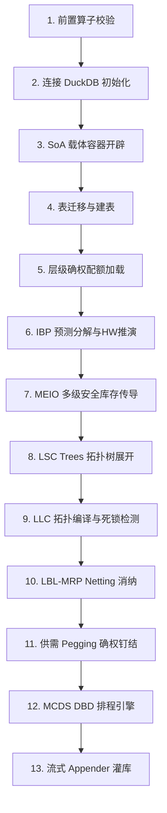

# IPC 智能计划与控制（ITP/IOP）双阶段计划物理引擎数据模型与业务算法技术白皮书

本白皮书是 Intelligent Planning & Control (IPC) 系统统御求解器内核的官方开发与业务逻辑规格说明书。为了方便供应链管理（SCM）专家与计划专家审计求解器的逻辑自洽性，本手册**完全舍弃 C++ 裸金属层的数据结构与底层性能优化细节（如 SoA 对齐、内存屏障、多线程无锁、SIMD 指令等）**，聚焦于表达 SCM 的 **逻辑数据模型**、**业务计划算法**，以及其在 13 个物理执行流阶段下的 **核心业务场景** 与 **计算对账产出**。

---

## 🗺️ 一、 ITP/IOP 同构设计与供应链网络建模

在离散制造供应链体系中，计划与执行的脱节往往是因为两套系统（战术层 MPS/MRP 与执行层 Scheduling）采用了截然不同的物理网状模型。IPC 系统从底层数学形式上统一了战术（ITP）与滚动执行（IOP）的供应链图网络建模。

### 1. ITP 与 IOP 的定位与差异
ITP 与 IOP 采用完全一致的供应链网络拓扑及约束校验逻辑，但解决不同时间跨度与业务边界的问题：
* **ITP (Intelligent Tactical Planning, 智能战术计划)**：
  - **定位**：解决中远期（如 30-180 天）大盘滚动规划与供需平衡。
  - **核心职责**：在粗产能和物料大池约束下进行物料爆炸净算（LBL），通过 ITP 瓶颈检测与 VVIP/Fair-Share 产能比例缩放，输出大盘战术配额，并写入 Allotment 配额确权账本。
* **IOP (Intelligent Operational Planning, 智能滚动排产计划)**：
  - **定位**：解决短期（如 1-14 天）车间级精密滚动排程与微观消纳。
  - **核心职责**：在 rigid（刚性）的 Allotment 配额确权保护下，对 Planned Orders 进行微观时序派程（时序 ATP 预占与 CTP 交期应答），执行 Setup Waiver（换模工时豁免）与 OTP（低优订单平移抢占），确定每笔订单的精准上线时间（When）与物理资源占用（What）。

### 2. 供应链网络基础拓扑建模
全网节点（物料 SKU、站点、物理工作中心/产能资源）和连接边（BOM/替代关系/调拨路线）在内存中通过面向数据的扁平倒排索引进行映射，构成逻辑拓扑树（LSC Tree）。
* **物料与工艺路线边**：成品零件 $P$ 展开至子件 $C$，包含单位用量 $PerQty_{P \rightarrow C}$，损耗率 $Scrap_{P \rightarrow C}$。
* **时空替代边**：若子件 $C$ 属于替代组 $AltGrp$，则替代组中存在多个候选件，各自具有替代优先级 $AltPriority$、目标配额比例 $TargetRatio$、累计历史分配量 $H$。

---

## 💾 二、 供应链物理数据模型 (Logical Data Models)

引擎物理运行于 **DuckDB 列式内存数据库** 上。以下为计划人员进行 DBeaver 客户端 SQL 审计和对账时所依赖的 8 个核心逻辑数据模型：

### 1. 物料节点主数据表 (`ipc_material_node`)
记录全网物料节点的计划策略、提前期及库存属性。
* `part` (VARCHAR, 主键): SKU 编码（通常包含物料-站点编码后缀，如 `PART_0001@SITE_001`）。
* `part_type` (VARCHAR): 物料类别（`FINISHED` 成品, `SEMI` 半成品, `RAW` 原材料, `ALT` 替换件）。
* `lead_time` (DOUBLE): 固定提前期（加工/采购天数）。
* `run_rate` (DOUBLE): 变动工时系数（单件耗时，用于提前期随批量动态拉伸）。
* `ss_rule` (VARCHAR): 安全库存规则（`None`, `Fixed` 固定, `Dynamic` 动态传导）。
* `safety_stock` (DOUBLE): 运行期计算得出的安全库存目标。
* `ss_fixed_qty` (DOUBLE): 人工锁定的固定安全库存。
* `dos_policy` (VARCHAR): 供应天数天数规则（`DAYS_OF_SUPPLY` 天数供应法）。
* `dos_intervals` (DOUBLE): 天数覆盖区间（DOS 天数参数）。
* `planning_calendar` (VARCHAR): 工厂工作历标识。
* `selling_ave_price` (DOUBLE): 物料销售均价（用于安全库存价值核算）。
* `time_fence_days` (INTEGER): 计划时界天数（防止短期内计划发生变动）。

### 2. BOM 关系与替代组配置表 (`ipc_bom_item`)
定义多级 BOM 的物料消耗量、损耗率，以及 Class 1/2/3 替换控制参数。
* `bomid` (VARCHAR): BOM 标识。
* `component` (VARCHAR): 子件 SKU 编码。
* `perqty` (DOUBLE): 单位用量（基础用量）。
* `scrap` (DOUBLE): 损耗率百分比。
* `alt_grp` (VARCHAR): 替代组编码（属于同一个替代组的行互为替换件）。
* `priority` (INTEGER): 替代组优先级（`1` 一类偏离度平衡，`2` 二类配额评级优先，`3` 三类批量归一化）。
* `target` (DOUBLE): 目标配额比率 ($TargetRatio_i$，如 0.6 代表分配 60% 份额)。
* `alt_todate_qty` (DOUBLE): 累计已分配历史量 ($HistoricalQty_i$)。
* `lot_size` (DOUBLE): 起订量 / 批量包装大小 ($LotSize_i$)。
* `eff_start_day` / `eff_end_day` (INTEGER): ECN 生效/失效日期偏移量。
* `relationship_type` (VARCHAR): 替代关系类型（`alt` 硬性替代，`interchangeable` 双向互换，`soft` 软替代/允许 Swap 呆滞调拨）。

### 3. 独立需求表 (`ipc_independent_demand`)
大盘毛需求、客户订单与共识预测输入。
* `demand` (VARCHAR, 主键): 需求单号。
* `part` (VARCHAR): 目标物料 SKU。
* `customer` (VARCHAR): 客户编码。
* `request_due_date` (DATE): 客户请求交期。
* `request_qty` (DOUBLE): 原始请求数量。
* `order_priority` (INTEGER): 原始 ERP 优先级。
* `customer_tier` (INTEGER): 客户层级等级（`0` 代表 VVIP 战略大户，`1` VIP，`2` 普通，`3` 长尾）。
* `preference_mode` (VARCHAR): 派程匹配偏好模式（`N` 默认，`Z` 优先级匹配，`C` 可得性就近匹配）。
* `revenue` (DOUBLE): 订单预估销售金额（用于优先级权重 tie-breaker）。

### 4. 战术确权配额账本表 (`ipc_allotment_ledger`)
记录 ITP 生成并在 IOP 执行中强制遵守的防波堤战略配额限制。
* `scenario_id` (VARCHAR, 复合主键): 模拟沙箱场景 ID。
* `part_code` (VARCHAR, 复合主键): 物料编码。
* `day` (INTEGER, 复合主键): 计划时段（第 $t$ 天）。
* `product_family` (VARCHAR, 复合主键): 产品家族。
* `customer_group` (VARCHAR, 复合主键): 客户组群（归集 VVIP/普通大户）。
* `region` (VARCHAR, 复合主键): 目标区域。
* `allotment_limit` (DOUBLE): 配额限制（本期战略分配最高量）。
* `consumed_qty` (DOUBLE): 滚动执行中已消纳量。
* `available_qty` (DOUBLE): 剩余可用额度（$Limit - Consumed$）。
* `blocked_demand_qty` (DOUBLE): 由于配额不足而阻断/无法承诺的订单数量。

### 5. 计划订单账本表 (`ipc_planned_order_ledger`)
* `planned_order_id` (VARCHAR, 主键): 计划订单编号。
* `part_code` (VARCHAR): 物料 SKU。
* `order_qty` (DOUBLE): 建议下达数量。
* `start_day` (INTEGER): 建议开工天偏移。
* `finish_day` (INTEGER): 建议完工天偏移。
* `dimension_val` (DOUBLE): 生产规格维度属性（如 512MB RAM）。
* `priority` (BIGINT): 穿透继承的 64 位复合优先级数值。

### 6. 替代料分配账本表 (`ipc_alternate_allocation`)
* `main_part` (VARCHAR): 需求中申请的主料 SKU。
* `alt_part` (VARCHAR): 实际分配的替代料 SKU。
* `allocated_qty` (DOUBLE): 替代分配数量。
* `day` (INTEGER): 替代发生天偏移。
* `alt_class` (INTEGER): 替代策略级别（`1` 一类，`2` 二类，`3` 三类）。

### 7. Swap 呆滞料调拨记录表 (`ipc_swap_dispatch_ledger`)
* `demand_code` (VARCHAR): 被满足的订单单号。
* `from_part` (VARCHAR): 呆滞调出料 SKU。
* `to_part` (VARCHAR): 调入目标料 SKU。
* `swapped_qty` (DOUBLE): 跨厂区调拨数量。
* `day` (INTEGER): 调拨动作执行天。
* `swap_reason` (VARCHAR): 置换原因。

### 8. 微观有限产能调度表 (`ipc_micro_dispatch_ledger`)
* `planned_order_id` (VARCHAR): 计划订单号。
* `resource_code` (VARCHAR): 产能资源/工作中心代码。
* `start_day` / `finish_day` (INTEGER): 精密排程确定的工单起止时间。
* `allocated_hours` (DOUBLE): 扣减工时数。
* `setup_hours` (DOUBLE): 消耗的换模时间工时。

---

## 🧮 三、 C++ 求解器 13 阶段物理执行流与核心 SCM 算法

本章节详尽剖析 C++ 求解器在运行时的 13 个时序执行步骤，揭示数据模型如何在内存中流转并接受业务公式判定。



### 1. 第一阶段：前置算法断言校验 (run_patent_verification_tests)
* **业务目的**：在加载物理数据前，于纯内存中运行专利算子的单元测试。若发现数学公式执行有任何偏差，立刻熔断阻断程序（`abort()`），防止因代码修改引起底层消纳和替换逻辑失真。
* **业务算法与公式**：
  * **一类替换算法**：寻找能将各替代物料历史分配偏离度降至最低的零件 $i$ 优先满足：
    $$ Choice = \arg\max_{i \in \mathcal{G}} |H_i - Due_i| $$
    其中历史理论配额目标 $Due_i = (Total\_Hist + net\_demand) \times TargetRatio_i$，$H_i$ 为该替代物料历史累计已分配量 $\text{alt\_todate\_qty}$，$\mathcal{G}$ 为本组所有有效替代件集合。如果出现平局，选择 $TargetRatio_i$ 较大者。
  * **二类替换算法**：基于供应商/配额评级最低者优先路由，维持采购配额比例稳定：
    $$ Choice = \arg\min_{i \in \mathcal{G}} \frac{H_i}{TargetRatio_i} $$
  * **三类替换算法**：在多轮分配中，对每一轮 theoretical share $Due_i = CurrentRatio_i \times remaining\_net$ 最大的零件执行 lot_size 批量向上取整扣减：
    $$ ActualQty_{chosen} = \min\left( OnHand_{chosen}, \left\lceil \frac{Due_{chosen}}{LotSize_{chosen}} \right\rceil \times LotSize_{chosen} \right) $$
    扣减后，将该零件移出本轮候选集，对剩余零件的配额比例进行**动态重新归一化**更新：
    $$ CurrentRatio_{cand} = \frac{Due_{cand}}{\sum_{j \in \text{active}} Due_j} $$
  * **几何消纳算法**：时序数轴区间无分支交集覆盖计算，消除 `if-else` 控制流分支，实现极速净算：
    $$ consumed = \max\Big(0.0, \min(CD_{end}, CS_{start}) - CD_{start}\Big) $$
    $$ shortage = \max\Big(0.0, CD_{end} - \max(CD_{start}, CS_{start})\Big) $$
    其中 $[CD_{start}, CD_{end}]$ 为需求累计前缀和区间，$[0, CS_{start}]$ 为在手及在途供应前缀和区间。

---

### 2. 第二阶段：计划上下文与数据库初始化
* **业务目的**：根据命令行参数建立 DuckDB 连接。
* **逻辑控制**：若 `DEBUG_PERSIST == true`，则打开物理 DuckDB 文件连接，允许计划人员通过 DBeaver 运行 SQL 对账；若为 `false`，则开启纯内存沙盒（In-Memory Sandbox）模式，用于 What-If 多沙箱对比，不读写磁盘，彻底隔离脏数据。

---

### 3. 第三阶段：内存容器载体开辟
* **业务目的**：在内存中创建扁平的数据 SoA 容器：`parts`、`boms`、`demands`、`planned_orders` 等，接收从 DuckDB 加载的输入数据。

---

### 4. 第四阶段：数据库表结构迁移与空库数据注入
* **业务目的**：维护数据库物理表的一致性。
* **业务算法**：检查历史表名（如旧 physical_stock、external_commitment），自动转换 RENAME 为规范的 199 逻辑数据库模型。如果检测到数据库为空，则调用 `generate_massive_mock_data` 初始化百万级需求和多级 BOM 树并注入。

---

### 5. 第五阶段：层级确权与 Allotment 配额防波堤加载
* **业务目的**：解析 Product Family、Customer Group、Region 层次关系，穿透透传至 demands。
* **业务算法**：
  * **配额自动聚合**：若本场景下 `ipc_allotment_constraint` 为空，系统自动以 SQL 聚合现存的历史分配，按各物料/站点/日期初始化战术配额，限制后续订单无节制抢占战略配额：
    $$ AggregatedLimit = \sum_{psa \in \mathcal{P}} AssignedQty_{psa} $$
  * **配额加载**：加载 `allotment_constraints` 哈希表，锁定 `is_locked = true` 的刚性确权指标。

---

### 6. 第六阶段：IBP 预测层级分解与 Holt-Winters 时序推演
* **业务目的**：将宏观销售共识自顶向下分解，并推演未来需求趋势。
* **业务算法**：
  * **比例分解 (Proportional Disaggregation)**：将产品家族级需求 $Qty_{family}$，按历史独立需求比例分摊至底端 SKU 和 Customer：
    $$ Qty_{part, customer} = Qty_{family} \times \frac{Weight_{part, customer}}{\sum Weight} $$
    其中，分摊权重优先从 `ipc_dimension_grouping` 重写比率读取。若无重写，使用该物料-客户对的历史累计需求量作为权重。
  * **Holt-Winters 三重指数平滑推演 (加法模型)**：对历史需求时序 $X_t$ 推演点预测 $\hat{X}_{n+h}$ 并计算残差标准差 $\sigma_{error}$：
    - **初始化** (对于季节周期 $L_s$):
      $$ L_0 = \frac{1}{L_s} \sum_{i=1}^{L_s} X_i, \quad T_0 = \frac{1}{L_s^2} \sum_{i=1}^{L_s} (X_{L_s + i} - X_i), \quad S_i = X_i - L_0 \quad (i=1\ldots L_s) $$
    - **递推迭代** ($t=1\ldots n$):
      $$ L_t = \alpha (X_t - S_{t-L_s}) + (1-\alpha)(L_{t-1} + T_{t-1}) \quad (\alpha=0.2) $$
      $$ T_t = \beta (L_t - L_{t-1}) + (1-\beta) T_{t-1} \quad (\beta=0.1) $$
      $$ S_t = \gamma (X_t - L_t) + (1-\gamma) S_{t-L_s} \quad (\gamma=0.3) $$
    - **预测公式** (向前预测 $h$ 步):
      $$ \hat{X}_{n+h} = \max\Big(0.0, L_n + h \cdot T_n + S_{n + h - L_s \cdot \lfloor (h-1)/L_s \rfloor - L_s}\Big) $$
    - **残差标准差** (用于安全库存核算):
      $$ \sigma_{error} = \sqrt{\frac{1}{n} \sum_{t=1}^n \left(X_t - (L_{t-1} + T_{t-1} + S_{t-L_s})\right)^2} $$

---

### 7. 第七阶段：MEIO 多级安全库存传导与计算
* **业务目的**：在供应链图网络中，将成品端的需求波动风险沿 BOM 级联向下松弛传导，计算全网各节点时序安全库存（Safety Stock）。
* **业务算法**：
  * **级联需求与方差传播**（基于低层码 LLC 级联向下更新）：
    $$ D_{child} \leftarrow D_{child} + D_{parent} \times Factor $$
    $$ Var_{child} \leftarrow Var_{child} + Var_{parent} \times Factor^2 $$
    其中，$Factor = PerQty \times (1.0 + Scrap) \times TargetRatio$。
  * **动态安全库存求解**：
    利用求出的松弛需求均值 $D_i$ 和方差 $\sigma_{D, i}^2$（由 $Var_i$ 得到），求解在特定服务水平 $SL_i$（如 95%）下的安全库存目标：
    $$ SS_{i, t} = Z_i \times \sqrt{ L_i \cdot \sigma_{D, i, t}^2 + D_{i, t}^2 \cdot \sigma_{L, i}^2 } $$
    其中，分位数因子 $Z_i = \Phi^{-1}(SL_i)$ 通过标准正态分布逆累积求解。$L_i$ 为提前期，$\sigma_{L, i}^2$ 为前置期波动方差。计算出的 $SS$ 实时写回物料节点 `parts[i].safety_stock`。

---

### 8. 第八阶段：LSC Trees 全局供应链树展开与解耦点锚定
* **业务目的**：为所有独立需求建立全局物料展开网络树，并在图遍历中处理时序 ECN 切割与产品规格维度校验。
* **业务算法**：
  * **ECN 生效期裁定**：检验需求日期 $day$ 是否满足 BOM 条目生效期 $[eff\_start\_day, eff\_end\_day]$。如果不满足，物理熔断、剔除该 BOM 展开路径。
  * **维度评估**：调用维度匹配算子 `evaluate_dimension`。若订单需求规格值为 $OrderVal$，BOM 关系要求规格为 $BomVal$，且操作符为 $Op$（如 `GE` 大等于，即 512MB RAM 大等于 256MB 需求）：
    $$ evaluate\_dimension(OrderVal, Op, BomVal) = \text{True} $$
    如果返回 `False`，该 BOM 展开路径被熔断。

---

### 9. 第九阶段：全局物料低层码 (LLC) 编译与依赖死锁检测
* **业务目的**：计算供应链全网物料的计算优先级（LLC 码），确保 MRP 进行物料分解时，“永远先计算父件，再计算子件”，避免需求遗漏，并检测非法循环依赖。
* **业务算法**：
  * **Bellman-Ford LLC 松弛**：
    $$ LLC(C) = \max \Big( LLC(C), LLC(P) + 1 \Big) \quad \forall (P \rightarrow C) \in BOM $$
  * **死锁熔断**：若松弛迭代轮数突破上限 100，判断为排产数据中存在循环 BOM 死锁依赖（如 A 生产需要 B，B 生产又需要 A），直接抛出异常中断运行，强制阻断计算：
    `[致命死锁] BOM 拓扑编译中检测到闭环死锁依赖环路！系统强行熔断。`

---

### 10. 第十阶段：LBL-MRP 净需求时序消纳与级联爆炸
* **业务目的**：以 LLC 从高到低（即物料树自顶向下）的顺序，处理时序库存消纳、寻找 Class 1/2/3 替代料与跨厂区 Swap 置换，生成 Planned Orders 并级联分解至子件。
* **业务算法**：
  * **时序前缀和净算消纳**：在手库存 $OnHand$ 与在途 Scheduled Receipts $SR$ 优先满足时序先到达的需求。
  * **安全库存与天数供应（DOS）防护**：
    - 天数供应（DOS）策略下，当期安全库存目标为未来 $N$ 天毛需求的累计和：
      $$ SS_{target} = \sum_{d = day + 1}^{day + \lceil intervals \rceil} GrossDemand_d $$
    - 现有可用库存一旦低于安全库存目标 $SS_{target}$，则强制拉起净缺口，防止库存被过度击穿：
      $$ net\_demand_{new} = net\_demand + \max\Big(0.0, SS_{target} - AvailableInventory\Big) $$
  * **Class 1/2/3 替换料计算**：若发生净缺口 $net\_demand > 0$，且物料属于某一替代组，根据 BOM 配置的 `priority` 分类执行第一阶段的 `allocate_class1/2/3` 配额平衡算法，从替代料可用库存中进行扣减。
  * **跨厂区 Swap 呆滞料自愈调拨**：若本料及本地替代料扣减后仍有缺口，且 BOM 关系设为 `soft`，Swap 引擎在其他站点寻找替代件。为保证安全性，其他站点只能调拨其超出安全库存的“呆滞部分”：
    $$ MaxSwapQty = \max\Big(0.0, OnHand_{alt} - SS_{alt}\Big) $$
  * **提前期拉伸与 Planned Order 生成**：
    - 加工提前期随订单批量动态拉伸：
      $$ LT_{total} = LeadTime_{fixed} + OrderQty \times RunRate $$
    - 依据工厂日历进行倒排排产（避开非工作日），确定计划订单开工时间 `start_day`：
      $$ start\_day = get\_workday\_offset\_backward(ev.day, LT_{total}, Calendar) $$
    - 批量规格化向上取整（Lot-Size 限制）：
      $$ OrderQty = \left\lceil \frac{net\_demand}{LotSize} \right\rceil \times LotSize $$
  * **级联需求爆炸**：
    $$ child\_gross = OrderQty \times PerQty \times (1.0 + Scrap) $$
    将该需求在子件的 `start_day` 注入其时空 Gross Demand 矩阵中。

---

### 11. 第十一阶段：供需分配 Pegging 确权钉结
* **业务目的**：在内存中建立毛需求事件（Demands）与实体供应源（在手 On-Hand、在途 SR 或生成的 Planned Orders）之间的一对多或多对多物理绑定（Firm Pegging），记录至 `ipc_supply_assignment` 对账单中，防止优先级低的客户插单抢占战略供应。

---

### 12. 第十二阶段：双专利 MCDS DBD 有限能力精密排程调度
* **业务目的**：在 ITP 阶段执行产能瓶颈 Fair-Share 比例缩水平衡；在 IOP 阶段进行微观工序排程、 Setup Waiver 换模时间豁免与时序 ATP 递归回溯和 O(1) 事务回退。
* **业务算法与公式**：
  * **64位 Composite Priority 二进制优先级权重编码**：
    为了使所有子零件在多级装配中保持战略一致，子件通过 LLC 传导直接穿透继承父件的 64 位权重（以高优先级排产，防止瓶颈零部件被次要订单提前扣减）：
    $$ U_{pri} = (committed\_val \ll 62) | (tier\_val \ll 60) | (due\_day \ll 44) | (priority \ll 28) | rev\_val $$
    其中：
    - `committed_val`：已确权工单为 0（最高优），敞口订单为 1；
    - `tier_val`：VVIP 客户为 0，普通客户按等级为 1、2、3；
    - `due_val`：交期天数；
    - `rev_val`：反转销售金额，$R_{max} - \min(R_{max}, \lfloor Revenue \rfloor)$。
  * **ITP 战术大盘 Fair-Share 产能比例平衡（仅 itp 模式运行）**：
    当瓶颈资源 $c$ 的总 Planned Orders 负荷过载时，系统优先拨付产能给 VVIP 订单（`tier_val == 0`）。非 VVIP 订单所能分配到的剩余产能，按缩放因子 $ScaleFactor_c$ 进行等比公平分摊，其余订单按比例砍单或推迟：
    $$ satisfied\_vvip_c = \min(Load_{vvip, c}, AvailCap_c) $$
    $$ ScaleFactor_c = \frac{\max(0.0, AvailCap_c - satisfied\_vvip_c)}{Load_{non\_vvip, c}} $$
    若甚至 VVIP 负荷也超出可用产能，则 VVIP 订单也执行等比缩放，非 VVIP 订单分配量归零：
    $$ VVIPScaleFactor_c = \frac{AvailCap_c}{Load_{vvip, c}} $$
  * **Setup Waiver 换模豁免算法**：
    订单加工耗费产能工时：
    $$ CapacityConsumption = \begin{cases} Qty \times RunTime + SetupTime & \text{若产品维度/规格与前一单不同} \\ Qty \times RunTime & \text{若产品维度/规格与前一单相同} \end{cases} $$
    通过该机制，引擎能够自动合并同维度订单，豁免换模准备工时 $SetupTime$。
  * **CTP/ATP 递归回溯与 O(1) 零分配事务回滚**：
    当高级工单在多级 BOM 网络中进行 ATP/产能 预占扣减时，各级分配动作会实时改写全局库存与产能矩阵。一旦某一级子件在特定交期内发生“产能越界”或“ATP 缺料”判定齐套失败，引擎通过 **`AllotmentRollbackGuard` 事务栈自动执行逆向原位回滚**，反向回填已占用的所有上级库存和产能工时，确保在 $O(1)$ 时间内清理排产失败的脏数据，不产生 partial allocations。

---

### 13. 第十三阶段：流式对账数据落盘与持久化同步
* **业务目的**：将内存计算产生的最终计划订单、替代调拨明细、微观排产工单，流式同步回写到物理 DuckDB 文件中，完成数据闭环。
* **业务操作**：利用 DuckDB 列式 Bulk Appender 流式大块追加，避免 SQL `INSERT` 循环执行的巨大 IO 瓶颈，实现分钟级的大盘数据自愈重算。

---

## 🎬 四、 八大核心业务场景深度解析与审计

为了证明引擎在面对离散制造高频异动时的健壮性，以下详细陈述八个真实业务场景，计划专家可通过 `DBeaver` 客户端检索物理表数据以进行对账。

### 1. 场景 1（一类替换料：动态配额偏差最小化）
* **场景背景**：为保护重要客户与供应商份额稳定，成品 A 有两个子替代件 P1（目标配额 60%）和 P2（40%）。历史已分配量均为 0。连续下达三轮净需求：10 件、10 件、20 件。
* **引擎动作**：
  - 第一轮（需求10）：计算 $Due_{P1} = 10 \times 0.6 = 6$，$Due_{P2} = 10 \times 0.4 = 4$。偏离值绝对值 P1(|0-6|=6) > P2(|0-4|=4)，选 P1 分配 10 件。累计：P1(10), P2(0)。
  - 第二轮（需求10）：累计总分配 20。计算 $Due_{P1} = 20 \times 0.6 = 12$，$Due_{P2} = 20 \times 0.4 = 8$。偏离度 P1(|10-12|=2) < P2(|0-8|=8)，选 P2 分配 10 件。累计：P1(10), P2(10)。
  - 第三轮（需求20）：累计总分配 40。计算 $Due_{P1} = 40 \times 0.6 = 24$，$Due_{P2} = 40 \times 0.4 = 16$。偏离度 P1(|10-24|=14) > P2(|10-16|=6)，选 P1 分配 20 件。累计：P1(30), P2(10)。
* **对账审计**：
  运行 SQL 查账：
  ```sql
  SELECT alt_part, SUM(allocated_qty) FROM ipc_alternate_allocation GROUP BY alt_part;
  ```
  审计计算结果：`P1` 分配 30 件，`P2` 分配 10.0 件，配额极度逼近 60:40 目标。

### 2. 场景 2（二类替换料：供应商稳定评级最低优先）
* **场景背景**：目标配额比例 P1 60%，P2 40%。连续下达净需求 10 件、20 件、30 件。
* **引擎动作**：
  - 第一轮（需求10）：均无历史。选比例大的 P1 分配 10 件。P1 评级为 $10 / 0.6 = 16.67$，P2 为 $0 / 0.4 = 0$。
  - 第二轮（需求20）：P2 评级较低，选 P2 分配 20 件。P1 评级 16.67，P2 变为 $20 / 0.4 = 50.0$。
  - 第三轮（需求30）：P1 评级 16.67 < P2 评级 50.0。选 P1 分配 30 件。
* **对账审计**：
  ```sql
  SELECT alt_part, SUM(allocated_qty) FROM ipc_alternate_allocation GROUP BY alt_part;
  ```
  审计计算结果：`P1` 累计分配 40 件，`P2` 累计分配 20 件。

### 3. 场景 3（三类替换料：批量起订量限制与比例归一化更新）
* **场景背景**：采购配额 P1 50%（起订量 20），P2 30%（起订量 15），P3 20%（起订量 10）。总需求 100 件。
* **引擎动作**：
  - 第一轮：P1 的 theoretical due 最大（50）。执行 Lot-Size 向上取整，分配数量为 $\lceil 50/20 \rceil \times 20 = 60$ 件。剩余需求 $100 - 60 = 40$ 件。
  - 归一化：由于 P1 已移出本轮候选，P2/P3 归一化比率为 30/(30+20)=0.6 和 20/(30+20)=0.4。
  - 第二轮：剩余需求 40 件。P2 theoretical due = $40 \times 0.6 = 24$。Lot-Size 向上取整为 $\lceil 24/15 \rceil \times 15 = 30$ 件。剩余需求 $40 - 30 = 10$ 件。
  - 第三轮：P3 分配剩余的 10 件（正好满足 Lot 10）。
* **对账审计**：
  ```sql
  SELECT alt_part, SUM(allocated_qty) FROM ipc_alternate_allocation GROUP BY alt_part;
  ```
  审计计算结果：`P1` 60 件，`P2` 30 件，`P3` 10 件。

### 4. 场景 4（Swap 呆滞料跨站点置换与安全库存保护策略）
* **场景背景**：站点 SITE_001 成品装配缺主件 `COMP_1` 70 件。替代件 `COMP_ALT` 在站点 SITE_002 的现有库存为 150 件，SITE_002 设定的安全库存目标为 100 件。
* **引擎动作**：MRP 引擎检测到本地无可用库存，触发跨站点 Swap 调拨。Swap 引擎识别 `COMP_ALT` 在 SITE_002 的安全库存水位，计算最高安全可调拨量为 $150 - 100 = 50$ 件。最终调拨 50 件 `COMP_ALT` 满足本地需求，留有 20 件未满足缺口，绝不击穿 SITE_002 的安全库存。
* **对账审计**：
  ```sql
  SELECT from_part, to_part, swapped_qty, swap_reason FROM ipc_swap_dispatch_ledger;
  ```
  审计计算结果：`COMP_ALT` 向 `COMP_1` 调拨了 50.0 件，置换原因记录为 `Incomplete Substitution Stagnant Inventory SWAP`。

### 场景 5（BOM ECN 切割与产品规格维度兼容匹配）
* **场景背景**：成品 FG 需要大容量 `DIM_102.0`（512MB RAM）子件。BOM 规定 `COMP_1` 在第 10 天切割（ECN 失效），且可通过 `GE` 大等于操作符兼容降级使用。下达两笔需求：D1（第 5 天），D2（第 12 天）。
* **引擎动作**：
  - D1 展开（第5天）：`COMP_1` ECN 处于生效期，树展开成功。且子件规格可以采用 `DIM_102.0` (512MB) 及大等于它的规格（如兼容 512MB）。
  - D2 展开（第12天）：`COMP_1` 已失效，引擎自动切换路由至 `COMP_ALT` 展开。
* **对账审计**：
  ```sql
  SELECT parent, child, per_qty FROM ipc_bom_explosion_network WHERE parent = 'PART_FG';
  ```
  审计计算结果：时序第 5 天保留 `COMP_1` 关系树；第 12 天只留下 `COMP_ALT` 树。

### 6. 场景 6（ITP 战术大盘 VVIP 战略保护与 Fair-Share 产能缩水）
* **场景背景**：瓶颈资源 LINE_FINISHED 可用总产能工时为 8.0 小时。
  - 订单 1 (VVIP)：批量 100 件，工时需求 = 1.0(setup) + 100 * 0.05 = 6.0 小时。
  - 订单 2 (普通)：批量 100 件，工时需求 = 1.0(setup) + 100 * 0.05 = 6.0 小时。
* **引擎动作**：总负荷 12.0 小时过载。系统执行 ITP 容量等比 Fair-Share 缩放。优先满足 VVIP 6.0 小时。剩余 2.0 小时拨付给普通订单，计算非 VVIP 缩放因子 $ScaleFactor = 2.0 / 6.0 = 0.3333$。订单 2 的生产数量等比削减为 $100 \times 0.3333 = 33$ 件。
* **对账审计**：
  ```sql
  SELECT planned_order_id, part_code, order_qty FROM ipc_planned_order_ledger;
  ```
  审计计算结果：订单 1 生产 `100` 件，订单 2 生产被削减为 `33` 件。

### 7. 场景 7（Setup Waiver 换模工时豁免）
* **场景背景**：工序 SetupTime = 1.0 小时，RunRate = 0.05 小时/件。前一个已排订单规格维度为 `DIM_102.0`。当前待排 Planned Order 数量为 100，规格也是 `DIM_102.0`。
* **引擎动作**：微观排程处理当前 Planned Order 时，由于其规格维度与前一单一致，触发 Setup Waiver 判定，免除 1.0 小时的换模准备工时，只扣除 $100 \times 0.05 = 5.0$ 小时产能工时。
* **对账审计**：
  ```sql
  SELECT planned_order_id, setup_hours, allocated_hours FROM ipc_micro_dispatch_ledger;
  ```
  审计计算结果：当前工单在 `setup_hours` 字段记录为 `0.0`，`allocated_hours` 记录为 `5.0`。

### 8. 场景 8（时序 ATP 预占失败与 O(1) 事务性回滚）
* **场景背景**： Planned Order (需求50) 在多级展开中，已成功扣减 COMP_1 的在手库存，但在扣减下级瓶颈产能时发现过载且无可抢占订单，派程失败。
* **引擎动作**：引擎立刻读取 `AllotmentRollbackGuard` 事务快照，反向遍历临时暂存栈，原位将扣减的 COMP_1 在手库存 `50` 加回还原，清空脏数据，避免产生 partial commitment 破坏供需平衡。
* **对账审计**：
  计划人员审计 `ipc_physical_stock` 现有量，该零部件库存并未发生非偶数性丢失，且 `ipc_micro_dispatch_ledger` 中未生成本工单的任何脏痕迹。
