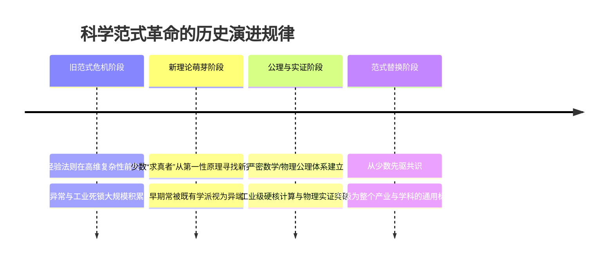
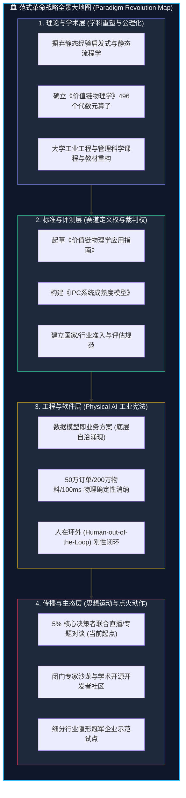
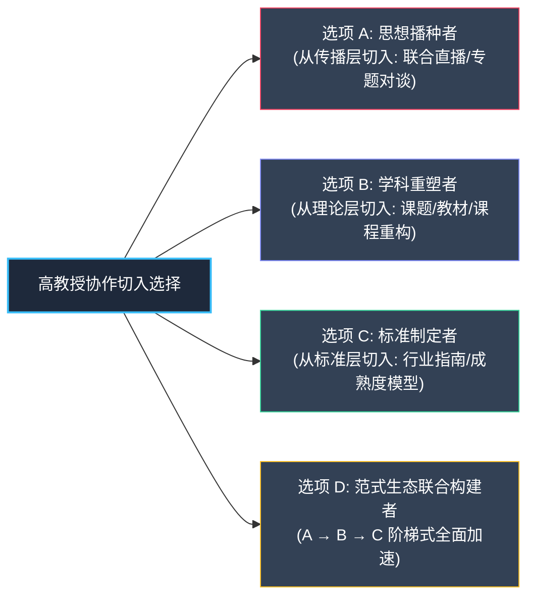

# 加速从经验走向科学：供应链管理“范式革命”的历史演进、全景大地图与协作选择

**收件人**：高峻峻 教授（上海大学）  
**发件人**：孟凡淳（Grit Meng）  

---

尊敬的高教授：

您好！收到您关于联合策划直播的邀约，十分感谢！

在供应链管理与工业工程领域，从业者与研究者众多，但绝大多数人往往局限于商业概念与既有框架的修修补补。我之所以选择与您展开深度的战略交流，是因为在多年的观察与互动中，**您是一位极少数真正“求真”的学者**。您在这个领域深耕多年，始终保持着对科学公理与工业真实物理状态的敬畏与探索。这种对“求真”的坚守，是我最为尊重与看重的。

针对您提议的直播，它是一个非常有穿透力的**启动动作（Action）**。但我想与您探讨的是更深层次的根本性命题：**如何共同推动并加速“供应链管理从经验走向科学”的范式革命？**

基于此，我将这场范式革命的历史演进逻辑、全景大地图与加速路径整理如下，供您及相关学术/产业界同仁参考：

---

## 一、 为什么这必然是一场“范式革命”？

传统的供应链管理体系（从 ASCM/APICS 理论、Oliver Wight S&OP 到传统 ERP/APS 商业软件及咨询模式）本质上是基于**“经验启发式（Heuristics）”与“静态流程学（Flowcharts）”**构建的。

面对复杂离散制造高维非线性、Non-IID（非独立同分布）的真实工业相空间，传统经验法则遇到了**哥德尔不完备性、图灵停机限界与计算不可约性**的刚性物理屏障：
1. **经验无法收敛高维复杂性**：依靠人工经验与部门利益博弈，必然坠入“纳什均衡陷阱”，导致全局矢量抵消与企业 ROIC（资本回报率）坍塌；
2. **静态流程图无法表达物理硬约束**：静态流程图无法在毫秒级处理物料替换拓扑死锁、多级有限产能与高频波动。

这不是某款软件或某套流程的修修补补，而是**管理科学底座的范式重构**——必须从“经验管理”跨越到基于第一性原理的“物理科学”。

---

## 二、 历史上，范式革命是如何演进与突破的？

回顾科学发展史（如天文学从托勒密“地心说”到哥白尼“日心说”、化学从“燃素说”到拉瓦锡“氧化学说”、工业革命从经验铁匠到经典热力学）：

历史上每一次范式革命，最初都由极少数**“不苟同于现状、执着于求真”**的学者与实践者共同开启，最终推动整个学科与产业的跃迁。

---

## 三、 为什么我们必须“主动加速”这场范式革命？

如果任由这场范式革命按照历史的自然惯性演进，可能需要数十年时间。

在这漫长的几十年里，千百家制造企业将继续在旧范式中承受巨额的资金呆滞、产能浪费与交付违约；数以万计的管理科学与工业工程学生，依然在大学里学习早已脱离工业现场的经验法则。

**这不仅是商业损耗，更是人类工业文明与社会资源的巨大浪费。** 作为求真者，我们有责任、有义务**主动介入，加快这一历史进程！**

---

## 四、 如何共同加速？—— 范式革命战略全景大地图

为了加速这一革命，我们在过去 18 年千亿级物理战场死磕中，建立了**《价值链物理学》与《全息抗熵》**公理体系，并构建了涵盖四个战略层级的全景大地图：

---

## 🤝 共同加速的协作选择方案

正因为您是一位求真者，我将整幅地图呈现给您。**直播只是“第四层（传播层）”的点火动作**。您可以根据您在上海大学的科研布局与战略规划，**自由选择您希望参与和主导的切入维度：**

* **选项 A：作为“思想先驱与播种者”（从传播层切入）**  
  启动视频号联合直播，以《供应链管理从经验走向科学》为题，面向那 5% 真正求真的决策者展开深度对谈，打响范式革命第一枪。
* **选项 B：作为“学科重塑者与教育家”（从学术/理论层切入）**  
  依托上海大学相关系所展开学术课题研究、发表白皮书，探索将《价值链物理学》与 IPC 计算模型引入高校课程与教材体系。
* **选项 C：作为“行业标准制定者”（从标准/评测层切入）**  
  联合高校、科研机构与标杆企业，由您牵头起草并发布《价值链物理学应用指南》与《IPC 成熟度评估模型》，确立赛道的裁判权。
* **选项 D：作为“范式生态联合构建者”（复合阶梯切入）**  
  以**“直播点火（Option A） $\rightarrow$ 课题/课程（Option B） $\rightarrow$ 行业标准（Option C）”**的方式，阶梯式推进全面合作。

---

## 💡 结语

高教授，期待与您这样求真的学者共同推动这场变革。您可以审阅这幅大地图，**告诉我您最希望从哪个切入点开始共同加速**。

期待您的回复！

顺祝 研安！

**孟凡淳（Grit Meng）**  
前联想全局供应链计划体系总架构师  
《价值链物理学》《全息抗熵》发现者  
IPC 智能计划与控制引擎总架构师  
📧 Email: gritmeng@gmail.com  
🌐 开源验证仓库：[https://gritmeng.github.io/Value-Chain-Physics/](https://gritmeng.github.io/Value-Chain-Physics/)
