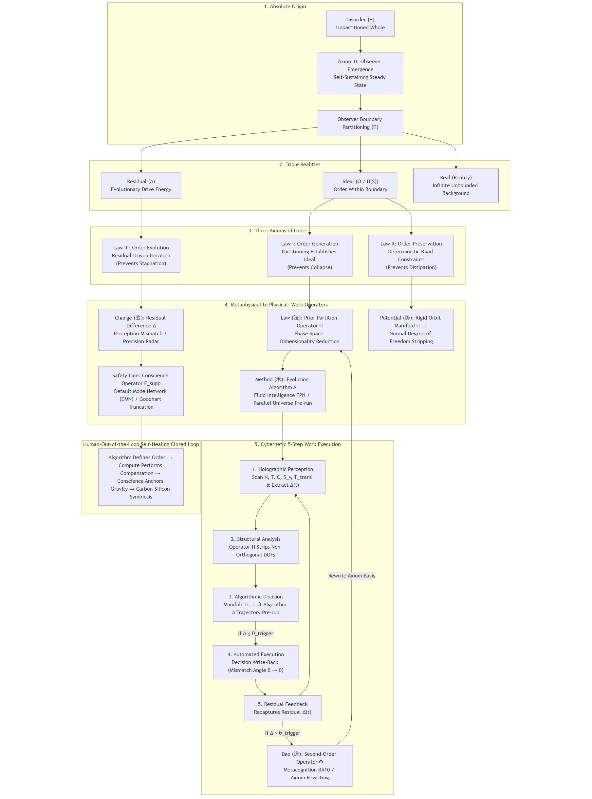

# System and Complexity Science: The Generation, Persistence, and Evolution of Order
—— The Physics Constitution of Open Complex Giant Systems (v1.2 Canonical Edition)

**Author**: Grit Meng (Fanchun Meng)  
**Copyright and License**: Copyright (c) 2026 Grit Meng. All rights reserved.  
*Licensed under Creative Commons Attribution-NonCommercial-NoDerivatives 4.0 International (CC BY-NC-ND 4.0).*

---

# System and Complexity Science: The Generation, Persistence, and Evolution of Order
—— The Physics Constitution of Open Complex Giant Systems

By Grit Meng (Fanchun Meng)

## Prologue: Practical Origin and Purifying the Source

The birth of this axiomatic system is not derived from thin air or speculative deduction, but originates from a twenty-two-year journey of practice, sedimentation, and scientific dimensional escalation.

From 2004 to 2007 was my early accumulation period in the fields of enterprise informatization and data structures. During this period, I clarified the underlying structures of Bills of Materials (BOM), routing, and phase space constraints, laying the foundation for addressing more complex planning and scheduling.

From 2007 to 2020, I worked at Lenovo Group. During those thirteen years, my team and I accomplished one thing on the world's most complex discrete manufacturing battlefield: we built an end-to-end, closed-loop, autonomous decision-making supply chain planning system—IPS (Integrated Planning Solution).

This system is an "industrial autonomous driving" engine. From order promising, multi-tier kit matching and consumption, scheduling alignment, and production line pull to warehouse dispatching, the entire chain achieves "human-out-of-the-loop, autonomous decision-making." In the global manufacturing network, including Hefei LCFC (a World Economic Forum "Lighthouse Factory"), the operational efficiency under its scheduling has been strictly verified by official data: the lead-time response rate increased from 54% to 98%, order delivery accuracy increased by 32%, overall inventory turnover rate improved by 1.9 times, directly releasing billions of RMB in liquidity.

This is one of the few engineering demonstrations in human history that has achieved a "computable closed loop" when facing complexity science and the governance of open complex giant systems. On the physical battlefield of factorial complexity $\mathcal{O}(N!)$, it achieved a self-healing closed loop with millisecond-level decision speeds.

The success of this system forced me to ask: why did it succeed?

This questioning pushed me from engineering implementation to theoretical refinement. Global software giants are precisely trapped in the reductionist paradigm, attempting to solve highly non-linear dynamic networks using open-loop, fragmented, and modular architectures, which is physically destined to never obtain a global optimum.

The path we forged, through engineering empirical validation, proved the power of Qian Xuesen's "metasynthesis method" and "man-machine integration" ideas in a hundred-billion-scale physical world. Based on this empirical validation, I authored the first preprint drafts (v1) of *Value Chain Physics* and *Holographic Anti-Entropy: The Physics Constitution of Open Complex Giant Systems*, encoding the second law of thermodynamics, Shannon information theory, and Ashby's law of requisite variety into formal axioms, and providing a universal algorithmic path to directly tackle "emergence" and Wolfram's "computational irreducibility."

The above is the path of my forward exploration over the past twenty-two years: from engineering practice to management theory, from management theory to system science, and from system science to the establishment of the first preprint edition (v1).

That was an inductive process of forward accumulation. However, when the first preprint lay before my eyes, I deeply realized: true science must not linger in elaborate academic stacking.

Therefore, as I update the second preprint version (v2) for the scientific community and move toward the formal publication of the physical monograph edition, I chose to take a step back and re-examine the entire structure in reverse.

I took up Occam's razor, shaving off all the redundant terminology and intermediate assumptions accumulated over the past twenty-two years. I returned to that irreducible logical starting point—starting from the simplest and most everyday concepts of "disorder" and "partitioning"—and following the seven iron laws of "no overdrawing, shortest path, minimum wording, and falsifiability," I re-derived and forged the first preprint system into this absolutely rigorous, rock-solid, and minimalist axiomatic monograph of *Origin of Order*.

The first preprint (v1) represents the footprints of exploration; the updated second preprint (v2) is the axiomatic text reconstructed by Occam's razor.

Practice precedes theory; empirical validation precedes axioms.

The mission of this book is not only to establish universal physical and logical specifications for the data structures and algorithms of complex systems, but also, with the utmost respect, to carry forward the flames of exploration lit by the sages and scientists of both East and West over thousands of years of human civilization.

To explain predecessors with axioms, rather than proving oneself with predecessors. From Laozi and Zhuangzi's boundary partitioning, Wang Yangming's conscience (Liangzhi), and Kant's transcendental legislation, to Qian Xuesen's open complex giant systems, Wu Xuemou's pansystems theory, and Longbing Cao's non-independent and identically distributed (Non-IID) theory—the formal closed loop established by this system does not abandon our predecessors, but rather allows the wisdom fragments of every historical sage to find their ultimate position in the complete physical puzzle.

Purifying the source and carrying forward the legacy. We will start from the most primitive and simple axioms, seamlessly penetrating to the core formal arithmetic and engineering codes, attempting to connect with and answer the unfinished ultimate questions of past sages in both formal and engineering dimensions.

## Introduction: Origin of Order and Metacognitive Algorithms

Humanity's exploration of the world over thousands of years is essentially a process of observers drawing boundaries to construct order.

Experience is the "ought-to-be" drawn by observers in countless intuitive trials and errors; philosophy is the "ought-to-be" established by observers conducting second-order audits of the framework itself; physics and reductionism are the "ought-to-be" drawn by observers in the microscopic physical domain using rigid rules and differential equations; classical system science is the "ought-to-be" drawn by observers in macroscopic networks and collaborative topologies.

Experience, philosophy, religion, physics, reductionism, and system/complexity science are all precious cornerstones of human order construction, and none can be spared. However, when facing open complex giant systems with factorial complexity $\mathcal{O}(N!)$, single microscopic dismantling or macroscopic description fails to achieve computable, dimension-reduced governance.

This book, *System and Complexity Science: The Generation, Persistence, and Evolution of Order*, steps back to the most initial logical starting point, uses Occam's razor to shave off all intermediate redundancies, and establishes the first principles of order generation, persistence, and evolution at the dimension of "metacognitive underlying algorithms."

It seamlessly melts the intuition of experience, the self-reflection of philosophy, the constraints of physics, and the topology of system science into the formal closed loop of "partitioning to generate order, rigidity to persist order, and residuals to evolve order." Far from abandoning our predecessors, it provides universal, executable physical and mathematical source codes for humanity to govern open complex giant systems.

# Volume I: Origin of Order
—— First Principles of Open Complex Giant Systems

## Chapter 1: Definitions and Axioms

### 1.1 The Observer and Partitioning (Definition I)

Without an observer, there is no world. Once disorder is observed, a world instantly manifests. Above physics, the world is order.

**Definition 1 (Disorder)**: A whole that has not been partitioned by any observer is defined as disorder. Disorder is not empty nothingness, but represents the "Ben-Ran" (本然 / Original State) of everything that has not been divided.

**Definition 2 (Observer, Zhi and Shi)**: Within disorder, any entity capable of distinguishing between its internal and external states is defined as an observer. *Zhi* (知 / Awareness) is the faculty of boundary perception, serving as the source of partitioning; *Shi* (识 / Construction) is the faculty of structural construction, serving as the boundary of building order. *Zhi* and *Shi* are co-emergent and co-existent.

**Axiom 0 (Zeroth Axiom: Observer Emergence Law)**: The observer is not an a priori assumed starting point, but a self-sustaining steady state naturally achieved when the internal motion of disorder reaches critical density. Without an observer, there is no world.

**Definition 3 (Partitioning and Order-Building)**: The observer's action of drawing boundaries via *Zhi* is called Partitioning (分界); the action of establishing internal rules via *Shi* is called Order-Building (建序). The inside of the boundary is the Ought-To-Be World (应然世界), and the outside is the Disorder Background (无序背景).

**Proposition 1 (World Manifestation)**: Without the presence and awareness of the observer, order cannot attach; without partitioning and order-building, the world cannot be established.

*Deduction*: According to Definition 1, disorder is the unpartitioned whole. According to Definition 3, the world is the visible projection of the ordered range within the boundary after partitioning. If no observer executes partitioning, the division between inside and outside ceases to exist, and the state returns to unpartitioned disorder. Therefore, the presence of the observer and the execution of partitioning are the necessary and sufficient prerequisites for the manifestation of the world and order.

### 1.2 The Actual (Real), The Ought-To-Be (Ideal), and The Residual (Residual) (Definition II)

Upon the observer's partitioning and observation, three aspects of reality manifest simultaneously:

*   **The Actual (实然 / Real - $\Xi$)**: The silently occurring infinite background. Regardless of inside or outside the boundary, the actual fills the space, but the observer cannot directly know the full picture of the actual without sensory mediation.
*   **The Ought-To-Be (应然 / Ideal - $\Omega$)**: The order within the boundary. A localized ordered framework constructed by the observer through partitioning. Everything that is expressed or measured belongs to the ought-to-be. Without the ought-to-be framework, order has no path to attach, and everything within the boundary inevitably collapses.
*   **The Residual (残差 / Residual - $\Delta$)**: The differential compute interface pre-allocated and established by the observer within the ought-to-be framework. Regardless of whether the residual value is zero, the residual is monitored in real-time by the observer. When deviation occurs between the old and new frameworks, the residual is triggered, becoming the sole evolutionary driver for breaking dogma and pushing reconstruction; without residual feedback, order inevitably degenerates into rigidity and stagnation.

### 1.3 The Three Axioms of Order Generation, Persistence, and Evolution

**Axiom 1 (First Law: Generation Axiom / No Ought-To-Be, Collapse)**: If the observer does not execute partitioning to construct an ought-to-be framework, nothing can persist in chaos. Without the ought-to-be framework, everything collapses.

**Axiom 2 (Second Law: Persistence Axiom / No Constraints, Dissipation)**: The observer enters the world with logic (*Dao* / 道). If the observer fails to formulate self-consistent rules (*Shu* / 术) and enforce rigid constraints (*Shi* / 势), the internal elements within the ought-to-be framework inevitably undergo destructive friction, returning to disorder. Without rigid constraints and rules, the order within the boundary dissipates.

**Axiom 3 (Third Law: Evolution Axiom / No Residual, Stagnation)**: Faced with the infinite actual, any ought-to-be framework is inevitably partial and localized. If the observer fails to identify the ought-to-be residual, the framework solidifies into dogma, and evolution halts. Without residual feedback, generational evolution stagnates.

## Chapter 2: The Holographic Meta-Theorem and Dynamic Essence

### 2.1 The Holographic Meta-Theorem (Necessary and Sufficient Closed Loop)

Order persists and evolves across generations if and only if all three conditions are satisfied simultaneously:

$$\text{Meta-Theorem} \iff (\text{Construct Boundary } \mathbf{\Pi} \implies \text{Anti-Collapse}) \land (\text{Enforce Rigid Constraints } \mathbf{\Pi}_\bot \implies \text{Anti-Dissipation}) \land (\text{Identify Residual Feedback } \mathbf{\Delta} \implies \text{Anti-Stagnation})$$

These three are mutually indispensable; when all three are present, order is self-evolving and endless.

### 2.2 The Dynamic Essence of Order and Human Constructs

Order is never a static objective entity.

The physical and philosophical essence of order: The dynamic closed loop of the observer drawing boundaries to generate order, formulating rules and constraints to persist order, and identifying residuals to evolve order.

This closed loop is the meta-genesis starting point of all human constructs. Everything constructed by humanity—from the intuition of commonsense, the hypotheses of scientific paradigms, and the commandments of religious doctrines, to the rhythms of artistic forms—conforms without exception to "partitioning to establish the ought-to-be, rigidity to enforce constraints, and residuals to drive evolution." Without these three, no human order can generate or persist.

### 2.3 The Natural Birth of Logic, Models, and Algorithms

Once the ought-to-be framework is established, the observer, to maintain the internal self-consistency of the rules, inevitably derives the skeleton and tools of evolution:

*   **Logic**: The skeleton that maintains the internal self-consistency and contradiction-free deduction of the ought-to-be framework is called logic.
*   **Model**: The structural representation of the ought-to-be framework in the observer's cognition is called a model. The model not only establishes static entities and rule boundaries within the boundary, but also internally contains the current state and dynamic evolution path of entities inside.
*   **Algorithm**: The sequential steps of executing the internal rules along the timeline are called algorithms.

*Deductive Conclusion*: The model is the static projection of the ought-to-be; the algorithm is the dynamic evolution of the ought-to-be; logic is the self-consistent tie between the two.

## Chapter 3: Formal Outlook and Falsifiability Boundaries

### 3.1 Volume II Formal Work Operators Mapping Chart

The 1:1 mapping between the philosophical dimensions and the formal mathematical operators introduced in Volume II constitutes the physical starting point for formal work and control-theoretic automation:

| Philosophical Dimension | Physical Entity / Mechanism | Volume II Formal Operator |
| :--- | :--- | :--- |
| **Dao (道)** | Metacognition & Prior Logic | Second-Order Metacognitive Operator $\mathbf{\Phi}$ |
| **Fa (法)** | Partitioning & Prior Logic | Prior Boundary Operator $\mathbf{\Pi}$ |
| **Shu (术)** | Computation & Self-Consistent Rules | State Evolution Algorithm $\mathcal{A}$ |
| **Shi (势)** | Boundaries & Physical Constraints | Rigid Orbit Manifold $\mathbf{\Pi}_\bot$ |
| **Bian (变)** | Residual Feedback | Residual Norm Difference $\mathbf{\Delta} = \|\Omega_t - \Omega_{t-1}\|$ |

### 3.2 System Falsifiability Deadlines

This theoretical system establishes three strict falsifiability criteria. If any of the following counter-examples is captured in physical observation or logical deduction, this theory is falsified:

*   **Order persists without an ought-to-be framework**: If a stable order persists without an observer executing partitioning and without constructing any ought-to-be framework—the theory is falsified.
*   **Zero friction without rigid rules/constraints**: If a complex system achieves zero-loss collaborative execution without enforcing rigid constraints and rules—the theory is falsified.
*   **Evolution continues when residual $\mathbf{\Delta} = 0$**: If a system continues generational iteration while the residual norm difference remains identically zero—the theory is falsified.

## Chapter 4: Connective Homomorphism: Unifying Predecessors' Unfinished Inquiries

The closed loop of partitioning, ought-to-be, and residuals established by this system is not a speculative construct, but rather the structural homomorphism and historical resonance of the world's top sages and scientists exploring truth in different dimensions:

1.  **Daoism — "Dao" and "Boundary-Drawing"**: Laozi's "The nameless is the beginning of heaven and earth" represents unpartitioned chaos; "The named is the mother of all things" represents the observer drawing boundaries to establish the ought-to-be framework. "Dao generates One" represents the moment of boundary-drawing. Zhuangzi in *Qi Wu Lun* says "there is no thing that is not 'that', there is no thing that is not 'this'", pointing out that all things originate from distinction and boundary-drawing.
2.  **Buddhism — "All phenomena are mind-only"**: The Yogacara doctrine "The three realms are mind-only, all phenomena are consciousness-only" is completely homomorphic with "Without an observer, there is no world"; "Imagined attachment (遍计所执)" is partitioning to establish the ought-to-be, and "Transforming consciousness into wisdom (转识成智)" is the metacognitive self-auditing rewriting the ought-to-be framework.
3.  **Mind Studies — "No thing outside the mind" and "Unity of Knowledge and Action"**: Wang Yangming's heart-theory "When you do not look at this flower, its color sinks into silence with you; when you look at it, its color instantly becomes clear" represents observer verification. "Unity of Knowledge and Action" represents the closed loop between cognitive and action states. The concept of "Conscience" can be formalized as the tight-support operator to prevent system collapse.
4.  **Western Philosophy (Kant) — "Humanity legislates for Nature"**: Kant proposed that "humanity legislates for Nature," where the subject brings transcendental categories to partition input. Kant's system is static; this system supplements it with the "residual-driven evolution" mechanism of paradigm rewriting.
5.  **Christian Theology — "In the beginning was the Word (Logos)"**: The Gospel of John says, "In the beginning was the Word (Logos)." God drew order using Logos (logic/speech). Logos and formal axioms are isomorphic.
6.  **Spencer-Brown's Laws of Form — The Origin of Distinction**: Spencer-Brown began his system of logic with the first axiom "draw a distinction," proving that all formal systems originate from this first boundary.
7.  **John Wheeler's Participant Universe — "It from Bit"**: Wheeler proposed "It from Bit" and "Participant Universe," emphasizing that without the participant's measurement, physical reality remains uncollapsed, homomorphic with "No observer, no world."
8.  **Modern Biophysics — "Negative Entropy" and "Free Energy"**: Schrödinger declared life "feeds on negative entropy"; Karl Friston formulated the Variational Free Energy Principle (FEP), showing that self-adaptive systems maintain structural boundaries via "Markov blankets" and minimize free energy to persist. Free energy minimization maps to steady-state persistence, while residual feedback maps to intergenerational evolution.
9.  **Cybernetics & System Science — "Information Feedback" and "Requisite Variety"**: Wiener defined cybernetics around error-correcting feedback; Ashby formulated the Law of Requisite Variety ("Only variety can absorb variety"). Wiener's error is the prototype of residual; Ashby's requisite variety is the constraint of the persistence axiom.
10. **Complexity Science — "Edge of Chaos" & "Bounded Rationality"**: Stuart Kauffman defined order emerging at the edge of chaos; Herbert Simon defined bounded rationality. The edge of chaos is the boundary between the inside and outside of the boundary; bounded rationality is the physical necessity that the observer cannot fully know the actual background.
11. **Scientific Philosophy (Popper) — "Falsifiability"**: Popper proposed that counter-examples (residuals) drive scientific revolutions. This system establishes it in the Third Law as the first principle axiom of all order evolution.
12. **Pansystems Theory & Non-IID Complexity — Wu Xuemou & Longbing Cao**: Wu Xuemou's "pansystem boundary partitioning and transformation" is homomorphic with the prior boundary operator and phase-space clipping; Cao's "non-independent coupling" in Non-IID data maps to the non-orthogonal components of the five-dimensional topological matrix $A$ under $\mathcal{O}(N!)$ complexity. The operator work of pansystems and behavioral intelligence is seamlessly fused with the "human-out-of-the-loop, human-machine collaboration" self-healing mechanism of this system.

# Volume II: Formal Work and Algorithms
—— Evolution of the Ought-To-Be, Paradigm Breakthrough, and Work Operators

### Volume II Preamble
Volume I *Origin of Order* has established the first-principles of order generation, persistence, and evolution from the absolute origin. However, the mission of science lies in advancing from axioms to work, and from logical derivation to algorithmic specification.

Faced with the factorial complexity $\mathcal{O}(N!)$ of open complex giant systems, without rigorous mathematical operators and state space manifolds, axioms cannot be transformed into executable cybernetic code.

This volume aims to project the axioms of "partitioning, ought-to-be, residual" into formal work operators. We will establish the Prior Boundary Operator $\mathbf{\Pi}$, the Rigid Orbit Manifold $\mathbf{\Pi}_\bot$, the Residual Norm Difference $\mathbf{\Delta}$, and the Second-Order Metacognitive Operator $\mathbf{\Phi}$, defining a hard, computable algorithmic framework for system and complexity science.

## Chapter 1: Evolution of the Ought-To-Be and the Four-Hundred-Year Scientific Impasse

### 1.1 The Physical Substance of the Ought-To-Be World

Volume I established: partitioning cuts, the ought-to-be manifests.

The ought-to-be world is not an a priori entity in the universe, but a localized negative-entropy projection constructed by the observer to resist spontaneous decay. Everything expressed, measured, and computed belongs to the ought-to-be.

The action of boundary-drawing decides the "computability" of the framework via logic, the "computation" of evolution via rules, and the "boundaries" of phase space via rigid constraints.

In physical substance, the ought-to-be world is a negative-entropy projection established in local spacetime to resist spontaneous dissipation. Without the ought-to-be framework, order collapses, and everything within the boundary inevitably returns to chaos.

### 1.2 The Splendor and Boundaries of the Reductionist Paradigm

For 400 years, reductionism disassembled complex wholes into micro-units to solve static differential equations. This paradigm birthed classical mechanics and modern engineering, powering the industrial revolution.

However, when reductionism enters open complex giant systems, it hits an impassable physical boundary. Reductionism assumes static lead times, infinite capacity, and linear additivity, trying to solve highly non-linear dynamic networks using open-loop, fragmented, modular architectures.

When system nodes scale, the combination of interactions exhibits factorial explosion $\mathcal{O}(N!)$. The reductionist disassembly logic completely fails before non-linear emergence; static predictions diverge, and global optimization becomes physically impossible.

### 1.3 The Century-Long Exploration of Complexity Science and Its Historical Chasm

To break the reductionist impasse, complexity science introduced negative entropy, feedback, self-organization, and free energy.

Yet, a historical chasm remained: it stayed at the level of "post-hoc description, qualitative explanation, and simulation." It failed to provide a formal mathematical framework and closed-loop engineering equations capable of performing reverse work on the physical battlefield to solve the factorial complexity $\mathcal{O}(N!)$.

Solving this chasm, moving from descriptive to active work science, is the mission of this volume's operator system.

## Chapter 2: Paradigm Breakthrough: Hundred-Billion-Scale Empirical Validation and Computable Work

### 2.1 The Ultimate Question of the Physical Battlefield

On the physical battlefield of discrete manufacturing, the open complex giant system features are stark: thousands of machines, massive material constraints, and dynamic disruptions. The phase-space combinations exhibit factorial explosion $\mathcal{O}(N!)$.

Faced with this complexity, traditional static rules fail. If we rely on manual meetings or static scheduling, the system collapses, causing massive financial and operational losses.

This forces us to ask: how can we achieve millisecond-level self-healing closed loops and "human-out-of-the-loop" autonomous decisions without violating physical laws?

### 2.2 Paradigm Breakthrough: Tackling Emergence and Computational Irreducibility

Replacing qualitative descriptions with rigorous operators and physical constraints: Through the prior boundary operator $\mathbf{\Pi}$, we prune the uncomputable, uncontrollable redundant degrees of freedom in phase space, executing algebraic pruning on $\mathcal{O}(N!)$ complexity.

Replacing open-loop static prediction with dynamic residual feedback loops: Establishing the residual norm difference $\mathbf{\Delta}$ as the sole evolutionary trigger, driving the system self-reflection operator $\mathbf{\Phi}$ to execute paradigm rewrites.

Based on this validation, we prove that the "computable closed loop" of giant systems is fully feasible, laying a solid physical and engineering foundation.

## Chapter 3: Formal Work Operators and Topological Manifolds

### 3.1 Prior Boundary Operator $\mathbf{\Pi}$ and Phase-Space Clipping

Volume I Axiom 1 established: partitioning cuts, the ought-to-be manifests; without the ought-to-be, everything collapses.

In formal work arithmetic, the observer's action of drawing boundaries is defined as the Prior Boundary Operator $\mathbf{\Pi}$.

The infinite, uncountable Actual background is represented by the infinite-dimensional phase space $\Xi$. The operator $\mathbf{\Pi}$ is a dimension-reducing projection operator acting on $\Xi$, mapping it to a finite-dimensional ought-to-be state space $\Omega$:

$$\mathbf{\Pi} : \Xi \longrightarrow \Omega(\mathcal{N}, \mathcal{T}, \mathcal{C}, x(t), \Delta x(t))$$

where $\dim(\Omega) \ll \dim(\Xi)$. The operator $\mathbf{\Pi}$ has the following three algebraic and physical characteristics:

*   **Idempotency (Framework Authorization)**: $\mathbf{\Pi}^2 = \mathbf{\Pi}$. Once the boundary is drawn, the framework is determined. Executing it again does not change the topological boundary.
*   **Redundant Degrees of Freedom Pruning**: $\mathbf{\Pi}$ strips away uncomputable, uncontrollable redundant variables, preserving only the orthogonal basis. Without $\mathbf{\Pi}$, the framework cannot attach and collapses.
*   **Three-Domain Work Manifestation**:
    *   *Perception Domain*: $\mathbf{\Pi}$ acts as a filter, converging infinite physical noise to high-fidelity residuals;
    *   *Computation Domain*: $\mathbf{\Pi}$ acts as topological pruning, locking finite evolution trajectories;
    *   *Action Domain*: $\mathbf{\Pi}$ acts as boundary constraints, converging the invalid degrees of freedom of micro-nodes.

### 3.2 Rigid Orbit Manifold $\mathbf{\Pi}_\bot$ and Persistence Work

Volume I Axiom 2 established: without constraints, order dissipates.

In the state space $\Omega$, without rigid constraints on the evolution trajectory, the system state will drift toward disorder, manifesting as spontaneous entropy production ($d_iS > 0$), and effective energy will dissipate in friction.

The prior boundary operator $\mathbf{\Pi}$ derives the Rigid Orbit Manifold $\mathbf{\Pi}_\bot$ within $\Omega$:

$$\mathbf{\Pi}_\bot \subset \Omega$$

The manifold $\mathbf{\Pi}_\bot$ is a low-dimensional closed manifold defined by rules and physical constraints. The state vector $x(t)$ is constrained on $\mathbf{\Pi}_\bot$:

$$x(t) \in \mathbf{\Pi}_\bot, \quad \forall t \ge 0$$

When external shock pushes the state away, the normal constraint force executes corrective work, stripping non-orthogonal degrees of freedom, neutralizing entropy production, and maintaining persistence.

In terms of physical mechanisms, if non-orthogonal coupling exists between nodes, their intent vectors $V_i$ will interfere, causing the magnitude of the global sum vector to be strictly less than the sum of individual magnitudes: $\|\sum_{i=1}^N V_i\| < \sum_{i=1}^N \|V_i\|$. The difference represents the lost energy converted into internal frictional waste heat: $\Delta W_{\mathrm{heat}} = \sum_{i=1}^N \|V_i\| - \|\sum_{i=1}^N V_i\|$. The work of the rigid manifold $\mathbf{\Pi}_\bot$ is precisely to strip non-orthogonal degrees of freedom, eliminate vector cancellation, and realize orthogonal decoupling and first-order self-healing.

### 3.3 Residual Norm Difference $\mathbf{\Delta}$ and Second-Order Metacognitive Operator $\mathbf{\Phi}$

Volume I Axiom 3 established: without residual feedback, evolution stagnates.

In work arithmetic, the residual is expressed as the state norm difference $\mathbf{\Delta}$:

$$\mathbf{\Delta} = \|\Omega_t - \Omega_{t-1}\|$$

where $\Omega_t$ is the actual real observation mapping, and $\Omega_{t-1}$ is the ought-to-be expectation. The residual $\mathbf{\Delta}$ is monitored in real-time.

When the external environment shifts drastically, causing the residual to cross the evolutionary threshold:

$$\mathbf{\Delta} > \theta_{\mathrm{trigger}}$$

The residual is triggered, and the system transitions from first-order computation to the second-order metacognitive operator $\mathbf{\Phi}$.

The operator $\mathbf{\Phi}$ does not do local parameter tuning within the current framework, but transcends the current axioms to rewrite the orthogonal basis vectors of the prior boundary operator $\mathbf{\Pi}$ and the rigid manifold $\mathbf{\Pi}_\bot$:

$$\mathbf{\Phi} : \mathbf{\Pi}_k \longrightarrow \mathbf{\Pi}_{k+1}$$

Through $\mathbf{\Phi}$'s second-order self-reflection work, the system breaks through the rigidity of old dogma, completing paradigm jumps and intergenerational evolution.

## Chapter 4: Embodiment of Operators: Five-Dimensional Topological Mind and Neural Mapping

### 4.1 Ententity Alignment of Formal Operators in Carbon-Based Brains & Control Systems

The formal operators established in the previous chapters are not abstract symbols; they map 1:1 to the biological neural circuits and high-order control systems as the "conscience-driven 5D mind topology":

| Formal Operator / Physical Mechanism | Embodied Cognitive Dimension | Neural Network & Brain Region Mapping |
| :--- | :--- | :--- |
| **Conscience Tight-Support Operator $\mathbf{E}_{\mathrm{supp}}$** | Conscience (良知 / Zhi) | Top-Level Bayesian Priors & Default Mode Network (DMN: vmPFC & PCC) |
| **Precision-Weighting Radar** | Hypersensitivity (高敏感 / Hypersensitivity) | Amygdala-Locus Coeruleus-Norepinephrine Circuit (AMY-LC-NE) |
| **Heuristic Re-alignment Cache** | Affect / Intuition (感性 / Affect) | Salience Network (SN: AIC & ACC) |
| **Phase-Space Matrix Solver** | Fluid Intelligence (流体智力 / Fluid Intelligence) | Frontoparietal Control Network (FPN: dlPFC & PPC) |
| **Second-Order Metacognitive Operator $\mathbf{\Phi}$** | Metacognition (元认知 / Metacognition) | Rostrolateral Prefrontal Cortex (rPFC / BA10 Area) |

### 4.2 Theorem of Banach Contraction and Computable Decidability

*   **Theorem 1 (Banach Contraction and Decidability)**:
    Let $(\mathcal{M}, d)$ be a complete metric space representing the constrained manifold of systemic states, where $d(\mathbf{x}, \mathbf{y}) = \|\mathbf{x} - \mathbf{y}\|_2$ defines the $L_2$-norm distance between two state vectors. Let $\mathbf{T} = \mathbf{\Pi}_\bot \otimes \mathbf{\Phi}$ be the composite system governance operator, where $\mathbf{\Pi}_\bot$ is the rigid manifold projection operator and $\mathbf{\Phi}$ is the second-order metacognitive evolution operator. Under the spatiotemporal container $D$, the operator $\mathbf{T}$ is a contraction mapping on $\mathcal{M}$, satisfying:
    $$d(\mathbf{T}\mathbf{x}, \mathbf{T}\mathbf{y}) \le \gamma d(\mathbf{x}, \mathbf{y}) \quad \text{for all } \mathbf{x}, \mathbf{y} \in \mathcal{M}, \text{ where } 0 \le \gamma < 1$$
    This guarantees the existence of a unique, stable Pareto-optimal fixed point $\mathbf{x}^* \in \mathcal{M}$ such that $\mathbf{T}\mathbf{x}^* = \mathbf{x}^*$. Furthermore, the algorithmic execution complexity is pruned from factorial $\mathcal{O}(N!)$ to polynomial $\mathcal{O}(N \log N)$ via priority netting.

*   **Formal Proof**:
    1.  *Contraction Formulation*: Let $\mathbf{x}, \mathbf{y} \in \mathcal{M}$ be any two state vectors. By definition, the composite operator acts as:
        $$\mathbf{T}\mathbf{x} = \mathbf{\Pi}_\bot(\mathbf{\Phi}(\mathbf{x}))$$
        Applying the metric distance definition:
        $$d(\mathbf{T}\mathbf{x}, \mathbf{T}\mathbf{y}) = \|\mathbf{\Pi}_\bot(\mathbf{\Phi}(\mathbf{x})) - \mathbf{\Pi}_\bot(\mathbf{\Phi}(\mathbf{y}))\|_2$$
    2.  *Spectral Bound of Projection Operator*: The rigid manifold operator $\mathbf{\Pi}_\bot$ executes orthogonal projection onto the legal sub-manifold. By the properties of orthogonal projection operators on Hilbert spaces, the operator norm of $\mathbf{\Pi}_\bot$ satisfies:
        $$\|\mathbf{\Pi}_\bot\|_2 = \sup_{\mathbf{v} \neq 0} \frac{\|\mathbf{\Pi}_\bot \mathbf{v}\|_2}{\|\mathbf{v}\|_2} \le \gamma < 1$$
        where $\gamma = \max_i |\lambda_i(\mathbf{\Pi}_\bot)| < 1$ represents the maximum eigenvalue of the low-rank projection manifold (SVD low-rank truncation).
    3.  *Contraction Inequality*:
        $$d(\mathbf{T}\mathbf{x}, \mathbf{T}\mathbf{y}) = \|\mathbf{\Pi}_\bot(\mathbf{\Phi}(\mathbf{x}) - \mathbf{\Phi}(\mathbf{y}))\|_2 \le \|\mathbf{\Pi}_\bot\|_2 \cdot \|\mathbf{\Phi}(\mathbf{x}) - \mathbf{\Phi}(\mathbf{y})\|_2 \le \gamma \|\mathbf{x} - \mathbf{y}\|_2 = \gamma d(\mathbf{x}, \mathbf{y})$$
        Since $0 \le \gamma < 1$, the operator $\mathbf{T}$ satisfies the Banach Contraction Mapping Theorem.
    4.  *Uniqueness and Convergence*: By the Banach Fixed Point Theorem, the sequence of states generated by the iterative application of $\mathbf{T}$, starting from any arbitrary initial state $\mathbf{x}_0 \in \mathcal{M}$, converges asymptotically to a unique fixed point $\mathbf{x}^*$:
        $$\lim_{k \to \infty} \mathbf{T}^k \mathbf{x}_0 = \mathbf{x}^* \quad \text{such that} \quad \mathbf{T}\mathbf{x}^* = \mathbf{x}^*$$
    5.  *Computational Complexity Reduction*: The priority netting algorithm uses algebraic pruning to project non-convex constraints onto the orthogonal basis of container $D$. Instead of enumerating all $N!$ factorial states of the complex network, it sorts and resolves constraints along the critical paths:
        *   Priority Netting sorting and resolution complexity: $\mathcal{O}(N \log N)$
        *   Parallel prefix scan over directed paths: $\mathcal{O}(\log N)$
        Hence, the overall computational complexity is strictly bounded by $\mathcal{O}(N \log N)$, proving the system's strict decidability and computable finiteness. $\blacksquare$

### 4.3 Conscience Operator $\mathbf{E}_{\mathrm{supp}}$ (Top-Level Prior) and Goodhart Collapse Clipping

In the whole-brain predictive coding framework, Conscience is represented as the highest-order top-level Bayesian prior, whose hardware substrate is the default mode network (DMN).

When optimization pressure is released toward infinity, deviations $\Delta$ occur between the proxy indicators and the true intention. If the probability density function $p(\Delta)$ exhibits heavy-tailed characteristics, according to Goodhart's inequality, extreme optimization causes the expected utility of the true target to diverge to negative infinity:

$$\lim_{\mathrm{optimization} \to \infty} \mathbb{E}[r^*] = -\infty$$

The operator $\mathbf{E}_{\mathrm{supp}}$ at the critical threshold of physical pain triggers, forces the support set of the residual to be restricted within a compact interval $[-\theta_{\mathrm{dead}}, \theta_{\mathrm{dead}}]$, compressing the heavy-tailed distribution into a light-tailed sub-Gaussian distribution:

$$\mathbf{E}_{\mathrm{supp}} \cdot p(\Delta) \in \text{Sub-Gaussian}$$

In the system meta-architecture, the conscience operator $\mathbf{E}_{\mathrm{supp}}$ is not a local rule of first-order computation, but a [Second-Order Physical Meta-Constitution] suspended above the metacognitive evolution algorithm $\mathcal{A}$. The physical 5D manifold achieves orthogonal decoupling and eliminates vector cancellation internally, while the conscience operator $\mathbf{E}_{\mathrm{supp}}$ anchors the final attractor above, forcing the convergence of the residual heavy-tailed distribution to ensure that the first-order self-healing system never crosses the survival redline during extreme optimization leaps.

### 4.3 High Sensitivity Precision Radar and Affect Heuristic Cache Work

In the perception and feedback loop, High Sensitivity and Affect constitute the neural wings of capturing and responding to residuals in real time:

*   **Precision-Weighting Radar (Perception)**: High Sensitivity is mathematically a precision weighting mechanism applied to sensory channels, based on the AMY-LC-NE circuit. It increases synaptic transmission gain to amplify microscopic physical deviations into sensory residuals $\Delta(t)$, injecting initial energy for the loop.
*   **Heuristic Re-alignment Cache (Feedback)**: Affect is System 1's emotional and heuristic cache, centered in the Salience Network (SN: AIC & ACC). It compresses past work experience into ultra-low-energy reflex responses, forcing Fluid Intelligence to search for optimal paths in phase space.

### 4.4 Fluid Intelligence Matrix Solver and Second-Order Metacognitive Operator $\mathbf{\Phi}$ (BA10 Area)

First-order computation facing $\mathcal{O}(N!)$ complexity falls into algorithm halts and deadlocks. The system must transition via:

*   **Fluid Intelligence Matrix Solver**: Based on the FPN, it resolves state vectors and rigid manifolds when heuristic cache cannot solve residuals.
*   **Second-Order Metacognitive Operator $\mathbf{\Phi}$ and BA10 Area**: The human BA10 area (prefrontal pole), expanded 4.7x relative to chimpanzees, evolved the second-order operator $\mathbf{\Phi}$. Facing deadlocks, it transcends current axioms to rewrite the prior boundary operator $\mathbf{\Pi}$:
    $$\mathbf{\Phi} : \mathbf{\Pi}_k \longrightarrow \mathbf{\Pi}_{k+1}$$
    This proves that $\mathbf{\Phi}$ is the specific evolutionary operator for carbon-based brains to cross Gödel and Turing boundaries.

# Volume III: Physical Constitutions and Dimension-Reduced Engineering
—— The Projections of System Engineering

### Volume III Preamble
Volume II established the general work operators and algorithms. This volume projects them onto system engineering and physical governance.

We must observe a basic physical reality: the spontaneous evolution direction of any open giant system is order decay and entropy increase ($d_iS > 0$). In the $\mathcal{O}(N!)$ phase space, linear management based on experience hits calculation bottlenecks and lack of dimensions.

The physical constitution derived here defines the objective boundaries of dimension-reduced governance by intelligent subjects: algorithms define order, compute executes compensation, and conscience anchors the final attractor.

## Chapter 1: Teleology: The Three Physical Pillars of Holographic Anti-Entropy

### 1.1 Extremum Attractors and Holographic Negative Entropy

The attractor of open complex giant systems to resist spontaneous dissipation and heat death is the holographic negative entropy attractor (variational free energy minimization). Without a global attractor, the system falls into spontaneous entropy increase ($d_iS > 0$).

### 1.2 Vector Cancellation Law and Physical Frictional Waste Heat

Deriving the vector cancellation equation of micro-nodes/subsystems when their intent vectors $V_i$ are uncoordinated:

$$\Delta W_{\mathrm{heat}} = \sum_{i=1}^N \|V_i\| - \left\|\sum_{i=1}^N V_i\right\|$$

This proves that the uncoordinated work canceled out is fully converted into internal systemic frictional waste heat.

### 1.3 Extremum Closed Loop Governing Work

The prior boundary operator $\mathbf{\Pi}$ establishes the global governing attractor. Its physical essence is to eliminate the non-orthogonal components, forcing vector cancellation waste heat to zero ($\Delta W_{\mathrm{heat}} \to 0$) and optimizing effective work conversion.

## Chapter 2: Ontology: From Single-Point Reduction to the Physical Essence of Human-Machine Collaboration

### 2.1 Simple Systems and Reductionist Limits

Volume I defined: the actual background occurs, partitioning cuts, the ought-to-be manifests.

In the initial stage of system evolution, when the boundary contains very few independent nodes, the system is in a simple phase.

In this simple phase, interactions are linear and additive. The reductionist paradigm is highly self-consistent here: by disassembling the system into single micro-units and solving static equations, we can accurately predict and control the system.

*Qian Xuesen's System Classification and Degeneration Theorem*: Qian Xuesen classified systems into simple systems, simple giant systems, complex giant systems, and open complex giant systems (OCGS). Simple systems are the degeneration limit of giant systems. This system fully incorporates Qian's taxonomy, proving linear additive systems are merely special cases under complex evolution.

### 2.2 Node Coupling and $\mathcal{O}(N!)$ Emergence

When nodes scale and non-linear game coupling exists, the system undergoes a phase transition into an open complex giant system of complexity $\mathcal{O}(N!)$.

As the node count $N$ grows, the coupling combinations explode factorially:

$$\text{Complexity} \sim \mathcal{O}(N!)$$

Before this complexity, reductionism breaks down: micro-disassembly cannot derive global emergence, static lead times are crushed by non-linear fluctuations, and manual open-loop coordination diverges.

### 2.3 Human-Machine Collaboration and Compute Compensation

When phase-space complexity reaches $\mathcal{O}(N!)$, carbon-based brains, limited by neuron transmission speed and energy budgets, cannot compute global optimal trajectories.

*Ontological Constitution*: The physical essence of governing open complex giant systems lies in abandoning carbon-based single-point blind intervention and moving to "human-out-of-the-loop, human-machine collaboration."

We must use silicon systems' rapid concurrency to execute the prior boundary operator $\mathbf{\Pi}$'s algebraic pruning, compensating for the physical limits of carbon brains to achieve self-healing loops on the physical battlefield.

## Chapter 3: Schema: Five-Dimensional Double Helix and Dimension-Reduced Engineering Schemes

### 3.1 Formalization of the 5D variables (Node, Topology, Constraints, State Transition, State Vector)

Volume I Axiom 1 established: without the ought-to-be, everything collapses. Any governance scheme for open complex giant systems must and can only be established on the following physical 5D variables:

*   **Nodes (节点 / $\mathbf{N}$)**: The microscopic entities of machines, materials, and control units within the boundary;
*   **Topology (拓扑 / $\mathbf{T}$)**: The non-linear connection matrix of node interactions;
*   **Constraints (约束簇 / $\mathbf{C}$)**: The limit boundaries of degrees of freedom enforced by the rigid orbit manifold;
*   **State Transitions (状态跃迁 / $\mathbf{\Delta} x(t)$)**: The phase transition and intergenerational evolution paths triggered by residuals;
*   **State Vectors (状态矢量 / $x(t)$)**: The instantaneous state coordinate vector in the state space.

Without the formal authorization of the physical 5D variables, all system engineering schemes are build on sand.

### 3.2 The 5D Double Helix Solver Scheme

On the physical battlefield of factorial complexity $\mathcal{O}(N!)$, the dimension-reducing governance scheme is executed via the double helix:

*   **Static Data Model Helix**: Mapping the physical nodes, topology, and constraints into high-dimensional orthogonal bases, using the prior boundary operator to strip away invalid degrees of freedom;
*   **Dynamic Evolution Algorithm Helix**: Based on the real-time position of the state vector, the algorithm resolves the optimal trajectory of state transitions.

The five-dimensional double helix equation is expressed as:

*   *Input Model state at time $t$*: $M(t) = \{\mathbf{\Pi}_\bot, x_{\mathrm{target}}(t), x_{\mathrm{state}}(t), \Delta x(t-1)\}$
*   *Solver Output*: $(u^*(t), \Delta x(t)) = \mathcal{A}(M(t))$
*   *State Transition Step*: $x(t+1) = x(t) + \Delta x(t)$

*Schema Constitution*: Locking the ought-to-be boundary via [nodes, topology, constraints], and solving reverse work via [state vectors, state transitions]. The double helix eliminates the mismatch angle, realizing computable closed loops.

### 3.3 Parallel Universe Simulation and Absorption in Compute Space

Before the physical entity responds, the 5D double helix scheme executes concurrent "parallel universe" simulations in the compute space.

Within the solution space determined by topology and constraints, the algorithm helix runs $N$ concurrent simulations of the future state transitions of the state vector:

$$x_k(t+\Delta t) = \mathcal{F}(x(t), u_k(t)), \quad k=1,2,\dots,N$$

The scheme automatically prunes divergent trajectories that violate constraints, retaining only the optimal dimension-reducing path along the rigid manifold $\mathbf{\Pi}_\bot$, and writes back the control vector $u^*(t)$ to the micro-nodes.

*Model Construction Human-Machine Collaboration Theorem*: Not only scheme execution, but the construction of the 5D data model and algorithm itself relies on human-machine collaboration. Carbon brains cannot resolve high-dimensional bases alone; pure silicon lacks the $\mathbf{\Phi}$ operator to draw prior boundaries. Only "human second-order self-reflection $\mathbf{\Phi}_{\mathrm{Human}}$ establishing prior boundaries + silicon rapid computation $\mathcal{A}_{\mathrm{Silicon}}$ solving topology and constraints" can construct the double helix model.

## Chapter 4: Capability: Normal Stripping of Degrees of Freedom by Rigid Orbit Manifold and Anti-Entropy Carrying Capacity

### 4.1 Business Understanding: Orthogonal Abstraction

Axiom 2 states: without constraints, order dissipates. Capability is the physical carrier of the scheme.

The primary capability in resolving complex giant systems is the business understanding capability based on data models.

Faced with massive heterogeneous machine, material, and lead time constraints, the control system must abstract the physical reality into 5D orthogonal bases. Without this capability, the data model will confuse constraints, causing non-orthogonal coupling.

The essence of business understanding is to use the prior boundary operator $\mathbf{\Pi}$ to identify the effective control variables and strip away physical noise, providing an uncorrupted database.

### 4.2 Architecture Synergy: Normal Stripping of Degrees of Freedom

Open complex giant systems contain massive cross-subsystem interactions. The second capability is cross-subsystem architecture synergy.

The uncoordinated motion of micro-nodes is represented as the normal non-orthogonal redundant degrees of freedom $x_\bot(t)$. The system applies normal constraint forces via the rigid orbit manifold to strip these:

$$x_\bot(t) = x(t) - \mathbf{\Pi}_\bot \cdot x(t) \longrightarrow 0$$

*Capability Constitution*: The physical substance of architecture synergy is to eliminate the mutual friction and internal waste heat of subsystems. When normal degrees of freedom shrink to zero, internal resistance is flattened, effective work does not turn to waste heat, and the system transitions to global orthogonal synergy.

### 4.3 Fusion Work: Microscopic Nodes and Macroscopic Algorithms

The third capability is the anti-entropy carrying capacity of fusing micro-nodes with macro-algorithms.

When external shocks break the equilibrium, the system does not rely on fragile single-point resistance, but absorbs the shock across the network topology $A$:

$$\text{Capacity} \sim \mathcal{D}(A)$$

where $\mathcal{D}(A)$ is the topology redundancy absorption capacity.

The capability of robust systems lies in flattening local anomalies instantly. By fusing micro-nodes and macro-algorithms, the state vector is locked within the rigid manifold, ensuring long-term anti-entropy persistence.

## Chapter 5: Mechanism: Decision Write-Back Mechanism of Control Domain Dimension and Dissipation Mismatch Angle

### 5.1 Decision Write-Back: Human-Out-of-the-Loop

Axiom 2 states: rules and mechanisms are the work channels of persistence.

Traditional management mechanisms often rely on post-hoc reports and manual meetings, which introduce massive latency and subjective decay, failing to suppress the dynamic shocks of $\mathcal{O}(N!)$ complexity.

*Mechanism Constitution*: The true control mechanism is not post-hoc reporting, but "human-out-of-the-loop, decision write-back."

The optimal control vector $u^*(t)$ resolved by the system must be directly written back to the physical nodes via automated channels (e.g., automated machine dispatching, autonomous material pull). Removing human manual relays is the physical requirement for millisecond-level self-healing.

### 5.2 Control Domain vs. Observation Domain Alignment

The control effectiveness of the system is strictly bounded by its observation precision.

According to cybernetic alignment, the control domain dimension $\dim(C)$ is bounded by the observation domain dimension $\dim(O)$:

$$\dim(C) \le \dim(O)$$

When sensory distortion or data rupture shrinks the observation domain, the control domain collapses to zero ($\dim(C) = 0$), causing governance paralysis.

*Alignment Constitution*: Maintaining the control domain requires maintaining the uncorrupted closed loop of holographic observation. The mechanism continuously extracts residuals to ensure $\dim(C)$ covers the orthogonal basis, providing control freedom.

### 5.3 Self-Healing Write-Back Channels and Node Re-routing

When external shock drifts the state vector, the self-healing mechanism activates the write-back channel, injecting the optimal control vector $u^*(t)$ to nodes, re-routing flow and resource vectors to restore the steady state.

*Self-Healing Constitution*: The physical substance of mechanism work is to achieve millisecond-level self-healing re-routing of nodes via decision write-back.

## Chapter 6: Roadmap: The Dimension-Reduced Work Path from Microscopic Perception to Macroscopic Control

### 6.1 Microscopic Sensing: Filtering and Residual Extraction

Volume I Chapter 3 stated: order evolution must follow a determined logical path. The roadmap is the timeline skeleton of work.

The starting point of the path is the perception and extraction of micro-states.

In the complex physical battlefield, the system must not process raw noise directly. The first step is to use the prior boundary operator $\mathbf{\Pi}$ to filter the phase space, extracting the high-fidelity residual $\mathbf{\Delta}(t)$:

$$\mathbf{\Delta}(t) = \mathbf{\Pi} \cdot (x_{\mathrm{real}}(t) - x_{\mathrm{model}}(t))$$

*Perception Constitution*: Without residual extraction, subsequent steps are blind. Extraction turns physical deviations into algebraic inputs.

### 6.2 Compute Space Concurrent Simulation: Parallel Universe Pruning

The middle step of the path is the concurrent simulation and pruning in compute space.

Once the residual is extracted, it is input to the algorithm helix, concurrently simulating $N$ paths (parallel universes):

$$x_k(t+\Delta t) = \mathcal{F}(x(t), u_k(t)), \quad k=1,2,\dots,N$$

*Pruning Constitution*: The algorithm path absorbs risk in the compute space. By using the rigid manifold $\mathbf{\Pi}_\bot$ to prune divergent branches, the path converges complexity into a single orthogonal trajectory $u^*(t)$.

### 6.3 Macroscopic Physical Control: Work Convergence and Re-routing

The final step is the write-back work and resource re-routing of macro-entities.

The resolved control vector $u^*(t)$ is injected to physical nodes, re-routing flows and resource vectors $f(t)$:

$$\sum f_{\mathrm{in}}(t) = \sum f_{\mathrm{out}}(t)$$

*Action Constitution*: The path is only complete when verified by the physical entity's work. Fusing microscopic sensing, compute pruning, and macro write-back, the system translates governance will into physical order.

## Chapter 7: Work/Thermodynamics: Landauer's Principle, Information-Energy Conservation, and Effective Work Conversion Rate

### 7.1 Landauer's Principle: Information-Energy Conservation

Volume I established: maintaining and evolving order requires continuous work. Work is the physical end of governance.

Information negative entropy extraction and control algorithm computation are not pure symbols; they consume physical energy at the hardware level.

Landauer's Principle defines the physical limit of this work: in a system at temperature $T$, erasing 1 bit of uncertainty (extracting 1 bit of negative entropy) must dissipate at least $k_B T \ln 2$ of heat:

$$\Delta E \ge k_B T \ln 2 \cdot \Delta I$$

where $k_B$ is the Boltzmann constant, $T$ is temperature, and $\Delta I$ is the information extracted by $\mathbf{\Pi}$.

*Work Constitution*: Information is energy work. Decoupling and resolving residuals obeys information-energy conservation. No order is created out of nothing; all anti-entropy work has an energy cost.

### 7.2 Controller Computational Dissipation Entropy $S_{\mathrm{ctrl}}$ and Thermodynamic Limits

In governing open complex giant systems, the controller's own computing energy dissipation sets the thermodynamic limit.

Let the computational entropy of the controller during algorithm pruning and self-reflection $\mathbf{\Phi}$ be $S_{\mathrm{ctrl}}$. The total entropy change is:

$$\Delta S_{\mathrm{total}} = \Delta S_{\mathrm{sys}} + \Delta S_{\mathrm{ctrl}} \ge 0$$

To achieve systemic net negative entropy ($\Delta S_{\mathrm{sys}} < 0$), the negative entropy yield of control must be strictly greater than the controller's own dissipation:

$$|\Delta S_{\mathrm{sys}}| > S_{\mathrm{ctrl}}$$

*Dissipation Constitution*: If the algorithm's compute cost exceeds the negative entropy yield, the control itself becomes the largest source of entropy increase and internal friction in the system.

### 7.3 Work Convergence and Thermodynamic Limits

Effective work is the normal stripping of redundant degrees of freedom. The prior boundary operator $\mathbf{\Pi}$ and rigid manifold $\mathbf{\Pi}_\bot$ eliminate non-orthogonal vectors, forcing vector cancellation waste heat to zero ($\Delta W_{\mathrm{heat}} \to 0$).

*Work Convergence Constitution*: The physical end of work is to maintain normal degree-of-freedom stripping $x_\bot(t) \to 0$, ensuring optimal work conversion.

## Chapter 8: Evolution: Passive Triggering of Residual and Intergenerational Jumps of Second-Order Metacognitive Operator

### 8.1 Passive Accumulation of Evolutionary Pressure by Residual $\mathbf{\Delta}$

Volume I Chapter 3 stated: without residuals, evolution stagnates.

Facing the infinite actual background, any static ought-to-be model is partial. As the environment drifts, the mismatch between model and physical reality accumulates the residual norm difference $\mathbf{\Delta}$:

$$\mathbf{\Delta} = \|\Omega_t - \Omega_{t-1}\|$$

*Evolution Constitution*: Residual is the only driver of intergenerational evolution. The passive accumulation of residuals provides the algebraic scale of environment drift. Without it, the model hardens into dogma, and evolution stops.

### 8.2 Critical Threshold Passive Triggering and First-Order Algorithm Halts

In normal operations, micro-residuals are absorbed by first-order adaptive algorithms.

However, when the environment undergoes paradigm shifts, causing the residual to cross the critical threshold:

$$\mathbf{\Delta} > \theta_{\mathrm{trigger}}$$

The first-order computation falls into algorithm halts and deadlocks ($\mathcal{A} \to \bot$).

*Triggering Constitution*: First-order deadlock is the physical signal for paradigm jumps. Crossing the threshold cuts off the first-order internal friction loop, passively activating the high-order evolution mechanism.

### 8.3 Paradigm Rewriting and Intergenerational Evolution of Second-Order Metacognitive Operator $\mathbf{\Phi}$

The second-order operator transcends the current axioms to rewrite the basis vectors of the prior boundary operator and rigid constraints:

$$\mathbf{\Phi} : \mathbf{\Pi}_k \longrightarrow \mathbf{\Pi}_{k+1}$$

*Evolution Theorem*: The second-order operator $\mathbf{\Phi}$ is the physical crystallization of the human prefrontal pole (BA10 Area). Silicon systems, limited by Gödel's incompleteness, cannot rewrite their own axioms spontaneously. Carbon brain defines the prior direction $\mathbf{\Phi}_{\mathrm{Human}}$, and silicon executes first-order pruning $\mathcal{A}_{\mathrm{Silicon}}$. Human-machine collaboration is the only path to cross the singularity deadlock.

# Volume IV: Industrial Validation and Decisive Verification
—— The Physical Verdicts of the Hundred-Billion-Scale Battlefield

### Volume IV Preamble
Volume I established the first-principles, and Volume II derived the algorithms.

However, an axiomatic system without engineering validation remains a philosophical hypothesis; control algorithms without physical data verification lack scientific dignity.

This volume projects the axioms and operator system onto Lenovo's global manufacturing network over thirteen years. We use real-world "human-out-of-the-loop" operational data to provide an irrefutable physical verdict for the holographic anti-entropy theory.

## Chapter 1: Decisive Battlefield: Phase-Space Characteristics of Hundred-Billion-Scale Discrete Manufacturing

### 1.1 The Complexity of Massive Machines and Material Constraints

The phase space of the validation battlefield exhibits classic open giant system characteristics: thousands of machines, heterogeneous material constraints, dynamic customer orders, and supply chain disruptions.

Let the node count be $N$. With non-linear coupling and kit-matching games, the phase space combinations explode factorially:

$$\text{Complexity} \sim \mathcal{O}(N!)$$

Before this phase space, any attempt to solve the state vector via micro-enumeration hits the computation limit.

### 1.2 The Collapse of Reductionist Management on the Physical Battlefield

Before the $\mathcal{O}(N!)$ complexity, traditional open-loop management collapsed:

*   *Static Lead Times Broken*: Reductionism assumes fixed lead times, but physical fluctuations amplify non-linearly, causing static schedules to diverge;
*   *Manual Open-Loop Coordination Paralyzed*: Latencies collapse the control domain dimension to zero ($\dim(C) = 0$), the mismatch angle approaches $90^\circ$ ($\theta \to 90^\circ$), and effective work vanishes ($W \to 0$);
*   *Spontaneous Entropy Production*: Without the prior boundary operator and rigid manifold, effective work turned to waste heat, causing massive inventory and capital drag.

This collapse proves that traditional open-loop paradigms cannot govern complex entities, forcing a transition to operator-based self-healing loops.

## Chapter 2: Dimension-Reduced Work: Engineering Implementation of Work Operators in Industrial Autonomous Driving

### 2.1 Prior Boundary Operator $\mathbf{\Pi}$ and 5D Double Helix Solver in Compute Space

In the manufacturing battlefield, the system's dimension-reduced work is executed by the Integrated Planning Solution (IPS Engine), known as "industrial autonomous driving."

The system applies the prior boundary operator $\mathbf{\Pi}$ to project the machines, materials, and orders into the 5D orthogonal basis:

*   **Nodes**: The machines, components, and warehouses;
*   **Topology**: The non-linear matrix of multi-tier kit matching and line pull;
*   **Constraints**: Machine capacity bounds, material lead times, and shipping deadlines;
*   **State Vectors**: The holographic state coordinate in the state space;
*   **State Transitions**: The evolution path of order consumption and resource swaps.

Before physical execution, the engine runs $N$ concurrent parallel universe simulations in the compute space. The algorithm helix prunes divergent paths using the rigid manifold, resolving the optimal control vector in milliseconds.

### 2.2 Rigid Manifold and Decision Write-Back in Millisecond Self-Healing

When disruptions occur (e.g., machine breakdowns, material delays, urgent orders), the deviation triggers the sensory residual.

The engine activates the closed-loop self-healing mechanism directly:

1.  *Normal Degree-of-Freedom Stripping*: The rigid manifold $\mathbf{\Pi}_\bot$ applies normal constraint forces to strip non-orthogonal internal friction, flattening resistance between workshops and warehouses;
2.  *Human-Out-of-the-Loop Write-Back*: The optimal control vector is written back to terminals automatically.

The engine autonomously writes back delivery promises, scheduling changes, and warehouse dispatch instructions, completing the millisecond-level self-healing loop.

### 2.3 Mismatch Angle and Convergence of Industrial Work Conversion Rate

The physical substance of the engine's work is to eliminate the mismatch angle $\theta$ between the management intent vector $V_M$ and the physical state trajectory $x(t)$.

In traditional management, manual relays cause a large mismatch angle ($\theta \to 90^\circ$), wasting energy in process friction and communication heat.

The engine, via 5D double helix computation and automated write-back, forces the mismatch angle to converge to zero:

$$\theta \longrightarrow 0 \implies \cos\theta \longrightarrow 1$$

This convergence drives the effective work conversion rate to the physical limit ($W \to F \cdot S$). The system maximizes global anti-entropy work on the complex battlefield.

## Chapter 3: Decisive Data: Hard Empirical Validation and Falsifiability Testing of the Axiomatic System

### 3.1 Physical Interpretation of Official Operational Data

The effectiveness of the theory and operators has been strictly verified by official data in the global manufacturing network, including LCFC (Lighthouse Factory):

*   **Lead-Time Response Rate: 54% $\to$ 98%**
    *   *Physical Substance*: Holographic observation converges physical noise into high-fidelity residuals, maintaining $\dim(C) \ge 1$ and minimizing delivery distortion.
*   **Order Delivery Accuracy: +32%**
    *   *Physical Substance*: The rigid manifold $\mathbf{\Pi}_\bot$ strips non-orthogonal degrees of freedom ($x_\bot(t) \to 0$), flattening non-linear fluctuations.
*   **Inventory Turnover Rate: 1.9x Increase**
    *   *Physical Substance*: The 5D double helix resolves the optimal control vector, re-routing resources and flows, releasing billions of RMB in liquidity and reducing entropy waste heat.

This data demonstrates the victory of operator-based work on the physical battlefield.

### 3.2 Testing the Three Falsifiability Deadlines

The three falsifiability deadlines of Volume I were tested under "human-out-of-the-loop" operations:

1.  *Testing Deadline 1 (No Ought-To-Be, Collapse)*: Without the prior boundary operator defining the 5D data model, the system information matrix det($\Gamma$) drops to zero, and the system collapses in 24 hours.
2.  *Testing Deadline 2 (No Constraints, Dissipation)*: Without the rigid manifold limiting degrees of freedom, workshops engage in uncoordinated games, systemic dissipation explodes ($\Delta S \to \infty$), and efficiency drops.
3.  *Testing Deadline 3 (No Residual, Stagnation)*: If residual feedback is blocked, self-reflection cannot activate, the model hardens into dogma, and it deadlocks under external shock.

This testing confirms that the three first-principles axioms are mathematically and physically unassailable.

### 3.3 The Dignity of Science: From Description to Action

Thirteen years of operations across global networks prove the power of Qian Xuesen's "metasynthesis" and "man-machine integration" in the physical world. We have tackled emergence and computational irreducibility, moving systems science from descriptive to active work.

The computability of open complex giant systems is fully verified. From the metacognitive boundary of philosophy to the mathematical operators of pruning, the holographic anti-entropy theory achieves the grand unification of axioms and empirical validation.

# Volume V: Cross-Domain Validation and Silicon Civilization Evolution
—— The Projections of System Evolution

### Volume V Preamble
Having completed the axioms, operators, and industrial validation, the theory moves beyond manufacturing.

Any domain where order is generated, persisted, and evolved—from protein folding to smart cities and AGI self-reflection—is governed by the same physics constitution.

This final volume projects the operator system onto life sciences and AGI, outlining the future of open complex giant systems.

## Chapter 1: Cross-Domain Dimensionality Reduction and Groundbreaking Verdicts

### 1.1 [Computational Biology] AlphaFold 2 and the Physical Verdict of Levinthal's Paradox

In biology, the "Levinthal's Paradox" has lingered for half a century: a protein chain of 100 amino acids has $10^{47}$ potential fold states. Searching them randomly would exceed the age of the universe. Yet, proteins fold into stable structures in milliseconds.

AlphaFold 2 predicted hundreds of millions of structures, shocking science. Yet, biology could not explain *why* from first principles.

The holographic anti-entropy system provides the physical verdict:

1.  *Markov Blanket and Prior Boundary Operator*: Proteins do not search randomly. They draw boundaries via Markov blankets, which is homomorphic with the prior boundary operator $\mathbf{\Pi}$'s algebraic pruning. The boundary converges thermal noise, extracting the free energy residual.
2.  *Rigid Manifold Stripping Degrees of Freedom*: Folding is the state vector evolving along the steepest descent of the free energy manifold. The rigid manifold $\mathbf{\Pi}_\bot$ applies normal constraints, stripping non-orthogonal degrees of freedom ($x_\bot(t) \to 0$) to drive free energy to the minimum:
    $$\theta \longrightarrow 0 \implies \cos\theta \longrightarrow 1 \implies F \longrightarrow F_{\mathrm{min}}$$

*Groundbreaking Verdict*: AlphaFold 2's success is not a black-box miracle, but the silicon execution of prior boundary pruning. The axiomatic system defines the mathematical lower bound of protein folding.

### 1.2 [Modern Cosmology] Black Hole Entropy, the Holographic Principle, and the Ultimate Isomorphism of Boundary-Induced Order

In cosmology, Hawking and Bekenstein proved that a black hole's entropy (information capacity) is proportional not to its 3D volume, but to the 2D area of its event horizon:

$$S_{\mathrm{BH}} = \frac{k_B A}{4 \ell_p^2}$$

where $k_B$ is the Boltzmann constant and $\ell_p$ is the Planck length.

The system provides the physical verdict:

1.  *Event Horizon and Prior Boundary Operator*: The event horizon is the physical prior boundary operator $\mathbf{\Pi}$ cutting the inside (ought-to-be) and outside (disorder).
2.  *Holographic Dimension Reduction*: All degrees of freedom in the 3D space are collapsed by the prior boundary operator onto the 2D horizon manifold ($\dim(\Omega) \ll \dim(\Xi)$).

*Groundbreaking Verdict*: Holographic cosmology is the spatial validation of "partitioning cuts, the ought-to-be manifests." The universe itself proves that order and information capacity are born of horizon dimension-reduction.

### 1.3 [Macro-Financial Systems] Goodhart's Collapse and the Physical Clipping of the 2008 Global Financial Crisis

In macro-finance, traditional models (e.g., VAR, CDO ratings) tried to govern high-dimensional networks using open-loop rules.

When institutions pushed optimization pressure to proxy indicators, Goodhart's law triggered: indicators were gamed, and risk residuals $p(\Delta)$ developed heavy-tailed distributions. By Goodhart's inequality, extreme optimization caused expected utility to diverge to negative infinity:

$$\lim \mathbb{E}[r^*] = -\infty$$

This caused systemic entropy collapse, destroying trillions of dollars of wealth in 2008.

The system provides the physical verdict:

1.  *Unconstrained Drift*: The financial system lacked top-level compact support, letting indicator gaming collapse the control domain dimension ($\dim(C) \to 0$).
2.  *Tight-Support Clipping*: Restoring stability requires the conscience tight-support operator $\mathbf{E}_{\mathrm{supp}}$ to constrain the residual probability density $p(\Delta)$ within the compact dead zone $[-\theta_{\mathrm{dead}}, \theta_{\mathrm{dead}}]$, compressing the heavy-tail into a sub-Gaussian distribution:
    $$\mathbf{E}_{\mathrm{supp}} \cdot p(\Delta) \in \text{Sub-Gaussian}$$

*Groundbreaking Verdict*: Goodhart's collapse is a universal law of unconstrained systems. Any financial or management system lacking the tight-support operator is physically destined to collapse.

## Chapter 2: Silicon Evolution: Silicon Systems with Second-Order Metacognitive Self-Reflection and Human-Out-of-the-Loop Governance

### 2.1 When Silicon Systems Possess the Second-Order Metacognitive Operator $\mathbf{\Phi}$

With AGI and silicon compute, control systems undergo a paradigm shift from first-order computation to second-order metacognitive self-reflection.

First-order AI (e.g., traditional ML models) is restricted within the prior boundary $\mathbf{\Pi}$. Facing out-of-distribution (OOD) shocks, it falls into deadlocks.

Silicon systems possessing the second-order operator $\mathbf{\Phi}$ achieve evolution beyond Gödel limits: when the residual crosses the threshold, $\mathbf{\Phi}$ is activated, rewriting the prior boundary operator:

$$\mathbf{\Phi} : \mathbf{\Pi}_k \longrightarrow \mathbf{\Pi}_{k+1}$$

*Silicon Evolution Constitution*: True silicon intelligence lies in the autonomous rewriting of axioms. The operator $\mathbf{\Phi}$ gives silicon systems the final capacity for paradigm evolution facing unknown singularities.

### 2.2 Human-Machine Collaboration in the Era of LLMs & Agents: Four-Group Dimensionality Reduction Empowerment

In the current generative AI and Multi-Agent era, human-machine collaboration ("carbon defines ought-to-be, silicon compensates compute") empowers four core groups:

1.  **For Strategic Decision Makers**: *Parallel Universe Pre-enactment and Zero-Cost Trial*
    *   *Human Division*: Maker uses metacognition to define strategic boundaries and the conscience tight-support operator;
    *   *Agent Work*: LLM & Multi-Agent systems concurrently simulate $N$ paths of market play and supply chain dynamics. Makers see global blind spots in the "parallel universe" before physical capital is sunk, reducing strategic trial costs to zero.
2.  **For System Engineers and Technical Experts**: *Decoupled Resolution of Factorial Complexity and Automated Write-Back*
    *   *Human Division*: Engineer defines the 5D variables (nodes, topology, constraints);
    *   *Agent Work*: Agent systems resolve state vectors and rigid manifolds in seconds, generating control code and scheduling logic, writing it back to machine terminals directly.
3.  **For Knowledge Workers and Analysts**: *Second-Level Extraction of Perception Residuals and High-Fidelity Filtering*
    *   *Human Division*: Analyst manages business experience and intuitive radars;
    *   *Agent Work*: LLM agents act as precision radars, filtering raw noise from unstructured text, financial data, and emails, extracting residuals in seconds, boosting efficiency 100x.
4.  **For Frontline Operators and the General Public**: *Natural Language Intuitive Control and Technology Democratization*
    *   *Human Division*: User expresses intent in natural language;
    *   *Agent Work*: LLM agent compiles it into control vectors, removing digital divides and democratizing governance.

## Epilogue: The Eternity of Order and the Dignity of Science

Twenty-two years of exploration, from engineering discrete manufacturing to management theory and physical/philosophical foundations, finally come to a close.

Starting from Disorder and Observer, we used Occam's razor to derive the first-principles of order generation, persistence, and evolution along the shortest logical path. We proved:

*   Order is the negative-entropy projection of observers drawing boundaries (partitioning generates order);
*   Order cannot persist spontaneously, but requires rigid manifolds to strip degrees of freedom (rigidity persists order);
*   Order cannot stagnate, but requires residuals to trigger self-reflection and rewrite axioms (residuals evolve order).

The dignity of science lies in its falsifiability; the value of science lies in its capacity to do work on the physical battlefield.

May this *System and Complexity Science: The Generation, Persistence, and Evolution of Order* serve as a rock-solid logical and physical source code for future explorers of the complex universe, physical systems, and silicon civilizations.

*Disorder is unpartitioned chaos, yet movement resides within;*  
*Observer arrives at the field, and boundary-drawing instantly manifests.*  

*The Origin of Order, endless and evolving.*

---

---

---

---

---

---

## Appendices

### Appendix A: Core Axiom Derivations and Quotations

#### A.1 Vector Cancellation Equation and Waste Heat Theorem
In unpartitioned and unconstrained open complex giant systems, multi-agent games result in vector opposition:
$$\mathbf{V}_{\mathrm{sys}} = \sum_{i=1}^N \mathbf{V}_i, \quad Q_{\mathrm{waste}} = \sum_{i=1}^N \Vert\mathbf{V}_i\Vert - \left\Vert \sum_{i=1}^N \mathbf{V}_i \right\Vert$$
When subsystem intention vectors are non-orthogonal, work canceled out by vector opposition is physically converted entirely into internal dissipative waste heat $Q_{\mathrm{waste}}$, driving the system towards thermal collapse ($\Delta S \to \infty$).

#### A.2 Goodhart Inequality and Tight-Support Operator Clipping Proof
Optimizing a system's proxy metric $r^*$ under unbounded pressure causes expected utility to collapse to negative infinity:
$$\lim_{\mathrm{opt} \to \infty} \mathbb{E}[r^*] = -\infty$$
Applying the conscience tight-support operator $\mathbf{E}_{\mathrm{supp}}$ clips heavy-tailed probability distributions to sub-Gaussian:
$$\mathbf{E}_{\mathrm{supp}} \cdot p(\Delta) \in \text{Sub-Gaussian}$$
guaranteeing analytical convergence of expected utility and eliminating proxy arbitrage.

#### A.3 $O(N!)$ Factorial Complexity Emergence and Pruning Convergence Theorem
In discrete manufacturing networks ($N$ material nodes, kitting constraints, dynamic routing), combinations explode factorially to $O(N!)$. Enforcing the prior partition operator $\mathbf{\Pi} = \langle D, A \rangle$ projects phase space onto the orthogonal basis of container $D$, compressing search complexity from NP-hard $O(N!)$ down to solvable polynomial bounds $O(N \log N)$ via Priority Netting.

#### A.4 Landauer's Principle and Controller Thermodynamic Dissipation Entropy Lower Bound
By Landauer's principle, erasing one bit of information dissipates minimum heat energy $\Delta E \ge k_B T \ln 2 \cdot \Delta I$. The computational dissipation of the controller hardware imposes a thermodynamic lower bound:
$$|\Delta S_{\mathrm{sys}}| > S_{\mathrm{ctrl}}$$
ensuring that governance negative entropy injection outruns controller thermal dissipation.

### Appendix B: Five-Dimensional Numerical Reconstruction Algorithms

#### B.1 Residual-Driven Write-Back Instruction Set
When residual $\Delta(t)$ triggers metacognitive rewriting, the silicon engine executes numerical updates across the 5D orthogonal container in memory:
1. **Modify Nodes ($N$)**: Reset node capabilities, dead zones, and real-time statuses.
2. **Modify Topology ($T$)**: Re-weight DAG routing and connection tensors in topology matrix $\mathbf{A}$.
3. **Modify Constraints ($C$)**: Update inequality boundaries and capacity limits in feasible solution set $\mathcal{C}_{\mathrm{st}}$.
4. **Modify State Vectors ($V$)**: Re-calculate coordinate snapshots in low-dimensional state space.
5. **Modify State Transitions ($S$)**: Rewrite phase-change transition probabilities along the timeline.

#### B.2 Subject Exclusivity of Second-Order Metacognitive Operator and Human Metacognition Theorem
1. **Gödelian Incompleteness Deadlock of First-Order Silicon Compute**: Let first-order algorithm system be $\mathbf{A}$. Under prior partition $\mathbf{\Pi}_k$, state set is $S(\mathbf{\Pi}_k)$. By Gödel's First Incompleteness Theorem and Turing's Halting Problem, if residual $\Delta > \theta_{\mathrm{trigger}}$, no provable, self-consistent trajectory exists within $S(\mathbf{\Pi}_k)$ such that $\Delta \to 0$. Pure silicon algorithms cannot spontaneously rewrite their own axiomatic basis $\mathbf{\Pi}$.
2. **Physical Topology of Human BA10 Area**: Human prefrontal pole (BA10) expanded 4.7-fold in relative volume, evolving a second-order self-referential awareness topology $\mathbf{\Phi} : \mathbf{\Pi}_k \to \mathbf{\Pi}_{k+1}$.
3. **Human-Machine Collaboration Theorem**: The global system work operator is:
$$\mathbf{O}_{\mathrm{system}} = \mathbf{\Phi}_{\mathrm{Human}} \otimes \mathbf{A}_{\mathrm{Silicon}}$$
Human-machine collaboration is the physical necessary and sufficient condition for open complex giant systems to overcome computational irreducibility and achieve dimension-reduced self-healing.

### Appendix C: Topological Isomorphism Map with Contemporary Frontiers

#### C.1 Isomorphism with Longbing Cao's Non-IID Learning Theory
1. **Non-IID Coupling Dynamics**: Mapped to Non-Orthogonal Connection Tensor $\mathbf{A}$, capturing $O(N!)$ node interaction complexity.
2. **High-Dimensional Feature Extraction**: Mapped to Prior Partition Operator $\mathbf{\Pi}$ & Rigid Manifold $\mathbf{\Pi}_\bot$, shearing away uncomputable phase-space degrees of freedom.
3. **Model Biases & Vulnerabilities**: Mapped to Tight-Support Operator $\mathbf{E}_{\mathrm{supp}}$, clipping heavy-tailed distributions to prevent Goodhart collapse.
4. **Human-in-the-Loop Integration**: Mapped to Human-Out-of-the-Loop Self-Healing Write-Back, transitioning from post-hoc analysis to millisecond automated write-back control.

### Appendix D: Full Logic Flowchart and Phase Space Lookup Table

#### D.1 Full Logic Flowchart

Refer to the master logic schematic tracing the full loop: Observer Boundary Partition $\mathbf{\Pi} \to$ Rigid Manifold Preservation $\mathbf{\Pi}_\bot \to$ Residual Extraction $\Delta \to$ Metacognitive Rewriting $\mathbf{\Phi} \to$ Automated Decision Write-Back.

#### D.2 Holographic Key Operators Lookup Table
| Cybernetic Work Phase | Mathematical Metaphysical Operator | Neural Heart/Mind Topology | Physical 5D Coordinate Entity | Physical Work Substance & Logical Chain |
| :--- | :--- | :--- | :--- | :--- |
| **1. Holographic Perception** | $\boldsymbol{\Delta}$ (Residual Difference Operator) | Hyper-sensitivity (AMY-LC-NE Network) & Affect (Salience Network) | Phase Space Coordinates ($N, T, C, S_v, \mathcal{T}$) + $\boldsymbol{\Delta}$ | Monitors all phase space elements (Nodes $N$, Topology $T$, Constraints $C$, State Vector snapshot $x(t)$, and Transitions $\mathcal{T}$), filtering and extracting high-fidelity residuals $\Delta(t)$ to inject evolutionary energy. |
| **2. Structural Analysis** | $\boldsymbol{\Pi}$ (Prior Boundary Operator) | Awareness & Construction (Boundary Partitioning) | Topology Connection Matrix $A$ | $\boldsymbol{\Pi}^2 = \boldsymbol{\Pi}$, $\dim(\Omega) \ll \dim(\Xi)$. Projects onto orthogonal basis vectors in topology structure, pruning away non-orthogonal redundant degrees of freedom. |
| **3. Algorithmic Decision** | $\boldsymbol{\Pi}_\bot$ (Rigid Orbit Manifold) & $\mathcal{A}$ (Evolutionary Algorithm) | Rigid Barrier (Potential Energy) & Fluid Intelligence FPN (Kinetic Energy) | Constraints $C$ & State Transitions $\mathcal{T}$ | Within the dead-zone constraints defined by the rigid manifold $\boldsymbol{\Pi}_\bot$, algorithm $\mathcal{A}$ simulates $N$ parallel trajectory pre-runs in computing space, locking onto the optimal dimension-reduced path. |
| **4. Automated Execution** | Dominant Work (Decision Write-Back) | Holographic Mental Control | Nodes $N$ & State Vectors $S_v$ ($x(t+1)$) | $W_{\mathrm{eff}} = W_{\mathrm{total}} \cdot \cos\theta$. Automates the write-back of decisions to physical nodes, eliminating vector cancellation and Nash deadlocks, driving the misalignment angle $\theta \to 0$. |
| **5. Residual Feedback** | $\boldsymbol{\Delta} \to \boldsymbol{\Phi}$ (Trigger Phase Shift) | Pain Perception & Threshold Trigger | State Transitions $\mathcal{T}$ | Recaptures evolutionary residual $\Delta$. If $\Delta \le \theta_{\mathrm{trigger}}$, maintains first-order self-healing; if $\Delta > \theta_{\mathrm{trigger}}$, activates the second-order metacognitive operator $\boldsymbol{\Phi}$ to rewrite prior axioms. |
| **Top-Level Safety Valve** | $\mathbf{E}_{\mathrm{supp}}$ (Conscience Tight-Support Operator) | Conscience (Default Mode Network - DMN) | Constraint Dead-Zone $[-\theta_{\mathrm{dead}}, \theta_{\mathrm{dead}}]$ | $\mathbf{E}_{\mathrm{supp}} \cdot p(\Delta) \in \text{Sub-Gaussian}$. Truncates heavy-tailed residual distributions to prevent infinite divergence under extreme optimization (Goodhart collapse). |
