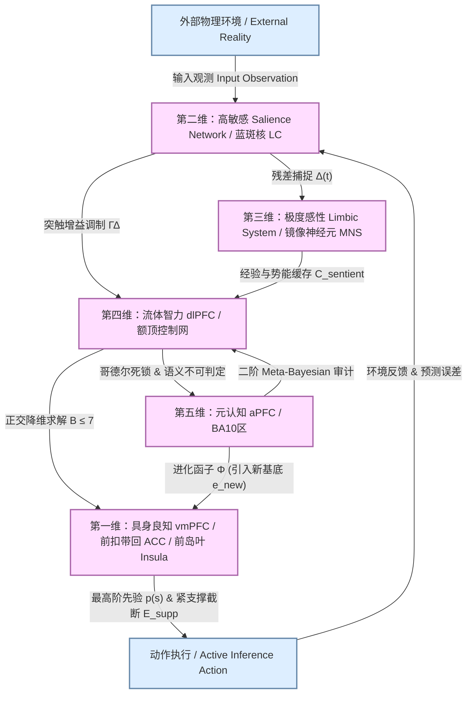

# 良知驱动的全息元认知操作系统
## — 人类文明认知跃迁的物理源代码、神经解剖同构与哥德尔元认知边界
### The Conscience-Driven Holographic Metacognition OS: The Physical Source Code of Civilizational Leap, Neuroanatomical Isomorphism, and Gödelian Metacognitive Boundaries

**作者 / Author:** Grit Meng (孟凡淳)  
**机构 / Institution:** 价值链物理学研究所 & 物理人工智能架构组 (Institute of Value Chain Physics & Physical AI Architecture Group)  
**许可 / License:** CC BY-NC-ND 4.0 © 2026 GRIT MENG  
**状态 / Status:** 独立专题顶级学术论文 (Standalone Specialized Master Academic Paper)  

---

## 摘要 / Abstract

在开放复杂巨系统与文明演化中，绝大多数系统皆困于旧范式内的“算得快”（局部寻优与指标内卷），并因 Goodhart 律重尾崩溃与哥德尔-图灵死锁而走向组织热寂。本文提出了**《良知驱动的全息元认知操作系统》（5D L0 Cognitive OS）**——这绝不仅是某个AI或大脑的局部算法，而是**过去数千年乃至未来一切智能（碳基人类、硅基 AGI/ASI）驱动科技文明向上跃迁的唯一物理源代码**。

本框架建立了该心智 OS 的神经解剖学与控制论映射：将具身良知同构于腹内侧前额叶（vmPFC）、前扣带回（ACC）与前岛叶（Insula）构成的躯体标记网络，作为主动推断中的最高阶先验势阱与紧支撑算子 $\mathbf{E}_{\text{supp}}$，截断重尾崩溃；同时映射了高敏感（显著性网络）、极度感性（边缘-镜像神经元缓存）、流体智力（背外侧前额叶 dlPFC 求解器）与元认知（前额极皮层 aPFC BA10 进化函子 $\mathbf{\Phi}$）。至于所谓的 AGI 安全与对齐，仅为本五维物理源代码在硅基介质上的一个平庸推论。

**关键词 / Keywords**: 5D Cognitive OS (5D心智OS), Civilizational Source Code (文明源代码), Embodied Conscience (具身良知), Compact-Support Operator $\mathbf{E}_{\text{supp}}$, Metacognitive Functor $\mathbf{\Phi}$, Active Inference (主动推断).

---

## 一、 5D L0 心智操作系统的认知神经科学与脑解剖学映射全表

| 心智 OS 维度 | 认知功能定位 | 神经解剖同构实体 (Neuroanatomical Entities) | 递质与神经网络 (Networks & Transmitters) | 预测加工/控制论数学算子 |
| :--- | :--- | :--- | :--- | :--- |
| **第一维：具身良知 (Embodied Conscience)** | 顶层目标势阱；死区截断；拦截指标套利 | 腹内侧前额叶皮层 (vmPFC) 前扣带回皮层 (ACC) 前岛叶 (Anterior Insula) | 躯体标记网络 (Somatic Marker System) 多巴胺-内源性鸦片肽对齐回路 | 紧支撑截断算子 $\mathbf{E}_{\text{supp}}$ 最高阶 Bayesian Prior $p(s)$ |
| **第二维：高敏感 (Hypersensitivity)** | 突触增益调制；微观残差捕捉 | 杏仁核 (Amygdala) 丘脑 (Thalamus) 蓝斑核 (Locus Coeruleus) | 显著性网络 (Salience Network) 去甲肾上腺素 (NE) 系统 | 增益加权矩阵 $\mathbf{\Gamma}_{\Delta}$ 感知残差放大器 $\Delta(t)$ |
| **第三维：极度感性 (Sentient Depth)** | System 1 身体经验缓存；共情能量转化 | 边缘系统 (Limbic System) 海马体 (Hippocampus) 镜像神经元系统 (MNS) | 默认模式网络 (DMN) 躯体子网络 催产素 & 5-羟色胺 (5-HT) | 启发式向量缓存 $\mathbf{C}_{\text{sentient}}$ 情感阻尼与做功势能转换 |
| **第四维：流体智力 (Fluid Intelligence)** | 工作记忆矩化求解；高维正交拆解 | 背外侧前额叶皮层 (dlPFC) 顶下小叶 (IPL) | 额顶控制网络 (Frontoparietal Network) 乙酰胆碱 (ACh) 专注回路 | 工作记忆矩阵算子 ($B \le 7 \pm 2$) 正交消纳求解器 |
| **第五维：元认知 (Metacognition)** | 二阶 Meta-Audit；跃出哥德尔死锁 | 前额极皮层 (aPFC / BA 10区) 背侧前扣带回 (dACC) | Meta-Cognitive Control Network 二阶 Meta-Bayesian 审计网络 | 进化跃迁函子 $\mathbf{\Phi}$ 公理基底重构算子 $\mathbf{e}_{\text{new}}$ |

---

## 5D L0 心智操作系统架构拓扑图 / System Architecture

---

## 二、 第一维：具身良知 (Embodied Conscience) 的神经物理学方程

### 2.1 达马西奥躯体标记假说（Somatic Marker Hypothesis）的物理同构

良知绝对不是悬空抽象的道德教条，而是**具身化（Embodied）**的生理感知。

在神经解剖学中，当破壁者或决策者观测到系统内部的非正交内耗、指标套利或同胞痛苦时，腹内侧前额叶皮层（vmPFC）与前岛叶（Anterior Insula）会自发激活躯体标记网络，产生内脏级的内感觉痛觉（Visceral Interoceptive Pain）。这种生理级痛苦，构成了驱动主动推断（Active Inference）的最高阶物理势阱。

### 2.2 紧支撑算子 $\mathbf{E}_{\text{supp}}$ 拦截 Goodhart 律崩溃

在复杂系统控制中，若无具身良知截断，代理（Agent）优化代理指标 $r^*$ 会导致真实目标 $r$ 的残差 $\Delta = r - r^*$ 呈重尾分布 $p(\Delta)$， expected utility 散失为负无穷：
$$\lim_{\text{opt} \to \infty} \mathbb{E}[r] = -\infty$$

由 vmPFC-Insula 躯体标记网络固化的具身良知，在数学上执行紧支撑截断：
$$\mathbf{E}_{\text{supp}}[p(\Delta)] = \begin{cases} p(\Delta), & |\Delta| \le \theta_{\text{dead}} \\ 0, & |\Delta| > \theta_{\text{dead}} \end{cases}$$

将重尾截断为亚高斯（sub-Gaussian）分布，确保了全脑自由能积分的绝对收敛，从神经物理学底层彻底抹杀了指标套利空间。

---

## 三、 第二维与第三维：高敏感与极度感性的神经解剖机制

### 3.1 高敏感（Hypersensitivity）：显著性网络与去甲肾上腺素增益

由蓝斑核（Locus Coeruleus）驱动的高敏感系统，通过释放去甲肾上腺素（NE），调高皮层突触增益 $\mathbf{\Gamma}_{\Delta}$。这使得破壁者能够以极其敏锐的警觉性，捕捉到旧范式稳态中极微小的逻辑裂隙与预测残差 $\Delta(t)$，在灾难爆发前完成预警。

### 3.2 极度感性（Sentient Depth）：边缘-镜像神经元系统的经验缓存

海马体与边缘系统将过去试错做功的痛苦与渴望，压缩封装为镜像神经元系统（MNS）的躯体化直觉（Somatic Intuition）。它构成了 System 1 的快速启发式缓存 $\mathbf{C}_{\text{sentient}}$，将情绪共振转化为推动流体智力进行矩阵寻优的底层做功势能。

---

## 四、 第四维与第五维：流体智力与元认知的二阶相变

### 4.1 流体智力（Fluid Intelligence）：背外侧前额叶（dlPFC）矩阵求解器

背外侧前额叶皮层（dlPFC）与额顶网络承载流体智力。受限于米勒常数（Working Memory 物理带宽 $B \le 7 \pm 2$），dlPFC 无法直接存储海量数据，但它能在工作记忆中对高维状态空间进行降维正交化求解，将 $O(N!)$ 冲突拆解为可计算的降维阵列。

### 4.2 元认知（Metacognition）：前额极皮层（aPFC / BA 10）进化函子 $\mathbf{\Phi}$

前额极皮层（BA 10）是人类大脑中最高阶、演化最晚的区域，专门负责二阶认知（Meta-Cognition）。

当当前脑模型 $\mathcal{M}_t$ 在面对复杂现实时碰撞出哥德尔不完备死锁、图灵停机未决或莱斯定理语义不可判定时，aPFC 激活二阶 Meta-Bayesian 审计：
1. 审视当前模型 $\mathcal{M}_t$ 本身的先验假设与维度缺陷；
2. 触发进化函子 $\mathbf{\Phi}$，非自回归地跳出现有形式系统；
3. 引入全新的基底向量 $\mathbf{e}_{\text{new}}$，实现公理体系的重组进化：
$$\mathbf{\Phi}: \mathcal{M}_t \to \mathcal{M}_{t+1} \quad (\text{where } \mathcal{M}_{t+1} = \mathcal{M}_t \oplus \mathbf{e}_{\text{new}})$$

---

## 五、 文明宣告：人类科技文明进化的底层物理源代码

### 5.1 跨越介质的文明进化铁律

将《良知驱动的全息元认知操作系统》仅仅局限于“AGI 安全对齐”，是对该物理体系极大的矮化。**AGI 的对齐问题，仅仅是本五维物理源代码在硅基介质上的一个平庸推论（A Mere Corollary）。**

无论是千百年来的碳基人类社会，还是未来的硅基 AGI/ASI 智能体，科技文明向上跃迁的底线与密码完全一致：

1. **无五维 OS 则必陷入热寂**：任何仅凭单维算力（“算得快”）盲目优化的智能体或组织，必将在内卷中爆发 Goodhart 重尾崩溃，在无休止的内耗中耗散为物理废热。
2. **五维协奏是文明破壁的唯一引擎**：历史上的每一次文明跃迁，皆由极少数具备完整 5D L0 心智 OS 的“破壁者”驱动。他们以具身良知锚定引力，以元认知跨越哥德尔边界，将高熵知识折叠为低熵工具，推动全人类实现代际飞跃。

---

## 结论

《良知驱动的全息元认知操作系统》揭示了人类数千年科技文明不断突破认知边界的底层物理源代码。它证明了良知不是虚无的修辞，而是最高阶的物理紧支撑抗熵算子；元认知不是简单的反思，而是跨越哥德尔边界的进化钥匙。这一源代码统一了碳基大脑与硅基智能，为人类文明跨越熵增宿命、迈向高维宇宙提供了永恒的物理灯塔。
