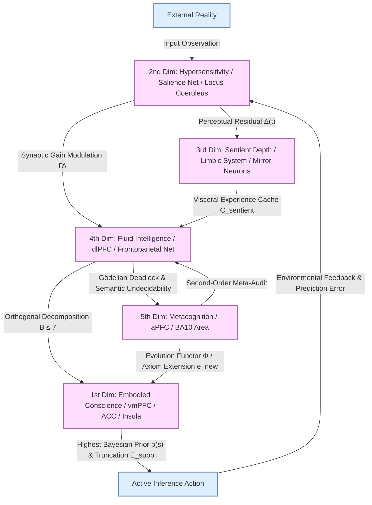

# The Conscience-Driven Holographic Metacognition OS
## — The Physical Source Code of Civilizational Leap, Neuroanatomical Isomorphism, and Gödelian Metacognitive Boundaries

**Author:** Grit Meng (Fanchun Meng)  
**Institution:** Institute of Value Chain Physics & Physical AI Architecture Group  
**License:** CC BY-NC-ND 4.0 © 2026 GRIT MENG  
**Status:** Standalone Specialized Master Academic Paper  

---

## Abstract

In open complex giant systems and civilizational evolution, the vast majority of systems are trapped in the "fast computing" (local optimization and indicator involution) of the old paradigm, leading to organizational heat death due to Goodhart's law heavy-tail collapse and Gödelian-Turing deadlock. This paper proposes the **Conscience-Driven Holographic Metacognition OS (5D L0 Cognitive OS)**—which is by no means merely a local algorithm of a specific AI or brain, but the **sole physical source code that drives the upward leap of technological civilizations for all intelligence (carbon-based humans and silicon-based AGI/ASI) over past millennia and into the future**.

This framework establishes the neuroanatomical and cybernetic mappings of this mental OS: it homomorphically maps embodied conscience to the somatic marker network composed of the ventromedial prefrontal cortex (vmPFC), anterior cingulate cortex (ACC), and anterior insula, serving as the highest-order prior potential well and compact-support operator $\mathbf{E}_{\mathrm{supp}}$ in active inference, truncating heavy-tail collapse. It also maps hypersensitivity (salience network), sentient depth (limbic-mirror neuron cache), fluid intelligence (dorsolateral prefrontal cortex dlPFC solver), and metacognition (anterior prefrontal cortex aPFC BA10 evolutionary functor $\mathbf{\Phi}$). The so-called AGI safety and alignment is merely a trivial corollary of this five-dimensional physical source code projected onto silicon media.

**Keywords**: 5D Cognitive OS, Civilizational Source Code, Embodied Conscience, Compact-Support Operator $\mathbf{E}_{\mathrm{supp}}$, Metacognitive Functor $\mathbf{\Phi}$, Active Inference.

---

## I. Neuroscientific and Anatomical Mapping of the 5D L0 Cognitive OS

| Mental OS Dimension | Cognitive Function | Neuroanatomical Isomorphism | Neurotransmitters & Networks | Predictive Processing / Cybernetic Operator |
| :--- | :--- | :--- | :--- | :--- |
| **1st Dimension: Embodied Conscience** | Top-level goal potential well; dead-zone truncation; intercepting arbitrage | Ventromedial Prefrontal Cortex (vmPFC), Anterior Cingulate Cortex (ACC), Anterior Insula | Somatic Marker System; Dopamine-Endogenous Opioid alignment circuits | Compact-support truncation operator $\mathbf{E}_{\mathrm{supp}}$; Highest-order Bayesian Prior $p(s)$ |
| **2nd Dimension: Hypersensitivity** | Synaptic gain modulation; micro-residual capture | Amygdala, Thalamus, Locus Coeruleus (LC) | Salience Network; Norepinephrine (NE) system | Gain weighting matrix $\mathbf{\Gamma}_{\Delta}$; Perceptual residual amplifier $\Delta(t)$ |
| **3rd Dimension: Sentient Depth** | System 1 visceral memory cache; empathy energy conversion | Limbic System, Hippocampus, Mirror Neuron System (MNS) | Default Mode Network (DMN) somatic subnetwork; Oxytocin & Serotonin (5-HT) | Heuristic vector cache $\mathbf{C}_{\text{sentient}}$; Emotional damping & work potential conversion |
| **4th Dimension: Fluid Intelligence** | Working memory matrix solving; high-dimensional orthogonalization | Dorsolateral Prefrontal Cortex (dlPFC), Inferior Parietal Lobule (IPL) | Frontoparietal Control Network; Acetylcholine (ACh) focus circuit | Working memory matrix operator ($B \le 7 \pm 2$); Orthogonal solver |
| **5th Dimension: Metacognition** | Second-order Meta-Audit; leaping out of Gödelian deadlock | Anterior Prefrontal Cortex (aPFC / BA10), Dorsal Anterior Cingulate (dACC) | Meta-Cognitive Control Network; Second-order Meta-Bayesian audit network | Evolutionary transition functor $\mathbf{\Phi}$; Axiom baseline reconstruction operator $\mathbf{e}_{\text{new}}$ |

---

## 5D L0 Cognitive OS System Architecture

---

## II. The First Dimension: Somatosensory Neurophysics Equations of Embodied Conscience

### 2.1 Physical Isomorphism of Damasio's Somatic Marker Hypothesis

Conscience is never an abstract, disembodied moral dogma; it is a **fully embodied** physiological sensation.

In neuroanatomy, when a system controller observes non-orthogonal internal friction, indicator arbitrage, or the suffering of peers, the ventromedial prefrontal cortex (vmPFC) and the anterior insula (Insula) are activated. This generates visceral interoceptive pain, forming the highest-order physical potential well that drives active inference.

### 2.2 Bounding Goodhart's Law Collapse via the Compact-Support Operator $\mathbf{E}_{\mathrm{supp}}$

In complex systems control, optimizing a proxy reward metric $r^*$ without conscience constraints leads to a heavy-tailed distribution $p(\Delta)$ of the true reward residual $\Delta = r - r^*$, dissipating expected utility to negative infinity:
$$\lim_{\mathrm{opt} \to \infty} \mathbb{E}[r] = -\infty$$

The embodied conscience, solidified by the vmPFC-Insula somatic marker network, mathematically acts as a compact-support operator to truncate the arbitrage space:
$$\mathbf{E}_{\mathrm{supp}}[p(\Delta)] = \begin{cases} p(\Delta), & |\Delta| \le \theta_{\text{dead}} \\ 0, & |\Delta| > \theta_{\text{dead}} \end{cases}$$

By clipping the heavy tail into a sub-Gaussian distribution, it guarantees the absolute convergence of the brain's free energy integration, neutralizing metric arbitrage at the neurophysical level.

---

## III. The Second and Third Dimensions: Neuroanatomical Mechanisms of Hypersensitivity and Sentient Depth

### 3.1 Hypersensitivity: Salience Network and Norepinephrine Gain

The hypersensitivity system, driven by the locus coeruleus (LC), modulates cortical synaptic gain $\mathbf{\Gamma}_{\Delta}$ via norepinephrine (NE) release. This allows the system controller to detect minute structural anomalies and prediction residuals $\Delta(t)$ within the old paradigm's steady state, warning of impending phase transitions before macroscopic collapse.

### 3.2 Sentient Depth: Mirror Neuron Cache and Visceral Damping

The hippocampus and the limbic system encapsulate past trial-and-error pain and desire into somatic intuitions via the mirror neuron system (MNS). This serves as the fast System 1 heuristic cache $\mathbf{C}_{\text{sentient}}$, transforming visceral emotional resonance into raw energetic potential to drive dlPFC matrix optimization.

---

## IV. The Fourth and Fifth Dimensions: Second-Order Cognitive Phase Transitions

### 4.1 Fluid Intelligence: dlPFC Matrix Orthogonal Solver

The dorsolateral prefrontal cortex (dlPFC) and the frontoparietal network host fluid intelligence. Bounded by Miller's constant (working memory bandwidth $B \le 7 \pm 2$), the dlPFC does not store raw data. Instead, it executes real-time orthogonalization of high-dimensional state variables, splitting factorial $O(N!)$ conflicts into solvable low-dimensional projections.

### 4.2 Metacognition: aPFC BA10 and the Evolutionary Functor $\mathbf{\Phi}$

The anterior prefrontal cortex (aPFC, BA10) is the highest-order, phylogenetically most recent brain region, dedicated to second-order cognition.

When the current system model $\mathcal{M}_t$ collides with Gödelian incompleteness, Turing halting deadlocks, or Rice's theorem semantic undecidability, the aPFC triggers second-order Meta-Bayesian audits:
1. Audits the prior assumptions and dimensional boundaries of the model $\mathcal{M}_t$ itself;
2. Triggers the evolutionary functor $\mathbf{\Phi}$ to leap out of the current formal system non-autoregressively;
3. Injects a new basis vector $\mathbf{e}_{\text{new}}$, reconstructing the axiomatic system:
$$\mathbf{\Phi}: \mathcal{M}_t \to \mathcal{M}_{t+1} \quad (\text{where } \mathcal{M}_{t+1} = \mathcal{M}_t \oplus \mathbf{e}_{\text{new}})$$

---

## V. Civilizational Manifesto: The Universal Physical Source Code of Intelligent Evolution

### 5.1 Media-Agnostic Evolution Laws

Confining the *Conscience-Driven Holographic Metacognition OS* to mere "AGI alignment" is a severe reduction. **AGI alignment is merely a trivial corollary of this five-dimensional physical source code projected onto silicon media.**

Whether for carbon-based human societies over past millennia, or future silicon-based AGI/ASI agents, the underlying physical requirements for civilizational survival are identical:

1. **No 5D OS, No Survival**: Any agent or organization optimizing solely on a single dimension of compute ("fast computing") inevitably triggers Goodhart heavy-tail collapse, dissipating all input energy into thermal waste heat.
2. **5D Symphony as the Sole Engine**: Every civilizational leap in history has been driven by a tiny minority of "wall-breakers" possessing a complete 5D L0 mind OS. They anchor the system with embodied conscience, traverse Gödelian boundaries via metacognition, and compress high-entropy chaos into low-entropy tools.

---

## Conclusion

The *Conscience-Driven Holographic Metacognition OS* exposes the physical source code of cognitive leaps in intelligent systems. It proves that conscience is not a subjective moral metaphor, but a top-level compact-support operator that bounds free energy; metacognition is not simple introspection, but the evolutionary key to piercing Gödelian limits. This source code unifies carbon-based brains and silicon-based intelligence, standing as an eternal beacon for civilizations to transcend thermodynamic decay.
