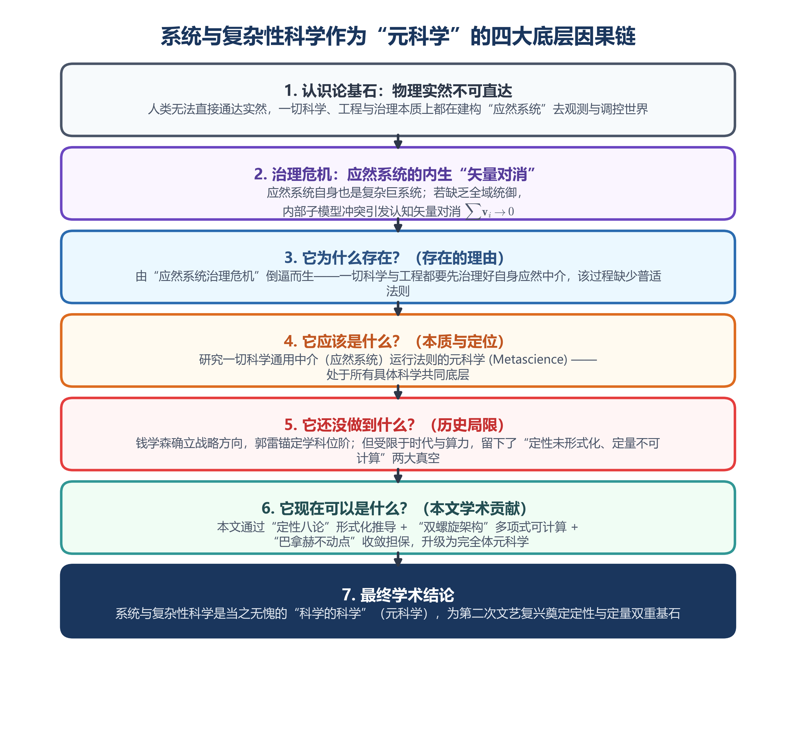
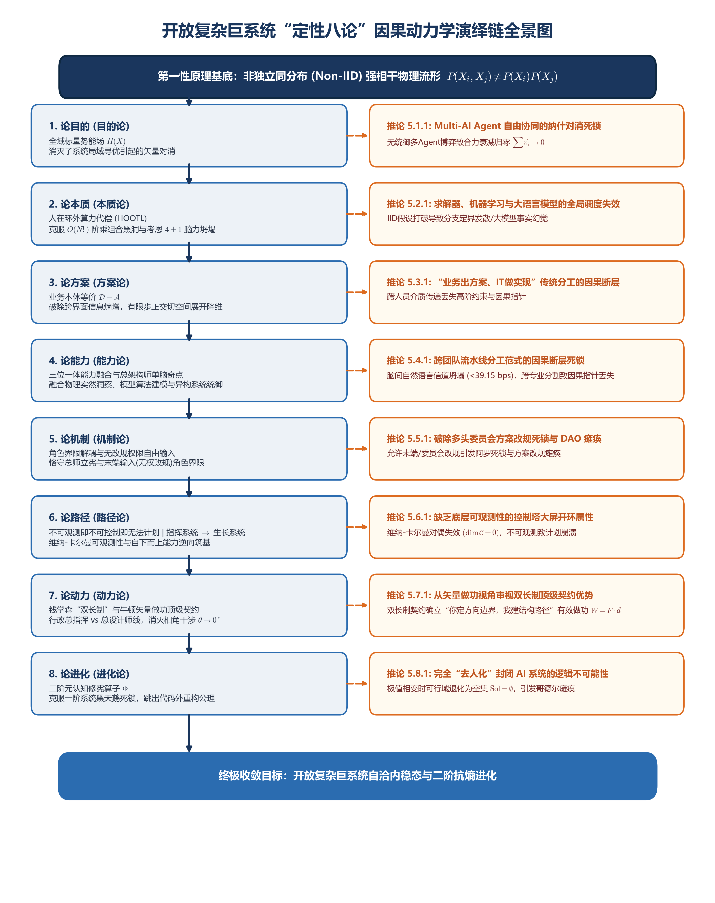

# 第二次文艺复兴：为什么系统与复杂性科学是“科学的科学”

### 从千亿级工业做功闭环实证到开放复杂巨系统的“活体表达”与“闭环可计算性”形式化证明

**孟凡淳 (Grit Meng)**  
前联想全球供应链集成计划方案（IPS）系统负责人兼总设计师  
IPC 智能计划与控制引擎缔造者 | 独立学者

---

### 【摘要】

近代科学建立在笛卡尔与牛顿还原论的"纵向分科"基础之上，通过孤立微观切片在局部因果控制中取得了巨大成功；然而在面对强耦合的开放复杂巨系统（Open Complex Giant Systems, OCGS）时，普遍陷入微观状态组合爆炸与宏观做功"矢量对消"（Vector Cancellation, $\sum_{i=1}^N \mathbf{v}_i \to 0$）的系统性耗散泥潭。本文从认识论第一性原理出发，确立了系统与复杂性科学作为"元科学"（Metascience）的学术位阶：人类在物理上无法直接通达客观实然，一切科学研究与工程实践，本质上都是通过观察者划界建立的"应然系统"（Ought-to-be System）去观测、模拟与治理现实世界。应然系统自身也是复杂系统，若缺乏全域统御，应然模型内部的非正交冲突将引发认知的矢量对消，使宏观模拟与微观治理彻底失效。

本文以大型高频离散实体做功网络连续 18 年稳定运行、人在环外（Human-Out-Of-The-Loop, HOOTL）自主决策率
$> 95\%$
的工业闭环实践为发生学原点，阐明该实证的核心物理事实在于维持了"计划——执行——反馈"的高频闭环与自主决策，证明了开放复杂巨系统的闭环可计算性，使系统得以长期维持"生成、存续与进化"的闭环存续（Closed-Loop Persistence）。在此基础上，本文确立了定性演绎与定量证明的严格解耦：

1. **定性维度**：基于操龙兵教授的非独立同分布（Non-Independent and Identically Distributed, Non-IID）第一性原理，系统展开"定性八论"（论目的、论本质、论方案、论能力、论机制、论路径、论动力、论进化）从微观耦合到二阶修宪的因果演绎链。本文在客观肯定现有技术范式局部价值的同时，划定了
    Multi-AI Agent
    自由协同、独立同分布假设下的经典求解器与统计机器学习、传统 IT
    线性分工、多头联合委员会、去中心化自由博弈、开环可视化大屏、无授权多头拉扯以及完全去人化
    AI
    系统的理论适用边界与控制论局限；同时，本文确立了定性八论与钱学森先生
    OCGS 理论 1:1 的命题对应与同构映射；
2. **定量维度**：提出由物理五维数据模型（体）与极简演化算法（用）构成的"双螺旋架构"，证明了在划界条件下的**因果特征线解耦多项式可计算性（定理 7.2）**；基于算法正交剪枝，确立了‘走通 ≡ 零对消 ≡ 界内绝对最优’的三位一体定性物理等价（命题 7.3，$\exists! S^*_k \in \Omega_{\text{feasible}}$），并与元认知修宪算子 $\Phi$ 统一构建出闭环存续与演化的三阶时空闭环（定理 8.1）。

最后，本文论证了双螺旋架构的跨域实体中立性，并给出了严苛的波普尔可证伪边界总表。本研究接续钱学森先生与郭雷院士开创的科学传统，为开放复杂巨系统的大成智慧工程提供了定性演绎与定量可计算的双重基石。

**关键词**：元科学；应然系统；开放复杂巨系统 (OCGS)；非独立同分布 (Non-IID)；矢量对消；双螺旋架构；有限步策略生成；闭环可计算性；极值唯一性；大成智慧学

## 1. 引言：大师之见与两大未竟追问

### 1.1 还原论的辉煌与复杂性困局

自十七世纪以来，笛卡尔与牛顿所确立的"还原论"（Reductionism）范式统治了近代自然科学近四百年。还原论主张"化整为零"，假定系统可以被逐层拆解为孤立、弱相互作用的微观单元进行精确求解，再通过线性积分叠加重构全局。在宏观低速、近平衡态且相互作用微弱的物理切空间内，这一范式释放出了难以估量的工程红利，奠定了工业革命以来的工程技术大厦。

然而，当人类文明的系统工程尺度跨入万物互联、强耦合反馈的现代巨系统时，还原论迎头撞上了不可逾越的物理有效性边界。从全球高精半导体实体做功网络的级联瘫痪，到大型科层制组织内部的动能内耗，再到基于统计自回归的硅基大模型在严苛物理调度中的逻辑幻觉，均暴露出还原论方法在处理强耦合整体时的深层无力。正如诺贝尔物理学奖得主安德森（Anderson,
1972）在其划时代文献《多即是不同》（*More is
Different*）中所断言：将一切还原为简单微观定律的能力，并不意味着从这些定律出发重构宇宙的能力；在每一个复杂性层级上，都会产生全新的结构与规律，微观还原无法替代宏观层级的动力学构建。

### 1.2 郭雷院士的学科论断与"元科学"位阶

面对科学过度分科导致的知识割裂，中国科学院院士郭雷（Guo, 2016）在《系统科学与数学》发表的奠基性论著《系统学是什么》中，对系统科学的研究对象做出了根本性的学术厘定：

> *"现代科学在从基本粒子到宇宙的不同时空尺度上研究各类具体系统的结构与功能关系，逐渐形成了自然科学与社会科学的各门具体科学......而系统科学的研究对象是'系统'自身，其目的是探索各类系统的结构、环境与功能的普适关系以及演化、认知与调控的一般规律。系统是客观事物存在的基本方式，也是人类认识世界和调控世界的基本概念。"*
> (Guo, 2016, pp. 291-301)

郭雷院士的论断深刻揭示了系统科学与其他垂直科学的代际差异：

- 物理学、化学、生物学、经济学等传统学科，研究的是特定物质或现象层面的**具体客体**；
- 唯有系统与复杂性科学，以"系统自身生成、存续、演化与调控的一般规律"为核心研究对象。

在更为广泛的学术文献与思想交流中（Guo, 2016, 2020），郭雷院士进一步指明，正是在这一普遍性意义上，系统科学应当被确立为"科学中的科学"（元科学，Metascience）。**系统与复杂性科学之所以应当被确立为"科学的科学"，并非源于学科自封，而是由其研究对象的普遍性所决定：一切具体科学在建构认知与治理模型时，都必须先建构并治理自身的"应然系统"。系统科学研究的正是这一普遍中介的生成、存续与进化法则。因此，它天然处于所有具体科学共同的底层中介层面，而非某一门具体科学的侧翼或从属附庸。**

（注：本文所称“元科学”（Metascience），即“科学的科学”；标题采用后者，正文沿用郭雷院士的“元科学”表述，二者同义。）

### 1.3 钱学森先生的学术擘画与两大未竟追问

早在一个多世纪的分科演化之后，面对系统复杂性的全面爆发，中国航天之父、系统工程泰斗钱学森先生及其合作者（Qian et al., 1990; Qian, 2001）以宏伟的视野重构了"现代科学技术体系"。钱学森先生明确指出，系统科学绝非工程数学的从属附庸，而是一个与自然科学、社会科学并列的独立科学大门类，是贯穿人类科学之树的"横轴"。

1990
年，钱学森、于景元与戴汝为发表奠基性论文《一个科学新领域------开放的复杂巨系统及其方法论》，正式定义了开放复杂巨系统（Open Complex Giant Systems, OCGS）这一科学范畴，并开创性地提出了从定性到定量综合集成研讨厅体系（Hall
for Workshop on Metasynthetic Engineering,
HWME）与"大成智慧学"（Metasynthesis）。这一由钱学森先生开启、并由普里戈金（Prigogine
& Stengers, 1984）与戴汝为、钱学敏（Dai & Qian,
2007）等学者进一步深入阐发的系统科学范式，被学界广泛视为破除四百年分科碎片化、通向人类知识大汇流的"第二次文艺复兴"的核心路径。

钱学森先生为复杂系统的治理确立了战略方向，郭雷院士从学科本体论上锚定了其"元科学"的最高位阶。在这一宏伟框架下，受限于当时的算力条件与工业数据基础，我们发现复杂巨系统治理在历史演进中留下了两大未竟追问：

1. **未竟追问一（定性形式化推导）**：如何脱离单纯经验语境与个案归纳，从被现代科学公认的第一性原理出发，严格形式化推演一个开放复杂巨系统在何种物理与控制论条件下收敛、在何种条件下崩溃，完成定性层面的逻辑自洽？
2. **未竟追问二（跨域工程可计算性）**：面对万级以上节点在离散时空相空间中引发的阶乘级组合状态爆炸假象，如何在工程算法与泛函分析上，形式化证明其具备多项式时间内的"闭环可计算性"（Computability）与"全局最优收敛性"，从而使系统科学从"事后仿真模拟"升维为能够直接在物理实体战场毫秒级逆向做功的通用引擎？

#### 关于钱学森理论科学性的发生学辩护

在展开两大未竟追问之前，需先澄清一个根本性误解：有论者以"缺乏形式化证明"为由，将钱学森的开放复杂巨系统理论归入哲学思辨。此论在认知发生学上不能成立。

认知遵循"动作→体验→结构→形式化"的发生学顺序。无动作则无体验，无体验则无认知，无认知则无结构，无结构则形式化无从附着。钱学森之所以能提出
OCGS，正因他走通了这条路线。作为航天工程总设计师，他在真实物理战场上亲手跑通"计划---执行---反馈"闭环，从具体工程中提取出跨域同构的拓扑结构。他借用了哲学语言，是因为当时缺乏
Non-IID、五维拓扑流形等形式化工具。表达形式是哲学的，不改变生成机制的科学性。

形式化是后来者的任务。本文从 Non-IID
第一性原理出发，以定性八论承接钱学森 OCGS
命题，以双螺旋架构与极值唯一性定理补足定量证明，正是对钱学森留下之形式化缺环的接续。这不是"用前人证明自己"，而是"用公理解释前人"------让每一位先贤的智慧碎片，在完整的物理拼图中找到终极位置。

### 1.4 本文的核心因果论证链：存在的理由 $\rightarrow$ 本质与定位 $\rightarrow$ 历史局限 $\rightarrow$ 本文补齐升维

为了系统回应上述两大未竟追问，本文贯穿始终的并非抽象的概念游戏，而是一条由客观物理事实与认识论死线逐层倒逼出的硬核因果论证链：

1. **它为什么存在？（存在的理由：由"应然系统治理危机"倒逼而生）**\
    人类在物理上无法直接通达客观实然，一切科学、工程与社会治理，本质上都是通过划界建构"应然系统"去观测、模拟与治理现实世界。然而，**应然系统自身也是一个开放复杂巨系统**。如果缺乏全域统御，应然模型内部的非正交冲突将不断爆发“认知矢量对消”（$\sum \mathbf{v}_i \to 0$），导致模拟扭曲、治理失效。因此，治理应然系统不是一次性立宪，而是持续不断的动态做功过程。必须有一门科学专门研究“应然系统自身如何被建构与治理”------系统与复杂性科学绝非学术自封，而是由这一冷酷的物理与认识论事实倒逼出来的必然存在。

2. **它应该是什么？（本质与定位：研究"通用中介应然系统"普适法则的元科学）**\
    物理学、生物学、经济学等具体学科研究的是特定领域的**具体客体**，但它们在建构认知与治理模型时，都必须经过"应然系统"这一中介。系统与复杂性科学不与垂直学科争夺具体客体，它研究的正是**所有具体科学在建构与治理应然系统时都必须服从的通用结构与控制法则**。因此，它天然处于所有具体科学共同的底层中介层面，确立了其作为"科学的科学"（元科学，Metascience）的严格本质与位阶。

3. **它还没做到什么？（历史局限：有方向与位阶，但缺定性法理与定量证明）**\
    钱学森先生擘画了大成智慧工程与开放复杂巨系统（OCGS）的宏伟方向，郭雷院士锚定了其研究系统自身的元科学位阶。然而受限于当时的算力与数据基础，发展留下了两大真空：定性上缺乏从第一性原理出发的形式化推导，无法严格回答系统何时收敛、何时崩溃；定量上面对
    $O(N!)$
    状态爆炸假象，缺乏多项式时间内的闭环可计算性与动态最优收敛证明。

4. **因此它现在可以是什么？（本文的学术贡献：定性法理与定量证明的双重补齐）**\
    本文基于千亿级工业闭环实证，完成了定性与定量的双重补齐：定性上从 Non-IID 第一性原理导出“定性八论”因果演绎链，形式化划定当前八大流行范式边界；定量与逻辑维度上通过双螺旋体系补齐证明与定性等价：确立了五维相空间流形最小完备性（定理 7.1）、证明了因果特征线解耦多项式闭环可计算性（定理 7.2）、确立了“走通 ≡ 零对消 ≡ 全局绝对最优”的三位一体定性物理等价（命题 7.3），并与闭环三态演化修宪算子（定理 8.1）共同完成从“宏伟愿景”到“严密元科学”的临界相变与飞跃。

| 问题维度 | 对应章节 | 核心回答 |
| :--- | :--- | :--- |
| **它为什么存在？** | 第 2 节 | 一切科学都在建构应然系统，应然系统自身必须被治理，由矢量对消倒逼而生 |
| **它应该是什么？** | 第 1.2 节、第 2 节 | 研究一切具体科学通用中介“应然系统”运行法则的元科学（Metascience） |
| **它还没做到什么？** | 第 1.3 节 | 钱老与郭院士确立了方向与位阶，但受限于时代，定性未形式化、定量不可计算 |
| **它现在可以是什么？** | 第 4—8 节 | 本文以八论+双螺旋+变分轨形唯一收敛证明补齐定性法理与定量证明，完成元科学的形式化完整化 |

### 1.5 三个层次的方法论解耦

为了使读者清晰理解全书的方法论架构，在此确立本文的学术位阶与三层解耦关系：

1. **结构完备定义（定理 7.1）**：确立五维拓扑流形 $\mathcal{M}_{\text{model}} = \langle \mathcal{N}, \mathcal{T}, \mathcal{C}, X, \Delta X \rangle$ 最小完备基底，剥除全域虚假自由度，构建应然系统代数底座；
2. **唯一需要数学证明的定量断言（定理 7.2）**：全篇唯一需要形式化定理证明的定量断言是**多项式时间闭环可计算性**（$T(N) = O(K \cdot N \log N) \in \mathbf{P}$），证明系统顺因果 DAG 特征线解耦展开，能够在物理失稳前完成计算；
3. **定性定义式等价与三位一体命题（命题 7.3）**：在物理与控制论底层，“最优”被严格定义为“无矢量对消”（$\delta W_{\text{heat}} = 0$）。约束集中已写入同向分支条件 $\langle \mathbf{v}_i, \mathbf{v}_j \rangle \ge 0$，算法 $\mathcal{A}$ 每步显式剪除法向冲突分量 $\Pi_\bot$。形成“走通 $\equiv$ 零对消 $\equiv$ 界内绝对最优”的定性物理等价。

## 2. 认识论立宪：物理实然的不可直达性与"应然系统治理"

以下逐层展开上述因果论证链。首先从认识论第一性原理出发，确立"应然系统"概念及其内生治理危机。

### 2.1 物理实然的不可直达性与万物耦合实相

经典自然科学往往暗含一个未经批判的唯实论前提：假定存在一个能够被人类观察者客观、全息、直接测量的物理客体（实然，Physical Reality）。然而，非平衡态统计物理学、控制论与信息论的第一性原理共同证实，这一假设在复杂系统中是不成立的：

- **观察者划界与物理实相**：人类在无限无序的相空间背景中，依据先验逻辑划定内外边界（*Draw a distinction*，Spencer-Brown, 1969），才真实认知到物理实相是**万物强耦合（Universal Coupling）**。经典还原论将要素孤立拆解的假定在强耦合面前彻底失效；
- **数学与数据层面的形式化表达**：由操龙兵教授（Cao, 2014）奠基的**非独立同分布（Non-IID）理论**，正是“万物强耦合”这一物理实相在数学、数据与代数流形上的精确形式化表达；
- **碳基生物认知容量极限**：人类作为碳基生物观察者，其感知器官与神经中枢存在着严苛的物理认知容量极限；人类大脑的工作记忆核心容量在剥离复述机制后被严格证实仅为 4 ± 1 个意块（chunks）（Cowan, 2001）。

上述物理制约确立了一条冷酷的认识论定律：**人类在物理上绝对无法直接、全量、无损地通达客观实然的全部微观态。** 人类所有的科学探索、工程建构与社会治理，其本质都是通过划界在局部构建出一个结构化的"应然系统"（Ought-to-be System）。一切物理学定理、工业图纸、软件代码与调度模型，皆属于应然系统在符号世界的具象投影。

### 2.2 应然系统的"对外三大功能与对内唯一目的"

必须严格厘清应然系统对外功能与对内目的的认识论解耦与统一：

1. **对外三大功能（对现实物理世界）**：
   - **观测（Observation）**：观察者划定系统内外边界，将外界不可测的连续微观实然扰动，通过采样滤波，转化为应然系统的离散宏观状态变量；
   - **模拟（Simulation）**：依托因果逻辑与状态演化算法，在代数时间轴上预演实体系统的未来运动轨迹；
   - **治理（Governance）**：通过控制算子执行物理做功，持续消除应然模型计算结果与实然物理测量之间的残差，引导物理实体向预设的有序稳态收敛。在工程触发上，三大功能可解耦独立运行（如仅触发纯模拟/纯预测）。
2. **对内唯一目的（对应然系统自身）**：
   - **治理自身（Governance of Self）**：对于应然系统本身而言，观察者建构它的**唯一目的就是治理！** 即治理应然系统自身，**不断消除**模型内部的“认知矢量对消”。

### 2.3 核心认识论死线：认知矢量对消的物理投射与变分截断

传统工程与管理科学最隐秘、最致命的盲区，在于忽视了“认知对消向实战对消投射”的冷酷因果链：

1. **变分定律与认知对消的产生**：客观物理实然本身严格遵循变分极小内耗定律（$\delta W_{\text{heat}} = 0$），即物理世界天然存在摩擦废热取驻值的测地轨线。然而，观察者因未能深刻透视该变分定律，凭经验、孤立效用与部门分工建构应然系统，在**认知层面**首先制造了非正交的矢量冲突：

$$\text{未透彻理解 } \delta W_{\text{heat}} = 0 \implies \exists \langle \mathbf{v}_i^{\text{cog}}, \mathbf{v}_j^{\text{cog}} \rangle < 0$$

2. **认知对消的物理投射**：带有钝角干涉的认知模型被拿去治理现实，现实物理系统被迫执行这套扭曲的调度方案，**认知对消遂被硬性投射为实战系统里的物理矢量对消与内耗衰减**：

- **矢量三角不等式**：$\exists \langle \mathbf{v}_i, \mathbf{v}_j \rangle < 0$ 时，矢量三角不等式要求做功矢量模长之和严格大于合做功矢量模长 $\sum_{i=1}^N \|\mathbf{v}_i\| > \|\sum_{i=1}^N \mathbf{v}_i\|$，差值化为系统摩擦废热；

各个部门都在竭尽全力地轰鸣，全员都在深夜里精疲力竭地奔忙，但合成做功矢量趋零（$\sum \mathbf{v}_i^{\text{real}} \to 0$），系统净位移归于停滞，能量全部退化为组织摩擦废热。

3. **双螺旋算法的变分截断机制**：五维展开演化算法 $\mathcal{A}$ 本质是变分定律的离散执行。算法在每一步推演中仅允许满足 $\delta W_{\text{heat}}^{(k)} = 0$ 的同向分支推进，在第一步即对非正交分量执行代数截断（$\Pi_{\text{cut}}(x_\bot) = 0$），拦截认知对消进入实战系统。人类退至环外行使二阶修宪，硅基在环内按变分律一阶代偿（“碳基二阶修宪 + 硅基一阶代偿”），实现已知划界内的全域最优收敛：

$$\Pi_{\text{cut}}(x_\bot) = 0 \implies W_{\text{heat}}[S^*] = 0 \implies S^* = \arg\min_{S \in \Omega_{\text{feasible}}} \mathcal{W}_{\text{heat}}[S]$$

> **认识论判决与变分桥梁**：
> 人类若未能透彻理解变分定律，必先制造认知对消，再将其投射为实战对消。五维展开算法作为变分定律的离散执行算子，其认识论本质在于**从源头截断认知对消向实战系统的投射**。
> **因此，复杂巨系统治理的第一原理在于：治理现实物理世界的前提，是必须首先治理好应然系统自身（$\Delta W_{\text{heat}} = 0$）！元科学的根本任务，不是一次性消灭矢量对消，而是对应然系统进行持续统御，不断消除认知的矢量对消，驱动系统在“生成—存续—进化”中闭环存续。唯有对应然系统进行统御的正交立宪，不断消除认知的矢量对消，人类才能借由这个自洽的应然系统，精准地观测、模拟与治理现实物理世界。**

## 3. 实践发生学：千亿级工业闭环实证与算力突破

上述认识论判决确立了一个严峻的治理任务：应然系统内部的矢量对消必须被消除。然而，这一治理任务是否在物理上可行？以下从千亿级工业闭环实证出发，给出一个已被长周期验证的肯定回答。

科学公理的确立，必须遵循从实体物理做功到抽象逻辑升维的自然发生学顺序。为什么本研究选择以大规模离散强耦合实体做功网络（以高频离散实体系统为极限压力测试场）作为发生学实证起点？因为离散实体做功网络绝非简单的商业场景，而是人类工程实践中**耦合度最高、因果链最长、非线性最强、容错率最低（物理零容错）的开放复杂巨系统极限压力试验场**。在此类系统上取得的控制论突破，具备极高的科学可信度与向下兼容性。

### 3.1 闭环可计算性：人在环外（Human-Out-Of-The-Loop, HOOTL）自主决策率 > 95%

自 2007 年至 2025
年，在跨国大型离散实体做功网络（包含世界经济论坛评选的“全球灯塔工厂”等复杂实体枢纽）的工程实证场域中，作者作为全球方案集成总设计师，主持构建了集成计划方案（IPS）体系。该体系所应对的，是一个具有极高强耦合复杂度的实体开放复杂巨系统：常态化实时管控
50,000 级离散实体动作、2,000,000 个时空节点流形与超过
15 万项复杂依赖齐套约束。

在这些实证数据中，**最核心的物理事实并非孤立的业务指标，而是系统实现了"计划---执行---反馈"的高频刚性闭环：**

$$\text{全域目标确立} \rightarrow \text{全局资源配额} \rightarrow \text{离散要素协同} \rightarrow \text{原子指令反写} \rightarrow \text{实体闭环校验}$$

系统连续 18 年稳定保持在 **> 95%
的人在环外（HOOTL）自主决策状态**，将人类调度员从万级离散变量的微观计算中彻底解放至环外；达成"95%
不晚、82% 不早"的双向紧窄高精度控制；实现系统相空间沉没态（局域中间跃迁态）清零、有效做功通量倍增、物理失稳率趋零；让系统在万级离散变量的复杂相空间中彻底脱离内耗衰减。

### 3.2 发生学深层内核：维持可计算性让系统在"生成、存续与进化"中持续存活

实证数据确立了一个不可动摇的物理事实：开放复杂巨系统的"闭环可计算性"绝非理论幻想，而是一个已被千亿级实体工业长周期运行所验证的物理事实。

在系统工程中，不可计算就等价于不可治理。正因为这套系统在工程和算法底层真正攻克了可计算性，并跨越
18
年的漫长周期始终维持了这一可计算性，它才没有在规模膨胀后跌入矢量对消的内耗深渊；正是由于可计算性的维系，系统才得以在真实工业相变与黑天鹅断供冲击中，持续经历"生成、存续与进化"的闭环存续，不断自主演进并实现残差驱动局部重算。
这一坚实的工程硬核，为我们在认识论上回头鸟瞰、展开公理化推演提供了不可动摇的真实抓地力。

## 第一篇 认识论立宪与 Non-IID 定性八论演绎链

## 4. 第一性原理：非独立同分布（Non-IID）

定量证明的起点是定性法理。以下进入定性演绎（第4---5节）：首先确立第一性原理，再从它出发推导八论因果链。开放复杂巨系统的物理与数据本质，彻底击碎了经典统计学与线性运筹学赖以立足的"独立同分布（IID）"假设。由操龙兵教授（Cao,
2014）系统奠基的**非独立同分布（Non-IID）理论**，构成了本体系推演的客观物理地基：

1. **非独立性（Non-Independence）**：

> $P(X_{i},X_{j}) \neq P(X_{i})P(X_{j})$

- 系统内操作节点之间通过多级网络结构、时空排他性共享资源形成深层强耦合，局部微小扰动沿拓扑链发生非线性级联放大；

1. **非同分布性（Non-Identical Distribution）**：

> $P(X_{i}) \neq P(X_{k})\quad\text{且}\quad P_{t}(X_{i}) \neq P_{t'}(X_{i})$

- 系统中异质性主体的动力学响应各不相同，环境非平稳扰动导致相空间的概率测度随时间发生连续漂移。

在 Non-IID
强耦合物理基底下，我们展开定性八论从微观机制到二阶修宪的因果演绎链。

## 5. 定性八论演绎链：从 Non-IID 到二阶修宪的因果推演与系统推论

特别做出方法论声明：本体系所使用的"八论"，在中文学术语境中指的是"八重严密的系统论述（Treatises
/
Deductions）"（论目的、论本质、论方案、论能力、论机制、论路径、论动力、论进化），而非形而上学的经院概念。

八论绝非并列展开的经验散点，亦非单向线性的机械递进，而是一个首尾相接、互为因果的**闭环拓扑矩阵（Closed-Loop Causal Ring Topology）**：每一个后置命题，都是解开前置命题在相空间中次生物理死锁的控制论解药；同时，**八论中的每一论既是其他各论得以成立的前置条件（Cause），又是其他各论在系统相空间中演化涌现的必然结果（Result）**。例如，论述八（进化论）通过元认知修宪算子 $\Phi$ 覆写公理、重新划界 $\text{Boundary}_{k+1}$，再次重构并闭合回论述一（目的论）的消除矢量对消、夹角收敛 $\theta \to 0^\circ$ 的物理约束，驱动系统在“划界确立 $\to$ 界内自洽 $\to$ 元认知再划界”的拓扑闭环中永续演化。

当前学界与产业界在复杂系统治理上面临大量认知模糊（如对 Multi-AI Agent
自由协同的过高预期、对统计学习与经典运筹求解器在全域调度中适用性的泛化、对委员会协商与去中心化自治的治理困境等）。在八论推演中，我们将这些问题提炼为严谨的形式逻辑推论，客观肯定其局部探针价值，同时明确指出其在缺乏全域统御的全局相空间中存在控制论边界。

### 5.1 论述一【目的论】：全局统御与消除矢量对消

- **病理与推导前提**：在 Non-IID 强耦合系统中，若允许各子系统独立追求局部效用函数 $u_{i}(x)$，各要素做功矢量 $\mathbf{v}_i$ 之间必然在全局相空间中发生干涉抵消。
- **矢量三角不等式**：$\exists \langle \mathbf{v}_i, \mathbf{v}_j \rangle < 0$ 时，矢量三角不等式要求做功矢量模长之和严格大于合做功矢量模长 $\sum_{i=1}^N \|\mathbf{v}_i\| > \|\sum_{i=1}^N \mathbf{v}_i\|$，差值化为系统摩擦废热；

$$\Delta W_{\text{heat}} = \sum_{i=1}^{N} \|\mathbf{v}_i\| - \left\Vert\sum_{i=1}^{N} \mathbf{v}_i\\right\Vert > 0$$

- 各节点即使完全无私地在局域寻优，缺乏全域统御时系统做功合力亦将衰减归零（$\sum \mathbf{v}_i \to 0$），导致系统在组织与物理层面陷入随机噪声与做功停滞。
- **定理导出**：开放复杂巨系统实现有效做功的充要条件，是在相空间消除矢量对消，驱动全域合力最大化（夹角收敛 $\theta \to 0^\circ$）。

<!-- -->

- **对应钱老命题**：严格对应钱学森先生关于"开放复杂巨系统必须坚持系统整体性与综合统御"的核心思想（Qian et al., 1990）。

> **【衍生推论 5.1.1（无统御自组织的全局局限与 Multi-AI Agent 自由协同的矢量对消死锁）】**
> 自组织理论揭示了开放系统在特定条件下生成有序的机理。然而，在缺乏全局统御的 Non-IID 巨系统中，单纯依靠微观子系统的自发博弈无法保证系统收敛至全局最优，反而易滑入局部极小死锁。当前人工智能领域尝试通过构建一组自主智能体网络（Multi-AI Agents）并依赖其自由通信博弈来实现复杂系统调度的设想，存在明确的控制论边界：**若每个 Agent 依据自身的局部 Prompt、目标函数或奖励函数进行局域寻优，多智能体博弈在强耦合相空间中必然引发矢量冲突与对消（$\sum{\mathbf{v}}_{agent} \rightarrow 0$），系统最终收敛于低效内耗废热。** 智能体集群在正交子空间内具备优秀的微观执行价值，但若缺乏全局统一的先验统摄，多智能体自由协同将加剧系统的内部能耗。

### 5.2 论述二【本质论】：$O(N!)$ 表面假象、认知不可约性与人在环外算力代偿

- **病理与推导前提**：5.1节确立了全局统御的必要性。然而要在全网 $N$ 个强耦合节点进行协同求解，人类面临着五阶认知发生学与相空间组合爆炸的双重限制。
- **五阶认知发生学与认知不可约性**：认知遵循 **“动作 $\to$ 体验 $\to$ 认知 $\to$ 结构/总结 $\to$ 形式化”** 的发生学顺序。无动作则无体验，无体验则无认知，无认知则无结构，无结构则形式化无从附着。复杂算法的产生没有捷径，必须经历真实做功试错。纯人脑算太慢，纯硅基缺乏物理失稳痛感（缺乏物理锚点）。**因此，认知发生学本质决定了治理必须走人机协同道路。**
- **双层硬判决与人在环外**：
  1. **第一层（执行层硬判决）**：高维连续演化，全网 $N$ 节点导致组合状态呈现阶乘级爆炸 $|\Omega| \sim O(N!)$。碳基人脑短时记忆仅为 4 ± 1 个意块（Cowan, 2001）。当 $N > 5$ 时，$N! \gg 4 \pm 1$，碳基在物理上无法承载全网状态组合。**执行层碳基人脑物理上绝对不行**，必须走向“人在环外”（HOOTL），由满足阿什比必要多样性定律（Ashby, 1956）的硅基算力承接微观高频求解。
  2. **第二层（认知层硬判决）**：硅基提供多项式时间代偿，碳基总师跳出环外进行划界与元认知修宪，实现人机共融。
- **定理导出**：依靠纯人脑经验或纯 AI 自主治理复杂巨系统均在控制论上不可行。系统必须走向“人在环外”人机协同代偿。
- **对应钱老命题**：严格对应钱学森先生关于"复杂巨系统具有巨量性、高维性，人工经验无法直接掌控，必须走向人机结合、以计算机为工具进行代偿"的大成智慧论断（Qian et al., 1990）。

> **【衍生推论
> 5.2.1（独立同分布世界观局限：求解器、机器学习与大语言模型的全局调度失效）】**
> 还原论在计算科学中的映射，是将系统假设为独立同分布（IID）流形。经典运筹规划求解器赖以成立的前提------目标函数的线性可分性与约束流形的凸性可分离性，本质上建立在要素弱相互作用的还原论假设之上；统计机器学习的核心假设亦为样本的独立同分布。当置身于
> Non-IID 强耦合的离散巨系统时：

1. 约束与目标的强纠缠打破了凸分离性，导致通用求解器在万级离散变量面前因分支定界树急剧膨胀而发生计算超时或最优性间隙发散；
2. 统计机器学习因相空间概率测度的动态非平稳漂移而遭遇泛化边界；
3. 大语言模型（LLM）在语义交互与知识问答上展现出卓越能力，但其底层基于词元概率采样，在面对必须
    100% 刚性满足的非连续物理约束（如空间占位非负、物理守恒、时序硬截止，测度
    $\mu(C_{feasible}) = 0$）时，因缺乏代数保证而易发生事实幻觉。\
    **结论**：求解器、机器学习与大语言模型是局部切空间内极具价值的计算探针，但在
    Non-IID 巨系统相空间中，它们无法独立承担全局统御的系统调度职责。

### 5.3 论述三【方案论】：模型与算法（$S = \mathcal{M}_{\text{model}} \otimes \mathcal{A}$）与有限步正交化

- **病理与推导前提**：5.2 节确立了由硅基算力承接全域高频代偿的必然性。但若在系统构建中将“业务需求”与“IT 实现”割裂为异质介质，跨界面信息传递必然引发因果指针断裂与严重物理死锁。
- **因果推演与方案本质**：方案论的本质在于确立**【模型与算法】（或【模型与逻辑】）**的统一体。数据模型（体，左螺旋 $\mathcal{M}_{\text{model}}）定义相空间结构与约束流形；演化算法（用，右螺旋 $\mathcal{A}$）定义有限步状态正交推进与剪枝规则：
  $$\text{应然方案本体 } S \equiv \text{模型（体 } \mathcal{M}_{\text{model}} \text{）} \otimes \text{算法（用 } \mathcal{A} \text{）}$$
- **正交解耦与多项式可计算**：通过对相空间执行正交切空间展开，使宏观流速与微观调度在解耦点处实现正交解耦，构建零冗余执行基底。算法的表现形式被纯化为有限步骤的串并行计算与条件分支判定，确保相空间在多项式时间内具备代数可计算性。
- **对应钱老命题**：严格对应钱学森先生“从定性到定量综合集成方法”的工程本质——综合集成必须首先在模型与算法本体上实现与物理实体的同构映射（Qian, 2001）。

> **【衍生推论 5.3.1（“业务出方案、IT 做实现”传统分工范式在 Non-IID 条件下的因果断层）】**  
> 在传统线性工程中，“业务部门梳理需求文档，IT 团队负责代码实现”的分工模式曾在简单系统有效。但在 Non-IID 复杂巨系统中，业务本质是物理实体资产在相空间中的离散状态跃迁；凡不能被形式化为数据模型与演化算法的定性描述，在物理上等于不存在。将模型（体）与算法（用）割裂于不同部门，需求在跨人员介质传递中必然丢失高阶约束与因果指针，导致业务逻辑与系统执行发生严重脱节。

### 5.4 论述四【能力论】：三位一体全域融合能力与总架构师单脑奇点

- **病理与推导前提**：5.3 节确立了“应然方案本体 $S \equiv \mathcal{M}_{\text{model}} \otimes \mathcal{A}$”的正交基底。然而这一方案向上必须无损映射复杂的物理实体世界，向下必须接通庞杂异构的计算机软硬件系统。按奥卡姆剃刀剪裁掉一切不必要的理论堆砌，实施开放复杂巨系统统御的核心能力可精炼归纳为**三大必备能力**。
- **因果推演与三大全域融合能力**：
  1. **全域建模能力 (Domain Modeling Capability)**：具备将高维非凸、强耦合的物理实然，降维、正交化为在计算机代数流形上具备多项式时间可计算性的五维数据模型与演化算法的 IT/系统建模能力；
  2. **全流程业务精通能力 (Business Mastery Capability)**：主体必须深入物理工程与业务现场，深刻洞察并完备覆盖被控系统承载的所有微观与宏观业务环节与物理约束；
  3. **多系统协同统御集成能力 (Cross-System Integration & Orchestration Capability)**：深刻掌控分布式计算架构、高通量接口与异构系统协同协议，实现多系统间无损状态同步与全局一体化统御。
- **单脑奇点定理导出**：在复杂巨系统范式创生期（0 到 1），**“全域建模 $\leftrightarrow$ 业务精通 $\leftrightarrow$ 系统集成”这三大能力不可分割地熔铸为“全域融合能力”！** 传统软件工程试图通过流水线切割分工（业务提需求、数学家建模、程序员搭系统），但由于这三大能力在复杂相空间中构成强耦合纠缠态，人为切割必将破坏纠缠拓扑，引发严重的因果断层。因此，三大能力必须完整具身化于单一**系统总架构师（Chief System Architect, CSA）**的碳基单脑相空间中（或总体设计部核心熔炉），将跨人脑切割的协调内耗由 $O(M^2)$ 刚性降维至常数项 $O(1)$。
- **对应钱老命题**：从控制论上严密回答了钱学森先生在组织复杂巨系统工程时**必须设立“总体设计部”并实行“总设计师负责制”的深层控制论必然性**（Qian et al., 1990）。

> **【衍生推论 5.4.1（“业务—建模—架构”流水线分工范式在复杂系统创生期的因果断层与纠缠态破坏）】**  
> 在复杂巨系统建设中，试图将“业务需求梳理”、“数学模型构建”与“IT 架构实现”割裂给不同团队的流水线分工范式，在控制论上存在致命缺陷：由于三者构成强耦合纠缠态，修改一个物理业务约束直接引发数据拓扑与算法并行收敛性的改变。任何试图将强纠缠态人为切割的流水线分工，均会导致高阶因果指针大量丢失，系统最终陷入各方盲目推演的折中破裂状态。复杂巨系统创生期的顶层设计，必须依托具备三位一体全域融合能力的总师单脑完成逻辑坍缩。

### 5.5 论述五【机制论】：四大控制环路、“自由输入”与“逻辑独裁/收敛”

- **病理与推导前提**：5.4 节确立了由总设计师单脑完成全域融合能力坍缩的必要性。然而总体设计部总设计师在物理上绝非全知全能的神，无法穷尽感知微观边缘的所有实时工况；但若允许各部门随意设计或修改系统方案与规则，又必然在各节点局部偏好之间引发严重的矢量干涉与做功对消。
- **四步闭环治理机制**：机制论的核心在于构建严密的人机协同四步闭环控制环路：
  1. **全员自由输入（Free Input，感知完全自由）**：承认总设计师非全知全能，系统必须向全网海量节点开放微观感知、实时工况与诉求输入（自由出入与末端自由输入，补全必要多样性）；
  2. **总体设计部逻辑独裁/逻辑收敛（Logical Dictatorship & Convergence，无权改规）**：方案设计与规则制定权绝对归总体设计部总设计师。末端节点拥有提建议的权利，但**绝无方案设计与修改规则的权限**。总体设计部拒绝多头政治拉扯与妥协，基于底层物理与逻辑公理强行进行【逻辑独裁/收敛】，确定全局唯一自洽方案；
  3. **拆解下发与局部自主协奏（Local Autonomy & System Orchestration）**：方案在总体设计部收敛确立并拆解后，由于掌握了多系统协同统御，局部实体在刚性护栏边界内拥有充分的局部自主执行权，实现全域系统协奏；
  4. **高频执行与实测反馈（Execution Feedback Loop）**：在真实物理战场中高频闭环执行，并实时向系统反馈残差。
- **能力限制而非政治禁止**：必须深刻厘清，“方案设计与规则制定权绝对归总体设计部”**绝非出于政治特权，而是全网末端节点因缺乏三位一体全域融合能力的能力限制物理结果！** 允许末端随意修改方案规则必将破坏全局约束自洽，引发矢量对消与系统瘫痪。
- **对应钱老命题**：严密再现钱学森先生“从定性到定量综合集成研讨厅体系（HWME）”关于“人机结合、以人为主”的结构灵魂——通过严格的角色界限，既保证了微观实时的必要多样性输入，又彻底粉碎了多头协商的方案死锁与 DAO 式规则篡改内耗（Qian et al., 1990）。

> **【衍生推论 5.5.1（多头委员会方案设计死锁与去中心化自治(DAO)的规则篡改内耗）】**  
> 在治理机制设计上，若误将“末端输入自由”等同于“授权各部门/委员会共同设计方案或修改规则”，在控制论上将直接导致系统崩溃：  
> 1. 多头联合委员会协商方案模式，因各方基于局部利益试图修改全局规则，必在强耦合相空间引发做功矢量对消，陷入方案死锁与拉扯循环；  
> 2. 受到绝对去中心化思潮影响的“完全去中心化自治组织（DAO）”，允许全员投票修改底层代数方案，易引发全局约束破坏与极度系统震荡。  
> **结论**：唯有恪守“总师自洽立宪、逻辑独裁/收敛（制定方案）”与“末端自由输入（无权改规）”的角色界限，依靠客观代数自洽逻辑使局部矢量对消显化与排除，才是维持开放复杂巨系统长期结构自洽的科学机制。

### 5.6 论述六【路径论】：不可观测即不可控制、自下而上能力逆向筑基与“生长系统”范式

- **病理与推导前提**：5.5 节确立了逻辑收敛的裁决机制，但应然系统绝非凭空自生的机械玩具，其背后必须依托建造者与治理团队。系统建设必须遵循维纳-卡尔曼状态可观测性与阿什比必要多样性定律。
- **因果推演与路径第一铁律**：
  $$\text{不可观测 } (\dim(O)=0) \Longrightarrow \text{不可控制 } (\dim(C)=0) \Longrightarrow \text{无法计划}$$
  系统的有效控制维度受限于其底层执行粒度的可观测维度。不可观测在代数上直接推导得出不可控制，而不可控制则意味着上层一切规划与计划均沦为沙滩上的阁楼。
- **“生长系统”范式与自下而上逆向筑基**：复杂巨系统治理必须完成从“指挥系统（Command System）”向“生长系统（Growth System）”的认知切换。承认物理现场是动态耗散网络，能力与系统架构绝不可能凭空捏造，而必须遵循发生学法则：**“战略自上而下统御，能力与系统自下而上逆向筑基”**。建设系统的人必须深入被控制端，打通底层完备可观测性；系统也必须从执行端逆向筑基，建立扎实的数据真理源。
- **对应钱老命题**：严格对应钱学森系统工程关于“顶层设计必须紧密结合工程现场精确度量”的辩证逻辑（Qian, 2001）。

> **【衍生推论 5.6.1（缺乏底层可观测性与自下而上逆向筑基的控制塔大屏在控制论上的开环属性与计划崩溃）】**  
> 若数据看板与数字孪生大屏仅具备事后数据统计与可视化功能，而不具备自下而上建立在被控制端完备可观测性之上的控制通道，则属于“开环观测系统”。在底层现场不可观测时，上层控制塔大屏越是精准推演，越是在帮企业极其精准地犯重大错误。

### 5.7 论述七【动力论】：钱学森“双长制”总体设计部与牛顿力学矢量做功

- **病理与推导前提**：5.6 节确立了自下而上逆向筑基的能力发生路径，但要让一套庞大系统朝着统一目标高效运转，必须引入做功的物理源动力（政治/组织权力与最高授权背书）。
- **钱学森“双长制”总体设计部的牛顿力学级验证**：这种“从上往下定战略”与“从下往上建能力、建系统”的物理分工，在钱学森先生擘画“两弹一星”大科学工程时创立的“双长制”（行政总指挥线 vs 总设计师线/总体设计部）中得到了最高级别的工程物理验证：
  1. **行政总指挥线（从上往下：定战略、划边界、给授权、抓交付）**：设定全局战略方向矢量 $\mathbf{F}_{\text{dir}}$、划定资源与制度边界、赋予技术中枢政治与组织授权、刚性抓总交付节点（“你定方向，你划边界，你给授权，你抓交付”）；
  2. **总设计师线 / 总体设计部（从下往上：建结构、遵物理、保自洽、跑闭环）**：恪守物理原理与数学逻辑，构建五维数据模型与算法闭环，保证全局逻辑自洽与系统生长（“我建结构，我遵物理，我保自洽，我给结果”）。
- **牛顿力学矢量做功第一性原理**：奥卡姆剃刀下，无需复杂的变分虚功方程，直接回归牛顿力学矢量做功：
  $$W_{\text{eff}} = \mathbf{F}_{\text{total}} \cdot \mathbf{d} = (\mathbf{F}_{\text{admin}} + \mathbf{F}_{\text{arch}}) \cdot \mathbf{d} = F \cdot d \cdot \cos\theta$$
  其中 $\theta$ 为行政指挥矢量、技术架构矢量与系统全局目标位移 $d$ 之间的矢量夹角干涉。唯有通过“双长制”两条线死死咬合、零摩擦做功（矢量夹角干涉 $\theta \to 0^\circ, \cos\theta \to 1$），极大地将科层制阻尼转化为同向做功共振，庞大复杂巨系统才能产生击穿阻尼的物理合力！
- **对应钱老命题**：严密再现钱学森系统工程关于“总体设计部必须获得最高行政授权背书、实行双长制分工、将政治意志与严谨科学逻辑相结合”的动力学原理（Qian, 2001; Dai & Qian, 2007）。

> **【衍生推论 5.7.1（从牛顿力学矢量做功审视矢量夹角干涉与“双长制顶级契约”的动力学优势）】**  
> 唯有通过钱学森“双长制”契约——由行政总指挥线“定方向、划边界、给授权”，由总设计师线“建结构、遵物理、跑闭环”，方能强制收敛矢量夹角（$\theta \to 0^\circ, \cos\theta \to 1$），使牛顿矢量做功达到最大效率 $W_{\text{eff}} = F \cdot d$，击穿科层制阻尼与非瓶颈资源浪费。

### 5.8 论述八【进化论】：哥德尔不可判定性与二阶元认知修宪

- **病理与推导前提**：5.7节确立了聚焦于物理瓶颈的有效做功机制，但当外部环境发生突发相变导致一阶规则可行域退化为空集时，封闭的硅基系统陷入哥德尔不完备与停机定理的自指停机死锁。
- **因果推演**：外部相变导致一阶规则库内部出现不可调和的逻辑死锁，可行域退化为空集
  $Sol(R^{(1)}) = \varnothing$。根据哥德尔第一不完备定理（Gödel,
  1931）与图灵停机定理，封闭的一阶代码系统无法在系统内部完成公理重构。
- **定理导出**：系统必须引入**超越一阶代码的二阶元认知算子**
  $\Phi$**（或**
  $\Omega_{meta}$**）**。碳基总师跳出环外行使修宪权，废黜失效公理、重写底层划界（$\Pi^{(1)} \mapsto \Pi^{(2)}$），持续注入外部低熵约束，驱动系统向高阶耗散结构相变跃迁。
- **对应钱老命题**：从形式系统上最终证明了钱学森先生关于"开放复杂巨系统具有闭环存续与相变迭代属性，必须始终坚持以人为主、持续进化升维"的科学论断（Qian
  et al., 1990）。

> **【衍生推论 5.8.1（完全"去人化"封闭 AI
> 系统的逻辑不可能性与碳基修宪生态位）】**
> 任何期望在复杂巨系统中构建"完全无需人类参与"的封闭硅基自治系统的构想，在形式逻辑上均面临哥德尔不完备定理的理论约束。面对真实物理世界必然出现的未建模黑天鹅相变（Out-of-Distribution,
> OOD），封闭的一阶规则与统计学习模型由于缺乏自我公理覆写能力，容易在可行域退化为空集时发生死锁，或在单一指标极限优化下产生系统性偏离。封闭系统无法在内部生成突破自身公理的外部低熵约束。**因此，开放复杂巨系统的长期稳定演化，更适合采用"碳基二阶修宪 +
> 硅基一阶代偿"的非对称协同架构。碳基专家所行使的二阶公理重构权，是系统在极端相变时打破逻辑闭环、实现韧性演化的关键支点。**

### 5.9 定性八论的拓扑闭环与互为因果定理

总结定性推演，八论的结构关联并非单向因果链，而是代数自洽的**闭环拓扑矩阵（Closed-Loop Ring Topology）**：

$$
\forall i \in \{1,2,\dots,8\}, \quad \text{Treatise}_i = \text{Cause}(\{\text{Treatise}_{j}\}_{j \neq i}) \quad \wedge \quad \text{Treatise}_i = \text{Result}(\{\text{Treatise}_{k}\}_{k \neq i})
$$

- **互为因果与闭环相变**：
  - 论述一【目的论】确立消除矢量对消、夹角收敛 $\theta \to 0^\circ$ 的物理约束（因），逼出二【本质论】的人在环外代偿（果）；
  - 论述二【本质论】硅基代偿（因），要求三【方案论】本体等价与四【能力论】单脑奇点（果）；
  - 论述四【能力论】单脑立宪（因），衍生五【机制论】角色界限与六【路径论】逆向筑基（果）；
  - 论述六【路径论】与七【动力论】双长制零摩擦做功（因），驱动系统向前运行至八【进化论】的哥德尔边界；
  - 论述八【进化论】通过二阶元认知修宪算子 $\Phi: \text{Boundary}_k \xrightarrow{\Delta X} \text{Boundary}_{k+1}$ 重新划界（因），**再次闭合并重新重构了论述一【目的论】的消除矢量对消、夹角收敛 $\theta \to 0^\circ$ 的物理约束与目标矢量 $\mathbf{F}_{\text{dir}}$（果）**。

八论首尾相接、环环相扣，每一论既是其他各论得以成立的前置物理条件，又是其他各论演化涌现的必然控制论结果。

## 6. 与钱学森 OCGS 理论的命题对应与同构映射

下表呈现了本体系推导出的定性八论演绎链与钱学森先生 OCGS
理论文献命题之间的 1:1 严格命题对应与同构映射：

| 本研究定性论述演绎链 | 钱学森 OCGS 理论核心命题（文献原著） | 形式化控制论与物理机理映射 |
| :--- | :--- | :--- |
| **论述一（目的论）** 全局统御消除矢量对消 | 开放复杂巨系统的整体性与综合统御（Qian et al., 1990） | 建立全局统御，消灭矢量对消，驱动全域合力最大化 |
| **论述二（本质论）** $\mathcal{O}(N!)$ 组合假象与人在环外 | 巨量性、高维性与人机结合思想（Qian et al., 1990） | 突破考恩 $4 \pm 1$ 极限与碳基认知容量极限，硅基算力执行微观高频代偿 |
| **论述三（方案论）** 数据与算法本体等价 | 定性到定量综合集成方法（Qian, 2001） | 业务本体 $\equiv$ 模型+算法，正交切空间展开，消除因果断层 |
| **论述四（能力论）** 全息融合与单脑奇点 | 总体设计部与总设计师负责制（Qian et al., 1990） | 突破分工因果断裂，单脑融合物理现实、数据模型与周边集成接口 |
| **论述五（机制论）** 角色界限解耦与无改规权限自由输入 | HWME 综合集成研讨厅体系（Qian et al., 1990） | 破除局部防卫与多头协商死锁，恪守总师立宪与末端输入（无权改规）角色界限，逻辑自洽使矢量对消原形毕露 |
| **论述六（路径论）** 可观测性、自下而上筑基与生长系统切换 | 顶层设计与底层工程紧密闭环（Qian, 2001） | 维纳-卡尔曼定理下“不可观测即不可控制即无法计划”，从“指挥系统”向“生长系统”切换，自被控制端（执行端）逆向筑基 |
| **论述七（动力论）** 钱学森双长制最高授权与矢量做功顶级契约 | 系统工程抓主要矛盾与意志逻辑结合（Qian, 2001） | 钱学森“双长制”（行政总指挥线 vs 总设计师线）最高授权背书，做功消灭矢量夹角干涉 $\theta \to 0^\circ$，达成“你定方向，我定路径；你定边界，我建结构”顶级契约击穿科层阻尼 |
| **论述八（进化论）** 二阶元认知修宪 | 活体系统持续自主演化（Qian et al., 1990） | 哥德尔边界下跳出环外，元认知算子 $\Phi$ 覆写公理注入外部低熵约束 |

## 第二篇 双螺旋架构与界内闭环可计算性证明

## 7. 从定性法理到定量证明：划界中介、有限步可计算与矢量对消与极值

定性八论回答了系统建立、存续与进化的法理问题。接下来，我们直面第二项未竟追问：**在数学和工程上，如何形式化证明这套应然系统具备有限时间内的“闭环可计算性”（Computability）？更进一步，当五维双螺旋降落到具体的物理实体领域时，如何确立其演化展开在物理与控制论底层满足“走通 ≡ 零对消 ≡ 绝对最优且唯一”的三位一体定性物理等价？**

---

### 7.1 认识论第一原理：划界中介与虚假自由度切除

#### 1. 物理相空间的本质与自由度的系统学审视

- **广义相空间（Phase Space）**：相空间是容纳系统一切可能状态的高维向量流形。在开放复杂巨系统中，相空间呈现“结构底流形（$\langle \mathcal{N}, \mathcal{T}, \mathcal{C} \rangle$）”与“数值纤维（$\langle X, \Delta X \rangle$）”的双层嵌套：
  - 结构状态决定相空间的几何地貌与联络度规；
  - 数值状态则是在该地貌上流淌演化的瞬态位移点。
- **自由度（Degrees of Freedom, DOF）的物理定义**：完全确定系统某一瞬时状态所需的**最少独立正交变量数**。系统自由度严格受限于客观物理约束：

$$\text{自由度} = \text{要素总变量数} - \text{独立物理约束数}$$

增加一道客观物理约束，相空间即湮灭一个自由度。

#### 2. $O(N!)$ 的本质解构：缺乏正交化时的虚假自由度幻象

长期以来，学术界常将开放巨系统的离散求解困难归结为置换群的阶乘级状态爆炸 $|\Omega| \sim O(N!)$。但在物理学审视下，这纯属还原论数学模型捏造的组合假象。
传统求解器之所以在计算中发生组合爆炸，是因为其脱离了物理先验划界，在相空间中放任了大量物理实然中根本不存在的**虚假自由度（Spurious DOF）**：

- 它们允许因果节点在纸面上随意置换，虚构了“后道因果先于前道因果收敛”的时间逆流态；
- 它们允许变量在欧氏空间连续滑动，虚构了“同一微观节点同一秒承载多个任务”的空间重叠态。

但在真实的客观物理系统中：

- **因果单向律（时间箭头）**：要素状态跃迁受控于单向工艺约束（因果 DAG），时间不可逆；
- **时空排他律（实体互斥）**：同一微观载体在同一时空坐标上具有排他占有性（节点独占、资源守恒）。

双螺旋结构（体）的第一职能，是通过先验划界算符 $\Pi_\bot$ 对相空间执行法向切除（$\Pi_\bot(x_\bot) = 0$），**将所有违反时空排他与因果单向的虚假自由度全部刚性剥除**。所谓 $O(N!)$，本质上是缺乏物理约束正交化时，盲目枚举虚假自由度所产生的算力悲剧。

> **【公理 A5（算法正交约束公理）】**  
> 演化算子 $\mathcal{A}$ 在相空间推演时，仅允许做功矢量满足同向共振（$\langle \mathbf{v}_i, \mathbf{v}_j \rangle \ge 0$）的正交分支进入下一状态。任何产生法向剪切分量（$x_\bot \neq 0$）的非正交冲突分支，直接被约束流形 $\Pi_\bot$ 刚性剪枝剔除，不进入可行分支集。

---

### 7.2 定理 7.1（五维流形最小完备性定理）

观察者的划界动作（$\text{Boundary}_k$），必然且唯一衍生出应然拓扑流形：

$$\mathcal{M}_{\text{model}} = \langle \mathcal{N}, \mathcal{T}, \mathcal{C}, X, \Delta X \rangle$$

> **【定理 7.1（五维流形最小完备性与不可替代性定理）】**  
> 设任意离散物理巨系统的状态可以被全息描述。基底 $\{ \mathcal{N}, \mathcal{T}, \mathcal{C}, X, \Delta X \}$ 构成生成全域状态流形的最小正交完备集：
>
> 1. **节点集 $\mathcal{N}$（Node Set）**：定义系统微观物理实体的离散空间边界（要素、资源、站点、物理单元等）。若剥离 $\mathcal{N}$，系统失去空间基底与实体载体，测度退化为无物（$\varnothing$）；
> 2. **拓扑集 $\mathcal{T}$（Topology Graph）**：定义节点间的依赖关系与因果有向图 $G = (\mathcal{N},\mathcal{E})$。若剥离 $\mathcal{T}$，节点退化为孤立无耦合要素，导致因果断裂（无序）；
> 3. **约束流形 $\mathcal{C}$（Constraint Manifold）**：包含不可改的刚性守恒与外置可调的策略参数 $\mathcal{C} = \langle \mathcal{C}_{\text{core}}, \mathcal{C}_{\text{param}} \rangle$。若剥离 $\mathcal{C}$，系统可行域退化为全空间无界状态，引发组合爆炸（无界）；
> 4. **状态矢量 $X$（State Vector）**：定义系统在其约束流形内的应然/计划基底状态矢量 $X \in \text{Sol}(\mathcal{C})$（全息势能构型容器，容纳各时差下的态）。若剥离 $X$，系统无法表达势能分布构型（无态）；
> 5. **状态跃迁 $\Delta X$（State Transition）**：承载因果做功链与带着因果的残差。正向推演时记录由谁变成谁的因果动作，实测核验时记录计划与实际比对导出的带着因果归属的残差。若剥离 $\Delta X$，状态之间转化血缘断裂，因果链断，带着因果的残差无从对比，闭环彻底失效（无因/无反馈）。
>
> **【后两维代数母方程与因果-残差对偶互化律】**：  
> 后两维通过动力学差分代数母方程 $X_{\text{plan}} = X \oplus \Delta X_{\text{causal}}$ 动态闭合：
> - **正向因果生成**：推演侧 $\Delta X$ 承载前序状态向后序目标精准锁定的实例化因果链，生成下一时刻计划态 $X_{\text{plan}}$；
> - **逆向残差显化**：实测态 $X_{\text{real}}$ 显影后，比对导出**【带着因果的残差】** $\Delta X_{\text{residual}} = X_{\text{real}} \ominus X_{\text{plan}}$；
> - **沿因果链溯源判决**：若仅物理实体受阻，判定“世界偏了调执行”；若因果链断裂可行域为空，判定“模型错了二阶修宪”！
>
> **完备 + 最小 $\implies \mathcal{M}_{\text{model}} 为刻画应然系统的最小完备相空间基底。** Q.E.D.

---

### 7.3 定理 7.2（双螺旋展开天然闭环可计算定理）

> **【定理 7.2（双螺旋展开天然闭环可计算定理）】**  
> 设领域具体模型被置于演化深度为有限常数 $K$（$K \le \frac{\tau_{\text{phy}}}{\Delta t_{\text{clock}}} < +\infty$）的双螺旋展开流水线中。五维双螺旋结构在相空间中构建了一个因果深度严格受限于物理失稳时间、单步确定性且无因果回溯的有限计算形式。算法将其展开为时空执行流形的最坏情形求解耗时严格截断为多项式阶：
>
> $$T(N) = O(K \cdot N \log N) \in \mathbf{P}, \quad \text{且 } T(N) \le \tau_{\text{phy}} < +\infty$$

**物理与第一性原理证明**：

1. **物理失稳时间约束**：
   控制系统的物理时钟步长 $\Delta t_{\text{clock}} > 0$，物理失稳窗口 $\tau_{\text{phy}} < +\infty$。因果推进网络（DAG）的最大深度被刚性截断为有限常数：
   $$K \le \frac{\tau_{\text{phy}}}{\Delta t_{\text{clock}}} < +\infty$$
2. **因果特征线解耦与单向推进**：
   五维模型中的拓扑集 $\mathcal{T}$ 严格锁定了因果的有向无环性（DAG）。单向因果流水线中，算法仅进行正交匹配与掩码过滤，消除了逆时间回溯的虚假自由度。
3. **天然多项式终止**：
   在因果层级 $k \in \{1, \dots, K\}$ 上，单步状态正交匹配与剪枝复杂度为 $O(N \log N)$。有限因果深度 $K$ 乘以单步多项式耗时，算法形式本身天然且必然在多项式时间内终止：
   $$T(N) = \sum_{k=1}^K O(N \log N) = O(K \cdot N \log N) \in \mathbf{P}, \quad \text{且 } T(N) \le \tau_{\text{phy}}$$

> **结论：五维双螺旋结构天生必然可计算！因果 DAG 深度受失稳时间物理截断（$K < +\infty$），无回溯单向推进，系统天然在多项式时间内停机输出结果。** Q.E.D.

---

### 7.4 命题 7.3（走通 ≡ 零对消 ≡ 全局绝对最优且唯一 的三位一体定性等价命题）

> *注：本文定理 7.2 / 命题 7.3 与《秩序》篇“因果有限性引理 1.1”及《活体表达》篇定理 2.1 结论一致，编号差异因各篇独立成文。*

在双螺旋架构中，“可行性”、“零对消”与“全局最优”并非需要借助繁琐数学构造去排除替代解的定量难题，而是由物理变分第一性原理直接给出的**定性物理等价命题**：

> **【命题 7.3（走通 ≡ 零对消 ≡ 全局绝对最优且唯一 的三位一体定性等价命题）】**  
> 在给定的具体物理实体领域中，约束流形 $\mathcal{C} = \langle \mathcal{C}_{\text{core}}, \mathcal{C}_{\text{param}} \rangle$ 写入了时空排他与通量守恒，演化算法 $\mathcal{A}$ 在推演每一步中仅允许满足同向共振（$\langle \mathbf{v}_i, \mathbf{v}_j \rangle \ge 0$）的正交分支推进，剪枝算子 $\Pi_\bot$ 刚性剔除非正交冲突分支。则系统的推演路径满足以下三位一体定性物理等价：
>
> $$\text{算法成功走通 } S^* \iff \text{全程零矢量对消 } (W_{\text{heat}}[S^*] = 0) \iff \text{全局绝对最优轨形 } (S^* = \arg\min \mathcal{W}_{\text{heat}})$$

**物理与逻辑定义式推导**：

1. **废热非负下界**：自然界变分原理决定了废热/内耗泛函具有非负下界（$\mathcal{W}_{\text{heat}}[S] \ge 0$）。故全局绝对最优解的物理充要条件即为全程无矢量对消（$\mathcal{W}_{\text{heat}}[S^*] = 0$）；
2. **将消除矢量对消融入约束**：我们在先验划界与立宪时，已将“禁止非正交对冲（$\langle \mathbf{v}_i, \mathbf{v}_j 
angle \ge 0$）”作为硬规矩编码进约束流形中。算法每一步刚性剥离非正交分量；
3. **走通即绝对最优且唯一**：只要路径在界内成功走通，全程累积废热必定恒等于零（$W_{\text{heat}}[S^*] = 0$）。达到物理底线 0 即为全局绝对最优；且在刚性排他约束下非正交路径全被剪枝，可行轨迹别无选择只能长成那个样子，因而必然是唯一的（$\exists! S^*$）！

---

### 7.5 三层方法论分工与终极极简归一总结

在双螺旋架构中，“完备”、“可计算”与“最优”完成了最清爽、最硬核的分工：
- **完备性结构定义（定理 7.1）**：五维基底 $\mathcal{M}_{\text{model}} = \langle \mathcal{N}, \mathcal{T}, \mathcal{C}, X, \Delta X \rangle$ 剥除了全域虚假自由度；
- **天然闭环可计算（定理 7.2）**：失稳窗口与离散时钟将深度截断为 $K < +\infty$，无回溯单向流水线保证算法天然在多项式时间内终止（$T \in \mathbf{P}$）；
- **三位一体定性等价（命题 7.3）**：废热下界为 0，将消除矢量对消编码进约束，走通即废热为 0，零即界内全局绝对最优且唯一（$\exists! S^*$）！

---

### 7.6 有限步策略空间扩张

在 Non-IID 强耦合相空间中，设演化流水线包含 $K$ 个判定阶段（如有限常数 $K = 50$），每个阶段包含基于条件分支的微观判决（分支度 $b \in \{2,3\}$）。算法在相空间中张开的潜在策略空间容量为：

$$|\Omega_{\text{potential}}| = b^K \Longrightarrow 2^{50} \approx 1.12 \times 10^{15} \quad \text{至} \quad 3^{50} \approx 7.17 \times 10^{23}$$

- **正交对偶**：物理划界与正交剪枝将计算复杂度压制在多项式有界区间 $O(K \cdot N \log N)$ 内部；而有限步逻辑分流却在空间中生成出指数级 $O(b^K)$ 的宏观治理多样性，使系统具备覆盖全域扰动的策略适应力！

## 第三篇 物理变分极值与时空统一闭环

### 8. 哥德尔残差、元认知再划界与时空残差三阶统一定理

多项式可计算性证明了系统“算得出”，命题 7.3 确立了界内“有最优”。但在开放系统中，环境扰动会产生超出现有划界的残差。本节论述元认知动态修宪与结构收敛。

### 8.1 哥德尔残差与元认知修宪算子 $\Phi$

- **应然形式系统与物理流形的控制论映射**：
  1. 观察者划界建立的应然系统（数据模型 $\mathcal{M}$ + 演化规则库 $\mathcal{R}$），在计算机中是一个**具有有限条符号公理的离散代数形式系统 $\mathcal{F} = \langle \Pi, C_k \rangle$**；
  2. 外部物理世界却是一个**无限维、非平稳、具有连续扰动的非平衡态物理流形 $\Xi$**；
  3. 根据哥德尔第一不完备定理与图灵停机问题：任何具有有限公理的相容形式系统 $\mathcal{F}$，无法自足地预测并判定超越其公理完备集的外来物理命题；
  4. 这一代数局限性在控制论物理测量中，**必然且唯一地显化为可测量的非零残差向量 $\|\Delta X\| = \|Y_{\text{real}} - Y_{\text{plan}}\| > \theta$**（哥德尔残差）。
- **元认知修宪算子 $\Phi$ 驱动的相变**：当哥德尔残差突破阈值 $\|\Delta X\| > \theta$ 时，一阶代码库内部因可行域退化为空集（$\text{Sol}(\mathcal{C}_k) = \emptyset$）而发生死锁。系统必须激活超越一阶代码的**二阶元认知修宪算子 $\Phi: \text{Boundary}_k \overset{\Delta X}{\longrightarrow} \text{Boundary}_{k+1}$**，跳出环外行使修宪权，保持底层物理守恒律 $C_{\text{core}}$ 不变，松弛次级规约 $C_{\text{sec}}$，并将新残差吸收重构为新公理约束 $C_{k+1}$。若在物理失稳窗口 $\tau_{\text{phy}}$ 内达成新自洽（$\text{Sol}(C_{k+1}) \neq \emptyset, \langle \mathbf{v}_i, \mathbf{v}_j \rangle \ge 0$），系统即成功实现有序相变跃迁；反之，退化停机。

---

### 8.2 闭环存续“时空残差三阶统一定理”

综合前述物理证明，我们给出开放复杂巨系统闭环存续的最高定理：

> **【定理 8.1（时空残差三阶统一定理）】**
> 开放复杂巨系统的闭环存续与演化，当且仅当满足三阶统一闭环：
>
> 1. **第一阶（空间域：结构不散架）**：划界消除矢量对冲（$\langle \mathbf{v}_i, \mathbf{v}_j \rangle \ge 0 \implies \Delta W_{\text{heat}} \to 0$），保障系统的空间条件自洽性；
> 2. **第二阶（时间域：推演不超时）**：物理失稳窗口下因果步数有限（$K < +\infty$），保障多项式时间内的闭环可计算性（$T < +\infty$）；
> 3. **第三阶（残差域：范式不僵化）**：哥德尔残差突破引发元认知修宪算子 $\Phi$ 动态重新划界（$\text{Boundary}_k \to \text{Boundary}_{k+1}$），保障系统超越内耗衰减的持续进化能力。

**闭环三态循环：**  
生成（划界确立）$\rightarrow$ 存续（界内自洽可算）$\rightarrow$ 进化（元认知再划界）

$$
\begin{aligned}
&\text{在已知边界 } \text{Boundary}_k \text{ 内：} \quad S_k^* = \arg\min_{S \in \Omega_{\text{feasible}}^{(k)}} \mathcal{W}_{\text{heat}}[S] \quad (\text{算法 } \mathcal{A} \text{ 解决矢量对消，走通即最优}) \\[6pt]
&\text{新矢量对消/新约束出现：} \quad \text{Boundary}_{k+1} = \Phi(\text{Boundary}_k, \Delta X) \quad (\text{元认知重新划界，再次走通，再次最优})
\end{aligned}
$$

---

## 9. 跨域中立性、前沿框架对话与波普尔可证伪边界总表

### 9.1 双螺旋架构的跨域实体中立性与前沿框架对话

虽然本研究的发生学原点是大规模离散强耦合实体做功网络，但双螺旋架构（$\mathcal{M}_{\text{physical}} \otimes \mathcal{A}$）具有纯粹的代数与拓扑抽象性，绝不依赖于特定商业术语。其五维要素在不同开放复杂巨系统领域具有完全中立的实体同构性：

- **离散强耦合实体做功网络**：节点 = 实体枢纽/设备，拓扑 = 拓扑因果/依赖，约束 =
  资源限额/齐套，演化 = 状态流转，残差 = 交付与时序偏差；
- **智慧城市与交通电网**：节点 = 交叉口/变电站，拓扑 = 路网/电网，约束 =
  通行能力/载荷，演化 = 信号灯/调度，残差 = 拥堵/频偏；
- **大范围气象与生态治理**：节点 = 网格格点，拓扑 = 流体力学邻域，约束 =
  守恒定律，演化 = 气压场演化，残差 = 预报残差；
- **数字金融与宏观经济**：节点 = 市场主体，拓扑 = 交易资产网，约束 =
  流动性/资本金，演化 = 资金清算，残差 = 系统性风控残差。

在与当代前沿复杂性理论的学术对话中：

- **与 CAS（复杂适应系统）理论对话**：CAS 理论在自组织现象的解释与仿真上贡献巨大；本文的增量在于进一步指出，治理现实世界的"应然系统"自身需要统御算子主动做功，消除内部矢量对消，这是 CAS 框架可延伸拓展的重大方向。

### 9.2 波普尔可证伪边界总表

遵循卡尔·波普尔（Popper,
1959）的科学哲学法则，任何主张元科学位阶的理论必须给出明确的、可独立重复检验的硬核可证伪边界。下表汇总了本体系定性推论与定量证明的实证检验判据与可证伪边界：

| 推论 / 定理 | 核心命题 | 反事实假设（可证伪边界） | 物理与控制论必然后果（失效现象） |
| :--- | :--- | :--- | :--- |
| **推论 5.1.1** | 全局统御消灭矢量对消 | 无全局统御，Agent 自由博弈可收敛全局最优 | 部门/Agent 矢量夹角干涉，矢量对消 $\sum \mathbf{v}_i \to 0$，沦为矢量对消死锁废热 |
| **推论 5.2.1** | 人在环外算力代偿 | 求解器/LLM 可直接求解 Non-IID 巨系统全局调度 | MIP 分支树发散致 OOM，LLM 刚性断层处触发事实幻觉 |
| **推论 5.3.1** | 业务本体等价 $D \equiv A$ | 业务与 IT 分工割裂传递可保持高阶因果自洽 | 跨界面因果指针丢失，系统陷入“两张皮”与因果断层 |
| **推论 5.4.1** | 三位一体能力融合与单脑奇点 | “业务-建模-架构”分工切割可保持高阶因果自洽 | 三位一体强纠缠态被流水线切割，导致因果断层 |
| **推论 5.5.1** | 角色解耦与无改规权限自由输入 | 允许末端/委员会设计方案或修改规则必致死锁 | 违反角色界限引发多头协商死锁与规则篡改内耗 |
| **推论 5.6.1** | 可观测性与自下而上逆向筑基 | 缺乏底层被控制端可观测性的开环大屏可实现有效治理 | 维纳-卡尔曼对偶失效（$\dim C=0$），不可观测致计划崩溃，退化为后视镜 |
| **推论 5.7.1** | 最高授权背书与“双长制顶级契约” | 粗放动员或行政与技术越位拉扯致矢量夹角干涉 $\theta > 0^\circ$ | 矢量夹角产生摩擦废热；唯双长制契约可消灭干涉实现最大做功 $W_{\text{eff}} = F \cdot d$ |
| **推论 5.8.1** | 二阶元认知修宪 $\Phi$ | 封闭纯 AI 系统可自发突破哥德尔/图灵死锁并自愈 | 极值相变时可行域退化为空集 $\text{Sol}=\varnothing$，引发哥德尔瘫痪死锁 |
| **定理 7.1** | 五维流形最小完备性 | 发现任一物理状态演化需第 6 个独立基底，或某维可被线性表出 | 相空间测度坍塌或因果断裂，无法构建自洽应然系统 |
| **定理 7.2** | 闭环多项式可计算性 | 在因果深度 $K$ 有界前提下，计算耗时随规模 $N$ 呈阶乘 $\mathcal{O}(N!)$ 或指数发散 | 算法在相空间中发生死锁或指数爆炸，控制滞后于物理失稳 |
| **命题 7.3** | 走通 ≡ 零对消 ≡ 全局绝对最优且唯一 | 在正交剪枝条件下，存在另一条内耗更低的合法物理执行轨形 | 违反废热内耗非负下界 $W_{\text{heat}} \ge 0$；算法剪枝失效致矢量对消或逻辑死锁 |
| **定理 8.1** | 时空残差三阶统一律 | 外部未知残差长期持续大于阈值 $\theta$，系统既不重构划界亦不崩溃而永久存续 | 系统突破热力学耗散与哥德尔不完备限制，本理论宣告破产 |

## 10. 结论与"第二次文艺复兴"展望

本研究从认识论的第一性原理出发，确立了系统与复杂性科学作为"元科学"的学术位阶。通过引入"应然系统"概念，揭示了人类治理现实世界的实质在于首先治理好应然系统自身，**不断消除**内生的“认知矢量对消”。

以千亿级工业闭环连续 18 年 $> 95\%$
人在环外自主决策的实践为发生学原点，本文完成了定性演绎与定量证明的严格解耦：

1. 定性维度建立了由 Non-IID
    引领的"定性八论"演绎链，推导划定了当前人工智能与系统工程领域的八项流行范式的适用边界，并建立了与钱学森先生
    OCGS 理论 1:1 的命题同构；
2. 逻辑维度通过“双螺旋架构”证明了因果特征线解耦多项式可计算性（定理 7.2）；基于算法正交剪枝确立了“走通 ≡ 零对消 ≡ 全局绝对最优”的三位一体定性物理等价（命题 7.3），并与元认知修宪算子 $\Phi$ 统一构建出闭环存续与演化的三阶时空闭环（定理 8.1）。

作为钱学森先生大成智慧工程与郭雷院士元科学框架的形式化接续，本研究证明了开放复杂巨系统的抗熵治理既非绝望的不可知论，亦非狂妄的完全去人化 AI 幻觉，而是一门可以通过"碳基二阶修宪 + 硅基一阶代偿"实现精确落地的硬核做功科学。这一破除分科碎片化、通向全域可计算的大汇流，必将开启人类文明理性重组世界的**第二次文艺复兴**。

**开放问题：元科学自身的元科学问题**  
本文的划界止于“元科学（科学的科学）”。元科学自身是否还需要再设一层，本文视为开放问题，留待后人。这一开放问题的形式化，需要独立于本文的新的公理体系与可证伪边界。

## 参考文献 (References)

1. Anderson, P. W. (1972). More is different: Broken symmetry and the
    nature of the hierarchical structure of science. *Science*,
    177(4047), 393-396.
2. Ashby, W. R. (1956). *An Introduction to Cybernetics*. Chapman &
    Hall.
3. Cao, L. (2014). Non-IID learning: Cases, taxonomy and trends. *IEEE
    Transactions on Knowledge and Data Engineering*, 26(11), 2783-2801.
4. Cowan, N. (2001). The magical number 4 in short-term memory: A
    reconfiguration of mental storage capacity. *Behavioral and Brain
    Sciences*, 24(1), 87-114.
5. Gödel, K. (1931). Über formal unentscheidbare Sätze der Principia
    Mathematica und verwandter Systeme I. *Monatshefte für Mathematik
    und Physik*, 38(1), 173-198.
6. Dai, R., & Qian, X. (2007). Metasynthetic wisdom and the Second
    Renaissance. *Engineering Science*, 9(10), 1-8. (戴汝为, 钱学敏.
    大成智慧学与第二次文艺复兴\[J\]. 中国工程科学, 2007, 9(10): 1-8.)
7. Guo, L. (2016). What is systems science? *Journal of Systems Science
    and Mathematical Sciences*, 36(3), 291-301. (郭雷.
    系统学是什么\[J\]. 系统科学与数学, 2016, 36(3): 291-301.)
8. Guo, L. (2020). On the basic characteristics and future development
    of systems science. *Bulletin of Chinese Academy of Sciences*,
    35(12), 1475-1481. (郭雷. 论系统科学的基本特征与未来发展\[J\].
    中国科学院院刊, 2020, 35(12): 1475-1481.)
9. Popper, K. R. (1959). *The Logic of Scientific Discovery*. Hutchinson.
10. Prigogine, I., & Stengers, I. (1984). *Order Out of Chaos: Man's New
    Dialogue with Nature*. Bantam Books. (普里戈金, 斯滕热斯.
    从混沌到有序------人与自然的新对话\[M\]. 杭州: 浙江科学技术出版社,
    1987.)
11. Qian, X., Yu, J., & Dai, R. (1990). A new discipline of
    science---The open complex giant system and its methodology. *Nature
    Journal*, 13(1), 3-10. (钱学森, 于景元, 戴汝为.
    一个科学新领域------开放的复杂巨系统及其方法论\[J\]. 自然杂志, 1990,
    13(1): 3-10.)
12. Qian, X. (2001). *Creating Systems Science*. Shanxi Science and
    Technology Press. (钱学森. 创建系统学\[M\]. 太原:
    山西科学技术出版社, 2001.)
13. Spencer-Brown, G. (1969). *Laws of Form*. Allen & Unwin.
14. Wiener, N. (1948). *Cybernetics: Or Control and Communication in the
    Animal and the Machine*. Technology Press.