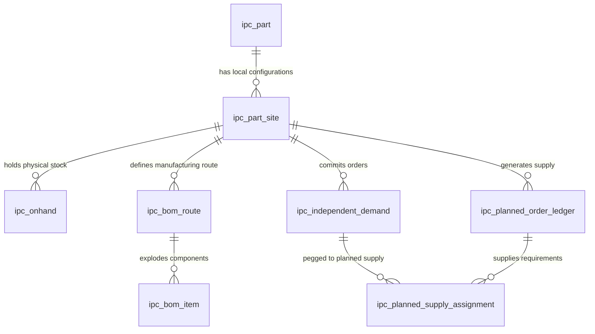

# IPC 计划决策引擎全景数据字典 (Advanced ER Data Dictionary)

本数据字典详细记录了基于 Kinaxis 命名重构后、运行在 DuckDB 分析层之上的全量 **190+** 张自主物理表与关联视图的结构、业务释义及主外键约束，融入了包括配额防波堤、时空置换、半导体分级降级消纳在内的全部核心算法设计。

## 📐 一、 物理数据库核心 ER 关系架构图

## 📂 二、 业务功能模块归档

- **1. 核心计划与排产 (Core Planning - MPS/MRP)**: 包含 10 张表
- **2. 联副产品分级优化 (Co-product Optimization)**: 包含 0 张表
- **3. ETO 协同项目管理 (ETO Project & WBS)**: 包含 6 张表
- **4. IBP 财务与预测共识 (IBP Consolidated Planning)**: 包含 30 张表
- **5. IO 安全库存水位优化 (IO Safety Stock Policy)**: 包含 12 张表
- **6. 基础支撑与主数据 (Master Data & Metadata)**: 包含 140 张表

---

## 📝 三、 数据表与字段明细说明

### 1. 核心计划与排产 (Core Planning - MPS/MRP)

#### 🏷️ `ipc_bom_item` (bom_item)
> **业务说明**: BOM行项目明细表。定义组装件与子组件的父子拓扑关系，包含替代组（alt_grp）、分配优先级（priority）、替代迄今累计消耗量、目标占比（target）等核心替代控制字段。

| 字段编码 (Field Code) | 字段物理名 (Field Name) | 物理类型 (Data Type) | 必填/键 (Key) | 详细业务备注 (Comment) |
| :--- | :--- | :--- | :--- | :--- |
| `bomid` | bomid | `VARCHAR(10)` | Nullable | BOM编号 |
| `site` | site | `VARCHAR(8)` | 🔑 **PK / Required** | 工厂或仓库站点编码 (Site Code，对应 SAP 的 Plant) |
| `component` | component | `VARCHAR(40)` | Nullable | 组件
Reference Table: Material |
| `eff_start_date` | eff_start_date | `DATE` | Nullable | 生效日期 |
| `eff_end_date` | eff_end_date | `DATE` | Nullable | 失效日期 |
| `ratio` | ratio | `DECIMAL(18,2)` | Nullable | 采购比例，0-1表示还是0-100表示取决于MaterialBOMRouting.RatioRule |
| `perqty` | perqty | `DECIMAL(18,2)` | Nullable | 每单位assemble所用component的数量 |
| `scrap` | scrap | `DECIMAL(18,2)` | Nullable | 指定在组装的生产过程中丢失的组件的比例。例如，由于破损。 |
| `alt_grp` | alt_grp | `VARCHAR(10)` | Nullable | 替代组编码，相同替代组内的组件物料属于可替换物料 |
| `priority` | priority | `INTEGER` | Nullable | 优先级，数值越小越优先 |
| `alt_todate_qty` | alt_todate_qty | `DECIMAL(18,2)` | Nullable | 指示迄今为止已分配给此替代BOM的数量（例如，它可能代表已知的输入供应分配）。此值应以组件库存单位表示，并用于初始替代BOM级别的决策。此字段适用于替代BOM记录，其中altgrp.type.source_rule设置为“on_going”，并在确定一组中哪些可替代组件应生成计划订单以满足装配的依赖需求的逻辑中使用。 |
| `target` | target | `DECIMAL(18,2)` | Nullable | 确定在创建计划订单时，来自组装的依赖需求分解到替代组中的组件的比例或百分比。这个值应以组装件的供应单位来表示。然后，应该分解到组件的需求百分比被计算为组件的目标值除以组中所有组件的目标值之和。请注意，根据AlternateGroupType表上ComponentSourceRule字段中的设置，来自组装物料的每个依赖需求要么按比例在可替换组件之间分割，要么完全分配给可替换组件，否则该组件将远离其当前目标。如果计划的订单只应该在组中的主要组件上创建，那么可以在该字段中为其分配一个正值，并且应该为所有其他组件分配一个值0(零)。如果计划的订单应该均匀地分布在组中的所有组件上，那么可以在这个字段中为每个组件分配相同的正值(例如，可以指定值1)。 |
| `item` | item | `INTEGER` | Nullable | BOM行项目编号 |
| `operation` | operation | `VARCHAR(10)` | Nullable | 工序ID |
| `alt_bom` | alt_bom | `VARCHAR(10)` | Nullable | 替换的BOM版本号 |
| `alt_group` | alt_group | `VARCHAR(10)` | Nullable | 唯一标识，自动加1 |

---

#### 🏷️ `ipc_bom_route` (part_routing_bom)
> **业务说明**: 物料工艺BOM关系表（BOM Route）。将物料、工艺路线和BOM ID进行绑定，支持基于生效日期和优先级进行路由选择，特别包含维度组（dim_grp）以过滤匹配特定的多维分配路径。

| 字段编码 (Field Code) | 字段物理名 (Field Name) | 物理类型 (Data Type) | 必填/键 (Key) | 详细业务备注 (Comment) |
| :--- | :--- | :--- | :--- | :--- |
| `site` | site | `VARCHAR(8)` | 🔑 **PK / Required** | 工厂或仓库站点编码 (Site Code，对应 SAP 的 Plant) |
| `part` | part | `VARCHAR(40)` | 🔑 **PK / Required** | 物料唯一编码 (Part Code) |
| `bomid` | bomid | `VARCHAR(40)` | PK / NOT NULL | BOM编号
Reference Table: BOM |
| `routing` | routing | `VARCHAR(10)` | Nullable | Routing编号
Reference Table:Routing |
| `dim_grp` | dim_grp | `VARCHAR(10)` | Nullable | ReferenceTable:Dimension |
| `eff_start_date` | eff_start_date | `DATE` | Nullable | 有效开始日期
默认值：2020.8.31 |
| `eff_end_date` | eff_end_date | `DATE` | Nullable | 生效结束日期 2030.8.31 |
| `yield` | yield | `DECIMAL(18,2)` | Nullable | - |
| `max_qty` | max_qty | `DECIMAL(18,2)` | Nullable | - |
| `priority` | priority | `INTEGER` | Nullable | 优先级，数值越小越优先 |
| `bom_type` | bom_type | `VARCHAR(10)` | Nullable | Reference Table: MaterialBOMRoutingType |

---

#### 🏷️ `ipc_onhand` (oh_inventory)
> **业务说明**: 物理在库库存表。记录每个库位、物料在不同站点和可用日期下的实际物理在库数量，是 LBL-MRP 供需消纳计算的库存初始水位。

| 字段编码 (Field Code) | 字段物理名 (Field Name) | 物理类型 (Data Type) | 必填/键 (Key) | 详细业务备注 (Comment) |
| :--- | :--- | :--- | :--- | :--- |
| `location` | location | `VARCHAR(10)` | PK / NOT NULL | 具体的物理库位编码 |
| `part` | part | `VARCHAR(40)` | 🔑 **PK / Required** | 物料唯一编码 (Part Code) |
| `site` | site | `VARCHAR(8)` | 🔑 **PK / Required** | 工厂或仓库站点编码 (Site Code，对应 SAP 的 Plant) |
| `available_date` | available_date | `DATE` | PK / NOT NULL | 实际供应可用或可承诺交付日期 (ATP Date) |
| `qty` | qty | `DECIMAL(18,2)` | Nullable | 数量 (Quantity) |
| `inventory_type` | inventory_type | `VARCHAR(10)` | Nullable | 库存类型 |

---

#### 🏷️ `ipc_part` (核心物料主数据表 (Decoupled Part))
> **业务说明**: 核心物料主数据表（解耦后的主物料）。定义全局物料的物料编码、类型（成品/半成品/原料/替代料）和销售单价，是整个供应链网络节点拓扑的根基。

| 字段编码 (Field Code) | 字段物理名 (Field Name) | 物理类型 (Data Type) | 必填/键 (Key) | 详细业务备注 (Comment) |
| :--- | :--- | :--- | :--- | :--- |
| `part` | 物料编码 | `VARCHAR(100)` | 🔑 **PK / Required** | 物料唯一编码 (Part Code) |
| `part_type` | 物料类型 | `VARCHAR(50)` | Nullable | 物料分类：FINISHED (产成品), SEMI (半成品), RAW (原材料), ALT (替代料) |
| `uom` | 基本计量单位 | `VARCHAR(20)` | Nullable | 计量单位，如 PCS, KG |
| `selling_ave_price` | 平均销售单价 | `DOUBLE` | Nullable | 财务结算及营业收入折算的基准平均售价 |

---

#### 🏷️ `ipc_part_site` (物料站点关系配置表 (Decoupled PartSite))
> **业务说明**: 物料站点关系配置表（解耦后的 PartSite）。指定特定物料在特定生产厂区或仓库站点下的配货策略、MRP规则、安全库存规则（ss_rule）、虚拟物料标识（is_phantom）、以及我们特有的跨站点调拨成本与提前期参数。

| 字段编码 (Field Code) | 字段物理名 (Field Name) | 物理类型 (Data Type) | 必填/键 (Key) | 详细业务备注 (Comment) |
| :--- | :--- | :--- | :--- | :--- |
| `part` | part | `VARCHAR(40)` | 🔑 **PK / Required** | 物料唯一编码 (Part Code) |
| `description` | description | `VARCHAR` | Nullable | 物料描述 |
| `site` | site | `VARCHAR(8)` | 🔑 **PK / Required** | 工厂或仓库站点编码 (Site Code，对应 SAP 的 Plant) |
| `before_forecast` | before_forecast | `INTEGER` | Nullable | Forecast DueDate之前的Buckets数量 |
| `after_forecast` | after_forecast | `INTEGER` | Nullable | Forecast DueDate之后的Buckets数量 |
| `dos_policy` | dos_policy | `VARCHAR(10)` | Nullable | Reference Table : dos_policy |
| `demand_tf_intervals` | demand_tf_intervals | `INTEGER` | Nullable | 在Rundate之后多少Buckets之内的没有消耗的Forecast不再参与Consumption和Netting。
Rundate取自Material.PlanningCalendar.RunDate.FirstDate.Bucket时间单位取自FreezeCalendar |
| `dos_intervals` | dos_intervals | `DECIMAL(18,2)` | Nullable | Buckets数量 |
| `percent_safety_intervals` | percent_safety_intervals | `INTEGER` | Nullable | Buckets数量 |
| `ss_percent` | ss_percent | `DECIMAL(18,2)` | Nullable | 当SafetyStock按照需求百分比算的时候，百分比是多少。80%，填写80 |
| `planning_calendar` | planning_calendar | `VARCHAR(10)` | Nullable | 计划日历 |
| `product_family` | product_family | `VARCHAR(40)` | Nullable | 产品系列，Reference Table: Product Family |
| `product_grp1` | product_grp1 | `VARCHAR(40)` | Nullable | - |
| `product_grp2` | product_grp2 | `VARCHAR(40)` | Nullable | - |
| `referencematerial` | reference_part | `VARCHAR(40)` | Nullable | Reference Table: Reference Part |
| `ss_rule` | ss_rule | `VARCHAR(10)` | Nullable | Reference Table: ss_rule |
| `ss_fixed_qty` | ss_fixed_qty | `DECIMAL(18,2)` | Nullable | 用来应对需求波动 |
| `sourcerule` | SourceRule | `VARCHAR(10)` | Nullable | 多个Source遵循什么规则选择
Reference Table : Source Rule |
| `spread_forecast_buckets` | spread_forecast_buckets | `INTEGER` | Nullable | 预测平铺的Buckets数, 例如Forecast按季度上传，第一个季度需要平铺 |
| `unit` | uom | `VARCHAR(10)` | Nullable | 计量单位
Reference Table： UnitOfMeasure |
| `ctp_rule` | ctp_rule | `VARCHAR(10)` | Nullable | 是否使用CTP。如果此处设置那么以MaterialType的规则为准 |
| `ave_sales_price` | ave_sales_price | `VARCHAR(18)` | Nullable | 平均售价 |
| `buyer` | buyer | `VARCHAR(10)` | Nullable | 采购员ID |
| `assignment_mutiple` | assignment_mutiple | `DECIMAL(18,2)` | Nullable | 物料分配的时候整数倍 |
| `inv_carry_cost` | inv_carry_cost | `DECIMAL(18,2)` | Nullable | 库存持有成本 |
| `mrp_rule` | mrp_rule | `VARCHAR(10)` | Nullable | MRP规则，关联MRPRule Table. |
| `abc` | abc | `BOOLEAN` | Nullable | - |
| `par_site` | par_site | `VARCHAR(8)` | Nullable | 场所相当于SAP的Plant. |
| `par_part` | par_part | `VARCHAR(40)` | Nullable | Assemble物料号
Reference Table: Material |
| `bomid` | bomid | `VARCHAR(40)` | Nullable | BOM编号
Reference Table: BOM |
| `excess` | excess | `VARCHAR` | Nullable | 计划日历的数量。TimeUnit从RunDate中间隔出来，该RunDate定义了在确定过剩时包含替代部件需求和供应的窗口。这适用于作为全局替代品使用的部件(如果它们的Type.ExcessRule是
‘ GlobalFence ’)，以及用作bom级替代品的部件(如果它们的类型为。ExcessRule是‘ Fence ’)。 |
| `abc_code` | abc_code | `VARCHAR` | Nullable | 此表格列出了有效的 ABC 代码，这些代码根据年度销售额或其他标准将零部件进行分类。这些代码用于识别那些影响最大的零部件，并应予以重点关注。“受控制的”
此表的“site”字段是可选的，系统或数据管理员可以决定该字段是用于唯一标识表中的记录，还是在查询中被忽略、不在插入定义、对话框或“数据源和映射”窗口中显示。 |
| `source_rule` | source_rule | `VARCHAR(10)` | Nullable | - |
| `ave_qty` | ave_qty | `DECIMAL(18,2)` | Nullable | 此字段表示当 安全库存策略.安全库存规则（ss_policy.ss_rule） 设置为以下值时使用的 平均订单量：

op_ave平均订购点）
op_over（超订购点）
op_under（次订购点）
具体作用：

若规则为 op_ave，此值为补货时的固定订单量，用于将库存水平恢复至安全阈值 |
| `carry_cost` | carry_cost | `DOUBLE` | Nullable | 库存持有成本 |
| `con_share_window` | con_share_window | `DECIMAL(18,2)` | Nullable | 约束share的窗口 |
| `is_phantom` | is_phantom | `BOOLEAN` | Nullable | 是否为虚拟物料。Y - 虚拟件 (展开子BOM)，N - 实体件 |
| `transshipment_cost` | 跨站点调拨成本 | `DOUBLE` | Nullable | 多站点内协物流调拨的单件调拨成本 |
| `transshipment_lead_time` | 跨站点调拨提前期 | `INTEGER` | Nullable | 物流调拨所需的物理周期 (天数) |

---

#### 🏷️ `ipc_planned_order` (planned_order)
> **业务说明**: 计划订单表。LBL-MRP 计算后生成的建议补货订单，包含计划开工/完工期、计划数量、物料/站点以及关联的维度组信息。

| 字段编码 (Field Code) | 字段物理名 (Field Name) | 物理类型 (Data Type) | 必填/键 (Key) | 详细业务备注 (Comment) |
| :--- | :--- | :--- | :--- | :--- |
| `planned_order` | planned_order | `VARCHAR(18)` | PK / NOT NULL | 计划订单号 |
| `request_start_date` | request_start_date | `DATE` | Nullable | 考虑了LT或者Constrain的最晚开始日期（采购和生产为单据开始日期，转储单为Built开始日期） |
| `due_date` | due_date | `DATE` | Nullable | 期望交付或就绪日期 |
| `eff_qty` | eff_qty | `DECIMAL(18,2)` | Nullable | 考虑过Yield,scrap,UNIT的之后的数量 |
| `dimension_grp` | dimension_grp | `VARCHAR(10)` | Nullable | 消纳维度组，用于 semiconductor binning 分级降级消纳规则匹配 |
| `is_planned` | is_planned | `VARCHAR(10)` | Nullable | 系统自动创建或是manual input |
| `part` | part | `VARCHAR(40)` | 🔑 **PK / Required** | 物料唯一编码 (Part Code) |
| `source` | source | `VARCHAR(10)` | Nullable | 关联MaterialSource |
| `qty` | qty | `DECIMAL(18,2)` | Nullable | 数量 (Quantity) |
| `ship_date` | ship_date | `DATE` | Nullable | 采购和转储订单 |
| `build_date` | build_date | `DATE` | Nullable | 采购和转储订单 |
| `base_unit` | base_unit | `VARCHAR(10)` | Nullable | 基准单位 |
| `planned_unit` | planned_unit | `VARCHAR(10)` | Nullable | 应用单位 |
| `site` | site | `VARCHAR(8)` | 🔑 **PK / Required** | 工厂或仓库站点编码 (Site Code，对应 SAP 的 Plant) |

---

#### 🏷️ `ipc_planned_supply_assignment` (planned_supply_assignment)
> **业务说明**: 计划供应钉结分配表（Planned Pegging）。记录未锁定的计划订单（Planned Order）与独立需求之间的多对多钉结溯源关系，包含最早开工时间（ECS）与齐套时间。

| 字段编码 (Field Code) | 字段物理名 (Field Name) | 物理类型 (Data Type) | 必填/键 (Key) | 详细业务备注 (Comment) |
| :--- | :--- | :--- | :--- | :--- |
| `assigned_qty` | assigned_qty | `DECIMAL(18,2)` | PK / NOT NULL | 本次配额锁定的实际分配数量 |
| `assigned_parent_qty` | assigned_parent_qty | `DECIMAL(18,2)` | Nullable | 此supply分配的直接上层的数量 |
| `request_qty` | request_qty | `DECIMAL(18,2)` | Nullable | 原始请求的订货/预测数量 |
| `required_parent_qty` | required_parent_qty | `DECIMAL(18,2)` | Nullable | 此supply上层需求的数量 |
| `demand` | demand | `VARCHAR(18)` | 🔑 **PK / Required** | 需求编号 |
| `item` | item | `DOUBLE` | PK / NOT NULL | 需求行项目号 |
| `location` | location | `VARCHAR(10)` | Nullable | 具体的物理库位编码 |
| `part` | part | `VARCHAR(40)` | 🔑 **PK / Required** | 物料唯一编码 (Part Code) |
| `site` | site | `VARCHAR(8)` | 🔑 **PK / Required** | 工厂或仓库站点编码 (Site Code，对应 SAP 的 Plant) |
| `due_date` | due_date | `DATE` | Nullable | 期望交付或就绪日期 |
| `supply` | supply | `VARCHAR(18)` | Nullable | 供给编号 |
| `supply_item` | supply_item | `DOUBLE` | Nullable | 供给行项目 |
| `supply_schedule_line` | supply_schedule_line | `DOUBLE` | Nullable | 供给计划行 |
| `request_constraint_start_date` | request_constraint_start_date | `DATE` | Nullable | 需求日期,如果是Make=LCS(Last ConstrainStartDate) |
| `available_date` | available_date | `DATE` | Nullable | 实际供应可用或可承诺交付日期 (ATP Date) |
| `planned_order` | planned_order | `VARCHAR(18)` | Nullable | 计划订单号 |
| `Reservation` | document | `VARCHAR(18)` | Nullable | 预留单号 |
| `pla_site` | pla_site | `VARCHAR(8)` | Nullable | 需求site |
| `request_part` | request_part | `VARCHAR(40)` | Nullable | 需求物料号 |
| `assigned_part` | assigned_part | `VARCHAR(40)` | Nullable | 供给物料号 |
| `dimension_grp` | dimension_grp | `VARCHAR(10)` | Nullable | 消纳维度组，用于 semiconductor binning 分级降级消纳规则匹配 |
| `supply_type` | supply_type | `VARCHAR(10)` | Nullable | 供给来源 |
| `request_parent` | request_parent | `VARCHAR(40)` | Nullable | 父节点物料 |
| `ECS` | available_constraint_start_date | `DATE` | Nullable | 最早开工日期 |
| `part_ready_date` | part_ready_date | `DATE` | Nullable | 最早物料齐套日期 |

---

#### 🏷️ `ipc_routing` (routing)
> **业务说明**: 工艺路线表。定义不同产品在各厂区站点下的加工路线，是有限产能派程和测试设备分配的输入基础。

| 字段编码 (Field Code) | 字段物理名 (Field Name) | 物理类型 (Data Type) | 必填/键 (Key) | 详细业务备注 (Comment) |
| :--- | :--- | :--- | :--- | :--- |
| `routing` | routing | `VARCHAR(10)` | PK / NOT NULL | Routing编号 |
| `description` | description | `VARCHAR` | Nullable | 描述 |
| `site` | site | `VARCHAR(8)` | 🔑 **PK / Required** | 工厂或仓库站点编码 (Site Code，对应 SAP 的 Plant) |

---

#### 🏷️ `ipc_scheduled_receipt` (scheduled_reciept)
> **业务说明**: 在途供应订单表（未来到料）。记录采购订单和工单的在途未交付明细，是 LBL-MRP 计算时已存在且有确定交付期的可供消纳供应资源。

| 字段编码 (Field Code) | 字段物理名 (Field Name) | 物理类型 (Data Type) | 必填/键 (Key) | 详细业务备注 (Comment) |
| :--- | :--- | :--- | :--- | :--- |
| `sr_id` | sr_id | `VARCHAR(18)` | Nullable | 供应订单编号，如采购订单和工单。
Reference Table: SupplyOrder |
| `item` | item | `DOUBLE` | Nullable | LineNum,供应订单的schedulelineItem编号
Reference Table: SupplyOrder |
| `sup_sr_id` | sup_sr_id | `VARCHAR(18)` | Nullable | 供应订单编号，如采购订单和工单。
Reference Table: SupplyOrder |
| `to_part` | to_part | `VARCHAR(40)` | Nullable | 物料编号 |
| `from_part` | from_part | `VARCHAR(40)` | Nullable | 发货物料号 |
| `from_site` | from_site | `VARCHAR(8)` | Nullable | 从哪个Site发出 |
| `to_site` | to_site | `VARCHAR(8)` | Nullable | 接收Site |
| `transfer_order` | transfer_order | `VARCHAR(18)` | Nullable | 转储单编号 |
| `pur_to_part` | pur_to_part | `VARCHAR(40)` | Nullable | 物料编号 |
| `pur_from_part` | pur_from_part | `VARCHAR(40)` | Nullable | 发货物料号 |
| `pur_from_site` | pur_from_site | `VARCHAR(8)` | Nullable | 从哪个Site发出 |
| `pur_to_site` | pur_to_site | `VARCHAR(8)` | Nullable | 接收Site |
| `pur_Item` | pur_item | `DOUBLE` | Nullable | 转储行项目 |
| `qty` | qty | `DECIMAL(18,2)` | Nullable | 数量 (Quantity) |
| `shipped_qty` | shipped_qty | `DECIMAL(18,2)` | Nullable | 已发货数量 |
| `request_qty` | request_qty | `DECIMAL(18,2)` | Nullable | 原始请求的订货/预测数量 |
| `recieved_qty` | recieved_qty | `DECIMAL(18,2)` | Nullable | 已收货数量 |
| `request_stock_date` | request_stock_date | `DATE` | Nullable | 根据客户需求由MRP推导出来的StockDate. Or RequestDockDate+MaterialSource.DockToStockLT。 |
| `request_dock_date` | request_dock_date | `DATE` | Nullable | 根据客户需求由MRP推导出来的DockDate,RequestStockDate-DockToStockLT-Canlendar. 这里的LT如果启用了ConstrainPlanning,用Constrain来计算。Or RequestShipDate+Source.TransitCalendar+Source.TransitLT+Destination.Site.Calendar. 如果是工单，DockDate为完工日期。 |
| `request_ship_date` | request_ship_date | `DATE` | Nullable | 根据客户需求推导由MRP出来的ShipDate,RequesStockDate-MaterialSource.TransitLT-Canlendar. 这里的LT如果启用了ConstrainPlanning,用Constrain来计算。Or RequesDueDate+Source.ShipCalendar+MaterialSource.PreShipLT。
注意：ShipDate如果已经超过RunDate，意味着供应商几乎不能完成交付。应该在MRP中考虑以何种策略应对这种情况。 |
| `request_due_date` | request_due_date | `DATE` | Nullable | 根据客户需求由MRP推导出来的DueDate,RequestShipDate-MaterialSource.PreShipLT-Source.ShipCalendar-TransitCalendar.这里的LT如果启用了ConstrainPlanning,用Constrain来计算。Or RequestBultStartDate+MaterialSource.BuiltLT(Fixed,Ad,Va).
 |
| `request_built_date` | request_built_date | `DATE` | Nullable | 根据客户需求由MRP推导出来的BuiltDate,由RequestDueDate- MaterialSource.Built(AD,Va,Fixed)LT-Calendar.Or OrderStartDate+MaterialSource.PreBuiltLT |
| `request_order_start_date` | request_order_start_date | `DATE` | Nullable | 根据客户需求由MRP推导出出来的SupplyOrder开始处理的准备执行的日期。RequestBuiltDate-MaterialSource.PreBuiltLT-Calendar-FreezeDate. Or RunDate+Calendar+FreezeDate |
| `ship_to` | ship_to | `VARCHAR(8)` | Nullable | 接收货物的Site
Reference Table: Site |
| `to_location` | to_location | `VARCHAR(10)` | Nullable | 接收货物的Location
Reference Table: Location |
| `unit` | unit | `VARCHAR(10)` | Nullable | 采购单位，Reference Table: MaterialSource.SupplierUOM |
| `confirmed_date_by_supplier` | confirmed_date_by_supplier | `DATE` | Nullable | 供应商确认的日期,这里是第一次确认的日期 |
| `confirmed_date_by_buyer` | confirmed_date_by_buyer | `DATE` | Nullable | Buyer已经确认此订单的日期确认的日期 |
| `confirmed_by_supplier` | confirmed_by_supplier | `BOOLEAN` | Nullable | 供应商是否确认
Y - 已经确认
N - 没有全部确认 |
| `supply_status` | supply_status | `VARCHAR(10)` | Nullable | 处理规则。 Reference Table: SupplyStatus |
| `sche_stock_date` | sche_stock_date | `DATE` | Nullable | 反馈的日期 |
| `sche_dock_date` | sche_dock_date | `DATE` | Nullable | 反馈的日期 |
| `state` | state | `VARCHAR(10)` | Nullable | 供给所处的状态：
Shipped - 已发货
Built - 已经开始生产
CTB - 物料和资源已经准备好（这里才是订单真正可以开始的日期）
 |

---

#### 🏷️ `ipc_supply_assignment` (supply_assignment)
> **业务说明**: 锁定/确权供应钉结分配表（Firm Pegging）。记录在途、在库供应与需求之间的锁定配额钉结关系，包含我们的 ITP/IOP Allotment 配额防波堤划转明细，防止普通订单抢占战略配额。

| 字段编码 (Field Code) | 字段物理名 (Field Name) | 物理类型 (Data Type) | 必填/键 (Key) | 详细业务备注 (Comment) |
| :--- | :--- | :--- | :--- | :--- |
| `assigned_qty` | assigned_qty | `DECIMAL(18,2)` | PK / NOT NULL | 本次配额锁定的实际分配数量 |
| `assigned_parent_qty` | assigned_parent_qty | `DECIMAL(18,2)` | Nullable | 此supply分配的直接上层的数量 |
| `request_qty` | request_qty | `DECIMAL(18,2)` | Nullable | 原始请求的订货/预测数量 |
| `required_parent_qty` | required_parent_qty | `DECIMAL(18,2)` | Nullable | 此supply上层需求的数量 |
| `demand` | demand | `VARCHAR(18)` | 🔑 **PK / Required** | 需求编号 |
| `item` | item | `DOUBLE` | PK / NOT NULL | 需求行项目号 |
| `ind_part` | ind_part | `VARCHAR(40)` | Nullable | 物料编号
Reference Table:Material |
| `location` | location | `VARCHAR(10)` | Nullable | 具体的物理库位编码 |
| `part` | part | `VARCHAR(40)` | 🔑 **PK / Required** | 物料唯一编码 (Part Code) |
| `site` | site | `VARCHAR(8)` | 🔑 **PK / Required** | 工厂或仓库站点编码 (Site Code，对应 SAP 的 Plant) |
| `due_date` | due_date | `DATE` | Nullable | 期望交付或就绪日期 |
| `supply` | supply | `VARCHAR(18)` | Nullable | 供给编号 |
| `supply_item` | supply_item | `DOUBLE` | Nullable | 供给行项目 |
| `supply_schedule_line` | supply_schedule_line | `DOUBLE` | Nullable | 供给计划行 |
| `request_constraint_start_date` | request_constraint_start_date | `DATE` | Nullable | 需求日期,如果是Make=LCS(Last ConstrainStartDate) |
| `available_date` | available_date | `DATE` | Nullable | 实际供应可用或可承诺交付日期 (ATP Date) |
| `request_part` | request_part | `VARCHAR(40)` | Nullable | 需求物料号 |
| `assigned_part` | assigned_part | `VARCHAR(40)` | Nullable | 供给物料号 |
| `dimension_grp` | dimension_grp | `VARCHAR(10)` | Nullable | 消纳维度组，用于 semiconductor binning 分级降级消纳规则匹配 |
| `supply_type` | supply_type | `VARCHAR(10)` | Nullable | 供给来源 |
| `request_parent` | request_parent | `VARCHAR(40)` | Nullable | 父节点物料 |
| `ECS` | available_constraint_start_date | `DATE` | Nullable | 最早开工日期 |
| `part_ready_date` | part_ready_date | `DATE` | Nullable | 最早物料齐套日期 |
| `demand_source` | demand_source | `VARCHAR` | Nullable | reservation
forecast
sto
sales_order
allotment |

---

### 2. 联副产品分级优化 (Co-product Optimization)

### 3. ETO 协同项目管理 (ETO Project & WBS)

#### 🏷️ `ipc_project` (project)
> **业务说明**: ETO 项目主数据定义表。支持多代基线（baseline）、奖惩计划（bonus_plan/penalty_plan）以及客户绑定的项目管理根表。

| 字段编码 (Field Code) | 字段物理名 (Field Name) | 物理类型 (Data Type) | 必填/键 (Key) | 详细业务备注 (Comment) |
| :--- | :--- | :--- | :--- | :--- |
| `baseline` | baseline | `VARCHAR` | Nullable | 指示此项目是否为基线。将项目设置为基线之后，这个表中的某些计算字段以及Task表总是返回它们在项目建立基线时所保存的值：
Y
N |
| `bonus_date` | bonus_date | `VARCHAR` | Nullable | 奖金可能适用于此项目的日期或之前。
奖励是根据参考值计算的
BonusSchedule和ProjectType值，并且可以应用于在此日期或之前完成的项目 |
| `bonus_plan` | bonus_plan | `VARCHAR` | Nullable | Reference:BonusPlan |
| `customer` | customer | `VARCHAR` | Nullable | Reference:Customer |
| `project` | project | `VARCHAR` | 🔑 **PK / Required** | - |
| `descriotion` | descriotion | `VARCHAR` | Nullable | - |
| `finish_date` | finish_date | `VARCHAR` | Nullable | - |
| `grp` | grp | `VARCHAR` | Nullable | Reference:ProjectGroup |
| `hours_per_day` | hours_per_day | `VARCHAR` | Nullable | 每天的工作小时数 |
| `manager` | manager | `VARCHAR` | Nullable | Reference:ProjectManager |
| `penalty_date` | penalty_date | `VARCHAR` | Nullable | 处罚可能累积到该项目的日期。罚款费用是根据参考PenaltySchedule和ProjectType值计算的
，并且可以在此日期和CalcFinishDate之间应用。 |
| `penalty_plan` | penalty_plan | `VARCHAR` | Nullable | Reference:PenaltyPlan |
| `rate_adjustment` | rate_adjustment | `VARCHAR` | Nullable | 可选的百分比调整将应用于为分配给本项目任务的任何资源收取的标准和加班费。例如，分配给特定客户项目的所有资源都可以打折。如果调整表示对资源费率收取额外费用，则应指定正值。如果调整表示应用于资源价格的折扣，则应指定负值。例如，0.05表示5%的溢价，而-0.1表示打九折。 |

---

#### 🏷️ `ipc_project_group` (project_group)
> **业务说明**: 项目组

| 字段编码 (Field Code) | 字段物理名 (Field Name) | 物理类型 (Data Type) | 必填/键 (Key) | 详细业务备注 (Comment) |
| :--- | :--- | :--- | :--- | :--- |
| `grp` | grp | `VARCHAR` | PK / NOT NULL | - |
| `descriotion` | descriotion | `VARCHAR` | Nullable | - |

---

#### 🏷️ `ipc_project_manager` (project_manager)
> **业务说明**: 项目经理

| 字段编码 (Field Code) | 字段物理名 (Field Name) | 物理类型 (Data Type) | 必填/键 (Key) | 详细业务备注 (Comment) |
| :--- | :--- | :--- | :--- | :--- |
| `manager` | manager | `VARCHAR` | PK / NOT NULL | - |

---

#### 🏷️ `ipc_project_status` (project_status)
> **业务说明**: ProjectStatus表定义了可以分配给项目的状态值。这些值表示项目的完成程度，并可用于筛选到感兴趣的特定项目。
例如，项目可能被标识为计划的、开放的、延迟的或完成的

| 字段编码 (Field Code) | 字段物理名 (Field Name) | 物理类型 (Data Type) | 必填/键 (Key) | 详细业务备注 (Comment) |
| :--- | :--- | :--- | :--- | :--- |
| `status` | status | `VARCHAR` | PK / NOT NULL | - |
| `descriotion` | descriotion | `VARCHAR` | Nullable | - |

---

#### 🏷️ `ipc_project_type` (project_type)
> **业务说明**: ProjectType表包含在项目级别定义处理和计算的可配置设置。例如，此表设置项目的工作日历，并指定项目日期是从给定的开始日期还是完成日期计算的。

| 字段编码 (Field Code) | 字段物理名 (Field Name) | 物理类型 (Data Type) | 必填/键 (Key) | 详细业务备注 (Comment) |
| :--- | :--- | :--- | :--- | :--- |
| `add_duration` | add_duration | `VARCHAR` | Nullable | 当从完成开始调度项目时，此设置指示正在进行的任务是StartDate还是StartDate +
ActualDuration，在约束具有“StartToStart”或“FinishToStart”关系的前身时使用.
Y-
N |
| `allow_non_working_days` | allow_non_working_days | `VARCHAR` | Nullable | 非工作日是否考虑安排工作 |

---

#### 🏷️ `ipc_project_wbs` (ETO项目WBS元素任务表)
> **业务说明**: ETO WBS 任务分解表。层级化管理工程项目任务网络拓扑（SMT、组装、测试等），支持状态 override 状态切换并与 C++ 引擎联动重新排程。

| 字段编码 (Field Code) | 字段物理名 (Field Name) | 物理类型 (Data Type) | 必填/键 (Key) | 详细业务备注 (Comment) |
| :--- | :--- | :--- | :--- | :--- |
| `wbs_code` | WBS编码 | `VARCHAR(100)` | 🔑 **PK / Required** | WBS任务节点的唯一层级编码 (如 WBS_001_SMT) |
| `project_code` | 项目编码 | `VARCHAR(100)` | PK / NOT NULL | 项目编码，关联的 ETO 项目ID |
| `parent_wbs_code` | 父WBS编码 | `VARCHAR(100)` | Nullable | 父 WBS 任务编码，用于建立层级任务树 |
| `wbs_level` | WBS层级 | `INTEGER` | Nullable | 任务在树中的层级深度 |
| `wbs_status` | 任务状态 | `VARCHAR(50)` | Nullable | WBS任务完成状态: ACTIVE (执行中), COMPLETED (已完工), PENDING (已挂起) |
| `description` | 描述 | `VARCHAR(200)` | Nullable | 任务节点详情说明 |

---

### 4. IBP 财务与预测共识 (IBP Consolidated Planning)

#### 🏷️ `ipc_commercial_bonus_plan` (bonus_plan)
> **业务说明**: BonusSchedule表包含可以使用的不同奖金计划的字符串值。Project表和Task表都引用此表来指定与给定项目或任务相关的奖金时间表(如果有的话)。奖金时间表用于确定在指定奖金日期之前完成的任务或项目的奖金收入。也就是说，奖励可以通过项目获得，其中Project.CalcFinishDate在Project.BonusDate之前按或者Task.CalcFinishDateTask.BonusDate之前。

| 字段编码 (Field Code) | 字段物理名 (Field Name) | 物理类型 (Data Type) | 必填/键 (Key) | 详细业务备注 (Comment) |
| :--- | :--- | :--- | :--- | :--- |
| `bonus_plan` | bonus_plan | `VARCHAR` | PK / NOT NULL | 唯一标识 |
| `descriotion` | descriotion | `VARCHAR` | Nullable | - |
| `site` | site | `VARCHAR` | 🔑 **PK / Required** | 工厂或仓库站点编码 (Site Code，对应 SAP 的 Plant) |

---

#### 🏷️ `ipc_commercial_bonus_plan_by_date` (bonus_plan_by_date)
> **业务说明**: 暂无描述

| 字段编码 (Field Code) | 字段物理名 (Field Name) | 物理类型 (Data Type) | 必填/键 (Key) | 详细业务备注 (Comment) |
| :--- | :--- | :--- | :--- | :--- |
| `plan` | plan | `VARCHAR` | PK / NOT NULL | Reference:BonusPlan |
| `eff_start_date` | eff_start_date | `VARCHAR` | Nullable | - |
| `id` | id | `VARCHAR` | PK / NOT NULL | - |
| `on_time_bonus` | on_time_bonus | `DOUBLE` | Nullable | 应用于CalcFinishDate早于其CalcFinishDate的项目或任务的一次性奖金
PenaltyDate。 |
| `interval_bonus` | interval_bonus | `VARCHAR(40)` | Nullable | 经常性的奖金。应用于项目或任务的PenaltyDate和CalcFinishDate之间的每个有效日期，该日期属于与项目类型或任务类型关联的惩罚日历。例如，罚金费用可能适用于每个工作日或每个星期的间隔。 |

---

#### 🏷️ `ipc_commercial_bonus_plan_by_interval` (bonus_plan_by_interval)
> **业务说明**: 暂无描述

| 字段编码 (Field Code) | 字段物理名 (Field Name) | 物理类型 (Data Type) | 必填/键 (Key) | 详细业务备注 (Comment) |
| :--- | :--- | :--- | :--- | :--- |
| `plan` | plan | `VARCHAR` | PK / NOT NULL | Reference:BonusPlan |
| `interval` | interval | `VARCHAR` | Nullable | 要从项目或任务的BonusDate中减去的奖金日历间隔数，以确定在此记录上定义的奖金值的最后生效日期。奖金在该日期和前一记录的最后生效日期之间有效(按间隔)。
如果时间间隔在项目或任务的完成日期和奖励日期之间定义了多个有效记录，那么它们的有效奖励值将按照ProjectType或TaskType表。 |
| `id` | id | `VARCHAR` | PK / NOT NULL | - |
| `on_time_bonus` | on_time_bonus | `DOUBLE` | Nullable | 应用于CalcFinishDate早于其CalcFinishDate的项目或任务的一次性奖金
PenaltyDate。 |
| `interval_bonus` | interval_bonus | `VARCHAR(40)` | Nullable | 经常性的奖金。应用于项目或任务的PenaltyDate和CalcFinishDate之间的每个有效日期，该日期属于与项目类型或任务类型关联的惩罚日历。例如，罚金费用可能适用于每个工作日或每个星期的间隔。 |

---

#### 🏷️ `ipc_consensus_forecast` (consensus_forecast)
> **业务说明**: IBP 共识需求预测表。多部门（销售、财务、运营）共识后的滚动预测需求，支持单价及 override 数量修改，动态联动重新计算营业收入。

| 字段编码 (Field Code) | 字段物理名 (Field Name) | 物理类型 (Data Type) | 必填/键 (Key) | 详细业务备注 (Comment) |
| :--- | :--- | :--- | :--- | :--- |
| `cal_qty` | cal_qty | `DECIMAL(18,2)` | Nullable | 基于weight的数量 |
| `date` | date | `DECIMAL(18,2)` | Nullable | 一致性预测对应的日期 |
| `unit_price` | unit_price | `DECIMAL(18,2)` | Nullable | 单价，用来计算revenue  |
| `override_qty` | override_qty | `DECIMAL(18,2)` | Nullable | - |
| `customer` | customer | `VARCHAR(10)` | Nullable | - |
| `reba_adjustment_qty` | reba_adjustment_qty | `DECIMAL(18,2)` | Nullable | 在重新平衡需求计划到供应计划时，对计算出的一致预测或预测覆盖数量(如果指定)所做的调整。 |
| `reba_override_qty` | reba_override_qty | `DECIMAL(18,2)` | Nullable | - |
| `part` | part | `VARCHAR(40)` | 🔑 **PK / Required** | 物料唯一编码 (Part Code) |
| `region` | region | `VARCHAR(10)` | Nullable | - |
| `qty` | qty | `DECIMAL(18,2)` | Nullable | 数量 (Quantity) |
| `allocation_level` | allocation_level | `VARCHAR(10)` | Nullable | - |
| `order_priority` | order_priority | `VARCHAR` | Nullable | - |
| `consensus_forecast` | consensus_forecast | `VARCHAR` | PK / NOT NULL | 共识预测销售收入 (Qty * UnitPrice) |

---

#### 🏷️ `ipc_consensus_forecast_detail` (consensus_forecast_detail)
> **业务说明**: ConsensusForecastDetail表识别并报告ForecastDetail记录的详细信息，这些记录用于在销售和运营计划过程中为特定部件和客户生成一致预测值，并在ConsensusForecast表中报告。例如，它可能会报告多个加权预测类别的细节，这些类别对给定日期的共识预测有贡献，同时还会报告每个类别对共识预测值的贡献量

| 字段编码 (Field Code) | 字段物理名 (Field Name) | 物理类型 (Data Type) | 必填/键 (Key) | 详细业务备注 (Comment) |
| :--- | :--- | :--- | :--- | :--- |
| `consensus_forecast` | consensus_forecast | `VARCHAR` | Nullable | 共识预测销售收入 (Qty * UnitPrice) |
| `eff_qty` | eff_qty | `VARCHAR` | Nullable | ConsensusForecastDetail表识别并报告ForecastDetail记录的详细信息，这些记录用于在销售和运营计划过程中为特定部件和客户生成一致预测值，并在ConsensusForecast表中报告。例如，它可能会报告多个加权预测类别的细节，这些类别对给定日期的共识预测有贡献，同时还会报告每个类别对共识预测值的贡献量.在某些情况下，该字段可能返回零。例如，如果引用的ForecastDetail记录表示一个负面的预报调整，或者一个预报流，其数量通过调整减少为零。 |
| `forecast_detail` | forecast_detail | `VARCHAR` | Nullable | Reference
对ForecastDetail记录的引用。这将返回形成一致预测数量的特定部件、客户和预测类别组合的预测数量和日期.在使用预测覆盖或预测再平衡覆盖的情况下，只有与该覆盖相关的ForecastDetail记录在此表中被引用(即，任何其他有助于在
ConsensusForecast。CalculatedQuantity在本表中被忽略)。 |
| `part` | part | `VARCHAR` | 🔑 **PK / Required** | 物料唯一编码 (Part Code) |

---

#### 🏷️ `ipc_consensus_forecast_rolling_horizon` (consensus_forecast_rolling_horizon)
> **业务说明**: ConsensusForecastRollingHorizon表存储了用于定义在创建共识需求计划时将滚动预测权重应用到单个预测类别的顺序和持续时间的记录

| 字段编码 (Field Code) | 字段物理名 (Field Name) | 物理类型 (Data Type) | 必填/键 (Key) | 详细业务备注 (Comment) |
| :--- | :--- | :--- | :--- | :--- |
| `sequence` | sequence | `INTEGER` | PK / NOT NULL | 一个在确定生成共识预测时的持续时间的值，将weight应用于Category或者Header |
| `duration` | duration | `INTEGER` | PK / NOT NULL | 时间跨度 |

---

#### 🏷️ `ipc_consensus_forecast_rolling_horizon_weight` (consensus_forecast_rolling_horizon_weight)
> **业务说明**: 当使用滚动预测权重来创建共识需求计划时，ConsensusForecastRollingHorizonWeight表报告了在给定范围内应用于预测类别的权重。结果基于HistoricalDemandCategoryRollingWeight和HistoricalDemandHeaderRollingWeight表。它还报告了预测权重值的来源

| 字段编码 (Field Code) | 字段物理名 (Field Name) | 物理类型 (Data Type) | 必填/键 (Key) | 详细业务备注 (Comment) |
| :--- | :--- | :--- | :--- | :--- |
| `source` | source | `VARCHAR` | PK / NOT NULL | 表示用于计算共识预测的权重值的来源。
有效值为:
HisDemandHeaderRollingWeight
HisDemandHeader
HistoricalDemandCategory
HistoricalDemandCategoryRollingWeight |
| `header` | header | `VARCHAR` | PK / NOT NULL | - |
| `weight` | weight | `VARCHAR` | Nullable | - |
| `horization` | horization | `VARCHAR` | Nullable | - |

---

#### 🏷️ `ipc_consensus_forecast_weight_by_header` (consensus_forecast_weight_by_header)
> **业务说明**: ConsensusForecastWeightByHeader表按报头报告结果的一致预测权重。报告的值将用于ConsensusForecast的计算。结果基于使用以下输入表之一设置的ConsensusForecastWeight:
HistoricalDemandCategory
HistoricalDemandCategoryRollingWeight
HistoricalDemandHeader
HistoricalDemandHeaderRollingWeight
HistoricalDemandHeaderTimePhasedAttributes

| 字段编码 (Field Code) | 字段物理名 (Field Name) | 物理类型 (Data Type) | 必填/键 (Key) | 详细业务备注 (Comment) |
| :--- | :--- | :--- | :--- | :--- |
| `date` | date | `VARCHAR` | PK / NOT NULL | - |
| `header` | header | `VARCHAR` | PK / NOT NULL | - |
| `weight` | weight | `VARCHAR` | Nullable | - |

---

#### 🏷️ `ipc_customer_price` (customer_price)
> **业务说明**: 售卖价格

| 字段编码 (Field Code) | 字段物理名 (Field Name) | 物理类型 (Data Type) | 必填/键 (Key) | 详细业务备注 (Comment) |
| :--- | :--- | :--- | :--- | :--- |
| `material_num` | material_num | `VARCHAR(40)` | PK / NOT NULL | 物料号 |
| `Customer` | customer | `VARCHAR(10)` | PK / NOT NULL | 客户编号 |
| `eff_start_date` | eff_start_date | `DATE` | Nullable | 开始日期 |
| `unit_price` | unit_price | `DECIMAL(18,2)` | Nullable | 单价 |
| `unit` | unit | `VARCHAR(10)` | Nullable | 单位 |

---

#### 🏷️ `ipc_event_consensus_forecast_detail` (event_consensus_forecast_detail)
> **业务说明**: EventConsensusForecastDetail表用于事件管理。它保存有关应用了基于事件的预测调整的预测项目的信息，这些项目也属于用于生成一致预测的预测类别。的记录EventForecastDetailAdjustment表用作本表中记录的来源。

| 字段编码 (Field Code) | 字段物理名 (Field Name) | 物理类型 (Data Type) | 必填/键 (Key) | 详细业务备注 (Comment) |
| :--- | :--- | :--- | :--- | :--- |
| `average_unit_price` | average_unit_price | `DOUBLE` | Nullable | 有效单价的加权平均值
ForecastDetail记录指定日期桶的给定Header。
属性中的对应字段
EventForecastDetailAdjustment表 |
| `average_unit_price_adjustment` | average_unit_price_adjustment | `DOUBLE` | Nullable | 在应用影响该预测项目的所有事件阶段之后，计算出的基于事件的单位价格调整。 |
| `consensus_forecast` | consensus_forecast | `VARCHAR` | Nullable | 共识预测销售收入 (Qty * UnitPrice) |
| `D` | date | `DATE` | Nullable | - |
| `eff_qty` | eff_qty | `VARCHAR` | Nullable | 时间调整之前的数量 |
| `eff_ad_qty` | eff_ad_qty | `VARCHAR` | Nullable | 在应用影响该预测项目的所有事件阶段之后，计算出的基于事件的数量调整 |
| `event_forecast_detail_ad` | event_forecast_detail_ad | `VARCHAR` | Nullable | Reference |
| `header` | header | `VARCHAR` | Nullable | Reference |
| `material` | material | `VARCHAR` | PK / NOT NULL | Reference |

---

#### 🏷️ `ipc_event_forecast_detail_adjustment` (event_forecast_detail_adjustment)
> **业务说明**: 该表用于“事件管理”。它报告调整细节，包括受基于事件的调整影响的每个预测项目的任何数量或单价调整.
对于每个受影响的预测项目，此表中包含一个单独的记录
EventPhase.Calendar，并计算应用于该时间的所有基于事件的预测调整的结果。例如，如果给定日期桶中的预测项目受到使单价增加$10的事件阶段、使数量减少100的事件阶段和使数量增加50的事件阶段的影响，则AverageUnitPriceAdjustment字段中的值将为$10，而QuantityAdjustment字段中的值将为-50。

| 字段编码 (Field Code) | 字段物理名 (Field Name) | 物理类型 (Data Type) | 必填/键 (Key) | 详细业务备注 (Comment) |
| :--- | :--- | :--- | :--- | :--- |
| `average_unit_price` | average_unit_price | `DOUBLE` | Nullable | 有效单价的加权平均值ForecastDetail记录给定的Header和由Date指定的bucket。
如果在相应的时间段内没有ForecastDetail记录，则计算该值的方法与的ForecastDetail表上的有效单价
日期。 |
| `average_unit_price_adjustment` | average_unit_price_adjustment | `DOUBLE` | Nullable | 在应用影响该预测项目的所有事件阶段之后，计算出的基于事件的单位价格调整。 |
| `consensus_forecast` | consensus_forecast | `VARCHAR` | Nullable | 共识预测销售收入 (Qty * UnitPrice) |
| `D` | date | `DATE` | Nullable | - |
| `eff_qty` | eff_qty | `VARCHAR` | Nullable | 时间调整之前的数量 |
| `eff_ad_qty` | eff_ad_qty | `VARCHAR` | Nullable | 在应用影响该预测项目的所有事件阶段之后，计算出的基于事件的数量调整 |
| `original_qty` | original_qty | `VARCHAR` | Nullable | ForecastDetail的总和。数量以给定记录
头和由Date指定的桶。
如果在相应时间段内没有ForecastDetail记录，则该值为0 |
| `header` | header | `VARCHAR` | Nullable | Reference |
| `material` | material | `VARCHAR` | PK / NOT NULL | Reference |
| `qty_adjustment` | qty_adjustment | `VARCHAR` | Nullable | - |

---

#### 🏷️ `ipc_event_statistical_forecast_detail` (event_statistical_forecast_detail)
> **业务说明**: 该表用于“事件管理”。它包含有关统计预测项的信息
受事件阶段的影响。它的结果与其他表中的数据一起用于计算
中列出的基于事件的统计预测调整
EventStatisticalForecastDetailAdjustmenttable

| 字段编码 (Field Code) | 字段物理名 (Field Name) | 物理类型 (Data Type) | 必填/键 (Key) | 详细业务备注 (Comment) |
| :--- | :--- | :--- | :--- | :--- |
| `D` | date | `DATE` | Nullable | - |
| `header` | header | `VARCHAR` | Nullable | Reference |
| `item_parameters` | item_parameters | `VARCHAR` | PK / NOT NULL | Reference |
| `quantity` | quantity | `VARCHAR` | Nullable | - |

---

#### 🏷️ `ipc_event_statistical_forecast_detail_adjustment` (event_statistical_forecast_detail_adjustment)
> **业务说明**: 该表用于“事件管理”。它报告调整细节，包括受基于事件的调整影响的每个统计预测项目的数量调整。它类似于EventForecastDetailAdjustment表，它还包括关于对其他预测流的基于事件的调整的信息。
本表信息不用于计算共识预测。根据ForecastDetail表中统计预测流中的数据，对影响共识预测的统计预测项的调整将与EventForecastDetailAdjustment表和EventConsensusForecastDetail表中其他基于事件的调整一起报告。在某些情况下，这里报告的基于事件的调整细节之间可能存在差异

| 字段编码 (Field Code) | 字段物理名 (Field Name) | 物理类型 (Data Type) | 必填/键 (Key) | 详细业务备注 (Comment) |
| :--- | :--- | :--- | :--- | :--- |
| `D` | date | `DATE` | Nullable | - |
| `eff_ad_qty` | eff_ad_qty | `VARCHAR` | Nullable | 在应用影响该预测项目的所有事件阶段之后，计算出的基于事件的数量调整 |
| `header` | header | `VARCHAR` | Nullable | Reference |
| `qty_adjustment` | qty_adjustment | `VARCHAR` | Nullable | - |

---

#### 🏷️ `ipc_financial_ledger` (IBP集成财务分类账表)
> **业务说明**: IBP 集成财务总账表。汇集总收入、库存持有成本、采购总成本等宏观财务指标，支持沙盘对比与财务联动对账。

| 字段编码 (Field Code) | 字段物理名 (Field Name) | 物理类型 (Data Type) | 必填/键 (Key) | 详细业务备注 (Comment) |
| :--- | :--- | :--- | :--- | :--- |
| `scenario_code` | 沙盘场景编码 | `VARCHAR(100)` | 🔑 **PK / Required** | 联合主键，沙盘场景唯一编码，如 baseline 或沙盘 ID |
| `period_code` | 会计期间编码 | `VARCHAR(50)` | 🔑 **PK / Required** | 联合主键，如 M1, M2 滚动视界 |
| `total_revenue` | 共识总营业收入 | `DOUBLE` | Nullable | 场景总共识营业收入额 |
| `inventory_carrying_cost` | 库存持有成本 | `DOUBLE` | Nullable | 计划重算后的库存资金占用与持有成本汇总值 |
| `purchasing_cost` | 采购总成本 | `DOUBLE` | Nullable | 物料采购总支出额 |

---

#### 🏷️ `ipc_forecast` (forecast)
> **业务说明**: 该表中的记录显示了类型为SalesForecast的所有需求记录的摘要。原始预测数量与销售实际消耗的总消费数量一起报告。在零件需求时间范围之外的任何剩余未消耗的预测量都是应该计划的有效需求量。
预测可从独立需求看，依赖需求可从计划订单看
(PlannedAllocation和PlannedTransferAllocation)和共识预测需求。如果SupplyType，也可以从预定的收据中生成预测。AllocationForecastRule设置为“Use”。

| 字段编码 (Field Code) | 字段物理名 (Field Name) | 物理类型 (Data Type) | 必填/键 (Key) | 详细业务备注 (Comment) |
| :--- | :--- | :--- | :--- | :--- |
| `consensus_forecast` | consensus_forecast | `VARCHAR` | Nullable | 共识预测销售收入 (Qty * UnitPrice) |
| `consumed_qty` | consumed_qty | `VARCHAR` | Nullable | 实际需求所消耗的预测量的数量(实际用
独立需求记录与一个
“SalesActual”的Order.Type.OperationRule设置)
 |
| `date` | date | `VARCHAR` | Nullable | - |
| `eff_demand_qty` | eff_demand_qty | `VARCHAR` | Nullable | 冻结期之外的还未被冲销的数量 |
| `eff_unit_price` | eff_unit_price | `VARCHAR` | Nullable | 单价对预测的部分和客户有效。此值在确定收入时很有用，并且仅在ForecastSource设置为时计算
“独立”或“共识预测”。对于这些预报源，该字段的计算如下:
Material.AverageSellingPrice<CustomerPrice.UnitPrice<MaterialCustomer.UnitPrice |
| `forecast_source` | forecast_source | `VARCHAR` | Nullable | ConsensusForecast
Independent |
| `independent_demand` | independent_demand | `VARCHAR` | Nullable | - |
| `material` | material | `VARCHAR` | Nullable | - |
| `material_customer` | material_customer | `VARCHAR` | Nullable | - |
| `qty` | qty | `VARCHAR` | Nullable | 数量 (Quantity) |

---

#### 🏷️ `ipc_forecast_actual_parameters` (actual_parameters)
> **业务说明**: 跟Actual相关的原始数据和调整数据.
包含预测项目的桶式调整历史记录，以及使用PredictParametersMap表指定的任何其他预测项目。调整后的预测项目的历史记录是预测项目的历史实际需求和因果因素的总和，由中定义的日历存储ForecastItemParameters.Type.IntervalsCalendar。此表反映了
ForecastItemParametersOutlier表.

| 字段编码 (Field Code) | 字段物理名 (Field Name) | 物理类型 (Data Type) | 必填/键 (Key) | 详细业务备注 (Comment) |
| :--- | :--- | :--- | :--- | :--- |
| `date` | date | `DATE` | Nullable | Calendar Interval |
| `prediction_parameters` | prediction_parameters | `VARCHAR` | PK / NOT NULL | - |
| `outlier_qty` | outlier_qty | `VARCHAR` | Nullable | 包括了FromItem的数量汇总 |
| `qty` | qty | `VARCHAR` | Nullable | 数量 (Quantity) |
| `self_outlier_qty` | self_outlier_qty | `VARCHAR` | Nullable | 不包括FromItem的Causal数量 |
| `self_qty` | self_qty | `VARCHAR` | Nullable | 考虑Causal,不包括FromItem |

---

#### 🏷️ `ipc_forecast_causal_factor` (causal_factor)
> **业务说明**: 此表存储了在生成统计预测之前用于调整历史数据的数据错误或异常需求事件的因果因素。它引用部分客户和因果因素所应用的历史实际(通过HistoricalDemandHeader引用)，以及因果因素所关联的类别(通过CausalFactorCategory引用)。因果因素的其他详细信息，如调整数量和日期，存储在引用此表的CausalFactorDetail表中. 这个是业务统计输入的.

| 字段编码 (Field Code) | 字段物理名 (Field Name) | 物理类型 (Data Type) | 必填/键 (Key) | 详细业务备注 (Comment) |
| :--- | :--- | :--- | :--- | :--- |
| `category` | category | `VARCHAR` | PK / NOT NULL | Causal类别 |
| `descriotion` | descriotion | `VARCHAR` | Nullable | 描述 |

---

#### 🏷️ `ipc_forecast_causal_factor_category` (causal_factor_category)
> **业务说明**: 此表存储在您的公司中定义的用于分组因果因素的类别。例如，因果因素类别可能包括促销和天气事件等内容。

| 字段编码 (Field Code) | 字段物理名 (Field Name) | 物理类型 (Data Type) | 必填/键 (Key) | 详细业务备注 (Comment) |
| :--- | :--- | :--- | :--- | :--- |
| `category` | category | `VARCHAR(10)` | PK / NOT NULL | 唯一标识 |
| `descriotion` | descriotion | `VARCHAR` | Nullable | 描述 |
| `operation_rule` | operation_rule | `VARCHAR` | Nullable | 表示与因果因素类别相关的因果因素细节是否应包括在S&OP算法计算、库存计划和优化(安全库存)计算中，或两者兼而有之。有效值为:
SOP - 表明因果因素的细节只应包括在S&OP计算中。例如，在计算统计预测或分解预测时将使用它们.
SafetyStock - 指示因果因素的详细信息应仅包括在安全库存计算中。
当在部件级别创建离群值调整时使用此值。
All - 都用. |

---

#### 🏷️ `ipc_forecast_causal_factor_detail` (causal_factor_details)
> **业务说明**: 该表通过对CausalFactor表的引用包括属于给定因果因素的日期和数量详细信息。此外，本表中报告的数量反映在分类的预测细节和分类率中。如果报告了因果关系的细节，则会在以下表格中考虑这些细节:
ForecastDetail
StatisticalForecastDetail
DisaggregationRateByPartCustomer
StatisticalForecastDisaggregationRate

| 字段编码 (Field Code) | 字段物理名 (Field Name) | 物理类型 (Data Type) | 必填/键 (Key) | 详细业务备注 (Comment) |
| :--- | :--- | :--- | :--- | :--- |
| `operation_rule` | operation_rule | `VARCHAR` | Nullable | 
SOP - 表明因果因素的细节只应包括在S&OP计算中。例如，在计算统计预测或分解预测时将使用它们.
SafetyStock - 指示因果因素的详细信息应仅包括在安全库存计算中。
当在部件级别创建离群值调整时使用此值。
All - 都用. |
| `date` | date | `DATE` | Nullable | 应用日期 |
| `id` | id | `VARCHAR` | PK / NOT NULL | 唯一标识符 |
| `qty` | qty | `VARCHAR` | Nullable | 数量 (Quantity) |
| `unit_price` | unit_price | `VARCHAR` | Nullable | 一个可选字段，允许将单价应用于因果因素。如果在此字段中没有提供正值，则计算因果因素的单价，并在effecveunitprice字段中报告。缺省情况下，该字段的值为-1 |

---

#### 🏷️ `ipc_forecast_consumption` (forecast_consumption)
> **业务说明**: 暂无描述

| 字段编码 (Field Code) | 字段物理名 (Field Name) | 物理类型 (Data Type) | 必填/键 (Key) | 详细业务备注 (Comment) |
| :--- | :--- | :--- | :--- | :--- |
| `consensus_forecast` | consensus_forecast | `VARCHAR` | Nullable | 共识预测销售收入 (Qty * UnitPrice) |
| `consumed_qty` | consumed_qty | `VARCHAR` | Nullable | 实际需求所消耗的预测量的数量(实际用
独立需求记录与一个
“SalesActual”的Order.Type.OperationRule设置)
 |
| `material` | material | `VARCHAR` | PK / NOT NULL | - |
| `qty` | qty | `VARCHAR` | Nullable | 数量 (Quantity) |
| `actual_due_date` | actual_due_date | `VARCHAR` | Nullable | - |
| `actual_qty` | actual_qty | `VARCHAR` | Nullable | 总的实际数量 |
| `source` | source | `VARCHAR` | Nullable | - |
| `forecast` | forecast | `VARCHAR` | Nullable | - |

---

#### 🏷️ `ipc_forecast_detail` (forecast_detail)
> **业务说明**: 此表保存详细级别的当前预测数据(在执行Disaggreation计算之后)。每条记录都属于给定的零件、客户和类别组合，并显示诸如预测数量和日期之类的详细信息。不同类型的预测可以存储在这个表中，比如统计预测、销售预测、市场预测等等。
ForecastDetail表支持销售和运营计划。表中显示的值是基于通过各种资源输入或维护的汇总值.例如，统计预测的详细信息是基于由
在S&OP统计预测工作簿中保存预测命令。其他类型预测的详细信息基于在属于相关组成组的工作簿中输入的值(例如，值可能通过S&OP市场预测工作簿、S&OP销售预测工作簿.该表中的值还反映了CausalFactorDetail表中报告的任何因果数量。

| 字段编码 (Field Code) | 字段物理名 (Field Name) | 物理类型 (Data Type) | 必填/键 (Key) | 详细业务备注 (Comment) |
| :--- | :--- | :--- | :--- | :--- |
| `forecast` | forecast | `VARCHAR(10)` | PK / NOT NULL | Forecast唯一标识 |
| `category` | category | `VARCHAR(1)` | PK / NOT NULL | - |
| `qty` | qty | `DECIMAL(18,2)` | Nullable | 数量 (Quantity) |
| `value` | value | `DOUBLE` | Nullable | 当CategoryType.UnitType = 'Money'时 |
| `unit_price` | unit_price | `DOUBLE` | Nullable | 允许为此预测订单指定唯一的单价。例如，这可能用于反映促销期间的有效价格。
如果这里提供了一个非负值，它总是在effecveunitprice字段中报告(通常用于收入计算)。如果这里提供了负值，则根据CustomerPrice或Part表中的匹配记录计算单价 |
| `eff_unit_price` | eff_unit_price | `DOUBLE` | Nullable | 此预测订单的有效单价。此值基于此记录中提供的输入单价，或者基于此记录日期预测部分和客户(通过Header字段引用定义)的有效单价.
该值在计算收入时很有用，计算方法如下:
 1. 如果在UnitPrice字段中提供了一个非负值，则总是使用它.
 2. 否则，IPC将检查CustomerPrice表中具有匹配的Part和Customer值的记录，这些值的有效日期小于或等于该记录的日期。如果找到任何匹配的记录，那么此处将报告具有最新生效日期的记录中的单价。注意，如果具有相同生效日期的给定部件和客户组合存在多个记录，则在CustomerPrice中使用较大的值进行记录。
3. 但是，如果没有找到匹配的Part和Customer值，RapidResponse接下来将检查CustomerPrice表，查找具有匹配的Part和空白的记录
有效日期小于或等于记录日期的客户值(即“”)。如果找到任何匹配的记录，那么此处将报告具有最新生效日期的记录中的单价.
4. 最后，如果在上述任何条件下都找不到单价，或者在
CustomerPrice。单价为负，则值为
部分。平均售价报告在这里。但是，如果Part。AverageSellingPrice也是负的，然后是ForecastDetail。EffectiveUnit
价格设为零 |
| `date` | date | `VARCHAR` | Nullable | - |

---

#### 🏷️ `ipc_forecast_header` (forecast_header)
> **业务说明**: 暂无描述

| 字段编码 (Field Code) | 字段物理名 (Field Name) | 物理类型 (Data Type) | 必填/键 (Key) | 详细业务备注 (Comment) |
| :--- | :--- | :--- | :--- | :--- |
| `id` | id | `VARCHAR(18)` | PK / NOT NULL | 订单编号 |
| `type` | type | `VARCHAR(10)` | PK / NOT NULL | 订单类型。
Reference Table: DemandType |

---

#### 🏷️ `ipc_forecast_predict_parameters` (predict_parameters)
> **业务说明**: 此表包含用于生成给定预测项目的统计预测或用于生成给定安全库存项目的安全库存建议的输入参数。
请注意，每个预测项目可以生成几个统计预测，但是每个统计预测必须与不同的预测类别相关联。

| 字段编码 (Field Code) | 字段物理名 (Field Name) | 物理类型 (Data Type) | 必填/键 (Key) | 详细业务备注 (Comment) |
| :--- | :--- | :--- | :--- | :--- |
| `actual_category` | actual_category | `VARCHAR(1)` | Nullable | 关联HisDemandCategory的Actual, 用来产生Outlier |
| `constant` | constant | `VARCHAR(1)` | Nullable | 指示是否包含一个常数值(也称为Y截距)在ARIMA或
ARIMAX预测计算。取值包括:
Use - 在计算中使用常数。
Ignore—对于ARIMA，该常数不用于计算。对于ARIMAX, Ignore强制常数项为零 |
| `confidence` | confidence | `DECIMAL(18,2)` | Nullable | 一种置信水平，用于计算使用下列统计预测模型之一生成的统计预测的预测区间:
ARIMA
ARIMAX
Double exponential smoothing
Exponential smoothing
Holt-Winters (multiplicative and additive)
Linear
Multiple Linear Regression
Rforecast
Step-wise ARIMA

应该提供0.5到0.9999之间的值。任何>= 1的值都被视为0.9999来确定
StatisticalForecast.PredictionIntervalLower和
StatisticalForecast.PredictionIntervalUpper。任何<= 0的值表示忽略该字段。

注意:对于指定了非空引用的项，此字段中的值总是被忽略
predicastprofile字段，或者在BaseQuantity或
ScalingFactor字段。 |
| `ar` | ar | `INTEGER` | Nullable | p, 多少个单位计算. |
| `forecast_category` | forecast_category | `VARCHAR` | PK / NOT NULL | 类别为预测 |
| `predict_interval_counts` | predict_interval_counts | `DECIMAL(18,2)` | Nullable | 未来多少期产生预测 |
| `his_interval_counts` | his_interval_counts | `DECIMAL(18,2)` | Nullable | 取多少期的历史预测用于产生预测 |
| `forecast_item` | forecast_item | `VARCHAR` | PK / NOT NULL | reference ForecastItem |
| `ma` | ma | `INTEGER` | Nullable | q,多少个时间单位 |
| `prediction_type` | prediction_type | `VARCHAR(10)` | Nullable | Reference PredictionType |
| `outlier_moving
average_window` | outlier_moving
average_window | `INTEGER` | Nullable | 用于计算离群值检测的移动平均线的历史间隔数。
仅适用于OutlierType.DataRule设置为“MovingAverageError”，
它使用历史数据点和计算的移动平均线之间的差异来确定何时确定哪些点是异常值。 |
| `outlier_smoothing
after_interval_count` | outlier_smoothing
after_interval_count | `INTEGER` | Nullable | 平滑需求异常值时的安全性
库存项目，这表示默认的数量
类型。日历周期向前跨越
用来传播价值观。这发生在任何
向后传播。 |
| `outlier_smoothing
before_interval_count` | outlier_smoothing
before_interval_count | `INTEGER` | Nullable | 平滑安全库存项目的需求异常值时，这表示的默认数量
类型。interval日历周期向后扩展值。这发生在任何远期价差之后。 |
| `outlier_threshold` | outlier_threshold | `INTEGER` | Nullable | 为在生成统计预测时使用的历史数据中检测异常值设置阈值。取值必须大于0。
此值用于确定高于该值的点被视为离群值
(上阈值)和低于该值的点被视为异常值(下阈值)。
此字段中值的实际解释受OutlierType的影响。DetectionRule设置如下:
1. IglewiczHoaglinMethod - 修改后的Zscore。的z得分值应基于正态分布表。z分数小于2.33表示该数据点不是离群值的概率为99%。下表列出了概率及其对应的z分数:
% Prob Z-score
90.0 1.28
95.0 1.64
96.0 1.75
97.0 1.88
98.0 2.05
99.0 2.33
99.5 2.58
99.6 2.65
99.7 2.75
99.8 2.88
99.9 3.09
2. StandardDeviation - 离均值的标准差数。例如，3表示距离平均值超过三个标准差的点被认为是离群值.
3. Winsorizing - 数据中的一个百分位数。应该指定0.01到0.49之间的值。例如，0.05表示低于第5个百分位数或高于95%的百分位数被认为是异常值
 |
| `outlier_type` | outlier_type | `VARCHAR(10)` | Nullable | 异常值类型 |
| `eff_start_date` | eff_start_date | `DATE` | Nullable | 计算该项目的预报的第一个日期。早于此日期的值被认为是零。
如果此值为Undefined，则使用Past |
| `eff_end_date` | eff_end_date | `DATE` | Nullable | 最后一次计算该项目的预报日期。迟于此日期的值被视为零。
如果该值为Undefined，则使用Future. |

---

#### 🏷️ `ipc_forecast_predict_type` (predict_type)
> **业务说明**: 该表由PredictionParameters表引用。它包含用于计算给定预测项目的统计预测的参数。例如，在计算统计预测时使用的统计模型和存储间隔在此表中标识。

| 字段编码 (Field Code) | 字段物理名 (Field Name) | 物理类型 (Data Type) | 必填/键 (Key) | 详细业务备注 (Comment) |
| :--- | :--- | :--- | :--- | :--- |
| `prediction_type` | prediction_type | `VARCHAR(10)` | PK / NOT NULL | - |
| `prediction_model` | prediction_model | `VARCHAR(1)` | Nullable | 预测模型:
AdditiveHoltWintersMethod
ARIMA
DoubleExponentialSmoothing
ExponentialSmoothing
ForecastImport
MovingAverage |
| `descriotion` | descriotion | `VARCHAR` | Nullable | - |
| `interval_calendar` | interval_calendar | `VARCHAR` | Nullable | Reference Calendar |

---

#### 🏷️ `ipc_forecast_prediction_actuals` (prediction_actuals)
> **业务说明**: PredictionActual表将一组历史实际需求与为统计预测计算的参数相匹配，从而允许您度量预测方法与它所基于的点的匹配程度。换句话说，PredictionActual表允许您度量模型与实际数据的拟合程度，而不必在预测中发现错误。
PredictionActual表中的计算基于StatisticalForecastFit表产生的统计模型参数和常数.

| 字段编码 (Field Code) | 字段物理名 (Field Name) | 物理类型 (Data Type) | 必填/键 (Key) | 详细业务备注 (Comment) |
| :--- | :--- | :--- | :--- | :--- |
| `actual_qty` | actual_qty | `VARCHAR` | Nullable | 实际发货数量 |
| `forecast_qty` | forecast_qty | `VARCHAR` | Nullable | 预测数量 |
| `date` | date | `VARCHAR` | Nullable | - |
| `prediction_patameters` | prediction_patameters | `VARCHAR` | Nullable | - |

---

#### 🏷️ `ipc_forecast_statistical` (statistical_forecast)
> **业务说明**: statistical_forecast表将forecast统计函数计算的结果报告为未来日期的数量。这些计算基于statistical_forecastFit表中包含的统计模型参数和常量。如果在causal_factordetail和forecast_item_parameters_outlier表中报告了数量，则会在统计预测计算中考虑它们。

| 字段编码 (Field Code) | 字段物理名 (Field Name) | 物理类型 (Data Type) | 必填/键 (Key) | 详细业务备注 (Comment) |
| :--- | :--- | :--- | :--- | :--- |
| `prediction_parameters` | prediction_parameters | `VARCHAR` | PK / NOT NULL | - |
| `date` | date | `VARCHAR` | Nullable | - |
| `quantity` | quantity | `VARCHAR` | Nullable | - |

---

#### 🏷️ `ipc_forecast_statistical_fit` (statistical_forecast_fit)
> **业务说明**: 
StatisticalForecastFit表确定用于计算统计预测的统计模型参数，并计算统计模型的各种统计数据特征和误差度量。表中存储的数据将用于生成PredictActual表。

| 字段编码 (Field Code) | 字段物理名 (Field Name) | 物理类型 (Data Type) | 必填/键 (Key) | 详细业务备注 (Comment) |
| :--- | :--- | :--- | :--- | :--- |
| `prediction_mole` | prediction_mole | `VARCHAR` | Nullable | 预测模型:
AdditiveHoltWintersMethod
ARIMA
DoubleExponentialSmoothing
ExponentialSmoothing
ForecastImport
MovingAverage |
| `forecast_item` | forecast_item | `VARCHAR` | Nullable | - |
| `prediction_parameters` | prediction_parameters | `VARCHAR` | Nullable | - |

---

#### 🏷️ `ipc_forecast_statistical_outlier` (statistical_forecast_outlier)
> **业务说明**: StatisticalForecastOutlier表报告与为统计预测配置的项目的历史数据中的异常值相关的详细信息。对于这些预测项目，在生成统计预测时使用的每一段历史数据都会生成一条记录(由
PredictionParameters.HistoricalIntervalCount设置).

StatisticalForecastOutlier表中的每条记录表明给定的历史数据点是否代表数据集中的异常值，并包含其他有用的细节，例如该期间的需求数量以及应根据异常值进行调整的金额(如果有的话)。
请注意，此表仅为具有有效的预测项填充.
PredictionParameters.OutlierType参考。如果项目是PredictionParameters.OutlierType引用为“Null”，则该表中不会生成该项的记录。

| 字段编码 (Field Code) | 字段物理名 (Field Name) | 物理类型 (Data Type) | 必填/键 (Key) | 详细业务备注 (Comment) |
| :--- | :--- | :--- | :--- | :--- |
| `date` | date | `DATE` | Nullable | 此记录中报告的异常数据所对应的历史日期。这里报告的每个日期都属于项目的Type.IntervalsCalendar。例如，日期可能标记每周或每月周期的开始. |
| `existing_outlier_qty` | existing_outlier_qty | `DECIMAL(18,2)` | Nullable | 在ForecastItemParametersOutlier表中已经为项目和周期指定的离群量(如果有的话)。只有那些OperationRule被设置为“All”的PredictionParametersOutlier记录才会被报告并在该表中使用。 |
| `forecast` | forecast | `DECIMAL(18,2)` | Nullable | 表示一个值，该值可用于替换引用OutlierType记录的项的检测到的离群值，该记录具有AboveThreshold和/或中的“Forecast”设置
BelowThreshold字段 |
| `outlier` | outlier | `VARCHAR` | Nullable | 是否为异常值
Y
N |
| `prediction_parameters` | prediction_parameters | `VARCHAR` | Nullable | - |
| `low_threshold` | low_threshold | `DECIMAL(18,2)` | Nullable | - |
| `upper_thresholdmn` | upper_thresholdmn | `DECIMAL(18,2)` | Nullable | - |
| `adjustment` | adjustment | `DECIMAL(18,2)` | Nullable | 应根据异常值调整记录上的原始数量。这个建议的调整会反映在SuggestedQuantity字段中。
如果记录不表示离群值，则值为0(0)返回 |
| `qty` | qty | `DECIMAL(18,2)` | Nullable | 数量 (Quantity) |
| `suggested_qty` | suggested_qty | `VARCHAR` | Nullable | 在对任何检测到的异常值进行调整后，该项目在此期间的需求数量。
如果记录不表示异常值，则返回与Quantity字段相同的值。 |

---

#### 🏷️ `ipc_forecastitem` (forecastitem)
> **业务说明**: 预测

| 字段编码 (Field Code) | 字段物理名 (Field Name) | 物理类型 (Data Type) | 必填/键 (Key) | 详细业务备注 (Comment) |
| :--- | :--- | :--- | :--- | :--- |
| `forecast_item` | forecast_item | `VARCHAR(10)` | PK / NOT NULL | 预测编号 |
| `usage` | usage | `VARCHAR(1)` | Nullable | - |
| `level` | level | `VARCHAR` | Nullable | - |

---

#### 🏷️ `ipc_forecastitem_map` (forecastitem_map)
> **业务说明**: 这个表定义了预测项目之间的映射，它允许在计算另一个项目的统计预测时使用一个项目的历史需求。例如，对于引入新产品，可以使用它所取代的产品的历史记录，通过定义从新产品到旧产品的映射来计算统计预测。

| 字段编码 (Field Code) | 字段物理名 (Field Name) | 物理类型 (Data Type) | 必填/键 (Key) | 详细业务备注 (Comment) |
| :--- | :--- | :--- | :--- | :--- |
| `item` | item | `VARCHAR(10)` | PK / NOT NULL | 引用的ForecastItem |
| `to_item` | to_item | `VARCHAR(10)` | PK / NOT NULL | 关联的ForecastItem |
| `mutiplier` | mutiplier | `DOUBLE` | Nullable | 缩放所引用的预测项目的历史数量 |

---

### 5. IO 安全库存水位优化 (IO Safety Stock Policy)

#### 🏷️ `ipc_io_dos_policy` (dos_policy)
> **业务说明**: “供应天数策略表（dos_policyTable）” 用于定义如何为启用供应天数逻辑的物料累积需求并生成计划订单。该逻辑旨在通过合并指定天数或时间段内的需求，减少计划订单总数。例如：

将两周内的所有需求合并为一个计划订单。
核心功能：
分阶段设置：

短期策略：适用于计划周期内的近期时段（如前2个月）。
长期策略：适用于计划周期的远期时段（如2个月后）。
分界点：通过 Fence 和 FenceCalendar 字段定义短期与长期的分割点。
关联方式：

部件通过 Part.dos_policy字段引用此表的策略。
简化配置场景：
单一策略需求：
若部件仅需一种供应天数设置，可使用旧有字段（Part、PartType、PlanningCalendars 表中的字段）。
或 仍使用此表，但需满足以下任一条件：
将短期范围设为覆盖整个计划周期。
将短期范围设为“0”，仅用长期范围覆盖整个周期。

| 字段编码 (Field Code) | 字段物理名 (Field Name) | 物理类型 (Data Type) | 必填/键 (Key) | 详细业务备注 (Comment) |
| :--- | :--- | :--- | :--- | :--- |
| `control_class` | control_class | `VARCHAR(10)` | PK / NOT NULL | Reference Table: control_class |
| `dos_policy` | dos_policy | `VARCHAR(10)` | PK / NOT NULL | 唯一标识符 |
| `description` | description | `VARCHAR` | Nullable | DOS策略描述 |
| `short_term_dos_rule` | short_term_dos_rule | `VARCHAR(10)` | Nullable | by_period - 从period_time_unit和period_intervals取时间单位和单位数，从一个为满足的需求开始，落在PeriodCanlendar期间的需求。DueDate在这个期间的开始。
from_demand - 从period_time_unit和period_intervals取时间单位和单位数，从一个为满足的需求开始，落在PeriodCanlendar期间的需求。DueDate在第一未被满足的需求DueDate.
from_supply - 从period_time_unit和period_intervals取时间单位和单位数，从一个为满足的需求开始，落在PeriodCanlendar期间的需求。DueDate在第一个可被计划的Supply DueDate.即当Backward Request DueDate不能计划时，用StandardDueDate.
by_period_end - 从period_time_unit和period_intervals取时间单位和单位数，从一个为满足的需求开始，落在PeriodCanlendar期间的需求。DueDate在这个期间的结束。 |
| `long_term_dos_rule` | long_term_dos_rule | `VARCHAR(10)` | Nullable | 解释同ShortTerm一致。 |
| `st_intervals` | st_intervals | `DECIMAL(18,2)` | Nullable | Buckets数量, 多少个Bucket的计划订单合并。 |
| `lt_intervals` | lt_intervals | `DECIMAL(18,2)` | Nullable | Buckets数量，多少个Bucket的计划订单合并。 |
| `fence` | fence | `DECIMAL(18,2)` | Nullable | RunDate之后，多少个Bucket为Short和Long的分界线. |
| `fengce_time_unit` | fengce_time_unit | `VARCHAR(10)` | Nullable | Reference Table: Calendar |
| `st_time_unit` | st_time_unit | `DATE` | Nullable | - |
| `lt_time_unit` | lt_time_unit | `DATE` | Nullable | - |
| `lt_date_rule` | lt_date_rule | `VARCHAR(10)` | Nullable | dock_date
due_date |
| `st_date_rule` | st_date_rule | `VARCHAR(10)` | Nullable | dock_date
due_date |
| `st_dos` | st_dos | `DECIMAL(18,2)` | Nullable | time_unit = week, intervals = 2, st_dos = 4 意味着8 week的demand/supply需要合并 |
| `lt_dos` | lt_dos | `DECIMAL(18,2)` | Nullable | time_unit = week, intervals = 2, lt_dos = 4 意味着8 week的demand/supply需要合并 |

---

#### 🏷️ `ipc_io_safety_stock_average_demand_profile` (safety_stock_average_demand_profile)
> **业务说明**: SafetyStockAverageDemandProfile包含可选的概要文件，可用于定义安全库存项目的历史和/或未来需求收集的范围，以用于计算平均需求。这些是平均需求计算，用作确定推荐的历史和未来再订购点的输入
此表中的每个配置文件由一个Offset值组成，该值定义了收集数据的起点或终点，一个Multiplier值定义了收集历史数据的项目前置时间的倍数，以及一个Extend值，该值向收集数据的期间添加了一个固定值。这三个字段的具体用法取决于概要文件是用于收集历史需求还是收集未来需求。
当使用配置文件确定收集历史需求的窗口时，此表中提供的值与安全库存项目上定义的历史收集间隔的最后日期以及项目的平均前置时间一起使用，以定义配置文件的开始和结束日期，
如下所示:
1. Historical Start :LastDate - Offset - CalcAverageLeadTime * Multiplier -Extend
2. Historical End :LastDate -Offset
相反，当使用概要文件确定收集未来需求的窗口时，则使用此表中提供的值与运行日期和安全库存项目的平均提前期一起定义概要文件的开始和结束日期，如下所示:
1. Future Start: RunDate + Offset
2. Future End: RunDate + Offset + CalcAverageLeadTime * Multiplier + Extend

| 字段编码 (Field Code) | 字段物理名 (Field Name) | 物理类型 (Data Type) | 必填/键 (Key) | 详细业务备注 (Comment) |
| :--- | :--- | :--- | :--- | :--- |
| `id` | id | `VARCHAR` | PK / NOT NULL | - |
| `descriotion` | descriotion | `VARCHAR` | Nullable | - |
| `extend` | extend | `VARCHAR` | Nullable | 用的表示的固定数量的间隔
SafetyStockItem.IntervalsCalendar，用于增加或扩展计算平均需求的范围(在考虑偏移值并应用前置时间乘数之后) |
| `multiplier` | multiplier | `VARCHAR` | Nullable | 应用于安全库存项目的平均交货时间的乘数，其乘积然后用于确定计算平均需求的窗口大小 |
| `offset` | offset | `VARCHAR` | Nullable | 用的表示的固定数量的间隔
SafetyStockItem.IntervalsCalendar，以抵消用于收集平均需求计算中使用的需求的Horizon的开始/结束。 |

---

#### 🏷️ `ipc_io_safety_stock_item` (safety_stock_item)
> **业务说明**: SafetyStockItem表用于配置单级和多级安全库存项。该表中的每条记录都确定了应对其提出安全库存建议的特定项目(物料)，指定该项目是用于单级还是多级安全库存计算，并包含适用于单级、多级或两种计算的其他参数。
TimePhasedSafetyStock和SafetyStock函数都使用单级安全库存项，根据历史数据为单个部件生成安全库存和再订货点建议，以满足指定的服务级别(可选地，预测数据也可用于生成面向未来的再订货点建议)。多级安全库存项目由一种算法使用，该算法在零件网络中生成安全库存建议，以便既满足面向客户的终端项目定义的服务水平，同时，通过在网络中推荐安全库存的战略布局，试图将库存的总持有成本降至最低。

| 字段编码 (Field Code) | 字段物理名 (Field Name) | 物理类型 (Data Type) | 必填/键 (Key) | 详细业务备注 (Comment) |
| :--- | :--- | :--- | :--- | :--- |
| `average_demand` | average_demand | `DECIMAL(18,2)` | Nullable | 表示在安全库存计算中用于该部件的平均历史需求的值。
只适用于非时间阶段的项目
类型。StandardDeviationDemandRule设置为“Manual”。
当一个项目的可用历史数据有限时，可以手动提供平均需求，但是它的平均需求和其他参数是已知的或通过其他方式估计的。
注意，平均需求应该表示为
Type.IntervalsCalendar。 |
| `outlier_mawindow` | outlier_mawindow | `VARCHAR` | Nullable | 历史需求或预测误差的移动平均窗口的长度。
此字段仅适用于下列项目
OutlierType。datarrule设置为“MovingAverageError”。
方法指定的值来解释阈值
DemandOutlierThreshold设置。
Default:3 |
| `outlier_threshold` | outlier_threshold | `VARCHAR` | Nullable | 阈值。与需求数量或预测误差点的平均值的(最小)标准差数必须被视为离群值。然后根据RemoveDemandOutliers字段中的设置，删除、平滑或忽略检测到的任何异常值。
使用此设置时，根据指定的OutlierType.DetectionRule解释阈值。例如，如果DetectionRule = "Winsorizing"，那么检测到的离群值将被标识为在有序数据中指定百分位数之外的数量。
Defult : 3 |
| `outlier_type` | outlier_type | `VARCHAR` | Nullable | Reference |
| `safter_interval` | safter_interval | `VARCHAR` | Nullable | Forward的时间长度，在backward之后 |
| `sbefore_interval` | sbefore_interval | `VARCHAR` | Nullable | Backward的是简单长度 |
| `descriotion` | descriotion | `VARCHAR` | Nullable | - |
| `lag` | lag | `VARCHAR` | Nullable | 类型数量。AsOfDateCalendar间隔，以便在收集用于预测误差计算的历史预测数据时进行回顾。
例如，假设这个值被设置为“1”，并且
AsOfDateCalendar设置为“Month”。在这种情况下，
HisDemandSeries一个月的实际记录与参考a的详细预测记录进行比较
其中AsOfDate在前一个月。类似地，值“2”表示将一个月的实际情况与两个月前的预测进行比较。 |
| `future_average_demand_profile` | future_average_demand_profile | `VARCHAR` | Nullable | 一种基于交货期倍数和其他设置的配置文件的参考，它定义了在确定用于再订货点计算的平均未来需求值时使用的范围。如果所有未来的数据点都用来计算未来的平均需求，这个引用是可空的，可以留空。
请注意，此字段仅支持适用于单梯次安全库存项目的再订购点计算 |
| `future_interval_count` | future_interval_count | `VARCHAR` | Nullable | IntervalCalendar的数量，在运行日期之后，应该收集当前/预测需求数据以确定未来的平均需求.
一下作用：
1. 用于计算SafetyStockItemFutureDemand表的细节SafetyStockItemFutureDemand表用于计算单梯次安全库存项目的供应天数。该表还用于计算未来的平均需求，这将有助于确SafetyStockTimePhasedResult。多级安全库存项目的FutureReorderPoint。
2.反映在报告SafetyStockResult.AverageFutureDemand的数量上，它有助于确定单级安全库存项目的再订货点计算 |
| `his_average_demand_profile` | his_average_demand_profile | `VARCHAR` | Nullable | 对一个概要文件的引用，基于交货时间倍数和其他设置，它定义了在确定用于再订购点计算的平均历史需求值时使用的范围。如果应该使用所有历史数据点来计算平均历史需求，则此引用可为空，并且可以留空。 |
| `his_demand_category` | his_demand_category | `VARCHAR` | Nullable | 参考历史需求类别，从中收集实际数据以供使用在安全库存计算 |
| `his_end_date` | his_end_date | `VARCHAR` | Nullable | 收集历史的数据的截止日期 |
| `his_forecast_category` | his_forecast_category | `VARCHAR` | Nullable | 对历史预测类别的参考。在计算预测误差的标准差时，历史预测记录在
只有当通过它们的HistoricalDemandSeriesDetail系列类别参考。
此字段仅适用于下列项目类型。StandardDeviationDemandRule设置为
" ForecastError "并键入。TimePhasedProcessingRule是“Ignore”或“DaysOfSupplyBackward”或
“DaysOfSupplyForward”。 |
| `his_leading_zero` | his_leading_zero | `VARCHAR` | Nullable | 初始数量为零 |
| `his_start_date` | his_start_date | `DATE` | Nullable | 开始收集历史数据的日期 |
| `his_supply_category` | his_supply_category | `DECIMAL(18,2)` | Nullable | 参考历史供应类别，从中
应收集实际数据用于确定平均交货时间(仅在以下情况下使用)
类型。SupplyVariabilityRule被设置为“Use”)。此引用可为空，在安全库存计算不需要考虑交货时间可变性的情况下，可以将其保留为空。
请注意，此字段和历史供应计算仅适用于单梯队安全库存计算。 |
| `lead_time` | lead_time | `DECIMAL(18,2)` | Nullable | 用于单梯次安全库存计算的零件的标准平均提前期值。如果适用
类型。SupplyVariabilityRule被设置为“Ignore”或
“manual”，或者如果没有可用的历史供应数据
(否则，交货期根据历史供应数据计算)。
这个值应该主要用。来表示
类型。LeadTimeCalendar单位，只表示为
类型。未定义的intervalcalendar单位。 |
| `lead_time_outlier_moving_average_window` | lead_time_outlier_moving_average_window | `DECIMAL(18,2)` | Nullable | 历史提前期的移动平均窗口的长度。
此字段仅适用于下列项目
OutlierType.datarrule设置为“MovingAverageError”。
方法指定的值来解释阈值
LeadTimeOutlierThreshold设置 |
| `lead_time_outlier_threshold` | lead_time_outlier_threshold | `VARCHAR` | Nullable | LeadTime 的离异值/阈值 |
| `lead_time_outlier_type` | lead_time_outlier_type | `VARCHAR` | Nullable | Reference:OutlierType |
| `lead_time_safter_interval_count` | lead_time_safter_interval_count | `VARCHAR` | Nullable | Forward的时间间隔，在backward之后 |
| `lead_time_sbefore_interval_count` | lead_time_sbefore_interval_count | `VARCHAR` | Nullable | Backward的时间间隔 |
| `order_qty` | order_qty | `VARCHAR` | Nullable | 如果ServiceLevelRule设置为“FillRate”，指定了在确定安全库存计算中使用的服务系数时用作输入的最小订单数量值。 |
| `material` | material | `VARCHAR` | Nullable | Reference:Material |
| `operation_rule` | operation_rule | `VARCHAR` | Nullable | MultiEchelon
SingleEchelon |
| `remove_demand_outlier` | remove_demand_outlier | `VARCHAR` | Nullable | 确定是否应该从数据序列中删除历史数据中的异常值(减少序列的长度，而不是在不改变序列长度的情况下调整异常值)。
DemandOutlierThreshold设置定义了项目数量在被视为离群值之前与平均值之间的标准偏差数:
No - 不移除。 遵循OutlierType的设置调整
Yes - 移除
Low - 移除低值
High - 移除高值

 |
| `service_level` | service_level | `VARCHAR` | Nullable | 计算出的零件安全库存建议的服务水平百分比.对于多级项目，这总是指定订单完全满足的概率(而不是备货)，对于单级项目，该字段的解释是可配置的，具体取决于Type.ServiceLevelRule设置如下:
Cycle - 这指定了订单被完全满足的概率(没有缺货).
FillRate - 这指定了应该按时满足的需求的百分比. |
| `service_time` | service_time | `VARCHAR` | Nullable | 这个项目应该总是能够满足的服务或交货时间。
此字段仅适用于多级安全库存项目，并定义从客户订购项目到项目发货之间的允许时间。该字段中的值应该用每天。因此，计算出的安全库存水平将确保在这里指定的日历天数内满足该项目的订单。例如，对于在面向客户的位置保存的部件，通常可以将其设置为0 |
| `standard_deviation_demand` | standard_deviation_demand | `VARCHAR` | Nullable | 手动 |
| `standard_deviation_lead_time` | standard_deviation_lead_time | `VARCHAR` | Nullable | 手动 |
| `safetystock_item_type` | safetystock_item_type | `VARCHAR` | Nullable | 用于此安全库存项的处理规则。例如，此参考设置用于安全库存计算的日历，指定如何计算标准偏差，并定义如何处理需求异常值。 |

---

#### 🏷️ `ipc_io_safety_stock_item_mapping` (safety_stock_item_mapping)
> **业务说明**: SafetyStockItemMapping表用于将安全库存项目映射到一个或多个其他“Source”部件，这些“源”部件的历史需求、历史供应和/或未来需求数据应包含在确定该项目的推荐安全库存水平和重新订购点的计算中Item的
该表上的项目引用标识了应该计算安全库存水平的SafetyStockItem，而SourceMaterial引用标识了其历史供应、历史需求和历史预测数据被收集并用于生成这些安全库存水平的部分.
例如，映射到安全库存项目的源部件可能是在SafetyStockItem记录上定义的部件的不同版本。基于映射细节，然后将来自Source部分的特定数据与SafetyStockHistoricalDemand中为安全库存项生成的记录结合起来。
SafetyStockHistoricalSupply和SafetyStockItemFutureDemand表。

| 字段编码 (Field Code) | 字段物理名 (Field Name) | 物理类型 (Data Type) | 必填/键 (Key) | 详细业务备注 (Comment) |
| :--- | :--- | :--- | :--- | :--- |
| `id` | id | `VARCHAR` | PK / NOT NULL | 唯一标识 |
| `safety_stock_item` | safety_stock_item | `VARCHAR` | PK / NOT NULL | Reference |
| `include_future_demand` | include_future_demand | `VARCHAR` | Nullable | N - 不包括
Y - 源部件的未来需求数据从需求表中收集，并包含在报告的项目的桶总数中
SafetyStockItemFutureDemand表。 |
| `multiplier` | multiplier | `VARCHAR` | Nullable | 对源部件的参考，其历史需求、历史供应或未来需求数据应被收集并用于确定安全库存和安全库存项目的再订购点。
如果一个给定的安全库存项目需要多个类别的历史需求或供应数据，那么这可以作为项目引用同一部分。部分(以及从SafetyStockItem记录中选择的不同历史需求或供应类别) |
| `source_material` | source_material | `VARCHAR` | Nullable | Reference
对源部件的参考，其历史需求、历史供应或未来需求数据应被收集并用于确定安全库存和安全库存项目的再订购点。
如果一个给定的安全库存项目需要多个类别的历史需求或供应数据，那么这可以作为项目引用同一部分。部分(以及从SafetyStockItem记录中选择的不同历史需求或供应类别) |

---

#### 🏷️ `ipc_io_safety_stock_item_outlier` (safety_stock_item_outlier)
> **业务说明**: 该表报告与SafetyStockItem相关的历史数据中的异常值相关的详细信息。
类似于ForecastItemParametersOutliers
1. 异常值是根据SafetyStockItem表计算的，结果存储在
SafetyStockItemOutlierResult和SafetyStockItemOutlierResultSummary表。
2. SafetyStockHistoricalSupply中的交货时间和SafetyStockHistoricalDemand中的数量将根据该表中的数据进行更正。

| 字段编码 (Field Code) | 字段物理名 (Field Name) | 物理类型 (Data Type) | 必填/键 (Key) | 详细业务备注 (Comment) |
| :--- | :--- | :--- | :--- | :--- |
| `adjustment` | adjustment | `DECIMAL(18,2)` | Nullable | 离群值调整的数量。它可以是负值 |
| `date` | date | `VARCHAR` | Nullable | 此记录中报告的离群数据所对应的历史日期。这里报告的每个日期都属于项目的Type.IntervalsCalendar。
例如，日期可能标记每周或每月周期的开始。 |
| `operation_rule` | operation_rule | `VARCHAR` | PK / NOT NULL | 指定离群值所属的历史数据系列。
Demand - 历史需求
LeadTime - 历史提前期 |
| `safety_stock_item` | safety_stock_item | `VARCHAR` | PK / NOT NULL | - |
| `usage` | usage | `VARCHAR` | Nullable | Y - 用。 N - 不用 |

---

#### 🏷️ `ipc_io_safety_stock_range_of_coverage` (safety_stock_range_of_coverage)
> **业务说明**: 定义计算平均需求的范围使用“DaysOfSupplyForward”或“DaysOfSupplyBackward”处理规则计算零件推荐安全库存的目的

| 字段编码 (Field Code) | 字段物理名 (Field Name) | 物理类型 (Data Type) | 必填/键 (Key) | 详细业务备注 (Comment) |
| :--- | :--- | :--- | :--- | :--- |
| `count` | count | `INTEGER` | Nullable | 计算平均需求的间隔数。对于多级安全库存项目，间隔是每日日历上的天数。对于单级库存指定的日历上的天数为间隔SafetyStockItemType.IntervalsCalendar字段。 |
| `offset` | offset | `INTEGER` | Nullable | 相对于计算安全库存的日期，计算平均需求的日期范围的开始。
对于多级安全库存项目，此值是“Everyday”的天数。对于单级安全库存为SafetyStockItemType.IntervalsCalendar字段指定的日历上的日历间隔数
 |
| `material` | material | `VARCHAR` | PK / NOT NULL | Reference |

---

#### 🏷️ `ipc_io_safety_stock_result` (safety_stock_result)
> **业务说明**: SafetyStockResult表根据单层和多层安全库存项目(以及进入多层家族的其他部分)的历史数据报告单个安全库存建议。此外，在此表中报告了用于确定安全库存的一些计算参数.
请注意，本表中报告的值是用
AnalyticConfiguration.MEIOReportCalendar。因此，可以应用日历转换来确保计算的参数和结果按照该日历表示(从SafetyStockItemType转换为单梯次结果)。将IntervalsCalendar转换为MEIOReportCalendar，并将每日日历的多级结果转换为MEIOReportCalendar。
如果安全库存项目被配置为报告时间阶段的安全库存值，或者如果需要推荐的历史和/或未来的重新排序点，则可以使用SafetyStockTimePhasedResult表

| 字段编码 (Field Code) | 字段物理名 (Field Name) | 物理类型 (Data Type) | 必填/键 (Key) | 详细业务备注 (Comment) |
| :--- | :--- | :--- | :--- | :--- |
| `average_demand` | average_demand | `DECIMAL(18,2)` | Nullable | 历史需求的平均值(或历史预测的平均值)SafetyStockItemType.StandardDeviationDemandRule设置为“ForecastError”)。对于时间阶段的单梯队项目，它报告的是季节值的平均值。 |
| `average_future_demand` | average_future_demand | `DECIMAL(18,2)` | Nullable | 未来(当前/预测)需求的平均值。
1. 对于单梯队项目，这是在项目的平均需求配置文件中收集的未来需求的平均值(如果没有指定配置文件，则为所有未来需求)。此外，该字段还考虑了来自的值
SafetyStockItem.FutureIntervalCount。
2. 对于多级项目，这是基于需求的
MEIOReportCalendar和MEIOFutureIntervalCount(两个字段都来自AnalyticConfiguration表) |
| `caculated_service_level` | caculated_service_level | `DECIMAL(18,2)` | Nullable | 预期的服务水平百分比，使用有界安全库存计算。
如果SafetyStock = UnboundedSafetyStock，该值与
ServiceLevel相同。
取值为-1表示无法按照当前设置计算服务等级。如果SafetyStockItemType.TimePhasedProcessingRule设置为
" DaysOfSupplyForward "或" DaysOfSupplyBackward "，该字段的值设为-1。如果在人工台阶上允许使用安全库存，并且在面向客户的人工台阶上存在安全库存，则该值也设置为-1。 |
| `calendar_conversion_rate` | calendar_conversion_rate | `DECIMAL(18,2)` | Nullable | 在此表中报告值时，部分使用的适用日历转换率。
对于多级项，这是Everyday日历和MEIOReportCalendar之间的比率。对于单梯队项目，这是SafetyStockItem之间的比率。intervalcalendar和meoreportcalendar. |
| `early_arrival_stock` | early_arrival_stock | `DECIMAL(18,2)` | Nullable | 这部分的提前到货量。提前到货库存是指在相关客户订单发货之前到达某个地点的补货订单。当一个阶段的出库服务时间超过其入库服务时间时，提前到货库存可能会发生在有提前期可变性的多级零件上。然后，多级优化计算试图最小化安全库存和提前到达库存的总持有成本。 |
| `incoming_service_time` | incoming_service_time | `DECIMAL(18,2)` | Nullable | 在多级系列中，计算所有级/部件的最大使用时间。
这是该阶段满足其直接需求(例如，从其组件供应)的最大天数。表示为
MEIOReportCalendar |
| `interval_counts_of_supply` | interval_counts_of_supply | `DECIMAL(18,2)` | Nullable | 该记录上报告的SafetyStock值可以满足的MEIOReportCalendar需求间隔的数量。 |
| `lead_time` | lead_time | `DECIMAL(18,2)` | Nullable | 零件的交货时间(基于输入值或根据历史供应计算)。注意，该值表示为
MEIOReportCalendar的时间间隔(从多级项的Everyday日历转换，或从
SafetyStockItem.Intervals 单梯队项目的间隔日历)。 |
| `maximum_days_of_supply` | maximum_days_of_supply | `DECIMAL(18,2)` | Nullable | 如果SafetyStockItemType.TimePhased
OperationRule被设置为“Ignore”和
SafetyStockItemType中指定的值BoundsRule被设置为" DaysOfSupply "
SafetyStockTimePhasedBounds.MaximumDaysOfSupply在这里报告.

 |
| `minimum_days_of_supply` | minimum_days_of_supply | `DECIMAL(18,2)` | Nullable | 安全库存的最低水平，以供应天数表示。
如果SafetyStockItemType。TimePhased
ProcessingRule被设置为“Ignore”和
SafetyStockItemType。中指定的值BoundsRule被设置为" DaysOfSupply "
SafetyStockTimePhasedBounds。MinimumDaysOfSupply在这里报告。 |
| `maximum_safety_stock` | maximum_safety_stock | `DECIMAL(18,2)` | Nullable | 安全库存的最高水平，以数量表示。
l如果SafetyStockItemType。TimePhased
OperationRule被设置为“Ignore”和
SafetyStockItemType.BoundsRule被设置为“Qty”
SafetyStockTimePhasedBounds.MaximumQty在这里报告。
如果SafetyStockItemType.TimePhasedProcessingRule设置为
“Ignore”并且SafetyStockItemType.BoundsRule设置为
“DaysOfSupply”，每天的平均需求量乘以SafetyStockTimePhasedBoundsRule.MaximumDaysOfSupply结果在这里报告。
否则，该字段的值为-1 |
| `meiofamily` | meiofamily | `DECIMAL(18,2)` | Nullable | Reference |
| `minimum_safety_stock` | minimum_safety_stock | `DECIMAL(18,2)` | Nullable | 安全库存的最低水平，以供应天数表示。
如果SafetyStockItemType。TimePhased
ProcessingRule被设置为“Ignore”和
SafetyStockItemType。中指定的值BoundsRule被设置为" DaysOfSupply "
SafetyStockTimePhasedBounds。MinimumDaysOfSupply在这里报告。
否则，该字段的值为-1。当这个字段中的值为负时，它被解释为负无穷大。

 |
| `outgoing_service_time` | outgoing_service_time | `DECIMAL(18,2)` | Nullable | 家庭中这一阶段的推荐服务时间。这是零件保证能满足要求的最大天数。
对于多级安全库存项目，将其设置为安全库存项目上指定的输入值(如果提供的输入服务时间大于部件的累积提前期，则使用累积提前期值)。对于多级家族中低于这些终端项目的所有部件，其计算目标是使总库存持有成本最小化。 |
| `material` | material | `VARCHAR` | Nullable | - |
| `material_source` | material_source | `VARCHAR` | Nullable | - |
| `report_calendar` | report_calendar | `DECIMAL(18,2)` | Nullable | 对日历的引用，此记录上的值以其间隔表示。这将返回与AnalyticsConfiguration中引用的相同的日历MEIOReportCalendar |
| `safety_stock` | safety_stock | `DECIMAL(18,2)` | Nullable | 根据历史数据计算的安全库存水平，并应用任何相关的界限规则。 |
| `service_level` | service_level | `DECIMAL(18,2)` | Nullable | 类中定义的服务级别
SafetyStockItem.ServiceLevel字段。
对于在一个或多个面向客户的项目下被带入多级家族的较低级别部件，该值是根据面向客户的项目的服务水平和标准偏差需求，以及每单位面向客户的项目所需的较低级别部件的数量来计算的。 |
| `standard_deviation_demand` | standard_deviation_demand | `VARCHAR` | Nullable | 计算历史需求的标准差(或历史预测误差的标准差)
SafetyStockItemType。StandardDeviation
DemandRule被设置为“ForecastError”)。 |
| `standard_deviation_lead_time` | standard_deviation_lead_time | `VARCHAR` | Nullable | 计算历史供应提前期的标准差 |
| `unbounded_ss` | unbounded_ss | `VARCHAR` | Nullable | 对于单梯队物品，这是没有任何限制的安全库存水平建议。
对于多级项，该字段的值与
如果找到满足服务水平和安全库存界限的解决方案，则返回SafetyStock。如果找不到这样的解决方案，则报告最低成本迭代的安全库存数量。这通常是在确保满足服务水平的同时，违反安全库存界限的次数最少的迭代。 |

---

#### 🏷️ `ipc_io_safety_stock_time_phased_bounds` (safety_stock_time_phased_bounds)
> **业务说明**: 此表支持库存计划工作簿。它包含零件的最小和最大安全库存界限以及这些界限开始适用的日期。当使用安全库存界限时，RapidResponse不建议超出指定界限的安全库存数量.
安全库存界限是根据供应天数或数量来规定的。该表可以在同一记录(四个字段)中保存供应天数和数量的最大值和最小值，但一次只能使用一组(供应天数或数量)。SafetyStockItemType设置控制是使用数量限制、供应天数限制，还是两者都不使用。

| 字段编码 (Field Code) | 字段物理名 (Field Name) | 物理类型 (Data Type) | 必填/键 (Key) | 详细业务备注 (Comment) |
| :--- | :--- | :--- | :--- | :--- |
| `date` | date | `VARCHAR` | PK / NOT NULL | 边界应用的日期 |
| `maximum_days_of_supply` | maximum_days_of_supply | `DECIMAL(18,2)` | Nullable | - |
| `minimum_days_of_supply` | minimum_days_of_supply | `DECIMAL(18,2)` | Nullable | - |
| `maximum_qty` | maximum_qty | `DECIMAL(18,2)` | Nullable | - |
| `minimum_qty` | minimum_qty | `DECIMAL(18,2)` | Nullable | - |
| `material` | material | `VARCHAR` | PK / NOT NULL | - |

---

#### 🏷️ `ipc_io_safety_stock_time_phased_result` (safety_stock_time_phased_result)
> **业务说明**: SafetyStockTimePhasedResult表报告了单级和多级安全库存项目的分时安全库存建议，这些安全库存项目被配置为生成分时结果(以及在安全库存项目下被带入多级家族的其他部分)。

| 字段编码 (Field Code) | 字段物理名 (Field Name) | 物理类型 (Data Type) | 必填/键 (Key) | 详细业务备注 (Comment) |
| :--- | :--- | :--- | :--- | :--- |
| `average_demand` | average_demand | `DECIMAL(18,2)` | Nullable | 历史需求的平均值(或历史预测的平均值)SafetyStockItemType.StandardDeviationDemandRule设置为“ForecastError”)。对于时间阶段的单梯队项目，它报告的是季节值的平均值。 |
| `future_demand` | future_demand | `DECIMAL(18,2)` | Nullable | 计算的未来需求值 |
| `caculated_service_level` | caculated_service_level | `DECIMAL(18,2)` | Nullable | 预期的服务水平百分比，使用有界安全库存计算。
如果SafetyStock = UnboundedSafetyStock，该值与
ServiceLevel相同。
取值为-1表示无法按照当前设置计算服务等级。如果SafetyStockItemType.TimePhasedProcessingRule设置为
" DaysOfSupplyForward "或" DaysOfSupplyBackward "，该字段的值设为-1。如果在人工台阶上允许使用安全库存，并且在面向客户的人工台阶上存在安全库存，则该值也设置为-1。 |
| `maximum_days_of_supply` | maximum_days_of_supply | `DECIMAL(18,2)` | Nullable | 如果SafetyStockItemType.TimePhased
OperationRule被设置为“Ignore”和
SafetyStockItemType中指定的值BoundsRule被设置为" DaysOfSupply "
SafetyStockTimePhasedBounds.MaximumDaysOfSupply在这里报告.

 |
| `minimum_days_of_supply` | minimum_days_of_supply | `DECIMAL(18,2)` | Nullable | 安全库存的最低水平，以供应天数表示。
如果SafetyStockItemType。TimePhased
ProcessingRule被设置为“Ignore”和
SafetyStockItemType。中指定的值BoundsRule被设置为" DaysOfSupply "
SafetyStockTimePhasedBounds。MinimumDaysOfSupply在这里报告。 |
| `maximum_safety_stock` | maximum_safety_stock | `DECIMAL(18,2)` | Nullable | 安全库存的最高水平，以数量表示。
l如果SafetyStockItemType。TimePhased
OperationRule被设置为“Ignore”和
SafetyStockItemType.BoundsRule被设置为“Qty”
SafetyStockTimePhasedBounds.MaximumQty在这里报告。
如果SafetyStockItemType.TimePhasedProcessingRule设置为
“Ignore”并且SafetyStockItemType.BoundsRule设置为
“DaysOfSupply”，每天的平均需求量乘以SafetyStockTimePhasedBoundsRule.MaximumDaysOfSupply结果在这里报告。
否则，该字段的值为-1 |
| `minimum_safety_stock` | minimum_safety_stock | `DECIMAL(18,2)` | Nullable | 安全库存的最低水平，以供应天数表示。
如果SafetyStockItemType。TimePhased
ProcessingRule被设置为“Ignore”和
SafetyStockItemType。中指定的值BoundsRule被设置为" DaysOfSupply "
SafetyStockTimePhasedBounds。MinimumDaysOfSupply在这里报告。
否则，该字段的值为-1。当这个字段中的值为负时，它被解释为负无穷大。

 |
| `material` | material | `VARCHAR` | PK / NOT NULL | - |
| `safety_stock` | safety_stock | `DECIMAL(18,2)` | Nullable | 根据历史数据计算的安全库存水平，并应用任何相关的界限规则。 |
| `service_level` | service_level | `DECIMAL(18,2)` | Nullable | 类中定义的服务级别
SafetyStockItem.ServiceLevel字段。
对于在一个或多个面向客户的项目下被带入多级家族的较低级别部件，该值是根据面向客户的项目的服务水平和标准偏差需求，以及每单位面向客户的项目所需的较低级别部件的数量来计算的。 |
| `standard_deviation_demand` | standard_deviation_demand | `VARCHAR` | Nullable | 计算历史需求的标准差(或历史预测误差的标准差)
SafetyStockItemType。StandardDeviation
DemandRule被设置为“ForecastError”)。 |
| `unbounded_ss` | unbounded_ss | `VARCHAR` | Nullable | 对于单梯队物品，这是没有任何限制的安全库存水平建议。
对于多级项，该字段的值与
如果找到满足服务水平和安全库存界限的解决方案，则返回SafetyStock。如果找不到这样的解决方案，则报告最低成本迭代的安全库存数量。这通常是在确保满足服务水平的同时，违反安全库存界限的次数最少的迭代。 |
| `current_ss` | current_ss | `VARCHAR` | Nullable | 零件的当前安全库存水平由Netting计算。
例如，这可能表示TimePhasedSafety表中提供的输入值，或者由覆盖范围逻辑计算的值。 |
| `date` | date | `VARCHAR` | Nullable | 此数据开始应用的日期 |
| `future_reorder_point` | future_reorder_point | `VARCHAR` | Nullable | 建议的再订货点，以维持建议的安全库存水平(基于平均未来需求)。对于多级安全库存项目，该数量受到中报告的详细信息的影响
SafetyStockItemFutureDemand表。 |
| `his_reorder_point` | his_reorder_point | `VARCHAR` | Nullable | 基于历史计算的Reorder Piont |
| `safety_stock_result` | safety_stock_result | `VARCHAR` | Nullable | Reference |

---

#### 🏷️ `ipc_io_safetystock_item_type` (safetystock_item_type)
> **业务说明**: SafetyStockItemType表包含控制设置，这些设置定义在生成安全库存建议时如何处理特定类型的安全库存项目。例如，此表中的字段控制项目详细信息，例如是否将项目配置为分时安全库存计算，以及如何计算历史需求的标准偏差。

| 字段编码 (Field Code) | 字段物理名 (Field Name) | 物理类型 (Data Type) | 必填/键 (Key) | 详细业务备注 (Comment) |
| :--- | :--- | :--- | :--- | :--- |
| `as_of_date_calendar` | as_of_date_calendar | `VARCHAR` | Nullable | Reference |
| `average_demand_rule` | average_demand_rule | `VARCHAR` | Nullable | 指示如何确定用于计算安全库存水平的平均需求值。
有效值为:
Mean - 这是默认值，通常适用于正态分布的需求，但是对于需求非正态分布的情况，也可以使用其他选项。
Median - 中位值
Mode - 取最小值. |
| `bounds_rule` | bounds_rule | `VARCHAR` | Nullable | - |
| `cycle_calendar` | cycle_calendar | `VARCHAR` | Nullable | 将项目配置为分阶段安全库存计算时使用的外部日历。参考日历通常应该为季节性/趋势数据定义一个完整的周期;例如，这可能是典型的年日历。
当使用Holt-Winters统计模型来估计需求的标准差时，此日历也适用 |
| `demand_outlier_rule` | demand_outlier_rule | `VARCHAR` | Nullable | Ignore - 不管
RemoveExcess - 移除超出部分
SmoothKeep - 移动后保留
SmoothRemove - 移动后移除超出部分 |
| `descriotion` | descriotion | `VARCHAR` | Nullable | - |
| `forecast_outlier_rule` | forecast_outlier_rule | `VARCHAR` | Nullable | 
Ignore	
Remove	
RemoveExcess	 |
| `interval_calendar` | interval_calendar | `VARCHAR` | Nullable | - |
| `interval_per_period` | interval_per_period | `DECIMAL(18,2)` | Nullable | - |
| `lead_time_calendar` | lead_time_calendar | `VARCHAR` | Nullable | - |
| `lead_time_per_period` | lead_time_per_period | `VARCHAR` | Nullable | 指定IntervalsCalendar中的LeadTimeCalendar间隔数。例如，如果LeadTimeCalendar是
“Everyday”和IntervalsCalendar是“Week”，这可能被设置为“7”。
该字段的值用于保证安全库存计算中使用的需求参数的标准差 |
| `non_stationary_demand_rule` | non_stationary_demand_rule | `VARCHAR` | Nullable | 指定如何计算这些项目的历史需求的标准差，其中
TimePhasedProcessingRule设置为“Use”(适用于单级和多级项)。根据此设置计算的值然后用作生成分时安全库存建议时的参数。
Decomposition
HoltWinters
Manual
Simple |
| `period_calendar` | period_calendar | `VARCHAR` | Nullable | - |
| `period_per_cycle` | period_per_cycle | `VARCHAR` | Nullable | 对象中的PeriodCalendar单元的数目
CycleCalendar。例如，四个季度可能构成一个年度周期。
该领域适用于分阶段的安全库存计算，以及使用Holt-Winters方法计算基于预测误差变异性的需求标准差。 |
| `service_level_rule` | service_level_rule | `VARCHAR` | Nullable | 确定建议的安全库存水平所要达到的顾客满意程度。
该设置控制如何解释SafetyStockItem记录上指定的ServiceLevel值。服务水平以百分比值输入，并与此字段中的设置一起确定相应的z值或服务系数(在计算安全库存水平时用作乘数)

Cycle - 一种基于事件的服务级别，用于设置在交货时间内满足需求时不缺货的概率。这指的是alpha或type1服务级别。
FillRate - 一种以数量为基础的服务水平，它设定了应按时满足的需求的总体百分比。这指的是beta或type2服务级别。如果使用这个选项，SafetyStockItem记录上的MinimumOrderQuantity字段也应该被设置，用于确定给定填充率服务级别的z值。 |
| `standard_deviation_demand_rule` | standard_deviation_demand_rule | `VARCHAR` | Nullable | Crostons
DoubleES
ES
ForecastError
HoltWinters
LR
Manual
SD |
| `supply_variability` | supply_variability | `VARCHAR` | Nullable | 表明在计算安全库存水平和再订货点建议时，是否应考虑历史供应前置时间的可变性。如果要考虑历史供应提前期的可变性，则可以手动提供或根据历史供应数据计算所需的参数。
请注意，供应的可变性仅适用于计算单梯队物品的平稳(非时间阶段)安全库存
Ignore
Manual
Use |
| `time_phased_operation_rule` | time_phased_operation_rule | `VARCHAR` | Nullable | 指定是否为分阶段安全库存计算配置该项。对于单个和多个梯级的项目，都可以计算时间阶段的安全库存。该字段的设置也决定了如何计算需求参数的标准差。当设置为
“Use”，根据NonStationaryDemandRule字段中的设置计算需求的标准差。
的设置，计算需求的标准差StandardDeviationDemandRule字段
DOSBackward
DOSForward
Ignore
Use |
| `rolling_lead_time_demand` | rolling_lead_time_demand | `VARCHAR` | Nullable | Y - 用   N - 不用 |
| `safety_stock_item_type` | safety_stock_item_type | `VARCHAR` | PK / NOT NULL | 唯一值 |

---

#### 🏷️ `ipc_io_ss_rule` (ss_rule)
> **业务说明**: netting的计算方式以及维护安全库存水平

| 字段编码 (Field Code) | 字段物理名 (Field Name) | 物理类型 (Data Type) | 必填/键 (Key) | 详细业务备注 (Comment) |
| :--- | :--- | :--- | :--- | :--- |
| `operation_rule` | operation_rule | `VARCHAR(10)` | Nullable | 在何种条件下触发补货及补货的数量是多少：
always -始终保持安全库存水平。
如果需要一个订单来使库存达到那个水平，那么根据订单重新安排SR规则(SupplyOrderType.OperationRule.Rescheduleable)和订单生成规则(PartSource.Order_Rule.order_gen_Rule)在允许的情况下尽早生成计划订单或加速现有订单。(PartSource.Order_Rule.order_gen_Rule)。

Ignor - 不管其他字段的设置如何，忽略掉。

if_demand - 只有该物料有一个有效的需求（独立需求或相关需求）的时候，才能产生使库存达到安全水平的需求订单。

if_operation - 有相关运作的时候，无论是Demand还是SR.

 |
| `date_rule` | date_rule | `VARCHAR(10)` | Nullable | 指定用哪个日期作为DueDate：
first_demand - 第一个需求的DueDate
first_demand_or_lt - 有Demand取其第一个Demand的DueDate
mand取Demand Date，没有Demand取Rundate+LT.
LeadTime - Rundate+LT
first_demand_or_run_date - 有Demand取其第一个Demand的DueDate，负责取Rundate |
| `ss_qty_rule` | ss_qty_rule | `DECIMAL(18,2)` | Nullable | fixed_qty - 固定数量
perc_of_demand - 取一段时间内需求数量的百分比. part.ss_rule.percentage_time_unit指定Bucket,part.percentage_intervals指定多少Buckets之内参与运算。
frac_of_demand - 0-1
range_of_coverage
 |
| `ss_calendar` | ss_calendar | `VARCHAR(10)` | Nullable | Reference Table : Calendar |
| `percent_calendar` | percent_calendar | `VARCHAR(10)` | Nullable | 计算Demand percentage的日历。另外需要在物料上Material.PercentSatetyBucketsCount为多少buckets之内，即期间。 |
| `control_class` | control_class | `VARCHAR(10)` | PK / NOT NULL | Reference Table : ControlGroup |
| `Policy` | ss_rule | `VARCHAR(10)` | PK / NOT NULL | 唯一标识 |
| `ss_level` | ss_level | `DECIMAL(18,2)` | Nullable | average - 当库存水平低于由ss_qty_Rule字段中的设置确定的订单点阈值时触发，数量为此数量并且达到或超过安全阈值。

over - 最大值，不能超过。此值大于阈值和Average数量。

under - 最小值，不能低于。此值大于阈值和Average数量。 |
| `percen_intervals` | percen_intervals | `DECIMAL(18,2)` | Nullable | - |
| `range_of_coverage` | range_of_coverage | `VARCHAR(10)` | Nullable | referance:range_of_coverage |

---

#### 🏷️ `ipc_service_level_target` (IO库存优化服务水平目标策略表)
> **业务说明**: IO 安全库存目标策略表。设置不同客户段（如 VVIP / Normal）的安全库存服务水平目标，是计算动态库存防爆仓水位的关键输入。

| 字段编码 (Field Code) | 字段物理名 (Field Name) | 物理类型 (Data Type) | 必填/键 (Key) | 详细业务备注 (Comment) |
| :--- | :--- | :--- | :--- | :--- |
| `part_code` | 物料编码 | `VARCHAR(100)` | 🔑 **PK / Required** | 联合主键，物料编码 (Part Code) |
| `site_code` | 站点编码 | `VARCHAR(100)` | 🔑 **PK / Required** | 联合主键，工厂或仓库站点编码 (Site Code) |
| `customer_segment` | 客户细分群体 | `VARCHAR(100)` | Nullable | 客户分段，如 VVIP / Normal |
| `service_level_target` | 服务水平目标 | `DOUBLE` | Nullable | 设定的库存优化服务水平目标 (如 0.98 代表 98% 交付率) |
| `lead_time_variance` | 提前期方差 | `DOUBLE` | Nullable | 物流提前期的波动偏差值，用于计算防爆仓安全库存水位 |

---

### 6. 基础支撑与主数据 (Master Data & Metadata)

#### 🏷️ `ipc_abc_class` (abc_class)
> **业务说明**: 此表格列出了有效的 ABC 代码，这些代码根据年度销售额或其他标准将零部件进行分类。这些代码用于识别那些影响最大的零部件，并应予以重点关注。“受控制的”
此表的“site”字段是可选的，系统或数据管理员可以决定该字段是用于唯一标识表中的记录，还是在查询中被忽略、不在插入定义、对话框或“数据源和映射”窗口中显示。

| 字段编码 (Field Code) | 字段物理名 (Field Name) | 物理类型 (Data Type) | 必填/键 (Key) | 详细业务备注 (Comment) |
| :--- | :--- | :--- | :--- | :--- |
| `abc` | abc | `BOOLEAN` | PK / NOT NULL | - |
| `description` | description | `VARCHAR` | Nullable | - |
| `site` | site | `VARCHAR(8)` | 🔑 **PK / Required** | 工厂或仓库站点编码 (Site Code，对应 SAP 的 Plant) |

---

#### 🏷️ `ipc_aggregate_material_customer_type` (aggregate_material_customer_type)
> **业务说明**: 聚合级类型，用来判别是否需要Disaggregation 分解

| 字段编码 (Field Code) | 字段物理名 (Field Name) | 物理类型 (Data Type) | 必填/键 (Key) | 详细业务备注 (Comment) |
| :--- | :--- | :--- | :--- | :--- |
| `operation_rule` | operation_rule | `VARCHAR(1)` | Nullable | Use - 需要分解Dissaggregation
Ignore - 不需要 |
| `descriotion` | descriotion | `VARCHAR` | Nullable | - |
| `type` | type | `VARCHAR(10)` | PK / NOT NULL | - |

---

#### 🏷️ `ipc_allocation_level` (allocation_level)
> **业务说明**: 从战略战术角度，需求的分配层级或者说优先级

| 字段编码 (Field Code) | 字段物理名 (Field Name) | 物理类型 (Data Type) | 必填/键 (Key) | 详细业务备注 (Comment) |
| :--- | :--- | :--- | :--- | :--- |
| `allocation_level` | allocation_level | `VARCHAR(10)` | PK / NOT NULL | 唯一标识 |
| `level` | level | `VARCHAR(10)` | Nullable | High
Mid
Low |
| `allocation_rule` | allocation_rule | `VARCHAR(10)` | Nullable | FIFS - 按优先级
FAIR - 按比例分
EQUAL - 等数量分配
 |
| `allocation_calendar` | allocation_calendar | `VARCHAR(10)` | Nullable | 时间单位 |
| `allocation_intervals` | allocation_intervals | `DECIMAL(18,2)` | Nullable | 多少个时间单位为周期 |
| `allocaiton_window` | allocaiton_window | `DECIMAL(18,2)` | Nullable | allocation_calendar*allocation_intervals*allocation_window 为分配horizon。 在这个horizon内遵循allocation_rule的规则，之后遵循FIFS |

---

#### 🏷️ `ipc_alt_bom` (alt_bom)
> **业务说明**: 替换的BOM值

| 字段编码 (Field Code) | 字段物理名 (Field Name) | 物理类型 (Data Type) | 必填/键 (Key) | 详细业务备注 (Comment) |
| :--- | :--- | :--- | :--- | :--- |
| `alt_bom` | alt_bom | `INTEGER` | PK / NOT NULL | 唯一标识 |
| `description` | description | `VARCHAR` | Nullable | - |

---

#### 🏷️ `ipc_alt_grp` (alt_grp)
> **业务说明**: 同一组的物料为替换关系

| 字段编码 (Field Code) | 字段物理名 (Field Name) | 物理类型 (Data Type) | 必填/键 (Key) | 详细业务备注 (Comment) |
| :--- | :--- | :--- | :--- | :--- |
| `alt_grp` | alt_grp | `VARCHAR(10)` | PK / NOT NULL | 替代组编码，相同替代组内的组件物料属于可替换物料 |
| `control_class` | control_class | `VARCHAR(10)` | PK / NOT NULL | 控制组
Reference Table: ControlGroup |
| `description` | description | `VARCHAR` | Nullable | 描述 |
| `site` | site | `VARCHAR(8)` | 🔑 **PK / Required** | 工厂或仓库站点编码 (Site Code，对应 SAP 的 Plant) |
| `alt_grp_type` | alt_grp_type | `VARCHAR(10)` | Nullable | 定义与此替换关联的处理规则。例如：是否允许混料等。
Reference Table: alt_grp_type |

---

#### 🏷️ `ipc_alt_grp_type` (alt_grp_type)
> **业务说明**: 暂无描述

| 字段编码 (Field Code) | 字段物理名 (Field Name) | 物理类型 (Data Type) | 必填/键 (Key) | 详细业务备注 (Comment) |
| :--- | :--- | :--- | :--- | :--- |
| `control_class` | control_class | `VARCHAR(10)` | PK / NOT NULL | 控制组
Reference Table: ControlGroup |
| `alt_grp_type` | alt_grp_type | `VARCHAR(10)` | PK / NOT NULL | 唯一标识 |
| `description` | description | `VARCHAR` | Nullable | 描述 |
| `mix_rule` | mix_rule | `VARCHAR(10)` | Nullable | 控制是否对同一订单混料。
unit_parent - 同一单位的组装件不能混。
parent - 对应的单笔供应单不能混料
demand - 整笔需求不能混料
Unrestricted - 无限制
 |
| `source_rule` | source_rule | `VARCHAR(10)` | Nullable | on_going -  如果不用就离目标更的替换料为选择物料。
to_date- 在此笔需求之前谁累计的供给数量/Ratio,谁小选谁。
propotional - 采购比例.
 |
| `operation_rule` | operation_rule | `VARCHAR(10)` | Nullable | interchangeable - 任何在同一alt_grp中的物料的现有supply均可以来满足需求。产生PlannedOrder的时候只用primary part.
substitute - 替换料可以补充Primary Part.但Primary part的supply不能供给Substitue物料的需求。 计划订单均可产生。
option - 均可替换，计划订单均可产生.

 |
| `pre_rule` | pre_rule | `VARCHAR(10)` | Nullable | Z - on-hand, SR with tolerance, excess PL with tolerance, PL 
N - on-time/at least late with tolerance by priority
C - 先现存供应，然后PL

 |

---

#### 🏷️ `ipc_alternate_part` (alternate_part)
> **业务说明**: 暂无描述

| 字段编码 (Field Code) | 字段物理名 (Field Name) | 物理类型 (Data Type) | 必填/键 (Key) | 详细业务备注 (Comment) |
| :--- | :--- | :--- | :--- | :--- |
| `part` | part | `VARCHAR(40)` | 🔑 **PK / Required** | 物料唯一编码 (Part Code) |
| `eff_start_date` | eff_start_date | `DATE` | Nullable | 生效日期 |
| `eff_end_date` | eff_end_date | `DATE` | Nullable | 失效日期 |
| `priority` | priority | `INTEGER` | Nullable | 优先级，数值越小越优先 |
| `alt_grp` | alt_grp | `VARCHAR(10)` | PK / NOT NULL | 替代组编码，相同替代组内的组件物料属于可替换物料 |
| `target` | target | `DECIMAL(18,2)` | Nullable | - |

---

#### 🏷️ `ipc_ans_tnode` (ans_tnode)
> **业务说明**: 任意Node对应的下层

| 字段编码 (Field Code) | 字段物理名 (Field Name) | 物理类型 (Data Type) | 必填/键 (Key) | 详细业务备注 (Comment) |
| :--- | :--- | :--- | :--- | :--- |
| `ans_material_source` | ans_material_source | `VARCHAR` | PK / NOT NULL | - |
| `material_source` | material_source | `VARCHAR` | Nullable | - |

---

#### 🏷️ `ipc_assignment_policy` (assignment_policy)
> **业务说明**: 暂无描述

| 字段编码 (Field Code) | 字段物理名 (Field Name) | 物理类型 (Data Type) | 必填/键 (Key) | 详细业务备注 (Comment) |
| :--- | :--- | :--- | :--- | :--- |
| `assignment_policy_num` | assignment_policy_num | `VARCHAR(10)` | Nullable | Policy唯一标识 |
| `descriotion` | descriotion | `VARCHAR` | Nullable | 描述 |
| `sub_assemble_alternate` | sub_assemble_alternate | `VARCHAR(10)` | Nullable | Y- 组件的工单可以用替换料
N- 组件的工单不可以用替换料
默认值：Y |
| `final_assemble_alternate` | final_assemble_alternate | `VARCHAR(10)` | Nullable | Y- 最终产品的工单可以用替换料
N- 最终产品的工单不可以用替换料
默认值：Y |
| `components` | components | `VARCHAR(40)` | Nullable | 选中的组件不可以混料
Reference Table: BOM |
| `control_class` | control_class | `VARCHAR(10)` | PK / NOT NULL | Reference Table: ControlGroup |
| `soft_assignment_rule` | soft_assignment_rule | `VARCHAR(10)` | Nullable | HardReservation - 尽管OnHand和SR都不能满足其需求也要把资源占住。
PartialSquareReservation - OnHand和SR齐套部分占料
SquareReservation - 完全齐套占料
 |
| `demand_type` | demand_type | `VARCHAR(10)` | Nullable | 被DemandType多条引用 |
| `demand_line_item` | demand_line_item | `VARCHAR(10)` | Nullable | 被DemandLineItem多条引用 |
| `re_assignment_rule` | re_assignment_rule | `VARCHAR(10)` | Nullable | Unrelease - 不能释放Supply给其他订单.
IfNoLater - 只要影响CTP交期就释放Supply给其他订单

 |
| `splitting_rule` | splitting_rule | `VARCHAR(10)` | Nullable | ByAlternate - 替换料分开
ByDate - 不同的齐套日期分开
ByAlternateDate - 按照替换料及齐套日期分开 |

---

#### 🏷️ `ipc_block_code` (block_code)
> **业务说明**: 记录了分配给客户及/或个别订单项目的“暂停”代码，其目的是防止订单在订单履行流程中的某个阶段之后继续推进。例如，可能会为客户的信用问题创建一个暂停代码，这样他们的订单在问题解决之前是不允许发货的。

| 字段编码 (Field Code) | 字段物理名 (Field Name) | 物理类型 (Data Type) | 必填/键 (Key) | 详细业务备注 (Comment) |
| :--- | :--- | :--- | :--- | :--- |
| `BlockCode` | block_code | `VARCHAR(10)` | PK / NOT NULL | 唯一编码标识 |
| `description` | description | `VARCHAR` | Nullable | 目的的描述。（例如，信用额度检查没有通过） |
| `allow_ctp` | allow_ctp | `BOOLEAN` | Nullable | 是否驱动ctp |
| `allow_shipment` | allow_shipment | `BOOLEAN` | Nullable | 是否可以发货 |
| `allow_mrp` | allow_mrp | `VARCHAR` | Nullable | 是否驱动补货 |

---

#### 🏷️ `ipc_buyer` (buyer)
> **业务说明**: 暂无描述

| 字段编码 (Field Code) | 字段物理名 (Field Name) | 物理类型 (Data Type) | 必填/键 (Key) | 详细业务备注 (Comment) |
| :--- | :--- | :--- | :--- | :--- |
| `buyer` | buyer | `VARCHAR(10)` | PK / NOT NULL | 采购员ID |
| `name` | name | `VARCHAR(10)` | Nullable | 采购员名字 |
| `site` | site | `VARCHAR(8)` | 🔑 **PK / Required** | 工厂或仓库站点编码 (Site Code，对应 SAP 的 Plant) |

---

#### 🏷️ `ipc_carrier` (carrie)
> **业务说明**: 暂无描述

| 字段编码 (Field Code) | 字段物理名 (Field Name) | 物理类型 (Data Type) | 必填/键 (Key) | 详细业务备注 (Comment) |
| :--- | :--- | :--- | :--- | :--- |
| `carrier` | carrier | `VARCHAR(10)` | PK / NOT NULL | 与此承运商关联的唯一标识符 |
| `description` | description | `VARCHAR` | Nullable | 承运商描述 |
| `defual_transportation_mode` | defual_transportation_mode | `VARCHAR(10)` | Nullable | 如果delivery_route中有值，那么用那个值 |
| `transit_calendar` | transit_calendar | `VARCHAR(10)` | Nullable | 为使用本承运人的交货路线定义运输日期的日历参考。因此，该日历决定了如何从到期日期和可用日期分别计算DemandOrderLine的计划收货日期和可用收货日期。如果该引用为Null，则假设使用每日日历。
Reference Table:Calendar |
| `location` | location | `VARCHAR(10)` | Nullable | 具体的物理库位编码 |
| `default_transit_lt` | default_transit_lt | `DECIMAL(18,2)` | Nullable | 对于使用该运输商的客户配送路线，将适用默认的运输时间。如果某个delivery_route记录中的“transit_lt”字段值非负，则将使用该字段值来代替默认值。 |

---

#### 🏷️ `ipc_collab_audit_log` (计划协同与数据重载审计表)
> **业务说明**: 完整追溯控制塔中发生的每一个 override 手工决策覆盖操作及其前后的变化数据。

| 字段编码 (Field Code) | 字段物理名 (Field Name) | 物理类型 (Data Type) | 必填/键 (Key) | 详细业务备注 (Comment) |
| :--- | :--- | :--- | :--- | :--- |
| `log_id` | 日志ID | `INTEGER` | PK / NOT NULL | 主键，自增日志编号 |
| `scenario_code` | 场景编码 | `VARCHAR(100)` | 🔑 **PK / Required** | 改动生效的场景ID |
| `table_name` | 表名 | `VARCHAR(100)` | Nullable | 被改动的物理表名 |
| `record_key` | 记录键 | `VARCHAR(200)` | Nullable | 改动行的关键主键标识 |
| `field_name` | 字段名 | `VARCHAR(100)` | Nullable | 修改的属性名 |
| `old_value` | 修改前原值 | `VARCHAR(1000)` | Nullable | 原数据值备份 |
| `new_value` | 修改后新值 | `VARCHAR(1000)` | Nullable | 新录入的值 |
| `modified_by` | 改动人 | `VARCHAR(100)` | Nullable | 操作账号 |
| `modified_at` | 改动时间 | `TIMESTAMP` | Nullable | 修改生效时间 |

---

#### 🏷️ `ipc_collab_scenario` (沙盘模拟场景记录表)
> **业务说明**: 记录计划员发起的所有多维模拟推演沙盘场景及其审批流转状态。

| 字段编码 (Field Code) | 字段物理名 (Field Name) | 物理类型 (Data Type) | 必填/键 (Key) | 详细业务备注 (Comment) |
| :--- | :--- | :--- | :--- | :--- |
| `scenario_code` | 场景唯一编码 | `VARCHAR(100)` | 🔑 **PK / Required** | 主键，场景唯一编码 |
| `scenario_name` | 场景名称 | `VARCHAR(200)` | Nullable | 场景名称与描述 |
| `created_by` | 创建人 | `VARCHAR(100)` | Nullable | 发起规划重算的账号ID |
| `created_at` | 创建时间 | `TIMESTAMP` | Nullable | 沙盘创建的时间戳 |
| `status` | 审批状态 | `VARCHAR(50)` | Nullable | Draft, Approved, Rolled-Back等 |

---

#### 🏷️ `ipc_constraint` (constraint)
> **业务说明**: 暂无描述

| 字段编码 (Field Code) | 字段物理名 (Field Name) | 物理类型 (Data Type) | 必填/键 (Key) | 详细业务备注 (Comment) |
| :--- | :--- | :--- | :--- | :--- |
| `constraint` | constraint | `VARCHAR(10)` | PK / NOT NULL | 唯一标识符
Part number
Supplier + Part number
Bottleneck resource name
Assembly line or production area
Supplier + part family
 |
| `site` | site | `VARCHAR(8)` | 🔑 **PK / Required** | 工厂或仓库站点编码 (Site Code，对应 SAP 的 Plant) |
| `description` | description | `VARCHAR` | Nullable | 描述 |
| `constraint_type` | constraint_type | `VARCHAR(10)` | Nullable | 约束类型，指定约束被使用的规则
Reference Table: ConstrainType |
| `cumulative_max` | cumulative_max | `DECIMAL(18,2)` | Nullable | 当超过这个值时约束已经不再可用，例如合同的可用量 |
| `calendar` | calendar | `VARCHAR(10)` | Nullable | 日期 |

---

#### 🏷️ `ipc_constraint_assignment` (constraint_assignment)
> **业务说明**: 约束匹配

| 字段编码 (Field Code) | 字段物理名 (Field Name) | 物理类型 (Data Type) | 必填/键 (Key) | 详细业务备注 (Comment) |
| :--- | :--- | :--- | :--- | :--- |
| `constraint` | constraint | `VARCHAR(10)` | PK / NOT NULL | 约束 |
| `supply_order` | supply_order | `VARCHAR(18)` | PK / NOT NULL | PlannedOrder，采购订单，生产订单。 |
| `souce` | souce | `VARCHAR(10)` | Nullable | PlannedOrder,ScheduleReceipt |
| `request_date` | request_date | `DATE` | Nullable | 需求日期 |
| `material` | material | `VARCHAR(40)` | Nullable | - |
| `assigned_load` | assigned_load | `DECIMAL(18,2)` | Nullable | 分配的负载 |
| `supply_type` | supply_type | `VARCHAR(10)` | Nullable | 供给类型：MAKE, BUY,TRANSFER |
| `auto_or_manual` | auto_or_manual | `VARCHAR(10)` | Nullable | 当是PlannedOrder的时候看是手工输入还是系统自动生成 |
| `assigned_date` | assigned_date | `DATE` | Nullable | assigned constrain available的date |
| `overload` | overload | `BOOLEAN` | Nullable | 是否超负荷，即没有constrain可用 |
| `type` | type | `VARCHAR(10)` | Nullable | Fixed,Variable,MajorSetup,MajorCleanup,MinorChangeOver,BatchFixed |
| `production_wheel` | production_wheel | `VARCHAR(10)` | Nullable | 生产轮 |
| `cycle_number` | cycle_number | `DECIMAL(18,2)` | Nullable | Cycle号 |

---

#### 🏷️ `ipc_constraint_available` (constraint_available)
> **业务说明**: 暂无描述

| 字段编码 (Field Code) | 字段物理名 (Field Name) | 物理类型 (Data Type) | 必填/键 (Key) | 详细业务备注 (Comment) |
| :--- | :--- | :--- | :--- | :--- |
| `constraint` | constraint | `VARCHAR(10)` | PK / NOT NULL | Reference Table: Constrain |
| `eff_start_date` | eff_start_date | `DATE` | Nullable | 生效日期 |
| `rate` | rate | `DECIMAL(18,2)` | Nullable | 在此记录的有效时间内，每个时间单位(constraint . calendar)可用的约束数量。 |
| `site` | site | `VARCHAR(8)` | 🔑 **PK / Required** | 工厂或仓库站点编码 (Site Code，对应 SAP 的 Plant) |
| `eff_end_date` | eff_end_date | `VARCHAR` | Nullable | - |
| `ot_rate` | ot_rate | `DECIMAL(18,2)` | Nullable | - |

---

#### 🏷️ `ipc_constraint_grp` (constraint_grp)
> **业务说明**: 暂无描述

| 字段编码 (Field Code) | 字段物理名 (Field Name) | 物理类型 (Data Type) | 必填/键 (Key) | 详细业务备注 (Comment) |
| :--- | :--- | :--- | :--- | :--- |
| `constraint_group` | constraint_group | `VARCHAR(10)` | PK / NOT NULL | 唯一标识符 |
| `description` | description | `VARCHAR` | Nullable | 描述 |
| `constraint` | constraint | `VARCHAR(10)` | PK / NOT NULL | - |
| `priority` | priority | `DECIMAL(18,2)` | Nullable | 优先级，数值越小越优先 |

---

#### 🏷️ `ipc_constraint_load` (constraint_load)
> **业务说明**: 约束负载

| 字段编码 (Field Code) | 字段物理名 (Field Name) | 物理类型 (Data Type) | 必填/键 (Key) | 详细业务备注 (Comment) |
| :--- | :--- | :--- | :--- | :--- |
| `constraint` | constraint | `VARCHAR(10)` | PK / NOT NULL | 约束 |
| `con_part` | con_part | `VARCHAR` | PK / NOT NULL | - |
| `site` | site | `VARCHAR` | 🔑 **PK / Required** | 工厂或仓库站点编码 (Site Code，对应 SAP 的 Plant) |
| `supply_order` | supply_order | `VARCHAR(18)` | PK / NOT NULL | PlannedOrder，采购订单，生产订单。 |
| `planned_order` | planned_order | `VARCHAR(18)` | Nullable | 计划订单号 |
| `SupplySouce` | source | `VARCHAR(10)` | Nullable | PlannedOrder,ScheduleReceipt |
| `request_date` | request_date | `DATE` | Nullable | 需求日期 |
| `part` | part | `VARCHAR(40)` | 🔑 **PK / Required** | 物料唯一编码 (Part Code) |
| `load` | load | `DECIMAL(18,2)` | Nullable | 负载 |
| `supply_type` | supply_type | `VARCHAR(10)` | Nullable | 供给类型：MAKE, BUY,TRANSFER |
| `auto_or_manual` | auto_or_manual | `VARCHAR(10)` | Nullable | 当是PlannedOrder的时候看是手工输入还是系统自动生成 |
| `source_type` | source_type | `VARCHAR(10)` | Nullable | - |
| `demand_source` | demand_source | `VARCHAR` | Nullable | sr
planned_order |

---

#### 🏷️ `ipc_constraint_source` (constraint_source)
> **业务说明**: 暂无描述

| 字段编码 (Field Code) | 字段物理名 (Field Name) | 物理类型 (Data Type) | 必填/键 (Key) | 详细业务备注 (Comment) |
| :--- | :--- | :--- | :--- | :--- |
| `description` | description | `VARCHAR` | Nullable | Souce约束的描述 |
| `constraint` | constraint | `VARCHAR(10)` | PK / NOT NULL | Reference Table: Constrain |
| `factor` | factor | `DECIMAL(18,2)` | Nullable | 每单位的需求消耗的Constrain数量，单位用PartSource中的单位 |
| `eff_start_date` | eff_start_date | `DATE` | Nullable | 生效日期 |
| `fixed_factor` | fixed_factor | `DECIMAL(18,2)` | Nullable | 每笔Supply固定消耗Constrain的数量。 |
| `part` | part | `INTEGER` | 🔑 **PK / Required** | 物料唯一编码 (Part Code) |
| `site` | site | `VARCHAR` | 🔑 **PK / Required** | 工厂或仓库站点编码 (Site Code，对应 SAP 的 Plant) |
| `source` | source | `VARCHAR` | PK / NOT NULL | - |

---

#### 🏷️ `ipc_constraint_type` (constraint_type)
> **业务说明**: 暂无描述

| 字段编码 (Field Code) | 字段物理名 (Field Name) | 物理类型 (Data Type) | 必填/键 (Key) | 详细业务备注 (Comment) |
| :--- | :--- | :--- | :--- | :--- |
| `constraint_type` | constraint_type | `VARCHAR(10)` | PK / NOT NULL | 唯一标识符 |
| `description` | description | `VARCHAR` | Nullable | 描述 |
| `control_class` | control_class | `VARCHAR(10)` | PK / NOT NULL | 控制组
Reference Table: ControlGroup |
| `eff_rule` | eff_rule | `VARCHAR(10)` | Nullable | 生失效Date的规则，用来自动转换跟企业应用之间的数据集成。例如，企业数据库中Start 2020.7.1意味着7.1之后生效，我们应该自动转化2020.7.1是否在生效期内。
inclusive_exclusive - 开始日期在生效期间，失效日期不在。
always - 一直生效 
never - 不生效
exlusive - 开始日期和结束日期都不在。
inlusive - 都在 |
| `operation_rule` | operation_rule | `VARCHAR(10)` | Nullable | 指定Constrain如何应用。 
constrainted - 考虑约束条件并且考虑最大限制。 
load_only - 只体现报表，不做可用性检查。
planning_only - Planning应用考虑即Netting产生计划订单，CTP不考虑。
ctp_only - Netting时不考虑，CTP考虑. |
| `fill_sche` | fill_sche | `BOOLEAN` | Nullable | 是否尽早占用 Y - 今早占用  N - 适时 |
| `ScheduleRule` | sche_rule | `VARCHAR(10)` | Nullable | BackwardOnly, Normal |

---

#### 🏷️ `ipc_control_class` (control_class)
> **业务说明**: 控制组

| 字段编码 (Field Code) | 字段物理名 (Field Name) | 物理类型 (Data Type) | 必填/键 (Key) | 详细业务备注 (Comment) |
| :--- | :--- | :--- | :--- | :--- |
| `control_class` | control_class | `VARCHAR(10)` | PK / NOT NULL | 唯一标识 |
| `description` | description | `VARCHAR` | Nullable | 描述 |

---

#### 🏷️ `ipc_country` (country)
> **业务说明**: 暂无描述

| 字段编码 (Field Code) | 字段物理名 (Field Name) | 物理类型 (Data Type) | 必填/键 (Key) | 详细业务备注 (Comment) |
| :--- | :--- | :--- | :--- | :--- |
| `Country` | country_id | `VARCHAR(10)` | PK / NOT NULL | 国家编码 |
| `descriotion` | descriotion | `VARCHAR` | Nullable | 描述 |

---

#### 🏷️ `ipc_critical_path` (critical_path)
> **业务说明**: 报告项目关键路径上所有任务的计算表。这提供了一种方法来识别那些直接影响项目完成日期的任务，以及限制这些任务的任何相关项(例如，任务可能根据材料需求进行限制)。还显示由特定项进行门控的所有任务的详细信息，而不管门控任务是否在关键路径上

| 字段编码 (Field Code) | 字段物理名 (Field Name) | 物理类型 (Data Type) | 必填/键 (Key) | 详细业务备注 (Comment) |
| :--- | :--- | :--- | :--- | :--- |
| `is_critical` | is_critical | `VARCHAR` | Nullable | Y/N |
| `gating_demand` | gating_demand | `VARCHAR` | Nullable | Reference:IndependentDemand
 |
| `gating_supply` | gating_supply | `VARCHAR` | Nullable | Reference:SR |
| `gating_task` | gating_task | `VARCHAR` | Nullable | Reference:Task |
| `project` | project | `VARCHAR` | 🔑 **PK / Required** | - |
| `task` | task | `VARCHAR` | Nullable | - |
| `source` | source | `VARCHAR` | Nullable | 指示依赖项的类型(如果有的话)，该类型限制了在此记录上报告的任务并将其置于项目的关键路径上。
Constraint
Demand
None
Task
Supply |

---

#### 🏷️ `ipc_ctprule` (ctprule)
> **业务说明**: 可用性检查

| 字段编码 (Field Code) | 字段物理名 (Field Name) | 物理类型 (Data Type) | 必填/键 (Key) | 详细业务备注 (Comment) |
| :--- | :--- | :--- | :--- | :--- |
| `control_class` | control_class | `VARCHAR(10)` | PK / NOT NULL | 控制组 |
| `id` | id | `VARCHAR(10)` | PK / NOT NULL | 唯一标识 |
| `operation_rule` | operation_rule | `VARCHAR(10)` | Nullable | 是否需要做可用性检查
Type-参考物料类型
N- 需求数量参与运算，但认为可以满足。例如VMI, Bulk物料
Y-参与CTP运算 |

---

#### 🏷️ `ipc_currency` (currency)
> **业务说明**: 货币相关信息

| 字段编码 (Field Code) | 字段物理名 (Field Name) | 物理类型 (Data Type) | 必填/键 (Key) | 详细业务备注 (Comment) |
| :--- | :--- | :--- | :--- | :--- |
| `currency` | currency | `DECIMAL(18,2)` | PK / NOT NULL | 货币代码 |
| `descriotion` | descriotion | `VARCHAR` | Nullable | 货币描述 |
| `default` | default | `VARCHAR(10)` | Nullable | 默认货币 |

---

#### 🏷️ `ipc_curve_parameters` (curve_parameters)
> **业务说明**: 事件管理算法在计算OperationRule设置为“Curve”的事件阶段的调整时使用此表。在该表的type字段中指定的曲线类型决定了用于定义曲线形状的公式。

| 字段编码 (Field Code) | 字段物理名 (Field Name) | 物理类型 (Data Type) | 必填/键 (Key) | 详细业务备注 (Comment) |
| :--- | :--- | :--- | :--- | :--- |
| `exponential_rate` | exponential_rate | `VARCHAR` | Nullable | InitialValue * ExponentialRate |
| `curve_parameters` | curve_parameters | `VARCHAR` | PK / NOT NULL | 唯一标识 |
| `imitation_rate` | imitation_rate | `VARCHAR` | Nullable | - |
| `initial_value` | initial_value | `VARCHAR` | Nullable | - |
| `innovation_rate` | innovation_rate | `VARCHAR` | Nullable | - |
| `linear_rate` | linear_rate | `VARCHAR` | Nullable | - |
| `maximum_value` | maximum_value | `VARCHAR` | Nullable | - |
| `type` | type | `VARCHAR` | Nullable | LinearCurve
ExponentialCurve
DiffusionCurve |

---

#### 🏷️ `ipc_customer` (customer)
> **业务说明**: 客户是独立需求项目的消费者，可能是消费者、分销商、服务中心或工厂间订单的工厂标识符。
此表的“Site”字段是可选的，系统或数据管理员可以选择该字段是否能唯一标识表中的记录，或者在查询中是否将其忽略，以及在插入定义、对话框或数据源与映射窗口中是否显示该字段。

| 字段编码 (Field Code) | 字段物理名 (Field Name) | 物理类型 (Data Type) | 必填/键 (Key) | 详细业务备注 (Comment) |
| :--- | :--- | :--- | :--- | :--- |
| `customer` | customer | `VARCHAR(10)` | PK / NOT NULL | 唯一标识符 |
| `region` | region | `VARCHAR(10)` | Nullable | 与该客户相关的地区名称。例如，这可能标识与该客户关联的销售区域。
Reference Table: Region |
| `site` | site | `VARCHAR(8)` | 🔑 **PK / Required** | 工厂或仓库站点编码 (Site Code，对应 SAP 的 Plant) |
| `early_ship` | early_ship | `DECIMAL(18,2)` | Nullable | 可以提前发出的buckets数量 |
| `block_code` | block_code | `VARCHAR(10)` | Nullable | 不同的BlockCode对应不同的业务流程 |
| `name` | name | `VARCHAR(10)` | Nullable | 客户名字 |

---

#### 🏷️ `ipc_demand_header` (demand_header)
> **业务说明**: DemandHeader表包含了DemandItem记录的所有公共(头)信息。
标题信息是关于整个订单的常见信息

| 字段编码 (Field Code) | 字段物理名 (Field Name) | 物理类型 (Data Type) | 必填/键 (Key) | 详细业务备注 (Comment) |
| :--- | :--- | :--- | :--- | :--- |
| `customer` | customer | `VARCHAR` | Nullable | Reference:Customer   Customer, Site |
| `demand` | demand | `VARCHAR` | 🔑 **PK / Required** | 唯一标识 |
| `demand_type` | demand_type | `VARCHAR` | PK / NOT NULL | 确定处理的规则 |
| `site` | site | `VARCHAR` | 🔑 **PK / Required** | 工厂或仓库站点编码 (Site Code，对应 SAP 的 Plant) |

---

#### 🏷️ `ipc_demand_sort_policy` (demand_sort_policy)
> **业务说明**: 暂无描述

| 字段编码 (Field Code) | 字段物理名 (Field Name) | 物理类型 (Data Type) | 必填/键 (Key) | 详细业务备注 (Comment) |
| :--- | :--- | :--- | :--- | :--- |
| `demand_policy_num` | demand_policy_num | `VARCHAR(10)` | Nullable | DemandPolicy的唯一标识符 |
| `descriotion` | descriotion | `VARCHAR` | Nullable | 描述 |
| `sequence_num` | sequence_num | `INTEGER` | Nullable | 排序编号，编号越小优先级越高 |
| `material` | material | `VARCHAR(40)` | Nullable | Set |
| `material_type` | material_type | `VARCHAR(10)` | Nullable | Set |
| `control_class` | control_class | `VARCHAR(10)` | PK / NOT NULL | Reference Table: ControlGroup |

---

#### 🏷️ `ipc_demand_status` (demand_status)
> **业务说明**: 暂无描述

| 字段编码 (Field Code) | 字段物理名 (Field Name) | 物理类型 (Data Type) | 必填/键 (Key) | 详细业务备注 (Comment) |
| :--- | :--- | :--- | :--- | :--- |
| `control_class` | control_class | `VARCHAR(10)` | PK / NOT NULL | 与此需求状态记录相关联的控制集 |
| `descriotion` | descriotion | `VARCHAR` | Nullable | 需求状态描述 |
| `forecast_against_date_rule` | forecast_against_date_rule | `VARCHAR(10)` | Nullable | 指定具有此状态的任何需求的预测消费间隔的日期
有效值为:
DataDate - 数据需求预测的消费区间是根据时间较晚的DueDate或Calendar中DataDate部分来设定的。DataDate(通常对应于今天的日期)。因此，准时的独立需求将使用基于其DueDate的预测，而过期需求将使用基于数据DataDate的预测(通常比它们在其到期日消耗更多的预测)。

DueDate - 根据DueDate值(DueDate为根据客户的需求交付到客户的日期减去运输LT和Buffer推算出来的需要准备好产品的日期，或者是企业自己定义的产品准备的LT+当前日期)，设定DueDate -需求预测的消耗区间。这意味着所有处于这种状态的独立需求，无论是准时的还是延迟的，都将根据它们的时间消耗预测。

MaterialType-需求预测中，根据物料的类型确定消耗区间。ForecastConsumptionDateRule设置。此设置仅包含“DueDate”和“DataDate”选项，不支持使用RequestDate来确定预测消费。 |
| `consumption` | consumption | `VARCHAR(10)` | Nullable | 设置此需求行项目是否参与Forecast Consumption
有效值为:
N-不参与
Y-参与 |
| `model` | model | `VARCHAR(10)` | Nullable | 指示如何确定与独立需求相关联的模型。该模型在分析计算中的实际应用则由物料的MUEPoolNetting.Type决定。ModelRule价值。有效值为:
N - model设置为默认模型;这是加载到模型表中的第一个值，通常值为“None”。在独立需求中提供的输入值。模型忽略了。
Y-正规模型设置为独立需求模型中提供的输入值 |
| `netting_rule` | netting_rule | `VARCHAR(10)` | Nullable | 指定是否在Netting计算中使用该需求。有效值为:
N-需求被网络忽略
Y-当前需求被网络使用(至少有一个需求状态值必须使用此设置) |
| `demand_line_item` | demand_line_item | `VARCHAR(10)` | Nullable | Set DemandOrderLine |

---

#### 🏷️ `ipc_demand_type` (demand_type)
> **业务说明**: DemandType表定义了需求类型的值。在independent_demand_item表中使用它来识别不同类型的需求及其处理规则。它还与其他需求表和控制表一起使用，以指定需求处理行为。必须定义至少一个DemandType。通常情况下，对于以下每种需求至少有一个DemandType:客户或销售订单、预测、发货和相关需求。

| 字段编码 (Field Code) | 字段物理名 (Field Name) | 物理类型 (Data Type) | 必填/键 (Key) | 详细业务备注 (Comment) |
| :--- | :--- | :--- | :--- | :--- |
| `control_class` | control_class | `VARCHAR(10)` | PK / NOT NULL | 控制组 |
| `demand_type` | demand_type | `VARCHAR(10)` | PK / NOT NULL | 需求状态类型的字符串值 |
| `description` | description | `VARCHAR` | Nullable | 描述 |
| `operation_rule` | operation_rule | `VARCHAR(10)` | Nullable | 决定在MRP Netting 如何处理需求。
有效值是:
DependentDemand - 用于逐个组件的预测冲减。每个组件的依赖需求即由其上层物料的需求通过BOM展开驱动的需求。被视为SalesActual(为预测冲销处理)或Regular(为预测冲销未处理)，由PartType.DependentDemandForecastConsumption中的设置确定是否可以冲减组件的预测。这个值不应该用在独立需求记录引用的需求类型记录中。如果是，那么这些独立的需求记录将被视为“常规”需求。

Forecast——预期会有实际销售发生的预测。它会被实际销售消耗(减少)了。在MRP Netting中，只使用需求时间围栏(DTF)上或之后的未消耗预测作为需求。销售需求使用物料计划日历上预测间隔范围内的销售预测。

SalesOrder -实际需求预测的销售预测。需求的LineItem的Qty是还需要的数量。加上装运数量字段用于消费销售预测;然而，在MRP Netting中，只有数量字段是实际使用的需求。定义的需求类型中至少有一个必须将ProcessingRule设置为SalesOrder。

Regular - 不参与Consumption，参与Netting。 |
| `speard_setting` | speard_setting | `VARCHAR(10)` | Nullable | 指定该demand是否采用平铺技术
Y - 采用
N- 不采用 |
| `spread` | spread | `VARCHAR(10)` | Nullable | Reference Table: SpreadProfile |
| `safety_stock_usage` | safety_stock_usage | `BOOLEAN` | Nullable | 当SafetyStock用PercentOfDemand的时候，指定该类型的需求是否参与计算。
Y - 参与
N - 不参与 |
| `supply_type` | supply_type | `VARCHAR(10)` | Nullable | 被SupplyType多条记录引用。 SupplyType是相关需求时，其对应的DemandType为此DemandTyoe |
| `due_date_rule` | due_date_rule | `VARCHAR(10)` | Nullable | 1. RequesDueDate
2. StandardDueDate
3. LaterRequestStandard
4. PromisedDueDate(业务模式有可能是在询价，合同，下订单阶段就会给一个AvailableDate) |

---

#### 🏷️ `ipc_deminsion` (deminsion)
> **业务说明**: 暂无描述

| 字段编码 (Field Code) | 字段物理名 (Field Name) | 物理类型 (Data Type) | 必填/键 (Key) | 详细业务备注 (Comment) |
| :--- | :--- | :--- | :--- | :--- |
| `demision` | demision | `VARCHAR(10)` | Nullable | 维度 |
| `descriotion` | descriotion | `VARCHAR` | Nullable | 维度的描述 |
| `value` | value | `INTEGER` | Nullable | 维度对应的值，只能为整数数字 |
| `value_description` | value_description | `VARCHAR` | Nullable | 维度对应具体值的描述，例如维度为硬盘值为100, 描述是100G |

---

#### 🏷️ `ipc_demision_grp` (demision_grp)
> **业务说明**: 暂无描述

| 字段编码 (Field Code) | 字段物理名 (Field Name) | 物理类型 (Data Type) | 必填/键 (Key) | 详细业务备注 (Comment) |
| :--- | :--- | :--- | :--- | :--- |
| `demision_grp` | demision_grp | `VARCHAR(10)` | Nullable | 维度组 |
| `demision` | demision | `VARCHAR(10)` | Nullable | 维度Reference Table: Demision |
| `value` | value | `INTEGER` | Nullable | Demmision具体的数值，如果选定的Demision是个范围，那么此值为起始值.  |
| `relation_ship` | relation_ship | `VARCHAR(10)` | Nullable | EQ（等于）, LT（小于）, GT（大于）, LE（小于等于）, GE（大于等于）, NE（不等于） |
| `value2` | value2 | `INTEGER` | Nullable | EQ（等于）, LT（小于）, GT（大于）, LE（小于等于）, GE（大于等于）, NE（不等于） |
| `relation_ship2` | relation_ship2 | `VARCHAR(10)` | Nullable | Demmision具体的数值，如果选定的Demision是个范围，那么此值为终值 |

---

#### 🏷️ `ipc_department` (department)
> **业务说明**: 部门信息

| 字段编码 (Field Code) | 字段物理名 (Field Name) | 物理类型 (Data Type) | 必填/键 (Key) | 详细业务备注 (Comment) |
| :--- | :--- | :--- | :--- | :--- |
| `department` | department | `VARCHAR(10)` | PK / NOT NULL | - |
| `descriotion` | descriotion | `VARCHAR` | Nullable | - |

---

#### 🏷️ `ipc_disaggregation_parameters_by_material_customer` (disaggregation_parameters_by_material_customer)
> **业务说明**: 此表保存物料客户和预测类别级别的参数值，用于在确定分解率时覆盖由SOPAnalyticsConfiguration表设置的默认参数。
对于特定的Category, 其应用于所有相关MaterialCustomer.例如，与给定预测类别相关联的所有零件客户可能具有基于相同历史需求类别并使用相同历史数据范围的分解率。

| 字段编码 (Field Code) | 字段物理名 (Field Name) | 物理类型 (Data Type) | 必填/键 (Key) | 详细业务备注 (Comment) |
| :--- | :--- | :--- | :--- | :--- |
| `actual_category` | actual_category | `VARCHAR` | Nullable | Reference:HisDemandCategory |
| `header` | header | `VARCHAR` | PK / NOT NULL | Reference:HisDemandHeader |
| `his_interval_count` | his_interval_count | `VARCHAR` | Nullable | 在计算此部分客户和预测类别组合的分解率时要使用的历史数据的周期数。InnerCalendar用于表示间隔时间。 |
| `inner_calendar` | inner_calendar | `VARCHAR` | Nullable | 内部分解日历，用于预测具有季节性趋势的分解，以定义一个季节的长度。例如，对于季节按月按年分解，这将被设置为每月日历。具有较高数值的月份将收到更多被分解的数据。如果预测分解不是季节性的，则应将其设置为与OuterCalendar相同的值。 |
| `outer_calendar` | outer_calendar | `VARCHAR` | Nullable | 在预测分解中使用的外部分解日历，用于定义预测分解的期间。例如，使用季节按月按年分解，这将被设置为年度日历。方法引用的日历不能表示比所引用的日历更小的时间间隔
InnerCalendar字段(但是，如果分解不是季节性的，它可以是相同的日历)。OuterCalendar标记也应该总是直接落在InnerCalendar标记上。例如，使用按月分解的方式，则显示年度日历标记 |
| `category` | category | `VARCHAR` | PK / NOT NULL | Reference:HisDemandCategory |

---

#### 🏷️ `ipc_dm_line` (dm_line)
> **业务说明**: 需求的schedule line

| 字段编码 (Field Code) | 字段物理名 (Field Name) | 物理类型 (Data Type) | 必填/键 (Key) | 详细业务备注 (Comment) |
| :--- | :--- | :--- | :--- | :--- |
| `sr_id` | sr_id | `VARCHAR(10)` | PK / NOT NULL | 需求编号，唯一标识
Reference Table: DemandHeader |
| `item` | item | `DOUBLE` | PK / NOT NULL | 与具有相同订单id的每个独立需求记录相关联的唯一标识符 |
| `part` | part | `VARCHAR(40)` | 🔑 **PK / Required** | 物料唯一编码 (Part Code) |
| `demand` | demand | `VARCHAR(10)` | 🔑 **PK / Required** | 需求编号，唯一标识
Reference Table: DemandHeader |
| `request_delivery_date` | request_delivery_date | `DATE` | Nullable | 客户要求交付到客户处的日期。
可为空，报表中会提示有多少需求不能获得客户的需求日期

 |
| `request_due_date` | request_due_date | `DATE` | Nullable | 根据客户需求，产品需要在仓库准备好的日期。可以输入，如果没有输入可以由RequestDeliveryDate-DeliveryRoute.TransitLT-DockToStockLT-PickPackLT-PreShipLT-ShipCalendar-PickPackCalendar-TransitCalendar得出.
 |
| `p_delivery_date` | p_delivery_date | `DATE` | Nullable | OrderReleaseDate+PreBuildLT+BuidLT |
| `p_due_date` | p_due_date | `DATE` | Nullable | OrderReleaseDate+PreBuildLT+BuidLT+PreShipLT |
| `open_qty` | open_qty | `DECIMAL(18,2)` | Nullable | 未交货数量, 由RequesQty-ShippedQty得出，其参与Netting。+ShippedQty消耗预测 |
| `shipped_qty` | shipped_qty | `DECIMAL(18,2)` | Nullable | 已发货数量 |
| `request_qty` | request_qty | `DECIMAL(18,2)` | Nullable | 原始请求的订货/预测数量 |
| `status` | status | `VARCHAR(10)` | Nullable | 用来确定参与MRP，是否参与Forecast consumption，用什么日期来consumption。
Reference Table: DemandStatus |
| `shipment_rule` | shipment_rule | `VARCHAR(10)` | Nullable | 用来确定是否可以分开发货。
Reference Table:ShipmentRule |
| `shipment_group` | shipment_group | `VARCHAR(10)` | Nullable | 引用发运组，同一发运组的需求应该统一发货。
Reference Table:ShipGroup |
| `commited_date` | commited_date | `DATE` | Nullable | 提供PromisedDate的日期 |
| `actual_ship_date` | actual_ship_date | `DATE` | Nullable | 实际发货日期
Reference Table:Shipment |
| `actual_delivery_date` | actual_delivery_date | `DATE` | Nullable | 客户实际收货日期, 手工受输入货系统集成。 |
| `line` | line | `INTEGER` | Nullable | 计划行项目号 |
| `sche_delivery_date` | sche_delivery_date | `DATE` | Nullable | - |
| `sche_due_date` | sche_due_date | `DATE` | Nullable | - |

---

#### 🏷️ `ipc_event` (event)
> **业务说明**: Event表用于对相关的事件阶段进行分组，事件管理算法将使用这些阶段进行预测调整。此表用于参考，以帮助组织和跟踪事件阶段。EventPhase表中的两个事件阶段可以具有相同的名称和调整类型，只要它们属于不同的事件

| 字段编码 (Field Code) | 字段物理名 (Field Name) | 物理类型 (Data Type) | 必填/键 (Key) | 详细业务备注 (Comment) |
| :--- | :--- | :--- | :--- | :--- |
| `creation_date` | creation_date | `VARCHAR` | Nullable | 创建此记录的日期 |
| `descriotion` | descriotion | `VARCHAR` | Nullable | 描述 |
| `event` | event | `VARCHAR` | Nullable | 唯一标识 |
| `type` | type | `VARCHAR` | Nullable | Reference : EventType |

---

#### 🏷️ `ipc_event_disaggregation_rate` (event_disaggregation_rate)
> **业务说明**: 该表用于“事件管理”。它提供了当对预测应用基于事件的数量调整时所执行的计算的可见性.
要应用数量调整到预测项目，受影响的预测细节报告在首先使用为事件阶段指定的日历存储ForecastDetails表。
例如，如果事件阶段为每个月增加一定数量的预测数量，那么受影响期间的预测详细信息将使用月份日历进行分类。
结果报告在EventDisaggregationRate表.
对于在应用事件阶段之前没有预测数量的预测项目，也可以将记录添加到EventDisaggregationRate表中。
只受单价调整的预测项目不包括在EventDisaggregationRate表。

| 字段编码 (Field Code) | 字段物理名 (Field Name) | 物理类型 (Data Type) | 必填/键 (Key) | 详细业务备注 (Comment) |
| :--- | :--- | :--- | :--- | :--- |
| `date` | date | `VARCHAR` | Nullable | - |
| `event_phase` | event_phase | `VARCHAR` | PK / NOT NULL | Reference |
| `event_phase_header` | event_phase_header | `VARCHAR` | Nullable | Reference |
| `qty` | qty | `VARCHAR` | Nullable | 数量 (Quantity) |
| `weight` | weight | `VARCHAR` | Nullable | - |

---

#### 🏷️ `ipc_event_phase` (event_phase)
> **业务说明**: 该表用于事件管理算法。EventPhase记录包含的信息包括该阶段开始和结束的时间、使用的日历以及在该阶段应如何调整预测

| 字段编码 (Field Code) | 字段物理名 (Field Name) | 物理类型 (Data Type) | 必填/键 (Key) | 详细业务备注 (Comment) |
| :--- | :--- | :--- | :--- | :--- |
| `adjustment_type` | adjustment_type | `VARCHAR` | PK / NOT NULL | Qty
Money |
| `operation_rule` | operation_rule | `VARCHAR` | Nullable | Qty - 直接增加Qty在预测上
MultiQty - Qty*MutiQty
Percentage - 增加与测试数量为 预测数量*Percentage
MutiPer - 增加预测数量为预测数量*Percentage*MutiPer
Constant - 替换预测数量
Curve - 用曲线来增加预测数量， CurveParameter 决定调整 |
| `calendar` | calendar | `VARCHAR` | Nullable | - |
| `category` | category | `VARCHAR` | Nullable | Reference: HisDemandCategory |
| `multi_calendar` | multi_calendar | `VARCHAR` | Nullable | Calendar |
| `multi_interval_count` | multi_interval_count | `VARCHAR` | Nullable | 复利时间间隔数 |
| `creation_date` | creation_date | `VARCHAR` | Nullable | 创建日期 |
| `curve_parameters` | curve_parameters | `VARCHAR` | Nullable | Reference:CurveParameters |
| `Description` | end_date | `VARCHAR` | Nullable | - |
| `start_date` | start_date | `VARCHAR` | Nullable | - |
| `event` | event | `VARCHAR` | PK / NOT NULL | Reference:Event |
| `event_phase` | event_phase | `VARCHAR` | PK / NOT NULL | - |
| `percent` | percent | `VARCHAR` | Nullable | - |
| `qty` | qty | `VARCHAR` | Nullable | 数量 (Quantity) |
| `usage` | usage | `VARCHAR` | Nullable | Use/Ignore |

---

#### 🏷️ `ipc_event_phase_header` (event_phase_header)
> **业务说明**: 支持运算，关联EventPhase和HisDemandHeader

| 字段编码 (Field Code) | 字段物理名 (Field Name) | 物理类型 (Data Type) | 必填/键 (Key) | 详细业务备注 (Comment) |
| :--- | :--- | :--- | :--- | :--- |
| `event_phase` | event_phase | `VARCHAR` | PK / NOT NULL | Reference : EventPhase |
| `Header` | descriotion | `VARCHAR` | PK / NOT NULL | Reference: HisDemandHeader |
| `ID` | event | `VARCHAR` | PK / NOT NULL | 唯一标识 |

---

#### 🏷️ `ipc_event_statistical_disaggregation_rate` (event_statistical_disaggregation_rate)
> **业务说明**: 此表用于分解受“事件管理”影响的统计预测项。它的结果和来自其他表的数据一起用于计算出现在EventStatisticalForecastDetailAdjustment表中的基于事件的统计预测调整列表。
为了计算统计预测项目的数量调整，首先使用为事件阶段指定的日历对EventStatisticalForecastDetail表中报告的受影响的预测细节进行分类。例如，如果事件阶段为每个月增加一定数量的预测数量，则使用月份日历重新存储受影响期间的预测详细信息。
对于在应用事件阶段之前没有预测数量的预测项目，也可以将记录添加到EventStatisticalDisaggregationRate表中
仅适用于单价调整的统计预测项目不包括在内EventStatisticalDisaggregationRate表。
这个表类似于EventDisaggregationRate表，它基于除统计预测外，还提供其他预测类别的详细表和报告结果

| 字段编码 (Field Code) | 字段物理名 (Field Name) | 物理类型 (Data Type) | 必填/键 (Key) | 详细业务备注 (Comment) |
| :--- | :--- | :--- | :--- | :--- |
| `date` | date | `VARCHAR` | Nullable | - |
| `event_phase` | event_phase | `VARCHAR` | PK / NOT NULL | Reference |
| `event_phase_header` | event_phase_header | `VARCHAR` | Nullable | Reference |
| `qty` | qty | `VARCHAR` | Nullable | 数量 (Quantity) |
| `weight` | weight | `VARCHAR` | Nullable | - |

---

#### 🏷️ `ipc_event_type` (event_type)
> **业务说明**: 暂无描述

| 字段编码 (Field Code) | 字段物理名 (Field Name) | 物理类型 (Data Type) | 必填/键 (Key) | 详细业务备注 (Comment) |
| :--- | :--- | :--- | :--- | :--- |
| `type` | type | `VARCHAR` | PK / NOT NULL | 时间的分类 |
| `descriotion` | descriotion | `VARCHAR` | Nullable | 描述 |

---

#### 🏷️ `ipc_hierarchy_customer` (customer_hierarchy)
> **业务说明**: 客户层级

| 字段编码 (Field Code) | 字段物理名 (Field Name) | 物理类型 (Data Type) | 必填/键 (Key) | 详细业务备注 (Comment) |
| :--- | :--- | :--- | :--- | :--- |
| `customer` | customer | `VARCHAR(10)` | Nullable | 唯一标识 |
| `description` | description | `VARCHAR` | Nullable | 客户组描述 |
| `address` | address | `VARCHAR` | Nullable | - |
| `parent_customer` | parent_customer | `VARCHAR(10)` | Nullable | - |
| `parent_description` | parent_description | `VARCHAR` | Nullable | - |

---

#### 🏷️ `ipc_hierarchy_customer_comb` (customer_comb_hierarchy)
> **业务说明**: 暂无描述

| 字段编码 (Field Code) | 字段物理名 (Field Name) | 物理类型 (Data Type) | 必填/键 (Key) | 详细业务备注 (Comment) |
| :--- | :--- | :--- | :--- | :--- |
| `parent_region` | parent_region | `VARCHAR(40)` | Nullable | - |
| `part` | part | `VARCHAR(40)` | 🔑 **PK / Required** | 物料唯一编码 (Part Code) |
| `root` | root | `DATE` | Nullable | - |
| `level` | level | `VARCHAR(10)` | Nullable | 用于在分解计算中包括或排除聚合部件客户。 |
| `region` | region | `VARCHAR(10)` | Nullable | 地区编码 |
| `per_qty` | per_qty | `VARCHAR` | Nullable | - |
| `ratio` | ratio | `VARCHAR` | Nullable | 由历史数据可得 |
| `ratio_override` | ratio_override | `VARCHAR` | Nullable | 手工指定。当此值不为空时，以此数值为准 |
| `allocation_level` | allocation_level | `VARCHAR` | Nullable | - |
| `order_priority` | order_priority | `VARCHAR` | Nullable | - |
| `parent_product` | parent_product | `VARCHAR(40)` | Nullable | - |
| `parent_customer` | parent_customer | `VARCHAR` | Nullable | - |
| `customer` | customer | `VARCHAR` | Nullable | - |

---

#### 🏷️ `ipc_hierarchy_product` (product_hierarchy)
> **业务说明**: 暂无描述

| 字段编码 (Field Code) | 字段物理名 (Field Name) | 物理类型 (Data Type) | 必填/键 (Key) | 详细业务备注 (Comment) |
| :--- | :--- | :--- | :--- | :--- |
| `product` | product | `VARCHAR(40)` | Nullable | - |
| `part_desc` | part_desc | `VARCHAR` | Nullable | - |
| `parent_product` | parent_product | `VARCHAR(40)` | Nullable | - |
| `parent_desc` | parent_desc | `VARCHAR` | Nullable | - |
| `ratio` | ratio | `VARCHAR` | Nullable | 产品层级的比率 |
| `per_qty` | per_qty | `VARCHAR` | Nullable | 每parent所需要的product 数量 |
| `hierarchy_type` | hierarchy_type | `VARCHAR` | Nullable | 层级类型  type.ratio_tule 表示比率所用的规则 |

---

#### 🏷️ `ipc_hierarchy_product_family` (product_family)
> **业务说明**: 暂无描述

| 字段编码 (Field Code) | 字段物理名 (Field Name) | 物理类型 (Data Type) | 必填/键 (Key) | 详细业务备注 (Comment) |
| :--- | :--- | :--- | :--- | :--- |
| `family_num` | family_num | `VARCHAR(10)` | Nullable | 唯一标识符 |
| `descriotion` | descriotion | `VARCHAR` | Nullable | 产品系列描述 |
| `material` | material | `VARCHAR(40)` | Nullable | Set |

---

#### 🏷️ `ipc_hierarchy_region` (region_hierarchy)
> **业务说明**: 暂无描述

| 字段编码 (Field Code) | 字段物理名 (Field Name) | 物理类型 (Data Type) | 必填/键 (Key) | 详细业务备注 (Comment) |
| :--- | :--- | :--- | :--- | :--- |
| `region` | region | `VARCHAR(10)` | PK / NOT NULL | 地区编码 |
| `region_desc` | region_desc | `VARCHAR` | Nullable | 例如中东 |
| `parent` | parent | `VARCHAR(10)` | Nullable | - |
| `parent_desc` | parent_desc | `VARCHAR` | Nullable | - |
| `ratio` | ratio | `DECIMAL(18,2)` | Nullable | - |
| `hierarchy_type` | hierarchy_type | `VARCHAR(10)` | Nullable | - |

---

#### 🏷️ `ipc_hierarchy_type` (hierarchy_type)
> **业务说明**: 层级类型

| 字段编码 (Field Code) | 字段物理名 (Field Name) | 物理类型 (Data Type) | 必填/键 (Key) | 详细业务备注 (Comment) |
| :--- | :--- | :--- | :--- | :--- |
| `hierarchy_type` | hierarchy_type | `VARCHAR(10)` | PK / NOT NULL | - |
| `ratio_rule` | ratio_rule | `VARCHAR(10)` | Nullable | Specifies how the ratio is used.Valid
values are:
Ignore—do not use the OptionRatio field in explosion
Fraction—value from 0 through 1 (1 means used in all
assemblies)
Percent—value from 0 through 100 (100 means used in
all assemblies)
 |

---

#### 🏷️ `ipc_his_demand_actual` (his_demand_actual)
> **业务说明**: 暂无描述

| 字段编码 (Field Code) | 字段物理名 (Field Name) | 物理类型 (Data Type) | 必填/键 (Key) | 详细业务备注 (Comment) |
| :--- | :--- | :--- | :--- | :--- |
| `reciept_date` | reciept_date | `DATE` | Nullable | 客户收到货的日期 |
| `ship_date` | ship_date | `DATE` | Nullable | 发货日期 |
| `commit_date` | commit_date | `DATE` | Nullable | 承诺日期 |
| `request_date` | request_date | `DATE` | Nullable | 希望接收货物的日期 |
| `category` | category | `VARCHAR(1)` | PK / NOT NULL | - |
| `item` | item | `DOUBLE` | Nullable | 行项目 |
| `qty` | qty | `DECIMAL(18,2)` | Nullable | 数量 (Quantity) |
| `order` | order | `VARCHAR(10)` | Nullable | 需求订单号 |
| `ship_group` | ship_group | `VARCHAR(1)` | Nullable | 发货组 |

---

#### 🏷️ `ipc_his_demand_category` (his_demand_category)
> **业务说明**: 销售历史类别

| 字段编码 (Field Code) | 字段物理名 (Field Name) | 物理类型 (Data Type) | 必填/键 (Key) | 详细业务备注 (Comment) |
| :--- | :--- | :--- | :--- | :--- |
| `weight` | weight | `INTEGER` | Nullable | - |
| `category` | category | `VARCHAR(1)` | PK / NOT NULL | 该表用于对HisDemandActual和HisDemandSeries表中的值进行分类。它既确定预测需求的不同类别(例如，客户、销售、统计等)，也确定实际需求的不同类别(例如，装运、消费、销售点等)。 |
| `threshold` | threshold | `INTEGER` | Nullable | 阈值（百分比），配合着Desired. 如果Desired设置为High, 则低于High应该被提示。 反之，如果
Desired设置为Low，则高于此值会提示。并且Type.OperationRule设置为Target |
| `desired` | desired | `VARCHAR(1)` | Nullable | - |
| `type` | type | `VARCHAR(1)` | Nullable | Category类别，关联HisDemandCategory |

---

#### 🏷️ `ipc_his_demand_category_rolling_weight` (his_demand_category_rolling_weight)
> **业务说明**: 当使用滚动预测权重创建共识需求计划时，HisDemandCategoryRollingWeight表存储预测类别的预测权重记录。此表中的每条记录适用于一个预测类别，并指出该预测类别在特定水平上的权重。如果一个表头已经有了HistoricalDemandHeaderTimephasedAttributes，
HistoricalDemandHeaderRollingWeight或HistoricalDemandHeader记录，此表被忽略。
类型中未定义CalcForecastStartDate或CycleCalendar时，也会忽略该表
SOPConfiguration

| 字段编码 (Field Code) | 字段物理名 (Field Name) | 物理类型 (Data Type) | 必填/键 (Key) | 详细业务备注 (Comment) |
| :--- | :--- | :--- | :--- | :--- |
| `category` | category | `VARCHAR` | PK / NOT NULL | - |
| `horizon` | horizon | `VARCHAR` | Nullable | - |
| `consensus_forecast_weight` | consensus_forecast_weight | `VARCHAR` | Nullable | - |

---

#### 🏷️ `ipc_his_demand_category_type` (his_demand_category_type)
> **业务说明**: 用来指定HisDemandCategory的数据如何处理.

| 字段编码 (Field Code) | 字段物理名 (Field Name) | 物理类型 (Data Type) | 必填/键 (Key) | 详细业务备注 (Comment) |
| :--- | :--- | :--- | :--- | :--- |
| `type` | type | `VARCHAR(1)` | PK / NOT NULL | 类别类型. |
| `descriotion` | descriotion | `VARCHAR` | Nullable | 类别描述 |
| `operation_rule` | operation_rule | `VARCHAR(0)` | Nullable | Actual - 类别用于存储历史需求实际情况。这一类的值可用于计算统计预测。被共识预测计算忽略。
Forecast - 类别用于存储预测需求流或预测调整流。此类别的值可用于计算共识预测(基于指定的
ConsensusForecastWeight值)。
注意，在其他历史类别类型中指定的调整和覆盖值随后可用于修改或替换计算出的一致预测。
Target - 类别用于定义衡量S&OP年度计划的目标度量值。被共识预测计算忽略
ForecastOverride - 用于指定覆盖计算一致预测的值
(权重被忽略)。注意，这种类型的覆盖可以通过重新平衡调整或被
RebalancingForecastOverride。
None - 不参与共识预测
RebalancingAdjustment  - 用于增加或减少
ConsensusForecast。计算数量或
在需求和供应平衡阶段(忽略权重)期间，ForecastOverride值(如果使用)。
请注意，如果RebalancingForecastOverride被指定, 则此调整被忽略。
RebalancingOverride - 用于指定值，以在需求和供应平衡阶段覆盖计算的共识预测
(权重被忽略)。
注意，这种类型的重写优先于
ForecastOverride以及任何应用的RebalancingAdjustment值 |
| `disaggregation_rule` | disaggregation_rule | `VARCHAR(1)` | Nullable | 确定应该使用历史实际情况还是一致预测来计算此类型类别的预测分解率的值。
Actual - 历史实际数据来计算这类预测类别的分解率。
StatisticalForecast - 对于适用部分客户的一致预测，应用于计算这类预测类别的分解率。 |
| `unit_type` | unit_type | `VARCHAR(10)` | Nullable | 当Type = 'Target'时.
Qty - ForecastDetail和HistoricalDemandSeriesDetail Quantity字段中的值用作历史需求和预测的目标。
Value - ForecastDetail和HistoricalDemandSeriesDetail表的Value字段中的值用作历史需求和预测的目标。 |

---

#### 🏷️ `ipc_his_demand_header` (his_demand_header)
> **业务说明**: 此表标识每个唯一的物料、客户和历史需求类别组合，并可用于在为特定部件客户生成一致预测时指定与预测类别关联的权重。通常，它由多组历史实际需求、历史预测和其他项目引用.
如果his_demand_header表包含给定预测类别和部分客户组合的记录，并且在
his_demand_header_timephased_attributes表或his_demand_header_rolling_weight表，则从该表中获取类别权重

| 字段编码 (Field Code) | 字段物理名 (Field Name) | 物理类型 (Data Type) | 必填/键 (Key) | 详细业务备注 (Comment) |
| :--- | :--- | :--- | :--- | :--- |
| `category` | category | `VARCHAR(1)` | PK / NOT NULL | 需求类别 |
| `customer` | customer | `VARCHAR(1)` | Nullable | - |
| `part` | part | `VARCHAR(40)` | 🔑 **PK / Required** | 物料唯一编码 (Part Code) |
| `site` | site | `VARCHAR(8)` | 🔑 **PK / Required** | 工厂或仓库站点编码 (Site Code，对应 SAP 的 Plant) |
| `weight` | weight | `INTEGER` | Nullable | 可覆盖his_demand_catetory中的weight |

---

#### 🏷️ `ipc_his_demand_header_rolling_weight` (his_demand_header_rolling_weight)
> **业务说明**: 当使用滚动预测权重来创建共识需求计划时，HisDemandHeaderRollingWeight表存储应用于水平的特定持续时间的标头的权重。如果报头中已有HisDemandHeaderTimephasedAttributes记录，则忽略该表。类型中未定义CalcForecastStartDate或CycleCalendar时，也会忽略该表.
SOPConfiguration表中的ForecastStartOffset字段会影响滚动权重汇总工作表(S&OP需求计划比率工作簿)中剩余水平期的计算方式。如果该值>0，则剩余周期从第0个月开始(然后在所有其他定义的滚动地平线结束后继续)

| 字段编码 (Field Code) | 字段物理名 (Field Name) | 物理类型 (Data Type) | 必填/键 (Key) | 详细业务备注 (Comment) |
| :--- | :--- | :--- | :--- | :--- |
| `header` | header | `VARCHAR` | PK / NOT NULL | - |
| `horizon` | horizon | `VARCHAR` | PK / NOT NULL | - |
| `consensus_forecast_weight` | consensus_forecast_weight | `VARCHAR` | Nullable | - |

---

#### 🏷️ `ipc_his_demand_header_time_phase` (his_demand_header_time_phase)
> **业务说明**: 此表标识每个唯一的部件、客户和历史需求类别组合，并可用于在为特定部件客户生成一致预测时指定与预测类别关联的权重。通常，它由多组历史实际需求、历史预测和其他项目引用.
如果HisDemandHeader表包含给定预测类别和部分客户组合的记录，并且在
HisDemandHeaderTimePhasedAttributes表或HisDemandHeaderRollingWeight表，则从该表中获取类别权重

| 字段编码 (Field Code) | 字段物理名 (Field Name) | 物理类型 (Data Type) | 必填/键 (Key) | 详细业务备注 (Comment) |
| :--- | :--- | :--- | :--- | :--- |
| `category` | category | `VARCHAR(1)` | PK / NOT NULL | 需求类别 |
| `weight` | weight | `INTEGER` | Nullable | 可覆盖HisDemandCatetory中的Weight |
| `eff_unit_price` | eff_unit_price | `DATE` | Nullable | - |
| `eff_end_date` | eff_end_date | `DATE` | Nullable | - |

---

#### 🏷️ `ipc_his_demand_series` (his_demand_series)
> **业务说明**: 该表包含每个HistoricalDemandHeader和特定的AsOfDate(需求记录生成的日期)和Sequence(在同一日期生成多个系列的情况下)的一条记录。每个历史需求系列条目对应于组成一组历史需求的点的集合(对于给定的部件、客户、类别和截止日期)。

| 字段编码 (Field Code) | 字段物理名 (Field Name) | 物理类型 (Data Type) | 必填/键 (Key) | 详细业务备注 (Comment) |
| :--- | :--- | :--- | :--- | :--- |
| `series` | series | `DOUBLE` | Nullable | 一个标识符，用于确保报头的唯一性。
CreationDate和Sequence的组合。 |
| `creation_date` | creation_date | `VARCHAR` | Nullable | 生成此历史需求系列的日期. |
| `header` | header | `VARCHAR` | Nullable | Reference HisDemandHeader |
| `sequence` | sequence | `VARCHAR` | Nullable | 如果在给定的CreationDate上存在多个零件、客户和需求类别组合的历史需求系列，则该字段用于标识每个系列。给定CreationDate上的第一个序列应该具有最低的Sequence值，而给定CreationDate上的最后一个序列应该具有最高的Sequence值. |

---

#### 🏷️ `ipc_his_demand_series_detail` (his_demand_series_detail)
> **业务说明**: 该表包含历史需求序列中每个唯一数量和日期间隔组合的条目。它为历史需求序列中的每个非零点包含一个条目.

| 字段编码 (Field Code) | 字段物理名 (Field Name) | 物理类型 (Data Type) | 必填/键 (Key) | 详细业务备注 (Comment) |
| :--- | :--- | :--- | :--- | :--- |
| `eff_start_date` | eff_start_date | `DATE` | Nullable | - |
| `eff_end_date` | eff_end_date | `DATE` | Nullable | - |
| `qty` | qty | `DECIMAL(18,2)` | Nullable | 数量 (Quantity) |
| `series` | series | `VARCHAR` | Nullable | - |
| `unit_price` | unit_price | `DOUBLE` | Nullable | 与历史需求相关的单价。此字段用于计算与历史需求相关的收入。 |
| `value` | value | `DOUBLE` | Nullable | 与这一历史需求相关的货币价值。
此字段的值用于
HistoricalDemandCategory。UnitType = 'Value |

---

#### 🏷️ `ipc_his_supply_actual` (his_supply_actual)
> **业务说明**: 包含历史供应订单的实际详细信息，例如下订单的日期和实际收到订单的日期，以便在计算安全库存项目的交货时间变化时使用。该表中使用的记录是与项目匹配的记录HistoricalSupplyCategory参考

| 字段编码 (Field Code) | 字段物理名 (Field Name) | 物理类型 (Data Type) | 必填/键 (Key) | 详细业务备注 (Comment) |
| :--- | :--- | :--- | :--- | :--- |
| `actual_dock_date` | actual_dock_date | `DATE` | Nullable | - |
| `actual_ship_date` | actual_ship_date | `DATE` | Nullable | - |
| `date` | date | `DATE` | Nullable | Ship单据的创建日期 |
| `handing_cost` | handing_cost | `DOUBLE` | Nullable | - |
| `his_supply_header` | his_supply_header | `VARCHAR` | PK / NOT NULL | Reference |
| `lead_time` | lead_time | `VARCHAR` | Nullable | 与此历史供应相关的已知交货时间。
通常，在定义OrderDate和Date字段时，假定供应可变性的安全库存计算中使用的历史提前期值是基于这两个字段计算的。然而，如果未提供OrderDate字段，则将安全库存计算中使用的历史交货期值设置为该字段中提供的值. |
| `line_due_date` | line_due_date | `VARCHAR` | Nullable | 期望的发货日期 |
| `order` | order | `VARCHAR` | Nullable | Reference : HisSupplyOrder |
| `order_date` | order_date | `VARCHAR` | Nullable | 与此历史供应相关的已知交货时间。
通常，在定义OrderDate和Date字段时，假定供应可变性的安全库存计算中使用的历史提前期值是基于这两个字段计算的。然而，如果
未提供OrderDate字段，则将安全库存计算中使用的历史交货期值设置为该字段中提供的值 |
| `order_due_date` | order_due_date | `VARCHAR` | Nullable | 指示与历史供应订单关联的DueDate。
如果使用MPS应用程序，则应该填充此字段，并且某些报告详细信息(如进度实现)的资源需要此字段。 |
| `qty` | qty | `VARCHAR` | Nullable | 数量 (Quantity) |
| `receipt_qty` | receipt_qty | `VARCHAR` | Nullable | 接收到的数量 |
| `shipment` | shipment | `VARCHAR` | Nullable | Reference:HisShipment |
| `shipping_cost` | shipping_cost | `DOUBLE` | Nullable | - |
| `source` | source | `VARCHAR` | Nullable | Reference:Source |
| `unit_price` | unit_price | `DOUBLE` | Nullable | - |

---

#### 🏷️ `ipc_his_supply_category` (his_supply_category)
> **业务说明**: 暂无描述

| 字段编码 (Field Code) | 字段物理名 (Field Name) | 物理类型 (Data Type) | 必填/键 (Key) | 详细业务备注 (Comment) |
| :--- | :--- | :--- | :--- | :--- |
| `category` | category | `VARCHAR` | PK / NOT NULL | 唯一标识 |
| `descriotion` | descriotion | `VARCHAR` | Nullable | - |

---

#### 🏷️ `ipc_his_supply_header` (his_supply_header)
> **业务说明**: 此表标识每个唯一的部件、供应商和历史供应类别组合。该表中的每个条目通常与多个历史供应系列或历史供应实际记录相关联

| 字段编码 (Field Code) | 字段物理名 (Field Name) | 物理类型 (Data Type) | 必填/键 (Key) | 详细业务备注 (Comment) |
| :--- | :--- | :--- | :--- | :--- |
| `category` | category | `VARCHAR` | PK / NOT NULL | 唯一标识 |
| `material_supplier` | material_supplier | `VARCHAR` | PK / NOT NULL | Part.Name, PartSupplier.Part.Site,
PartSupplier.Supplier
Part.Name, PartSupplier.Part.Site,
PartSupplier.Supplier
 |
| `lead_time_calendar` | lead_time_calendar | `VARCHAR` | Nullable | 用于表示与此抬头下的历史供应实际情况相关的已知交货时间的日历。
也就是说，如果HistoricalSupplyActual。前置时间被填充，它被假定在这个日历的间隔中。LeadTime字段用于假定历史交货时间可变性的安全库存计算，但在没有提供OrderDate的情况下，因此无法计算历史交货时间。如果这里没有指定，那么默认everyday。 |

---

#### 🏷️ `ipc_independent_demand` (independent_demand)
> **业务说明**: 独立需求预测与订单表。存储客户订单及共识预测需求，包含请求交期、数量、优先级、客户层级、维度组（dimension_grp）等，是整个计划拉动消纳的源头需求。

| 字段编码 (Field Code) | 字段物理名 (Field Name) | 物理类型 (Data Type) | 必填/键 (Key) | 详细业务备注 (Comment) |
| :--- | :--- | :--- | :--- | :--- |
| `demand` | demand | `VARCHAR(10)` | 🔑 **PK / Required** | 需求编号，唯一标识
Reference Table: DemandHeader |
| `item` | item | `DOUBLE` | PK / NOT NULL | 与具有相同订单id的每个独立需求记录相关联的唯一标识符 |
| `part` | part | `VARCHAR(40)` | 🔑 **PK / Required** | 物料唯一编码 (Part Code) |
| `par_site` | par_site | `VARCHAR` | Nullable | - |
| `customer` | customer | `VARCHAR(10)` | Nullable | 唯一标识符 |
| `request_delivery_date` | request_delivery_date | `DATE` | Nullable | 客户要求交付到客户处的日期。
可为空，报表中会提示有多少需求不能获得客户的需求日期

 |
| `request_due_date` | request_due_date | `DATE` | Nullable | 根据客户需求，产品需要在仓库准备好的日期。可以输入，如果没有输入可以由RequestDeliveryDate-DeliveryRoute.TransitLT-DockToStockLT-PickPackLT-PreShipLT-ShipCalendar-PickPackCalendar-TransitCalendar得出.
 |
| `standard_delivery_date` | standard_delivery_date | `DATE` | Nullable | OrderReleaseDate+PreBuildLT+BuidLT |
| `standard_due_date` | standard_due_date | `DATE` | Nullable | OrderReleaseDate+PreBuildLT+BuidLT+PreShipLT |
| `delivery_route` | delivery_route | `VARCHAR(10)` | Nullable | 用于将此订单运输到客户的交货路线的引用。相关细节，如运输时间和承运人负责交付可从此参考。
Reference Table:DeliveryRoute |
| `open_qty` | open_qty | `DECIMAL(18,2)` | Nullable | 未交货数量, 由RequesQty-ShippedQty得出，其参与Netting。+ShippedQty消耗预测 |
| `shipped_qty` | shipped_qty | `DECIMAL(18,2)` | Nullable | 已发货数量 |
| `request_qty` | request_qty | `DECIMAL(18,2)` | Nullable | 原始请求的订货/预测数量 |
| `status` | status | `VARCHAR(10)` | Nullable | 用来确定参与MRP，是否参与Forecast consumption，用什么日期来consumption。
Reference Table: DemandStatus |
| `shipment_rule` | shipment_rule | `VARCHAR(10)` | Nullable | 用来确定是否可以分开发货。
Reference Table:ShipmentRule |
| `shipment_group` | shipment_group | `VARCHAR(10)` | Nullable | 引用发运组，同一发运组的需求应该统一发货。
Reference Table:ShipGroup |
| `configuration` | configuration | `DOUBLE` | Nullable | 需求行项目引用的Configuration, 用来指定特殊产品结构需求.
OrderBOM, CTO BOM，以及Offspec等场景应用。
Reference Table: SpecificRequirment
 |
| `commited_date` | commited_date | `DATE` | Nullable | 提供PromisedDate的日期 |
| `actual_ship_date` | actual_ship_date | `DATE` | Nullable | 实际发货日期
Reference Table:Shipment |
| `actual_delivery_date` | actual_delivery_date | `DATE` | Nullable | 客户实际收货日期, 手工受输入货系统集成。 |
| `block_code` | block_code | `VARCHAR(10)` | Nullable | BlockCode表包含分配给客户和/或单个行项目的持有代码，目的是防止订单超出订单履行过程中的特定阶段。例如，可以为客户的信用问题创建hold代码，在问题解决之前不允许发送他们的订单.
Reference Table: BlockCode |
| `OrderCreateDateTime` | creation_date | `DATE` | Nullable | 订单的创建日期 |
| `release_date` | release_date | `DATE` | Nullable | 订单可以开始执行的日期 |
| `dimension_grp` | dimension_grp | `VARCHAR(10)` | Nullable | 消纳维度组，用于 semiconductor binning 分级降级消纳规则匹配 |
| `order_priority` | order_priority | `INTEGER` | Nullable | 优先级 |
| `site` | site | `VARCHAR(10)` | 🔑 **PK / Required** | 工厂或仓库站点编码 (Site Code，对应 SAP 的 Plant) |
| `par_customer` | par_customer | `VARCHAR(10)` | Nullable | - |

---

#### 🏷️ `ipc_inventory_type` (inventory_type)
> **业务说明**: 库存状态

| 字段编码 (Field Code) | 字段物理名 (Field Name) | 物理类型 (Data Type) | 必填/键 (Key) | 详细业务备注 (Comment) |
| :--- | :--- | :--- | :--- | :--- |
| `control_class` | control_class | `VARCHAR(10)` | PK / NOT NULL | 控制组 |
| `inventory_type` | inventory_type | `VARCHAR(10)` | PK / NOT NULL | 唯一标识 |
| `operation_rule` | operation_rule | `VARCHAR(10)` | Nullable | 是否参与Netting
Y-参与
N-不参与 |
| `description` | description | `VARCHAR` | Nullable | 描述 |
| `specical_type` | specical_type | `VARCHAR(10)` | Nullable | 特殊类型
U - 非限制
K - VMI 
J - JIT
S - Sales Order Stock |

---

#### 🏷️ `ipc_load_ctpplanned` (load_ctpplanned)
> **业务说明**: 描述工作中心上的每个SR负载

| 字段编码 (Field Code) | 字段物理名 (Field Name) | 物理类型 (Data Type) | 必填/键 (Key) | 详细业务备注 (Comment) |
| :--- | :--- | :--- | :--- | :--- |
| `end_date` | end_date | `VARCHAR` | Nullable | 在相应operation结束的日期 |
| `work_center` | work_center | `VARCHAR` | PK / NOT NULL | 工作中心 |
| `operation` | operation | `VARCHAR` | Nullable | - |
| `end_offset` | end_offset | `DECIMAL(18,2)` | Nullable | 将操作结束时的小时数转换为每天的小时数。 |
| `idle` | idle | `VARCHAR` | Nullable | 在此日期在此工作中心等待前一个操作的批次到达的标准小时数。 |
| `next_work_center` | next_work_center | `VARCHAR` | Nullable | 下一个工作中心 |
| `pre_work_center` | pre_work_center | `VARCHAR` | Nullable | 前一个工作中心 |
| `queue_date` | queue_date | `VARCHAR` | Nullable | 哪天开始排队 |
| `queue_offset` | queue_offset | `VARCHAR` | Nullable | 排队开始时把小时数转化为每天的小时数 |
| `routing` | routing | `VARCHAR` | PK / NOT NULL | - |
| `run` | run | `VARCHAR` | Nullable | 运行小时数 |
| `run_date` | run_date | `VARCHAR` | Nullable | 运行开始日期 |
| `run_offset` | run_offset | `VARCHAR` | Nullable | - |
| `ctp_planned_order` | ctp_planned_order | `VARCHAR` | Nullable | Reference： CTPPlannedOrder |
| `setup` | setup | `VARCHAR` | Nullable | - |
| `setup_date` | setup_date | `VARCHAR` | Nullable | - |
| `setup_offset` | setup_offset | `VARCHAR` | Nullable | - |
| `start_date` | start_date | `VARCHAR` | Nullable | - |
| `start_offset` | start_offset | `VARCHAR` | Nullable | - |
| `start_unit` | start_unit | `VARCHAR` | Nullable | - |
| `wait_date` | wait_date | `VARCHAR` | Nullable | - |
| `wait_offset` | wait_offset | `VARCHAR` | Nullable | - |

---

#### 🏷️ `ipc_load_planned_date` (load_planned_date)
> **业务说明**: 描述工作中心的所有负载，从计划的收据和计划的订单到使用重新安排的计划收据日期的操作和计划的操作。
该负荷将与计划中使用的物料的分配日期相匹配.

| 字段编码 (Field Code) | 字段物理名 (Field Name) | 物理类型 (Data Type) | 必填/键 (Key) | 详细业务备注 (Comment) |
| :--- | :--- | :--- | :--- | :--- |
| `date` | date | `VARCHAR` | Nullable | 负载日期 |
| `avlabor_capacity` | avlabor_capacity | `VARCHAR` | Nullable | 所有工人每天可用的平均标准工时数 |
| `avmachine_capacity` | avmachine_capacity | `VARCHAR` | Nullable | 所有工人每天可使用的平均标准机器小时数 |
| `labor_capacity` | labor_capacity | `VARCHAR` | Nullable | 人力负载落在这一日期的总和 |
| `labor_idle` | labor_idle | `VARCHAR` | Nullable | 在此日期在此工作中心等待前一次操作的批次到达的标准工时数。这个时间包含在LaborRun时中 |
| `labor_run` | labor_run | `VARCHAR` | Nullable | 在运行时期间生成的日期上放置在此工作中心上的标准工时数 |
| `labor_setup` | labor_setup | `VARCHAR` | Nullable | 在设置期间生成的日期上放置在此工作中心上的标准工时数。 |
| `machine_capacity` | machine_capacity | `VARCHAR` | Nullable | 今天这个工作中心的机器总装机容量 |
| `machine_idle` | machine_idle | `VARCHAR` | Nullable | 在此日期在此工作中心等待前一个操作的批次到达的标准机器小时数。这个时间包含在MachineRun时中 |
| `machine_run` | machine_run | `VARCHAR` | Nullable | 在运行期间生成的日期上放置在此工作中心上的标准机器小时数。 |
| `max_labor_capacity` | max_labor_capacity | `VARCHAR` | Nullable | 在相应的产能记录中描述的该工作中心当天的最大劳动力产能。 |
| `max_machine_capacity` | max_machine_capacity | `VARCHAR` | Nullable | 在相应的产能记录中描述的该工作中心当天的最大机器产能。 |
| `number_of_workers` | number_of_workers | `VARCHAR` | Nullable | 当天的工作人员数量 |
| `number_of_mahines` | number_of_mahines | `VARCHAR` | Nullable | 当天的机器数量 |
| `setup` | setup | `VARCHAR` | Nullable | 在此工作中心上的被放置的标准小时数。 |
| `srlabor_idle` | srlabor_idle | `VARCHAR` | Nullable | SR对应的等待上一工序的时间，这个时间包含在RunTime里 |
| `srlabor_run` | srlabor_run | `VARCHAR` | Nullable | SR相应的工作者运转时间 |
| `srlabor_setup` | srlabor_setup | `VARCHAR` | Nullable | 在安装期间根据计划收据生成的日期上放置在此工作中心上的标准工时数 |
| `srmachine_idle` | srmachine_idle | `VARCHAR` | Nullable | SR的机器等待上一工序的时间 |
| `srmachine_run` | srmachine_run | `VARCHAR` | Nullable | 在运行期间根据计划收据生成的日期上放置在此工作中心上的标准机器小时数。 |
| `srmachine_setup` | srmachine_setup | `VARCHAR` | Nullable | 在安装期间根据计划收据生成的日期上放置在此工作中心上的标准小时数 |
| `work_center` | work_center | `VARCHAR` | PK / NOT NULL | 工作中心 |

---

#### 🏷️ `ipc_load_srcurrent` (load_srcurrent)
> **业务说明**: 描述工作中心上的每个SR负载

| 字段编码 (Field Code) | 字段物理名 (Field Name) | 物理类型 (Data Type) | 必填/键 (Key) | 详细业务备注 (Comment) |
| :--- | :--- | :--- | :--- | :--- |
| `end_date` | end_date | `VARCHAR` | Nullable | 在相应operation结束的日期 |
| `work_center` | work_center | `VARCHAR` | PK / NOT NULL | 工作中心 |
| `operation` | operation | `VARCHAR` | Nullable | - |
| `end_offset` | end_offset | `DECIMAL(18,2)` | Nullable | 将操作结束时的小时数转换为每天的小时数。 |
| `idle` | idle | `VARCHAR` | Nullable | 在此日期在此工作中心等待前一个操作的批次到达的标准小时数。 |
| `next_work_center` | next_work_center | `VARCHAR` | Nullable | 下一个工作中心 |
| `pre_work_center` | pre_work_center | `VARCHAR` | Nullable | 前一个工作中心 |
| `queue_date` | queue_date | `VARCHAR` | Nullable | 哪天开始排队 |
| `queue_offset` | queue_offset | `VARCHAR` | Nullable | 排队开始时把小时数转化为每天的小时数 |
| `routing` | routing | `VARCHAR` | PK / NOT NULL | - |
| `run` | run | `VARCHAR` | Nullable | 运行小时数 |
| `run_date` | run_date | `VARCHAR` | Nullable | 运行开始日期 |
| `run_offset` | run_offset | `VARCHAR` | Nullable | - |
| `sr` | sr | `VARCHAR` | Nullable | Reference： SR |
| `setup` | setup | `VARCHAR` | Nullable | - |
| `setup_date` | setup_date | `VARCHAR` | Nullable | - |
| `setup_offset` | setup_offset | `VARCHAR` | Nullable | - |
| `start_date` | start_date | `VARCHAR` | Nullable | - |
| `start_offset` | start_offset | `VARCHAR` | Nullable | - |
| `start_unit` | start_unit | `VARCHAR` | Nullable | - |
| `wait_date` | wait_date | `VARCHAR` | Nullable | - |
| `wait_offset` | wait_offset | `VARCHAR` | Nullable | - |

---

#### 🏷️ `ipc_load_srdate` (load_srdate)
> **业务说明**: 描述工作中心上的SR负载

| 字段编码 (Field Code) | 字段物理名 (Field Name) | 物理类型 (Data Type) | 必填/键 (Key) | 详细业务备注 (Comment) |
| :--- | :--- | :--- | :--- | :--- |
| `date` | date | `VARCHAR` | Nullable | 负载日期 |
| `labor_capacity` | labor_capacity | `VARCHAR` | Nullable | 人力负载落在这一日期的总和 |
| `labor_idle` | labor_idle | `VARCHAR` | Nullable | 在此日期在此工作中心等待前一次操作的批次到达的标准工时数。这个时间包含在LaborRun时中 |
| `labor_run` | labor_run | `VARCHAR` | Nullable | 在运行时期间生成的日期上放置在此工作中心上的标准工时数 |
| `labor_setup` | labor_setup | `VARCHAR` | Nullable | 在设置期间生成的日期上放置在此工作中心上的标准工时数。 |
| `machine_capacity` | machine_capacity | `VARCHAR` | Nullable | 今天这个工作中心的机器总装机容量 |
| `machine_idle` | machine_idle | `VARCHAR` | Nullable | 在此日期在此工作中心等待前一个操作的批次到达的标准机器小时数。这个时间包含在MachineRun时中 |
| `machine_run` | machine_run | `VARCHAR` | Nullable | 在运行期间生成的日期上放置在此工作中心上的标准机器小时数。 |
| `max_labor_capacity` | max_labor_capacity | `VARCHAR` | Nullable | 在相应的产能记录中描述的该工作中心当天的最大劳动力产能。 |
| `max_machine_capacity` | max_machine_capacity | `VARCHAR` | Nullable | 在相应的产能记录中描述的该工作中心当天的最大机器产能。 |
| `number_of_workers` | number_of_workers | `VARCHAR` | Nullable | 当天的工作人员数量 |
| `number_of_mahines` | number_of_mahines | `VARCHAR` | Nullable | 当天的机器数量 |
| `setup` | setup | `VARCHAR` | Nullable | 在此工作中心上的被放置的标准小时数。 |
| `srlabor_idle` | srlabor_idle | `VARCHAR` | Nullable | SR对应的等待上一工序的时间，这个时间包含在RunTime里 |
| `srlabor_run` | srlabor_run | `VARCHAR` | Nullable | SR相应的工作者运转时间 |
| `srlabor_setup` | srlabor_setup | `VARCHAR` | Nullable | 在安装期间根据计划收据生成的日期上放置在此工作中心上的标准工时数 |
| `srmachine_idle` | srmachine_idle | `VARCHAR` | Nullable | SR的机器等待上一工序的时间 |
| `srmachine_run` | srmachine_run | `VARCHAR` | Nullable | 在运行期间根据计划收据生成的日期上放置在此工作中心上的标准机器小时数。 |
| `srmachine_setup` | srmachine_setup | `VARCHAR` | Nullable | 在安装期间根据计划收据生成的日期上放置在此工作中心上的标准小时数 |
| `work_center` | work_center | `VARCHAR` | PK / NOT NULL | 工作中心 |

---

#### 🏷️ `ipc_load_srplanned` (load_srplanned)
> **业务说明**: 描述工作中心上的每个SR负载

| 字段编码 (Field Code) | 字段物理名 (Field Name) | 物理类型 (Data Type) | 必填/键 (Key) | 详细业务备注 (Comment) |
| :--- | :--- | :--- | :--- | :--- |
| `end_date` | end_date | `VARCHAR` | Nullable | 在相应operation结束的日期 |
| `work_center` | work_center | `VARCHAR` | PK / NOT NULL | 工作中心 |
| `operation` | operation | `VARCHAR` | Nullable | - |
| `end_offset` | end_offset | `DECIMAL(18,2)` | Nullable | 将操作结束时的小时数转换为每天的小时数。 |
| `idle` | idle | `VARCHAR` | Nullable | 在此日期在此工作中心等待前一个操作的批次到达的标准小时数。 |
| `next_work_center` | next_work_center | `VARCHAR` | Nullable | 下一个工作中心 |
| `pre_work_center` | pre_work_center | `VARCHAR` | Nullable | 前一个工作中心 |
| `queue_date` | queue_date | `VARCHAR` | Nullable | 哪天开始排队 |
| `queue_offset` | queue_offset | `VARCHAR` | Nullable | 排队开始时把小时数转化为每天的小时数 |
| `routing` | routing | `VARCHAR` | PK / NOT NULL | - |
| `run` | run | `VARCHAR` | Nullable | 运行小时数 |
| `run_date` | run_date | `VARCHAR` | Nullable | 运行开始日期 |
| `run_offset` | run_offset | `VARCHAR` | Nullable | - |
| `sr` | sr | `VARCHAR` | Nullable | Reference： SR |
| `setup` | setup | `VARCHAR` | Nullable | - |
| `setup_date` | setup_date | `VARCHAR` | Nullable | - |
| `setup_offset` | setup_offset | `VARCHAR` | Nullable | - |
| `start_date` | start_date | `VARCHAR` | Nullable | - |
| `start_offset` | start_offset | `VARCHAR` | Nullable | - |
| `start_unit` | start_unit | `VARCHAR` | Nullable | - |
| `wait_date` | wait_date | `VARCHAR` | Nullable | - |
| `wait_offset` | wait_offset | `VARCHAR` | Nullable | - |

---

#### 🏷️ `ipc_location` (location)
> **业务说明**: 暂无描述

| 字段编码 (Field Code) | 字段物理名 (Field Name) | 物理类型 (Data Type) | 必填/键 (Key) | 详细业务备注 (Comment) |
| :--- | :--- | :--- | :--- | :--- |
| `location_id` | location_id | `VARCHAR(10)` | PK / NOT NULL | 仓库内位置的标识码(例如，库存室)。 |
| `storage_type` | storage_type | `VARCHAR(10)` | Nullable | 存储类型
Reference Table: StorageType |
| `whare_house` | whare_house | `VARCHAR(10)` | Nullable | Reference Table: Wharehouse |
| `address` | address | `VARCHAR` | Nullable | Location位置，街道 |
| `site` | site | `VARCHAR(8)` | 🔑 **PK / Required** | 工厂或仓库站点编码 (Site Code，对应 SAP 的 Plant) |

---

#### 🏷️ `ipc_logistic_location` (logistic_location)
> **业务说明**: 暂无描述

| 字段编码 (Field Code) | 字段物理名 (Field Name) | 物理类型 (Data Type) | 必填/键 (Key) | 详细业务备注 (Comment) |
| :--- | :--- | :--- | :--- | :--- |
| `location` | location | `VARCHAR(10)` | Nullable | 具体的物理库位编码 |
| `type` | type | `VARCHAR(10)` | Nullable | Airport
Customs
Logistics
Por |
| `address` | address | `VARCHAR` | Nullable | 地址, 可用来在ControlTower里和map集成 |
| `descriotion` | descriotion | `VARCHAR` | Nullable | 描述 |

---

#### 🏷️ `ipc_logistics_customer_destination` (cusomer_destination)
> **业务说明**: 用于标识客户接收订单货物的具体地点。例如，该表中的某条记录可能会指明某个特定的客户仓库或门店，并附有该地点的联系信息。

| 字段编码 (Field Code) | 字段物理名 (Field Name) | 物理类型 (Data Type) | 必填/键 (Key) | 详细业务备注 (Comment) |
| :--- | :--- | :--- | :--- | :--- |
| `customer` | customer | `VARCHAR(10)` | PK / NOT NULL | 唯一标识符 |
| `site` | site | `VARCHAR(8)` | 🔑 **PK / Required** | 工厂或仓库站点编码 (Site Code，对应 SAP 的 Plant) |
| `distination` | distination | `VARCHAR` | PK / NOT NULL | 位置的唯一标识符 |
| `description` | description | `VARCHAR` | Nullable | 位置描述 |
| `address` | address | `VARCHAR` | Nullable | 地址, 我们在Control Tower中可以显示Map供应网络，所以需要非常具体准确。 |
| `contact_name` | contact_name | `VARCHAR(10)` | Nullable | 联系人 |
| `phone` | phone | `VARCHAR(10)` | Nullable | 电话 |
| `email` | email | `VARCHAR(10)` | Nullable | 电邮 |
| `we_chart` | we_chart | `VARCHAR(10)` | Nullable | 微信 |
| `delivery_route` | delivery_route | `VARCHAR(10)` | Nullable | 跟DeliveryRoute一对多关联 |
| `acception_calendar` | acception_calendar | `VARCHAR(10)` | Nullable | 客户的收货地工作日历
Reference Table : Calendar |
| `dock_to_stock_lt` | dock_to_stock_lt | `DECIMAL(18,2)` | Nullable | 接收货物的处理时间 |

---

#### 🏷️ `ipc_logistics_delivery_route` (delivery_route)
> **业务说明**: “配送路线”表用于对将成品货物运送到客户目的地的不同路线进行建模。例如，此处会指定订单从订单站点运送到客户收货地点所需的预计运输时间。该表中的许多字段在确定“独立需求”记录中的计划发货日期和客户收货日期时会发挥作用，同时这些字段也会用于确定这些记录中的可用发货日期和客户收货日期。

| 字段编码 (Field Code) | 字段物理名 (Field Name) | 物理类型 (Data Type) | 必填/键 (Key) | 详细业务备注 (Comment) |
| :--- | :--- | :--- | :--- | :--- |
| `delivery_route` | delivery_route | `VARCHAR(10)` | PK / NOT NULL | 此运输路线由的唯一字符串标识符。例如，这可能是一个Carrier和TransportationMode值的连接，或者其他一些惟一标识从站点发货到客户目的地之间的路由的字符串 |
| `carrier` | carrier | `VARCHAR(10)` | Nullable | 承运人沿着这条路线向客户运输货物.
Reference Table: Carrier |
| `transformation_mode` | transformation_mode | `VARCHAR(10)` | Nullable | 运输方式表示与此路线相关联的运输方式。
Land
Air
Sea
Train  
以此为主，Carrier为辅 |
| `shipment_calendar` | shipment_calendar | `VARCHAR(10)` | Nullable | 对日历的引用，该日历定义可从此站点发货的订单日期。
Reference Table: Calendar |
| `description` | description | `VARCHAR` | Nullable | 运输路线描述 |
| `destination` | destination | `VARCHAR(8)` | Nullable | 目的地
Reference Table: Customer |
| `ship_from` | ship_from | `VARCHAR(8)` | Nullable | 从哪个Site发出，跟Destination一起决定DeliceryRoute.
Reference Table: Site |
| `pick_calendar` | pick_calendar | `VARCHAR(10)` | Nullable | 拣配日历
Reference Table:Calendar |

---

#### 🏷️ `ipc_logistics_ship_group` (ship_grp)
> **业务说明**: 暂无描述

| 字段编码 (Field Code) | 字段物理名 (Field Name) | 物理类型 (Data Type) | 必填/键 (Key) | 详细业务备注 (Comment) |
| :--- | :--- | :--- | :--- | :--- |
| `ship_group_number` | ship_group_number | `VARCHAR(10)` | Nullable | 此发运组的唯一标识符 |
| `descriotion` | descriotion | `VARCHAR` | Nullable | 描述 |
| `demand_line_item` | demand_line_item | `VARCHAR(10)` | Nullable | 关联独立需求 |

---

#### 🏷️ `ipc_logistics_shipment` (shipment)
> **业务说明**: 暂无描述

| 字段编码 (Field Code) | 字段物理名 (Field Name) | 物理类型 (Data Type) | 必填/键 (Key) | 详细业务备注 (Comment) |
| :--- | :--- | :--- | :--- | :--- |
| `supplier` | supplier | `VARCHAR(40)` | Nullable | 供应商编码
Reference Table: Supplier |
| `carrier` | carrier | `VARCHAR(10)` | Nullable | 承运商
Reference Table: Carrier |
| `shipment` | shipment | `VARCHAR(10)` | Nullable | Shipment单号 |
| `ship_date` | ship_date | `DATE` | Nullable | 发货日期, 其对应SR中的ActralShipDate |
| `airport` | airport | `VARCHAR` | Nullable | Reference Table: LogisticLocation |
| `port` | port | `VARCHAR(10)` | Nullable | Reference Table: LogisticLocation |
| `location` | location | `VARCHAR(10)` | Nullable | 具体的物理库位编码 |
| `delivery_date` | delivery_date | `DATE` | Nullable | 预计到达日期 |

---

#### 🏷️ `ipc_logistics_stock_transfer_order` (stock_transfer_order)
> **业务说明**: 订单行项目

| 字段编码 (Field Code) | 字段物理名 (Field Name) | 物理类型 (Data Type) | 必填/键 (Key) | 详细业务备注 (Comment) |
| :--- | :--- | :--- | :--- | :--- |
| `id` | id | `VARCHAR(10)` | PK / NOT NULL | 需求编号，唯一标识
Reference Table: DemandHeader |
| `item` | item | `DOUBLE` | PK / NOT NULL | 与具有相同订单id的每个独立需求记录相关联的唯一标识符 |
| `material` | material | `VARCHAR(40)` | PK / NOT NULL | 物料编号
Reference Table:Material |
| `customer` | customer | `VARCHAR(10)` | Nullable | 客户编号
Reference Table:Customer |
| `request_delivery_date` | request_delivery_date | `DATE` | Nullable | 客户要求交付到客户处的日期。
可为空，报表中会提示有多少需求不能获得客户的需求日期

 |
| `request_due_date` | request_due_date | `DATE` | Nullable | 根据客户需求，产品需要在仓库准备好的日期。可以输入，如果没有输入可以由RequestDeliveryDate-DeliveryRoute.TransitLT-DockToStockLT-PickPackLT-PreShipLT-ShipCalendar-PickPackCalendar-TransitCalendar得出.
 |
| `standard_due_date` | standard_due_date | `DATE` | Nullable | OrderReleaseDate+PreBuildLT+BuidLT |
| `standard_ship_date` | standard_ship_date | `DATE` | Nullable | OrderReleaseDate+PreBuildLT+BuidLT+PreShipLT |
| `due_date` | due_date | `DATE` | Nullable | 期望交付或就绪日期 |
| `promised_delivery_date` | promised_delivery_date | `DATE` | Nullable | 由CTP计算得出可交付到客户处的日期，用以衡量交付的可靠性,ControlTower会引用。 |
| `available_date` | available_date | `DATE` | Nullable | 实际供应可用或可承诺交付日期 (ATP Date) |
| `promised_ship_date` | promised_ship_date | `DATE` | Nullable | 由AvailableDate（历史的）+PickPackLT+TransitLT+PickPackCalendar+TransitCalendar决定，也可输入。 |
| `promised_due_date` | promised_due_date | `DATE` | Nullable | 由AvailableDate（历史的）决定 |
| `available_delivery_date` | available_delivery_date | `DATE` | Nullable | 由AvailableDate+PickPackLT+TransitLT+PickPackCalendar+TransitCalendar决定+DockToStockLT+ReceptCalendar决定,实时更新 |
| `available_ship_date` | available_ship_date | `DATE` | Nullable | 由AvailableDate+PickPackLT+PickPackCalendar决定,实时更新 |
| `delivery_route` | delivery_route | `VARCHAR(10)` | Nullable | 用于将此订单运输到客户的交货路线的引用。相关细节，如运输时间和承运人负责交付可从此参考。
Reference Table:DeliveryRoute |
| `qty` | qty | `DECIMAL(18,2)` | Nullable | 数量 (Quantity) |
| `shipped_qty` | shipped_qty | `DECIMAL(18,2)` | Nullable | 已发货数量 |
| `request_qty` | request_qty | `DECIMAL(18,2)` | Nullable | 原始请求的订货/预测数量 |
| `priority` | priority | `INTEGER` | Nullable | 优先级，数值越小越优先 |
| `status` | status | `VARCHAR(10)` | Nullable | 用来确定参与MRP，是否参与Forecast consumption，用什么日期来consumption。
Reference Table: DemandStatus |
| `shipment_rule` | shipment_rule | `VARCHAR(10)` | Nullable | 用来确定是否可以分开发货。
Reference Table:ShipmentRule |
| `ship_group` | ship_group | `VARCHAR(10)` | Nullable | 引用发运组，同一发运组的需求应该统一发货。
Reference Table:ShipGroup |
| `configuration` | configuration | `DOUBLE` | Nullable | 需求行项目引用的Configuration, 用来指定特殊产品结构需求.
OrderBOM, CTO BOM，以及Offspec等场景应用。
Reference Table: SpecificRequirment
 |
| `pool` | pool | `VARCHAR(10)` | Nullable | 需求行项目引用的Configuration, 用来指定特殊的Supply需求。相当于头等舱。
Reference Table: SpecificRequirment |
| `confirmed_date` | confirmed_date | `DATE` | Nullable | 提供PromisedDate的日期 |
| `actual_ship_date` | actual_ship_date | `DATE` | Nullable | 实际发货日期
Reference Table:Shipment |
| `actual_delivery_date` | actual_delivery_date | `DATE` | Nullable | 客户实际收货日期, 手工受输入货系统集成。 |
| `block_code` | block_code | `VARCHAR(10)` | Nullable | BlockCode表包含分配给客户和/或单个行项目的持有代码，目的是防止订单超出订单履行过程中的特定阶段。例如，可以为客户的信用问题创建hold代码，在问题解决之前不允许发送他们的订单.
Reference Table: BlockCode |
| `order_create_date` | order_create_date | `DATE` | Nullable | 订单的创建日期 |
| `order_release_date` | order_release_date | `DATE` | Nullable | 订单可以开始执行的日期 |
| `standard_release_date` | standard_release_date | `DATE` | Nullable | 根据创建日期+Calendar+OrderPreExecuteLT得到 |
| `dimension_grp` | dimension_grp | `VARCHAR(10)` | Nullable | 消纳维度组，用于 semiconductor binning 分级降级消纳规则匹配 |
| `demand_source_type` | demand_source_type | `VARCHAR(10)` | Nullable | STO |
| `planning_priority` | planning_priority | `INTEGER` | Nullable | - |

---

#### 🏷️ `ipc_logistics_transfer_mapping` (transfer_mapping)
> **业务说明**: 用于建立集团内转出的关系

| 字段编码 (Field Code) | 字段物理名 (Field Name) | 物理类型 (Data Type) | 必填/键 (Key) | 详细业务备注 (Comment) |
| :--- | :--- | :--- | :--- | :--- |
| `transfer_order` | transfer_order | `VARCHAR(18)` | PK / NOT NULL | 唯一标识符号 |
| `lead_time` | lead_time | `DECIMAL(18,2)` | Nullable | 发出到接收的时间，时间单位为PlanningCalendar的时间单位 |
| `transfer_cost` | transfer_cost | `DECIMAL(18,2)` | Nullable | 转储成本 |
| `source_material` | source_material | `VARCHAR(40)` | Nullable | 源物料 |
| `to_part` | to_part | `VARCHAR(40)` | Nullable | 目标物料 |
| `souce` | souce | `VARCHAR(10)` | Nullable | 源 |

---

#### 🏷️ `ipc_logistics_transfer_order` (transfer_order)
> **业务说明**: 转储单

| 字段编码 (Field Code) | 字段物理名 (Field Name) | 物理类型 (Data Type) | 必填/键 (Key) | 详细业务备注 (Comment) |
| :--- | :--- | :--- | :--- | :--- |
| `transfer_order` | transfer_order | `VARCHAR(18)` | PK / NOT NULL | 转储单编号 |
| `to_part` | to_part | `VARCHAR(40)` | PK / NOT NULL | 物料编号 |
| `request_qty` | request_qty | `DECIMAL(18,2)` | Nullable | 原始请求的订货/预测数量 |
| `ship_date` | ship_date | `DATE` | Nullable | 发货日期 |
| `dock_to_stock_lt` | dock_to_stock_lt | `DECIMAL(18,2)` | Nullable | 门到仓位提前期 |
| `from_part` | from_part | `VARCHAR(40)` | PK / NOT NULL | 发货物料号 |
| `demision_grp` | demision_grp | `VARCHAR(10)` | Nullable | 维度 |
| `from_site` | from_site | `VARCHAR(8)` | PK / NOT NULL | 从哪个Site发出 |
| `dock_date` | dock_date | `DATE` | Nullable | 到门日期 |
| `TransitCanlendar` | transit_calendar | `VARCHAR(10)` | Nullable | 日历 |
| `unit` | unit | `VARCHAR(10)` | Nullable | 单位 |
| `to_site` | to_site | `VARCHAR(8)` | PK / NOT NULL | 接收Site |
| `to_location` | to_location | `VARCHAR(10)` | Nullable | 接收仓库 |
| `Item` | item | `DOUBLE` | PK / NOT NULL | 转储行项目 |
| `shipped_qty` | shipped_qty | `DECIMAL(18,2)` | Nullable | 发出数量 |
| `recievend_qty` | recievend_qty | `DECIMAL(18,2)` | Nullable | 接收数量 |
| `supply_type` | supply_type | `VARCHAR(10)` | Nullable | TransferOrder |

---

#### 🏷️ `ipc_logistics_transit_status` (transit_status)
> **业务说明**: 转储状态

| 字段编码 (Field Code) | 字段物理名 (Field Name) | 物理类型 (Data Type) | 必填/键 (Key) | 详细业务备注 (Comment) |
| :--- | :--- | :--- | :--- | :--- |
| `control_class` | control_class | `VARCHAR(10)` | PK / NOT NULL | 控制组 |
| `id` | id | `VARCHAR(10)` | PK / NOT NULL | 唯一标识 |
| `operation_rule` | operation_rule | `VARCHAR(10)` | Nullable | 控制是否参与运算 
Y-参与
N不参与 |
| `status` | status | `VARCHAR(10)` | PK / NOT NULL | 转储状态。
Intransit -在途
Recieved - 已收货
NotIssued - 还未发货 |
| `descriotion` | descriotion | `VARCHAR` | Nullable | 描述 |

---

#### 🏷️ `ipc_logistics_transportation_mode` (transportation_mode)
> **业务说明**: 运输的模式：陆运，海运等

| 字段编码 (Field Code) | 字段物理名 (Field Name) | 物理类型 (Data Type) | 必填/键 (Key) | 详细业务备注 (Comment) |
| :--- | :--- | :--- | :--- | :--- |
| `transportation_mode` | transportation_mode | `VARCHAR(10)` | PK / NOT NULL | 唯一标识 |
| `description` | description | `VARCHAR` | Nullable | - |

---

#### 🏷️ `ipc_ltr_sc` (ltr_sc)
> **业务说明**: 叶节点到根节点供应链网络模型

| 字段编码 (Field Code) | 字段物理名 (Field Name) | 物理类型 (Data Type) | 必填/键 (Key) | 详细业务备注 (Comment) |
| :--- | :--- | :--- | :--- | :--- |
| `dis_part` | dis_part | `VARCHAR(40)` | Nullable | 下游物料或者是assemble 物料 |
| `source_part` | source_part | `VARCHAR(40)` | Nullable | 上游物料或者是BOM ITEM的物料 |
| `driver_part` | driver_part | `VARCHAR(40)` | Nullable | 根物料 |
| `level` | level | `DECIMAL(18,2)` | Nullable | 基于根的供应链网络中层级 |
| `driver_per_qty` | driver_per_qty | `DECIMAL(18,2)` | Nullable | 此节点对应没单位根节点转化的数量 |
| `driver_lt` | driver_lt | `DECIMAL(18,2)` | Nullable | 此节点到根节点的累计提前期 |
| `per_qty` | per_qty | `DECIMAL(18,2)` | Nullable | 没单位下游物料需要多少单位上游物料 |
| `lt` | lt | `DECIMAL(18,2)` | Nullable | 上游物料转化成下游物料的提前期 |
| `eff_unit_price` | eff_unit_price | `DOUBLE` | Nullable | 转化的单位成本 |
| `eff_end_date` | eff_end_date | `DATE` | Nullable | 上游物料的可用日期 |
| `dimension_grp` | dimension_grp | `VARCHAR(10)` | Nullable | 消纳维度组，用于 semiconductor binning 分级降级消纳规则匹配 |
| `bom_id` | bom_id | `VARCHAR(10)` | Nullable | bomid |
| `driver_site` | driver_site | `VARCHAR(8)` | Nullable | 根供应源 |
| `dis_site` | dis_site | `VARCHAR(8)` | Nullable | 下游site |
| `alt_grp` | alt_grp | `VARCHAR(10)` | Nullable | 替代组编码，相同替代组内的组件物料属于可替换物料 |
| `leaf_part` | leaf_part | `VARCHAR(40)` | Nullable | 叶节点物料 |
| `leaf_site` | leaf_site | `VARCHAR(8)` | Nullable | 叶节点site |

---

#### 🏷️ `ipc_ltrnetwork` (ltrnetwork)
> **业务说明**: 根节点到叶节点的供应链网络模型II

| 字段编码 (Field Code) | 字段物理名 (Field Name) | 物理类型 (Data Type) | 必填/键 (Key) | 详细业务备注 (Comment) |
| :--- | :--- | :--- | :--- | :--- |
| `dis_material_source` | dis_material_source | `VARCHAR` | Nullable | - |
| `material_source` | material_source | `VARCHAR` | Nullable | - |
| `driver_part_source` | driver_part_source | `VARCHAR` | Nullable | - |
| `level` | level | `VARCHAR` | Nullable | - |
| `driver_per_qty` | driver_per_qty | `VARCHAR` | Nullable | - |
| `driver_lt` | driver_lt | `VARCHAR` | Nullable | - |
| `per_qty` | per_qty | `VARCHAR` | Nullable | - |
| `lt` | lt | `VARCHAR` | Nullable | - |
| `eff_start_date` | eff_start_date | `VARCHAR` | Nullable | - |
| `eff_end_date` | eff_end_date | `VARCHAR` | Nullable | - |
| `dimension_grp` | dimension_grp | `VARCHAR` | Nullable | 消纳维度组，用于 semiconductor binning 分级降级消纳规则匹配 |
| `bomid` | bomid | `VARCHAR` | Nullable | - |
| `leaf_material_source` | leaf_material_source | `VARCHAR` | Nullable | - |

---

#### 🏷️ `ipc_major_change_over_override` (major_change_over_override)
> **业务说明**: 组与组之间的changeover

| 字段编码 (Field Code) | 字段物理名 (Field Name) | 物理类型 (Data Type) | 必填/键 (Key) | 详细业务备注 (Comment) |
| :--- | :--- | :--- | :--- | :--- |
| `production_group` | production_group | `VARCHAR` | Nullable | - |
| `from_grp` | from_grp | `VARCHAR` | Nullable | Reference:ProductionGroup |
| `to_grp` | to_grp | `VARCHAR` | Nullable | Reference:ProductionGroup |
| `set_up` | set_up | `DECIMAL(18,2)` | Nullable | - |
| `clean_up` | clean_up | `DECIMAL(18,2)` | Nullable | - |

---

#### 🏷️ `ipc_material_uom_relation` (part_uom)
> **业务说明**: 该表中存储的记录用于在生成统计预测时计算预测项目数量。当对定义了“度量单元项路径”的数量或货币字段执行工作簿级别的转换时也会使用它们。因此，该表允许使用特定于该部件的因子来计算部件，而不是使用UnitOfMeasure。为UnitofMeasure指定的BaseConversion。

ForecastItemParametersActual
StatisticalForecast
StatisticalForecastDetail
StatisticalForecastDisaggregationRate

| 字段编码 (Field Code) | 字段物理名 (Field Name) | 物理类型 (Data Type) | 必填/键 (Key) | 详细业务备注 (Comment) |
| :--- | :--- | :--- | :--- | :--- |
| `part` | part | `VARCHAR(40)` | 🔑 **PK / Required** | 物料唯一编码 (Part Code) |
| `site` | site | `VARCHAR(8)` | 🔑 **PK / Required** | 工厂或仓库站点编码 (Site Code，对应 SAP 的 Plant) |
| `factor` | factor | `DECIMAL(18,2)` | Nullable | >=1 |
| `uom` | uom | `VARCHAR(10)` | PK / NOT NULL | Reference:UnitOfMeasure |

---

#### 🏷️ `ipc_mrp_rule` (mrp_rule)
> **业务说明**: 包含了与 DDMRP 相关的配置设置。它用于确定用于针对使用此规则的物料开启或关闭 DDMRP 计算的需求处理行为设置。此表支持 DDMRP 应用程序。为每个物料开启解耦交货期计算。

| 字段编码 (Field Code) | 字段物理名 (Field Name) | 物理类型 (Data Type) | 必填/键 (Key) | 详细业务备注 (Comment) |
| :--- | :--- | :--- | :--- | :--- |
| `mrp_rule` | mrp_rule | `VARCHAR(10)` | PK / NOT NULL | 唯一标识 |
| `description` | description | `VARCHAR` | Nullable | 规则描述 |
| `operation_rule` | operation_rule | `BOOLEAN` | Nullable | Y - 考虑  N - 不考虑 |

---

#### 🏷️ `ipc_node_tans` (node_tans)
> **业务说明**: 任意Node对应的上层

| 字段编码 (Field Code) | 字段物理名 (Field Name) | 物理类型 (Data Type) | 必填/键 (Key) | 详细业务备注 (Comment) |
| :--- | :--- | :--- | :--- | :--- |
| `ans_material_source` | ans_material_source | `VARCHAR` | Nullable | - |
| `material_source` | material_source | `VARCHAR` | PK / NOT NULL | - |

---

#### 🏷️ `ipc_operation` (operation)
> **业务说明**: 零件生产过程中所需要的每一项操作/工艺。这些记录描述了操作的顺序、操作的持续时间以及在操作处理期间工作中心可用容量的任何差异(或覆盖)。

| 字段编码 (Field Code) | 字段物理名 (Field Name) | 物理类型 (Data Type) | 必填/键 (Key) | 详细业务备注 (Comment) |
| :--- | :--- | :--- | :--- | :--- |
| `operation` | operation | `VARCHAR(10)` | PK / NOT NULL | 唯一标识 |
| `descriotion` | descriotion | `VARCHAR` | Nullable | 操作的描述 |
| `sequence` | sequence | `INTEGER` | Nullable | 对工艺路线此操作所属的特定序列。一个操作应该属于工艺路线的标准序列，或者属于它的任何可选并行序列.
Reference Table:OperationSequence |
| `work_center` | work_center | `VARCHAR(10)` | Nullable | 工作中心
Reference Table: WorkCenter |
| `operation_type` | operation_type | `VARCHAR(10)` | Nullable | 操作类型
Reference Table: OperationType |
| `wait_time` | wait_time | `DECIMAL(18,2)` | Nullable | 等待运行结束的时间. Type中定义时间单位 |
| `transit_time` | transit_time | `DECIMAL(18,2)` | Nullable | 操作之间的转移时间。在Type中指定是此Operation的前序还是后序。 |
| `teardown_time` | teardown_time | `DECIMAL(18,2)` | Nullable | 清楚物料，以及把此操作恢复到可以接新订单的时间。 |
| `setup_time` | setup_time | `DECIMAL(18,2)` | Nullable | 设置机器的之间 |
| `run_time` | run_time | `DECIMAL(18,2)` | Nullable | 每单位所用的运行时间。 |
| `queue_time` | queue_time | `DECIMAL(18,2)` | Nullable | 排队时间.
在调度此操作时，使用此值作为队列时间，而不是工作中心指定的队列时间。
如果该字段为负值，则使用工作中心值。
这是完成操作设置之前等待的小时数，只有当它大于或等于零时才使用。 |
| `dimen_grp` | dimen_grp | `VARCHAR(10)` | Nullable | Reference Table: dimension_group |
| `batch_qty` | batch_qty | `DECIMAL(18,2)` | Nullable | 此工序完成，下一个工序可以开始的数量 |
| `eff_start_date` | eff_start_date | `DATE` | Nullable | - |
| `eff_end_date` | eff_end_date | `DATE` | Nullable | - |
| `max_resources` | max_resources | `DECIMAL(18,2)` | Nullable | 可并发执行此操作的最大工作中心资源数。如果可以在资源之间并行操作，则操作应该更快完成。
该值与工作中心的可用资源数量中较小者用于确定应用于操作的实际资源数量。 |
| `queue_time_override` | queue_time_override | `DECIMAL(18,2)` | Nullable | - |
| `wait_time_override` | wait_time_override | `DECIMAL(18,2)` | Nullable | 可选地，用于指定在工作中心完成操作运行后等待时间的小时数。
如果该字段为负值，则使用适用于工作中心的Capacity记录上指定的WaitTime值。否则，如果此值大于或等于零，它将覆盖WaitTime值。 |
| `routing` | routing | `VARCHAR(10)` | PK / NOT NULL | 工艺路线。关联routing表 |
| `site` | site | `VARCHAR(8)` | 🔑 **PK / Required** | 工厂或仓库站点编码 (Site Code，对应 SAP 的 Plant) |

---

#### 🏷️ `ipc_operation_sequence` (operation_sequence)
> **业务说明**: OperationSequence表用于标识给定工艺路线中的不同操作序列。每个Routing都应该有一个标准操作序列，以及一个或多个从标准序列中分离出来的并行操作。因此，该表中的每条记录都是由其Id和对Routing表的引用的组合唯一标识的。的
然后，OperationSequence表被Operation表引用，从而定义了该表中定义的每个操作所属的Routing和顺序

| 字段编码 (Field Code) | 字段物理名 (Field Name) | 物理类型 (Data Type) | 必填/键 (Key) | 详细业务备注 (Comment) |
| :--- | :--- | :--- | :--- | :--- |
| `operation_sequence` | operation_sequence | `INTEGER` | PK / NOT NULL | 唯一标识 |
| `description` | description | `VARCHAR` | Nullable | 描述 |
| `routing` | routing | `VARCHAR(10)` | Nullable | Reference Table:RoutingHeader |
| `operation_type` | operation_type | `VARCHAR(10)` | Nullable | 控制其是否是并行
Reference Table:OperationSequenceType
对定义此操作序列的处理规则的控制设置的引用。
例如，Type.OperationRule的“Standard”值表示路由工艺的标准顺序，“Parallel”值表示并行顺序。
通常，Routing记录应该由一个标准操作序列和一个或多个并行序列引用。请注意，如果Routing没有定义标准序列，则忽略其所有并行序列。 |
| `branch` | branch | `VARCHAR(10)` | Nullable | 从哪个operation开始分支，如果为空，那么从Standard Sequence开始 |
| `return` | return | `INTEGER` | Nullable | 从哪个operation返回，如果为空从Standard结束返回。 |
| `eff_branch` | eff_branch | `VARCHAR(10)` | Nullable | 对于并行序列，这将返回来自的工艺
哪个并行序列从标准分支出来
序列。 |
| `eff_return` | eff_return | `VARCHAR(10)` | Nullable | - |
| `site` | site | `VARCHAR(8)` | 🔑 **PK / Required** | 工厂或仓库站点编码 (Site Code，对应 SAP 的 Plant) |
| `os_type` | os_type | `VARCHAR` | Nullable | operation_sequence_type |

---

#### 🏷️ `ipc_operation_sequence_type` (operation_sequence_type)
> **业务说明**: 暂无描述

| 字段编码 (Field Code) | 字段物理名 (Field Name) | 物理类型 (Data Type) | 必填/键 (Key) | 详细业务备注 (Comment) |
| :--- | :--- | :--- | :--- | :--- |
| `control_class` | control_class | `VARCHAR(10)` | PK / NOT NULL | 控制组 Reference Tablle: ControlGroup |
| `os_type` | os_type | `VARCHAR(10)` | PK / NOT NULL | 唯一标识 |
| `description` | description | `VARCHAR` | Nullable | 描述 |
| `operation_rule` | operation_rule | `VARCHAR(10)` | Nullable | Ingnor - 忽略
Parallel - 并行的
Standard - 标准的 |
| `alignment_rule` | alignment_rule | `VARCHAR` | Nullable | 当并行序列中的操作持续时间与标准序列中分支点之间的间隔时间不相同时，此设置决定了这些序列应如何对齐：
earliest - 并行序列会在早期进行比对。例如，如果并行序列的持续时间短于标准序列中分支操作与返回操作之间的时间间隔，那么该并行序列将与分支操作的起始点对齐（在末端假定有一个浮动值）
lastest - 并行序列尽可能晚地对齐。例如，如果并行序列的持续时间短于标准序列中的分支和返回操作之间的时间，则并行序列与返回操作的结束保持一致
（在开始时假定为float） |

---

#### 🏷️ `ipc_operation_states` (operation_states)
> **业务说明**: OperationState表可用于标识计划到货MO，该MO已由给定的工作中心操作在其Routing中部分完成。该表中的每条记录都引用了SR
和Operation记录，并且还包含一个CompletedQty字段，用于指示被引用的操作已经处理了多少MO。这允许
Capacity需求计划计算，以开始处理正在进行的计划收据，而不是在其Routing中的第一个操作和/或已经完成的操作/工艺.

此表还包含用于指示正在进行的操作开始特定阶段的日期和时间的字段。通常，应该提供正在进行的进度操作的当前阶段的开始日期。然而，如果定义了多个阶段的开始日期，那么使用这些阶段中最近的阶段来表示操作的正在进行的状态，并且假定较早的阶段已经完成

| 字段编码 (Field Code) | 字段物理名 (Field Name) | 物理类型 (Data Type) | 必填/键 (Key) | 详细业务备注 (Comment) |
| :--- | :--- | :--- | :--- | :--- |
| `complete_qty` | complete_qty | `DECIMAL(18,2)` | Nullable | 已完成的数量 |
| `actual_finish_date` | actual_finish_date | `DATE` | Nullable | 实际完成日期 |
| `actual_finish_offset` | actual_finish_offset | `VARCHAR` | Nullable | 用的时间 |
| `actual_start_date` | actual_start_date | `DATE` | Nullable | 开始日期 |
| `actual_start_offset` | actual_start_offset | `VARCHAR` | Nullable | 开始的动作已经用的时间 |
| `actual_setup_date` | actual_setup_date | `DATE` | Nullable | Setup的日期 |
| `actual_setup_offset` | actual_setup_offset | `VARCHAR` | Nullable | Setup用的时间 |
| `actual_run_date` | actual_run_date | `DATE` | Nullable | 实际运行日期 |
| `actual_run_offset` | actual_run_offset | `VARCHAR` | Nullable | 运行用的时间 |
| `actual_tear_down_date` | actual_tear_down_date | `DATE` | Nullable | 实际日期 |
| `actual_tear_down_offset` | actual_tear_down_offset | `VARCHAR` | Nullable | 实际时间 |

---

#### 🏷️ `ipc_operation_type` (operation_type)
> **业务说明**: 设定执行操作时所采用的处理规则

| 字段编码 (Field Code) | 字段物理名 (Field Name) | 物理类型 (Data Type) | 必填/键 (Key) | 详细业务备注 (Comment) |
| :--- | :--- | :--- | :--- | :--- |
| `control_class` | control_class | `VARCHAR(10)` | PK / NOT NULL | 控制组 Reference Tablle: ControlGroup |
| `transit_time_sequence` | transit_time_sequence | `VARCHAR(10)` | Nullable | before_opertion - 在当前Operation前工序考虑
after_operation - 在当前Operation后工序考虑 |
| `operation_type` | operation_type | `VARCHAR(10)` | PK / NOT NULL | 唯一标识 |
| `ransit_time_rule` | ransit_time_rule | `VARCHAR(10)` | Nullable | Hours - 精确到小时
Days- 将“TransitTime”解释为在操作之间移动所需的工作日数量，不进行四舍五入（例如，从操作 10 的当天两小时移动到操作 20，若有一个“TransitTime Days”，则时间将移动到下一个工作日的两小时）。此规则仅适用于整数天数，若为小数，则在计算运输时间终点前将向上取整为下一个整数。
DaysRounding - 将“TransitTime”解释为在操作之间移动并从该日开始进行下一项操作所需的工作日数量（例如，如果“TransitTime”不是在一天的开始，则会向前推进 1 天，并移动到下一个工作日的开始）。此规则仅适用于整数天数，计算运输时间终点前，小数部分将向上取整为下一个整数。 |
| `eff_rule` | eff_rule | `VARCHAR(10)` | Nullable | never - 不用
always - 一直用
in_ex - 从开始日期开始直到结束日期之前
ex- 从开始日的下一个日期开始到结束日期	
in - 从开始日期到结束日期	
ex - 不包括结束日期	 |
| `description` | description | `VARCHAR` | Nullable | 描述 |
| `date_rule` | date_rule | `VARCHAR(10)` | Nullable | fixed_date - 手工或者单据上的固定日期	
cal_due_date - due date	
cal_dock_date - 到门日期
cal_start_date - 动作开始执行日期	
always - 一直可用 |
| `batch_rule` | batch_rule | `VARCHAR(10)` | Nullable | ignore_zero - 前道工序有供应就可以开始
respect_zero - 整批都到了才可以开始 |

---

#### 🏷️ `ipc_order_priority` (order_priority)
> **业务说明**: 包含的值可用于确定满足需求的顺序的优先级，或用于确定供应消耗的顺序的优先级。与DemandPriority表中每条记录相关联的优先级是通过其PlanningPriority字段定义的。DemandPriority和TransactionSequence(在IndependentDemand和schedulereceipt表中找到)一起操作以提供无限数量的优先级。也就是说，具有相同计划优先级和到期日期的需求然后按ExecutionSequence排序.
ExecutionSequence当IsCommited维护时可用

| 字段编码 (Field Code) | 字段物理名 (Field Name) | 物理类型 (Data Type) | 必填/键 (Key) | 详细业务备注 (Comment) |
| :--- | :--- | :--- | :--- | :--- |
| `assignment_rule` | assignment_rule | `VARCHAR` | Nullable | 定义如何分配供应给到需求：
FIFO
FairShare
EqualShare |
| `descriotion` | descriotion | `VARCHAR` | Nullable | - |
| `is_commited` | is_commited | `VARCHAR` | Nullable | 指定事务序列是否被视为优先级的一部分，以便在新订单加入时维护现有订单的到期日。
Y - 已承诺的需求将具有较高优先级， ExectionSequence将参与到优先级排序中
N - ExectionSequence不参与 |
| `planning_priority` | planning_priority | `VARCHAR` | Nullable | 与每个DemandPriority值相关联的相对重要性。数值越低，有效优先级越高。
不同的DemandPriority记录可以共享相同的记录PlanningPriority价值。如果多个订单共享相同
PlanningPriority值，它们被视为相同的，即使它们的DemandPriority不同。因此，建议您给每个DemandPriority记录一个不同的名称PlanningPriority价值。 |
| `value` | value | `VARCHAR` | PK / NOT NULL | 唯一标识 |

---

#### 🏷️ `ipc_order_rule` (order_rule)
> **业务说明**: 确定计划订单的规则和日期

| 字段编码 (Field Code) | 字段物理名 (Field Name) | 物理类型 (Data Type) | 必填/键 (Key) | 详细业务备注 (Comment) |
| :--- | :--- | :--- | :--- | :--- |
| `last_lot_size` | last_lot_size | `BOOLEAN` | Nullable | 对于每个计划订单规则，指定是否将批量规则应用于计划区间horizon的最后一个计划订单。批量规则包括最小订单数量,最大订单数量,和订单倍数。
Y - 启用
N - 不启用 |
| `max_usage` | max_usage | `VARCHAR(10)` | Nullable | average - 如果所需数量超过part_source.max_qty，使用max_qty来确定要生成的计划订单数量，然后对这些订单的所需数量求平均值。
此选项允许只覆盖给定的需求，尊重任何最小、最大或倍数策略，而不会在必要之前引入任何供应。为了使用这个选项，给定的需求必须只有一个可以满足它的part_source，并且值
part_source.tak_time必须设置为0
campaign - 每个已规划的订单都是按照“零件来源.批量大小”中指定的精确数量（批次大小）来创建的。此设置会在生产计划中按照每个计划的最小和最大数量进行供应安排，这些最小和最大数量由“零件来源”记录中的“最小数量”和“最大数量”字段决定。因此，每个计划的最小批次数量计算为“最小数量”除以“批量大小”，而每个计划的最大批次数量计算为“最大数量”除以“批量大小”。
此外，如果零件来源受到限制，则给定计划中的所有批次都必须通过限制的连续生产进行安排。
此选项支持可选的计划规划功能。
ignore - 忽略
use - 应用 |
| `description` | description | `VARCHAR` | Nullable | 计划单据产生规则的描述 |
| `min_usage` | min_usage | `VARCHAR(10)` | Nullable | ignore - 忽略
use - 应用 |
| `multi_usage` | multi_usage | `VARCHAR(10)` | Nullable | ignore - 忽略
use - 应用 |
| `order_gen_rule` | order_gen_rule | `VARCHAR(10)` | Nullable | 控制如何产生计划单据
no_order - 不产生计划单据
any_time - 任何时间都能产生计划单据，过期也可以
run_date - 运行之日之后
after_ptf - ptf 之后产生 |
| `ptf_rule` | ptf_rule | `VARCHAR(10)` | Nullable | 说明了对于采用此订单策略的零部件来源，其规划时间界限日期（即 PartSource.PTFDate）的计算方式。
通常情况下，规划时间界限可能设定为零部件的交货期或指定的工作日数。如果“OrderGenerationRule”被设置为“AfterPTF”，那么计算出的 PTFDate 就代表了允许该零部件来源的新计划订单最早到期的日期。
fence - rundate + part.planning_time_fence, ptf unit要看取物料还是取source.
last_due_fence - fence或者last SR, 计划订单的due date最晚日期
last_due_lead - lead 或者due date的最晚日期
lead - lead time + time fence+run date

 |
| `ptf_unit` | prf_unit | `VARCHAR(10)` | Nullable | 时间单位如何选择
part - 从part数据取值
source - 从source数据取值 |
| `order_rule` | order_rule | `VARCHAR(10)` | PK / NOT NULL | order_rule id |
| `yield_usage` | yield_usage | `VARCHAR(10)` | Nullable | 说明了如何在物料级别上解读产量值。这
该设置会针对“partsource.yield”字段（以考虑废料因素）以及“partsource.coproductyield”字段（以考虑副产品和副产物流量）进行计算。
对于计划订单，会根据需求所要求的数量来应用产量，从而生成“plannedorder”。数量
（为保证产量所需的数量，其中计入库存的净数量在“planned_order.eff_qty“中予以报告。）
ignore - 忽略
yield_fraction - 从0到1， 1意味着no loss.
yield_percent - 从1到100， 100意味着没有损失
scrap_fraction - 从0到1， 0意味着no loss
scrap_percent - 从1到100， 0意味着no loss
scrap_fixed - 每个单据都是损失一个固定的数量
inflation_fraction - 1/(1+part_source.yield)
inflation_percent - 1/(1+part_source.yield*0.01)
 |

---

#### 🏷️ `ipc_outlier_type` (outlier_type)
> **业务说明**: OutlierType表包含用于检测为统计预测和库存计划及优化配置的项目的历史数据中的异常值的规则。在生成项目的统计预测或计算项目的安全库存建议之前，该表中的规则决定了如何识别历史数据中的异常值以及如何调整检测到的异常值。

| 字段编码 (Field Code) | 字段物理名 (Field Name) | 物理类型 (Data Type) | 必填/键 (Key) | 详细业务备注 (Comment) |
| :--- | :--- | :--- | :--- | :--- |
| `threshold_rule` | threshold_rule | `VARCHAR(10)` | Nullable | 如果检测到异常值高于上限阈值，则此规则指定为减少历史实际数量而进行的调整类型。所选选项确定用于替代离群数量的值。
有效值为:
Forecast - 仅用于统计预测，项目的计算值来自StatisticalForecastOutlier。一般使用预报。
Forecast的计算取决于该表中的datarrule设置，如下所示:
如果使用“MovingAverageError”设置，则使用离群点处的移动平均线。如果使用可选的“RstlError”设置，则使用趋势和季节分量的总和。如果使用“Historical”设置，则Forecast返回-1，而使用平均值。
Ignore - 不需要调整.
Mean - 使用平均值
Median - 使用中位值
SmoothKeepExcess - 向前然后向后平滑后保留.
SmoothKeepExcess - 向前然后向后平滑后超过阈值部分移除.
Threshold - 使用阈值. |
| `data_rule` | data_rule | `VARCHAR(10)` | Nullable | 确定用于项的离群值检测的特定数据的规则。
有效值为:
Historical - 实际和未改变的历史数据点用于计算异常值.
MovingAverrageError - 使用实际历史数据点和移动平均线之间的差异。
移动平均是根据predicatitemparameters表上的OutlierMovingAverageWindow字段(用于统计预测)和SafetyStockItem表上的MovingAverageWindow字段(用于库存计划和优化)设置的多个间隔来计算的 |
| `descriotion` | descriotion | `VARCHAR` | Nullable | 描述 |
| `detection_rule` | detection_rule | `VARCHAR` | Nullable | IglewiczHoaglinMethod
StandardDeviation
Winsorizing  |
| `type` | type | `VARCHAR(10)` | PK / NOT NULL | - |

---

#### 🏷️ `ipc_part_bom_routing_type` (part_bom_routing_type)
> **业务说明**: 暂无描述

| 字段编码 (Field Code) | 字段物理名 (Field Name) | 物理类型 (Data Type) | 必填/键 (Key) | 详细业务备注 (Comment) |
| :--- | :--- | :--- | :--- | :--- |
| `control_class` | control_class | `VARCHAR(10)` | Nullable | 控制组
Reference Table: ControlGorup |
| `bom_type` | bom_type | `VARCHAR(10)` | PK / NOT NULL | 唯一标识 |
| `date_rule` | date_rule | `VARCHAR(10)` | Nullable | fixed_date - 手工或者单据上的固定日期	
cal_due_date - due date	
cal_dock_date - 到门日期
cal_start_date - 动作开始执行日期	
always - 一直可用 |
| `eff_rule` | eff_rule | `VARCHAR(10)` | Nullable | never - 不用
always - 一直用
in_ex - 从开始日期开始直到结束日期之前
ex- 从开始日的下一个日期开始到结束日期	
in - 从开始日期到结束日期	
ex - 不包括结束日期	 |
| `assembly_yield` | assembly_yield | `BOOLEAN` | Nullable | 是否应用Yield.
Y - 考虑父阶yield
N - 不考虑父阶yield |
| `rouding_rule` | rouding_rule | `VARCHAR(10)` | Nullable | up - 下一个整数
down - 上一个整数 
nearest - 四舍五入到整数
none - 不取整
per_qty - 只用BOM中的per_qty, 跟需求数量无关
默认值： None |
| `scrap_rule` | scrap_rule | `VARCHAR(10)` | Nullable | ignore - 忽略
yield_fraction - 从0到1， 1意味着no loss.
yield_percent - 从1到100， 100意味着没有损失
scrap_fraction - 从0到1， 0意味着no loss
scrap_percent - 从1到100， 0意味着no loss
scrap_fixed - 每个单据都是损失一个固定的数量
inflation_fraction - 1/(1+part_source.yield)
inflation_percent - 1/(1+part_source.yield*0.01) |
| `phantom` | phantom | `BOOLEAN` | Nullable | y - phantom
n- non-phantom
defual - y |
| `explore_negative` | explore_negative | `BOOLEAN` | Nullable | Y -  负数参与计算
N -  负数不参与计算
注意， Co-product/By-product将会忽略此设置，认为都是Y. 此处的Y用于测试物料场景等 |
| `assembly_type` | assembly_type | `VARCHAR(10)` | Nullable | normal - 常规处理
co_product - 一种可以通过与装配（主产品）产品一同制造并规划出来的副产品，这是因为它们具有相同的结构、组件以及工艺上的相似性。例如，这种副产品可能就是主要产品的低等级版本。网状结构；网状物对于具有副产品关系的部件，其 CTP 计算也会同时进行。因此，
双向的副产品关系是被支持的	
by_product - 一种由装配（主产品）产品生产过程产生并伴随其存在的联产品。例如，一种联产品可能是在给定产品结构中生产一个或多个组件时产生的某种化学物质。对于联产品部件的净额计算和 CTP 计算是在其所有物料清单组件都已规划完毕之后进行的。因此，双向联产品关系不被支持。	 |
| `ratio_rule` | ratio_rule | `VARCHAR(10)` | Nullable | ignore - 忽略
fraction - 0到1
percen - 0到100
 |
| `use_lt_offset` | use_lt_offset | `BOOLEAN` | Nullable | Y - 所提供的提前期值将用于所有提前期计算中。将此值设为“Y”后，即可将“bom_item.lt_offset”字段作为除“part”和“part_source”等基于提前期的元素（如固定提前期、可变提前期和安全提前期）之外的另一个因素，用于计算产品提前期和开始日期。
N - 不考量 |

---

#### 🏷️ `ipc_part_customer` (part_customer)
> **业务说明**: 此表标识历史数据中提供的每个唯一部件和客户组合，然后用于预测生成。它还包含某些属性(例如，优先级)，这些属性将应用于所有预测记录，这些记录是由对给定部件和客户组合的一致预测生成的。

| 字段编码 (Field Code) | 字段物理名 (Field Name) | 物理类型 (Data Type) | 必填/键 (Key) | 详细业务备注 (Comment) |
| :--- | :--- | :--- | :--- | :--- |
| `forecast_item` | forecast_item | `VARCHAR(1)` | Nullable | - |
| `demand_type` | demand_type | `VARCHAR` | Nullable | - |
| `customer` | customer | `VARCHAR(10)` | PK / NOT NULL | - |
| `cus_site` | cus_site | `VARCHAR(8)` | Nullable | 客户是一个需求项目的消费者，可能是消费者、分销商、服务中心或工厂间订单的工厂标识符。该表的Site字段是可选的，系统或数据管理员可以选择它是唯一标识表中的记录，还是在查询中忽略它，不显示在插入定义、对话框或数据源和映射窗口中。 |
| `part` | part | `VARCHAR(40)` | 🔑 **PK / Required** | 物料唯一编码 (Part Code) |
| `order_priority` | order_priority | `VARCHAR` | Nullable | - |
| `site` | site | `VARCHAR` | 🔑 **PK / Required** | 工厂或仓库站点编码 (Site Code，对应 SAP 的 Plant) |

---

#### 🏷️ `ipc_part_sequence` (part_sequence)
> **业务说明**: 标识在wheel中分配给物料的顺序

| 字段编码 (Field Code) | 字段物理名 (Field Name) | 物理类型 (Data Type) | 必填/键 (Key) | 详细业务备注 (Comment) |
| :--- | :--- | :--- | :--- | :--- |
| `part` | part | `VARCHAR` | 🔑 **PK / Required** | 物料唯一编码 (Part Code) |
| `wheel` | wheel | `VARCHAR` | PK / NOT NULL | Reference:Wheel |
| `sequence` | sequence | `VARCHAR` | Nullable | 越小优先级越高 |

---

#### 🏷️ `ipc_part_source` (part_source)
> **业务说明**: 定义一个物料的供应源. 

| 字段编码 (Field Code) | 字段物理名 (Field Name) | 物理类型 (Data Type) | 必填/键 (Key) | 详细业务备注 (Comment) |
| :--- | :--- | :--- | :--- | :--- |
| `part` | part | `VARCHAR(40)` | 🔑 **PK / Required** | 物料唯一编码 (Part Code) |
| `source` | source | `VARCHAR(10)` | PK / NOT NULL | 来源
Reference Table:Source |
| `eff_start_date` | eff_start_date | `DATE` | Nullable | 启用日期 |
| `eff_end_date` | eff_end_date | `DATE` | Nullable | 失效日期 |
| `max_qty` | max_qty | `DECIMAL(18,2)` | Nullable | 最大订单数量（在一个时间段内可以下达多份计划订单）。
如果 OrderPolicy.MaximumUsage 被设置为“use”或“average”，那么从该零部件来源生成的任何计划订单中的数量都不会超过此字段中的值（如果在一个时间段内达到每个时间段的最大订单数量，则最后一个计划订单除外）。
然而，在 Max_usage 被设置为“champain”时，此字段表示在一个生产活动中所有供应批次（订单）的最大计划订单数量，并且一旦达到该最大值，必须开始一个新的活动。换句话说，在给定的生产活动中允许的最大批次数量被定义为 MaximumQty/MultipleQty（必要时向上取整到下一个整数）。 |
| `min_qty` | min_qty | `DECIMAL(18,2)` | Nullable | 下订单的最小数量 |
| `mul_qty` | mul_qty | `DECIMAL(18,2)` | Nullable | 下订单的时候，每张订单的数量要是其倍数 |
| `dim_grp` | dim_grp | `VARCHAR(10)` | Nullable | 应对特殊需求时所用到维度组，例如某些特殊类型订单或客户指定供应源。
Reference Table: DimensionGroup |
| `ptf_intervals` | ptf_intervals | `DECIMAL(18,2)` | Nullable | 冻结期从RunDate开始的期间数 |
| `ptf_units` | ptf_units | `VARCHAR(10)` | Nullable | 冻结期的时间单位
Reference Table: Calendar |
| `source_type` | source_type | `VARCHAR(10)` | Nullable | 供应类型,如采买，制造，和补货
Reference Table: SourceType |
| `source_uom` | source_uom | `VARCHAR(10)` | Nullable | 获取该物料的单位。 |
| `dock_to_stock_lt` | dock_to_stock_lt | `DECIMAL(18,2)` | Nullable | 将物料从收货区搬运至可用库存所需的时长。此字段的设置会增加所有类型供应的有效前置时间；除非有特殊需要，否则请将其设置为 0。其测量单位为“part.planning_calendars.time_unit” |
| `var_lt` | var_lt | `DECIMAL(18,2)` | Nullable | 根据订单数量而变化的LT |
| `site` | site | `VARCHAR(8)` | 🔑 **PK / Required** | 工厂或仓库站点编码 (Site Code，对应 SAP 的 Plant) |
| `priority` | priority | `INTEGER` | Nullable | 优先级，数值越小越优先 |
| `allotment` | allotment | `VARCHAR` | Nullable | 关联手工预留 |
| `alt_bom` | alt_bom | `INTEGER` | Nullable | BOM的替换号，非BOM ID |
| `coproduct_yield` | coproduct_yield | `DECIMAL(18,2)` | Nullable | 表示主·产品实际作为主产品供应的生产百分比。其余部分根据相关物料清单记录中提供的“每单位数量”值在副产品和副产品之间分配。
此字段遵循order_policy_yield_usage字段设置，在yield字段之后应用，并始终在Netting中予以考虑。如果不使用副产品和副产品逻辑，则应将此字段设置为 0（表示应忽略该字段）。
Default:0
当启用时间段时，将会应用time_phase_yield代替它。 |
| `fixed_lt` | fixed_lt | `DECIMAL(18,2)` | Nullable | order release 日期要比到其日推迟多久
 |
| `order_policy` | order_rule | `VARCHAR(10)` | Nullable | 计划单据产生的规则，关联order_rule |
| `par_site` | par_site | `VARCHAR(8)` | Nullable | 场所相当于SAP的Plant. |
| `par_part` | par_part | `VARCHAR(40)` | Nullable | Assemble物料号
Reference Table: Material |
| `bomid` | bomid | `VARCHAR(40)` | Nullable | BOM编号
Reference Table: BOM |
| `mrp_rule` | mrp_rule | `VARCHAR(10)` | Nullable | 唯一标识 |
| `ptf` | ptf | `DECIMAL(18,2)` | Nullable | planning time fence, 用于确定使用此物料来源时能够最早规划新订单的时间（依据“order_rule.ptf_rule”字段中的设置）。此字段应以物料或来源的时间单位来表示（依据“order_rule.ptf_rule”字段中的设置）。 |
| `labor_cost` | labor_cost | `DOUBLE` | Nullable | 单位人力成本，单位在相关的supply_unit中。 |
| `part_cost` | part_cost | `DOUBLE` | Nullable | 单位物料成本，用在cost forecast以及销售成本中，在替换资源选择上也会考量 |
| `oh_cost` | oh_cost | `DOUBLE` | Nullable | 单位间接成本 |
| `alt_assignment_intervals` | alt_assignment_intervals | `INTEGER` | Nullable | 多少time units不能满足需求，去寻找替换的资源：
<0 - 直到所有资源都用完，才会考虑替换的资源。
=0 - 先看当前的替换资源，然后看更早期的资源，即N字形消耗
>0 - Z字形消耗，看多少时间单位的资源之后就会看替换资源 |
| `due_lt` | due_lt | `DECIMAL(18,2)` | Nullable | 需求日期减去此此提前期为供应计划开始考量的日期。此措施旨在防止供应和需求的波动，并会对计划的订单交付日期、EffLeadTime（平均交付周期）以及CumLeadTime（累计交付周期）的计算结果产生影响。这个值应以该物料的“planning_calendar.time_units”日历或“日常/公历”日历形式（具体取决于该部件的“部分类型.安全提前期日历规则”设置）来表示。
请注意，此字段的使用取决于“部分类型.使用安全提前期”字段的设置，此外还有部分类型的其他设置可用于指定针对特定类型需求应用安全提前期的方式。 |
| `shipping_cost` | shipping_cost | `DOUBLE` | Nullable | 此供应源的发货标准成本 |
| `pre_plan` | pre_plan | `DECIMAL(18,2)` | Nullable | 决定可以提前多久plan, 例如在主计划中forecast可以提前多少个周期生产

当维护<0时，代表不能提前 |
| `after_final_operation` | after_final_operation | `DECIMAL(18,2)` | Nullable | 屯多久的WIP |
| `before_first_operation` | before_first_operation | `DECIMAL(18,2)` | Nullable | 待料多久 |
| `safety_lt` | safety_lt | `DECIMAL(18,2)` | Nullable | due date 之后留出安全前置期开始supply plan. |
| `takt_time` | takt_time | `DECIMAL(18,2)` | Nullable | 此字段表示当某部件的需求量超过 MaximumQty 时，连续计划订单之间的时间间隔单位数（通常为工作日）。时间单位由 part.planning_calendars.time_units 定义。

字段值 < 0：从供应原定到期日向后分散计划订单。
字段值 > 0：从供应原定到期日向前分散计划订单。
字段值 = 0：允许在同一天创建多个计划订单以满足需求。
特殊场景：
若分散后的计划订单在达到 PTFDate（计划截止日期）时仍未完成全部需求量，则系统会在 PTFDate 当天生成多个订单 |
| `target` | target | `DECIMAL(18,2)` | Nullable | 此字段表示当存在多个有效部件来源（优先级相同）可满足某部件的计划需求时，该来源的目标分配值。

作用：根据目标值比例将计划需求拆分到不同来源。
分配规则：由 source_rule.assignment_rule 字段决定：
按比例分配：每个需求按来源的目标值比例拆分。
单一来源优先：尽可能由单个来源完全满足每个需求。
默认值：0
特殊规则：若所有有效来源的 Target 均为0，则需求均分到所有来源。 |

---

#### 🏷️ `ipc_part_type` (part_type)
> **业务说明**: 包含控制零件处理方式的值。通过适当地设置记录，您可以从ERP源模拟零件类型(也称为源代码)。

| 字段编码 (Field Code) | 字段物理名 (Field Name) | 物理类型 (Data Type) | 必填/键 (Key) | 详细业务备注 (Comment) |
| :--- | :--- | :--- | :--- | :--- |
| `part_type` | part_type | `VARCHAR(10)` | Nullable | 物料状态，唯一标识 |
| `description` | description | `VARCHAR` | Nullable | 物料描述 |
| `fc_calendar` | fc_calendar | `VARCHAR(10)` | Nullable | 预测消耗用的日历。
Reference Table: Calendar |
| `fc_alt` | fc_alt | `VARCHAR(10)` | Nullable | backward_alt - 从订单的DueDate/DataDate（有MaterialType.ConcumpationDate决定）开始向后冲减到前一个Bucket（区间）的开始日期，然后向后冲减到下个Bucket（区间）的结束日期。如此往复。

forwar_alt - 从订单的DueDate/DataDate（有MaterialType.ConcumpationDate决定）开始向前冲减到前一个Bucket（区间）的开始日期，然后向前冲减到下个Bucket（区间）的结束日期。如此往复

Backward - 在订单所在的Bucket（区间）内向后冲减。

Forward - 在订单所在Bucket（区间）内向前冲减。

Normal - 在订单所在的区间向后然后向前。

默认值： Normal |
| `fc_date` | fc_date | `DATE` | Nullable | DataDate - 需求创建日期
RequestDueDate - 需求在仓库准确好的日期
默认值：RequestDueDate(先看DemandOperation的值，再看这个值，以DemandOperation为准） |
| `netting_alt` | netting_alt | `VARCHAR(10)` | Nullable | 为每个物料类型指定一个处理规则，该规则描述用于Netting计算的逻辑。
有效值是:
ignor- 所有计划绝不考虑这个物料。这部分的所有供求和供给记录被净额忽略，仅显示但标识其不处理。因为忽略了所有的供应和需求，没有计划订单或可用的承诺记录生成。
 
MRP- MRP需要考虑的原材料或组件，如果其有BOM, 展开但不做下层可用性检查。
 
MPS - 其预测会被销售订单消耗。可用的承诺信息生成。预测记录(有需求类型的独立需求。OperationRule = '生产预测')不被销售订单消耗，而是对主生产计划部件的有效需求。

family -用于对父部件进行BOM展开到期组件预测并驱动对其组件部件的需求。此配置用于按产品系列进行预测。标识产品族的BOMType为family(其BOM为计划bom，创建它是为了定义预测的部件与其组件之间的关系，并拥有BOMType.family_demand_source = ' Y ')。实际的部件需求在消耗上级的预测。未消耗的预测结果在计划订单和约束被忽略，即只参与Forecast展开到下层，不参与其他计划。

其默认值设置为MRP, 因为参与MRP的原材和部件占绝大多数。
 |
| `ctp_date_rule` | ctp_date_rule | `VARCHAR(10)` | Nullable | Site的订单执行LT整体来看还是精细化分段管理。
Y - 分段管理
N- 取物料上的OELT
C - 启用Constrain |
| `fc_window_rule` | fc_window_rule | `VARCHAR(10)` | Nullable | 指定未消耗的预测如何在Forecast window内如何处理。
有效值是:
Ignor -任何在Window内未消耗的预测总是被净额忽略(供应不是计划来满足它)
Include -在窗口内未消耗的预测依然考虑 |
| `ControlGroup` | control_class | `VARCHAR(10)` | PK / NOT NULL | Reference Table : ControlGroup |
| `ss_rule` | ss_rule | `VARCHAR(10)` | Nullable | Reference Table : ss_rule |
| `priority` | priority | `VARCHAR` | Nullable | 优先级，数值越小越优先 |
| `allocation_level` | allocation_level | `DATE` | Nullable | 为每种物料类型指定如何维护订单承诺，并设置如何将优先级应用MRP Netting (供应计划)和CTP(可用日期计算)。有效值为:

High - 
Mid - 
Low - 

 |
| `excess` | excess | `VARCHAR` | Nullable | 如果一个物料被配置为全局或bom级替代品，此设置可用于指定只有其多余的供应可用于满足其他物料的需求。
在物料定义的剩余的窗口内。在剩余物料（剩余部分）可用作替代品之前，零件上的现有供应将首先用于满足其自身需求。
fence - 如果该物料被配置为bom级替代组件，则其当前供应应首先用于满足其自身的任何需求（无论订单优先级如何）。剩余的或“过剩”的供应然后有资格满足其他组件的需求。
global_fence - 如果该部件被配置为全局替代部件，则应首先使用其当前供应来满足其自身的任何需求.剩余或“过剩”的供应，然后有资格满足来自其他部分的相同优先级的需求，它已被配置为替代品。有了这个设置，计划的订单将只生成以满足零件自身的需求，而不是那些它是替代品的零件的需求（由计划的那些产生的超额）

 |
| `preference` | preference | `VARCHAR(10)` | Nullable | Z – 尽量用优先级高的替换料。
1.	优先级高的On-Hand库存。
2.	在Tolerance 公差范围内预定接收原料件 SR。
3.	原料件的准时、现有计划订单的剩余量。
4.	在优先级高的物料上创建准时的计划订单。
5.	优先级低的库存。
6.	在Tolerance公差范围内预定接收替代件SR。
7.	替代件的按时、现有计划订单的过剩量。
8.	最早计划收货SR，但在组内任何一个的最早计划订单之前可用。
9.	在优先级高的物料上创建准时计划订单。
10.	来自任何一个物料的最迟的现有计划订单。
11.	创建最少延迟的计划订单
N – 尽量用最早的供应满足
1. 优先级高的现有库存。
2. 优先级低的现有库存。
3. 优先级高的预计收货时间在容差区间内。
4. 优先级低的预计到货时间在容差区间内。
5. 优先级高的现有计划订单按时完成后的剩余量。
6. 优先级低的现有计划订单按时完成后的剩余量。
7. 最早预计收货时间超出公差区间（如果在最早计划订单之前可用）。
8. 在优先级高的物料上创建按时计划订单。
9. 在优先级低的物料上创建按时计划订单。
10. 来自最晚存在的计划订单的剩余量。
11. 创建计划订单，且该订单的计划时间最晚。
C – 跟Z类似，但是要用完现有的供应，包括On-Hand, SR, Excess
 |

---

#### 🏷️ `ipc_penalty_plan` (penalty_plan)
> **业务说明**: PenaltySchedule表包含标可使用的不同处罚计划的字符串值。项目表和任务表都引用此表来指定与给定项目或任务相关的惩罚时间表(如果有的话)
表中的每条记录还与两个表中的一组引用记录相关联
表PenaltyScheduleByDate和PenaltyScheduleByInterval。这些表定义了与给定惩罚计划相关的一次性和经常性成本。

| 字段编码 (Field Code) | 字段物理名 (Field Name) | 物理类型 (Data Type) | 必填/键 (Key) | 详细业务备注 (Comment) |
| :--- | :--- | :--- | :--- | :--- |
| `plan` | plan | `VARCHAR` | PK / NOT NULL | - |
| `descriotion` | descriotion | `VARCHAR` | Nullable | - |
| `site` | site | `VARCHAR` | 🔑 **PK / Required** | 工厂或仓库站点编码 (Site Code，对应 SAP 的 Plant) |

---

#### 🏷️ `ipc_penalty_plan_by_date` (penalty_plan_by_date)
> **业务说明**: 保存有效的日期记录，用于定义指定惩罚计划和使用该惩罚计划的项目和/或任务的一次性和经常性惩罚成本。指定的惩罚成本可以同时应用于两个项目ProjectType.“Date”的PenaltyRule值以及具有TaskType的任务的PenaltyRule值
“日期”。

| 字段编码 (Field Code) | 字段物理名 (Field Name) | 物理类型 (Data Type) | 必填/键 (Key) | 详细业务备注 (Comment) |
| :--- | :--- | :--- | :--- | :--- |
| `plan` | plan | `VARCHAR` | PK / NOT NULL | Reference:PenaltyPlan |
| `eff_start_date` | eff_start_date | `VARCHAR` | Nullable | - |
| `id` | id | `VARCHAR` | PK / NOT NULL | - |
| `on_time_cost` | on_time_cost | `DOUBLE` | Nullable | 应用于CalcFinishDate晚于其CalcFinishDate的项目或任务的一次性惩罚成本
PenaltyDate。 |
| `interval_cost` | interval_cost | `VARCHAR(40)` | Nullable | 经常性的罚款成本。应用于项目或任务的PenaltyDate和CalcFinishDate之间的每个有效日期，该日期属于与项目类型或任务类型关联的惩罚日历。例如，罚金费用可能适用于每个工作日或每个星期的间隔。 |

---

#### 🏷️ `ipc_penalty_plan_by_interval` (penalty_plan_by_interval)
> **业务说明**: 保存基于间隔的记录，以惩罚日历间隔表示，用于定义指定惩罚计划和使用该惩罚计划的项目和/或任务的一次性和经常性惩罚成本。指定的惩罚成本可以同时应用于具有ProjectType的项目。“Interval”的PenaltyRule值，以及具有TaskType的任务。PenaltyRule“Interval”的值。

| 字段编码 (Field Code) | 字段物理名 (Field Name) | 物理类型 (Data Type) | 必填/键 (Key) | 详细业务备注 (Comment) |
| :--- | :--- | :--- | :--- | :--- |
| `plan` | plan | `VARCHAR` | PK / NOT NULL | Reference:PenaltyPlan |
| `interval` | interval | `VARCHAR` | Nullable | 在项目或任务的“惩罚日期”之后，此记录中的成本生效的惩罚日历期间的数目。例如，如果使用每周罚款日历，此字段中的值2表示此记录中定义的成本从罚款日期后的第二周开始生效，并一直适用到下一个有效记录。如果在项目或任务的惩罚日期和完成日期之间存在多个有效间隔值，则使用有效惩罚成本的AccumulationRule字段 |
| `id` | id | `VARCHAR` | PK / NOT NULL | - |
| `on_time_cost` | on_time_cost | `DOUBLE` | Nullable | 应用于CalcFinishDate晚于其CalcFinishDate的项目或任务的一次性惩罚成本
PenaltyDate。 |
| `interval_cost` | interval_cost | `VARCHAR(40)` | Nullable | 经常性的罚款成本。应用于项目或任务的PenaltyDate和CalcFinishDate之间的每个有效日期，该日期属于与项目类型或任务类型关联的惩罚日历。例如，罚金费用可能适用于每个工作日或每个星期的间隔。 |

---

#### 🏷️ `ipc_planned_reservation` (planned_reservation)
> **业务说明**: 工单的相关需求以及手工单独的预留

| 字段编码 (Field Code) | 字段物理名 (Field Name) | 物理类型 (Data Type) | 必填/键 (Key) | 详细业务备注 (Comment) |
| :--- | :--- | :--- | :--- | :--- |
| `planned_order` | planned_order | `VARCHAR(18)` | PK / NOT NULL | 工单号 |
| `Reservation` | document | `VARCHAR(18)` | PK / NOT NULL | 预留单号 |
| `Material` | part | `VARCHAR(40)` | PK / NOT NULL | 物料号 |
| `description` | description | `VARCHAR` | Nullable | 物料描述 |
| `due_date` | due_date | `DATE` | Nullable | 期望交付或就绪日期 |
| `dimension_grp` | dimension_grp | `VARCHAR(10)` | Nullable | 消纳维度组，用于 semiconductor binning 分级降级消纳规则匹配 |
| `request_qty` | request_qty | `DECIMAL(18,2)` | Nullable | 原始请求的订货/预测数量 |
| `issued_qty` | issued_qty | `DECIMAL(18,2)` | Nullable | 已满足数量 |
| `eff_qty` | eff_qty | `DECIMAL(18,2)` | Nullable | 还需要的数量 |
| `site` | site | `VARCHAR(8)` | 🔑 **PK / Required** | 工厂或仓库站点编码 (Site Code，对应 SAP 的 Plant) |
| `item` | item | `DOUBLE` | Nullable | - |
| `bom_id` | bom_id | `VARCHAR(10)` | Nullable | - |
| `alt_grp` | alt_grp | `VARCHAR(10)` | Nullable | 替代组编码，相同替代组内的组件物料属于可替换物料 |

---

#### 🏷️ `ipc_predict_outlier_parameters` (predict_outlier_parameters)
> **业务说明**: 它在预测项目级别存储异常值调整，这意味着属于多个预测类别的项目
PredictionParameters可以对每个类别使用不同的异常值调整。

| 字段编码 (Field Code) | 字段物理名 (Field Name) | 物理类型 (Data Type) | 必填/键 (Key) | 详细业务备注 (Comment) |
| :--- | :--- | :--- | :--- | :--- |
| `date` | date | `DATE` | Nullable | - |
| `forecast_item` | forecast_item | `VARCHAR(10)` | Nullable | - |
| `value` | value | `VARCHAR` | PK / NOT NULL | 唯一标识 |
| `operation_rule` | operation_rule | `VARCHAR` | Nullable | 指定何时应使用在此记录上定义的离群值调整。
All - Outlier和Statistical Forecast都用
Statistical Forecast - 只统计预测 |
| `qty` | qty | `VARCHAR` | Nullable | 数量 (Quantity) |

---

#### 🏷️ `ipc_procurement_schedule_line` (procurement_schedule_line)
> **业务说明**: 暂无描述

| 字段编码 (Field Code) | 字段物理名 (Field Name) | 物理类型 (Data Type) | 必填/键 (Key) | 详细业务备注 (Comment) |
| :--- | :--- | :--- | :--- | :--- |
| `id` | id | `VARCHAR(18)` | Nullable | 供应订单编号，如采购订单和工单。
Reference Table: SupplyOrder |
| `item` | item | `DOUBLE` | Nullable | LineNum,供应订单的schedulelineItem编号
Reference Table: SupplyOrder |
| `quantity` | quantity | `DECIMAL(18,2)` | Nullable | 还未收货的数量 |
| `shipped_qty` | shipped_qty | `DECIMAL(18,2)` | Nullable | 已发货数量 |
| `needed_qty` | needed_qty | `DECIMAL(18,2)` | Nullable | 需求数量 |
| `recieved_qty` | recieved_qty | `DECIMAL(18,2)` | Nullable | 已收货数量 |
| `request_stock_date` | request_stock_date | `DATE` | Nullable | 根据客户需求由MRP推导出来的StockDate. Or RequestDockDate+MaterialSource.DockToStockLT。 |
| `request_dock_date` | request_dock_date | `DATE` | Nullable | 根据客户需求由MRP推导出来的DockDate,RequestStockDate-DockToStockLT-Canlendar. 这里的LT如果启用了ConstrainPlanning,用Constrain来计算。Or RequestShipDate+Source.TransitCalendar+Source.TransitLT+Destination.Site.Calendar. 如果是工单，DockDate为完工日期。 |
| `request_ship_date` | request_ship_date | `DATE` | Nullable | 根据客户需求推导由MRP出来的ShipDate,RequesStockDate-MaterialSource.TransitLT-Canlendar. 这里的LT如果启用了ConstrainPlanning,用Constrain来计算。Or RequesDueDate+Source.ShipCalendar+MaterialSource.PreShipLT。
注意：ShipDate如果已经超过RunDate，意味着供应商几乎不能完成交付。应该在MRP中考虑以何种策略应对这种情况。 |
| `request_due_date` | request_due_date | `DATE` | Nullable | 根据客户需求由MRP推导出来的DueDate,RequestShipDate-MaterialSource.PreShipLT-Source.ShipCalendar-TransitCalendar.这里的LT如果启用了ConstrainPlanning,用Constrain来计算。Or RequestBultStartDate+MaterialSource.BuiltLT(Fixed,Ad,Va).
 |
| `request_built_date` | request_built_date | `DATE` | Nullable | 根据客户需求由MRP推导出来的BuiltDate,由RequestDueDate- MaterialSource.Built(AD,Va,Fixed)LT-Calendar.Or OrderStartDate+MaterialSource.PreBuiltLT |
| `request_order_start_date` | request_order_start_date | `DATE` | Nullable | 根据客户需求由MRP推导出出来的SupplyOrder开始处理的准备执行的日期。RequestBuiltDate-MaterialSource.PreBuiltLT-Calendar-FreezeDate. Or RunDate+Calendar+FreezeDate |
| `request_ship_to_site` | request_ship_to_site | `VARCHAR(8)` | Nullable | 接收货物的Site
Reference Table: Site |
| `request_ship_to_location` | request_ship_to_location | `VARCHAR(10)` | Nullable | 接收货物的Location
Reference Table: Location |
| `unit` | unit | `VARCHAR(10)` | Nullable | 采购单位，Reference Table: MaterialSource.SupplierUOM |
| `schedule_line` | schedule_line | `DOUBLE` | PK / NOT NULL | 计划交货行，采购订单的一个Item,供应商可能有多次发货，对应不同的交付计划。 |
| `processed` | processed | `BOOLEAN` | Nullable | 订单是否已经经过全部确认，包括供应商和Buyer
Y - 已经确认
N - 没有全部确认 |
| `confirmed_date_by_supplier` | confirmed_date_by_supplier | `DATE` | Nullable | 供应商确认的日期,这里是第一次确认的日期 |
| `confirmed_date_by_buyer` | confirmed_date_by_buyer | `DATE` | Nullable | Buyer已经确认此订单的日期确认的日期 |
| `confirmed_by_supplier` | confirmed_by_supplier | `BOOLEAN` | Nullable | 供应商是否确认
Y - 已经确认
N - 没有全部确认 |
| `supply_status` | supply_status | `VARCHAR(10)` | Nullable | 处理规则。 Reference Table: SupplyStatus |
| `confirmend_qty` | confirmend_qty | `DECIMAL(18,2)` | Nullable | 供应商确认的数量 |
| `resch_stock_date` | resch_stock_date | `DATE` | Nullable | 经过CTP重新规划的日期 |
| `resch_dock_date` | resch_dock_date | `DATE` | Nullable | 经过CTP重新规划的日期 |
| `resch_ship_date` | resch_ship_date | `DATE` | Nullable | 经过CTP重新规划的日期 |
| `resch_due_date` | resch_due_date | `DATE` | Nullable | 经过CTP重新规划的日期 |
| `resch_built_date` | resch_built_date | `DATE` | Nullable | 经过CTP重新规划的日期 |
| `resch_order_start_date` | resch_order_start_date | `DATE` | Nullable | 经过CTP重新规划的日期 |
| `resch_quantity` | resch_quantity | `DECIMAL(18,2)` | Nullable | 经过CTP重新规划的数量 |
| `state` | state | `VARCHAR(10)` | Nullable | 供给所处的状态：
Shipped - 已发货
Built - 已经开始生产
CTB - 物料和资源已经准备好（这里才是订单真正可以开始的日期）
 |
| `actual_ship_date` | actual_ship_date | `DATE` | Nullable | 实际发货日期, Reference Table: Shipment  |
| `actual_stock_date` | actual_stock_date | `DATE` | Nullable | 实际收货日期 |

---

#### 🏷️ `ipc_produciton_grp` (produciton_grp)
> **业务说明**: ProductionGroup标识Wheel生产的一组物料。 为每个Group分配了用于主要和次要changeover的约束数量，以及组可以使用的最大约束数量。此外，当组与具有相同零件序列的其他组一起生产时，每个组被分配一个优先级来管理。

| 字段编码 (Field Code) | 字段物理名 (Field Name) | 物理类型 (Data Type) | 必填/键 (Key) | 详细业务备注 (Comment) |
| :--- | :--- | :--- | :--- | :--- |
| `production_group` | production_group | `VARCHAR(10)` | PK / NOT NULL | - |
| `description` | description | `VARCHAR` | Nullable | - |
| `major_cleanup` | major_cleanup | `DECIMAL(18,2)` | PK / NOT NULL | 从一个Group的Material转移到另一个Group的物料所需的约束量。
模拟在Group的零件清理共享资源/生产线/机器所需的时间。以约束单位测量。 |
| `major_setup` | major_setup | `DECIMAL(18,2)` | Nullable | 从一个Group的Material转移到当前Group的物料需要准备约束量。
 |
| `max_consumption` | max_consumption | `DECIMAL(18,2)` | Nullable | 在Wheel中此Group最大的消耗量,数值为百分比.
例如，如果将此值设置为0.5，则有
如果一个Cycle中有500个约束可用，则此Group在该周期中只能使用不超过250个约束。最大约束消耗包括用于Group中每个部件的约束、为组设置和清理所需的约束，以及用于在组中每个部件之间进行转换的约束。
除MajorCleanUp外，当达到此限制时不能在此周期中计划与Group相关的物料.为生产组分配给MajorCleanUp的约束量可能会导致该最大值超过其限制，并允许计划继续进行.
 |
| `minor_change_over` | minor_change_over | `DECIMAL(18,2)` | Nullable | Group中Material转换所需的转换约束数 |
| `priority` | priority | `VARCHAR` | Nullable | 优先级，数值越小越优先 |
| `site` | site | `VARCHAR` | 🔑 **PK / Required** | 工厂或仓库站点编码 (Site Code，对应 SAP 的 Plant) |

---

#### 🏷️ `ipc_production_cycle` (production_cycle)
> **业务说明**: 关于Wheel的周期的报告，包括周期开始和结束日期、周期中使用的约束以及周期中可能发生的约束可用性变化

| 字段编码 (Field Code) | 字段物理名 (Field Name) | 物理类型 (Data Type) | 必填/键 (Key) | 详细业务备注 (Comment) |
| :--- | :--- | :--- | :--- | :--- |
| `con_constraint` | con_constraint | `VARCHAR(10)` | Nullable | Reference Table: Constrain |
| `site` | site | `VARCHAR` | 🔑 **PK / Required** | 工厂或仓库站点编码 (Site Code，对应 SAP 的 Plant) |
| `con_constraint2` | con_constraint2 | `VARCHAR(10)` | Nullable | Reference Table: Constrain |
| `part` | part | `INTEGER` | 🔑 **PK / Required** | 物料唯一编码 (Part Code) |
| `con_site` | con_site | `VARCHAR` | Nullable | - |
| `source` | source | `VARCHAR` | Nullable | - |
| `constraint` | constraint | `VARCHAR` | Nullable | Reference:Constraint |
| `constraint_available` | constraint_available | `DECIMAL(18,2)` | Nullable | - |
| `constraint_used` | constraint_used | `DECIMAL(18,2)` | Nullable | - |
| `end_date` | end_date | `VARCHAR` | Nullable | - |
| `start_date` | start_date | `VARCHAR` | Nullable | - |
| `cycle_number` | cycle_number | `VARCHAR` | Nullable | Wheel的Cycle编号。例如，周期数为3表示该周期是生产轮中的第三个周期。 |
| `wheel` | wheel | `VARCHAR` | Nullable | Reference:Wheel |

---

#### 🏷️ `ipc_production_frequency` (production_frequency)
> **业务说明**: 定义Wheel中物料制造的频率。递归式关联一个物料，也可以关联一个物料的segment。 频率和所对应的Wheel的日历是相同。
通过向Frequency添加偏移量，可以在构建物料时偏移生产周期使他们错开。
例如，如果一个Group中有两个零件（A和B），他们之间的转换成本很高，我们可以在同一个Wheel上生产它们，但不是在该Wheel的相同周期内生产。
例如
Part Recurrence Offset Production Pattern
A      2                   0       Cycles 1, 3, 5, and so forth
B      2                   1       Cycles 2, 4, 6, and so forth

| 字段编码 (Field Code) | 字段物理名 (Field Name) | 物理类型 (Data Type) | 必填/键 (Key) | 详细业务备注 (Comment) |
| :--- | :--- | :--- | :--- | :--- |
| `frequency` | frequency | `VARCHAR` | PK / NOT NULL | - |
| `cycle` | cycle | `VARCHAR` | Nullable | 定义周期：
例如，如果零件A为3的Frequency，它可以在Wheel的每三个周期中生产。A可以在第1、4、7、10 Cycle 中构建，以此类推。如果一个零件Frequency为1，则该零件可以在Wheel的每个周期中生产 |
| `offset` | offset | `VARCHAR` | Nullable | 一个零件的生产周期数被抵消。
偏移量为0时，开始生产周期1中的零件。偏移量为1时，开始生产周期2的零件偏移量为2时，开始生产周期3的零件，以此类推 |
| `descriotion` | descriotion | `VARCHAR` | Nullable | 描述 |

---

#### 🏷️ `ipc_purchase_order` (purchase_order)
> **业务说明**: 采购订单

| 字段编码 (Field Code) | 字段物理名 (Field Name) | 物理类型 (Data Type) | 必填/键 (Key) | 详细业务备注 (Comment) |
| :--- | :--- | :--- | :--- | :--- |
| `transfer_order` | transfer_order | `VARCHAR(18)` | PK / NOT NULL | 转储单编号 |
| `to_part` | to_part | `VARCHAR(40)` | PK / NOT NULL | 物料编号 |
| `request_qty` | request_qty | `DECIMAL(18,2)` | Nullable | 原始请求的订货/预测数量 |
| `ship_date` | ship_date | `DATE` | Nullable | 发货日期 |
| `dock_to_stock_lt` | dock_to_stock_lt | `DECIMAL(18,2)` | Nullable | 门到仓位提前期 |
| `from_part` | from_part | `VARCHAR(40)` | PK / NOT NULL | 发货物料号 |
| `demision_grp` | demision_grp | `VARCHAR(10)` | Nullable | 维度 |
| `from_site` | from_site | `VARCHAR(8)` | PK / NOT NULL | 从哪个Site发出 |
| `dock_date` | dock_date | `DATE` | Nullable | 到门日期 |
| `TransitCanlendar` | transit_calendar | `VARCHAR(10)` | Nullable | 日历 |
| `unit` | unit | `VARCHAR(10)` | Nullable | 单位 |
| `to_site` | to_site | `VARCHAR(8)` | PK / NOT NULL | 接收Site |
| `to_location` | to_location | `VARCHAR(10)` | Nullable | 接收仓库 |
| `Item` | item | `DOUBLE` | PK / NOT NULL | 转储行项目 |
| `sr_id` | sr_id | `VARCHAR(18)` | Nullable | 供应订单编号，如采购订单和工单。
Reference Table: SupplyOrder |
| `shipped_qty` | shipped_qty | `DECIMAL(18,2)` | Nullable | 发出数量 |
| `recievend_qty` | recievend_qty | `DECIMAL(18,2)` | Nullable | 接收数量 |
| `supply_type` | supply_type | `VARCHAR(10)` | Nullable | purchase_order |

---

#### 🏷️ `ipc_reservation` (reservation)
> **业务说明**: 工单的相关需求以及手工单独的预留

| 字段编码 (Field Code) | 字段物理名 (Field Name) | 物理类型 (Data Type) | 必填/键 (Key) | 详细业务备注 (Comment) |
| :--- | :--- | :--- | :--- | :--- |
| `mo_id` | mo_id | `VARCHAR(18)` | PK / NOT NULL | 工单号 |
| `Reservation` | document | `VARCHAR(18)` | PK / NOT NULL | 预留单号 |
| `Material` | part | `VARCHAR(40)` | PK / NOT NULL | 物料号 |
| `description` | description | `VARCHAR` | Nullable | 物料描述 |
| `due_date` | due_date | `DATE` | Nullable | 期望交付或就绪日期 |
| `dimension_grp` | dimension_grp | `VARCHAR(10)` | Nullable | 消纳维度组，用于 semiconductor binning 分级降级消纳规则匹配 |
| `request_qty` | request_qty | `DECIMAL(18,2)` | Nullable | 原始请求的订货/预测数量 |
| `issued_qty` | issued_qty | `DECIMAL(18,2)` | Nullable | 已满足数量 |
| `eff_qty` | eff_qty | `DECIMAL(18,2)` | Nullable | 还需要的数量 |
| `site` | site | `VARCHAR(8)` | 🔑 **PK / Required** | 工厂或仓库站点编码 (Site Code，对应 SAP 的 Plant) |
| `item` | item | `DOUBLE` | Nullable | - |
| `bom_id` | bom_id | `VARCHAR(10)` | Nullable | - |
| `alg` | alg | `VARCHAR(10)` | Nullable | - |

---

#### 🏷️ `ipc_resource_capacity` (capacity)
> **业务说明**: Capacity表标识工作中心在特定时间点的可用能力，用于调度操作的持续时间。

| 字段编码 (Field Code) | 字段物理名 (Field Name) | 物理类型 (Data Type) | 必填/键 (Key) | 详细业务备注 (Comment) |
| :--- | :--- | :--- | :--- | :--- |
| `work_center` | work_center | `VARCHAR(10)` | Nullable | Reference Table: WorkCenter |
| `std_labor` | std_labor | `DECIMAL(18,2)` | Nullable | 人工一天的工时 |
| `std_mechine` | std_mechine | `DECIMAL(18,2)` | Nullable | 机器一天的工时 |
| `eff_start_date` | eff_start_date | `DATE` | Nullable | 生效日期 |
| `day_hour` | day_hour | `DECIMAL(18,2)` | Nullable | 此工作中心的一天可用的工时 |
| `labor_run_ratio` | labor_run_ratio | `DECIMAL(18,2)` | Nullable | Labor工时/Standard工时 |
| `labor_setup_ratio` | labor_setup_ratio | `DECIMAL(18,2)` | Nullable | Labor工时/Standard工时 |
| `machine_run_ratio` | machine_run_ratio | `DECIMAL(18,2)` | Nullable | Machine工时/Standar工时 |
| `machine_setup_ratio` | machine_setup_ratio | `DECIMAL(18,2)` | Nullable | Machine工时/Standar工时 |
| `queue_time` | queue_time | `DECIMAL(18,2)` | Nullable | 用于调度此工作中心的所有操作的预操作队列时间，除非被覆盖(请参阅
CRPOperation.QueueTimeOverride)。此值是安装程序可以开始之前等待的小时数，必须大于或等于零。 |
| `wait_time` | wait_time | `DECIMAL(18,2)` | Nullable | - |
| `efficiency` | efficiency | `DECIMAL(18,2)` | Nullable | 用于缩放此工作中心的操作设置和运行时间的因子。换句话说，就是衡量你的假设产出和实际产出。当与Utilization因子相乘时，得到的值就是使用因子。这用于将运行时间和设置时间从“标准小时”转换为实际经过的小时。 |
| `hours_per_day` | hours_per_day | `DECIMAL(18,2)` | Nullable | 每天工作时长 |
| `max_machine_capacity` | max_machine_capacity | `DECIMAL(18,2)` | Nullable | 最大工时 |
| `max_labor_capacity` | max_labor_capacity | `DECIMAL(18,2)` | Nullable | 最大工时 |
| `number_of_resources` | number_of_resources | `DECIMAL(18,2)` | Nullable | 此工作中心可用的资源数量。
使用此值调整工作中心的可用容量，该值必须是非负的。
如果有多个可用资源，并且允许在给定操作上进行批分割(由
Operation.MaxResource决定)，那么操作将比只使用一个资源时更快地完成。 |
| `utilization` | utilization | `DECIMAL(18,2)` | Nullable | 该因素用于扩展此工作中心的操作设置和运行时间，以允许一天中的非生产时段(例如，休息时间)。当与
效率因子，结果值是使用因子。这用于将运行时间和设置时间从
“标准小时”到实际经过的小时 |

---

#### 🏷️ `ipc_resource_capacity_override` (capacity_override)
> **业务说明**: CapacityOverride表用于按一周中的特定日期定义工作中心的容量(如工作时间、效率、资源数量)。如果一个工作中心在该表中定义了一周中某一天的一条或多条有效记录，那么该工作日的记录将覆盖该工作中心的标准Capacity记录。对于工作中心在此表中没有有效记录的天数，则从capacity表中获取容量(假设工作中心在此表中定义了记录)。

| 字段编码 (Field Code) | 字段物理名 (Field Name) | 物理类型 (Data Type) | 必填/键 (Key) | 详细业务备注 (Comment) |
| :--- | :--- | :--- | :--- | :--- |
| `work_center` | work_center | `VARCHAR(10)` | PK / NOT NULL | Reference Table: WorkCenter |
| `eff_start_date` | eff_start_date | `DATE` | Nullable | 生效日期 |
| `efficiency` | efficiency | `DECIMAL(18,2)` | Nullable | 用于缩放此工作中心的操作设置和运行时间的因子。换句话说，就是衡量你的假设产出和实际产出。当与Utilization因子相乘时，得到的值就是使用因子。这用于将运行时间和设置时间从“标准小时”转换为实际经过的小时。 |
| `hours_per_day` | hours_per_day | `DECIMAL(18,2)` | Nullable | 每天工作时长 |
| `number_of_resources` | number_of_resources | `DECIMAL(18,2)` | Nullable | 此工作中心可用的资源数量。
使用此值调整工作中心的可用容量，该值必须是非负的。
如果有多个可用资源，并且允许在给定操作上进行批分割(由
Operation.MaxResource决定)，那么操作将比只使用一个资源时更快地完成。 |
| `utilization` | utilization | `DECIMAL(18,2)` | Nullable | 该因素用于扩展此工作中心的操作设置和运行时间，以允许一天中的非生产时段(例如，休息时间)。当与
效率因子，结果值是使用因子。这用于将运行时间和设置时间从
“标准小时”到实际经过的小时 |
| `day_of_week` | day_of_week | `VARCHAR` | Nullable | 本记录中工作中心容量详细信息适用的星期几.
Monday to Sunday。
如果有必要，每个工作中心可以在一周的某一天有多个有效记录。例如，每个记录可能代表一天中不同的班次，具有自己的工作时间、资源、效率和利用率。
把这些记录放在一起，就能得出工作中心当天的总容量。如果以这种方式设置容量，请确保为每个记录提供一个Index值。
 |
| `index` | index | `VARCHAR` | Nullable | 区分每条记录。
此记录的Index。如果有多个记录具有相同的effecveindate, DayOfWeek和
，则应为每条记录分配不同的Index。例如，该指数可能指的是一天中的特定变化。
注意，如果将相同的Index分配给具有相同的effecveindate、DayOfWeek和
工作中心，这些记录中只有一个将有助于工作中心的能力(其他将被忽略) |
| `working_hour` | working_hour | `VARCHAR` | Nullable | - |
| `descriotion` | descriotion | `VARCHAR` | PK / NOT NULL | 描述 |

---

#### 🏷️ `ipc_resource_uom_relation` (constraint_uom)
> **业务说明**: constraint_uom表确定所有有效的度量单位代码。通过在该表中输入记录，您可以定义两个单位之间的相对比率。

| 字段编码 (Field Code) | 字段物理名 (Field Name) | 物理类型 (Data Type) | 必填/键 (Key) | 详细业务备注 (Comment) |
| :--- | :--- | :--- | :--- | :--- |
| `base_conversion` | base_conversion | `DECIMAL(18,2)` | Nullable | 因子将此单位中的数量转换为基本单位。
如果BaseConversion小于或等于零(<= 0)
在转换数量时使用UnitOfMeasure，不执行转换。这避免了除以零的问题。

 |
| `control_class` | control_class | `VARCHAR` | PK / NOT NULL | Reference:UOMGroup |
| `description` | description | `VARCHAR` | Nullable | - |
| `constraint_uom` | constraint_uom | `VARCHAR(10)` | PK / NOT NULL | 唯一标识 |
| `uom` | uom | `VARCHAR` | Nullable | reference table:uom |
| `constraint` | constraint | `VARCHAR(10)` | PK / NOT NULL | - |

---

#### 🏷️ `ipc_rtl_sc` (rtl_sc)
> **业务说明**: 根节点到叶节点的供应链网络模型

| 字段编码 (Field Code) | 字段物理名 (Field Name) | 物理类型 (Data Type) | 必填/键 (Key) | 详细业务备注 (Comment) |
| :--- | :--- | :--- | :--- | :--- |
| `dis_part` | dis_part | `VARCHAR(40)` | Nullable | 下游物料或者是assemble 物料 |
| `source_part` | source_part | `VARCHAR(40)` | Nullable | 上游物料或者是BOM ITEM的物料 |
| `driver_part` | driver_part | `VARCHAR(40)` | Nullable | 根物料 |
| `level` | level | `DECIMAL(18,2)` | Nullable | 基于根的供应链网络中层级 |
| `driver_per_qty` | driver_per_qty | `DECIMAL(18,2)` | Nullable | 此节点对应没单位根节点转化的数量 |
| `driver_lt` | driver_lt | `DECIMAL(18,2)` | Nullable | 此节点到根节点的累计提前期 |
| `per_qty` | per_qty | `DECIMAL(18,2)` | Nullable | 没单位下游物料需要多少单位上游物料 |
| `lt` | lt | `DECIMAL(18,2)` | Nullable | 上游物料转化成下游物料的提前期 |
| `eff_unit_price` | eff_unit_price | `DOUBLE` | Nullable | 转化的单位成本 |
| `eff_end_date` | eff_end_date | `DATE` | Nullable | 上游物料的可用日期 |
| `dimension_grp` | dimension_grp | `VARCHAR(10)` | Nullable | 消纳维度组，用于 semiconductor binning 分级降级消纳规则匹配 |
| `bom_id` | bom_id | `VARCHAR(10)` | Nullable | bomid |
| `driver_site` | driver_site | `VARCHAR(8)` | Nullable | 根供应源 |
| `dis_site` | dis_site | `VARCHAR(8)` | Nullable | 下游site |
| `alt_grp` | alt_grp | `VARCHAR(10)` | Nullable | 替代组编码，相同替代组内的组件物料属于可替换物料 |
| `if_leaf` | if_leaf | `BOOLEAN` | Nullable | Y - 该节点为叶节点  N - 该节点不是叶节点 |
| `is_phantom` | is_phantom | `BOOLEAN` | Nullable | 是否为虚拟物料。Y - 虚拟件 (展开子BOM)，N - 实体件 |

---

#### 🏷️ `ipc_sales_order_line` (sales_order_line)
> **业务说明**: 订单行项目

| 字段编码 (Field Code) | 字段物理名 (Field Name) | 物理类型 (Data Type) | 必填/键 (Key) | 详细业务备注 (Comment) |
| :--- | :--- | :--- | :--- | :--- |
| `id` | id | `VARCHAR(10)` | PK / NOT NULL | 需求编号，唯一标识
Reference Table: DemandHeader |
| `item` | item | `DOUBLE` | PK / NOT NULL | 与具有相同订单id的每个独立需求记录相关联的唯一标识符 |
| `material` | material | `VARCHAR(40)` | PK / NOT NULL | 物料编号
Reference Table:Material |
| `request_delivery_date` | request_delivery_date | `DATE` | Nullable | 客户要求交付到客户处的日期。
可为空，报表中会提示有多少需求不能获得客户的需求日期

 |
| `request_due_date` | request_due_date | `DATE` | Nullable | 根据客户需求，产品需要在仓库准备好的日期。可以输入，如果没有输入可以由RequestDeliveryDate-DeliveryRoute.TransitLT-DockToStockLT-PickPackLT-PreShipLT-ShipCalendar-PickPackCalendar-TransitCalendar得出.
 |
| `standard_due_date` | standard_due_date | `DATE` | Nullable | OrderReleaseDate+PreBuildLT+BuidLT |
| `standard_ship_date` | standard_ship_date | `DATE` | Nullable | OrderReleaseDate+PreBuildLT+BuidLT+PreShipLT |
| `due_date` | due_date | `DATE` | Nullable | 期望交付或就绪日期 |
| `promised_ship_date` | promised_ship_date | `DATE` | Nullable | 由AvailableDate（历史的）+PickPackLT+TransitLT+PickPackCalendar+TransitCalendar决定，也可输入。 |
| `promised_due_date` | promised_due_date | `DATE` | Nullable | 由AvailableDate（历史的）决定 |
| `delivery_route` | delivery_route | `VARCHAR(10)` | Nullable | 用于将此订单运输到客户的交货路线的引用。相关细节，如运输时间和承运人负责交付可从此参考。
Reference Table:DeliveryRoute |
| `qty` | qty | `DECIMAL(18,2)` | Nullable | 数量 (Quantity) |
| `shipped_qty` | shipped_qty | `DECIMAL(18,2)` | Nullable | 已发货数量 |
| `request_qty` | request_qty | `DECIMAL(18,2)` | Nullable | 原始请求的订货/预测数量 |
| `priority` | priority | `INTEGER` | Nullable | 优先级，数值越小越优先 |
| `status` | status | `VARCHAR(10)` | Nullable | 用来确定参与MRP，是否参与Forecast consumption，用什么日期来consumption。
Reference Table: DemandStatus |
| `shipment_rule` | shipment_rule | `VARCHAR(10)` | Nullable | 用来确定是否可以分开发货。
Reference Table:ShipmentRule |
| `ship_group` | ship_group | `VARCHAR(10)` | Nullable | 引用发运组，同一发运组的需求应该统一发货。
Reference Table:ShipGroup |
| `configuration` | configuration | `DOUBLE` | Nullable | 需求行项目引用的Configuration, 用来指定特殊产品结构需求.
OrderBOM, CTO BOM，以及Offspec等场景应用。
Reference Table: SpecificRequirment
 |
| `pool` | pool | `VARCHAR(10)` | Nullable | 需求行项目引用的Configuration, 用来指定特殊的Supply需求。相当于头等舱。
Reference Table: SpecificRequirment |
| `confirmed_date` | confirmed_date | `DATE` | Nullable | 提供PromisedDate的日期 |
| `actual_ship_date` | actual_ship_date | `DATE` | Nullable | 实际发货日期
Reference Table:Shipment |
| `actual_delivery_date` | actual_delivery_date | `DATE` | Nullable | 客户实际收货日期, 手工受输入货系统集成。 |
| `block_code` | block_code | `VARCHAR(10)` | Nullable | BlockCode表包含分配给客户和/或单个行项目的持有代码，目的是防止订单超出订单履行过程中的特定阶段。例如，可以为客户的信用问题创建hold代码，在问题解决之前不允许发送他们的订单.
Reference Table: BlockCode |
| `order_create_date` | order_create_date | `DATE` | Nullable | 订单的创建日期 |
| `order_release_date` | order_release_date | `DATE` | Nullable | 订单可以开始执行的日期 |
| `standard_release_date` | standard_release_date | `DATE` | Nullable | 根据创建日期+Calendar+OrderPreExecuteLT得到 |
| `dimension_grp` | dimension_grp | `VARCHAR(10)` | Nullable | 消纳维度组，用于 semiconductor binning 分级降级消纳规则匹配 |
| `demand_source_type` | demand_source_type | `VARCHAR(10)` | Nullable | SalesOrder |
| `site` | site | `VARCHAR(8)` | 🔑 **PK / Required** | 工厂或仓库站点编码 (Site Code，对应 SAP 的 Plant) |
| `eff_qty` | eff_qty | `DECIMAL(18,2)` | Nullable | 有效数量 |
| `planning_priority` | planning_priority | `INTEGER` | Nullable | - |

---

#### 🏷️ `ipc_site` (site)
> **业务说明**: 暂无描述

| 字段编码 (Field Code) | 字段物理名 (Field Name) | 物理类型 (Data Type) | 必填/键 (Key) | 详细业务备注 (Comment) |
| :--- | :--- | :--- | :--- | :--- |
| `control_class` | control_class | `VARCHAR(10)` | PK / NOT NULL | 控制组 |
| `calendar` | calendar | `VARCHAR(10)` | Nullable | 日历 |
| `address` | address | `VARCHAR` | Nullable | 地址 |
| `site` | site | `VARCHAR(8)` | 🔑 **PK / Required** | 工厂或仓库站点编码 (Site Code，对应 SAP 的 Plant) |
| `Country` | country_id | `VARCHAR(10)` | Nullable | 国家编码 |
| `descriotion` | descriotion | `VARCHAR` | Nullable | Site描述 |
| `currency` | currency | `DECIMAL(18,2)` | Nullable | 货币 |
| `site_type` | site_type | `VARCHAR(10)` | Nullable | 报表显示Site的用途 |
| `time_zone` | time_zone | `VARCHAR(10)` | Nullable | 时区 |

---

#### 🏷️ `ipc_sop_calendar` (calendar)
> **业务说明**: 日历用于日期计算。制造业中常用的日历包括车间日历（工作日）和月历（定义每月报告期的起始）。每个日历在“日历”表中都有一个定义好的名称。日历由与日历名称相关联的日期列表calendar_date来定义。

| 字段编码 (Field Code) | 字段物理名 (Field Name) | 物理类型 (Data Type) | 必填/键 (Key) | 详细业务备注 (Comment) |
| :--- | :--- | :--- | :--- | :--- |
| `description` | description | `VARCHAR` | Nullable | 日历描述 |
| `first_date` | first_date | `DATE` | Nullable | 最早CalendarDate.Vaue日历的值。这是一个计算字段。如计算Past |
| `last_date` | last_date | `DATE` | Nullable | 最晚CalendarDate.Vaue日历的值。这是一个计算字段.如计算Future |
| `planning_or_reporting` | planning_or_reporting | `VARCHAR(10)` | Nullable | 标记是仅planning计算用，还是也可以用做UI/Reporting:
planning - 仅planning计算应用
both - planning和UI/Reporting都可以应用 |
| `calendar` | calendar | `VARCHAR(10)` | PK / NOT NULL | 日历编码，唯一标识 |

---

#### 🏷️ `ipc_sop_calendar_date` (calendar_date)
> **业务说明**: 暂无描述

| 字段编码 (Field Code) | 字段物理名 (Field Name) | 物理类型 (Data Type) | 必填/键 (Key) | 详细业务备注 (Comment) |
| :--- | :--- | :--- | :--- | :--- |
| `date` | date | `DATE` | PK / NOT NULL | 日期 |
| `display` | display | `VARCHAR(10)` | Nullable | 显示出来的日期 |
| `calendar` | calendar | `VARCHAR(10)` | PK / NOT NULL | - |

---

#### 🏷️ `ipc_sop_disaggregation_parameters` (disaggregation_parameters)
> **业务说明**: 此表保存物料客户和预测类别级别的参数值，用于在确定分解率时覆盖由SOPAnalyticsConfiguration表设置的默认参数。

| 字段编码 (Field Code) | 字段物理名 (Field Name) | 物理类型 (Data Type) | 必填/键 (Key) | 详细业务备注 (Comment) |
| :--- | :--- | :--- | :--- | :--- |
| `actual_category` | actual_category | `VARCHAR` | Nullable | Reference:HisDemandCategory |
| `header` | header | `VARCHAR` | PK / NOT NULL | Reference:HisDemandHeader |
| `his_interval_count` | his_interval_count | `VARCHAR` | Nullable | 在计算此部分客户和预测类别组合的分解率时要使用的历史数据的周期数。InnerCalendar用于表示间隔时间。 |
| `id` | id | `VARCHAR` | PK / NOT NULL | 唯一标识 |
| `inner_calendar` | inner_calendar | `VARCHAR` | Nullable | 内部分解日历，用于预测具有季节性趋势的分解，以定义一个季节的长度。例如，对于季节按月按年分解，这将被设置为每月日历。具有较高数值的月份将收到更多被分解的数据。如果预测分解不是季节性的，则应将其设置为与OuterCalendar相同的值。 |
| `outer_calendar` | outer_calendar | `VARCHAR` | Nullable | 在预测分解中使用的外部分解日历，用于定义预测分解的期间。例如，使用季节按月按年分解，这将被设置为年度日历。方法引用的日历不能表示比所引用的日历更小的时间间隔
InnerCalendar字段(但是，如果分解不是季节性的，它可以是相同的日历)。OuterCalendar标记也应该总是直接落在InnerCalendar标记上。例如，使用按月分解的方式，则显示年度日历标记 |

---

#### 🏷️ `ipc_sop_disaggregation_rate` (disaggregation_rate)
> **业务说明**: 报告物料-客户和预测类别组合的一般分解率.
其提供的默认参数通常计算此表中的比率
SOPConfiguration表或预测类别中提供的具体参数
DisaggregationParameters表或在DisaggregationParametersByCategory表中提供的部分客户和预测类别特定参数。还有以下几点需要考虑:

如果HistoricalDemandCategoryType表上的DisaggregationQuantityRule字段设置为
“Actuals”，ForecastDisaggregationOverride表可用于指定特定日期的特定物料客户和预测类别的费率，然后这些将在
DisaggregationRateByPartCustomer表，而不是为该日期的部分客户和类别计算它们。但是，如果PartCustomer.DisaggregationStartDate和
PartCustomer.DisaggregationEndDate设置，则忽略速率覆盖。

| 字段编码 (Field Code) | 字段物理名 (Field Name) | 物理类型 (Data Type) | 必填/键 (Key) | 详细业务备注 (Comment) |
| :--- | :--- | :--- | :--- | :--- |
| `category` | category | `VARCHAR` | Nullable | Reference : HisDemandCategory |
| `date` | date | `VARCHAR` | Nullable | - |
| `eff_unit_price` | eff_unit_price | `VARCHAR` | Nullable | 被用来作为销售收入的Rate

取值顺序： 1. CustomerPrice.UnitPrice if Customer 有值
                   2. CustomerPrice.UnitPrice if Customer is null
                   3. Material.AverageSellingPrice
                   4.  = 0
If Material是AggregateMaterialCustomer的ComponentsM，不计算.
而AggregateMaterial需要计算，并且考虑其子节点权重. |
| `header` | header | `VARCHAR` | Nullable | HisDemandHeader |
| `material_customer` | material_customer | `VARCHAR` | PK / NOT NULL | - |
| `qty` | qty | `VARCHAR` | Nullable | 数量 (Quantity) |
| `override_qty` | override_qty | `VARCHAR` | Nullable | 按单位分解的默认数量，它是根据历史实际需求或一致预测计算的。中发现覆盖数量
ForecastDisaggretationOverride。数量，这里没有报告。 |
| `inner_calendar` | inner_calendar | `VARCHAR` | Nullable | 内部日历用于具有季节趋势的预测分解，以定义季节的长度。该日历由外部日历划分，以提供用于确定预测分解到哪个时期的索引。
例如，对于季节按月按年分解，这将被设置为每月日历。具有较高数值的月份将收到更多被分解的数据。如果预测分解不是季节性的，则应将其设置为与外部日历相同的值 |
| `outer_calendar` | outer_calendar | `VARCHAR` | Nullable | 外部分解日历用于定义分解预测的期间。例如，使用季节按月按年分解，这将被设置为年度日历。
此字段引用的日历不能表示比内部日历引用的日历更小的时间间隔(如果分解不是季节性的，它们可以引用相同的日历)。外部日历标记也应始终直接落在内部日历标记上。例如，使用按月分解，年度(外部)日历标记应该落在标记上 |
| `override_category` | override_category | `VARCHAR` | Nullable | 支持按预测类别的默认分解覆盖率。使用覆盖率代替计算的分解率(默认分解率或特定部分-客户和类别的分解率)。 |

---

#### 🏷️ `ipc_sop_disaggregation_rate_override` (disaggregation_rate_override)
> **业务说明**: 此表提供了当将预测分解为详细级别时覆盖计算率的分解率。

如果此表中存在给定日期的特定零件客户和预测类别的记录，则该记录上的数量将用作确定该零件客户、类别和日期的预测分解的有效比率。如果在给定日期此表中不存在特定零件客户和预测类别的记录，则根据ForecastDisaggregationParameters表中提供的特定于零件客户和预测类别的参数(如果存在)计算分解率，或者使用场景中指定的默认分解参数
SOPAnalyticsConfiguration表).

| 字段编码 (Field Code) | 字段物理名 (Field Name) | 物理类型 (Data Type) | 必填/键 (Key) | 详细业务备注 (Comment) |
| :--- | :--- | :--- | :--- | :--- |
| `date` | date | `VARCHAR` | Nullable | - |
| `header` | header | `VARCHAR` | PK / NOT NULL | HisDemandHeader |
| `override_qty` | override_qty | `VARCHAR` | Nullable | 用作按单位分解的比率的数量。数量是根据历史实际需求或一致预测计算的，这是由设置的值决定的
HistoricalDemandCategoryType.DisaggregationQuantityRule。中发现覆盖数量
ForecastDisaggregationOverride.数量，将在这里报告。 |
| `id` | id | `VARCHAR` | PK / NOT NULL | 唯一标识 |
| `unit_price` | unit_price | `VARCHAR` | Nullable | 被用来作为销售收入的Rate

取值顺序： 1. CustomerPrice.UnitPrice if Customer 有值
                   2. CustomerPrice.UnitPrice if Customer is null
                   3. Material.AverageSellingPrice
                   4.  = 0
If Material是AggregateMaterialCustomer的ComponentsM，不计算.
而AggregateMaterial需要计算，并且考虑其子节点权重. |

---

#### 🏷️ `ipc_sop_planning_calendar` (planning_canlendar)
> **业务说明**: 物料的日历提供了用于计算日期的工作安排信息。可以使用多个planning_calendar记录来使不同物料拥有不同的操作安排。采购的零部件可能按照供应商所定义的安排进行运作

| 字段编码 (Field Code) | 字段物理名 (Field Name) | 物理类型 (Data Type) | 必填/键 (Key) | 详细业务备注 (Comment) |
| :--- | :--- | :--- | :--- | :--- |
| `date` | date | `DATE` | Nullable | 日期 |
| `calendar` | calendar | `VARCHAR(10)` | Nullable | - |
| `control_class` | control_class | `VARCHAR(10)` | PK / NOT NULL | 控制组的编码 |
| `part` | part | `VARCHAR(40)` | 🔑 **PK / Required** | 物料唯一编码 (Part Code) |
| `work_centers` | work_centers | `VARCHAR(10)` | Nullable | 跟工作中心数据相关 |
| `spread_canlendar` | spread_canlendar | `VARCHAR(10)` | Nullable | MPS 预测spreading应用 |
| `run_date` | run_date | `DATE` | Nullable | 日历。值，用于确定从企业数据源提取数据的日期。注意:RunDate。FirstDate计算字段可用于获取用于报告目的的日期。将运行日期获取到系统中的此方法允许将日期放入提取的表中，但可以通过part属性指定该表 |
| `assignment_calendar` | assignment_calendar | `VARCHAR(10)` | Nullable | 提供执行fair-share and equal-share分配的日期。相同OrderPriority的所有需求会在此期间计算。 |
| `co_by_product_calendar` | co_by_product_calendar | `VARCHAR(10)` | Nullable | 在计算副产品时使用间隔的日历。指定的日历定义了一个时间间隔，在这个时间间隔内收集和排序对主要产品的需求，并且在这个时间间隔的开始创建对主要产品所需的计划订单。例如，如果设置为“周”日历，那么所有需要的计划订单都将在一周里开始创建。此设置可用于帮助确保所产生的副产物或副产物供应可用于满足期间内的需求，从而有助于减少副产物和副产物供应可能造成的过剩。注意，一个给定的初级产品和它所有相关的副产品和副产品应该引用相同的cobyproduct计划间隔日历。如果不需要过多的副产品和副产品，或者这种“预先计划”逻辑不是必需的，那么这个日历应该设置为“每天”日历。这个日历被与任何副产品或副产品配置无关的部分忽略 |
| `planning_interval` | planning_interval | `DECIMAL(18,2)` | Nullable | - |
| `expiry_calendar` | expiry_calendar | `VARCHAR(10)` | Nullable | 在物料到期计算中使用其间隔时间的日历 |
| `forecast_calendar` | forecast_calendar | `VARCHAR(10)` | Nullable | 给出预测间隔日期(接收预测的Buckets)。例如,月 |
| `order_point_calendar` | order_point_calendar | `VARCHAR(10)` | Nullable | 订货点使用的日历 |
| `percent_safety_calendar` | percent_safety_calendar | `VARCHAR(10)` | Nullable | 当SafetyStockQuantityRule是“PercentOfDemand”或“FranctionOfDemand”时，标识用于计算安全库存的日历。也就是说，计算所依赖的日期段是基于一个周期的，这个周期的长度是N个间隔。其中间隔由引用的日历值定义，“N”设置为Part.PercentSafetyBucketCount。例如，为了拥有一个基于四周需求的安全值，可以将该字段设置为引用“周”日历和部分。设置为“4”的PercentSafetyBucketCount. |
| `bucket` | bucket | `VARCHAR(10)` | Nullable | - |
| `supply_calendar` | supply_calendar | `VARCHAR(10)` | Nullable | 在部件类型为MaterialType.DaySupplyRule=’ByPeriod’等时给出有效的计划订单到期日历。DaysSupplyRule =“按周期”、“按周期优先”、“按周期结束”或“按周期优先”。例如，如果计划的订单应该在本周初到期，那么将其设置为周日历。或者，如果计划的订单应该在给定间隔内的第一个需求日到期，则将其设置为工作日日历(例如，Material.PlanningCalendar.Timeunits)。 |
| `customer_acception_calendar` | customer_acception_calendar | `VARCHAR(10)` | Nullable | 客户接收位置的日历 |
| `due_date_rule` | due_date_rule | `VARCHAR(10)` | Nullable | - |
| `intermedia_calendar` | intermedia_calendar | `VARCHAR` | Nullable | - |
| `planning_calendar` | planning_calendar | `VARCHAR(10)` | PK / NOT NULL | 唯一标识 |
| `time_unit` | time_unit | `VARCHAR(10)` | Nullable | reference:calendar |

---

#### 🏷️ `ipc_sopconfigurations` (sopconfigurations)
> **业务说明**: 用于定义预测和分解率计算的默认参数。它只保存一条使用SOP填充的记录
控制表工作簿中的分析配置工作表。这个记录可以在一个场景接一个场景的基础上进行修改，允许您使用这个表对各种统计预测和分解场景进行建模。

请注意，该表中的许多分解参数可以通过在列表中提供值来覆盖特定的零件客户和预测类别组合ForecastDisaggregationParameters表中提供的值可以覆盖与给定预测类别关联的所有零件客户
ForecastDisaggregationParametersByCategory表.

| 字段编码 (Field Code) | 字段物理名 (Field Name) | 物理类型 (Data Type) | 必填/键 (Key) | 详细业务备注 (Comment) |
| :--- | :--- | :--- | :--- | :--- |
| `cal_forecast_start_date` | cal_forecast_start_date | `VARCHAR` | Nullable | 开始报告分解率(含)的计算日期。
ForecastStartOffset中取正值，然后计算为calhistoricalenddate加
(被)那个数目的CycleCalendar间隔抵消。否则，这就等于
CalcHistoricalEndDate |
| `calendar` | calendar | `VARCHAR` | Nullable | - |
| `disaggregation_actual_category` | disaggregation_actual_category | `VARCHAR` | Nullable | Reference: HisDemandCategory |
| `disaggregation_calendar` | disaggregation_calendar | `VARCHAR` | Nullable | 分解日历是用于所有分解的唯一传播间隔。它定义了订单可以分解成的时间段，因此可以在分解日历级别输入和存储预测细节。它应该是处理预测数量所需的最小桶。典型值包括周和月.
请注意，此值可以在该部分由客户层面提供的有效引用
PartCustomer.DisaggregationCalendar
字段覆盖。否则，如果该引用留下
对于给定的零件客户，值为Null
使用该字段中提供的。 |
| `cal_forecast_end_date` | cal_forecast_end_date | `VARCHAR` | Nullable | 停止报告分解率的计算日期(不排除)。
如果ForecastEndOffset中提供的正值，然后计算为CalcForecastStartDate加上(偏移量)CycleCalendar间隔的数量。
否则，它被计算为CalcForecastStartDate加1CycleCalendar区间。 |
| `cal_historical_end_date` | cal_historical_end_date | `VARCHAR` | Nullable | 可以收集历史数据的最后计算日期。例如，这定义了可以收集历史数据以用于确定分解率的日期。
设置为运行日期当天或之前最接近的CycleCalendar间隔(例如，当前月初) |
| `cycle_calendar` | cycle_calendar | `VARCHAR` | Nullable | 反映用于计算历史结束日期、预测开始日期和预测结束日期的s&p周期的日历。也用于定义抵抗区域和预测与最佳拟合计算相关的滞后。这通常是一个月的日历。 |
| `disaggregation_historical_interval_count` | disaggregation_historical_interval_count | `VARCHAR` | Nullable | 内部日历周期的数量在预报开始日期之前使用
收集历史数据和因果关系用于计算分解的因素
利率。  收集历史预测的时间= CalHistoricalEndDate + 此值 |
| `rundate` | rundate | `VARCHAR` | Nullable | Calendar |
| `forecast_end_offset` | forecast_end_offset | `VARCHAR` | Nullable | CalHistoricalEndDate + 此值 = CalForecastStartDate |
| `forecast_start_offset` | forecast_start_offset | `VARCHAR` | Nullable | CalForecastStartDate + 此值= CalForecastEndDate |
| `disaggregation_override_category` | disaggregation_override_category | `VARCHAR` | Nullable | 支持按预测类别的默认分解覆盖率。使用覆盖率代替计算的分解率(默认分解率或特定物料-客户和类别的分解率)。 |
| `disaggregation_inner_calendar` | disaggregation_inner_calendar | `VARCHAR` | Nullable | - |
| `disaggregation_outer_calendar` | disaggregation_outer_calendar | `VARCHAR` | Nullable | - |

---

#### 🏷️ `ipc_source` (source)
> **业务说明**: 暂无描述

| 字段编码 (Field Code) | 字段物理名 (Field Name) | 物理类型 (Data Type) | 必填/键 (Key) | 详细业务备注 (Comment) |
| :--- | :--- | :--- | :--- | :--- |
| `source` | source | `VARCHAR(10)` | PK / NOT NULL | 唯一标识符 |
| `description` | description | `VARCHAR` | Nullable | Souce的描述 |
| `region` | region | `VARCHAR(10)` | Nullable |  Source的国家，地区 |
| `address` | address | `VARCHAR` | Nullable | 地址, 我们在Control Tower中可以显示Map供应网络，所以需要非常具体准确。 |
| `source_site` | source_site | `VARCHAR(8)` | Nullable | 负责采购的site, Reference Table: Site |
| `carrier` | carrier | `VARCHAR(10)` | Nullable |  承运商,Reference Table:Carrier |
| `contact_name` | contact_name | `VARCHAR(10)` | Nullable | 常用联系人姓名 |
| `email` | email | `VARCHAR(10)` | Nullable |  电邮 |
| `lt_units` | lt_units | `VARCHAR(10)` | Nullable | 提前期时间单位,Reference Table: calendar |
| `phone` | phone | `VARCHAR(10)` | Nullable | 电话号 |
| `transit_calendar` | transit_calendar | `VARCHAR(10)` | Nullable | 运输日历 Reference Table: calendar |
| `ship_calendar` | ship_calendar | `VARCHAR(10)` | Nullable | 发货日历 Reference Table: calendar |
| `transportation_model` | transportation_model | `VARCHAR(10)` | Nullable | 运输方式 Reference Table: TransformationModel |
| `source_calendar` | source_calendar | `VARCHAR(10)` | Nullable | 接收订单Calendar Reference Table: calendar |
| `pre_ship_lt` | pre_ship_lt | `DECIMAL(18,2)` | Nullable | 在供应物料使用该来源时，从供应方库存日期到发货日期之间允许的“源前置时间单位”数量。此字段用于留出时间让该来源收集库存并准备发货。小于零的值将被视为零。 |
| `transit_lt` | transit_lt | `DECIMAL(18,2)` | Nullable | 从采购站点将物资运输至目的地站点所需的时间。此字段表示“发货日期”与“卸货日期”之间的间隔时间，通常仅适用于转运来源。应以“运输日历”间隔来表示（或者如果“运输日历”引用为空，则使用“日常”日历）。 |

---

#### 🏷️ `ipc_source_rule` (source_rule)
> **业务说明**: 用于定义当某部件存在多个有效物料来源（part_source）可满足需求时，系统应如何解释并分配这些来源。例如：
确定如何将需求按目标百分比拆分到不同供应商。
计算每个供应商应承担的计划需求量。
该表通过 part.source_rule 字段 与表（part_site）关联，为每个物料指定适用的分配规则

| 字段编码 (Field Code) | 字段物理名 (Field Name) | 物理类型 (Data Type) | 必填/键 (Key) | 详细业务备注 (Comment) |
| :--- | :--- | :--- | :--- | :--- |
| `allocation_rule` | allocation_rule | `VARCHAR(10)` | Nullable | 当存在多个相同优先级的有效部件来源时，如何根据其目标值（Target）分配计划需求。可选值为：

1. on_going（动态平衡分配），适合灵活调整场景。
逻辑：将每个需求完整分配给当前分配量最低于动态目标的物料来源。
动态目标计算：
计算某来源的分配比例：Target值 / 所有来源Target总和。
动态目标 = 分配比例 × （已分配总量 + 当前需求）。
分配依据：选择实际分配量与动态目标差距最大的来源。
分配次数	动态目标计算（来源A:来源B）	实际分配结果	选择逻辑
第1次	60%×10=6 vs 40%×10=4	来源B（差距：0-4= -4）	来源B实际分配（0）更低于目标（4）
第2次	60%×20=12 vs 40%×20=8	来源A（差距：0-12= -12）	来源A实际分配（0）更低于目标（12）

2. to_date（历史配额分配），优先维持历史分配比例，适合长期稳定的供应商合作关系。
逻辑：将每个需求完整分配给历史配额评级最低的部件来源。
配额评级计算：
计算某来源的分配比例：Target值 / 所有来源Target总和。
配额评级 = 已分配总量（不包含当前需求） / 分配比例。
分配依据：选择配额评级最低的来源；若评级相同，则按 Target值 或 SecondaryPriority 决定。

分配次数	配额评级（来源A:来源B）	实际分配结果	选择逻辑
第1次	0/0.6=0 : 0/0.4=0	来源A（Target更高）	评级相同，选择Target更高的来源A
第2次	10/0.6≈16.7 : 0/0.4=0	来源B（评级0 < 16.7）	来源B评级更低

3. proportional 
每个计划需求 将根据各有效部件来源的 目标值比例 拆分成多个子需求。
比例计算：
单个来源的分配比例 = 该来源的 Target 值 / 所有来源 Target 值的总和。
该来源的分配量 = 比例 × 当前需求总量。
订单倍数与最小量限制：
若来源设置了最小起订量（Minimums）或订单倍数（Order Multiples），这些限制会在按比例拆分后单独应用，可能导致超额供应。
建议：若需避免超额供应，可使用 “pro_lot_size” 规则（在拆分时同步考虑批量限制）

4. pro_lot_size	
动态调整比例：每次分配后重新计算剩余需求及比例，并应用批量规则（如最小起订量、订单倍数）。
分配优先级：按 Target 值从大到小依次选择来源。
核心步骤：
首轮分配：
选择 Target 值最大的来源，计算其分配比例：Target值 / 所有来源Target总和。
分配量 = 比例 × 当前需求总量 → 应用批量规则（如四舍五入至订单倍数）。
后续分配：
计算剩余需求（原需求 - 已分配量）。
在未分配的来源中重复步骤1，直至需求全部分配完毕。
总结：

规则	分配顺序	比例计算方式	批量规则应用时机
Proportional	无顺序，同步拆分	固定比例（一次性计算）	拆分后统一应用
ProportionalLotSize	按Target值降序分配	动态调整（逐轮计算）	每轮分配后立即应用
实际应用示例：
场景设定：
需求总量：100件
来源A：Target=50，订单倍数=20
来源B：Target=30，订单倍数=15
来源C：Target=20，订单倍数=10
分配过程：
首轮分配（来源A，Target=50）：

总Target = 50+30+20 = 100
分配比例 = 50/100 = 50%
理论分配量 = 100 × 50% = 50件 → 应用订单倍数20 → 实际分配量=60件（向上取整至20的倍数）。
剩余需求 = 100 - 60 = 40件
第二轮分配（来源B，Target=30）：

剩余来源Target总和 = 30+20 = 50
分配比例 = 30/50 = 60%
理论分配量 = 40 × 60% = 24件 → 应用订单倍数15 → 实际分配量=30件（向上取整至15的倍数）。
剩余需求 = 40 - 30 = 10件
第三轮分配（来源C，Target=20）：

剩余来源Target总和 = 20
分配比例 = 20/20 = 100%
理论分配量 = 10 × 100% = 10件 → 应用订单倍数10 → 实际分配量=10件。
剩余需求 = 10 - 10 = 0件
最终结果：
来源A：60件（超过原比例50%）
来源B：30件（超过原比例30%）
来源C：10件（等于原比例20%）
总供应量=60+30+10=100件（无超额，但来源A和B的实际占比因批量规则调整）。
总结：
优势：
通过动态调整比例和优先分配高Target来源，减少因批量规则导致的超额供应。
更贴近实际采购或生产场景（如供应商有最小订单量要求）。
适用场景：
需同时满足比例分配和批量限制的复杂供应链需求。
供应商层级分明（如主供应商优先）。
配置建议：
对高优先级供应商设置更大 Target 值以确保其优先分配。
结合订单倍数优化 Target 值（如设为倍数的整数倍）。
 |
| `source_rule` | source_rule | `VARCHAR(10)` | PK / NOT NULL | 唯一标识 |
| `description` | description | `VARCHAR` | Nullable | 描述 |

---

#### 🏷️ `ipc_source_type` (source_type)
> **业务说明**: 用于定义每个潜在供应源的特性（例如，自制、外购和转移）

| 字段编码 (Field Code) | 字段物理名 (Field Name) | 物理类型 (Data Type) | 必填/键 (Key) | 详细业务备注 (Comment) |
| :--- | :--- | :--- | :--- | :--- |
| `control_class` | control_class | `VARCHAR(10)` | PK / NOT NULL | 控制集合 |
| `cost_rule` | cost_rule | `VARCHAR(10)` | Nullable | unit_cost	- 将“part_source.eff_unit_cost”设置为一个固定值，该值等于导入到“PartSource.UnitCost”字段中的值，或者如果“UnitCost”为 0 时则等于“Part.StdUnitCost”。如果这两个字段的值均不大于 0，则“PartSource.EffUnitCost”的值为 0。如果当 PartSource.UnitCost 大于 0 时，将 PartSource.EffUnitCost 设置为 UOMConversion（PartSource.UnitCost）的值。否则，如果部分。如果标准单位成本大于 0，则将“零件来源.有效单位成本”设置为“零件.标准单位成本”。否则，“零件来源.有效单位成本”设为 0
part_labor_oh_cost	-  |
| `supply_type` | supply_type | `VARCHAR(10)` | Nullable | 对于计划订单，它规定了如何控制订单级别的配置设置（例如重新安排的逻辑以及该订单是“制造”、“采购”，“集团内交易”,还是“转移”）。然而“part_type”和“part_source_type”可能已经进行了命名，以反映“自制”、“外购”或“转移”这三种情况。而“供应类型”则是定义“自制”、“外购”,"公司内交易"和“转移”逻辑的值，而“supply_type”则是这些值之间的关联。 |
| `source_type` | source_type | `VARCHAR(10)` | PK / NOT NULL | - |

---

#### 🏷️ `ipc_speard_profile` (speard_profile)
> **业务说明**: 暂无描述

| 字段编码 (Field Code) | 字段物理名 (Field Name) | 物理类型 (Data Type) | 必填/键 (Key) | 详细业务备注 (Comment) |
| :--- | :--- | :--- | :--- | :--- |
| `control_class` | control_class | `VARCHAR(10)` | PK / NOT NULL | 控制组
Reference Table: ControlGroup |
| `id` | id | `VARCHAR(10)` | Nullable | 需求扩展配置文件的名称 |
| `descriotion` | descriotion | `VARCHAR` | Nullable | Spread描述描述 |
| `numbers_of_weight` | numbers_of_weight | `DECIMAL(18,2)` | Nullable | 用于定义扩展函数的点数(最小为0，最大值为13) |
| `weight` | weight | `DECIMAL(18,2)` | Nullable | - |
| `demand_type` | demand_type | `VARCHAR(10)` | Nullable | 引用SpreadProfile的一组DemandType记录 |

---

#### 🏷️ `ipc_sr_line` (sr_line)
> **业务说明**: 供应的schedule line

| 字段编码 (Field Code) | 字段物理名 (Field Name) | 物理类型 (Data Type) | 必填/键 (Key) | 详细业务备注 (Comment) |
| :--- | :--- | :--- | :--- | :--- |
| `sr_id` | sr_id | `VARCHAR(10)` | PK / NOT NULL | 需求编号，唯一标识
Reference Table: DemandHeader |
| `item` | item | `DOUBLE` | PK / NOT NULL | 与具有相同订单id的每个独立需求记录相关联的唯一标识符 |
| `request_delivery_date` | request_delivery_date | `DATE` | Nullable | 客户要求交付到客户处的日期。
可为空，报表中会提示有多少需求不能获得客户的需求日期

 |
| `request_due_date` | request_due_date | `DATE` | Nullable | 根据客户需求，产品需要在仓库准备好的日期。可以输入，如果没有输入可以由RequestDeliveryDate-DeliveryRoute.TransitLT-DockToStockLT-PickPackLT-PreShipLT-ShipCalendar-PickPackCalendar-TransitCalendar得出.
 |
| `p_delivery_date` | p_delivery_date | `DATE` | Nullable | OrderReleaseDate+PreBuildLT+BuidLT |
| `p_due_date` | p_due_date | `DATE` | Nullable | OrderReleaseDate+PreBuildLT+BuidLT+PreShipLT |
| `open_qty` | open_qty | `DECIMAL(18,2)` | Nullable | 未交货数量, 由RequesQty-ShippedQty得出，其参与Netting。+ShippedQty消耗预测 |
| `shipped_qty` | shipped_qty | `DECIMAL(18,2)` | Nullable | 已发货数量 |
| `request_qty` | request_qty | `DECIMAL(18,2)` | Nullable | 原始请求的订货/预测数量 |
| `status` | status | `VARCHAR(10)` | Nullable | 用来确定参与MRP，是否参与Forecast consumption，用什么日期来consumption。
Reference Table: DemandStatus |
| `shipment_rule` | shipment_rule | `VARCHAR(10)` | Nullable | 用来确定是否可以分开发货。
Reference Table:ShipmentRule |
| `shipment_group` | shipment_group | `VARCHAR(10)` | Nullable | 引用发运组，同一发运组的需求应该统一发货。
Reference Table:ShipGroup |
| `commited_date` | commited_date | `DATE` | Nullable | 提供PromisedDate的日期 |
| `actual_ship_date` | actual_ship_date | `DATE` | Nullable | 实际发货日期
Reference Table:Shipment |
| `actual_delivery_date` | actual_delivery_date | `DATE` | Nullable | 客户实际收货日期, 手工受输入货系统集成。 |
| `line` | line | `INTEGER` | Nullable | 计划行项目号 |
| `sche_delivery_date` | sche_delivery_date | `DATE` | Nullable | - |
| `sche_due_date` | sche_due_date | `DATE` | Nullable | - |

---

#### 🏷️ `ipc_supply_order` (supply_order)
> **业务说明**: 暂无描述

| 字段编码 (Field Code) | 字段物理名 (Field Name) | 物理类型 (Data Type) | 必填/键 (Key) | 详细业务备注 (Comment) |
| :--- | :--- | :--- | :--- | :--- |
| `sr_id` | sr_id | `VARCHAR(18)` | PK / NOT NULL | 供应订单编号，如采购订单和工单。
Reference Table: SupplyOrder |
| `to_site` | to_site | `VARCHAR(8)` | Nullable | 接收Site |
| `supply_type` | supply_type | `VARCHAR(10)` | Nullable | 标识其是make, purchase, transfer |

---

#### 🏷️ `ipc_supply_sort_policy` (supply_sort_policy)
> **业务说明**: 暂无描述

| 字段编码 (Field Code) | 字段物理名 (Field Name) | 物理类型 (Data Type) | 必填/键 (Key) | 详细业务备注 (Comment) |
| :--- | :--- | :--- | :--- | :--- |
| `supply_policy_num` | supply_policy_num | `VARCHAR(10)` | Nullable | SupplyPolicy的唯一标识符 |
| `descriotion` | descriotion | `VARCHAR` | Nullable | 描述 |
| `sequence` | sequence | `INTEGER` | Nullable | 排序编号，编号越小优先级越高 |
| `material` | material | `VARCHAR(40)` | Nullable | Set |
| `material_type` | material_type | `VARCHAR(10)` | Nullable | Set |
| `control_class` | control_class | `VARCHAR(10)` | PK / NOT NULL | Reference Table: ControlGroup |

---

#### 🏷️ `ipc_supply_status` (supply_status)
> **业务说明**: 暂无描述

| 字段编码 (Field Code) | 字段物理名 (Field Name) | 物理类型 (Data Type) | 必填/键 (Key) | 详细业务备注 (Comment) |
| :--- | :--- | :--- | :--- | :--- |
| `reschedule_condition` | reschedule_condition | `VARCHAR(10)` | Nullable | DueDate - 不可调整。
Now - 随意调整，哪怕订单开始日期已经Past。
FreezeDate - 可调整至FreezeDate. 这个算法意味着，跟供应商冻结期，冻结期内的计划不可调整。
RunDate - RunDate和其之后都可以调整。 |
| `rechedule_rule` | rechedule_rule | `VARCHAR(10)` | Nullable | FromSupplyType - 即遵循SupplyType中的设定。
Can't - 日期和数量是固定的，不能重新调度。
Received - 已收货，不能调整。
InTransit - 不可调整。如已经领料生产执行的工单，在途的采购订单。
Reschedulable — 供应可以完全重新调度。意味着这个SR会被删除掉并且重新创建PlannedOrder。
Recommend - 到货计划是根据需求调整的，IPC会给出更新的要求到货日期.  在数量能满足的情况下使用SR而不产生新的PlannedOrder
Built - 已经开始生产，不能调整。
Scheduled - 已经安排了调度，分配给了相应Demand，不可调整。 |

---

#### 🏷️ `ipc_supply_type` (supply_type)
> **业务说明**: 用于定义在“supply_order”表中使用的类型，以及处理与“supply_order”记录相关的预定收货的规则。此外，该表还用于“source_type”记录中，以定义处理计划订单时的特征

| 字段编码 (Field Code) | 字段物理名 (Field Name) | 物理类型 (Data Type) | 必填/键 (Key) | 详细业务备注 (Comment) |
| :--- | :--- | :--- | :--- | :--- |
| `description` | description | `VARCHAR` | Nullable | 供给类型描述 |
| `source_class` | source_class | `VARCHAR(10)` | Nullable | 为每种供应类型指定了一个来源类别。“来源类别 supply_class”这一值与“BOM”相结合，用于控制相关需求（分配）的生成。
值如下：
Make - 将查看组装的BillOfMaterial记录，以确定需要哪一组组件部件来创建该部件的供应。通常，这种类型的供给表示Site本身为该部分构建供应的情况，并且与工作订单和装备操作相关联，在这些操作中，几个不同的组件被组装在一起，形成一个新的组装。

Buy - IPC不会对其下层再产生任何进相关需求。期望采购订单被创建并与管理自己计划的供应商进行沟通。

Transfer-表示将从另一个物料（物料号可以不同）和Site提供该部件的供应。不像Make来源，它不转移到多个组件或考虑BillOfMaterial记录。相反，在消费站点提供的部件只是在供应站点创建对该部件的需求。因此，预期是，如果消费站点对该部件有需求，那么它将从供应站点获得或获取它所需要的部件。

 |
| `ControlGroup` | control_class | `VARCHAR(10)` | PK / NOT NULL | Reference Table : control_class |
| `assignment_demand_type` | assignment_demand_type | `VARCHAR(10)` | Nullable | 其独立需求对应的DemandType
Reference Table : DemandType |
| `assignment_forecast_consumption` | assignment_forecast_consumption | `BOOLEAN` | Nullable | 确定其由上层需求驱动后是否参与ForecastConsuption. 既可以被展开的是预测也可以展开的是实际需求。
Y - 参与
N - 不参与 |
| `operation_rule` | operation_rule | `VARCHAR(10)` | Nullable | ExplodedOnly - 供应被忽略，被认为是不可重新调度的。然而，依赖的需求是由这种类型的供应和预定的接收产生的。ReschedDate(用scheduledreceiver . duedate填充)用于展开BOM。例如，修理订单可能需要组件，但是要发送给客户，并且不能与其他供应品混在一起。约束，如果适用，可能会被消耗。

Ignor—供应在净额和计算表中被忽略。但是，它确实出现在ScheduledReceipt表中。这适用于订单号级别。

In-process - 不可调整。如已经领料生产执行的工单，在途的采购订单。

Reschedulable — 供应可以完全重新调度。意味着这个SR会被删除掉并且重新创建。

RescheduleRecommend - 到货计划是根据需求调整的，IPC会给出更新的要求到货日期.  在数量能满足的情况下使用SR而不产生新的PlannedOrder.

 |
| `sort_policy` | sort_policy | `VARCHAR(10)` | Nullable | 指定Supply的优先级，在Supply assignment过程中Demand先看哪些供给。默认我们以SupplyScheDueDate排序，On-hand为当前日期。值越小优先级越高。
 |
| `supply_type` | supply_type | `VARCHAR(10)` | PK / NOT NULL | - |

---

#### 🏷️ `ipc_system_uom` (uom)
> **业务说明**: uom表确定所有有效的度量单位代码。通过在该表中输入记录，您可以定义两个单位之间的相对比率。
在计算统计预测时，或者在执行工作簿级别的度量单位转换时，使用uom, UnitOfMeasure计算数量.
但是，部件可以具有定义的特定度量单位转换速率
Part_UOM表.如果部件在PartUOMConversion表中有度量单位转换记录，则忽略base_conversion。

uom:
Ton
LB
EA

| 字段编码 (Field Code) | 字段物理名 (Field Name) | 物理类型 (Data Type) | 必填/键 (Key) | 详细业务备注 (Comment) |
| :--- | :--- | :--- | :--- | :--- |
| `base_conversion` | base_conversion | `DECIMAL(18,2)` | Nullable | 因子将此单位中的数量转换为基本单位。
如果BaseConversion小于或等于零(<= 0)
在转换数量时使用UnitOfMeasure，不执行转换。这避免了除以零的问题。

 |
| `uom_grp` | uom_grp | `VARCHAR(10)` | Nullable | Reference:uom_grp |
| `description` | description | `VARCHAR` | Nullable | - |
| `rouding_down` | rouding_down | `INTEGER` | Nullable | 指示SR和计划订单上的有效数量四舍五入的程度(此字段仅适用于
OrderPolicy.YieldUsage设置为“忽略”和之外的选项
OrderPolicy.YieldRoundingUsage设置为“Use”)。
在应用良率因子之后，针对给定零件的计划收货和计划订单计算的EffQuantity字段将舍入到该字段中指定的小数点后位数。如果只需要整个订单数量，则该值应设置为0。
任何小于0的值都被解释为0，任何大于9的都认为是9。 |
| `uom` | uom | `VARCHAR(10)` | PK / NOT NULL | 唯一标识 |

---

#### 🏷️ `ipc_system_uom_group` (uom_grp)
> **业务说明**: UOMGroup表用于对单位类别进行分组。通常，同一类别中的单位可以用来表示该比例的数值。例如，一个类别可能是质量、体积或计数。属于某个类别的单位存储在UnitOfMeasure表中，包括该类别中单位之间的相对比率。例如:毫米、厘米、米和公里可能是类别“长度”的值。

| 字段编码 (Field Code) | 字段物理名 (Field Name) | 物理类型 (Data Type) | 必填/键 (Key) | 详细业务备注 (Comment) |
| :--- | :--- | :--- | :--- | :--- |
| `uom_grp` | uom_grp | `VARCHAR` | PK / NOT NULL | - |
| `descriotion` | descriotion | `VARCHAR` | Nullable | - |

---

#### 🏷️ `ipc_time_phased_demand_parameter` (time_phased_demand_parameter)
> **业务说明**: TimePhasedDemandParameterSet表用于手动指定给定安全库存项目(物料)的历史需求的时间阶段平均值和标准偏差。然后，这些值可以用作确定建议的安全库存水平的参数。此表适用于某项产品的历史需求数据有限，但时间分阶段的统计参数是已知的或通过其他方式估计的情况。一般来说，在一个完整的周期中，每个周期/季节应该指定一个记录。

| 字段编码 (Field Code) | 字段物理名 (Field Name) | 物理类型 (Data Type) | 必填/键 (Key) | 详细业务备注 (Comment) |
| :--- | :--- | :--- | :--- | :--- |
| `average` | average | `DECIMAL(18,2)` | Nullable | - |
| `id` | id | `VARCHAR` | PK / NOT NULL | 唯一标识 |
| `index` | index | `VARCHAR` | Nullable | 一种以零为基础的指数，用于表示该记录的参数在整个季节周期内适用的时期或季节。例如，如果CycleCalendar为“Year”，则
PeriodCalendar是“Month”，然后0表示1月，1表示2月，以此类推 |
| `safety_stock_item` | safety_stock_item | `VARCHAR` | PK / NOT NULL | 对安全库存项目的引用，此记录上的参数适用于该项目。
在此记录上定义的值仅在此项目引用SafetyStockItemType时用于安全库存计算
并且TimePhasedProcessingRule设置为“Use”和
NonStationaryDemandRule设置为“Manual”。 |
| `standard_deviation` | standard_deviation | `DECIMAL(18,2)` | Nullable | 指定时期内该项目历史需求的标准差(按指数计算)。 |

---

#### 🏷️ `ipc_wheel` (wheel)
> **业务说明**: wheel表定义了生产轮的属性，如轮持续时间、周期长度和订单优先级。

| 字段编码 (Field Code) | 字段物理名 (Field Name) | 物理类型 (Data Type) | 必填/键 (Key) | 详细业务备注 (Comment) |
| :--- | :--- | :--- | :--- | :--- |
| `calendar` | calendar | `VARCHAR` | Nullable | Reference:Calendar |
| `interval` | interval | `DECIMAL(18,2)` | Nullable | Cycle的周期。例如，如果一个生产轮的calendar为week， CalendarInterval为2，则该轮的周期大小为2周。 |
| `eff_start_date` | eff_start_date | `VARCHAR` | Nullable | - |
| `eff_end_date` | eff_end_date | `VARCHAR` | Nullable | - |
| `first_start_date` | first_start_date | `VARCHAR` | Nullable | 计算字段。例如，如果EffectiveStartDate日期是2019年1月11日，并且循环使用周日历（周一到周日），那么轮子可以启动的第一个日期是2019年1月7日（周一）。 |
| `last_end_date` | last_end_date | `VARCHAR` | Nullable | - |
| `wheel` | wheel | `VARCHAR` | PK / NOT NULL | 唯一标识 |
| `priority` | priority | `VARCHAR` | Nullable | 优先级，数值越小越优先 |
| `wheel_type` | wheel_type | `VARCHAR` | Nullable | Reference:WheelType, Wheel的属性，规则 |
| `site` | site | `VARCHAR` | 🔑 **PK / Required** | 工厂或仓库站点编码 (Site Code，对应 SAP 的 Plant) |
| `description` | description | `VARCHAR` | Nullable | - |

---

#### 🏷️ `ipc_wheel_constraints` (wheel_constraints)
> **业务说明**: 暂无描述

| 字段编码 (Field Code) | 字段物理名 (Field Name) | 物理类型 (Data Type) | 必填/键 (Key) | 详细业务备注 (Comment) |
| :--- | :--- | :--- | :--- | :--- |
| `part` | part | `INTEGER` | 🔑 **PK / Required** | 物料唯一编码 (Part Code) |
| `site` | site | `VARCHAR` | 🔑 **PK / Required** | 工厂或仓库站点编码 (Site Code，对应 SAP 的 Plant) |
| `source` | source | `VARCHAR` | PK / NOT NULL | - |
| `constraint` | constraint | `VARCHAR` | PK / NOT NULL | Reference:Constraint |
| `min_factor` | min_factor | `VARCHAR` | Nullable | 最小消耗约束的数量 |
| `wheel` | wheel | `VARCHAR` | Nullable | Reference:Wheel |

---

#### 🏷️ `ipc_wheel_type` (wheel_type)
> **业务说明**: 定义Wheel的属性规则

| 字段编码 (Field Code) | 字段物理名 (Field Name) | 物理类型 (Data Type) | 必填/键 (Key) | 详细业务备注 (Comment) |
| :--- | :--- | :--- | :--- | :--- |
| `description` | description | `VARCHAR` | Nullable | - |
| `demand_rule` | demand_rule | `VARCHAR` | Nullable | 此设置确定分配给此cycle但由于cycle已超出约束而无法构建的未满足的需求会发生什么情况.
Defer - 下个Cycle处理
Ignore - 不处理 |
| `supply_rule` | supply_rule | `VARCHAR` | Nullable | 此设置决定如何处理未使用的约束。
未用约束是指在Wheel周期内，在没有达到最小约束消耗目标的情况下，剩余约束怎么处理:
Future - 可以满足未来的需求，也就是说未来需求先来填约束
Ignore -  如果mini有剩余空闲在那 |
| `wheel_type` | wheel_type | `VARCHAR` | PK / NOT NULL | - |

---

#### 🏷️ `ipc_work_center` (work_center)
> **业务说明**: WorkCenter表描述了一个唯一的工作中心。该记录包括该工作中心的名称、描述、成本信息和一组可用能力记录。

| 字段编码 (Field Code) | 字段物理名 (Field Name) | 物理类型 (Data Type) | 必填/键 (Key) | 详细业务备注 (Comment) |
| :--- | :--- | :--- | :--- | :--- |
| `work_center` | work_center | `VARCHAR(10)` | PK / NOT NULL | 唯一标识 |
| `descriotion` | descriotion | `VARCHAR` | Nullable | 描述 |
| `site` | site | `VARCHAR(8)` | 🔑 **PK / Required** | 工厂或仓库站点编码 (Site Code，对应 SAP 的 Plant) |
| `calendar` | calendar | `VARCHAR(10)` | Nullable | Reference Table: Calendar |
| `type` | type | `VARCHAR(10)` | Nullable | Reference Table: WorkCenterType |
| `department` | department | `VARCHAR(10)` | Nullable | - |
| `std_labor_run_cost` | std_labor_run_cost | `DOUBLE` | Nullable | 每小时的成本 |
| `std_labor_set_up_cost` | std_labor_set_up_cost | `DOUBLE` | Nullable | 每小时的成本 |
| `std_machine_run_cost` | std_machine_run_cost | `DOUBLE` | Nullable | - |
| `std_machine_set_up_cost` | std_machine_set_up_cost | `DOUBLE` | Nullable | - |

---

#### 🏷️ `ipc_work_center_capacity` (work_center_capacity)
> **业务说明**: 给定工作中心和日期的有效Capacity。这包括该日期的工作时数、可用于工作时数的资源数量，以及任何效率或利用率因素。因为工作中心容量的详细信息可以作为输入提供.Capacity、CapacityOverride和WorkCenterType表，还指出了每组有效容量值的来源。

| 字段编码 (Field Code) | 字段物理名 (Field Name) | 物理类型 (Data Type) | 必填/键 (Key) | 详细业务备注 (Comment) |
| :--- | :--- | :--- | :--- | :--- |
| `work_center` | work_center | `VARCHAR(10)` | Nullable | Reference Table: WorkCenter |
| `date` | date | `DATE` | Nullable | 本记录中报告的工作中心容量详细信息适用的日期。
如果Source是“Capacity”或“WorkCenterType”，那么在给定的工作日中每个工作中心应该只报告一条记录。但是，如果Source是" CapacityOverride "，如果工作中心在白天有不同的班次，那么每个日期可能会报告多个记录。 |
| `working_hour` | working_hour | `DECIMAL(18,2)` | Nullable | 当日工作中心可用的总工作时数。
注意:如果Source是"WorkCenterType"，则返回WorkCenterType的值.HoursPerDay(返回1 当 HoursPerDay值小于1) |
| `efficiency` | efficiency | `DECIMAL(18,2)` | Nullable | 用于缩放此工作中心的操作设置和运行时间的因子。换句话说，就是衡量你的假设产出和实际产出。当与Utilization因子相乘时，得到的值就是使用因子。这用于将运行时间和设置时间从“标准小时”转换为实际经过的小时。 |
| `number_of_resources` | number_of_resources | `DECIMAL(18,2)` | Nullable | 此工作中心可用的资源数量。
使用此值调整工作中心的可用容量，该值必须是非负的。
如果有多个可用资源，并且允许在给定操作上进行批分割(由
Operation.MaxResource决定)，那么操作将比只使用一个资源时更快地完成。 |
| `utilization` | utilization | `DECIMAL(18,2)` | Nullable | 该因素用于扩展此工作中心的操作设置和运行时间，以允许一天中的非生产时段(例如，休息时间)。当与
效率因子，结果值是使用因子。这用于将运行时间和设置时间从
“标准小时”到实际经过的小时 |
| `capacity` | capacity | `VARCHAR` | Nullable | Reference: Capacity， 对应Source |
| `capacity_override` | capacity_override | `VARCHAR` | Nullable | Reference: CapacityOverride， 对应Source |
| `source` | source | `VARCHAR` | Nullable | WorkCenterType
Capacity
CapacityOverride
 |

---

#### 🏷️ `ipc_work_center_type` (work_center_type)
> **业务说明**: 该表确定了每种工作中心类型的开关和默认容量值

| 字段编码 (Field Code) | 字段物理名 (Field Name) | 物理类型 (Data Type) | 必填/键 (Key) | 详细业务备注 (Comment) |
| :--- | :--- | :--- | :--- | :--- |
| `control_class` | control_class | `VARCHAR(10)` | PK / NOT NULL | 控制组 Reference Tablle: ControlGroup |
| `work_center_type` | work_center_type | `VARCHAR(10)` | PK / NOT NULL | 唯一标识 |
| `capacity_method` | capacity_method | `VARCHAR` | Nullable | 指定如何在每日和每周工作中心负载记录中报告机器和劳动力能力字段。
有效值为:
HoursPerday - 该工作中心每日/每周报告的能力汇总为：HoursPerDay*NumberOfResource*Efficiency*Utilization*Run
Ratio。
DemonstratedCapacity - 该工作中心的每日/每周报告能力汇总将使用
DemonstratedCapacity.
MaxCapacity |
| `operation_rule` | operation_rule | `VARCHAR` | Nullable | Ignore - 对于引用此WorkCenterType的任何工作中心，在Load表上都不会生成关于此工作中心的任何信息.
OutsideOperation - 不产生Load报表，但scheduling会考虑
Scheduling - 完全考虑. |
| `descriotion` | descriotion | `VARCHAR` | Nullable | 描述 |
| `work_day_start_time` | work_day_start_time | `VARCHAR` | Nullable | 确定工作日开始时的开始时间。如果WorkDayStartTime字段在Capacity或CapacityOverride表中未指定。 |
| `wait_time` | wait_time | `DECIMAL(18,2)` | Nullable | 用于调度此工作中心的所有操作的操作后等待时间. < Capacity.WaitTime<WaitTimeOverride  |
| `queue_time` | queue_time | `DECIMAL(18,2)` | Nullable | < Capacity.WaitTime<WaitTimeOverride  |
| `number_of_resources` | number_of_resources | `DECIMAL(18,2)` | Nullable | 可用于调度使用此工作中心的所有操作的并行资源的数量(如果不适用)
记录的能力。该值必须是非负的。当工作中心没有有效能力记录时，使用该值 |
| `machine_setup_ratio` | machine_setup_ratio | `DECIMAL(18,2)` | Nullable | 一个标准小时的安装所需的机器时间的小时数。此因子用于将工作中心设置时间负载转换为机器负载。当工作中心没有有效容量记录时，使用该值。 |
| `machine_run_ratio` | machine_run_ratio | `DECIMAL(18,2)` | Nullable | 一个标准小时的运行时间所需要的机器时间的小时数。此因子用于将工作中心运行时负载转换为机器负载。当工作中心没有有效容量记录时，使用该值 |
| `labor_setup_ratio` | labor_setup_ratio | `DECIMAL(18,2)` | Nullable | - |
| `labor_run_ratio` | labor_run_ratio | `DECIMAL(18,2)` | Nullable | - |
| `hours_per_day` | hours_per_day | `DECIMAL(18,2)` | Nullable | - |
| `report_limit` | report_limit | `VARCHAR` | Nullable | 用于为某些基于工作中心的计算定义报告期间的结束buckets数量。表示若干
PlanningCalendars.TimeUnits后的时间单位，用于报告以下内容:
计算基于Capacity的指标时，最后一次使用的日期会包括用于计算的活动数据。建议将此值设置为所有工作中心类型的通用值，以避免在不同场景中出现不同的值导致的指标结果混乱。
在WorkCenterCapacity表中报告有效工作中心容量值的最晚可能日期
在各种计算表中显示容量而不显示负载的记录。并不是说记录总是创建到工作中心上有Load的最后日期。此外，在此限制之前，将为每个后续日期创建显示Capacity(和no Load)的记录。 |

---

