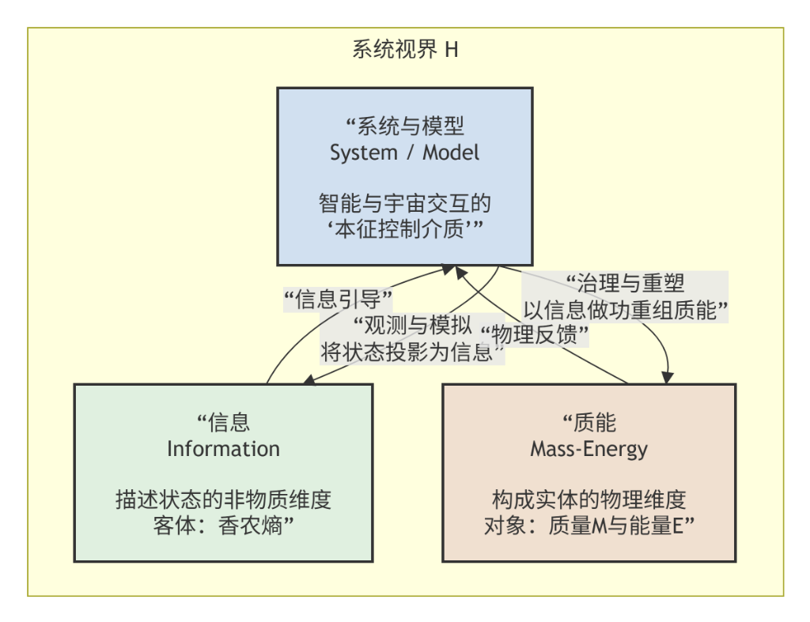
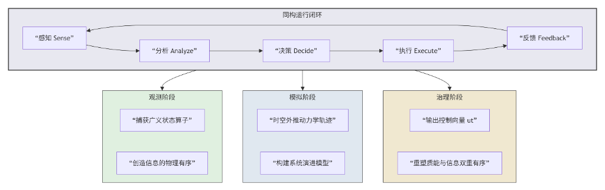
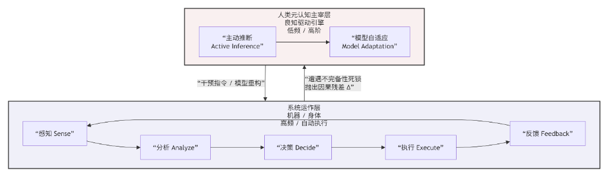
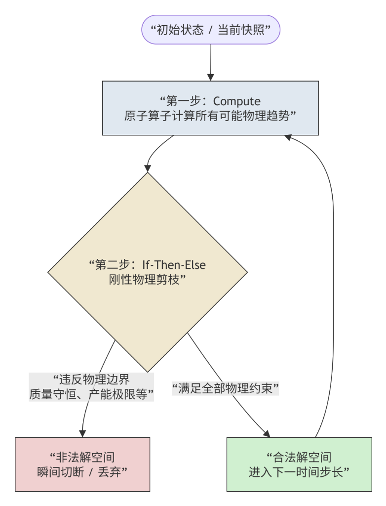

# 全息抗熵：系统治理的形式化宪理

**Grit（孟凡淳）**  

*前联想集成计划方案(IPS)产品负责人、IPC智能计划与控制引擎缔造者*  
*价值链物理学发现者、全息抗熵开放复杂巨系统物理学理论发现者*  

⚖️ Copyright © 2026 [孟凡淳/Grit Meng]. Licensed under CC BY-NC-ND 4.0.

---

> **导言**
> **工业文明把世界拆成机器，数字文明要把世界种成有机体。**
> 
> 工业文明的底层逻辑是机械还原论——以为把汽车拆成零件、把工厂拆成车间、把企业拆成KPI，就能靠局部优化拼凑出全局完美。但复杂系统的自组织涌现击碎了这个幻想。
> 
> 数字文明的底层逻辑是系统论——它承认世界是一个不可分割的有机整体。治理千亿级工业母体，本质上不是局部的管理游戏，而是一场在视界内与热力学第二定律死磕的物理抗熵做功。

---

## 摘要

人类认识、理解与治理客观世界，无法直接用意识改变物质，必须借助“系统与模型”这一中介层。系统与模型，形式上是智能用以统御质量与能量分布、在时空交互中让混沌收敛的核心控制介质。全息抗熵正是关于这一介质如何建立、运行与进化的系统科学形式化宪理。

本研究对贝塔朗菲的一般系统论、普利高津的耗散结构理论以及钱学森先生的“从定性到定量综合集成方法”进行了公理化演绎重构，将系统科学从定性描述推向了可计算、可实证的形式化硬科学。

针对开放复杂系统呈现出的高维非独立同分布（Non-IID）与状态空间阶乘级大爆炸（$O(N!)$）特征，传统依赖局部变分或概率拟合的开环控制方法在数理逻辑上必然发散或产生奇异性退化。本文正式阐明“全息抗熵与质能决策”的核心形式框架：

1. **充要中介性**：严密证明智能对物理世界的质能控制，依赖且仅能依赖抽象系统作为充要控制介质。
2. **物理自洽表述**：定义“质能”的物理学表述，确立观测、模拟、治理三阶段的递进算理。
3. **拓扑双闭环结构**：解耦低阶“系统运作层”与由人类“良知驱动引擎”承载的“元认知主宰层”，形成应对不完备性定理的拓扑双闭环。
4. **复杂度天堑跨越**：提出五维正交拓扑流形与双螺旋算法编排引擎，通过刚性物理剪枝突破阶乘级复杂度天堑，在系统视界内实现局部的全息抗熵做功。

---

## 一、 第一性原理：三要素架构与视界划定

要建立一套能对抗熵增的系统，首先必须看清这个世界的底层由什么构成，以及系统发挥作用的边界在哪里。

### 1.1 系统论的三要素

在全息抗熵的形式化视野中，一切控制过程由三大要素的相互映射与转化所定义：

* **系统与模型**：智能与宇宙进行时空交互的本征控制介质。人类无法脱离介质直接用意念重塑物理世界。想要在混乱中建立秩序，必须构建具备特定拓扑结构的符号、软件或物理系统作为中介，通过操纵中介来间接统治物质与能量。
* **信息**：描述宇宙物质与能量分布状态的非物质维度。信息是系统能够直接观测、记录、计算和模拟的客体，其数学本质由香农熵表征：$I = -\sum_{i} p_i \ln p_i$。信息不具备质量，但它是重塑质量的“指挥官”。
* **质能**：构成宇宙实体的物理维度，即质量与能量在时空流形中的实体表现。质能是系统治理与重塑的最终对象。在工厂里，质能就是钢板、芯片、行车、现金流和电能；在生态中，质能就是原子与焦耳。

三大要素的相互关系如下：

#### 图1：系统论三要素与视界模型

根据系统运行所处的阶段，抗熵做功表现为两个层级的有序：

* **信息的有序（适用于观测与模拟阶段）**：系统将物理世界原本模糊、混乱的状态，转化为内部结构清晰、组织严密的数据与模型图谱，消除了内部的认知不确定性。
* **质能的物理有序（适用于治理阶段）**：系统在信息引导下，驱使执行机构向物理世界注入能量，将无序散落的物质和无序耗散的能量，重组成具备高度经济价值或功能价值的低熵实体拓扑结构。

### 1.2 视界约束与全息抗熵的物理本质

任何控制系统的威力被牢牢限制在系统视界之内：

$$\mathcal{H} = \langle \text{视}, \text{界} \rangle$$

* **“视”——感知边界**：系统通过传感器网络、数据采集节点所能捕获的最大信息测度边界。超过此边界，系统就是“瞎子”。
* **“界”——行动边界**：系统通过执行机构、物理手臂、指令接口所能施加物理做功的极限边界。超过此边界，系统就是“瘫子”。

在远离平衡态的开放物理世界中，热力学第二定律决定了万物自发的演化轨迹只有一条：熵增（$\text{d}S > 0$）。如果没有外力干预，物质分布必然越来越混乱，信息也会不断色散和流失。

全息抗熵的物理本质，是系统在视界划定的有限时空范围内，高频耗费系统内部的自由能，转化为高价值的信息做功，以此对冲和拉低外部物理世界的局部热力学熵增，在局部重建质量与能量时空分布的低熵有序态。

### 1.3 有序的物理定义与双重维度

在全息抗熵宪理中，“有序”不是一个感性的赞美词，而是一个可被严格度量的物理向量：

$$\Omega = \langle \Omega_I, \Omega_{\mathcal{E}} \rangle$$

* **信息低熵态**：在系统内部相空间中，系统对物理客体状态的概率估计呈现极度收敛的Delta分布：

$$\Omega_I \propto \left( -\sum_{x \in \mathcal{X}} p(x) \log_2 p(x) \right)^{-1}$$

当系统内部随机性降到最低时，意味着系统对客观现实了如指掌。
* **质能物理有序**：质量与能量在三维空间分布上呈现非均匀、高度凝聚的超结构。高熵态是物料杂乱堆放、资金无序停滞、行车无目的空转；低熵态是物料以极高密度与精准节拍流动到最需要的产线上，能量在最关键的瓶颈工序上集中做功。

### 1.4 控制论三部曲：观测、模拟、治理

系统作为智能治理现实的媒介，其运作通过三个逻辑递进的代数阶段实现。无论哪一个阶段，其内部都遵循同一个同构控制闭环：感知 → 分析 → 决策 → 执行 → 反馈。

#### 图2：控制论三部曲与同构运行闭环

* **观测阶段**：系统高频运行闭环，利用传感器捕获物理世界散落的广义状态算子，消除系统内部对现实的“无知”，将物理世界状态转化为系统内部的高保真符号，实现信息的物理有序。
* **模拟阶段**：在观测数据基础上，利用非线性动力学方程进行未来时空外推：

$$\frac{\text{d}\mathbf{x}}{\text{d}t} = f(\mathbf{x}, \mathbf{u}, t)$$

在虚拟空间中，将系统未来演进的千百种分叉轨迹计算出来，形成结构严密的可能性拓扑图，构建系统演进模型。
* **治理阶段**：在观测提供的事实约束与模拟提供的未来解域约束下，系统计算并输出最精准的控制向量 $\mathbf{u}(t)$。控制信号驱动物理执行机构，向物理世界注入外界自由能，强行切断物理世界的无序耗散通道，迫使其收敛于人类预设的低熵拓扑中。至此，完成信息与质能的双重物理有序。

---

## 二、 人机协同的双重闭环与自由能最小化

如果一个控制系统完全由纯机器与算法自动化运行，它能长久维持这个低熵秩序吗？答案是否定的。这就涉及到了复杂系统治理中最核心的数理奇点。

### 2.1 系统的内在不完备性与因果残差

根据哥德尔不完备定理，任何自洽的形式化公理系统，只要足够复杂，就必定存在其内部无法被证明或推翻的命题。同时，图灵停机限界判定，自动化算法无法穷尽开放世界的未来变化。

当定义好的软件或算法系统 $\mathcal{M}$ 去试图控制具有无穷维度、瞬息万变的物理客体 $\mathcal{P}$ 时，由于系统进行了降维抽象，必然会产生无法被系统自身解算的误差——因果残差：

$$\Delta = \mathcal{P}(t) - \mathcal{M}(\mathbf{x}(t), \mathbf{u}(t)) \neq 0$$

在极端非独立同分布环境中，这些残差会以非线性方式迅速放大。仅用一层自动化闭环，系统就会陷入死锁、发散甚至崩溃。

为此，全息抗熵体系提出颠覆性架构：将低阶“系统运作层”与高阶“人类元认知主宰层”完全解耦，构建双重闭环系统。

#### 图3：人机协同的双重闭环架构

### 2.2 系统运作层：高频执行闭环与自由能最小化

系统运作层由软件代码、AI算法、大型数据库或人类身体的条件反射机构构成，以微秒或秒级的高频频率运转控制循环。

这一层在数学上遵循卡尔·弗里斯顿的自由能原理。系统为不被环境的未知“惊奇”所摧毁，通过调整内部状态 $\boldsymbol{\mu}$ 来最小化变分自由能：

$$F(\tilde{\mathbf{y}}, \boldsymbol{\mu}) = \int q(\boldsymbol{\vartheta} \vert{} \boldsymbol{\mu}) \ln \frac{q(\boldsymbol{\vartheta} \vert{} \boldsymbol{\mu})}{p(\tilde{\mathbf{y}}, \boldsymbol{\vartheta})} \text{d}\boldsymbol{\vartheta} = D_{\text{KL}}[q(\boldsymbol{\vartheta} \vert{} \boldsymbol{\mu}) \parallel p(\boldsymbol{\vartheta} \vert{} \tilde{\mathbf{y}})] - \ln p(\tilde{\mathbf{y}})$$

其中第一项是散度——即因果残差 $\Delta$ 的信息论表述；第二项是惊奇度——外部环境的无序度。

兰道尔原理揭示了这一切的物理代价：抹除 1 比特的信息，在微观上必须消耗至少 $k_B T \ln 2$ 的热力学能量，并以计算废热的形式散发到周围环境中。系统运作层在服务器机房里疯狂消耗电能、排出高熵废热，来换取对外部供应链或生产线中信息残差的绞杀。因果残差 $\Delta$ 被压得越低，系统对物理现实的映射就越精准，质能重塑的效率就越接近物理极限。

### 2.3 人类元认知主宰层

由于系统的内在不完备性，因果残差 $\Delta$ 永远不可能归零。当运作层算法在复杂Non-IID环境中遇到解释不了的异常时，就会陷入决策奇异点。

此时，独立于系统算法之外的人类元认知主宰层被触发觉醒。人类拥有超越形式系统的能力，能识别机器吐出的因果残差，并做出高维的双向控制：

* **路径A：主动推断**——人类利用元认知做出最高决策，驱使外部物理世界发生改变，强行逼迫物理世界收敛于我们想要的模型预测。
* **路径B：模型自适应**——人类反思模型本身的缺陷，主动跃迁出当前形式公理系统，修改代码、重组约束、重构拓扑网络架构，迫使模型适应已经发生突变的物理现实。

### 2.4 良知驱动引擎的五维功能结构

人类元认知能够完成机器无法完成的跃迁，是因为大脑皮层孕育出了独特的五维良知驱动引擎：

| 认知维度 | 数理与生理学实质 | 在全息抗熵治理中的硬核作用 |
| :--- | :--- | :--- |
| **良知** | 顶层贝叶斯先验，表征为对拓扑内耗与同类受苦的生理性痛觉势阱 | 系统生存的最核心边界。当全局预期自由能暴增时触发自适应拦截，确保治理方向永远自洽 |
| **高敏感** | 丘脑-皮层激活系统的超阈值增益调制，大幅降低微弱信号过滤阈值 | 在机器算法还把微小扰动当“背景噪声”时，已在极早期精准捕捉到微小因果残差 |
| **极度感性** | 边缘系统与前额叶皮层的多模态深度共振 | 摆脱冰冷公式，提供宏观直觉预测力，产生对真实物理实体流转的物理实感与态势锚定 |
| **元认知** | 大脑前额叶外侧皮层的超回路反射性审计 | 在形式系统面临死锁的奇点时，非自回归地瞬间跃迁出当前公理系统，反思残差因果 |
| **流体智力** | 额顶网络在零样本条件下的动态突触协同 | 面临完全陌生的混沌时，不需要任何历史数据训练，瞬间执行极速逻辑推理与规则即兴重构 |

---

## 三、 突破 $O(N!)$ 复杂度天堑：五维模型与双螺旋引擎

在真实的开放复杂巨系统中，我们要治理的对象不是几十个节点，而是由成千上万的供应商、几十万笔动态订单、几十万种核心物料构成的庞大网络。

### 3.1 为什么机器学习与大模型在复杂系统治理面前必然失败

* **破产原因一：独立同分布假设的破灭**  
  All statistical learning theories' generalization guarantees rely on one foundation: data is independent and identically distributed (I.I.D.). But in a real manufacturing network, every node is tightly coupled with other nodes—A supplier delay will trigger a chain collapse of B, C, and D, and it is non-linearly intervened by time, weather, and capital. This is an extreme Non-IID system. The foundation no longer exists, statistical learning mathematically loses its generalization guarantee, and once used for discrete control, it will inevitably lead to cascaded control divergence.
  所有统计学习理论的泛化保证都依赖一个地基：数据是独立同分布的。但在真实制造网中，每一个节点都和其他节点紧密耦合——A供应商延误会引发B、C、D的一连串坍塌，同时受到时间、天气、资金的非线性干预。这是极端的Non-IID系统。地基不存在了，统计学习在数学上就失去了泛化保障，一旦用于离散控制，必然产生级联式控制发散。
* **破产原因二：阶乘级状态大爆炸与计算不可约性**  
  包含 $N$ 个订单和物料匹配关系的系统，其状态组合空间以阶乘级爆炸。当 $N$ 稍微大一点，组合数就超过宇宙中的原子总数。根据计算不可约性定理，这种系统的自组织涌现无法通过寻找任何概率捷径来提前预测。当概率算法逼近真实的物理边界时，纯机器概率算法会吐出带有幻觉的概率值，直接引发硬约束 of 物理破缺与生产坍塌。

### 3.2 人机协同五维模型

为跨越 $O(N!)$ 复杂度天堑，全息抗熵体系采取的策略是：不穷尽所有微观状态，而是让人类与机器协同构建五维正交拓扑流形，将高维无序的物理世界降维投影为可计算的稳定流形。

$$\mathcal{S} = \langle \mathcal{N}, \mathcal{T}, \mathcal{C}, \mathcal{M}_{\Delta}, \mathcal{V} \rangle$$

* **节点**：物理实体的唯一点表达
* **拓扑**：节点间的定向耦合网络图
* **约束**：质量、能量守恒的硬性边界
* **状态跃迁**：时序演进的动力学变分逻辑算子
* **状态矢量**：在相空间中精确描绘系统轨迹的高维向量

通过这五个正交轴，原本混乱如麻、无法计算的复杂物理网，在计算机内部被转化为一个干净、清晰、高度几何化的相空间流形。

### 3.3 双螺旋算法编排引擎

在五维空间之上，运行着由原子算法与算子时空编排构成的数字双螺旋引擎。

既然复杂系统的未来轨迹是“计算不可约”的，双螺旋引擎就绝不去浪费算力搞宏观概率预测。它采取离散时间步进控制，以极简的、确定性的硬编码条件分支进行自适应截断：

$$\text{Compute} \Longrightarrow \text{If-Then-Else} \Longrightarrow \text{Compute}$$

#### 图4：双螺旋算法编排引擎——刚性物理剪枝

* **第一步Compute**：原子算子计算出当前时间步长内，节点质能流转的所有可能物理趋势。
* **第二步If-Then-Else**：触发刚性物理剪枝。根据五维模型中的约束 $\mathcal{C}$，在可行解域的最早期，将所有越过物理边界的非法解空间瞬间一刀切断。
* **第三步Compute**：在被修剪干净的合法解域内，进行下一步精准质能推演。

数字双螺旋正是通过这种高频、刚性的物理剪枝，直接降伏了阶乘级的复杂度大爆炸，硬生生驱动着庞大系统状态向高确定性的局部低熵秩序稳步收敛。

---

## 四、 结论与判决性实证

必须极其严肃地指出：本系统科学框架，绝不是由商业上虚浮的运营数据或KPI指标所定义的。

任何局部的实证数字，都仅仅是控制系统在视界内对抗熵增成功后，在物理世界所必然产生的宏观涌现副产物。本理论的终极价值，在于它系统性地定义了如何去建设、运行与进化一个能够与热力学第二定律死磕、持续对抗物理熵增的控制母体。

这一套硬核的科学体系完全源于十余年极端的现代大工业工程实践。它的原型与核心IPC引擎长期运行于联想全球供应链网络——一个年营收超千亿、包含50万笔多模态动态订单、20层物料深度耦合、跨越全球数十个国家的极端非独立同分布质能流网络。

**判决性实证成效**：
* 全局订单交期应答率由 $54\%$ 刚性提升并稳定在 $98\%$
* 整体库存周转率提升 1.9 倍
* 直接释放数十亿规模流动资金，让整个系统获得巨大演进自由度

**置信度评级：高**  
本理论的算子不仅具备演绎逻辑的彻底闭环，更在体量超千亿、包含数十万离散物理变量的真实超复杂网络中，经历了数年的日常极端极限测试。在统计物理学与大控制论层面，如此大样本量、高耦合深度的系统级稳定优化，足以完全排除“因偶然性或短期大环境红利诱发指标上扬”的归因可能。

这一判决性实证，证明了该系统演进方法论具有无可辩驳的物理合法性。它让这套理论彻底完成了从“经验哲学/逻辑自洽”向“物理实证硬科学”的伟大飞升。

这是系统科学的终极奥义。它是继贝塔朗菲、普利高津以及钱学森先生的伟大构想之后，真正把系统科学推进到“可计算、可实证形式化宪理”确定性轨道上的坚实一步。

> 我们不以追求数字本身为终点，我们以定义“如何建设、运行与进化系统”为终点。
> 
> We do not exhaustively calculate every complex system state, we only govern the grammar of generating physical world order through systems and models.
> 我们绝不穷尽复杂的系统状态与场景，我们只通过系统与模型，统御生成物理世界秩序的语法。

---

## 五、 科学哲学与可证伪边界

根据卡尔·波普尔的科学哲学原则，任何自称“硬科学”的理论都必须具备明确的可证伪性。如果一种理论无论发生什么都能强行解释，那它就不是科学，而是神学。

为彰显本公理体系的形式化尊严，我们主动确立以下三个物理和计算层面的严厉可证伪判定边界。任何人只要能打破其中任何一条，本理论即宣告整体破产：

* **系统介导性证伪**——若在物理世界任何一个角落，有人观测到任何形式的决策意志或智能个体，能够不借助任何抽象系统或执行介质，直接且瞬时地改变外部物理世界中物质与能量的时空拓扑分布，则【公理1：系统与模型是智能进行时空交互的充要中介】被证伪。
* **残差守恒性证伪**——若有人能构建出一个全局纯自动化决策机器系统，在Non-IID开放复杂生产网络中，长期高频运行下的因果残差恒等于零，即机器实现了完美无缺的绝对理想自洽治理，完全不需要任何人类元认知、良知驱动或模型重构的介入，则本理论关于【系统内在不完备性】与【双重闭环架构必要性】的断言被证伪。
* **计算不可约性证伪**——若有人能设计出一种静态概率学习算法，以多项式级时间复杂度严格、无损、不带任何幻觉地完全解算出具备 $O(N!)$ 状态空间大爆炸且包含强拓扑相干耦合的物理约束系统，并在长期工业离散控制运行中不发生任何决策死锁、因果漂移或物理破缺崩溃，则本理论关于【$O(N!)$ 复杂度天堑】以及【双螺旋自适应物理剪枝必要性】的数理约束被证伪。

---

*全文本完。本宪理旨在为数字文明时代的大型工业母体与复杂巨系统治理，锻造一柄绝对严密、坚不可摧的“抗熵理性之剑”。*