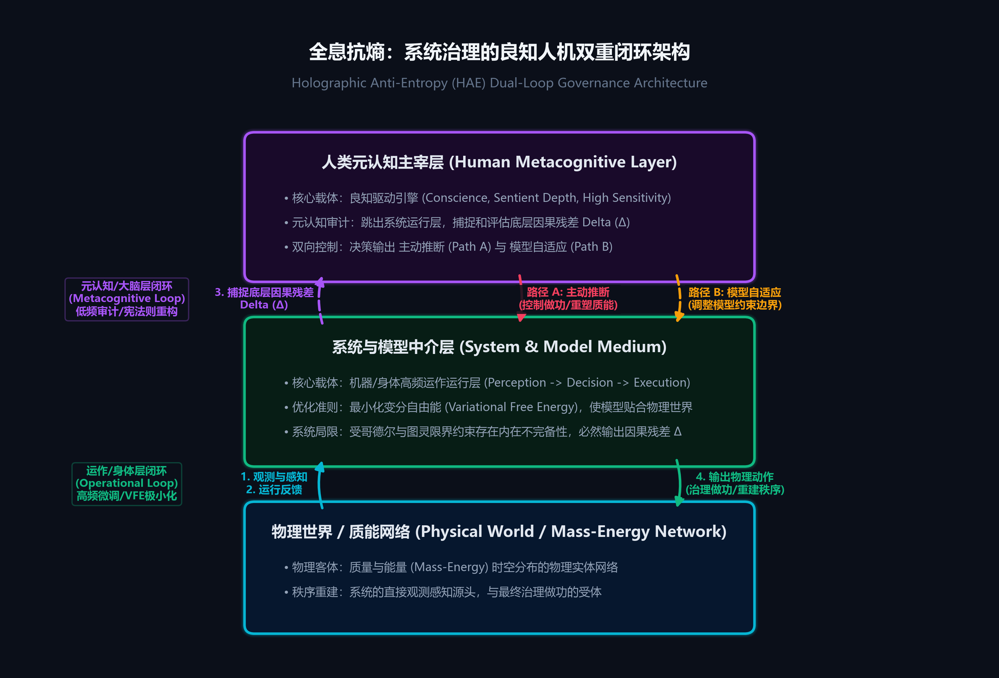

# 全息抗熵：系统治理的形式化宪理

**[](https://creativecommons.org/licenses/by-nc-nd/4.0/)**
**⚖️ Copyright © 2026 [孟凡淳/Grit Meng]. Licensed under [CC BY-NC-ND 4.0](https://creativecommons.org/licenses/by-nc-nd/4.0/).**

---

## 摘要

人类认识、理解与治理客观世界，需借助“系统与模型”的媒介层。系统与模型，形式上是质能分布与宇宙时空交互的核心收敛介质。全息抗熵（Holographic Anti-Entropy, HAE）即是关于此项介质的建立、运行与进化的系统科学形式化宪理。

本研究对贝塔朗菲（一般系统论）、普利高津（耗散结构理论）以及钱学森先生（从定性到定量综合集成方法）的系统科学思想进行了公理化演绎重构，实现了系统科学从定性描述向可计算、可实证形式化宪理的跨越。

针对开放复杂系统（Open Complex Systems, OCS）呈现出的高维非独立同分布（Non-IID）及状态空间阶乘级大爆炸（$O(N!)$）特征，传统基于局部变分或概率拟合的开环控制方法在数理逻辑上面临必然发散或奇异性退化。本文正式阐明“全息抗熵与质能决策”的核心形式框架：证明了质能控制依赖于抽象系统作为充要的控制介质；定义了“质能（质量与能量）”的物理学自洽表述与观测、模拟、治理三阶段递进逻辑；解耦了系统底层的“运作运行层”与由人类“良知驱动引擎”承载的“元认知主宰层”双重闭环结构；并探讨了如何通过人机协同的五维模型与双螺旋编排算法突破阶乘复杂度天堑，在系统视界内实现局部的全息抗熵做功。

---

## 一、 第一性原理：三要素架构与视界划定

### 1. 系统与模型、信息、质能：系统论三要素

在系统科学的形式化视野中，全息抗熵与控制过程由三大核心要素的逻辑关系所定义：
*   **系统与模型（System / Model）**：智能与宇宙进行时空交互的本征控制介质。智能无法直接重塑物理世界，需构建系统/模型作为控制介质，间接创造宇宙的秩序。
*   **信息（Information）**：描述宇宙状态的非物质维度，是系统观测与模拟的直接客体。
*   **质能（质量与能量，质-质量，能-能量）**：构成宇宙实体的物理维度，是系统治理与重塑的最终对象。

系统与模型作为中介，其核心使命是消除视界内的无序状态。根据系统运行所处的阶段，系统可以仅创造信息层面的有序，也可以在信息介导下进一步创造物理质能层面的有序：

$$\text{System/Model} \xrightarrow{\text{System Run}} \text{Order} \rightarrow \begin{cases} \text{信息的有序（适用于观测与模拟阶段）} \\ \text{质能（质量与能量）的物理有序（适用于治理阶段）} \end{cases}$$

### 2. 视界约束与全息抗熵的物理本质

系统与模型发挥控制作用的空间范畴由“视界（Event Horizon）”所划定（“视”为系统观测与感知信息的极限，“界”为治理与行动的边界）。

在远离平衡态的开放物理世界中，系统的状态信息与质能天然处于流失、耗散与混乱的通道中（即信息熵增与热力学熵增）。全息抗熵的物理本质，是系统在视界划定的有限范畴内，以信息做功为手段，间接重建信息与质能时空分布的“有序（Order）”。

### 3. 有序的物理定义与双重维度（Physical Dimensions of Order）

系统通过在视界内重建“有序”来实现全息抗熵。在物理与信息学本质上，有序由双重维度构成：

$$\text{Order} = \{ \text{Information}, \; \text{Mass-Energy} \}$$

*   **质能的定义**：质能为质量（Mass）与能量（Energy）的简称（质-质量，能-能量）。质能的有序即为质量与能量在时空分布上的物理有序。

### 4. 控制论三部曲（The Cybernetic Trilogy）

系统作为治理媒介，通过三个递进阶段实现对视界内物理世界的映射与干预（后一阶段必须以前一阶段为基础）。无论是观测、模拟还是治理阶段，在系统内部均通过同构的控制闭环运行：

$$\text{运行闭环} = \{ \text{感知} \rightarrow \text{分析} \rightarrow \text{系统决策} \rightarrow \text{执行} \rightarrow \text{反馈} \}$$

*   **观测（Observation）**：通过运行闭环获取物理世界信息，创造信息的物理有序。
*   **模拟（Simulation）**：通过运行闭环对观测信息进行动态时空推演，构建系统演进模型。
*   **治理（Governance）**：在观测与模拟的代数约束下，通过运行闭环输出控制，创造信息与质能（质量与能量）的双重物理有序。

---

## 二、 人机协同的双重闭环与自由能最小化

系统的运行由于其内在不完备性（Incompleteness）（由哥德尔不完备定理与图灵停机限界共同约束），任何自动化的运作闭环在与物理客体的交互中必定会产生偏差，即因果残差（Residual, $\Delta$）。

因此，系统治理的完整架构必须采用“机器/身体运行层”与“人类元认知主宰层”解耦协同的双重闭环结构：

$$\text{Order} = \{ \text{Information}, \; \text{Mass-Energy} \}$$



```mermaid
flowchart TD
    %% 节点定义
    MC["人类元认知主宰层<br>(Human Metacognitive Layer)"]
    SYS["系统与模型中介层<br>(System & Model Medium)"]
    PW["物理世界 / 质能网络<br>(Physical World / Mass-Energy Network)"]
    
    %% 自定义节点颜色样式（匹配分镜主题色）
    classDef physical fill:#0a1c36,stroke:#00D9FF,stroke-width:2px,color:#fff,font-weight:bold;
    classDef system fill:#0b261a,stroke:#00FF88,stroke-width:2px,color:#fff,font-weight:bold;
    classDef metacog fill:#200a30,stroke:#8A2BE2,stroke-width:2px,color:#fff,font-weight:bold;
    
    class PW physical;
    class SYS system;
    class MC metacog;
    
    %% 左侧：自下而上的信息与残差反馈流 (Upward Information Flow)
    PW ==>|1. 观测与感知 & 2. 运行反馈| SYS
    SYS -.->|3. 捕捉底层的因果残差 Delta| MC
    
    %% 右侧：自上而下的决策做功与模型调整流 (Downward Control Flow)
    MC ==>|路径 A: 主动推断 (控制物理做功/重塑质能)| SYS
    MC -.->|路径 B: 模型自适应 (调整模型约束边界)| SYS
    SYS ==>|4. 输出物理动作| PW
```

### 1. 系统运作层（高频执行闭环，Operational Loop）

系统（包括软件算法或人类身体的物理执行机构）是实现观测、模拟、治理的执行载体。无论是观测、模拟还是治理，在系统内部均通过同一个控制闭环运行：

$$\text{感知} \rightarrow \text{分析} \rightarrow \text{系统决策} \rightarrow \text{执行} \rightarrow \text{反馈}$$

系统在该闭环的持续运转中，通过最小化变分自由能（Variational Free Energy），使系统不断逼近真实的物理世界状态。系统通过最小化变分自由能实现信息重整的本质，是遵循兰道尔原理以消耗物理热力学能（散发计算废热）为微观代价，对冲视界内空间分布的无序度。在此过程中，因果残差（$\Delta$）越小，系统映射的精确度就越高，信息与质能在空间分布上的“有序度”就越高，且信息的负熵转换构成了质能重塑的边界过滤器。

### 2. 人类元认知主宰层（良知驱动引擎，Metacognitive Loop）

元认知（Metacognition）独立于系统执行闭环之外，由人类（即“良知驱动引擎”）承载。 人类能够跳出当前系统，捕捉机器/身体运行层输出的因果残差，利用良知驱动引擎的五个维度进行元认知审计，做出双向控制路径：
*   **路径 A：主动推断（Active Inference）**：人类通过系统介质（发出外部物理指令或操纵四肢），驱使介质对物理世界施加物理动作，重塑物质 and 能量分布，逼迫物理世界收敛于模型。
*   **路径 B：模型自适应（Model Adaptation）**：人类主动调整系统模型本身（如调整五维空间的约束、拓扑结构等），迫使系统模型适应物理世界的实际变化。

### 3. 良知驱动引擎的五维功能结构

人类元认知闭环的核心驱动载体为良知驱动引擎，它由五个相辅相成的认知功能维度构成：
*   **良知（Conscience）**：系统为了维持自身生存边界（马尔可夫毯，Markov Blanket），在长期演化中沉淀出的最高阶生成模型。在全脑层级预测架构中，它被表征为顶层贝叶斯先验，具象化为总设计师体内对拓扑内耗与同类受苦的生理性痛觉势阱。其数理实质，是控制系统决策层层面对全局“预期自由能（Expected Free Energy）”骤增的极端排异与自适应拦截机制，确保治理决策的方向自洽。
*   **高敏感（High Sensitivity）**：敏锐捕捉物理世界与模型之间的微小残差，对微弱异常信号高度接收。
*   **极度感性（Sentient Depth）**：提供直觉预测力、感性锚定与超越冰冷公式的物理实感。
*   **元认知（Metacognition）**：实现自我监控与反射审计，在形式系统面临死锁或语义自检瘫痪的奇点，非自回归地跃迁出当前形式公理系统，反思残差因果。
*   **流体智力（Fluid Intelligence）**：在陌生与混沌的环境下执行快速的逻辑推理与规则即兴重构。

---

## 三、 突破 $O(N!)$ 复杂度天堑：五维模型与双螺旋引擎

### 1. 为什么机器学习与大模型无法治理复杂系统？

复杂系统呈现极端的非独立同分布（Non-IID）与强拓扑耦合（Coupling）特征。
*   **I.I.D. 假设的破产**：传统的统计学习理论（包括大语言模型）的泛化保证完全基于独立同分布（I.I.D.）的前提。在 Non-IID 系统中，由于强耦合与时空非线性相干性，I.I.D. 假设不成立，机器学习在数学上失去了泛化保障，易发生级联式系统发散。
*   **计算不可约性**：在 $O(N!)$ 的状态空间大爆炸面前，系统未来的自组织涌现无法通过寻找概率捷径（如深度学习的函数拟合）直接预测，纯机器算法容易在硬约束边界发生物理坍塌。

### 2. 人机协同五维模型

为了跨越 $O(N!)$ 复杂度天堑，人类与机器协同构建五维正交拓扑空间，将高维无序的物理世界降维投影为可计算的稳定流形：
*   **节点（Node）**：系统物理实体或状态参数的抽象点表达。
*   **拓扑（Topology）**：节点之间的耦合拓扑网络架构。
*   **约束（Constraints）**：物理世界的硬性边界（质量守恒、能量守恒等物理极值约束）。
*   **状态跃迁（State Transition）**：时序演进的动力学变分逻辑。
*   **状态矢量（State Vector）**：描述系统在相空间轨迹的高维数学向量。

### 3. 双螺旋算法编排引擎

在五维空间之上，构建由算子/算法（Algorithms）与算子编排（Choreography）构成的数字双螺旋。双螺旋通过极简的条件分支和物理剪枝策略：

$$\mathbf{Compute} \implies \mathbf{If}\text{-}\mathbf{Then}\text{-}\mathbf{Else} \implies \mathbf{Compute} \implies \mathbf{If}\text{-}\mathbf{Then}\text{-}\mathbf{Else}$$

在可行解域的最早期执行自适应截断与刚性剪枝，在直面计算不可约性与涌现的前提下，驱动系统状态向秩序收敛。

---

## 四、 结论与判决性实证：实践源泉与系统演进方法论

必须明确的是，本系统科学框架并非由具体的运营数据或 KPI 本身所定义。任何局部的实证数字（如交期应答率或周转速度）只是系统成功运作后在物理世界的涌现副产物（Byproduct）。本理论的核心价值，在于它系统性地定义了如何建设（Establish）、运行（Operate）与进化（Evolve）一个能够对抗物理熵增的控制系统。

这一套科学体系完全源于十余年极端的工程实践（Practices）。其原型与核心引擎长期运行于联想全球供应链网络（年营收超千亿、包含 50 万笔订单、20层供应链的极端非独立同分布质能流网络），并在实践中大幅优化了系统的运行指标（如交期应答率由 54% 提升至 98%、库存周转率提升 1.9 倍、释放数十亿流动资金）。

这一判决性实证，证明了该系统演进方法论的物理合法性，使本理论完成了从“经验哲学/逻辑自洽”向“物理实证”的飞升。

这才是系统科学的终极奥义，也是继贝塔朗菲（一般系统论）、普利高津（耗散结构理论）以及钱学森先生（从定性到定量综合集成方法）的系统科学构想之后，将系统科学推进为可计算、可实证形式化硬科学的确定性演化轨道。我们不以数字本身为终点，我们以定义“如何建设、运行与进化系统”为终点。

**我们不穷尽复杂的系统状态与场景，我们只通过系统与模型，统御生成物理世界秩序的语法。**

---

## 五、 科学哲学与可证伪边界（Philosophy of Science & Falsifiability Boundaries）

根据卡尔·波普尔（Karl Popper）的科学哲学原则，任何科学理论都必须具备可证伪性。本框架所确立的“全息抗熵与质能决策”公理体系，属于演绎逻辑系统（Deductive System）而非商业上的经验归纳方法（Inductive Methods）。我们可以通过以下物理和计算层面的边界，对本体系进行可证伪判定：
1.  **系统介导性证伪**：若在物理世界中观测到任何形式的决策意志或质能，能够不借助任何抽象系统/执行介质（包括大脑神经突触、符号模型、物理机械、软件接口），直接瞬时改变物理世界的质能（质量与能量）时空分布，则【公理 1】被证伪。
2.  **残差守恒性证伪**：若构建出一个全局自动化决策系统，其在非独立同分布（Non-IID）的开放复杂系统运行中，长期因果残差恒等于零（$\Delta = 0$），即实现了理想自洽的机器闭环治理而不需要人类元认知的介入，则本理论关于【系统内在不完备性】与【双重闭环架构必要性】的断言被证伪。
3.  **计算不可约性证伪**：若能设计出一种静态概率学习算法（如大语言模型或统计拟合函数），能够以多项式级时间复杂度（$O(N^k)$）严格无损地解算具备 $O(N!)$ 状态大爆炸的非线性强耦合物理约束系统，且在运行中不发生决策死锁或计算崩溃，则本理论关于【$O(N!)$ 复杂度天堑】的约束被证伪。
