```mermaid
graph TD
    A[企业数字化计划与控制系统] --> B{八大物理公理审计}
    B -->|传统架构错配| C[系统耗散与控制失效: 局部博弈/计划致幻/排产死锁]
    B -->|物理自适应重构| D[全息抗熵大脑: 100ms重算/碳硅协同/全局ROIC提升]
    
    style C fill:#4b291d,stroke:#ff7b72,stroke-width:2px;
    style D fill:#1d3d2c,stroke:#3fb950,stroke-width:2px;
    style B fill:#1f2937,stroke:#58a6ff,stroke-width:2px;
```

# 📜 如何用价值链物理学，透视传统供应链架构的物理瓶颈与边界？
> **—— 制造业计划与控制（IPC）系统架构的物理审计指南**
>
> **作者：孟凡淳 (Grit Meng)**

---

## 🛑 一、 认知的错配：为什么高频扰动下传统的流程优化难以遏制无序？

在中国离散制造的深水区，企业运营中常常面临一些难以用传统管理手段克服的系统性挑战：
*   **信息化系统越建越重，流程审批链路越来越长，但承诺交期依然难以精准锁定，呆滞物料在仓库中沉淀。**
*   **排产规则配置繁多，但在高频的生产变动中，往往退化为手工 Excel 调整和线下对账。**
*   **跨部门协调会议频繁，但局部业务指标的优化并未能直接转化为全局的资本效率提升。**

大多数分析倾向于将这些瓶颈归结为执行层面的疏漏或数据治理的缺失。

然而，从复杂巨系统的科学视角来看，这往往代表着**传统的流程管理模型与非稳态物理现实之间的认知错配**。西方主流的供应链理论（如 MRP、S&OP 等）均前置假设了一个“需求相对稳态、冻结期长、提前期稳定”的工业相空间。但当它们撞上中国制造业“高频插单、超深级联 BOM、复杂替代决策与利益主体多元”的非平衡态物理相区间时，系统的底层逻辑与实际的物流流体网络就会产生结构性的脱节。

**系统运行的本质是物理的，而非行政的。**

我们无法依靠增加管理流程去消纳由于算法算力不足产生的耗散。基于系统复杂性科学，我们需要一套**第一性原理的架构审计工具**。如果计划与控制系统的架构设计与价值链物理公理发生冲突，那么系统在复杂的物理现实面前，其效能将不可避免地发生耗散与衰退。

---

## ⚖️ 二、 物理维度的架构审计：八大公理与系统考量

任何制造企业在评估、采购或规划其计划与控制（IPC）架构时，可以采用以下八个基于物理与信息科学公理的维度来评估系统设计的可行性：

```
                      ┌─────────────────────────────────┐
                      │    计划与控制（IPC）系统审计框架  │
                      │      Π = ⟨数据本体 D, 业务算法 A⟩  │
                      └────────────────┬────────────────┘
                                       │
            ┌──────────────────────────┴──────────────────────────┐
            ▼                                                     ▼
    【系统科学与信息物理】                                 【控制论与时空消纳】
    Axiom 1: 目的论（全域抗熵）                             Axiom 5: 机制论（碳硅同构）
    Axiom 2: 本质论（硅基代偿）                             Axiom 6: 路径论（逆向施工）
    Axiom 3: 方案论（双螺旋本体）                           Axiom 7: 动力论（矢量做功）
    Axiom 8: 进化论（元认知演化）
```

---

### 1. 目的论：全域协同与抗熵增定向做功审计 (Axiom 01: Purpose & Anti-Entropy)
*   **物理公理**：在复杂系统中，唯有全局协同与定向做功才能对抗系统性熵增，维持系统的高有序度（局部优化必然导致全局热耗散）。
*   **系统表现**：各个部门各自追求局部 KPI 的最大化（销售追求极速交付、车间追求稼动率满载、采购追求低采购单价），导致全链条物流发生剧烈摩擦与无序耗散，使得企业整体库存高企、资本周转率停滞、现金流被锁死。
*   **审计考量**：
    > **“系统是否以全局资本效率（如 ROIC、Throughput）为目标函数？能否通过全局统御算法约束并调度各部门的局部决策，强制执行资源的正交分流以对抗熵增？”**
    *   **架构评估**：若系统仅由分散的表单流转和指标拼接构成，任由各业务线线下无序博弈或抢占库存，则系统的全局抗熵做功效率几乎为零。

### 2. 本质论：碳基算力极限与硅基代偿审计 (Axiom 02: Essence & Silicon Substitution)
*   **物理公理**：人类大脑的短时工作记忆受 Miller 定律限制（$7 \pm 2$ 个并发变量）。当供应链节点的排列组合空间跨越 $N!$ 级复杂度时，碳基脑力必然瘫痪，系统自动退守非合作纳什均衡。
*   **系统表现**：面对成千上万种物料、高频变动的订单以及深层 BOM 替代时，传统排产极其依赖计划员的生物脑去拉通协调，导致跨部门拉通会议沦为死亡吵架，车间挑单生产，计划形同虚设。
*   **审计考量**：
    > **“系统是否承接了高维变量的自动消纳？是否将决策逻辑代偿给硅基算法以求秒级求解，并在碳硅之间划定刚性的算法执行结界？”**
    *   **架构评估**：如果排产与调度仍极度依赖计划员的人工经验判断和 Excel 线下表单，系统架构将无法承受 $O(N!)$ 级的复杂度变异。

### 3. 方案论：本体双螺旋与降维同构审计 (Axiom 03: Ontology & Double Helix)
*   **物理公理**：科南特-阿什比优良调节器定理（Conant-Ashby Theorem）。每一个优秀的调节器必须是它所控制系统的同构模型；业务方案的唯一合法物理本体为“数据模型与业务算法”缝合而成的双螺旋。
*   **系统表现**：传统的计划系统将三维时空的复杂离散制造网络扁平化投影到二维行列表中。由于主数据和系统模型缺乏对空间拓扑与时间的同构表达，复杂的物料替代与工程变更无法由算法直观求解，导致系统上线后死锁频繁，基层被迫退回 Excel 记账。
*   **审计考量**：
    > **“系统底层的数据本体模型是否与物理世界的 4D 时空网络同构？偏序关系与 BOM 变更逻辑是由模型自求解，还是脱离本体依靠行政流程和规则补丁去约束？”**
    *   **架构评估**：若系统无法在数据本体中直接构建 Hasse 偏序图谱并在内存中直接消纳拓扑变异，必须设计大量繁琐的校验流程和人工对账，则架构在同构性上存在严重缺失。

### 4. 能力论：单脑奇点坍缩审计 (Axiom 04: Capability & Single Brain Singularity)
*   **物理公理**：逆康威定律与系统本体论。架构设计必须在具备业务洞察、IT建模、系统架构三位一体融合能力的单脑奇点中完成坍缩，禁止线性流水线拼接与利益博弈。
*   **系统表现**：传统系统建设中，业务、IT与架构人员严重割裂，靠大规模的“拉通会”拼凑方案，导致架构布满妥协的逻辑断层，流程规章互相死锁。
*   **审计考量**：
    > **“系统架构设计是否基于逆康威定律由三位一体的总设计师大单脑主导？总设计师是否拥有一票否决权，从而在单脑奇点中完成极致的架构坍缩与重构？”**
    *   **架构评估**：若系统是由多方利益博弈的委员会强行拼凑而成，依靠流水线式的层层转包进行交付，其架构必然走向零散与破碎。

### 5. 机制论：碳硅同构的 \Pi 循环审计 (Axiom 05: Mechanism & Pi Loop)
*   **物理公理**：自创生系统论（Autopoiesis）与闭环反馈机制。组织协作流程与最终的数学求解算法必须保持绝对同构，通过“自由输入、逻辑坍缩、协同协奏、闭环反馈”的五阶自创生闭环完成自适应演化。
*   **系统表现**：在面对业务特例和多变的需求时，系统频繁通过挂载临时表单或堆砌散装补丁进行处理，导致系统底层逻辑混乱，求解空间瘫痪，退化为无序状态。
*   **审计考量**：
    > **“系统是否构建了统一的 $\Pi$ 循环自创生闭环？协作流程是否与统御算法绝对同构，确保规则逻辑在执行层被刚性编译且不可逾越？”**
    *   **架构评估**：若系统无法在算法层直接消纳业务流转中的特例，必须依靠业务规则的人工判定和临时补丁，则架构的自适应演化能力将被扼杀。

### 6. 路径论：维纳-卡尔曼观测边界与逆向施工审计 (Axiom 06: Path & Observability Border)
*   **物理公理**：维纳-卡尔曼观测边界与逆向施工律。系统的控制能力（Controllability）单向不可逆地严格受限于其微观观测边界（Observability），即“不可观测即不可控制，不懂微观即盲于宏观”。
*   **系统表现**：顶层的 S&OP 产销协同大屏数据炫目，但物理车间根本不按计划执行，宏观指令处于悬空的“开环状态”，导致顶层和底层的“两张皮”现象与集体致幻。
*   **审计考量**：
    > **“系统是否执行‘逆向施工’的建设路径？是否先在执行端（如 IOP）建立起关于实时消耗和实物分配的确定性闭环，再反向驱动宏观计划？”**
    *   **架构评估**：若系统缺乏对现场机台和物料流失的高频物理观测，依然依赖后视镜式的延时填报，则宏观计划只能在信息真空中发布伪指令。

### 7. 动力论：双核力场共振与做功审计 (Axiom 07: Dynamics & Dual Force Field)
*   **物理公理**：做功方程 $W = F \cdot S \cdot \cos\theta$。变革的有效做功由双核合力（行政推力与逻辑引力之和 $F$）与系统实施路径 $S$ 的激励相容夹角 $\theta$ 决定。
*   **系统表现**：数字化变革完全依靠高管的行政权力向下强行施加，但系统规划的流程规则违背了业务物理现场的利益相容，导致基层阳奉阴违、录入脏数据拖垮系统，有效做功归零，转化为内耗废热 $Q = F \cdot S \cdot \sin\theta$。
*   **审计考量**：
    > **“系统是否在逻辑中调谐并融合了组织的利益矢角（通过算法实现利益相容）？行政施力方向是否与算法底层的客观规律同向（$\theta \to 0^\circ$）？”**
    *   **架构评估**：若系统运行依靠强行追加惩罚性行政考核，而缺乏物理规律的自约束（如采购配额自动平衡环），系统做功将大量耗散为内耗废热。

### 8. 进化论：哥德尔极限下的抗热寂进化审计 (Axiom 08: Evolution & Gödel Boundary)
*   **物理公理**：哥德尔不完备定理与元认知演化。封闭的形式化系统规则堆砌达到极限后注定撞墙，必须引入碳基总架构师的元认知主动扩维，重写系统宪法以实现自愈进化。
*   **系统表现**：团队迷信“完全无人化”的完美闭环系统，在面对供应断裂、黑天鹅扰动等超出系统闭环规则的场景时，系统陷入死锁崩溃，被迫退化为彻底的人治。
*   **审计考量**：
    > **“系统是否预留了‘碳硅协同’的自适应演进和自愈熔断通道？在规则死锁时，是否支持由架构师顺畅反写（Write-Back）并重构元方案实现自适应进化？”**
    *   **架构评估**：若系统将碳基架构师排斥在演进回路之外，缺乏元认知注入的接口，系统规则将随着业务扩展变得极其僵硬，最终走向热寂死锁。
---



---

## 🔮 三、 从“功能军备竞赛”走向“物理架构审计”

当企业的数字化转型面临协同天堑时，相较于盲目堆砌更多的业务功能，更应关注**对计划与控制系统的底层物理架构进行客观评估**。

这需要我们从经验主义转向科学的方法论，对系统数据模型与业务算法的耦合性进行一次彻底的审计。

我们已经将这套基于系统科学的评估原则，提炼为两款**高保真、可交互的在线审计工具**，方便广大管理者与技术专家客观自测：

1.  **🔮 价值链智能体审计 (Value Chain Audit Agent)**：
    内嵌 8 幕动态物理仿真沙盒（Boltzmann Entropy、Ashby Requisite Variety、Shannon Channel Node 等），多维度计算系统抗熵增指数，出具结构化的业务诊断。
2.  **🧠 IPC 架构技术审计 (IPC Architecture Technical Audit Agent)**：
    为数字化架构师、CTO 及系统选型团队打造。通过对“数据本体双螺旋”、“偏序格代数消纳”、“极致 Cache-line 吞吐”和“DAE 反写自愈能力”等维度的技术分析，评估系统在真实复杂制造场景下的可行性与存活率。

系统科学的发展，让我们有能力用确定性的物理学与信息论规律，来衡量工业软件的架构健康。诚邀您打开我们的演示主页，运行 100ms 裸金属压测，并开启您的智能体评估：

*   **🌐 官方全息演示主页：** [Value-Chain-Physics Pages (index.html)](file:///h:/系统科学/价值链物理学/index.html)
*   **🔮 价值链协同物理审计：** [价值链智能体审计](file:///h:/系统科学/价值链物理学/value_chain_audit_agent.html)
*   **🧠 计划与控制架构审计：** [IPC 架构技术审计](file:///h:/系统科学/价值链物理学/ipc_scheme_audit_agent.html)

> “离散制造网络是一个遵守物理定律的复杂巨系统。这是我们基于真实战场为您提供的架构评估尺子，接受业界关于物理与数学规律的共同审判。”
>
> —— 孟凡淳 (Grit Meng), 2026
