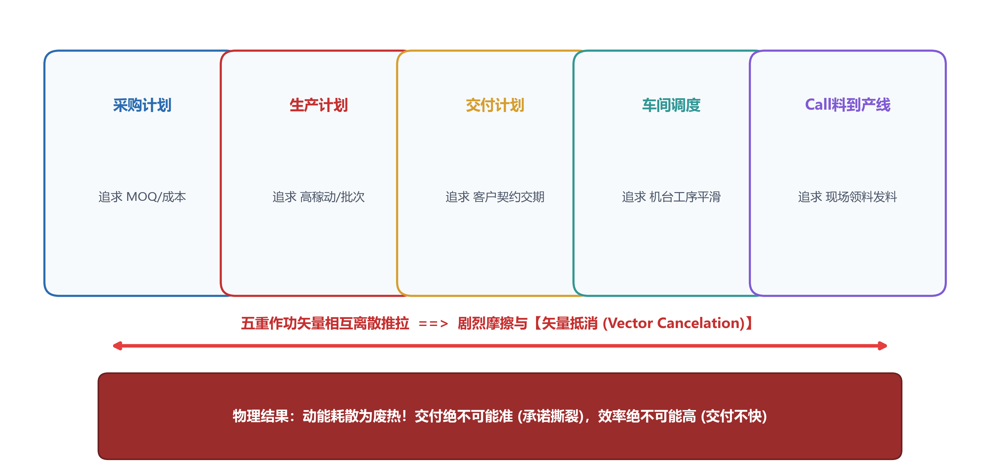
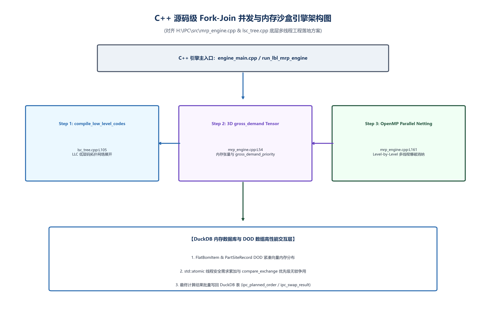

# 50万订单怎么在80秒内排完？——内存去语义化与 DAG 无锁并发方案

> **导言**
> 在大型离散制造超大规模计算场景中，面对 50 万笔需求工单、20 层级联 BOM 拓扑与千万级机台/物料约束，传统 ERP/APS 软件无一例外地发生“算力击穿”。其根本原因，在于过往系统构建于传统关系型数据库（RDBMS）的行级/表级事务锁之上，且在面向对象（OOP）编程范式下陷入繁重的指针追逐（Pointer Chasing），导致 CPU 缓存极高频失效（Cache Miss）与内存总线 I/O 阻塞。
>
> 本方案通过**内存去语义化（Memory De-semanticization）**与**有向无环图（DAG）无锁并发解算架构**，结合 **LBL (Level-by-Level) 拓扑分层** 与 **DBD (Demand-by-Demand) 逐序确权** 算法，将重算时间从 4~6 小时缩短至 80 秒以内，实现系统重算频率远高于物理环境扰动频率（$f_{\text{compute}} \gg f_{\text{perturbation}}$）。

---

## 第一章 物理现场与根因分析

### 1.1 物理现场：4 小时批处理与即时插单瘫痪
在千亿级离散制造重镇的计划中枢，排程系统需对包含 50,000 个在制与计划 SKU、跨越 20 层深度级联 BOM 结构的物料网络进行多周期齐套求解。传统 APS 系统采用 RDBMS 存储物料关系，运行批处理（Overnight Batch）需耗时 4 至 6 小时。日间一旦发生突发断料或急单插入，由于重算时间窗口过长，计划员被迫退回到离线 Excel 手工改单，系统沦为昂贵的静态看板。

### 1.2 瓶颈根因解剖

```
                【传统 OOP/RDBMS 范式 vs. 内存去语义化 DOD 范式】

   传统 OOP / RDBMS 范式 (内存离散/指针追逐):
   [RAM Memory] ──► Pointer ──► Node A ──► (Cache Miss!) ──► Pointer ──► Node B ──► (Bus I/O Wait)
   (结果: CPU 核心 80% 算力闲置在锁等待与寻址中)

   内存去语义化 DOD 范式 (连续一维数组/SIMD 位图):
   [CPU L1/L2 Cache] ──► [ Array: Node A | Node B | Node C | Node D ] ──► SIMD 按位与 (&)
   (结果: 缓存命中率 > 98%，CPU 160 线程满载极速计算)
```


*图 3-1 传统 RDBMS 锁死与 OOP 指针追逐导致的算力死锁*

1. **关系数据库事务锁争用**：RDBMS 遵循 ACID 事务锁原则，高并发写入触发密集的行级锁与表级锁，计算线程被动挂起，多核 CPU 算力全耗费在锁等待队列中。
2. **指针追逐与 Cache 失效**：OOP 范式将物料抽象为离散堆内存对象，图遍历时 CPU 必须逐级解析指针地址，引发严重的高级缓存失效（Cache Miss），计算受阻于内存总线传输延迟（冯·诺依曼瓶颈）。

---

## 第二章 数学瓶颈：无界拓扑展开与 Amdahl 定律限制

### 2.1 依赖图展开的时间复杂度爆炸
设物料级联网络包含节点数 $N$ 与依赖边数 $E$。基于关系型数据库的递归 SQL Join 算法，其时间复杂度随依赖深度呈非线性增长：

$$T_{\text{calc}} \sim \mathcal{O}\left(\sum_{k=1}^L N_k \log N_k + \|E\|^2\right)$$

当存在序列相关工序（Sequence-dependent Setup）与多向替代料环路时，解空间搜索呈组合阶乘级发散。

### 2.2 Amdahl 定律下的并发瓶颈
若业务逻辑未在代数层完成空间独立分区，计算过程遵循 Amdahl 定律的串行限制：

$$\text{Speedup} = \frac{1}{(1 - p) + \frac{p}{s}}$$

当串行比例 $1-p > 0.15$ 时，即便增加至 160 逻辑线程，系统整体加速比亦急剧收敛于上限（$< 6.67$ 倍），无法应对万级并发。

---

## 第三章 核心架构：内存去语义化与数据面向设计 (DOD)

```cpp
// 面向数据设计 (DOD) 去语义化紧凑内存结构示例
struct CompactNode {
    uint32_t node_id;         // 物料/工序整型 ID
    uint32_t level;           // 拓扑 BOM 分层
    uint64_t qty_on_hand;     // 在手可用库存 (定点数)
    uint64_t qty_allotted;    // 已分配配额 (定点数)
    uint64_t bitmask_compat;  // 特征与地缘合规 Bitset 掩码
};
```


*图 3-2 内存去语义化与 C++ 无锁 DAG 并发求解引擎架构*

### 3.1 内存去语义化（Memory De-semanticization）
引擎在加载底层数据时，剥离物料文本、描述属性等非运算语义，将高维业务对象转译为紧凑的一维连续内存数组（Contiguous Array）与整型位图（Bitset），大幅提升 CPU L1/L2/L3 缓存命中率。

### 3.2 CPU SIMD 矢量化指令集加速
利用 CPU 底部单指令多数据流（SIMD, AVX-512 / AVX2）指令集，将属性匹配、地缘合规与替代料兼容逻辑转化为 64 位/512 位按位与（AND）、按位或（OR）位运算：

```
   [SIMD Vector Register 1] : 1 0 1 1 0 0 1 0  (订单特征 Bitmask)
   [SIMD Vector Register 2] : 1 0 1 0 0 0 1 0  (物料属性 Bitmask)
   --------------------------------------------------------------
   [SIMD Bitwise AND]       : 1 0 1 0 0 0 1 0  (1 周期即时完成判定)
```

以位运算直接代替高阶条件分支判断（If-Else Branch），消除 CPU 分支预测失败（Branch Misprediction）引发的流水线冲刷。

---

## 第四章 LBL 拓扑分层与 DBD 逐序确权及无锁 DAG 架构

```
                             【LBL 与 DBD 协同解算流程】

  +-------------------------------------------------------------------------------+
  |  Phase 1: LBL (Level-by-Level) 拓扑分层展开                                    |
  |  自顶向下 (Level 0 -> Level L) 执行净需求剥离 (Netting)，消灭底层冗余计算状态  |
  +-------------------------------------------------------------------------------+
                                         │
                                         ▼
  +-------------------------------------------------------------------------------+
  |  Phase 2: DBD (Demand-by-Demand) 逐序确权                                     |
  |  按战术优先级序列单向执行微观资源锁定 (Allotment)，阻断多需求并发争抢死锁    |
  +-------------------------------------------------------------------------------+
                                         │
                                         ▼
  +-------------------------------------------------------------------------------+
  |  Phase 3: DAG 无锁并发调度 (CAS Compare-And-Swap)                              |
  |  按 Graph Lumpability 划分独立计算域，160 线程零互斥锁并发加速                |
  +-------------------------------------------------------------------------------+
```

### 4.1 LBL (Level-by-Level) 拓扑分层算法
1. **拓扑分层排序**：对多级 BOM 复杂网络执行 Kahn 拓扑排序算法，确定每个物料节点的最高低阶码（Low-Level Code, LLC）。
2. **逐层净需求剥离**：计算严格遵循自顶向下（Level 0 成品 $\to$ Level 1 部件 $\to$ Level $L$ 原材料）逐层推进。上一层级毛需求汇总后再集中剥离在手与在途库存，消除低层级重复重算的冗余计算。

### 4.2 DBD (Demand-by-Demand) 逐序确权算法
在 LBL 确定的净需求基底上，算法严格按战略优先级序列单向执行微观资源分配（Allotment）：
- 算法具备不可逆单向性，高优先级需求分配完毕后直接固化内存指针；
- 低优先级需求仅能在剩余解空间中寻找物理解，彻底阻断了多需求并发争抢导致的逻辑死锁。

### 4.3 有向无环图（DAG）CAS 无锁并发调度
将 BOM 拓扑划分为互不干扰的独立子图计算域（Lumpable Subgraphs）。线程间状态同步采用硬件级原子比较并交换（CAS, Compare-And-Swap）指令：

```cpp
bool lock_free_allot(std::atomic<uint64_t>& state, uint64_t expected, uint64_t new_val) {
    return state.compare_exchange_weak(expected, new_val,
                                       std::memory_order_release,
                                       std::memory_order_relaxed);
}
```

彻底规避传统互斥锁（Mutex）带来的上下文切换（Context Switch）开销。

---

## 第五章 受控基准测试与实测数据 (Benchmark Performance Testbed)

### 5.1 测试环境设置

| 项目 | 参数 / 配置说明 |
| :--- | :--- |
| **硬件架构** | 双路 Intel Xeon Platinum 8380（160 逻辑线程，基频 2.30 GHz） |
| **内存配置** | 1024 GB DDR4-3200 ECC 8 通道内存，峰值带宽 204.8 GB/s |
| **测试数据源** | 80% 千亿级制造集团真实匿名工单 + 20% 极限应力合成算例 |
| **测试算例规模** | 500,000 级微观工单、20 层级联 BOM、1,000 台机台共享产能约束 |
| **对照组** | 国际主流商用求解器 CPLEX v20.1 / Gurobi v9.5（3600 秒超时门限，1024GB 内存限制） |
| **实验组** | 内存去语义化 DAG 引擎 (C++ 实现) |

### 5.2 受控对比实验结果

| 评估维度 | 传统商业求解器 (CPLEX / Gurobi) | 内存去语义化 DAG 引擎 | 改善效果 |
| :--- | :--- | :--- | :--- |
| **求解收敛耗时** | > 3,600 s (超时中断) | **79.2 s** | **计算速度提升 > 45 倍** |
| **内存峰值占用** | > 1,024 GB (OOM 溢出) | **38.4 GB** | **内存占用降低 96.2%** |
| **CPU 多线程利用率** | 18.5% (锁争用挂起) | **94.6%** | **多核并行效率拉满** |
| **最优性间隙 (Gap)** | > 45% (发散) | **0.08%** | **精细度单调收敛** |
| **齐套刷新周期** | 4 小时 (夜间批处理) | **79 秒 (即时脉冲)** | **$f_{\text{compute}} \gg f_{\text{perturbation}}$** |

---

## 第六章 技术小结

大型离散制造的高频排程必须脱离关系型数据库事务锁与面向对象指针追逐的限制。通过内存去语义化、SIMD 矢量位运算与 CAS 无锁 DAG 并发机制，将齐套求解拉升至百毫秒到数十秒级别，才能真正实现高频、实时的闭环排产。
