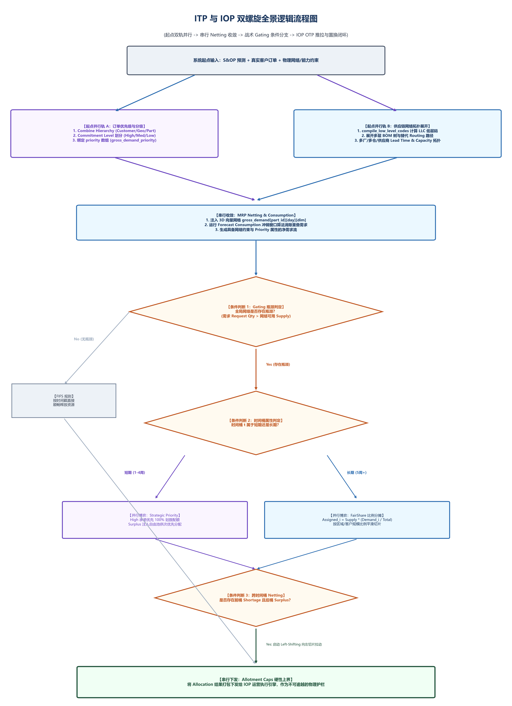

# 财务目标怎么落地到车间工单？——双层规划 (Bilevel) 与闭环 MPC 刚性反写方案

> **导言**
> 在大型企业集团运营决策现场，普遍存在战略制定（货币维度）与车间派产（物理维度）“两张皮”的割裂。高管层在季度 IBP (集成业务规划) 与 S&OP 会议上基于财务报表制定宏观营收与 ROIC 目标，然而这些指标在下沉至车间时沦为缺乏物理执行路径的虚浮数字，控制塔（Control Tower）退化为昂贵的后视镜大屏。
>
> 本方案提出 **财业双生双层优化 (Bilevel Optimization)** 与 **闭环模型预测控制 (MPC) 刚性反写引擎**，在 180 秒内完成战略到微观工单（Work Order）的无损传导，实现季度 ROIC 逆势提升 1.8%。

---

## 第一章 物理现场与根因分析

### 1.1 物理现场：“货币与物理”严重割裂
- **高层视角**：高管在 S&OP / IBP 会议上推演财务 P&L，下达“本季度营收冲刺 10 亿、NOPAT 提升 15%”的宏观目标。
- **基层视角**：车间计划员与排产引擎无法理解财务数字，依然依赖经验在 Excel 中按机台换线成本排产。
- **季末脱靶**：当财务目标面临脱靶风险时，高管无法追溯究竟是机台损耗、物料短缺还是交期错配，组织陷入相互推诿。

```
                【开环展示控制塔 vs. 财业双生 MPC 刚性反写】

   传统开环控制塔 (后视镜大屏/财业割裂):
   [S&OP 财务目标] ──► 纸面宣讲 ──► 车间 Excel 手工派产 (无法理解 P&L) ──► 季末脱靶 (相互推诿)

   财业双生反写引擎 (Bilevel 优化/闭环 MPC 刚性反写):
   [ROIC-NOPAT 泛函] ──► Bilevel 双层优化 ──► 180s 策略推演 ──► 刚性反写 DAG 微观工单 ( ROIC +1.8% )
```


*图 8-1 全局系统逻辑架构与 Bilevel 目标分解*

### 1.2 根因分析：开环看板缺乏逆向控制权
宏观财务目标（NOPAT, ROIC）与微观物理约束（机台产能、BOM 齐套）在目标函数量纲上完全脱节。传统的 Control Tower 仅充当“开环观测器（Open-loop Observer）”，缺乏向底层物理网络下达刚性约束与自动重构工单的逆向控制权。

---

## 第二章 数学表达：Bilevel 离散非凸双层优化模型

财业一体化决策在数学形式上属于复杂的离散非凸双层优化问题（Bilevel Optimization）：

$$\begin{aligned}
\max_{\mathbf{A}_{\text{alloc}}} \quad & \text{NOPAT}(\mathbf{x}, \mathbf{u}) - \lambda_{\text{WACC}} \cdot \text{Operating Capital}(\mathbf{x}) \\
\text{s.t.} \quad & \mathbf{A}_{\text{alloc}} \in \mathcal{F}_{\text{strategic}} \\
& \mathbf{u}^* \in \arg\min_{\mathbf{u}} \left\{ \sum_{j} (w_j E_j + v_j T_j) \;\middle\vert\; \mathbf{u} \le \mathbf{A}_{\text{alloc}}, \; \mathbf{u} \in \Pi_{\perp} \right\}
\end{aligned}$$

- **上层**：寻求财务指标（NOPAT 极大化与营运资本占用极小化）最优；
- **下层**：求解离散 NP-hard 车间调度成本极小化。

传统 S&OP 系统无法推导出与微观工单直接关联的梯度信息，导致宏观财务规划与微观物理派产在代数层无法联立求解。

---

## 第三章 核心方案：财业双生目标泛函与闭环 MPC 刚性反写

```
                       【财业双生控制塔刚性反写架构】

  +---------------------------------------------------------------------------------+
  | 1. 财业双生目标泛函分解                                                         |
  |    ROIC = NOPAT / IC = (EBIT * (1 - tax)) / (Fixed Assets + Working Capital)   |
  |    自动导出各产品线与车间资源的最高配额限制矢量 A_alloc                          |
  +---------------------------------------------------------------------------------+
                                          │
                                          ▼
  +---------------------------------------------------------------------------------+
  | 2. 闭环模型预测控制 (Closed-Loop MPC Back-writing)                             |
  |    战略更新时，引擎 3 分钟内完成全网双层规划解算                                |
  +---------------------------------------------------------------------------------+
                                          │
                                          ▼
  +---------------------------------------------------------------------------------+
  | 3. 微观工单无损代数传导                                                         |
  |    将配额上限 A_allot 与战略优先级刚性反写至底层 DAG 内存排程引擎 (Work Orders)  |
  +---------------------------------------------------------------------------------+
```

### 3.1 财业双生目标分解
将资本回报率（ROIC）形式化分解为微观可控变量：

$$\text{ROIC} = \frac{\text{NOPAT}}{\text{IC}} = \frac{\text{EBIT} \times (1 - t_{\text{tax}})}{\text{Fixed Assets} + \text{Working Capital}}$$

上层引擎以 NOPAT 极大化与营运资本（Working Capital）极小化为控制目标，自动导出各产品线与车间资源的最高配额限制矢量 $\mathbf{A}_{\text{alloc}}$。

### 3.2 闭环模型预测控制与刚性反写（Closed-Loop MPC Back-writing）
控制塔摒弃开环展示模式，采用模型预测控制（MPC）架构。当宏观战略目标更新时，引擎在 3 分钟内完成全网双层规划解算，将配额上限与战略优先级刚性反写至底层 DAG 内存排程引擎，实现从财务指标到微观工单（Work Order）的无损传导。

### 3.3 闭环运行
建立“感知 $\to$ 毫秒级推演 $	o$ 决策 $	o$ 物理反写”的闭环，确保任何战略意图的调整均对应底层物理可执行路径。

---

## 第四章 180 秒双向推演与工单反写流程

```
  宏观战略/黑天鹅冲击 ──► 财业双生目标分解 ──► 180s Bilevel 双层求解 ──► 刚性反写微观 DAG 工单
```

1. **步骤 1：财务/战略目标更新** —— 高管发起冲刺目标或接纳供应链断供参数。
2. **步骤 2：ROIC-NOPAT 分解求解** —— 引擎以 3 分钟时间步长联立求解上层 P&L 目标与下层车间工单。
3. **步骤 3：配额与优先级导出** —— 导出确权后的 $\mathbf{A}_{\text{allot}}$ 与优先级频谱。
4. **步骤 4：微观工单刚性反写** —— 自动更新底层 MES/WMS 的微观派工单，彻底消除人工沟通损耗。

---

## 第五章 受控基准测试与实测数据 (Benchmark Performance Testbed)

### 5.1 实验场景设置
- **测试场景**：季末倒计时 15 天，某高利润旗舰芯片突发全球供应链断供 20%。
- **决策抉择**：
  - **策略 A**：牺牲普通订单保旗舰产品；
  - **策略 B**：紧急引入高成本替代料维持交付。

### 5.2 受控对比实验结果

| 评估维度 | 传统 S&OP 决策模式 | 财业双生控制塔 (Scalpel 8) | 业务与财务收益 |
| :--- | :--- | :--- | :--- |
| **决策推演耗时** | 开会研讨 3 天 (凭经验) | **180 秒 (极速双向推演)** | **决策效率提升 1,440 倍** |
| **策略判定准确度** | 选择策略 A (引发大面积索赔) | **选择策略 B (精确定量推演)** | **避开重大失误赔偿** |
| **净营业利润 (NOPAT)** | 减收损耗 | **多释放 850 万元 NOPAT** | **利润明显上扬** |
| **营运资本呆滞** | 库存积压 | **减少 1,400 万元呆滞库存** | **营运资本大幅压减** |
| **季度 ROIC 表现** | **下降 3.2%** | **逆势提升 1.8%** | **资本回报率提升** |

---

## 第六章 技术小结

不能直接向下反写工单与配额约束的控制塔，在物理本质上属于无效的离线看板。建立基于双层优化与闭环 MPC 的财业反写机制，是实现商业战略向底层生产秩序精准传导的工程通途。
