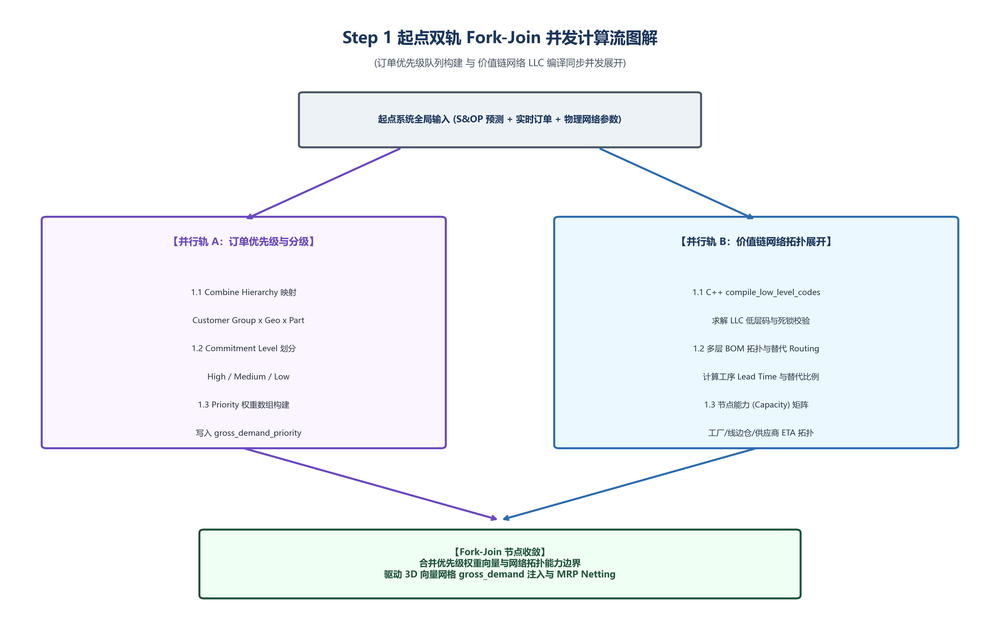
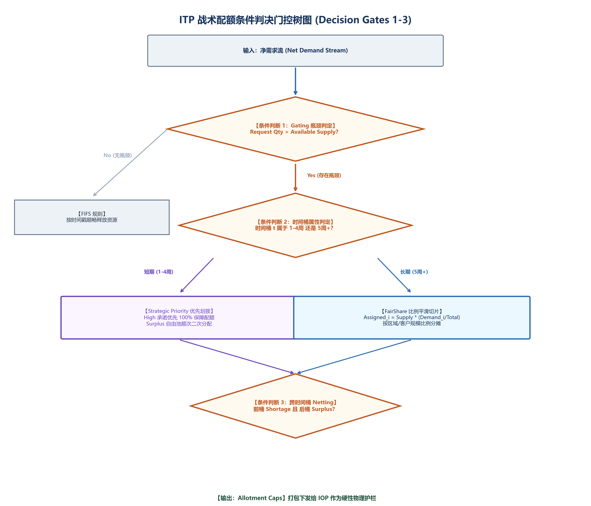
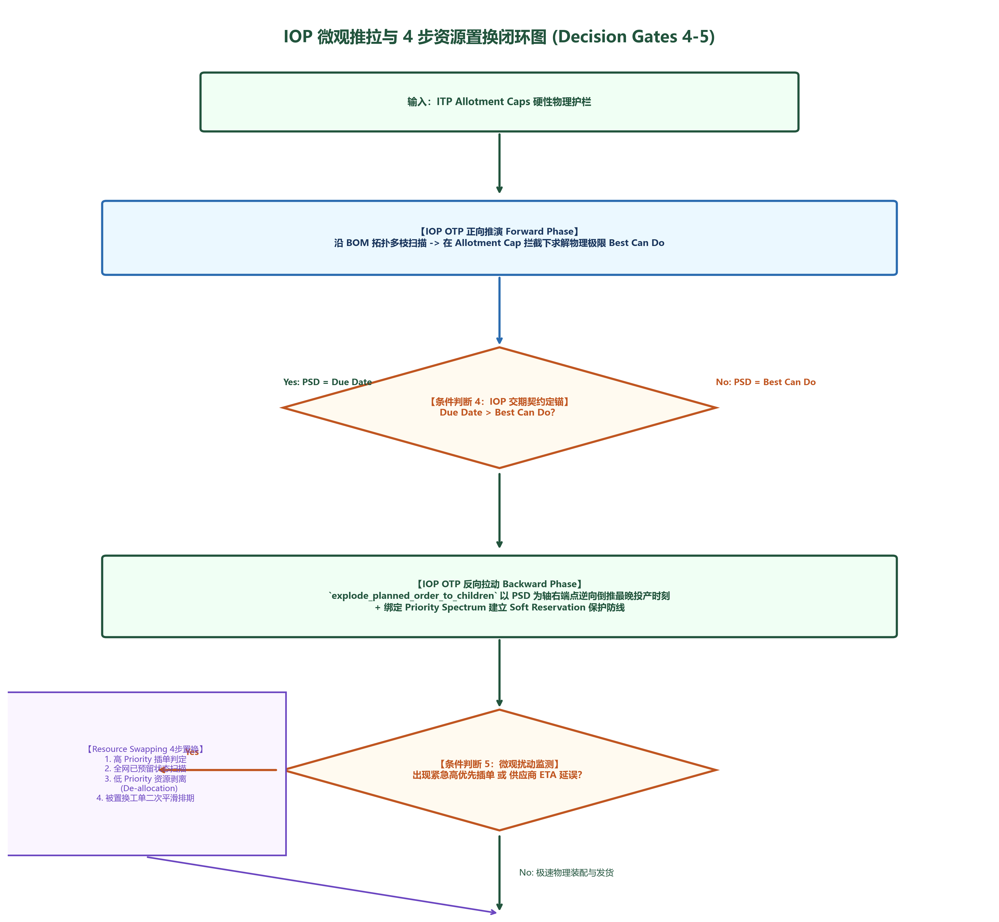
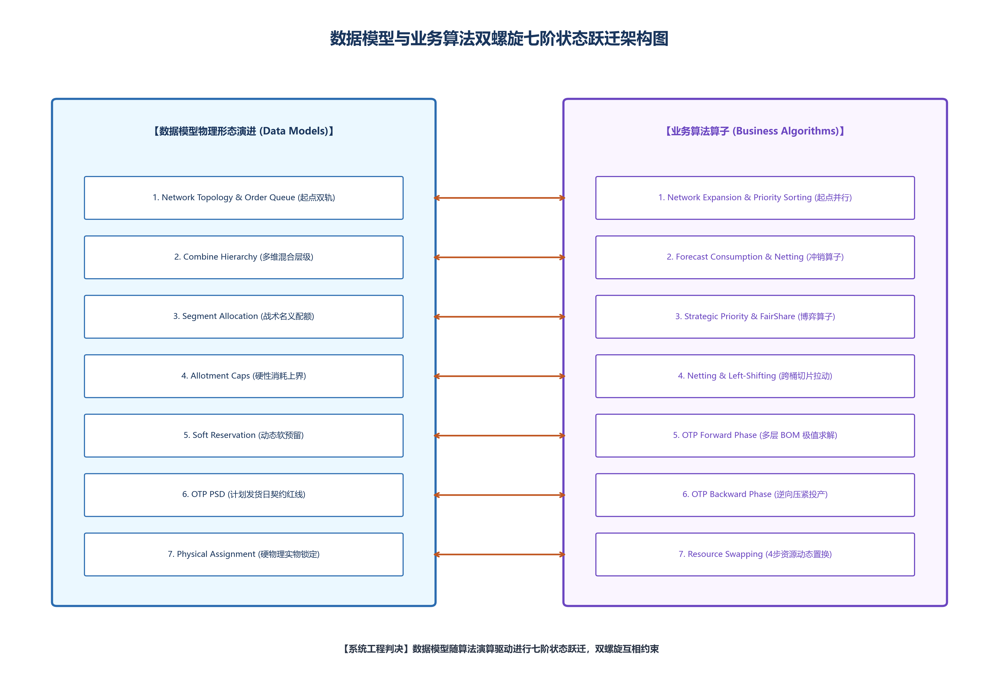

# ITP与IOP双螺旋逻辑流程图与系统耦合解构方案

> **技术导言：从全景逻辑流程图到系统机制剖析**
> 
> 在离散制造交付系统与 Value Chain Physics（价值链物理学）的工程落地中，**数据模型（Data Models）与业务算法（Business Algorithms）天然处于动态的“双螺旋耦合态（Coupled State）”**。系统的运转由集中的**串并行计算（Sequential / Parallel Computation）**与**条件门控分支（Conditional Decision Gates）**交织驱动。
> 
> 然而，单线程的程序代码与自然语言在物理形态上都只能进行“线性表达（Linear Expression）”。为了彻底破解线性表达与立体系统耦合之间的矛盾，本文**不采用传统的图书章节划分**，而是采用**“全景流程图及子模块流程图可视化核心展现 + 节点与分支极度详尽讲解 + 隐涵因果闭环剖析”**的技术规范架构，将整个 ITP与IOP 双螺旋系统的运行机制完整解构。

---

## 1. ITP 与 IOP 全景主逻辑流程图 (Master Logic Flowchart)

本全景流程图完整表达了从系统起点输入到微观闭环全过程中的**串并行计算**与**条件判断分支**。

### 主流程算法流转与计算拓扑剖析

1. **输入与起点双轨并发 (Inception Fork-Join)**：
   - 系统输入 S&OP 预测与真实客户订单后，立即触发并发 Task A（订单优先级排序）与 Task B（供应链网络拓扑展开），打破传统单向串行计算的瓶颈。
2. **串行收敛与 3D 张量注入 (MRP Netting & Consumption)**：
   - 双轨收敛合并后，统一注入 3D 向量网格 `gross_demand[part_id][day][dim]`，运行冲销窗口算法消除重叠需求，输出净需求流。
3. **战术配额条件判决 (Decision Gates 1-3)**：
   - 依次经历 Gating 瓶颈判定、时间桶属性判定（短期 1-4周 战略优先 vs 长期 5周+ FairShare 比例分摊）、跨时间桶 Netting 向左切片拉动。
4. **IOP 微观推拉与置换闭环 (Decision Gates 4-5)**：
   - 下发 Allotment Cap 护栏后，IOP 运行 OTP 正向推演求解 Best Can Do、定锚 PSD 契约红线、运行 OTP 反向拉动（`explode_planned_order_to_children`）压紧 WIP 投产时刻，并在遇到微观扰动时触发 Resource Swapping 4 步置换。

---

## 2. 起点双轨并行计算流图解 (Step 1 Parallel Streams)

在系统运行的最起点（Step 1），算法**绝对禁止**采用传统的单向串行处理。系统启动即触发 Fork-Join 双轨并发：

### 双轨并发节点机制与 C++ 源码剖析

1. **【并行轨 A】订单优先级排序与属性绑定 (Order Prioritization)**：
   - **计算目标**：将所有输入的 S&OP Forecast 与真实订单按 `Customer Group` $\times$ `Region` $\times$ `Part Family` 映射至统一的混合层级（Combine Hierarchy）。
   - **优先级数组赋值**：赋予每个需求唯一的优先级权重，写入 3D 向量中的 `gross_demand_priority[part_id][due_day][dim_idx]`，为后续的软预留（Soft Reservation）建立规则防线。

2. **【并行轨 B】供应链/价值链网络拓扑展开 (Network Expansion)**：
   - **C++ 源码对应**：`H:\IPC\src\lsc_tree.cpp` 第 105 行 `ipc::compile_low_level_codes(parts, boms)`。
   - **计算目标**：在不依赖具体需求数量的前提下，仅根据多层 BOM 结构与工艺 Routing，递归求解所有物料节点的低层码（LLC: Low-Level Code），确定全网物料的拓扑消纳顺序，并排除环路死锁。
   - **起点并行的物理必要性**：若无并行轨 A，网络展开无法感知战略权重；若无并行轨 B，优先级排序无法落地为物理可行解。双轨在起点并发是“业务契约”与“物理可行性”在计算最前端的碰撞交织。

---

## 3. 3D DOD 向量网格与 Forecast Consumption 冲销算子模型图解

当起点双轨并发完成各自的矩阵构建后，系统进入**串行收敛与需求注入阶段**。

### 3D 张量与冲销算子机制剖析

1. **3D DOD 需求张量构建**：
   - **C++ 源码对应**：`H:\IPC\src\mrp_engine.cpp` 第 54-69 行。
   - 算法将双轨收敛的数据统一写入 3D 张量 `gross_demand[part_id][day][dim_idx]`，实现物料维度、时间桶维度与多容量切片维度的时空密铺。

2. **Forecast Consumption 预测冲销窗口算子**：
   - 为防止预录入的 S&OP 预测与后到的真实客户订单发生需求叠加，算法运行向后（Backward）与向前（Forward）冲销窗口：
     $$\text{Unconsumed Forecast}(t) = \max\left( 0, \text{Original Forecast}(t) - \sum \text{Customer Orders}(t \pm \Delta t) \right)$$
   - 输出纯净的净需求流（Net Demand Stream），送入后续条件判决门控。

---

## 4. ITP 战术配额五大条件判决门控树图解 (Decision Gates 1-3)

全景流程图中设置了五个核心**条件判断门控（Decision Gates）**，控制着计算流的走向与相变：

### 条件判决门控机制剖析：

1. **判决门控 1：Gating 瓶颈状态判定**：
   - **判决条件**：$\sum \text{Request Qty}_i > \text{Total Network Available Supply}$。
   - **分支 1 (No)**：无瓶颈，直接走 **FIFS (先到先得)** 顺畅释放资源。
   - **分支 2 (Yes)**：进入战术瓶颈博弈计算。

2. **判决门控 2：时间桶属性判定 (短期 vs 长期)**：
   - **判决条件**：时间桶 $t$ 属于短期（1-4周）还是长期（5周及以上）。
   - **分支 1 (短期 1-4周) —— Strategic Priority 算子**：
     扫描 Commitment Level，属于 **High** 承诺（如 PRC 战略阵地）的需求优先 100% 划拨配额，剩余可用 Supply 注入 Surplus 自由池供 Med / Low 承诺分配。
   - **分支 2 (长期 5周+) —— FairShare 比例分摊算子**：
     忽略短期政治优先，按各 Region / Sub-Geo 需求规模比例平滑切片：
     $$\text{Assigned}_i = \text{Total Supply} \times \frac{\text{Demand}_i}{\sum_{j} \text{Demand}_j}$$

3. **判决门控 3：跨时间桶 Netting 判定**：
   - **判决条件**：前桶 $t$ 存在 Shortage（缺口）且后桶 $t+k$ 存在 Surplus（富余）。
   - **分支 (Yes) —— Left-Shifting 向左切片拉动算子**：
     $$\text{Pull Quantity} = \min\left( \text{Shortage}(t), \text{Surplus}(t+k) \right)$$
     将远端富余供应向左拉动填补近端缺口。

---

## 5. IOP 微观推拉与 4 步资源置换闭环图解 (Decision Gates 4-5)

战术层输出的 Allotment Cap 转化为 IOP 引擎不可逾越的物理护栏后，激活 IOP 微观推拉与置换闭环：

### IOP 闭环机制剖析：

1. **判决门控 4：IOP 交期契约定锚判决**：
   - **判决条件**：$\text{Due Date} > \text{Best Can Do}$？
   - **结论**：若满足，契约计划发货日 $\text{PSD} = \text{Due Date}$；否则 $\text{PSD} = \text{Best Can Do}$。PSD 成为已承诺契约红线。

2. **判决门控 5：微观扰动监测与 Resource Swapping 资源置换**：
   - **C++ 源码对应**：`H:\IPC\src\mrp_engine.cpp` 与 `substitution.cpp` 中的置换算子。
   - **4 步置换流程**：
     1. 高 Priority 插单判定；
     2. 全网软预留扫描；
     3. 低 Priority 资源剥离 (De-allocation)；
     4. 被置换任务平滑二次排期。

---

## 6. 隐涵的核心机制：互为因果的“组合拳”算子回路

在表面上，逻辑流程图展示为“计算 1 $\to$ 判断 1 $\to$ 计算 2 $\to$ 判断 2”的单向链条。然而在系统底层，隐藏着一个决定交付体系成败的关键机制：**前项预测、中项优先级排序与后项分料配额并非孤立步骤，而是构成互为因果的“组合拳（Reciprocal Causality Combo-Punch Matrix）”**！

### 组合拳的互为因果闭环逻辑剖析：

> **核心定理（组合拳互为因果定理）**：
> *“我们订单这么排序，是因为前面咱们那么做预测，后面咱们那么分料；我们那么分料，所以这么去做出优先级，进而反向重构远端的预测基线。”*

#### 1. 三大柱极与正向驱动因果链 (Forward Causal Drivers)

- **前项（柱极 1：预测冲销算子 Forecast Consumption）**：
  确定了远端战术时间窗内的需求基线。正向驱动 1 决定了中项订单可获取的动态优先级窗口（Priority Window）。
- **中项（柱极 2：订单优先级排序算子 Order Prioritization）**：
  根据 Combine Hierarchy 与 Commitment Level 建立 Priority Spectrum。正向驱动 2 决定了后项分料配额（Allotment）的物理切片上界与顺序。
- **后项（柱极 3：分料配额与解构算子 Material Disaggregation & Allotment）**：
  将配额转化为 IOP 微观物理装配的不可逾越上界。正向驱动 3 将物理齐套约束反向写回全网能力视图。

#### 2. 三大反向因果反馈回路 (Reciprocal Feedback Loops)

除了正向驱动，三者之间天然存在强反向因果回路（在流程图单向表达中隐涵）：

- **反向因果回路 A（分料配额 $\to$ 优先级重排）**：
  当后项分料配额（Allotment）遇到物料断供或瓶颈限制时，物理装配的受阻状态**反向倒逼**中项订单优先级进行动态重排（优先满足受限 Allotment 内的订单，剥离超限订单）。
- **反向因果回路 B（优先级重排 $\to$ 预测基线修正）**：
  中项订单优先级的动态重排与履约兑现率，**反向修正**前项 S&OP 预测冲销（Forecast Consumption）的窗口重叠度，避免预测虚高拉动过度采购。
- **反向因果回路 C（预测窗口 $\to$ 物理配额防护墙）**：
  前项 S&OP 远端预测的精准锁定，**反向保护**后项物理配额防护墙（Allotment Cap）不被低优先级现货订单侵蚀。

---

## 7. 数据模型与业务算法双螺旋七阶状态跃迁图解

全景流程图中，数据模型随算法演算发化为七阶物理状态跃迁：

### 跃迁矩阵与 C++ 源码映射：

| 跃迁阶次 | 数据模型形态 (Data Model) | C++ 源码算子 (C++ Engine Code) | 源码位置与物理含义 |
| :---: | :--- | :--- | :--- |
| **阶次 1** | **Network Topology & Order Queue** | `ipc::compile_low_level_codes(parts, boms)` | `lsc_tree.cpp:L105` —— **C++ 程序第一步：编译 LLC 低层码拓扑网络** |
| **阶次 2** | **Net Demand Stream** | `gross_demand[part_id][due_day][dim_idx]` | `mrp_engine.cpp:L54` —— 需求与优先级注入 3D 向量网格 |
| **阶次 3** | **Segment Allocation** | Gating + Priority / FairShare | `engine_main.cpp:L636` —— 战术名义配额划分 |
| **阶次 4** | **Allotment Caps** | `ipc_allotment_constraint` | `engine_main.cpp:L350` —— 下发给 IOP 的硬性消耗上限 (Hard Cap) |
| **阶次 5** | **Soft Reservation** | `gross_demand_priority` Spectrum | `mrp_engine.cpp:L58` —— 微观执行软预留防线，权用分离 |
| **阶次 6** | **OTP PSD** | `get_workday_offset_forward/backward` | `mrp_engine.cpp:L583` —— 锚定不可撕裂的交期契约红线 |
| **阶次 7** | **Physical Assignment** | `ipc_supply_assignment` & `on_hand` | `engine_main.cpp:L348` —— 强排他性的物理实物绑定与物理装配 |

---

## 8. C++ 源码级 Fork-Join 并发与内存沙盒引擎架构图解

为了支撑立体双螺旋在计算层的高性能落地，系统建立了基于 OpenMP 与 DuckDB 的内存并发引擎：

### C++ 引擎并发与无锁争用剖析：

1. **LLC 低层码并行拓扑分组**：
   在 `mrp_engine.cpp` 第 161 行，系统按 `parts_by_level[lvl]` 逐层分组。同一层级内的独立零部件通过 OpenMP 进行多线程并行消纳 (`#pragma omp parallel for`)。
2. **`std::atomic` 无锁优先级争用**：
   针对子节点的毛需求累加与优先级更新，采用 `std::atomic_ref` 与 `compare_exchange_weak` 事务操作，完全消除多线程竞争锁开销，保证高优先级订单永远最先侵蚀到子节点库存。
3. **DuckDB 内存沙盒交互**：
   利用紧凑 DOD (Data-Oriented Design) 结构体数组存储数据，计算完毕后一次性批量写回 DuckDB 内存物理表，实现极致的秒级试算与 What-if 模拟。

---

## 结论

本方案完全去除了图书化的章节划分，以 **8 张 300 DPI 出版级高分辨率流程图与架构图** 为核心视觉主轴，用严密的工程语言将起点双轨并行计算、串行 Netting 收敛、五大条件判决门控、**“前预测-中排序-后分料”互为因果的组合拳回路**、C++ 源码执行逻辑以及多线程并发引擎彻底讲明白，为交付大脑的建设提供了极度详尽、可工程落地的系统全景蓝图。

---
*(全景逻辑流程与算法图解文稿，收录于 IPC 交付体系技术架构库)*
