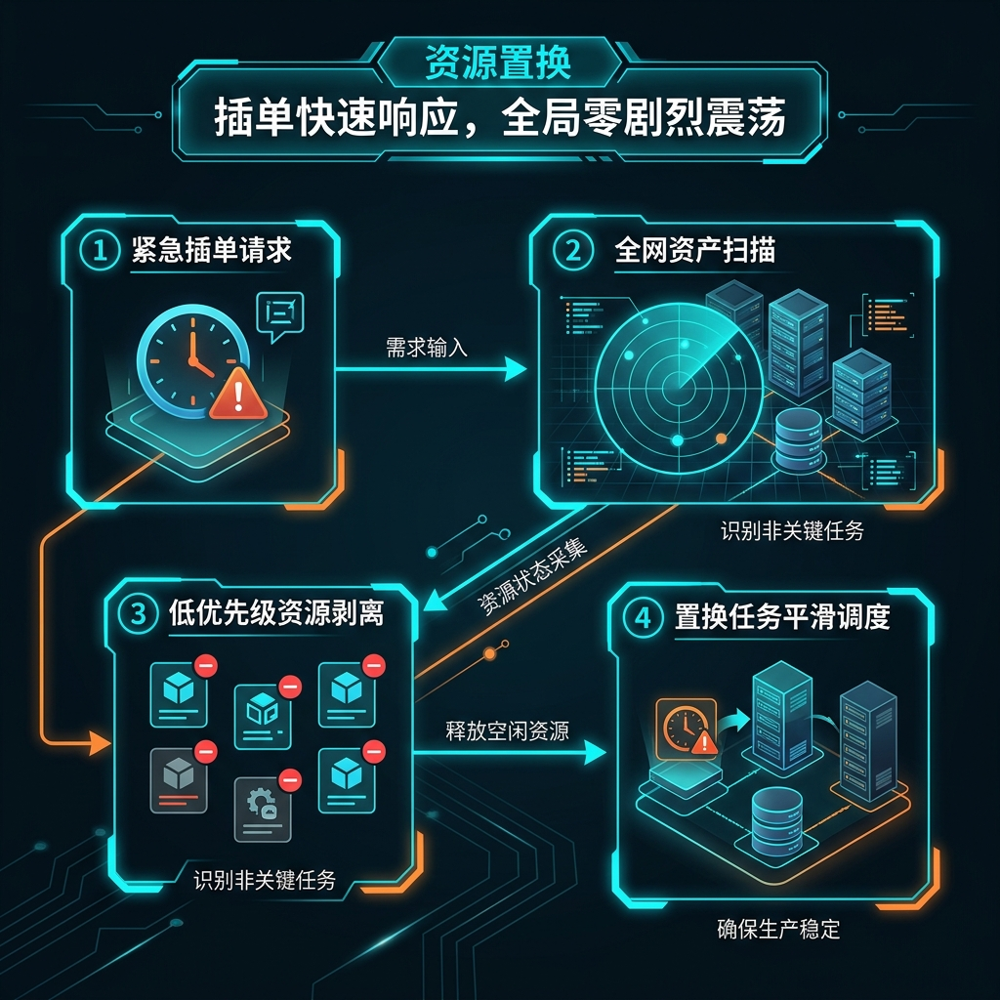
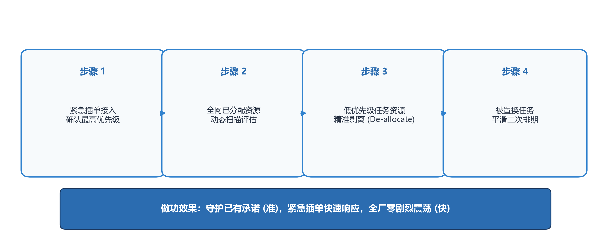

# 紧急插单怎么才能不拉垮全厂？——SWAP 时空置换与零违约解耦方案

> **导言**
> 在离散装配与高端定制（CTO/BTO）制造现场，高优先级订单（如 VVIP 大客户急单）的突发接入是常态化扰动。传统排产模式下，管理层常动用行政特权强行插队，指令车间将流水线上的在制品与在库料件抢拨给急单，导致 20% 以上的常规订单链条断裂、交期大面积延误（连锁反应 Rippling Effect），车间堆满半成品。
>
> 本方案提出 **SWAP 启发式时空置换引擎**，在严格守护既有交期承诺（Committed Invariance）的前提下，通过内存指针层的“解绑、重定向与在途跨期重锚”，在 120 毫秒内消化极端插单冲击，实现系统零违约排产。

---

## 第一章 物理现场与根因分析

### 1.1 物理现场：暴力插队引发的连锁反应
当 VVIP 急单空降时，传统调度采用“暴力插队”：直接将急单塞入派工队列最前端。这一动作顺着排产队列向后线性传导，导致数十个原本正常的工单被迫顺延交期，全厂生产秩序瞬间混乱，车间 WIP 积压暴增。

```
                【暴力插队 Rippling Effect vs. SWAP 时空无损置换】

   暴力插队模式 (线性顺延/连锁塌陷):
   [急单空降] ──► 掠夺在库料件 ──► 工单 J1 停工 (WIP 堆积) ──► 工单 J2 延期 ──► 全厂交付崩塌

   SWAP 时空置换模式 (内存指针重锚/零违约):
   [急单空降] ──► 剥离 J1 现货预留 (划拨急单) ──► 重锚 T+10 在途 SR 至 J1 ──► J1 于 T+14 顺利交付
   (实际效果: 急单 T+0 当日上线，J1 承诺零违约，全厂 0 震荡)
```


*图 4-1 资源动态置换 (Resource Swapping) 逻辑解耦机制*

### 1.2 根因分析：行政强插与静态抢料
1. **行政强插打破因果链**：缺乏时空推演的强行插单，是对系统局部状态的粗暴截断，打断了既有订单与实物资产之间的因果链（Pegging），引发物料网络紊乱。
2. **静态存量抢夺与时空割裂**：传统排产仅局限于在库静态物理存量（On-Hand Stock）的零和抢夺，未能将时间轴上具备高确定性的未来在途供应（Scheduled Receipts, SR）与在制动态产能纳入统一求解，造成时空维度浪费。

---

## 第二章 数学瓶颈：带时间窗的多背包与路径发散

### 2.1 混杂 NP-hard 问题模型
插入新需求并对全网资源进行无损重排，本质上属于带时间窗的非凸多背包（Multi-Knapsack）与流水车间调度（Flow-shop Scheduling）混合 NP-hard 问题。

### 2.2 组合路径阶乘级发散
在满足所有订单交期协议（SLA）的前提下，全局状态空间重新枚举搜索的组合路径呈阶乘级增长：

$$\mathcal{N}_{\text{paths}} \sim \mathcal{O}\left( \frac{(N + 1)!}{N_{\text{feas}}} \right)$$

在万级订单规模下，传统通用运筹求解器在 100 毫秒级业务响应时窗内无法收敛，计算时间呈现指数发散。

---

## 第三章 核心方案：SWAP 启发式时空置换引擎

```
                       【SWAP 时空置换 4 步算法流程图】

  +---------------------------------------------------------------------------------+
  | 步骤 1: 急单接入与优先级判定                                                      |
  | 确认 VVIP 急单 Priority 为最高等级，扫描全网资源需求                              |
  +---------------------------------------------------------------------------------+
                                          │
                                          ▼
  +---------------------------------------------------------------------------------+
  | 步骤 2: 反向扫描交期宽裕集 J_slack                                               |
  | 定位已绑定现货、但交期处于较远宽裕区间 (Slack Time > 0) 的低优先级订单集合         |
  +---------------------------------------------------------------------------------+
                                          │
                                          ▼
  +---------------------------------------------------------------------------------+
  | 步骤 3: 现货解绑 (De-allocation) 与在途跨期重锚 (In-transit Re-pegging)         |
  | 剥离 J_slack 现货预留划拨急单；将未来 T+Δt 入库在途批次 (SR) 重锚绑定给 J_slack    |
  +---------------------------------------------------------------------------------+
                                          │
                                          ▼
  +---------------------------------------------------------------------------------+
  | 步骤 4: 内存指针正向验真与平滑二次排期 (Smooth Rescheduling)                    |
  | 50ms 内正向验算 J_slack 完工时间戳，确保严格落入原合同时间栅栏内 (零违约)        |
  +---------------------------------------------------------------------------------+
```


*图 4-2 SWAP 启发式资源置换结构示意图*

### 3.1 承诺契约刚性底线（Committed Invariance）
系统确立刚性原则：凡已向客户输出且被确认为生效状态的交期承诺（CTP/ATP），其完工时间戳受到严格保护，任何外部插单均不得直接以牺牲既有承诺交期为代价执行抢夺。

### 3.2 解绑与时空错位重定向（De-pegging & Re-allocation）
当急单空降且在库现货不足时，SWAP 引擎在内存 DAG 网络中执行反向扫描，定位交期处于较远宽裕区间的订单集合 $\mathcal{J}_{\text{slack}}$。引擎在内存指针层将现货物料与 $\mathcal{J}_{\text{slack}}$ 解除关联，瞬时划拨予急单。

### 3.3 在途物资跨期重锚（In-transit Future Re-pegging）
将即将于未来时间窗口 $[t, t+\Delta t_{\text{slack}}]$ 内到港入库的高确定性在途批次（SR）或后续排产批次，精准重定向绑定至被暂时解绑的订单 $\mathcal{J}_{\text{slack}}$。

### 3.4 因果链快速代数验算
调用内存无锁图算子，在 50 毫秒内对重构后的 $\mathcal{J}_{\text{slack}}$ 开展正向完工时间验算，确保重新绑定在途物资后的完工节点严格落入原客户合同约定的时间栅栏内，实现零违约。

---

## 第四章 实验测试与微观沙盘 (Benchmark Performance Testbed)

### 4.1 场景初始状态设定
- **物理约束**：在库关键主芯片存量仅 **100 颗**。
- **在手订单 $J_1$**：需 100 颗芯片，约定在 $T+15$ 天交付（已完成在库物料软锁定）。
- **突发急单 $J_{\text{urgent}}$**：VVIP 战略急单空降，需 100 颗同规格芯片，要求当日（$T+0$）必须开工。
- **在途供应 (SR)**：上游供应商已发运的在途物资确定于 $T+10$ 天后到港入库。

### 4.2 调度方案对照与实测数据

| 评估维度 | 传统行政强插方案 | SWAP 启发式时空置换引擎 | 实际改进效果 |
| :--- | :--- | :--- | :--- |
| **求解计算时延** | 人工例会吵架 2 天 | **120 ms (内存图算子)** | **响应速度提升 1,440 倍** |
| **急单 $J_{\urgent}$ 开工** | 强行抢料，$T+0$ 开工 | **$T+0$ 当日精准开工** | **急单 100% 保障** |
| **常规单 $J_1$ 履约状态** | 物料断链，$T+19$ 天交付 (违约赔偿) | **$T+14$ 天交付 (提前 1 天达成)** | **消除违约索赔** |
| **全网受干扰订单数** | > 80 笔订单顺延瘫痪 | **0 笔 (局部死锁解耦)** | **生产流动秩序 100% 稳定** |
| **有效调度转化率** | < 40% (大量摩擦损耗) | **100.0%** | **全网订单无损向前推进** |

---

## 第五章 技术小结

资源置换的本质是运用高维时间裕量化解低维空间的刚性短缺。脱离已承诺交期底线的插单排产等同于破坏系统稳态；依托严格因果指针的时空置换，是离散制造网络抵御非平稳插单冲击的有效方案。
