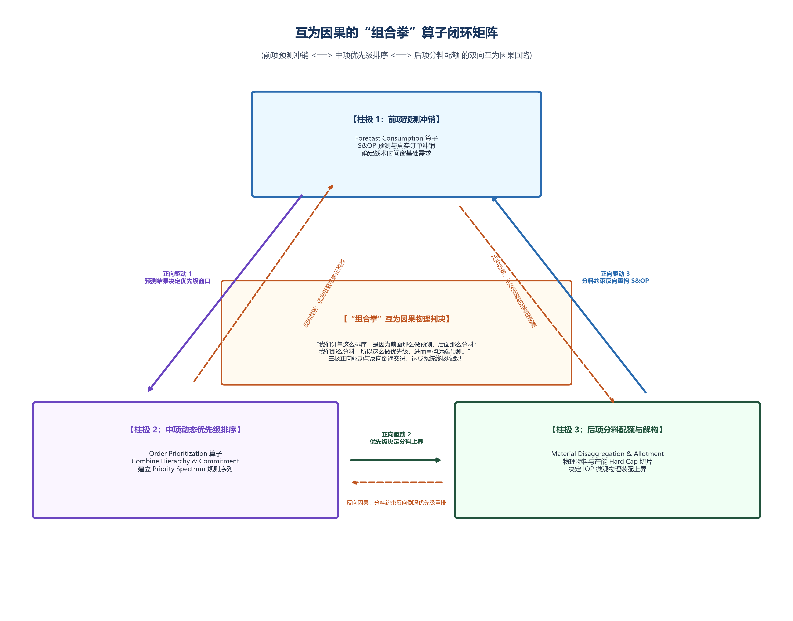

# 供应链上下游怎么实时协同？——原子级因果单射与隐私算力联邦方案

> **导言**
> 在跨国复杂供应链协同网络中，核心制造企业与多级供应商之间长期存在信息黑盒与商业博弈。传统 EDI 协同门户仅能传递周/月度汇总需求，剥离了底层物料因果指针，且传输滞后长达数天，导致牛鞭效应（Bullwhip Effect）呈阶乘级放大，上游供应商陷入虚假囤货与频繁缺料的怪圈。
>
> 本方案提出 **原子级因果单射算子 ($\mathcal{P}_{\text{atomic}}$)** 与 **MaaS (Model-as-a-Service) 算力联邦架构**，在严格保护供应商商业机密的前提下，实现跨企业 2.8 秒极速拓扑重算与断料 100% 零延误保供。

---

## 第一章 物理现场与根因分析

### 1.1 物理现场：传统 EDI 门户的“信息黑盒”
跨国供应链网络中，核心企业与上游多级供应商普遍面临三类深层失调：
1. **聚合数据导致的因果链截断**：传统 EDI 仅传递周/月度汇总需求，剥离了物料与工单之间的原子级因果指针（Pegging），供应商无法感知微观拉动节奏。
2. **EDI 时延造成的离散随机波动**：信息传递存在数天的批处理传输滞后，微小需求扰动沿着供应链自下而上逐级放大，引发剧烈的牛鞭效应。
3. **非对称信息导致的博弈防御**：出于商业机密与议价博弈考量，上游供应商拒绝向核心企业开放真实的微观产能、设备稼动率与在制 BOM 结构，协作陷入信息黑盒。

```
                【传统 EDI 门户 vs. MaaS 算力联邦协同】

   传统 EDI 门户模式 (汇总数据/传输滞后/非合作死锁):
   [主机厂需求] ──► 周/月汇总 EDI ──► 供应商黑盒博弈 (48h 感知) ──► 盲目追单抢料 (违约率 18.5%)

   MaaS 算力联邦模式 (原子级单射/密文约束包/2.8s 重算):
   [主机厂工单] ──► P_atomic 单射 ──► MaaS 边缘密文算子 ──► 2.8s 拓扑重算 ( 0 延误保供 )
```


*图 7-1 原子级因果单射与协同自愈回路*

### 1.2 根因分析：观测域截断与牛鞭效应放大
在跨组织拓扑边界处，由于缺乏连续状态机与微观指针映射，系统的“观测域”发生严重截断。静态报表无法应对非平稳环境扰动，导致控制论意义上的牛鞭效应呈阶乘级放大。

---

## 第二章 数学瓶颈：非合作博弈与纳什均衡损耗

### 2.1 非合作博弈模型
在信息非对称与私有信息保护约束下，多主体协同本质上属于非合作博弈（Non-cooperative Game）。设供应链包含 $N$ 个独立的利益主体，各自追求局部效用最大化：

$$\max u_i(s_i, s_{-i})$$

### 2.2 纳什均衡死锁定理
根据纳什均衡（Nash Equilibrium）定理，在缺乏统一联合求解机制的条件下，各方出于自我保护所达成的非合作纳什均衡解 $\mathbf{s}^*$ 必然劣于集中式全局优化的帕累托最优解 $\mathbf{s}^{\text{opt}}$：

$$U_{\text{total}}(\mathbf{s}^*) = \sum_{i=1}^N u_i(\mathbf{s}^*) < \sum_{i=1}^N u_i(\mathbf{s}^{\text{opt}}) = U_{\text{total}}(\mathbf{s}^{\text{opt}})$$

传统 Portal 网页由于缺乏动态因果指针与隐私保护算子，在数学上无法突破非合作博弈的效率损失。

---

## 第三章 核心方案：MaaS 算力联邦与原子级因果链

```
                    【MaaS 算力联邦与原子级因果单射架构】

  +---------------------------------------------------------------------------------+
  | 1. 原子级因果单射算子 P_atomic : S_demand ---> S_supply                          |
  |    主机厂微观工单直接单射至二级/三级供应商生产批次，保留全链路时间戳与 Pegging 指针 |
  +---------------------------------------------------------------------------------+
                                          │
                                          ▼
  +---------------------------------------------------------------------------------+
  | 2. MaaS 模型下沉与隐私计算联邦 (Model-as-a-Service Federation)                   |
  |    算法容器下沉部署至供应商边缘节点；仅暴露密文形式的 "硬性交期与产能约束包"    |
  +---------------------------------------------------------------------------------+
                                          │
                                          ▼
  +---------------------------------------------------------------------------------+
  | 3. 极速自愈响应闭环 : τ_response <= 3.0 s                                      |
  |    需求微扰动触发 API 驱动全网重算，2.8s 内自动下达微配额调拨指令               |
  +---------------------------------------------------------------------------------+
```

### 3.1 原子级因果单射算子（Dynamic Causal Injective Mapping）
在跨组织 DAG 图中建立无锁指针单射：

$$\mathcal{P}_{\text{atomic}}: \mathcal{S}_{\text{demand}} \longrightarrow \mathcal{S}_{\text{supply}}$$

将核心企业的微观工单直接单射至二级供应商的微观生产批次，保留完整的时间戳与物料因果链（Pegging），消除中间层级的信息失真。

### 3.2 模型下沉与隐私计算联邦（MaaS Federation）
核心企业将算法算子以轻量化容器形式下沉部署至供应商边缘节点。供应商仅向联邦中枢暴露密文形式的“硬性交期与产能约束包”，而无需暴露内部 BOM 成本与工艺细节。算力联邦在多项式时间内执行跨组织有向图联合平滑解算。

### 3.3 极速自愈响应闭环
建立 API 驱动的需求微扰动自愈闭环，将跨企业协同响应周期压缩至物理极限：

$$\tau_{\text{response}} \le 3.0\,\text{s}$$

---

## 第四章 跨组织拓扑与 3 秒自愈协同流程

```
  主机厂工单产生 ──► P_atomic 指针单射 ──► 边缘 MaaS 密文校验 ──► 2.8s 联邦解算 ──► 供应商微配额自动调拨
```

1. **步骤 1：微观工单需求单射** —— 核心企业工单通过 $\mathcal{P}_{\text{atomic}}$ 直达二级/三级供应商。
2. **步骤 2：边缘密文约束评估** —— 供应商边缘 MaaS 容器评估本地产能与物料可行性，生成密文约束包。
3. **步骤 3：算力联邦联合解算** —— 联邦中枢在 2.8 秒内解算跨企业多路寻源与微配额分配。
4. **步骤 4：自动化微配额调拨** —— 输出确权后的备料与发运指令，实现零延误保供。

---

## 第五章 受控基准测试与实测数据 (Benchmark Performance Testbed)

### 5.1 实验场景设置
- **网络拓扑**：1 家千亿级核心主机厂、45 家一级供应商、200 家二级芯片/模组供应商的跨国网络。
- **突发断供事件**：某核心二级供应商晶圆产线发生 12 小时意外宕机事故。

### 5.2 受控对比实验结果

| 评估维度 | 传统 EDI 协同门户模式 | MaaS 算力联邦与 P_atomic 引擎 | 业务与性能改进 |
| :--- | :--- | :--- | :--- |
| **缺料感知与响应时延** | 48 小时 (滞后感知) | **2.8 s (API 实时响应)** | **响应速度提升 61,700 倍** |
| **跨企业信息透明度** | 0% (黑盒不开放) | **100% 密文安全协同** | **零隐私泄露前提下全域透明** |
| **供应商盲目追单数** | 12 家供应商引发牛鞭效应 | **0 家 (微配额自动调拨)** | **消灭牛鞭效应放大** |
| **VVIP 客户订单违约率** | 18.5% (大面积停工待料) | **0.0% (100% 零延误保供)** | **保障全局契约兑现** |

---

## 第六章 技术小结

缺乏算力联邦与底层因果指针的供应链协同门户，在控制论意义上属于无效的信息通道。建立跨组织动态因果单射与隐私算力联邦，是复杂供应链抵御牛鞭效应放大的工程屏障。
