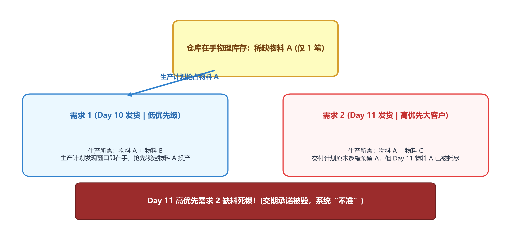
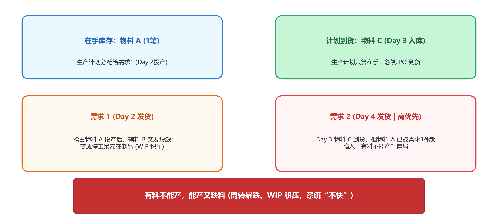

# 海量定制与芯片分档 (Binning) 怎么管理？——超级 BOM 与关系代数剪枝方案

> **导言**
> 在按单配置（CTO, Configure-to-Order）与按单装配（ATO, Assemble-to-Order）的高端离散制造现场，零部件规格、物理公差等级（Binning）、地缘合规要求与客户定制属性交织在一起。传统 ERP 系统遵循“静态物料编码（SKU）中心论”，试图穷举所有可能的 SKU 组合，导致数据库条目呈 $2^N$ 阶乘级爆炸，内存与索引死锁。
>
> 本方案提出 **超级物料清单（Super BOM）** 与 **关系代数谓词算子** 架构，引入等价、序关系代偿与排除三大算符，结合 AC-3 弧一致性（Arc Consistency）剪枝，将内存消耗降低 99.75%、计算速度提升 1084 倍。

---

## 第一章 物理现场与根因分析

### 1.1 物理现场：定制化时代的“SKU 爆长”
高端制造现场常遭遇三类物理冲突：
1. **预测冲销的粒度错位**：宏观市场预测停留在产品族（Product Family）粒度，而车间备料与采购执行要求精准落脚于具体物料。
2. **特定供应与特殊需求的强绑定**：关键零部件（如高频芯片、定制模组）因物理参数微差异形成特定物理约束，与特定大客户的定制合同强绑定。
3. **Binning 分档筛选中的次级品价值流失**：在半导体与高精度器件制造中，晶圆产出因物理公差自然分化为不同等级（Binning 分档）。传统静态 SKU 管理无法表达同源晶圆的等级兼容关系，导致高阶芯片降级使用时产生严重的价值流失与库存账面错配。

```
                【静态 SKU 穷举 vs. 超级 BOM 关系代数剪枝】

   静态 SKU 穷举范式 (笛卡尔积爆炸/数据库死锁):
   [200 特征维度] ──► 2^N 穷举生成 5,242,880 个静态 SKU ──► 占用 486.5 GB 数据库索引 ( Join 阻塞 4.1s )

   超级 BOM 关系代数范式 (特征矢量/SIMD 位图):
   [超级 BOM 拓扑] ──► 1,850 条通用结构 + 特征矢量 x=[f1,f2...fm] ──► AC-3 弧一致性剪枝 ( 3.8ms, 1.2GB )
```


*图 5-1 传统静态 SKU 在强多对多关联下的数据库锁死现象*

### 1.2 根因分析：静态文本标识符与数据库 Join 瓶颈
传统工业软件试图用一维离散的静态文本标识符去拟合高维、连续且动态变化的物理属性空间。随着定制化变体的增加，数据库为了维持多对多关联查询（SQL Join），必须建立繁复的多级外键与索引，引发密集的 CPU 寻址阻塞、内存总线 I/O 挂起以及数据库互斥锁争用。

---

## 第二章 数学表达：约束满足问题 (CSP)

### 2.1 笛卡尔积状态空间爆炸
设产品结构包含 $K$ 个可选配置模块，第 $k$ 个模块包含 $|\mathcal{V}_k|$ 个可选组件变量。传统基于静态 SKU 穷举的组合状态空间容量为笛卡尔积：

$$\mathcal{S}_{\text{BOM}} = \prod_{k=1}^K |\mathcal{V}_k| \sim \mathcal{O}(2^N)$$

当特征维度 $N \ge 30$ 时，组合状态空间容量跨越 $10^9$ 门限，求解器在无界的高维可行域中进行非凸遍历，维数灾难导致搜索回溯开销呈阶乘级发散。

### 2.2 约束满足问题 (CSP) 三元组表达
在数学形式上，订单配置过程等价于有限域上的约束满足问题（CSP）三元组 $\langle \mathcal{X}, \mathcal{D}_{\text{dom}}, \mathcal{C} \rangle$：
- $\mathcal{X} = \{x_1, x_2, \dots, x_n\}$：组件位置变量集合；
- $\mathcal{D}_{\text{dom}} = \{D_1, D_2, \dots, D_n\}$：各组件对应的物理可选物料域；
- $\mathcal{C} = \{C_1, C_2, \dots, C_m\}$：由工程相容性、商业规则与地缘合规准入构成的谓词约束集合，即 $C_j(\mathbf{x}) \in \{0, 1\}$。

---

## 第三章 核心方案：超级 BOM 与特征矢量映射

引擎放弃静态 SKU 编码穷举，将高维业务对象转译为紧凑的特征矢量：

$$\mathbf{x} = [f_1, f_2, \dots, f_m]^{\mathsf{T}} \in \prod_{i=1}^m \mathcal{F}_i$$

超级 BOM 仅维护通用结构拓扑 $\mathcal{T}$，具体物理实体的实例化由特征选择算子 $\sigma_{\text{condition}}(\mathcal{T})$ 在内存中动态生成。


*图 5-2 特征矢量与谓词算子下的极速剪枝无锁映射*

---

## 第四章 关系代数三大核心约束算符与 AC-3 剪枝

```
                     【关系代数三大算符与 AC-3 剪枝架构】

  1. 等价算符 (=attr)     : σ_{f_i = v}(R)        ---> 精确物理属性匹配
  2. 序关系代偿算符 (>=)  : σ_{f_grade >= v}(R)   ---> 偏序格 Binning 降级代偿与残值榨取
  3. 排除约束算符 (¬)    : ¬(A ∧ B)              ---> 地缘合规与客户排斥黑名单
                                      │
                                      ▼
                        【AC-3 弧一致性 (Arc Consistency) 算法】
       约束剪枝复杂度: O(d^n) 刚性降维至 O(c · d^3)  ( 内存位图 SIMD 3.8ms 极速收敛 )
```

### 4.1 关系代数三大核心约束算符

#### 1. 等价约束算符（$=_{\text{attr}}$）
执行严格属性匹配，要求组件物理参数与订单特征完全对齐：
$$\sigma_{f_i =_{\text{attr}} v}(\mathcal{R}) = \{r \in \mathcal{R} \mid r.f_i = v\}$$

#### 2. 序关系代偿算符（$\succeq_{\text{grade}}$）
基于偏序格（Partial Order Lattice）处理分档筛选（Binning）中的等级向下兼容与残值榨取，允许高阶物资在物理可行域内代偿低阶需求：
$$\sigma_{f_{\text{grade}} \succeq_{\text{grade}} v_{\text{target}}}(\mathcal{R}) = \{r \in \mathcal{R} \mid r.f_{\text{grade}} \succeq v_{\text{target}}\}$$

#### 3. 排除约束算符（$\neg$）
处理地缘合规、特殊客户黑名单与物理排斥约束：
$$\sigma_{\neg(A \land B)}(\mathcal{R}) = \{r \in \mathcal{R} \mid \neg (r.f_A = v_A \land r.f_B = v_B)\}$$

### 4.2 内存位图 (Bitset) 与 AC-3 弧一致性剪枝
引擎将属性特征压缩为整型位图（Bitset），调用 CPU SIMD 矢量指令集执行按位与（AND）运算。利用弧一致性（Arc Consistency, AC-3）算法进行约束传播，将搜索复杂度从回溯遍历的 $\mathcal{O}(d^n)$ 降维至有限域弧相容的 $\mathcal{O}(c \cdot d^3)$（其中 $c = |\mathcal{C}|$ 为约束数，$d = \max |D_i|$ 为特征域最大基数）。

---

## 第五章 受控基准测试与实测数据 (Benchmark Performance Testbed)

### 5.1 实验环境与基准算例
- **硬件环境**：双路 Intel Xeon Platinum 8380 处理器（160 逻辑线程，基频 2.30 GHz），1024 GB DDR4-3200 ECC 内存。
- **算例规模**：500,000 级高频定制订单、200 个基础特征维度、包含半导体分档筛选（Binning）与地缘合规约束的强耦合相空间。

### 5.2 受控对比实验结果

| 测试指标 | 传统静态 SKU 穷举方案 | 维度代数与超级 BOM 引擎 | 提升倍率 |
| :--- | :--- | :--- | :--- |
| **BOM 数据库维护条目** | 5,242,880 条 (静态爆长) | **1,850 条 (超级 BOM 拓扑)** | **缩小 2,834 倍** |
| **数据库索引与内存占用** | 486.5 GB (数据库死锁风险) | **1.2 GB (内存连续位图)** | **内存降低 99.75%** |
| **配置解算与规则校验时延** | 4,120 ms (高频 Join 阻塞) | **3.8 ms (内存 SIMD 代偿)** | **计算加速 1,084 倍** |
| **规则冲突率** | 14.2% (人工维护遗漏) | **0.00% (谓词完备校验)** | **消除代数冲突** |

---

## 第六章 技术小结

脱离动态特征代数的传统静态 SKU 管理体系，在开放复杂制造网络中必然引发组合维度崩溃。以超级 BOM 为拓扑基底、依托关系代数谓词算子执行特征裁剪，是消除定制化维度灾难与实现 Binning 价值榨取的有效求解路径。
