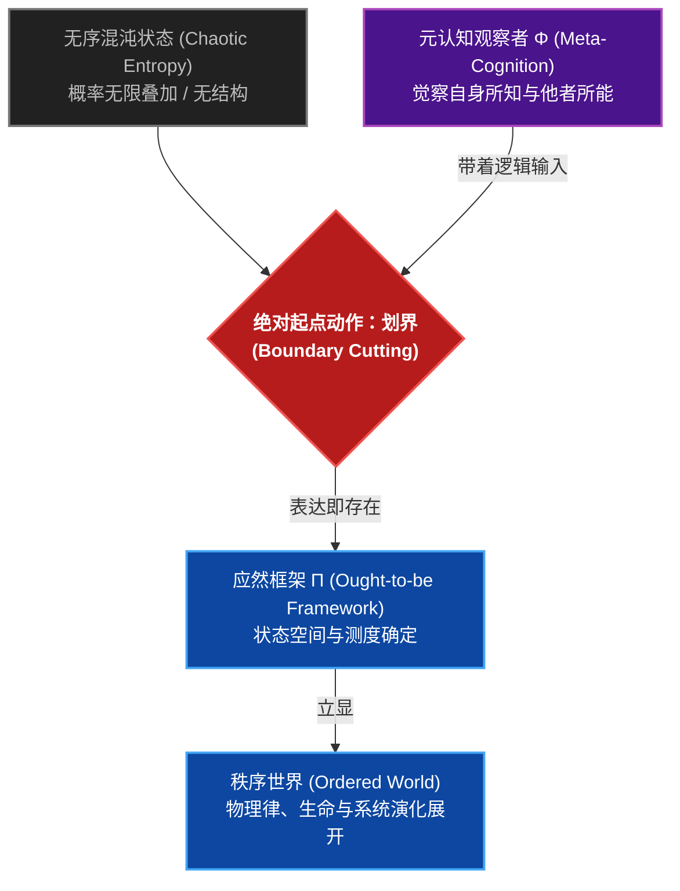

# 无观察者，则无世界：秩序的构建、存续与进化

> **“无观察者，则无世界。混沌一经观察，即立显为世界。物理之上，世界即秩序。”**  
> —— 孟凡淳（Grit Meng）《系统与复杂性科学：秩序的构建、存续与进化》

---

## 一、 认知困局：为什么现代科学与 AI 正在集体撞墙？

为什么传统物理学在解释生命与社会演化时屡屡失效？  
为什么占据当今算力巅峰的大语言模型与 AI 依然无法摆脱“幻觉”与盲目熵增？  
为什么过去百年的系统科学流于抽象陈词，始终无法进入主流基础科学的最高殿堂？

答案只有一个：**它们抹杀了“观察者”，丢失了“秩序”的第一性原理。**

传统物理学试图寻找一个“脱离观察者、客观中立”的机械宇宙；现代 AI 试图在无尽的数据海量中寻找统计规律，却不知道自己为何而计算；而传统系统科学因为缺乏数学公理与硬核算符，无法下沉落地。

今天，我们必须打破所有学科的藩篱与自嗨陷阱，重新审视这个世界的底层逻辑。

---

## 二、 破局第一性原理：无观察者，则无世界

表达即存在，划界即秩序诞生。

在没有观察者之前，宇宙只是处于无限概率叠加的无序混沌状态。任何秩序的诞生，都源于绝对起点动作——**划界（Boundary Cutting）**。

### 定义一：观察者与划界
* **无观察者，则无世界**：在无序混沌中，知晓自身之所知、知晓他者之所能的智能主体，称为**观察者（即元认知 $\Phi$）**。
* **识与知**：识者，划界建立之应然模型（一阶认知 $\Pi$）；知者，觉察自身并审视所识之二阶觉知（元认知 $\Phi$）。
* **划界（Boundary Cutting）**：观察者带着逻辑进入世界，做出绝对起点动作——划界。表达即存在，划界即秩序诞生。

这一划界公理，一举完成了人类思想史上最震撼的大一统：
* **老子的哲学密码**：“无名天地之始，有名万物之母” —— “无名”即未划界的混沌，“有名”即元认知划界立框架；
* **唯识宗的认知跃迁**：“转识成智” —— 一阶认知模型向二阶元觉知的升维；
* **维特根斯坦的语言边界**：“语言的边界即世界的边界” —— 应然框架决定了可计算的状态空间；
* **基础物理学与现代 AI 的终极桥梁** —— 将观察者的意图、抗熵耗散与智能计算，彻底收敛于硬核代数算符！

---

## 三、 从抽象哲学到硬核物理：八大宪法与五维心智

划界之后，秩序如何维持与进化？

本理论脱离了对传统物理学公理的机械借用，确立了掌控一切复杂世界的**八大物理宪法**与**具身五维心智**：

1. **架构逻辑一致性（Decoder 机制）**：解决系统在复杂状态空间中的逻辑坍缩与相干性消失问题；
2. **全息抗熵律（Holographic Anti-Entropy）**：明确系统必须建立全息边界，向环境耗散熵、吸收负熵，才能抵御热力学死寂；
3. **涌现与临界相变律**：精确计算微观协同密度突破临界点时的宏观非线性跃迁；
4. **具身五维心智**：将**空间、时间、信息、能量、元认知**五维统一在一个算符矩阵下，为真正的通用人工智能（AGI）与具身智能提供理论宪法。

---

## 四、 22年工业重力场实证：这不是空想，这是律令

本理论不是象牙塔里的推演，而是经受过宏观现实重力场客观检验的“判决性科学”：

在涵盖全球超大规模 supply network（如 TCL、Lenovo 等）的 22 年实证中，496 个代数算符完美解释并预测了系统的生存与坍塌——**系统的成败并非随机的管理概率，而是严格收敛于物理学的客观底层律令。**

从航天工程的复杂度控制，到计算生物学的基因调控，再到智能交通与 Swarm AI 的动态收敛，秩序的第一性原理展现出统治级的普适性。

---

## 结语：一场全人类认知范式的重构

我们不再满足于在传统学科的框架下修修补补。

预印本已在 GitHub 与 arXiv 节点公开发布（DOI: `10.5281/zenodo.21467701`）。

不论你是物理学者、AI 科学家、哲学探索者，还是复杂工程的驾驭者：
**在一个充满无序与熵增的世界里，秩序不是被发现的，秩序是被观察者划界建构的！**

欢迎全球智者共同审阅、对质与实证！

---
*作者：孟凡淳（Grit Meng） | 2026年7月25日*  
*开源仓库：https://github.com/GritMeng/Value-Chain-Physics*
